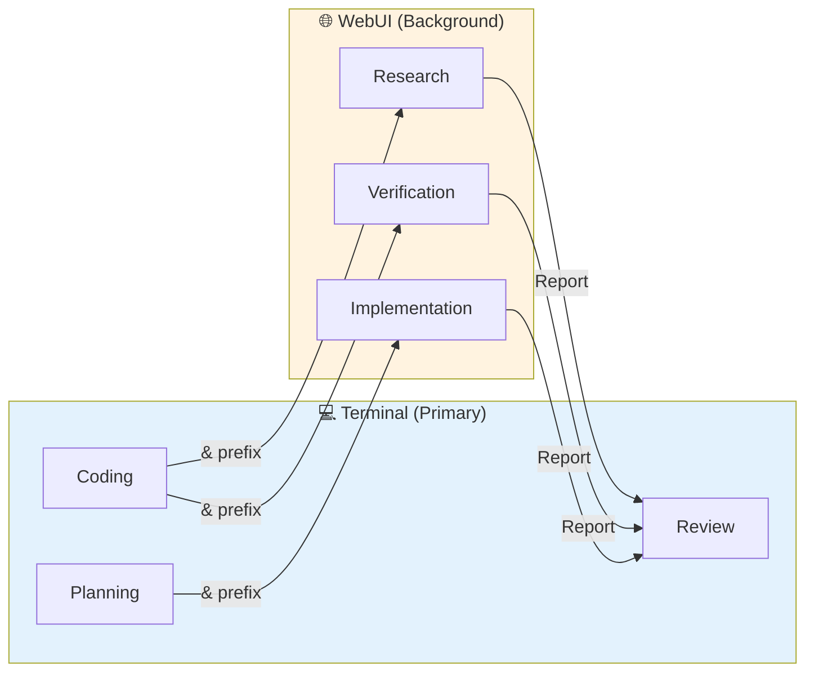
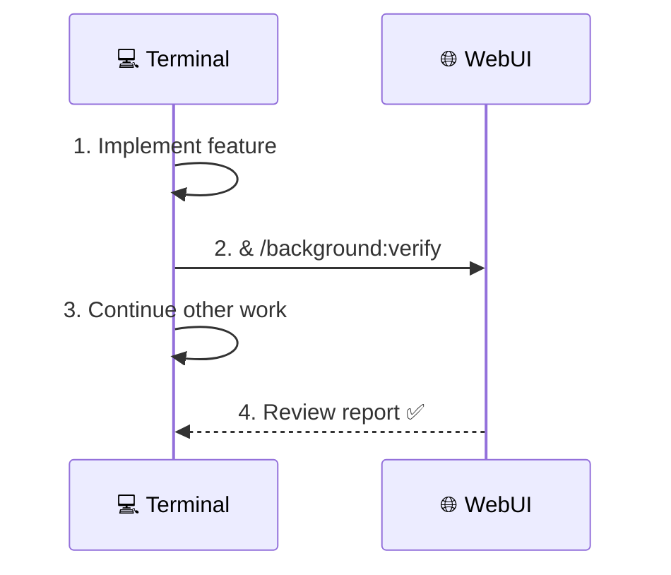
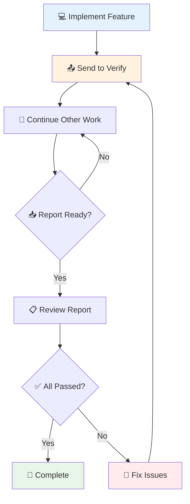
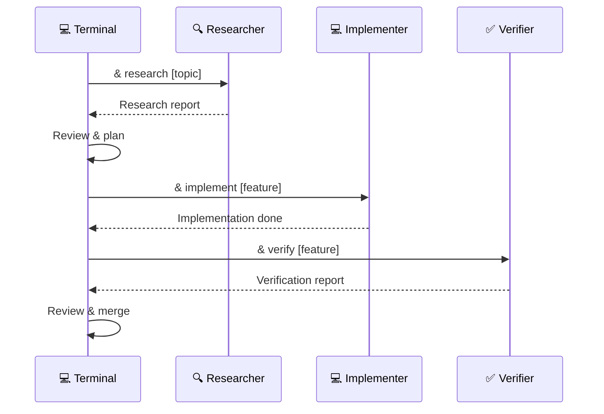
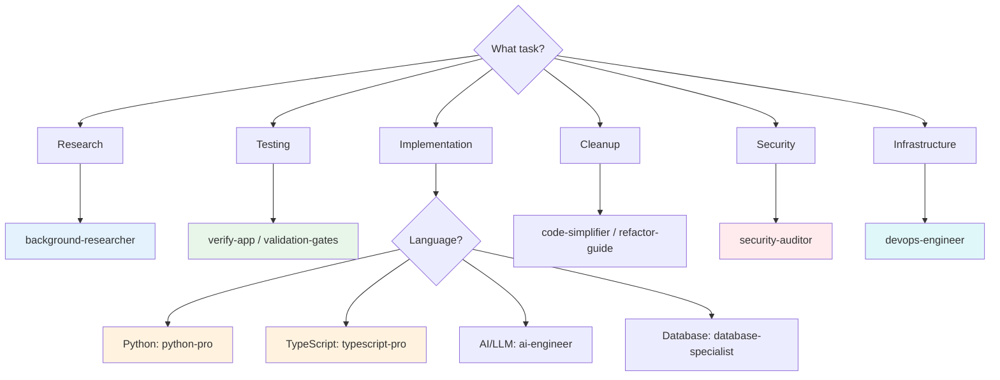
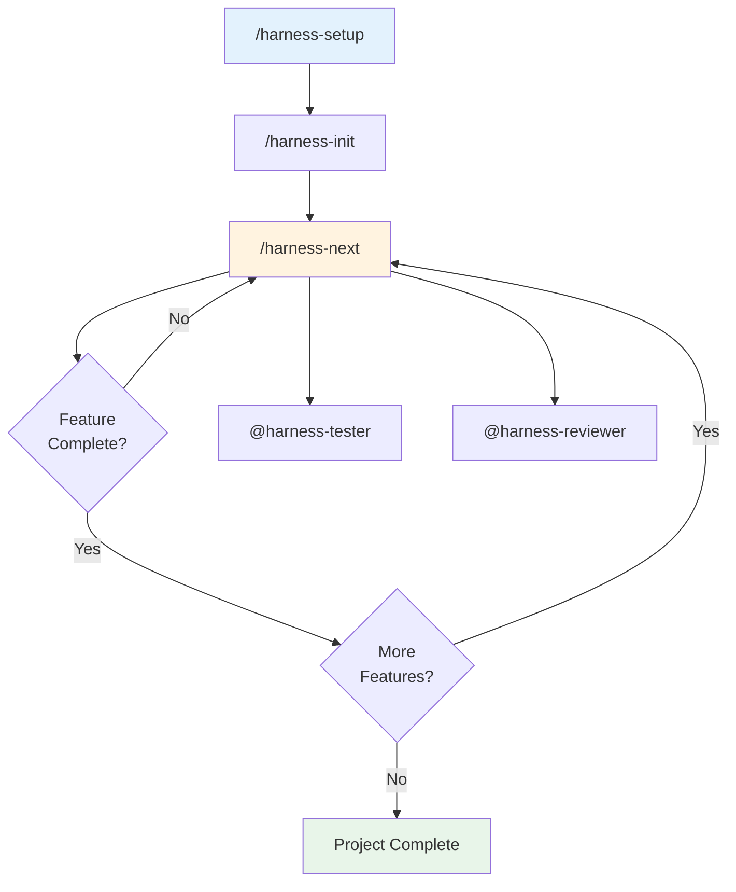
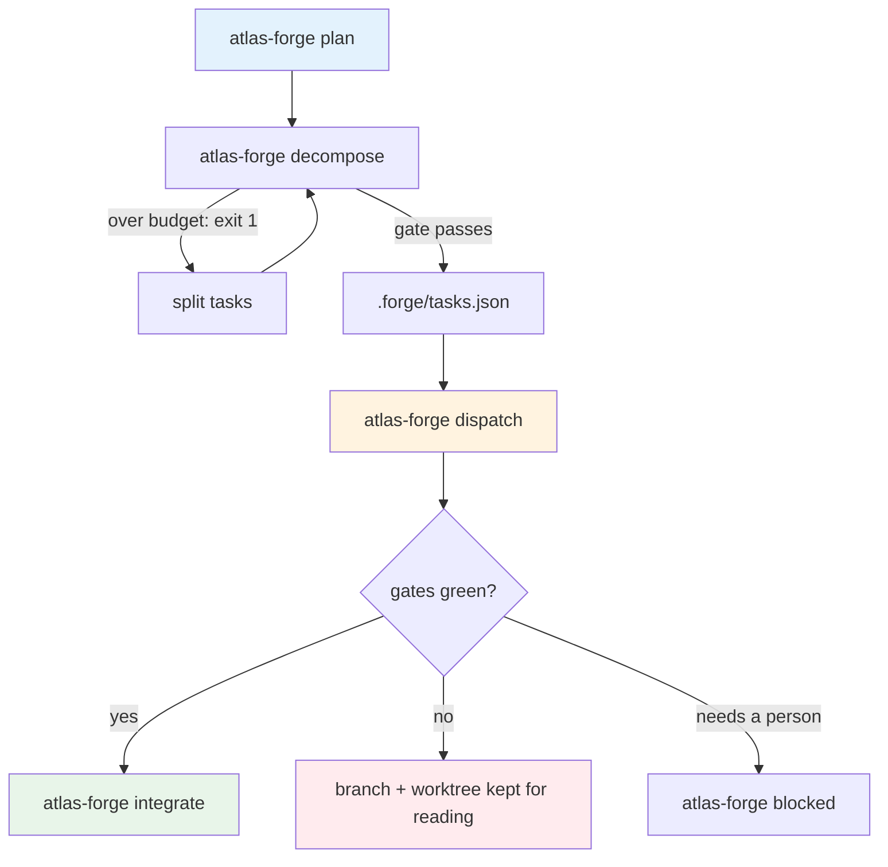
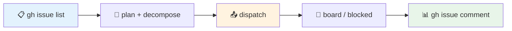

[Home](../README.md) > [.github](./) > Background Workflow

# 🔄 Background Agent Workflow

> **Last Updated**: 2025-01-22 | **Version**: 2.0  
> **Status**: ✅ Final | **Based On**: Boris Cherny's Multi-Agent Pattern

---

## 📑 Table of Contents

- [Overview](#-overview)
- [Quick Start](#-quick-start)
- [Available Commands](#-available-commands)
- [Workflow Patterns](#-workflow-patterns)
- [Agent Inventory](#-agent-inventory)
- [Best Practices](#-best-practices)
- [Autonomous Agent Harness Integration](#-autonomous-agent-harness-integration)
- [Multi-Task Orchestration](#-multi-task-orchestration)
- [Task Tracking](#-task-tracking)
- [Troubleshooting](#-troubleshooting)
- [Related Documents](#-related-documents)

---

## 🎯 Overview

This workflow enables running multiple Copilot instances in parallel for maximum productivity:



### Key Benefits

| Benefit                    | Description                                      |
| -------------------------- | ------------------------------------------------ |
| ⚡ **Parallel Work**       | Multiple tasks running simultaneously            |
| 🔄 **Verification Loops**  | 2-3x quality improvement with feedback           |
| 🧠 **Focused Roles**       | Planners plan, implementers code, verifiers test |
| 📊 **Background Research** | Deep research without blocking your workflow     |

---

## 🚀 Quick Start

### Send to Background

Use the `&` prefix to send any prompt to run in the WebUI background:

```bash
# Basic syntax
& [your prompt here]

# Examples
& Research the best approach for implementing OAuth 2.0 with PKCE

& /background:verify the authentication flow

& /background:implement the user dashboard component
```

### Workflow in 4 Steps



1. **Implement** feature in terminal
2. **Send** verification to background with `&`
3. **Continue** working on other tasks
4. **Review** background report when ready

---

## 📋 Available Commands

### Background Commands

| Command                             | Purpose                  | Agent                   |
| ----------------------------------- | ------------------------ | ----------------------- |
| `& /background:research [topic]`    | Deep research tasks      | `background-researcher` |
| `& /background:verify [target]`     | Testing and validation   | `verify-app`            |
| `& /background:implement [feature]` | Code implementation      | `python-pro`            |
| `& /background:simplify [path]`     | Code cleanup/refactoring | `code-simplifier`       |

### Command Examples

<details>
<summary>🔍 <strong>Research Examples</strong></summary>

```bash
# Technology research
& /background:research best practices for GraphQL API design

# Documentation research
& /background:research React Server Components patterns

# Architecture research
& /background:research microservices vs monolith tradeoffs for our scale
```

</details>

<details>
<summary>✅ <strong>Verification Examples</strong></summary>

```bash
# Test a specific feature
& /background:verify the login flow handles all edge cases

# Run comprehensive tests
& /background:verify all API endpoints return correct status codes

# Check for regressions
& /background:verify no breaking changes in the auth module
```

</details>

<details>
<summary>💻 <strong>Implementation Examples</strong></summary>

```bash
# Implement a component
& /background:implement a reusable data table component with sorting

# Add a feature
& /background:implement email verification flow

# Create utilities
& /background:implement date formatting utilities following project patterns
```

</details>

<details>
<summary>🧹 <strong>Simplification Examples</strong></summary>

```bash
# Clean up a specific file
& /background:simplify src/services/authService.ts

# Refactor a module
& /background:simplify the API error handling across all endpoints

# Remove duplication
& /background:simplify extract common patterns from components/forms/*
```

</details>

---

## 🔄 Workflow Patterns

### Pattern 1: Implementation + Verification Loop

The most common and effective pattern:



**Terminal Flow:**

```bash
# 1. Implement feature
# ... code the feature ...

# 2. Send for verification
& /background:verify the new user registration feature

# 3. Continue with other work
# ... work on documentation, other features ...

# 4. Review when ready
# ... check WebUI for report ...

# 5. Fix any issues and re-verify
& /background:verify user registration after fixing validation
```

### Pattern 2: Planning + Parallel Implementation

For larger features, plan first then parallelize:

```
┌─────────────────────────────────────────────────────────────┐
│ 💻 Terminal                                                  │
│                                                              │
│ 1. Plan feature (Plan mode: Shift+Tab twice)                │
│ 2. Break into subtasks                                       │
│ 3. & /background:implement subtask 1  ──────────────────┐   │
│ 4. & /background:implement subtask 2  ───────────────┐  │   │
│ 5. Implement subtask 3 locally                       │  │   │
│                                                      │  │   │
└──────────────────────────────────────────────────────│──│───┘
                                                       │  │
┌──────────────────────────────────────────────────────│──│───┐
│ 🌐 WebUI Tab 1                                       │  │   │
│ Working on subtask 1...                         ◄────┘  │   │
└─────────────────────────────────────────────────────────│───┘
                                                          │
┌─────────────────────────────────────────────────────────│───┐
│ 🌐 WebUI Tab 2                                          │   │
│ Working on subtask 2...                         ◄───────┘   │
└─────────────────────────────────────────────────────────────┘
```

### Pattern 3: Research → Implement → Verify

Full development cycle using background agents:



**Example Flow:**

```bash
# 1. Research first
& /background:research OAuth 2.0 PKCE implementation best practices

# 2. Review research report, then implement
& /background:implement OAuth PKCE flow based on research findings

# 3. Verify implementation
& /background:verify OAuth flow handles all auth scenarios

# 4. Review and merge
# ... check reports, make final adjustments ...
```

---

## 🤖 Agent Inventory

### Background-Optimized Agents

These agents work well in background mode:

| Agent                   | Specialty         | Best For                                |
| ----------------------- | ----------------- | --------------------------------------- |
| `background-researcher` | 🔍 Deep research  | Technology evaluation, documentation    |
| `verify-app`            | ✅ Testing & QA   | Comprehensive validation, edge cases    |
| `code-simplifier`       | 🧹 Refactoring    | Cleanup, reducing complexity            |
| `validation-gates`      | 🚦 Quality gates  | Full test suites, CI validation         |
| `python-pro`            | 🐍 Python expert  | Python implementation tasks             |
| `typescript-pro`        | 📘 TypeScript     | React, Node.js, frontend development    |
| `devops-engineer`       | 🐳 Infrastructure | Docker, CI/CD, deployment               |
| `database-specialist`   | 🗄️ Database       | SQL optimization, schema design         |
| `security-auditor`      | 🔐 Security       | Vulnerability scanning, security review |

### Interactive Agents (Terminal)

These agents need discussion and should run in terminal:

| Agent                   | Specialty       | Why Not Background             |
| ----------------------- | --------------- | ------------------------------ |
| `documentation-manager` | 📝 Docs         | Needs review of changes        |
| `architect-reviewer`    | 🏗️ Architecture | Needs discussion               |
| `mermaid-expert`        | 📊 Diagrams     | Visual review needed           |
| `code-reviewer`         | 👀 Code Review  | Interactive feedback           |
| `refactor-guide`        | ♻️ Refactoring  | Requires incremental decisions |

### Full Agent Catalog

<details>
<summary>📋 <strong>View All 20 Agents</strong></summary>

| Agent                   | Category        | Description                               |
| ----------------------- | --------------- | ----------------------------------------- |
| `ai-engineer`           | 🤖 AI/ML        | LLM apps, RAG systems, prompt engineering |
| `api-documenter`        | 📚 Docs         | OpenAPI specs, SDK generation             |
| `architect-reviewer`    | 🏗️ Architecture | Architectural consistency review          |
| `background-researcher` | 🔍 Research     | Deep technology research                  |
| `code-reviewer`         | 👀 Quality      | PR reviews, code quality feedback         |
| `code-simplifier`       | 🧹 Quality      | Complexity reduction, cleanup             |
| `data-engineer`         | 📊 Data         | ETL pipelines, data warehousing           |
| `database-specialist`   | 🗄️ Data         | SQL optimization, schema design           |
| `devops-engineer`       | 🐳 DevOps       | Docker, CI/CD, infrastructure             |
| `docs-architect`        | 📚 Docs         | Long-form technical documentation         |
| `documentation-manager` | 📝 Docs         | Documentation updates, README             |
| `mermaid-expert`        | 📊 Diagrams     | Mermaid diagram creation                  |
| `python-pro`            | 🐍 Language     | Python development, optimization          |
| `reference-builder`     | 📚 Docs         | API references, configuration guides      |
| `refactor-guide`        | ♻️ Quality      | Legacy code modernization                 |
| `search-specialist`     | 🔍 Research     | Web research, fact-checking               |
| `security-auditor`      | 🔐 Security     | Vulnerability assessment                  |
| `typescript-pro`        | 📘 Language     | TypeScript/React development              |
| `validation-gates`      | 🚦 Quality      | Test execution, quality checks            |
| `verify-app`            | ✅ Quality      | Application verification                  |

</details>

### Agent Selection Guide



---

## 💡 Best Practices

### From Boris Cherny's Workflow

| Principle                        | Description                                                        |
| -------------------------------- | ------------------------------------------------------------------ |
| 🎭 **Role Assignment**           | Planners discuss strategy, Implementers write code, Verifiers test |
| 🔄 **Verification Loops**        | "With feedback loops, quality improves 2-3x"                       |
| 📝 **Document Mistakes**         | When Copilot errs, add fix to `copilot-instructions.md`            |
| ⚡ **Plan Mode First**           | `Shift+Tab` twice for planning before implementation               |
| 🔐 **Pre-configure Permissions** | Use `/permissions` for safe commands                               |

### Permission Configuration

Pre-allow safe commands to reduce interruptions:

```bash
/permissions add "Bash(npm:*)" "Bash(pytest:*)" "Bash(docker:*)"
```

### Handoff Message Format

When tasks complete, structure the report:

```markdown
## ✅ TASK COMPLETE

**Type**: [Research/Implementation/Verification]  
**Status**: Complete | Partial | Blocked  
**Duration**: [Time]

### Summary

One-line summary of what was accomplished.

### Key Findings/Output

- Finding 1
- Finding 2
- Finding 3

### Next Steps

1. Recommended action 1
2. Recommended action 2

### Handoff To

Terminal / Another Agent / Human Review
```

### Quality Checklist

Before sending to background:

- [ ] Clear, specific prompt
- [ ] Defined scope (not too broad)
- [ ] Expected output format specified
- [ ] Dependencies available (files, access)

---

## 🤖 Autonomous Agent Harness Integration

For long-running, multi-session development projects, use the **Autonomous Agent Harness**:



### Harness Commands

| Command | Description |
|---------|-------------|
| `/harness-setup` | Launch full setup wizard |
| `/harness-quick` | Quick setup with defaults |
| `/harness-init` | Initialize (first session) |
| `/harness-next` | Start coding session |
| `/harness-status` | Check project status |
| `/harness-resume` | Resume existing project |

### Harness Agents

| Agent | Purpose | Invocation |
|-------|---------|------------|
| `@harness-wizard` | Setup and configuration | Via `/harness-setup` |
| `@harness-initializer` | Generate tasks from spec | Via `/harness-init` |
| `@harness-coder` | Implement features | Via `/harness-next` |
| `@harness-tester` | Testing and verification | `& @harness-tester verify [feature]` |
| `@harness-reviewer` | Code review | `& @harness-reviewer check [feature]` |

### Background Harness Execution

Run harness sessions in background:

```bash
# Run coding session in background
& /harness-next

# Run testing in parallel with coding
& @harness-tester verify "User Authentication"

# Get code review in parallel
& @harness-reviewer check "API endpoints"
```

### Harness State Management

Harness state lives on disk under `.forge/`, and durable cross-session work
items live in GitHub issues. There is no external task-management service.

```bash
atlas-forge board --json      # the task graph as columns
atlas-forge status --json     # this workspace's newest session
gh issue list --state open    # durable work items
```

Raw state, if you need it: `.forge/dispatch-progress.json` (wave counters,
in-flight tasks, spend), `.forge/runs/` (per-run records), `.forge/evidence/`
(what each settled task proved).

For complete harness documentation, see:
- [ATLAS FORGE orchestration](./FORGE_ORCHESTRATION.md) — the verified command surface
- [Autonomous Agent Harness Skill](.github/skills/autonomous-agent-harness/README.md)

---

## 🔄 Multi-Task Orchestration

For work spanning more tasks than one session can hold, use the shipped ATLAS
FORGE pipeline. The full verified command and flag surface is
[ATLAS FORGE orchestration](./FORGE_ORCHESTRATION.md) — read it before running
anything, and never use a flag it has not verified.

> **What this replaces.** This section used to describe a "Ralph Wiggum loop"
> whose state lived in an Archon MCP server. Archon is not running and not
> installed, and **the loop had no runner behind it** — nothing shipped could
> execute an iteration, which is why every attempt to start one went in circles.
> The `/ralph-*` commands still exist as aliases, but they now drive the
> pipeline below.



### How it actually works

- `plan` runs **read-only**. Use `--dry-run` and read the plan before saving it.
- `decompose` is a **gate, not a report**. Any task over the diff-line budget
  exits 1, is named with how many pieces it needs, and the oversized plan is not
  written to disk. Never raise `--budget` to make it pass.
- `dispatch` gives every task its own worktree on `forge/<task-id>`, its own
  agent, and **the full gate suite**. A task whose gates are red is red, because
  the next thing that happens to its branch is a merge into everything else.
- A failed task **keeps its worktree** so the work is still there to read.
- `integrate` re-checks the real diff sizes with `git diff --numstat`, which is
  the half of the budget check the planner's own estimate cannot talk past.

### Commands

| Action | Command |
|---|---|
| Plan a change (read-only) | `atlas-forge plan "<goal>" --dry-run` |
| Gate task sizes | `atlas-forge decompose` |
| Preview the waves | `atlas-forge dispatch --dry-run` |
| Run one wave | `atlas-forge dispatch --wave 1` |
| Run everything | `atlas-forge dispatch` |
| Follow a live run | `atlas-forge watch` |
| See the board | `atlas-forge board` |
| Stop at a wave boundary | `atlas-forge pause` |
| Stop now, no auto-resume | `atlas-forge cancel` |
| Merge finished branches | `atlas-forge integrate --branch <name>` |

### Unattended drain

| Action | Command |
|---|---|
| One bounded cycle | `atlas-forge factory tick` |
| Drain until done or halted | `atlas-forge factory run` |
| Landed commits + supervisor liveness | `atlas-forge factory status` |
| Stop the drain | `atlas-forge factory halt --reason "<why>"` |
| Undo the halt | `atlas-forge factory resume` |
| Return stale `doing` rows to `todo` | `atlas-forge factory requeue` |

### Framework entry points

```bash
/ralph-start                          # build a task graph from a goal
/ralph-iterate                        # run one wave
/ralph-status                         # read-only status
/ralph-cancel                         # stop without destroying work
/harness-ralph                        # bounded native-tool cycle
/speckit-ralph specs/123-feature/spec.md   # spec -> task graph
/prp-ralph PRPs/plans/feature.plan.md      # PRP plan -> task graph
```

### Things that are NOT true

- **There is no `--max-iterations`, no `completion_promise`, and no
  `.ralph/config.json`.** A task settles when its gates pass, not when a phrase
  appears. Bound a run with `--wave`, `--parallel`, `--max-usd`, `--task-usd`,
  `--task-minutes` (default 90), or `--phase`.
- **`scripts/backlog_to_dag.py` is not shipped in this repository.** It is the
  atlas-forge repo's own parser for its own markdown conventions. Only `plan`
  and `decompose` write `.forge/tasks.json`.
- **`0 tasks in 0 waves`** from `dispatch --dry-run` means `.forge/tasks.json`
  has not been written. `board` calls that `status: ok` / `no tasks`;
  `dispatch --dry-run` returns `ok: false`, `status: "error"` and **exit 1**
  for the same state. Read that exit 1 as "no graph built yet", not as
  "dispatch is broken".
- **`board`'s `ok` means the file could be read.** It is not a build verdict.
- **`factory status` reports landed commits and supervisor liveness
  separately.** They can disagree. Report both; infer neither from the other.

---

## 🔗 Task Tracking

Durable, cross-session work items live in **GitHub issues**. Execution state
lives in `.forge/` on disk. There is no external task-management service.



```bash
# 1. Before starting - what is open?
gh issue list --state open
gh pr list --state open

# 2. Where do the task graph and the issues disagree?
atlas-forge issues --json

# 3. Do the work
atlas-forge dispatch --wave 1

# 4. What needs a person, and what exactly are they being asked?
atlas-forge blocked --json

# 5. Record the handoff on the issue itself
gh issue comment <n> --body "<branch, commit, commands run, results, next action>"
```

Reuse existing issues rather than duplicating them. If `gh` is unavailable,
report inventory reconciliation as **blocked** rather than guessing.

### Safety rules for this repository

1. **The working tree is dirty and the dirt is real work.** `dispatch` and
   `factory` branch from `HEAD` and merge finished branches back; a drain over a
   dirty tree interleaves unreviewed work with generated work. Triage first.
2. **Never `git checkout --`, `git restore`, `git clean`, or `git stash`.** The
   stash stack is shared across worktrees on this machine and other sessions pop
   it.
3. **There are three worktrees**, one with an in-progress merge. Leave worktrees
   you did not create alone.
4. **Do not commit or push** unless the current task explicitly authorises it.
5. **A prompt being read is not a runner being started.** Report what
   `factory status` / `watch` / `board` actually printed.

---

## 🔧 Troubleshooting

### Common Issues

<details>
<summary>❌ <strong>Background task not starting</strong></summary>

**Symptoms**: Command sent but no activity in WebUI

**Solutions**:

1. Verify WebUI is open and logged in
2. Check if the `&` prefix was included
3. Try refreshing the WebUI session
4. Use explicit agent: `& @background-researcher [prompt]`

</details>

<details>
<summary>❌ <strong>Session context lost</strong></summary>

**Symptoms**: Background agent doesn't have needed context

**Solutions**:

1. Include relevant file paths in prompt
2. Reference specific functions/classes by name
3. Provide brief context summary in prompt
4. Use `--continue` to resume previous session

</details>

<details>
<summary>❌ <strong>Agent making wrong assumptions</strong></summary>

**Symptoms**: Implementation doesn't match project patterns

**Solutions**:

1. Reference similar existing code in prompt
2. Update `copilot-instructions.md` with patterns
3. Include specific requirements/constraints
4. Use research phase first to establish context

</details>

### Session Management

```bash
# Check what's running
/tasks

# See agent status
/agents

# Continue previous session
--continue
```

---

## 🔗 Related Documents

| Document                                             | Description                |
| ---------------------------------------------------- | -------------------------- |
| [copilot-instructions.md](./copilot-instructions.md) | Main Copilot configuration |
| [style-guide.md](../docs/style-guide.md)             | Documentation standards    |
| [agents/](./agents/)                                 | Agent definition files     |
| [Harness Skill](./skills/autonomous-agent-harness/)  | Autonomous agent harness   |

---

## 📌 Quick Reference Card

### Essential Commands

| Action             | Command                             |
| ------------------ | ----------------------------------- |
| Send to background | `& [prompt]`                        |
| Research           | `& /background:research [topic]`    |
| Verify             | `& /background:verify [target]`     |
| Implement          | `& /background:implement [feature]` |
| Simplify           | `& /background:simplify [path]`     |
| Plan mode          | `Shift+Tab` (twice)                 |
| Add permissions    | `/permissions add "pattern"`        |

### Harness Commands (Long-Running Projects)

| Action           | Command                              |
| ---------------- | ------------------------------------ |
| Setup harness    | `/harness-setup`                     |
| Quick setup      | `/harness-quick`                     |
| Initialize       | `/harness-init`                      |
| Next session     | `/harness-next`                      |
| Check status     | `/harness-status`                    |
| Resume project   | `/harness-resume`                    |
| Test feature     | `& @harness-tester verify [feature]` |
| Review code      | `& @harness-reviewer check [feature]`|

### Orchestration Commands (Multi-Task Runs)

| Action                      | Command                                       |
| --------------------------- | --------------------------------------------- |
| Plan (read-only)            | `atlas-forge plan "<goal>" --dry-run`         |
| Gate task sizes             | `atlas-forge decompose`                       |
| Preview waves               | `atlas-forge dispatch --dry-run`              |
| Run one wave                | `atlas-forge dispatch --wave 1`               |
| Follow a live run           | `atlas-forge watch`                           |
| See the board               | `atlas-forge board`                           |
| Stop at a wave boundary     | `atlas-forge pause`                           |
| Stop now                    | `atlas-forge cancel`                          |
| Merge finished branches     | `atlas-forge integrate --branch <name>`       |
| Unattended drain            | `atlas-forge factory run`                     |
| Drain status                | `atlas-forge factory status`                  |
| Stop the drain              | `atlas-forge factory halt --reason "<why>"`   |
| Build a graph from a goal   | `/ralph-start`                                |
| Run one wave (alias)        | `/ralph-iterate`                              |
| Status (read-only)          | `/ralph-status`                               |
| Stop without losing work    | `/ralph-cancel`                               |
| Spec → task graph           | `/speckit-ralph [spec-path]`                  |
| PRP plan → task graph       | `/prp-ralph [plan-path]`                      |

> No `--max-iterations` and no background `& /ralph-loop`: a task settles when
> its gates pass. Bound runs with `--wave`, `--parallel`, `--max-usd`,
> `--task-usd`, `--task-minutes`. See
> [ATLAS FORGE orchestration](./FORGE_ORCHESTRATION.md).

### Agent Quick Reference

| Agent                   | Icon | Use For  |
| ----------------------- | ---- | -------- |
| `background-researcher` | 🔍   | Research |
| `verify-app`            | ✅   | Testing  |
| `code-simplifier`       | 🧹   | Cleanup  |
| `python-pro`            | 🐍   | Python   |
| `validation-gates`      | 🚦   | Full QA  |
| `harness-coder`         | 🤖   | Long-running development |
| `harness-tester`        | 🧪   | Harness testing |
| `harness-reviewer`      | 👀   | Harness review |
| `ralph-wizard`          | 🔄   | Build a task graph (plan + decompose) |
| `ralph-loop`            | ♾️   | Bounded implementation cycle |
| `ralph-monitor`         | 📊   | Read-only run status |

---

[⬆️ Back to Top](#-background-agent-workflow) | [📚 Docs](../docs/) | [🏠 Home](../README.md)
