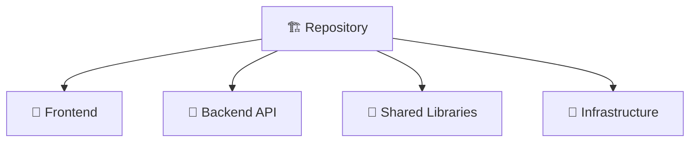

# Set Up Project Tracking

Establish where work is tracked for a codebase or solution.

> **There is no project-management service.** This prompt used to call
> `manage_project`, `manage_document`, `manage_task` and `find_projects` against
> an Archon MCP server. It is not running, not installed, and not the intended
> system. Durable work items are **GitHub issues**; the execution graph is
> **`.forge/tasks.json`**, written only by `atlas-forge plan` and
> `atlas-forge decompose`. See
> [ATLAS FORGE orchestration](../FORGE_ORCHESTRATION.md), and never use a
> command or flag that file has not verified.

## Standalone project (single codebase)

The repository is the project. Nothing separate needs creating.

```bash
gh repo view --json name,description,url
atlas-forge init          # scaffolds .forge/; surveys before it writes
```

`atlas-forge init` verified options: `--yes`/`-y`,
`--workspace`/`--no-workspace`, `--repo`. **It does not create tasks.**

## Solution with several components (monorepo)



Components become **labels**, and phases of work become **milestones**. This
keeps one queryable backlog instead of several that drift apart.

```bash
gh label create "area:frontend"       --color 1d76db --description "React frontend"
gh label create "area:api"            --color 0e8a16 --description "Backend REST API"
gh label create "area:infra"          --color 5319e7 --description "Docker, K8s, Terraform"
gh label create "area:shared"         --color fbca04 --description "Shared libraries"

gh api repos/{owner}/{repo}/milestones -f title="Phase 1 - Foundations" \
  -f description="<what must be true when this closes>"
```

## Initial setup

### 1. Where session context lives

Handoffs go on the GitHub issue they belong to, not in a separate memory
document:

```bash
gh issue comment <n> --body "<branch, commit, dirty paths, commands run and
their actual results, remaining acceptance criteria, blockers, next action>"
```

Standing architectural decisions go in the repository, under `docs/` or
`PRPs/`, where they are reviewable and versioned.

### 2. Seed the first work items

```bash
gh issue create --title "Project setup and configuration" \
  --body "Initial setup, dependencies, dev environment

## Acceptance criteria
- [ ] ..." --label "setup"

gh issue create --title "Define architecture and patterns" \
  --body "Document key architectural decisions

## Acceptance criteria
- [ ] ..." --label "documentation"
```

Give every item acceptance criteria. An item without them cannot be settled and
should not enter the execution graph.

### 3. Build the execution graph, when there is work to run

```bash
atlas-forge plan "<goal>" --dry-run   # read-only
atlas-forge decompose                 # a GATE: over-budget tasks exit 1
atlas-forge board                     # what the graph now says
atlas-forge issues                    # where the graph and the issues disagree
```

`decompose` is a gate, not a report: any task over the diff-line budget exits 1
and the oversized plan is not written. Split the task; never raise `--budget` to
make it pass.

## Naming

| Type            | Convention      | Example                           |
| --------------- | --------------- | --------------------------------- |
| **Repository**  | kebab-case      | `my-api-service`                  |
| **Area label**  | `area:<component>` | `area:frontend`, `area:api`    |
| **Milestone**   | Phase + outcome | `Phase 1 - Foundations`           |

## Querying

```bash
gh repo list <org> --limit 50
gh issue list --state open
gh issue list --state open --label "area:api"
gh issue list --milestone "Phase 1 - Foundations"
gh pr list --state open

atlas-forge board --json
atlas-forge blocked --json
```

## Arguments

{input}

If a name is provided, set up tracking for that codebase.
If no name, guide the user through it.
