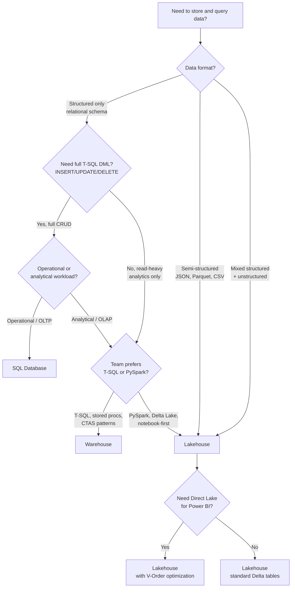
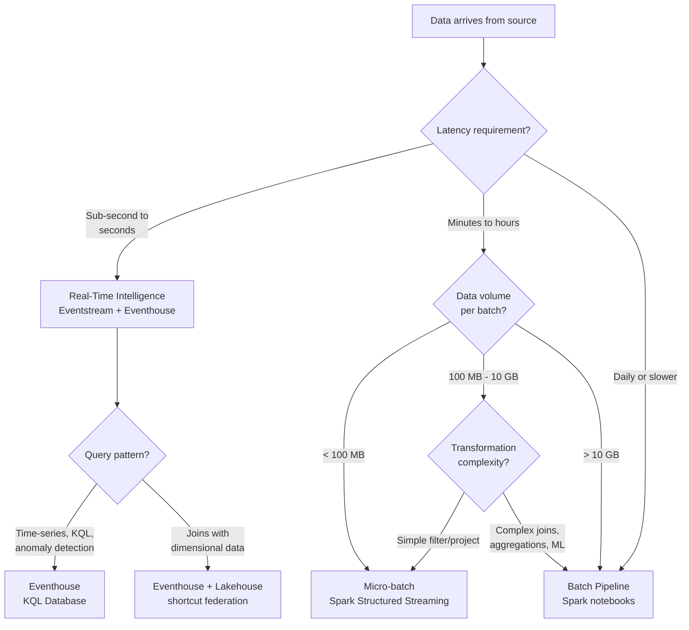
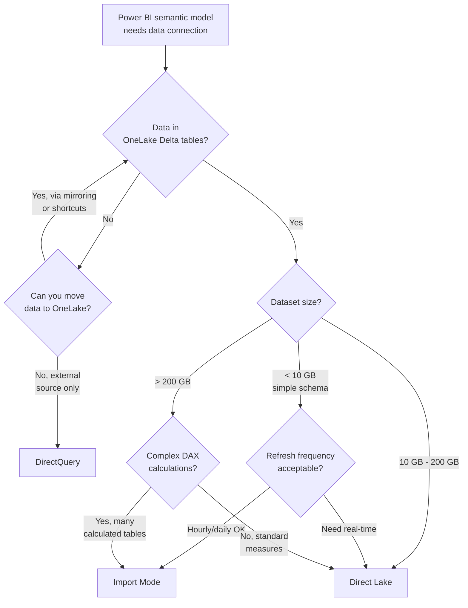
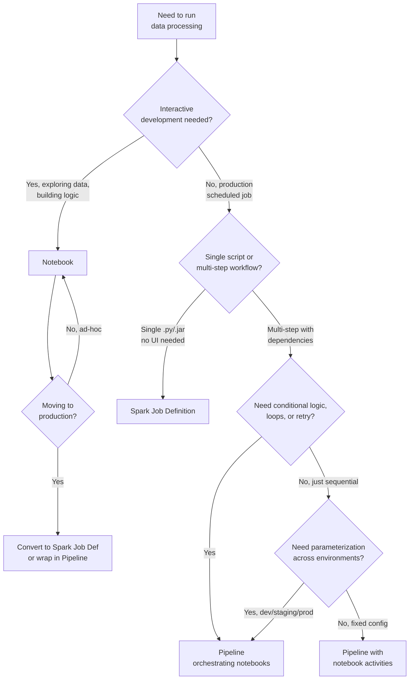
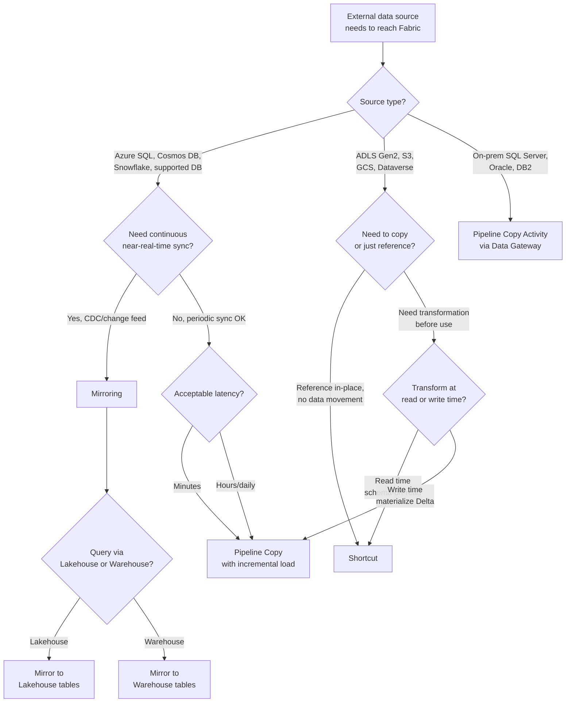
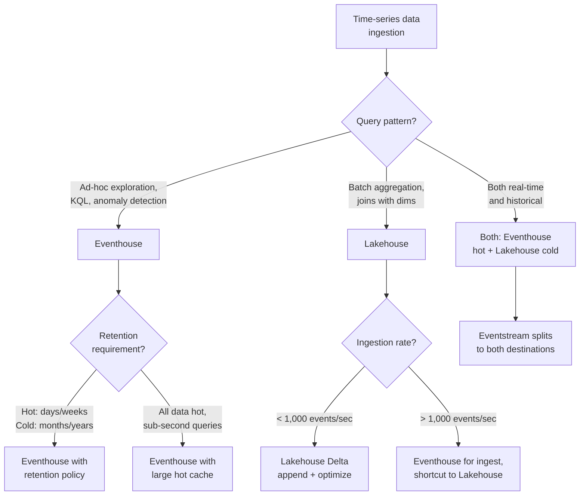
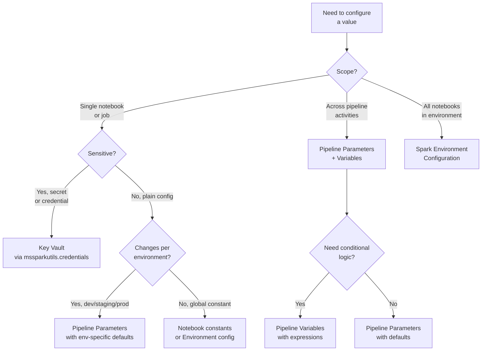
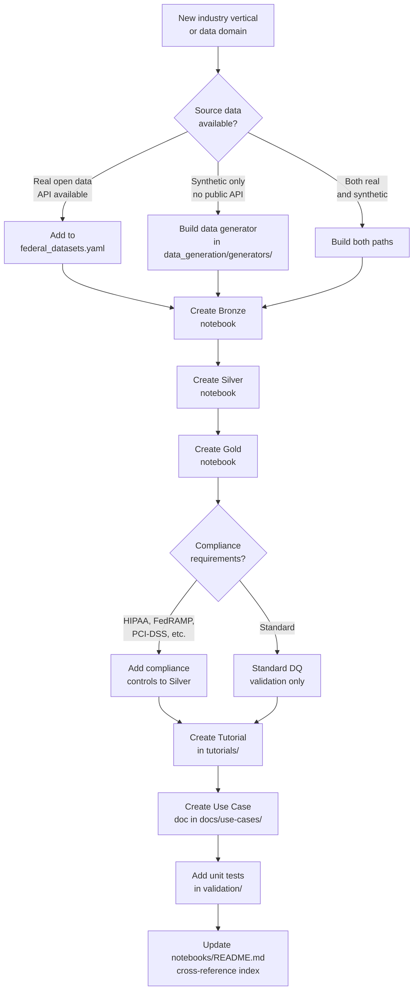
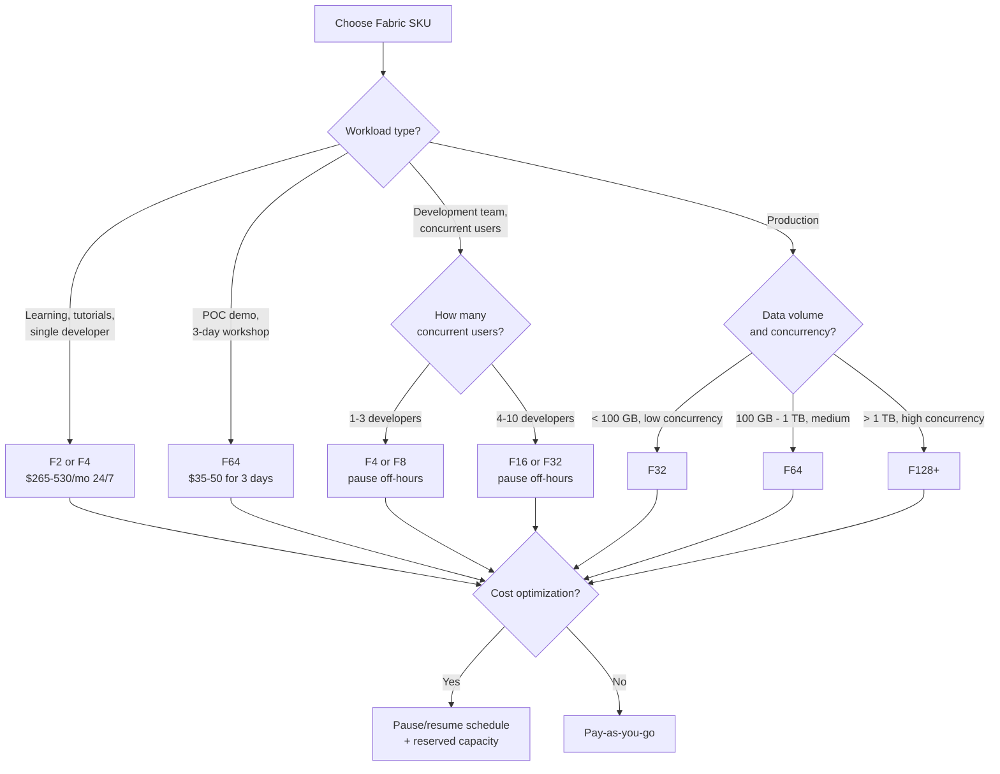
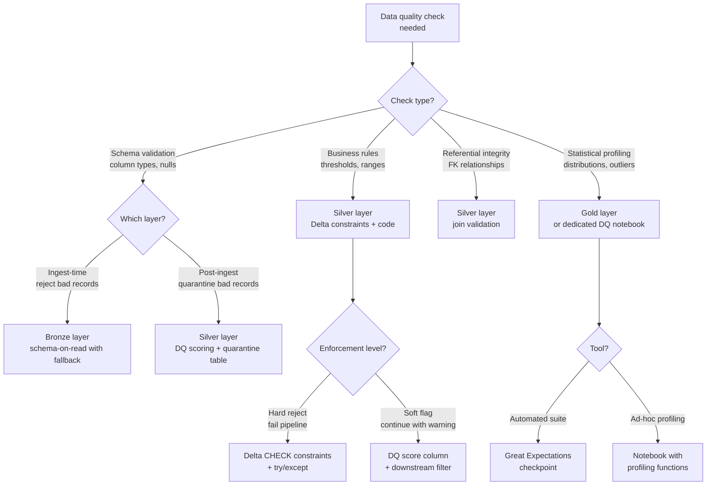

# Decision Trees: Choosing the Right Fabric Component

> [Home](index.md) > [Docs](./) > Decision Trees

> **Last Updated**: 2026-04-27 | **Version**: 1.0
> **Status**: Active | **Maintainer**: Architecture Team

This document provides structured decision flowcharts for the most common "which Fabric component should I use?" questions. Each section contains a Mermaid flowchart, a comparison table, a "Choose X when..." summary, and a real-world example drawn from the POC.

---

## Table of Contents

- [1. Lakehouse vs Warehouse vs SQL Database](#1-lakehouse-vs-warehouse-vs-sql-database)
- [2. Real-Time Intelligence vs Batch Processing](#2-real-time-intelligence-vs-batch-processing)
- [3. Direct Lake vs Import vs DirectQuery](#3-direct-lake-vs-import-vs-directquery)
- [4. Notebooks vs Spark Job Definitions vs Pipelines](#4-notebooks-vs-spark-job-definitions-vs-pipelines)
- [5. Mirroring vs Shortcuts vs Pipeline Copy](#5-mirroring-vs-shortcuts-vs-pipeline-copy)
- [6. Eventhouse vs Lakehouse for Time-Series](#6-eventhouse-vs-lakehouse-for-time-series)
- [7. Variable Libraries vs Pipeline Parameters vs Spark Config](#7-variable-libraries-vs-pipeline-parameters-vs-spark-config)
- [Cross-Reference: Related Docs](#cross-reference-related-docs)

---

## 1. Lakehouse vs Warehouse vs SQL Database

**When to use which analytical store in Fabric.**

### Comparison Table

| Capability | Lakehouse | Warehouse | SQL Database |
|---|---|---|---|
| **Engine** | Spark + SQL endpoint | T-SQL (Synapse DW) | Full SQL Server engine |
| **DML Support** | Delta Lake via Spark | T-SQL INSERT/UPDATE/DELETE | Full CRUD + stored procs |
| **Query Language** | PySpark, Spark SQL, SQL endpoint (read-only) | T-SQL | T-SQL |
| **Schema** | Schema-on-read or schema-on-write | Schema-on-write | Schema-on-write |
| **File Formats** | Parquet, CSV, JSON, Delta, Avro | Delta (managed) | Row-store + columnstore |
| **Direct Lake** | Native support | Via shortcuts | Via mirroring |
| **Best For** | Data engineering, ML, unstructured data | BI-centric analytics, T-SQL teams | Operational apps, OLTP, CDC |
| **Concurrency** | Medium | High | Very High |
| **Change Tracking** | Delta change data feed | N/A | Native CDC, change tracking |
| **Cost Profile** | CU consumption on Spark | CU consumption on SQL | CU consumption on SQL |

### Choose X When...

- **Choose Lakehouse** when your team works primarily in PySpark/Python, you need to process semi-structured data, or you want native Direct Lake connectivity for Power BI. This is the default choice for medallion architecture implementations.
- **Choose Warehouse** when your team has strong T-SQL skills, you need stored procedures and CTAS patterns, or you are migrating from Synapse Dedicated SQL Pool or traditional data warehouses.
- **Choose SQL Database** when you need a fully transactional store with OLTP capabilities, your application requires INSERT/UPDATE/DELETE from external apps, or you need built-in change tracking for downstream CDC.

### POC Example

This POC uses **Lakehouse** as the primary store for all medallion layers (`lh_bronze`, `lh_silver`, `lh_gold`). The choice was driven by the need to process diverse data formats (Parquet from data generators, JSON from streaming sources, CSV from federal open data downloads) and the PySpark-first notebook workflow. Direct Lake mode connects Gold tables directly to Power BI dashboards without data duplication.

See: [Lakehouse/Warehouse/SQL DB Decision Guide](best-practices/lakehouse-warehouse-sqldb-decision-guide.md) | [Decision Guide](best-practices/10_DECISION_GUIDE.md)

---

## 2. Real-Time Intelligence vs Batch Processing

**When to stream vs. when to batch.**

### Comparison Table

| Factor | Real-Time Intelligence | Micro-Batch | Full Batch |
|---|---|---|---|
| **Latency** | Sub-second to seconds | Seconds to minutes | Minutes to hours |
| **Ingestion** | Eventstream, Event Hub | Spark Structured Streaming | Spark batch read |
| **Query** | KQL | Spark SQL, PySpark | Spark SQL, PySpark, T-SQL |
| **Retention** | Hot cache (days) + cold (years) | Delta Lake | Delta Lake |
| **Cost** | Higher per-event | Medium | Lowest per-GB |
| **Complexity** | Moderate (KQL, update policies) | Low-Medium | Low |
| **Anomaly Detection** | Built-in (`series_decompose_anomalies`) | Custom ML model | Custom ML model |
| **Windowed Aggregations** | Native (`bin`, `make-series`) | Spark window functions | Spark window functions |

### Choose X When...

- **Choose Real-Time Intelligence** when you need sub-second alerting (slot machine malfunctions, security breaches), time-series analytics with KQL, or built-in anomaly detection. Cost is higher but justified when immediate action is required.
- **Choose Micro-Batch** when near-real-time (seconds to minutes) is sufficient, you want to land data directly into the Lakehouse Delta tables, and your transformations are simple enough for Structured Streaming.
- **Choose Full Batch** when daily or hourly freshness is acceptable, data volumes are large (>10 GB per run), or complex multi-table joins and ML model scoring are required.

### POC Example

The POC runs **both paths** for slot telemetry. The `01_realtime_slot_streaming.py` notebook feeds Eventstream data into the Eventhouse for sub-second casino floor monitoring (KQL queries in `02_kql_casino_floor.kql`). Simultaneously, batch notebooks (`01_bronze_slot_telemetry.py` through `01_gold_slot_performance.py`) process daily aggregations for historical trend analysis and Power BI dashboards.

See: [Real-Time Intelligence](features/real-time-intelligence.md) | [Streaming Notebooks](../notebooks/streaming/)

---

## 3. Direct Lake vs Import vs DirectQuery

**How should Power BI connect to your data?**

### Comparison Table

| Factor | Direct Lake | Import | DirectQuery |
|---|---|---|---|
| **Data Freshness** | Near-real-time (as Delta updates) | Stale (scheduled refresh) | Real-time (every query) |
| **Query Speed** | Fast (in-memory from Delta) | Fastest (fully cached) | Slowest (source query each time) |
| **Data Duplication** | None (reads OneLake directly) | Full copy in model | None |
| **Max Dataset Size** | Up to capacity memory | Up to capacity memory | Source-limited |
| **Refresh Required** | No (auto-sync on Delta change) | Yes (scheduled) | No |
| **DAX Support** | Most functions (fallback to DQ for unsupported) | Full DAX | Full DAX |
| **V-Order Required** | Recommended for performance | N/A | N/A |
| **Composite Model** | Supported | Supported | Supported |
| **Best For** | Fabric-native analytics | Small datasets, complex DAX | External sources, real-time |

### Choose X When...

- **Choose Direct Lake** when your Gold tables are in OneLake Delta format, you want zero-copy freshness without scheduled refreshes, and your DAX patterns avoid calculated tables. This is the recommended default for Fabric-native projects.
- **Choose Import** when dataset is small (<10 GB), you need the absolute fastest query performance, or you rely heavily on calculated tables and complex M transformations that Direct Lake does not support.
- **Choose DirectQuery** when data must stay in an external source (Azure SQL, Dataverse, etc.), you cannot mirror or shortcut the data into OneLake, or strict real-time accuracy is required at every query execution.

### POC Example

All Gold layer tables in this POC use **Direct Lake** mode. The `01_gold_slot_performance.py` through `19_gold_doj_analytics.py` notebooks write V-Order-optimized Delta tables to `lh_gold`, which Power BI reads directly without scheduled refreshes. The casino executive dashboard updates automatically as new slot telemetry flows through the medallion pipeline.

See: [Direct Lake](features/direct-lake.md) | [Power BI Best Practices](best-practices/power-bi-best-practices.md)

---

## 4. Notebooks vs Spark Job Definitions vs Pipelines

**How should you orchestrate data processing?**

### Comparison Table

| Factor | Notebook | Spark Job Definition | Pipeline |
|---|---|---|---|
| **Interaction** | Interactive cells, visualization | Headless execution | Visual orchestration |
| **Language** | PySpark, Scala, R, SQL | Python, Scala, Java (.py/.jar) | Low-code + activity types |
| **Scheduling** | Basic (notebook scheduler) | Cron-style | Full orchestration (triggers, dependencies) |
| **Parameterization** | `mssparkutils.notebook.getArgument` | Command-line args | Pipeline parameters + variables |
| **Error Handling** | try/except in cells | Application-level | Retry policies, failure paths |
| **Version Control** | Git integration | Git integration | Git integration (JSON definition) |
| **Cost** | Session startup overhead | Session startup overhead | Orchestration CU + activity CU |
| **Best For** | Development, exploration, ad-hoc | Production batch jobs | Multi-step workflows, ETL orchestration |

### Choose X When...

- **Choose Notebook** for development, data exploration, building and testing transformation logic, and ad-hoc analysis. Notebooks are the starting point for all data engineering work.
- **Choose Spark Job Definition** when you have a stable, tested Python/Scala script that needs to run headlessly on a schedule without interactive overhead. Good for single-purpose production jobs.
- **Choose Pipeline** when you need multi-step orchestration with dependencies (Bronze then Silver then Gold), conditional execution paths, retry policies, parameterized environments, or integration with non-Spark activities (Copy, Dataflow, stored procedures).

### POC Example

This POC uses **notebooks for development** and **pipelines for orchestration**. Each medallion layer has individual notebooks (e.g., `01_bronze_slot_telemetry.py`) developed interactively, then orchestrated by a Fabric pipeline that runs Bronze notebooks in parallel, waits for completion, then triggers Silver notebooks sequentially, followed by Gold. Pipeline parameters control `batch_date` and `source_path` across environments.

See: [Spark Environments & Job Definitions](features/spark-environments-job-definitions.md) | [Pipeline Best Practices](best-practices/03_PIPELINES_DATA_MOVEMENT.md) | [fabric-cicd Deployment](best-practices/fabric-cicd-deployment.md)

---

## 5. Mirroring vs Shortcuts vs Pipeline Copy

**How should you bring external data into Fabric?**

### Comparison Table

| Factor | Mirroring | Shortcuts | Pipeline Copy |
|---|---|---|---|
| **Data Movement** | Continuous replication | No movement (reference) | Scheduled copy |
| **Latency** | Near-real-time (seconds-minutes) | Zero (reads source directly) | Minutes to hours |
| **Supported Sources** | Azure SQL, Cosmos DB, Snowflake, more | ADLS, S3, GCS, Dataverse, OneLake | Any (via connectors + gateways) |
| **Data Ownership** | Replicated copy in OneLake | Source owns data | Copied to OneLake |
| **Transformation** | None (raw replication) | None (passthrough) | Full ETL in pipeline |
| **Cost** | Replication CU + storage | Minimal (query-time CU only) | Copy CU + storage |
| **Delta Format** | Automatic | Depends on source | Writer controls format |
| **Governance** | OneLake lineage | Cross-source lineage | Full pipeline lineage |

### Choose X When...

- **Choose Mirroring** when you need continuous, near-real-time replication from a supported database (Azure SQL, Cosmos DB, Snowflake) without building custom CDC pipelines. Data is automatically converted to Delta format in OneLake.
- **Choose Shortcuts** when you want to query data in-place without copying it, the source is ADLS Gen2/S3/GCS/Dataverse, and you want to avoid storage duplication. Ideal for cross-workspace or cross-cloud data federation.
- **Choose Pipeline Copy** when the source requires a data gateway (on-premises), you need transformation during ingestion, the source is not supported by mirroring or shortcuts, or you need full control over scheduling and error handling.

### POC Example

The POC demonstrates all three patterns. **Shortcuts** are used in `17_bronze_shortcut_transformations.py` to reference external ADLS data without duplication. **Pipeline Copy** patterns are documented in streaming notebooks (`01_sql_server_cdc.py` through `05_oracle_cdc.py`) for on-premises source ingestion. **Mirroring** patterns are covered in Tutorial 08 (Database Mirroring).

See: [Mirroring](features/mirroring.md) | [Shortcut Transformations Notebook](../notebooks/bronze/17_bronze_shortcut_transformations.py) | [Tutorial 08](../tutorials/08-database-mirroring/)

---

## 6. Eventhouse vs Lakehouse for Time-Series

**Where should time-series data live?**

### Comparison Table

| Factor | Eventhouse (KQL DB) | Lakehouse (Delta) |
|---|---|---|
| **Query Language** | KQL | PySpark, Spark SQL |
| **Ingestion Rate** | Millions of events/sec | Thousands of events/sec (streaming) |
| **Hot Cache** | Configurable (SSD-backed) | In-memory via Spark session |
| **Cold Storage** | Automatic tiering | Delta Lake in OneLake |
| **Time-Series Functions** | Native (`make-series`, `series_decompose`, anomaly detection) | Window functions, custom UDFs |
| **Retention Policies** | Built-in per-table soft/hard delete | Manual via Delta VACUUM + time travel |
| **Materialized Views** | Native support | Manual Gold aggregation tables |
| **Update Policies** | Automatic ETL on ingest | Manual notebook/pipeline triggers |
| **Direct Lake** | Via shortcut | Native |
| **Best For** | Real-time monitoring, telemetry, logs | Historical analytics, ML training, BI |

### Choose X When...

- **Choose Eventhouse** when you need sub-second queries over streaming time-series data, built-in anomaly detection, KQL-native analytics, and automatic retention policies. Ideal for operational monitoring dashboards.
- **Choose Lakehouse** when time-series data needs to be joined with dimensional tables, used for ML model training, aggregated into Gold KPIs, or served via Direct Lake to Power BI.
- **Choose Both** (the most common pattern) when you need real-time operational monitoring AND historical batch analytics. Use Eventstream to split ingestion to both destinations, with Eventhouse handling the hot path and Lakehouse handling the cold path.

### POC Example

Slot machine telemetry follows the **dual-path** pattern. `01_realtime_slot_streaming.py` sends live telemetry to the Eventhouse for KQL-based casino floor monitoring (`02_kql_casino_floor.kql`), while the batch pipeline processes the same data through Bronze/Silver/Gold for daily reporting. The Eventhouse keeps 7 days of hot cache; the Lakehouse retains full history.

See: [Eventhouse Vector Database](features/eventhouse-vector-database.md) | [Real-Time Intelligence](features/real-time-intelligence.md) | [Real-Time Hub](features/real-time-hub.md)

---

## 7. Variable Libraries vs Pipeline Parameters vs Spark Config

**How should you manage configuration across environments?**

### Comparison Table

| Mechanism | Scope | Secrets | Environment-Specific | Use Case |
|---|---|---|---|---|
| **Notebook Constants** | Single notebook | No | No | Fixed config values |
| **`mssparkutils.notebook.getArgument`** | Notebook (from caller) | No | Yes (passed by pipeline) | Parameterized notebook runs |
| **Pipeline Parameters** | Pipeline execution | No | Yes (per trigger/schedule) | Orchestration-level config |
| **Pipeline Variables** | Pipeline execution | No | Yes (computed at runtime) | Dynamic values, expressions |
| **Spark Environment Config** | All notebooks in environment | No | Yes (per environment) | Spark session settings |
| **Key Vault + `mssparkutils.credentials`** | Any notebook/pipeline | Yes | Yes (per vault) | Connection strings, API keys |
| **Workspace Identity** | Workspace-scoped | N/A (identity-based) | Yes (per workspace) | Credential-free Azure auth |

### Choose X When...

- **Choose Pipeline Parameters** when values need to change per pipeline run or per environment (batch_date, source_path, target_lakehouse). Parameters flow into notebook activities as arguments.
- **Choose Spark Environment Config** when you need Spark-level settings (`spark.sql.shuffle.partitions`, library versions) applied consistently across all notebooks in a workspace.
- **Choose Key Vault** for any sensitive value (connection strings, API keys, SAS tokens). Access via `mssparkutils.credentials.getSecret('vault-name', 'secret-name')`.
- **Choose Workspace Identity** when you want credential-free authentication to Azure resources (Storage, Key Vault, Purview) from notebooks. No secrets to manage or rotate.

### POC Example

This POC uses a layered approach. **Pipeline parameters** pass `batch_date` and `source_path` to notebooks. Each notebook reads these via the `_get_arg` helper shim. **Key Vault** stores the Event Hub connection string for streaming notebooks. **Workspace Identity** (deployed via `workspace-identity.bicep`) enables credential-free access to ADLS Gen2 and Key Vault. Spark session configuration sets `spark.sql.shuffle.partitions` to 8 for POC-scale data.

See: [Spark Environments & Job Definitions](features/spark-environments-job-definitions.md) | [Workspace Identity Module](../infra/modules/security/workspace-identity.bicep) | [OneLake Security](features/onelake-security.md)

---

## 8. When to Add a New Vertical / Domain

**Expanding the POC to a new industry or data domain.**

### Vertical Expansion Checklist

| Step | File/Location | Template From |
|---|---|---|
| 1. Data config | `data_generation/config/federal_datasets.yaml` | Existing agency entry |
| 2. Generator | `data_generation/generators/` | `base_generator.py` |
| 3. Bronze notebook | `notebooks/bronze/NN_bronze_DOMAIN.py` | `12_bronze_usda.py` |
| 4. Silver notebook | `notebooks/silver/NN_silver_DOMAIN.py` | `12_silver_usda.py` |
| 5. Gold notebook | `notebooks/gold/NN_gold_DOMAIN_analytics.py` | `12_gold_usda_analytics.py` |
| 6. Tutorial | `tutorials/NN-domain-name/` | `32-usda-agriculture/` |
| 7. Use case doc | `docs/use-cases/domain-analytics.md` | `agricultural-analytics.md` |
| 8. Unit tests | `validation/unit_tests/federal/` | Existing test file |
| 9. Cross-ref | `notebooks/README.md` | Add row to domain table |

### POC Example

The DOJ vertical (Phase 13) followed this exact pattern: `18_bronze_doj.py` -> `18_silver_doj.py` -> `19_gold_doj_analytics.py`, with tutorial `38-doj-justice` and use case doc `federal-justice-analytics.md`. Total time from start to merged PR: ~2 hours using the template pattern.

---

## 9. Capacity Sizing Decision

**What Fabric SKU should you deploy?**

### SKU Quick Reference

| SKU | CU/sec | Monthly Cost (24/7) | Monthly Cost (8hr weekdays) | Best For |
|---|---|---|---|---|
| F2 | 2 | ~$265 | ~$88 | Individual learning |
| F4 | 4 | ~$530 | ~$176 | Solo development |
| F8 | 8 | ~$1,060 | ~$353 | Small team dev |
| F16 | 16 | ~$2,120 | ~$707 | Team dev + staging |
| F32 | 32 | ~$4,240 | ~$1,413 | Large team + UAT |
| F64 | 64 | ~$8,480 | ~$2,827 | **POC recommended** / Small prod |
| F128 | 128 | ~$16,960 | ~$5,653 | Medium production |
| F256 | 256 | ~$33,920 | ~$11,307 | Large production |

### POC Example

This POC targets F64 because it provides sufficient CU for: parallel Bronze notebook execution (6 notebooks concurrently), real-time Eventstream ingestion, interactive notebook development, and Power BI Direct Lake queries -- all without throttling. For development iterations, scale down to F4 and pause overnight to reduce costs by ~93%.

See: [Capacity Planning](best-practices/capacity-planning-cost-optimization.md) | [Cost Estimation](COST_ESTIMATION.md)

---

## 10. Data Quality Strategy Decision

**Where should data quality checks run?**

### DQ Pattern in This POC

| Layer | Strategy | Implementation | Example |
|---|---|---|---|
| **Bronze** | Schema-on-read, append-only, minimal validation | `mergeSchema=true`, audit columns (`_ingested_at`, `_source_file`) | `01_bronze_slot_telemetry.py` |
| **Silver** | Schema enforcement, dedup, DQ scoring | MERGE upsert, `dq_score` column, NOT NULL constraints | `01_silver_slot_cleansed.py` |
| **Gold** | Business rule validation, threshold checks | Aggregation assertions, CTR >= $10K checks | `03_gold_compliance_reporting.py` |
| **Validation** | Automated test suites | 612 pytest tests + 9 Great Expectations suites | `validation/unit_tests/` |

See: [Testing Strategies](best-practices/testing-strategies.md) | [Medallion Deep Dive](best-practices/medallion-architecture-deep-dive.md)

---

## Cross-Reference: Related Docs

| Decision Area | Primary Doc | Supporting Docs |
|---|---|---|
| Lakehouse vs Warehouse vs SQL DB | [Decision Guide](best-practices/lakehouse-warehouse-sqldb-decision-guide.md) | [Warehouse Setup](best-practices/08_WAREHOUSE_SETUP.md), [SQL Database](features/fabric-sql-database.md) |
| Real-Time vs Batch | [RTI](features/real-time-intelligence.md) | [Streaming Notebooks](../notebooks/streaming/), [Eventstream](features/real-time-hub.md) |
| Direct Lake vs Import vs DQ | [Direct Lake](features/direct-lake.md) | [Power BI Best Practices](best-practices/power-bi-best-practices.md) |
| Notebooks vs Jobs vs Pipelines | [Spark Environments](features/spark-environments-job-definitions.md) | [Pipeline Patterns](best-practices/03_PIPELINES_DATA_MOVEMENT.md), [CI/CD](best-practices/fabric-cicd-deployment.md) |
| Mirroring vs Shortcuts vs Copy | [Mirroring](features/mirroring.md) | [Shortcut Notebook](../notebooks/bronze/17_bronze_shortcut_transformations.py), [Source Patterns](best-practices/09_SOURCE_SPECIFIC_PATTERNS.md) |
| Eventhouse vs Lakehouse | [RTI](features/real-time-intelligence.md) | [Vector DB](features/eventhouse-vector-database.md), [Lakehouse Setup](best-practices/07_LAKEHOUSE_SETUP.md) |
| Config Management | [OneLake Security](features/onelake-security.md) | [Workspace Identity](../infra/modules/security/workspace-identity.bicep), [CMK](best-practices/customer-managed-keys.md) |
| Adding a New Vertical | [Notebook Index](../notebooks/README.md) | [USDA Tutorial](../tutorials/32-usda-agriculture/), [DOJ Tutorial](../tutorials/38-doj-justice/) |
| Capacity Sizing | [Capacity Planning](best-practices/capacity-planning-cost-optimization.md) | [Cost Estimation](COST_ESTIMATION.md), [Alerts & Budgets](../infra/modules/monitoring/alerts-and-budgets.bicep) |
| Data Quality Strategy | [Testing Strategies](best-practices/testing-strategies.md) | [Medallion Deep Dive](best-practices/medallion-architecture-deep-dive.md), [Great Expectations](../validation/) |
| General Decision Guide | [10_DECISION_GUIDE.md](best-practices/10_DECISION_GUIDE.md) | This document (detailed flowcharts) |

---

> **Tip:** These decision trees capture the common paths. Edge cases exist -- when in doubt, start with the Lakehouse (most flexible) and migrate to a more specialized component once query patterns stabilize.

---

[Back to Docs](index.md) | [Architecture](ARCHITECTURE.md) | [Best Practices](best-practices/)
