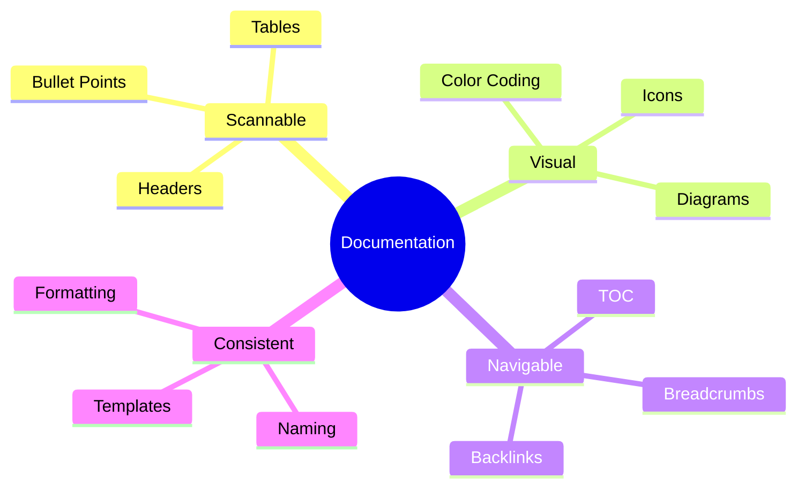
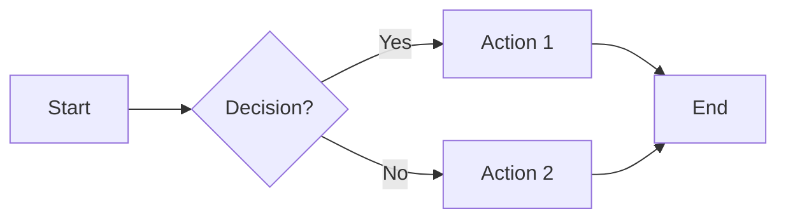
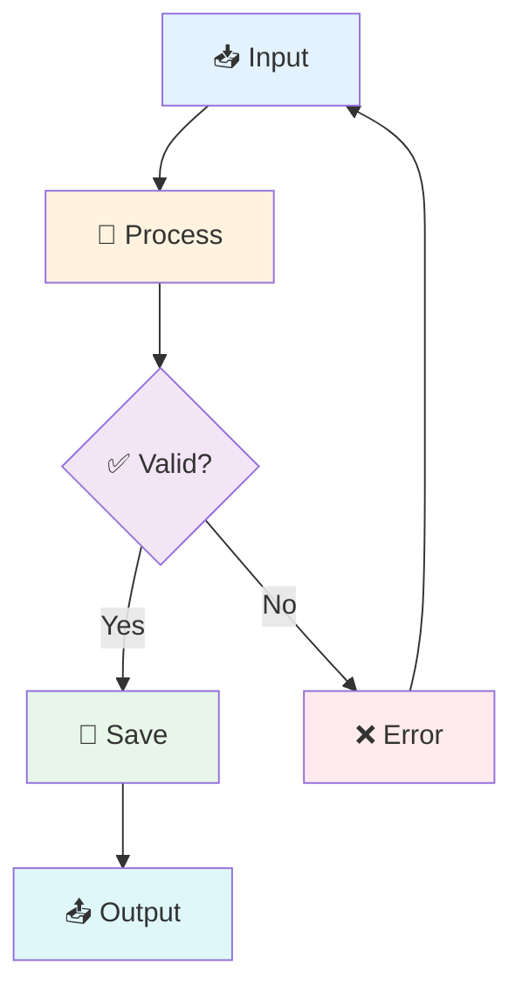
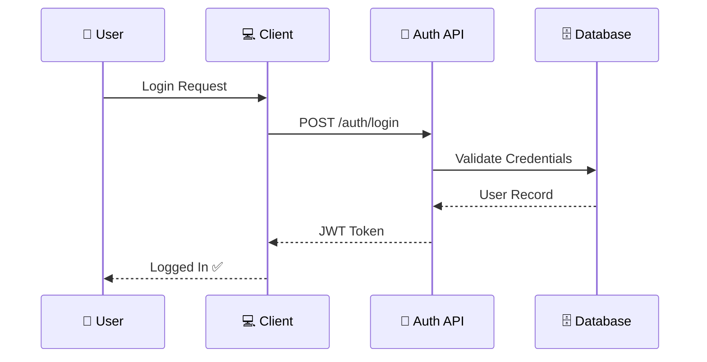
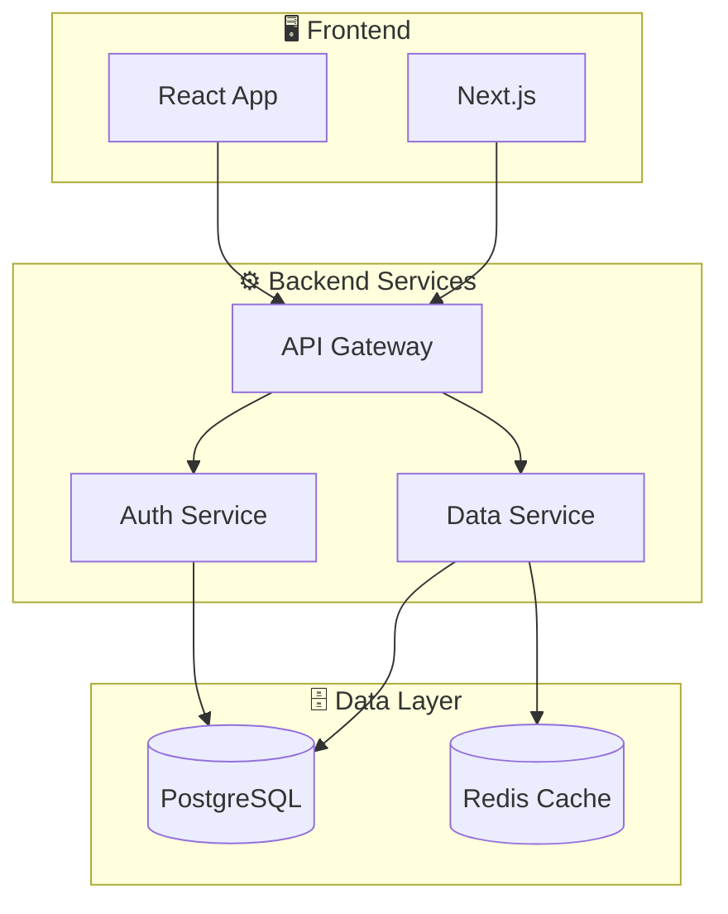
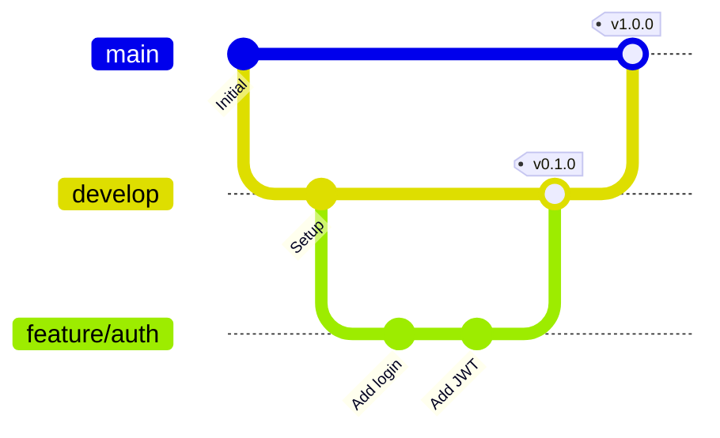

# 📝 Documentation Style Guide

> **Last Updated**: 2025-01-22 | **Version**: 1.0  
> **Status**: ✅ Final | **Maintainer**: Documentation Team

---

## 🎯 Overview

This guide establishes visual and structural standards for all documentation in this repository. Following these standards ensures:

| Benefit                | Description                                               |
| ---------------------- | --------------------------------------------------------- |
| 🧭 **Easy Navigation** | Breadcrumbs, TOC, and backlinks help readers find content |
| 👁️ **Visual Clarity**  | Icons, diagrams, and formatting improve readability       |
| 🔄 **Consistency**     | Uniform styling across all documents                      |
| 📱 **Accessibility**   | Works well on different devices and with screen readers   |

### Design Principles



---

## 📐 Document Structure

### Required Elements

Every documentation file **MUST** include these elements in order:

```markdown
[Breadcrumb Navigation]

# 📄 Title with Icon

> **Last Updated**: YYYY-MM-DD | **Author/Maintainer**: Name  
> **Status**: Draft | Review | Final

---

## 📑 Table of Contents (if > 3 sections)

- [Section 1](#section-1)
- [Section 2](#section-2)

---

## Section Content...

---

## 🔗 Related Documents (at end)
```

### Header Format

```markdown
[Home](index.md) > [Parent Section](./index.md) > Current Page

# 🏷️ Document Title

> **Last Updated**: 2025-01-22 | **Author**: Your Name  
> **Status**: Draft | Review | Final
```

### Section Headers

| Level     | Usage               | Icon Placement      |
| --------- | ------------------- | ------------------- |
| `#` H1    | Document title only | Always include icon |
| `##` H2   | Major sections      | Include icon        |
| `###` H3  | Subsections         | Optional icon       |
| `####` H4 | Minor points        | No icon needed      |

**Example:**

```markdown
# 🚀 Getting Started ← Document title

## 📦 Installation ← Major section

### Prerequisites ← Subsection

#### Node.js Version ← Minor detail
```

---

## 🎨 Visual Elements

### Callout Boxes

Use blockquotes with icons for important callouts:

```markdown
> ⚠️ **Warning**: This action cannot be undone.

> 💡 **Tip**: Use keyboard shortcuts for faster navigation.

> 📝 **Note**: This feature requires version 2.0 or higher.

> ❌ **Error**: Connection failed. Check your network settings.

> ✅ **Success**: Your changes have been saved.
```

**Rendered Examples:**

> ⚠️ **Warning**: This action cannot be undone.

> 💡 **Tip**: Use keyboard shortcuts for faster navigation.

> 📝 **Note**: This feature requires version 2.0 or higher.

### Status Badges

Use inline badges for status indicators:

| Badge Type | Markdown                                                           | Rendered       |
| ---------- | ------------------------------------------------------------------ | -------------- |
| Status     | ``    | Status: Active |
| Version    | ``      | Version: 1.0.0 |
| Build      | `` | Build: Passing |

Or use simple text badges:

```markdown
`✅ Complete` `🚧 In Progress` `⏳ Pending` `❌ Blocked`
```

### Progress Indicators

For tracking document or feature status:

```markdown
| Feature        | Status         |
| -------------- | -------------- |
| Authentication | ✅ Complete    |
| API Layer      | 🚧 In Progress |
| Testing        | ⏳ Pending     |
| Documentation  | ❌ Blocked     |
```

---

## 📊 Mermaid Diagrams

### When to Use Each Type

| Diagram Type  | Best For               | Example Use               |
| ------------- | ---------------------- | ------------------------- |
| **Flowchart** | Processes, decisions   | User flows, algorithms    |
| **Sequence**  | Interactions over time | API calls, auth flows     |
| **Class**     | Object relationships   | Data models, architecture |
| **State**     | State machines         | Workflow states           |
| **ER**        | Database schema        | Data relationships        |
| **Gantt**     | Timelines              | Project schedules         |
| **Mindmap**   | Concepts hierarchy     | Feature breakdown         |
| **Git Graph** | Branch strategy        | Release workflows         |

### Flowchart Examples

**Basic Flow:**

~~~markdown

~~~


**Styled Flow with Colors:**

~~~markdown

~~~


### Sequence Diagram Example

~~~markdown

~~~


### Architecture Diagram

~~~markdown

~~~


### Git Graph Example

~~~markdown

~~~

---

## 🏷️ Icons & Emoji

### Standard Icon Set

Use these consistently throughout documentation:

#### Status Icons

| Icon | Meaning          | Usage                        |
| ---- | ---------------- | ---------------------------- |
| ✅   | Complete/Success | Finished items, passed tests |
| ❌   | Error/Failed     | Failed items, errors         |
| ⚠️   | Warning          | Important cautions           |
| 🚧   | In Progress      | Work in progress             |
| ⏳   | Pending/Waiting  | Queued items                 |
| 🔄   | Refresh/Sync     | Update operations            |
| ⏸️   | Paused           | Temporarily stopped          |

#### Content Icons

| Icon | Meaning          | Usage                 |
| ---- | ---------------- | --------------------- |
| 📁   | Folder/Directory | File structure        |
| 📄   | File/Document    | Single file reference |
| 📝   | Note/Edit        | Notes, edits          |
| 💡   | Tip/Idea         | Helpful tips          |
| 🔗   | Link             | Cross-references      |
| 📚   | Documentation    | Doc collections       |
| 🎯   | Goal/Target      | Objectives            |
| 🚀   | Launch/Start     | Getting started       |

#### Technical Icons

| Icon | Meaning         | Usage            |
| ---- | --------------- | ---------------- |
| ⚙️   | Settings/Config | Configuration    |
| 🔐   | Security/Auth   | Security topics  |
| 🗄️   | Database        | Data storage     |
| 🌐   | Network/Web     | API, web topics  |
| 🐳   | Docker          | Container topics |
| ☁️   | Cloud           | Cloud services   |
| 📦   | Package         | Dependencies     |
| 🔧   | Tools           | Utilities, CLI   |

### Icon Placement Rules

1. **Always** use icon with H1 (document title)
2. **Usually** use icon with H2 (major sections)
3. **Sometimes** use icon with H3 (key subsections)
4. **Never** overuse - 1 icon per header maximum

**Good:**

```markdown
# 🚀 Getting Started

## 📦 Installation

### Prerequisites
```

**Bad:**

```markdown
# 🚀🎉✨ Getting Started ✨🎉🚀

## 📦💻🔧 Installation 🔧💻📦
```

---

## 💻 Code Blocks

### Syntax Highlighting

Always specify the language:

````markdown
```typescript
const greeting: string = "Hello, World!";
console.log(greeting);
```

```python
greeting: str = "Hello, World!"
print(greeting)
```

```bash
echo "Hello, World!"
```

```json
{
  "greeting": "Hello, World!"
}
```
````

### Code with Line Numbers (for reference)

When discussing specific lines, use comments:

```typescript
// Line 1: Import dependencies
import { useState, useEffect } from 'react';

// Line 3: Component definition
export function UserProfile({ userId }) {
  // Line 5: State initialization
  const [user, setUser] = useState(null);

  // Line 8: Effect for fetching
  useEffect(() => {
    fetchUser(userId).then(setUser);
  }, [userId]);

  return <div>{user?.name}</div>;
}
```

### Inline Code

Use backticks for:

- Function names: `useState()`
- Variable names: `userId`
- File names: `package.json`
- Commands: `npm install`
- Keyboard shortcuts: `Ctrl + S`

---

## 📋 Tables

### Standard Table Format

```markdown
| Column 1 | Column 2 | Column 3 |
| -------- | -------- | -------- |
| Data 1   | Data 2   | Data 3   |
| Data 4   | Data 5   | Data 6   |
```

### Alignment

```markdown
| Left Aligned | Center Aligned | Right Aligned |
| :----------- | :------------: | ------------: |
| Text         |      Text      |       Numbers |
| More text    |   More text    |           123 |
```

### Feature Comparison Tables

| Feature             | Free | Pro | Enterprise |
| ------------------- | :--: | :-: | :--------: |
| Basic API           |  ✅  | ✅  |     ✅     |
| Advanced Analytics  |  ❌  | ✅  |     ✅     |
| Priority Support    |  ❌  | ❌  |     ✅     |
| Custom Integrations |  ❌  | ❌  |     ✅     |
| SLA Guarantee       |  ❌  | ❌  |     ✅     |

### Command Reference Tables

| Command     | Description      | Example                  |
| ----------- | ---------------- | ------------------------ |
| `npm start` | Start dev server | `npm start`              |
| `npm test`  | Run test suite   | `npm test -- --coverage` |
| `npm build` | Production build | `npm run build`          |

---

## 🔗 Links & Navigation

### Breadcrumb Navigation

Always at document top:

```markdown
[Home](index.md) > [Docs](./index.md) > [API](GLOSSARY.md) > Authentication
```

**Rendered:**

[Home](index.md) > [Docs](./index.md) > [API](GLOSSARY.md) > Authentication

### Internal Links

```markdown
See [Installation Guide](./guides/installation.md) for setup instructions.

Jump to [Configuration](#configuration) section.

Reference the [API docs](../docs/api/README.md).
```

### External Links

```markdown
- [React Documentation](https://react.dev/) - Official React docs
- [TypeScript Handbook](https://www.typescriptlang.org/docs/) - TS reference
```

### Related Documents Section

Always end documents with:

```markdown
---

## 🔗 Related Documents

| Document | Description |
|----------|-------------|
| [Getting Started](./getting-started.md) | Initial setup guide |
| [API Reference](./api/README.md) | Full API documentation |
| [Troubleshooting](./troubleshooting.md) | Common issues and solutions |

---

[⬆️ Back to Top](#-document-title) | [📚 All Docs](./index.md) | [🏠 Home](index.md)
```

---

## 🖼️ Images & Media

### Image Placement

```markdown

_Figure 1: Caption describing what the image shows_
```

### Image Guidelines

| Aspect       | Guideline                                   |
| ------------ | ------------------------------------------- |
| **Format**   | PNG for screenshots, SVG for diagrams       |
| **Size**     | Max 1920px width, optimize for web          |
| **Location** | Store in `docs/images/` or `docs/diagrams/` |
| **Naming**   | `feature_description_v1.png`                |
| **Alt Text** | Always provide descriptive alt text         |

### Diagram Storage

```
docs/
├── images/
│   ├── screenshots/
│   │   └── dashboard_overview.png
│   └── logos/
│       └── project_logo.svg
└── diagrams/
    ├── architecture.excalidraw
    ├── architecture.svg
    └── data_flow.mmd
```

---

## 📋 Templates

### New Document Template

```markdown
[Home](index.md) > [Parent](./index.md) > Document Title

# 📄 Document Title

> **Last Updated**: YYYY-MM-DD | **Author**: Your Name  
> **Status**: Draft | Review | Final

Brief one-paragraph description of this document's purpose.

---

## Overview

Introduction to the topic...

---

## Section 1

Content...

---

## Section 2

Content...

---

## 🔗 Related Documents

| Document                      | Description |
| ----------------------------- | ----------- |
| [Related Doc 1](./related.md) | Description |
| [Related Doc 2](./other.md)   | Description |

---

[⬆️ Back to Top](#-document-title) | [📚 Docs](./index.md) | [🏠 Home](index.md)
```

### API Endpoint Template

~~~markdown
### `POST /api/v1/users`

Creates a new user account.

**Authentication**: Required 🔐

**Request Body:**

```json
{
  "email": "user@example.com",
  "password": "securePassword123",
  "name": "John Doe"
}
```

**Response:**

| Status | Description                  |
| ------ | ---------------------------- |
| `201`  | ✅ User created successfully |
| `400`  | ❌ Validation error          |
| `409`  | ❌ Email already exists      |

**Example Response (201):**

```json
{
  "id": "usr_123abc",
  "email": "user@example.com",
  "name": "John Doe",
  "createdAt": "2025-01-22T10:30:00Z"
}
```
~~~

### Troubleshooting Entry Template

~~~markdown
### ❌ Error: Connection Refused

**Symptoms:**
- Application fails to start
- Error message: `ECONNREFUSED 127.0.0.1:5432`

**Cause:**
Database server is not running or not accessible.

**Solution:**

1. Check if database is running:
   ```bash
   docker ps | grep postgres
   ```

2. Start the database if needed:
   ```bash
   docker-compose up -d db
   ```

3. Verify connection:
   ```bash
   psql -h localhost -p 5432 -U postgres
   ```

**Related:**

- [Database Setup](./database-setup.md)
- [Docker Configuration](./docker.md)
~~~

---

## 📌 Quick Reference

### Checklist for Every Document

- [ ] Breadcrumb navigation at top
- [ ] Icon in H1 title
- [ ] Last updated date
- [ ] Author/maintainer listed
- [ ] Table of contents (if > 3 sections)
- [ ] Visual elements (tables, diagrams, icons)
- [ ] Code blocks with language specified
- [ ] Related documents section
- [ ] Back-to-top and navigation links

### Common Patterns

| Pattern | Example |
|---------|---------|
| **Warning callout** | `> ⚠️ **Warning**: ...` |
| **Tip callout** | `> 💡 **Tip**: ...` |
| **Status badge** | `✅ Complete` `🚧 WIP` |
| **Keyboard shortcut** | `` `Ctrl + S` `` |
| **File reference** | `` `src/index.ts` `` |
| **Command** | `` `npm install` `` |

### Mermaid Quick Reference

| Diagram | Opening | Use For |
|---------|---------|---------|
| Flowchart | `flowchart LR/TD` | Processes |
| Sequence | `sequenceDiagram` | Interactions |
| Class | `classDiagram` | Object models |
| State | `stateDiagram-v2` | State machines |
| ER | `erDiagram` | Database |
| Gantt | `gantt` | Timelines |
| Git | `gitGraph` | Branches |
| Mindmap | `mindmap` | Concepts |

---

## 🔗 Related Documents

| Document | Description |
|----------|-------------|
| [copilot-instructions.md](https://github.com/fgarofalo56/Suppercharge_Microsoft_Fabric/blob/main/.github/copilot-instructions.md) | Copilot configuration |
| [CONTRIBUTING.md](CONTRIBUTING.md) | Contribution guidelines |
| [README.md](index.md) | Project overview |

---

[⬆️ Back to Top](#-documentation-style-guide) | [📚 Docs](./index.md) | [🏠 Home](index.md)
