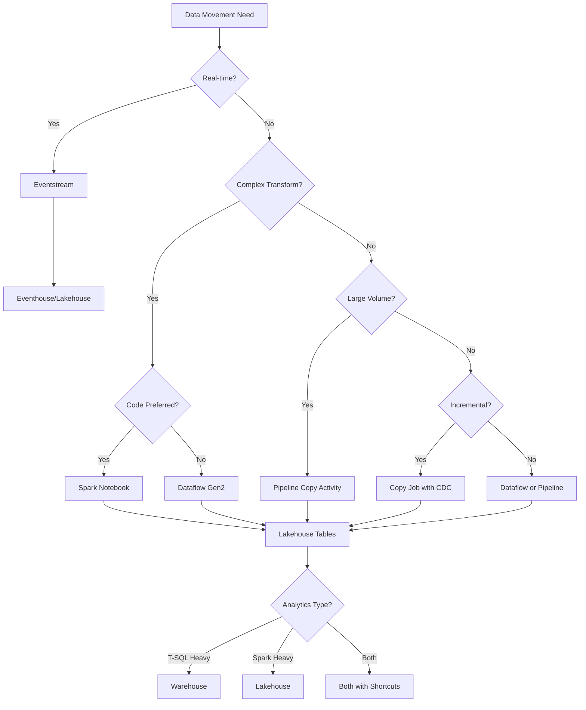

[Home](../index.md) > [Docs](..) > Best Practices

# 💡 Best Practices Guide

> **Last Updated**: 2026-04-21 | **Version**: 2.1
> **Status**: ✅ Final | **Maintainer**: Documentation Team

<div align="center" markdown>


</div>

---

## 📖 Overview

This comprehensive guide provides best practices for all aspects of Microsoft Fabric implementation. Whether you're setting up workspaces, designing data pipelines, optimizing Spark jobs, or migrating from Oracle/SQL Server, this guide covers proven patterns and recommendations based on Microsoft's official guidance.

---

## 📑 Guide Index

| Document | Description |
|----------|-------------|
| [Workspaces & Naming Conventions](./01_WORKSPACES_NAMING.md) | Workspace organization, domains, naming standards |
| [Data Gateway Optimization](./02_DATA_GATEWAY.md) | Gateway sizing, parallel connections, performance tuning |
| [Pipelines & Data Movement](./03_PIPELINES_DATA_MOVEMENT.md) | ETL vs ELT, copy activity optimization, load patterns |
| [Metadata-Driven Pipelines](./04_METADATA_DRIVEN_PIPELINES.md) | Dynamic expressions, parameterization, configuration-driven ETL |
| [Spark & Notebooks](./05_SPARK_NOTEBOOKS.md) | Spark optimization, notebook best practices, library management |
| [Dataflows Gen2](./06_DATAFLOWS.md) | Query folding, staging, fast copy, modern evaluator |
| [Lakehouse Setup](./07_LAKEHOUSE_SETUP.md) | Delta Lake tables, medallion architecture, table maintenance |
| [Warehouse Configuration](./08_WAREHOUSE_SETUP.md) | Schema design, statistics, query optimization |
| [Oracle & SQL Server Patterns](./09_SOURCE_SPECIFIC_PATTERNS.md) | Large table loads, parallel extraction, incremental patterns |
| [Decision Guide](./10_DECISION_GUIDE.md) | When to use pipeline vs dataflow vs Spark vs lakehouse vs warehouse |
| [Oracle Gateway Troubleshooting](./11_ORACLE_GATEWAY_TROUBLESHOOTING.md) | Gateway config, ForEach parallelism, Oracle optimization |
| [Error Handling & Monitoring](./error-handling-monitoring.md) | Pipeline error architecture, error tables, PySpark error handling, KQL analysis |
| [Alerting & Data Activator](./alerting-data-activator.md) | Data Activator setup, alert patterns, Teams/Email integration, runbooks |
| [Performance & Parallelism](./performance-parallelism.md) | Copy Activity DIUs, Spark tuning, pipeline parallelism, Direct Lake, KQL |
| [Data Governance Deep Dive](./data-governance-deep-dive.md) | Purview, classification, RLS/CLS, compliance frameworks, retention |

### 🆕 Phase 9: New Fabric Experience Best Practices

| Document | Description |
|----------|-------------|
| [CI/CD with fabric-cicd](./fabric-cicd-deployment.md) | fabric-cicd Python library, GitHub Actions, environment promotion |
| [SQL Audit Logs Compliance](./sql-audit-logs-compliance.md) | SQL analytics endpoint audit logs for SOX/PCI/gaming compliance |
| [Outbound Access Protection](./outbound-access-protection.md) | Data exfiltration prevention, managed private endpoints |
| [Customer-Managed Keys](./customer-managed-keys.md) | BYOK encryption key management for Fabric |
| [Spark Runtime Migration](./spark-runtime-migration.md) | Runtime 2.0 migration guide, breaking changes, compatibility |

### 📊 Phase 12: Documentation Gap Remediation

| Document | Description |
|----------|-------------|
| [ETL/ELT Comparison Guide](./etl-elt-comparison-guide.md) | Side-by-side comparison of all 5 ETL methods with code examples and CU benchmarks |
| [FinOps & Cost Governance](./finops-cost-governance.md) | FinOps framework, chargeback models, pause/resume automation, budget alerts |
| [Data Modeling & Star Schema](./data-modeling-star-schema.md) | Dimensional modeling, SCD Type 1/2/3 with PySpark, Direct Lake optimization |
| [Power BI Best Practices](./power-bi-best-practices.md) | DAX optimization, semantic model design, Direct Lake tuning |
| [Lakehouse vs Warehouse vs SQL DB Decision Guide](./lakehouse-warehouse-sqldb-decision-guide.md) | Feature comparison matrix, hybrid patterns, workload routing |

### 🏢 Phase 10: Enterprise Readiness Best Practices

| Document | Description |
|----------|-------------|
| [Capacity Planning & Cost Optimization](./capacity-planning-cost-optimization.md) | SKU selection, CU cost model, 15+ optimization techniques |
| [Disaster Recovery & BCDR](./disaster-recovery-bcdr.md) | RTO/RPO targets, OneLake BCDR, failover procedures |
| [Testing Strategies](./testing-strategies.md) | Testing pyramid, unit/integration/DQ testing, CI/CD integration |
| [Network Security](./network-security.md) | Private endpoints, managed VNet, IP firewall, TIC 3.0 |
| [Identity & RBAC Patterns](./identity-rbac-patterns.md) | Workspace roles, item permissions, RLS/CLS/OLS, PIV/CAC |
| [Medallion Architecture Deep Dive](./medallion-architecture-deep-dive.md) | Bronze/Silver/Gold patterns, SCD Type 1/2, table maintenance |
| [Monitoring & Observability](./monitoring-observability.md) | Capacity monitoring, custom dashboards, alerting, runbooks |
| [Migration Patterns](./migration-patterns.md) | Source-specific migration, schema migration, validation |
| [Multi-Tenant Workspace Architecture](./multi-tenant-workspace-architecture.md) | Topology patterns, isolation strategies, automation |
| [Data Sharing & Federation](./data-sharing-federation.md) | Shortcut patterns, Fabric Data Sharing, external federation |
| [Incremental Refresh & CDC](./incremental-refresh-cdc.md) | Delta MERGE, watermark management, semantic model refresh |

---

## ⚡ Quick Reference: Key Principles

### 1. Workspace Organization
- Separate workspaces by environment (Dev/Test/Prod)
- Use domains for logical grouping
- Implement consistent naming conventions
- Assign dedicated capacities for isolation

### 2. Data Movement Strategy
- Use **Pipelines** for high-volume, scheduled ETL
- Use **Dataflows** for low-code transformations
- Use **Spark** for complex transformations and ML
- Use **Eventstreams** for real-time ingestion

### 3. Performance Optimization
- Enable parallel copy with partitioning
- Optimize file sizes (100MB-1GB)
- Use Delta Lake for all analytical tables
- Implement incremental loads where possible

### 4. Medallion Architecture
```
Bronze (Raw) -> Silver (Cleansed) -> Gold (Curated)
```

---

## 🌳 Architecture Decision Tree



---

## 📐 Capacity Planning Quick Reference

| Workload Profile | Recommended SKU | Use Case |
|------------------|-----------------|----------|
| Development | F2-F4 | Prototyping, testing |
| Small Team (< 10 users) | F4-F8 | Departmental analytics |
| Medium Team (10-50 users) | F16-F32 | Business unit analytics |
| Enterprise (50+ users) | F64+ | Organization-wide platform |

---

## 🎯 Performance Targets

| Metric | Target | Optimization Strategy |
|--------|--------|----------------------|
| Query latency (P95) | < 5 seconds | Optimize Delta, use statistics |
| Ingestion throughput | > 100K records/min | Parallel copy, optimal file sizes |
| Pipeline duration | Minimize | Parallel activities, partitioning |
| Semantic model refresh | < 15 minutes | Incremental refresh, Direct Lake |

---

## 📝 Document Conventions

Throughout this guide:
- **Recommended** - Best practice, use by default
- **Consider** - Situational, evaluate for your use case
- **Avoid** - Anti-pattern, may cause issues
- Code examples are provided for both UI and programmatic approaches

---

## 🌐 Related Resources

- [Microsoft Fabric Documentation](https://learn.microsoft.com/en-us/fabric/)
- [Fabric Capacity Calculator](https://www.microsoft.com/microsoft-fabric/capacity-estimator)
- [Fabric Community](https://community.fabric.microsoft.com/)

---

---

## 🔗 Related Documents

| Document | Description |
|----------|-------------|
| [Architecture Overview](../diagrams/architecture-overview.md) | System architecture and data flow diagrams |
| [Cost Breakdown](../diagrams/cost-breakdown.md) | Cost analysis and optimization diagrams |
| [Data Dictionary](../data-dictionary/README.md) | Table schemas and field definitions |
| [Operational Runbooks](../runbooks/index.md) | Incident response and maintenance procedures |
| [Compliance Templates](../compliance-templates/README.md) | Regulatory compliance report templates |

---

[⬆️ Back to Top](#-best-practices-guide) | [📚 Parent](./) | [🏠 Home](../index.md)
