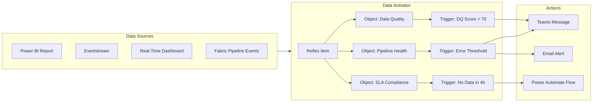
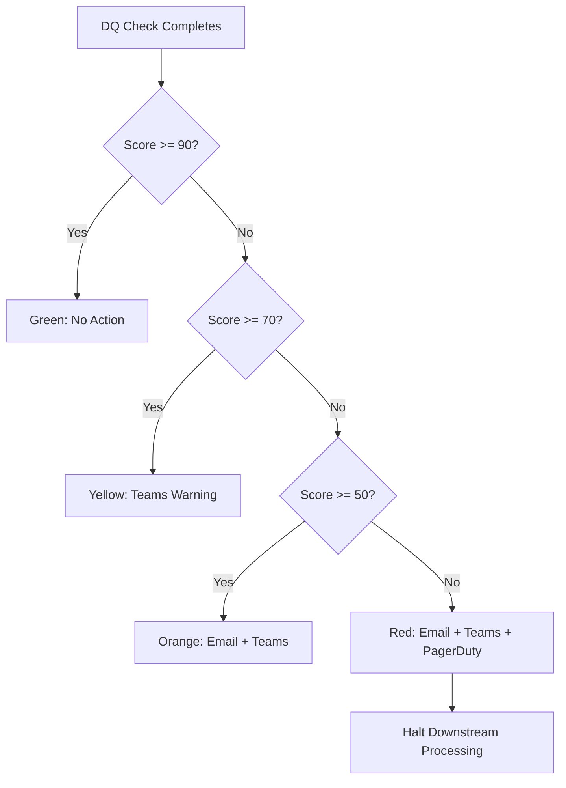
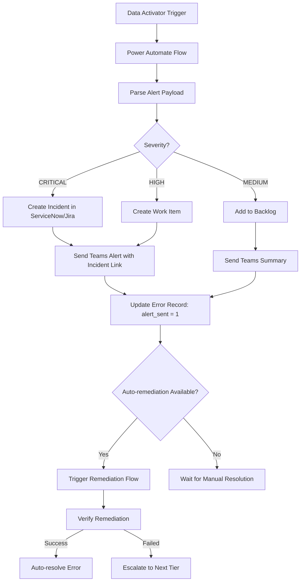
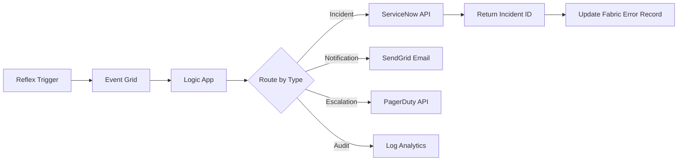

[Home](../index.md) > [Best Practices](./) > Alerting & Data Activator

# 🔔 Alerting & Data Activator Best Practices

> **Last Updated**: 2026-04-15 | **Version**: 2.0
> **Status**: ✅ Final | **Maintainer**: Documentation Team

<div align="center" markdown>


</div>

---

## 📖 Overview

Data Activator is Microsoft Fabric's no-code experience for automatically monitoring data and triggering actions when conditions are met. This guide covers Reflex item configuration, alert patterns for casino gaming compliance, federal agency data pipelines, and healthcare workloads, along with integration patterns for Teams, Email, Power Automate, and Azure Logic Apps. It also addresses alert fatigue prevention and operational runbooks.

---

## ⚙️ Data Activator Fundamentals

### What is Data Activator?

Data Activator is a Fabric workload that lets you monitor data streams and take automated action when patterns or conditions are detected. It eliminates the need for custom polling services or scheduled checks.

### Core Concepts

| Concept | Description |
|---------|-------------|
| **Reflex item** | A Fabric item that contains triggers, conditions, and actions |
| **Object** | A monitored entity (e.g., a pipeline, a table, a KPI metric) |
| **Trigger** | A rule that evaluates a condition on an object's property |
| **Condition** | A logical expression (threshold, change detection, absence) |
| **Action** | What happens when the condition is met (email, Teams, Power Automate) |

### Architecture



### Setting Up Data Activator

**Step 1: Create a Reflex item**

1. Navigate to your Fabric workspace
2. Select **New** > **Reflex**
3. Name it following the convention: `reflex_{domain}_{alert_type}` (e.g., `reflex_casino_compliance_alerts`)

**Step 2: Connect to a data source**

Data Activator can monitor data from:
- **Power BI visuals** -- Right-click a visual and select "Set alert"
- **Eventstreams** -- Route events directly to a Reflex
- **Real-Time Dashboards** -- Set alerts on KQL-backed visuals
- **Custom events** -- Send events via the Reflex REST API

**Step 3: Define objects and triggers**

Objects represent the entities you want to monitor. Each object has properties that can be tracked over time.

---

## 🔧 Reflex Item Configuration

### Naming Convention

```
reflex_{domain}_{alert_category}

Examples:
  reflex_casino_compliance       -- Casino compliance alerts
  reflex_federal_data_freshness  -- Federal agency SLA alerts
  reflex_healthcare_hipaa        -- HIPAA compliance alerts
  reflex_platform_pipeline_health -- Cross-domain pipeline alerts
```

### Object Design

Design objects to represent logical monitoring targets:

| Object | Properties | Source |
|--------|-----------|--------|
| `Pipeline Run` | status, duration, error_count, activity_name | Pipeline events |
| `Data Quality Score` | dq_score, table_name, check_type, failed_checks | DQ results table |
| `Data Freshness` | last_load_time, hours_since_update, table_name | Ingestion metadata |
| `Compliance Filing` | filing_type, deadline, status, days_remaining | Compliance tracker |
| `Streaming Lag` | consumer_lag, topic, partition, lag_seconds | Eventstream metrics |

### Trigger Configuration

Each trigger evaluates a condition and fires an action when met.

**Threshold trigger:**
```
Object: Data Quality Score
Property: dq_score
Condition: Is less than 70
Evaluate: Every 15 minutes
Action: Send Teams message
```

**Change detection trigger:**
```
Object: Pipeline Run
Property: status
Condition: Changes to "Failed"
Evaluate: On each event
Action: Send email + Teams message
```

**Absence trigger (data freshness):**
```
Object: Data Freshness
Property: last_load_time
Condition: No new value in 4 hours
Evaluate: Every 30 minutes
Action: Trigger Power Automate flow
```

---

## 🚨 Alert Patterns

### Pattern 1: Data Quality Threshold Alerts

Monitor data quality scores across all medallion layers and alert when scores drop below acceptable levels.



**Threshold configuration:**

| DQ Score Range | Severity | Action | Pipeline Behavior |
|---------------|----------|--------|-------------------|
| 90-100 | INFO | Dashboard update only | Continue processing |
| 70-89 | WARNING | Teams channel notification | Continue with flag |
| 50-69 | HIGH | Email + Teams + incident ticket | Pause downstream, quarantine |
| 0-49 | CRITICAL | Email + Teams + PagerDuty | Halt all processing, escalate |

### Pattern 2: Pipeline Failure Alerts

Detect pipeline failures and route alerts based on the pipeline domain and error classification.

**Trigger configuration:**

```
Object: Pipeline Run
Property: status
Condition: Equals "Failed"

Filter: environment = "PROD"

Action routing:
  IF pipeline_name CONTAINS "compliance" OR "ctr" OR "sar"
    THEN PagerDuty + Teams + Email (CRITICAL)
  ELSE IF pipeline_name CONTAINS "gold"
    THEN Teams + Email (HIGH)
  ELSE IF pipeline_name CONTAINS "silver"
    THEN Teams (MEDIUM)
  ELSE
    THEN Dashboard only (LOW)
```

### Pattern 3: Data Freshness / SLA Alerts

Monitor that each data source is refreshed within its SLA window.

**SLA definitions:**

| Data Source | Expected Frequency | SLA Warning | SLA Breach |
|-------------|-------------------|-------------|------------|
| Casino slot telemetry | Every 5 minutes | 15 min late | 30 min late |
| Player transactions | Every 15 minutes | 30 min late | 1 hour late |
| USDA crop data | Daily (6 AM UTC) | 2 hours late | 6 hours late |
| NOAA weather data | Hourly | 2 hours late | 4 hours late |
| EPA AQI data | Hourly | 3 hours late | 6 hours late |
| DOI resource data | Daily | 4 hours late | 12 hours late |
| SBA loan data | Weekly | 1 day late | 3 days late |
| Tribal healthcare records | Daily | 4 hours late | 8 hours late |

**Reflex trigger for data freshness:**

```
Object: Data Freshness
Property: hours_since_update

Trigger: SLA Warning
  Condition: hours_since_update > sla_warning_hours
  Action: Teams notification to #{domain}-data channel

Trigger: SLA Breach
  Condition: hours_since_update > sla_breach_hours
  Action: Email to data owner + Teams notification + create incident
```

### Pattern 4: Anomaly Detection Alerts

Detect statistical anomalies in data volumes and key metrics.

**Volume anomaly trigger:**

```
Object: Ingestion Metrics
Property: record_count

Condition: Percentage change from 7-day rolling average
  WARNING: record_count < 50% of average OR > 200% of average
  CRITICAL: record_count < 20% of average OR > 500% of average

Action:
  WARNING -> Teams notification
  CRITICAL -> Email + Teams + investigation trigger
```

**Metric anomaly detection (KQL-backed):**

```kql
// Calculate Z-score for daily record counts
let lookback = 30d;
let threshold = 3.0;  // Standard deviations
ingestion_metrics
| where timestamp > ago(lookback)
| summarize daily_count = sum(record_count) by bin(timestamp, 1d), source_system
| extend rolling_avg = avg(daily_count) over (source_system, timestamp, lookback),
         rolling_std = stdev(daily_count) over (source_system, timestamp, lookback)
| extend z_score = (daily_count - rolling_avg) / rolling_std
| where abs(z_score) > threshold
```

### Pattern 5: Compliance Breach Alerts

Domain-specific compliance monitoring with zero tolerance for missed deadlines.

**Casino compliance triggers:**

| Trigger | Condition | SLA | Action |
|---------|-----------|-----|--------|
| CTR filing deadline | CTR not filed within 15 days | 15 calendar days | CRITICAL: Compliance Officer + CTO |
| SAR pattern detected | Structuring pattern identified | Immediate review | HIGH: BSA Officer + Investigation Team |
| W-2G issuance | Jackpot > threshold, W-2G not generated | Before player leaves | CRITICAL: Floor Manager + Compliance |
| MICS audit gap | Required MICS check not completed | Daily | HIGH: Compliance Team |

**Federal agency compliance triggers:**

| Trigger | Condition | SLA | Action |
|---------|-----------|-----|--------|
| USDA food recall detected | Recall notice in USDA feed | 1 hour | CRITICAL: Notify downstream consumers |
| NOAA severe weather | Extreme weather event in monitored area | 15 minutes | HIGH: Operations + Safety teams |
| EPA AQI hazardous | AQI > 300 in covered region | 30 minutes | HIGH: Public health notification |
| HIPAA breach indicator | PHI access pattern anomaly | Immediate | CRITICAL: Privacy Officer + Security |

---

## 🔗 Integration Patterns

### Microsoft Teams Integration

**Direct Reflex-to-Teams:**

Data Activator can send messages directly to Teams channels or individual users.

```
Reflex Trigger -> Teams Adaptive Card
  Channel: #{workspace}-alerts
  Card includes:
    - Alert severity badge
    - Pipeline/table name
    - Error summary
    - Link to Fabric monitoring hub
    - Action buttons: Acknowledge, Investigate, Dismiss
```

**Teams Adaptive Card template (JSON):**

```json
{
    "type": "AdaptiveCard",
    "version": "1.4",
    "body": [
        {
            "type": "Container",
            "style": "attention",
            "items": [
                {
                    "type": "TextBlock",
                    "text": "${severity} Alert: ${alert_title}",
                    "weight": "Bolder",
                    "size": "Large"
                }
            ]
        },
        {
            "type": "FactSet",
            "facts": [
                {"title": "Pipeline:", "value": "${pipeline_name}"},
                {"title": "Error:", "value": "${error_classification}"},
                {"title": "Time:", "value": "${error_timestamp}"},
                {"title": "Environment:", "value": "${environment}"},
                {"title": "Source:", "value": "${source_system}"}
            ]
        },
        {
            "type": "TextBlock",
            "text": "${error_message}",
            "wrap": true,
            "maxLines": 3
        }
    ],
    "actions": [
        {
            "type": "Action.OpenUrl",
            "title": "View in Fabric",
            "url": "${fabric_monitoring_url}"
        },
        {
            "type": "Action.OpenUrl",
            "title": "View Runbook",
            "url": "${runbook_url}"
        }
    ]
}
```

### Email Alert Integration

**Email alert configuration:**

```
To: ${alert_recipients} (based on domain + severity)
Subject: [${severity}] Fabric Alert: ${alert_title} - ${pipeline_name}
Body:
  Alert Details:
    - Pipeline: ${pipeline_name}
    - Activity: ${activity_name}
    - Classification: ${error_classification}
    - Time: ${error_timestamp}
    - Error: ${error_message}

  Recommended Action:
    ${runbook_first_action}

  Links:
    - Fabric Monitoring: ${monitoring_url}
    - Error Dashboard: ${dashboard_url}
    - Runbook: ${runbook_url}
```

**Email recipient mapping:**

| Domain | Severity | Recipients |
|--------|----------|------------|
| Casino Compliance | CRITICAL | compliance-officer@, cto@, oncall-engineer@ |
| Casino Compliance | HIGH | bsa-officer@, data-engineering@ |
| Federal (all) | CRITICAL | agency-liaison@, pm@, oncall-engineer@ |
| Federal (all) | HIGH | data-engineering@, pm@ |
| Healthcare/HIPAA | CRITICAL | privacy-officer@, legal@, ciso@, oncall-engineer@ |
| Healthcare/HIPAA | HIGH | privacy-officer@, data-engineering@ |
| Platform | CRITICAL | oncall-engineer@, engineering-manager@ |
| Platform | HIGH | data-engineering@ |

### Power Automate Integration

Use Power Automate for complex multi-step alert workflows that go beyond simple notifications.



**Power Automate flow examples:**

| Flow Name | Trigger | Actions |
|-----------|---------|---------|
| `FA_Critical_Pipeline_Alert` | Reflex fires CRITICAL | Create incident, notify Teams, page on-call |
| `FA_DQ_Quarantine_Handler` | DQ score < 50 | Halt downstream pipelines, create investigation task |
| `FA_SLA_Breach_Escalation` | SLA breached by 2x | Escalate to management, send stakeholder update |
| `FA_Auto_Retry_Transient` | Transient error after max retries | Trigger pipeline re-run with increased resources |
| `FA_Compliance_Deadline_Warning` | Filing deadline in 48 hours | Notify compliance team, create priority task |

### Azure Logic Apps Integration

For enterprise-grade integrations that need guaranteed delivery, use Azure Logic Apps.



---

## 🏢 Domain-Specific Alert Configurations

### Casino Gaming Compliance

```
Reflex: reflex_casino_compliance

Objects:
  - CTR Filing Status
  - SAR Detection Pipeline
  - W-2G Generation
  - MICS Audit Checks
  - Player Exclusion List

Triggers:
  1. CTR_Deadline_Warning
     Property: days_to_deadline
     Condition: days_to_deadline <= 3
     Action: Email compliance team

  2. CTR_Deadline_Critical
     Property: days_to_deadline
     Condition: days_to_deadline <= 1
     Action: PagerDuty + Email + Teams

  3. SAR_Pattern_Detected
     Property: structuring_score
     Condition: structuring_score > 0.8
     Action: Email BSA officer + create investigation

  4. W2G_Generation_Failed
     Property: jackpot_amount > threshold AND w2g_status = "failed"
     Action: CRITICAL alert to floor manager

  5. Player_Exclusion_Sync_Failed
     Property: sync_status = "failed"
     Action: HIGH alert - manual verification required
```

### USDA Agricultural Data

```
Reflex: reflex_usda_data_monitoring

Triggers:
  1. Food_Recall_Alert
     Source: USDA recall feed
     Condition: New recall notice detected
     Action: CRITICAL - notify all downstream consumers, halt affected pipelines

  2. Crop_Data_Freshness
     Source: NASS crop production table
     Condition: No update in 36 hours (expected daily)
     Action: HIGH - check NASS API status, notify data team

  3. USDA_API_Rate_Limit
     Source: Pipeline error log
     Condition: 429 errors > 5 in 1 hour
     Action: MEDIUM - reduce polling frequency, notify ops

  4. Livestock_Anomaly
     Source: Gold layer livestock metrics
     Condition: Value deviates > 3 sigma from 30-day average
     Action: MEDIUM - flag for analyst review
```

### NOAA Weather Data

```
Reflex: reflex_noaa_weather_alerts

Triggers:
  1. Severe_Weather_Event
     Source: NOAA weather alerts feed
     Condition: Severity = "Extreme" or "Severe"
     Action: HIGH - notify operations, trigger contingency pipelines

  2. Weather_Data_Gap
     Source: Hourly station data
     Condition: > 20% of stations missing in reporting window
     Action: MEDIUM - log gap, check NOAA service status

  3. Climate_Data_Anomaly
     Source: Temperature/precipitation aggregates
     Condition: Daily value > historical max/min for region
     Action: LOW - flag for climatology review
```

### EPA Air Quality

```
Reflex: reflex_epa_aqi_monitoring

Triggers:
  1. Hazardous_AQI
     Source: EPA AQI real-time feed
     Condition: AQI > 300 (Hazardous)
     Action: CRITICAL - public health notification chain

  2. Unhealthy_AQI
     Source: EPA AQI real-time feed
     Condition: AQI > 150 (Unhealthy)
     Action: HIGH - notify health and safety teams

  3. AQI_Data_Staleness
     Source: Ingestion metadata
     Condition: No new AQI data in 3 hours
     Action: MEDIUM - check EPA AirNow API

  4. Emission_Threshold_Breach
     Source: Gold layer emission aggregates
     Condition: Facility emission exceeds permit threshold
     Action: HIGH - notify environmental compliance
```

### Tribal Healthcare (HIPAA)

```
Reflex: reflex_healthcare_hipaa

Triggers:
  1. PHI_Access_Anomaly
     Source: Audit log analysis
     Condition: Access pattern deviates from baseline (volume, timing, user)
     Action: CRITICAL - notify Privacy Officer + Security

  2. Consent_Record_Missing
     Source: Patient processing pipeline
     Condition: Record processed without valid consent on file
     Action: CRITICAL - halt processing, quarantine record

  3. De_Identification_Failure
     Source: PHI de-identification pipeline
     Condition: Output contains PII patterns (SSN, full name, DOB combination)
     Action: CRITICAL - halt output, purge, notify Privacy Officer

  4. Healthcare_Data_Freshness
     Source: Ingestion metadata
     Condition: Clinical data > 8 hours stale
     Action: HIGH - notify clinical data team

  5. 42CFR_Part2_Violation_Risk
     Source: Substance abuse data pipeline
     Condition: Data accessed by non-authorized role
     Action: CRITICAL - immediate access revocation + investigation
```

### DOT/FAA Transportation

```
Reflex: reflex_dot_faa_monitoring

Triggers:
  1. Safety_Incident_Detected
     Source: FAA incident data feed
     Condition: New incident classified as "serious" or "fatal"
     Action: CRITICAL - notify safety analysis team

  2. FedRAMP_Compliance_Check
     Source: Security compliance pipeline
     Condition: FedRAMP control check failure
     Action: HIGH - notify security team + compliance officer

  3. Transportation_Data_SLA
     Source: Ingestion metadata
     Condition: DOT data > 12 hours stale
     Action: MEDIUM - check source availability
```

---

## 🔇 Alert Fatigue Prevention

Alert fatigue occurs when too many notifications desensitize the team, causing critical alerts to be missed. Follow these strategies to maintain alert effectiveness.

### Severity Level Discipline

Only use CRITICAL and HIGH for situations that genuinely require immediate human intervention.

| Severity | Criteria | Expected Volume |
|----------|----------|-----------------|
| CRITICAL | Data loss risk, compliance violation, security breach | < 1 per week |
| HIGH | Production impact, SLA breach, data quality failure | < 5 per week |
| MEDIUM | Degraded performance, non-critical pipeline failure | < 20 per week |
| LOW | Informational, minor anomaly, dev/staging issues | Unlimited (dashboard only) |

**Rule of thumb:** If you receive more than 3 CRITICAL alerts per week on average, your thresholds are too sensitive.

### Alert Grouping

Group related alerts to reduce noise:

```
Instead of:
  Alert: Pipeline A failed (activity 1)
  Alert: Pipeline A failed (activity 2)
  Alert: Pipeline A failed (activity 3)

Send:
  Alert: Pipeline A failed (3 activities). First failure: activity 1 at 10:15 UTC
```

**Implementation:** Use the `correlation_id` field to group alerts from the same pipeline run.

### Cool-Down Periods

Prevent repeated alerts for the same issue:

| Severity | Cool-Down Period | Behavior |
|----------|-----------------|----------|
| CRITICAL | 15 minutes | Re-alert if still unresolved after cool-down |
| HIGH | 1 hour | Re-alert once after cool-down, then daily digest |
| MEDIUM | 4 hours | Daily digest only |
| LOW | No repeat | Dashboard only, never re-alert |

### Alert Suppression Windows

Suppress alerts during known maintenance windows:

```
Suppression Rule: maintenance_window
  Schedule: Sunday 02:00-06:00 UTC
  Affected: All non-CRITICAL alerts
  Behavior: Queue alerts, deliver as batch summary after window

Suppression Rule: deployment_window
  Trigger: When deployment pipeline starts
  Duration: Until deployment pipeline completes + 30 minutes
  Affected: MEDIUM and LOW alerts
  Behavior: Suppress entirely
```

### Weekly Alert Health Review

Schedule a weekly review to calibrate alert effectiveness:

```markdown
## Weekly Alert Health Review

| Metric | Target | This Week | Status |
|--------|--------|-----------|--------|
| CRITICAL alerts | < 1/week | __ | OK/REVIEW |
| HIGH alerts | < 5/week | __ | OK/REVIEW |
| False positive rate | < 10% | __% | OK/REVIEW |
| Mean acknowledgment time | < 15 min (CRITICAL) | __ min | OK/REVIEW |
| Unacknowledged alerts | 0 | __ | OK/REVIEW |

### Actions from Review:
- [ ] Adjust threshold for [alert name] -- too sensitive/not sensitive enough
- [ ] Remove/merge alert [name] -- redundant with [other alert]
- [ ] Add alert for [gap identified]
```

---

## 📊 Monitoring Dashboards

### Power BI Alert Operations Dashboard

Create a dedicated Power BI report for alert operations:

**Page 1: Alert Overview**

| Visual | Type | Data |
|--------|------|------|
| Active Alerts by Severity | Stacked bar chart | Count of unresolved alerts by severity |
| Alert Trend (7 days) | Line chart | Alert count per hour, colored by severity |
| Mean Time to Acknowledge | Card | Average minutes from alert to first response |
| Mean Time to Resolve | Card | Average minutes from alert to resolution |
| Alert Distribution by Domain | Donut chart | Percentage of alerts per domain |
| Top 5 Alerting Pipelines | Table | Pipeline name, alert count, last alert time |

**Page 2: SLA Compliance**

| Visual | Type | Data |
|--------|------|------|
| SLA Status by Source | Matrix | Source vs SLA status (On Time / Warning / Breached) |
| Data Freshness Heatmap | Matrix | Source x Hour showing last update recency |
| SLA Breach Trend | Area chart | Breach count by day over 30 days |
| Active SLA Breaches | Table | Source, expected time, actual time, breach duration |

**Page 3: Alert Effectiveness**

| Visual | Type | Data |
|--------|------|------|
| False Positive Rate | Gauge | Percentage of alerts dismissed as false positive |
| Alert Resolution by Classification | Bar chart | Resolution rate by error classification |
| Noise Ratio | KPI | Ratio of LOW/MEDIUM alerts to CRITICAL/HIGH |
| Repeat Alert Rate | Card | Percentage of alerts that are repeats of unresolved issues |

### KQL Real-Time Dashboard

For near-zero-latency monitoring using Eventhouse/KQL:

```kql
// Active alerts summary (refresh every 30 seconds)
pipeline_errors
| where is_resolved == false
| where environment == "PROD"
| summarize
    alert_count = count(),
    oldest_alert = min(error_timestamp),
    newest_alert = max(error_timestamp)
    by severity
| extend hours_oldest = datetime_diff('hour', now(), oldest_alert)
| order by case(severity, "CRITICAL", 1, "HIGH", 2, "MEDIUM", 3, "LOW", 4, 5)
```

```kql
// Data freshness monitor
ingestion_metadata
| summarize last_load = max(load_timestamp) by source_system, table_name
| extend hours_since_update = datetime_diff('hour', now(), last_load)
| extend freshness_status = case(
    hours_since_update <= 1, "Fresh",
    hours_since_update <= 4, "Warning",
    hours_since_update <= 8, "Stale",
    "Critical"
)
| order by hours_since_update desc
```

---

## 📞 On-Call Rotation Patterns

### Rotation Structure

```
Primary On-Call: Handles all CRITICAL and HIGH alerts
Secondary On-Call: Backup if primary doesn't acknowledge within 15 minutes
Domain Expert: Escalation for domain-specific issues (compliance, healthcare)

Rotation: Weekly, handoff on Monday 09:00 UTC
```

### On-Call Schedule Template

| Week | Primary | Secondary | Casino Expert | Federal Expert | Healthcare Expert |
|------|---------|-----------|--------------|----------------|-------------------|
| 1 | Engineer A | Engineer B | Analyst C | Analyst D | Analyst E |
| 2 | Engineer B | Engineer C | Analyst C | Analyst D | Analyst E |
| 3 | Engineer C | Engineer A | Analyst C | Analyst D | Analyst E |

### Handoff Checklist

```markdown
## On-Call Handoff: Week N -> Week N+1

### Open Issues
- [ ] Issue 1: [description, current status, next step]
- [ ] Issue 2: [description, current status, next step]

### Recent Changes
- [Date]: Deployed [change] to [environment]
- [Date]: Modified alert threshold for [alert name]

### Known Risks
- [Risk 1]: [description and mitigation]

### Key Contacts
- Casino Compliance: [name, phone]
- Healthcare Privacy: [name, phone]
- Federal Liaison: [name, phone]
- Engineering Manager: [name, phone]
```

---

## 📓 Runbook Templates

### Template: Pipeline Failure Runbook

```markdown
# Runbook: Pipeline Failure - [Pipeline Name]

## Alert Details
- **Severity:** [CRITICAL / HIGH / MEDIUM / LOW]
- **Domain:** [Casino / Federal / Healthcare / Platform]
- **Expected SLA:** [Response time requirement]

## Symptoms
- Pipeline run failed with status [status]
- Error message: [typical error pattern]
- Affected downstream: [list of dependent pipelines/reports]

## Diagnosis Steps

### Step 1: Check Pipeline Run Details
1. Open Fabric workspace > Monitoring Hub
2. Find the failed pipeline run
3. Review the failed activity and error message

### Step 2: Check Error Classification
1. Query the pipeline_errors table:
   ```sql
   SELECT * FROM dbo.pipeline_errors
   WHERE pipeline_run_id = '<run_id>'
   ORDER BY error_timestamp DESC;
   ```
2. Note the error_classification and severity

### Step 3: Classification-Specific Diagnosis

**TRANSIENT:**
- Check source system availability
- Review retry count (did retries exhaust?)
- Check Fabric capacity utilization in Admin Portal

**PERMANENT:**
- Check for schema changes in source
- Verify connection credentials
- Review recent code deployments

**DATA_QUALITY:**
- Check quarantine table for affected records
- Review data quality check results
- Contact source system owner if needed

**PERMISSION:**
- Verify service principal/managed identity permissions
- Check workspace access settings
- Review recent permission changes

## Resolution Steps
1. [Step-by-step resolution for this specific pipeline]
2. [Include commands, UI steps, and verification]

## Verification
- [ ] Pipeline re-run succeeds
- [ ] Downstream pipelines complete successfully
- [ ] Data quality scores are within threshold
- [ ] No data gaps in target tables

## Post-Incident
- [ ] Update error record: resolved = true
- [ ] Document root cause in resolution_notes
- [ ] Create follow-up task if structural fix needed
- [ ] Update this runbook if new failure mode discovered
```

### Template: Data Freshness SLA Breach

```markdown
# Runbook: Data Freshness SLA Breach - [Source System]

## Alert Details
- **Source:** [USDA / NOAA / EPA / Casino Telemetry / etc.]
- **Expected Frequency:** [Hourly / Daily / Weekly]
- **SLA Warning:** [Hours since expected update]
- **SLA Breach:** [Hours since expected update]

## Diagnosis Steps

### Step 1: Verify Source Availability
1. Check source API/endpoint status: [URL]
2. Check for known outages: [Status page URL]
3. Test connectivity from Fabric gateway (if applicable)

### Step 2: Check Pipeline Status
1. Is the ingestion pipeline running?
2. Was it scheduled but didn't trigger?
3. Did it run but produce 0 records?

### Step 3: Check for Upstream Issues
1. Has the source schema changed?
2. Is the source providing data (check their last update time)?
3. Are there API quota/rate limit issues?

## Resolution by Root Cause

**Source is down:**
- Document the outage
- Set up monitoring for source recovery
- Notify stakeholders about expected delay

**Pipeline failed silently:**
- Check pipeline error logs
- Review notification configuration
- Fix and re-run pipeline

**Schema change:**
- Compare expected vs actual schema
- Update mapping configuration
- Test with sample data before full re-run

## Verification
- [ ] Data is flowing again
- [ ] No gaps in the time series
- [ ] Downstream aggregations are recalculated
- [ ] SLA breach documented for reporting
```

---

## ✅ Testing and Validation

### Alert Testing Checklist

Before deploying alerts to production, validate each alert:

| Test | Method | Expected Result |
|------|--------|----------------|
| Trigger fires correctly | Inject test data that meets condition | Alert received within expected latency |
| Correct recipients | Verify delivery to all configured channels | All recipients receive the alert |
| Alert content is actionable | Review message content | Contains enough info to diagnose without context-switching |
| Cool-down works | Trigger twice in rapid succession | Second alert is suppressed within cool-down window |
| Escalation works | Don't acknowledge within SLA | Escalation notification sent to next tier |
| Suppression window works | Trigger during maintenance window | Alert is queued, not delivered immediately |
| False positive rate | Run for 1 week in shadow mode | < 10% false positive rate |

### Shadow Mode Deployment

Deploy new alerts in shadow mode first:

1. Create the Reflex trigger with all conditions
2. Set the action to log only (write to a shadow_alerts table)
3. Run for 1-2 weeks
4. Analyze false positive rate and alert volume
5. Adjust thresholds based on observed patterns
6. Enable live alerting once confident

---

## ⭐ Summary

Effective alerting in Microsoft Fabric requires:

1. **Data Activator as the primary trigger engine** for no-code, real-time monitoring
2. **Domain-aware alert routing** that sends compliance and healthcare alerts to the right people
3. **Multi-channel delivery** through Teams, Email, Power Automate, and PagerDuty
4. **Alert fatigue prevention** through severity discipline, grouping, cool-downs, and weekly reviews
5. **Operational dashboards** for visibility into alert health and SLA compliance
6. **Runbook discipline** so every alert has a clear resolution path
7. **Testing before deployment** to validate thresholds and reduce false positives

---

## 📚 Related Documents

| Document | Description |
|----------|-------------|
| [Error Handling & Monitoring](./error-handling-monitoring.md) | Error architecture and classification |
| [Performance & Parallelism](./performance-parallelism.md) | Performance monitoring baselines |
| [Disaster Recovery](../DISASTER_RECOVERY.md) | Recovery procedures |
| [Security Guide](../SECURITY.md) | Compliance and access controls |

---

[Back to Top](#-alerting--data-activator-best-practices) | [Best Practices](./) | [Home](../index.md)
