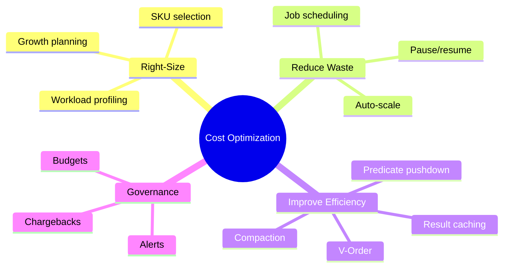
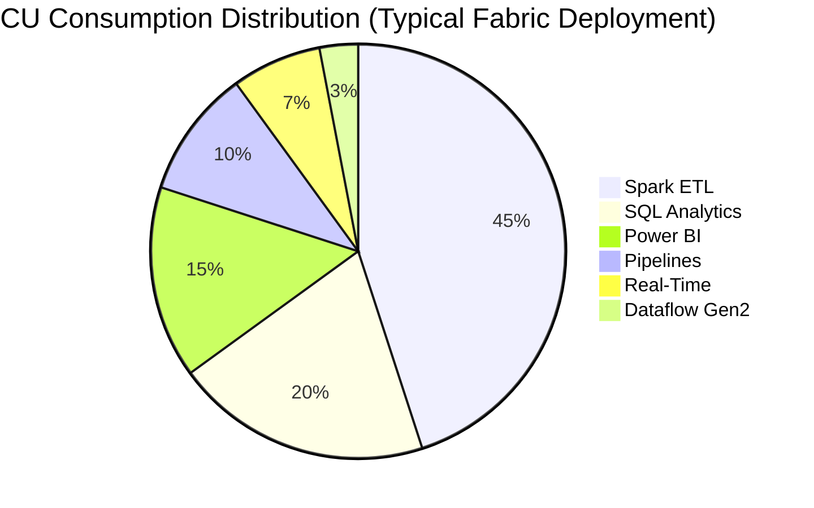
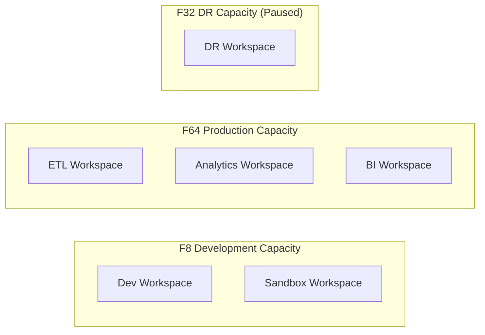
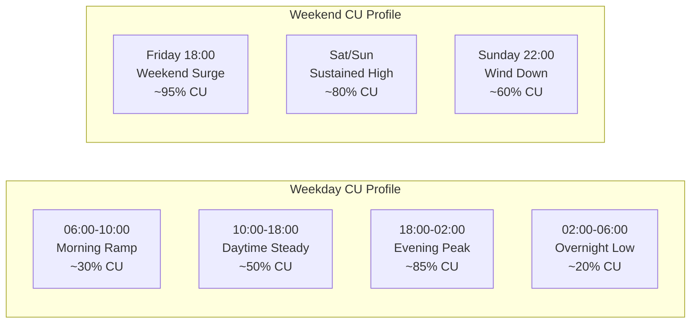
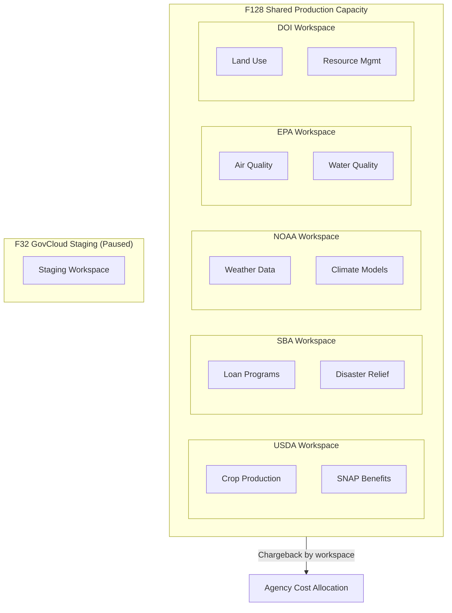
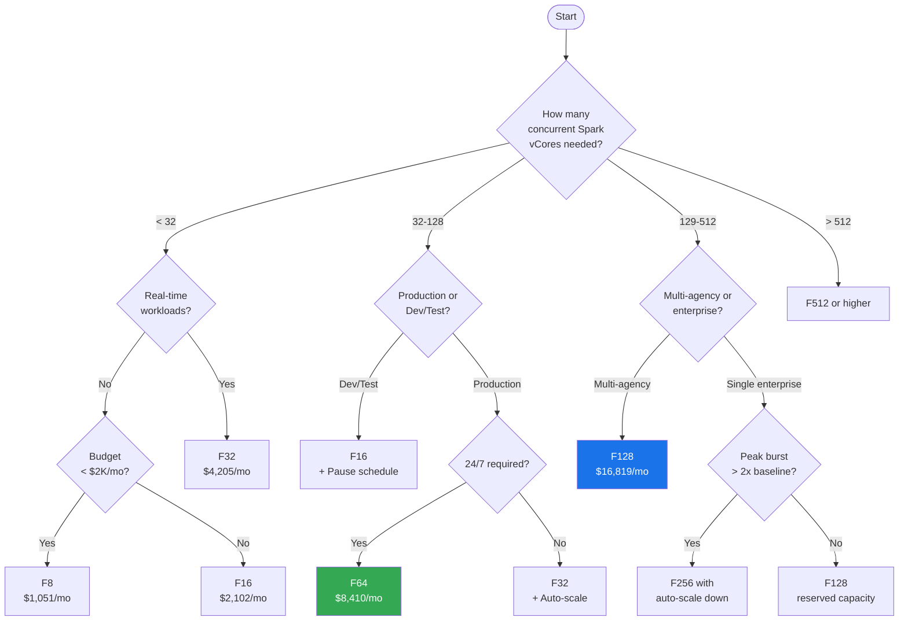
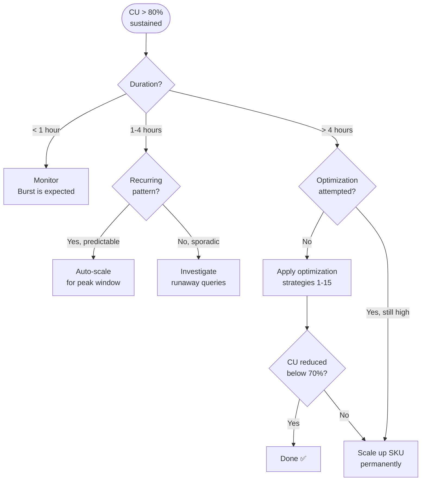

[Home](../index.md) > [Docs](../) > [Best Practices](./) > Capacity Planning & Cost Optimization

# 💰 Capacity Planning & Cost Optimization for Microsoft Fabric

<div align="center">

**Right-Size Your Fabric Capacity and Minimize Total Cost of Ownership**


</div>

---

**Last Updated:** `2026-04-13` | **Version:** 1.0.0

---

## 📑 Table of Contents

- [🎯 Overview](#-overview)
- [📊 SKU Selection Guide](#-sku-selection-guide)
- [⚡ Capacity Unit Cost Model](#-capacity-unit-cost-model)
- [🔧 Optimization Strategies](#-optimization-strategies)
- [📈 Monitoring & Cost Governance](#-monitoring--cost-governance)
- [🎰 Casino Industry Capacity Planning](#-casino-industry-capacity-planning)
- [🏛️ Federal Agency Capacity Planning](#️-federal-agency-capacity-planning)
- [🌳 Decision Trees](#-decision-trees)
- [🚫 Anti-Patterns](#-anti-patterns)
- [📚 References](#-references)

---

## 🎯 Overview

Microsoft Fabric uses a Capacity Unit (CU) consumption model where all workloads — Spark, SQL, Pipelines, Dataflows, Real-Time Intelligence, and Power BI — share a common pool of compute. Effective capacity planning ensures workloads run without throttling while avoiding over-provisioning that inflates costs.

### Key Concepts

| Concept | Description |
|---------|-------------|
| **Capacity Unit (CU)** | Universal compute currency across all Fabric workloads |
| **SKU** | Fixed capacity tier (F2 to F2048) determining CU allocation |
| **Burst** | Temporary ability to exceed baseline CU allocation (smoothed over 24h) |
| **Throttling** | Performance degradation when sustained CU usage exceeds SKU capacity |
| **Smoothing** | Fabric's mechanism to average CU usage over time windows (10s, 60s, 5m) |
| **Pause/Resume** | Ability to stop billing by pausing capacity during idle periods |

### Cost Optimization Goals



---

## 📊 SKU Selection Guide

### Fabric SKU Comparison

| SKU | CU | Max Spark vCores | Max SQL CU | Power BI Equivalent | Monthly Cost (Est.) | Best For |
|-----|-----|-------------------|------------|---------------------|---------------------|----------|
| **F2** | 2 | 8 | 2 | — | ~$263 | Dev/test, single developer |
| **F4** | 4 | 16 | 4 | — | ~$526 | Small dev team, prototyping |
| **F8** | 8 | 32 | 8 | — | ~$1,051 | Development, small POC |
| **F16** | 16 | 64 | 16 | — | ~$2,102 | Team development, medium POC |
| **F32** | 32 | 128 | 32 | — | ~$4,205 | Large POC, small production |
| **F64** | 64 | 256 | 64 | P1 | ~$8,410 | **POC target**, production (small) |
| **F128** | 128 | 512 | 128 | P2 | ~$16,819 | Medium production |
| **F256** | 256 | 1024 | 256 | P3 | ~$33,638 | Large production |
| **F512** | 512 | 2048 | 512 | P4 | ~$67,277 | Enterprise production |
| **F1024** | 1024 | 4096 | 1024 | P5 | ~$134,554 | Enterprise high-demand |
| **F2048** | 2048 | 8192 | 2048 | — | ~$269,107 | Hyperscale enterprise |

> **Note:** Costs are approximate East US list prices (pay-as-you-go). Reserved capacity (1-year or 3-year) offers 25–40% savings. Prices vary by region.

### SKU Selection Criteria

| Factor | Consideration |
|--------|--------------|
| **Concurrent users** | More BI viewers and report consumers require higher SKU |
| **Spark workload** | Large-scale ETL jobs consume significant CU; profile peak usage |
| **Real-time ingestion** | Eventstreams and KQL queries add continuous CU pressure |
| **SQL endpoints** | Direct Lake and SQL analytics consume CU on query execution |
| **Pipeline concurrency** | More concurrent pipeline activities require higher baseline CU |
| **Burst tolerance** | How much short-term burst above baseline is acceptable |
| **Budget constraints** | Match SKU to available budget with optimization strategies |

### Environment Strategy

| Environment | Recommended SKU | Schedule | Monthly Savings |
|-------------|----------------|----------|-----------------|
| **Development** | F4–F8 | Pause nights/weekends | ~65% |
| **Testing/QA** | F8–F16 | Pause after hours | ~50% |
| **Staging** | F32–F64 | Pause when not in use | ~70% |
| **Production** | F64–F256 | 24/7 (auto-scale) | — |
| **DR/Failover** | F32–F64 | Paused until failover | ~95% |

---

## ⚡ Capacity Unit Cost Model

### CU Consumption by Workload Type

Each Fabric workload consumes CU at different rates. Understanding these rates is critical for capacity planning.

| Workload | CU per Unit | Unit of Measure | Smoothing Window | Notes |
|----------|------------|-----------------|------------------|-------|
| **Spark** | 1 CU per vCore | Per vCore per second | 5 minutes | Largest consumer; optimize job duration |
| **SQL Analytics** | Variable | Per query complexity | 60 seconds | Direct Lake queries are lighter than import |
| **Data Pipeline** | 0.0056 CU | Per activity per hour | 60 seconds | Low per-activity cost; watch parallelism |
| **Dataflow Gen2** | 0.36 CU | Per compute-hour | 60 seconds | Mashup engine; profile data volumes |
| **Real-Time Intelligence** | Variable | Per event throughput | 10 seconds | Continuous ingestion cost |
| **Power BI** | Variable | Per render/refresh | 60 seconds | Interactive reports and scheduled refreshes |
| **Eventhouse KQL** | Variable | Per query | 10 seconds | Short smoothing = burst-sensitive |

### Typical Workload Distribution



### Cost Calculation Example (F64 POC)

```
F64 SKU = 64 CU = ~$8,410/month (pay-as-you-go)

With optimization:
  Pause dev capacity 16h/day weekdays + weekends = ~$2,800/month
  Reserved 1-year pricing                       = ~$6,300/month
  Reserved 1-year + pause dev                   = ~$2,100/month

Annual cost range: $25,200 (optimized) to $100,920 (24/7 PAYG)
```

### CU Consumption Forecasting

```python
# CU consumption estimation model
def estimate_monthly_cu_hours(
    spark_jobs_per_day: int,
    avg_spark_vcores: int,
    avg_spark_duration_min: float,
    sql_queries_per_day: int,
    avg_sql_cu_per_query: float,
    avg_sql_duration_sec: float,
    pipeline_activities_per_day: int,
    rti_events_per_sec: float,
    rti_cu_per_event: float,
    pbi_refreshes_per_day: int,
    avg_pbi_refresh_cu: float,
) -> dict:
    """Estimate monthly CU consumption across workloads."""
    days_per_month = 30

    # Spark: CU = vCores * duration_in_hours
    spark_cu_hours = (
        spark_jobs_per_day * avg_spark_vcores *
        (avg_spark_duration_min / 60) * days_per_month
    )

    # SQL: CU = queries * CU_per_query * duration_in_hours
    sql_cu_hours = (
        sql_queries_per_day * avg_sql_cu_per_query *
        (avg_sql_duration_sec / 3600) * days_per_month
    )

    # Pipeline: CU = activities * 0.0056 CU * assumed 1 hour per activity
    pipeline_cu_hours = (
        pipeline_activities_per_day * 0.0056 * days_per_month
    )

    # RTI: CU = events_per_sec * cu_per_event * seconds_per_day
    rti_cu_hours = (
        rti_events_per_sec * rti_cu_per_event *
        86400 * days_per_month / 3600
    )

    # Power BI: CU = refreshes * CU per refresh
    pbi_cu_hours = (
        pbi_refreshes_per_day * avg_pbi_refresh_cu * days_per_month
    )

    total = spark_cu_hours + sql_cu_hours + pipeline_cu_hours + rti_cu_hours + pbi_cu_hours

    return {
        "spark_cu_hours": round(spark_cu_hours, 1),
        "sql_cu_hours": round(sql_cu_hours, 1),
        "pipeline_cu_hours": round(pipeline_cu_hours, 1),
        "rti_cu_hours": round(rti_cu_hours, 1),
        "pbi_cu_hours": round(pbi_cu_hours, 1),
        "total_cu_hours": round(total, 1),
        "recommended_sku": _recommend_sku(total),
    }

def _recommend_sku(total_cu_hours: float) -> str:
    """Recommend SKU based on total monthly CU-hours."""
    avg_cu_per_hour = total_cu_hours / (30 * 24)
    # Add 30% headroom for burst
    required_cu = avg_cu_per_hour * 1.3
    skus = [2, 4, 8, 16, 32, 64, 128, 256, 512, 1024, 2048]
    for sku in skus:
        if sku >= required_cu:
            return f"F{sku}"
    return "F2048+"
```

---

## 🔧 Optimization Strategies

### Strategy 1: Auto-Scale Capacity

Microsoft Fabric supports programmatic capacity scaling through the Azure Resource Manager API. Implement auto-scale by monitoring CU utilization and adjusting SKU tiers.

```python
# Auto-scale Fabric capacity based on utilization
import requests
from azure.identity import DefaultAzureCredential

def scale_fabric_capacity(
    subscription_id: str,
    resource_group: str,
    capacity_name: str,
    target_sku: str,
):
    """Scale Fabric capacity to target SKU."""
    credential = DefaultAzureCredential()
    token = credential.get_token("https://management.azure.com/.default")

    url = (
        f"https://management.azure.com/subscriptions/{subscription_id}"
        f"/resourceGroups/{resource_group}"
        f"/providers/Microsoft.Fabric/capacities/{capacity_name}"
        f"?api-version=2023-11-01"
    )

    payload = {
        "sku": {
            "name": target_sku,
            "tier": "Fabric"
        }
    }

    response = requests.patch(
        url,
        json=payload,
        headers={
            "Authorization": f"Bearer {token.token}",
            "Content-Type": "application/json"
        }
    )
    response.raise_for_status()
    return response.json()
```

### Strategy 2: Pause/Resume Scheduling

Pause capacity during off-hours to reduce costs by 50–70%.

```python
# Pause/Resume capacity on a schedule
def pause_capacity(subscription_id, resource_group, capacity_name):
    """Pause Fabric capacity to stop billing."""
    credential = DefaultAzureCredential()
    token = credential.get_token("https://management.azure.com/.default")

    url = (
        f"https://management.azure.com/subscriptions/{subscription_id}"
        f"/resourceGroups/{resource_group}"
        f"/providers/Microsoft.Fabric/capacities/{capacity_name}"
        f"/suspend?api-version=2023-11-01"
    )

    response = requests.post(
        url,
        headers={"Authorization": f"Bearer {token.token}"}
    )
    response.raise_for_status()

def resume_capacity(subscription_id, resource_group, capacity_name):
    """Resume Fabric capacity to restart billing."""
    credential = DefaultAzureCredential()
    token = credential.get_token("https://management.azure.com/.default")

    url = (
        f"https://management.azure.com/subscriptions/{subscription_id}"
        f"/resourceGroups/{resource_group}"
        f"/providers/Microsoft.Fabric/capacities/{capacity_name}"
        f"/resume?api-version=2023-11-01"
    )

    response = requests.post(
        url,
        headers={"Authorization": f"Bearer {token.token}"}
    )
    response.raise_for_status()
```

### Strategy 3: V-Order Optimization

V-Order is a write-time optimization that arranges Parquet data for faster read performance, reducing CU consumed by queries.

```python
# Databricks notebook source
# COMMAND ----------
# Enable V-Order on Delta tables for optimal read performance
spark.conf.set("spark.sql.parquet.vorder.enabled", "true")

# Write with V-Order
df_slot_telemetry.write \
    .format("delta") \
    .mode("overwrite") \
    .option("vorder", "true") \
    .save("Tables/gold_slot_performance")

# V-Order reduces read CU by 30-50% for typical analytical queries
```

### Strategy 4: Predicate Pushdown

Ensure filters are pushed to the storage layer to minimize data scanned.

```python
# Good: Predicate pushdown - only reads matching partitions
df = spark.read.format("delta").load("Tables/bronze_slot_telemetry") \
    .filter("event_date >= '2026-04-01' AND event_date < '2026-04-14'")

# Bad: No pushdown - reads all data then filters
df = spark.read.format("delta").load("Tables/bronze_slot_telemetry")
df_filtered = df.toPandas()  # Collects all data to driver
df_filtered = df_filtered[df_filtered["event_date"] >= "2026-04-01"]
```

### Strategy 5: Delta Table Compaction

Small files increase query overhead. Schedule compaction to consolidate files.

```python
# OPTIMIZE command consolidates small files
spark.sql("""
    OPTIMIZE gold_slot_performance
    WHERE event_date >= current_date() - INTERVAL 7 DAYS
    ZORDER BY (casino_id, machine_id)
""")

# VACUUM removes old files beyond retention period
spark.sql("""
    VACUUM gold_slot_performance RETAIN 168 HOURS
""")
```

### Strategy 6: Materialized Views

Use materialized views to pre-compute expensive aggregations.

```sql
-- Create materialized view for frequently queried KPIs
CREATE MATERIALIZED VIEW mv_daily_casino_revenue AS
SELECT
    casino_id,
    CAST(event_timestamp AS DATE) AS event_date,
    COUNT(*) AS total_plays,
    SUM(amount_wagered) AS total_wagered,
    SUM(amount_won) AS total_won,
    SUM(amount_wagered - amount_won) AS gross_gaming_revenue
FROM gold_slot_performance
GROUP BY casino_id, CAST(event_timestamp AS DATE);

-- Queries against this view use cached results (minimal CU)
SELECT * FROM mv_daily_casino_revenue
WHERE event_date = CURRENT_DATE - 1;
```

### Strategy 7: Result Caching

Enable result caching to serve repeated queries from cache.

```sql
-- Enable result caching at the session level
ALTER DATABASE SCOPED CONFIGURATION SET RESULT_SET_CACHING = ON;

-- Verify cache hit ratio
SELECT
    result_cache_hit,
    COUNT(*) AS query_count,
    AVG(total_elapsed_time_ms) AS avg_elapsed_ms
FROM sys.dm_exec_requests_history
GROUP BY result_cache_hit;
```

### Strategy 8: Spark Session Configuration

Optimize Spark sessions to avoid idle CU consumption.

```python
# Set aggressive session timeouts
spark.conf.set("spark.fabric.session.idle.timeout", "300")  # 5 minutes
spark.conf.set("spark.executor.instances", "auto")  # Auto-scale executors

# Use high-concurrency mode for shared sessions
# Reduces per-user session overhead
spark.conf.set("spark.fabric.pool.type", "highConcurrency")
```

### Strategy 9: Pipeline Activity Optimization

Consolidate pipeline activities to reduce overhead.

```json
{
    "name": "OptimizedPipeline",
    "properties": {
        "activities": [
            {
                "name": "BulkCopy",
                "type": "Copy",
                "policy": {
                    "retry": 3,
                    "retryIntervalInSeconds": 30,
                    "timeout": "01:00:00"
                },
                "typeProperties": {
                    "parallelCopies": 16,
                    "dataIntegrationUnits": "Auto",
                    "enableStaging": false
                }
            }
        ]
    }
}
```

### Strategy 10: Direct Lake Mode

Use Direct Lake instead of Import mode for Power BI to avoid data duplication and reduce refresh CU.

```dax
// Verify Direct Lake connection mode
EVALUATE
SELECTCOLUMNS(
    INFO.TABLES(),
    "Table", [Name],
    "Mode", [StorageMode],
    "RefreshType", [RefreshType]
)
```

### Strategy 11: Workspace Separation

Separate workloads across workspaces to isolate CU consumption and enable independent scaling.



### Strategy 12: Data Lifecycle Management

Archive cold data to reduce storage costs and query surface area.

```python
# Archive data older than 90 days to cold storage
from datetime import datetime, timedelta

archive_date = (datetime.now() - timedelta(days=90)).strftime("%Y-%m-%d")

# Move cold data to archive table with lower storage tier
spark.sql(f"""
    INSERT INTO archive_slot_telemetry
    SELECT * FROM bronze_slot_telemetry
    WHERE event_date < '{archive_date}'
""")

# Remove archived data from hot table
spark.sql(f"""
    DELETE FROM bronze_slot_telemetry
    WHERE event_date < '{archive_date}'
""")

# Run VACUUM to reclaim storage
spark.sql("VACUUM bronze_slot_telemetry RETAIN 168 HOURS")
```

### Strategy 13: Query Optimization

Profile and optimize expensive queries to reduce CU consumption.

```kql
// Identify top CU-consuming queries in Eventhouse
.show queries
| where StartedOn > ago(24h)
| summarize TotalCPU = sum(TotalCPU), Count = count()
    by User, ClientRequestId, Text = substring(Text, 0, 200)
| top 20 by TotalCPU desc
```

### Strategy 14: Scheduled Refresh Windows

Stagger scheduled refreshes to avoid CU spikes.

```python
# Stagger refresh schedules across workspaces
refresh_schedule = {
    "bronze_ingestion": "00:00, 06:00, 12:00, 18:00",  # 4x daily
    "silver_transform": "01:00, 07:00, 13:00, 19:00",  # Offset by 1 hour
    "gold_aggregation": "02:00, 08:00, 14:00, 20:00",  # Offset by 2 hours
    "pbi_refresh":      "03:00, 09:00, 15:00, 21:00",  # Offset by 3 hours
}
```

### Strategy 15: Reserved Capacity

Lock in lower pricing with reserved instances for predictable workloads.

| Commitment | Discount vs PAYG | Best For |
|------------|------------------|----------|
| Pay-as-you-go | Baseline | Variable/unpredictable workloads |
| 1-year reserved | ~25% savings | Stable production workloads |
| 3-year reserved | ~40% savings | Long-term, committed deployments |

> **Tip:** Use PAYG for development/test environments and reserved capacity for production.

---

## 📈 Monitoring & Cost Governance

### Capacity Metrics Dashboard

```kql
// Monitor CU utilization over time
FabricCapacityMetrics
| where TimeGenerated > ago(7d)
| summarize
    AvgCU = avg(CUPercentage),
    MaxCU = max(CUPercentage),
    P95CU = percentile(CUPercentage, 95)
    by bin(TimeGenerated, 1h)
| render timechart
```

### Throttling Detection

```kql
// Detect throttling events
FabricCapacityMetrics
| where TimeGenerated > ago(24h)
| where ThrottlingState != "None"
| summarize
    ThrottleCount = count(),
    AvgCU = avg(CUPercentage),
    MaxCU = max(CUPercentage)
    by bin(TimeGenerated, 15m), ThrottlingState
| order by TimeGenerated desc
```

### Cost Allocation Tags

```bicep
// Tag Fabric capacity for cost allocation
resource fabricCapacity 'Microsoft.Fabric/capacities@2023-11-01' = {
  name: capacityName
  location: location
  sku: {
    name: skuName
    tier: 'Fabric'
  }
  tags: {
    Environment: environment
    CostCenter: costCenter
    Project: 'Supercharge-Fabric-POC'
    Owner: ownerEmail
    Department: department
    AutoPause: 'true'
  }
}
```

### Budget Alerts

| Alert | Threshold | Action |
|-------|-----------|--------|
| Budget warning | 75% of monthly budget | Email notification |
| Budget critical | 90% of monthly budget | Email + Teams alert |
| Budget exceeded | 100% of monthly budget | Email + Teams + manager escalation |
| CU sustained > 80% | 4 hours continuously | Scale-up recommendation |
| CU sustained < 20% | 24 hours continuously | Scale-down recommendation |
| Throttling detected | Any occurrence | Investigate workload distribution |

---

## 🎰 Casino Industry Capacity Planning

### 24/7 Operations Profile

Casino operations run continuously with predictable peak patterns. Capacity must handle peak loads without throttling during high-revenue periods.



### Casino Capacity Sizing

| Component | Weekday CU | Friday Peak CU | Notes |
|-----------|-----------|-----------------|-------|
| Slot telemetry ingestion | 15 | 25 | 5,000+ machines, 10s intervals |
| Table game tracking | 8 | 15 | 500+ tables, real-time hands |
| Compliance (CTR/SAR) | 5 | 10 | Spikes during high-play periods |
| Player analytics | 10 | 12 | Loyalty calculations, segmentation |
| BI dashboards (floor mgmt) | 12 | 18 | 50+ concurrent viewers during peak |
| Real-time alerting | 5 | 8 | Anomaly detection, security |
| **Total** | **55** | **88** | **F64 with burst; F128 for headroom** |

### Casino Auto-Scale Policy

```python
# Casino-specific auto-scale rules
CASINO_SCALE_RULES = {
    "weekday_day": {
        "hours": "06:00-18:00",
        "days": ["Mon", "Tue", "Wed", "Thu"],
        "sku": "F64",
    },
    "weekday_evening": {
        "hours": "18:00-02:00",
        "days": ["Mon", "Tue", "Wed", "Thu"],
        "sku": "F64",  # Burst handles peak
    },
    "friday_peak": {
        "hours": "18:00-02:00",
        "days": ["Fri"],
        "sku": "F128",  # Scale up for Friday night
    },
    "weekend": {
        "hours": "00:00-23:59",
        "days": ["Sat", "Sun"],
        "sku": "F128",  # Sustained weekend traffic
    },
    "overnight": {
        "hours": "02:00-06:00",
        "days": ["Mon", "Tue", "Wed", "Thu", "Fri"],
        "sku": "F64",  # Minimum for 24/7 compliance
    },
}
```

### Casino Cost Optimization Summary

| Strategy | Annual Savings (F64 base) | Implementation |
|----------|--------------------------|----------------|
| Friday burst to F128 instead of F128 baseline | ~$50,000 | Auto-scale policy |
| V-Order on slot telemetry tables | ~$8,000 | Write-time optimization |
| Stagger ETL and BI refreshes | ~$5,000 | Schedule coordination |
| Direct Lake for floor dashboards | ~$12,000 | Eliminate import refresh CU |
| Compaction on hot tables | ~$4,000 | Weekly OPTIMIZE jobs |
| **Total estimated savings** | **~$79,000/yr** | — |

---

## 🏛️ Federal Agency Capacity Planning

### Multi-Agency Shared Capacity

Federal deployments often share Fabric capacity across multiple agencies to optimize cost while maintaining data isolation through workspaces.



### Federal CU Allocation by Agency

| Agency | Estimated CU Share | Peak Pattern | Key Workloads |
|--------|-------------------|--------------|---------------|
| USDA | 25 CU (20%) | Quarterly crop reports | Spark ETL, batch analytics |
| SBA | 30 CU (23%) | Fiscal year-end, disaster events | PII processing, loan analytics |
| NOAA | 35 CU (27%) | Storm season, daily forecast refresh | Streaming ingestion, time-series |
| EPA | 20 CU (16%) | Monitoring season (May–Sep) | Sensor data, geospatial |
| DOI | 18 CU (14%) | Wildfire season, drilling permits | Spatial analytics, resource modeling |
| **Total** | **128 CU** | — | **F128 recommended** |

### FedRAMP Billing Considerations

| Consideration | Impact | Mitigation |
|---------------|--------|------------|
| FedRAMP audit logging | +5–10% CU for continuous logging | Budget for monitoring overhead |
| Encryption overhead | Negligible (~1–3ms per operation) | No capacity impact |
| Data residency | Must use US Gov regions (higher pricing) | Budget +15–20% vs commercial |
| COOP/DR capacity | Standby capacity in secondary region | Use paused capacity (~$0 when idle) |
| Continuous monitoring | ConMon reporting queries | Schedule during off-peak hours |

### Federal Chargeback Model

```python
# Federal agency chargeback calculation
def calculate_agency_chargeback(
    total_monthly_cost: float,
    agency_cu_hours: dict,
) -> dict:
    """Calculate per-agency chargeback based on CU consumption."""
    total_cu_hours = sum(agency_cu_hours.values())

    chargebacks = {}
    for agency, cu_hours in agency_cu_hours.items():
        proportion = cu_hours / total_cu_hours if total_cu_hours > 0 else 0
        chargebacks[agency] = {
            "cu_hours": cu_hours,
            "proportion": round(proportion, 4),
            "monthly_cost": round(total_monthly_cost * proportion, 2),
        }

    return chargebacks

# Example usage
monthly_cost = 16_819  # F128 monthly
agency_usage = {
    "USDA": 1800,
    "SBA": 2100,
    "NOAA": 2500,
    "EPA": 1400,
    "DOI": 1200,
}
print(calculate_agency_chargeback(monthly_cost, agency_usage))
```

---

## 🌳 Decision Trees

### Which SKU Should I Choose?



### Should I Scale Up or Optimize?



---

## 🚫 Anti-Patterns

### Anti-Pattern 1: Over-Provisioning for Peak

**Problem:** Selecting an F256 because Friday nights spike to 200 CU, when average usage is 50 CU.

**Impact:** ~$300K/year wasted.

**Solution:** Use F64 baseline with auto-scale to F128 or F256 during known peak windows.

### Anti-Pattern 2: Never Pausing Development Capacity

**Problem:** F16 development capacity running 24/7 when developers work 8 hours/day, 5 days/week.

**Impact:** ~$16K/year wasted (65% of capacity cost is idle).

**Solution:** Implement pause/resume schedule: pause at 7 PM, resume at 7 AM on weekdays. Pause all weekend.

### Anti-Pattern 3: Ignoring Small File Problem

**Problem:** Thousands of small Delta files from frequent micro-batch writes without compaction.

**Impact:** 3–5x more CU consumed for the same queries due to file overhead.

**Solution:** Schedule daily OPTIMIZE on hot tables and weekly VACUUM to clean up old files.

### Anti-Pattern 4: Import Mode Instead of Direct Lake

**Problem:** Using Import mode for Power BI datasets when data is already in OneLake.

**Impact:** Duplicate data storage + scheduled refresh CU consumption.

**Solution:** Switch to Direct Lake mode which reads directly from Delta tables with zero data movement.

### Anti-Pattern 5: Unbounded KQL Queries

**Problem:** Running KQL queries without time filters on large Eventhouse tables.

**Impact:** Massive CU spike that can throttle the entire capacity.

**Solution:** Always include `| where Timestamp > ago(...)` as the first filter in KQL queries.

### Anti-Pattern 6: Monolithic Spark Jobs

**Problem:** Single Spark job running for 4+ hours consuming maximum vCores.

**Impact:** Blocks other workloads, sustained CU saturation.

**Solution:** Break into smaller jobs, use incremental processing, schedule during off-peak hours.

### Anti-Pattern 7: No Cost Tagging

**Problem:** Single Fabric capacity serving multiple teams with no visibility into who consumes what.

**Impact:** No accountability, no optimization incentive, budget surprises.

**Solution:** Use workspace separation + Azure tags + capacity metrics to build chargeback reports.

---

## 📚 References

### Microsoft Documentation

- [Microsoft Fabric capacity and SKUs](https://learn.microsoft.com/fabric/enterprise/licenses)
- [Fabric capacity metrics app](https://learn.microsoft.com/fabric/enterprise/metrics-app)
- [Understand Fabric capacity throttling](https://learn.microsoft.com/fabric/enterprise/throttling)
- [Pause and resume Fabric capacity](https://learn.microsoft.com/fabric/enterprise/pause-resume)
- [Fabric pricing calculator](https://azure.microsoft.com/pricing/details/microsoft-fabric/)
- [Smoothing and bursting in Fabric](https://learn.microsoft.com/fabric/enterprise/fabric-operations)
- [V-Order optimization](https://learn.microsoft.com/fabric/data-engineering/delta-optimization-and-v-order)
- [Direct Lake mode](https://learn.microsoft.com/fabric/get-started/direct-lake-overview)

### Cost Management

- [Azure Cost Management best practices](https://learn.microsoft.com/azure/cost-management-billing/costs/cost-mgt-best-practices)
- [Azure reservations for Fabric](https://learn.microsoft.com/azure/cost-management-billing/reservations/fabric-capacity)
- [Azure budgets and alerts](https://learn.microsoft.com/azure/cost-management-billing/costs/tutorial-acm-create-budgets)

### Compliance

- [FedRAMP financial management](https://www.fedramp.gov/)
- [NIGC MICS](https://www.nigc.gov/compliance/minimum-internal-control-standards)
- [OMB A-123 financial management](https://www.whitehouse.gov/omb/information-for-agencies/circulars/)

---

## Related Documents

- [Performance & Parallelism](./performance-parallelism.md) -- Spark and pipeline performance tuning
- [Error Handling & Monitoring](./error-handling-monitoring.md) -- Centralized monitoring and alerting
- [Alerting & Data Activator](./alerting-data-activator.md) -- Automated alerting patterns
- [Disaster Recovery & BCDR](./disaster-recovery-bcdr.md) -- Business continuity planning
- [Fabric CI/CD Deployment](./fabric-cicd-deployment.md) -- Deployment pipeline patterns

---

[Back to Best Practices Index](./README.md) | [Back to Documentation](../index.md)
