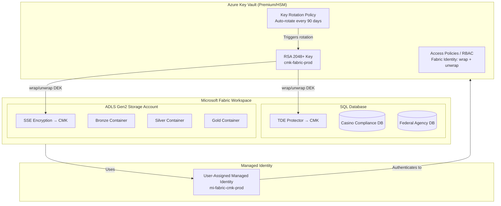
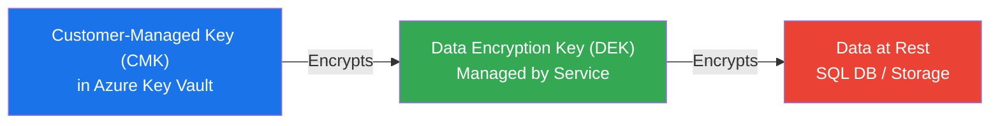
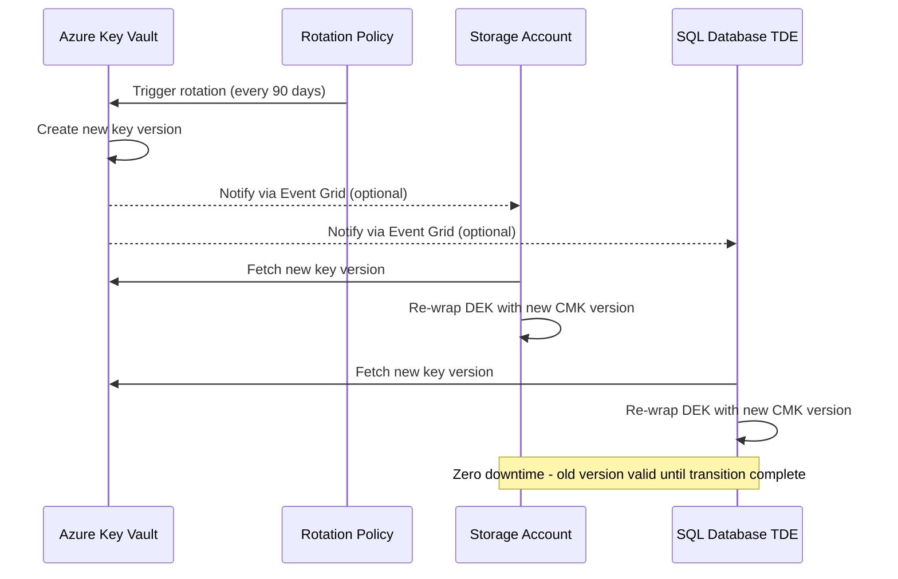

[Home](../index.md) > [Docs](../) > [Best Practices](./) > Customer-Managed Keys

# 🔐 Customer-Managed Keys (CMK) for Microsoft Fabric

<div align="center" markdown>

**Bring Your Own Encryption Keys for Full Data Sovereignty**


</div>

---

**Last Updated:** `2026-04-13` | **Version:** 1.0.0

---

## 📑 Table of Contents

- [🎯 Overview](#-overview)
- [🏗️ Architecture](#️-architecture)
- [⚙️ Key Vault Setup](#️-key-vault-setup)
- [🗃️ SQL Database CMK](#️-sql-database-cmk)
- [💾 Storage Account CMK](#-storage-account-cmk)
- [🔄 Key Rotation](#-key-rotation)
- [🎰 Casino Compliance](#-casino-compliance)
- [🏛️ Federal Compliance Mapping](#️-federal-compliance-mapping)
- [📊 Monitoring & Alerting](#-monitoring--alerting)
- [⚠️ Limitations](#️-limitations)
- [📚 References](#-references)

---

## 🎯 Overview

Customer-Managed Keys (CMK) give organizations full control over the encryption keys that protect data at rest in Microsoft Fabric. With CMK support reaching General Availability for Fabric SQL Database in March 2026, organizations can now use their own Azure Key Vault keys for workspace SQL database encryption, combining Fabric's analytics platform with enterprise-grade key management.

### Why Customer-Managed Keys?

| Benefit | Description |
|---------|-------------|
| **Data Sovereignty** | Organization retains full ownership and control of encryption keys |
| **Compliance** | Meets regulatory requirements for key management (PCI DSS, HIPAA, FedRAMP, FISMA) |
| **Key Lifecycle Control** | Define rotation schedules, expiration policies, and revocation procedures |
| **Auditability** | Full audit trail of key usage, access, and rotation through Key Vault logs |
| **Revocation** | Ability to revoke access to encrypted data by disabling or deleting keys |

### What CMK Covers

| Component | CMK Support | Encryption Method |
|-----------|-------------|-------------------|
| Fabric SQL Database | ✅ GA (March 2026) | Transparent Data Encryption (TDE) with CMK |
| ADLS Gen2 Storage Account | ✅ GA | Storage Service Encryption (SSE) with CMK |
| Fabric Lakehouse (OneLake) | ⚠️ Platform-managed | Microsoft-managed keys (MMK) only |
| Eventhouse | ⚠️ Platform-managed | Microsoft-managed keys (MMK) only |
| Power BI Semantic Models | ⚠️ Platform-managed | Microsoft-managed keys (MMK) only |

> **Note:** CMK for Fabric SQL Database uses the same TDE architecture as Azure SQL Database. Storage Account CMK uses the standard Azure Storage SSE with Key Vault integration.

---

## 🏗️ Architecture

### End-to-End CMK Flow



### Key Hierarchy



The CMK wraps (encrypts) the Data Encryption Key. The DEK is what actually encrypts data blocks. This two-tier model means rotating the CMK does not require re-encrypting all data — only the DEK wrapper changes.

---

## ⚙️ Key Vault Setup

### Step 1: Create an Azure Key Vault

Use a Premium SKU or Managed HSM for hardware-backed key protection in production.

```bicep
resource keyVault 'Microsoft.KeyVault/vaults@2023-07-01' = {
  name: 'kv-fabric-cmk-prod'
  location: location
  properties: {
    tenantId: subscription().tenantId
    sku: {
      family: 'A'
      name: 'premium'  // HSM-backed keys
    }
    enableSoftDelete: true
    softDeleteRetentionInDays: 90
    enablePurgeProtection: true   // REQUIRED for CMK - prevents accidental key deletion
    enableRbacAuthorization: true // Use Azure RBAC instead of vault access policies
    networkAcls: {
      defaultAction: 'Deny'
      bypass: 'AzureServices'
    }
  }
}
```

> **Critical:** Both `enableSoftDelete` and `enablePurgeProtection` must be enabled. Purge protection prevents permanent deletion of keys during the soft-delete retention period, protecting against accidental or malicious key destruction.

### Step 2: Create the Encryption Key

Create an RSA key with a minimum size of 2048 bits. RSA 3072 or 4096 is recommended for long-term protection.

```bicep
resource cmkKey 'Microsoft.KeyVault/vaults/keys@2023-07-01' = {
  parent: keyVault
  name: 'cmk-fabric-prod'
  properties: {
    kty: 'RSA'
    keySize: 3072
    keyOps: [
      'wrapKey'
      'unwrapKey'
    ]
    attributes: {
      enabled: true
    }
    rotationPolicy: {
      lifetimeActions: [
        {
          trigger: {
            timeBeforeExpiry: 'P30D'
          }
          action: {
            type: 'Notify'
          }
        }
        {
          trigger: {
            timeAfterCreate: 'P90D'
          }
          action: {
            type: 'Rotate'
          }
        }
      ]
      attributes: {
        expiryTime: 'P1Y'
      }
    }
  }
}
```

### Step 3: Create a User-Assigned Managed Identity

```bicep
resource cmkIdentity 'Microsoft.ManagedIdentity/userAssignedIdentities@2023-01-31' = {
  name: 'mi-fabric-cmk-prod'
  location: location
}
```

### Step 4: Grant Key Vault Access

Assign the **Key Vault Crypto Service Encryption User** role to the managed identity. This grants `wrapKey` and `unwrapKey` permissions without broader key management access.

```bicep
var kvCryptoUserRoleId = 'e147488a-f6f5-4113-8e2d-b22465e65bf6' // Key Vault Crypto Service Encryption User

resource kvRoleAssignment 'Microsoft.Authorization/roleAssignments@2022-04-01' = {
  name: guid(keyVault.id, cmkIdentity.id, kvCryptoUserRoleId)
  scope: keyVault
  properties: {
    roleDefinitionId: subscriptionResourceId('Microsoft.Authorization/roleDefinitions', kvCryptoUserRoleId)
    principalId: cmkIdentity.properties.principalId
    principalType: 'ServicePrincipal'
  }
}
```

### Key Vault Configuration Checklist

| Setting | Required Value | Why |
|---------|---------------|-----|
| Soft delete | Enabled | Prevents accidental key loss |
| Purge protection | Enabled | Blocks permanent deletion during retention |
| SKU | Premium or Managed HSM | HSM-backed key storage for production |
| Key type | RSA 2048+ | Minimum for CMK encryption |
| Key operations | wrapKey, unwrapKey | Only operations needed for CMK |
| Network ACLs | Deny + Azure Services bypass | Restrict network access |
| RBAC authorization | Enabled | Use Azure RBAC for access control |

---

## 🗃️ SQL Database CMK

### Enable CMK on Fabric SQL Database

Fabric SQL Database supports Transparent Data Encryption (TDE) with customer-managed keys. When enabled, the TDE protector is set to the Key Vault key instead of the service-managed key.

### Configuration Steps

1. **Create the SQL Database** in a Fabric workspace
2. **Assign the managed identity** to the workspace
3. **Set the TDE protector** to the Key Vault key URI

```sql
-- Verify current TDE status
SELECT
    db.name AS database_name,
    dek.encryption_state,
    dek.encryptor_type,
    dek.key_algorithm,
    dek.key_length
FROM sys.dm_database_encryption_keys dek
JOIN sys.databases db ON dek.database_id = db.database_id;
```

### Monitoring TDE Status

```kql
// KQL query for Eventhouse - track TDE key operations
AzureDiagnostics
| where ResourceProvider == "MICROSOFT.SQL"
| where Category == "SQLSecurityAuditEvents"
| where OperationName has "TDE"
| project TimeGenerated, OperationName, ServerName, DatabaseName, Status
| order by TimeGenerated desc
| take 100
```

### Key Rotation for SQL Database

When the Key Vault key rotates, TDE automatically picks up the new key version:

1. Key Vault creates a new key version (auto-rotation or manual)
2. TDE detects the new version and re-wraps the DEK
3. Old key version remains active until all DEKs are re-wrapped
4. No downtime, no data re-encryption required

> **Important:** Never disable or delete the old key version until TDE has fully transitioned to the new version. Monitor the `encryptor_thumbprint` column to confirm the switch.

---

## 💾 Storage Account CMK

### ADLS Gen2 Encryption with CMK

Azure Storage accounts (ADLS Gen2) used as the Fabric landing zone support encryption with customer-managed keys. This encrypts all data in blob, file, table, and queue storage services.

### Bicep Configuration

The storage account module in this project (`infra/modules/storage/storage-account.bicep`) supports conditional CMK configuration:

```bicep
// Enable CMK by passing these parameters:
param enableCmk bool = true
param keyVaultKeyUri string = 'https://kv-fabric-cmk-prod.vault.azure.net/keys/cmk-fabric-prod'
param keyVaultIdentityId string = '/subscriptions/.../mi-fabric-cmk-prod'
```

When `enableCmk` is `true`, the storage account:

- Sets `keySource` to `Microsoft.Keyvault`
- Configures `keyvaultproperties` with the key name and vault URI
- Attaches a user-assigned managed identity for Key Vault authentication
- Encrypts all four storage services (blob, file, table, queue) with the CMK

### Identity Requirements

| Identity Type | Use Case | Configuration |
|---------------|----------|---------------|
| User-assigned managed identity | Recommended for CMK | Explicitly created, assigned to storage account |
| System-assigned managed identity | Alternative approach | Auto-created, but tightly coupled to resource lifecycle |

> **Recommendation:** Use a user-assigned managed identity so the same identity can be shared across multiple storage accounts and the identity lifecycle is independent of any single resource.

### Verify CMK Encryption

```powershell
# Verify storage account encryption source
$sa = Get-AzStorageAccount -ResourceGroupName "rg-fabric-prod" -Name "stfabriclz"
$sa.Encryption.KeySource
# Expected output: Microsoft.Keyvault

$sa.Encryption.KeyVaultProperties.KeyName
# Expected output: cmk-fabric-prod

$sa.Encryption.KeyVaultProperties.KeyVaultUri
# Expected output: https://kv-fabric-cmk-prod.vault.azure.net
```

---

## 🔄 Key Rotation

### Automatic Rotation

Azure Key Vault supports automatic key rotation policies. When configured, the key vault creates a new key version at the specified interval, and dependent services (Storage, SQL) automatically pick up the new version.



### Manual Rotation Procedure

For ad-hoc rotation (e.g., suspected key compromise):

1. **Create a new key version** in Azure Key Vault
2. **Update the storage account** key vault URI to the new version (or use versionless URI for auto-pickup)
3. **Monitor** the encryption status to confirm the new version is active
4. **Retain the old version** for at least 24 hours before disabling

```bash
# Create a new key version
az keyvault key rotate --vault-name kv-fabric-cmk-prod --name cmk-fabric-prod

# Verify the new version
az keyvault key show --vault-name kv-fabric-cmk-prod --name cmk-fabric-prod \
  --query '{name:name, version:properties.version, created:attributes.created}'
```

### Rotation Monitoring

| Metric | Alert Threshold | Action |
|--------|----------------|--------|
| Key age | > 80 days (for 90-day policy) | Warning: rotation imminent |
| Key expiration | < 30 days to expiry | Critical: rotate immediately |
| Rotation failure | Any failure event | Critical: investigate Key Vault access |
| Key version count | > 10 active versions | Housekeeping: disable old versions |

---

## 🎰 Casino Compliance

### PCI DSS Encryption Requirements

PCI DSS v4.0 mandates strong encryption for cardholder data at rest. CMK addresses several requirements:

| PCI DSS Requirement | CMK Coverage | Implementation |
|---------------------|-------------|----------------|
| **3.5.1** Protect cryptographic keys | Key Vault with HSM backing, RBAC | Premium SKU, purge protection |
| **3.5.1.2** Key access restricted | Managed identity with minimal permissions | `wrapKey`/`unwrapKey` only |
| **3.6.1** Key generation procedures | Documented Key Vault key creation | Bicep templates, IaC audit trail |
| **3.6.4** Key rotation at cryptoperiod end | Automatic 90-day rotation | Key Vault rotation policy |
| **3.6.5** Key retirement/replacement | Soft delete + purge protection | 90-day retention, controlled disable |
| **3.7.1** Key management policies documented | This document + runbooks | Versioned in source control |

### Gaming Commission Encryption Standards

| Standard | Requirement | CMK Implementation |
|----------|------------|-------------------|
| NIGC MICS §542.17 | Encryption of financial records | TDE with CMK on SQL databases containing CTR/SAR data |
| Nevada NGC Reg. 14 | Encrypted storage of player data | ADLS Gen2 CMK for bronze/silver/gold PII data |
| NJ DGE Technical Standards | Key management procedures | Key Vault rotation policies, audit logs |

### CTR/SAR Data Encryption

Currency Transaction Reports (CTR) and Suspicious Activity Reports (SAR) contain sensitive financial data that must be encrypted at rest with controlled key management:

```
Bronze Layer: Raw CTR/SAR filings → Encrypted via ADLS Gen2 CMK
Silver Layer: Validated, deduplicated records → Encrypted via ADLS Gen2 CMK
Gold Layer:  Compliance aggregations → Encrypted via SQL Database TDE CMK
```

---

## 🏛️ Federal Compliance Mapping

### HIPAA Encryption Requirements (Tribal Healthcare)

| HIPAA Provision | Requirement | CMK Implementation |
|-----------------|------------|-------------------|
| §164.312(a)(2)(iv) | Encryption of ePHI at rest | TDE CMK for SQL databases with PHI |
| §164.312(e)(2)(ii) | Encryption mechanism documentation | IaC templates + this guide |
| §164.310(d)(2)(iv) | Data backup encryption | CMK applies to backup storage |

> **42 CFR Part 2:** Substance use disorder records require encryption equivalent to or stronger than HIPAA standards. CMK with HSM backing satisfies this requirement.

### FedRAMP Encryption Controls

| Control ID | Control Name | CMK Mapping |
|-----------|-------------|-------------|
| **SC-12** | Cryptographic Key Establishment & Management | Key Vault with FIPS 140-2 Level 2 (Premium) or Level 3 (Managed HSM) |
| **SC-13** | Cryptographic Protection | AES-256 encryption via TDE and SSE with CMK |
| **SC-28** | Protection of Information at Rest | CMK for SQL Database TDE and Storage Account SSE |
| **SC-28(1)** | Cryptographic Protection (at rest) | Customer-controlled key lifecycle in Key Vault |
| **SC-12(1)** | Key availability | Key Vault geo-replication, soft delete, purge protection |

### FISMA Key Management

| FISMA Requirement | Implementation |
|-------------------|---------------|
| Key generation | Azure Key Vault (FIPS 140-2 validated) |
| Key storage | HSM-backed (Premium/Managed HSM) |
| Key distribution | Managed identity + RBAC (no key material leaves Key Vault) |
| Key destruction | Soft delete with purge protection, controlled disable after rotation |
| Key archival | Key Vault retains all versions, audit logs in Log Analytics |

### Agency-Specific Encryption Scope

| Federal Agency | Data Classification | CMK Scope |
|---------------|-------------------|-----------|
| USDA | Agricultural production statistics | Storage Account CMK (ADLS Gen2 landing zone) |
| SBA | Small business loan data (PII) | SQL Database TDE CMK + Storage Account CMK |
| NOAA | Weather/climate observations | Storage Account CMK |
| EPA | Environmental quality data | Storage Account CMK |
| DOI | Resource management data | Storage Account CMK |

---

## 📊 Monitoring & Alerting

### Key Vault Diagnostic Settings

Enable diagnostics on the Key Vault to capture all key operations:

```bicep
resource kvDiagnostics 'Microsoft.Insights/diagnosticSettings@2021-05-01-preview' = {
  name: 'kv-diagnostics'
  scope: keyVault
  properties: {
    workspaceId: logAnalyticsWorkspaceId
    logs: [
      { category: 'AuditEvent', enabled: true }
      { category: 'AzurePolicyEvaluationDetails', enabled: true }
    ]
    metrics: [
      { category: 'AllMetrics', enabled: true }
    ]
  }
}
```

### Key Expiration Alerts

```kql
// Alert: Keys expiring within 30 days
AzureDiagnostics
| where ResourceProvider == "MICROSOFT.KEYVAULT"
| where OperationName == "KeyNearExpiry"
| project TimeGenerated, KeyName = ResultDescription, VaultName = Resource
| order by TimeGenerated desc
```

### Rotation Failure Detection

```kql
// Alert: Key rotation failures
AzureDiagnostics
| where ResourceProvider == "MICROSOFT.KEYVAULT"
| where OperationName has "Rotate"
| where ResultType != "Success"
| project TimeGenerated, OperationName, ResultType, ResultDescription, Resource
| order by TimeGenerated desc
```

### Unauthorized Access Detection

```kql
// Alert: Unauthorized key access attempts
AzureDiagnostics
| where ResourceProvider == "MICROSOFT.KEYVAULT"
| where ResultType == "Forbidden" or httpStatusCode_d == 403
| project TimeGenerated, CallerIPAddress, OperationName, ResultDescription, Identity = identity_claim_upn_s
| order by TimeGenerated desc
```

### Alert Configuration Summary

| Alert | Severity | Frequency | Channel |
|-------|----------|-----------|---------|
| Key expiring < 30 days | High | Daily | Teams + Email |
| Key expiring < 7 days | Critical | Every 4 hours | Teams + Email + PagerDuty |
| Rotation failure | Critical | Real-time | Teams + Email + PagerDuty |
| Unauthorized access (403) | Critical | Real-time | Teams + Email + PagerDuty + Security Team |
| Key disabled/deleted | Critical | Real-time | Teams + Email + PagerDuty + Management |
| Wrap/unwrap latency > 500ms | Medium | Every 15 minutes | Teams |
| Key version count > 10 | Low | Weekly | Email |

---

## ⚠️ Limitations

| Limitation | Details | Workaround |
|-----------|---------|------------|
| **OneLake encryption** | OneLake does not support CMK; Microsoft-managed keys only | Use CMK on the ADLS Gen2 landing zone for data before OneLake ingestion |
| **Eventhouse** | Eventhouse uses platform-managed encryption | Encrypt sensitive data at the application layer before Eventhouse ingestion |
| **Key Vault region** | Key Vault must be in the same region as the encrypted resource for optimal latency | Deploy Key Vault in the same region as Fabric capacity and storage |
| **Cross-tenant** | CMK does not support cross-tenant Key Vault access | Key Vault and Fabric must be in the same Azure AD/Entra ID tenant |
| **Key deletion impact** | Deleting or disabling the CMK renders encrypted data inaccessible | Always enable purge protection; use soft delete |
| **Performance** | Negligible overhead (~1-3ms per wrap/unwrap operation) | Monitor Key Vault latency metrics |
| **Managed HSM cost** | Managed HSM is significantly more expensive than Premium vaults | Use Premium SKU unless FIPS 140-2 Level 3 is required |
| **Power BI** | Semantic models and reports use platform-managed encryption | Not applicable for CMK |

---

## 📚 References

### Microsoft Documentation

- [Customer-managed keys for Fabric SQL Database](https://learn.microsoft.com/fabric/database/sql/security/customer-managed-keys)
- [Azure Storage encryption with customer-managed keys](https://learn.microsoft.com/azure/storage/common/customer-managed-keys-overview)
- [Azure Key Vault key rotation](https://learn.microsoft.com/azure/key-vault/keys/how-to-configure-key-rotation)
- [Transparent Data Encryption (TDE) with CMK](https://learn.microsoft.com/azure/azure-sql/database/transparent-data-encryption-byok-overview)
- [Key Vault best practices](https://learn.microsoft.com/azure/key-vault/general/best-practices)

### Compliance Standards

- [PCI DSS v4.0 - Requirement 3](https://www.pcisecuritystandards.org/)
- [HIPAA Security Rule - §164.312](https://www.hhs.gov/hipaa/for-professionals/security/)
- [FedRAMP Security Controls - SC family](https://www.fedramp.gov/assets/resources/documents/FedRAMP_Security_Controls_Baseline.xlsx)
- [NIST SP 800-57 Key Management](https://csrc.nist.gov/publications/detail/sp/800-57-part-1/rev-5/final)
- [NIGC MICS - §542.17](https://www.nigc.gov/compliance/minimum-internal-control-standards)

---

## Related Documents

- [Security Guide](../SECURITY.md) -- Workspace security and access controls
- [Data Governance Deep Dive](./data-governance-deep-dive.md) -- Classification, RLS, compliance
- [Error Handling & Monitoring](./error-handling-monitoring.md) -- Centralized error tracking
- [Alerting & Data Activator](./alerting-data-activator.md) -- Alert configuration patterns

---

[Back to Best Practices Index](./index.md) | [Back to Documentation](../index.md)
