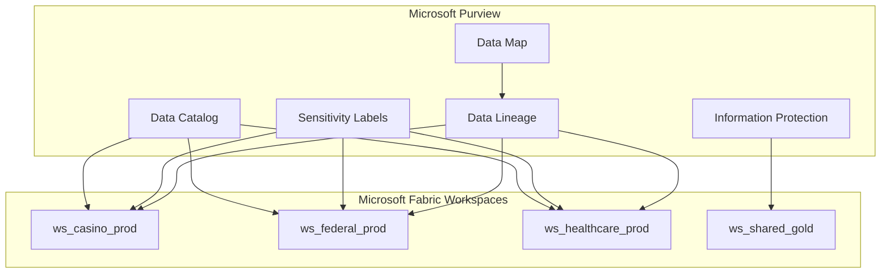
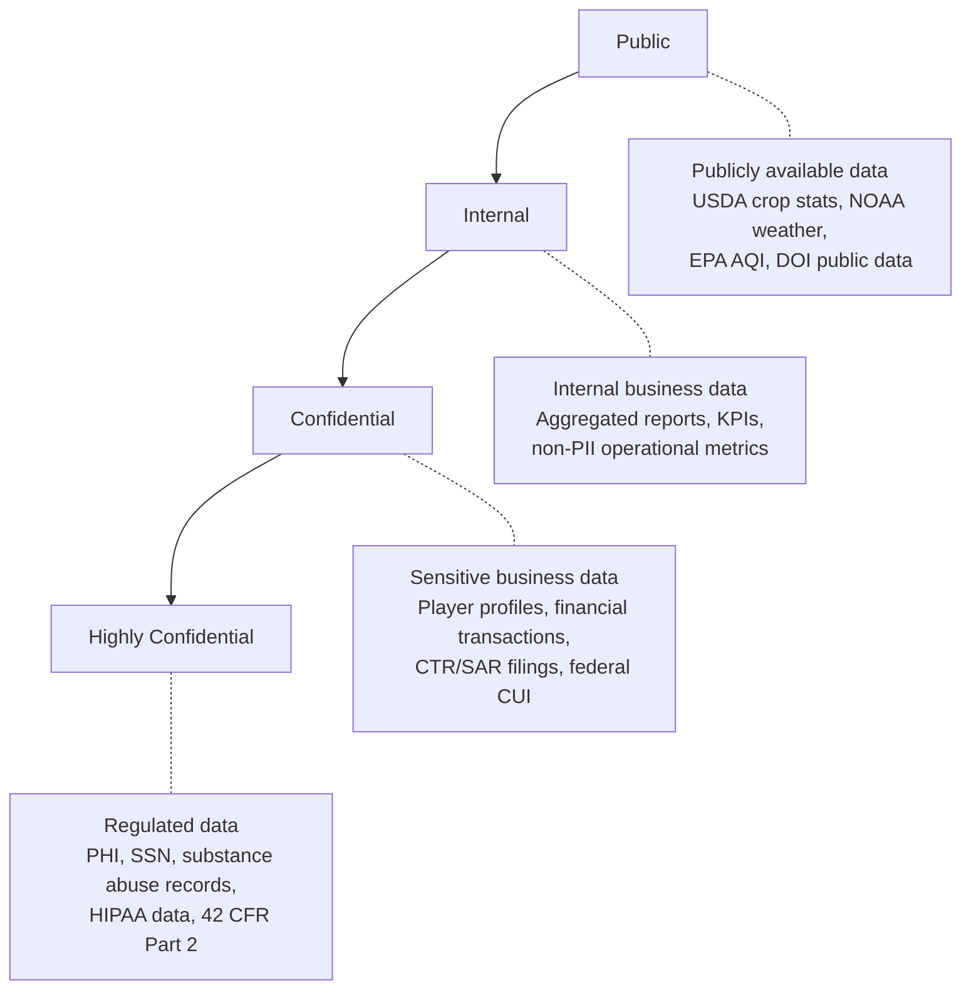
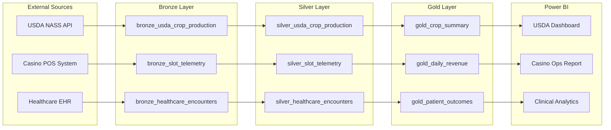
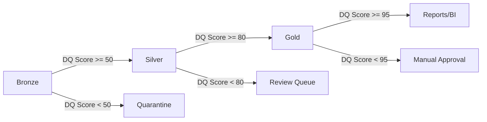
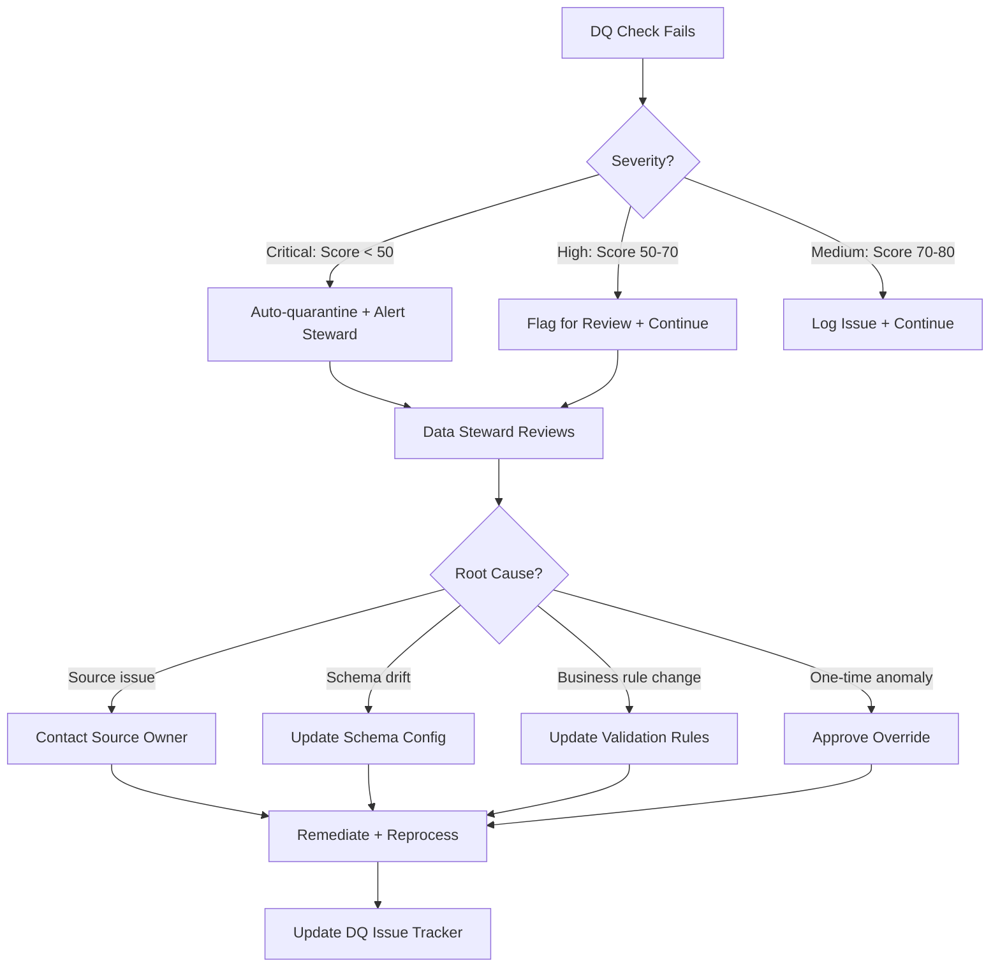
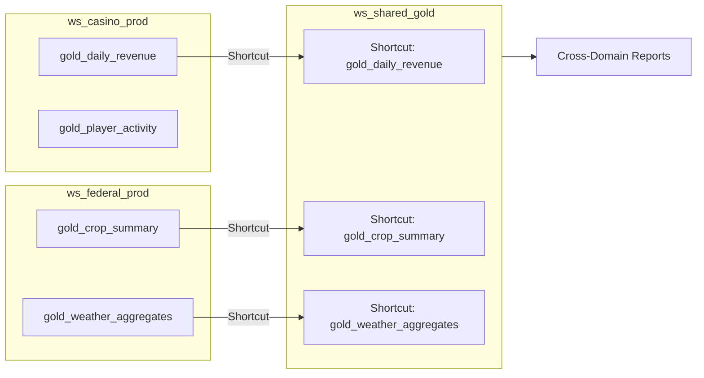
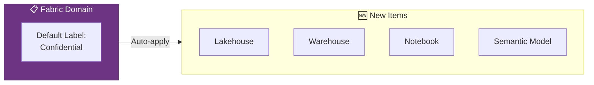
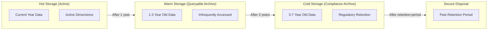

[Home](../index.md) > [Best Practices](./) > Data Governance Deep Dive

# 🛡️ Data Governance Deep Dive

> **Last Updated**: 2026-04-15 | **Version**: 2.0
> **Status**: ✅ Final | **Maintainer**: Documentation Team

<div align="center" markdown>


</div>

---

## 📖 Overview

Data governance in Microsoft Fabric spans classification, protection, access control, quality assurance, and compliance enforcement. This guide provides a comprehensive governance framework for the casino gaming, federal agency, and tribal healthcare domains in this project, covering Microsoft Purview integration, sensitivity labels, row-level and column-level security, data quality governance, compliance frameworks, data sharing, audit logging, and retention lifecycle management.

---

## 🟣 Microsoft Purview in Fabric

### Workspace-Level Governance

Microsoft Purview provides governance capabilities that are natively integrated with Fabric workspaces. Governance is configured at the workspace and item levels.



**Workspace governance configuration:**

| Workspace | Domain | Sensitivity Default | Admin Group | Purpose |
|-----------|--------|-------------------|-------------|---------|
| `ws_casino_prod` | Gaming | Confidential | sg-casino-admins | Casino gaming analytics |
| `ws_casino_dev` | Gaming | Internal | sg-casino-dev | Casino development |
| `ws_federal_prod` | Government | Internal | sg-federal-admins | Federal agency data |
| `ws_federal_dev` | Government | Internal | sg-federal-dev | Federal development |
| `ws_healthcare_prod` | Healthcare | Highly Confidential | sg-healthcare-admins | HIPAA-governed data |
| `ws_healthcare_dev` | Healthcare | Confidential | sg-healthcare-dev | Healthcare development |
| `ws_shared_gold` | Analytics | Internal | sg-analytics-admins | Cross-domain reporting |

### Sensitivity Labels

Sensitivity labels classify and protect data based on its confidentiality requirements. Configure labels in Microsoft Purview and apply them to Fabric items.

**Label hierarchy:**



**Label configuration in Purview:**

| Label | Encryption | Watermark | Access Restriction | Auto-Apply Rule |
|-------|-----------|-----------|-------------------|----------------|
| **Public** | None | None | None | Content from public APIs (USDA, NOAA, EPA) |
| **Internal** | None | None | Organization only | Default for Fabric items |
| **Confidential** | Azure RMS | Header/footer | Named users/groups | Contains PII patterns (SSN, player ID) |
| **Highly Confidential** | Azure RMS + DLP | Header/footer + visual marking | Named users only | Contains PHI, substance abuse, or HIPAA data |

**Applying labels to Fabric items:**

```
Fabric Workspace > Item > ... (more options) > Sensitivity Label > Select Label

Applicable to:
  - Lakehouses
  - Warehouses
  - Semantic models (Power BI datasets)
  - Reports
  - Pipelines
  - Notebooks
  - Eventstreams
```

### Information Protection Policies

Configure policies that enforce sensitivity label requirements:

| Policy | Scope | Enforcement |
|--------|-------|-------------|
| Mandatory labeling | All workspaces | Users must assign a label before saving |
| Label inheritance | Data pipelines | Downstream items inherit the highest label from sources |
| DLP for Fabric | Highly Confidential items | Block external sharing, require justification for download |
| Default label | New items | Auto-apply "Internal" to new Fabric items |

### Data Lineage Tracking

Purview automatically tracks lineage across Fabric items, showing data flow from source through medallion layers to reports.



**Lineage benefits:**

- Impact analysis before making schema changes
- Compliance auditing (trace data from source to report)
- Root cause analysis when data quality issues arise
- Regulatory evidence for FISMA, HIPAA, and NIGC audits

---

## 🏷️ Classification Taxonomy

### Unified Classification Framework

This project spans multiple regulatory domains. A unified taxonomy ensures consistent classification across all data.

| Classification | Abbreviation | Regulatory Basis | Examples |
|---------------|-------------|-----------------|---------|
| **Personally Identifiable Information** | PII | Various | SSN, name, address, DOB, email, phone |
| **Protected Health Information** | PHI | HIPAA | Medical records, diagnoses, treatment plans, insurance IDs |
| **Controlled Unclassified Information** | CUI | NIST 800-171 / FISMA | Federal agency operational data with access controls |
| **For Official Use Only** | FOUO | Federal policy | Internal federal reports, pre-decisional data |
| **Substance Abuse Records** | SAR-42CFR | 42 CFR Part 2 | Substance abuse treatment records (strictest federal protection) |
| **Gaming Financial Data** | GFD | NIGC MICS / BSA | Player financial transactions, CTR/SAR filings |
| **Publicly Releasable** | PUBLIC | FOIA / Agency policy | Published USDA stats, NOAA weather, EPA AQI, DOI public data |

### Classification by Data Domain

#### Casino Gaming

| Data Element | Classification | Label | Handling |
|-------------|---------------|-------|----------|
| Player SSN | PII | Confidential | Hash before storage, never display in reports |
| Player name | PII | Confidential | Mask in non-compliance contexts |
| Credit card number | PII | Confidential | Truncate to last 4, tokenize |
| Transaction amounts | GFD | Confidential | Accessible to compliance and finance |
| Slot telemetry | Internal | Internal | Machine data, no PII |
| CTR filing data | GFD + PII | Confidential | Restricted to BSA compliance team |
| SAR filing data | GFD + PII | Highly Confidential | Restricted to BSA officer + legal |
| W-2G records | PII + GFD | Confidential | Tax records, restricted access |
| Aggregated revenue | Internal | Internal | Business metrics, no PII |

#### Federal Agencies

| Data Element | Classification | Label | Handling |
|-------------|---------------|-------|----------|
| USDA crop production stats | PUBLIC | Public | Publicly available via NASS |
| USDA food recall notices | PUBLIC | Internal (pre-release) | Public after release, internal before |
| NOAA weather observations | PUBLIC | Public | Publicly available via NCDC |
| NOAA severe weather alerts | PUBLIC | Public | Public safety data |
| EPA AQI readings | PUBLIC | Public | Available via AirNow |
| EPA facility emissions | CUI | Confidential | Facility-specific data may have restrictions |
| DOI resource boundaries | PUBLIC | Public | Available via USGS |
| DOI species data | PUBLIC/CUI | Internal | Some species location data is sensitive |
| SBA loan data | CUI | Confidential | Contains business financial information |
| SBA borrower details | PII + CUI | Confidential | Name, EIN, address of borrowers |

#### Tribal Healthcare

| Data Element | Classification | Label | Handling |
|-------------|---------------|-------|----------|
| Patient demographics | PHI + PII | Highly Confidential | HIPAA protected |
| Medical diagnoses (ICD-10) | PHI | Highly Confidential | De-identify for analytics |
| Treatment records | PHI | Highly Confidential | Minimum necessary access |
| Substance abuse records | SAR-42CFR | Highly Confidential | Strictest protections, separate consent |
| Lab results | PHI | Highly Confidential | De-identify for population health |
| Insurance claims | PHI + PII | Highly Confidential | Financial + health data |
| De-identified analytics | Internal | Internal | Safe for broader analytics use |
| Population health aggregates | Internal | Internal | No individual identifiers |

### Auto-Classification Rules

Configure Purview auto-classification to detect and label sensitive data patterns:

```
Rule: Detect SSN Pattern
  Pattern: \d{3}-\d{2}-\d{4}
  Classification: PII
  Label: Confidential
  Action: Apply label, log detection

Rule: Detect Credit Card
  Pattern: \d{4}[\s-]?\d{4}[\s-]?\d{4}[\s-]?\d{4}
  Classification: PII
  Label: Confidential
  Action: Apply label, log detection

Rule: Detect PHI Indicators
  Pattern: Column names containing: diagnosis, icd10, treatment, medication, lab_result
  Classification: PHI
  Label: Highly Confidential
  Action: Apply label, alert Privacy Officer

Rule: Detect 42 CFR Part 2
  Pattern: Tables/columns in substance abuse processing pipeline
  Classification: SAR-42CFR
  Label: Highly Confidential
  Action: Apply label, enforce consent check
```

---

## 🔐 Row-Level Security

### Implementation Patterns for Multi-Agency Data

Row-Level Security (RLS) in Fabric restricts which rows a user can see based on their identity and role assignments.

#### Pattern 1: Agency-Specific Views

Each federal agency team sees only their agency's data.

```dax
// RLS Role: USDA Team
[agency_code] = "USDA"

// RLS Role: NOAA Team
[agency_code] = "NOAA"

// RLS Role: EPA Team
[agency_code] = "EPA"

// RLS Role: DOI Team
[agency_code] = "DOI"

// RLS Role: SBA Team
[agency_code] = "SBA"

// RLS Role: All Agencies (Admin)
TRUE()
```

**Role-to-group mapping:**

| RLS Role | Microsoft Entra ID Group | Data Access |
|----------|---------------|-------------|
| USDA Team | sg-fabric-usda | USDA rows only |
| NOAA Team | sg-fabric-noaa | NOAA rows only |
| EPA Team | sg-fabric-epa | EPA rows only |
| DOI Team | sg-fabric-doi | DOI rows only |
| SBA Team | sg-fabric-sba | SBA rows only |
| Federal Admin | sg-fabric-federal-admin | All agency rows |
| Executive | sg-fabric-executives | All rows, aggregated views |

#### Pattern 2: Casino Property-Based RLS

Multi-property casinos restrict data to the user's assigned property.

```dax
// RLS Role: Property Manager
// User's property_id is stored in a security mapping table

VAR CurrentUser = USERPRINCIPALNAME()
VAR UserProperties =
    CALCULATETABLE(
        VALUES(SecurityMapping[property_id]),
        SecurityMapping[user_email] = CurrentUser
    )
RETURN
    [property_id] IN UserProperties
```

**Security mapping table:**

```sql
CREATE TABLE dbo.security_mapping (
    user_email NVARCHAR(256),
    property_id NVARCHAR(64),
    access_level NVARCHAR(32),  -- PROPERTY, REGION, ENTERPRISE
    effective_date DATE,
    expiry_date DATE
);

-- Example entries
INSERT INTO dbo.security_mapping VALUES
('manager.a@casino.com', 'PROP-001', 'PROPERTY', '2026-01-01', '2026-12-31'),
('manager.a@casino.com', 'PROP-002', 'PROPERTY', '2026-01-01', '2026-12-31'),
('vp.west@casino.com', 'REGION-WEST', 'REGION', '2026-01-01', '2026-12-31'),
('ceo@casino.com', 'ALL', 'ENTERPRISE', '2026-01-01', '2026-12-31');
```

#### Pattern 3: Healthcare Role-Based RLS

HIPAA minimum necessary access: users see only data relevant to their role.

```dax
// RLS Role: Clinical Staff (specific facility)
VAR CurrentUser = USERPRINCIPALNAME()
VAR UserFacilities =
    CALCULATETABLE(
        VALUES(HealthcareRoleMapping[facility_id]),
        HealthcareRoleMapping[user_email] = CurrentUser,
        HealthcareRoleMapping[role] IN {"clinician", "nurse", "admin"}
    )
RETURN
    [facility_id] IN UserFacilities

// RLS Role: Population Health Analyst (de-identified only)
[is_deidentified] = TRUE()

// RLS Role: Privacy Officer (audit access, all data)
TRUE()
```

### Dynamic RLS with DAX

For complex scenarios where access rules change frequently, use a dynamic RLS pattern with a security configuration table.

```dax
// Dynamic RLS filter expression
VAR CurrentUser = USERPRINCIPALNAME()
VAR UserAccess =
    CALCULATETABLE(
        SELECTCOLUMNS(
            AccessControl,
            "dimension_key", AccessControl[dimension_key],
            "dimension_value", AccessControl[dimension_value]
        ),
        AccessControl[user_email] = CurrentUser,
        AccessControl[is_active] = TRUE(),
        AccessControl[effective_date] <= TODAY(),
        AccessControl[expiry_date] >= TODAY()
    )
RETURN
    IF(
        COUNTROWS(FILTER(UserAccess, [dimension_key] = "ALL")) > 0,
        TRUE(),  // User has ALL access
        [agency_code] IN SELECTCOLUMNS(
            FILTER(UserAccess, [dimension_key] = "agency_code"),
            "value", [dimension_value]
        )
    )
```

**Access control table design:**

```sql
CREATE TABLE dbo.access_control (
    access_id INT IDENTITY(1,1) PRIMARY KEY,
    user_email NVARCHAR(256) NOT NULL,
    dimension_key NVARCHAR(128) NOT NULL,   -- "agency_code", "property_id", "facility_id", "ALL"
    dimension_value NVARCHAR(256) NOT NULL,  -- "USDA", "PROP-001", "FAC-101", "*"
    access_level NVARCHAR(32) NOT NULL,      -- "READ", "WRITE", "ADMIN"
    is_active BIT DEFAULT 1,
    effective_date DATE NOT NULL,
    expiry_date DATE NOT NULL,
    granted_by NVARCHAR(256),
    grant_reason NVARCHAR(512),
    created_at DATETIME2 DEFAULT GETUTCDATE()
);
```

### RLS Testing

Always test RLS filters before deploying to production:

```dax
// Test RLS as a specific user in Power BI Desktop:
// Modeling > View as Roles > Select role > Enter username

// Verification query (DAX query in SSMS or DAX Studio):
EVALUATE
CALCULATETABLE(
    SUMMARIZE(
        FactTable,
        DimAgency[agency_code],
        "RowCount", COUNTROWS(FactTable)
    ),
    USERELATIONSHIP(...),
    KEEPFILTERS(...)
)
```

---

## 👁️ Column-Level Security

### Masking Patterns for Sensitive Fields

Column-level security restricts visibility of specific columns based on user roles. In Fabric, this is implemented through a combination of warehouse-level security and semantic model column visibility.

#### Warehouse Column Masking

```sql
-- Dynamic Data Masking in Fabric Warehouse

-- Mask SSN: Show only last 4 digits
ALTER TABLE dbo.player_profiles
ALTER COLUMN ssn ADD MASKED WITH (FUNCTION = 'partial(0, "XXX-XX-", 4)');

-- Mask email: Show first character and domain
ALTER TABLE dbo.player_profiles
ALTER COLUMN email ADD MASKED WITH (FUNCTION = 'email()');

-- Mask credit card: Show last 4 digits
ALTER TABLE dbo.player_profiles
ALTER COLUMN credit_card_number ADD MASKED WITH (FUNCTION = 'partial(0, "XXXX-XXXX-XXXX-", 4)');

-- Mask phone: Full mask
ALTER TABLE dbo.player_profiles
ALTER COLUMN phone_number ADD MASKED WITH (FUNCTION = 'default()');

-- Grant UNMASK to authorized roles
GRANT UNMASK ON dbo.player_profiles TO [ComplianceTeam];
GRANT UNMASK ON dbo.player_profiles(ssn) TO [TaxReporting];
```

#### PySpark Column-Level Protection

For Lakehouse data processed through Spark notebooks:

```python
from pyspark.sql import functions as F
from pyspark.sql import DataFrame

def apply_column_masking(df: DataFrame, user_role: str) -> DataFrame:
    """Apply column-level masking based on user role."""

    masking_rules = {
        "analyst": {
            "ssn": F.concat(F.lit("XXX-XX-"), F.substring(F.col("ssn"), 8, 4)),
            "player_name": F.concat(F.substring(F.col("player_name"), 1, 1), F.lit("****")),
            "email": F.regexp_replace(F.col("email"), r"(.)(.*)(@.*)", r"$1***$3"),
            "credit_card": F.concat(F.lit("****-****-****-"), F.substring(F.col("credit_card"), -4, 4)),
            "phone": F.lit("***-***-****"),
            "dob": F.date_trunc("year", F.col("dob")),  # Show only year
        },
        "compliance": {
            # Compliance team sees all fields unmasked
        },
        "executive": {
            "ssn": F.lit("[REDACTED]"),
            "credit_card": F.lit("[REDACTED]"),
            "phone": F.lit("[REDACTED]"),
            # Name and email visible for executive context
        }
    }

    role_rules = masking_rules.get(user_role, masking_rules["analyst"])

    for column, mask_expr in role_rules.items():
        if column in df.columns:
            df = df.withColumn(column, mask_expr)

    return df
```

#### Healthcare De-Identification

HIPAA Safe Harbor de-identification removes or generalizes 18 identifier types:

```python
def hipaa_safe_harbor_deidentify(df: DataFrame) -> DataFrame:
    """Apply HIPAA Safe Harbor de-identification method."""

    # 1. Remove direct identifiers
    columns_to_remove = [
        "patient_name", "ssn", "medical_record_number",
        "health_plan_id", "account_number", "certificate_number",
        "vehicle_serial", "device_identifier", "web_url",
        "ip_address", "biometric_id", "photo"
    ]
    df = df.drop(*[c for c in columns_to_remove if c in df.columns])

    # 2. Generalize quasi-identifiers
    if "date_of_birth" in df.columns:
        # Reduce to year only (or remove if age > 89)
        df = df.withColumn("birth_year", F.year(F.col("date_of_birth")))
        df = df.withColumn("birth_year",
            F.when(F.datediff(F.current_date(), F.col("date_of_birth")) / 365.25 > 89,
                   F.lit(None))
             .otherwise(F.col("birth_year")))
        df = df.drop("date_of_birth")

    if "zip_code" in df.columns:
        # Truncate to 3 digits (or set to 000 if population < 20,000)
        df = df.withColumn("zip3", F.substring(F.col("zip_code"), 1, 3))
        df = df.drop("zip_code")

    if "admission_date" in df.columns:
        # Shift dates by random offset (consistent per patient)
        df = df.withColumn("admission_date",
            F.date_add(F.col("admission_date"),
                       F.abs(F.hash(F.col("patient_id"))) % 365 - 182))

    if "phone" in df.columns:
        df = df.drop("phone")

    if "email" in df.columns:
        df = df.drop("email")

    if "address" in df.columns:
        df = df.drop("address")

    # 3. Replace patient_id with pseudonym
    if "patient_id" in df.columns:
        df = df.withColumn("pseudo_patient_id", F.sha2(F.col("patient_id"), 256))
        df = df.drop("patient_id")

    return df
```

### Semantic Model Column Visibility

In Power BI semantic models, hide sensitive columns from specific roles:

```
Model Configuration:
  Table: dim_player
    Column: player_name    -> Visible to: Compliance, Management
    Column: player_id      -> Visible to: All (pseudonym OK)
    Column: ssn_hash       -> Hidden from all report views
    Column: email_masked   -> Visible to: Compliance, Management
    Column: tier_level      -> Visible to: All

  Table: fact_healthcare
    Column: diagnosis_code -> Visible to: Clinical, Privacy Officer
    Column: treatment_plan -> Visible to: Clinical only
    Column: patient_pseudo -> Visible to: All (pseudonymized)
    Column: encounter_type -> Visible to: All
```

---

## ✅ Data Quality Governance

### DQ Score Thresholds and Enforcement

Data quality is measured and enforced at each medallion layer transition.



**DQ score components:**

| Component | Weight | Measurement |
|-----------|--------|-------------|
| **Completeness** | 25% | Percentage of non-null values in required fields |
| **Accuracy** | 25% | Percentage of values passing business rules |
| **Timeliness** | 20% | Data age vs expected freshness |
| **Consistency** | 15% | Cross-reference validation across related tables |
| **Uniqueness** | 15% | Percentage of unique records (no duplicates) |

**Thresholds by layer and domain:**

| Domain | Bronze Min | Silver Min | Gold Min | Compliance Min |
|--------|-----------|-----------|---------|---------------|
| Casino gaming | 50 | 80 | 95 | 99 |
| Federal (public data) | 40 | 75 | 90 | N/A |
| Federal (CUI) | 50 | 85 | 95 | 98 |
| Healthcare (PHI) | 60 | 90 | 98 | 99 |

### Data Steward Workflows



### Issue Resolution Tracking

```sql
CREATE TABLE dbo.dq_issues (
    issue_id INT IDENTITY(1,1) PRIMARY KEY,
    detected_timestamp DATETIME2 DEFAULT GETUTCDATE(),
    table_name NVARCHAR(256),
    layer NVARCHAR(16),             -- BRONZE, SILVER, GOLD
    domain NVARCHAR(64),            -- CASINO, FEDERAL, HEALTHCARE
    dq_dimension NVARCHAR(32),      -- COMPLETENESS, ACCURACY, TIMELINESS, CONSISTENCY, UNIQUENESS
    dq_score DECIMAL(5,2),
    threshold DECIMAL(5,2),
    affected_records INT,
    total_records INT,
    check_name NVARCHAR(256),
    check_details NVARCHAR(MAX),
    assigned_steward NVARCHAR(256),
    status NVARCHAR(32),            -- OPEN, INVESTIGATING, REMEDIATED, ACCEPTED, WAIVED
    root_cause NVARCHAR(512),
    resolution NVARCHAR(MAX),
    resolved_timestamp DATETIME2,
    waiver_approved_by NVARCHAR(256),
    waiver_reason NVARCHAR(512),
    waiver_expiry DATE
);
```

---

## Compliance Frameworks

This project operates under multiple compliance frameworks simultaneously. Each framework imposes specific data handling requirements.

### Framework Summary

| Framework | Scope | Key Requirements | Affected Data |
|-----------|-------|-----------------|---------------|
| **FISMA** | Federal information systems | Risk categorization, security controls, continuous monitoring | All federal agency data |
| **FedRAMP** | Cloud services for federal | Baseline security controls, 3PAO assessment, continuous monitoring | DOT/FAA cloud workloads |
| **HIPAA** | Healthcare data | Privacy Rule, Security Rule, Breach Notification Rule | Tribal healthcare PHI |
| **CIPSEA** | Statistical data | Confidentiality of individually identifiable data | Census, survey, statistical data |
| **42 CFR Part 2** | Substance abuse records | Written consent for any disclosure, stricter than HIPAA | Substance abuse treatment records |
| **NIGC MICS** | Casino gaming | Minimum internal control standards, BSA compliance | Gaming operations data |

### FISMA (Federal Information Systems)

Applies to all federal agency data in this project (USDA, SBA, NOAA, EPA, DOI).

**Impact level determination:**

| Impact Level | Confidentiality | Integrity | Availability | Example |
|-------------|----------------|-----------|--------------|---------|
| Low | Limited adverse effect | Limited adverse effect | Limited adverse effect | Public USDA crop stats |
| Moderate | Serious adverse effect | Serious adverse effect | Serious adverse effect | SBA loan data, EPA facility data |
| High | Severe/catastrophic | Severe/catastrophic | Severe/catastrophic | CUI, enforcement data |

**FISMA controls in Fabric:**

| Control Family | Implementation |
|---------------|---------------|
| Access Control (AC) | Microsoft Entra ID + Conditional Access + RLS |
| Audit and Accountability (AU) | Purview audit logs + pipeline error table |
| Configuration Management (CM) | Bicep IaC, version-controlled configuration |
| Identification and Authentication (IA) | Microsoft Entra ID MFA, service principals |
| System and Communications Protection (SC) | Private endpoints, encryption at rest/transit |
| System and Information Integrity (SI) | Data quality checks, anomaly detection |

### FedRAMP (Cloud Services)

Applies to DOT/FAA workloads processed in Fabric (a FedRAMP authorized cloud service).

**FedRAMP requirements mapped to Fabric:**

| Requirement | Fabric Implementation |
|-------------|----------------------|
| Data encryption at rest | OneLake encryption (Microsoft-managed keys) |
| Data encryption in transit | TLS 1.2+ for all API/data traffic |
| Multi-factor authentication | Microsoft Entra ID Conditional Access with MFA |
| Audit logging | Fabric admin audit logs, Purview |
| Incident response | Data Activator alerts + runbooks |
| Continuous monitoring | Pipeline error table + KQL dashboards |
| Boundary protection | Managed VNet, private endpoints |

### HIPAA (Healthcare)

Applies to all tribal healthcare data.

**HIPAA Security Rule implementation:**

| Safeguard | Category | Fabric Implementation |
|-----------|----------|----------------------|
| Administrative | Security management | Purview policies, access reviews |
| Administrative | Workforce security | Microsoft Entra ID groups, JIT access |
| Administrative | Information access management | RLS + Column masking |
| Physical | Facility access | Azure datacenter controls (inherited) |
| Physical | Workstation security | Intune device management |
| Technical | Access control | Microsoft Entra ID + Conditional Access |
| Technical | Audit controls | Fabric audit logs, Purview |
| Technical | Integrity controls | Data quality framework, checksums |
| Technical | Transmission security | TLS 1.2+, private endpoints |

**HIPAA minimum necessary principle in Fabric:**

```
Principle: Users should only access the minimum PHI necessary for their role.

Implementation:
  1. RLS filters restrict rows to assigned facility
  2. Column masking hides non-essential PHI fields
  3. De-identified views for analytics users
  4. Audit logging on all PHI access
  5. Regular access reviews (quarterly)
```

### CIPSEA (Statistical Data Confidentiality)

Applies to statistical data from federal agencies where individual identifiers could be reverse-engineered.

```
Requirements:
  - Suppress cells with fewer than 3 respondents
  - Apply noise injection for small cell sizes
  - Prevent linkage attacks through k-anonymity (k >= 5)
  - Restrict access to microdata
  - Use only aggregated/suppressed data in public reports
```

### 42 CFR Part 2 (Substance Abuse Records)

The strictest federal data protection standard. More restrictive than HIPAA.

```
Key differences from HIPAA:
  - Requires WRITTEN consent for ANY disclosure (HIPAA allows some without consent)
  - Consent must specify: who, what, purpose, expiration
  - No exception for treatment/payment/operations without consent
  - Re-disclosure prohibition: recipients cannot re-share
  - Criminal penalties for violations

Fabric implementation:
  - Separate workspace with additional access controls
  - Consent verification at data access time
  - Audit logging with consent reference
  - No data sharing outside designated workspace
  - Quarterly access reviews with legal sign-off
```

### NIGC MICS (Casino Gaming)

Minimum Internal Control Standards for gaming operations.

```
Key requirements:
  - Transaction monitoring: Track all transactions > $3,000
  - CTR filing: Report cash transactions > $10,000 within 15 days
  - SAR filing: Report suspicious activity (e.g., structuring $8K-$9.9K)
  - W-2G: Report gambling winnings above thresholds
  - Player exclusion: Enforce self-exclusion and involuntary exclusion lists
  - Audit trail: Maintain complete audit trail for all financial transactions

Fabric implementation:
  - Real-time transaction monitoring via Eventstream
  - Automated CTR/SAR threshold detection in Silver layer
  - W-2G generation pipeline triggered by jackpot events
  - Exclusion list sync and enforcement
  - Complete audit trail in Bronze (append-only)
  - Compliance dashboard with filing status and deadlines
```

---

## Data Sharing and External Access

### OneLake Data Sharing

OneLake shortcuts enable cross-workspace data access without copying data.



**Shortcut governance rules:**

| Rule | Implementation |
|------|---------------|
| No shortcuts to PHI data outside healthcare workspace | Workspace admin policy |
| No shortcuts to SAR filing data | BSA officer approval required |
| Shortcuts inherit source sensitivity labels | Purview label inheritance |
| Shortcut access requires workspace membership | Microsoft Entra ID group membership |
| Audit shortcut creation and access | Purview audit logs |

### Cross-Workspace Access Patterns

| Pattern | Use Case | Security |
|---------|----------|----------|
| OneLake shortcut (read-only) | Shared Gold layer for reporting | Source workspace controls access |
| Warehouse cross-database query | SQL analytics across domains | Row-level security applies |
| Semantic model composite | Multi-domain Power BI reports | RLS at semantic model level |
| Pipeline cross-workspace | Orchestration across workspaces | Service principal with scoped permissions |

### External Sharing with B2B

For sharing data with external partners (e.g., regulatory agencies, tribal councils):

```
External sharing tiers:

Tier 1: Public Data
  - Method: Public Power BI published report (no sign-in)
  - Data: Aggregated USDA, NOAA, EPA public stats
  - Security: No PII, pre-aggregated only

Tier 2: Partner Access
  - Method: Microsoft Entra ID B2B guest accounts
  - Data: Agency-specific Gold layer views
  - Security: RLS + column masking + MFA required
  - Audit: Full access logging

Tier 3: Regulatory Reporting
  - Method: Secure file transfer (SFTP) or direct API
  - Data: Compliance filings (CTR, SAR, HIPAA reports)
  - Security: Encrypted in transit + at rest
  - Audit: Full chain of custody logging
```

---

## Audit and Monitoring

### Admin Portal Audit Logs

Fabric generates comprehensive audit logs accessible through the Admin Portal and the Microsoft 365 unified audit log.

**Key audit events to monitor:**

| Event Category | Events | Monitoring Frequency |
|---------------|--------|---------------------|
| Item access | ViewReport, GetDataset, ReadTable | Continuous (for PHI) |
| Item modification | UpdateDataset, UpdatePipeline, DeleteItem | Real-time alerts |
| Permission changes | AddWorkspaceMember, RemoveWorkspaceMember | Real-time alerts |
| Data export | ExportReport, DownloadDataset | Real-time alerts |
| Admin actions | UpdateCapacitySetting, UpdateTenantSetting | Real-time alerts |
| Sensitivity labels | ApplyLabel, RemoveLabel, DowngradeLabel | Real-time alerts |

### Usage Metrics

Track usage patterns to identify anomalies and optimize governance:

```kql
// Unusual access patterns (potential security concern)
fabric_audit_log
| where timestamp > ago(24h)
| where operation in ("ViewReport", "GetDataset", "ReadTable")
| summarize access_count = count() by user_email, workspace_name, item_name
| join kind=leftouter (
    fabric_audit_log
    | where timestamp between (ago(31d) .. ago(1d))
    | summarize avg_daily_access = count() / 30.0 by user_email, workspace_name, item_name
) on user_email, workspace_name, item_name
| extend anomaly_ratio = access_count / max_of(avg_daily_access, 1.0)
| where anomaly_ratio > 5.0  // 5x normal access rate
| order by anomaly_ratio desc
```

### Compliance Reporting Dashboards

Build Power BI dashboards for compliance officers:

**Dashboard: Governance Overview**

| Page | Content | Audience |
|------|---------|----------|
| Data Classification | Label distribution across items, unlabeled item count | Data Steward |
| Access Patterns | Who accessed what, anomaly detection results | Security Team |
| DQ Scorecard | DQ scores by domain/layer, trend lines, open issues | Data Steward |
| Compliance Status | CTR/SAR filing status, HIPAA compliance checks | Compliance Officer |
| Audit Summary | Access logs, permission changes, export events | Auditor |

**DAX measures for governance reporting:**

```dax
// Percentage of items with sensitivity labels
Label Coverage =
DIVIDE(
    CALCULATE(COUNTROWS(FabricItems), NOT ISBLANK(FabricItems[sensitivity_label])),
    COUNTROWS(FabricItems),
    0
)

// Average DQ score across production tables
Avg Production DQ Score =
CALCULATE(
    AVERAGE(DQResults[dq_score]),
    DQResults[environment] = "PROD",
    DQResults[layer] IN {"SILVER", "GOLD"}
)

// Compliance filing on-time rate
Filing On-Time Rate =
DIVIDE(
    CALCULATE(COUNTROWS(ComplianceFilings), ComplianceFilings[filed_on_time] = TRUE()),
    COUNTROWS(ComplianceFilings),
    0
)
```

---

## Default Domain Sensitivity Labels (GA 2026)

Default Domain Sensitivity Labels (GA, February 2026) automatically apply sensitivity labels to new Fabric items based on the domain they belong to. This eliminates the risk of unclassified data items in production workspaces and ensures consistent data classification from creation.

### How Default Domain Labels Work

When a Fabric domain is configured with a default sensitivity label, every new item created within that domain automatically inherits the label. This includes lakehouses, warehouses, notebooks, semantic models, reports, and all other Fabric item types.



### Domain-to-Label Mapping for This POC

| Domain | Default Label | Justification |
|--------|-------------|---------------|
| **Casino Gaming** | Confidential | PII, financial data, compliance filings |
| **Casino Development** | Internal | Non-production data, synthetic datasets |
| **Federal - USDA** | Internal | Publicly available agricultural statistics |
| **Federal - NOAA** | Internal | Public weather/climate data |
| **Federal - EPA** | Internal | Environmental monitoring data |
| **Federal - DOI** | Internal | Public lands and resource data |
| **Federal - SBA** | Internal | Loan program aggregate data |
| **Tribal Healthcare** | Highly Confidential | HIPAA PHI, 42 CFR Part 2 substance abuse records |
| **DOT/FAA** | Confidential | Flight operations, security-sensitive |
| **Shared Gold / BI** | Confidential | Cross-domain aggregations may contain sensitive data |

### Configuration via Admin Portal

```
Fabric Admin Portal → Domains → [Select Domain]
  → Governance Settings
    → Default Sensitivity Label: [Select Label]
    → Override Allowed: [Yes/No]
    → Label Inheritance: [Downstream items inherit from source]
```

### Configuration via PowerShell

```powershell
# Set default sensitivity label for a Fabric domain
# Requires: Microsoft.PowerBI.Admin module

Connect-PowerBIServiceAccount

# Get domain ID
$domain = Get-PowerBIDomain -Name "Casino Gaming"

# Set default label (label GUID from Microsoft Purview)
Set-PowerBIDomainDefaultSensitivityLabel `
    -DomainId $domain.Id `
    -LabelId "a1b2c3d4-e5f6-7890-abcd-ef1234567890"

# Verify configuration
Get-PowerBIDomainDefaultSensitivityLabel -DomainId $domain.Id
```

### Label Inheritance Rules

| Scenario | Behavior |
|----------|----------|
| New item in domain | Automatically gets domain default label |
| Item moved to domain | Label updated to domain default (if less restrictive) |
| Item moved out of domain | Label retained (never downgraded automatically) |
| Child item from labeled parent | Inherits parent label (downstream inheritance) |
| User manually sets higher label | Manual label takes precedence |
| User tries to set lower label | Blocked unless user has override permission |

### Integration with OneLake Security

Default domain labels work in conjunction with OneLake Security (Preview) to provide layered protection:

1. **Domain label** ensures all items are classified from creation
2. **OneLake Security roles** enforce access based on classification
3. **Purview policies** can auto-apply additional protections based on label

> 💡 **Tip**: For this POC, configure the Tribal Healthcare domain with "Highly Confidential" default label and set Override Allowed to "No". This ensures PHI data can never be downgraded, satisfying HIPAA minimum necessary requirements.

> ⚠️ **Warning**: Changing a domain's default label does NOT retroactively update existing items. Only new items receive the updated default. Run a bulk relabeling script for existing items when changing domain label policies.

---

## Data Retention and Lifecycle Management

### Retention Policies by Data Classification

| Classification | Retention Period | Archive After | Delete After | Regulatory Basis |
|---------------|-----------------|---------------|-------------|-----------------|
| Casino transactions (Bronze) | 7 years | 2 years | 7 years | BSA / IRS requirements |
| CTR/SAR filings | 10 years | 5 years | Never (permanent) | FinCEN requirements |
| W-2G records | 7 years | 3 years | 7 years | IRS requirements |
| Player PII | Active + 2 years | Upon deactivation | 2 years post-deactivation | Privacy policy |
| Federal public data | Indefinite | 5 years | Never | Public record |
| Federal CUI | Per agency policy | 3-7 years | Per agency schedule | NARA records schedule |
| Healthcare PHI | 6 years (minimum) | 3 years | 6 years post-last encounter | HIPAA |
| Substance abuse (42 CFR) | Per consent + state law | 3 years | Per consent terms | 42 CFR Part 2 |
| Audit logs | 7 years | 1 year | 7 years | Multiple frameworks |
| Aggregated analytics | Indefinite | 5 years | Never | Business value |

### Lifecycle Implementation



**Implementation in Fabric:**

```python
from datetime import datetime, timedelta

# Lifecycle management notebook - runs weekly

# 1. Move old data from Hot to Warm (Lakehouse to archive Lakehouse)
archive_cutoff = datetime.now() - timedelta(days=365)

old_data = spark.sql(f"""
    SELECT * FROM lh_gold.daily_revenue
    WHERE revenue_date < '{archive_cutoff.strftime('%Y-%m-%d')}'
""")

old_data.write.mode("append").format("delta").saveAsTable("lh_archive.daily_revenue")

spark.sql(f"""
    DELETE FROM lh_gold.daily_revenue
    WHERE revenue_date < '{archive_cutoff.strftime('%Y-%m-%d')}'
""")

# 2. VACUUM archived tables
spark.sql("VACUUM lh_archive.daily_revenue RETAIN 168 HOURS")

# 3. Check for data past retention period
retention_cutoff = datetime.now() - timedelta(days=365 * 7)  # 7-year retention

expired_count = spark.sql(f"""
    SELECT COUNT(*) as cnt FROM lh_archive.daily_revenue
    WHERE revenue_date < '{retention_cutoff.strftime('%Y-%m-%d')}'
""").collect()[0]["cnt"]

if expired_count > 0:
    # Log for manual review before deletion (never auto-delete without approval)
    print(f"WARNING: {expired_count} records past 7-year retention period. "
          "Requires manual approval for deletion.")
```

### Secure Disposal

When data reaches end-of-life:

```
Disposal procedure:
  1. Verify retention period has expired (automated check)
  2. Generate disposal request with:
     - Table name and record count
     - Retention policy reference
     - Regulatory basis for disposal
  3. Approval workflow:
     - Data steward approval
     - Compliance officer approval (for regulated data)
     - Legal approval (for litigation-hold data)
  4. Execute disposal:
     - DELETE from Delta table
     - VACUUM to remove physical files
     - Verify removal from all copies (shortcuts, exports)
  5. Document disposal:
     - Log in disposal registry
     - Retain disposal certificate
     - Update data catalog
```

**Disposal registry table:**

```sql
CREATE TABLE dbo.data_disposal_registry (
    disposal_id INT IDENTITY(1,1) PRIMARY KEY,
    disposal_date DATETIME2 DEFAULT GETUTCDATE(),
    table_name NVARCHAR(256),
    record_count BIGINT,
    date_range_start DATE,
    date_range_end DATE,
    retention_policy NVARCHAR(256),
    regulatory_basis NVARCHAR(512),
    approved_by NVARCHAR(256),
    approval_date DATETIME2,
    disposal_method NVARCHAR(64),   -- DELETE_VACUUM, CRYPTO_ERASE, PHYSICAL_DESTROY
    verification_status NVARCHAR(32), -- PENDING, VERIFIED, FAILED
    verified_by NVARCHAR(256),
    verified_date DATETIME2,
    notes NVARCHAR(MAX)
);
```

---

## Summary

Comprehensive data governance in Microsoft Fabric requires:

1. **Microsoft Purview** for classification, labeling, lineage tracking, and information protection
2. **A unified classification taxonomy** that maps PII, PHI, CUI, FOUO, and public data across all domains
3. **Row-Level Security** with dynamic DAX filters for multi-agency, multi-property, and multi-facility access control
4. **Column-Level Security** with dynamic data masking and HIPAA de-identification for sensitive fields
5. **Data quality governance** with enforced thresholds at each medallion layer and steward workflows for issue resolution
6. **Multi-framework compliance** addressing FISMA, FedRAMP, HIPAA, CIPSEA, 42 CFR Part 2, and NIGC MICS simultaneously
7. **Controlled data sharing** through OneLake shortcuts, cross-workspace access patterns, and B2B for external partners
8. **Comprehensive audit logging** with anomaly detection, usage metrics, and compliance dashboards
9. **Lifecycle management** with retention policies aligned to regulatory requirements and secure disposal procedures

---

## Related Documents

- [Security Guide](../SECURITY.md) -- Security architecture and controls
- [Compliance Templates](../compliance-templates/README.md) -- CTR, SAR, W-2G, MICS templates
- [Error Handling & Monitoring](./error-handling-monitoring.md) -- Error logging and alerting
- [Alerting & Data Activator](./alerting-data-activator.md) -- Compliance alert patterns
- [Workspaces & Naming](./01_WORKSPACES_NAMING.md) -- Workspace organization

---

[Back to Best Practices Index](./index.md) | [Back to Documentation](../index.md)
