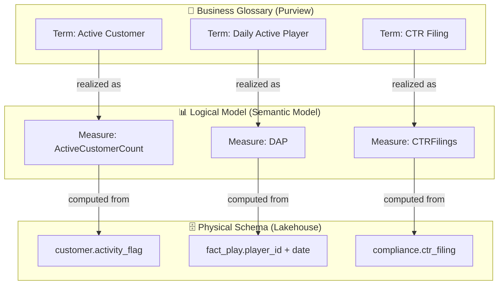
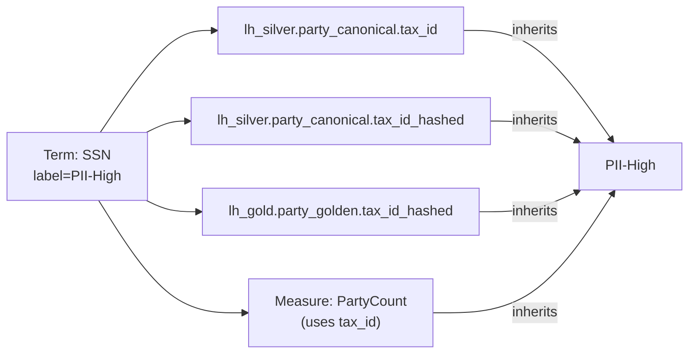
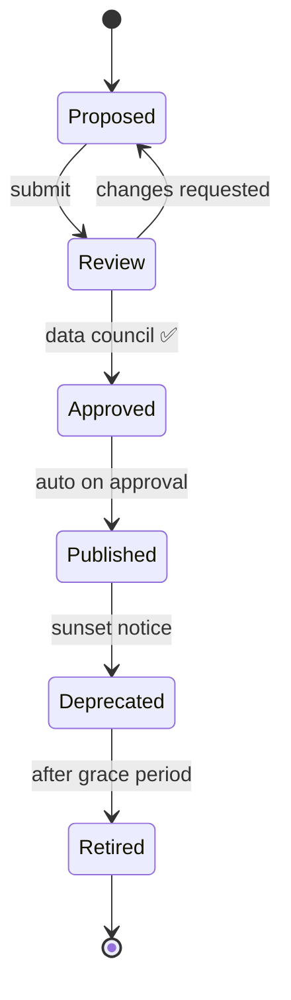

# 📖 Business Glossary Automation with Microsoft Purview

<div align="center" markdown>

**Keep Business Terminology in Sync with Technical Schemas — Phase 14 Wave 3**


</div>

---

**Last Updated:** `2026-04-27` | **Version:** 1.0.0 | **Anchor:** [Master Data Management](master-data-management.md)

---

## 🎯 Why a Business Glossary

A **business glossary** is the single, authoritative dictionary of the terms your business uses to talk about data. It is not a schema, not a data dictionary, not a wiki page — it is a curated, versioned, owned, and computable record of *what your organization means* when it says "Active Customer", "Daily Active Player", "CTR Filing", or "Beneficiary".

Without one, you get the same disease that MDM cures for entities, except now it's for **terminology**:

| Symptom Without a Glossary | Cause | Cost |
|----------------------------|-------|------|
| Three dashboards report different "Active Customer" counts | Each analyst reinvents the rule | Executive distrust of analytics |
| New hire ships a report using stale definition | No discoverable source of truth | Re-work, embarrassment |
| Compliance audit asks "how do you compute CTR threshold?" — three different answers from three teams | No formal definition tied to code | Regulatory finding |
| Schema rename breaks 12 reports silently | Glossary not linked to physical columns | Production incidents |
| Data scientist trains a model on the wrong "churn" definition | KPI ambiguity | Model invalidity |
| Analyst spends 40% of project time asking "what does this column mean?" | No tagged data assets | Productivity tax |

> 📝 **Companion to MDM:** [Master Data Management](master-data-management.md) gives you trusted **entities**. Business Glossary Automation gives you trusted **terminology**. Together they are the foundation of the Wave 3 data-management stack.

---

## ⚠️ The Glossary–Schema Drift Problem

The classic glossary failure mode is the **drift between business definition and technical reality**.

```
Day 1:
  Business glossary says:
    "Active Customer" = transacted in last 90 days

  Schema has:
    customer.is_active BOOLEAN

  ETL job sets is_active = (last_txn_date >= today - 90)
  Everyone is happy. ✅

Day 90:
  Marketing redefines "Active" to mean:
    transacted in last 30 days OR opened a marketing email in last 14 days

  ETL job is not updated.
  Glossary entry is not updated.
  Everyone is still using customer.is_active.
  Three reports give three different "Active" counts. ❌

Day 180:
  Schema column renamed customer.is_active → customer.activity_flag
  Two reports break. The glossary still says "is_active".
  Nobody knows the rule any more. ❌
```

The fix is not "write better Confluence pages". The fix is **automated, bidirectional linkage** between the term, the rule, and the column — so that any drift is *detected*, surfaced, and routed to a human steward for resolution.

---

## 🧱 The Three Layers

A working glossary lives at the intersection of three layers. Each layer has a primary tool in the Fabric + Purview stack.

| Layer | What It Holds | Primary Tool | Owner |
|-------|---------------|--------------|-------|
| **Business Glossary** | Terms, plain-language definitions, owners, status, hierarchy | Microsoft Purview Unified Catalog | Business steward |
| **Logical Model** | Entities, attributes, measures, KPIs | Power BI semantic model + Purview | BI lead / data architect |
| **Physical Schema** | Tables, columns, types, partitions | Fabric Lakehouse / Warehouse | Data engineer |



Every term should answer: *"Where does this live in the semantic model? Which physical columns realize it? Who owns the rule?"*

---

## 🔗 Mapping Layers

The mapping is **bidirectional**. From a term you can find every column it touches; from a column you can find every term that uses it.

### Term Card Template

```yaml
# /governance/glossary/active_customer.yaml
term:
  name: "Active Customer"
  status: approved
  effective_date: 2026-04-27
  version: 2.1.0
  parent_term: "Customer"
  synonyms: ["Active User", "Engaged Customer"]
  definition_plain: >
    A customer who transacted at least once in the last 90 days
    or opened a marketing email in the last 14 days.
  definition_formal: |
    last_txn_date >= current_date - INTERVAL 90 DAYS
    OR last_email_open_date >= current_date - INTERVAL 14 DAYS
  owner:
    primary: "marketing-data-council@contoso.com"
    backup: "cdo-office@contoso.com"
  realized_by:
    semantic_measures:
      - dataset: "Customer Analytics"
        measure: "ActiveCustomerCount"
    physical_columns:
      - "lh_gold.dim_customer.is_active"
      - "lh_silver.silver_customer.last_txn_date"
      - "lh_silver.silver_marketing_event.last_email_open_date"
  sensitivity_label: "Internal"
  related_terms: ["Inactive Customer", "Churned Customer", "VIP Customer"]
  references:
    - "Marketing Data Council Decision 2026-Q1-04"
```

### Bidirectional Discoverability (PySpark + Purview REST)

```python
# Given a column, find every glossary term that maps to it
import requests
from pyspark.sql import SparkSession

PURVIEW_ENDPOINT = "https://contoso-purview.purview.azure.com"
HEADERS = {"Authorization": f"Bearer {token}"}

def terms_for_column(fq_column: str) -> list[dict]:
    """fq_column: 'lh_gold.dim_customer.is_active'"""
    resp = requests.post(
        f"{PURVIEW_ENDPOINT}/datamap/api/search/query",
        json={
            "keywords": fq_column,
            "filter": {"entityType": "AtlasGlossaryTerm"},
            "limit": 50,
        },
        headers=HEADERS,
    )
    return resp.json().get("value", [])

# Reverse: given a term, list every linked asset
def assets_for_term(term_guid: str) -> list[dict]:
    resp = requests.get(
        f"{PURVIEW_ENDPOINT}/datamap/api/atlas/v2/glossary/terms/{term_guid}/assignedEntities",
        headers=HEADERS,
    )
    return resp.json()
```

---

## ⚙️ Purview Setup for Fabric

Purview's **Unified Catalog** (the 2026 generation of the data catalog) is the system of record for the glossary; it scans Fabric Lakehouses, Warehouses, semantic models, and KQL databases and exposes them as searchable assets that terms can attach to.

### Step 1 — Provision Purview Account

```bash
az purview account create \
  --name contoso-purview \
  --resource-group rg-fabric-poc \
  --location eastus2 \
  --identity-type SystemAssigned \
  --managed-resource-group-name rg-purview-managed \
  --public-network-access Disabled
```

### Step 2 — Connect Fabric Tenant to Purview

In the Fabric admin portal, set the **Microsoft Purview account** under *Tenant settings → Information protection*. This wires sensitivity labels, scan results, and lineage between Fabric and Purview.

### Step 3 — Register and Scan Fabric Workspaces

Purview discovers Fabric workspaces automatically once the tenant is connected. For each workspace, configure a scan that ingests:

| Asset Type | Frequency | Scope |
|------------|-----------|-------|
| Lakehouse Delta tables | Daily | Schema, columns, descriptions |
| Warehouse tables/views | Daily | Schema, columns, descriptions |
| KQL tables | Daily | Schema, columns |
| Semantic models | Daily | Tables, measures, hierarchies |
| Dataflows / Pipelines | Weekly | Lineage edges |

### Step 4 — Auto-Classification Rules

Purview ships with 200+ built-in classifiers. Enable the ones that map to your sensitivity taxonomy.

| Built-in Classifier | Auto-applies | Use For |
|---------------------|--------------|---------|
| `MICROSOFT.PERSONAL.US.SOCIAL_SECURITY_NUMBER` | Sensitivity: PII-High | Casino KYC, federal beneficiary |
| `MICROSOFT.FINANCIAL.US.CREDIT_CARD` | Sensitivity: PCI | Casino payment, e-commerce |
| `MICROSOFT.PERSONAL.US.DRIVERS_LICENSE` | Sensitivity: PII-High | Casino KYC |
| `MICROSOFT.HEALTH.US.HCPCS` | Sensitivity: HIPAA | Tribal health |
| `MICROSOFT.HEALTH.ICD_10_CM` | Sensitivity: HIPAA | Tribal health |
| Custom regex `^\d{4}-\d{2}-\d{2}T` | Tag: Timestamp | Time-series tables |
| Custom keyword `CTR\|SAR\|W-2G` | Sensitivity: SOX-Relevant | Casino compliance |

Custom classifier example (PySpark + Purview REST):

```python
classifier = {
    "name": "casino_compliance_keyword",
    "description": "Casino compliance terms (CTR, SAR, W-2G)",
    "type": "keyword",
    "keywords": ["CTR", "SAR", "W-2G", "FinCEN"],
    "minimumPercentageMatch": 60,
}
requests.post(
    f"{PURVIEW_ENDPOINT}/datamap/api/atlas/v2/types/typedefs",
    json={"classificationDefs": [classifier]},
    headers=HEADERS,
)
```

---

## 📝 Term Definition Standards

Every term in the glossary must carry **all** of these fields. A term missing any of them is a draft, not a published term.

| Field | Required | Example | Why |
|-------|----------|---------|-----|
| **Term name** | Yes | `Active Customer` (Title Case) | Searchable, unambiguous |
| **Plain-language definition** | Yes | "A customer who has transacted in the last 90 days." | For executives, auditors, new hires |
| **Formal definition** | Yes | `last_txn_date >= current_date - INTERVAL 90 DAYS` | Computable, reproducible |
| **Owner (primary)** | Yes | `marketing-data-council@contoso.com` | Accountability |
| **Owner (backup)** | Yes | `cdo-office@contoso.com` | Bus-factor protection |
| **Status** | Yes | `proposed` / `approved` / `deprecated` | Lifecycle clarity |
| **Effective date** | Yes | `2026-04-27` | Versioning anchor |
| **Version** | Yes | `2.1.0` | SemVer for definition changes |
| **Parent term** | Optional | `Customer` | Hierarchy navigation |
| **Synonyms** | Optional | `["Active User", "Engaged Customer"]` | Search recall |
| **Related terms** | Optional | `["Inactive Customer", "VIP Customer"]` | Discoverability |
| **Realized by** | Yes | semantic measures + physical columns | Code linkage |
| **Sensitivity label** | Yes | `Internal` / `Confidential` / `Highly Confidential` | Auto-propagates |
| **References** | Optional | Decision memos, regulations | Audit trail |

> **Rule:** A term with no `realized_by` linkages is a **lexical** term only. It cannot back a KPI or a report. Mark it as `informational` so consumers know not to use it for computation.

---

## 🌳 Term Hierarchies

Terms form a directed acyclic graph (DAG), not a flat list.

```
Customer
├── Active Customer
│   ├── VIP Customer
│   └── At-Risk Active Customer
├── Inactive Customer
│   └── Churned Customer
├── Prospect
└── Synonym: "Patron" (casino), "Beneficiary" (federal), "Member" (loyalty)
```

### Hierarchy Patterns

| Pattern | Example | Purpose |
|---------|---------|---------|
| **Parent → Child** | `Customer → Active Customer` | Specialization |
| **Synonyms** | `Customer ↔ Patron` (casino) | Cross-domain vocabulary |
| **Acronyms** | `CTR ↔ Currency Transaction Report` | Search both ways |
| **Translations** | `Player (en) ↔ Jugador (es)` | I18n catalog |
| **Deprecation chain** | `User → Customer (deprecated 2025-Q3)` | Migration trail |

### Encoding in Purview

Purview's glossary supports `parent`, `seeAlso`, `synonyms`, `antonyms`, and `replacedBy` term-relationship types out of the box (Apache Atlas-derived).

```python
def add_synonym(term_guid: str, synonym_guid: str):
    requests.post(
        f"{PURVIEW_ENDPOINT}/datamap/api/atlas/v2/glossary/terms/{term_guid}/related",
        json={"synonyms": [{"termGuid": synonym_guid}]},
        headers=HEADERS,
    )
```

---

## 🔁 Automated Sync Patterns

Drift is inevitable. The job is to **detect drift fast** and route it to a human.

### Pattern 1 — Schema Scan → Term Match Proposal

When Purview scans a Lakehouse and finds a column without a glossary linkage, propose a match using fuzzy comparison and column documentation.

```python
from rapidfuzz import fuzz
from pyspark.sql import SparkSession

spark = SparkSession.builder.getOrCreate()

# Pull all unlinked columns
unlinked = spark.sql("""
    SELECT table_catalog, table_schema, table_name, column_name, comment
    FROM system.information_schema.columns
    WHERE column_name NOT IN (
        SELECT column_fq FROM gov.glossary_column_links
    )
""")

# Pull all approved glossary terms
terms = spark.read.table("gov.glossary_terms").filter("status = 'approved'")

# Fuzzy match
def propose_term(col_name: str, col_comment: str, terms_pdf):
    best = None
    best_score = 0
    for _, t in terms_pdf.iterrows():
        score = max(
            fuzz.WRatio(col_name, t.term_name),
            fuzz.partial_ratio(col_comment or "", t.definition_plain),
        )
        if score > best_score:
            best_score = score
            best = t
    return (best.term_guid if best else None, best_score)

# Write proposals to a stewardship review queue
proposals = unlinked.rdd.map(lambda r: (
    f"{r.table_catalog}.{r.table_schema}.{r.table_name}.{r.column_name}",
    *propose_term(r.column_name, r.comment, terms.toPandas()),
)).toDF(["column_fq", "proposed_term_guid", "match_score"])

(proposals
 .filter("match_score >= 70")
 .write.mode("append")
 .saveAsTable("gov.glossary_proposals"))
```

### Pattern 2 — Term Update → Notify Schema Owners

When a term's `definition_formal` changes, find every linked column and email its data-engineering owner so they can verify the ETL still encodes the new rule.

### Pattern 3 — Schema Rename → Flag Glossary Mismatch

When a column is renamed (Purview lineage detects this), flip every linked term's `realized_by` entry to `state=broken` and surface in the Govern tab.

```python
def flag_broken_links(old_fq: str, new_fq: str):
    spark.sql(f"""
        UPDATE gov.glossary_column_links
        SET state = 'broken',
            broken_at = current_timestamp(),
            broken_reason = 'column renamed: {old_fq} → {new_fq}'
        WHERE column_fq = '{old_fq}'
    """)
    # Push notification to Action Group
    requests.post(WEBHOOK_URL, json={
        "subject": f"Glossary link broken: {old_fq}",
        "linked_terms": list_terms_for(old_fq),
    })
```

### Pattern 4 — Daily Reconciliation Job

A scheduled Fabric pipeline runs the three patterns above every morning and publishes a **Glossary Health Report** to the Govern tab.

| Health Metric | Target |
|---------------|--------|
| % of approved terms with at least one realized_by | > 95% |
| % of physical columns with at least one term | > 70% |
| Broken realized_by links | 0 |
| Pending steward proposals older than 5 business days | 0 |
| Term staleness (no review in 12 months) | < 5% |

---

## 🏷️ Sensitivity Labels

Sensitivity labels propagate **down**, not up. Tag the term once; every linked asset inherits.



### Inheritance Rules

| Rule | Effect |
|------|--------|
| Term carries label `PII-High` | All `realized_by` columns get `PII-High` automatically |
| A column is touched by 2+ terms with different labels | The **highest** sensitivity wins |
| Manual override on a column | Logged + timestamped; takes precedence until expiry |
| Label change at term level | Triggers re-propagation across all linked assets within 24 hours |

### Integration with OneLake Security

Labels feed [OneLake Security](../../features/onelake-security.md) policies: a column tagged `PII-High` automatically requires a column-level access policy before any user can query it. This is how a glossary edit can lock down access without a manual ACL update.

---

## 🔍 Discovery UX

A glossary is only valuable if people find it. Three surfaces:

### 1 — Purview Unified Catalog Search

The primary surface. Analysts search "active customer" and get the term, the owner, the rule, and every linked asset. Purview supports natural-language queries via the Search API.

### 2 — OneLake Catalog (Fabric Native)

[OneLake Catalog](../../features/onelake-catalog.md) shows term tags directly on Lakehouse and Warehouse items. Faceted filter by *term*, *sensitivity*, *endorsement* lets a BI developer find "all certified items tagged with `CTR`" in one click.

### 3 — Power BI Tooltips and Descriptions

Bind glossary terms into semantic-model measure descriptions so they appear as tooltips in every Power BI report.

```dax
// In the semantic model
ActiveCustomerCount = 
  CALCULATE(
    DISTINCTCOUNT(Customer[customer_id]),
    Customer[is_active] = TRUE()
  )

// Description (auto-synced from Purview term)
"Active Customer: A customer who has transacted in the last 90 days
or opened a marketing email in the last 14 days. Owner: Marketing
Data Council. Last reviewed 2026-04-27. See glossary for full definition."
```

### 4 — Semantic Link (SemPy) Glossary Queries

Data scientists can query the glossary from a notebook using [Semantic Link](../../features/semantic-link.md):

```python
import sempy.fabric as fabric

# Pull every measure tagged with the "Active Customer" term
measures = fabric.list_measures(dataset="Customer Analytics")
glossary = fabric.read_table(dataset="Governance", table="glossary_terms")

linked = measures.merge(
    glossary[glossary["term_name"] == "Active Customer"],
    left_on="measure_name",
    right_on="realized_measure",
)
print(linked[["measure_name", "definition_plain", "definition_formal"]])
```

---

## 👥 Stewardship Workflow

Terms have a lifecycle. Stewardship enforces it.



| Stage | Action | Tool | SLA |
|-------|--------|------|-----|
| **Propose** | Steward fills term card | Power Apps form → Purview API | Anytime |
| **Review** | Data council triages | Purview UI or Translytical Task Flow | 5 business days |
| **Approve** | Council member signs off | Purview workflow approval | At review |
| **Publish** | Term goes live; assets get tagged | Auto on approve | < 1 hour |
| **Deprecate** | Mark with sunset date; emit notice | Purview UI | 30+ days notice |
| **Retire** | Hide from default search; keep for audit | Auto after grace period | 90 days |

### Power Apps Term-Proposal Form

A canvas Power App writes proposals directly to Purview. Fields enforced match the [Term Definition Standards](#-term-definition-standards) section. The form refuses to submit if `realized_by` is empty.

---

## 📊 KPI Specification Pattern

This is the highest-value glossary use case. **Three dashboards reporting three different "DAU" numbers** is the canonical glossary failure. Fix it by treating every KPI as a versioned, owned, computable term.

### KPI Term Card Example — Daily Active Players

```yaml
term:
  name: "Daily Active Players"
  acronym: "DAP"
  status: approved
  version: 3.0.0
  effective_date: 2026-04-27
  parent_term: "Active Player"
  definition_plain: >
    A unique player_id that placed at least one wager OR opened
    the gaming app on a given calendar day (UTC).
  definition_formal: |
    SELECT date_trunc('day', event_ts) AS day,
           COUNT(DISTINCT player_id) AS dap
    FROM lh_gold.fact_player_activity
    WHERE event_type IN ('wager_placed', 'app_open')
      AND event_ts >= current_date - INTERVAL 90 DAYS
    GROUP BY 1
  owner:
    primary: "casino-analytics-council@contoso.com"
    backup: "cdo-office@contoso.com"
  realized_by:
    semantic_measures:
      - dataset: "Casino Daily Ops"
        measure: "DailyActivePlayers"
    physical_columns:
      - "lh_gold.fact_player_activity.player_id"
      - "lh_gold.fact_player_activity.event_ts"
      - "lh_gold.fact_player_activity.event_type"
  changelog:
    - version: 3.0.0
      date: 2026-04-27
      change: Added 'app_open' as an active-event type
      approver: casino-analytics-council
    - version: 2.0.0
      date: 2025-09-01
      change: Switched timezone from local to UTC for consistency
      approver: casino-analytics-council
    - version: 1.0.0
      date: 2025-01-15
      change: Initial definition
```

### Versioning Rules

- **Major version** bump when the formal definition changes in a way that produces different numbers
- **Minor version** bump when the rule is clarified but yields identical numbers
- **Patch version** bump for documentation-only edits

Old versions are **kept**, not deleted. Reports rendered against version 2.0.0 should be re-runnable.

---

## 🔄 Translytical Task Flow Integration

[Translytical Task Flows](../../features/translytical-task-flows.md) lets a Power BI report user click "Propose definition change" inline. The flow:

1. Captures the proposed change as a row in `gov.glossary_proposals`
2. Routes it to the term's owner via Action Group
3. On approval, writes back to Purview via REST API
4. Re-tags assets and re-propagates sensitivity labels

This closes the loop between *seeing the wrong number on a report* and *fixing the definition*.

---

## 🤖 AI-Assisted Glossary

LLMs accelerate two tedious parts of glossary management:

### Use Case 1 — Bulk Term-Column Match Proposals

Feed the LLM:
- The full glossary (term names + definitions)
- A column's name + comment + first 100 distinct values

Ask it to propose the top 3 candidate terms with confidence scores. A steward approves or rejects in bulk.

### Use Case 2 — Glossary RAG Bot

A retrieval-augmented chat bot that answers "what does CTR mean?" or "which dashboard uses Daily Active Players?" by querying Purview + OneLake Catalog.

```python
# Pseudocode — see Wave 2 retrieval-augmented-generation.md for full pattern
def glossary_rag(question: str) -> str:
    candidate_terms = vector_search(
        index="glossary_embeddings",
        query=question,
        top_k=5,
    )
    context = "\n\n".join(
        f"Term: {t.name}\nDefinition: {t.definition_plain}\nOwner: {t.owner}"
        for t in candidate_terms
    )
    return llm.complete(
        system="You answer questions strictly from the supplied glossary context.",
        user=f"Context:\n{context}\n\nQuestion: {question}",
    )
```

> **Anti-pattern:** Letting the LLM *write definitions* without human approval. The LLM proposes; the steward disposes. See [Responsible AI Framework](../responsible-ai-framework.md).

---

## 🎰 Casino Implementation

Casino glossary leans heavily on **regulatory** and **player-tier** terminology.

### Compliance Terms (formal definitions tied to IRS / FinCEN)

| Term | Formal Definition | Source |
|------|-------------------|--------|
| `CTR Filing` | Cash transactions > $10,000 in a single gaming day, aggregated per player | 31 CFR 1021.311 |
| `SAR Pattern` | Multiple cash transactions $8,000–$9,999 within 24 hours by same player | 31 CFR 1021.320 |
| `W-2G Slot Win` | Slot win ≥ $1,200 (gross, single jackpot) | IRS Form W-2G instructions |
| `W-2G Keno Win` | Keno net win ≥ $600 | Repo compliance constant (stricter than IRS $1,500) |
| `W-2G Poker Win` | Poker tournament net win ≥ $5,000 | IRS Form W-2G instructions |
| `Title 31 Logbook Entry` | Aggregate cash transactions > $10,000 per gaming day | 31 USC 5331 |

### Player-Tier Terms

| Term | Definition | Owner |
|------|------------|-------|
| `VIP Player` | Theoretical loss ≥ $50K trailing 12 months OR host-flagged | Casino marketing |
| `Whale` | Theoretical loss ≥ $1M trailing 12 months | Casino marketing |
| `At-Risk Active Player` | Active in last 30 days but trending −20% YoY | Casino marketing |
| `Self-Excluded Player` | On any state self-exclusion list | Compliance |

### Game-Type Terms

| Term | Definition |
|------|------------|
| `Class III Gaming` | Vegas-style slot machines per IGRA Class III |
| `Class II Gaming` | Bingo-based electronic gaming per IGRA Class II |
| `Banked Table Game` | Player vs house (blackjack, baccarat, craps) |
| `Non-Banked Table Game` | Player vs player with house rake (poker) |

---

## 🏛️ Federal Implementation

### USDA — Crop Terminology

| Term | Definition | Source |
|------|------------|--------|
| `Principal Crop` | Crops in NASS principal-crops list | USDA NASS |
| `Specialty Crop` | Per Specialty Crops Competitiveness Act | 7 USC 1621 |
| `Yield (bu/ac)` | Production ÷ harvested acres, bushels per acre | USDA NASS |

### DOJ — Legal Terminology

| Term | Definition | Source |
|------|------------|--------|
| `Convicted Defendant` | Federal court entry of guilty/nolo plea or trial conviction | 18 USC 3551 |
| `Federal Prisoner` | In BOP custody, sentenced or pretrial | 18 USC 3621 |
| `RICO Predicate` | Any of 35+ enumerated state/federal offenses | 18 USC 1961 |

### Tribal Health (HCPCS / ICD-10)

| Term | Definition | Source |
|------|------------|--------|
| `HCPCS Level I` | CPT-codes — physician services | CMS HCPCS |
| `HCPCS Level II` | National codes for non-physician services, supplies | CMS HCPCS |
| `ICD-10-CM Diagnosis` | Diagnosis code per CMS ICD-10-CM | WHO/CMS |

> Cross-domain federal joins (e.g., USDA + SBA on Farm Operator) require term-level approval per agency policy. See [MDM federal beneficiary section](master-data-management.md#️-federal-implementation-beneficiary-master).

---

## 🚫 Anti-Patterns

| Anti-Pattern | Why It Hurts | What to Do Instead |
|--------------|--------------|--------------------|
| **Glossary as a wiki page** | No discoverability, no linkage, drifts immediately | Purview Unified Catalog with realized_by linkages |
| **Definition without `realized_by`** | Term is decorative; nobody can audit the rule | Require linkage before status `approved` |
| **No versioning on KPI terms** | Old reports become un-reproducible | SemVer + immutable changelog |
| **Single owner for all terms** | Bus factor of 1; bottleneck on every change | Per-domain stewards with named primary + backup |
| **LLM-generated definitions auto-published** | Hallucinated rules masquerade as truth | LLM proposes; steward approves |
| **Sensitivity label only at column level** | Inconsistent across columns realizing the same term | Label at term level; inherit downstream |
| **Synonyms missing from search index** | Users can't find "Patron" if you indexed only "Customer" | Index synonyms + acronyms |
| **Deprecation = delete** | Old reports break; audit history lost | Deprecate with sunset; retire only after grace period |
| **Glossary edits via direct DB writes** | Bypasses approval; no audit | All edits through Purview API or Power Apps form |
| **No staleness review** | Definitions decay silently as business evolves | Annual review SLA; flag terms unreviewed > 12 months |

---

## 📋 Implementation Checklist

Before declaring the glossary "production":

- [ ] Microsoft Purview account provisioned and connected to Fabric tenant
- [ ] All Fabric workspaces under daily Purview scan
- [ ] Auto-classification rules enabled for PII, PCI, HIPAA, SOX-relevant
- [ ] Custom classifiers defined for domain-specific keywords (CTR, SAR, W-2G, etc.)
- [ ] Term Definition Standards documented and enforced via Power Apps form
- [ ] Per-attribute owners assigned with named primary + backup
- [ ] Term hierarchy (parent/child, synonyms, acronyms, translations) populated
- [ ] All P0 KPI terms versioned and linked to semantic-model measures
- [ ] Bidirectional linkage validated (term ↔ measure ↔ column)
- [ ] Sensitivity-label inheritance from term → column verified end-to-end
- [ ] Glossary integration with [OneLake Security](../../features/onelake-security.md) tested
- [ ] Daily reconciliation job scheduled and publishing health metrics
- [ ] Stewardship workflow (propose → review → approve → publish → deprecate) live
- [ ] Power BI semantic-model descriptions auto-synced from glossary
- [ ] [Semantic Link](../../features/semantic-link.md) glossary-query notebooks published for data scientists
- [ ] [Translytical Task Flow](../../features/translytical-task-flows.md) "propose change" wired in 1+ Power BI report
- [ ] AI match-proposal pipeline running in advisory (not auto-publish) mode
- [ ] Glossary RAG bot deployed for self-service Q&A
- [ ] Annual term-staleness review scheduled
- [ ] Compliance officer sign-off on auto-classification accuracy (federal + casino)
- [ ] Disaster recovery: Purview glossary export backed up nightly

---

## 📚 References

### Microsoft Purview Documentation
- [Microsoft Purview Unified Catalog overview](https://learn.microsoft.com/purview/purview-unified-catalog)
- [Glossary terms in Purview](https://learn.microsoft.com/purview/concept-business-glossary)
- [Connect Microsoft Fabric to Purview](https://learn.microsoft.com/fabric/governance/microsoft-purview-fabric)
- [Purview classifiers reference](https://learn.microsoft.com/purview/classifier-reference)
- [Purview REST API — glossary endpoints](https://learn.microsoft.com/rest/api/purview/datamapdataplane/glossary)

### Microsoft Fabric Feature Docs
- [OneLake Catalog](../../features/onelake-catalog.md)
- [Semantic Link](../../features/semantic-link.md)
- [Translytical Task Flows](../../features/translytical-task-flows.md)
- [OneLake Security](../../features/onelake-security.md)

### Wave 3 Cross-References
- [Master Data Management](master-data-management.md) (Wave 3 anchor)
- [Data Contracts](data-contracts.md)
- [Data Product Framework](data-product-framework.md)
- [Reference Data Versioning](reference-data-versioning.md)
- [Late-Arriving Data](late-arriving-data.md)
- [SCD Patterns](scd-patterns.md)

### Related Best Practices
- [Data Governance Deep Dive](../data-governance-deep-dive.md)
- [Data Modeling Star Schema](../data-modeling-star-schema.md)
- [Identity & RBAC Patterns](../identity-rbac-patterns.md)

### Related Wave 1 + Wave 2 Docs
- [Responsible AI Framework](../responsible-ai-framework.md)
- [Retrieval-Augmented Generation Patterns](../../features/rag-patterns-deep-dive.md)
- [Data Quality Incident Runbook](../../runbooks/data-quality-incident.md)

### Industry Standards
- DAMA DMBOK 2nd Edition — chapter on Metadata Management and Glossary
- ISO/IEC 11179 — Metadata Registry standard
- Apache Atlas Glossary specification (Purview's underlying model)

---

[⬆️ Back to Top](#-business-glossary-automation-with-microsoft-purview) | [📚 Data Management Index](.) | [🏠 Home](../../index.md)
