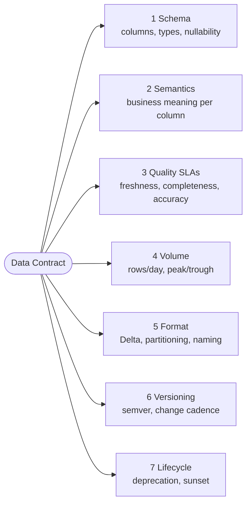
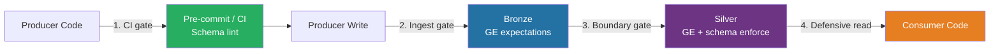
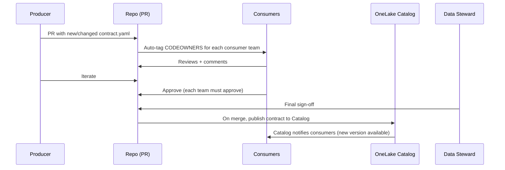

[Home](../../index.md) > [Docs](../..) > [Best Practices](../index.md) > [Data Management](../index.md) > Data Contracts

# 📜 Data Contracts on Microsoft Fabric

<div align="center" markdown>

**Schema, Semantics, and SLA Agreements Between Data Producers and Consumers**


</div>

---

**Last Updated:** `2026-04-27` | **Version:** 1.0.0 | **Wave 3 anchor:** [master-data-management.md](master-data-management.md)

---

## 📑 Table of Contents

- [🎯 Why Data Contracts](#-why-data-contracts)
- [🧩 What's in a Contract](#-whats-in-a-contract)
- [📄 Contract Specification Format](#-contract-specification-format)
- [🛡️ Contract Enforcement Layers](#️-contract-enforcement-layers)
- [✅ GE Expectation Suite Pattern](#-ge-expectation-suite-pattern)
- [🚧 Breaking Change Policy](#-breaking-change-policy)
- [🔄 Schema Evolution on Delta](#-schema-evolution-on-delta)
- [📝 Contract Negotiation Process](#-contract-negotiation-process)
- [🔢 Versioning Strategy (semver)](#-versioning-strategy-semver)
- [📦 Contract as Code](#-contract-as-code)
- [🎰 Casino Implementation](#-casino-implementation)
- [🏛️ Federal Implementation](#️-federal-implementation)
- [🚫 Anti-Patterns](#-anti-patterns)
- [📋 Implementation Checklist](#-implementation-checklist)
- [📚 References](#-references)

---

## 🎯 Why Data Contracts

A **data contract** is a versioned, machine-readable agreement between a data producer and its consumers covering schema, semantics, quality SLAs, volume expectations, and lifecycle. Without contracts, every change to a producer's table is a silent breaking change — pipelines break in production at 2 a.m., consumers point fingers, and the team's trust in the platform decays.

### Cost of Contract-less Data

| Symptom Without Contracts | Cause | Cost |
|---------------------------|-------|------|
| Producer renames a column; six dashboards go blank | No notice, no detection | Hours of incident response, consumer trust loss |
| Type silently widened from `int` to `bigint`; downstream Power BI sums wrap | No type guarantee | Wrong KPIs in executive reports |
| Consumer assumes a "session_id" is unique; producer says "no, it's per-day" | Semantics never written down | Bad joins, inflated counts |
| Bronze freshness drops from hourly to daily; SLA breach unnoticed | No volume / freshness SLA | Stale Gold tables, BI lag |
| Compliance team consumes player table, doesn't know `tax_id` was hashed differently | No semantic versioning | False CTR/SAR matches |
| Producer ships v2 schema while v1 consumers still in flight | No deprecation window | Production outage |
| New consumer onboards by reverse-engineering the schema | No published contract | 2-3 weeks of bug-fixing |

> **Takeaway:** Without a contract, the producer's *implementation* becomes the contract — and any code change is a contract change. Consumers couple to incidental details (column order, NULL behavior, file format) that the producer never intended to guarantee.

### When Data Contracts Pay For Themselves

- More than 1 consumer of a dataset (multi-team)
- The dataset feeds compliance, finance, or executive reporting
- Producers and consumers are in different teams or different time zones
- Schema evolution happens at least monthly
- The dataset has explicit SLAs

If you have **one** producer and **one** consumer in the same team, a CSV in a shared folder is fine. Contracts are for the rest of us.

---

## 🧩 What's in a Contract

A complete data contract has **seven elements**. Each is non-negotiable; missing any one shifts the burden to the consumer.



### 1. Schema

The structural agreement: column names, data types, nullability, and constraints.

| Item | Specifies | Example |
|------|-----------|---------|
| Column name | Stable identifier | `machine_id` |
| Type | Physical Spark/Delta type | `string`, `bigint`, `decimal(18,2)`, `timestamp` |
| Nullability | Whether null is acceptable | `nullable: false` |
| Constraints | Range, regex, enum, foreign key | `min: 0`, `regex: ^M[0-9]{4}$`, `enum: [SLOT, TABLE, KENO]` |
| Default | Fallback for missing | `default: 0.0` |

### 2. Semantics

What each column **means** in business terms — distinct from what its type implies.

```yaml
- name: amount_wagered
  type: decimal(18,2)
  semantic: |
    Total dollar amount wagered in this event.
    For slots: cash equivalent of coin-in for a single hand.
    For tables: dollar value of chips bet on this hand.
    NEVER includes free-play or promotional credit (those go to amount_wagered_free).
  unit: USD
  precision: 2 decimals (cents)
```

A column type tells you it's a `decimal`. The semantic tells you whether it includes promotional credit, which currency, which event boundary. **Most data bugs are semantic disagreements masquerading as data quality issues.**

### 3. Quality SLAs

Measurable thresholds the producer commits to, enforced by Great Expectations at boundaries.

| Dimension | Metric | Example |
|-----------|--------|---------|
| Freshness | Max age of latest record | `< 30 minutes` |
| Completeness | Non-null rate per critical column | `>= 99.5%` for `machine_id` |
| Uniqueness | Duplicate rate on natural key | `<= 0.01%` on `(machine_id, event_ts)` |
| Accuracy | Range / referential integrity | `amount >= 0`, `state_code IN dim_state` |
| Volume | Rows/day vs forecast band | `within ±20% of 7-day rolling avg` |
| Timeliness | Latency p99 from event to Bronze | `< 5 minutes` |

### 4. Volume Expectations

```yaml
volume:
  baseline_rows_per_day: 5_000_000
  peak_rows_per_hour: 800_000     # Friday 8pm casino floor peak
  trough_rows_per_hour: 50_000    # Tuesday 4am
  alert_if_outside_band: 0.5..2.0 # 50% to 200% of baseline
```

Volume changes are usually the earliest signal of upstream breakage.

### 5. Format

```yaml
format:
  storage: delta
  partition_by: [event_date]
  z_order_by: [machine_id, event_ts]
  table_name: lh_bronze.slot_telemetry
  naming_convention: snake_case
  v_order: true
```

### 6. Versioning Policy

```yaml
versioning:
  scheme: semver
  current_version: 2.3.0
  breaking_change_cadence: quarterly_max  # never more than once a quarter
  deprecation_notice_days: 30
  dual_write_window_days: 30
```

### 7. Lifecycle

```yaml
lifecycle:
  status: stable           # stable | deprecated | sunset
  deprecation_date: null
  sunset_date: null
  successor: null
  retention_days: 2555     # 7 years (NIGC)
```

---

## 📄 Contract Specification Format

Contracts live as **YAML** in the producer's repository under a `contracts/` directory next to the producer's notebook or Spark Job. They are reviewed via PR like any other code.

### Repository Layout

```
notebooks/bronze/
  01_bronze_slot_telemetry.py        # producer code
  contracts/
    slot_telemetry.contract.yaml     # contract for that producer
    slot_telemetry.contract.v1.yaml  # archived previous version
```

### Full Contract Template

```yaml
# contracts/slot_telemetry.contract.yaml
contract:
  id: bronze.slot_telemetry
  version: 2.3.0
  status: stable
  description: |
    Per-event slot machine telemetry from the casino floor.
    Each row = one wager event (handle pull) on a slot machine.

  owner:
    team: data-engineering-casino
    primary: alice@example.com
    secondary: bob@example.com
    slack: "#casino-data"

  producer:
    item_type: notebook
    item_path: notebooks/bronze/01_bronze_slot_telemetry.py
    workspace: ws_casino_prod
    schedule: streaming  # eventstream-fed
    upstream_source: casino_pos_eventstream

  consumers:
    - team: bi-reporting
      use_case: Daily slot performance dashboard
      table_used: lh_silver.slot_telemetry_cleansed
      pii_access: none
    - team: compliance
      use_case: CTR/SAR detection
      table_used: lh_silver.slot_telemetry_cleansed
      pii_access: hashed_only
    - team: data-science
      use_case: Churn model training
      table_used: lh_gold.fact_slot_metrics
      pii_access: aggregated

  schema:
    columns:
      - name: machine_id
        type: string
        nullable: false
        regex: '^M[0-9]{4}$'
        semantic: Unique slot machine identifier; stable across firmware updates.
      - name: casino_id
        type: string
        nullable: false
        foreign_key: lh_silver.dim_casino.casino_id
        semantic: Property where the machine resides.
      - name: event_ts
        type: timestamp
        nullable: false
        semantic: |
          UTC timestamp the wager event was recorded by the slot's
          electronic gaming machine controller (EGM). Not the network
          ingest time. Use for ordering events on a single machine.
      - name: amount_wagered
        type: decimal(18,2)
        nullable: false
        min: 0.01
        max: 500000.00
        unit: USD
        semantic: |
          Cash equivalent of coin-in for a single hand. Excludes
          promotional/free-play credit (see amount_wagered_free).
      - name: amount_won
        type: decimal(18,2)
        nullable: false
        min: 0.00
        unit: USD
        semantic: Cash equivalent of coin-out for the hand.
      - name: game_type
        type: string
        nullable: false
        enum: [SLOT, VIDEO_POKER, KENO, TABLE]
        semantic: Game category; drives compliance W-2G thresholds.
      - name: player_id
        type: string
        nullable: true
        semantic: |
          Loyalty card player ID if carded play; NULL for un-carded.
          NULL is normal — about 35% of slot revenue is un-carded.
      - name: tax_id_hashed
        type: string
        nullable: true
        regex: '^[a-f0-9]{64}$'  # SHA-256 hex
        semantic: |
          SHA-256 of (SSN + global salt). Salt is rotated annually.
          NEVER stored as plaintext. NULL for un-carded play.
        pii_classification: hashed_pii

  quality:
    freshness:
      max_age_minutes: 30
      measured_as: max(event_ts) vs now()
    completeness:
      - column: machine_id
        min_pct: 99.99
      - column: amount_wagered
        min_pct: 100.00
      - column: player_id
        min_pct: 60.00      # ~35% un-carded is normal
    uniqueness:
      - keys: [machine_id, event_ts]
        max_dup_pct: 0.01
    accuracy:
      - rule: amount_wagered >= 0
      - rule: amount_won >= 0
      - rule: amount_won <= amount_wagered * 100  # sanity check
      - rule: casino_id IN (SELECT casino_id FROM lh_silver.dim_casino)

  volume:
    baseline_rows_per_day: 5000000
    peak_rows_per_hour: 800000
    trough_rows_per_hour: 50000
    alert_band: [0.5, 2.0]   # alert if 7d MA falls outside this multiple

  sla:
    bronze_landing_p99_minutes: 5
    silver_propagation_p99_minutes: 15
    incident_response: pager_duty_casino_data
    incident_runbook: docs/runbooks/data-quality-incident.md
    business_hours: 24x7

  format:
    storage: delta
    partition_by: [event_date]
    z_order_by: [machine_id, event_ts]
    v_order: true
    table_name: lh_bronze.slot_telemetry

  versioning:
    scheme: semver
    breaking_change_cadence: quarterly_max
    deprecation_notice_days: 30
    dual_write_window_days: 30

  lifecycle:
    status: stable
    deprecation_date: null
    sunset_date: null
    successor: null
    retention_days: 2555     # 7 years (NIGC MICS §542.17)

  compliance:
    classifications: [pii, financial]
    sensitivity_label: "Confidential - Casino Compliance"
    regulations: [BSA, NIGC_MICS, IRS_W2G]
```

The contract is **the** source of truth — schema validation, GE suites, and consumer documentation are all generated from it.

---

## 🛡️ Contract Enforcement Layers

A contract enforced in only one place is unenforced. Contracts must be checked at four layers, each catching a different failure mode.



### Layer 1 — Producer Write Time (Pre-commit / CI)

Validate the contract YAML itself, and validate the producer code emits the contracted schema, before merge.

```python
# scripts/contracts/validate_contract.py
# Run by .github/workflows/test-fabric.yml on every PR

import yaml
from pathlib import Path
from jsonschema import validate

CONTRACT_META_SCHEMA = yaml.safe_load(Path("contracts/_meta_schema.yaml").read_text())

def validate_contract_file(path: Path) -> None:
    contract = yaml.safe_load(path.read_text())
    validate(instance=contract, schema=CONTRACT_META_SCHEMA)
    # Required cross-field checks
    assert contract["contract"]["version"], "version is required"
    for col in contract["contract"]["schema"]["columns"]:
        assert col.get("semantic"), f"column {col['name']} missing semantic description"
    print(f"OK {path}")

for contract_path in Path("contracts").rglob("*.contract.yaml"):
    validate_contract_file(contract_path)
```

### Layer 2 — Ingest Gate (Bronze)

Bronze is the first place consumer-visible data lives. Expectations enforce the producer's claim.

```python
# notebooks/bronze/01_bronze_slot_telemetry.py
import great_expectations as gx
from contracts.loader import load_contract, generate_ge_suite

contract = load_contract("contracts/slot_telemetry.contract.yaml")
suite = generate_ge_suite(contract)        # auto-generated; see next section

context = gx.get_context()
batch = context.get_batch(table="lh_bronze.slot_telemetry_staging")
results = context.run_validation_operator("action_list_operator", [batch], suite)

if not results["success"]:
    failed_expectations = [
        r for r in results["results"] if not r["success"]
    ]
    raise ContractViolation(
        f"Contract {contract['contract']['id']} v{contract['contract']['version']} "
        f"violated by {len(failed_expectations)} expectations. "
        f"Run blocked. See: {results['validation_id']}"
    )

# Only on pass do we promote staging -> Bronze proper
spark.sql("INSERT INTO lh_bronze.slot_telemetry SELECT * FROM lh_bronze.slot_telemetry_staging")
```

### Layer 3 — Boundary Gates (Silver / Gold)

Each medallion boundary re-validates against the upstream contract. A Silver notebook reads from Bronze using contract-aware expectations and refuses to propagate violations downstream.

### Layer 4 — Defensive Reads (Consumer)

Consumers should not blindly trust the contract. They should perform a **lightweight contract pin** at read time:

```python
# Consumer-side defensive read
EXPECTED_CONTRACT_VERSION = "2.3.0"
EXPECTED_COLS = {"machine_id", "event_ts", "amount_wagered", "amount_won", "game_type"}

df = spark.read.table("lh_silver.slot_telemetry_cleansed")
actual_cols = set(df.columns)
missing = EXPECTED_COLS - actual_cols
if missing:
    raise RuntimeError(
        f"Contract drift: expected columns missing {missing}. "
        f"Pinned to v{EXPECTED_CONTRACT_VERSION}; check producer changelog."
    )
```

A consumer that pins to a contract version gets a loud failure when something drifts — far better than silent miscalculation.

---

## ✅ GE Expectation Suite Pattern

Generate Great Expectations suites mechanically from the contract. **Hand-written suites drift; generated ones don't.**

### Generator (PySpark + GE)

```python
# scripts/contracts/generate_ge_suite.py
"""Generate a Great Expectations expectation suite from a contract YAML."""

from typing import Any
import yaml
from pathlib import Path
import json


def generate_ge_suite(contract: dict[str, Any]) -> dict[str, Any]:
    c = contract["contract"]
    suite_name = c["id"].replace(".", "_") + "_suite"
    expectations: list[dict] = []

    # Table-level expectations
    expected_cols = [col["name"] for col in c["schema"]["columns"]]
    expectations.append({
        "expectation_type": "expect_table_columns_to_match_set",
        "kwargs": {"column_set": expected_cols, "exact_match": False},
    })

    # Per-column expectations
    for col in c["schema"]["columns"]:
        name = col["name"]
        # Existence
        expectations.append({
            "expectation_type": "expect_column_to_exist",
            "kwargs": {"column": name},
        })
        # Type
        type_map = {
            "string": "StringType",
            "bigint": "LongType",
            "int": "IntegerType",
            "timestamp": "TimestampType",
            "decimal(18,2)": "DecimalType",
            "double": "DoubleType",
            "boolean": "BooleanType",
        }
        if col["type"] in type_map:
            expectations.append({
                "expectation_type": "expect_column_values_to_be_of_type",
                "kwargs": {"column": name, "type_": type_map[col["type"]]},
            })
        # Nullability
        if not col.get("nullable", True):
            expectations.append({
                "expectation_type": "expect_column_values_to_not_be_null",
                "kwargs": {"column": name},
            })
        # Range
        if "min" in col or "max" in col:
            expectations.append({
                "expectation_type": "expect_column_values_to_be_between",
                "kwargs": {
                    "column": name,
                    "min_value": col.get("min"),
                    "max_value": col.get("max"),
                },
            })
        # Regex
        if "regex" in col:
            expectations.append({
                "expectation_type": "expect_column_values_to_match_regex",
                "kwargs": {"column": name, "regex": col["regex"]},
            })
        # Enum
        if "enum" in col:
            expectations.append({
                "expectation_type": "expect_column_values_to_be_in_set",
                "kwargs": {"column": name, "value_set": col["enum"]},
            })

    # Quality SLA -> expectations
    for entry in c.get("quality", {}).get("completeness", []):
        expectations.append({
            "expectation_type": "expect_column_values_to_not_be_null",
            "kwargs": {
                "column": entry["column"],
                "mostly": entry["min_pct"] / 100.0,
            },
        })
    for entry in c.get("quality", {}).get("uniqueness", []):
        expectations.append({
            "expectation_type": "expect_compound_columns_to_be_unique",
            "kwargs": {"column_list": entry["keys"]},
        })

    return {
        "expectation_suite_name": suite_name,
        "meta": {
            "contract_id": c["id"],
            "contract_version": c["version"],
            "generated_from": "contracts/" + c["id"].split(".")[-1] + ".contract.yaml",
        },
        "expectations": expectations,
    }


if __name__ == "__main__":
    for contract_path in Path("contracts").rglob("*.contract.yaml"):
        contract = yaml.safe_load(contract_path.read_text())
        suite = generate_ge_suite(contract)
        out = Path("validation/great_expectations/expectations") / (
            suite["expectation_suite_name"] + ".json"
        )
        out.write_text(json.dumps(suite, indent=2))
        print(f"Wrote {out}")
```

### Wire-In as Pipeline Quality Gate

```python
# notebooks/silver/01_silver_slot_cleansed.py — boundary gate
from pyspark.sql import functions as F
import great_expectations as gx

CONTRACT_ID = "bronze.slot_telemetry"
CONTRACT_VERSION = "2.3.0"

context = gx.get_context()
suite = context.get_expectation_suite(f"{CONTRACT_ID.replace('.', '_')}_suite")

# Validate Bronze before reading
batch = context.get_batch_from_table("lh_bronze.slot_telemetry")
result = context.run_checkpoint(
    checkpoint_name="bronze_slot_telemetry_checkpoint",
    batch_request=batch.batch_request,
    expectation_suite_name=suite.expectation_suite_name,
)

if not result["success"]:
    # Block downstream propagation. Open incident per runbook.
    raise ContractViolation(
        f"Upstream contract violated; Silver not refreshed. "
        f"Suite: {suite.expectation_suite_name}, "
        f"Version: {suite.meta.get('contract_version')}, "
        f"Failed: {result['statistics']['unsuccessful_expectation_count']}"
    )

# Continue with Silver transformation only on pass
df = spark.read.table("lh_bronze.slot_telemetry")
# ...standard Silver dedup, null-handling, conform...
```

### Block, Don't Drop

A contract violation **blocks** the downstream load. It does not silently drop bad rows. Silent drops mask producer regressions and corrupt KPIs invisibly.

---

## 🚧 Breaking Change Policy

A change is **breaking** if any consumer's existing code could fail or compute wrong results.

### What Counts as Breaking

| Change | Breaking? | Why |
|--------|-----------|-----|
| Add new nullable column with default | No | Existing consumers ignore unknown columns |
| Add new non-nullable column with no default | Yes | Inserts from old producers fail |
| Rename column | Yes | Consumers reference the old name |
| Drop column | Yes | Consumers may depend on it |
| Type widen `int → bigint` | No (Delta-safe) | Existing values still fit |
| Type narrow `bigint → int` | Yes | Existing large values overflow |
| Change semantic meaning (e.g., now includes promo credit) | **Yes — most dangerous** | Consumer code computes silently wrong |
| Tighten constraint (`min: 0 → min: 1`) | Yes | Old data violates new contract |
| Loosen constraint (`min: 1 → min: 0`) | No | Old data remains valid |
| Change partition column | Yes | Performance contracts break, predicates fail |
| Change unit (`USD → cents`) | Yes | Calculations wrong by 100x |

> **The most insidious breaking change is a semantic change with no schema change.** Renaming `amount_wagered` to `amount_wagered_with_promo` while keeping the column name `amount_wagered` is a **major version bump** even though the SQL DDL is unchanged.

### Required Cadence and Notice

| Step | Min duration | Communication |
|------|--------------|---------------|
| RFC published in repo + Teams channel | 14 days for review | Slack + email all consumers in `consumers:` list |
| Approval signed off by all consumers | — | PR approval from each consumer team |
| Deprecation notice posted | 30 days minimum | Banner in OneLake Catalog, Slack reminder weekly |
| Dual-write window starts | 30 days minimum | Both v1 and v2 tables populated |
| Sunset of v1 | After dual-write window | Old table dropped, suite deleted |

### Deprecation Telemetry

Track who is still consuming the old contract — you cannot sunset what you cannot see.

```python
# Workspace Monitoring query: which queries hit the deprecated table?
deprecated_table = "lh_bronze.slot_telemetry_v1"
recent_consumers = spark.sql(f"""
    SELECT
      executing_user,
      executing_workspace,
      count(*) as query_count,
      max(query_ts) as last_query
    FROM workspace_monitoring.queries
    WHERE table_referenced = '{deprecated_table}'
      AND query_ts > current_date() - INTERVAL 7 DAYS
    GROUP BY 1, 2
    ORDER BY query_count DESC
""")
recent_consumers.show()
```

If `query_count > 0` after the deprecation window, **extend the dual-write window**; do not sunset on schedule. Schedule slips beat broken consumers.

---

## 🔄 Schema Evolution on Delta

Delta Lake supports targeted schema evolution. Use it to keep most changes non-breaking.

### Additive Changes (Non-Breaking)

```python
# Add a new optional column
spark.sql("""
    ALTER TABLE lh_bronze.slot_telemetry
    ADD COLUMN promotional_credit decimal(18,2)
    COMMENT 'Free-play credit applied to this wager event (v2.4.0)'
""")
# Existing inserts still succeed; consumers querying old columns unaffected.
```

For dataframe writes: enable `mergeSchema`:

```python
df.write.format("delta").mode("append") \
    .option("mergeSchema", "true") \
    .saveAsTable("lh_bronze.slot_telemetry")
```

### Type Widening (Non-Breaking)

```python
# int -> bigint is safe (Delta enables type widening with table feature)
spark.sql("""
    ALTER TABLE lh_bronze.slot_telemetry
    SET TBLPROPERTIES('delta.enableTypeWidening' = 'true')
""")
spark.sql("ALTER TABLE lh_bronze.slot_telemetry CHANGE COLUMN handle_pulls TYPE bigint")
```

### Drop Column (Breaking — Migration Required)

Never drop a column directly in production. Use the **add-populate-flag-drop** pattern across releases:

```python
# Release v2.4.0 — introduce successor column
spark.sql("ALTER TABLE lh_bronze.slot_telemetry ADD COLUMN amount_wagered_v2 decimal(18,2)")

# Release v2.5.0 — populate successor in all writes
df = df.withColumn("amount_wagered_v2", F.col("amount_wagered_with_promo_split"))

# Release v3.0.0 — major bump; drop old column AFTER 30-day dual window
spark.sql("ALTER TABLE lh_bronze.slot_telemetry DROP COLUMN amount_wagered")
```

### Rename (Breaking — Use Add+Populate+Drop)

```python
# WRONG: Direct rename. Breaking, no migration window.
# spark.sql("ALTER TABLE x RENAME COLUMN old_name TO new_name")

# RIGHT: Three-release pattern
# Release N: ADD new_name; populate from old_name in producer.
# Release N+1: Mark old_name deprecated in contract; emit usage telemetry.
# Release N+2 (major): DROP old_name after 30-day no-consumer window.
```

### Partition Changes

Changing a partition column requires a full table rewrite. Plan for it:

```python
# Stage rewrite to new partitioning
spark.sql("""
    CREATE TABLE lh_bronze.slot_telemetry_repartitioned
    USING DELTA
    PARTITIONED BY (event_date, casino_id)
    AS SELECT * FROM lh_bronze.slot_telemetry
""")
# Cut over via atomic rename in maintenance window.
```

---

## 📝 Contract Negotiation Process

Contracts are not unilateral. A producer cannot "ship a contract" — consumers must agree.



### RFC for New Contracts

For greenfield datasets, write an RFC before any code:

```markdown
# RFC: bronze.slot_telemetry contract v1.0.0

## Purpose
[Why this dataset exists]

## Producers
[Who emits it; what upstream system]

## Identified consumers
[Names + use cases]

## Schema (proposed)
[Columns]

## Quality SLAs (proposed)
[Freshness, completeness]

## Open questions
[Anything not yet decided]
```

Post the RFC in the team's discussion channel; collect feedback for at least 7 business days before merging the contract.

### Consumer Sign-Off

Use GitHub `CODEOWNERS` so each consumer team must approve contract changes affecting them:

```
# .github/CODEOWNERS
contracts/slot_telemetry.contract.yaml @data-engineering-casino @bi-reporting @compliance @data-science
```

Consumer-team sign-off is non-negotiable for **major** version bumps.

---

## 🔢 Versioning Strategy (semver)

```
MAJOR.MINOR.PATCH
  │     │     │
  │     │     └── doc-only fix; no behavior change
  │     └──────── additive (new column, looser constraint, doc)
  └────────────── breaking (rename, drop, type narrow, semantic shift)
```

| Bump | Examples | Consumer action |
|------|----------|-----------------|
| PATCH (`2.3.0 → 2.3.1`) | Fix typo in semantic description | None |
| MINOR (`2.3.1 → 2.4.0`) | Add nullable column with default; loosen `min`; widen type | None required; opportunistic adoption |
| MAJOR (`2.4.0 → 3.0.0`) | Rename, drop, type narrow, semantic change | Required migration within deprecation window |

### Versioned Tables (Optional)

For high-stakes datasets, materialize the major version into the table name:

```
lh_bronze.slot_telemetry_v2     # MAJOR=2 lives here
lh_bronze.slot_telemetry_v3     # MAJOR=3 lives here during dual-write
lh_bronze.slot_telemetry        # alias view that points to current MAJOR
```

Consumers explicitly opt into v3 by switching their FROM clause.

---

## 📦 Contract as Code

Contracts are code artifacts and follow code lifecycle.

| Practice | What it means |
|----------|---------------|
| YAML in Git | Single source of truth in repo; PR review for any change |
| CODEOWNERS | Producer + every consumer auto-tagged on PR |
| CI validation | Lint contract YAML; verify producer code matches schema |
| Auto-generated GE suites | `python scripts/contracts/generate_ge_suite.py` runs in CI |
| Auto-generated docs | Catalog descriptions published from contract |
| Versioned releases | Tag in Git: `contract/slot_telemetry@2.3.0` |
| Catalog publication | Merge → CI publishes contract to OneLake Catalog as item description |

### CI Pipeline Snippet

```yaml
# .github/workflows/contracts-ci.yml (snippet)
- name: Lint contracts
  run: python scripts/contracts/validate_contract.py
- name: Generate GE suites
  run: python scripts/contracts/generate_ge_suite.py
- name: Detect drift
  run: |
    git diff --exit-code validation/great_expectations/expectations/
    # Fails CI if generated suites differ from committed; forces regen.
- name: Publish to Catalog (on main merge)
  if: github.ref == 'refs/heads/main'
  run: python scripts/contracts/publish_to_catalog.py
```

---

## 🎰 Casino Implementation

### Slot Telemetry Contract (High-Volume, Real-Time)

| Attribute | Value |
|-----------|-------|
| Volume | 5M rows/day, 800K rows/hour peak |
| Freshness SLA | < 30 minutes |
| Consumers | BI, Compliance, Data Science |
| Breaking change cadence | quarterly_max |
| Retention | 7 years (NIGC MICS §542.17) |
| PII | `tax_id` hashed; `player_id` not PII (loyalty surrogate) |

The full YAML for this contract is shown in [Contract Specification Format](#-contract-specification-format) above.

Real-time ingestion via Eventstream means contract violations show up in seconds — and so do incidents. The pipeline gate at Bronze blocks downstream propagation; an incident is opened per the [data quality runbook](../../runbooks/data-quality-incident.md).

### Player Loyalty Contract (Lower Volume, Multi-Consumer)

```yaml
# contracts/player_loyalty.contract.yaml (excerpt)
contract:
  id: silver.player_loyalty
  version: 1.4.0
  description: |
    Per-player loyalty profile. One row per player.
    SCD2 with effective_from / effective_to.
  consumers:
    - team: marketing-crm     # promo targeting
    - team: compliance        # CTR/SAR aggregation anchor
    - team: data-science      # churn model
    - team: hotel-pms         # comp eligibility
  schema:
    columns:
      - name: player_id
        type: string
        nullable: false
        regex: '^P[0-9]{10}$'
        semantic: Stable loyalty surrogate; never reused.
      - name: tier
        type: string
        nullable: false
        enum: [BRONZE, SILVER, GOLD, PLATINUM, SEVEN_STAR]
        semantic: |
          Loyalty tier as of this row's effective period.
          Tier is recalculated nightly from trailing-12-month theo.
      - name: lifetime_theo
        type: decimal(18,2)
        nullable: false
        unit: USD
        semantic: |
          Cumulative theoretical win attributable to this player
          since enrollment. Excludes voided sessions.
      # ...
  quality:
    freshness: { max_age_minutes: 1440 }   # daily
    uniqueness:
      - keys: [player_id, effective_from]
  sla:
    bronze_landing_p99_minutes: 60
```

Multi-consumer means breaking changes are expensive — every team must sign off. Encourage producers to keep changes additive and use `enum` extension (loosening) instead of replacement.

---

## 🏛️ Federal Implementation

### USDA Crop Production Contract

```yaml
contract:
  id: silver.usda_crop_production
  version: 1.2.0
  owner:
    team: data-engineering-federal
  consumers:
    - team: usda-analytics
    - team: cross-agency       # joins with NOAA weather, EPA air quality
  schema:
    columns:
      - name: state_fips
        type: string
        nullable: false
        regex: '^[0-9]{2}$'
        foreign_key: lh_silver.dim_state.fips
        semantic: 2-digit US state FIPS code (NIST 5-2).
      - name: commodity_code
        type: string
        nullable: false
        foreign_key: lh_silver.dim_usda_commodity.code
        semantic: USDA NASS commodity code (e.g., '0011' = Corn).
      - name: year
        type: int
        nullable: false
        min: 1990
        max: 2099
      - name: production_quantity
        type: bigint
        nullable: false
        min: 0
        unit: domain-specific (see unit_of_measure)
      - name: unit_of_measure
        type: string
        nullable: false
        enum: [BUSHELS, POUNDS, TONS, ACRES]
        semantic: Unit for `production_quantity`. Crop-specific.
  quality:
    freshness: { max_age_minutes: 10080 }   # weekly (USDA NASS publishing cadence)
    uniqueness:
      - keys: [state_fips, commodity_code, year]
  sla:
    business_hours: 9x5_business_days
  compliance:
    classifications: [public]
    sensitivity_label: "Public - Federal Open Data"
```

USDA data is public, so PII fields are absent. Cross-agency consumers (e.g., joining USDA × NOAA × EPA) gain stability when each agency publishes a contract.

### DOJ Case Data Contract (Restricted)

```yaml
contract:
  id: silver.doj_federal_cases
  version: 1.0.0
  owner:
    team: data-engineering-federal-restricted
  consumers:
    - team: doj-analytics
      pii_access: full        # within DOJ trust boundary
    - team: cross-agency
      pii_access: aggregated_only
      access_control: row_level_security
  schema:
    columns:
      - name: case_id
        type: string
        nullable: false
        semantic: PACER case identifier; public by case but joined to PII.
      - name: defendant_name_hashed
        type: string
        nullable: true
        regex: '^[a-f0-9]{64}$'
        pii_classification: hashed_pii
        semantic: SHA-256(defendant_name + DOJ_SALT). Never plaintext at rest.
      - name: case_type
        type: string
        enum: [CRIMINAL, CIVIL, BANKRUPTCY, IMMIGRATION]
      - name: filing_date
        type: date
        nullable: false
  quality:
    freshness: { max_age_minutes: 1440 }
  sla:
    business_hours: 9x5_business_days
  compliance:
    classifications: [restricted, pii_hashed]
    sensitivity_label: "Restricted - DOJ Internal"
    regulations: [Privacy_Act_1974, JABS]
    requires_sorn: true
  format:
    storage: delta
    partition_by: [filing_date]
    table_name: lh_silver_doj.federal_cases
    rls_policy: doj_case_rls
```

For restricted data, the contract carries access-control metadata so consumers cannot accidentally bypass it. Cross-agency joins are explicit (`cross-agency` consumer entry) and require pre-approved RLS policies.

---

## 🚫 Anti-Patterns

| Anti-Pattern | Why It Hurts | What to Do Instead |
|--------------|--------------|--------------------|
| **Contract lives in a wiki / Confluence page** | Drifts from code; no PR review; no CI enforcement | YAML in Git, validated in CI |
| **No semantic descriptions, only types** | Type alone never disambiguates `amount_wagered` from `amount_won_gross` | Mandatory `semantic:` field per column |
| **Implicit contracts ("look at the code")** | Producer's implementation IS the contract — every refactor is a breaking change | Explicit YAML + semver |
| **Schema-only contracts (no SLAs)** | Freshness regressions go undetected for days | Include freshness, completeness, volume SLAs |
| **Hand-written GE suites diverge from contract** | Two sources of truth; one rots | Generate suites from contract; CI rejects manual edits |
| **No deprecation window** | Consumers wake up to broken pipelines | 30-day minimum dual-write |
| **No breaking-change cadence cap** | Producers ship MAJOR every sprint; consumers can't keep up | `quarterly_max` or stricter |
| **Producer ignores consumer sign-off** | Consumer breakage is "their problem" — until executives notice | CODEOWNERS-enforced approval |
| **Contract version != table version** | Catalog says v2; table is silently v3 | Auto-publish version into table TBLPROPERTIES |
| **Silent type widening or narrowing in producer code** | Consumer math wraps or overflows | Type changes are explicit minor (widen) or major (narrow) |
| **Drop-and-recreate "migrations"** | Window of downtime, broken consumers | Add-populate-drop across releases |

---

## 📋 Implementation Checklist

Before declaring a dataset "production":

- [ ] Contract YAML exists in `contracts/` next to producer code
- [ ] CODEOWNERS lists producer team + every consumer team
- [ ] All columns have `semantic:` descriptions (not just types)
- [ ] Quality SLAs cover freshness, completeness, uniqueness, volume
- [ ] Contract validated by CI on every PR (`validate_contract.py`)
- [ ] GE expectation suite auto-generated from contract
- [ ] CI rejects manual edits to generated GE suites
- [ ] Bronze ingest gate enforces contract; blocks (does not drop) on violation
- [ ] Silver/Gold boundary gates re-validate
- [ ] At least one consumer pins a contract version in defensive read code
- [ ] Breaking-change cadence policy documented and signed off by consumer leads
- [ ] Deprecation telemetry instrumented (Workspace Monitoring query)
- [ ] Contract published to OneLake Catalog as item description
- [ ] RFC template in repo for new contracts
- [ ] Semver discipline: PATCH/MINOR/MAJOR rules in CONTRIBUTING.md
- [ ] Versioned table aliasing pattern documented for high-stakes datasets
- [ ] Compliance metadata (classification, sensitivity label, regulations) populated
- [ ] Incident runbook linked from `sla.incident_runbook`
- [ ] Producer notebook/job reads contract at runtime (not duplicated literals)
- [ ] Catalog publication CI step verified

---

## 📚 References

### Microsoft Fabric Documentation
- [OneLake Catalog](https://learn.microsoft.com/fabric/governance/onelake-catalog-overview)
- [Delta Lake schema evolution](https://learn.microsoft.com/azure/databricks/delta/update-schema)
- [Type widening in Delta](https://learn.microsoft.com/azure/databricks/delta/type-widening)
- [Workspace Monitoring](https://learn.microsoft.com/fabric/fundamentals/workspace-monitoring-overview)

### Industry Standards & Tools
- DAMA DMBOK 2nd Edition — Data Management Body of Knowledge (chapters on Data Architecture, Data Quality)
- [Data Mesh — Zhamak Dehghani](https://martinfowler.com/articles/data-mesh-principles.html) — data products and contracts
- [Open Data Contract Standard (ODCS)](https://github.com/bitol-io/open-data-contract-standard) — emerging open spec
- [Great Expectations](https://docs.greatexpectations.io/) — expectation library used by this POC
- semver.org — semantic versioning specification

### Related Wave 3 Docs
- [Master Data Management](master-data-management.md) — Wave 3 anchor
- [Data Product Framework](data-product-framework.md)
- [Reference Data Versioning](reference-data-versioning.md)
- [Late-Arriving Data](late-arriving-data.md)
- [SCD Patterns](scd-patterns.md)
- [Business Glossary Automation](business-glossary-automation.md)

### Related Existing Docs
- [Medallion Architecture Deep Dive](../medallion-architecture-deep-dive.md)
- [Testing Strategies](../testing-strategies.md) — GE patterns and CI test gates
- [Data Governance Deep Dive](../data-governance-deep-dive.md)
- [Fabric CI/CD Deployment](../fabric-cicd-deployment.md)

### Related Wave 1 + Wave 2 Docs
- [Data Quality Incident Runbook](../../runbooks/data-quality-incident.md)
- [Feature Store on OneLake](../feature-store-onelake.md) — feature contracts inherit dataset contracts
- [Responsible AI Framework](../responsible-ai-framework.md) — model input contracts

---

[⬆️ Back to Top](#-data-contracts-on-microsoft-fabric) | [📚 Data Management Index](.) | [🏠 Home](../../index.md)
