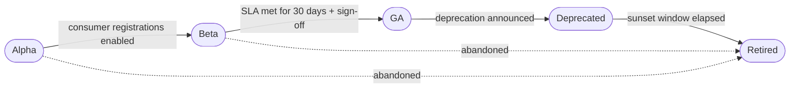
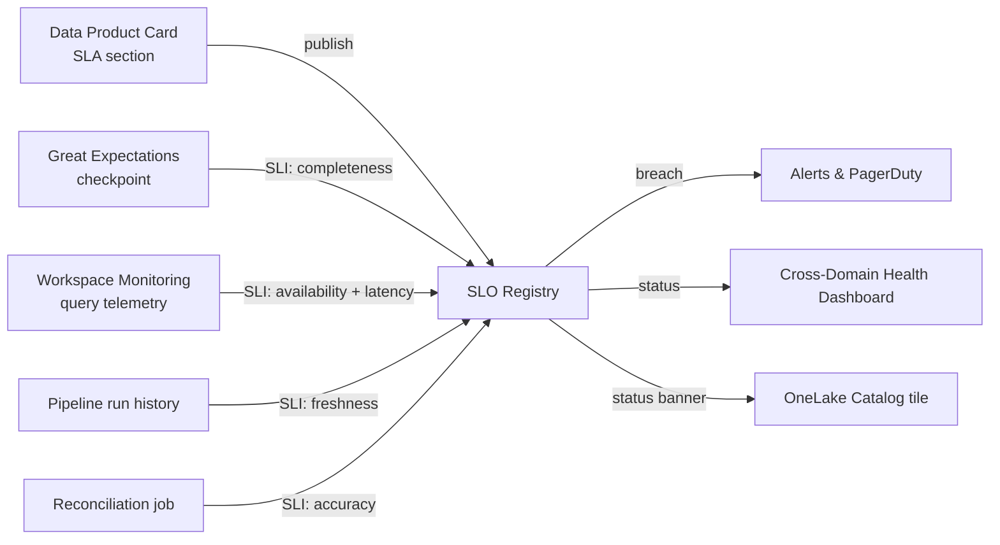
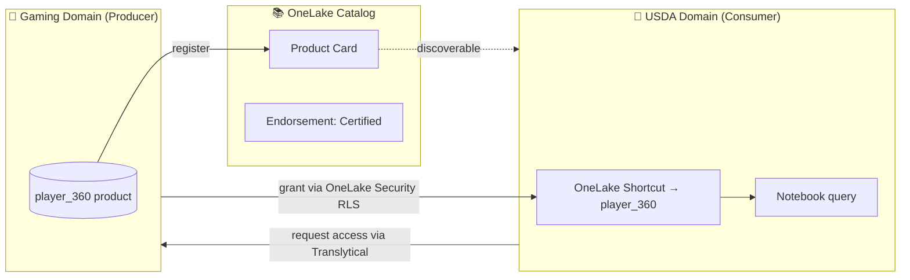

[Home](../../index.md) > [Docs](../..) > [Best Practices](../index.md) > [Data Management](../index.md) > Data Product Framework

# 📦 Data Product Framework on Microsoft Fabric

<div align="center" markdown>

**From Data-as-Byproduct to Data-as-Product — Ownership, SLAs, Discoverability, and Lifecycle**


</div>

---

**Last Updated:** `2026-04-27` | **Version:** 1.0.0 | **Wave 3 Sibling of:** [Master Data Management](master-data-management.md)

---

## 📑 Table of Contents

- [🎯 Overview](#-overview)
- [⭐ The Five Data Product Tenets](#-the-five-data-product-tenets)
- [🧪 What Counts as a Data Product (and What Doesn't)](#-what-counts-as-a-data-product-and-what-doesnt)
- [🪪 Data Product Card Template](#-data-product-card-template)
- [♻️ Lifecycle Stages](#️-lifecycle-stages)
- [🔍 Discoverability Patterns](#-discoverability-patterns)
- [🛣️ Consumption Path Documentation](#️-consumption-path-documentation)
- [📜 SLA Specification](#-sla-specification)
- [👥 Ownership Model (RACI)](#-ownership-model-raci)
- [💰 Cost Attribution](#-cost-attribution)
- [🪦 Deprecation Process](#-deprecation-process)
- [🌐 Federation & Sharing](#-federation--sharing)
- [🎰 Casino Implementation](#-casino-implementation)
- [🏛️ Federal Implementation](#️-federal-implementation)
- [🚫 Anti-Patterns](#-anti-patterns)
- [📋 Implementation Checklist](#-implementation-checklist)
- [📚 References](#-references)

---

## 🎯 Overview

For most of the last decade, data was treated as a **byproduct** — exhaust from operational systems that a central data team scraped together into reports. The pattern broke at scale: central teams became bottlenecks, data quality lived nowhere, consumers had no way to know whether a table was "trustworthy" or "someone's experiment from 2022", and ownership was a finger-pointing exercise. The **Data Product** discipline reframes the question. A data set with no owner, no SLA, no contract, and no lifecycle is not a data product — it's organizational risk pretending to be an asset.

**A data product is a curated, owned, contracted, observable, and lifecycle-managed unit of data delivered to consumers** — internal or external — with the same operational rigor an engineering team would apply to a public API. Microsoft Fabric provides the substrate (workspaces, OneLake, Catalog, Purview, GraphQL endpoints, Direct Lake, mirroring); this framework specifies the discipline applied on top.

### Why Data Products Matter on Fabric

| Symptom Without Product Discipline | Cause | Cost |
|------------------------------------|-------|------|
| Five teams build the same KPI five different ways | No canonical product to point them at | Wasted CU, conflicting numbers, executive distrust |
| Consumer pipeline silently breaks at 3am | Schema changed without notice | Lost SLA, on-call escalation |
| Nobody knows who to call when a number looks wrong | No registered owner | Issues age into compliance failures |
| Half the lakehouse is "exploratory" tables nobody can retire | No lifecycle stage, no deprecation policy | Capacity bloat, governance debt |
| Cost-cutting initiative cuts the wrong thing | No cost attribution per product | Critical product retired, exec dashboard breaks |
| New analyst can't find the "right" customer table | No discoverability layer | Months of onboarding time per hire |

> 📝 **Wave 3 Position:** This is the discipline doc that gives every other Wave 3 anchor a target shape. [Master Data Management](master-data-management.md) produces *golden records* — those golden records become **data products** under this framework. [Data Contracts](data-contracts.md) become the formal *contract section* of the data product card. [Reference Data Versioning](reference-data-versioning.md) handles the *schema stability* clause of the SLA.

### The Mental Shift

```
Byproduct mindset                    Product mindset
─────────────────                    ─────────────────
"I dropped a table in lh_gold"  →    "I shipped Player_360_Master v2.1.0
                                       with documented contract,
                                       4-hour freshness SLA,
                                       three registered consumers,
                                       and a deprecation timeline."
```

---

## ⭐ The Five Data Product Tenets

These are the non-negotiable properties. If any of the five is missing, you do not have a data product — you have a pile of bytes with marketing.

### 1. Discoverable

A consumer who has *never heard of* the product must be able to find it through search, browsing, or AI-assisted discovery within five minutes — and judge whether it fits their need without opening Slack.

| Surface | Mechanism on Fabric |
|---------|---------------------|
| Full-text search | OneLake Catalog search across name, description, tags, columns |
| Faceted browse | Catalog filters by domain, owner, sensitivity, endorsement |
| Business glossary | Microsoft Purview glossary terms attached to product |
| AI-assisted | Fabric MCP / Data Agents query the catalog index |
| Featured | Workspace landing page promotes "GA" products |

### 2. Addressable

The product must have a **stable, machine-readable address** that consumers can hard-code into pipelines, notebooks, BI models, and external apps. The address survives ownership transfers, workspace renames, and re-platforming.

```
# Stable addresses (examples)
sql:    contoso.fabric.microsoft.com / WS-Gaming-Prod / lh_gold.fact_daily_revenue
graphql: https://api.contoso.com/data/v2/player360
abfss:  abfss://gaming@onelake.dfs.fabric.microsoft.com/lh_gold.Lakehouse/Tables/fact_daily_revenue
```

If the address changes, the product version changes (per the deprecation process below).

### 3. Trustworthy (Quality SLAs)

A product publishes the **service levels it commits to**, instruments itself against them, and exposes the live status to consumers. "Trust me bro" is not a tenet — *measured* trustworthiness is.

| SLO Class | Example |
|-----------|---------|
| Freshness | "Data ≤ 4 hours old by 09:00 ET on business days" |
| Availability | "99.5% of queries against SQL endpoint return success in 30 days" |
| Completeness | "≥ 99.5% non-null on `customer_id`, `transaction_amount`, `transaction_date`" |
| Schema stability | "No breaking changes without 30-day notice + dual-write window" |
| Accuracy | "Reconciles to source of truth ± 0.05% on daily checksum" |

See the [SLA Specification](#-sla-specification) section for how these wire to SLI/SLO infra (Wave 1 anchor).

### 4. Self-describing

A product carries enough metadata that a competent analyst can use it **without asking the producer a single question**. Schema, business definitions, lineage, sample queries, and known limitations all live with the product, not in someone's head.

### 5. Interoperable

A product can be consumed by the natural tools of the consumer's choice — SQL, Direct Lake into Power BI, GraphQL, mirroring, REST, notebooks — without the consumer adopting the producer's stack. This is the difference between "data product" and "internal table you happen to allow people to read".

---

## 🧪 What Counts as a Data Product (and What Doesn't)

Not every table in OneLake is a product. Treating everything as a product is as bad as treating nothing as a product — it dilutes the discipline.

### YES — These ARE Data Products

| Asset | Why it qualifies |
|-------|------------------|
| `lh_gold.fact_daily_revenue` (stable schema, owned, documented, SLA'd) | Star-schema fact, registered consumers, freshness commitment |
| Published GraphQL endpoint `https://api.contoso.com/data/v2/player360` | External contract, versioned, rate-limited, monitored |
| Power BI semantic model `Casino_Floor_Performance.semanticmodel` (published, certified) | DAX measures with documented business definitions, RLS, refresh SLA |
| Mirrored database `MirroredDB_PlayerCRM` exposed for cross-domain consumption | Stable address, change-feed contract, ownership |
| `gold.party_golden` (output of the MDM hub) | Mastered, contracted, consumers register |
| Eventstream output `EventHouse.casino_floor_signals` (KQL queryable) | Real-time product with documented schema and retention |

### NO — These Are NOT Data Products

| Asset | Why it doesn't qualify |
|-------|------------------------|
| Dev-workspace exploratory table `lh_dev.tmp_alex_2026q1_test` | No owner-facing commitment, no SLA, lives in dev |
| One-off CSV in OneDrive | No address stability, no schema enforcement, no versioning |
| Notebook output written to a personal lakehouse | Producer-private; consumers cannot register |
| Bronze raw landing table | Not contracted with consumers; serves the platform, not the business |
| Silver intermediate table | Internal to the medallion pipeline; consumers should target Gold |
| Power BI report (not the model) | Reports consume products; they are not products themselves |
| Ad-hoc SQL view someone created last sprint and never told anyone about | The "and never told anyone" clause disqualifies it instantly |

> 🎯 **Heuristic:** If retiring this asset would surprise anyone outside your immediate team, it is functionally a data product — promote it formally or kill it. If retiring it would surprise nobody, it isn't a product, and that's fine.

---

## 🪪 Data Product Card Template

Every data product publishes a **card** — a single canonical document that lives alongside the product and is rendered in OneLake Catalog and Purview. The card is markdown so it is reviewable in Git. The same card backs the catalog tile, the workspace landing page, and the API documentation.

````markdown
---
# Data Product Card
# Save as: docs/data-products/<product_name>.md
# Mirror to: OneLake Catalog description + Purview asset

product_name:    "Player_360_Master"
product_id:      "dp.gaming.player_360_master"   # immutable, dotted, lowercase
domain:          "gaming"
status:          "GA"                              # alpha | beta | GA | deprecated | retired
version:         "2.3.0"                           # semver
addresses:
  sql:           "WS-Gaming-Prod / lh_gold.player_360"
  abfss:         "abfss://gaming@onelake.dfs.fabric.microsoft.com/lh_gold.Lakehouse/Tables/player_360"
  graphql:       "https://api.contoso.com/data/v2/player360"
  direct_lake:   "PowerBI: Casino_Player_360.semanticmodel"
---

## Purpose

One paragraph in plain English: what business decision this product supports, what
question it answers. No jargon, no acronym soup. If a new VP asked "what's this for",
this is the answer.

## Business Glossary Terms

- **Player** — see [Purview glossary: Player](purview://glossary/player)
- **Tier** — see [Purview glossary: Loyalty Tier](purview://glossary/loyalty-tier)
- **Lifetime Value** — see [Purview glossary: LTV](purview://glossary/ltv)

## Schema & Contract

- **Contract:** [docs/data-contracts/player_360_master.yaml](../data-contracts/player_360_master.yaml)
- **Schema version:** 2.3.0 (changelog at bottom of contract)
- **Breaking-change policy:** 30-day notice + dual-write window (see Lifecycle)

| Column | Type | Nullable | PII | Description |
|--------|------|----------|-----|-------------|
| `master_id` | BIGINT | NO | NO | Stable internal player ID — never reused |
| `legal_name` | STRING | NO | YES (PII-Direct) | Full legal name (Compliance source-of-truth) |
| `email` | STRING | YES | YES (PII-Direct) | Most-recent email across sources |
| `tier` | STRING | NO | NO | Loyalty tier: Bronze, Silver, Gold, Platinum, Diamond |
| `ltv_usd` | DECIMAL(18,2) | NO | NO | 365-day rolling lifetime value |
| `last_play_ts` | TIMESTAMP | YES | NO | Most-recent gaming activity |
| ... | ... | ... | ... | ... |

## SLA

| Dimension | Target | Measurement |
|-----------|--------|-------------|
| Freshness | ≤ 4 hours | Time since last successful refresh, measured by Workspace Monitoring |
| Availability | 99.5% | SQL endpoint query success rate over rolling 30 days |
| Completeness | ≥ 99.5% non-null on (master_id, tier, ltv_usd) | Great Expectations checkpoint per refresh |
| Schema stability | Breaking changes require 30-day notice | Enforced via contract CI |
| Accuracy | Reconciles to MDM hub ± 0 records | Daily checksum job |

**SLA wired to:** [SLO/SLI doc](../../operations/slo-sli-fabric.md) (Wave 1)

## Cost

- **Producing capacity:** F64 (`cap-gaming-prod`)
- **Average CU per refresh:** 1,840 CU-seconds (last 30-day median)
- **Refresh cadence:** Hourly (24 refreshes/day)
- **Estimated daily cost:** ~$22.30 USD (CU-second × $/CU × refresh count)
- **Tag:** `data_product=player_360_master` (drives [cost attribution](#-cost-attribution))

## Consumers (Registered)

| Consumer Team | Use Case | Consumption Path | Registered |
|---------------|----------|------------------|------------|
| Casino Marketing | Campaign targeting | Direct Lake → Power BI | 2025-11-04 |
| Compliance | Watch-list reconciliation | T-SQL via SQL endpoint | 2025-12-12 |
| Sportsbook | Cross-product KYC | GraphQL | 2026-01-17 |
| Loyalty Ops | Tier audits | Notebook (`%run` template) | 2026-02-03 |

> Unregistered consumers do not get SLA coverage. To register, open a request via the
> domain workspace **Translytical Task Flow** "Register as consumer".

## Lineage

- **Purview lineage:** [open in Purview](purview://lineage/dp.gaming.player_360_master)
- **Upstream:** `bronze.crm_customer`, `bronze.loyalty_member`, `bronze.compliance_party`
- **Downstream:** `gold.fact_player_session`, `MirroredDB_PlayerCRM`, `Casino_Floor_Performance.semanticmodel`

## Discoverability

- **OneLake Catalog tags:** `domain:gaming`, `owner:gaming-data@org.com`,
  `sensitivity:Confidential-PII`, `lifecycle:GA`, `endorsement:Certified`
- **Purview glossary terms:** Player, Loyalty Tier, Lifetime Value, Master Record
- **Endorsement:** Certified by Data Governance Board on 2025-11-15
- **Featured on:** Casino domain workspace landing page (top 3 products)

## Support

- **Product Owner:** Jane Doe (`jane.doe@org.com`)
- **On-call rotation:** `gaming-data-oncall@org.com` (PagerDuty: gaming-data)
- **Slack channel:** `#data-product-player360`
- **Runbook:** [runbooks/player-360-incident.md](../../../runbooks/player-360-incident.md)
- **Office hours:** Thursdays 14:00 ET

## Lifecycle & Roadmap

- **Stage:** GA (since 2025-11-15)
- **Next milestone:** v2.4.0 (Q3 2026) — adds `cltv_predicted` ML-derived column
- **Deprecation horizon:** None planned. v1.x deprecated 2025-09-01, retired 2025-12-01.

## Changelog

- **2.3.0** (2026-03-12) — Added `last_play_channel` (slot/table/sportsbook/online); non-breaking
- **2.2.0** (2026-02-01) — Added `preferred_language`; non-breaking
- **2.1.0** (2026-01-08) — Added `kyc_status`; non-breaking
- **2.0.0** (2025-11-15) — GA. Renamed `player_id` → `master_id` for MDM alignment (BREAKING — see migration guide)
- **1.x** — Deprecated 2025-09-01, retired 2025-12-01
````

> 📌 **Card Storage:** The card lives in `docs/data-products/<product_id>.md` in the repo. CI publishes it to OneLake Catalog as the item description and to Purview as the asset description on every merge. The card is the **single source of truth** — catalog and Purview are downstream views.

---

## ♻️ Lifecycle Stages

A data product moves through five well-defined stages. The stage is part of the card and is enforced by Catalog tags and CI.

| Stage | Audience | SLA | Schema policy | Address stability | Endorsement |
|-------|----------|-----|---------------|-------------------|-------------|
| **Alpha** | Producer team only (POC, internal) | None | May change without notice | Not guaranteed | None |
| **Beta** | Invited consumers (named teams) | Soft SLA (best-effort) | 7-day notice on changes | Stable for the beta period | Promoted (Catalog) |
| **GA** | Anyone who registers | Full SLA published | Breaking changes need 30-day notice + dual-write | Permanent | Certified (Catalog) |
| **Deprecated** | Existing consumers only (read-only registration closes) | Maintained at GA SLA during sunset | Frozen — only critical security fixes | Permanent until retirement | Demoted to "Deprecated" tag |
| **Retired** | None — read-only or removed | None | Frozen | Removed or replaced with a 410 Gone marker | Removed from Catalog |

### Stage Transition Rules



| Transition | Gate | Approver |
|------------|------|----------|
| Alpha → Beta | Card complete, contract published, at least 1 invited consumer | Product Owner |
| Beta → GA | 30 days SLA met, runbook validated, on-call established, ≥ 2 registered consumers | Domain Lead + Data Governance Board |
| GA → Deprecated | Replacement product GA *or* business sunset decision | Product Owner + Domain Lead |
| Deprecated → Retired | Sunset window elapsed, all consumers migrated or acknowledged | Product Owner |
| Any → Retired (abandoned) | No consumers, no roadmap, owner approval | Product Owner |

### Why Five Stages, Not Three

The temptation is "Dev / Prod / Retired". This collapses two important distinctions:
- **Alpha vs. Beta** — Alpha has *no* consumers; Beta has *invited* consumers. The first time someone outside your team depends on you, your obligations change. The stage must change with them.
- **GA vs. Deprecated** — Deprecated still has SLA obligations; it is *not* "post-prod, who cares". Most outages happen during sloppy sunsets.

---

## 🔍 Discoverability Patterns

A product nobody can find is a product nobody uses. Fabric provides several discovery surfaces — wire all of them.

### OneLake Catalog Tags (mandatory taxonomy)

```yaml
tags:
  domain:        gaming | usda | sba | noaa | epa | doi | doj | dot | tribal-health
  owner:         <team-email>
  sensitivity:   Public | Internal | Confidential | Confidential-PII | Restricted
  lifecycle:     alpha | beta | GA | deprecated | retired
  endorsement:   None | Promoted | Certified
  data_product:  <product_id>            # for cost roll-up
  pii:           "true" | "false"
  pci:           "true" | "false"
  hipaa:         "true" | "false"
```

### Microsoft Purview Glossary

Every product attaches **business glossary terms** — not column names, but business concepts:

- "Player Lifetime Value" not "ltv_usd"
- "Crop Production Forecast" not "yield_pct"
- "Air Quality Index" not "aqi_value"

Glossary terms are the bridge between the analyst who knows the *business* word and the engineer who knows the *physical* column. See [business-glossary-automation.md](business-glossary-automation.md) (Wave 3 sibling) for keeping the glossary in sync with the schema.

### Searchable Metadata

The product card itself is the metadata. CI pushes:
1. **Title** → Catalog item display name
2. **Purpose** paragraph → Catalog description
3. **Tags** → Catalog tags
4. **Schema column descriptions** → Purview column-level metadata
5. **Glossary refs** → Purview term assignments
6. **Lineage** → Purview lineage edges (auto-populated by Fabric, validated by CI)

### Featured Products on Workspace Landing

Each domain workspace landing page features its top GA products — the ones the team wants new analysts to find first. This is configured in the workspace customization and refreshed quarterly.

### "Yelp for Data Products" — Social Signals

| Signal | Source | What it tells the consumer |
|--------|--------|----------------------------|
| Star rating (1-5) | Consumer feedback (Translytical Task Flow) | Aggregate satisfaction |
| Comments | Consumer feedback | "We use this for X — works well" / "Watch out for Y" |
| Usage count | Workspace Monitoring | "247 unique consumers in the last 30 days" |
| Trending | Catalog telemetry | Up-arrow if usage growing month-over-month |
| Recently endorsed | Catalog | "Newly Certified — 2 weeks ago" |

Consumers trust products that other consumers use. Surface that signal.

---

## 🛣️ Consumption Path Documentation

Every GA product publishes **at least two** consumption paths from the list below. The card spells out each one with a working snippet.

### 1. SQL Endpoint (T-SQL)

```sql
-- Connect: WS-Gaming-Prod / SQL endpoint of lh_gold
SELECT master_id, tier, ltv_usd, last_play_ts
FROM   lh_gold.player_360
WHERE  tier IN ('Platinum', 'Diamond')
  AND  last_play_ts >= DATEADD(day, -30, SYSUTCDATETIME());
```

### 2. Direct Lake into Power BI

```text
1. Open Power BI Desktop
2. Get Data → OneLake → Workspace: WS-Gaming-Prod → Lakehouse: lh_gold
3. Select table: player_360
4. Load mode: Direct Lake (NO duplication, query at source)
5. Add measures from semantic model: Casino_Player_360
```

### 3. REST / GraphQL API

```graphql
# https://api.contoso.com/data/v2/player360
query HighValuePlayers {
  players(filter: { tier_in: ["Platinum","Diamond"], last_play_after: "2026-03-27T00:00:00Z" }) {
    masterId
    tier
    ltvUsd
    lastPlayTs
  }
}
```

### 4. Mirroring Downstream

```text
Use mirrored database `MirroredDB_PlayerCRM` to land a near-real-time replica
of the operational source feeding this product. Consumer workspaces consume
the mirror via shortcut — never re-ingest from source.
See: docs/features/mirroring.md
```

### 5. Notebooks (`%run` Template)

```python
# Reusable consumption template — paste at top of any notebook
%run /workspaces/WS-Gaming-Prod/notebooks/templates/load_player_360

# After %run, the helper exposes:
df_players = load_player_360(
    tier_in       = ["Platinum", "Diamond"],
    last_play_after = "2026-03-27"
)
df_players.show()
```

> 🚫 **Anti-pattern:** "Just open the lakehouse and query whatever". Without a documented consumption path, every consumer reinvents the wheel and your "stable address" promise breaks the day someone hard-codes a path you intend to change.

---

## 📜 SLA Specification

The SLA is a **published commitment** — not an aspiration. Each clause is measured, alerted, and reported.

### Required SLO Dimensions

| Dimension | What it measures | Common targets |
|-----------|------------------|----------------|
| **Freshness** | Lag between event-time and product-availability | "≤ 4h by 09:00 ET", "Real-time (≤ 60s)", "T+1 (next-day)" |
| **Availability** | Successful query rate against the addressed surface | 99.0% / 99.5% / 99.9% rolling 30-day |
| **Completeness** | Non-null rate on key columns | ≥ 99% / ≥ 99.5% / ≥ 99.9% |
| **Schema stability** | Breaking changes per quarter | 0 unannounced; ≤ 1 announced per quarter |
| **Accuracy** | Reconciliation to source-of-truth | ± 0.05% / 0 records |
| **Latency (interactive)** | p95 query duration | < 5s (BI), < 30s (analytic), < 2s (API) |

### SLA Failure Modes & Responses

| Failure | Severity | Auto-response | Human response |
|---------|----------|---------------|----------------|
| Freshness > 1.5× target | P2 | PagerDuty page on-call | Investigate ingestion |
| Freshness > 2× target | P1 | Page on-call + alert consumers via banner in Catalog | Activate runbook, status page |
| Availability dipped < 99.0% in last hour | P2 | Page on-call | Investigate capacity / endpoint |
| Completeness < target on last refresh | P2 | Block downstream refresh; page producer | Run incident triage |
| Unannounced breaking change detected by contract CI | P1 | Block merge; revert if already merged | Re-plan with deprecation cycle |

### Wiring to SLO/SLI Infra

The SLA clauses become **SLIs** (Service Level Indicators) in the Wave 1 SLO/SLI doc. Every product registers its SLIs into the central SLO dashboard so cross-domain leadership can see *all* product health on one page. See [slo-sli-instrumentation.md](../operations/slo-sli-fabric.md) (Wave 1).



---

## 👥 Ownership Model (RACI)

A data product **must** have one named accountable owner. "The team" is not an owner. "The platform" is not an owner. **A person**.

| Role | Responsibility | One product can have... |
|------|----------------|-------------------------|
| **Product Owner** (Accountable) | Business priorities, roadmap, deprecation calls, SLA target setting | Exactly 1 |
| **Data Steward** (Responsible for quality + compliance) | Schema correctness, glossary alignment, PII/sensitivity classification, audit response | Exactly 1 |
| **Data Engineer** (Responsible for implementation) | Pipelines, on-call, performance, cost | 1 primary + rotation |
| **Consumer** (Consulted) | Requirements, feedback, change requests, ratings | Many (registered) |
| **Compliance Officer** (Informed, escalated for PII / regulated) | Reviews PII classification and cross-tenant sharing | 1 per regulated domain |

### RACI Matrix (Common Activities)

| Activity | Product Owner | Steward | Data Eng | Consumer | Compliance |
|----------|:-------------:|:-------:|:--------:|:--------:|:----------:|
| Set SLA target | A | C | C | C | I |
| Approve schema change (non-breaking) | A | R | R | I | — |
| Approve schema change (breaking) | A | R | R | C | C |
| Triage SLA breach | I | C | R | I | — |
| Approve new consumer registration | A | R | I | — | C (if PII) |
| Decide deprecation | A | C | C | C | I |
| Declare retirement | A | I | R | I | I |
| Change PII classification | I | R | I | — | A |

(R = Responsible, A = Accountable, C = Consulted, I = Informed)

### Why a Single Accountable Owner

Distributed accountability is no accountability. The Product Owner is the person whose name goes on the postmortem when the product fails. They have authority to say "no, we won't add that column" or "yes, we will accept the cost increase". A product without a named owner is in **Alpha at best** and cannot be promoted.

---

## 💰 Cost Attribution

You cannot manage what you cannot measure, and you cannot prioritize what you cannot price.

### Tagging Strategy

Every Fabric item that produces or supports a data product carries the `data_product=<product_id>` tag:

```yaml
# In Bicep / fabric-cicd item descriptors
tags:
  data_product: dp.gaming.player_360_master
  domain:       gaming
  cost_center:  CC-1024
  environment:  prod
```

This includes:
- Lakehouses, warehouses, eventhouses (storage)
- Pipelines, dataflows, notebooks, Spark Job Definitions (compute)
- Power BI semantic models built directly on the product (compute on refresh)

### Cost Roll-up Query

```sql
-- Roll up CU-seconds and est. USD cost per product, last 30 days
WITH usage AS (
    SELECT  i.tag_data_product,
            SUM(c.cu_seconds)            AS cu_seconds_30d,
            SUM(c.cu_seconds) * @rate    AS est_usd_30d
    FROM    workspace_monitoring.capacity_usage c
    JOIN    fabric_inventory.items           i  ON c.item_id = i.item_id
    WHERE   c.event_ts >= DATEADD(day, -30, SYSUTCDATETIME())
      AND   i.tag_data_product IS NOT NULL
    GROUP BY i.tag_data_product
)
SELECT  tag_data_product,
        cu_seconds_30d,
        est_usd_30d,
        est_usd_30d * 12 AS annualized_usd
FROM    usage
ORDER BY est_usd_30d DESC;
```

### Charge-back vs. Show-back

| Model | Description | When to use |
|-------|-------------|-------------|
| **Show-back** | Each domain *sees* its own and others' costs; no real money moves | Most enterprises, especially early in the program |
| **Charge-back** | Domain budget is debited based on consumed CU + storage | Mature programs; requires durable cost-center mapping |
| **Hybrid** | Top consumers pay above an internal "free tier"; below the tier is platform-funded | Encourages product use without rationing |

The **Product Owner** is responsible for explaining the per-product cost trend monthly to the Domain Lead. A product whose cost is growing faster than its consumer base is a candidate for optimization (see Wave 2 [capacity-planning-cost-optimization.md](../capacity-planning-cost-optimization.md)).

---

## 🪦 Deprecation Process

The hardest part of running data products at scale is **shutting them down without breaking consumers**. The process is formal, calendared, and non-negotiable.

### Five Phases

```
T-90 ────── T-60 ────── T-30 ────── T-0 ─────── T+30
 │           │           │           │            │
 Announce    Migration   Read-only   Retire       Audit
            guide        mode        (remove)     postmortem
            published
```

#### Phase 1 — Deprecation Announcement (T-90 days)

- Card status flips from `GA` → `deprecated`
- Catalog endorsement demotes from `Certified` → `Deprecated` (red tag)
- Banner on Catalog tile: *"Deprecated — sunset 2026-07-15. Migrate to `dp.gaming.player_360_master_v3`."*
- Email to **all registered consumers** with subject `[DEPRECATION T-90]`
- Slack announcement in domain channel
- New consumer registrations refused

#### Phase 2 — Migration Guide Published (T-90, alongside announcement)

The migration guide is a markdown doc that includes:
- Side-by-side schema mapping (old → new)
- Working SQL/PySpark/GraphQL/DAX examples for each common consumption path
- Behavioral diffs (e.g., "ltv now includes sportsbook activity, may be higher than before")
- A migration checklist consumers can copy

#### Phase 3 — Active Consumer Notification (T-60 and T-30)

- T-60: second email reminder, Catalog banner upgraded to amber
- T-30: third email, banner red, **on-call paged if any consumer hasn't acknowledged migration**
- Workspace Monitoring shows "stragglers" — registered consumers with non-zero query traffic and no acknowledgement

#### Phase 4 — Read-only Mode (T-30)

- Pipelines stop writing new data; last refresh is final
- Card states explicitly: *"Read-only since YYYY-MM-DD. Data frozen at this date."*
- Schema is frozen; no new columns even if requested
- Allows consumers to verify their migration against a stable, frozen old product

#### Phase 5 — Retirement (T-0)

- SQL endpoint and GraphQL endpoint return `410 Gone` with a pointer to the replacement
- Tables remain in OneLake **read-only** for an additional 30 days for audit/legal hold
- After T+30, tables are archived to cold storage (or deleted per retention policy)
- Card status → `retired`; remains discoverable in Catalog with full history (so future audits can find what existed when)

### What Forces a Skip

The only thing that forces a faster sunset than 90 days is a **legal or security mandate** (regulator order, breach response, license revocation). In that case the Compliance Officer signs the accelerated-sunset memo, and the abbreviated process is itself documented as a lesson-learned for the next planning cycle.

---

## 🌐 Federation & Sharing

Data products are *meant* to be shared across domains and (sometimes) tenants. The product framework formalizes how.

### Cross-Domain Product Sharing (Same Tenant)



- Discovery: OneLake Catalog
- Access provisioning: Translytical Task Flow → OneLake Security
- Consumption: OneLake Shortcut (see [data-sharing-federation.md](../data-sharing-federation.md))
- The consumer **registers** as a consumer (so SLA breach notifications reach them)

### Cross-Tenant Sharing (Direct Sharing / Iceberg)

For B2B and inter-agency federation, the product is exposed via:
- **Fabric Direct Sharing** — internal partners and sister organizations
- **Iceberg endpoint** — partners on Snowflake / Databricks / non-Fabric platforms
- **Delta Sharing (outbound)** — open-protocol consumers

See [data-sharing-federation.md](../data-sharing-federation.md) for the mechanics. The **product framework** layer requires that:

| Cross-Tenant Requirement | Source |
|--------------------------|--------|
| External consumer registered | Card consumer list includes the external tenant id |
| SLA addendum signed | External consumers sign a separate SLA addendum (legal scope of remedies) |
| Sensitivity reviewed | Compliance Officer reviews PII / regulated content before any external share |
| Egress monitored | Workspace Monitoring tracks rows / bytes egressed per external consumer |

> ⚠️ **Federal note:** Cross-tenant sharing of federal data products requires legal authority (data sharing agreement, Privacy Act exception applicability). The Product Owner *cannot* unilaterally approve external federation.

---

## 🎰 Casino Implementation

Two flagship Casino data products demonstrate the framework end-to-end.

### Product 1: `dp.gaming.player_360_master`

| Aspect | Value |
|--------|-------|
| **Status** | GA since 2025-11-15 |
| **Owner** | Jane Doe (Director, Player Analytics) |
| **Steward** | Compliance Officer (PII classification) |
| **Address** | `lh_gold.player_360`, GraphQL `/v2/player360`, Direct Lake `Casino_Player_360.semanticmodel` |
| **Freshness SLA** | ≤ 4 hours, refresh every hour |
| **Availability** | 99.5% rolling 30-day |
| **Schema** | `master_id` (BIGINT, stable across MDM re-clusters), `tier`, `ltv_usd`, `last_play_ts`, ~40 columns total |
| **Consumers** | Marketing, Compliance, Sportsbook, Loyalty Ops, Hotel PMS analytics |
| **Source-of-truth** | Output of MDM hub — see [master-data-management.md](master-data-management.md) |
| **Compliance** | Anchor for CTR/SAR aggregation, watch-list reconciliation |

The Player 360 Master product is the **clearest illustration** of why the framework matters: before it existed, five teams computed "high-value player" five different ways. Now there is one definition, one address, one SLA, and one phone number to call.

### Product 2: `dp.gaming.daily_floor_performance`

| Aspect | Value |
|--------|-------|
| **Status** | GA since 2025-09-01 |
| **Owner** | Casino Operations VP |
| **Steward** | Gaming Analytics Lead |
| **Address** | `lh_gold.fact_daily_floor_performance`, semantic model `Casino_Floor_Performance.semanticmodel` |
| **Freshness SLA** | T+1 by 06:00 ET (close-of-business roll-up) |
| **Availability** | 99.9% (executive dashboard depends on it) |
| **Schema** | (date, property_id, area_id, machine_id, coin_in, coin_out, hold_amount, hold_pct, win_per_unit, occupancy_pct, jackpot_count) |
| **Consumers** | Executive dashboard (CEO/COO daily), Operations daily standup, NIGC compliance reports, Marketing post-campaign analysis |
| **Endorsement** | Certified |

Daily Floor Performance has the strictest SLA (executive consumption) and the heaviest cost-attribution scrutiny. The product card explicitly tracks CU consumption per refresh because the CFO sees it monthly.

---

## 🏛️ Federal Implementation

### Product: `dp.usda.crop_yield_forecast`

| Aspect | Value |
|--------|-------|
| **Status** | GA |
| **Owner** | USDA NASS Lead Statistician |
| **Steward** | Data Quality Analyst (NASS) |
| **Address** | `lh_gold.usda_crop_yield_forecast`, GraphQL `/v1/usda/yield-forecast` |
| **Freshness SLA** | Monthly — published 09:00 ET on first business day of the month |
| **Availability** | 99.0% (lower than Casino — monthly cadence reduces criticality) |
| **Schema** | (forecast_date, state_fips, crop_code, forecast_yield_bushels_per_acre, confidence_interval_lower, confidence_interval_upper, source_method) |
| **Consumers** | Internal NASS analysts, Commodity Markets team, FSA disaster planning, public open-data API (downstream) |
| **Source data** | NASS Quick Stats API + CDL satellite imagery + ground truth survey |
| **Compliance** | Privacy Act 1974 (no individual farm data — aggregated to county minimum), FOIA (public-eligible) |

This product showcases **public-eligible federal data products** — the same card serves internal users *and* drives the public API. Sensitivity classification at the column level (e.g., individual respondent flag → Restricted, aggregated yield → Public) lets a single product serve both audiences via OneLake Security row/column filters.

### Product: `dp.epa.aqi_daily`

| Aspect | Value |
|--------|-------|
| **Status** | GA |
| **Owner** | EPA AirNow Program Manager |
| **Steward** | Environmental Data Standards Lead |
| **Address** | `lh_gold.epa_aqi_daily`, REST `/airnow/v3/aqi/daily`, Direct Lake `EPA_AirQuality.semanticmodel` |
| **Freshness SLA** | Hourly — yesterday's daily AQI rollup available by 03:00 ET next day; current-day estimates updated hourly |
| **Availability** | 99.5% (public-facing, supports state and local public-health alerts) |
| **Schema** | (date, monitor_id, state_fips, county_fips, parameter_code, aqi_value, aqi_category, primary_pollutant, units, lat, lon) |
| **Consumers** | EPA public AirNow.gov, state Departments of Public Health, school district air-quality alerts, weather-app aggregators (external API consumers) |
| **External federation** | Iceberg endpoint open to state agencies on Databricks; Delta Sharing for academic partners |
| **Compliance** | All data is public; product card tracks external API rate limits and FedRAMP boundary |

Daily AQI demonstrates **external federation** in production: the same product is served internally (Direct Lake to BI), to other federal agencies (Fabric Direct Sharing), to state agencies on different platforms (Iceberg), and to the public (rate-limited REST). One card, one SLA, four consumption paths — and consumers in any of them can find it through the same Catalog tile.

---

## 🚫 Anti-Patterns

| Anti-Pattern | Why It Hurts | What to Do Instead |
|--------------|--------------|--------------------|
| **"Everything in lh_gold is a product"** | Dilutes the discipline; un-owned tables masquerade as commitments | Explicitly promote products through Alpha → Beta → GA; the rest are intermediate tables |
| **No named accountable owner** | Nobody answers the postmortem call; SLA is fiction | Single Product Owner; a product without one is Alpha at best |
| **SLA is aspirational, not measured** | Consumers calibrate to actual delivery (worse than stated SLA) anyway | Wire every SLA clause to an SLI in Workspace Monitoring + Great Expectations |
| **Schema changes "communicated in the Slack channel"** | Half the consumers aren't in the channel; pipelines break overnight | Contract-CI gating + 30-day deprecation cycle + email-to-registered-consumers |
| **No deprecation process — products just get renamed and the old one disappears** | Breaks every downstream pipeline at once; trust gone | Formal 90-day deprecation cycle with read-only window |
| **Consumers consume without registering** | Producer can't notify them on breaks; SLA can't be honored | Registration enforced via Translytical Task Flow; unregistered consumers receive no SLA |
| **One Power BI report = one product** | Reports consume products, they aren't products. Promotes report-fragmentation | The semantic model behind the report can be the product; the report is a *view* |
| **Product card lives in someone's wiki and the Catalog has a one-line description** | Two sources of truth; they drift; consumers don't trust either | Card in repo + CI publishes to Catalog and Purview as derived views |
| **Cost lives only in capacity-admin land** | Product Owner can't make trade-offs without seeing cost | Tag every producing item with `data_product=<id>`; surface monthly cost on the card |
| **Cross-tenant sharing approved by the engineer who built the pipeline** | Compliance failure waiting to happen | Compliance Officer is required `A` on cross-tenant share; can't be delegated |

---

## 📋 Implementation Checklist

Before promoting a data product to **GA**:

### Identity & Ownership
- [ ] Immutable `product_id` assigned (`dp.<domain>.<name>`)
- [ ] Single named Product Owner
- [ ] Single named Steward
- [ ] Data Engineer rotation defined; on-call escalation path tested
- [ ] Compliance Officer engaged (if PII / regulated)

### Card & Documentation
- [ ] Product card committed to repo at `docs/data-products/<product_id>.md`
- [ ] Card published to OneLake Catalog (description) and Purview (asset)
- [ ] Schema documented with column-level descriptions
- [ ] Business glossary terms attached in Purview
- [ ] Consumption-path snippets work end-to-end (tested by someone outside the producer team)
- [ ] Runbook published in `runbooks/` and linked from card

### Contract & Schema
- [ ] Formal contract YAML at `docs/data-contracts/<product_id>.yaml`
- [ ] Contract CI gates breaking changes
- [ ] Semver versioning (`major.minor.patch`)
- [ ] Changelog up-to-date

### SLA & Observability
- [ ] Freshness SLI instrumented (pipeline run history)
- [ ] Availability SLI instrumented (Workspace Monitoring on endpoint)
- [ ] Completeness SLI instrumented (Great Expectations checkpoint)
- [ ] Accuracy reconciliation job scheduled (where applicable)
- [ ] Latency SLI instrumented (interactive products only)
- [ ] All SLIs published to SLO registry
- [ ] PagerDuty escalation policy live

### Discoverability
- [ ] Catalog tags applied (`domain`, `owner`, `sensitivity`, `lifecycle`, `endorsement`, `data_product`, PII/PCI/HIPAA flags)
- [ ] Endorsement granted (Promoted minimum for Beta, Certified for GA)
- [ ] Featured on workspace landing page (if domain-flagship)
- [ ] Lineage validated in Purview

### Cost
- [ ] All producing items tagged with `data_product=<product_id>`
- [ ] Monthly cost report subscribed by Product Owner
- [ ] Cost trend baseline established (first 30 days)

### Lifecycle
- [ ] Stage explicitly set (`alpha` / `beta` / `GA`)
- [ ] Beta → GA gate sign-off documented (Domain Lead + Governance Board)
- [ ] Deprecation plan exists for any product this one replaces

### Consumers
- [ ] At least 2 registered consumers (GA gate)
- [ ] Consumer notification channel configured
- [ ] Consumer feedback mechanism (Translytical Task Flow) live
- [ ] Star-rating / comments enabled

### Federation (if applicable)
- [ ] Cross-domain access via OneLake Shortcut + Security configured
- [ ] Cross-tenant federation reviewed by Compliance
- [ ] External SLA addendum signed (if external consumers)
- [ ] Egress monitoring active

---

## 📚 References

### Microsoft Fabric Documentation
- [OneLake Catalog](https://learn.microsoft.com/fabric/governance/onelake-catalog-overview)
- [OneLake Security](https://learn.microsoft.com/fabric/onelake/security/get-started-security)
- [Microsoft Purview Data Catalog](https://learn.microsoft.com/purview/concept-data-catalog)
- [Fabric API for GraphQL](https://learn.microsoft.com/fabric/data-engineering/api-graphql-overview)
- [Fabric Direct Sharing](https://learn.microsoft.com/fabric/governance/external-data-sharing-overview)
- [Workspace Monitoring](https://learn.microsoft.com/fabric/fundamentals/workspace-monitoring-overview)

### Industry Standards & Books
- Zhamak Dehghani, *Data Mesh: Delivering Data-Driven Value at Scale* (O'Reilly) — origin of the data-as-product principle
- DAMA DMBOK 2nd Edition — Data Management Body of Knowledge
- ODCS — Open Data Contract Specification
- Data Product Manifesto (datamesh-architecture.com)

### Related Wave 3 Docs
- [Master Data Management](master-data-management.md) — Wave 3 anchor; produces golden records that become products
- [Data Contracts](data-contracts.md) — formalizes the contract section of the product card
- [Reference Data Versioning](reference-data-versioning.md) — handles schema-stability clause
- [Late-Arriving Data](late-arriving-data.md) — affects freshness SLA semantics
- [SCD Patterns](scd-patterns.md) — how dimensional products handle history
- [Business Glossary Automation](business-glossary-automation.md) — keeps glossary in sync with product schemas

### Related Existing Docs
- [Data Mesh Enterprise Patterns](../../features/data-mesh-enterprise-patterns.md) — domain topology that underpins product ownership
- [OneLake Catalog](../../features/onelake-catalog.md) — discovery surface
- [OneLake Security](../../features/onelake-security.md) — access provisioning for consumers
- [Mirroring](../../features/mirroring.md) — consumption path for operational mirrors
- [API for GraphQL](../../features/api-for-graphql.md) — REST/GraphQL consumption path
- [Direct Lake](../../features/direct-lake.md) — Power BI consumption path
- [Workspace Monitoring](../../features/workspace-monitoring.md) — SLI instrumentation
- [Data Sharing & Federation](../data-sharing-federation.md) — cross-domain and cross-tenant mechanics
- [Capacity Planning & Cost Optimization](../capacity-planning-cost-optimization.md) — cost attribution backbone
- [Data Governance Deep Dive](../data-governance-deep-dive.md) — governance framework context

### Related Wave 1 + Wave 2 Docs
- SLO/SLI Instrumentation (Wave 1) — where product SLAs become measured SLOs
- Data Quality Incident Runbook (Wave 1) — used when an SLA breaches
- Feature Store on OneLake (Wave 2) — features are themselves data products under this framework
- Responsible AI Framework (Wave 2) — ML-derived products inherit fairness obligations

---

[⬆️ Back to Top](#-data-product-framework-on-microsoft-fabric) | [📚 Data Management Index](.) | [🏠 Home](../../index.md)
