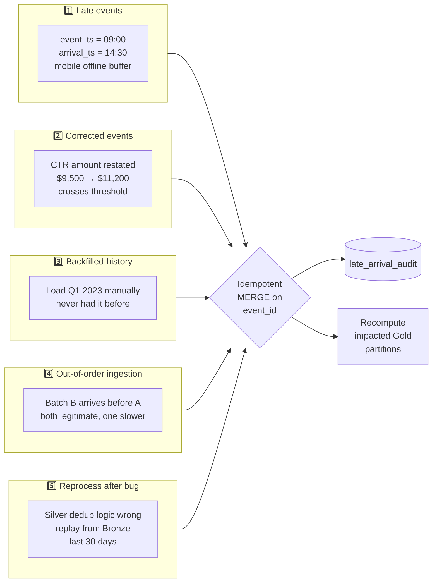

# ⏱️ Late-Arriving Data on Microsoft Fabric

<div align="center" markdown>

**Backfills, Corrections, Watermarks, and Idempotency Patterns for Out-of-Order Reality**


</div>

---

**Last Updated:** `2026-04-27` | **Version:** 1.0.0 | **Anchor:** [Master Data Management](master-data-management.md) (Wave 3)

---

## 🎯 Overview

Real-world data does not arrive in order. Mobile devices buffer events while offline. Source systems publish corrections days later. Bug fixes require replaying months of history. Bureaucratic processes restate "final" numbers as estimates and then again as audited values. **Late-arriving data is not an exception — it is the default condition of any non-trivial pipeline.**

A pipeline that handles only the happy path will, sooner or later, double-count revenue, miss a compliance event, or report numbers that disagree with the source system. The fix is not "engineer harder" — it is to design every layer of the medallion stack on the assumption that history is mutable, that events arrive out of order, and that every write must be **idempotent**.

### Why It Matters in Fabric

| Symptom Without Late-Arrival Discipline | Cause | Cost |
|----------------------------------------|-------|------|
| Power BI tile shows different revenue today vs. yesterday for the same closed period | Late events not absorbed into restated partition | Executive distrust |
| Slot machine offline for 4 hours produces a "ghost gap" then a flood | Events keyed by `arrival_ts`, not `event_ts` | Compliance under-reporting |
| CTR threshold missed because corrected transaction arrived next day | No correction re-aggregation | Regulatory exposure |
| Backfill double-counts because re-run is not idempotent | Append-only without dedup keys | Restatement, audit finding |
| Aug 2024 month-end "frozen" number changes silently in Q4 | Restated upstream, downstream never recomputed | Loss of trust, manual reconciliation |
| Bug-fix replay corrupts current state | No bronze-as-source-of-truth, no atomic rerun | Data loss, incident |

> 📝 **Scope:** This is a Wave 3 deep-dive. The MDM anchor lives at [master-data-management.md](master-data-management.md). Related: [SCD Patterns](scd-patterns.md), [Data Contracts](data-contracts.md), [Reference Data Versioning](reference-data-versioning.md).

---

## 🌀 The Five Late-Arrival Scenarios



### Scenario 1 — Late events (expected lateness)

**Definition:** `event_ts < arrival_ts` by a meaningful amount, but the lateness is *expected* given the source.

**Examples:**
- Slot machine in a casino tunnel loses connectivity for 90 minutes; events buffer locally and ship when reconnected.
- Field officer's tablet collects EPA inspection records offline in a remote facility, syncs that night.
- USDA crop survey enumerator submits paper form, keypunched 3 days later.

**Pattern:** Set a **late-arrival window** (e.g., 24 hours) within which late events are *normal* and absorbed silently. Beyond that window, route to a **late-quarantine** table for review.

### Scenario 2 — Corrected events (restatement)

**Definition:** A previously-published event is amended. The original `event_id` is the same; one or more attribute values change.

**Examples:**
- Casino compliance officer amends a CTR amount because the original entry omitted a chip color.
- NOAA upgrades a storm severity from EF-2 to EF-3 after on-the-ground survey.
- USDA replaces a *preliminary* crop estimate with a *revised* one, then a *final* one (three releases per record).

**Pattern:** Source provides `is_correction=true` and `corrects_event_id=<original>`. Idempotent MERGE replaces prior values. Audit log captures before/after.

### Scenario 3 — Backfilled history (loading old data we didn't have)

**Definition:** Data older than your normal pipeline horizon is loaded for the first time.

**Examples:**
- New tribal health system goes live; historical claims for the prior 5 years arrive in one batch.
- Acquired casino property delivers 3 years of slot accounting data after the deal closes.
- DOJ provides a historical case file dump after a FOIA agreement.

**Pattern:** Run pipeline with explicit `--backfill --start-date X --end-date Y` flags. MERGE ensures no double-counting if backfill overlaps current data. Never blindly trust that backfill data is "new."

### Scenario 4 — Out-of-order ingestion (arrival sequence ≠ event sequence)

**Definition:** Two batches A and B where A's events are *older* than B's events, but B arrives at the lakehouse first.

**Examples:**
- Eventstream partition lag — partition 5 has higher latency than partition 2 today.
- Multi-region source replication — east-region batch lands at 10:00, west-region (same period) at 10:08.
- Pipeline retry — failed batch reruns at 11:00 carrying 09:00 events; fresh batch at 10:30 already landed.

**Pattern:** Always key on `event_ts`, not `arrival_ts`, for downstream aggregation. Window aggregations must wait for the watermark before "closing" a window.

### Scenario 5 — Reprocessing after a bug

**Definition:** A defect is discovered in Silver or Gold logic. Bronze is fine. Replay from Bronze to fix the corruption.

**Examples:**
- Silver deduplication keyed on the wrong column for 11 days; downstream Gold under-counted.
- Gold YoY calculation used the wrong fiscal-year cutover, restated annual reports incorrect.
- Schema change in Silver dropped a column for one week; downstream features missing.

**Pattern:** Bronze is the **source of truth and never deleted**. Identify impacted Silver/Gold window, drop and rebuild that window from Bronze using the corrected logic. Communicate restatement to consumers.

---

## ⏰ Watermark Concepts

A **watermark** is a moving threshold: *"we don't expect to receive any more events older than time T."* Past T, the system commits aggregates and may close windows. Events that arrive after T are **late** and must take an alternative path.

### Three Times to Track

| Time | Definition | Where it lives |
|------|------------|----------------|
| **`event_ts`** | When the real-world event happened (slot pull, transaction, sensor reading) | Source-provided, in event payload |
| **`arrival_ts`** | When the event landed in our Bronze layer | Set by ingestion, immutable |
| **`processing_ts`** | When the event was processed by a Silver/Gold job | Set by the job, can change on rerun |

> **Rule:** Business KPIs aggregate by `event_ts`. Operational SLAs (latency, freshness) measure `arrival_ts - event_ts`. Pipeline replay tracking uses `processing_ts`.

### Watermark Trade-offs

```
   Tight watermark (e.g., 1 hour)
   ├─ ✅ Low latency — Gold visible quickly
   └─ ❌ More events drop into late-quarantine

   Loose watermark (e.g., 7 days)
   ├─ ✅ Few late drops — high completeness
   └─ ❌ High latency — closed-period reports wait days

   Right answer: tier the watermark
   ├─ Real-time dashboards: 1-hour watermark
   ├─ Daily close: 24-hour watermark
   ├─ Month-end financial: 7-day watermark
   └─ Regulatory filings: 30-day watermark
```

### Encoding Watermarks as Code

```python
# pipeline/watermarks.py
WATERMARKS = {
    "slot_telemetry_realtime":    {"hours": 1,   "alert_above": 0.005},   # 0.5% drop OK
    "slot_telemetry_daily_close": {"hours": 24,  "alert_above": 0.001},
    "compliance_ctr":             {"hours": 168, "alert_above": 0.0001},  # 7d, near-zero drop
    "monthly_financial_close":    {"hours": 720, "alert_above": 0.0},     # 30d, zero tolerance
}

def get_watermark(stream: str) -> dict:
    return WATERMARKS[stream]
```

Each watermark also records its **late-arrival quarantine policy** — what happens to events that arrive past T (drop / quarantine / restate downstream).

---

## 🔁 Idempotency Patterns

> **Every late-arrival pattern fails without idempotent writes.** A backfill that double-counts because someone re-ran it is not just embarrassing — it is a regulatory event for compliance data.

### Why Idempotency Is Non-Negotiable

| Without idempotency | With idempotency |
|---------------------|------------------|
| Re-running a job changes results | Re-running yields the same result |
| Backfill doubles existing rows | Backfill is a no-op for already-loaded events |
| Correction creates a duplicate of the original | Correction replaces the original |
| Crashed pipeline mid-batch leaves partial state | Restart resumes safely |

### The Three Pillars of Idempotency

1. **Natural keys (`event_id`, `source_system`, `source_record_id`)** that uniquely identify an event from the source's perspective.
2. **MERGE INTO ... WHEN MATCHED UPDATE** instead of INSERT.
3. **Deduplication windows** for sources without a strong natural key — window by `(business_key, event_ts)` and pick the most recent.

### Pattern A — MERGE on Natural Key (preferred)

```python
from delta.tables import DeltaTable

# Silver write — idempotent MERGE on (event_id, source_system)
target = DeltaTable.forName(spark, "lh_silver.silver_slot_events")

(target.alias("t")
    .merge(
        df_incoming.alias("s"),
        "t.event_id = s.event_id AND t.source_system = s.source_system"
    )
    .whenMatchedUpdate(
        condition="s.arrival_ts >= t.arrival_ts",  # only newer arrivals win
        set={
            "amount":          "s.amount",
            "machine_id":      "s.machine_id",
            "event_ts":        "s.event_ts",
            "arrival_ts":      "s.arrival_ts",
            "is_correction":   "s.is_correction",
            "corrects_event_id":"s.corrects_event_id",
            "processing_ts":   "current_timestamp()",
            "version":         "t.version + 1",
        }
    )
    .whenNotMatchedInsertAll()
    .execute())
```

The `s.arrival_ts >= t.arrival_ts` guard prevents a slow-arriving stale message from overwriting fresher data — critical when out-of-order ingestion races with corrections.

### Pattern B — Append + Dedup View (when MERGE is too expensive)

For very high-volume streams where MERGE write amplification is painful, append everything to Bronze and present a deduped view:

```python
from pyspark.sql.window import Window
from pyspark.sql.functions import row_number, col

# Bronze: append-only, accepts duplicates
df_incoming.write.mode("append").saveAsTable("lh_bronze.bronze_slot_events_raw")

# Silver: deduped view materialized periodically
w = Window.partitionBy("event_id", "source_system").orderBy(col("arrival_ts").desc())

df_dedup = (spark.table("lh_bronze.bronze_slot_events_raw")
    .withColumn("rn", row_number().over(w))
    .filter("rn = 1")
    .drop("rn"))

df_dedup.write.mode("overwrite").saveAsTable("lh_silver.silver_slot_events")
```

Trade-off: the dedup pass is more expensive than incremental MERGE, but write throughput on Bronze is maximized.

### Pattern C — Composite Surrogate Key for Source Without `event_id`

Some sources (older OLTP systems, federal CSV drops) don't expose a stable event identifier. Construct one:

```python
from pyspark.sql.functions import sha2, concat_ws, col

df_with_key = df_incoming.withColumn(
    "event_id",
    sha2(concat_ws("||",
        col("transaction_date").cast("string"),
        col("machine_id"),
        col("amount").cast("string"),
        col("sequence_within_day").cast("string"),
    ), 256)
)
```

Document the composite recipe in the source's [data contract](data-contracts.md) — if the source ever changes one of those fields, the synthetic ID changes and you'll create duplicates.

---

## 🥉 Bronze Patterns

Bronze is the **immutable, append-only, never-delete** record of what was received. Late-arrival handling at the Bronze layer is purely about *capturing arrival metadata* — no business logic.

### Schema Requirements

```python
# Every Bronze table must include:
bronze_required_columns = {
    "event_ts":       "timestamp",   # source-provided business time
    "arrival_ts":     "timestamp",   # set on ingestion, never modified
    "source_system":  "string",
    "source_file":    "string",      # which raw file/batch
    "ingestion_id":   "string",      # UUID per ingestion run
    "raw_payload":    "string",      # full original JSON/row for replay
}
```

### Partition by `arrival_date`, Not `event_date`

```python
# CORRECT — partition by arrival_date for fast incremental scan
(df_with_meta
    .withColumn("arrival_date", to_date("arrival_ts"))
    .write
    .mode("append")
    .partitionBy("arrival_date")
    .saveAsTable("lh_bronze.bronze_slot_events_raw"))
```

**Why:** Silver consumers ask "what arrived since I last ran?" — that's an `arrival_date` predicate. Late events don't shuffle old `event_date` partitions; they land cleanly in today's `arrival_date`.

### Never Delete from Bronze

> **Rule:** Bronze rows are *never* deleted, *never* updated, only appended. This is what makes scenario 5 (reprocess-after-bug) survivable.

Schema corrections happen via *new columns* (additive change), not by editing existing rows. PII compliance (GDPR right-to-erasure) is satisfied by **redaction overlays** (separate redaction table joined at Silver), never by deleting Bronze rows. See [outbound-access-protection.md](../outbound-access-protection.md) for the redaction pattern.

### Bronze Late-Arrival Metrics

```python
from pyspark.sql.functions import unix_timestamp, percentile_approx, col

(spark.table("lh_bronze.bronze_slot_events_raw")
    .filter(col("arrival_date") == current_date())
    .select((unix_timestamp("arrival_ts") - unix_timestamp("event_ts")).alias("lag_sec"))
    .agg(
        percentile_approx("lag_sec", 0.50).alias("p50_lag"),
        percentile_approx("lag_sec", 0.95).alias("p95_lag"),
        percentile_approx("lag_sec", 0.99).alias("p99_lag"),
    )).show()
```

Plot p50/p95/p99 lag daily. A spike in p99 with stable p50 = isolated late-batch event. A spike in p50 = source-system regression. See [Detecting Late Data](#-detecting-late-data).

---

## 🥈 Silver Patterns

Silver applies **watermark logic, deduplication, and quarantine routing**. This is where late-arrival decisions are encoded.

### Watermark-Based Processing

```python
from datetime import datetime, timedelta
from pyspark.sql.functions import col, current_timestamp, expr

WATERMARK_HOURS = 24
watermark_ts = expr(f"current_timestamp() - INTERVAL {WATERMARK_HOURS} HOURS")

# Read incremental Bronze since last run
last_run_ts = get_last_silver_run_ts("silver_slot_events")  # from Delta history or audit table

incoming = (spark.table("lh_bronze.bronze_slot_events_raw")
    .filter(col("arrival_ts") > last_run_ts))

# Split: on-time vs. beyond-watermark late
on_time   = incoming.filter(col("event_ts") >= watermark_ts)
late_data = incoming.filter(col("event_ts") <  watermark_ts)
```

### Idempotent MERGE for On-Time

```python
from delta.tables import DeltaTable

target = DeltaTable.forName(spark, "lh_silver.silver_slot_events")

(target.alias("t")
    .merge(on_time.alias("s"),
           "t.event_id = s.event_id AND t.source_system = s.source_system")
    .whenMatchedUpdate(
        condition="s.arrival_ts > t.arrival_ts",
        set={c: f"s.{c}" for c in ON_TIME_COLUMNS} | {
            "processing_ts": "current_timestamp()",
            "version":       "t.version + 1",
        })
    .whenNotMatchedInsertAll()
    .execute())
```

### Late-Arrival Quarantine Table

```python
# Late events go to a dedicated table for review, then merged in deliberately
(late_data
    .withColumn("quarantine_reason", lit("beyond_watermark"))
    .withColumn("quarantine_ts",     current_timestamp())
    .write.mode("append")
    .saveAsTable("lh_silver.dlq_late"))
```

A **steward review job** (daily) inspects `lh_silver.dlq_late`:
- If acceptable → MERGE into `silver_slot_events` and trigger Gold restatement.
- If suspect → mark `is_rejected=true`, attach rationale, alert source-system owner.
- If duplicate of already-merged → mark `is_duplicate=true`, no further action.

### SCD2 When Attributes Change

If a late event carries a *changed* attribute that's tracked historically (e.g., player tier on the day of event), use SCD2 patterns. See [scd-patterns.md](scd-patterns.md) for the full pattern; the abridged version:

```python
# Close prior open record, insert new one
target.alias("t").merge(
    new_version.alias("s"),
    "t.business_key = s.business_key AND t.is_current = true"
).whenMatchedUpdate(
    condition="t.tier <> s.tier OR t.address_zip <> s.address_zip",
    set={"effective_to": "s.event_ts", "is_current": "false"}
).execute()

new_version.write.mode("append").saveAsTable("lh_silver.silver_player_scd2")
```

---

## 🥇 Gold Patterns

Gold KPIs are aggregations across `event_ts` partitions. When late-arriving events change a *closed* period, Gold must **detect** the restatement, **recompute** affected partitions, and **log** the change.

### Restated-Period Detection

```python
from pyspark.sql.functions import col, to_date, max as max_, current_date

# Find Silver event_dates where rows were updated/inserted since last Gold run
last_gold_run = get_last_gold_run_ts("gold_daily_revenue")

restated = (spark.table("lh_silver.silver_slot_events")
    .filter(col("processing_ts") > last_gold_run)
    .select(to_date("event_ts").alias("event_date"))
    .distinct())

restated_list = [r.event_date for r in restated.collect()]
print(f"Restating Gold partitions: {restated_list}")
```

### Recompute Only Impacted Partitions

```python
from pyspark.sql.functions import sum as sum_, count, lit, current_timestamp

# Recompute Gold for impacted dates only — never full rebuild
for d in restated_list:
    df_d = (spark.table("lh_silver.silver_slot_events")
        .filter(to_date("event_ts") == d)
        .groupBy("event_date", "machine_id", "casino_floor")
        .agg(
            sum_("amount").alias("revenue"),
            count("event_id").alias("transactions"),
        )
        .withColumn("restated_on", current_timestamp())
        .withColumn("restatement_reason", lit("late_arrival_or_correction")))

    # Replace partition atomically
    (df_d.write.mode("overwrite")
        .option("replaceWhere", f"event_date = '{d}'")
        .saveAsTable("lh_gold.gold_daily_revenue"))
```

### Restated Audit Marker

Add a `restated_on` column to every Gold aggregate so downstream Power BI users can see *"this number changed today."*

```sql
ALTER TABLE lh_gold.gold_daily_revenue
ADD COLUMNS (
    restated_on         TIMESTAMP COMMENT 'NULL = original; non-NULL = restated',
    restatement_reason  STRING    COMMENT 'late_arrival | correction | bug_replay | manual'
);
```

A Power BI tile *"Periods restated this week"* gives finance and compliance teams immediate visibility — and prevents the *"why did Aug change?"* phone call.

### Cascading Restatement to Downstream Models

```python
# When a daily partition is restated, downstream weekly/monthly/YTD must follow
def cascade_restatement(impacted_dates: list[str]):
    weeks  = {iso_week(d)  for d in impacted_dates}
    months = {month_key(d) for d in impacted_dates}
    fy_qs  = {fy_quarter(d) for d in impacted_dates}

    for w in weeks:  recompute_weekly_revenue(w)
    for m in months: recompute_monthly_revenue(m)
    for q in fy_qs:  recompute_quarterly_revenue(q)

    # Notify semantic model to refresh impacted partitions
    refresh_powerbi_partitions(weeks=weeks, months=months, quarters=fy_qs)
```

---

## 🌊 Streaming with Watermarks

Spark Structured Streaming has first-class watermark support. Use it for Eventstream/Eventhouse-fed Silver tables.

### `withWatermark` Pattern

```python
from pyspark.sql.functions import window, col

stream = (spark.readStream
    .format("delta")
    .table("lh_bronze.bronze_slot_events_raw"))

# 24-hour late-arrival tolerance
windowed = (stream
    .withWatermark("event_ts", "24 hours")
    .groupBy(
        window(col("event_ts"), "1 minute"),
        col("machine_id"))
    .agg(
        sum_("amount").alias("revenue_per_min"),
        count("event_id").alias("plays_per_min")))

(windowed.writeStream
    .format("delta")
    .outputMode("append")  # only emits when watermark passes window end
    .option("checkpointLocation", "abfss://onelake/.../checkpoints/slot_perf_1min")
    .toTable("lh_silver.silver_slot_perf_1min"))
```

### State Store Sizing

State store = (cardinality of grouping keys) × (number of open windows = watermark / window). For 50K machines × 1-minute windows × 24-hour watermark = 72M state entries. Plan capacity accordingly:

| Watermark | Windows kept open | State size factor |
|-----------|-------------------|-------------------|
| 1 hour    | 60 (per machine)  | 1×                |
| 24 hours  | 1,440             | 24×               |
| 7 days    | 10,080            | 168×              |

If state grows uncontrollably, *tighten the watermark* and rely on the Silver quarantine table for events older than the watermark.

### Recovery from Checkpoint

Streaming jobs persist state and offsets to the checkpoint. After a crash or upgrade:
- Restart with the **same checkpoint path** — Spark reads offsets and replays from where it left off.
- **Never delete the checkpoint** unless you also intend to drop and rebuild the target table; otherwise you'll get duplicate windows.
- For schema evolution, drain the stream, deploy the new code, restart with the existing checkpoint.

See [observability runbook](../monitoring-observability.md) for streaming-lag SLO patterns.

---

## 🔄 Backfill Procedure

A backfill is a deliberate, parameterized re-execution of the pipeline over a historical window. **Never** run a backfill by manually pointing the pipeline at old data — always parameterize.

### Step-by-Step

1. **Identify scope.**
   - Date range (`--start-date 2024-01-01 --end-date 2024-03-31`).
   - Entity scope (all machines / specific casino property / specific federal program).
   - Reason (new source onboarding, source provided historical dump, regulatory request).
2. **Validate source data.**
   - Row count matches source-provided manifest.
   - Schema compatible with Bronze.
   - PII handling correct for the era (older data may have different masking rules — see [reference-data-versioning.md](reference-data-versioning.md)).
3. **Pre-flight Bronze check.**
   - How many target events already exist for the window? If non-zero, MERGE behavior is the deciding factor — confirm idempotency.
4. **Run the pipeline with backfill flag.**
   ```bash
   python pipeline/run.py \
       --mode backfill \
       --start-date 2024-01-01 \
       --end-date 2024-03-31 \
       --source slot_telemetry \
       --idempotent-merge true \
       --recompute-gold true \
       --runner-id $USER \
       --reason "Historical dump from acquired property"
   ```
5. **Verify in Silver.**
   - Row counts match expected (source rows minus duplicates).
   - No spike in `dlq_late` beyond expected.
6. **Recompute affected Gold partitions.**
   - Use the [restated-period detection](#restated-period-detection) flow above.
7. **Notify consumers.**
   - Post to `#data-restatements` Teams channel with: window, reason, rows added, KPI deltas if material.
   - Update [data product card](data-product-framework.md) `last_restated_at`.
8. **Log in audit table.** (see [Auditability](#-auditability))

### Idempotency Guarantees Backfill Safety

```python
# Re-running this command is a no-op if data already exists
python pipeline/run.py --mode backfill --start-date 2024-01-01 --end-date 2024-03-31 --source slot_telemetry
# Re-run again — safe, MERGE matches existing event_id and updates only if arrival_ts is newer
python pipeline/run.py --mode backfill --start-date 2024-01-01 --end-date 2024-03-31 --source slot_telemetry
```

This property is what makes backfill operations **safe to retry** after partial failures.

---

## ✏️ Correction Procedure

Corrections are different from backfills: the data was already loaded, but a value changed.

### Source-Side Contract

The source must publish corrections with two flags:

```json
{
  "event_id": "ctr-2024-08-15-00042",
  "is_correction": true,
  "corrects_event_id": "ctr-2024-08-15-00042",
  "amount": 11200.00,
  "corrected_field": "amount",
  "correction_reason": "chip-color omission",
  "corrected_by": "compliance-officer-J.Doe",
  "event_ts": "2024-08-15T14:23:00Z",
  "arrival_ts": "2024-08-19T09:00:00Z"
}
```

> **Convention:** when `corrects_event_id == event_id`, the correction *updates in place*. When they differ, the correction *replaces* a previous (now-superseded) `event_id` — used for sources that can't preserve the original ID.

### Silver MERGE Replaces

```python
target.alias("t").merge(
    correction.alias("s"),
    "t.event_id = s.corrects_event_id AND t.source_system = s.source_system"
).whenMatchedUpdate(
    set={
        "amount":              "s.amount",
        "corrected_field":     "s.corrected_field",
        "correction_reason":   "s.correction_reason",
        "is_correction_applied":"true",
        "corrected_by":        "s.corrected_by",
        "processing_ts":       "current_timestamp()",
        "version":             "t.version + 1",
    }
).execute()
```

### Audit Capture (Mandatory)

```python
# Capture before/after for every correction — required for compliance
audit = correction.alias("s").join(
    target.toDF().alias("t"),
    "s.corrects_event_id = t.event_id"
).select(
    col("s.corrects_event_id").alias("event_id"),
    col("t.amount").alias("original_value"),
    col("s.amount").alias("new_value"),
    lit("correction").alias("reason"),
    col("s.corrected_by").alias("actor"),
    current_timestamp().alias("audit_ts"),
)
audit.write.mode("append").saveAsTable("lh_audit.late_arrival_audit")
```

### Recompute Affected Aggregates

A corrected CTR amount may now cross the $10,000 threshold, triggering a regulatory filing requirement. Cascade:

```python
# 1. Recompute Gold daily for event_ts.date
recompute_gold_daily(date=correction_event_date)

# 2. Re-evaluate compliance rules for the corrected event
trigger_compliance_reassessment(event_id=correction.event_id)

# 3. If a CTR was missed, file 30-day amendment
if compliance_threshold_now_crossed(correction):
    open_compliance_ticket(severity="high", event_id=correction.event_id)
```

---

## 🐛 Reprocessing After Bug Discovery

Bug-induced reprocessing differs from corrections: the *source data was correct all along* — our Silver/Gold logic mishandled it. **Bronze is untouched.**

### Step-by-Step

1. **Diagnose.**
   - Identify the bug (wrong dedup key, wrong fiscal calendar, bad join).
   - Determine *when the bug was introduced* (commit hash, deployment date).
   - Determine *what window is impacted* (e.g., last 11 days of Silver).
2. **Verify Bronze is intact.**
   ```python
   bronze_count = spark.table("lh_bronze.bronze_slot_events_raw") \
       .filter("arrival_date BETWEEN '2024-08-01' AND '2024-08-11'").count()
   # Must match source-side delivery manifests
   ```
3. **Deploy fixed code.**
   - Hotfix branch, full review, merged, deployed via [fabric-cicd](../fabric-cicd-deployment.md).
4. **Drop or `replaceWhere` the impacted Silver/Gold window.**
   ```python
   # Drop impacted Silver partitions atomically
   spark.sql("""
       DELETE FROM lh_silver.silver_slot_events
       WHERE arrival_date BETWEEN '2024-08-01' AND '2024-08-11'
   """)
   ```
5. **Replay Silver from Bronze for the window.**
   ```bash
   python pipeline/run.py --mode replay \
       --layer silver --source slot_telemetry \
       --start-date 2024-08-01 --end-date 2024-08-11 \
       --runner-id $USER --reason "ENG-4421: dedup key fix"
   ```
6. **Replay Gold from corrected Silver.**
   ```bash
   python pipeline/run.py --mode replay \
       --layer gold --table gold_daily_revenue \
       --start-date 2024-08-01 --end-date 2024-08-11
   ```
7. **Communicate.**
   - Incident notice to consumers.
   - Updated KPIs.
   - Postmortem within 5 business days.

> **Why Bronze-as-source-of-truth matters:** Steps 4-6 are only safe because Bronze was never touched. If you'd been editing Bronze in place, the bug would have *also* corrupted your replay source, and recovery would require a backup restore.

See the [data-quality-incident runbook](../../runbooks/index.md) for the incident-response wrapper around this procedure.

---

## 📜 Auditability

Every late-arrival action — backfill, correction, replay — is logged to a single immutable audit table. Compliance, finance, and engineering all read from this same table.

### `late_arrival_audit` Schema

```sql
CREATE TABLE lh_audit.late_arrival_audit (
    audit_id           BIGINT GENERATED ALWAYS AS IDENTITY,
    event_id           STRING NOT NULL,
    source_system      STRING NOT NULL,
    action_type        STRING NOT NULL,  -- 'late_merge' | 'correction' | 'backfill' | 'replay'
    original_value     STRING,            -- JSON snapshot of prior row
    new_value          STRING,            -- JSON snapshot of new row
    field_changed      STRING,            -- which field, when single-field correction
    reason             STRING NOT NULL,
    actor              STRING NOT NULL,   -- user / service principal that triggered
    runner_id          STRING,            -- pipeline run / Spark job ID
    event_ts           TIMESTAMP,         -- business event time
    arrival_ts         TIMESTAMP,
    audit_ts           TIMESTAMP NOT NULL DEFAULT current_timestamp(),
    impacted_kpis      ARRAY<STRING>,     -- e.g., ['gold_daily_revenue', 'gold_ctr_count']
    notification_sent  BOOLEAN
) USING DELTA
PARTITIONED BY (DATE(audit_ts));
```

> **Retention:** match the longest compliance window of any data source flowing through the pipeline. For casino + federal: **7 years minimum**, often forever (regulatory holds).

### Audit Read Patterns

```sql
-- "What changed in this Gold partition since it was first published?"
SELECT * FROM lh_audit.late_arrival_audit
WHERE DATE(event_ts) = '2024-08-15'
ORDER BY audit_ts;

-- "Who corrected this CTR?"
SELECT actor, reason, audit_ts
FROM lh_audit.late_arrival_audit
WHERE event_id = 'ctr-2024-08-15-00042'
  AND action_type = 'correction';

-- "Has anyone backfilled this date in the past 90 days?"
SELECT COUNT(*) FROM lh_audit.late_arrival_audit
WHERE action_type = 'backfill'
  AND DATE(event_ts) = '2024-08-15'
  AND audit_ts > current_date() - INTERVAL 90 DAYS;
```

---

## 🔍 Detecting Late Data

You cannot manage what you don't measure. Three metrics that matter:

| Metric | Formula | Alert threshold |
|--------|---------|-----------------|
| **Late ratio** | `count(events past watermark) / count(all events)` | > 1% sustained for 1 hour |
| **p99 ingestion lag** | `percentile(arrival_ts - event_ts, 0.99)` per source | > 2× rolling 7-day baseline |
| **Restatement frequency** | Count of Gold partitions with non-NULL `restated_on` per week | > rolling 4-week mean + 2σ |

### KQL Queries (Eventhouse-side)

```kql
// Late ratio per source, last hour
BronzeSlotEvents
| where arrival_ts > ago(1h)
| extend lag_sec = datetime_diff('second', arrival_ts, event_ts)
| extend is_late = lag_sec > 86400  // 24-hour watermark
| summarize
    total = count(),
    late  = countif(is_late),
    late_ratio = round(100.0 * countif(is_late) / count(), 3)
  by source_system
| where late_ratio > 1.0
```

```kql
// Lag distribution by source, last 24h
BronzeSlotEvents
| where arrival_ts > ago(24h)
| extend lag_sec = datetime_diff('second', arrival_ts, event_ts)
| summarize
    p50 = percentile(lag_sec, 50),
    p95 = percentile(lag_sec, 95),
    p99 = percentile(lag_sec, 99)
  by source_system, bin(arrival_ts, 1h)
| render timechart
```

### Alert Wiring

Plug these queries into Data Activator. A spike in `late_ratio` is almost always a **source-system issue, not a Fabric issue** — the alert should page the source-system owner first, the Fabric team second. See [alerting-data-activator.md](../alerting-data-activator.md).

---

## 🎰 Casino Implementation

### Slot Telemetry Late Events

- **Cause:** Machines lose connectivity (tunnels, network maintenance, slot floor power events).
- **Pattern:** 24-hour watermark on `silver_slot_events`. Events past 24h → `dlq_late` for steward review (most are legit but need to confirm not a duplicate-replay from a misbehaving onboard buffer).
- **Compliance impact:** Daily slot performance reports cite `restated_on` if any partition was changed by absorbed late events.

### Compliance Corrections (CTR/SAR Amendments)

- **Cause:** Compliance officer reviews a transaction, finds it was misclassified or under-reported (chip-color omission, structuring detection ex-post).
- **Pattern:** Source pushes correction with `is_correction=true`. Silver MERGE updates in place. Audit row captures officer's name, reason, before/after.
- **Cascading rule check:** A corrected amount that now crosses $10K (CTR) or matches structuring patterns ($8K-$9.9K series) **automatically** opens a compliance ticket — see [casino-floor-monitoring](../../use-cases/index.md) for the rule engine.

### W-2G End-of-Year True-Ups

- **Cause:** Annual reconciliation against IRS Form W-2G thresholds ($1,200 slots, $600 keno, $5,000 poker) often requires aggregating sub-threshold events that, summed, cross thresholds.
- **Pattern:** January batch job recomputes prior-year Gold aggregates with corrections absorbed. Restated `gold_w2g_annual` partition for prior tax year. Treasury report regenerated and re-filed via amendment.

---

## 🏛️ Federal Implementation

### USDA Crop Reports

- **Pattern:** USDA publishes preliminary, revised, and final crop estimates over a 90-day window per record.
- **Schema:** `release_type` ∈ `{preliminary, revised, final}`; `release_sequence` ∈ `{1, 2, 3}`.
- **Idempotency:** MERGE on `(report_id, commodity, region)`; `release_sequence` is a tie-breaker (higher wins).
- **Audit:** Every transition (prelim → revised → final) writes a `late_arrival_audit` row.

### NOAA Storm Severity

- **Pattern:** Initial storm reports (radar-based) corrected days later by ground survey. EF-2 → EF-3 upgrades are common.
- **Schema:** `is_correction=true`, `corrects_event_id=<original>`.
- **Cascading:** A severity upgrade may trigger SBA disaster loan eligibility cascades — see SBA section below for the cross-agency join.

### SBA Loan Default Backfills

- **Pattern:** Servicer reports defaults monthly with a 60-day reporting lag. Historical defaults occasionally backfilled when servicers reconcile portfolios.
- **Watermark:** 90 days. Beyond 90 → quarantine + manual review (likely a portfolio acquisition).
- **Audit:** Backfills tied to a portfolio-acquisition memo for FOIA traceability.

---

## 🚫 Anti-Patterns

| Anti-Pattern | Why It Hurts | What to Do Instead |
|--------------|--------------|--------------------|
| **Aggregate by `arrival_ts`** | KPIs lurch when ingestion lag spikes; closed periods stay open forever | Always aggregate by `event_ts`; track `arrival_ts` separately |
| **Edit Bronze in place to "fix" data** | Destroys source-of-truth; replay-after-bug becomes impossible | Bronze is append-only forever; corrections at Silver |
| **No `event_id` (rely on row hash)** | Schema drift breaks the hash; duplicates everywhere | Require `event_id` in [data contracts](data-contracts.md); composite synthetic key only as fallback |
| **Single watermark for the whole platform** | Real-time dashboards block on month-end's 30-day window | Tier watermarks by use case |
| **Append everything; dedup "later"** | "Later" never comes; storage explodes; queries return duplicates | MERGE on natural key, or scheduled dedup pass with SLO |
| **Recompute all of Gold on every late event** | Capacity meltdown; users see flicker | Scoped recompute via `replaceWhere` on impacted partitions only |
| **No audit trail for corrections** | Compliance can't reconstruct what changed when | Mandatory `late_arrival_audit` write per correction |
| **Manual "click rerun" backfills** | Not idempotent if humans skip flags; no record of what ran | Parameterized backfill CLI with `--reason` and audit-write |
| **Drop the streaming checkpoint to "start fresh"** | Re-emits old windows as new; double-counts | Coordinate checkpoint reset with target table truncation |
| **Treat late data as "errors" and reject** | Loss of legitimate events; biased analytics; under-reporting | Quarantine and steward-review; reject only after evidence |

---

## 📋 Implementation Checklist

Before declaring a pipeline "production" with respect to late-arrival handling:

- [ ] Every Bronze table has `event_ts`, `arrival_ts`, `source_system`, `ingestion_id`, partitioned by `arrival_date`
- [ ] `event_id` (or documented composite synthetic key) defined per source in its data contract
- [ ] Watermark policy documented per stream (real-time / daily / monthly / regulatory tiers)
- [ ] All Silver writes use idempotent MERGE on natural key
- [ ] `silver.dlq_late` quarantine table exists with steward-review SLO
- [ ] Gold tables include `restated_on` and `restatement_reason` columns
- [ ] Restated-period detection job runs after every Silver update
- [ ] Cascading restatement to weekly/monthly/quarterly aggregates implemented
- [ ] Streaming jobs use `withWatermark`; state-store size baselined and monitored
- [ ] Backfill CLI parameterized with `--start-date`, `--end-date`, `--reason`, `--runner-id`
- [ ] Correction protocol (`is_correction`, `corrects_event_id`) documented in source data contracts
- [ ] `late_arrival_audit` table populated on every correction / backfill / replay
- [ ] Late-data metrics (late ratio, p99 lag, restatement frequency) on observability dashboard
- [ ] Data Activator alerts on late-ratio spikes, routed to source-system owner first
- [ ] Bug-replay runbook tested via game-day exercise at least once
- [ ] Bronze retention covers longest compliance window (7+ years for casino/federal)
- [ ] PII redaction overlay (not Bronze deletion) used for GDPR right-to-erasure
- [ ] Power BI tile published: "Periods restated this week"
- [ ] Compliance officer sign-off on correction & restatement procedures (financial / regulatory data)

---

## 📚 References

### Microsoft Fabric Documentation
- [Delta Lake MERGE](https://learn.microsoft.com/azure/databricks/delta/merge)
- [Structured Streaming Watermarks](https://learn.microsoft.com/azure/databricks/structured-streaming/watermarks)
- [Eventstream Late Arrival Tolerance](https://learn.microsoft.com/fabric/real-time-intelligence/event-streams/overview)
- [Direct Lake Refresh](https://learn.microsoft.com/fabric/data-warehouse/direct-lake-overview)

### Industry Patterns
- Tyler Akidau, *"Streaming Systems"* (O'Reilly) — the canonical text on event-time vs. processing-time
- Apache Beam *"Dataflow Model"* paper — origin of the modern watermark pattern
- Databricks *"Delta Lake: Lakehouse Format"* paper — MERGE + ACID semantics

### Related Wave 3 Docs
- [Master Data Management](master-data-management.md) (Wave 3 anchor)
- [Data Contracts](data-contracts.md) — codify `event_id`, `is_correction`, watermark expectations between teams
- [Data Product Framework](data-product-framework.md) — `last_restated_at` SLO surface
- [Reference Data Versioning](reference-data-versioning.md) — handle dimension changes that interact with restatement
- [SCD Patterns](scd-patterns.md) — historized attributes affected by late events
- [Business Glossary Automation](business-glossary-automation.md)

### Related Existing Docs
- [Incremental Refresh & CDC Patterns](../incremental-refresh-cdc.md)
- [Medallion Architecture Deep Dive](../medallion-architecture-deep-dive.md)
- [Monitoring & Observability](../monitoring-observability.md)
- [Alerting & Data Activator](../alerting-data-activator.md)
- [fabric-cicd Deployment](../fabric-cicd-deployment.md)
- [Outbound Access Protection](../outbound-access-protection.md)

### Related Wave 1 + Wave 2 Docs
- [Operational Runbooks](../../runbooks/index.md) — incident-response wrapper for replay-after-bug
- [Feature Store on OneLake](../feature-store-onelake.md) — feature freshness & late-data handling for ML
- [Responsible AI Framework](../responsible-ai-framework.md) — restatement effects on training data integrity

---

[⬆️ Back to Top](#-late-arriving-data-on-microsoft-fabric) | [📚 Data Management Index](.) | [🏠 Home](../../index.md)
