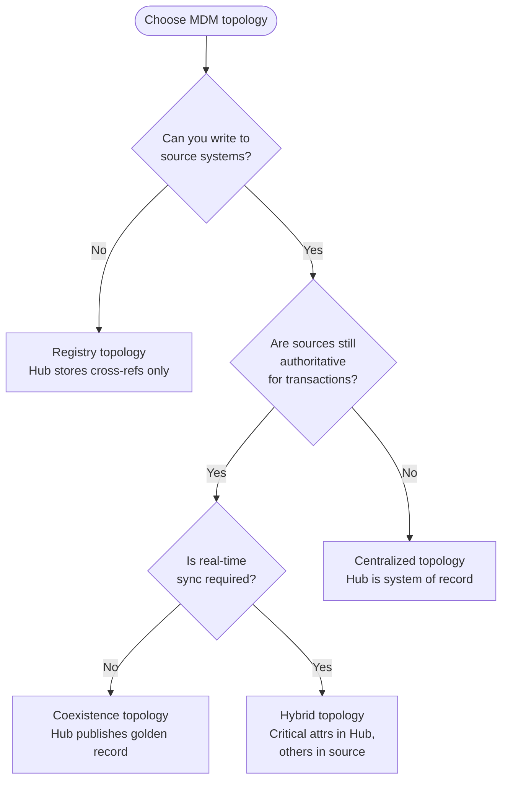
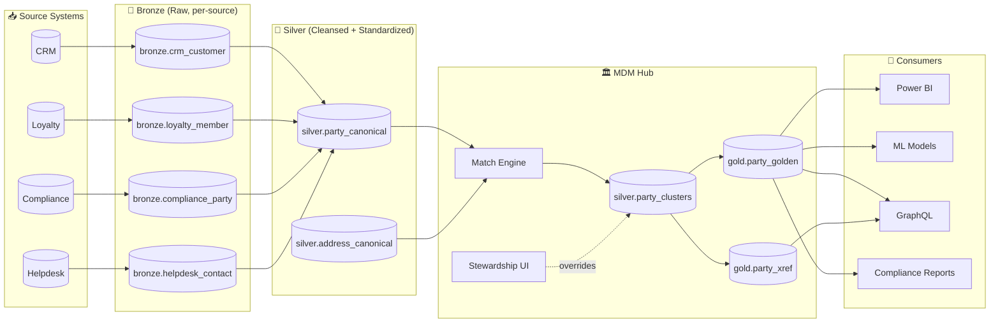
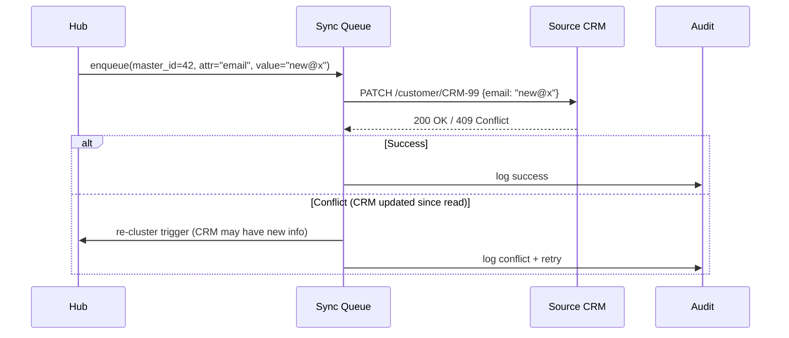

# 🏛️ Master Data Management on Microsoft Fabric

<div align="center" markdown>

**Golden-Record Patterns for Customer, Product, Provider, and Entity Mastering — Anchor Doc for Wave 3**


</div>

---

**Last Updated:** `2026-04-27` | **Version:** 1.0.0 | **Anchor for:** Wave 3 Data Management doc set

---

## 🎯 Overview

**Master Data Management (MDM)** is the discipline of producing a single, trusted view of business entities — customer, product, employee, provider, asset, location — when those entities arrive from multiple source systems with different keys, different schemas, and overlapping attributes. Without MDM, every consuming team rebuilds the join logic, the deduplication, and the survivorship rules; downstream KPIs disagree because each report defines "customer" differently.

### Why MDM Matters in Fabric

| Symptom Without MDM | Cause | Cost |
|--------------------|-------|------|
| Two dashboards report different customer counts | Each computes "distinct" against a different source | Executive distrust of analytics |
| Marketing campaign hits same person 3 times | No cross-source dedupe | Customer experience, regulatory exposure |
| Compliance report misses a flagged entity | Watch-list match against partial record | SAR/CTR/AML failures |
| Data scientist's churn model is biased | Training on un-mastered records under-represents power users with multiple accounts | Model invalidity |
| Audit can't trace why a customer's status flipped | No survivorship lineage | Regulatory finding |

> 📝 **Scope:** This is the anchor doc for Phase 14 Wave 3. Sub-topics get their own deep-dive docs: [data contracts](data-contracts.md), [data product framework](data-product-framework.md), [reference data versioning](reference-data-versioning.md), [late-arriving data](late-arriving-data.md), [SCD patterns](scd-patterns.md), [business glossary automation](business-glossary-automation.md).

---

## 🏗️ MDM Topology Choices

There is no universal MDM topology — choose based on read/write pattern, source system control, and latency tolerance.

| Topology | Source-of-truth | Reads against | Writes flow | Latency | When to use |
|----------|-----------------|---------------|-------------|---------|-------------|
| **Registry** | Source systems | Cross-reference index | Sources only | Low | Sources are authoritative; you can't write back; just need lookup |
| **Coexistence** | Sources + Hub | Either | Source → Hub (one-way) | Minutes | Sources are authoritative; Hub provides golden view |
| **Centralized (Hub)** | Hub | Hub | Hub → Sources (push) | Real-time | Greenfield; Hub is the system of record |
| **Hybrid** | Mixed by attribute | Hub for "trusted"; sources for "raw" | Bidirectional | Variable | Real enterprises with legacy + modern sources |

### Topology Decision Tree



> **Most Fabric implementations land on Coexistence or Hybrid** because legacy sources are rarely retired and Fabric is naturally a "hub" for analytics, not transactional MDM.

---

## 🧩 Reference Architecture on Fabric



### Component Responsibilities

| Component | Fabric Item | Purpose |
|-----------|-------------|---------|
| Source ingestion | Bronze lakehouses (per source) | Raw landing, append-only |
| Standardization | Silver Notebook + Delta tables | Canonical schema, address parsing, name normalization |
| Match engine | Notebook (Spark) or Spark Job Definition | Pairwise comparison, clustering |
| Cluster store | Delta table (`silver.party_clusters`) | Each row = (record_id, cluster_id, confidence, version) |
| Golden record | Delta table (`gold.party_golden`) | Survivorship-applied master record |
| Cross-reference | Delta table (`gold.party_xref`) | Source records → cluster_id → master_id |
| Stewardship | Translytical Task Flow + Power Apps | Override clusters, merge/split, audit log |
| Distribution | Mirroring / GraphQL / Direct Lake | Push golden record back to sources or expose to consumers |

---

## 🔍 Match Strategies

### Three Match Tiers

```
   Deterministic ─────▶ Probabilistic ─────▶ ML-based
   (exact rules)        (weighted features)   (learned)
        ▲                       ▲                  ▲
        │                       │                  │
   "same SSN"             "name + phone           "embedding
    "same email"          + DOB similarity"        similarity"
```

| Tier | Method | Pros | Cons | When to use |
|------|--------|------|------|-------------|
| **Deterministic** | Exact match on chosen keys | Fast, explainable | Misses anything imperfect | Always run first as a fast lane |
| **Probabilistic** | Fellegi-Sunter / weighted feature similarity | Handles typos, missing values | Tuning required, ~80-95% accuracy | Most enterprise needs |
| **ML-based** | Learned embeddings + cosine similarity | Captures semantic similarity ("Bob" = "Robert") | Training data, drift management | Large-scale, complex matching |

### Deterministic First (PySpark)

```python
# Fast lane: exact match on normalized keys
exact_matches = (df_silver
    .withColumn("ssn_norm", regexp_replace("ssn", "[^0-9]", ""))
    .withColumn("email_norm", lower(trim("email")))
    .withColumn("phone_norm", regexp_replace("phone", "[^0-9]", ""))
    .filter("ssn_norm IS NOT NULL OR email_norm IS NOT NULL")
)

deterministic_pairs = (exact_matches.alias("a")
    .join(exact_matches.alias("b"),
          (col("a.ssn_norm") == col("b.ssn_norm")) |
          (col("a.email_norm") == col("b.email_norm")),
          "inner")
    .filter("a.record_id < b.record_id")
    .select("a.record_id", "b.record_id", lit(1.0).alias("match_score"))
)
```

### Probabilistic Match (PySpark + similarity scoring)

```python
from pyspark.sql.functions import udf
from rapidfuzz import fuzz  # available via library mgmt

@udf("double")
def jw_similarity(a: str, b: str) -> float:
    if a is None or b is None:
        return 0.0
    return fuzz.WRatio(a, b) / 100.0

# Block on first 3 letters of last name + DOB year to avoid n^2 blowup
candidate_pairs = (df.alias("a")
    .join(df.alias("b"),
          (substring("a.last_name", 1, 3) == substring("b.last_name", 1, 3)) &
          (year("a.dob") == year("b.dob")) &
          (col("a.record_id") < col("b.record_id")),
          "inner"))

scored = candidate_pairs.withColumn("score",
    0.4 * jw_similarity("a.first_name", "b.first_name") +
    0.4 * jw_similarity("a.last_name", "b.last_name") +
    0.2 * jw_similarity("a.address_line1", "b.address_line1")
)

high_confidence = scored.filter("score >= 0.92")  # auto-merge threshold
review_queue = scored.filter("score >= 0.78 AND score < 0.92")  # steward review
```

### Blocking — The Key to Scale

Naive pairwise comparison is O(n²). For 50M records, that's 2.5 quadrillion comparisons — never going to happen. Use **blocking**:

| Blocking Strategy | When | Recall |
|-------------------|------|--------|
| First 3 chars of last name | Most names | High |
| Soundex / Metaphone | English-language names | Medium |
| First 5 chars of normalized address | Address-driven | High |
| ZIP3 + DOB year | Geographically distributed | Medium |
| Multiple block-passes (union) | Maximize recall | Highest, but compute-heavy |

Cap each block size to avoid pathological blocks (e.g., "Smith" block could have 5M records — sample or sub-block further).

---

## 🔀 Merge & Survivorship Rules

When the match engine clusters records, **survivorship** decides what the golden record looks like.

### Survivorship Rule Types

| Rule | Definition | Example |
|------|-----------|---------|
| **Most-recent-wins** | Latest source `last_updated` wins | `email` from CRM updated yesterday beats Loyalty's stale value |
| **Source priority** | Pre-ranked sources; highest priority wins | Compliance system always wins for `tax_id` |
| **Most-complete-wins** | Non-null wins over null | If CRM has phone and Loyalty doesn't, take CRM's |
| **Longest-string-wins** | Verbose value wins (often more correct) | Address `"100 Main St Apt 4B"` beats `"100 Main St"` |
| **Most-frequent-wins** | Mode across cluster | If 4 of 5 sources say "Female", that wins |
| **Manual override** | Steward decision recorded in audit | Always wins; immutable until next override |

### Encoding Survivorship as Code

```python
SURVIVORSHIP_RULES = {
    "first_name": "most_complete",
    "last_name": "most_complete",
    "email": "most_recent",
    "phone": "source_priority",  # CRM > Helpdesk > Loyalty
    "tax_id": "source_priority",  # Compliance > everyone
    "address_line1": "longest_string",
    "gender": "most_frequent",
    "dob": "source_priority",  # Compliance > CRM
    "preferred_language": "most_recent",
}

SOURCE_PRIORITY = {
    "phone": ["crm", "helpdesk", "loyalty"],
    "tax_id": ["compliance", "crm"],
    "dob": ["compliance", "crm", "loyalty"],
}
```

Drive a survivorship engine that consumes these rules and produces the golden record per cluster. Store the **rule that fired** alongside the value for auditability:

```python
# Golden record schema
gold.party_golden:
  master_id: long
  cluster_id: long
  cluster_version: int
  first_name: string
  first_name_source_record_id: long  # which source row provided this value
  first_name_rule_applied: string   # "most_complete" / "manual_override" / etc.
  ...
  effective_from: timestamp
  effective_to: timestamp           # SCD2 — see scd-patterns.md
  is_current: boolean
```

---

## 👤 Golden Record Pattern

A **golden record** is the survivorship-applied, immutable-as-of-now master view of an entity.

### Schema Pattern

```sql
CREATE TABLE gold.party_golden (
    master_id           BIGINT NOT NULL,        -- stable internal ID
    cluster_id          BIGINT NOT NULL,        -- match cluster ID
    cluster_version     INT NOT NULL,           -- bump when cluster changes
    -- Mastered attributes
    first_name          STRING,
    last_name           STRING,
    email               STRING,
    phone               STRING,
    tax_id_hashed       STRING,                 -- PII: hashed
    address_line1       STRING,
    address_city        STRING,
    address_state       STRING,
    address_zip         STRING,
    dob                 DATE,
    gender              STRING,
    -- Provenance per attribute
    first_name_source   STRING,
    first_name_rule     STRING,
    -- (... per attribute)
    -- SCD2 temporal
    effective_from      TIMESTAMP NOT NULL,
    effective_to        TIMESTAMP NOT NULL,     -- '9999-12-31' for current row
    is_current          BOOLEAN NOT NULL,
    -- Lineage
    record_count        INT,                    -- how many source records merged
    confidence_score    DOUBLE,                 -- match confidence
    last_steward_action STRING,
    last_steward_user   STRING,
    last_steward_ts     TIMESTAMP
) USING DELTA
PARTITIONED BY (is_current);
```

### Golden Record Generation (PySpark)

```python
from pyspark.sql.functions import (
    col, when, first, last, max, min, count,
    lit, current_timestamp, row_number, size, collect_set
)
from pyspark.sql.window import Window

# Apply survivorship per cluster
def apply_survivorship(records: DataFrame, rules: dict) -> DataFrame:
    rule_handlers = {
        "most_recent":     lambda c: last(c, ignorenulls=True),
        "most_complete":   lambda c: first(c, ignorenulls=True),
        "longest_string":  lambda c: max(c),  # alphabetic, but proxy for length
        "source_priority": lambda c: first(c),  # caller pre-orders
    }
    agg_exprs = []
    for column, rule_name in rules.items():
        handler = rule_handlers[rule_name]
        agg_exprs.append(handler(col(column)).alias(column))
    return records.groupBy("cluster_id").agg(*agg_exprs)

# Cross-reference: every source record points to its golden master
xref = (df_silver
    .join(clusters.select("record_id", "cluster_id"), "record_id")
    .select("record_id", "source_system", "source_record_id", "cluster_id"))
xref.write.mode("overwrite").saveAsTable("gold.party_xref")

# Golden records
golden = apply_survivorship(df_silver_with_clusters, SURVIVORSHIP_RULES)
# Add SCD2 temporal columns and merge into gold.party_golden
```

---

## 🔁 Bidirectional Sync

If your topology pushes the golden record back to sources (write-back), you need:

1. **Idempotency** — never write a value that didn't change
2. **Conflict resolution** — what if source updates between read and write?
3. **Audit trail** — every write logged with master_id, cluster_version, timestamp, value-before, value-after
4. **Backoff** — failed writes retry with exponential backoff; dead-letter after N



---

## 🆔 Stable Identifier Strategy

The `master_id` MUST survive cluster changes. If clusters split or merge, downstream consumers (ML training data, audit reports) keep working.

### The Three IDs

| Identifier | Stable across | Purpose |
|------------|---------------|---------|
| `record_id` | Single source ingestion | Bronze/Silver level row identity |
| `cluster_id` | Cluster definition (changes when re-cluster) | Match-engine internal |
| **`master_id`** | **Forever (entity identity)** | Consumer-facing stable ID |

### Cluster Splits and Merges

```
Time T0:  cluster_id=5  contains [record_1, record_2, record_3]
          master_id=42 → cluster_id=5

Time T1:  Steward decides record_3 is a different person.
          Cluster splits: cluster_id=5 → [record_1, record_2]
                          cluster_id=6 → [record_3] (new)

Result:   master_id=42 → cluster_id=5 (unchanged)
          master_id=43 → cluster_id=6 (new master_id minted for split-off)

          ↑ Existing references to master_id=42 still work.
            New references to record_3 use master_id=43.
```

### Implementation

```python
# Maintain master_id as monotonically-increasing surrogate
# Use Delta MERGE with an atomic counter for new master_id assignment
# NEVER reuse a retired master_id (e.g., when an entity is deleted, mark
#   `is_retired=true` but keep the row for history)
```

---

## 📜 Stewardship & Override Workflow

Stewards are subject-matter experts who:

1. Review match candidates in the **review queue** (probabilistic score 0.78-0.92)
2. **Confirm** (auto-merge) or **reject** (force separate clusters)
3. **Manually merge** records the algorithm missed
4. **Manually split** records the algorithm wrongly grouped
5. **Override survivorship** for specific attributes ("the value from system X is correct")

### Tooling Pattern (Fabric-Native)

| Function | Fabric Item |
|----------|-------------|
| Steward UI | Power Apps canvas app calling Fabric SQL endpoint |
| Approval workflow | Translytical Task Flow → write to override table |
| Audit log | Delta table, append-only, immutable retention |
| Notifications | Action Group → email/Teams |

### Override Table Pattern

```sql
CREATE TABLE gold.party_steward_overrides (
    override_id        BIGINT NOT NULL,
    master_id          BIGINT NOT NULL,
    attribute          STRING NOT NULL,
    override_value     STRING NOT NULL,
    rationale          STRING,
    steward_user       STRING NOT NULL,
    approver_user      STRING,
    effective_from     TIMESTAMP NOT NULL,
    effective_to       TIMESTAMP NOT NULL,    -- '9999-12-31' for active
    is_active          BOOLEAN NOT NULL
) USING DELTA;
```

Stewardship overrides **always win** over algorithmic survivorship. They are written into `gold.party_golden` by re-running survivorship with the override layered on top.

---

## 📊 MDM Quality Metrics

Track these on a Power BI dashboard backed by the Hub Delta tables:

| Metric | Formula | Target |
|--------|---------|--------|
| Match coverage | `count(records in clusters > 1) / count(all records)` | Domain-dependent (5-30%) |
| Auto-merge rate | `count(deterministic + high-conf probabilistic) / count(matched)` | > 90% |
| Steward review queue size | `count(records pending steward decision)` | < 1% of monthly intake |
| Steward decision SLA | `median(decision_ts - enqueue_ts)` | < 5 business days |
| Override rate | `count(active overrides) / count(master records)` | < 1% (high → algorithm flaw) |
| Cluster stability | `count(clusters changed) / count(clusters)` per re-cluster | < 5% per pass |
| Golden record completeness | `non_null_count / total_attributes` | > 90% |
| False merge rate (audit sample) | `count(steward says wrong) / count(audited)` | < 0.5% |
| False split rate (audit sample) | `count(steward says missed) / count(audited)` | < 1% |

---

## 🎰 Casino Implementation: Player Master

Casino sources for the **Player Master**:

| Source | Records | Authoritative for |
|--------|---------|-------------------|
| Loyalty Card System | All carded play | tier, points balance |
| Compliance / KYC | Anyone with reportable activity (CTR, SAR) | tax_id, dob, name (legal) |
| Hotel PMS | Hotel guests | address, payment_method |
| Marketing CRM | Promotion targets | email, marketing preferences |
| Sportsbook | Sports bettors (separate platform) | sportsbook_account |
| Online Gaming | iGaming customers | online_account, geo_state |

### Match Strategy
- Deterministic: tax_id (when present), email, phone
- Probabilistic: name + DOB + address (Jaro-Winkler weighted)
- Block on: ZIP3 + DOB year + first letter of last name

### Survivorship
- `legal_name`: Compliance > Loyalty > Hotel
- `address`: most_recent (people move)
- `email`: most_recent
- `tax_id_hashed`: Compliance only (others may have stale or wrong)
- `tier`: Loyalty only (they are the source of truth)

### Compliance Wiring
- A Player Master row is the natural anchor for CTR/SAR aggregation
- Multi-account detection (one person, multiple loyalty cards) is a structuring red flag
- Watch-list match runs against golden record, not raw records, to catch alias attempts

See [casino floor monitoring runbook](../../runbooks/data-quality-incident.md) for compliance-impact escalation.

---

## 🏛️ Federal Implementation: Beneficiary Master

For federal agencies (USDA, SBA, EPA, DOI, DOJ, NOAA, DOT/FAA, Tribal Health), the entity is often a **Beneficiary** (program recipient, applicant, regulated entity).

### Cross-Agency Match (Optional, restricted)
- USDA crop subsidies + SBA disaster loans + IRS records → composite "Farm Operator Master"
- DOJ entity (defendant) + FBI ID + state criminal records → composite (sensitive, restricted access)
- Each cross-agency join requires legal authority (data sharing agreement, FOIA exemption applicability)

### Compliance Considerations
- HIPAA (Tribal Health) — beneficiary master uses HIPAA-de-identified safe harbor
- Privacy Act 1974 — federal beneficiary records require System of Records Notice (SORN)
- Cross-agency joins are **never automatic**; manual approval workflow required

See [federal use cases](../../use-cases/index.md) for agency-specific patterns.

---

## 🚫 Anti-Patterns

| Anti-Pattern | Why It Hurts | What to Do Instead |
|--------------|--------------|--------------------|
| **Build MDM as a one-time project** | Sources change, business rules evolve | Continuous re-clustering with stewardship |
| **Single survivorship rule for all attributes** | "Most recent wins" doesn't work for tax_id | Per-attribute rule catalog |
| **No `master_id` stability across re-clusters** | Downstream consumers break | Mint master_id once; never reassign |
| **Hide the match algorithm from stewards** | They can't trust or improve it | Show match scores + features per pair |
| **Only deterministic matching** | Misses 20-40% of real duplicates | Layered: deterministic → probabilistic → ML |
| **Probabilistic threshold without a review queue** | Auto-merge errors compound; steward only sees fires | Three-tier: auto / review / no-match |
| **Override storage that consumes the override** | Re-cluster wipes overrides | Immutable override table; layered on every survivorship pass |
| **No PII handling in match keys** | Leaking tax_id / SSN across systems | Hash before match; store only hashes |
| **MDM as the one place that fans out 100% of writes** | Single point of failure | Push back via async queue, not synchronous calls |
| **Treating MDM as IT — not a business function** | Stewardship rules drift from business reality | Business owns rules; data team builds engine |

---

## 📋 Production Readiness Checklist

Before declaring an MDM domain "production":

- [ ] Topology decision documented and signed off (registry / coexistence / centralized / hybrid)
- [ ] Source priority list per attribute documented
- [ ] Survivorship rules per attribute encoded as code (not in someone's head)
- [ ] Match-engine performance metrics baselined (recall, precision, throughput)
- [ ] Blocking strategy validated to keep largest block under 50K records
- [ ] Steward UI deployed with role-based access
- [ ] Override table immutable and audit-retained per compliance
- [ ] `master_id` stability verified across at least one re-cluster pass
- [ ] Cross-reference table covers 100% of source records
- [ ] PII attributes hashed before match (tax_id, SSN, DOB+full-name)
- [ ] Watch-list / sanctions screening runs against golden, not source
- [ ] Quality dashboard published with the 9 metrics above
- [ ] Re-cluster cadence scheduled (daily / weekly / event-driven)
- [ ] Postmortem template created for false-merge incidents
- [ ] Data product card published (purpose, owner, SLA, consumers — see [data-product-framework.md](data-product-framework.md))
- [ ] Compliance officer sign-off on PII + cross-agency joins (federal)
- [ ] Disaster recovery: cluster store + override table backed up
- [ ] Stewardship onboarding doc + training delivered

---

## 📚 References

### Microsoft Fabric Documentation
- [OneLake Catalog](https://learn.microsoft.com/fabric/governance/onelake-catalog-overview)
- [Translytical Task Flows](https://learn.microsoft.com/fabric/real-time-analytics/translytical-task-flows)
- [Mirroring](https://learn.microsoft.com/fabric/database/mirrored-database/overview)

### Industry Standards & Tools
- DAMA DMBOK 2nd Edition — Data Management Body of Knowledge (chapter on MDM)
- Fellegi-Sunter probabilistic matching paper (1969, foundational)
- splink — open-source probabilistic record linkage on Spark
- rapidfuzz — fast Levenshtein/Jaro-Winkler in Python

### Related Wave 3 Docs
- [Data Contracts](data-contracts.md)
- [Data Product Framework](data-product-framework.md)
- [Reference Data Versioning](reference-data-versioning.md)
- [Late-Arriving Data](late-arriving-data.md)
- [SCD Patterns](scd-patterns.md)
- [Business Glossary Automation](business-glossary-automation.md)

### Related Existing Docs
- [Data Governance Deep Dive](../data-governance-deep-dive.md)
- [Medallion Architecture Deep Dive](../medallion-architecture-deep-dive.md)
- [Data Modeling Star Schema](../data-modeling-star-schema.md)

### Related Wave 1 + Wave 2 Docs
- [Data Quality Incident Runbook](../../runbooks/data-quality-incident.md)
- [Feature Store on OneLake](../feature-store-onelake.md) (entities mastered here become feature-store keys)
- [Responsible AI Framework](../responsible-ai-framework.md) (mastering biases the model — fairness check on master)

---

[⬆️ Back to Top](#-master-data-management-on-microsoft-fabric) | [📚 Data Management Index](.) | [🏠 Home](../../index.md)
