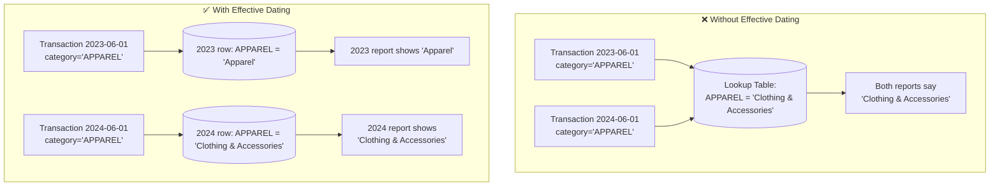
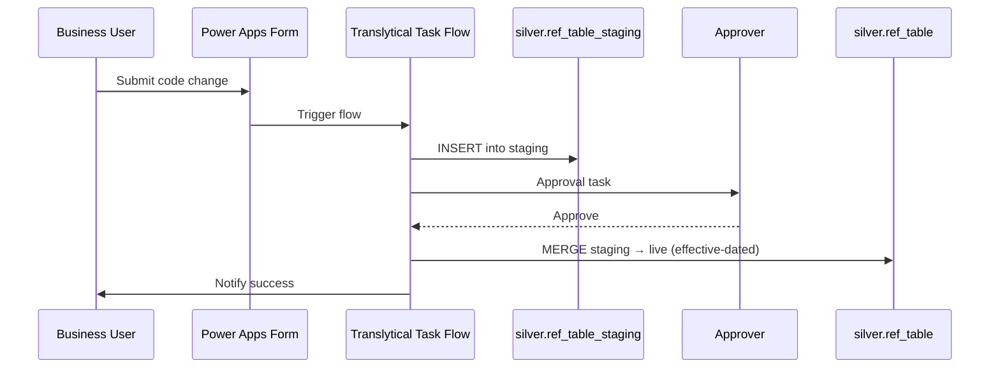

[Home](../../index.md) > [Docs](../..) > [Best Practices](..) > [Data Management](.) > Reference Data Versioning

# 📚 Reference Data Versioning on Microsoft Fabric

<div align="center" markdown>

**Effective-Dated Lookups, Hierarchies, and Code Sets — Phase 14 Wave 3**


</div>

---

**Last Updated:** `2026-04-27` | **Version:** 1.0.0 | **Companion to:** [Master Data Management](master-data-management.md)

---

## 📑 Table of Contents

- [🎯 What Is Reference Data](#-what-is-reference-data)
- [🧾 Examples of Reference Data](#-examples-of-reference-data)
- [⚠️ The Reference Data Problem](#️-the-reference-data-problem)
- [📅 Effective-Dating Schema Pattern](#-effective-dating-schema-pattern)
- [🕒 Bitemporal Reference Data](#-bitemporal-reference-data)
- [🔧 Maintenance Patterns](#-maintenance-patterns)
- [📡 Distribution Patterns](#-distribution-patterns)
- [🏷️ Versioning Strategy](#️-versioning-strategy)
- [🌳 Hierarchies & Recursive Structures](#-hierarchies--recursive-structures)
- [🔗 AS-OF Joins for Historical Correctness](#-as-of-joins-for-historical-correctness)
- [🔁 Cross-System Synchronization](#-cross-system-synchronization)
- [🧹 Code Set Hygiene](#-code-set-hygiene)
- [🎰 Casino Implementation](#-casino-implementation)
- [🏛️ Federal Implementation](#️-federal-implementation)
- [🚫 Anti-Patterns](#-anti-patterns)
- [📋 Implementation Checklist](#-implementation-checklist)
- [📚 References](#-references)

---

## 🎯 What Is Reference Data

**Reference data** is the set of permissible values that classify, qualify, or constrain other data. It defines the vocabulary the rest of your data speaks. Currency codes, country codes, product hierarchies, NAICS codes, jurisdiction tax tables, GL chart of accounts — all reference data.

Reference data is **not** master data, **not** transactional data, and **not** analytical data. The distinctions matter because the management discipline differs for each.

| Data Type | Description | Volatility | Volume | Owner | Examples |
|-----------|-------------|-----------|--------|-------|----------|
| **Reference** | Permissible values, code sets, hierarchies | Low (months / years) | Small (hundreds–thousands of rows) | Authority feed or business committee | ISO country codes, NAICS, HCPCS, GL accounts |
| **Master** | Identifiers for entities (customer, product, employee) | Medium (continuous, deduped) | Medium-large (thousands–millions) | Stewardship + match engine | Customer master, product master, provider master |
| **Transactional** | Events that happened | Very high (real-time) | Very large (billions) | Source systems | Slot spins, deposits, claim filings |
| **Analytical** | Aggregations and KPIs derived from above | Periodic refresh | Variable | BI / analytics team | Daily revenue, hold percentage, EPA permit volumes |

Reference data sits **upstream** of master and transactional data. A `bronze.slot_spin` record references a `game_type_code`; that code lives in a reference table. If the codes change and you don't preserve history, every old transaction's classification becomes inconsistent.

> 📝 **Companion to MDM:** This doc is paired with the [Master Data Management](master-data-management.md) anchor. MDM masters *entities*; reference data masters *vocabularies*.

---

## 🧾 Examples of Reference Data

| Domain | Example Reference Data | Authority |
|--------|------------------------|-----------|
| **Geography** | ISO 3166 country codes, ISO 4217 currency codes, IANA time zones | ISO, IANA |
| **Product** | Category → subcategory → SKU hierarchy | Internal product committee |
| **Organization** | Cost center hierarchy, business unit, legal entity codes | Finance / HR |
| **Healthcare** | HCPCS, ICD-10-CM, ICD-10-PCS, CPT, NDC | CMS / WHO / AMA |
| **Industry classification** | NAICS, SIC, ISIC | US Census, BLS |
| **Casino regulatory** | NIGC tier classifications (Tier I/II/III), state-by-state jurisdiction codes | NIGC, state regulators |
| **Tax** | Sales tax rate by jurisdiction × product class, withholding tables | State / IRS |
| **Finance** | GL chart of accounts, cost-center mapping, currency exchange snapshots | Finance / FX vendor |
| **Federal grants** | CFDA / Assistance Listings, NAICS for SBA, USDA crop codes | GSA, USDA, SBA |
| **Weather/Hazards** | NWS storm severity codes, NOAA event types | NOAA / NWS |

A consistent property: **every example above evolves over time** — codes are added, retired, redefined, or have their effective date changed by an authority outside your system.

---

## ⚠️ The Reference Data Problem

Reference data looks easy on day one. Load a CSV; join it; ship the dashboard. The problem appears in month thirteen, when an analyst asks: *"Show me Q3 revenue by product category for the last three years."*

Three failure modes will appear:

1. **Codes change.** A category was renamed in 2024. Every transaction tagged with the old name now displays under "Unknown" — or worse, silently joins to a new category that didn't exist when the transaction was recorded.
2. **Hierarchies reorganize.** "Slot Floor East" was reorganized into two zones in 2025. A historical hold-percentage report that uses the *current* hierarchy double-counts or mis-attributes earlier periods.
3. **Rates and thresholds change.** The CTR threshold has been $10,000 since 1970, but a state-level structuring threshold may have changed in 2023. Compliance reports for 2022 must apply the 2022 threshold; reports for 2024 apply the 2024 threshold.

The root cause is the same: **a lookup table without effective dating cannot answer historical questions correctly**. The fix is also the same: store every value with its effective period, and join transactions to reference data **as of the transaction date**, not "as of today."



---

## 📅 Effective-Dating Schema Pattern

The minimum viable schema for versioned reference data:

```sql
CREATE TABLE silver.ref_game_type (
    code              STRING NOT NULL,           -- stable code, e.g., 'SLOT-3R'
    code_value        STRING NOT NULL,           -- display value at this point in time
    description       STRING,                    -- human-readable
    parent_code       STRING,                    -- hierarchy (NULL for top)
    attributes        MAP<STRING, STRING>,       -- extensible properties
    effective_from    TIMESTAMP NOT NULL,        -- inclusive
    effective_to      TIMESTAMP NOT NULL,        -- exclusive; '9999-12-31' for current
    is_current        BOOLEAN NOT NULL,          -- denormalized flag for fast filters
    version           STRING NOT NULL,           -- e.g., '2.3.1' (semver)
    source            STRING NOT NULL,           -- 'NIGC' / 'CMS' / 'internal'
    last_updated      TIMESTAMP NOT NULL,        -- system time of insert/update
    last_updated_by   STRING NOT NULL            -- user or pipeline that wrote this row
) USING DELTA
PARTITIONED BY (is_current);
```

### Key Constraints

| Constraint | Rationale |
|------------|-----------|
| `(code, effective_from)` is unique | One value per code per effective window |
| `effective_to > effective_from` | Periods are non-empty |
| Periods for the same `code` do not overlap | Prevents ambiguous joins |
| Exactly one row per code has `is_current = true` | Fast point-in-time-now lookups |
| `'9999-12-31'` sentinel, never `NULL` for `effective_to` | Avoids `NULL` semantics in BETWEEN clauses |

### MERGE Pattern (PySpark) for Effective-Dating

This is the canonical pattern. New incoming rows close prior open periods and insert new ones:

```python
from pyspark.sql.functions import (
    col, lit, current_timestamp, when, expr, sha2, concat_ws
)
from delta.tables import DeltaTable

def merge_reference_data(
    spark,
    incoming: "DataFrame",       # columns: code, code_value, description, parent_code, attributes, source, version
    table_name: str,
    natural_key: str = "code",
    effective_from_col: str = "_load_ts",
):
    """
    Effective-dating MERGE for reference tables.
    - Closes any currently-open row whose payload differs from incoming.
    - Inserts a new open row with effective_from = batch load timestamp.
    - Idempotent: re-running with identical payload is a no-op.
    """
    # 1) Compute payload hash for change detection (exclude system-managed columns)
    payload_cols = ["code_value", "description", "parent_code"]
    incoming_h = (incoming
        .withColumn("_payload_hash", sha2(concat_ws("||", *[col(c).cast("string") for c in payload_cols]), 256))
        .withColumn("_load_ts", current_timestamp())
    )

    target = DeltaTable.forName(spark, table_name)

    # 2) Close existing current rows where payload changed
    target.alias("t").merge(
        incoming_h.alias("s"),
        f"t.{natural_key} = s.{natural_key} AND t.is_current = true"
    ).whenMatchedUpdate(
        condition="t._payload_hash != s._payload_hash",
        set={
            "effective_to":   "s._load_ts",
            "is_current":     lit(False),
            "last_updated":   "s._load_ts",
            "last_updated_by": lit("ref_data_pipeline"),
        }
    ).execute()

    # 3) Insert new current rows for changed or net-new codes
    existing_current = (spark.table(table_name)
        .filter("is_current = true")
        .select(natural_key, col("_payload_hash").alias("_existing_hash"))
    )
    to_insert = (incoming_h
        .join(existing_current, natural_key, "left")
        .filter("_existing_hash IS NULL OR _existing_hash != _payload_hash")
        .select(
            col("code"),
            col("code_value"),
            col("description"),
            col("parent_code"),
            col("attributes"),
            col("_load_ts").alias("effective_from"),
            lit("9999-12-31 23:59:59").cast("timestamp").alias("effective_to"),
            lit(True).alias("is_current"),
            col("version"),
            col("source"),
            col("_load_ts").alias("last_updated"),
            lit("ref_data_pipeline").alias("last_updated_by"),
            col("_payload_hash"),
        )
    )
    to_insert.write.format("delta").mode("append").saveAsTable(table_name)
```

The hash check ensures that rerunning the same upstream feed without changes does **not** create churn rows — the table only grows when reality changes.

---

## 🕒 Bitemporal Reference Data

For regulated workloads, single-axis effective dating is not enough. You need **bitemporal** modeling:

| Time axis | Question it answers |
|-----------|---------------------|
| **Effective time** (`effective_from` / `effective_to`) | When was this value true *in the world*? |
| **System time** (`recorded_from` / `recorded_to`) | When did our system *know* about this value? |

The two diverge whenever you back-date a correction.

### Schema Extension

```sql
ALTER TABLE silver.ref_tax_rate ADD COLUMNS (
    recorded_from   TIMESTAMP,    -- when system first recorded this row
    recorded_to     TIMESTAMP,    -- when system superseded this row
    is_latest       BOOLEAN       -- denormalized flag for fast "what do we know now?" queries
);
```

### Four-Tier Corner Cases

```
Time:         2024-Q1   2024-Q2   2024-Q3   2024-Q4   2025-Q1
Reality:        7%        7%        8%        8%        8%
What we knew:   7%        7%        7%        8%(*)     8%

(*) On 2024-12-15 we received a back-dated correction:
    "The rate actually changed to 8% effective 2024-07-01,
     not 2024-10-01 as we previously recorded."
```

Four queries this enables:

1. **"What is the rate now?"** → `is_current = true AND is_latest = true`
2. **"What rate applied on 2024-08-15?"** → `effective_from <= '2024-08-15' < effective_to AND is_latest = true`
3. **"What did our system *believe* the 2024-08-15 rate was on 2024-09-01?"** → `effective_from <= '2024-08-15' < effective_to AND recorded_from <= '2024-09-01' < recorded_to`
4. **"How did our knowledge of historical rates change between two audit dates?"** — diff (2) and (3) for two `recorded_from` cuts.

Question (3) is what auditors and regulators actually ask. They are reconstructing the state of your knowledge at a past point, not the state of reality. A non-bitemporal table cannot answer that.

### When Bitemporal Is Required

- **Tax tables** (back-dated rate corrections from state authorities)
- **Healthcare codes** (CMS issues HCPCS quarterly with retroactive effective dates)
- **Compliance thresholds** (regulator changes a threshold and back-dates its application)
- **Currency fixings** (rate corrections from FX providers)

Casino loyalty tier definitions, internal product hierarchies, and most internal reference data can stay single-axis temporal — bitemporal is overhead you adopt only when you will be audited on what you knew, when.

---

## 🔧 Maintenance Patterns

### 1. Manual Upload (Power Apps → Translytical Task Flow)

For business-owned reference data (loyalty tiers, internal cost centers, jurisdiction overrides):



Key controls: staging table, approval, audit row written with submitter and approver IDs.

### 2. Source-System Pull

For reference data sourced from systems of record (CRM categories, ERP COA, HRIS org units):

- Daily / weekly pipeline reads the source via Mirroring or Copy Job CDC
- Lands in a per-source bronze table
- Silver MERGE applies the effective-dating pattern above
- Source system remains authoritative — Fabric is a derived store

### 3. Authority Feeds

For reference data published by external authorities:

| Authority | Feed | Cadence |
|-----------|------|---------|
| CMS | HCPCS / ICD-10 quarterly releases | Quarterly |
| Census Bureau | NAICS revisions | Every 5 years (with intra-year code splits) |
| ECB / Fed | FX fixings | Daily |
| NIGC | Tier classification updates | Ad hoc |
| NWS | Storm event types | Ad hoc |
| ISO | 3166 / 4217 amendments | Multiple times per year |

Pattern: scheduled pipeline downloads the feed, validates checksum/version, lands into bronze, MERGE-promotes to silver. Always preserve the raw download in bronze for re-replay if the silver table is ever rebuilt.

### 4. Approval Workflow Before Promotion

Reference data drives compliance. A bad row can mis-classify months of transactions. Always require:

- Two-person approval for any change to compliance-impacting tables (tax rates, jurisdiction codes, regulatory tier definitions)
- Diff preview before approval (what closes, what opens)
- Effective-date sanity check (no back-dating > N days without escalation)
- Auto-revert workflow if downstream validations fail within the next 24 hours

---

## 📡 Distribution Patterns

How consumers obtain reference data matters as much as how it's maintained.

| Pattern | Mechanism | Latency | Pros | Cons |
|---------|-----------|---------|------|------|
| **Direct query** | Cross-database query / shortcut to silver | Real-time | One source of truth, no copies | Read load on silver |
| **Mirrored to downstream** | Mirroring to SQL DB / Iceberg shortcut | Seconds | Cross-engine reach, no ETL | Read-only mirrors |
| **Materialized into pipelines** | Silver/Gold pipeline join applies as-of join, persists denormalized | Pipeline-cadence | Fast consumer reads | Re-materialize on every change |
| **App-cached with TTL** | Application loads slice, caches with TTL | Stale up to TTL | Lowest read latency for apps | Stale risk; needs cache invalidation |
| **Iceberg interop** | Delta-as-Iceberg virtualization | Real-time | External engines (Snowflake, Trino) read same data | Read-only; metadata cost |

> 📝 **Iceberg interop tie-in:** Reference tables are excellent candidates for [Delta-as-Iceberg virtualization](../../features/onelake-iceberg-interop.md). They are small, change infrequently, and consumed by many engines — exactly the workload Iceberg interop is optimized for. Avoid copying reference data into Snowflake; let Snowflake read it via the Iceberg REST Catalog.

### Cross-Database Query Example

```sql
-- From a Fabric Warehouse, join transactional data to reference data living in a lakehouse
SELECT
    f.spin_id,
    f.spin_amount,
    g.code_value      AS game_type_label,
    g.description     AS game_type_desc
FROM warehouse.fact_slot_spin AS f
JOIN lakehouse.silver.ref_game_type AS g
  ON f.game_type_code = g.code
 AND f.spin_ts >= g.effective_from
 AND f.spin_ts <  g.effective_to;
```

The cross-database query feature in Fabric SQL Endpoint and Warehouse keeps a single physical reference table while letting any consumer engine join against it.

---

## 🏷️ Versioning Strategy

Adopt **semantic versioning** for reference tables published as data products:

| Bump | Trigger | Consumer impact |
|------|---------|-----------------|
| **Major** (`2.x.x` → `3.0.0`) | Breaking schema change, code retirement, code re-meaning | Every consumer must review |
| **Minor** (`2.3.x` → `2.4.0`) | Additive — new code added, new optional column | Backward-compatible; no consumer action required |
| **Patch** (`2.3.1` → `2.3.2`) | Description-only edit, typo fix | Cosmetic; safe to absorb |

Persist the version on **every row** so consumers can pin to a version for reproducibility:

```sql
SELECT * FROM silver.ref_game_type
WHERE version LIKE '2.3.%'        -- pin to minor 2.3
  AND is_current = true;
```

### Publishing Versions

- Tag the silver table with the version in OneLake Catalog metadata
- Keep release notes per version (what closed, what opened, why)
- Pre-announce major bumps via the data product card; provide a deprecation window
- Run dual-publish (vN and vN+1 simultaneously) during major migrations

---

## 🌳 Hierarchies & Recursive Structures

Many reference sets are hierarchical: GL accounts roll up, product categories nest, org units have parents. Three storage models are common; each has trade-offs.

### Adjacency List

```sql
CREATE TABLE silver.ref_org_unit (
    code STRING,
    parent_code STRING,    -- NULL for root
    code_value STRING,
    effective_from TIMESTAMP,
    effective_to TIMESTAMP,
    is_current BOOLEAN
);
```

| Pros | Cons |
|------|------|
| Simple to maintain (one row, one parent) | Multi-level traversal needs recursion |
| Standard pattern | Spark recursive CTEs are limited; need alternative |

### Path Enumeration

```
code='LEAF-X', path='/Top/Mid/LEAF-X'
```

| Pros | Cons |
|------|------|
| Leaf-to-root in a single column read | Restructuring requires path rewrites for all descendants |
| Simple LIKE-prefix queries | Path can grow long for deep trees |

### Closure Table

A pre-computed transitive-closure table; one row per ancestor-descendant pair.

```sql
CREATE TABLE silver.ref_org_unit_closure (
    ancestor_code STRING,
    descendant_code STRING,
    depth INT,
    effective_from TIMESTAMP,
    effective_to TIMESTAMP
);
```

| Pros | Cons |
|------|------|
| Any ancestor / descendant query in one join | Storage grows quadratically for deep trees |
| Easy to build "rolls up to" measures in DAX | Must rebuild on every hierarchy change |

### Trade-off Summary

| Workload | Best fit |
|----------|----------|
| Simple lookups, small hierarchy, infrequent changes | Adjacency list |
| Reporting wants "everything under node X" | Path enumeration *or* closure table |
| Power BI hierarchical slicers, frequent rollups | Closure table (pre-joined to gold) |
| Frequent restructures | Adjacency list (cheaper to amend) |

### PySpark Recursive Traversal

Spark does not natively support recursive CTEs. The pragmatic patterns:

```python
# Iterative traversal — fixed max depth
def expand_hierarchy(spark, ref_table: str, max_depth: int = 10):
    df = spark.table(ref_table).filter("is_current = true").alias("l0")
    result = df.select(
        col("code").alias("descendant"),
        col("code").alias("ancestor"),
        lit(0).alias("depth"),
    )
    current = df
    for d in range(1, max_depth + 1):
        parent = spark.table(ref_table).filter("is_current = true").alias(f"l{d}")
        current = (current.alias("c")
            .join(parent, col(f"c.parent_code") == col(f"l{d}.code"), "inner")
            .select(
                col("c.code").alias("code"),
                col(f"l{d}.parent_code").alias("parent_code"),
                col("c.descendant").alias("descendant") if "descendant" in current.columns else col("c.code").alias("descendant"),
                col(f"l{d}.code").alias("ancestor"),
            )
        )
        if current.limit(1).count() == 0:
            break
        result = result.unionByName(
            current.select(col("descendant"), col("ancestor"), lit(d).alias("depth"))
        )
    return result.dropDuplicates(["descendant", "ancestor"])
```

Build the closure table once per reference-data refresh and persist it. Reading it is then a single Delta scan.

---

## 🔗 AS-OF Joins for Historical Correctness

The most important reference-data discipline: **always join transactions to reference data as of the transaction's event time**, never `current_date`.

### The Bug Pattern

```python
# ❌ Wrong: classifies historical transactions with today's category
joined = (transactions
    .join(ref_category.filter("is_current = true"), "category_code", "left"))

# ❌ Also wrong: subtle — joins with today's table snapshot
joined = (transactions
    .join(spark.table("silver.ref_category"), "category_code", "left"))
```

Both produce different answers depending on *when the report runs*, which is the canonical sign that historical reports will drift over time.

### The Correct Pattern

```python
# ✅ Correct: as-of join on transaction event time
from pyspark.sql.functions import col, broadcast

ref = spark.table("silver.ref_category")  # contains effective_from, effective_to

joined = (transactions.alias("t")
    .join(broadcast(ref).alias("r"),
          (col("t.category_code") == col("r.code")) &
          (col("t.event_ts")      >= col("r.effective_from")) &
          (col("t.event_ts")      <  col("r.effective_to")),
          "left")
    .select("t.*", col("r.code_value").alias("category_label"))
)
```

`broadcast()` is correct because reference tables are small. The join is semantically deterministic: the same transaction always resolves to the same category label, regardless of when the report runs.

### Common Bug: `current_date` instead of `event_date`

Code review red flags:

```python
# 🔴 RED FLAG — historical reports will be wrong
ref.filter("effective_from <= current_date() AND current_date() < effective_to")

# 🔴 RED FLAG — uses report build time, not event time
ref.filter(F.lit(today) >= col("effective_from"))
```

If a query needs the value "now," it should read `is_current = true`. If it needs the value "as of an event," it must compare against the event timestamp. The two are different and never interchangeable.

### Closing Out Open-Ended Periods

When generating gold reports for closed accounting periods, precompute the period-end snapshot once:

```python
period_end = "2024-09-30 23:59:59"
ref_at_period = (spark.table("silver.ref_category")
    .filter(f"effective_from <= '{period_end}' AND '{period_end}' < effective_to")
    .select("code", "code_value")
)
# Reuse across all gold tables that materialize Q3 2024 results
```

This pattern ensures the same reference snapshot is used across every Q3 gold table — even if reference data evolves before Q4 close.

---

## 🔁 Cross-System Synchronization

When reference data must exist in multiple stores (Fabric + a transactional SQL DB + a SaaS app), follow the **single source of truth + one-way push** rule.

### Principles

1. **One authoritative system** per reference set. Fabric for analytics-derived reference; the source system for source-owned reference.
2. **One-way push** from authoritative to derived. Bidirectional editing is a license to corrupt history.
3. **Reconciliation jobs** run on a schedule and alert on drift.
4. **Drift is a P1 incident**, not an "eventual consistency" footnote.

### Reconciliation Job Pattern

```python
def reconcile_reference(spark, source_table: str, derived_table: str, key: str):
    src = spark.table(source_table).filter("is_current = true")
    drv = spark.table(derived_table).filter("is_current = true")

    only_in_source  = src.join(drv, key, "left_anti")
    only_in_derived = drv.join(src, key, "left_anti")
    # Compare payload for matched keys
    matched_diff = (src.alias("s")
        .join(drv.alias("d"), key, "inner")
        .filter("s._payload_hash != d._payload_hash")
    )

    if any(df.limit(1).count() > 0 for df in [only_in_source, only_in_derived, matched_diff]):
        # Write to incident table; trigger alert
        emit_alert("ref_data_drift", source=source_table, derived=derived_table)
```

Drift alerts route to the steward queue, not to ops on-call — the fix is data, not infrastructure.

---

## 🧹 Code Set Hygiene

A small set of disciplines that make reference data maintainable for the long haul.

### Codes vs Magic Strings

```python
# ❌ Hardcoded strings everywhere
df.filter("game_type == 'Slot 3-Reel'")

# ✅ Stable codes; labels resolved via ref join
df.filter("game_type_code == 'SLOT-3R'")
```

If a label changes, no code in the platform breaks. Only the description column in the reference table is updated.

### Soft-Delete, Never Hard-Delete

```sql
-- ❌ Loses history
DELETE FROM silver.ref_game_type WHERE code = 'SLOT-OBSOLETE';

-- ✅ Soft-delete by closing the period and marking inactive
UPDATE silver.ref_game_type
SET effective_to = current_timestamp(),
    is_current = false,
    is_active = false
WHERE code = 'SLOT-OBSOLETE' AND is_current = true;
```

Historical transactions still resolve to the retired code via as-of join. New transactions can be prevented from using it via a constraint that joins to `is_active = true`.

### Description Language Packs (i18n)

For multi-language deployments, separate the code from its labels:

```sql
CREATE TABLE silver.ref_game_type_i18n (
    code            STRING NOT NULL,
    locale          STRING NOT NULL,    -- 'en-US', 'es-MX', 'fr-CA'
    code_value      STRING NOT NULL,
    description     STRING,
    effective_from  TIMESTAMP NOT NULL,
    effective_to    TIMESTAMP NOT NULL,
    is_current      BOOLEAN NOT NULL,
    PRIMARY KEY (code, locale, effective_from)
);
```

Joins resolve label by `(code, locale)` with the same as-of pattern.

### Other Hygiene

- Codes are case-stable (always upper-case or always lower-case)
- No spaces, no unicode in codes
- Maximum length documented per table
- Reserved range for internal vs source-issued codes
- Never reuse a retired code for a different concept (it will silently break old reports)

---

## 🎰 Casino Implementation

### Game Type Codes

```sql
-- silver.ref_game_type
code='SLOT-3R'   code_value='Slot 3-Reel'      parent_code='SLOT'
code='SLOT-VID'  code_value='Video Slot'       parent_code='SLOT'
code='TBL-BJ'    code_value='Blackjack'        parent_code='TBL'
code='TBL-CRP'   code_value='Craps'            parent_code='TBL'
code='POKER-CASH' code_value='Cash Poker'      parent_code='POKER'
code='KENO'      code_value='Keno'             parent_code=NULL
```

Used by every fact table that records play. When a new game type launches, a new effective-dated row appears; old transactions keep their original `code_value`.

### Compliance Jurisdiction Codes

State-by-state classification of a property's regulatory environment. Drives which CTR, SAR, W-2G thresholds apply.

```sql
code='NV-COM'   code_value='Nevada Commercial'      attributes={'ctr_threshold': '10000', 'w2g_slot': '1200'}
code='AZ-TRIBE' code_value='Arizona Tribal'         attributes={'ctr_threshold': '10000', 'w2g_slot': '1200', 'compact_required': 'true'}
code='OK-CLASS2' code_value='Oklahoma Class II'     attributes={'nigc_tier': 'II'}
```

Bitemporal **required** here — back-dated regulatory changes have to be auditable with what-we-knew-when.

### Player Tier Definitions (Revision History)

```sql
-- 2023: Tiers were Bronze / Silver / Gold / Platinum
-- 2024-Q3: Casino added 'Diamond' between Platinum and Black Card
-- 2025-Q1: Casino re-tiered point thresholds across the board

silver.ref_player_tier:
  ('TIER-BRONZE', 'Bronze',   1, 0,     2026-12-31, 2024-09-30, v1.0.0)
  ('TIER-PLAT',   'Platinum', 4, 50000, 2026-12-31, 2024-09-30, v1.0.0)
  ('TIER-DIAM',   'Diamond',  5, 75000, 2024-10-01, 2024-12-31, v1.1.0)
  ('TIER-PLAT',   'Platinum', 4, 60000, 2025-01-01, 9999-12-31, v2.0.0)  -- threshold changed
  ('TIER-DIAM',   'Diamond',  5, 90000, 2025-01-01, 9999-12-31, v2.0.0)
```

Year-over-year tier comparisons must use the threshold rules effective in each comparison year, not today's rules.

---

## 🏛️ Federal Implementation

### USDA Crop Codes

USDA revises crop codes annually with the Cropland Data Layer release. Acreage-by-crop reports for prior years must use the prior-year code definitions.

```sql
silver.ref_usda_crop:
  code='1', code_value='Corn',          version='CDL-2023', effective='2023-01-01' to '2024-01-01'
  code='1', code_value='Corn',          version='CDL-2024', effective='2024-01-01' to '2025-01-01'  -- definition unchanged
  code='176', code_value='Grass/Pasture', version='CDL-2024', effective='2024-01-01' to '9999-12-31'  -- new code in 2024
```

### NAICS Codes (SBA)

Census Bureau revises NAICS every five years (2017, 2022, 2027), with intra-revision splits and merges. SBA loan eligibility reports must apply the NAICS revision in effect at loan origination, not the current revision.

```sql
silver.ref_naics:
  code='541512', code_value='Computer Systems Design Services',     version='NAICS-2017', effective='2017-01-01' to '2022-01-01'
  code='541512', code_value='Computer Systems Design Services',     version='NAICS-2022', effective='2022-01-01' to '9999-12-31'
  code='519130', code_value='Internet Publishing and Broadcasting', version='NAICS-2017', effective='2017-01-01' to '2022-01-01'
  -- 519130 was split in NAICS-2022 across multiple new codes
```

### HCPCS / ICD-10 (Tribal Health)

CMS publishes HCPCS quarterly. ICD-10 has annual major releases plus mid-year errata. Claim adjudication must use codes valid on the date of service.

Bitemporal modeling is mandatory — CMS regularly issues retroactive code corrections that affect prior-quarter claims.

### NWS Storm Severity Codes (NOAA)

The NWS storm event taxonomy has evolved (e.g., the addition of "Marine Tornado" as a distinct event type). Climatological reports comparing decades of storm activity must normalize to a chosen reference version *or* preserve the original taxonomy and document the comparison.

---

## 🚫 Anti-Patterns

| Anti-Pattern | Why It Hurts | What to Do Instead |
|--------------|--------------|--------------------|
| **No effective dating** | Historical reports drift as codes change | Effective-dated schema from day one |
| **`current_date` in joins** | Reports return different answers each day | As-of join on event timestamp |
| **Hard-delete retired codes** | Old transactions show "Unknown" | Soft-delete: close period, mark `is_active=false` |
| **Reusing retired codes for new meanings** | Silently breaks historical reports | Mint a new code; never reuse |
| **Editing rows in place without history** | No audit trail; auditors cannot answer "what did we know?" | Bitemporal model; immutable history |
| **Letting each consumer keep its own copy** | Drift; consumers disagree on classifications | Single source of truth + one-way distribution |
| **Treating reference data as an "ops" table** | No change control; one bad row breaks compliance | Approval workflow + diff preview + dual-control on compliance tables |
| **Spreadsheet of truth maintained by one analyst** | Bus factor 1; no audit; no version history | Power Apps + Translytical Task Flow + staging table |
| **Using descriptions as foreign keys** | Description rename breaks every join | Stable codes as keys; descriptions are display-only |
| **Hierarchies maintained in BI tool only** | Hierarchy logic invisible to ETL; multiple consumers reinvent it | Persist closure table in silver; consume everywhere |

---

## 📋 Implementation Checklist

Before declaring a reference data set "production-ready":

- [ ] Effective-dating columns present (`effective_from`, `effective_to`, `is_current`)
- [ ] Bitemporal columns added if regulator-facing (`recorded_from`, `recorded_to`, `is_latest`)
- [ ] Period non-overlap constraint enforced or validated daily
- [ ] Exactly-one-current-row-per-code constraint enforced
- [ ] MERGE pipeline is idempotent (verified with replay test)
- [ ] Payload hash used for change detection — no churn rows
- [ ] Source authority documented (which feed, which version, what cadence)
- [ ] Approval workflow for compliance-impacting changes
- [ ] Diff preview presented to approvers before promotion
- [ ] Hierarchy storage chosen (adjacency / path / closure) and documented
- [ ] Closure table rebuilt on every hierarchy change if used
- [ ] AS-OF join pattern used in every consumer query (code review checklist item)
- [ ] No `current_date` in any reference join — verified via grep / lint
- [ ] Single source of truth identified per reference set
- [ ] Reconciliation job alerts on cross-system drift
- [ ] Semantic version tagged on every row and in OneLake Catalog
- [ ] Iceberg virtualization enabled for cross-engine consumers (where applicable)
- [ ] Power BI semantic model uses the closure table for hierarchical slicers
- [ ] Soft-delete pattern used; no `DELETE` operations against reference tables
- [ ] Description language pack added if multi-locale
- [ ] Data product card published (purpose, owner, version, consumers — see [data-product-framework.md](data-product-framework.md))
- [ ] Steward onboarding doc + change-control runbook published
- [ ] Disaster recovery: silver reference tables included in BCDR plan
- [ ] Audit log retains all changes per applicable retention policy

---

## 📚 References

### Microsoft Fabric Documentation
- [Lakehouse Schemas](https://learn.microsoft.com/fabric/data-engineering/lakehouse-schemas)
- [Cross-Database Query](https://learn.microsoft.com/fabric/data-warehouse/cross-database-query)
- [Translytical Task Flows](https://learn.microsoft.com/fabric/real-time-analytics/translytical-task-flows)
- [OneLake Catalog](https://learn.microsoft.com/fabric/governance/onelake-catalog-overview)

### Industry Standards
- DAMA DMBOK 2nd Edition — Reference & Master Data Management
- ISO 8000-115 — Master Data: Reference Data Quality
- Snodgrass, *Developing Time-Oriented Database Applications in SQL* — bitemporal modeling
- Kimball, *The Data Warehouse Toolkit* — slowly changing dimensions (related but distinct from reference data)

### Authority Feeds
- [CMS HCPCS Quarterly Updates](https://www.cms.gov/medicare/coding-billing/healthcare-common-procedure-system)
- [Census NAICS Manuals](https://www.census.gov/naics/)
- [USDA Cropland Data Layer](https://www.nass.usda.gov/Research_and_Science/Cropland/SARS1a.php)
- [NOAA Storm Events Database](https://www.ncdc.noaa.gov/stormevents/)
- [ISO 3166 / 4217](https://www.iso.org/iso-3166-country-codes.html)

### Related Wave 3 Docs
- [Master Data Management](master-data-management.md) — anchor doc; entities vs vocabularies
- [Data Contracts](data-contracts.md) — schema-as-contract for reference tables
- [Data Product Framework](data-product-framework.md) — publishing reference data as a product
- [Late-Arriving Data](late-arriving-data.md) — back-dated corrections handling
- [SCD Patterns](scd-patterns.md) — SCD2 for dimensions vs effective dating for reference
- [Business Glossary Automation](business-glossary-automation.md) — glossary terms backed by reference codes

### Related Existing Docs
- [Medallion Architecture Deep Dive](../medallion-architecture-deep-dive.md)
- [Data Modeling & Star Schema](../data-modeling-star-schema.md)
- [Data Governance Deep Dive](../data-governance-deep-dive.md)
- [Incremental Refresh & CDC](../incremental-refresh-cdc.md)

### Related Feature Docs
- [OneLake Iceberg Interoperability](../../features/onelake-iceberg-interop.md) — multi-engine reference data sharing
- [Mirroring](../../features/mirroring.md) — pulling reference data from source systems
- [Translytical Task Flows](../../features/translytical-task-flows.md) — manual reference data maintenance
- [OneLake Catalog](../../features/onelake-catalog.md) — version metadata for reference tables

---

[⬆️ Back to Top](#-reference-data-versioning-on-microsoft-fabric) | [📚 Data Management Index](.) | [🏠 Home](../../index.md)
