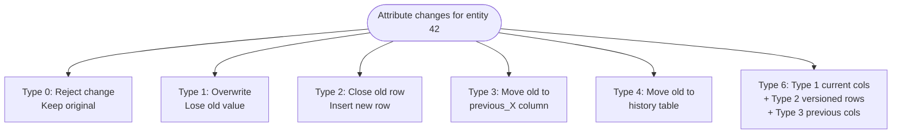
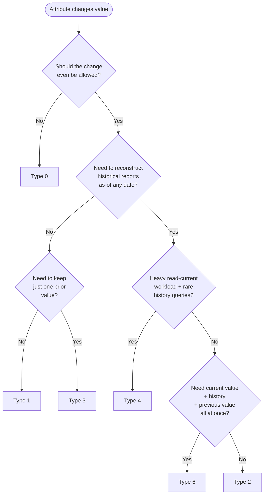
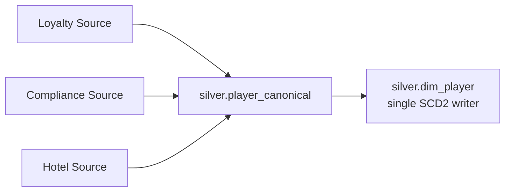

# 🕰️ Slowly Changing Dimension (SCD) Patterns in Delta Lake

<div align="center" markdown>

**Type 0 / 1 / 2 / 3 / 4 / 6 — PySpark MERGE Implementations for Microsoft Fabric Lakehouses**


</div>

---

**Last Updated:** `2026-04-27` | **Version:** 1.0.0 | **Wave 3 Feature:** 3.6

---

## 🎯 Overview

A **Slowly Changing Dimension (SCD)** is a dimensional modeling technique invented by Ralph Kimball to handle attributes whose values change *slowly* over time but where those changes carry analytic meaning. A customer's tier upgrades. A product's category is reorganized. A federal grant program's eligibility threshold is amended. The dimension row is "the same entity" — but the values are different on different dates, and your reports must answer either "what is true *now*" or "what was true *as of* that transaction".

The choice of SCD type is **not** a stylistic preference. It is a contract with the business about which questions the warehouse can answer. Get it wrong and you cannot reconstruct historical KPIs without restoring backup files.

### Why SCD Patterns Matter on Fabric

| Symptom Without Proper SCD | Cause | Cost |
|----------------------------|-------|------|
| Last quarter's report changes when re-run today | Type 1 overwrite of an attribute that should have been Type 2 | Loss of audit trail; SOX failure |
| Player's tier history can't be reconstructed for a CTR investigation | Tier was overwritten on every load | Compliance exposure |
| ML model trained on "current" features but scored against "historical" labels | Naive join to dim instead of as-of join | Data leakage; invalid model |
| Two pipelines updating same dim row produce duplicates with `current_flag = true` | No optimistic-concurrency retry on MERGE | Corrupt golden source |
| Storage growth out of control on tiny dimension | Type 2 applied to attributes that change every day | Cost; query slowdown |

> 📝 **Scope:** This is a Wave 3 deep-dive companion to the [Master Data Management](master-data-management.md) anchor. SCD is the *temporal* layer of MDM — once you have a golden record, SCD decides how it ages.

### Pre-requisites

This doc assumes familiarity with:
- [Medallion Architecture Deep Dive](../medallion-architecture-deep-dive.md) — SCD lives in Silver (cleansed dim) and Gold (published dim)
- [Data Modeling Star Schema](../data-modeling-star-schema.md) — surrogate keys, conformed dimensions
- Delta Lake `MERGE INTO` syntax and optimistic concurrency

---

## 📚 The Six SCD Types

| Type | Behavior | History? | Storage | Read Path | Typical Use |
|------|----------|----------|---------|-----------|-------------|
| **Type 0** | Never change after first write | None — frozen | 1 row per entity | Trivial | Date of birth, gender at registration, original signup date |
| **Type 1** | Overwrite in place | None | 1 row per entity | Trivial | Cosmetic corrections (typo in name); attributes where history has no business meaning |
| **Type 2** | New row per change with effective dates | Full | N rows per entity | Filter on `current_flag` or `effective_to` | Customer tier, employee role, grant status — anything where as-of reporting matters |
| **Type 3** | Add `previous_X` column alongside `X` | Limited (1 prior value) | 1 row per entity | Trivial | When only one prior value matters (e.g., previous account manager) |
| **Type 4** | Current row in main table; history pushed to separate history table | Full, but partitioned | 1 current + N history | Two-table read | Hot-current, cold-history split for very wide dimensions or extreme query asymmetry |
| **Type 6** | Hybrid: Type 1 + Type 2 + Type 3 combined | Full + previous + current denormalized | N rows per entity | Choose by column | Maximum flexibility — current value always available; history available; previous value cached |

> **Type 5 is reserved** in Kimball's original taxonomy and rarely encountered in practice. Type 6 is the practical "everything bagel" pattern.

### Visual Comparison



---

## 🧭 Decision Matrix: Which SCD Type to Use

Decide per-attribute, not per-table. A `dim_player` table can have Type 0 for `birth_date`, Type 1 for `email`, Type 2 for `tier`, and Type 3 for `previous_marketing_consent` — all in the same row.



### Quick Rule of Thumb

| Question | Answer | SCD Type |
|----------|--------|----------|
| Need history? | No | Type 1 |
| Need history + as-of-date reporting? | Yes | Type 2 |
| Only need "previous value"? | Limited | Type 3 |
| Heavy read-only-current usage with rare history? | Yes | Type 4 |
| Need everything (current + history + previous)? | Yes | Type 6 |
| Attribute should never change? | Frozen | Type 0 |

---

## 1️⃣ Type 1 — Overwrite

**Behavior:** New value replaces old value. No history retained. Single row per entity persists.

**When to use:**
- Cosmetic corrections (typo fix, casing normalization)
- Attributes where the business has explicitly said "we don't care about history"
- Reference codes that get re-categorized once and never matter again historically
- Late-arriving correctness updates to current values where old fact rows must reflect the corrected value

**When NOT to use:**
- Anything used in time-period reporting
- Anything used in compliance audit (CTR, SAR, tax filings)
- Anything that influenced a decision (loan approval, tier benefit, eligibility)

### Schema

```sql
CREATE TABLE silver.dim_country (
    country_key  BIGINT GENERATED ALWAYS AS IDENTITY,  -- surrogate
    country_code STRING NOT NULL,                       -- business key
    country_name STRING,                                -- Type 1
    region       STRING,                                -- Type 1
    last_updated TIMESTAMP NOT NULL
) USING DELTA;
```

### PySpark MERGE — Type 1

```python
from delta.tables import DeltaTable
from pyspark.sql.functions import current_timestamp, lit

target = DeltaTable.forName(spark, "silver.dim_country")

# `updates` is the incoming change set
(target.alias("t")
  .merge(
      updates.alias("s"),
      "t.country_code = s.country_code"
  )
  .whenMatchedUpdate(
      condition="""
          t.country_name <> s.country_name
          OR t.region <> s.region
      """,  # only update if something actually changed (idempotency)
      set={
          "country_name": "s.country_name",
          "region":       "s.region",
          "last_updated": "current_timestamp()"
      }
  )
  .whenNotMatchedInsert(
      values={
          "country_code": "s.country_code",
          "country_name": "s.country_name",
          "region":       "s.region",
          "last_updated": "current_timestamp()"
      }
  )
  .execute()
)
```

> **Idempotency note:** the `condition` on `whenMatchedUpdate` prevents writing a no-op update, which would still bump `_commit_version` and pollute Delta history.

---

## 2️⃣ Type 2 — Row Versioning (Deep Dive)

**Behavior:** Each change inserts a new row with a new surrogate key. The previous row is "closed" by setting `effective_to` and clearing `current_flag`.

**This is the workhorse pattern.** When in doubt, default to Type 2.

### Schema

```sql
CREATE TABLE silver.dim_player (
    -- Keys
    player_key      BIGINT GENERATED ALWAYS AS IDENTITY,  -- surrogate (changes per version)
    player_id       STRING  NOT NULL,                     -- business key (stable)
    -- Type 2 attributes
    tier            STRING,
    home_property   STRING,
    risk_score      INT,
    -- Type 1 attributes (overwrite in every version)
    email           STRING,
    phone           STRING,
    -- Temporal columns
    effective_from  TIMESTAMP NOT NULL,
    effective_to    TIMESTAMP NOT NULL,                   -- '9999-12-31' for current
    current_flag    BOOLEAN  NOT NULL,
    version         INT      NOT NULL,                    -- 1, 2, 3, ... per business_key
    -- Audit
    change_reason   STRING,                               -- 'tier_upgrade' | 'manual_steward' | 'source_drift'
    change_source   STRING,
    _hash           STRING                                -- hash of Type 2 attrs for fast change detection
) USING DELTA
TBLPROPERTIES (
    'delta.autoOptimize.optimizeWrite' = 'true',
    'delta.autoOptimize.autoCompact'   = 'true',
    'delta.enableChangeDataFeed'       = 'true'
);
```

### Key Design Decisions

| Element | Why | Notes |
|---------|-----|-------|
| `effective_to = '9999-12-31'` for current row | Eliminates `OR effective_to IS NULL` from every query | Use a constant, never NULL |
| `current_flag` boolean | Cheap index for "give me current rows only" | Redundant with `effective_to`, but speeds the most common query |
| `version` int | Human-readable ordering; useful for steward UI | 1-indexed; bumped on each change |
| `_hash` of Type 2 attrs | Fast equality check in MERGE | SHA-256 or xxhash of concat of Type 2 columns |
| Surrogate `player_key` | Foreign key target from facts; snapshots the dim version | NEVER reuse |
| Business `player_id` | Stable identity across versions | The "thing" the user sees |

### Surrogate Key Generation

| Strategy | Pros | Cons | Recommendation |
|----------|------|------|----------------|
| Delta `GENERATED ALWAYS AS IDENTITY` | Atomic, monotonic, no driver coordination | Requires Delta 2.0+ on Fabric | ✅ **Preferred** |
| `monotonically_increasing_id()` | Zero-config | NOT globally unique across writes; can collide | ❌ Avoid for SCD2 |
| `row_number() over (order by ...)` | Deterministic | Requires re-numbering on every batch | ⚠️ One-time loads only |
| Hash of business_key + effective_from | Deterministic, idempotent | Non-monotonic; harder for humans | ✅ Acceptable for big-data scale |

### Full SCD Type 2 MERGE — End-to-End

```python
from pyspark.sql.functions import (
    col, current_timestamp, lit, sha2, concat_ws, coalesce, when
)
from delta.tables import DeltaTable

# ─────────────────────────────────────────────────────────────
# Step 1 — Build incoming change set with hash for compare
# ─────────────────────────────────────────────────────────────
incoming = (spark.table("silver.player_canonical")
    .withColumn("_hash", sha2(concat_ws("|",
        coalesce(col("tier"),          lit("")),
        coalesce(col("home_property"), lit("")),
        coalesce(col("risk_score").cast("string"), lit(""))
    ), 256))
    .withColumn("change_reason", lit("source_load"))
    .withColumn("change_source", lit("silver.player_canonical"))
)

# ─────────────────────────────────────────────────────────────
# Step 2 — Identify changes vs current dim
# ─────────────────────────────────────────────────────────────
current = (spark.table("silver.dim_player")
    .where("current_flag = true")
    .select("player_id", col("_hash").alias("_hash_current"),
            col("player_key").alias("player_key_current"))
)

changes = (incoming.alias("i")
    .join(current.alias("c"), "player_id", "left")
    .where(
        col("c._hash_current").isNull() |                           # new entity
        (col("i._hash") != col("c._hash_current"))                  # changed entity
    )
)

# ─────────────────────────────────────────────────────────────
# Step 3 — Two-pass MERGE (close old + insert new in one txn)
# ─────────────────────────────────────────────────────────────
target = DeltaTable.forName(spark, "silver.dim_player")

# Pass A: close any current rows that have a change pending
to_close = changes.where("_hash_current IS NOT NULL").select("player_id")

(target.alias("t")
  .merge(
      to_close.alias("s"),
      "t.player_id = s.player_id AND t.current_flag = true"
  )
  .whenMatchedUpdate(set={
      "effective_to": "current_timestamp()",
      "current_flag": "false"
  })
  .execute()
)

# Pass B: insert new versions (works for both new entities and changes)
new_versions = (changes
    .withColumn("effective_from", current_timestamp())
    .withColumn("effective_to",   lit("9999-12-31 23:59:59").cast("timestamp"))
    .withColumn("current_flag",   lit(True))
    # version: lookup max(version) per player_id and bump (or 1 if new)
    .alias("i")
)

# Compute next version for each player_id
max_version = (spark.table("silver.dim_player")
    .groupBy("player_id").agg({"version": "max"})
    .withColumnRenamed("max(version)", "max_version")
)

new_versions = (new_versions
    .join(max_version, "player_id", "left")
    .withColumn("version", coalesce(col("max_version") + 1, lit(1)))
    .drop("max_version", "_hash_current", "player_key_current")
)

(new_versions.write
    .format("delta")
    .mode("append")
    .saveAsTable("silver.dim_player")
)
```

### Atomicity Caveat

The two-pass approach above is **not** a single Delta transaction. Between Pass A and Pass B, a reader could observe zero current rows for a player_id. Two options to fix:

1. **Wrap in a single MERGE with multiple WHEN clauses** (Delta 2.4+):

```python
(target.alias("t")
  .merge(
      changes.alias("s"),
      "t.player_id = s.player_id AND t.current_flag = true"
  )
  # Close the old current row
  .whenMatchedUpdate(
      condition="t._hash <> s._hash",
      set={
          "effective_to": "current_timestamp()",
          "current_flag": "false"
      }
  )
  # Insert the new version (the unmatched-source side via second MERGE pass)
  .whenNotMatchedBySourceUpdate(...)  # advanced syntax — see Delta docs
  .execute()
)

# Then a SECOND statement appends new rows for the changed + new entities.
```

2. **Application-level lock:** acquire a named-lock table row before the two passes; readers honor a "snapshot view" hint.

In practice, Pass A + Pass B is acceptable because consumers query with `current_flag = true AND effective_to > current_timestamp()` — a closed-old-no-new state is briefly visible but bounded.

### Handling Deletes

Never **physically delete** an SCD2 row. A delete is a logical event:

```python
# A "soft delete" is just an SCD2 close with no new insert
(target.alias("t")
  .merge(
      deletes.alias("s"),
      "t.player_id = s.player_id AND t.current_flag = true"
  )
  .whenMatchedUpdate(set={
      "effective_to":  "current_timestamp()",
      "current_flag":  "false",
      "change_reason": "lit('deleted_in_source')"
  })
  .execute()
)
```

Downstream queries filtering `current_flag = true` will exclude deleted entities. Historical reports still see the deleted row at its prior `effective_from` window.

### Common Bug: Multiple Rows With current_flag = true

This is the **#1 Type 2 bug** and almost always indicates a concurrency violation.

```sql
-- Detection query — run as a daily DQ check
SELECT player_id, COUNT(*) AS bad_count
FROM silver.dim_player
WHERE current_flag = true
GROUP BY player_id
HAVING COUNT(*) > 1;
```

Causes:
- Two pipelines wrote the same player_id at the same time and Pass A/B interleaved
- Restart of failed job picked up where it left off but old rows weren't closed
- Manual SQL update bypassed the MERGE pattern

Mitigations:
- One writer per dim table (single pipeline owns the table)
- Optimistic-concurrency retry (see [Concurrency](#-concurrency))
- Daily DQ checkpoint that alerts on `HAVING COUNT(*) > 1`
- Repair script: keep latest by `effective_from`, close the rest

---

## 3️⃣ Type 3 — Previous-Value Column

**Behavior:** A second column stores the prior value. Only one prior value retained. Never grows wider than two columns per attribute.

### Schema

```sql
CREATE TABLE silver.dim_account (
    account_key       BIGINT GENERATED ALWAYS AS IDENTITY,
    account_id        STRING NOT NULL,
    account_manager   STRING,                     -- current
    previous_manager  STRING,                     -- one prior
    manager_change_ts TIMESTAMP,                  -- when current became current
    last_updated      TIMESTAMP NOT NULL
) USING DELTA;
```

### PySpark MERGE — Type 3

```python
target = DeltaTable.forName(spark, "silver.dim_account")

(target.alias("t")
  .merge(
      updates.alias("s"),
      "t.account_id = s.account_id"
  )
  .whenMatchedUpdate(
      condition="t.account_manager <> s.account_manager",
      set={
          "previous_manager":  "t.account_manager",   # archive current → previous
          "account_manager":   "s.account_manager",
          "manager_change_ts": "current_timestamp()",
          "last_updated":      "current_timestamp()"
      }
  )
  .whenNotMatchedInsert(values={
      "account_id":        "s.account_id",
      "account_manager":   "s.account_manager",
      "previous_manager":  "lit(NULL)",
      "manager_change_ts": "current_timestamp()",
      "last_updated":      "current_timestamp()"
  })
  .execute()
)
```

**Limitation:** A second change overwrites `previous_manager`. Two changes ago is lost forever. Use Type 2 if you need more than one prior value.

---

## 4️⃣ Type 4 — History Table

**Behavior:** Current dim stays narrow (1 row per entity). On every change, the row before update is appended to a separate `*_history` table.

### Schema

```sql
-- Current dim (Type 1 read-path)
CREATE TABLE silver.dim_machine (
    machine_key   BIGINT GENERATED ALWAYS AS IDENTITY,
    machine_id    STRING NOT NULL,
    game_title    STRING,
    denomination  DECIMAL(10,2),
    location      STRING,
    last_updated  TIMESTAMP NOT NULL
) USING DELTA;

-- History dim (Type 2-style temporal)
CREATE TABLE silver.dim_machine_history (
    history_id      BIGINT GENERATED ALWAYS AS IDENTITY,
    machine_id      STRING NOT NULL,
    game_title      STRING,
    denomination    DECIMAL(10,2),
    location        STRING,
    effective_from  TIMESTAMP NOT NULL,
    effective_to    TIMESTAMP NOT NULL,
    change_reason   STRING
) USING DELTA;
```

### Trigger Pattern via MERGE

```python
target = DeltaTable.forName(spark, "silver.dim_machine")

# Step 1: snapshot the about-to-change rows into history
to_archive = (target.toDF().alias("t")
    .join(updates.alias("s"), "machine_id")
    .where(
        (col("t.game_title")   != col("s.game_title")) |
        (col("t.denomination") != col("s.denomination")) |
        (col("t.location")     != col("s.location"))
    )
    .select(
        col("t.machine_id"),
        col("t.game_title"),
        col("t.denomination"),
        col("t.location"),
        col("t.last_updated").alias("effective_from"),
        current_timestamp().alias("effective_to"),
        lit("source_load").alias("change_reason")
    )
)

(to_archive.write.format("delta").mode("append")
    .saveAsTable("silver.dim_machine_history"))

# Step 2: Type 1 overwrite on the current dim
(target.alias("t")
  .merge(updates.alias("s"), "t.machine_id = s.machine_id")
  .whenMatchedUpdate(set={
      "game_title":   "s.game_title",
      "denomination": "s.denomination",
      "location":     "s.location",
      "last_updated": "current_timestamp()"
  })
  .whenNotMatchedInsert(values={
      "machine_id":   "s.machine_id",
      "game_title":   "s.game_title",
      "denomination": "s.denomination",
      "location":     "s.location",
      "last_updated": "current_timestamp()"
  })
  .execute()
)
```

### When Type 4 Beats Type 2

| Situation | Why Type 4 Wins |
|-----------|-----------------|
| 99% of queries hit current; <1% need history | Current dim stays small; history isolated |
| Dim is very wide (50+ cols) and only 5 cols change | History table can store only changed cols, saving storage |
| History is rarely queried but must be retained for compliance | Cold-tier storage on history table; hot-tier on current |
| Different access controls for current vs history | Two RBAC scopes |

### When Type 4 Loses

- Query patterns mix current + as-of frequently → join overhead beats Type 2's filter
- Compliance demands a single audit table → split storage complicates traceability

---

## 6️⃣ Type 6 — Hybrid (1 + 2 + 3)

**Behavior:** Combines all three patterns in one row. Type 2 versioning provides full history. Type 1 columns hold current values, denormalized into every historical row. Type 3 columns hold prior values for fast access.

### Schema

```sql
CREATE TABLE silver.dim_program (
    program_key          BIGINT GENERATED ALWAYS AS IDENTITY,
    program_id           STRING NOT NULL,

    -- Type 2: versioned history
    eligibility_threshold DECIMAL(18,2),
    funding_cap_usd       DECIMAL(18,2),
    program_status        STRING,

    -- Type 1: always current value (denormalized into every historical row)
    current_program_name  STRING,
    current_admin_agency  STRING,

    -- Type 3: prior value (one previous)
    previous_eligibility_threshold DECIMAL(18,2),

    -- Temporal
    effective_from  TIMESTAMP NOT NULL,
    effective_to    TIMESTAMP NOT NULL,
    current_flag    BOOLEAN  NOT NULL,
    version         INT      NOT NULL,
    change_reason   STRING
) USING DELTA;
```

**Why all three?**
- **Type 2 columns:** Reconstruct historical reports ("what was eligibility in FY2024?")
- **Type 1 columns:** Answer "what is the program *called* now?" without joining to current row
- **Type 3 columns:** Compare current vs immediate-prior threshold without finding prior row

### Update Logic — Type 6 Combined

```python
# Step A: when a Type 1 attribute changes, update ALL rows for that program_id
type1_updates = updates.select("program_id", "current_program_name", "current_admin_agency")

(target.alias("t")
  .merge(type1_updates.alias("s"), "t.program_id = s.program_id")
  .whenMatchedUpdate(set={
      "current_program_name": "s.current_program_name",
      "current_admin_agency": "s.current_admin_agency"
  })
  .execute()
)

# Step B: when a Type 2 attribute changes, do standard SCD2 close + insert
# (as shown in section 2). When inserting the new row, populate Type 3
# previous_X columns from the closing row's current values.
```

**When to use Type 6:**
- Dimensions with mixed-mutability attributes where every attribute matters
- Federal programs, regulatory schedules, eligibility rules
- Customer master with stable name + volatile tier + occasional manager change

**Cost:** highest write complexity. Reserve for dimensions where the read flexibility justifies it.

---

## 🔷 Delta-Specific Considerations

### MERGE INTO Syntax

Delta supports `WHEN MATCHED`, `WHEN NOT MATCHED`, and `WHEN NOT MATCHED BY SOURCE` clauses with optional `condition` predicates. SCD2 leverages all three:

```sql
MERGE INTO silver.dim_player t
USING incoming s
ON t.player_id = s.player_id AND t.current_flag = true
WHEN MATCHED AND t._hash <> s._hash THEN
    UPDATE SET effective_to = current_timestamp(), current_flag = false
WHEN NOT MATCHED BY SOURCE AND t.current_flag = true THEN
    UPDATE SET effective_to = current_timestamp(), current_flag = false,
               change_reason = 'deleted_in_source';
-- Then a subsequent INSERT for the new versions
```

### Schema Evolution (autoMerge)

Set `spark.databricks.delta.schema.autoMerge.enabled = true` (or `delta.enableChangeDataFeed` table property) to allow new attributes to flow through MERGE without DDL changes. Validate carefully — silent schema drift in a SCD2 dim can break downstream as-of joins.

### Time Travel as a "Free" Type 2

Delta time travel (`VERSION AS OF` or `TIMESTAMP AS OF`) gives you point-in-time snapshots of any table — effectively free Type 2-like history. **Caveats:**

| Caveat | Why It Disqualifies Time Travel as the Primary SCD Mechanism |
|--------|--------------------------------------------------------------|
| Limited retention | `delta.deletedFileRetentionDuration` defaults 7 days; VACUUM purges older versions |
| Operationally tied to commit log | Compaction/OPTIMIZE creates new commits; you cannot align "business effective date" to commit timestamps |
| No point-in-time joins | You cannot join a fact row's `event_ts` against a versioned dim using time-travel |
| Costly to query history-heavy | Reading 100 versions of a table costs 100x metadata overhead |

> **Use time travel for incident recovery and audit replay**, not as a substitute for SCD2 columns.

### V-Order on Dim Tables

V-Order (Fabric's columnstore optimization) is on by default. Confirm via `DESCRIBE EXTENDED` and ensure `delta.vorder.optimization = true`. Critical for Direct Lake performance on dim tables read by Power BI semantic models.

---

## ⚡ Performance Tuning

### Partition Strategy on Dim Tables

| Dim Size | Partition Strategy |
|----------|--------------------|
| < 1M rows | **No partitioning** — Delta handles small tables better than partition pruning |
| 1M-100M rows (large SCD2) | Partition on `current_flag` (boolean — only 2 partitions) |
| > 100M rows | Partition on `current_flag` + Z-Order on `business_key` |
| Type 4 history table | Partition on year of `effective_from` |

Partitioning a 50K-row dim by date is an anti-pattern — generates thousands of small files.

### Z-Order on business_key

```sql
OPTIMIZE silver.dim_player ZORDER BY (player_id);
```

Run weekly. Z-Order on the business key dramatically speeds:
- Joining facts to dim at as-of time
- Steward UI lookups
- Targeted MERGE patterns

### OPTIMIZE Cadence

| Table Type | OPTIMIZE Cadence |
|-----------|------------------|
| SCD1 dim (high churn) | Weekly |
| SCD2 dim (steady growth) | Weekly + after every backfill |
| SCD4 history (append-only) | Monthly |
| Audit table (append-only) | Monthly |

### Avoid VACUUM During MERGE

`VACUUM` deletes files no longer referenced by the current commit. If a long-running MERGE is in flight, VACUUM can race-delete files the MERGE was about to read. **Schedule VACUUM in a separate window** with no concurrent writes:

```bash
# Wrong: VACUUM with retention < default during business hours
VACUUM silver.dim_player RETAIN 168 HOURS;

# Right: VACUUM in maintenance window only, default retention
VACUUM silver.dim_player;
```

---

## 🔁 Concurrency

Delta uses **optimistic concurrency**: writers commit to the log; if two writers committed conflicting transactions, the second receives `ConcurrentAppendException` or `MetadataChangedException`.

### SCD2 + Two Writers

If pipeline A (loyalty source) and pipeline B (compliance source) both update the same `player_id` simultaneously:

```
Pipeline A: read current → produce new version → MERGE
Pipeline B: read current → produce new version → MERGE
            ^^ A's commit wins; B sees ConcurrentAppendException
```

### Retry Pattern

```python
import time
from delta.exceptions import ConcurrentAppendException, ConcurrentDeleteReadException

MAX_RETRIES = 5

def merge_with_retry(merge_fn, *args, **kwargs):
    """Retry a Delta MERGE on optimistic-concurrency conflicts."""
    for attempt in range(MAX_RETRIES):
        try:
            return merge_fn(*args, **kwargs)
        except (ConcurrentAppendException,
                ConcurrentDeleteReadException) as e:
            if attempt == MAX_RETRIES - 1:
                raise
            backoff = (2 ** attempt) + (0.1 * attempt)  # 1, 2, 4, 8, 16 sec
            print(f"Retry {attempt + 1} after {backoff}s: {e}")
            time.sleep(backoff)

# Wrap each SCD2 pass
merge_with_retry(close_old_rows, target, to_close)
merge_with_retry(insert_new_versions, new_versions)
```

### Single-Writer Pattern (Recommended)

Where possible, ensure **one pipeline owns each dim table**. If multiple sources contribute, fan them into a single Silver canonical table first, then run one SCD2 MERGE.



This eliminates concurrency conflicts on the dim table at the cost of an extra Silver hop.

---

## 📜 Auditability

Every dim change should be traceable to **who, what, when, why**.

### Audit Table Schema

```sql
CREATE TABLE audit.dim_player_audit (
    audit_id           BIGINT GENERATED ALWAYS AS IDENTITY,
    player_id          STRING NOT NULL,
    player_key_old     BIGINT,                 -- surrogate of closed row
    player_key_new     BIGINT,                 -- surrogate of inserted row
    change_type        STRING NOT NULL,        -- INSERT | UPDATE | LOGICAL_DELETE
    changed_columns    ARRAY<STRING>,
    old_values         MAP<STRING, STRING>,
    new_values         MAP<STRING, STRING>,
    change_ts          TIMESTAMP NOT NULL,
    actor              STRING NOT NULL,        -- pipeline name or steward user
    reason             STRING,
    source_batch_id    STRING,
    correlation_id     STRING                  -- ties to upstream event
) USING DELTA
PARTITIONED BY (DATE(change_ts));
```

### Wiring into the MERGE

```python
# After Pass A (close) and Pass B (insert), append audit rows
audit_rows = (changes
    .withColumn("change_type",
        when(col("_hash_current").isNull(), "INSERT").otherwise("UPDATE"))
    .withColumn("actor",     lit("pipeline:silver_dim_player"))
    .withColumn("reason",    col("change_reason"))
    .withColumn("change_ts", current_timestamp())
    # ... compute changed_columns / old_values / new_values via map_from_arrays
)

audit_rows.write.format("delta").mode("append").saveAsTable("audit.dim_player_audit")
```

**Retention:** audit tables are append-only; never delete. Apply Purview retention labels for regulatory horizon (typically 7-10 years).

---

## 🔗 Joining SCD2 to Facts (As-Of Joins)

This is the **single most important** pattern to get right. Joining a fact row to its SCD2 dim *naively* gives you the **current** dim version — even for a fact row from 2019.

### The Naive (Wrong) Join

```sql
-- WRONG: joins every fact to today's tier, regardless of when the play happened
SELECT f.*, d.tier
FROM gold.fct_slot_play f
JOIN silver.dim_player d ON f.player_id = d.player_id
WHERE d.current_flag = true;
```

A play from 2019 when the player was Bronze tier will show as Diamond if they upgraded yesterday. KPIs like "revenue by tier" are silently corrupted.

### The Correct As-Of Join

```sql
-- RIGHT: join fact event_ts against dim's effective window
SELECT f.*, d.tier
FROM gold.fct_slot_play f
JOIN silver.dim_player d
    ON  f.player_id = d.player_id
    AND f.event_ts >= d.effective_from
    AND f.event_ts <  d.effective_to;
```

Each fact row matches exactly one dim version — the one whose `effective_from`/`effective_to` window contains the event timestamp.

### The Best Pattern: Snapshot Surrogate Key in the Fact

Resolve the dim version **at fact-load time** and store the surrogate `player_key` directly in the fact row:

```sql
-- Fact load: snapshot the dim version
INSERT INTO gold.fct_slot_play
SELECT
    f.event_id,
    f.event_ts,
    f.player_id,
    d.player_key,           -- ← snapshots the dim version
    f.coin_in,
    f.coin_out,
    ...
FROM bronze.slot_events f
LEFT JOIN silver.dim_player d
    ON  f.player_id = d.player_id
    AND f.event_ts >= d.effective_from
    AND f.event_ts <  d.effective_to;
```

Now downstream queries do a simple integer-key join:

```sql
SELECT f.*, d.tier
FROM gold.fct_slot_play f
JOIN silver.dim_player d ON f.player_key = d.player_key;
```

This is **dramatically faster** (integer equality vs. range predicate), survives dim re-builds, and is the canonical Kimball pattern.

### Late-Arriving Facts

If a fact arrives *after* the dim has been re-versioned, the as-of lookup must walk back. See [late-arriving-data.md](late-arriving-data.md) for the full late-arriving fact + late-arriving dim treatment.

---

## 🎰 Casino Implementation

### dim_player (Type 2)

| Attribute | Type | Reason |
|-----------|------|--------|
| `player_id` | Business key | Stable identity |
| `birth_date` | Type 0 | Frozen — fraud control |
| `email`, `phone` | Type 1 | History irrelevant for ops |
| `tier` | **Type 2** | Tier history drives revenue-by-tier reporting |
| `home_property` | Type 2 | Affects loss-leader allocation |
| `risk_score` | Type 2 | AML / responsible-gaming history |
| `marketing_consent` | Type 3 | Need to know prior consent for compliance |

### dim_machine (Type 2)

| Attribute | Type | Reason |
|-----------|------|--------|
| `machine_id` | Business key | Stable |
| `game_title` | **Type 2** | Game changes alter hold pct; historical hold reporting requires version |
| `denomination` | **Type 2** | Same — drives win calculations |
| `location` (bank/zone) | Type 2 | Heat-map analytics |
| `manufacturer` | Type 1 | Cosmetic for ops |
| `serial_number` | Type 0 | Frozen |

### dim_compliance_threshold (Type 2)

CTR, SAR, W-2G thresholds are regulated values that change rarely but with massive impact. Type 2 is **mandatory** so historical filings can be reconstructed against the threshold that was in force on the event date.

```python
# Example: CTR threshold history
# Pre-2026: $10,000 (current FinCEN rule)
# Hypothetical post-2027 update to $12,000 → Type 2 row
SELECT
    f.event_ts,
    f.cash_in_amount,
    t.ctr_threshold,
    CASE WHEN f.cash_in_amount >= t.ctr_threshold THEN 1 ELSE 0 END AS is_ctr_eligible
FROM gold.fct_cash_transactions f
JOIN silver.dim_compliance_threshold t
    ON  t.threshold_type = 'CTR'
    AND f.event_ts >= t.effective_from
    AND f.event_ts <  t.effective_to;
```

---

## 🏛️ Federal Implementation

### dim_grant_recipient (Type 2)

Federal grant programs (USDA crop subsidy, SBA disaster loan, EPA brownfield) have recipient organizations whose attributes change:

| Attribute | Type | Reason |
|-----------|------|--------|
| `recipient_id` (DUNS / UEI) | Business key | Stable per SAM.gov |
| `legal_name` | Type 2 | Mergers, name changes affect FOIA reports |
| `parent_org` | Type 2 | Beneficial ownership chain |
| `status` (active / debarred / suspended) | **Type 2** | Compliance MUST reconstruct status as-of award date |
| `address` | Type 2 | Service-area eligibility |
| `risk_tier` | Type 2 | Single-audit posture |

### dim_program (Type 6 — Hybrid)

Federal programs benefit from Type 6:

```sql
silver.dim_program:
    program_id                       (business key)
    -- Type 2 (versioned)
    eligibility_threshold            (changes by Federal Register notice)
    funding_cap_usd                  (annual appropriation)
    program_status                   (active / sunset / pre-launch)
    -- Type 1 (always current, denormalized into every row)
    current_program_name             (use in current dashboards)
    current_admin_agency             (current owner)
    -- Type 3 (one prior value)
    previous_eligibility_threshold   (compare-to-prior in trend reports)
    -- Temporal
    effective_from / effective_to / current_flag / version
```

**Why Type 6 here:** A program eligibility threshold change in 2025 must be reconstructable for an OIG audit (Type 2). Current dashboards want the current name without joining (Type 1). Trend reports comparing "this period vs prior threshold" benefit from a denormalized prior column (Type 3).

---

## 🚫 Anti-Patterns

| Anti-Pattern | Why It Hurts | What to Do Instead |
|--------------|--------------|--------------------|
| **Updating SCD2 dim without surrogate key** | Facts lose linkage to specific version; can't reconstruct historical KPIs | Always mint a new surrogate per change |
| **Joining facts to dim using current_flag for historical reports** | Silent KPI corruption; revenue mis-attributed to current tier | Use as-of join or snapshot surrogate at fact load |
| **Type 2 with hard delete** | Audit trail destroyed; compliance failure | Logical delete: close `effective_to`, no new insert |
| **Concurrent MERGE without retry on ConcurrentAppendException** | Transient failures become hard failures | Wrap MERGE in retry with exponential backoff |
| **Multiple `current_flag = true` rows for same business key** | Downstream queries return duplicates; KPIs double-counted | Daily DQ check; single-writer pattern; repair job |
| **Using NULL for `effective_to` instead of 9999-12-31** | Every query needs `OR IS NULL`; partition pruning broken | Use a sentinel constant |
| **Type 2 on attributes that change every load** | Storage explosion; query slowdown | Reclassify as Type 1 or split into a separate fact table |
| **Time-travel queries as substitute for SCD2** | VACUUM destroys history; commit timestamps ≠ business effective dates | Time travel for ops; SCD2 columns for analytics |
| **VACUUM during active MERGE windows** | Race-deletes files an in-flight MERGE needed | VACUUM in dedicated maintenance window, default retention |
| **Surrogate key reuse after logical delete** | New entity inherits old entity's fact rows | Mint fresh surrogates always; never recycle |
| **Same SCD type for every attribute in a dim** | Either over-engineering (everything Type 2) or data loss (everything Type 1) | Decide per-attribute |
| **No audit table** | "Who changed this and why?" cannot be answered | Append-only audit table per dim |

---

## 📋 Implementation Checklist

Before promoting a SCD-pattern dim to production:

### Design

- [ ] Per-attribute SCD type decision documented (which columns are Type 0/1/2/3)
- [ ] Business stakeholder sign-off on history requirements
- [ ] Compliance officer sign-off if dim feeds regulatory reports (CTR, SAR, FOIA, OIG)
- [ ] Surrogate-key strategy chosen (Delta IDENTITY, deterministic hash, etc.)
- [ ] Sentinel for current `effective_to` (`9999-12-31 23:59:59`) standardized

### Build

- [ ] Schema includes `effective_from`, `effective_to`, `current_flag`, `version` for SCD2
- [ ] `_hash` column on Type 2 attributes for fast change detection
- [ ] MERGE wrapped in retry on `ConcurrentAppendException`
- [ ] Single-writer ownership documented; no orphaned writers
- [ ] Audit table populated on every change with actor + reason
- [ ] Logical-delete path tested (no hard deletes)

### Performance

- [ ] Z-Order on business key applied
- [ ] OPTIMIZE cadence scheduled (weekly minimum)
- [ ] VACUUM in dedicated maintenance window only
- [ ] Partition strategy validated against table size
- [ ] V-Order confirmed enabled

### Quality

- [ ] Daily DQ check: `COUNT(*) > 1` per business_key with `current_flag = true`
- [ ] Daily DQ check: no NULL `effective_to`
- [ ] Daily DQ check: no overlapping `effective_from`/`effective_to` per business_key
- [ ] Late-arriving fact pattern documented (see [late-arriving-data.md](late-arriving-data.md))
- [ ] As-of join validated against known historical KPI

### Operations

- [ ] Runbook for "duplicate current_flag = true" repair
- [ ] Runbook for SCD2 backfill / re-build
- [ ] Audit table retention configured per regulatory horizon
- [ ] Monitoring alert on MERGE retry exhaustion
- [ ] Documentation links from data product card (see [data-product-framework.md](data-product-framework.md))

---

## 📚 References

### Microsoft Fabric Documentation
- [Delta Lake on Fabric](https://learn.microsoft.com/fabric/onelake/onelake-delta-lake)
- [MERGE INTO syntax](https://learn.microsoft.com/azure/databricks/sql/language-manual/delta-merge-into)
- [Optimistic concurrency on Delta](https://learn.microsoft.com/azure/databricks/optimizations/isolation-level)
- [V-Order optimization](https://learn.microsoft.com/fabric/data-engineering/delta-optimization-and-v-order)
- [Time travel in Delta](https://learn.microsoft.com/azure/databricks/delta/history)

### Industry References
- Kimball, Ralph & Margy Ross — *The Data Warehouse Toolkit (3rd Edition)* — chapters on SCD types
- Kimball Group — "Slowly Changing Dimensions, Part 1 / Part 2" articles
- Linstedt, Daniel — *Data Vault* (alternative pattern; SCD2-like via satellites)

### Related Wave 3 Docs
- [Master Data Management](master-data-management.md) (anchor)
- [Data Contracts](data-contracts.md)
- [Data Product Framework](data-product-framework.md)
- [Reference Data Versioning](reference-data-versioning.md)
- [Late-Arriving Data](late-arriving-data.md)
- [Business Glossary Automation](business-glossary-automation.md)

### Related Existing Docs
- [Medallion Architecture Deep Dive](../medallion-architecture-deep-dive.md)
- [Data Modeling Star Schema](../data-modeling-star-schema.md)
- [Incremental Refresh & CDC](../incremental-refresh-cdc.md)
- [Data Governance Deep Dive](../data-governance-deep-dive.md)

---

[⬆️ Back to Top](#️-slowly-changing-dimension-scd-patterns-in-delta-lake) | [📚 Data Management Index](.) | [🏠 Home](../../index.md)
