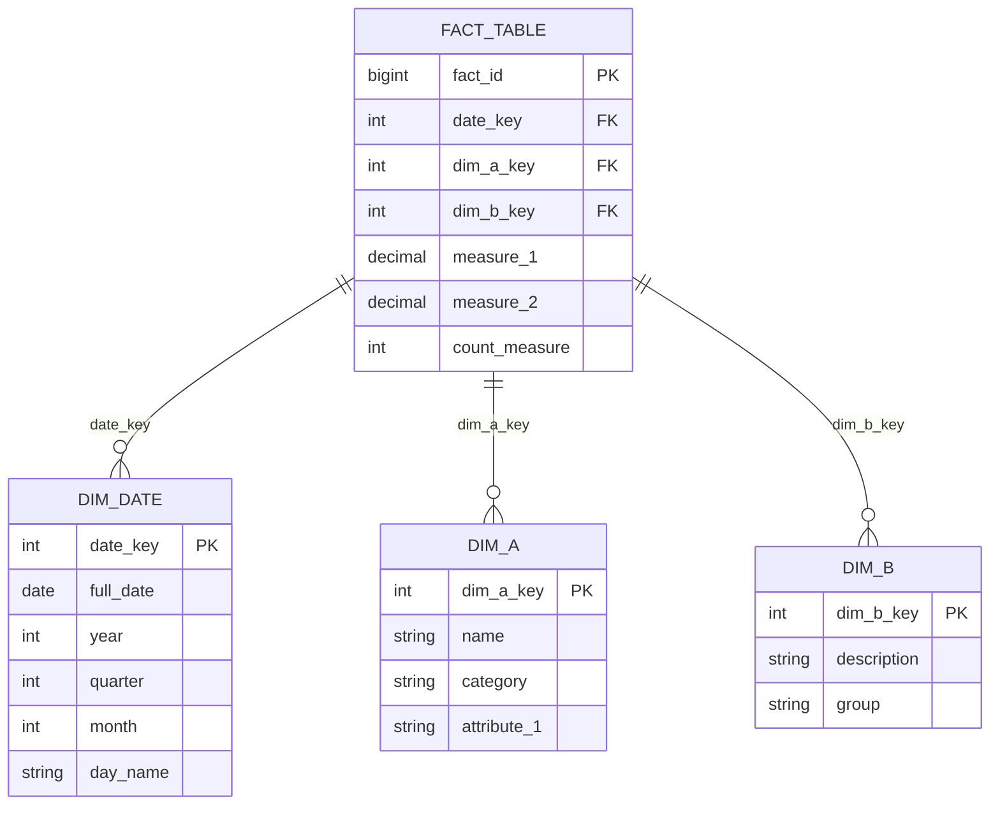
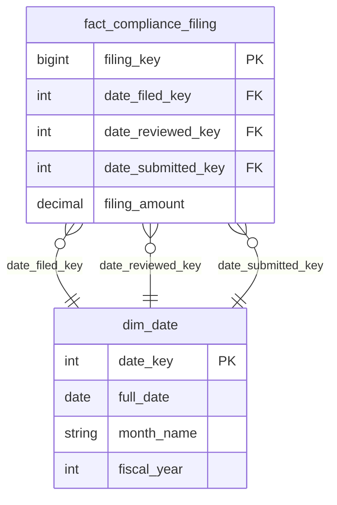
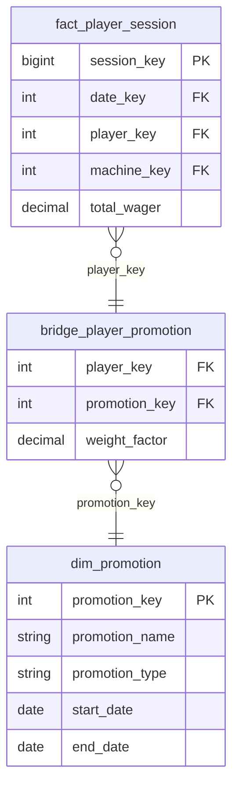
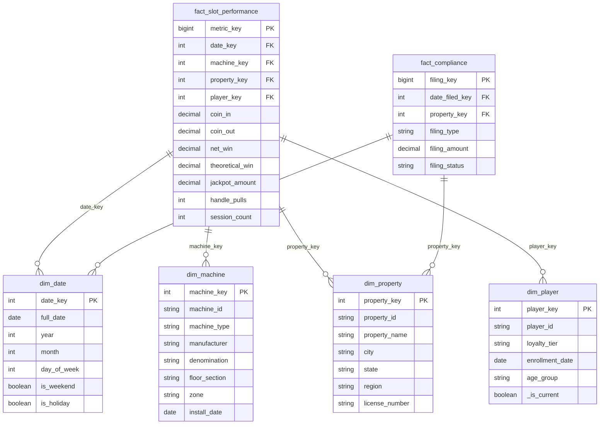
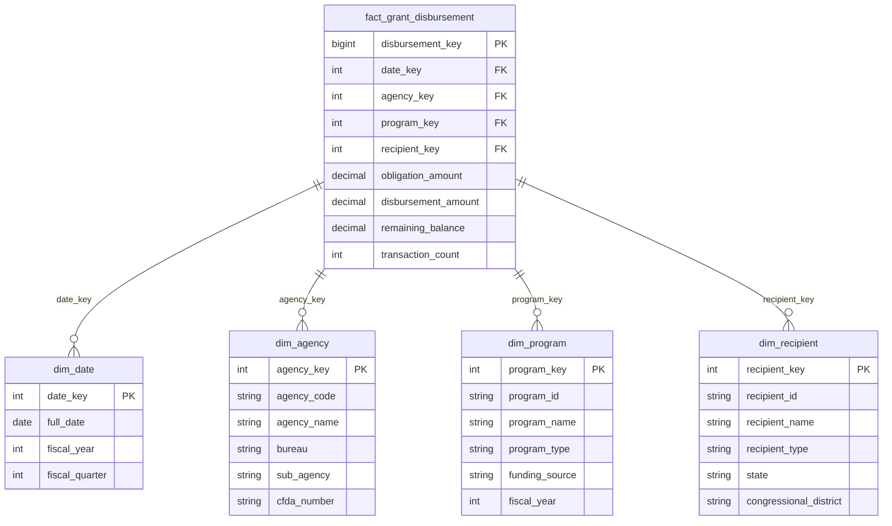

[Home](../index.md) > [Docs](../) > [Best Practices](./) > Data Modeling & Star Schema

# ⭐ Data Modeling & Star Schema Best Practices for Microsoft Fabric

<div align="center">

**Design Performant Dimensional Models Optimized for Direct Lake and Power BI**


</div>

---

**Last Updated:** `2026-04-21` | **Version:** 1.0.0

---

## 📑 Table of Contents

- [🎯 Overview](#-overview)
- [📐 Dimensional Modeling Principles](#-dimensional-modeling-principles)
- [📊 Fact Table Design](#-fact-table-design)
- [🏷️ Dimension Design](#️-dimension-design)
- [🔗 Advanced Dimension Patterns](#-advanced-dimension-patterns)
- [🌐 Conformed Dimensions](#-conformed-dimensions)
- [⚡ Direct Lake Optimization](#-direct-lake-optimization)
- [🎰 Casino Implementation](#-casino-implementation)
- [🏛️ Federal Implementation](#️-federal-implementation)
- [🚫 Anti-Patterns](#-anti-patterns)
- [📉 Limitations](#-limitations)
- [📚 References](#-references)

---

## 🎯 Overview

Dimensional modeling (star schema) is the foundational data modeling pattern for the Gold layer in Microsoft Fabric. A well-designed star schema maximizes Direct Lake performance, simplifies Power BI measures, and provides intuitive navigation for business users.

### Why Star Schema in Fabric?

| Benefit | Description |
|---------|-------------|
| **Direct Lake performance** | Narrow fact tables with integer keys load column segments efficiently |
| **DAX simplicity** | Relationships auto-resolve; no complex CALCULATE + FILTER chains |
| **Business readability** | Dimensions use business names; facts contain measures analysts understand |
| **Reusability** | Conformed dimensions serve multiple fact tables and subject areas |
| **Scalability** | Add new facts/dimensions without restructuring existing models |
| **Power BI compatibility** | Star schema is the recommended model for Power BI semantic models |

### Star Schema vs Snowflake in Fabric

| Aspect | Star Schema | Snowflake Schema |
|--------|-------------|-----------------|
| **Dimension normalization** | Denormalized (flat) | Normalized (multiple tables) |
| **Query performance** | Faster (fewer joins) | Slower (more joins) |
| **Direct Lake compatibility** | ✅ Optimal | ⚠️ Suboptimal (extra joins) |
| **Storage** | Slightly more (denormalized) | Slightly less | 
| **DAX complexity** | Simple relationships | Requires bridge logic |
| **Maintenance** | Easier (fewer tables) | Harder (more tables to update) |
| **Recommendation for Fabric** | ✅ **Always preferred** | ❌ Avoid unless required for extreme cardinality |



---

## 📐 Dimensional Modeling Principles

### The Four-Step Design Process


| Step | Question to Answer | Example (Slot Performance) |
|------|-------------------|---------------------------|
| **1. Business process** | What process are we measuring? | Slot machine play sessions |
| **2. Grain** | What does one row represent? | One machine, one day |
| **3. Dimensions** | How do users slice/filter? | Date, Machine, Property, Player |
| **4. Facts** | What are we measuring? | coin_in, coin_out, net_win, handle_pulls |

### Grain Definition Rules

The grain is the most critical decision. It determines what one row in the fact table represents.

| Rule | Description |
|------|-------------|
| **Atomic grain** | Prefer the finest level of detail available |
| **Single grain per fact** | Never mix grains in one fact table |
| **Document the grain** | Add a comment to every fact table defining the grain |
| **Grain drives dimensions** | Every dimension must be at or above the grain level |
| **Aggregate separately** | Pre-aggregated KPIs belong in separate fact tables |

```python
# Example: Grain documentation in table creation
# GRAIN: One row per machine per day per property
df_fact = (
    spark.table("lh_silver.slot_telemetry_cleansed")
    .groupBy("machine_id", "property_id",
             F.date_trunc("day", "event_timestamp").alias("metric_date"))
    .agg(
        F.sum("coin_in").alias("coin_in"),
        F.sum("coin_out").alias("coin_out"),
        F.sum("theoretical_win").alias("theoretical_win"),
        F.count("*").alias("event_count"),
        F.countDistinct("player_id").alias("unique_players"),
    )
)
```

---

## 📊 Fact Table Design

### Measure Types

| Type | Definition | Example | Aggregation |
|------|-----------|---------|-------------|
| **Additive** | Can be summed across all dimensions | coin_in, net_win, event_count | SUM always valid |
| **Semi-additive** | Can be summed across some dimensions, not time | account_balance, inventory_count | SUM across non-time; AVG/LAST over time |
| **Non-additive** | Cannot be summed across any dimension | hold_percentage, avg_session_minutes | Recalculate from components |

### Fact Table Patterns

```python
# Transaction fact: finest grain, additive measures
# GRAIN: One row per slot event (handle pull)
df_fact_slot_events = (
    spark.table("lh_silver.slot_telemetry_cleansed")
    .select(
        F.monotonically_increasing_id().alias("event_key"),
        F.col("date_key"),          # FK to dim_date
        F.col("machine_key"),       # FK to dim_machine
        F.col("property_key"),      # FK to dim_property
        F.col("player_key"),        # FK to dim_player
        F.col("coin_in"),           # Additive
        F.col("coin_out"),          # Additive
        F.col("jackpot_amount"),    # Additive
        F.col("theoretical_win"),   # Additive
    )
)

# Periodic snapshot fact: regular intervals, semi-additive measures
# GRAIN: One row per machine per day (end-of-day snapshot)
df_fact_daily_snapshot = (
    spark.table("lh_silver.slot_telemetry_cleansed")
    .groupBy("date_key", "machine_key", "property_key")
    .agg(
        F.sum("coin_in").alias("daily_coin_in"),         # Additive
        F.last("cumulative_meter").alias("meter_reading"), # Semi-additive
        F.avg("session_duration").alias("avg_session"),    # Non-additive
    )
)

# Accumulating snapshot fact: tracks process milestones
# GRAIN: One row per compliance filing (lifecycle tracking)
df_fact_compliance = (
    spark.table("lh_silver.ctr_filings_verified")
    .select(
        "filing_key",
        "date_filed_key",       # When filed
        "date_reviewed_key",    # When reviewed (nullable until reviewed)
        "date_submitted_key",   # When submitted to FinCEN (nullable)
        "filing_amount",        # Additive
        "filing_status",        # Degenerate dimension
    )
)
```

### Factless Fact Tables

Factless fact tables record events that have no measures — they simply capture the occurrence of a dimensional intersection.

```python
# Factless: Player presence on the floor (no monetary measure)
# GRAIN: One row per player per machine per hour of presence
df_fact_player_presence = (
    spark.table("lh_silver.player_activity_validated")
    .select(
        "date_key", "hour_key", "player_key", "machine_key", "property_key"
    )
)
# Use: COUNT(*) to answer "How many players were on floor section A at 9 PM?"
```

---

## 🏷️ Dimension Design

### Slowly Changing Dimensions (SCD)

| Type | Behavior | Use Case | Storage Impact |
|------|----------|----------|----------------|
| **SCD Type 1** | Overwrite old value | Correcting data errors, attributes where history is irrelevant | Lowest |
| **SCD Type 2** | Add new row, expire old row | Track full history (player tier changes, address moves) | Highest |
| **SCD Type 3** | Add new column for previous value | Track limited history (current + previous only) | Medium |

### SCD Type 2 Implementation

```python
# SCD Type 2: dim_player with full history tracking
from delta.tables import DeltaTable
from pyspark.sql import functions as F

def apply_scd2(spark, target_table: str, source_df, key_col: str, tracked_cols: list):
    """Generic SCD Type 2 merge for any dimension."""
    target = DeltaTable.forName(spark, target_table)

    # Find changed records
    df_changes = (
        source_df.alias("src")
        .join(
            spark.table(target_table).filter("_is_current = true").alias("tgt"),
            f"src.{key_col} = tgt.{key_col}", "inner"
        )
        .filter(
            " OR ".join([f"src.{c} != tgt.{c}" for c in tracked_cols])
        )
    )

    if df_changes.count() == 0:
        return  # No changes

    # Expire current records
    (
        target.alias("tgt")
        .merge(df_changes.select(f"src.{key_col}").alias("chg"),
               f"tgt.{key_col} = chg.{key_col} AND tgt._is_current = true")
        .whenMatchedUpdate(set={
            "_is_current": "false",
            "_effective_end": "current_timestamp()",
        })
        .execute()
    )

    # Insert new current records
    df_new = (
        source_df.alias("src")
        .join(df_changes.select(f"src.{key_col}").distinct().alias("chg"),
              f"src.{key_col} = chg.{key_col}", "inner")
        .withColumn("_surrogate_key", F.monotonically_increasing_id())
        .withColumn("_is_current", F.lit(True))
        .withColumn("_effective_start", F.current_timestamp())
        .withColumn("_effective_end", F.lit(None).cast("timestamp"))
    )

    df_new.write.format("delta").mode("append").saveAsTable(target_table)
```

### SCD Type 2 Schema

```sql
CREATE TABLE lh_gold.dim_player (
    player_key      BIGINT,         -- Surrogate key
    player_id       STRING,         -- Natural/business key
    player_name     STRING,
    loyalty_tier    STRING,         -- Tracked: SCD2 triggers on change
    email_domain    STRING,
    age_group       STRING,
    enrollment_date DATE,
    property_id     STRING,         -- Home property
    _is_current     BOOLEAN,        -- Current row flag
    _effective_start TIMESTAMP,     -- Row validity start
    _effective_end  TIMESTAMP       -- Row validity end (NULL = current)
) USING DELTA;
```

### Role-Playing Dimensions

A single dimension table used multiple times in a fact table via different foreign keys.



> **Power BI Note:** In Direct Lake semantic models, create three inactive relationships and use `USERELATIONSHIP()` in DAX measures to activate the desired date role.

```dax
// DAX: Use role-playing date dimension
Filed Count = CALCULATE(
    COUNT(fact_compliance_filing[filing_key]),
    USERELATIONSHIP(fact_compliance_filing[date_filed_key], dim_date[date_key])
)

Submitted Count = CALCULATE(
    COUNT(fact_compliance_filing[filing_key]),
    USERELATIONSHIP(fact_compliance_filing[date_submitted_key], dim_date[date_key])
)
```

---

## 🔗 Advanced Dimension Patterns

### Junk Dimensions

Combine low-cardinality flags and indicators into a single dimension instead of polluting the fact table.

```python
# Junk dimension: Combine boolean/flag attributes
df_junk = (
    spark.table("lh_silver.slot_telemetry_cleansed")
    .select("is_jackpot", "is_bonus_round", "is_loyalty_play", "denomination_type")
    .distinct()
    .withColumn("junk_key", F.monotonically_increasing_id())
)

df_junk.write.format("delta").mode("overwrite").saveAsTable("lh_gold.dim_play_attributes")
# Result: ~50 rows instead of 4 boolean columns on a billion-row fact table
```

### Degenerate Dimensions

Dimension attributes stored directly on the fact table (no separate dimension table needed).

| Example | Why Degenerate |
|---------|---------------|
| `transaction_id` | Unique per transaction; no attributes to store |
| `filing_number` | Reference number with no additional attributes |
| `batch_id` | Operational metadata; no business attributes |

### Bridge Tables (Many-to-Many)



```python
# Bridge table: Player can have multiple active promotions
df_bridge = (
    spark.table("lh_silver.player_promotions_validated")
    .select("player_key", "promotion_key")
    .withColumn("weight_factor",
        F.lit(1.0) / F.count("*").over(Window.partitionBy("player_key"))
    )
)
df_bridge.write.format("delta").mode("overwrite").saveAsTable("lh_gold.bridge_player_promotion")
```

---

## 🌐 Conformed Dimensions

Conformed dimensions are shared across multiple fact tables and subject areas, ensuring consistent filtering and aggregation.

### Core Conformed Dimensions

| Dimension | Shared Across | Key Attributes |
|-----------|---------------|----------------|
| `dim_date` | All fact tables | full_date, year, quarter, month, fiscal_year, is_weekend, is_holiday |
| `dim_property` | Casino facts, compliance facts | property_id, property_name, city, state, region |
| `dim_player` | Session facts, compliance facts, marketing facts | player_id, loyalty_tier, enrollment_date |
| `dim_agency` | All federal fact tables | agency_code, agency_name, bureau, sub_agency |

### Date Dimension Generator

```python
# Generate dim_date: covers 10 years with fiscal calendar
from datetime import date, timedelta

def generate_dim_date(start_year: int = 2020, end_year: int = 2030) -> list[dict]:
    """Generate a comprehensive date dimension."""
    rows = []
    d = date(start_year, 1, 1)
    key = 1
    while d <= date(end_year, 12, 31):
        fiscal_year = d.year if d.month >= 10 else d.year  # Federal: Oct-Sep FY
        rows.append({
            "date_key": key,
            "full_date": d,
            "year": d.year,
            "quarter": (d.month - 1) // 3 + 1,
            "month": d.month,
            "month_name": d.strftime("%B"),
            "day_of_week": d.isoweekday(),
            "day_name": d.strftime("%A"),
            "is_weekend": d.isoweekday() >= 6,
            "is_holiday": False,  # Populate from holiday calendar
            "fiscal_year": fiscal_year,
            "fiscal_quarter": ((d.month - 10) % 12) // 3 + 1,
            "week_of_year": d.isocalendar()[1],
        })
        key += 1
        d += timedelta(days=1)
    return rows
```

---

## ⚡ Direct Lake Optimization

Designing star schemas specifically for Direct Lake performance in Fabric.

### Optimization Guidelines

| Guideline | Rationale |
|-----------|-----------|
| **Use integer surrogate keys** | Integer keys compress better than string keys in columnar format |
| **Keep fact tables narrow** | Fewer columns = faster column segment loading by Direct Lake |
| **Enable V-Order** | Fabric's columnar optimization for Direct Lake read patterns |
| **Avoid calculated columns** | Complex DAX calculated columns force fallback to DirectQuery |
| **Flatten nested types** | Direct Lake does not support STRUCT, ARRAY, or MAP types |
| **Pre-aggregate when possible** | Reduces row count; Direct Lake scans fewer segments |
| **Partition Gold tables** | Partition by date for time-range filtering efficiency |

### V-Order Configuration

```python
# Enable V-Order for all Gold table writes
spark.conf.set("spark.sql.parquet.vorder.enabled", "true")

# Write fact table with V-Order
(
    df_fact.write
    .format("delta")
    .mode("overwrite")
    .option("replaceWhere", f"metric_date = '{target_date}'")
    .saveAsTable("lh_gold.fact_slot_metrics")
)
```

### Direct Lake Fallback Prevention

| Fallback Trigger | Prevention |
|-----------------|------------|
| Complex calculated columns | Pre-compute in Spark; store as physical columns |
| Unsupported DAX functions | Use supported subset; check compatibility list |
| Row-level security with complex rules | Simplify RLS predicates |
| Too many columns (>500) | Split into multiple fact/dimension tables |
| Large cardinality columns | Move to dimension; use integer FK |

---

## 🎰 Casino Implementation

### Casino Star Schema



### Casino KPI Measures (DAX)

```dax
// Hold Percentage (non-additive — must recalculate from components)
Hold % = DIVIDE(
    SUM(fact_slot_performance[coin_in]) - SUM(fact_slot_performance[coin_out]),
    SUM(fact_slot_performance[coin_in]),
    0
)

// Win Per Unit Per Day (WPUPD)
WPUPD = DIVIDE(
    SUM(fact_slot_performance[net_win]),
    DISTINCTCOUNT(fact_slot_performance[machine_key]) *
        DISTINCTCOUNT(fact_slot_performance[date_key]),
    0
)

// Compliance: CTR Filing Rate
CTR Filing Rate = DIVIDE(
    CALCULATE(COUNT(fact_compliance[filing_key]),
              fact_compliance[filing_type] = "CTR"),
    CALCULATE(COUNT(fact_slot_performance[metric_key]),
              fact_slot_performance[coin_in] >= 10000),
    0
)
```

---

## 🏛️ Federal Implementation

### Federal Star Schema: Grant Disbursement



### Agency-Specific Fact Tables

| Agency | Fact Table | Grain | Key Measures |
|--------|-----------|-------|-------------|
| **USDA** | fact_crop_yield | One crop, one state, one year | yield_per_acre, production_tons, harvested_acres |
| **SBA** | fact_loan_approval | One loan application | loan_amount, approval_amount, jobs_supported |
| **NOAA** | fact_weather_observation | One station, one hour | temperature, precipitation, wind_speed |
| **EPA** | fact_air_quality | One monitor, one day | aqi, pm25_concentration, ozone_ppm |
| **DOI** | fact_recreation_visit | One facility, one month | visitor_count, revenue, capacity_utilization |

### Cross-Agency Conformed Dimensions

```python
# dim_agency: Conformed across all federal fact tables
df_dim_agency = spark.createDataFrame([
    (1, "USDA", "Dept of Agriculture", "NASS", "National Agricultural Statistics Service", "10.001"),
    (2, "SBA",  "Small Business Administration", "ODA", "Office of Disaster Assistance", "59.008"),
    (3, "NOAA", "Natl Oceanic & Atmospheric Admin", "NWS", "National Weather Service", "11.467"),
    (4, "EPA",  "Environmental Protection Agency", "OAR", "Office of Air and Radiation", "66.034"),
    (5, "DOI",  "Dept of the Interior", "NPS", "National Park Service", "15.916"),
], ["agency_key", "agency_code", "agency_name", "bureau", "sub_agency", "cfda_number"])

df_dim_agency.write.format("delta").mode("overwrite").saveAsTable("lh_gold.dim_agency")
```

---

## 🚫 Anti-Patterns

### Anti-Pattern 1: One Big Table (OBT)

**Problem:** Flattening all dimensions into the fact table to create a single wide table.

**Impact:** 200+ columns; slow Direct Lake loads; impossible to maintain conformed dimensions.

**Fix:** Use proper star schema with narrow fact tables and separate dimensions.

```
❌ fact_everything (machine_name, machine_type, floor_section, property_name, city, state, ...)
✅ fact_slot_metrics (machine_key, property_key, ...) + dim_machine + dim_property
```

### Anti-Pattern 2: Snowflaking Dimensions

**Problem:** Normalizing dimension tables into sub-dimensions (e.g., dim_machine → dim_manufacturer → dim_country).

**Impact:** Extra joins degrade Direct Lake and DAX performance.

**Fix:** Denormalize into flat dimensions. Storage is cheap; query performance is valuable.

### Anti-Pattern 3: String Keys in Fact Tables

**Problem:** Using `machine_id VARCHAR(50)` as the FK instead of `machine_key INT`.

**Impact:** String keys consume 5–10x more storage in columnar format; slower joins.

**Fix:** Always use integer surrogate keys in fact tables.

### Anti-Pattern 4: Mixed Grain

**Problem:** Storing daily and monthly records in the same fact table.

**Impact:** Aggregations produce incorrect results; SUM double-counts.

**Fix:** Separate fact tables per grain: `fact_daily_metrics` and `fact_monthly_summary`.

### Anti-Pattern 5: Calculated Columns for Complex Logic

**Problem:** Adding DAX calculated columns with complex business logic to Direct Lake models.

**Impact:** Forces Direct Lake fallback to DirectQuery mode; performance degrades drastically.

**Fix:** Pre-compute all complex metrics in PySpark and store as physical Delta columns.

### Anti-Pattern Summary

| Anti-Pattern | Impact | Fix |
|-------------|--------|-----|
| One Big Table | Slow Direct Lake, unmaintainable | Star schema |
| Snowflaking | Extra joins, slow DAX | Denormalize dimensions |
| String keys in facts | Storage waste, slow joins | Integer surrogate keys |
| Mixed grain | Incorrect aggregations | Separate fact tables |
| Complex calculated columns | Direct Lake fallback | Pre-compute in Spark |

---

## 📉 Limitations

| Limitation | Impact | Workaround |
|-----------|--------|------------|
| Direct Lake max columns per table | ~500 columns before degradation | Split wide tables into star schema |
| No STRUCT/ARRAY in Direct Lake | Cannot use nested types in Gold | Flatten in Silver → Gold |
| SCD Type 2 increases row count | Historical rows inflate dimension size | Archive expired rows periodically |
| Bridge tables add DAX complexity | Many-to-many requires `CROSSFILTER` or weighting | Document patterns; keep bridges small |
| V-Order write overhead | Slightly slower writes (~5–10%) | Only enable for Gold tables consumed by Power BI |
| No auto-surrogate key generation | Must generate surrogate keys manually | Use `monotonically_increasing_id()` or hash |
| Liquid clustering preview only | Not GA for production use | Use Z-ORDER until GA |

---

## 📚 References

### Microsoft Documentation

- [Star schema design guidance](https://learn.microsoft.com/power-bi/guidance/star-schema)
- [Direct Lake overview](https://learn.microsoft.com/fabric/get-started/direct-lake-overview)
- [Direct Lake default Power BI semantic model](https://learn.microsoft.com/fabric/data-warehouse/semantic-models)
- [V-Order optimization](https://learn.microsoft.com/fabric/data-engineering/delta-optimization-and-v-order)
- [Relationships in Power BI](https://learn.microsoft.com/power-bi/transform-model/desktop-relationships-understand)
- [Role-playing dimensions](https://learn.microsoft.com/power-bi/guidance/star-schema#role-playing-dimensions)
- [DAX USERELATIONSHIP](https://learn.microsoft.com/dax/userelationship-function-dax)
- [Lakehouse schemas](https://learn.microsoft.com/fabric/data-engineering/lakehouse-schemas)

### Data Modeling

- [Kimball Group dimensional modeling techniques](https://www.kimballgroup.com/data-warehouse-business-intelligence-resources/kimball-techniques/dimensional-modeling-techniques/)
- [Delta Lake best practices](https://docs.delta.io/latest/best-practices.html)
- [Slowly changing dimensions](https://learn.microsoft.com/power-bi/guidance/star-schema#slowly-changing-dimensions)

### Compliance

- [NIGC MICS data retention](https://www.nigc.gov/compliance/minimum-internal-control-standards)
- [DATA Act (Federal spending transparency)](https://www.usaspending.gov/)
- [OMB Circular A-11 (Federal program reporting)](https://www.whitehouse.gov/omb/information-for-agencies/circulars/)

---

## Related Documents

- [Medallion Architecture Deep Dive](./medallion-architecture-deep-dive.md) — Bronze/Silver/Gold layer patterns
- [Performance & Parallelism](./performance-parallelism.md) — Spark and query optimization
- [Data Governance Deep Dive](./data-governance-deep-dive.md) — Classification, sensitivity labels, RLS
- [Direct Lake](../features/direct-lake.md) — Direct Lake connectivity patterns
- [Capacity Planning & Cost Optimization](./capacity-planning-cost-optimization.md) — SKU sizing for model workloads

---

## Document Metadata

| Field | Value |
|-------|-------|
| **Title** | Data Modeling & Star Schema Best Practices |
| **Category** | Best Practices — Data Modeling |
| **Author** | Supercharge Microsoft Fabric POC Team |
| **Version** | 1.0.0 |
| **Created** | 2026-04-21 |
| **Last Updated** | 2026-04-21 |
| **Applicable SKUs** | F2–F2048 |
| **Industries** | Casino/Gaming, Federal Government |

---

[Back to Best Practices Index](./README.md) | [Back to Documentation](../index.md)
