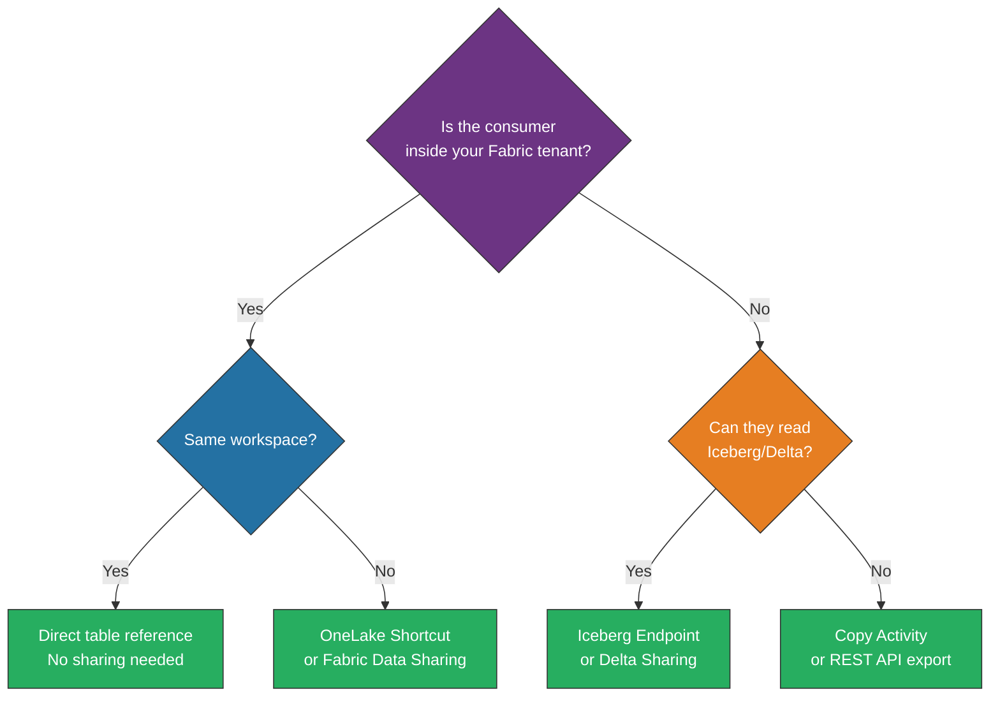
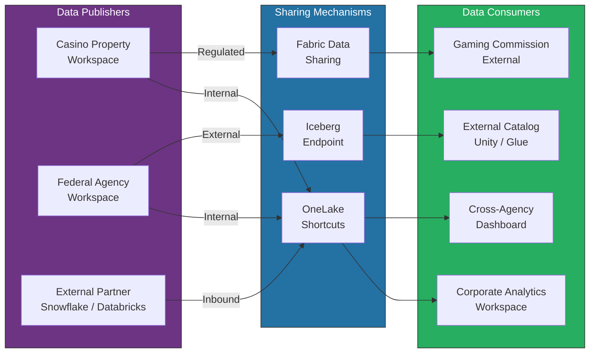
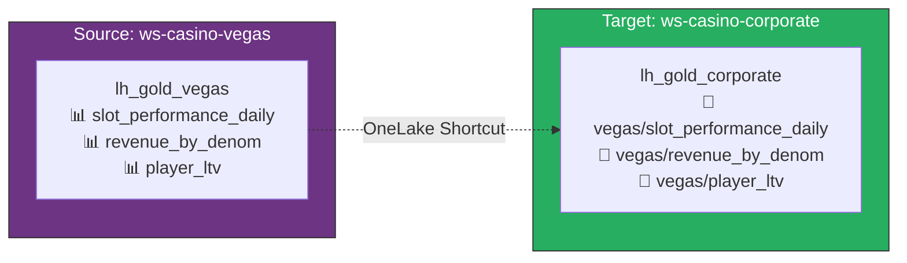
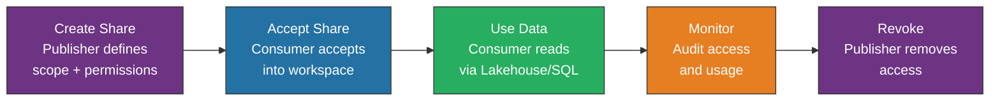
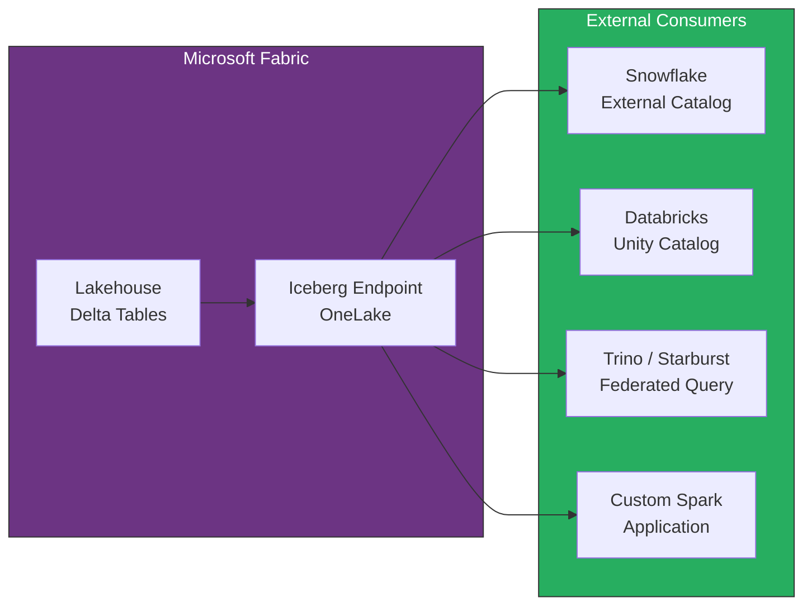
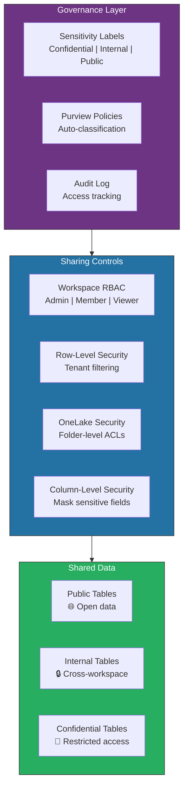
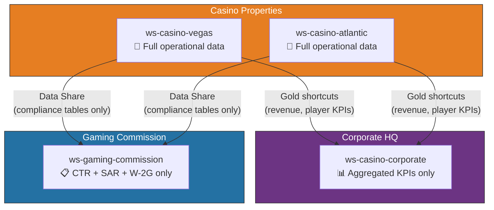
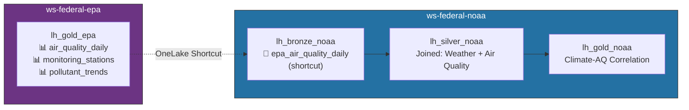

[Home](../index.md) > [Docs](../) > [Best Practices](./) > Data Sharing & Federation

# 🔗 Data Sharing & Federation for Microsoft Fabric

<div align="center" markdown>

**Cross-Workspace, Cross-Organization, and Cross-Cloud Data Access Patterns**


</div>

---

**Last Updated:** `2026-04-13` | **Version:** 1.0.0

---

## 📑 Table of Contents

- [🎯 Overview](#-overview)
- [🏗️ Architecture](#️-architecture)
- [🔗 Shortcut Patterns](#-shortcut-patterns)
- [📤 Fabric Data Sharing](#-fabric-data-sharing)
- [🌐 External Federation](#-external-federation)
- [🔒 Security & Governance](#-security--governance)
- [🎰 Casino Industry Sharing](#-casino-industry-sharing)
- [🏛️ Federal Agency Sharing](#️-federal-agency-sharing)
- [📊 Monitoring & Auditing](#-monitoring--auditing)
- [⚠️ Limitations](#️-limitations)
- [📚 References](#-references)

---

## 🎯 Overview

Data sharing and federation in Microsoft Fabric enables organizations to provide governed access to data across workspace, organizational, and cloud boundaries without copying data. This guide covers OneLake shortcuts, Fabric data sharing, Iceberg endpoint federation, and external catalog integration patterns for casino gaming and federal agency workloads.

### Sharing vs. Federation vs. Copying

| Approach | Data Movement | Governance | Latency | Cost |
|----------|--------------|------------|---------|------|
| **OneLake Shortcuts** | None (zero-copy) | Source workspace controls access | Real-time | Lowest |
| **Fabric Data Sharing** | None (in-place) | Shared via permissions | Real-time | Low |
| **Iceberg Endpoint** | None (external read) | External catalog governs | Near-real-time | Low |
| **Copy Activity** | Full copy | Consumer owns copy | Batch latency | Highest |
| **Mirroring** | CDC replication | Source changes propagate | Near-real-time | Medium |

### Decision Framework



---

## 🏗️ Architecture

### End-to-End Data Sharing Architecture



### Sharing Layer Components

| Component | Role | Scope |
|-----------|------|-------|
| **OneLake** | Unified storage layer for all Fabric items | Tenant-wide |
| **Shortcuts** | Virtual pointers to data in OneLake or external storage | Workspace-to-workspace, external clouds |
| **Fabric Data Sharing** | In-place sharing with granular permissions | Cross-workspace within tenant |
| **Iceberg Endpoint** | Open table format endpoint for external consumers | Cross-platform federation |
| **SQL Analytics Endpoint** | T-SQL read access to Lakehouse tables | BI tools, reporting |

---

## 🔗 Shortcut Patterns

### Shortcut Types

| Shortcut Type | Source | Target | Data Movement | Authentication |
|--------------|--------|--------|---------------|----------------|
| **Internal (OneLake)** | Another Lakehouse in the same tenant | Current Lakehouse | None | Workspace RBAC |
| **ADLS Gen2** | Azure Data Lake Storage Gen2 | Current Lakehouse | None | Service principal or Workspace identity |
| **Amazon S3** | AWS S3 bucket | Current Lakehouse | None | IAM access key |
| **Google Cloud Storage** | GCS bucket | Current Lakehouse | None | Service account key |
| **Dataverse** | Dataverse tables | Current Lakehouse | None | Entra ID |

### Pattern 1: Internal OneLake Shortcut

Share Gold-layer tables from a tenant workspace to a corporate analytics workspace without copying data.



**Creating an internal shortcut (REST API):**

```python
import requests

def create_internal_shortcut(
    target_workspace_id: str,
    target_lakehouse_id: str,
    shortcut_name: str,
    source_workspace_id: str,
    source_lakehouse_id: str,
    source_table_path: str,
    headers: dict
) -> dict:
    """Create an internal OneLake shortcut."""
    url = (
        f"https://api.fabric.microsoft.com/v1"
        f"/workspaces/{target_workspace_id}"
        f"/items/{target_lakehouse_id}"
        f"/shortcuts"
    )

    payload = {
        "name": shortcut_name,
        "path": "Tables",
        "target": {
            "oneLake": {
                "workspaceId": source_workspace_id,
                "itemId": source_lakehouse_id,
                "path": f"Tables/{source_table_path}"
            }
        }
    }

    response = requests.post(url, headers=headers, json=payload)
    response.raise_for_status()
    return response.json()

# Example: Share Vegas Gold tables to Corporate workspace
create_internal_shortcut(
    target_workspace_id="ws-casino-corporate-id",
    target_lakehouse_id="lh-gold-corporate-id",
    shortcut_name="vegas_slot_performance_daily",
    source_workspace_id="ws-casino-vegas-id",
    source_lakehouse_id="lh-gold-vegas-id",
    source_table_path="slot_performance_daily",
    headers=get_auth_headers()
)
```

### Pattern 2: ADLS Gen2 Shortcut

Read data from an external Azure Data Lake Storage account without copying.

```python
def create_adls_shortcut(
    workspace_id: str,
    lakehouse_id: str,
    shortcut_name: str,
    adls_account: str,
    container: str,
    path: str,
    connection_id: str,
    headers: dict
) -> dict:
    """Create an ADLS Gen2 shortcut."""
    url = (
        f"https://api.fabric.microsoft.com/v1"
        f"/workspaces/{workspace_id}"
        f"/items/{lakehouse_id}"
        f"/shortcuts"
    )

    payload = {
        "name": shortcut_name,
        "path": "Tables",
        "target": {
            "adlsGen2": {
                "location": f"https://{adls_account}.dfs.core.windows.net",
                "subpath": f"/{container}/{path}",
                "connectionId": connection_id
            }
        }
    }

    response = requests.post(url, headers=headers, json=payload)
    response.raise_for_status()
    return response.json()

# Example: Shortcut to USDA open data in ADLS
create_adls_shortcut(
    workspace_id="ws-federal-usda-id",
    lakehouse_id="lh-bronze-usda-id",
    shortcut_name="usda_crop_production_raw",
    adls_account="stfederalopendata",
    container="usda",
    path="crop_production/delta",
    connection_id="conn-usda-adls-id",
    headers=get_auth_headers()
)
```

### Pattern 3: Cross-Cloud Shortcuts (S3 / GCS)

```python
# Amazon S3 shortcut for external partner data
def create_s3_shortcut(
    workspace_id: str,
    lakehouse_id: str,
    shortcut_name: str,
    s3_bucket: str,
    s3_path: str,
    connection_id: str,
    headers: dict
) -> dict:
    """Create an S3 shortcut."""
    payload = {
        "name": shortcut_name,
        "path": "Tables",
        "target": {
            "amazonS3": {
                "location": f"https://{s3_bucket}.s3.amazonaws.com",
                "subpath": f"/{s3_path}",
                "connectionId": connection_id
            }
        }
    }

    url = (
        f"https://api.fabric.microsoft.com/v1"
        f"/workspaces/{workspace_id}"
        f"/items/{lakehouse_id}"
        f"/shortcuts"
    )

    response = requests.post(url, headers=headers, json=payload)
    response.raise_for_status()
    return response.json()

# Example: Shortcut to partner gaming data in S3
create_s3_shortcut(
    workspace_id="ws-casino-vegas-id",
    lakehouse_id="lh-bronze-vegas-id",
    shortcut_name="partner_loyalty_data",
    s3_bucket="partner-gaming-data-prod",
    s3_path="loyalty/delta",
    connection_id="conn-partner-s3-id",
    headers=get_auth_headers()
)
```

> **💡 Tip:** Cross-cloud shortcuts (S3, GCS) incur cloud egress charges from the source cloud provider. Factor this into your cost model for high-volume data access patterns.

### Shortcut Transformation Pattern

Shortcuts point to raw data, but consumers need transformed views. Combine shortcuts with PySpark notebooks for "shortcut transformations."

```python
# Databricks notebook source
# MAGIC %md
# MAGIC # Shortcut Transformation: USDA Crop Production
# MAGIC Read from ADLS shortcut, transform, write to Silver Lakehouse

# Read from shortcut (Bronze)
raw_df = spark.read.format("delta").table("bronze.usda_crop_production_raw")

# Transform
silver_df = (
    raw_df
    .filter(F.col("year") >= 2020)
    .withColumn("yield_per_acre", F.col("production") / F.col("area_harvested"))
    .withColumn("_ingested_at", F.current_timestamp())
    .dropDuplicates(["state_fips", "commodity_code", "year"])
)

# Write to Silver (not a shortcut — actual Delta table)
silver_df.write.format("delta").mode("overwrite").saveAsTable("silver.usda_crop_production")
```

---

## 📤 Fabric Data Sharing

### What is Fabric Data Sharing?

Fabric Data Sharing enables in-place data sharing between workspaces within the same Fabric tenant. Unlike shortcuts, sharing creates a governed sharing contract with explicit permissions.

### Sharing vs. Shortcuts

| Feature | Shortcuts | Data Sharing |
|---------|-----------|-------------|
| **Mechanism** | Virtual pointer in OneLake | Sharing contract with permissions |
| **Governance** | Source workspace RBAC | Explicit share grants + audit trail |
| **Discoverability** | Must know source path | Shared items appear in consumer workspace |
| **Permissions** | Inherited from source workspace membership | Granular read/write grants |
| **Audit** | Standard OneLake access logs | Dedicated sharing audit events |
| **Cross-tenant** | Not supported | Future support planned |

### Creating a Data Share

```python
def create_data_share(
    source_workspace_id: str,
    source_item_id: str,
    target_workspace_id: str,
    share_name: str,
    permissions: list[str],
    headers: dict
) -> dict:
    """Create a Fabric Data Share."""
    url = (
        f"https://api.fabric.microsoft.com/v1"
        f"/workspaces/{source_workspace_id}"
        f"/items/{source_item_id}"
        f"/shares"
    )

    payload = {
        "displayName": share_name,
        "targetWorkspace": {
            "workspaceId": target_workspace_id
        },
        "permissions": permissions  # e.g., ["Read", "ReadAll"]
    }

    response = requests.post(url, headers=headers, json=payload)
    response.raise_for_status()
    return response.json()

# Share compliance data with gaming commission workspace
create_data_share(
    source_workspace_id="ws-casino-vegas-id",
    source_item_id="lh-gold-vegas-compliance-id",
    target_workspace_id="ws-gaming-commission-id",
    share_name="vegas-compliance-data",
    permissions=["Read"],
    headers=get_auth_headers()
)
```

### Share Management Lifecycle



### Permission Scoping

| Permission | Access Level | Use Case |
|-----------|-------------|----------|
| **Read** | Read specific tables in the share | General analytics consumers |
| **ReadAll** | Read all tables in the shared item | Data engineers needing full access |
| **Write** | Write back to shared tables | Bi-directional data exchange |

> **⚠️ Important:** Start with the minimum permission level. Use **Read** with explicit table scoping for most consumers. Only grant **ReadAll** when the consumer needs access to all current and future tables.

---

## 🌐 External Federation

### Iceberg Endpoint

Fabric's OneLake Iceberg endpoint exposes Lakehouse Delta tables as Iceberg-compatible tables, enabling external engines (Spark, Trino, Snowflake, Databricks) to read Fabric data without copying.



**Iceberg endpoint URL format:**

```
https://onelake.dfs.fabric.microsoft.com/{workspace_id}/{lakehouse_id}/Tables/{table_name}
```

**Reading from Databricks Unity Catalog:**

```python
# In Databricks: read Fabric Lakehouse table via Iceberg endpoint
spark.read.format("iceberg").load(
    "https://onelake.dfs.fabric.microsoft.com/"
    "ws-federal-usda-id/lh-gold-usda-id/"
    "Tables/crop_production_summary"
)
```

**Configuring Snowflake External Catalog:**

```sql
-- In Snowflake: create external catalog pointing to Fabric Iceberg endpoint
CREATE OR REPLACE CATALOG INTEGRATION fabric_catalog
    CATALOG_SOURCE = ICEBERG_REST
    TABLE_FORMAT = ICEBERG
    CATALOG_URI = 'https://onelake.dfs.fabric.microsoft.com/<workspace_id>/<lakehouse_id>'
    WAREHOUSE = 'COMPUTE_WH'
    ENABLED = TRUE;

-- Query Fabric data from Snowflake
SELECT * FROM fabric_catalog.gold.slot_performance_daily
WHERE gaming_date >= '2026-01-01';
```

### External Catalog Integration

| External Catalog | Integration Method | Authentication |
|-----------------|-------------------|----------------|
| **Databricks Unity Catalog** | Iceberg REST Catalog | OAuth / Service principal |
| **AWS Glue** | Iceberg endpoint + IAM | Cross-cloud IAM federation |
| **Snowflake** | External catalog integration | OAuth / Service principal |
| **Trino / Starburst** | Iceberg connector | Bearer token |
| **Apache Hive Metastore** | Iceberg endpoint | Kerberos / OAuth |

### Delta Sharing (Outbound)

For sharing Fabric data with external partners who support the Delta Sharing protocol.

```python
# Configure Delta Sharing provider in Fabric
delta_sharing_config = {
    "provider": {
        "name": "casino-partner-share",
        "sharing_type": "OPEN",  # or "MANAGED" for Databricks-to-Databricks
        "authentication": "bearer_token",
        "tables": [
            {
                "schema": "gold",
                "name": "slot_performance_daily",
                "partitions": ["gaming_date"],
                "history_sharing": False  # Don't share historical versions
            },
            {
                "schema": "gold",
                "name": "revenue_summary_monthly",
                "partitions": ["report_month"],
                "history_sharing": False
            }
        ]
    },
    "recipients": [
        {
            "name": "gaming-commission",
            "token_lifetime_seconds": 86400,
            "allowed_tables": ["slot_performance_daily"]
        },
        {
            "name": "partner-analytics",
            "token_lifetime_seconds": 3600,
            "allowed_tables": ["revenue_summary_monthly"]
        }
    ]
}
```

---

## 🔒 Security & Governance

### Data Sharing Security Model



### Sensitivity Label Enforcement

| Label | Sharing Allowed | External Sharing | Iceberg Endpoint |
|-------|----------------|-----------------|-----------------|
| **Public** | ✅ Any workspace | ✅ Allowed | ✅ Enabled |
| **Internal** | ✅ Same domain only | ❌ Blocked | ⚠️ Requires approval |
| **Confidential** | ⚠️ Named workspaces only | ❌ Blocked | ❌ Disabled |
| **Highly Confidential** | ❌ No sharing | ❌ Blocked | ❌ Disabled |

### Data Masking for Shared Data

```sql
-- Dynamic data masking on shared tables
-- Consumer sees masked PII, publisher sees full data

CREATE TABLE dbo.shared_player_profiles (
    player_id       INT             NOT NULL,
    first_name      VARCHAR(50)     MASKED WITH (FUNCTION = 'partial(1, "XXX", 0)'),
    last_name       VARCHAR(50)     MASKED WITH (FUNCTION = 'partial(1, "XXX", 0)'),
    email           VARCHAR(100)    MASKED WITH (FUNCTION = 'email()'),
    ssn_hash        VARCHAR(64)     MASKED WITH (FUNCTION = 'default()'),
    tier_status     VARCHAR(20),    -- Not masked: safe to share
    lifetime_value  DECIMAL(12,2)   -- Not masked: aggregate metric
);

-- Grant unmask to specific principals
GRANT UNMASK ON dbo.shared_player_profiles TO [sg-casino-compliance-officers];
```

---

## 🎰 Casino Industry Sharing

### Scenario: Multi-Property Revenue Sharing with Gaming Commission

A multi-property casino operator must share regulated compliance data with the state gaming commission while sharing operational KPIs with corporate headquarters.



**Compliance data sharing configuration:**

```python
commission_share_config = {
    "share_name": "vegas-gaming-commission-compliance",
    "source_workspace": "ws-casino-vegas-prod",
    "source_lakehouse": "lh_gold_vegas",
    "shared_tables": [
        {
            "table": "ctr_filings",
            "description": "Currency Transaction Reports (>$10,000)",
            "columns_included": [
                "filing_id", "filing_date", "transaction_amount",
                "patron_name_masked", "property_code", "status"
            ],
            "columns_excluded": [
                "patron_ssn", "patron_address", "internal_notes"
            ],
            "refresh_frequency": "daily"
        },
        {
            "table": "sar_alerts",
            "description": "Suspicious Activity Report alerts",
            "columns_included": [
                "alert_id", "alert_date", "alert_type",
                "transaction_pattern", "amount_range", "status"
            ],
            "columns_excluded": [
                "patron_id", "investigation_notes", "officer_id"
            ],
            "refresh_frequency": "daily"
        },
        {
            "table": "w2g_records",
            "description": "W-2G jackpot records (≥$1,200 slots)",
            "columns_included": [
                "record_id", "jackpot_date", "jackpot_amount",
                "game_type", "machine_id", "property_code"
            ],
            "columns_excluded": [
                "patron_ssn", "patron_tin", "patron_address"
            ],
            "refresh_frequency": "daily"
        }
    ],
    "access_controls": {
        "allowed_principals": ["sg-gaming-commission-auditors"],
        "sensitivity_label": "Confidential",
        "audit_all_access": True,
        "expiration_days": 365  # Annual renewal required
    }
}
```

---

## 🏛️ Federal Agency Sharing

### Scenario 1: EPA → NOAA Cross-Agency Data Sharing via Shortcuts

EPA shares air quality monitoring data with NOAA for climate correlation analysis using OneLake shortcuts.



**Implementation:**

```python
# Create shortcut from EPA Gold to NOAA Bronze
create_internal_shortcut(
    target_workspace_id="ws-federal-noaa-id",
    target_lakehouse_id="lh-bronze-noaa-id",
    shortcut_name="epa_air_quality_daily",
    source_workspace_id="ws-federal-epa-id",
    source_lakehouse_id="lh-gold-epa-id",
    source_table_path="air_quality_daily",
    headers=get_auth_headers()
)

# NOAA Silver notebook: join weather + EPA air quality
weather_df = spark.read.format("delta").table("bronze.weather_station_observations")
air_quality_df = spark.read.format("delta").table("bronze.epa_air_quality_daily")  # Via shortcut

# Correlate weather patterns with air quality
correlated_df = (
    weather_df.alias("w")
    .join(
        air_quality_df.alias("aq"),
        on=[
            F.col("w.station_state") == F.col("aq.state_code"),
            F.col("w.observation_date") == F.col("aq.measurement_date")
        ],
        how="inner"
    )
    .select(
        "w.station_id", "w.observation_date", "w.temperature_avg",
        "w.humidity_avg", "w.wind_speed_avg",
        "aq.pm25_concentration", "aq.ozone_level", "aq.aqi_value"
    )
)

correlated_df.write.format("delta").mode("overwrite").saveAsTable(
    "silver.weather_air_quality_correlation"
)
```

### Scenario 2: DOI Inter-Bureau Data Sharing

The Department of Interior shares data between bureaus (BLM, NPS, USFWS, USGS) using per-bureau workspaces with shared shortcuts.

```python
# DOI inter-bureau sharing matrix
doi_sharing_matrix = {
    "blm": {
        "shares_with": ["nps", "usfws"],
        "shared_tables": [
            "land_management_areas",
            "grazing_allotments",
            "mineral_leases"
        ]
    },
    "nps": {
        "shares_with": ["blm", "usfws", "usgs"],
        "shared_tables": [
            "park_boundaries",
            "visitor_statistics",
            "wildlife_observations"
        ]
    },
    "usfws": {
        "shares_with": ["blm", "nps"],
        "shared_tables": [
            "endangered_species_locations",
            "habitat_assessments",
            "wildlife_refuge_boundaries"
        ]
    },
    "usgs": {
        "shares_with": ["blm", "nps", "usfws"],
        "shared_tables": [
            "geological_surveys",
            "water_monitoring_stations",
            "seismic_observations"
        ]
    }
}

# Automate shortcut creation for inter-bureau sharing
def provision_doi_shortcuts(sharing_matrix: dict, headers: dict):
    """Create all inter-bureau shortcuts based on sharing matrix."""
    for source_bureau, config in sharing_matrix.items():
        for target_bureau in config["shares_with"]:
            for table in config["shared_tables"]:
                create_internal_shortcut(
                    target_workspace_id=f"ws-doi-{target_bureau}-id",
                    target_lakehouse_id=f"lh-bronze-{target_bureau}-id",
                    shortcut_name=f"{source_bureau}_{table}",
                    source_workspace_id=f"ws-doi-{source_bureau}-id",
                    source_lakehouse_id=f"lh-gold-{source_bureau}-id",
                    source_table_path=table,
                    headers=headers
                )
                print(f"  ✅ {source_bureau}.{table} → {target_bureau}")
```

### Scenario 3: Federal Open Data Publishing

Agencies publish public datasets via a shared open data workspace with Iceberg endpoints for external consumers.

```python
# Federal open data publishing configuration
open_data_config = {
    "workspace": "ws-federal-opendata",
    "lakehouse": "lh_opendata_public",
    "published_datasets": [
        {
            "agency": "USDA",
            "table": "crop_production_annual",
            "description": "Annual crop production statistics by state and commodity",
            "update_frequency": "annual",
            "license": "Public Domain (US Government Work)",
            "iceberg_enabled": True
        },
        {
            "agency": "NOAA",
            "table": "weather_normals_30yr",
            "description": "30-year climate normals by weather station",
            "update_frequency": "decennial",
            "license": "Public Domain",
            "iceberg_enabled": True
        },
        {
            "agency": "EPA",
            "table": "air_quality_index_daily",
            "description": "Daily AQI readings for all monitoring stations",
            "update_frequency": "daily",
            "license": "Public Domain",
            "iceberg_enabled": True
        }
    ],
    "access": {
        "authentication": "anonymous_read",  # Public data
        "rate_limit": "1000 requests/hour",
        "format": "Iceberg (Parquet + metadata)"
    }
}
```

---

## 📊 Monitoring & Auditing

### Share Access Audit

```kql
// KQL query: Monitor data share access patterns
FabricSharingLogs
| where TimeGenerated > ago(7d)
| summarize
    AccessCount = count(),
    UniqueUsers = dcount(UserId),
    DataTransferredMB = sum(BytesTransferred) / 1048576
    by ShareName, SourceWorkspace, TargetWorkspace
| order by AccessCount desc
```

### Shortcut Health Monitoring

```python
def check_shortcut_health(workspace_id: str, lakehouse_id: str, headers: dict) -> list:
    """Check the health of all shortcuts in a Lakehouse."""
    url = (
        f"https://api.fabric.microsoft.com/v1"
        f"/workspaces/{workspace_id}"
        f"/items/{lakehouse_id}"
        f"/shortcuts"
    )

    response = requests.get(url, headers=headers)
    shortcuts = response.json().get("value", [])

    health_report = []
    for sc in shortcuts:
        status = "HEALTHY"
        if sc.get("status") == "Broken":
            status = "BROKEN"
        elif sc.get("status") == "Unauthorized":
            status = "AUTH_FAILED"

        health_report.append({
            "name": sc["name"],
            "type": sc["target"].get("type", "unknown"),
            "status": status,
            "last_accessed": sc.get("lastAccessedTime")
        })

    return health_report
```

---

## ⚠️ Limitations

| Limitation | Impact | Mitigation |
|-----------|--------|------------|
| **Cross-tenant shortcuts** | Cannot create shortcuts across Entra ID tenants | Use Iceberg endpoint or Delta Sharing for cross-org |
| **Shortcut write access** | Shortcuts are read-only | Write to the source directly or use Copy Activity |
| **S3/GCS egress costs** | Cross-cloud reads incur source cloud egress fees | Cache frequently accessed data or use scheduled copy |
| **Iceberg metadata refresh** | Iceberg endpoint metadata may lag by minutes | Use for analytics workloads, not real-time |
| **Sensitivity label inheritance** | Shared data inherits source sensitivity label | May prevent downstream sharing if label is too restrictive |
| **Shortcut depth** | Cannot create shortcuts of shortcuts (one level only) | Design direct shortcut paths from source to consumer |
| **Row-level security** | RLS on source is not automatically enforced on shortcuts | Implement RLS in consumer workspace or use Data Sharing |

---

## 📚 References

### Microsoft Documentation

- [OneLake shortcuts overview](https://learn.microsoft.com/fabric/onelake/onelake-shortcuts)
- [Create ADLS Gen2 shortcuts](https://learn.microsoft.com/fabric/onelake/create-adls-shortcut)
- [Create S3 shortcuts](https://learn.microsoft.com/fabric/onelake/create-s3-shortcut)
- [OneLake Iceberg support](https://learn.microsoft.com/fabric/onelake/onelake-iceberg-support)
- [Fabric data sharing](https://learn.microsoft.com/fabric/governance/share-items)
- [OneLake security](https://learn.microsoft.com/fabric/onelake/security/get-started-security)
- [Sensitivity labels in Fabric](https://learn.microsoft.com/fabric/governance/information-protection)
- [Delta Sharing protocol](https://delta.io/sharing/)

### Architecture Patterns

- [Medallion architecture in Fabric](https://learn.microsoft.com/fabric/onelake/onelake-medallion-lakehouse-architecture)
- [Multi-tenant SaaS guidance](https://learn.microsoft.com/azure/architecture/guide/multitenant/overview)

---

## Related Documents

- [Multi-Tenant Workspace Architecture](./multi-tenant-workspace-architecture.md) — Workspace topology patterns
- [OneLake Security](../features/onelake-security.md) — Folder-level access controls
- [Data Governance Deep Dive](./data-governance-deep-dive.md) — Classification, RLS, compliance
- [Iceberg Interoperability](../features/onelake-iceberg-interop.md) — Iceberg endpoint details
- [Migration Patterns](./migration-patterns.md) — Source-to-Fabric migration playbook
- [Outbound Access Protection](./outbound-access-protection.md) — Network-level sharing controls

---

[Back to Best Practices Index](./index.md) | [Back to Documentation](../index.md)
