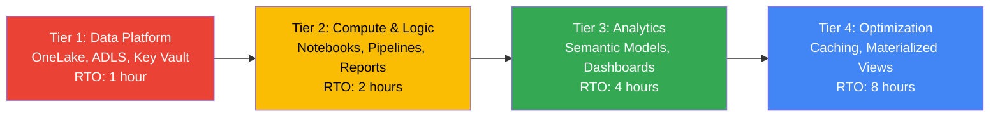
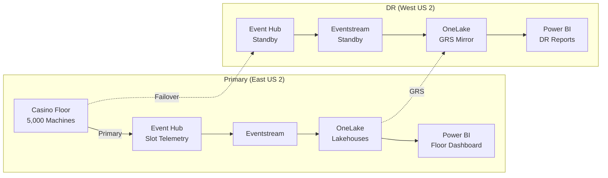
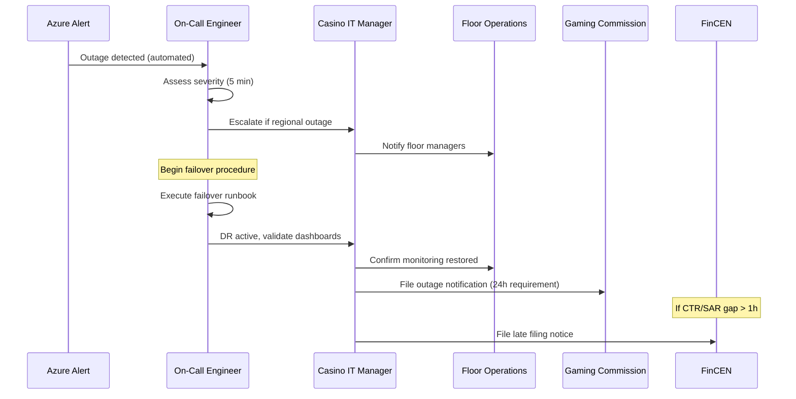
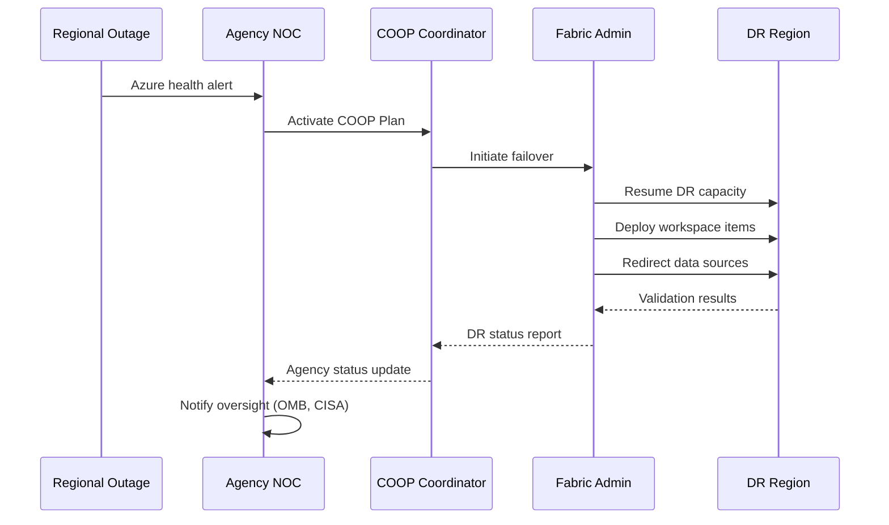
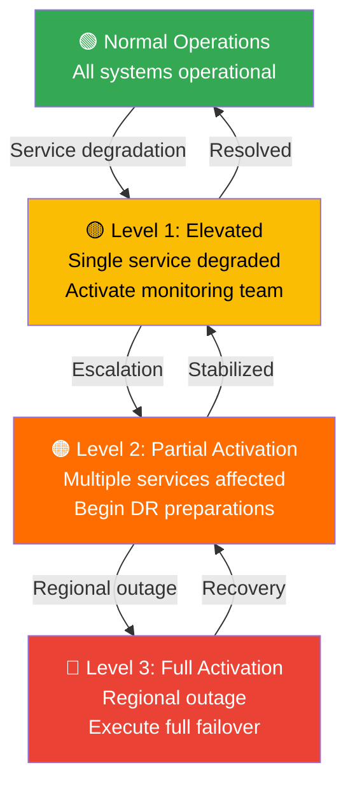

[Home](../index.md) > [Docs](../) > [Best Practices](./) > Disaster Recovery & Business Continuity

# 🛡️ Disaster Recovery & Business Continuity for Microsoft Fabric

<div align="center">

**Protect Your Analytics Platform with Resilient Architecture and Tested Failover Procedures**


</div>

---

**Last Updated:** `2026-04-13` | **Version:** 1.0.0

---

## 📑 Table of Contents

- [🎯 Overview](#-overview)
- [🏗️ BCDR Architecture](#️-bcdr-architecture)
- [⏱️ RTO/RPO Targets](#️-rtorpo-targets)
- [💾 OneLake BCDR](#-onelake-bcdr)
- [🔄 Failover Procedures](#-failover-procedures)
- [🧪 DR Testing](#-dr-testing)
- [🎰 Casino BCDR Requirements](#-casino-bcdr-requirements)
- [🏛️ Federal BCDR Requirements](#️-federal-bcdr-requirements)
- [📊 Monitoring & Readiness](#-monitoring--readiness)
- [⚠️ Limitations](#️-limitations)
- [📚 References](#-references)

---

## 🎯 Overview

Business Continuity and Disaster Recovery (BCDR) for Microsoft Fabric ensures that analytics workloads, data pipelines, and reporting capabilities remain available during outages, regional failures, or infrastructure incidents. A well-designed BCDR strategy balances recovery objectives against cost and operational complexity.

### BCDR Principles

| Principle | Description |
|-----------|-------------|
| **Recovery Time Objective (RTO)** | Maximum acceptable time to restore services after a disruption |
| **Recovery Point Objective (RPO)** | Maximum acceptable data loss measured in time (e.g., 5 minutes of data) |
| **Redundancy** | Duplicate critical components across availability zones or regions |
| **Automation** | Scripted failover procedures to minimize human error and recovery time |
| **Testing** | Regular DR drills to validate procedures and train personnel |
| **Documentation** | Runbooks with step-by-step procedures for every failure scenario |

### Disaster Scenarios

| Scenario | Likelihood | Impact | Recovery Strategy |
|----------|-----------|--------|-------------------|
| Single service outage (Spark) | Medium | Partial | Retry + alternative workload path |
| Workspace corruption | Low | High | Restore from git + re-deploy |
| Regional outage (full region down) | Very low | Critical | Failover to paired region |
| Tenant-level outage | Extremely rare | Critical | Microsoft-managed recovery |
| Data corruption (user error) | Medium | Variable | Point-in-time restore, Delta time travel |
| Security breach | Low | Critical | Isolate, forensic copy, rebuild |

---

## 🏗️ BCDR Architecture

### Multi-Region Architecture

```mermaid
flowchart TB
    subgraph PrimaryRegion["Primary Region (East US 2)"]
        subgraph ProdCapacity["F64 Production Capacity"]
            WS_ETL[ETL Workspace]
            WS_Analytics[Analytics Workspace]
            WS_BI[BI Workspace]
        end
        OneLake_P[("OneLake<br/>(GRS Replicated)")]
        KV_P[Azure Key Vault]
        ADLS_P[ADLS Gen2<br/>Landing Zone]
    end

    subgraph SecondaryRegion["Secondary Region (West US 2)"]
        subgraph DRCapacity["F32 DR Capacity (Paused)"]
            WS_DR[DR Workspace<br/>(Mirror)]
        end
        OneLake_S[("OneLake<br/>(Read Replica)")]
        KV_S[Azure Key Vault<br/>(Replicated)]
        ADLS_S[ADLS Gen2<br/>(GRS Pair)]
    end

    subgraph Source["Data Sources"]
        Casino[Casino Floor Systems]
        Federal[Federal Agency APIs]
        Streaming[Event Hubs]
    end

    Source --> PrimaryRegion
    OneLake_P -.->|Geo-replication| OneLake_S
    KV_P -.->|Backup keys| KV_S
    ADLS_P -.->|GRS replication| ADLS_S

    PrimaryRegion -->|Failover trigger| SecondaryRegion

    style PrimaryRegion fill:#e8f5e9
    style SecondaryRegion fill:#fff3e0
```

### Component Redundancy Matrix

| Component | Primary | Secondary | Replication | Failover |
|-----------|---------|-----------|-------------|----------|
| Fabric Capacity | F64 East US 2 | F32 West US 2 (paused) | Not applicable | Manual resume + scale |
| OneLake Data | East US 2 | GRS pair | Asynchronous geo-replication | Automatic (storage layer) |
| ADLS Gen2 | East US 2 | GRS pair | Asynchronous | Storage account failover |
| Key Vault | East US 2 | West US 2 | Managed replication | Automatic |
| Git Repository | GitHub (multi-region) | GitHub (multi-region) | Real-time | Automatic |
| Eventstream | East US 2 | West US 2 (standby) | Manual configuration | Re-create from IaC |
| Power BI Reports | East US 2 workspace | DR workspace | Git-based deployment | Re-deploy from git |
| Pipelines | East US 2 workspace | DR workspace | Git-based deployment | Re-deploy from git |
| Notebooks | East US 2 workspace | DR workspace | Git-based deployment | Re-deploy from git |

---

## ⏱️ RTO/RPO Targets

### Tiered Recovery Objectives

| Item Type | Tier | RTO Target | RPO Target | Recovery Method |
|-----------|------|------------|------------|-----------------|
| **Delta Tables (OneLake)** | Tier 1 | 1 hour | < 5 minutes | GRS failover + Delta time travel |
| **Real-Time Streams** | Tier 1 | 15 minutes | < 1 minute | Reconnect event sources to DR |
| **Power BI Reports** | Tier 2 | 2 hours | N/A (stateless) | Re-deploy from git |
| **Spark Notebooks** | Tier 2 | 2 hours | N/A (stateless) | Re-deploy from git |
| **Data Pipelines** | Tier 2 | 2 hours | N/A (stateless) | Re-deploy from git |
| **Eventhouse (KQL DB)** | Tier 2 | 4 hours | < 30 minutes | Re-ingest from OneLake + replay |
| **SQL Database (Fabric)** | Tier 1 | 1 hour | < 5 minutes | Point-in-time restore |
| **Semantic Models** | Tier 3 | 4 hours | N/A (computed) | Rebuild from gold tables |
| **ADLS Landing Zone** | Tier 1 | 1 hour | < 15 minutes | GRS failover |
| **Key Vault** | Tier 1 | Automatic | 0 (replicated) | Azure-managed |

### Recovery Priority Order



---

## 💾 OneLake BCDR

### Geo-Redundant Storage

OneLake leverages Azure Storage's geo-redundant storage (GRS) to replicate data asynchronously to a paired Azure region. This provides automatic protection against regional failures.

| Storage Tier | Replication | RPO | Behavior |
|-------------|-------------|-----|----------|
| **LRS** | 3 copies within region | N/A | Single-region protection only |
| **ZRS** | 3 copies across zones | N/A | Zone failure protection |
| **GRS** | LRS + async copy to paired region | < 15 minutes | Regional failure protection |
| **GZRS** | ZRS + async copy to paired region | < 15 minutes | Zone + regional protection |

> **Note:** OneLake uses Azure-managed replication. The storage redundancy is configured at the capacity level and cannot be changed per-workspace.

### Delta Lake Time Travel

Delta Lake's transaction log provides built-in point-in-time recovery for data corruption or accidental deletion.

```python
# Restore a Delta table to a previous version
spark.sql("""
    RESTORE TABLE gold_slot_performance
    TO VERSION AS OF 42
""")

# Or restore to a timestamp
spark.sql("""
    RESTORE TABLE gold_slot_performance
    TO TIMESTAMP AS OF '2026-04-12T14:00:00Z'
""")

# Query historical data without restoring
df_historical = spark.read.format("delta") \
    .option("timestampAsOf", "2026-04-12T14:00:00Z") \
    .load("Tables/gold_slot_performance")
```

### OneLake Backup Strategy

```python
# Scheduled backup of critical Delta tables to secondary ADLS
from notebookutils import mssparkutils

def backup_table_to_adls(
    table_name: str,
    backup_path: str,
    retention_days: int = 30,
):
    """Backup a Delta table to a secondary ADLS Gen2 account."""
    # Read current table state
    df = spark.read.format("delta").load(f"Tables/{table_name}")

    # Write snapshot to backup location with date partition
    from datetime import datetime
    backup_date = datetime.now().strftime("%Y%m%d_%H%M%S")
    target_path = f"{backup_path}/{table_name}/{backup_date}"

    df.write.format("delta").mode("overwrite").save(target_path)

    # Clean up old backups beyond retention
    _cleanup_old_backups(
        f"{backup_path}/{table_name}",
        retention_days
    )

    return target_path

# Backup critical tables
critical_tables = [
    "gold_slot_performance",
    "gold_compliance_ctr",
    "gold_compliance_sar",
    "gold_player_analytics",
]

for table in critical_tables:
    path = backup_table_to_adls(
        table,
        "abfss://backup@stfabricdr.dfs.core.windows.net/delta"
    )
    print(f"Backed up {table} to {path}")
```

---

## 🔄 Failover Procedures

### Failover Runbook

#### Pre-Requisites Checklist

- [ ] DR capacity exists in secondary region (paused)
- [ ] Git integration configured for all workspaces
- [ ] Key Vault replicated to secondary region
- [ ] ADLS GRS replication verified
- [ ] DR workspace items deployed from git at least once
- [ ] Network connectivity tested to DR region
- [ ] Team trained on failover procedures

#### Step 1: Assess the Outage

```python
# Check Fabric service health
import requests

def check_fabric_health(region: str = "eastus2") -> dict:
    """Check Microsoft Fabric service health."""
    url = "https://api.fabric.microsoft.com/v1/admin/tenantsettings"
    # If this call fails, the region may be down
    try:
        response = requests.get(url, timeout=10)
        return {"status": "healthy", "code": response.status_code}
    except requests.exceptions.RequestException as e:
        return {"status": "unhealthy", "error": str(e)}
```

#### Step 2: Resume DR Capacity

```bash
# Resume the paused DR capacity
az fabric capacity resume \
  --resource-group rg-fabric-dr \
  --capacity-name fabric-cap-dr-westus2

# Scale up if needed
az fabric capacity update \
  --resource-group rg-fabric-dr \
  --capacity-name fabric-cap-dr-westus2 \
  --sku-name F64
```

#### Step 3: Initiate Storage Failover

```bash
# Initiate ADLS Gen2 storage account failover
az storage account failover \
  --name stfabriclz \
  --resource-group rg-fabric-prod \
  --no-wait

# Monitor failover progress
az storage account show \
  --name stfabriclz \
  --query "failoverInProgress"
```

#### Step 4: Deploy Workspace Items

```bash
# Deploy all workspace items from git to DR workspace
python scripts/fabric-cicd-deploy.py \
  --workspace-id $DR_WORKSPACE_ID \
  --environment dr \
  --source git

# Verify deployment
python scripts/fabric-cicd-deploy.py \
  --workspace-id $DR_WORKSPACE_ID \
  --verify-only
```

#### Step 5: Redirect Data Sources

```python
# Update event source connections to point to DR region
def redirect_event_sources(dr_eventhub_connection: str):
    """Redirect streaming sources to DR Event Hub namespace."""
    # Update Eventstream source connection
    fabric_client.update_eventstream(
        workspace_id=DR_WORKSPACE_ID,
        eventstream_name="es_casino_telemetry",
        source_connection=dr_eventhub_connection,
    )

# Update ADLS shortcuts to secondary storage
def update_shortcuts(dr_adls_account: str):
    """Update OneLake shortcuts to DR storage."""
    fabric_client.update_shortcut(
        workspace_id=DR_WORKSPACE_ID,
        lakehouse_name="lh_bronze",
        shortcut_name="landing_zone",
        target_path=f"abfss://landing@{dr_adls_account}.dfs.core.windows.net/",
    )
```

#### Step 6: Validate DR Environment

```python
# DR validation checklist
def validate_dr_environment(workspace_id: str) -> dict:
    """Run DR validation checks."""
    results = {}

    # Check data freshness
    df = spark.sql("""
        SELECT MAX(event_timestamp) AS latest_event
        FROM gold_slot_performance
    """)
    results["data_freshness"] = df.collect()[0]["latest_event"]

    # Check table row counts
    tables = ["bronze_slot_telemetry", "silver_slot_cleansed", "gold_slot_performance"]
    for table in tables:
        count = spark.sql(f"SELECT COUNT(*) AS cnt FROM {table}").collect()[0]["cnt"]
        results[f"{table}_count"] = count

    # Check pipeline status
    results["pipelines_deployed"] = _check_pipelines(workspace_id)

    # Check report accessibility
    results["reports_accessible"] = _check_reports(workspace_id)

    return results
```

#### Step 7: Communicate Status

```python
# Send DR status notification
def send_dr_notification(status: str, details: dict):
    """Notify stakeholders of DR status."""
    message = {
        "type": "MessageCard",
        "summary": f"Fabric DR Status: {status}",
        "sections": [{
            "activityTitle": f"DR Failover: {status}",
            "facts": [
                {"name": k, "value": str(v)}
                for k, v in details.items()
            ],
        }],
    }

    # Post to Teams webhook
    requests.post(TEAMS_WEBHOOK_URL, json=message)
```

### Failback Procedure

After the primary region recovers:

1. **Verify primary region health** — confirm all services are operational
2. **Sync data changes** — replicate DR data back to primary (reverse GRS)
3. **Re-deploy workspace items** — deploy from git to primary workspace
4. **Redirect data sources** — point event sources back to primary
5. **Validate primary** — run the same validation checks as DR
6. **Pause DR capacity** — stop billing on DR capacity
7. **Post-incident review** — document lessons learned

---

## 🧪 DR Testing

### Quarterly DR Drill Template

```markdown
# DR Drill Report

**Date:** [YYYY-MM-DD]
**Drill Type:** [Tabletop / Partial / Full]
**Duration:** [Start Time] – [End Time]

## Participants
| Name | Role | Contact |
|------|------|---------|
| [Name] | DR Coordinator | [Email] |
| [Name] | Data Engineer | [Email] |
| [Name] | BI Developer | [Email] |
| [Name] | IT Operations | [Email] |

## Scenario
[Description of the simulated disaster scenario]

## Steps Executed
| Step | Action | Expected Time | Actual Time | Status |
|------|--------|---------------|-------------|--------|
| 1 | Detect outage | 5 min | [actual] | ✅/❌ |
| 2 | Resume DR capacity | 10 min | [actual] | ✅/❌ |
| 3 | Storage failover | 15 min | [actual] | ✅/❌ |
| 4 | Deploy workspace items | 20 min | [actual] | ✅/❌ |
| 5 | Redirect sources | 10 min | [actual] | ✅/❌ |
| 6 | Validate environment | 15 min | [actual] | ✅/❌ |
| 7 | Notify stakeholders | 5 min | [actual] | ✅/❌ |
| **Total** | | **80 min** | **[actual]** | |

## RTO Achievement
- Target RTO: [target]
- Actual RTO: [actual]
- Status: [Met / Not Met]

## Issues Discovered
| Issue | Severity | Resolution | Owner |
|-------|----------|------------|-------|
| [Issue] | [High/Med/Low] | [Fix] | [Name] |

## Action Items
| Item | Owner | Due Date | Status |
|------|-------|----------|--------|
| [Action] | [Name] | [Date] | ⬜ |

## Next Drill
- **Scheduled:** [Date]
- **Type:** [Tabletop / Partial / Full]
```

### DR Test Automation

```python
# Automated DR validation test suite
import pytest
from datetime import datetime, timedelta

class TestDRReadiness:
    """Quarterly DR readiness validation tests."""

    def test_dr_capacity_exists(self):
        """Verify DR capacity is provisioned (can be paused)."""
        capacity = az_client.get_capacity("fabric-cap-dr-westus2")
        assert capacity is not None
        assert capacity.sku in ["F32", "F64"]

    def test_git_integration_current(self):
        """Verify DR workspace git integration is up-to-date."""
        last_sync = fabric_client.get_git_sync_status(DR_WORKSPACE_ID)
        assert last_sync.last_sync_time > datetime.now() - timedelta(days=7)

    def test_storage_grs_enabled(self):
        """Verify ADLS Gen2 has GRS replication."""
        sa = az_client.get_storage_account("stfabriclz")
        assert sa.sku.name in ["Standard_GRS", "Standard_RAGRS", "Standard_GZRS"]

    def test_key_vault_replicated(self):
        """Verify Key Vault keys exist in DR region."""
        dr_keys = az_client.list_keys("kv-fabric-dr-westus2")
        primary_keys = az_client.list_keys("kv-fabric-cmk-prod")
        primary_names = {k.name for k in primary_keys}
        dr_names = {k.name for k in dr_keys}
        assert primary_names.issubset(dr_names)

    def test_delta_time_travel(self):
        """Verify Delta time travel works for 30 days."""
        df = spark.read.format("delta") \
            .option("timestampAsOf",
                     (datetime.now() - timedelta(days=30)).isoformat()) \
            .load("Tables/gold_slot_performance")
        assert df.count() > 0

    def test_runbook_accessible(self):
        """Verify DR runbook is accessible and current."""
        # Check runbook exists in git
        runbook = repo.get_contents("docs/best-practices/disaster-recovery-bcdr.md")
        assert runbook is not None
        assert runbook.size > 0

    def test_notification_channel(self):
        """Verify DR notification channels are operational."""
        response = send_test_notification("DR Test Notification")
        assert response.status_code == 200
```

---

## 🎰 Casino BCDR Requirements

### 24/7 Operations Mandate

Casino gaming floors operate continuously. Any disruption to real-time monitoring, compliance reporting, or player analytics directly impacts revenue and regulatory standing.

| Requirement | Target | Justification |
|-------------|--------|---------------|
| Slot telemetry RPO | < 5 minutes | NIGC MICS requires continuous monitoring |
| CTR reporting RTO | < 1 hour | FinCEN mandates timely filing |
| Floor dashboard RTO | < 15 minutes | Revenue impact: ~$10K–$50K per hour of downtime |
| Player loyalty RTO | < 2 hours | Player experience degradation acceptable briefly |
| Historical analytics RTO | < 8 hours | No immediate revenue impact |

### Casino DR Architecture



### Casino-Specific Failover Steps

1. **Redirect casino floor telemetry** — Update edge devices or IoT gateway to send to DR Event Hub
2. **Activate compliance monitoring** — Ensure CTR/SAR detection runs in DR workspace
3. **Restore floor dashboards** — Priority recovery for operations team
4. **Verify gaming commission connectivity** — Confirm regulatory reporting endpoints reach DR
5. **Notify gaming commission** — Regulatory requirement to report system outages within 24 hours

### Casino Compliance During DR

| Compliance Area | DR Behavior | Acceptable Gap |
|----------------|-------------|----------------|
| CTR ($10K threshold) | Must resume within 1 hour | ≤ 1 hour |
| SAR detection | Must resume within 4 hours | ≤ 4 hours |
| W-2G reporting | Can defer up to 24 hours | ≤ 24 hours |
| Player tracking | Can degrade to manual | ≤ 8 hours |
| Surveillance integration | Independent system | N/A (separate DR) |

### Casino DR Cost Analysis

| Component | Primary Cost | DR Cost (Paused) | DR Cost (Active) | Notes |
|-----------|-------------|------------------|-------------------|-------|
| Fabric F64 capacity | ~$8,410/mo | ~$0 (paused) | ~$8,410/mo | Resume on failover |
| ADLS Gen2 (GRS) | ~$400/mo | Included in GRS | Included | GRS adds ~2x storage cost |
| Event Hubs (standby) | ~$700/mo | ~$200/mo (basic) | ~$700/mo | Keep basic tier until failover |
| Key Vault (replicated) | ~$50/mo | ~$50/mo | ~$50/mo | Always replicated |
| **Monthly DR overhead** | — | **~$250** | **~$9,160** | 97% savings when paused |

### Casino DR Communication Plan



---

## 🏛️ Federal BCDR Requirements

### Continuity of Operations (COOP)

Federal agencies must maintain Continuity of Operations Plans (COOP) per Federal Continuity Directive 1 (FCD-1). Fabric-based analytics platforms must align with agency COOP requirements.

| FCD-1 Requirement | Fabric Implementation |
|-------------------|----------------------|
| Mission-essential functions identified | Tier 1 data platform items (OneLake, ADLS) |
| Alternate facilities | Secondary Azure region with paused capacity |
| Order of succession | Documented DR team roles and alternates |
| Delegation of authority | Azure RBAC with emergency break-glass accounts |
| Communication plans | Teams + email + phone tree |
| Vital records | OneLake GRS + git repository |
| Human resources | Cross-trained team members |
| Testing and training | Quarterly DR drills |
| Reconstitution | Documented failback procedures |

### FedRAMP BCDR Controls

| Control ID | Control Name | Implementation |
|-----------|-------------|----------------|
| **CP-1** | Contingency Planning Policy | This document + agency COOP |
| **CP-2** | Contingency Plan | Failover runbook (above) |
| **CP-3** | Contingency Training | Quarterly DR drill participation |
| **CP-4** | Contingency Plan Testing | DR test automation suite |
| **CP-6** | Alternate Storage Site | GRS-replicated ADLS + OneLake in paired region |
| **CP-7** | Alternate Processing Site | Paused Fabric capacity in DR region |
| **CP-8** | Telecommunications Services | Azure backbone redundancy |
| **CP-9** | System Backup | Delta time travel + ADLS snapshots + git |
| **CP-10** | System Recovery & Reconstitution | Failback procedure (above) |

### Federal Agency RPO Requirements

| Agency | Data Type | RPO | Regulatory Driver |
|--------|-----------|-----|-------------------|
| USDA | Crop production data | < 1 hour | USDA IT Policy |
| SBA | Loan application data (PII) | < 15 min | Privacy Act, SBA SOP |
| NOAA | Weather observation data | < 5 min | NWS directive |
| EPA | Environmental monitoring | < 30 min | CAA, CWA requirements |
| DOI | Land/resource data | < 1 hour | FLPMA, DOI IT policy |

### Federal Multi-Agency DR Coordination



### Impact Level Considerations

| Impact Level | DR Requirement | Fabric Approach |
|-------------|----------------|-----------------|
| **IL2** (Public) | Standard DR, no special isolation | Commercial Fabric + GRS |
| **IL4** (CUI) | Separate DR capacity, encrypted data | Fabric Gov + GRS + CMK |
| **IL5** (Unclassified/National Security) | Dedicated DR in Gov region, strict isolation | Fabric Gov + dedicated capacity + GZRS |

### Federal Agency DR Runbook Extensions

Each agency has unique data dependencies and regulatory requirements during DR:

| Agency | DR Priority Data | Recovery Sequence | Regulatory Notification |
|--------|-----------------|-------------------|------------------------|
| USDA | Crop production forecasts | ADLS → Bronze → Silver → Gold → Reports | USDA OCIO within 2 hours |
| SBA | Active loan applications (PII) | Key Vault → ADLS → Bronze → Silver | SBA OCIO + Privacy Officer within 1 hour |
| NOAA | Real-time weather observations | Event Hub → Eventstream → KQL → Alerts | NWS Operations Center immediately |
| EPA | Air/water quality monitoring | ADLS → Bronze → Silver → Alerts | EPA OEI within 4 hours |
| DOI | Active permit applications | ADLS → Bronze → Silver → Gold | DOI OCIO within 4 hours |

### Federal Break-Glass Procedure

Emergency access during DR when normal authentication is unavailable:

```python
# Break-glass account activation checklist
BREAK_GLASS_PROCEDURE = {
    "step_1": {
        "action": "Retrieve break-glass credentials from physical safe",
        "location": "Agency NOC secure room",
        "requires": "Two-person integrity (dual control)",
    },
    "step_2": {
        "action": "Authenticate with break-glass account to Azure portal",
        "account": "bg-admin@agency.onmicrosoft.com",
        "mfa": "Hardware FIDO2 key (stored with credentials)",
    },
    "step_3": {
        "action": "Resume DR Fabric capacity",
        "command": "az fabric capacity resume --name fabric-cap-dr",
    },
    "step_4": {
        "action": "Assign workspace roles to DR team members",
        "note": "Break-glass account has Global Admin; delegate immediately",
    },
    "step_5": {
        "action": "Log all actions taken with break-glass account",
        "note": "Required for FedRAMP AU-2 audit trail",
    },
    "step_6": {
        "action": "Rotate break-glass credentials after incident",
        "deadline": "Within 24 hours of incident resolution",
    },
}
```

### COOP Activation Levels



---

## 📊 Monitoring & Readiness

### DR Readiness Dashboard

```kql
// DR readiness metrics
let dr_readiness = datatable(
    Component: string,
    LastValidated: datetime,
    Status: string,
    RTO_Target: string,
    RTO_Tested: string
) [
    "OneLake GRS", datetime(2026-04-10), "Healthy", "1 hour", "45 min",
    "DR Capacity", datetime(2026-04-10), "Paused/Ready", "10 min resume", "8 min",
    "Git Integration", datetime(2026-04-13), "Current", "20 min deploy", "18 min",
    "Key Vault DR", datetime(2026-04-10), "Replicated", "Automatic", "Automatic",
    "ADLS GRS", datetime(2026-04-10), "Replicating", "15 min", "12 min"
];
dr_readiness
| extend DaysSinceValidation = datetime_diff("day", now(), LastValidated)
| extend ReadinessFlag = iff(DaysSinceValidation > 30, "⚠️ Overdue", "✅ Current")
```

### Replication Lag Monitoring

```kql
// Monitor OneLake replication lag
AzureStorageMetrics
| where TimeGenerated > ago(24h)
| where MetricName == "GeoReplicationLag"
| summarize AvgLagMs = avg(Value), MaxLagMs = max(Value)
    by bin(TimeGenerated, 15m)
| render timechart
```

### Alert Configuration

| Alert | Threshold | Severity | Action |
|-------|-----------|----------|--------|
| GRS replication lag > 15 min | 15 minutes | High | Investigate storage health |
| GRS replication lag > 1 hour | 60 minutes | Critical | Escalate to Azure support |
| DR capacity deleted | Any | Critical | Immediately re-provision |
| Git sync > 7 days old | 7 days | Medium | Trigger sync |
| DR drill overdue | > 90 days | Medium | Schedule drill |
| Key Vault DR mismatch | Key missing in DR | High | Replicate missing keys |
| ADLS backup stale | > 24 hours | Medium | Investigate backup job |

### Bicep: DR Capacity Module

```bicep
// DR capacity module - deployed paused in secondary region
@description('Disaster Recovery Fabric capacity in paired region')
param drLocation string = 'westus2'
param drSkuName string = 'F32'
param adminMembers array

resource drCapacity 'Microsoft.Fabric/capacities@2023-11-01' = {
  name: 'fabric-cap-dr-${drLocation}'
  location: drLocation
  sku: {
    name: drSkuName
    tier: 'Fabric'
  }
  properties: {
    administration: {
      members: adminMembers
    }
  }
  tags: {
    Environment: 'DR'
    PairedWith: 'eastus2'
    AutoPause: 'true'
    CostCenter: 'DR-Budget'
  }
}

// Immediately suspend to avoid billing
resource suspendDR 'Microsoft.Fabric/capacities/suspend@2023-11-01' = {
  parent: drCapacity
  name: 'default'
}

output drCapacityId string = drCapacity.id
output drCapacityName string = drCapacity.name
```

### DR Metrics KQL Dashboard

```kql
// Comprehensive DR readiness dashboard query
let backup_freshness = AzureStorageMetrics
| where TimeGenerated > ago(24h)
| where ResourceId contains "stfabricdr"
| summarize LastWrite = max(TimeGenerated)
| project Component = "Backup Storage", LastActivity = LastWrite;

let replication_status = AzureStorageMetrics
| where TimeGenerated > ago(1h)
| where MetricName == "GeoReplicationLag"
| summarize AvgLagMs = avg(Value), MaxLagMs = max(Value)
| project Component = "GRS Replication",
    LastActivity = now(),
    AvgLagMs, MaxLagMs;

let keyvault_health = AzureDiagnostics
| where ResourceProvider == "MICROSOFT.KEYVAULT"
| where TimeGenerated > ago(24h)
| where Resource contains "dr"
| summarize LastOp = max(TimeGenerated), OpCount = count()
| project Component = "Key Vault DR", LastActivity = LastOp;

union backup_freshness, keyvault_health
| extend HoursSinceActivity = datetime_diff("hour", now(), LastActivity)
| extend HealthStatus = case(
    HoursSinceActivity < 1, "✅ Healthy",
    HoursSinceActivity < 24, "⚠️ Check Required",
    "❌ Stale"
)
```

---

## ⚠️ Limitations

| Limitation | Details | Workaround |
|-----------|---------|------------|
| **No automatic Fabric failover** | Fabric does not auto-failover capacity to paired region | Implement scripted failover with monitoring |
| **Eventstream state** | Eventstream checkpoints are not replicated cross-region | Maintain IaC for Eventstream re-creation; accept replay from source |
| **Eventhouse data** | KQL databases are not geo-replicated automatically | Re-ingest from OneLake Delta tables after failover |
| **Semantic model cache** | Direct Lake cache is not replicated | Cache rebuilds on first query in DR (expect slower initial queries) |
| **GRS replication lag** | Asynchronous replication can lag by up to 15 minutes | Accept RPO of 15 minutes for storage-layer data |
| **Workspace identity** | Managed identity in primary region; DR needs separate identity | Pre-provision DR identity with same RBAC roles |
| **Pipeline run history** | Pipeline monitoring data does not replicate | Accept loss of historical run data in DR |
| **Capacity scaling time** | Resume + scale can take 5–10 minutes | Pre-provision at target SKU, keep paused |

---

## 📚 References

### Microsoft Documentation

- [Fabric reliability and disaster recovery](https://learn.microsoft.com/fabric/security/reliability)
- [OneLake disaster recovery guidance](https://learn.microsoft.com/fabric/onelake/onelake-disaster-recovery)
- [Azure Storage redundancy](https://learn.microsoft.com/azure/storage/common/storage-redundancy)
- [Azure paired regions](https://learn.microsoft.com/azure/reliability/cross-region-replication-azure)
- [Delta Lake time travel](https://learn.microsoft.com/fabric/data-engineering/lakehouse-delta-time-travel)
- [Fabric git integration](https://learn.microsoft.com/fabric/cicd/git-integration/intro-to-git-integration)

### Compliance Standards

- [FedRAMP CP controls family](https://www.fedramp.gov/assets/resources/documents/FedRAMP_Security_Controls_Baseline.xlsx)
- [Federal Continuity Directive 1 (FCD-1)](https://www.fema.gov/emergency-managers/national-preparedness/continuity/directives)
- [NIST SP 800-34 Contingency Planning Guide](https://csrc.nist.gov/publications/detail/sp/800-34/rev-1/final)
- [NIGC MICS §542.17](https://www.nigc.gov/compliance/minimum-internal-control-standards)
- [FinCEN BSA requirements](https://www.fincen.gov/resources/statutes-regulations)

---

## Related Documents

- [Capacity Planning & Cost Optimization](./capacity-planning-cost-optimization.md) -- DR capacity cost management
- [Customer-Managed Keys](./customer-managed-keys.md) -- Encryption key DR and replication
- [Error Handling & Monitoring](./error-handling-monitoring.md) -- Centralized monitoring for outage detection
- [Fabric CI/CD Deployment](./fabric-cicd-deployment.md) -- Git-based deployment for DR re-provisioning
- [Network Security](./network-security.md) -- Network configuration for DR regions

---

[Back to Best Practices Index](./README.md) | [Back to Documentation](../index.md)
