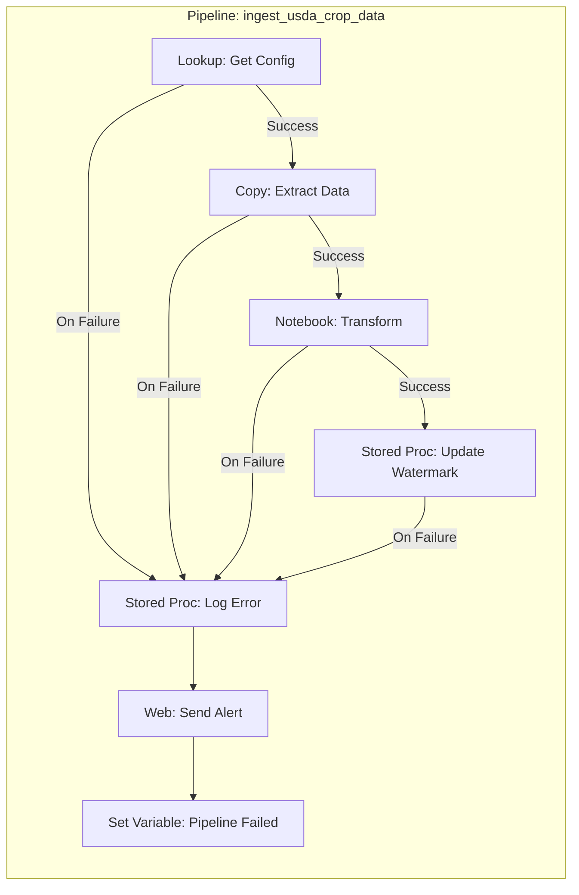
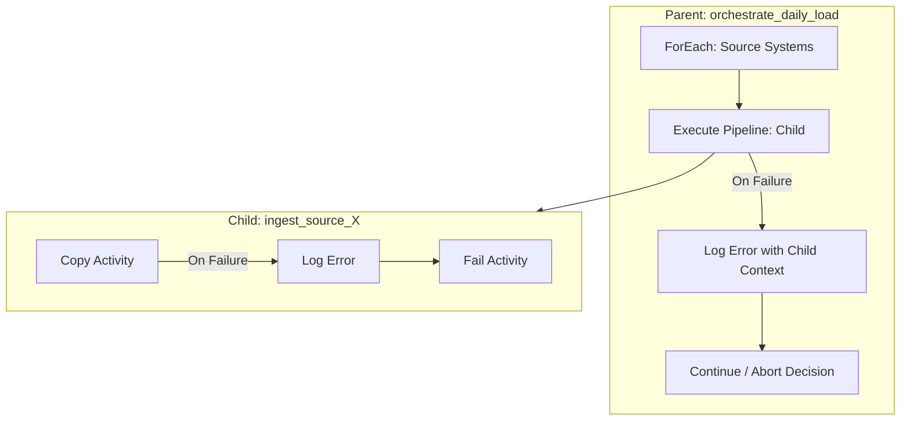
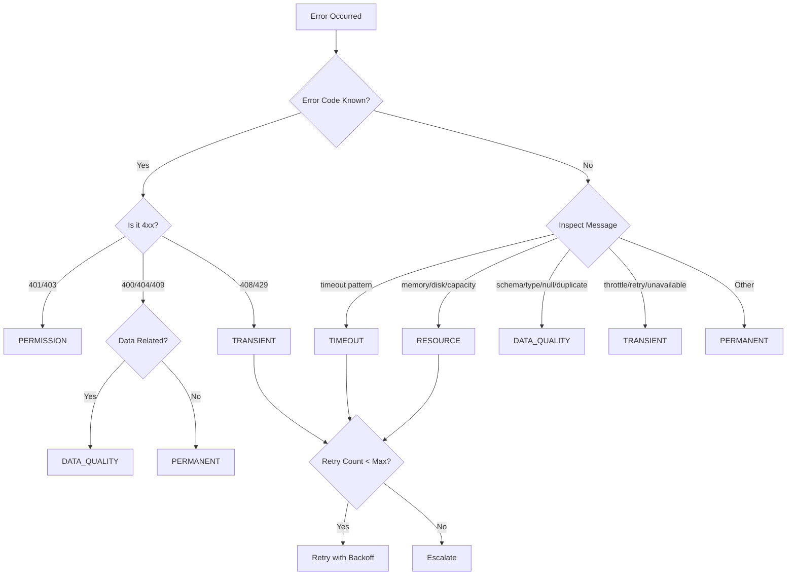
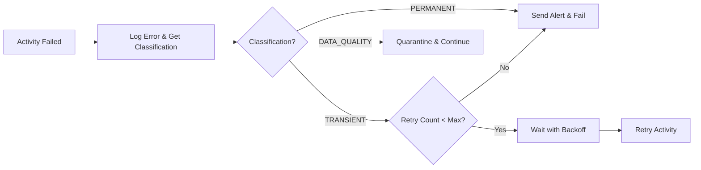
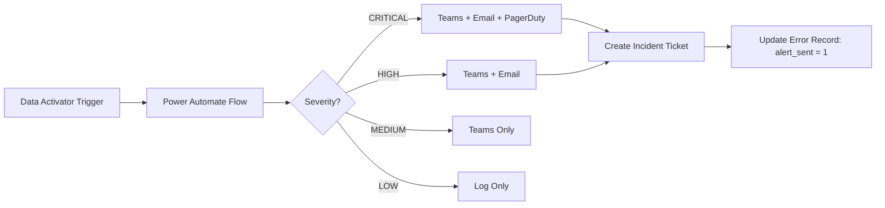

[Home](../index.md) > [Best Practices](./) > Error Handling & Monitoring

# ⚠️ Error Handling & Monitoring Best Practices

> **Last Updated**: 2026-04-15 | **Version**: 2.0
> **Status**: ✅ Final | **Maintainer**: Documentation Team

<div align="center" markdown>


</div>

---

## 📖 Overview

Robust error handling and monitoring are essential for production-grade Microsoft Fabric deployments. This guide covers pipeline error architecture, structured error logging, classification taxonomy, monitoring with Data Activator, PySpark error handling patterns, and KQL-based error analysis. It draws on patterns proven across casino gaming compliance, federal agency data pipelines, and real-time streaming workloads.

---

## 🧭 Table of Contents

- [🏗️ Pipeline Error Architecture](#-pipeline-error-architecture)
- [💾 Production Error Table Design](#-production-error-table-design)
- [🔧 Stored Procedures](#-stored-procedures)
- [🏷️ Error Classification Taxonomy](#-error-classification-taxonomy)
- [🔁 Pipeline Error Patterns](#-pipeline-error-patterns)
- [🐍 PySpark Error Handling](#-pyspark-error-handling)
- [🔔 Monitoring with Data Activator](#-monitoring-with-data-activator)
- [📢 Alert Escalation Matrix](#-alert-escalation-matrix)
- [🔍 KQL Queries for Error Analysis](#-kql-queries-for-error-analysis)
- [📊 Operational Dashboards](#-operational-dashboards)
- [📓 Runbook Integration](#-runbook-integration)

---

## 🏗️ Pipeline Error Architecture

### Design Principles

Every pipeline in a production Fabric deployment should follow these error handling principles:

1. **Single Error Activity Pattern** -- One `On Failure` activity per pipeline that captures all errors
2. **Structured Error Logging** -- Write every failure to a centralized error table with full context
3. **Error Propagation** -- Nested pipelines propagate errors upward while preserving original context
4. **Retry with Backoff** -- Transient errors are retried with exponential backoff before escalation
5. **Fail-Fast for Permanent Errors** -- Data quality and permission errors skip retries entirely

### Single Error Activity Pattern

The recommended approach is to attach a single `On Failure` path from each critical activity to a shared error-logging activity. This avoids duplicated error handling logic and guarantees consistent capture.



### Error Propagation in Nested Pipelines

When using `Execute Pipeline` activities, errors must propagate correctly from child to parent. The child pipeline should log its own error and then re-throw (by not suppressing the failure) so the parent can also react.



**Key configuration:**

| Setting | Value | Reason |
|---------|-------|--------|
| `Wait on completion` | `true` | Parent waits for child outcome |
| Child termination | Use `Fail` activity after logging | Ensures parent sees the failure |
| `fireAndForget` | `false` | Never use for error-sensitive pipelines |

### Retry Patterns with Exponential Backoff

Configure retry policies on activities that interact with external systems (Copy, Web, Lookup against remote sources).

```json
{
  "retryPolicy": {
    "count": 3,
    "intervalInSeconds": 30,
    "backoffMultiplier": 2,
    "maxIntervalInSeconds": 300
  }
}
```

**Retry schedule for this configuration:**

| Attempt | Wait Before Retry | Cumulative Time |
|---------|-------------------|-----------------|
| 1st retry | 30 seconds | 30s |
| 2nd retry | 60 seconds | 1m 30s |
| 3rd retry | 120 seconds | 3m 30s |

**Activities that should have retries:**

- Copy Activity (source connectivity, throttling)
- Web Activity (API calls to external endpoints)
- Lookup Activity (remote source queries)
- Stored Procedure Activity (transient deadlocks)

**Activities that should NOT retry:**

- Notebook Activity (handles its own retry logic internally)
- Fail Activity (intentionally terminates the pipeline)
- Set Variable Activity (local, no transient failures)

---

## 💾 Production Error Table Design

### Error Table DDL

Create this table in your Fabric Warehouse for centralized error tracking across all pipelines.

```sql
CREATE TABLE dbo.pipeline_errors (
    error_id BIGINT IDENTITY(1,1) PRIMARY KEY,
    error_timestamp DATETIME2 DEFAULT GETUTCDATE(),
    pipeline_name NVARCHAR(256),
    pipeline_run_id NVARCHAR(256),
    activity_name NVARCHAR(256),
    activity_type NVARCHAR(128),
    error_code NVARCHAR(128),
    error_message NVARCHAR(MAX),
    error_classification NVARCHAR(64),  -- TRANSIENT, PERMANENT, DATA_QUALITY, PERMISSION, TIMEOUT, RESOURCE
    severity NVARCHAR(16),              -- CRITICAL, HIGH, MEDIUM, LOW
    source_system NVARCHAR(256),
    affected_table NVARCHAR(256),
    affected_record_count INT,
    retry_count INT DEFAULT 0,
    max_retries INT DEFAULT 3,
    is_resolved BIT DEFAULT 0,
    resolution_notes NVARCHAR(MAX),
    resolved_by NVARCHAR(256),
    resolved_timestamp DATETIME2,
    alert_sent BIT DEFAULT 0,
    alert_channel NVARCHAR(128),
    stack_trace NVARCHAR(MAX),
    input_parameters NVARCHAR(MAX),
    environment NVARCHAR(64),           -- DEV, STAGING, PROD
    correlation_id NVARCHAR(256),
    parent_pipeline_run_id NVARCHAR(256)
);
```

### Supporting Indexes

```sql
-- Fast lookup by pipeline and time
CREATE NONCLUSTERED INDEX IX_pipeline_errors_timestamp
    ON dbo.pipeline_errors (error_timestamp DESC)
    INCLUDE (pipeline_name, severity, is_resolved);

-- Unresolved errors dashboard
CREATE NONCLUSTERED INDEX IX_pipeline_errors_unresolved
    ON dbo.pipeline_errors (is_resolved, severity)
    WHERE is_resolved = 0;

-- Correlation tracking across nested pipelines
CREATE NONCLUSTERED INDEX IX_pipeline_errors_correlation
    ON dbo.pipeline_errors (correlation_id)
    INCLUDE (pipeline_name, activity_name, error_classification);

-- Error classification analysis
CREATE NONCLUSTERED INDEX IX_pipeline_errors_classification
    ON dbo.pipeline_errors (error_classification, error_timestamp DESC);
```

### Error Summary View

```sql
CREATE VIEW dbo.vw_error_summary AS
SELECT
    CAST(error_timestamp AS DATE) AS error_date,
    pipeline_name,
    error_classification,
    severity,
    COUNT(*) AS error_count,
    SUM(CASE WHEN is_resolved = 1 THEN 1 ELSE 0 END) AS resolved_count,
    SUM(CASE WHEN is_resolved = 0 THEN 1 ELSE 0 END) AS unresolved_count,
    AVG(DATEDIFF(MINUTE, error_timestamp, ISNULL(resolved_timestamp, GETUTCDATE()))) AS avg_resolution_minutes,
    MAX(error_timestamp) AS last_occurrence
FROM dbo.pipeline_errors
GROUP BY
    CAST(error_timestamp AS DATE),
    pipeline_name,
    error_classification,
    severity;
```

---

## 🔧 Stored Procedures

### usp_log_pipeline_error

This stored procedure is called from the pipeline `On Failure` path via a Stored Procedure activity.

```sql
CREATE PROCEDURE dbo.usp_log_pipeline_error
    @pipeline_name NVARCHAR(256),
    @pipeline_run_id NVARCHAR(256),
    @activity_name NVARCHAR(256),
    @activity_type NVARCHAR(128),
    @error_code NVARCHAR(128),
    @error_message NVARCHAR(MAX),
    @source_system NVARCHAR(256) = NULL,
    @affected_table NVARCHAR(256) = NULL,
    @affected_record_count INT = NULL,
    @retry_count INT = 0,
    @stack_trace NVARCHAR(MAX) = NULL,
    @input_parameters NVARCHAR(MAX) = NULL,
    @environment NVARCHAR(64) = 'PROD',
    @correlation_id NVARCHAR(256) = NULL,
    @parent_pipeline_run_id NVARCHAR(256) = NULL
AS
BEGIN
    SET NOCOUNT ON;

    DECLARE @error_classification NVARCHAR(64);
    DECLARE @severity NVARCHAR(16);
    DECLARE @max_retries INT = 3;

    -- Classify the error based on error code and message patterns
    SET @error_classification = CASE
        -- Transient errors (retriable)
        WHEN @error_code IN ('ConnectionTimeout', 'ServiceUnavailable', '429', '503', '504')
            THEN 'TRANSIENT'
        WHEN @error_message LIKE '%timeout%' OR @error_message LIKE '%throttl%'
            THEN 'TRANSIENT'
        WHEN @error_message LIKE '%deadlock%' OR @error_message LIKE '%lock timeout%'
            THEN 'TRANSIENT'

        -- Permission errors
        WHEN @error_code IN ('403', 'Forbidden', 'Unauthorized', '401')
            THEN 'PERMISSION'
        WHEN @error_message LIKE '%access denied%' OR @error_message LIKE '%not authorized%'
            THEN 'PERMISSION'

        -- Data quality errors
        WHEN @error_message LIKE '%schema mismatch%' OR @error_message LIKE '%type mismatch%'
            THEN 'DATA_QUALITY'
        WHEN @error_message LIKE '%null value%' OR @error_message LIKE '%constraint violation%'
            THEN 'DATA_QUALITY'
        WHEN @error_message LIKE '%duplicate%' OR @error_message LIKE '%unique%'
            THEN 'DATA_QUALITY'

        -- Timeout errors
        WHEN @error_code LIKE '%Timeout%' OR @error_message LIKE '%exceeded the timeout%'
            THEN 'TIMEOUT'

        -- Resource errors
        WHEN @error_message LIKE '%out of memory%' OR @error_message LIKE '%disk space%'
            THEN 'RESOURCE'
        WHEN @error_message LIKE '%capacity%' OR @error_message LIKE '%throttl%'
            THEN 'RESOURCE'

        -- Default: permanent
        ELSE 'PERMANENT'
    END;

    -- Determine severity based on classification and context
    SET @severity = CASE
        -- Critical: compliance pipelines or permanent failures in production
        WHEN @environment = 'PROD' AND @error_classification = 'PERMANENT'
            AND (@pipeline_name LIKE '%compliance%' OR @pipeline_name LIKE '%ctr%'
                 OR @pipeline_name LIKE '%sar%' OR @pipeline_name LIKE '%hipaa%')
            THEN 'CRITICAL'

        -- Critical: resource exhaustion in production
        WHEN @environment = 'PROD' AND @error_classification = 'RESOURCE'
            THEN 'CRITICAL'

        -- High: any permanent error in production
        WHEN @environment = 'PROD' AND @error_classification IN ('PERMANENT', 'PERMISSION')
            THEN 'HIGH'

        -- High: data quality errors affecting gold layer
        WHEN @error_classification = 'DATA_QUALITY' AND @affected_table LIKE 'gold_%'
            THEN 'HIGH'

        -- Medium: transient errors that have exhausted retries
        WHEN @error_classification = 'TRANSIENT' AND @retry_count >= @max_retries
            THEN 'MEDIUM'

        -- Medium: data quality errors in silver layer
        WHEN @error_classification = 'DATA_QUALITY' AND @affected_table LIKE 'silver_%'
            THEN 'MEDIUM'

        -- Low: transient errors still retrying, dev/staging errors
        WHEN @environment IN ('DEV', 'STAGING') THEN 'LOW'
        WHEN @error_classification = 'TRANSIENT' AND @retry_count < @max_retries THEN 'LOW'

        ELSE 'MEDIUM'
    END;

    -- Determine if alerts should be sent
    DECLARE @alert_sent BIT = 0;
    DECLARE @alert_channel NVARCHAR(128) = NULL;

    IF @severity IN ('CRITICAL', 'HIGH') AND @environment = 'PROD'
    BEGIN
        SET @alert_sent = 1;
        SET @alert_channel = CASE
            WHEN @severity = 'CRITICAL' THEN 'Teams+Email+PagerDuty'
            WHEN @severity = 'HIGH' THEN 'Teams+Email'
            ELSE 'Teams'
        END;
    END;

    -- Insert the error record
    INSERT INTO dbo.pipeline_errors (
        pipeline_name, pipeline_run_id, activity_name, activity_type,
        error_code, error_message, error_classification, severity,
        source_system, affected_table, affected_record_count,
        retry_count, max_retries, stack_trace, input_parameters,
        environment, correlation_id, parent_pipeline_run_id,
        alert_sent, alert_channel
    )
    VALUES (
        @pipeline_name, @pipeline_run_id, @activity_name, @activity_type,
        @error_code, @error_message, @error_classification, @severity,
        @source_system, @affected_table, @affected_record_count,
        @retry_count, @max_retries, @stack_trace, @input_parameters,
        @environment, @correlation_id, @parent_pipeline_run_id,
        @alert_sent, @alert_channel
    );

    -- Return the error_id and classification for downstream use
    SELECT
        SCOPE_IDENTITY() AS error_id,
        @error_classification AS error_classification,
        @severity AS severity,
        @alert_sent AS alert_sent;
END;
```

### usp_get_error_summary

Dashboard-friendly procedure for error summary reporting.

```sql
CREATE PROCEDURE dbo.usp_get_error_summary
    @start_date DATETIME2 = NULL,
    @end_date DATETIME2 = NULL,
    @environment NVARCHAR(64) = NULL,
    @severity_filter NVARCHAR(16) = NULL,
    @unresolved_only BIT = 0
AS
BEGIN
    SET NOCOUNT ON;

    -- Default to last 7 days if no dates provided
    IF @start_date IS NULL SET @start_date = DATEADD(DAY, -7, GETUTCDATE());
    IF @end_date IS NULL SET @end_date = GETUTCDATE();

    -- Summary by pipeline and classification
    SELECT
        pipeline_name,
        error_classification,
        severity,
        COUNT(*) AS total_errors,
        SUM(CASE WHEN is_resolved = 1 THEN 1 ELSE 0 END) AS resolved,
        SUM(CASE WHEN is_resolved = 0 THEN 1 ELSE 0 END) AS unresolved,
        MIN(error_timestamp) AS first_occurrence,
        MAX(error_timestamp) AS last_occurrence,
        AVG(retry_count) AS avg_retries,
        AVG(CASE WHEN is_resolved = 1
            THEN DATEDIFF(MINUTE, error_timestamp, resolved_timestamp)
            ELSE NULL END) AS avg_resolution_minutes
    FROM dbo.pipeline_errors
    WHERE error_timestamp BETWEEN @start_date AND @end_date
        AND (@environment IS NULL OR environment = @environment)
        AND (@severity_filter IS NULL OR severity = @severity_filter)
        AND (@unresolved_only = 0 OR is_resolved = 0)
    GROUP BY pipeline_name, error_classification, severity
    ORDER BY
        CASE severity
            WHEN 'CRITICAL' THEN 1
            WHEN 'HIGH' THEN 2
            WHEN 'MEDIUM' THEN 3
            WHEN 'LOW' THEN 4
        END,
        COUNT(*) DESC;

    -- Hourly error trend
    SELECT
        DATEADD(HOUR, DATEDIFF(HOUR, 0, error_timestamp), 0) AS error_hour,
        error_classification,
        COUNT(*) AS error_count
    FROM dbo.pipeline_errors
    WHERE error_timestamp BETWEEN @start_date AND @end_date
        AND (@environment IS NULL OR environment = @environment)
    GROUP BY
        DATEADD(HOUR, DATEDIFF(HOUR, 0, error_timestamp), 0),
        error_classification
    ORDER BY error_hour DESC;

    -- Top recurring errors
    SELECT TOP 10
        error_code,
        LEFT(error_message, 200) AS error_summary,
        pipeline_name,
        COUNT(*) AS occurrence_count,
        MAX(error_timestamp) AS last_seen
    FROM dbo.pipeline_errors
    WHERE error_timestamp BETWEEN @start_date AND @end_date
        AND (@environment IS NULL OR environment = @environment)
    GROUP BY error_code, LEFT(error_message, 200), pipeline_name
    ORDER BY COUNT(*) DESC;
END;
```

### usp_resolve_error

Mark errors as resolved with notes.

```sql
CREATE PROCEDURE dbo.usp_resolve_error
    @error_id BIGINT,
    @resolved_by NVARCHAR(256),
    @resolution_notes NVARCHAR(MAX)
AS
BEGIN
    SET NOCOUNT ON;

    UPDATE dbo.pipeline_errors
    SET
        is_resolved = 1,
        resolved_by = @resolved_by,
        resolved_timestamp = GETUTCDATE(),
        resolution_notes = @resolution_notes
    WHERE error_id = @error_id;

    SELECT @@ROWCOUNT AS rows_updated;
END;
```

### usp_bulk_resolve_transient

Auto-resolve transient errors that succeeded on retry.

```sql
CREATE PROCEDURE dbo.usp_bulk_resolve_transient
    @pipeline_run_id NVARCHAR(256)
AS
BEGIN
    SET NOCOUNT ON;

    -- If the pipeline run ultimately succeeded, resolve all transient errors from that run
    UPDATE dbo.pipeline_errors
    SET
        is_resolved = 1,
        resolved_by = 'SYSTEM_AUTO_RESOLVE',
        resolved_timestamp = GETUTCDATE(),
        resolution_notes = 'Auto-resolved: pipeline run completed successfully after retry'
    WHERE pipeline_run_id = @pipeline_run_id
        AND error_classification = 'TRANSIENT'
        AND is_resolved = 0;

    SELECT @@ROWCOUNT AS auto_resolved_count;
END;
```

---

## 🏷️ Error Classification Taxonomy

### Classification Definitions

| Classification | Description | Retry? | Example |
|----------------|-------------|--------|---------|
| **TRANSIENT** | Temporary issue expected to resolve on retry | Yes (up to max_retries) | Network timeout, 429 throttling, service unavailable |
| **PERMANENT** | Structural issue requiring code or config change | No | Invalid column mapping, missing table, bad credentials |
| **DATA_QUALITY** | Data does not meet schema or business rules | No | Null required field, type mismatch, duplicate key |
| **PERMISSION** | Insufficient access rights | No | 403 Forbidden, workspace access denied |
| **TIMEOUT** | Operation exceeded time limit | Conditional | Long-running query, large copy timeout |
| **RESOURCE** | Capacity or resource exhaustion | Conditional | Out of memory, disk full, capacity throttled |

### Classification Decision Tree



### Domain-Specific Error Classifications

#### Casino Gaming Compliance

| Error Pattern | Classification | Severity | Action |
|---------------|---------------|----------|--------|
| CTR filing deadline missed | PERMANENT | CRITICAL | Immediate escalation to compliance team |
| SAR pattern detection failure | DATA_QUALITY | CRITICAL | Manual review required |
| W-2G threshold calculation error | DATA_QUALITY | HIGH | Reprocess affected records |
| Player exclusion list sync timeout | TRANSIENT | HIGH | Retry, then manual verification |

#### Federal Agency Pipelines

| Error Pattern | Classification | Severity | Action |
|---------------|---------------|----------|--------|
| USDA NASS API rate limit | TRANSIENT | MEDIUM | Backoff and retry (respect 429 headers) |
| NOAA weather data format change | PERMANENT | HIGH | Update schema mapping |
| EPA AQI missing station data | DATA_QUALITY | MEDIUM | Flag and continue with available stations |
| DOI resource boundary file corrupt | DATA_QUALITY | HIGH | Re-download from source |
| SBA loan dataset schema drift | PERMANENT | HIGH | Update parser configuration |

#### Healthcare (HIPAA/42 CFR Part 2)

| Error Pattern | Classification | Severity | Action |
|---------------|---------------|----------|--------|
| PHI exposed in error log | PERMANENT | CRITICAL | Purge log, notify privacy officer |
| Consent record mismatch | DATA_QUALITY | CRITICAL | Halt processing, audit trail |
| De-identification failure | DATA_QUALITY | CRITICAL | Quarantine affected records |
| Encryption key rotation failure | PERMISSION | CRITICAL | Escalate to security team |

---

## 🔁 Pipeline Error Patterns

### Pattern 1: Simple Pipeline with Error Logging

Configure every activity with an `On Failure` dependency to the error logging procedure.

**Pipeline expression for the Stored Procedure parameters:**

```json
{
    "pipeline_name": "@pipeline().Pipeline",
    "pipeline_run_id": "@pipeline().RunId",
    "activity_name": "@activity('Copy_USDA_Data').Error?.errorCode",
    "activity_type": "CopyActivity",
    "error_code": "@activity('Copy_USDA_Data').Error?.errorCode",
    "error_message": "@activity('Copy_USDA_Data').Error?.message",
    "source_system": "USDA_NASS_API",
    "affected_table": "bronze_usda_crop_production",
    "environment": "@pipeline().parameters.environment",
    "correlation_id": "@pipeline().GroupId"
}
```

### Pattern 2: ForEach with Partial Failure Handling

When processing multiple sources in a ForEach loop, capture errors per iteration without stopping the entire loop.

```json
{
    "type": "ForEach",
    "typeProperties": {
        "isSequential": false,
        "batchCount": 10,
        "items": "@pipeline().parameters.source_list",
        "activities": [
            {
                "name": "Copy_Source",
                "type": "Copy",
                "dependsOn": [],
                "onFailure": [
                    {
                        "name": "Log_Error",
                        "type": "SqlServerStoredProcedure"
                    }
                ]
            },
            {
                "name": "Log_Error",
                "type": "SqlServerStoredProcedure",
                "dependsOn": [
                    {
                        "activity": "Copy_Source",
                        "dependencyConditions": ["Failed"]
                    }
                ],
                "typeProperties": {
                    "storedProcedureName": "dbo.usp_log_pipeline_error"
                }
            }
        ]
    }
}
```

### Pattern 3: Nested Pipeline Error Propagation

**Parent pipeline:**

```
Execute Pipeline: child_ingest_source
    |-- On Success --> Continue
    |-- On Failure --> Log Error (with parent context)
                    --> If Expression: Should Abort?
                        |-- True  --> Fail Activity
                        |-- False --> Continue (partial failure)
```

**Child pipeline must end with:**

```
Activity Failed
    |-- On Failure --> Log Error (with child detail)
                    --> Fail Activity (propagate to parent)
```

### Pattern 4: Conditional Retry Based on Classification

Use a Web Activity to call the error logging procedure, capture the classification, then branch.



---

## 🐍 PySpark Error Handling

### Structured Error Handling in Notebooks

```python
from pyspark.sql import SparkSession
from pyspark.sql.utils import AnalysisException, ParseException
from datetime import datetime, timezone
import json
import traceback

class PipelineErrorHandler:
    """Centralized error handler for Fabric notebooks."""

    def __init__(self, spark: SparkSession, pipeline_name: str, environment: str = "PROD"):
        self.spark = spark
        self.pipeline_name = pipeline_name
        self.environment = environment
        self.error_table = "lh_operations.pipeline_errors"
        self.errors_collected = []

    def log_error(
        self,
        activity_name: str,
        error: Exception,
        source_system: str = None,
        affected_table: str = None,
        affected_record_count: int = None,
        input_parameters: dict = None,
        correlation_id: str = None
    ):
        """Log an error to the centralized error table."""
        error_record = {
            "error_timestamp": datetime.now(timezone.utc).isoformat(),
            "pipeline_name": self.pipeline_name,
            "pipeline_run_id": self.spark.conf.get("spark.fabric.runId", "unknown"),
            "activity_name": activity_name,
            "activity_type": "SparkNotebook",
            "error_code": type(error).__name__,
            "error_message": str(error)[:4000],
            "error_classification": self._classify_error(error),
            "severity": self._determine_severity(error, affected_table),
            "source_system": source_system,
            "affected_table": affected_table,
            "affected_record_count": affected_record_count,
            "retry_count": 0,
            "max_retries": 3,
            "is_resolved": False,
            "stack_trace": traceback.format_exc()[:4000],
            "input_parameters": json.dumps(input_parameters) if input_parameters else None,
            "environment": self.environment,
            "correlation_id": correlation_id
        }
        self.errors_collected.append(error_record)
        self._write_error(error_record)

    def _classify_error(self, error: Exception) -> str:
        """Classify the error based on its type and message."""
        error_msg = str(error).lower()
        error_type = type(error).__name__

        if error_type in ("AnalysisException",) and "table or view not found" in error_msg:
            return "PERMANENT"
        if "timeout" in error_msg or "timed out" in error_msg:
            return "TIMEOUT"
        if "permission" in error_msg or "access denied" in error_msg or "unauthorized" in error_msg:
            return "PERMISSION"
        if any(kw in error_msg for kw in ("schema", "type mismatch", "null", "duplicate", "constraint")):
            return "DATA_QUALITY"
        if any(kw in error_msg for kw in ("out of memory", "disk", "capacity", "java.lang.OutOfMemoryError")):
            return "RESOURCE"
        if any(kw in error_msg for kw in ("throttl", "retry", "unavailable", "connection reset")):
            return "TRANSIENT"
        return "PERMANENT"

    def _determine_severity(self, error: Exception, affected_table: str = None) -> str:
        """Determine severity based on error type and affected table."""
        classification = self._classify_error(error)
        if classification == "RESOURCE":
            return "CRITICAL"
        if affected_table and any(kw in (affected_table or "").lower() for kw in ("compliance", "ctr", "sar", "hipaa")):
            return "CRITICAL"
        if affected_table and "gold_" in (affected_table or ""):
            return "HIGH"
        if classification in ("PERMANENT", "PERMISSION"):
            return "HIGH"
        if classification == "DATA_QUALITY":
            return "MEDIUM"
        return "LOW"

    def _write_error(self, error_record: dict):
        """Write error record to Delta table."""
        try:
            df = self.spark.createDataFrame([error_record])
            df.write.mode("append").format("delta").saveAsTable(self.error_table)
        except Exception as write_err:
            # Fallback: print to notebook output so it is captured in logs
            print(f"ERROR_LOG_FAILURE: Could not write to {self.error_table}: {write_err}")
            print(f"ORIGINAL_ERROR: {json.dumps(error_record, default=str)}")

    def get_summary(self) -> list:
        """Return all errors collected in this session."""
        return self.errors_collected
```

### Using the Error Handler in Notebooks

```python
# Cell 1: Initialize
error_handler = PipelineErrorHandler(
    spark=spark,
    pipeline_name="nb_bronze_usda_crop_production",
    environment="PROD"
)

# Cell 2: Protected data processing
try:
    # Read source data
    raw_df = spark.read.format("json").load("abfss://bronze@onelake.dfs.fabric.microsoft.com/usda/crop_production/")

    # Validate schema before processing
    expected_columns = {"state_code", "commodity", "year", "production_value", "unit"}
    actual_columns = set(raw_df.columns)
    missing = expected_columns - actual_columns
    if missing:
        raise ValueError(f"Schema validation failed. Missing columns: {missing}")

    # Process data
    processed_df = raw_df.filter(raw_df.production_value.isNotNull())
    processed_df.write.mode("overwrite").format("delta").saveAsTable("lh_silver.usda_crop_production")

    record_count = processed_df.count()
    print(f"Successfully processed {record_count} records")

except AnalysisException as e:
    error_handler.log_error(
        activity_name="read_usda_source",
        error=e,
        source_system="USDA_NASS",
        affected_table="silver_usda_crop_production"
    )
    raise  # Re-raise to fail the notebook activity

except ValueError as e:
    error_handler.log_error(
        activity_name="validate_schema",
        error=e,
        source_system="USDA_NASS",
        affected_table="silver_usda_crop_production"
    )
    raise

except Exception as e:
    error_handler.log_error(
        activity_name="process_usda_data",
        error=e,
        source_system="USDA_NASS",
        affected_table="silver_usda_crop_production"
    )
    raise
```

### Retry Decorator for Transient Failures

```python
import time
import functools
from typing import Callable, Tuple, Type

def retry_on_transient(
    max_retries: int = 3,
    base_delay: float = 5.0,
    backoff_multiplier: float = 2.0,
    max_delay: float = 120.0,
    transient_exceptions: Tuple[Type[Exception], ...] = (ConnectionError, TimeoutError)
):
    """Decorator that retries a function on transient exceptions with exponential backoff."""
    def decorator(func: Callable):
        @functools.wraps(func)
        def wrapper(*args, **kwargs):
            last_exception = None
            for attempt in range(max_retries + 1):
                try:
                    return func(*args, **kwargs)
                except transient_exceptions as e:
                    last_exception = e
                    if attempt < max_retries:
                        delay = min(base_delay * (backoff_multiplier ** attempt), max_delay)
                        print(f"Attempt {attempt + 1}/{max_retries + 1} failed: {e}. "
                              f"Retrying in {delay:.1f}s...")
                        time.sleep(delay)
                    else:
                        print(f"All {max_retries + 1} attempts failed.")
                        raise
            raise last_exception
        return wrapper
    return decorator

# Usage:
@retry_on_transient(max_retries=3, base_delay=10.0)
def fetch_api_data(endpoint: str) -> dict:
    """Fetch data from an external API with automatic retry."""
    import requests
    response = requests.get(endpoint, timeout=30)
    response.raise_for_status()
    return response.json()
```

### Data Quality Error Collection (Non-Fatal)

For data quality issues that should be logged but should not halt the pipeline:

```python
from pyspark.sql import DataFrame
from pyspark.sql import functions as F

class DataQualityCollector:
    """Collect and log data quality issues without failing the pipeline."""

    def __init__(self, spark: SparkSession, source_table: str, target_table: str):
        self.spark = spark
        self.source_table = source_table
        self.target_table = target_table
        self.issues = []

    def check_nulls(self, df: DataFrame, required_columns: list) -> DataFrame:
        """Flag rows with nulls in required columns, route bad rows to quarantine."""
        null_condition = F.lit(False)
        for col_name in required_columns:
            null_condition = null_condition | F.col(col_name).isNull()

        bad_rows = df.filter(null_condition)
        good_rows = df.filter(~null_condition)

        bad_count = bad_rows.count()
        if bad_count > 0:
            self.issues.append({
                "check": "null_check",
                "columns": required_columns,
                "bad_record_count": bad_count,
                "action": "quarantined"
            })
            # Write bad rows to quarantine
            bad_rows.withColumn("_quarantine_reason", F.lit("null_in_required_column")) \
                    .withColumn("_quarantine_timestamp", F.current_timestamp()) \
                    .write.mode("append").format("delta") \
                    .saveAsTable(f"lh_bronze.quarantine_{self.source_table}")

        return good_rows

    def check_duplicates(self, df: DataFrame, key_columns: list) -> DataFrame:
        """Remove duplicates and log the count."""
        before_count = df.count()
        deduped = df.dropDuplicates(key_columns)
        after_count = deduped.count()
        dup_count = before_count - after_count

        if dup_count > 0:
            self.issues.append({
                "check": "duplicate_check",
                "columns": key_columns,
                "bad_record_count": dup_count,
                "action": "removed"
            })

        return deduped

    def check_range(self, df: DataFrame, column: str, min_val, max_val) -> DataFrame:
        """Flag values outside expected range."""
        out_of_range = df.filter(
            (F.col(column) < min_val) | (F.col(column) > max_val)
        )
        bad_count = out_of_range.count()

        if bad_count > 0:
            self.issues.append({
                "check": "range_check",
                "column": column,
                "expected_range": f"[{min_val}, {max_val}]",
                "bad_record_count": bad_count,
                "action": "quarantined"
            })
            out_of_range.withColumn("_quarantine_reason",
                F.lit(f"out_of_range_{column}_{min_val}_{max_val}")) \
                .withColumn("_quarantine_timestamp", F.current_timestamp()) \
                .write.mode("append").format("delta") \
                .saveAsTable(f"lh_bronze.quarantine_{self.source_table}")

        return df.filter(
            (F.col(column) >= min_val) & (F.col(column) <= max_val)
        )

    def get_summary(self) -> dict:
        """Return a summary of all quality issues found."""
        return {
            "source_table": self.source_table,
            "target_table": self.target_table,
            "total_issues": len(self.issues),
            "total_bad_records": sum(i["bad_record_count"] for i in self.issues),
            "checks": self.issues
        }
```

---

## 🔔 Monitoring with Data Activator

### Setting Up Monitoring Reflexes

Data Activator (Reflex) items in Fabric provide real-time monitoring without custom code. Create Reflex items for the following scenarios:

#### Pipeline Health Reflex

```
Trigger: pipeline_errors table
Condition: COUNT(*) where is_resolved = 0 AND severity IN ('CRITICAL', 'HIGH') > 0
Frequency: Every 5 minutes
Action: Teams notification to #fabric-ops channel
```

#### Data Freshness Reflex

```
Trigger: Query on ingestion metadata table
Condition: MAX(last_load_timestamp) < DATEADD(HOUR, -4, GETUTCDATE())
Frequency: Every 30 minutes
Action: Email to data engineering team
```

#### Error Spike Detection

```
Trigger: pipeline_errors table
Condition: COUNT(*) in last 1 hour > 3x rolling 7-day hourly average
Frequency: Every 15 minutes
Action: Teams alert + PagerDuty integration
```

### Integration with Power Automate

For complex alerting workflows, use Power Automate flows triggered by Data Activator:



---

## 📢 Alert Escalation Matrix

### Escalation Tiers

| Severity | Response Time | First Responder | Escalation | Communication |
|----------|--------------|-----------------|------------|---------------|
| **CRITICAL** | 15 minutes | On-call engineer | Engineering manager at 30 min | Teams + Email + PagerDuty |
| **HIGH** | 1 hour | Assigned data engineer | Team lead at 2 hours | Teams + Email |
| **MEDIUM** | 4 hours | Any team member | Sprint backlog if unresolved | Teams channel |
| **LOW** | Next business day | Self-service | None | Dashboard only |

### Escalation by Domain

| Domain | Critical Threshold | Escalation Contact |
|--------|-------------------|-------------------|
| Casino Compliance (CTR/SAR) | Any failure in filing window | Compliance Officer + CTO |
| HIPAA / Tribal Healthcare | Any PHI exposure risk | Privacy Officer + Legal |
| Federal Data (USDA/NOAA/EPA) | SLA breach > 2 hours | Agency Liaison + PM |
| Real-Time Streaming | Lag > 15 minutes | Platform Team + Ops |
| Gold Layer / BI Reports | Stale data > 8 hours | Analytics Lead |

### On-Call Rotation Template

```
Week 1: Engineer A (primary), Engineer B (secondary)
Week 2: Engineer B (primary), Engineer C (secondary)
Week 3: Engineer C (primary), Engineer A (secondary)

Rotation rules:
- Primary responds to CRITICAL and HIGH within SLA
- Secondary covers if primary is unavailable within 15 min
- All team members handle MEDIUM during business hours
- LOW items go to sprint backlog
```

---

## 🔍 KQL Queries for Error Analysis

### Error Trend Analysis (Eventhouse)

When pipeline errors are also ingested into an Eventhouse for real-time analysis:

```kql
// Error count by hour over the last 7 days
pipeline_errors
| where error_timestamp > ago(7d)
| summarize error_count = count() by bin(error_timestamp, 1h), error_classification
| render timechart
```

### Top Failing Pipelines

```kql
// Top 10 pipelines by error count in the last 24 hours
pipeline_errors
| where error_timestamp > ago(24h)
| summarize
    total_errors = count(),
    critical_errors = countif(severity == "CRITICAL"),
    high_errors = countif(severity == "HIGH"),
    unresolved = countif(is_resolved == false)
    by pipeline_name
| order by total_errors desc
| take 10
```

### Error Duration Analysis

```kql
// Average time to resolution by classification
pipeline_errors
| where is_resolved == true
| extend resolution_minutes = datetime_diff('minute', resolved_timestamp, error_timestamp)
| summarize
    avg_resolution_min = avg(resolution_minutes),
    p50_resolution_min = percentile(resolution_minutes, 50),
    p95_resolution_min = percentile(resolution_minutes, 95),
    total_resolved = count()
    by error_classification
| order by avg_resolution_min desc
```

### Transient Error Retry Effectiveness

```kql
// How often do retries succeed?
pipeline_errors
| where error_classification == "TRANSIENT"
| summarize
    total = count(),
    resolved_by_retry = countif(is_resolved == true and resolved_by == "SYSTEM_AUTO_RESOLVE"),
    escalated = countif(retry_count >= max_retries and is_resolved == false)
    by pipeline_name
| extend retry_success_rate = round(100.0 * resolved_by_retry / total, 1)
| order by total desc
```

### Correlation Analysis for Nested Pipelines

```kql
// Trace errors across parent-child pipeline runs
pipeline_errors
| where correlation_id == "<specific_correlation_id>"
| order by error_timestamp asc
| project error_timestamp, pipeline_name, activity_name, error_classification, severity, error_message
```

### Data Quality Error Patterns

```kql
// Data quality issues by source system and affected table
pipeline_errors
| where error_classification == "DATA_QUALITY"
| where error_timestamp > ago(30d)
| summarize
    issue_count = count(),
    affected_records = sum(affected_record_count),
    last_occurrence = max(error_timestamp)
    by source_system, affected_table
| order by issue_count desc
```

### Real-Time Error Monitoring Dashboard Query

```kql
// Live error feed for operations dashboard (last 4 hours)
pipeline_errors
| where error_timestamp > ago(4h)
| where is_resolved == false
| project
    error_timestamp,
    pipeline_name,
    activity_name,
    severity,
    error_classification,
    error_message = substring(error_message, 0, 150),
    retry_count,
    source_system
| order by
    case(severity, "CRITICAL", 1, "HIGH", 2, "MEDIUM", 3, "LOW", 4, 5),
    error_timestamp desc
```

---

## 📊 Operational Dashboards

### Power BI Error Dashboard Design

Build a Power BI report connected to the `pipeline_errors` table via Direct Lake for near-real-time visibility.

**Recommended pages:**

| Page | Content | Refresh |
|------|---------|---------|
| **Overview** | Error count cards (CRITICAL/HIGH/MEDIUM/LOW), trend line, resolution rate | Direct Lake (near real-time) |
| **Pipeline Detail** | Drilldown by pipeline name, activity, and time range | Direct Lake |
| **Classification Analysis** | Error distribution by classification, retry effectiveness | Direct Lake |
| **SLA Tracking** | Time to resolution vs. SLA targets, compliance pipeline health | Direct Lake |
| **Domain Health** | Per-domain (Casino, Federal, Healthcare) error status | Direct Lake |

### Key Measures (DAX)

```dax
// Unresolved Critical Errors
Unresolved Critical =
CALCULATE(
    COUNTROWS(pipeline_errors),
    pipeline_errors[is_resolved] = FALSE(),
    pipeline_errors[severity] = "CRITICAL"
)

// Mean Time to Resolution (hours)
MTTR Hours =
CALCULATE(
    AVERAGEX(
        FILTER(pipeline_errors, pipeline_errors[is_resolved] = TRUE()),
        DATEDIFF(pipeline_errors[error_timestamp], pipeline_errors[resolved_timestamp], HOUR)
    )
)

// Error Rate (errors per 100 pipeline runs)
Error Rate =
DIVIDE(
    COUNTROWS(pipeline_errors),
    [Total Pipeline Runs],
    0
) * 100

// Resolution Rate
Resolution Rate =
DIVIDE(
    CALCULATE(COUNTROWS(pipeline_errors), pipeline_errors[is_resolved] = TRUE()),
    COUNTROWS(pipeline_errors),
    0
)
```

---

## 📓 Runbook Integration

### Runbook Template

For each common error scenario, maintain a runbook entry:

```markdown
## Runbook: [Error Scenario Name]

**Error Pattern:** [What the error looks like]
**Classification:** [TRANSIENT | PERMANENT | DATA_QUALITY | PERMISSION | TIMEOUT | RESOURCE]
**Severity:** [CRITICAL | HIGH | MEDIUM | LOW]
**Affected Pipelines:** [List of pipelines]

### Symptoms
- [Observable symptom 1]
- [Observable symptom 2]

### Root Cause
[Known root cause or investigation steps]

### Resolution Steps
1. [Step 1]
2. [Step 2]
3. [Step 3]

### Verification
- [ ] [How to verify the fix]
- [ ] [How to confirm data integrity]

### Prevention
- [How to prevent recurrence]

### History
| Date | Resolved By | Notes |
|------|-------------|-------|
| YYYY-MM-DD | [Name] | [Brief notes] |
```

### Common Runbook Entries

| Scenario | First Action | Typical Resolution |
|----------|-------------|-------------------|
| USDA API 429 throttling | Check API quota usage | Reduce batch size, increase delay between calls |
| Eventhouse ingestion lag | Check capacity utilization | Scale up capacity or reduce concurrent loads |
| Delta table version conflict | Check concurrent writers | Enable optimistic concurrency, stagger schedules |
| Fabric capacity throttled | Check admin portal metrics | Pause non-critical workloads, request capacity increase |
| Gateway connection pool exhaustion | Check gateway monitor | Increase max connections, add gateway node |
| Schema drift in source system | Compare expected vs actual schema | Update schema mapping, notify source team |

---

## ⭐ Summary

Effective error handling in Microsoft Fabric requires:

1. **Consistent capture** through the Single Error Activity pattern
2. **Structured storage** in a centralized error table with classification and severity
3. **Automated classification** that drives retry decisions and alert routing
4. **Domain-aware severity** that prioritizes compliance and healthcare errors
5. **Multi-channel alerting** through Data Activator, Teams, and PagerDuty
6. **Operational visibility** via Power BI dashboards and KQL analysis
7. **Runbook discipline** that accelerates resolution and prevents recurrence

---

## 📚 Related Documents

| Document | Description |
|----------|-------------|
| [Pipelines & Data Movement](./03_PIPELINES_DATA_MOVEMENT.md) | Pipeline configuration patterns |
| [Alerting & Data Activator](./alerting-data-activator.md) | Detailed alerting setup |
| [Disaster Recovery](../DISASTER_RECOVERY.md) | Recovery procedures |
| [Security Guide](../SECURITY.md) | Compliance and access controls |

---

[Back to Top](#-error-handling--monitoring-best-practices) | [Best Practices](./) | [Home](../index.md)
