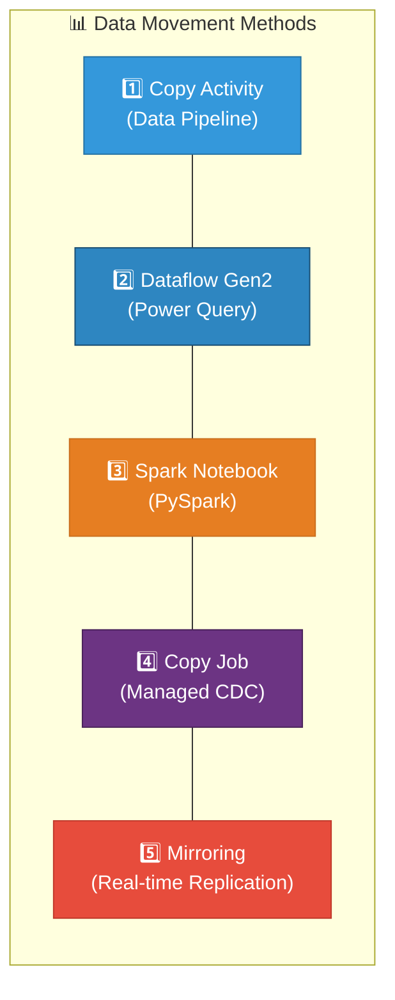
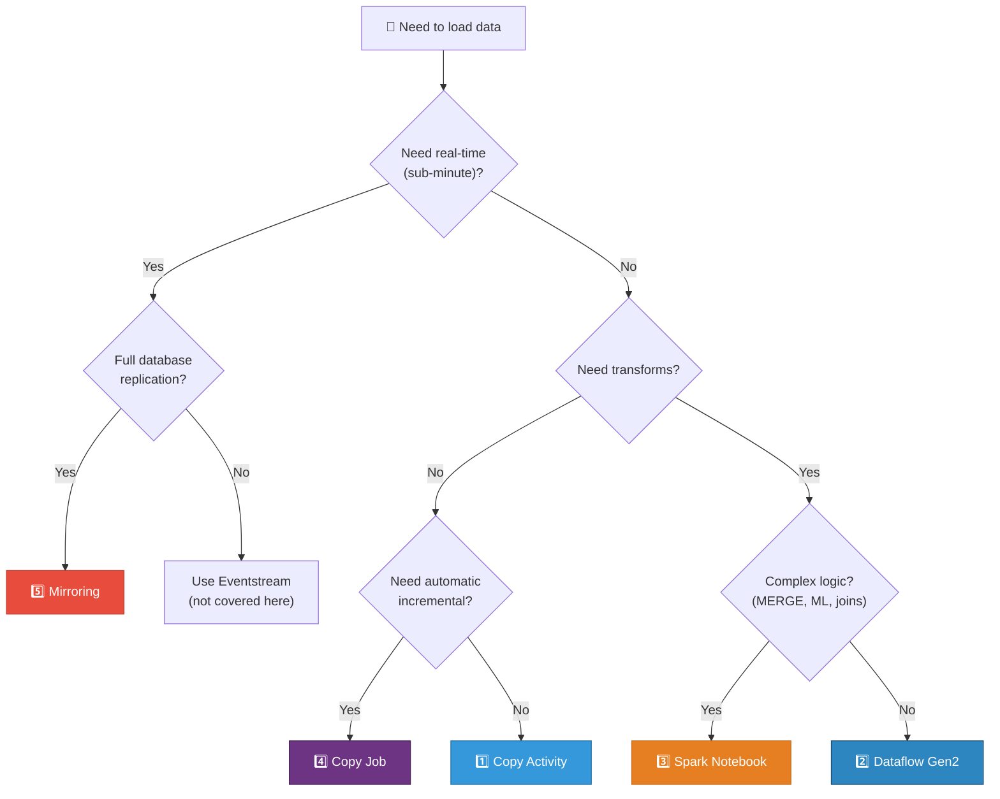
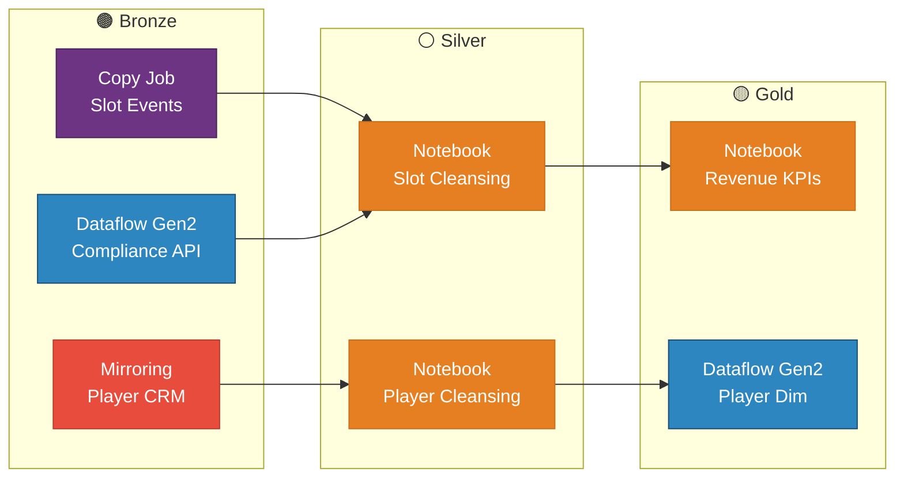

# 🔄 ETL/ELT Comparison Guide — Choosing the Right Data Movement Method

<div align="center" markdown>

**Side-by-Side Comparison of All 5 Fabric Data Ingestion Methods**


</div>

---

**Last Updated:** `2026-04-21` | **Version:** 1.0.0

---

## 🎯 Overview

Microsoft Fabric provides **five distinct methods** for moving data into OneLake. Each has different trade-offs in complexity, transform capability, latency, cost, and skill requirements. This guide compares all five using the same casino slot telemetry dataset, helping you choose the right method for each workload.

### The Five Methods



---

## 📊 Method-by-Method Comparison

### Feature Matrix

| Feature | Copy Activity | Dataflow Gen2 | Spark Notebook | Copy Job | Mirroring |
|---------|:------------:|:-------------:|:--------------:|:--------:|:---------:|
| **Skill Level** | Low | Low-Medium | High | Low | Low |
| **Transform Capability** | None (mapping only) | Medium (Power Query M) | Full (arbitrary code) | Minimal (type cast) | None |
| **Connectors** | 100+ | 300+ | JDBC/ODBC + custom | 10+ | 5 databases |
| **Incremental Support** | Manual watermark | Built-in incremental refresh | Manual checkpoint | Automatic watermark | Automatic CDC |
| **Latency** | Minutes (scheduled) | Minutes (scheduled) | Minutes (scheduled) | Minutes (scheduled) | Seconds (continuous) |
| **Max Volume** | Very large | Moderate (staging helps) | Very large | Large | Full database |
| **Output Format** | Delta, Parquet, CSV | Delta (to Lakehouse/WH) | Any OneLake format | Delta only | Delta (read-only) |
| **Upsert/MERGE** | ❌ | ❌ | ✅ Native | ✅ Built-in | N/A (mirror) |
| **Pipeline Integration** | ✅ Native | ✅ Activity | ✅ Activity | ❌ Standalone | ❌ Standalone |
| **Git Support** | ✅ | ❌ Limited | ✅ | ❌ | ❌ |
| **Unit Testing** | ❌ | ❌ | ✅ pytest | ❌ | ❌ |
| **Schema Evolution** | Manual | Manual | Programmatic | Manual | Automatic |
| **Error Handling** | Retry + failure path | Limited | Full try/except | Retry | Automatic |

### Complexity Spectrum

```
Simple ◄────────────────────────────────────────────────► Complex

 Copy Job    Mirroring    Copy Activity    Dataflow Gen2    Spark Notebook
    │            │              │                │                │
    ▼            ▼              ▼                ▼                ▼
 No-code      No-code       Low-code        Low-code         Full code
 wizard       wizard        pipeline        Power Query      PySpark/SQL
```

---

## 🔧 Same Dataset — Five Ways

The following examples all load the **same casino slot telemetry** table (`dbo.SlotEvents` from SQL Server) into `lh_bronze.bronze_slot_telemetry` in the Bronze Lakehouse.

### Method 1: Copy Activity (Data Pipeline)

```json
{
    "name": "CopySlotTelemetry",
    "type": "Copy",
    "inputs": [{
        "referenceName": "SqlServerSlotEvents",
        "type": "DatasetReference"
    }],
    "outputs": [{
        "referenceName": "LakehouseBronzeSlots",
        "type": "DatasetReference"
    }],
    "typeProperties": {
        "source": {
            "type": "SqlServerSource",
            "sqlReaderQuery": "SELECT * FROM dbo.SlotEvents WHERE event_timestamp > '@{pipeline().parameters.LastLoadTime}'"
        },
        "sink": {
            "type": "LakehouseTableSink",
            "tableActionOption": "Append"
        },
        "translator": {
            "type": "TabularTranslator",
            "mappings": [
                {"source": {"name": "MACHINE_ID"}, "sink": {"name": "machine_id"}},
                {"source": {"name": "CASINO_ID"}, "sink": {"name": "casino_id"}},
                {"source": {"name": "EVENT_TYPE"}, "sink": {"name": "event_type"}},
                {"source": {"name": "EVENT_TS"}, "sink": {"name": "event_timestamp"}},
                {"source": {"name": "COIN_IN"}, "sink": {"name": "coin_in"}},
                {"source": {"name": "COIN_OUT"}, "sink": {"name": "coin_out"}}
            ]
        }
    }
}
```

**Pros**: Pipeline-native, parallelizable, easy column mapping
**Cons**: No transforms beyond rename/cast, manual watermark management

### Method 2: Dataflow Gen2

```powerquery-m
let
    Source = Sql.Database("casino-sql.database.windows.net", "SlotManagement"),
    SlotEvents = Source{[Schema="dbo", Item="SlotEvents"]}[Data],
    Renamed = Table.RenameColumns(SlotEvents, {
        {"MACHINE_ID", "machine_id"}, {"CASINO_ID", "casino_id"},
        {"EVENT_TYPE", "event_type"}, {"EVENT_TS", "event_timestamp"},
        {"COIN_IN", "coin_in"}, {"COIN_OUT", "coin_out"}
    }),
    Typed = Table.TransformColumnTypes(Renamed, {
        {"machine_id", type text}, {"casino_id", type text},
        {"event_type", type text}, {"event_timestamp", type datetimezone},
        {"coin_in", Currency.Type}, {"coin_out", Currency.Type}
    }),
    WithMeta = Table.AddColumn(Typed, "_ingestion_timestamp",
        each DateTimeZone.UtcNow(), type datetimezone)
in
    WithMeta
```

**Data Destination**: `lh_bronze` → `bronze_slot_telemetry` → Append

**Pros**: Query folding, 300+ connectors, familiar Power Query syntax
**Cons**: Memory limits (need staging for large data), no MERGE

### Method 3: Spark Notebook (PySpark)

```python
# Databricks notebook source
# MAGIC %md
# MAGIC # Bronze: Slot Telemetry Ingestion

TARGET_TABLE = "lh_bronze.dbo.bronze_slot_telemetry"

# Read from SQL Server
jdbc_url = "jdbc:sqlserver://casino-sql.database.windows.net;database=SlotManagement"
df_raw = (spark.read
    .format("jdbc")
    .option("url", jdbc_url)
    .option("dbtable", "dbo.SlotEvents")
    .option("user", mssparkutils.credentials.getSecret("kv-casino", "sql-username"))
    .option("password", mssparkutils.credentials.getSecret("kv-casino", "sql-password"))
    .load()
)

# Transform
from pyspark.sql.functions import col, current_timestamp, lit

df_bronze = (df_raw
    .withColumnRenamed("MACHINE_ID", "machine_id")
    .withColumnRenamed("CASINO_ID", "casino_id")
    .withColumnRenamed("EVENT_TYPE", "event_type")
    .withColumnRenamed("EVENT_TS", "event_timestamp")
    .withColumnRenamed("COIN_IN", "coin_in")
    .withColumnRenamed("COIN_OUT", "coin_out")
    .withColumn("_ingestion_timestamp", current_timestamp())
    .withColumn("_source_system", lit("SlotManagement_OLTP"))
)

# Write to Lakehouse Delta table
df_bronze.write.format("delta").mode("append").saveAsTable(TARGET_TABLE)

print(f"Loaded {df_bronze.count()} rows to {TARGET_TABLE}")
```

**Pros**: Full code control, Delta MERGE, unit testable, schema enforcement
**Cons**: Spark session cold start (30-60s), requires PySpark skills

### Method 4: Copy Job

```
Copy Job: casino-slot-ingestion
  Source: SQL Server (casino-sql.database.windows.net / SlotManagement)
  Tables:
    - dbo.SlotEvents → bronze_slot_telemetry
      Incremental column: EVENT_TS (timestamp)
      Write mode: Append
  Schedule: Every 15 minutes
```

**Pros**: Automatic watermark, zero code, built-in monitoring
**Cons**: Minimal transforms, limited connectors, Delta output only

### Method 5: Mirroring

```
Mirrored Database: casino-slot-mirror
  Source: SQL Server (casino-sql.database.windows.net / SlotManagement)
  Replicated tables: dbo.SlotEvents, dbo.Players, dbo.Machines
  Mode: Continuous CDC (change data capture)
  Output: Read-only Delta tables in OneLake
```

**Pros**: Real-time (seconds latency), zero code, full database replication
**Cons**: Read-only output, limited to 5 database types, no transforms

---

## 💰 Cost and Performance Comparison

### Benchmark: 100K Rows Daily Load

| Metric | Copy Activity | Dataflow Gen2 | Spark Notebook | Copy Job | Mirroring |
|--------|:------------:|:-------------:|:--------------:|:--------:|:---------:|
| **Setup Time** | 30 min | 20 min | 1-2 hours | 10 min | 5 min |
| **Execution Time** | ~2 min | ~3 min | ~4 min (incl. cold start) | ~2 min | Continuous |
| **CU Cost/Run** | ~0.5% F64 | ~1% F64 | ~1.5% F64 | ~0.5% F64 | ~0.3% F64 (continuous) |
| **Daily CU (hourly schedule)** | ~12% F64 | ~24% F64 | ~36% F64 | ~12% F64 | ~7% F64 |
| **Maintainability** | Medium | Medium | High | Low | Low |
| **Testability** | Low | Low | High (pytest) | Low | N/A |

### CU Consumption by Volume

| Daily Volume | Copy Activity | Dataflow Gen2 | Spark Notebook | Copy Job |
|-------------|:------------:|:-------------:|:--------------:|:--------:|
| 10K rows | < 0.1% | < 0.2% | ~0.5% | < 0.1% |
| 100K rows | ~0.5% | ~1% | ~1.5% | ~0.5% |
| 1M rows | ~2% | ~4% (staging) | ~3% | ~2% |
| 10M rows | ~8% | ~15% (staging) | ~6% | ~8% |
| 100M rows | ~30% | Not recommended | ~20% | ~30% |

> 💡 **Note**: Spark Notebooks become more cost-efficient at very large volumes because Spark's distributed processing amortizes the cold-start overhead. Below 1M rows, Copy Activity and Copy Job are more efficient.

---

## 🧭 Decision Matrix

### Quick Decision Flowchart



### Scenario-Based Recommendations

| Scenario | Recommended Method | Why |
|----------|-------------------|-----|
| **Full table snapshot daily** | Copy Activity | Simple, fast, pipeline-native |
| **Incremental load every 15 min** | Copy Job | Automatic watermark, zero code |
| **Analyst-led data prep** | Dataflow Gen2 | Power Query familiarity |
| **Complex ETL with business rules** | Spark Notebook | Full code control, MERGE support |
| **Real-time database sync** | Mirroring | Continuous CDC, no code |
| **Bronze raw ingestion** | Copy Activity or Copy Job | No transforms needed |
| **Silver cleansing + dedup** | Spark Notebook | Delta MERGE for dedup/SCD2 |
| **Gold aggregations** | Spark Notebook or Dataflow Gen2 | Depends on complexity |
| **REST API ingestion** | Dataflow Gen2 | Native REST connector + transforms |
| **Mainframe / EBCDIC** | Spark Notebook | Custom parsing required |
| **Power BI semantic model refresh** | Dataflow Gen2 | Familiar tooling for BI teams |

---

## 🔀 Migration Paths

### Upgrading Between Methods

```
Copy Activity ─────► Copy Job
  When: You need automatic incremental without pipeline complexity

Copy Activity ─────► Spark Notebook
  When: You need transforms, MERGE, or schema enforcement

Dataflow Gen2 ─────► Spark Notebook
  When: Volume exceeds staging limits or you need MERGE/SCD2

Copy Job ──────────► Mirroring
  When: You need real-time and source is a supported database

Spark Notebook ────► Dataflow Gen2
  When: Simplifying for analyst self-service (if transforms are simple enough)
```

### Common Migration Scenarios

| From | To | Trigger | Effort |
|------|----|---------|--------|
| Copy Activity (ADF) | Copy Activity (Fabric Pipeline) | ADF → Fabric migration | Low (same engine) |
| SSIS packages | Spark Notebook | SQL Server migration | High (rewrite) |
| SSIS packages | Dataflow Gen2 | SQL Server migration | Medium (visual rebuild) |
| Power BI Dataflows | Dataflow Gen2 | Power BI → Fabric migration | Low (same M language) |
| ADB Notebooks | Spark Notebooks | Databricks → Fabric migration | Medium (runtime differences) |
| Informatica / Talend | Dataflow Gen2 or Notebook | Legacy ETL modernization | High (rebuild) |

---

## 🎰 Casino Recommendations

### Recommended Architecture

| Layer | Workload | Method | Rationale |
|-------|----------|--------|-----------|
| **Bronze** | Slot telemetry (SQL Server) | Copy Job | Auto-incremental, 15-min cadence |
| **Bronze** | Player CRM (SQL Server) | Mirroring | Real-time player data for floor ops |
| **Bronze** | Compliance filings (REST API) | Dataflow Gen2 | REST connector + light transforms |
| **Bronze** | Historical load (one-time) | Copy Activity | Bulk copy, no transforms needed |
| **Silver** | Slot cleansing + dedup | Spark Notebook | MERGE, DQ scoring, derived KPIs |
| **Silver** | Player cleansing | Spark Notebook | PII masking, SCD Type 2 |
| **Gold** | Daily revenue KPIs | Spark Notebook | Complex aggregation + window functions |
| **Gold** | Player dimensions | Dataflow Gen2 | Simple reshape for BI team self-service |
| **Gold** | Compliance screening | Spark Notebook | CTR/SAR logic requires code |

### Mixed-Method Pipeline



---

## 🏛️ Federal Agency Recommendations

| Agency | Bronze Method | Silver Method | Rationale |
|--------|-------------|--------------|-----------|
| **USDA** | Dataflow Gen2 (REST API) | Spark Notebook | API source + complex commodity transforms |
| **SBA** | Copy Job (Azure SQL) | Spark Notebook | Incremental loan data + fraud scoring |
| **NOAA** | Copy Job (REST → staging) | Spark Notebook | High-frequency weather data + anomaly detection |
| **EPA** | Dataflow Gen2 (REST API) | Spark Notebook | API source + AQI calculations |
| **DOI** | Dataflow Gen2 (REST API) | Spark Notebook | API source + geospatial processing |

---

## 📚 References

| Resource | URL |
|----------|-----|
| Data Factory Overview | https://learn.microsoft.com/fabric/data-factory/data-factory-overview |
| Copy Activity | https://learn.microsoft.com/fabric/data-factory/copy-data-activity |
| Dataflow Gen2 | https://learn.microsoft.com/fabric/data-factory/create-first-dataflow-gen2 |
| Spark Notebooks | https://learn.microsoft.com/fabric/data-engineering/how-to-use-notebook |
| Copy Job | https://learn.microsoft.com/fabric/data-factory/copy-job-overview |
| Mirroring | https://learn.microsoft.com/fabric/database/mirrored-database/overview |

---

## 🔗 Related Documents

- [Dataflow Gen2](../features/dataflow-gen2.md) — Full Dataflow Gen2 feature doc
- [Copy Job CDC](../features/copy-job-cdc.md) — Copy Job feature doc
- [Mirroring](../features/mirroring.md) — Database Mirroring feature doc
- [Medallion Architecture Deep Dive](medallion-architecture-deep-dive.md) — Medallion layer patterns
- [Performance Best Practices](performance-parallelism.md) — Delta table optimization
- [Architecture](../ARCHITECTURE.md) — System architecture overview

---

> 📝 **Document Metadata**
> - **Author**: Documentation Team
> - **Reviewers**: Data Engineering, Data Factory, Analytics, Platform
> - **Classification**: Internal
> - **Next Review**: 2026-07-21
