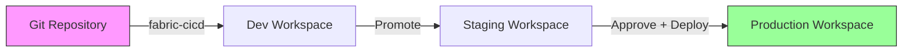
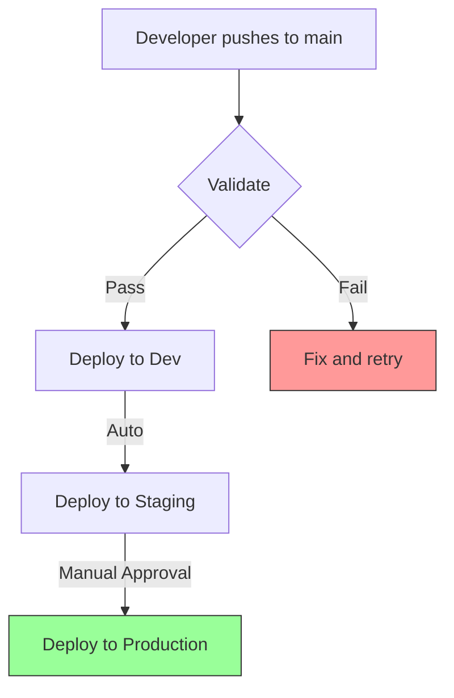

[Home](../index.md) > [Docs](../) > [Best Practices](./) > fabric-cicd Deployment

# CI/CD for Microsoft Fabric with `fabric-cicd`


---

## Table of Contents

- [Overview](#overview)
- [What is fabric-cicd?](#what-is-fabric-cicd)
- [Prerequisites](#prerequisites)
- [Installation](#installation)
- [Authentication](#authentication)
- [Project Structure](#project-structure)
- [Deployment Script](#deployment-script)
- [GitHub Actions Workflow](#github-actions-workflow)
- [Environment Promotion](#environment-promotion)
- [Item Types](#item-types)
- [Parameter Overrides](#parameter-overrides)
- [Dependency Management](#dependency-management)
- [Dry Run Mode](#dry-run-mode)
- [Troubleshooting](#troubleshooting)
- [Casino Implementation](#casino-implementation)
- [Federal Agency Implementation](#federal-agency-implementation)
- [References](#references)

---

## Overview

Microsoft Fabric's **`fabric-cicd`** Python library (GA February 2026) is the officially supported mechanism for deploying Fabric items (notebooks, lakehouses, semantic models, pipelines, warehouses) across environments using source control. It replaces the legacy Deployment Pipelines REST API approach with a declarative, Git-integrated workflow.

> **Why fabric-cicd over Deployment Pipelines?**
> - Source-controlled item definitions (Git as source of truth)
> - Standard CI/CD patterns (GitHub Actions, Azure DevOps)
> - Programmatic control over item scoping and ordering
> - Works with any Git provider (not just Fabric Git integration)

---

## What is fabric-cicd?

`fabric-cicd` is a Python package published on [PyPI](https://pypi.org/project/fabric-cicd/) that:

1. **Reads** Fabric item definitions from a local repository directory
2. **Authenticates** to the Fabric REST API using Azure Identity
3. **Publishes** items to a target Fabric workspace, handling dependencies and ordering automatically



---

## Prerequisites

| Requirement | Details |
|---|---|
| **Python** | 3.9 or later |
| **Packages** | `fabric-cicd`, `azure-identity` |
| **Azure AD App** | App Registration with Fabric API permissions |
| **OIDC** | Federated identity for GitHub Actions (recommended) |
| **Workspace** | One Fabric workspace per environment (dev, staging, prod) |
| **Permissions** | Contributor or Admin on target workspaces |

---

## Installation

```bash
# Install the library
pip install fabric-cicd azure-identity

# Verify installation
python -c "from fabric_cicd import FabricWorkspace, publish_all_items; print('OK')"
```

---

## Authentication

### Local Development (Interactive)

```python
from azure.identity import InteractiveBrowserCredential

credential = InteractiveBrowserCredential()
```

### CI/CD Pipeline (OIDC - Recommended)

```yaml
# GitHub Actions - OIDC federated identity
- name: Azure Login (OIDC)
  uses: azure/login@v2
  with:
    client-id: ${{ secrets.AZURE_CLIENT_ID }}
    tenant-id: ${{ secrets.AZURE_TENANT_ID }}
    subscription-id: ${{ secrets.AZURE_SUBSCRIPTION_ID }}
```

```python
from azure.identity import DefaultAzureCredential

# Picks up OIDC token from azure/login step
credential = DefaultAzureCredential()
```

### Service Principal (Non-OIDC)

```python
from azure.identity import ClientSecretCredential

credential = ClientSecretCredential(
    tenant_id="<tenant-id>",
    client_id="<client-id>",
    client_secret="<client-secret>"
)
```

> **Security:** Prefer OIDC federated identity over client secrets. No secrets to rotate, no credential leakage risk.

---

## Project Structure

Organize your repository so `fabric-cicd` can discover item definitions:

```
repo-root/
+-- notebooks/
|   +-- bronze/
|   |   +-- 01_bronze_slot_telemetry.py
|   +-- silver/
|   +-- gold/
+-- semantic-models/
|   +-- casino-analytics/
|   |   +-- model.bim
+-- pipelines/
|   +-- daily-ingestion/
|   |   +-- pipeline-content.json
+-- lakehouses/
|   +-- lh_bronze/
|   +-- lh_silver/
|   +-- lh_gold/
+-- scripts/
|   +-- fabric-cicd-deploy.py
+-- .github/
    +-- workflows/
        +-- deploy-fabric.yml
```

The `FabricWorkspace` client scans the `repository_directory` for item definitions matching `item_type_in_scope`.

---

## Deployment Script

Our POC uses `scripts/fabric-cicd-deploy.py`:

```python
from fabric_cicd import FabricWorkspace, publish_all_items
from azure.identity import DefaultAzureCredential

credential = DefaultAzureCredential()
repo_root = Path(__file__).parent.parent

workspace = FabricWorkspace(
    workspace_id="<workspace-guid>",
    repository_directory=str(repo_root),
    item_type_in_scope=["Notebook", "Lakehouse", "SemanticModel"],
    credential=credential,
)

publish_all_items(workspace)
```

### CLI Usage

```bash
# Deploy to dev (dry run)
python scripts/fabric-cicd-deploy.py \
    --workspace-id "abc123-..." \
    --environment dev \
    --item-type-in-scope Notebook Lakehouse SemanticModel \
    --dry-run

# Deploy to production
python scripts/fabric-cicd-deploy.py \
    --workspace-id "xyz789-..." \
    --environment prod \
    --item-type-in-scope Notebook Lakehouse SemanticModel
```

---

## GitHub Actions Workflow

Our POC uses `.github/workflows/deploy-fabric.yml` with a 4-stage pipeline:

```
Validate --> Deploy Dev --> Deploy Staging --> Deploy Production
                                                  (requires approval)
```

### Key Features

| Feature | Implementation |
|---|---|
| **Trigger** | Push to `main` on notebook/model/pipeline changes |
| **Manual Deploy** | `workflow_dispatch` with environment and dry-run inputs |
| **Authentication** | OIDC federated identity (no secrets) |
| **Validation** | Notebook format lint, fabric-cicd install check |
| **Environments** | GitHub Environments with protection rules |
| **Approval Gate** | Production requires manual approval |

### Secrets Configuration

| Secret | Description |
|---|---|
| `AZURE_CLIENT_ID` | App Registration client ID |
| `AZURE_TENANT_ID` | Azure AD tenant ID |
| `AZURE_SUBSCRIPTION_ID` | Azure subscription ID |
| `FABRIC_DEV_WORKSPACE_ID` | Dev workspace GUID |
| `FABRIC_STAGING_WORKSPACE_ID` | Staging workspace GUID |
| `FABRIC_PROD_WORKSPACE_ID` | Production workspace GUID |

---

## Environment Promotion



### Environment-Specific Parameters

```python
ENVIRONMENT_PARAMS = {
    "dev": {
        "lakehouse_name_suffix": "_dev",
        "connection_overrides": {},
    },
    "staging": {
        "lakehouse_name_suffix": "_staging",
        "connection_overrides": {},
    },
    "prod": {
        "lakehouse_name_suffix": "",
        "connection_overrides": {},
    },
}
```

Suffix conventions ensure each environment has isolated Lakehouses (e.g., `lh_bronze_dev`, `lh_bronze_staging`, `lh_bronze`).

---

## Item Types

`fabric-cicd` supports the following Fabric item types:

| Item Type | Directory | Notes |
|---|---|---|
| `Notebook` | `notebooks/` | .py (Databricks format) or .ipynb |
| `Lakehouse` | `lakehouses/` | Metadata definitions |
| `SemanticModel` | `semantic-models/` | Power BI dataset definitions (.bim) |
| `Pipeline` | `pipelines/` | Data Factory pipeline JSON |
| `Warehouse` | `warehouses/` | SQL Warehouse definitions |
| `Report` | `reports/` | Power BI report definitions |
| `Environment` | `environments/` | Spark environment configs |

Specify which types to deploy with `item_type_in_scope`:

```python
workspace = FabricWorkspace(
    workspace_id="...",
    repository_directory=".",
    item_type_in_scope=["Notebook", "Lakehouse", "SemanticModel"],
    credential=credential,
)
```

---

## Parameter Overrides

For environment-specific configurations, use parameter files or environment variables:

```python
# Example: Override lakehouse connections per environment
import os

env = os.getenv("DEPLOY_ENVIRONMENT", "dev")

# Swap connection strings in notebook parameters
if env == "prod":
    os.environ["LAKEHOUSE_NAME"] = "lh_bronze"
else:
    os.environ["LAKEHOUSE_NAME"] = f"lh_bronze_{env}"
```

---

## Dependency Management

`fabric-cicd` handles item dependencies automatically:
- Lakehouses are deployed before Notebooks that reference them
- Semantic Models are deployed after their source Lakehouses
- Pipelines are deployed after their referenced activities

If you need explicit ordering, deploy item types in separate `publish_all_items` calls:

```python
# Deploy Lakehouses first
workspace_lh = FabricWorkspace(
    workspace_id=ws_id,
    repository_directory=repo_root,
    item_type_in_scope=["Lakehouse"],
    credential=credential,
)
publish_all_items(workspace_lh)

# Then deploy Notebooks
workspace_nb = FabricWorkspace(
    workspace_id=ws_id,
    repository_directory=repo_root,
    item_type_in_scope=["Notebook"],
    credential=credential,
)
publish_all_items(workspace_nb)
```

---

## Dry Run Mode

Always preview changes before deploying to production:

```bash
python scripts/fabric-cicd-deploy.py \
    --workspace-id "..." \
    --environment prod \
    --dry-run
```

Dry run mode:
- Lists all items that would be deployed
- Shows file counts per item type
- Does NOT authenticate or modify the workspace

---

## Troubleshooting

| Issue | Solution |
|---|---|
| `ImportError: fabric_cicd` | Run `pip install fabric-cicd` |
| Authentication failure | Check OIDC config, verify app permissions |
| Item not found | Verify directory structure matches item type conventions |
| Permission denied | Ensure service principal has Contributor on workspace |
| Stale items | `fabric-cicd` only adds/updates; it does not delete items not in source |

---

## Casino Implementation

For the Casino/Gaming POC:

```bash
# Deploy casino notebooks and models
python scripts/fabric-cicd-deploy.py \
    --workspace-id "$CASINO_WORKSPACE_ID" \
    --environment prod \
    --item-type-in-scope Notebook Lakehouse SemanticModel
```

**Deployed items:**
- 50+ medallion notebooks (bronze/silver/gold)
- 3 Lakehouses (lh_bronze, lh_silver, lh_gold)
- Casino analytics semantic model
- Real-time intelligence pipelines

---

## Federal Agency Implementation

For federal deployments, use separate workspaces per agency with fabric-cicd:

```bash
# Deploy USDA workspace
python scripts/fabric-cicd-deploy.py \
    --workspace-id "$USDA_WORKSPACE_ID" \
    --environment prod \
    --item-type-in-scope Notebook Lakehouse

# Deploy SBA workspace
python scripts/fabric-cicd-deploy.py \
    --workspace-id "$SBA_WORKSPACE_ID" \
    --environment prod \
    --item-type-in-scope Notebook Lakehouse
```

> **Compliance:** Each agency workspace operates in isolation with separate authentication credentials, ensuring FedRAMP and FISMA compliance boundaries.

---

## References

- [fabric-cicd on PyPI](https://pypi.org/project/fabric-cicd/)
- [Microsoft Learn: Manage Fabric Deployments](https://learn.microsoft.com/fabric/cicd/manage-deployment)
- [GitHub Actions OIDC with Azure](https://learn.microsoft.com/azure/developer/github/connect-from-azure)
- [Fabric REST API](https://learn.microsoft.com/rest/api/fabric/)
- [Fabric Git Integration](https://learn.microsoft.com/fabric/cicd/git-integration/intro-to-git-integration)

---

> **Next Steps:**
> - [Data Governance Deep Dive](data-governance-deep-dive.md) - Sensitivity labels and compliance
> - [Outbound Access Protection](outbound-access-protection.md) - Data exfiltration prevention
> - [Customer-Managed Keys](customer-managed-keys.md) - Encryption key management
