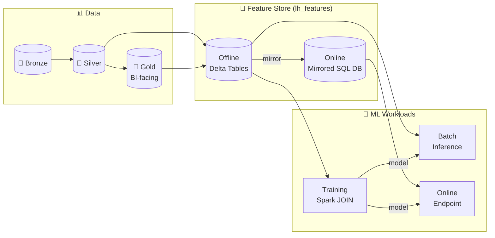
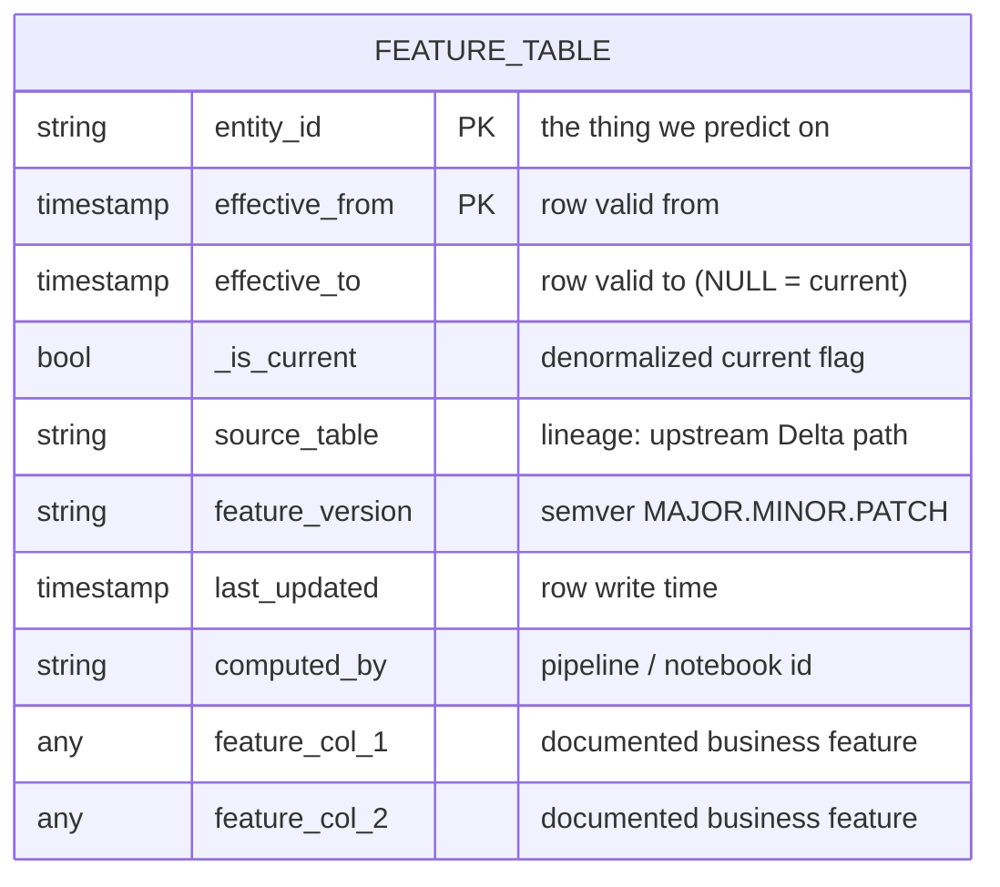
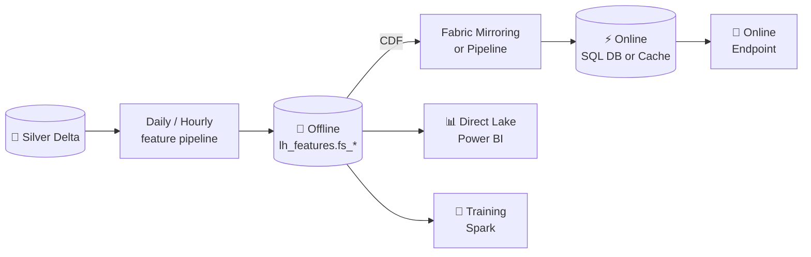
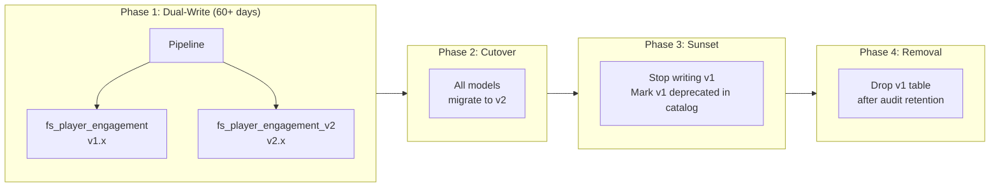

# 🏪 Feature Store on OneLake

<div align="center" markdown>

**Versioned, Reusable Features with Point-in-Time Correctness on Microsoft Fabric**


</div>

---

**Last Updated:** `2026-04-27` | **Version:** 1.0.0 | **Wave:** 2 (MLOps & ML/AI Production)

---

## 🎯 Why a Feature Store

Most ML teams reinvent feature engineering for every project. Two data scientists build "30-day average wager" three different ways — different filters, different joins, different windows — and end up with three different numbers. Three months later, the model trained on definition A drifts because the production scoring path uses definition B. Nobody can find the existing feature; everybody rebuilds.

A **feature store** is the discipline of treating features as **versioned, owned, documented, reusable assets** stored in OneLake — the same rigor MLOps applies to models. The store is not magic infrastructure: it's a set of conventions, a small library of helpers, and a governance model.

### What "Feature Store on OneLake" Means in Fabric

| Aspect | Ad-Hoc Feature Engineering | Feature Store on OneLake |
|--------|---------------------------|-------------------------|
| **Definition** | Lives in a notebook; re-derived per project | Lives in `lh_features.fs_*` Delta tables, single source of truth |
| **Discovery** | Slack search, "ask Bob" | OneLake Catalog tag, Purview entry, feature card |
| **Reuse** | Copy-paste between notebooks | Import the table; `JOIN` on entity_id |
| **Correctness** | Often leaks future data | AS-OF JOIN with `effective_from`/`effective_to` |
| **Versioning** | None (or "v2" hardcoded) | Semver: `1.0.0`, `1.1.0`, `2.0.0` |
| **Lineage** | Untracked | Purview source → feature → model graph |
| **Online serving** | "We'll figure it out at deploy time" | Mirroring or SQL endpoint, planned upfront |
| **Ownership** | Whoever wrote it last | RACI on the feature card |

### Where the Feature Store Fits

The feature store sits **above Silver, parallel to Gold**, in its own dedicated lakehouse. It is the structured input contract for ML training and inference, the way Gold is the structured input contract for BI.



> 📝 **Scope:** This doc is part of the [MLOps Wave 2](mlops-fabric-production.md) anchor. It defines feature-store conventions; the model lifecycle around those features lives in the anchor doc and [Model Monitoring & Drift Detection](model-monitoring-drift-detection.md).

---

## 🏛️ The Three Feature Store Pillars

A feature store earns its keep on three pillars. Drop any one and you've built a glorified Gold table.

| Pillar | What It Means | What Breaks Without It |
|--------|--------------|----------------------|
| **🔍 Discovery** | Anyone can find existing features in <2 min via OneLake Catalog + Purview | Teams rebuild the same feature 3+ times, definitions diverge |
| **♻️ Reuse** | Features are stable contracts: same entity_id, same schema, same semver bump rules | Every project owns its own pipeline; cost and complexity compound |
| **🎯 Correctness** | Point-in-time bitemporal joins prevent training-serving leakage | Models look great in dev, regress in prod, "the data was different" |

**The three pillars must be enforced with conventions and tooling, not hope.** This document is the convention; the helper library lives in [`src/feature_store/`](https://github.com/fgarofalo56/Suppercharge_Microsoft_Fabric/tree/main/notebooks/ml) (created in Phase 14).

---

## 🗂️ Feature Table Schema Pattern

Every feature table is a Delta table in `lh_features` that follows a strict schema contract.

### Required Columns



### Schema Reference

| Column | Type | Required | Purpose |
|--------|------|----------|---------|
| `entity_id` | STRING (or composite) | ✅ | The "thing" we predict on (`player_id`, `loan_application_id`, `machine_id`). Part of PK. |
| `effective_from` | TIMESTAMP | ✅ | Row's validity start. Bitemporal lower bound. Part of PK. |
| `effective_to` | TIMESTAMP | ✅ | Row's validity end. `NULL` or `9999-12-31` for current rows. |
| `_is_current` | BOOLEAN | ✅ | Denormalized current-row flag for fast online lookups. |
| `feature_*` | typed | ✅ | Business features. Each must be documented in the feature card. |
| `source_table` | STRING | ✅ | Upstream Delta path (`lh_silver.player_sessions`). For lineage. |
| `feature_version` | STRING | ✅ | Semver of the **definition** (`1.0.0`). Bumped per the [Versioning Strategy](#-versioning-strategy). |
| `last_updated` | TIMESTAMP | ✅ | When this row was last written (housekeeping, distinct from `effective_from`). |
| `computed_by` | STRING | ✅ | Pipeline run ID (`run-20260427-020000-abc123`) for forensic debugging. |

### DDL Template

```sql
CREATE TABLE lh_features.fs_player_engagement (
    -- Identity & bitemporal
    player_id           STRING        NOT NULL,
    effective_from      TIMESTAMP     NOT NULL,
    effective_to        TIMESTAMP,
    _is_current         BOOLEAN       NOT NULL,

    -- Features (documented in feature card)
    engagement_score    DOUBLE        COMMENT 'Composite 0-100; see fs_player_engagement.md',
    sessions_30d        INT           COMMENT 'Count of distinct sessions in trailing 30 days',
    avg_wager_30d       DECIMAL(18,2) COMMENT 'Avg per-session wager USD, trailing 30 days',
    churn_risk_score    DOUBLE        COMMENT 'Logistic 0-1; output of churn_risk_v3 model',
    ltv_estimate        DECIMAL(18,2) COMMENT '12-month LTV USD; gradient-boosted estimate',

    -- Lineage
    source_table        STRING        NOT NULL,
    feature_version     STRING        NOT NULL,
    last_updated        TIMESTAMP     NOT NULL,
    computed_by         STRING        NOT NULL
)
USING DELTA
PARTITIONED BY (DATE(effective_from))
TBLPROPERTIES (
    'delta.enableChangeDataFeed' = 'true',
    'feature_store.entity'       = 'player',
    'feature_store.owner'        = 'casino-data-science',
    'feature_store.version'      = '1.0.0'
);
```

> The `delta.enableChangeDataFeed = true` setting is required to support [online mirroring](#-offline-vs-online-feature-patterns) without full-table reloads.

---

## ⏳ Point-in-Time Correctness

This is the section to read twice. Point-in-time correctness is what separates a feature store from a Gold KPI table, and getting it wrong is the most common — and most damaging — feature-store bug.

### The Data Leakage Problem

Imagine training a churn model. You have:

- A label table: `player_id`, `event_time`, `churned_30d_later`
- A feature table: `player_id`, `engagement_score`

Naive join:

```python
# ❌ WRONG: Joins on player_id only — uses TODAY's engagement_score for a 6-month-old churn event
df_train = labels.join(features, on="player_id")
```

Today's `engagement_score` reflects **what happened after** the churn event — including the churn itself. The model learns "low engagement → churn" not because that's predictive, but because it's tautological. You'll see 0.99 AUC in training and 0.55 in production. We've all seen it.

### The Fix: AS-OF JOIN

A feature value is only valid for a label if the feature row's effective window contains the label's event time. This requires `effective_from <= event_time < effective_to`.

```python
# ✅ CORRECT: AS-OF JOIN — uses the engagement_score that was current AT the prediction event
from pyspark.sql import functions as F

labels = spark.table("lh_silver.churn_labels")     # player_id, event_time, churned_30d_later
features = spark.table("lh_features.fs_player_engagement")

df_train = (
    labels.alias("l")
    .join(
        features.alias("f"),
        (F.col("l.player_id") == F.col("f.player_id"))
        & (F.col("f.effective_from") <= F.col("l.event_time"))
        & ((F.col("f.effective_to").isNull()) | (F.col("l.event_time") < F.col("f.effective_to"))),
        how="left"
    )
    .select(
        "l.player_id",
        "l.event_time",
        "l.churned_30d_later",
        "f.engagement_score",
        "f.sessions_30d",
        "f.avg_wager_30d",
        "f.feature_version",   # capture the version each row was trained with
    )
)
```

### SCD Type 2 Feature Evolution

Features change over time. A player's `loyalty_tier` may shift from Silver to Gold to Platinum. The feature store stores **all historical versions** so any past prediction event can be reconstructed.

```python
# Daily feature compute with SCD Type 2 evolution
from delta.tables import DeltaTable
from pyspark.sql import functions as F

# 1. Compute today's feature snapshot
df_today = (
    spark.table("lh_silver.player_sessions_validated")
    .filter(F.col("session_date") >= F.date_sub(F.current_date(), 30))
    .groupBy("player_id")
    .agg(
        F.count("session_id").alias("sessions_30d"),
        F.avg("wager_amount").alias("avg_wager_30d"),
        F.sum("net_win").alias("net_win_30d"),
    )
    .withColumn("engagement_score",
        F.col("sessions_30d") * 2.5 + F.col("avg_wager_30d") / 10.0
    )
    .withColumn("effective_from", F.current_timestamp())
    .withColumn("effective_to", F.lit(None).cast("timestamp"))
    .withColumn("_is_current", F.lit(True))
    .withColumn("source_table", F.lit("lh_silver.player_sessions_validated"))
    .withColumn("feature_version", F.lit("1.0.0"))
    .withColumn("last_updated", F.current_timestamp())
    .withColumn("computed_by", F.lit(spark.conf.get("spark.fabric.run_id", "unknown")))
)

# 2. Identify changed rows (compare to current)
target = DeltaTable.forName(spark, "lh_features.fs_player_engagement")

df_current = (
    spark.table("lh_features.fs_player_engagement")
    .filter("_is_current = true")
    .select("player_id", "engagement_score", "sessions_30d", "avg_wager_30d")
    .alias("cur")
)

df_changes = (
    df_today.alias("new")
    .join(df_current, on="player_id", how="left")
    .filter(
        F.col("cur.player_id").isNull()                                            # new entity
        | (F.abs(F.col("new.engagement_score") - F.col("cur.engagement_score")) > 0.01)
        | (F.col("new.sessions_30d") != F.col("cur.sessions_30d"))
        | (F.abs(F.col("new.avg_wager_30d") - F.col("cur.avg_wager_30d")) > 0.01)
    )
    .select("new.*")
)

# 3. Expire current rows that are about to be superseded
(
    target.alias("tgt")
    .merge(
        df_changes.select("player_id").alias("chg"),
        "tgt.player_id = chg.player_id AND tgt._is_current = true"
    )
    .whenMatchedUpdate(set={
        "_is_current": "false",
        "effective_to": "current_timestamp()"
    })
    .execute()
)

# 4. Append new current rows
df_changes.write.format("delta").mode("append").saveAsTable("lh_features.fs_player_engagement")
```

### Common Bugs to Avoid

| Bug | Symptom | Fix |
|-----|---------|-----|
| Join on entity_id only | Train AUC > prod AUC by 0.20+ | AS-OF JOIN with `effective_from`/`effective_to` |
| `effective_to` exclusive vs inclusive mixed | Off-by-one row at expiration boundaries | **Always** half-open: `[effective_from, effective_to)` |
| Compute features at training time | Different values when scoring | Compute once in store; read the same row at train and score |
| Use feature `last_updated` instead of `effective_from` | "Latest" feature drifts forward as you backfill | `effective_from` is the business-time clock; `last_updated` is the wall clock |
| Backfill overwrites without expiring | History collapses; can't reconstruct old predictions | Always SCD Type 2; never `MODE("overwrite")` on a feature table |
| Mix grains in one table | Some rows daily, some hourly — joins explode | One feature table = one grain. Separate `fs_player_engagement_daily` and `fs_player_engagement_hourly`. |
| Drop `feature_version` from training rows | Can't reproduce a model run | Always log `feature_version` per row in the training set; pin it in MLflow params |
| Use server time for `effective_from` on backfills | Backfilled history has tomorrow's effective_from | Pass an explicit `as_of_date` parameter; default to `current_timestamp()` only for live runs |

---

## 🚦 Offline vs Online Feature Patterns

Features serve two very different traffic patterns. The store supports both, with a deliberate sync strategy.

### Offline (Batch / Training / BI)

| Aspect | Detail |
|--------|--------|
| **Storage** | Delta tables in `lh_features` |
| **Access** | Spark `JOIN`, SQL endpoint, [Direct Lake](../features/direct-lake.md) for BI |
| **Latency** | Seconds-to-minutes |
| **Volume** | Millions to billions of rows |
| **Use cases** | Training, batch scoring, exploratory analysis, BI of feature distributions |

### Online (Inference / Real-Time)

| Aspect | Detail |
|--------|--------|
| **Storage** | [Fabric SQL Database](../features/fabric-sql-database.md) (mirrored from offline Delta) — *or* SQL analytics endpoint cache |
| **Access** | REST query, [GraphQL API](../features/api-for-graphql.md), direct SQL |
| **Latency** | < 100 ms p99 lookup by `entity_id` |
| **Volume** | One row per request, billions of requests |
| **Use cases** | Online endpoints, app personalization, real-time scoring |

### Synchronization Pattern: Offline-First → Mirror to Online

The offline store is the **system of record**. The online store is a **derived, latency-optimized projection**. Never write to online directly — always materialize from offline so the two cannot diverge.



```python
# Mirror current rows to the online SQL DB
# Triggered after each offline feature pipeline run
from pyspark.sql import functions as F

current_features = (
    spark.table("lh_features.fs_player_engagement")
    .filter("_is_current = true")
    .select(
        "player_id",
        "engagement_score",
        "sessions_30d",
        "avg_wager_30d",
        "churn_risk_score",
        "ltv_estimate",
        "feature_version",
        "last_updated",
    )
)

# Write to mirrored Fabric SQL DB (table: features_online.fs_player_engagement_current)
(
    current_features.write
    .format("jdbc")
    .option("url", spark.conf.get("spark.fabric.online_features.jdbc_url"))
    .option("dbtable", "features_online.fs_player_engagement_current")
    .option("truncate", "true")
    .mode("overwrite")
    .save()
)
```

> 💡 **Tip:** For features that change slowly (player loyalty tier), once-daily sync is fine. For features that change quickly (last-hour activity), use [streaming features](#️-computation-patterns) and mirror via Eventhouse → SQL DB pipeline.

---

## 📝 Naming Conventions

### Table Names

```
fs_<entity>_<feature_group>
```

- **Prefix `fs_`** distinguishes feature tables from facts/dimensions in joint queries.
- **`<entity>`** is the singular noun the features describe (`player`, `machine`, `loan_applicant`, `parcel`).
- **`<feature_group>`** describes the cohesive set of features (`engagement`, `telemetry`, `credit_history`).

| ✅ Good | ❌ Avoid |
|---------|---------|
| `fs_player_engagement` | `player_features` (no prefix) |
| `fs_machine_telemetry` | `fs_features_v2` (no entity, no group) |
| `fs_loan_applicant_credit` | `loan_app_creds_final_FINAL` |

### Lakehouse and Schema

```
lh_features                                ← dedicated lakehouse, separate from lh_gold
└── fs_player_engagement                  ← one table per entity × feature_group
└── fs_player_lifetime_value
└── fs_machine_telemetry
└── fs_loan_applicant_credit
```

The dedicated `lh_features` lakehouse exists **for governance**: feature engineers own it, RBAC is scoped to it, and OneLake Catalog tags filter to it. Mixing features into `lh_gold` blurs ownership and makes RBAC harder.

### Column Names

| Convention | Pattern | Example |
|-----------|---------|---------|
| Numeric metric | `<metric>_<window>` | `sessions_30d`, `avg_wager_7d` |
| Score / probability | `<concept>_score` (0-100) or `<concept>_risk` (0-1) | `engagement_score`, `churn_risk` |
| Flag | `is_<attribute>` | `is_high_value`, `is_churned_30d` |
| Cumulative | `total_<metric>_<window>` | `total_wager_lifetime` |
| Categorical | `<dimension>_segment` | `value_segment`, `risk_segment` |

---

## 🔢 Versioning Strategy

Features are contracts. Consumers depend on them. Breaking changes without versioning breaks downstream models silently.

Use **semantic versioning** stored in the `feature_version` column and the table's `TBLPROPERTIES('feature_store.version')`.

| Bump | Trigger | Example | Consumer Action |
|------|---------|---------|-----------------|
| **PATCH** (1.0.0 → 1.0.1) | Bug fix; **no schema change**, no semantic change | Fix divide-by-zero in `avg_wager_30d` | None — transparent |
| **MINOR** (1.0.0 → 1.1.0) | Additive change: new feature column, backwards-compatible | Add `engagement_score_v2` column alongside existing ones | Optional — adopt new column when ready |
| **MAJOR** (1.0.0 → 2.0.0) | Breaking: rename, type change, semantic change, removed column | `engagement_score` definition changes from sum-based to model-based | Required migration via dual-write |

### MAJOR Migration: Dual-Write

Never break consumers in place. Run two tables simultaneously during a deprecation window.



| Phase | Duration | Action |
|-------|----------|--------|
| 1. Announce | T-30 days | RFC posted; new table built; comms to consumers |
| 2. Dual-write | 60+ days | Both v1 and v2 populated by the same pipeline |
| 3. Migrate | During phase 2 | Consumers move models to v2 one at a time |
| 4. Sunset | T+60 | Stop writing v1; mark deprecated in OneLake Catalog |
| 5. Remove | T+90 + audit retention | Drop v1 table |

### Per-Row vs Per-Table Version

The `feature_version` column captures the version for each row. This is **deliberately redundant** with the table-level `TBLPROPERTIES` — it lets you reconstruct what definition was active when a model was trained, even after the table itself has been bumped to v2.

```python
# In MLflow training, log the row-level versions in the training set
versions = (
    df_train.select("feature_version").distinct().collect()
)
mlflow.log_param("feature_versions", [v["feature_version"] for v in versions])
```

---

## 🔍 Discovery & Documentation

A feature nobody can find is a feature that gets rebuilt. Discovery is enforced via three mechanisms.

### OneLake Catalog Tags

Every feature table gets tagged in [OneLake Catalog](../features/onelake-catalog.md):

| Tag | Value Examples |
|-----|----------------|
| `asset_type` | `feature_table` |
| `entity` | `player`, `machine`, `loan_applicant` |
| `domain` | `casino`, `sba_lending`, `usda_yields` |
| `tier` | `certified`, `promoted`, `experimental` |
| `freshness_sla` | `daily`, `hourly`, `streaming` |
| `pii_class` | `none`, `derived`, `direct` |

### Feature Card Template

Every feature table is paired with a feature card stored at `docs/features/feature-store/fs_<entity>_<feature_group>.md`:

```markdown
# fs_player_engagement (v1.0.0)

| Field | Value |
|-------|-------|
| **Entity** | player_id |
| **Grain** | One row per player per change event (SCD2) |
| **Owner** | casino-data-science (Slack: #casino-ds) |
| **Refresh** | Daily, 02:00 UTC, ~25 min |
| **Source tables** | lh_silver.player_sessions_validated, lh_silver.dim_player |
| **Consumers** | casino-churn-prediction-lightgbm v3.x, casino-ltv-forecast-prophet v2.x |
| **PII class** | derived (no direct PII; derived from player_id which is hashed) |
| **Freshness SLA** | < 26 hours from session occurrence |
| **Online available** | Yes — features_online.fs_player_engagement_current |
| **Deprecation policy** | 90-day notice + 60-day dual-write |

## Features

### engagement_score (DOUBLE, 0-100)
Composite engagement metric. `sessions_30d * 2.5 + avg_wager_30d / 10`.
Higher = more engaged. Used as input to churn and LTV models.

### sessions_30d (INT)
Distinct sessions in trailing 30 days. NULL → 0 by convention.

[... one section per feature ...]

## Computation Notes

[... how the table is built, edge cases, known issues ...]

## Change Log

- 2026-04-27: v1.0.0 — Initial release.
```

### Purview Cross-Reference

The feature card is registered in Purview as a **glossary term**, with its source tables linked as upstream assets and consumer models linked as downstream. See [Lineage](#-lineage) below.

---

## ⚙️ Computation Patterns

Three patterns by data velocity. Pick by the SLA the consuming model needs.

### Streaming Features (Eventhouse → Materialized View)

For features that need < 1-minute freshness (real-time fraud, hot-path personalization).

```python
# Eventhouse KQL: 5-minute rolling features published as materialized view
# .create-or-alter materialized-view with (backfill=true) FsMachineRecentActivity on table SlotEvents
# {
#     SlotEvents
#     | summarize
#         events_5m = count(),
#         coin_in_5m = sum(coin_in),
#         distinct_players_5m = dcount(player_id)
#       by machine_id, bin(event_time, 5m)
# }

# Mirror to feature store via streaming pipeline
df_stream = (
    spark.readStream
    .format("eventhouse")
    .option("table", "FsMachineRecentActivity")
    .load()
    .withColumn("effective_from", F.col("event_time"))
    .withColumn("effective_to", F.col("event_time") + F.expr("INTERVAL 5 MINUTES"))
    .withColumn("_is_current", F.lit(True))
    .withColumn("feature_version", F.lit("1.0.0"))
)

(
    df_stream.writeStream
    .format("delta")
    .outputMode("append")
    .option("checkpointLocation", "Files/_checkpoints/fs_machine_telemetry")
    .toTable("lh_features.fs_machine_telemetry")
)
```

### Batch Features (Pipeline → Delta)

The default. Used for daily / hourly aggregations.

```python
# Daily batch feature pipeline
import os
from datetime import datetime
from pyspark.sql import functions as F

AS_OF = datetime.fromisoformat(os.environ["AS_OF_DATE"])  # explicit, supports backfill

df = (
    spark.table("lh_silver.player_sessions_validated")
    .filter(F.col("session_date").between(F.lit(AS_OF) - F.expr("INTERVAL 30 DAYS"), F.lit(AS_OF)))
    .groupBy("player_id")
    .agg(
        F.count("*").alias("sessions_30d"),
        F.avg("wager_amount").alias("avg_wager_30d"),
        F.sum("net_win").alias("net_win_30d"),
    )
    .withColumn("engagement_score",
        F.col("sessions_30d") * 2.5 + F.coalesce(F.col("avg_wager_30d"), F.lit(0.0)) / 10.0
    )
    .withColumn("effective_from", F.lit(AS_OF))
    .withColumn("effective_to", F.lit(None).cast("timestamp"))
    .withColumn("_is_current", F.lit(True))
    .withColumn("source_table", F.lit("lh_silver.player_sessions_validated"))
    .withColumn("feature_version", F.lit("1.0.0"))
    .withColumn("last_updated", F.current_timestamp())
    .withColumn("computed_by", F.lit(os.environ.get("FABRIC_RUN_ID", "manual")))
)

# SCD Type 2 merge — see Point-in-Time Correctness section above
```

### On-Demand Features (Computed at Request Time)

Some features cannot be precomputed because they depend on the request itself. Examples: `user_age` (depends on the timestamp of the request), `distance_to_nearest_event_km`, `time_since_last_login`.

| Pattern | When | How |
|---------|------|-----|
| Pure function of request inputs | Always cheap | Compute in the inference handler; do not store |
| Function of request + last stored value | When stored value is fresh enough | Look up `_is_current = true` row; compute the delta |
| Function of request + windowed history | Latency budget allows it | Query online store for trailing window |

```python
# Inference-time on-demand feature
def score_request(request: dict, online_features: dict) -> dict:
    # On-demand: time_since_last_session
    last_session = online_features["last_session_time"]  # from online store
    on_demand_features = {
        "minutes_since_last_session": (request["request_time"] - last_session).total_seconds() / 60,
        "is_weekend": request["request_time"].weekday() >= 5,
    }
    full_features = {**online_features, **on_demand_features}
    return model.predict(full_features)
```

---

## 🎰 Casino Implementation: fs_player_engagement

Cohesive feature group describing player behavior. Consumed by churn, LTV, and marketing-uplift models.

| Feature | Type | Definition | Used By |
|---------|------|-----------|---------|
| `engagement_score` | DOUBLE | Composite 0-100 (see card) | churn, LTV, uplift |
| `sessions_30d` | INT | Distinct sessions, trailing 30d | churn |
| `avg_wager_30d` | DECIMAL(18,2) | Mean per-session wager USD, trailing 30d | LTV, uplift |
| `net_win_30d` | DECIMAL(18,2) | Trailing 30d net win | LTV |
| `churn_risk_score` | DOUBLE | Output of churn_v3 model (0-1) | downstream models, marketing |
| `ltv_estimate` | DECIMAL(18,2) | 12-month LTV USD | uplift, marketing |
| `loyalty_tier_change_30d` | INT | Net tier changes, trailing 30d | churn |

### Compliance Note

`fs_player_engagement` derives from session data that includes wager amounts. It is **not** a direct PII feature, but its outputs influence marketing decisions, so it must comply with the casino's responsible-gaming policy: any consumer model that uses it must implement the [Responsible AI Framework](responsible-ai-framework.md) self-exclusion check before scoring.

### Notebook

See [`notebooks/ml/feature_store/01_fs_player_engagement_compute.py`](https://github.com/fgarofalo56/Suppercharge_Microsoft_Fabric/blob/main/notebooks/ml/feature_store/) (Phase 14 deliverable).

---

## 🏛️ Federal Implementation: fs_loan_applicant

SBA underwriting feature group. Consumed by the SBA loan-default-risk model — a regulated use case under ECOA.

| Feature | Type | Definition | Used By |
|---------|------|-----------|---------|
| `credit_score_band` | STRING | FICO band (`<620`, `620-679`, `680-739`, `740+`) | default-risk |
| `years_in_business` | INT | From SBA filing, capped at 50 | default-risk |
| `naics_default_rate_3y` | DOUBLE | NAICS-code historical default rate, 3y window | default-risk |
| `state_unemployment` | DOUBLE | BLS state unemployment % at application time | default-risk |
| `existing_debt_ratio` | DOUBLE | Existing-debt / requested-loan | default-risk |
| `is_disaster_zone` | BOOLEAN | Application location in active SBA disaster declaration | disaster-loan triage |

### Demographic Features (Restricted)

Demographic features (`applicant_age_band`, `applicant_minority_indicator`) are stored in a **separate restricted table** `fs_loan_applicant_demographics` with a higher access tier. They are **never** used as model inputs — they exist solely for fairness evaluation by the [Responsible AI Framework](responsible-ai-framework.md) gate.

```python
# Fairness evaluation reads demographic features in a separate, audited path
df_fairness = (
    df_predictions.alias("p")
    .join(
        spark.table("lh_features.fs_loan_applicant_demographics").alias("d"),
        on="application_id",
        how="inner"
    )
    .select("p.application_id", "p.score", "d.applicant_minority_indicator")
)
demographic_parity_ratio(df_fairness)  # gate
```

### Compliance Note

ECOA prohibits using protected-class membership as a feature. The two-table split makes this enforceable: `fs_loan_applicant_credit` is open to all underwriting models; `fs_loan_applicant_demographics` is open only to the fairness-eval pipeline, audited in Purview.

---

## 🚢 Serving Patterns

### Training (Offline → Spark)

```python
# Pull labels and features in one AS-OF JOIN
labels = spark.table("lh_silver.churn_labels_30d")
features = spark.table("lh_features.fs_player_engagement")

train_df = (
    labels.alias("l").join(
        features.alias("f"),
        (F.col("l.player_id") == F.col("f.player_id"))
        & (F.col("f.effective_from") <= F.col("l.event_time"))
        & ((F.col("f.effective_to").isNull()) | (F.col("l.event_time") < F.col("f.effective_to"))),
        "left"
    )
)
```

### Online (REST / GraphQL / SQL)

The mirrored online table `features_online.fs_player_engagement_current` is queryable through three paths:

| Path | When | Latency |
|------|------|---------|
| **SQL endpoint** | Internal services on Fabric | < 50 ms |
| **[GraphQL API](../features/api-for-graphql.md)** | External apps; structured contracts | < 100 ms |
| **REST via inference handler** | ML Model Endpoint pre-fetch | < 30 ms (in-region) |

```python
# Inference handler: fetch features from online store before scoring
def get_online_features(player_id: str) -> dict:
    sql = """
    SELECT engagement_score, sessions_30d, avg_wager_30d,
           churn_risk_score, ltv_estimate, feature_version
    FROM features_online.fs_player_engagement_current
    WHERE player_id = ?
    """
    return execute_sql(sql, params=[player_id]).fetchone()
```

### Mirroring (Offline → Online SQL DB)

[Fabric Mirroring](../features/mirroring.md) keeps the online SQL DB in sync. CDC from the Delta CDF feed → SQL DB upsert. See the mirroring doc for setup.

---

## 🛡️ Governance

### Ownership (RACI)

| Activity | Responsible | Accountable | Consulted | Informed |
|----------|------------|-------------|-----------|----------|
| Define feature | Feature engineer | Feature owner | Domain SME, ML team | Catalog |
| Compute feature | Pipeline owner | Feature owner | Platform | Consumers |
| Document (feature card) | Feature engineer | Feature owner | — | Consumers |
| Approve breaking change | Feature owner | Domain lead | All consumers | Catalog |
| Deprecate / remove | Feature owner | Domain lead | All consumers | Platform, Catalog |
| Access control | Platform | Domain lead | Compliance | Feature owner |

### Deprecation Process

1. **Announce** (T-90): RFC posted; consumers notified by name; deprecation tag in OneLake Catalog.
2. **Dual-write** (T-90 → T-30): Old + new tables both populated.
3. **Cutover** (T-30 → T-0): Consumers migrate models; verify in MLflow that no production models reference the old version.
4. **Sunset** (T+0): Stop populating the old table; mark `deprecated` in catalog and feature card.
5. **Remove** (T+0 + audit retention): Drop table after compliance retention window passes.

### Access Control

- **Lakehouse permissions:** `lh_features` is owned by the platform team; feature engineers have Contributor; consumers have Read-only.
- **Workspace Identity:** All compute uses [Workspace Identity](../features/onelake-security.md) — no user credentials in pipelines.
- **OneLake Security:** Restricted feature tables (e.g., `fs_loan_applicant_demographics`) use OneLake security roles to limit access to the fairness-eval pipeline only.
- **PII features:** Hashing rules from [data-governance-deep-dive.md](data-governance-deep-dive.md) apply unchanged — no raw PII in any `fs_*` table.

---

## 🧬 Lineage

### What Purview Captures

```
lh_silver.player_sessions_validated
       └─▶ lh_features.fs_player_engagement (v1.0.0)
              └─▶ casino-churn-prediction-lightgbm (model v3.2)
              └─▶ casino-ltv-forecast-prophet (model v2.1)
              └─▶ features_online.fs_player_engagement_current (mirror)
                     └─▶ slot-revenue-personalization-endpoint (online)
```

Purview ingests Delta lineage automatically, but **the feature → model edge** must be registered explicitly. MLflow does this when you log the feature table as input data:

```python
mlflow.log_input(
    mlflow.data.from_pandas(
        train_df.toPandas(),
        source="lh_features.fs_player_engagement@v1.0.0",
        name="player_engagement_features"
    ),
    context="training"
)
```

### Querying Lineage in-Fabric (Semantic Link)

```python
import sempy.fabric as fabric
# Find all models consuming a given feature table
consumers = fabric.evaluate_dax(
    dataset="MLOps Lineage Model",
    dax_string="""
    EVALUATE
    FILTER(
        Models,
        CONTAINSSTRING(Models[input_features], "fs_player_engagement")
    )
    """
)
```

See [Semantic Link](../features/semantic-link.md) for in-Fabric lineage queries.

---

## 💰 Cost Considerations

| Surface | Driver | Mitigation |
|---------|--------|------------|
| **Storage (offline)** | Versioned SCD2 history compounds with row churn | Quarterly archive of expired rows to cold tier; VACUUM with retention aligned to audit window |
| **Storage (online)** | Mirrored SQL DB scales with current-row count × replicas | Mirror only `_is_current = true` rows; use compression |
| **Compute (recompute)** | Full-recompute pipelines on every run waste capacity | Incremental compute keyed off Silver CDF; only update changed entities |
| **Compute (cache)** | Repeatedly computing the same feature for the same model run | Cache the AS-OF-joined training set in OneLake; reuse for hyperparameter sweeps |
| **Online lookups** | Per-request SQL DB queries scale with traffic | Batch lookups (multi-key SELECT); local cache in inference handler with short TTL |
| **Cross-region egress** | Online store in a different region from caller | Co-locate online store with the endpoint's region |
| **CDF & mirroring** | CDF retention extends storage life; mirroring is per-row | Set `delta.changeDataFeed.retentionDuration` to mirror lag + safety buffer |

### Cost Attribution

Tag every feature pipeline run:

```python
spark.conf.set("spark.fabric.cost_center", "casino-data-science")
spark.conf.set("spark.fabric.feature_table", "fs_player_engagement")
spark.conf.set("spark.fabric.feature_version", "1.0.0")
```

Roll up via [FinOps governance](finops-cost-governance.md) — feature pipelines should be a distinct cost line, not absorbed into "Spark misc."

---

## 🚫 Anti-Patterns

| Anti-Pattern | Why It Hurts | What to Do Instead |
|--------------|--------------|--------------------|
| **No `effective_from` / `effective_to`** | Cannot do AS-OF JOIN; training-serving skew is invisible | Bitemporal SCD Type 2 from day one |
| **Feature lives in a notebook only** | Not reusable; rebuilt 5 times by 5 teams | Promote to `fs_*` table on first reuse |
| **Mix grains in one table (daily + hourly)** | Joins double-count; aggregations break | One feature table = one grain |
| **Overwrite on each run (no history)** | Cannot reproduce a 6-month-old model run | SCD2 always; never `mode("overwrite")` on a feature row |
| **Skip the feature card** | Feature exists but nobody knows what it means | Card is mandatory; reject PRs without one |
| **Use ad-hoc feature names per project** | `engagement_v2_final_USE_THIS` proliferates | Strict `fs_<entity>_<group>` convention |
| **Online store without offline source of truth** | Two systems drift; nobody knows which is right | Offline-first; online is a derived projection |
| **No version logged at training time** | Can't tie a deployed model to the feature definition it learned from | Always `mlflow.log_param("feature_version", ...)` |

---

## 📋 Implementation Checklist

Before promoting any feature table to `lh_features` and tagging it `certified` in OneLake Catalog:

- [ ] Table follows naming convention: `lh_features.fs_<entity>_<feature_group>`
- [ ] Schema includes `entity_id`, `effective_from`, `effective_to`, `_is_current`, `source_table`, `feature_version`, `last_updated`, `computed_by`
- [ ] Bitemporal SCD Type 2 implemented (no overwrite-in-place)
- [ ] Each feature column has a `COMMENT` describing definition + units
- [ ] Feature card published at `docs/features/feature-store/fs_<...>.md`
- [ ] Feature card lists owner, refresh SLA, source tables, consumers, PII class
- [ ] Tagged in OneLake Catalog: `asset_type=feature_table`, `entity`, `domain`, `tier`, `freshness_sla`, `pii_class`
- [ ] Registered as a Purview glossary term with upstream lineage
- [ ] AS-OF JOIN pattern tested on a known label set (no train-serving skew on holdout)
- [ ] Online store materialization defined (or marked offline-only)
- [ ] CI test asserts `feature_version` matches `TBLPROPERTIES('feature_store.version')`
- [ ] CI test asserts no `_is_current = true` row has a non-NULL `effective_to`
- [ ] Cost tags configured (`cost_center`, `feature_table`, `feature_version`)
- [ ] Workspace Identity used for all writes (no user credentials)
- [ ] Deprecation policy documented in feature card (announce / dual-write / sunset / remove)
- [ ] If PII-class != `none`: hashing/masking rules verified, restricted-tier RBAC applied
- [ ] If used in a regulated model: fairness-eval features stored separately

---

## 📚 References

### Microsoft Fabric Documentation

- [Delta Lake change data feed](https://learn.microsoft.com/azure/databricks/delta/delta-change-data-feed)
- [Fabric Mirroring](https://learn.microsoft.com/fabric/database/mirrored-database/overview)
- [OneLake security](https://learn.microsoft.com/fabric/onelake/security/get-started-security)
- [Direct Lake](https://learn.microsoft.com/fabric/get-started/direct-lake-overview)
- [Fabric SQL Database](https://learn.microsoft.com/fabric/database/sql/overview)
- [GraphQL API for Fabric](https://learn.microsoft.com/fabric/data-engineering/api-graphql-overview)

### Industry & Patterns

- Tecton — *Feature Store Architecture* (point-in-time correctness)
- Uber — *Michelangelo Feature Store* (offline / online split)
- Featureform — *MLOps versioning patterns*
- Kimball Group — *Slowly Changing Dimensions Type 2*

### Related Wave 2 Docs

- [MLOps for Fabric Production](mlops-fabric-production.md) — Wave 2 anchor
- [Model Monitoring & Drift Detection](model-monitoring-drift-detection.md) — drift signals on feature distributions
- [Responsible AI Framework](responsible-ai-framework.md) — fairness, demographics, restricted features
- [LLM Cost Tracking](llm-cost-tracking.md) — cost discipline patterns reused here

### Related Best Practices

- [Medallion Architecture Deep Dive](medallion-architecture-deep-dive.md) — Bronze/Silver/Gold; feature store sits parallel to Gold
- [Data Modeling & Star Schema](data-modeling-star-schema.md) — dimensional patterns; SCD Type 2 reference
- [Data Governance Deep Dive](data-governance-deep-dive.md) — PII handling, sensitivity labels
- [Identity & RBAC Patterns](identity-rbac-patterns.md) — Workspace Identity for pipelines
- [FinOps Cost Governance](finops-cost-governance.md) — cost attribution for feature pipelines
- [Incremental Refresh & CDC](incremental-refresh-cdc.md) — change-driven feature recompute

### Related Features

- [Semantic Link](../features/semantic-link.md) — in-Fabric lineage queries
- [Direct Lake](../features/direct-lake.md) — BI-facing feature exploration
- [OneLake Catalog](../features/onelake-catalog.md) — discovery + tagging
- [Mirroring](../features/mirroring.md) — offline → online sync
- [Fabric SQL Database](../features/fabric-sql-database.md) — online store backend
- [API for GraphQL](../features/api-for-graphql.md) — typed online lookup contracts

---

[⬆️ Back to Top](#-feature-store-on-onelake) | [📚 Best Practices Index](index.md) | [🏠 Home](../index.md)
