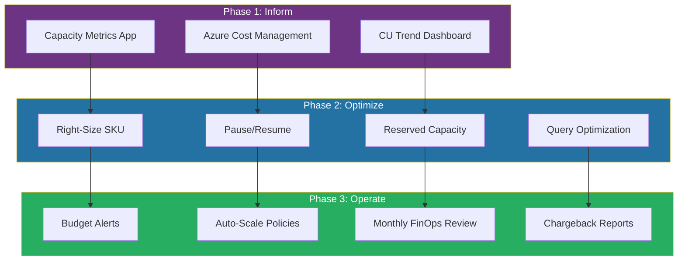
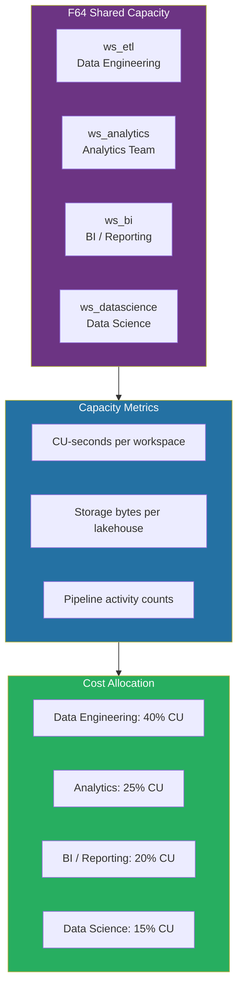
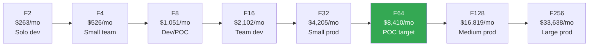
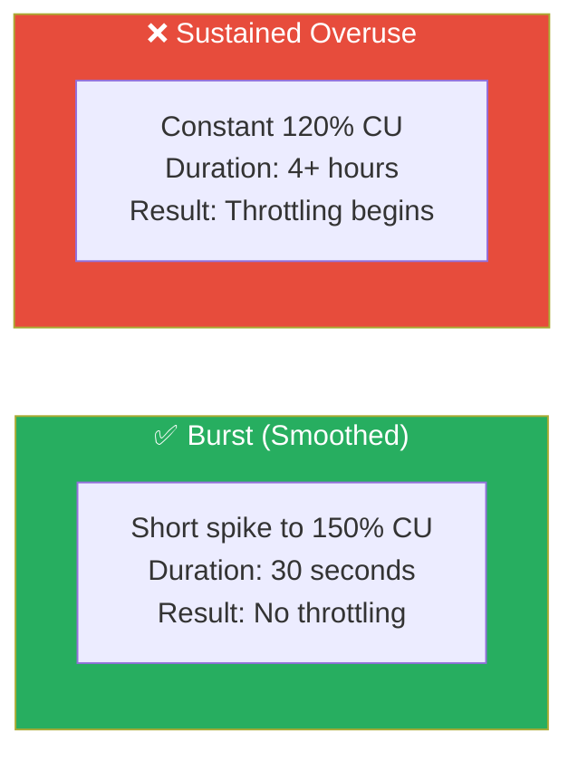

# 💸 FinOps & Cost Governance for Microsoft Fabric

<div align="center" markdown>

**Implement FinOps Disciplines to Maximize Fabric ROI and Enforce Cost Accountability**


</div>

---

**Last Updated:** `2026-04-21` | **Version:** 1.0.0

---

## 🎯 Overview

FinOps (Cloud Financial Operations) brings financial accountability to Fabric's consumption-based model. Unlike traditional fixed-infrastructure costs, Fabric's Capacity Unit (CU) model requires continuous monitoring, optimization, and cross-functional collaboration between engineering, finance, and business teams.

### Why FinOps for Fabric?

| Challenge | FinOps Solution |
|-----------|----------------|
| Unpredictable CU spikes | Budget alerts + auto-scale policies |
| No cost accountability | Workspace-level chargeback models |
| Over-provisioned capacity | Right-sizing with consumption analytics |
| Idle capacity waste | Pause/resume automation |
| No optimization incentive | Showback dashboards + team-level budgets |
| Compliance cost reporting | Automated cost allocation tagging |

### FinOps Maturity Levels

```mermaid
flowchart LR
    subgraph Crawl["🐛 Crawl"]
        style Crawl fill:#E67E22,color:#fff
        C1[Basic cost visibility]
        C2[Manual budget tracking]
        C3[Reactive scale decisions]
    end

    subgraph Walk["🚶 Walk"]
        style Walk fill:#2471A3,color:#fff
        W1[Workspace-level allocation]
        W2[Automated budget alerts]
        W3[Scheduled pause/resume]
    end

    subgraph Run["🏃 Run"]
        style Run fill:#27AE60,color:#fff
        R1[Real-time chargeback]
        R2[Auto-scale policies]
        R3[FinOps KPIs in Gold layer]
    end

    Crawl --> Walk --> Run
```



---

## 📊 FinOps Framework for Fabric

The FinOps Foundation defines three phases: **Inform**, **Optimize**, and **Operate**. Each maps directly to Fabric capabilities.

### Phase 1: Inform

Build visibility into who is consuming what and at what cost.

| Activity | Fabric Implementation |
|----------|----------------------|
| Cost visibility | Capacity Metrics app + Azure Cost Management |
| Usage attribution | Workspace-level CU tracking via metrics API |
| Forecasting | Trend analysis on `FabricCapacityMetrics` logs |
| Anomaly detection | KQL queries on CU spikes beyond P95 thresholds |
| Reporting | Power BI dashboard over capacity metrics |

```kql
// Weekly cost trend by workspace
FabricCapacityMetrics
| where TimeGenerated > ago(30d)
| summarize
    TotalCU = sum(CUSeconds) / 3600.0,
    AvgCUPercent = avg(CUPercentage)
    by bin(TimeGenerated, 1d), WorkspaceName
| render timechart
```

### Phase 2: Optimize

Reduce waste and improve unit economics.

| Activity | Fabric Implementation |
|----------|----------------------|
| Right-sizing | Compare P95 CU usage against SKU capacity |
| Waste elimination | Identify paused-eligible hours via usage patterns |
| Rate optimization | Reserved capacity for stable production workloads |
| Architecture efficiency | V-Order, Direct Lake, query optimization |
| Workload scheduling | Stagger ETL, BI refresh, and analytics jobs |

### Phase 3: Operate

Embed FinOps into organizational processes.

| Activity | Fabric Implementation |
|----------|----------------------|
| Governance policies | Azure Policy for tagging, budget enforcement |
| Automated guardrails | Auto-pause, auto-scale, budget action groups |
| Continuous improvement | Monthly FinOps review cadence |
| Cultural adoption | Team-level showback dashboards |
| Accountability | Cost center owners sign off on monthly spend |



---

## 💰 Cost Allocation & Chargeback

### Chargeback vs Showback

| Model | Description | When to Use |
|-------|-------------|-------------|
| **Showback** | Teams see their consumption but are not billed | Early FinOps adoption; building cost awareness |
| **Chargeback** | Teams are billed for their proportional consumption | Mature organizations with cost center accountability |
| **Hybrid** | Shared baseline charged centrally; burst charged to teams | Multi-team shared capacities |

### Cost Allocation Architecture



### Chargeback Calculation

```python
def calculate_chargeback(
    capacity_monthly_cost: float,
    workspace_cu_seconds: dict[str, float],
    shared_overhead_pct: float = 0.10,
) -> dict:
    """
    Calculate workspace-level chargeback with shared overhead.

    Args:
        capacity_monthly_cost: Total monthly capacity cost (e.g., $8,410 for F64)
        workspace_cu_seconds: Dict of workspace_name -> total CU-seconds consumed
        shared_overhead_pct: Percentage allocated to shared/platform costs
    """
    shared_cost = capacity_monthly_cost * shared_overhead_pct
    allocatable_cost = capacity_monthly_cost - shared_cost
    total_cu = sum(workspace_cu_seconds.values())

    result = {"_shared_platform": round(shared_cost, 2)}
    for ws, cu in workspace_cu_seconds.items():
        proportion = cu / total_cu if total_cu > 0 else 0
        result[ws] = {
            "cu_seconds": cu,
            "proportion": round(proportion, 4),
            "cost": round(allocatable_cost * proportion, 2),
        }
    return result
```

### Azure Tags for Cost Allocation

```bicep
resource fabricCapacity 'Microsoft.Fabric/capacities@2023-11-01' = {
  name: capacityName
  location: location
  sku: { name: skuName, tier: 'Fabric' }
  tags: {
    CostCenter: costCenterCode
    Department: department
    Environment: environment
    FinOpsOwner: finopsOwnerEmail
    BudgetCode: budgetCode
    ChargebackModel: 'proportional-cu'
  }
}
```

---

## 📐 Capacity Right-Sizing

### Right-Sizing Decision Matrix

| Current P95 CU % | Throttling Events/Day | Action |
|-------------------|----------------------|--------|
| < 30% | 0 | Scale **down** one SKU tier |
| 30–60% | 0 | Optimal — monitor |
| 60–80% | 0 | Monitor; plan for growth |
| 80–90% | < 5 | Optimize workloads first; scale up if optimization exhausted |
| > 90% | > 5 | Scale **up** one SKU tier immediately |

### SKU Migration Path



> **Tip:** Start with F8 for development, F64 for POC/small production. Scale based on 2 weeks of observed P95 CU metrics, not estimates.

---

## ⏸️ Pause/Resume Automation

### Azure Automation Runbook

```python
# Azure Automation runbook (Python 3)
import automationassets
from azure.identity import DefaultAzureCredential
from azure.mgmt.fabric import FabricMgmtClient

SUBSCRIPTION_ID = automationassets.get_automation_variable("SubscriptionId")
RESOURCE_GROUP = automationassets.get_automation_variable("ResourceGroup")
CAPACITY_NAME = automationassets.get_automation_variable("CapacityName")

credential = DefaultAzureCredential()
client = FabricMgmtClient(credential, SUBSCRIPTION_ID)

def pause_capacity():
    """Pause Fabric capacity to stop billing."""
    client.capacities.begin_suspend(RESOURCE_GROUP, CAPACITY_NAME).result()
    print(f"✅ Capacity {CAPACITY_NAME} paused successfully")

def resume_capacity():
    """Resume Fabric capacity."""
    client.capacities.begin_resume(RESOURCE_GROUP, CAPACITY_NAME).result()
    print(f"✅ Capacity {CAPACITY_NAME} resumed successfully")
```

### Logic App Schedule (Recommended)

| Environment | Resume | Pause | Weekly Savings |
|-------------|--------|-------|----------------|
| Development | Mon–Fri 07:00 | Mon–Fri 19:00 | ~65% |
| QA/Test | Mon–Fri 08:00 | Mon–Fri 18:00 | ~70% |
| Staging | On-demand | After testing | ~85% |
| DR | On failover trigger | After failback | ~95% |
| Production | Never pause | — | 0% |

### Pause/Resume Bicep Alert

```bicep
resource pauseSchedule 'Microsoft.Logic/workflows@2019-05-01' = {
  name: 'fabric-pause-dev'
  location: location
  properties: {
    definition: {
      '$schema': 'https://schema.management.azure.com/providers/Microsoft.Logic/schemas/2016-06-01/workflowdefinition.json#'
      triggers: {
        Recurrence: {
          type: 'Recurrence'
          recurrence: {
            frequency: 'Week'
            interval: 1
            schedule: {
              weekDays: ['Monday','Tuesday','Wednesday','Thursday','Friday']
              hours: [19]
              minutes: [0]
            }
            timeZone: 'Eastern Standard Time'
          }
        }
      }
    }
  }
}
```

---

## 🔔 Budget Alerts & Action Groups

### Azure Budgets Configuration

```bicep
resource fabricBudget 'Microsoft.Consumption/budgets@2023-11-01' = {
  name: 'fabric-monthly-budget'
  properties: {
    category: 'Cost'
    amount: monthlyBudgetAmount
    timeGrain: 'Monthly'
    timePeriod: {
      startDate: '2026-04-01'
    }
    notifications: {
      Warning75: {
        enabled: true
        operator: 'GreaterThanOrEqualTo'
        threshold: 75
        contactEmails: [ finopsTeamEmail ]
        thresholdType: 'Actual'
      }
      Critical90: {
        enabled: true
        operator: 'GreaterThanOrEqualTo'
        threshold: 90
        contactEmails: [ finopsTeamEmail, managerEmail ]
        thresholdType: 'Actual'
      }
      Exceeded100: {
        enabled: true
        operator: 'GreaterThanOrEqualTo'
        threshold: 100
        contactEmails: [ finopsTeamEmail, managerEmail, directorEmail ]
        thresholdType: 'Actual'
      }
      Forecast110: {
        enabled: true
        operator: 'GreaterThanOrEqualTo'
        threshold: 110
        contactEmails: [ finopsTeamEmail, managerEmail ]
        thresholdType: 'Forecasted'
      }
    }
  }
}
```

### Alert Escalation Matrix

| Threshold | Channel | Audience | Expected Action |
|-----------|---------|----------|-----------------|
| 75% actual | Email | FinOps team | Review consumption trends |
| 90% actual | Email + Teams | FinOps + Manager | Identify optimization opportunities |
| 100% actual | Email + Teams + PagerDuty | FinOps + Director | Emergency review; pause non-critical |
| 110% forecast | Email + Teams | FinOps + Manager | Proactive right-sizing or budget revision |

---

## 📈 CU Consumption Monitoring

### Capacity Metrics KQL Queries

```kql
// Hourly CU consumption heatmap (workspace breakdown)
FabricCapacityMetrics
| where TimeGenerated > ago(7d)
| summarize AvgCU = avg(CUPercentage) by
    bin(TimeGenerated, 1h),
    WorkspaceName
| evaluate pivot(WorkspaceName, avg(AvgCU))
| render timechart
```

```kql
// Identify top CU-consuming operations
FabricCapacityMetrics
| where TimeGenerated > ago(24h)
| summarize
    TotalCUSeconds = sum(CUSeconds),
    OperationCount = count()
    by WorkloadType, WorkspaceName
| top 10 by TotalCUSeconds desc
```

### CU Consumption Dashboard (Gold Layer)

```python
# Gold table: Daily CU cost allocation
df_cu_allocation = (
    spark.table("lh_gold.fact_capacity_metrics")
    .groupBy("metric_date", "workspace_name", "workload_type")
    .agg(
        F.sum("cu_seconds").alias("total_cu_seconds"),
        F.avg("cu_percentage").alias("avg_cu_pct"),
        F.max("cu_percentage").alias("peak_cu_pct"),
    )
    .withColumn("estimated_daily_cost",
        F.col("total_cu_seconds") / F.lit(86400) * F.lit(DAILY_CAPACITY_COST)
    )
)
```

---

## ⚡ Smoothing vs Bursting

Fabric smooths CU consumption over time windows to handle short spikes without throttling.

### Smoothing Windows

| Window | Duration | Behavior |
|--------|----------|----------|
| **Interactive** | 10 seconds | Short BI queries smoothed over 10s |
| **Background** | 60 seconds | Pipeline and Spark jobs smoothed over 60s |
| **Extended** | 5 minutes | Sustained workloads smoothed over 5m |
| **Carry-forward** | 24 hours | Unused CU from low periods offsets peak periods |

### Burst vs Sustained



> **Key Insight:** Fabric's smoothing means you do NOT need to size your SKU for peak instantaneous CU. Size for sustained P95 over a 5-minute window. Short bursts are absorbed by the smoothing mechanism.

---

## 🔧 Cost Optimization Strategies

| # | Strategy | Savings Potential | Complexity |
|---|----------|-------------------|------------|
| 1 | Pause/resume dev/test capacities | 50–70% | Low |
| 2 | Reserved capacity (1yr or 3yr) | 25–40% | Low |
| 3 | Auto-scale on schedule | 20–35% | Medium |
| 4 | V-Order on Gold tables | 10–20% CU reduction | Low |
| 5 | Direct Lake instead of Import | 15–25% CU reduction | Medium |
| 6 | Stagger scheduled refreshes | 10–15% peak CU reduction | Low |
| 7 | Query optimization (KQL + SQL) | 5–20% CU reduction | Medium |
| 8 | Delta table compaction (OPTIMIZE) | 10–15% CU reduction | Low |
| 9 | Spark session timeout tuning | 5–10% CU reduction | Low |
| 10 | Workspace separation for isolation | Indirect (enables other strategies) | Medium |

---

## 🎰 Casino Implementation

### Cost Allocation per Property/Department

Casino operators typically allocate Fabric costs across properties (individual casino locations) and departments (Slots, Table Games, Compliance, Marketing).

```python
# Casino chargeback: property + department allocation
CASINO_COST_CENTERS = {
    "ws_slots_vegas":       {"property": "Las Vegas", "department": "Slots"},
    "ws_tables_vegas":      {"property": "Las Vegas", "department": "Table Games"},
    "ws_compliance_vegas":  {"property": "Las Vegas", "department": "Compliance"},
    "ws_slots_atlantic":    {"property": "Atlantic City", "department": "Slots"},
    "ws_marketing":         {"property": "Corporate", "department": "Marketing"},
}

def casino_chargeback(capacity_cost: float, ws_cu: dict) -> dict:
    """Allocate costs by property and department."""
    total_cu = sum(ws_cu.values())
    result = {}
    for ws, cu in ws_cu.items():
        meta = CASINO_COST_CENTERS[ws]
        prop = meta["property"]
        dept = meta["department"]
        cost = capacity_cost * (cu / total_cu) if total_cu > 0 else 0
        result.setdefault(prop, {})
        result[prop][dept] = round(cost, 2)
    return result
```

### Casino FinOps KPIs

| KPI | Formula | Target |
|-----|---------|--------|
| CU Cost per $1M Revenue | `monthly_fabric_cost / (monthly_revenue / 1_000_000)` | < $500 |
| Cost per Slot Machine/Month | `slots_workspace_cost / active_machines` | < $5.00 |
| Compliance Cost Ratio | `compliance_cu_cost / total_cu_cost` | < 15% |
| Idle CU Waste % | `idle_cu_hours / total_cu_hours × 100` | < 10% |

### Casino Pause/Resume Schedule

Casino production runs 24/7 but development and analytics workspaces can be paused:

| Workspace | Schedule | Monthly Savings |
|-----------|----------|-----------------|
| ws_dev_casino | Weekdays 7 AM–7 PM only | ~65% (~$5,467 on F64) |
| ws_qa_casino | Weekdays 8 AM–6 PM only | ~70% |
| ws_analytics_sandbox | On-demand only | ~85% |
| ws_prod_casino | Never pause (24/7 compliance) | $0 |

---

## 🏛️ Federal Implementation

### OMB Compliance for Cloud Cost Reporting

Federal agencies must comply with OMB Circular A-123 and the FITARA scorecard for IT cost management. Fabric FinOps must produce auditable cost reports aligned with these requirements.

| OMB Requirement | Fabric Implementation |
|-----------------|----------------------|
| A-123 financial reporting | Monthly cost allocation reports from capacity metrics |
| FITARA cost transparency | Per-agency showback dashboards |
| TBM (Technology Business Management) | Map Fabric workspaces to TBM cost towers |
| DATA Act reporting | Tag Fabric resources with Treasury Account Symbol (TAS) |
| Cloud Smart policy | Document optimization actions and savings achieved |

### Federal Agency Cost Reporting

```python
# Federal chargeback aligned with TBM cost towers
FEDERAL_TBM_MAPPING = {
    "ws_usda_analytics": {"agency": "USDA", "tbm_tower": "Data Management", "tas": "12-1234"},
    "ws_sba_loans":      {"agency": "SBA",  "tbm_tower": "Data Management", "tas": "73-5678"},
    "ws_noaa_weather":   {"agency": "NOAA", "tbm_tower": "Analytics",       "tas": "13-9012"},
    "ws_epa_monitoring": {"agency": "EPA",  "tbm_tower": "Data Management", "tas": "68-3456"},
    "ws_doi_resources":  {"agency": "DOI",  "tbm_tower": "Analytics",       "tas": "14-7890"},
}

def federal_cost_report(capacity_cost: float, ws_cu: dict) -> list[dict]:
    """Generate OMB-compliant cost allocation report."""
    total_cu = sum(ws_cu.values())
    report = []
    for ws, cu in ws_cu.items():
        meta = FEDERAL_TBM_MAPPING[ws]
        report.append({
            "agency": meta["agency"],
            "tbm_tower": meta["tbm_tower"],
            "treasury_account_symbol": meta["tas"],
            "cu_seconds": cu,
            "proportion": round(cu / total_cu, 4) if total_cu > 0 else 0,
            "allocated_cost": round(capacity_cost * cu / total_cu, 2) if total_cu > 0 else 0,
            "fiscal_year": "FY2026",
            "fiscal_quarter": "Q3",
        })
    return report
```

### FedRAMP Cost Overhead

| Item | Overhead vs Commercial | Mitigation |
|------|----------------------|------------|
| GovCloud region pricing | +15–20% | Budget accordingly; no workaround |
| Continuous monitoring (ConMon) | +5–10% CU | Schedule ConMon queries off-peak |
| Audit log retention (3+ years) | Storage cost increase | Tier cold data to Azure Archive |
| DR standby capacity | +$0 when paused | Use paused capacity in secondary region |
| Encryption overhead | Negligible | No action needed |

---

## 🚫 Limitations

| Limitation | Impact | Workaround |
|-----------|--------|------------|
| No per-workspace billing in Fabric | Cannot get native per-workspace invoices | Build chargeback from capacity metrics API |
| Pause/resume takes 1–3 minutes | Brief unavailability during transitions | Schedule during known idle windows |
| Auto-scale not natively supported | No built-in auto-scale for Fabric capacity | Use Azure Automation or Logic Apps |
| Reserved capacity minimum 1 year | Lock-in risk for uncertain workloads | Use PAYG for variable; reserve for stable |
| Capacity metrics 30-day retention | Historical analysis limited | Export metrics to Log Analytics (90+ days) |
| No CU-level quota per workspace | One workspace can starve others | Use separate capacities for isolation |
| Budget alerts are cost-based, not CU-based | Cannot alert on CU % directly | Use KQL alerts on capacity metrics for CU |

---

## 📚 References

### Microsoft Documentation

- [Microsoft Fabric pricing](https://azure.microsoft.com/pricing/details/microsoft-fabric/)
- [Fabric capacity and SKUs](https://learn.microsoft.com/fabric/enterprise/licenses)
- [Fabric capacity metrics app](https://learn.microsoft.com/fabric/enterprise/metrics-app)
- [Pause and resume capacity](https://learn.microsoft.com/fabric/enterprise/pause-resume)
- [Smoothing and bursting](https://learn.microsoft.com/fabric/enterprise/fabric-operations)
- [Throttling in Fabric](https://learn.microsoft.com/fabric/enterprise/throttling)
- [Azure reservations for Fabric](https://learn.microsoft.com/azure/cost-management-billing/reservations/fabric-capacity)

### Azure Cost Management

- [Azure Cost Management best practices](https://learn.microsoft.com/azure/cost-management-billing/costs/cost-mgt-best-practices)
- [Create and manage Azure budgets](https://learn.microsoft.com/azure/cost-management-billing/costs/tutorial-acm-create-budgets)
- [Azure Automation runbook overview](https://learn.microsoft.com/azure/automation/automation-runbook-types)
- [Logic Apps recurrence triggers](https://learn.microsoft.com/azure/logic-apps/concepts-schedule-automated-recurring-tasks-workflows)

### FinOps & Federal Compliance

- [FinOps Foundation framework](https://www.finops.org/framework/)
- [OMB Circular A-123](https://www.whitehouse.gov/omb/information-for-agencies/circulars/)
- [FITARA scorecard](https://www.congress.gov/bill/113th-congress/house-bill/1232)
- [TBM taxonomy](https://www.tbmcouncil.org/)
- [Federal Cloud Smart strategy](https://cloud.cio.gov/strategy/)

---

## Related Documents

- [Capacity Planning & Cost Optimization](./capacity-planning-cost-optimization.md) — SKU sizing and CU optimization strategies
- [Alerting & Data Activator](./alerting-data-activator.md) — Automated alerting patterns
- [Disaster Recovery & BCDR](./disaster-recovery-bcdr.md) — DR capacity cost planning
- [Multi-Tenant Workspace Architecture](./multi-tenant-workspace-architecture.md) — Workspace isolation for cost allocation
- [Monitoring & Observability](./monitoring-observability.md) — Capacity metrics monitoring

---

## Document Metadata

| Field | Value |
|-------|-------|
| **Title** | FinOps & Cost Governance for Microsoft Fabric |
| **Category** | Best Practices — Cost Governance |
| **Author** | Supercharge Microsoft Fabric POC Team |
| **Version** | 1.0.0 |
| **Created** | 2026-04-21 |
| **Last Updated** | 2026-04-21 |
| **Applicable SKUs** | F2–F2048 |
| **Industries** | Casino/Gaming, Federal Government |

---

[Back to Best Practices Index](./index.md) | [Back to Documentation](../index.md)
