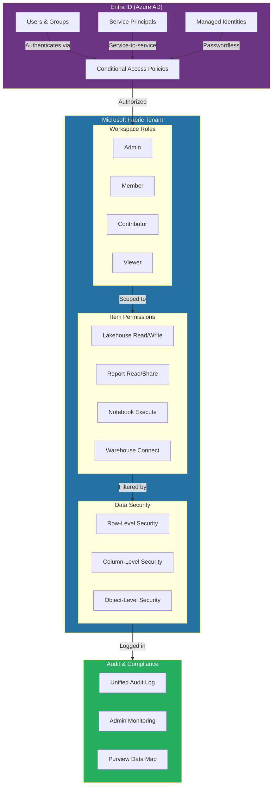
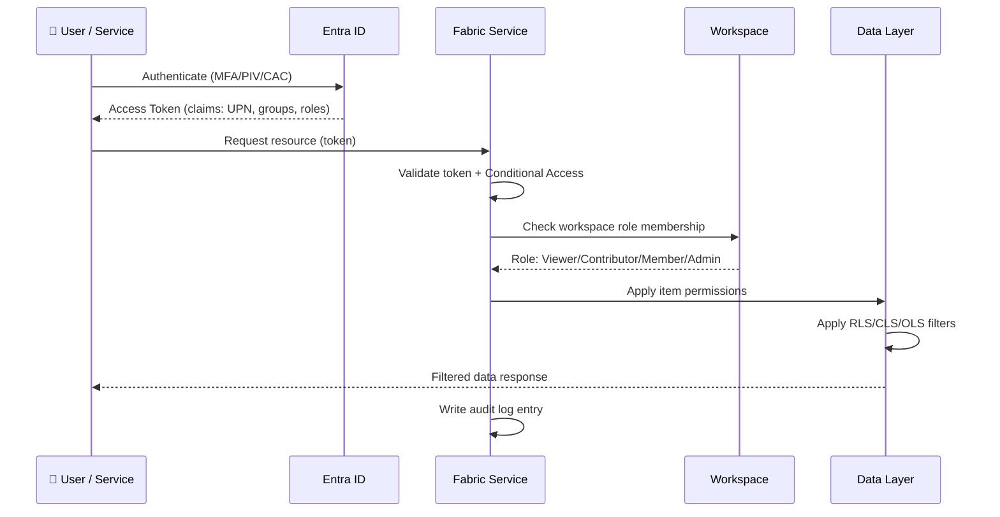
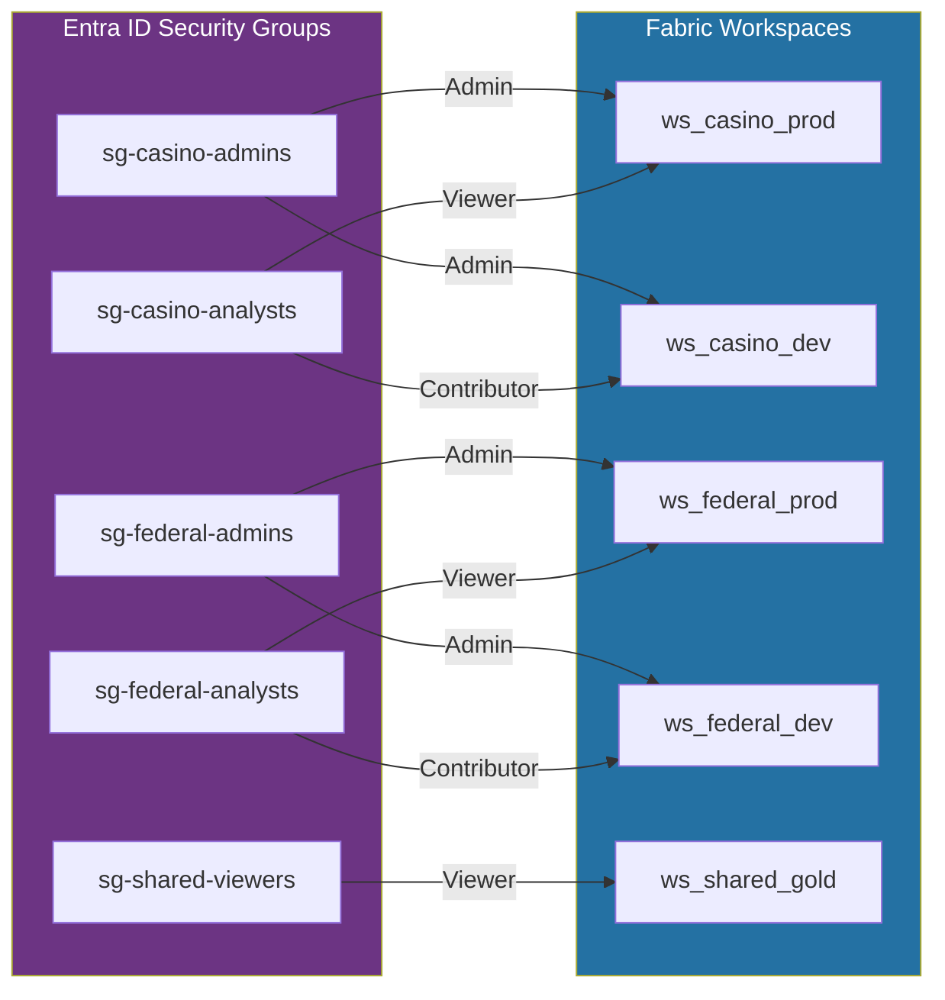
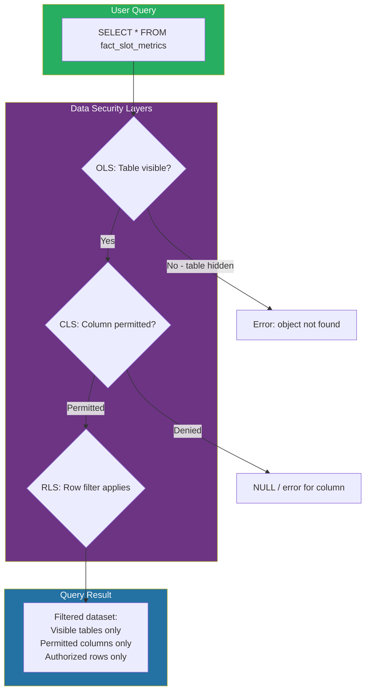
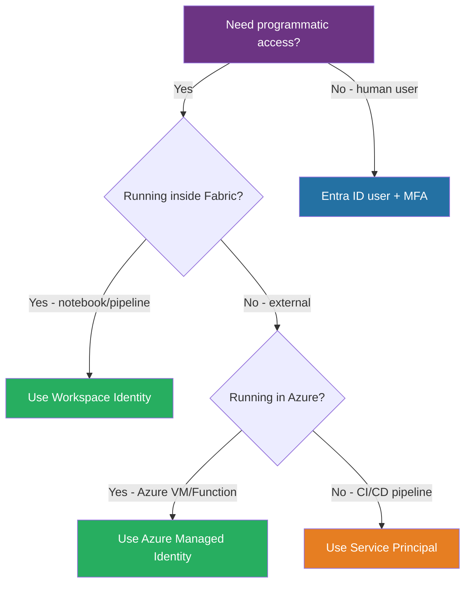
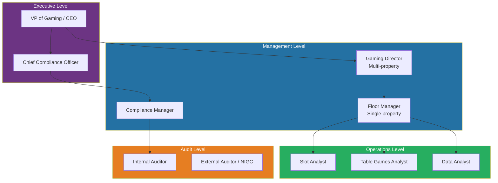
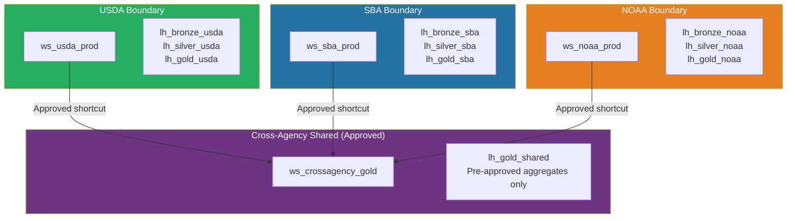
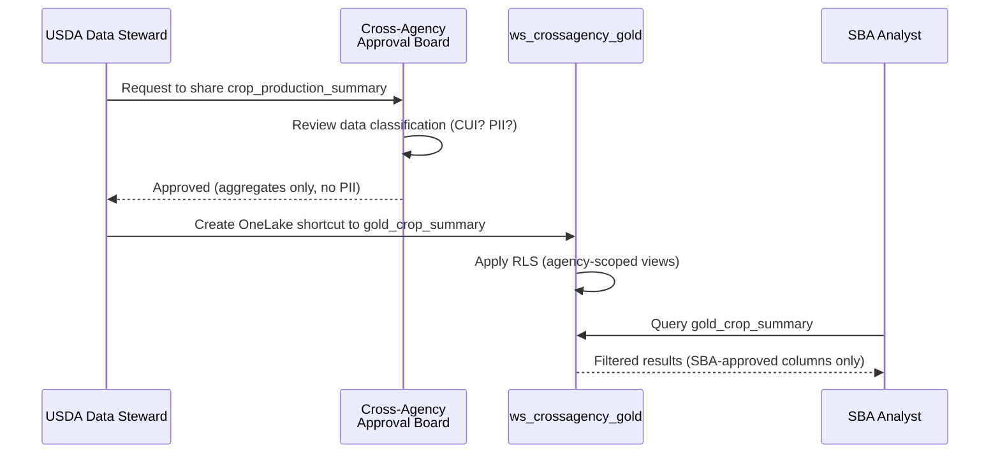

[Home](../index.md) > [Docs](../) > [Best Practices](./) > Identity & RBAC Patterns

# 🔑 Identity & RBAC Patterns for Microsoft Fabric

<div align="center" markdown>

**Least-Privilege Access Control from Entra ID to Row-Level Data**


</div>

---

**Last Updated:** `2026-04-13` | **Version:** 1.0.0

---

## 📑 Table of Contents

- [🎯 Overview](#-overview)
- [🏗️ Architecture](#️-architecture)
- [👥 Workspace Roles](#-workspace-roles)
- [📦 Item-Level Permissions](#-item-level-permissions)
- [🔒 Data Security](#-data-security)
- [🤖 Service Identity](#-service-identity)
- [🎰 Casino RBAC Model](#-casino-rbac-model)
- [🏛️ Federal RBAC Model](#️-federal-rbac-model)
- [🔄 Lifecycle & Governance](#-lifecycle--governance)
- [⚠️ Common Pitfalls](#️-common-pitfalls)
- [📚 References](#-references)

---

## 🎯 Overview

Identity and Role-Based Access Control (RBAC) in Microsoft Fabric spans five layers: Entra ID (Azure AD) for authentication, workspace roles for broad collaboration, item-level permissions for fine-grained artifact control, data security (RLS, CLS, OLS) for row/column/object filtering, and audit logging for accountability. A well-designed RBAC strategy ensures the principle of least privilege at every layer while supporting the operational needs of casino gaming compliance officers, federal data stewards, and analytics teams.

### Why Multi-Layered RBAC?

| Layer | Controls | Granularity |
|-------|----------|-------------|
| **Entra ID** | Who can authenticate and access the tenant | Tenant-wide |
| **Workspace Roles** | What a user can do in a workspace (read, edit, admin) | Workspace |
| **Item Permissions** | Who can access specific lakehouses, reports, notebooks | Item |
| **Data Security** | Which rows, columns, and tables a user can see | Data |
| **Audit** | Who did what and when | Action |

### Guiding Principles

1. **Least privilege** — Grant the minimum permissions required for each role
2. **Role-based, not user-based** — Assign permissions to Entra ID security groups, never individual users
3. **Defense in depth** — Layer workspace roles, item permissions, and data security together
4. **Automation** — Use Managed Identities and Service Principals for non-interactive workloads
5. **Auditability** — Every permission change and data access event must be logged

> **Key Insight:** Fabric workspace roles control *platform actions* (create, edit, delete items). Data security (RLS/CLS/OLS) controls *data visibility*. Both are required — a user with Viewer workspace role still sees all data unless RLS filters are applied.

---

## 🏗️ Architecture

### End-to-End Identity & Access Flow



### Identity Resolution Flow



---

## 👥 Workspace Roles

### Role Capability Matrix

Fabric provides four workspace roles with cumulative permissions. Each role inherits all capabilities of the roles below it.

| Capability | Viewer | Contributor | Member | Admin |
|------------|--------|-------------|--------|-------|
| View items and read data | ✅ | ✅ | ✅ | ✅ |
| Connect to SQL/XMLA endpoint | ✅ | ✅ | ✅ | ✅ |
| Copy/export data (if allowed by tenant) | ✅ | ✅ | ✅ | ✅ |
| Create and edit items | ❌ | ✅ | ✅ | ✅ |
| Delete items | ❌ | ✅ | ✅ | ✅ |
| Run notebooks and pipelines | ❌ | ✅ | ✅ | ✅ |
| Share items | ❌ | ❌ | ✅ | ✅ |
| Add/remove Members and Contributors | ❌ | ❌ | ✅ | ✅ |
| Manage workspace settings | ❌ | ❌ | ❌ | ✅ |
| Add/remove Admins | ❌ | ❌ | ❌ | ✅ |
| Manage Git integration | ❌ | ❌ | ❌ | ✅ |
| Configure capacity assignment | ❌ | ❌ | ❌ | ✅ |

### Least-Privilege Persona Mapping

Map organizational personas to the minimum workspace role required:

| Persona | Workspace Role | Justification |
|---------|---------------|---------------|
| Executive / Business Stakeholder | Viewer | Consumes dashboards and reports only |
| Data Analyst | Viewer + item share | Reads data, builds reports in personal workspace |
| Report Developer | Contributor | Creates and publishes reports and semantic models |
| Data Engineer | Contributor | Develops notebooks, pipelines, and lakehouses |
| Data Steward | Member | Shares items with external consumers, manages membership |
| Workspace Owner / Platform Admin | Admin | Full workspace lifecycle management |
| CI/CD Service Principal | Contributor | Deploys items via API (no admin needed) |
| Auditor | Viewer | Read-only access with audit log visibility |

### Entra ID Security Group Strategy

Always assign workspace roles to security groups, not individual users:

```
# Naming convention: sg-fabric-{workspace}-{role}
sg-fabric-casino-prod-admins     → Admin role on ws_casino_prod
sg-fabric-casino-prod-members    → Member role on ws_casino_prod
sg-fabric-casino-prod-contributors → Contributor role on ws_casino_prod
sg-fabric-casino-prod-viewers    → Viewer role on ws_casino_prod

sg-fabric-federal-prod-admins    → Admin role on ws_federal_prod
sg-fabric-federal-prod-viewers   → Viewer role on ws_federal_prod

sg-fabric-shared-gold-viewers    → Viewer role on ws_shared_gold
```

> **Best Practice:** Use dynamic Entra ID groups based on department or job title attributes for automatic role assignment. Example: All users with `department = "Casino Operations"` automatically join `sg-fabric-casino-prod-viewers`.

### Multi-Workspace Access Pattern



---

## 📦 Item-Level Permissions

### When to Use Item Permissions

Workspace roles apply to **all items** in a workspace. Item-level permissions provide fine-grained access to specific artifacts without changing workspace membership:

| Scenario | Use Workspace Role | Use Item Permission |
|----------|-------------------|-------------------|
| User needs access to all items in a workspace | ✅ | ❌ |
| User needs access to one specific report | ❌ | ✅ |
| External partner needs read-only on a dataset | ❌ | ✅ |
| Auditor needs access to compliance dashboard only | ❌ | ✅ |
| CI/CD pipeline deploys to entire workspace | ✅ | ❌ |

### Item Permission Types

| Item Type | Permission | Description |
|-----------|-----------|-------------|
| **Lakehouse** | Read | Query tables and files via SQL endpoint |
| **Lakehouse** | ReadAll | Read all data including files area |
| **Lakehouse** | Write | Create/modify tables and files |
| **Warehouse** | Read | Execute SELECT queries |
| **Warehouse** | ReadAll | Read all schemas and tables |
| **Semantic Model** | Read | Connect via XMLA/ODBC |
| **Semantic Model** | Build | Create reports on top of the model |
| **Report** | Read | View the report |
| **Report** | Reshare | Share the report with others |
| **Notebook** | Read | View notebook code and output |
| **Notebook** | Execute | Run the notebook |

### Sharing Items Without Workspace Access

```python
# Share a specific report with an external user via Fabric REST API
import requests

headers = {"Authorization": f"Bearer {access_token}"}
body = {
    "recipients": [
        {"emailAddress": "auditor@external-firm.com"}
    ],
    "permissions": "Read",
    "notifyRecipient": True,
    "message": "Access to the Q1 Compliance Dashboard"
}

response = requests.post(
    f"https://api.fabric.microsoft.com/v1/workspaces/{workspace_id}/reports/{report_id}/shares",
    headers=headers,
    json=body
)
```

> **Important:** Item-level sharing does NOT grant workspace membership. The shared user sees only the specific item, not the workspace in the navigation pane.

---

## 🔒 Data Security

Data security in Fabric operates at three levels within Direct Lake semantic models and SQL endpoints:

### Row-Level Security (RLS)

RLS filters rows based on the signed-in user's identity. Users see only the data they are authorized to access.

#### Static RLS (Fixed Values)

Use when roles map to fixed data partitions:

```dax
// DAX filter for the "Eastern Region Analysts" role
[region] = "East"
```

```sql
-- SQL predicate for the "Las Vegas Property" role (SQL endpoint)
CREATE SECURITY POLICY PropertyFilter
ADD FILTER PREDICATE dbo.fn_property_filter(@property_id)
ON dbo.fact_slot_metrics;
```

#### Dynamic RLS (User-Based)

Use when data filtering depends on the signed-in user's identity:

```dax
// DAX filter: Users see only their assigned properties
// Uses a security mapping table: dim_user_property (user_email, property_id)
[property_id] IN
    SELECTCOLUMNS(
        FILTER(
            dim_user_property,
            dim_user_property[user_email] = USERPRINCIPALNAME()
        ),
        "property_id", dim_user_property[property_id]
    )
```

```sql
-- SQL dynamic RLS: Filter by signed-in user's agency
CREATE FUNCTION dbo.fn_agency_filter(@agency_code VARCHAR(10))
RETURNS TABLE
WITH SCHEMABINDING
AS
RETURN SELECT 1 AS result
WHERE @agency_code IN (
    SELECT agency_code
    FROM dbo.dim_user_agency
    WHERE user_email = SESSION_CONTEXT(N'user_email')
);
```

#### RLS Testing

Always test RLS filters before publishing:

```dax
// In Power BI Desktop → Modeling → "View as" to simulate roles
// Verify: Gaming Director sees all properties
// Verify: Floor Manager sees only their property
// Verify: Analyst sees only their assigned machines
```

### Column-Level Security (CLS)

CLS restricts access to specific columns. Users without permission see NULL or an error when querying masked columns.

```sql
-- Grant access to SSN column only to compliance officers
GRANT SELECT ON dbo.dim_player (
    player_id, first_name, last_name, email, phone
) TO [sg-casino-analysts];

-- Full column access for compliance
GRANT SELECT ON dbo.dim_player TO [sg-casino-compliance];
```

| Column | Analysts | Compliance | Executives |
|--------|----------|------------|------------|
| player_id | ✅ | ✅ | ✅ |
| first_name | ✅ | ✅ | ✅ |
| last_name | ✅ | ✅ | ✅ |
| ssn_hash | ❌ | ✅ | ❌ |
| date_of_birth | ❌ | ✅ | ❌ |
| loyalty_tier | ✅ | ✅ | ✅ |
| lifetime_value | ✅ | ✅ | ✅ |
| email | ❌ | ✅ | ❌ |

### Object-Level Security (OLS)

OLS hides entire tables or columns from users in semantic models. Hidden objects do not appear in field lists, DAX queries return errors if referenced.

```json
// Semantic model role definition (TMSL)
{
  "name": "HideSensitiveTables",
  "tablePermissions": [
    {
      "name": "fact_ctr_filings",
      "metadataPermission": "none"
    },
    {
      "name": "fact_sar_filings",
      "metadataPermission": "none"
    }
  ]
}
```

> **When to use OLS vs CLS:**
> - **OLS** hides entire tables or columns from the metadata — users cannot even see that the object exists
> - **CLS** allows users to see the column exists but returns NULL/error for unauthorized queries
> - Use OLS for highly sensitive compliance tables (CTR, SAR); use CLS for PII columns in shared tables

### Combined Data Security Architecture



---

## 🤖 Service Identity

### Workspace Identity (GA 2026)

Workspace Identity is a Fabric-native managed identity assigned to a workspace. It replaces the need for separate Azure Managed Identities or Service Principal configurations for workspace-to-Azure-resource authentication.

```bicep
// Workspace Identity is configured at the Fabric workspace level
// See: infra/modules/security/workspace-identity.bicep

// Grant workspace identity access to storage
resource storageRoleAssignment 'Microsoft.Authorization/roleAssignments@2022-04-01' = {
  name: guid(storageAccount.id, 'Storage Blob Data Contributor', workspaceIdentityObjectId)
  scope: storageAccount
  properties: {
    roleDefinitionId: subscriptionResourceId(
      'Microsoft.Authorization/roleDefinitions',
      'ba92f5b4-2d11-453d-a403-e96b0029c9fe' // Storage Blob Data Contributor
    )
    principalId: workspaceIdentityObjectId
    principalType: 'ServicePrincipal'
  }
}
```

**Use cases for Workspace Identity:**

| Scenario | Identity Type | Configuration |
|----------|--------------|---------------|
| Lakehouse → ADLS Gen2 shortcut | Workspace Identity | Grant `Storage Blob Data Reader` on target account |
| Notebook → Azure Key Vault | Workspace Identity | Grant `Key Vault Secrets User` on target vault |
| Pipeline → Azure SQL Database | Workspace Identity | Create contained user in target database |
| OneLake → external S3 | Workspace Identity | Configure trusted workspace in S3 policy |

### Service Principal for CI/CD

Service Principals are used for automated deployment pipelines (GitHub Actions, Azure DevOps):

```yaml
# .github/workflows/deploy-fabric.yml (excerpt)
- name: Deploy Fabric items
  env:
    AZURE_CLIENT_ID: ${{ secrets.FABRIC_SPN_CLIENT_ID }}
    AZURE_TENANT_ID: ${{ secrets.AZURE_TENANT_ID }}
    AZURE_CLIENT_SECRET: ${{ secrets.FABRIC_SPN_CLIENT_SECRET }}
  run: |
    python scripts/fabric-cicd-deploy.py \
      --workspace ws_casino_prod \
      --items-path ./fabric-items/
```

**SPN Permission Requirements:**

| Action | Fabric Permission | Entra ID Permission |
|--------|------------------|-------------------|
| Deploy items | Contributor on workspace | None |
| Manage workspace | Admin on workspace | None |
| Read admin APIs | None | Fabric.Read.All (application) |
| Manage tenant settings | None | Fabric Administrator role |

> **Security Note:** Store SPN credentials in GitHub Secrets or Azure Key Vault. Never hardcode client secrets in code or pipeline definitions. Prefer federated credentials (OIDC) for GitHub Actions to avoid secrets entirely.

### Managed Identity for Azure Resources

Use Azure Managed Identities (system-assigned or user-assigned) for Azure-hosted compute that interacts with Fabric:

```python
# Azure Function authenticating to Fabric with Managed Identity
from azure.identity import DefaultAzureCredential
import requests

credential = DefaultAzureCredential()
token = credential.get_token("https://api.fabric.microsoft.com/.default")

headers = {"Authorization": f"Bearer {token.token}"}
response = requests.get(
    "https://api.fabric.microsoft.com/v1/workspaces",
    headers=headers
)
```

### Identity Selection Guide



---

## 🎰 Casino RBAC Model

### Organizational Hierarchy

The casino gaming industry has a well-defined operational hierarchy that maps directly to Fabric RBAC:



### Casino Role-to-Permission Mapping

| Persona | Workspace Role | RLS Filter | CLS Access | OLS Visibility |
|---------|---------------|------------|------------|----------------|
| **VP of Gaming** | Viewer on ws_casino_prod | All properties | All columns | All tables |
| **Gaming Director** | Viewer on ws_casino_prod | Assigned region only | All columns | All tables |
| **Floor Manager** | Viewer on ws_casino_prod | Single property only | No PII | No CTR/SAR tables |
| **Slot Analyst** | Viewer on ws_casino_prod | Single property + slots only | No PII | No CTR/SAR tables |
| **Compliance Manager** | Member on ws_casino_prod | All properties | All columns incl. PII | All tables incl. CTR/SAR |
| **Internal Auditor** | Viewer on ws_casino_prod | All properties (read-only) | All columns | All tables |
| **External Auditor (NIGC)** | Item permission only | Compliance data only | Redacted PII | CTR/SAR tables only |
| **Data Engineer** | Contributor on ws_casino_dev | Dev data only | All columns in dev | All tables in dev |

### Property-Based RLS (Casino)

Casino operators often manage multiple properties (hotels/casinos). RLS ensures each property's data is isolated:

```dax
// RLS filter expression for fact_slot_metrics
// Maps user email → property_id via dim_user_property security table

VAR CurrentUser = USERPRINCIPALNAME()
VAR UserProperties =
    SELECTCOLUMNS(
        FILTER(
            dim_user_property,
            dim_user_property[user_email] = CurrentUser
        ),
        "pid", dim_user_property[property_id]
    )
RETURN
    [property_id] IN UserProperties
```

**Security mapping table (`dim_user_property`):**

| user_email | property_id | property_name | access_level |
|------------|-------------|---------------|-------------|
| gd.smith@casino.com | * | All Properties | region_all |
| fm.jones@casino.com | PROP-001 | Bellagio | property |
| fm.lee@casino.com | PROP-002 | MGM Grand | property |
| analyst.doe@casino.com | PROP-001 | Bellagio | property |

### NIGC Compliance Access Controls

| NIGC MICS Requirement | Implementation |
|----------------------|----------------|
| §542.3 — Separation of duties | Different Entra groups for operations vs. compliance vs. audit |
| §542.17 — Restricted access to financial records | OLS hides CTR/SAR tables from non-compliance roles |
| §542.31 — Audit trail requirements | Unified audit log captures all data access events |
| §542.42 — Supervisory access | Gaming Directors have RLS for their region; VP sees all |

> **Callout — Auditor Access Pattern:** External auditors (NIGC, state gaming commissions) receive item-level permissions on specific compliance reports — never workspace membership. Access is time-bounded using Entra ID access reviews with automatic expiry.

---

## 🏛️ Federal RBAC Model

### PIV/CAC Authentication

Federal agencies require phishing-resistant authentication using Personal Identity Verification (PIV) or Common Access Card (CAC) smartcards:

```json
// Entra ID Conditional Access Policy — Require PIV/CAC for Fabric
{
  "displayName": "CA-Federal-Require-PhishingResistant-Fabric",
  "conditions": {
    "applications": {
      "includeApplications": ["powerbi-service-guid"]
    },
    "users": {
      "includeGroups": ["sg-federal-all-users"]
    }
  },
  "grantControls": {
    "authenticationStrength": {
      "requirementsSatisfied": "phishingResistantMFA"
    }
  }
}
```

### Agency Boundary Isolation

Each federal agency operates within its own workspace boundary. Cross-agency data sharing requires explicit approval:



### Federal Role Mapping

| Federal Persona | Workspace Role | Agency Scope | Special Requirements |
|----------------|---------------|--------------|---------------------|
| **Agency Data Steward** | Admin on agency workspace | Single agency | PIV/CAC, background check |
| **Agency Data Engineer** | Contributor on agency workspace | Single agency | PIV/CAC, clearance level |
| **Agency Analyst** | Viewer on agency workspace | Single agency | PIV/CAC |
| **Cross-Agency Analyst** | Viewer on ws_crossagency_gold | Shared aggregates only | PIV/CAC, multi-agency approval |
| **Agency CISO** | Viewer + audit access | Single agency | PIV/CAC, SCI clearance |
| **IG Auditor** | Item permissions on audit reports | Cross-agency | PIV/CAC, IG credential |
| **CI/CD Pipeline (SPN)** | Contributor on agency workspace | Single agency | Certificate auth, no interactive login |

### Cross-Agency Data Sharing Protocol



### FedRAMP Access Controls

| FedRAMP Control | Requirement | Fabric Implementation |
|----------------|-------------|----------------------|
| **AC-2** | Account Management | Entra ID lifecycle + access reviews |
| **AC-3** | Access Enforcement | Workspace roles + item permissions + RLS |
| **AC-5** | Separation of Duties | Distinct security groups per function |
| **AC-6** | Least Privilege | Viewer default; escalate only when justified |
| **AC-6(1)** | Authorize Access to Security Functions | Admin role restricted to platform team |
| **AC-17** | Remote Access | Conditional Access with PIV/CAC + compliant device |
| **AU-2** | Audit Events | Unified audit log + Purview |
| **IA-2(1)** | MFA for Privileged Access | Phishing-resistant MFA for all Admin/Member roles |
| **IA-2(12)** | PIV Acceptance | Entra ID federated with agency PIV infrastructure |

### FISMA Continuous Monitoring Integration

```python
# Export Fabric workspace role assignments for FISMA POA&M reporting
import requests

headers = {"Authorization": f"Bearer {access_token}"}

# Get workspace role assignments
response = requests.get(
    f"https://api.fabric.microsoft.com/v1/workspaces/{workspace_id}/roleAssignments",
    headers=headers
)

assignments = response.json()["value"]

# Format for FISMA reporting
for a in assignments:
    print(f"User: {a['principal']['displayName']}, "
          f"Type: {a['principal']['type']}, "
          f"Role: {a['role']}, "
          f"Last Reviewed: {a.get('lastReviewed', 'N/A')}")
```

> **Callout — Agency Isolation is Non-Negotiable:** Never grant cross-agency access at the workspace level. Use the shared workspace pattern with OneLake shortcuts pointing to pre-approved, aggregated Gold tables only. Individual-level data never leaves the agency boundary.

---

## 🔄 Lifecycle & Governance

### Access Review Cadence

| Review Type | Frequency | Owner | Scope |
|-------------|-----------|-------|-------|
| Workspace role membership | Quarterly | Workspace Admin | All roles |
| Item-level sharing | Monthly | Data Steward | Shared items |
| RLS mapping table | Quarterly | Compliance Manager | Security mapping tables |
| Service Principal credentials | Bi-annually | Platform Team | SPN secrets/certificates |
| External user access | Monthly | Data Steward | B2B guest accounts |
| Conditional Access policies | Quarterly | Security Team | CA policies targeting Fabric |

### Entra ID Access Reviews Configuration

```json
// Auto-expiring access review for casino compliance workspace
{
  "displayName": "Quarterly Review - ws_casino_prod Membership",
  "scope": {
    "resourceId": "ws_casino_prod_group_id",
    "roleId": "member"
  },
  "reviewers": [
    {"query": "/groups/sg-casino-admins/members"}
  ],
  "settings": {
    "recurrence": {
      "pattern": {"type": "absoluteMonthly", "interval": 3}
    },
    "autoApplyDecisionsEnabled": true,
    "defaultDecision": "Deny",
    "justificationRequiredOnApproval": true
  }
}
```

### Permission Change Audit Query

```kql
// Track workspace permission changes in the Unified Audit Log
FabricAuditLogs
| where OperationName in ("AddWorkspaceUser", "RemoveWorkspaceUser", "UpdateWorkspaceAccess")
| project
    Timestamp = TimeGenerated,
    Operation = OperationName,
    TargetUser = tostring(parse_json(Properties).targetUserEmail),
    NewRole = tostring(parse_json(Properties).role),
    PerformedBy = tostring(parse_json(Properties).performedBy),
    WorkspaceName = tostring(parse_json(Properties).workspaceName)
| order by Timestamp desc
```

### Offboarding Checklist

When a user leaves the organization or changes roles:

- [ ] Remove from all Fabric workspace security groups
- [ ] Revoke item-level sharing permissions
- [ ] Update RLS security mapping tables (remove user rows)
- [ ] Rotate any shared credentials the user had access to
- [ ] Review and update Conditional Access policies if user was in an exception group
- [ ] Archive audit logs for the user's access history
- [ ] Notify workspace Admins of the access change

---

## ⚠️ Common Pitfalls

| Pitfall | Risk | Mitigation |
|---------|------|------------|
| Assigning roles to individual users | Unmanageable at scale, no audit trail | Always use Entra ID security groups |
| Using Admin role for data engineers | Over-privileged; can delete workspace | Use Contributor role for engineers |
| Forgetting RLS on Direct Lake models | All viewers see all data regardless of workspace role | Always apply RLS before publishing to production |
| Sharing workspace-level access for external auditors | Auditors see all items, not just audit reports | Use item-level permissions with time-bound access |
| Storing SPN secrets in plain text | Credential theft risk | Use Key Vault or OIDC federated credentials |
| Not reviewing stale access | Former employees retain access | Implement quarterly Entra ID access reviews |
| Single RLS mapping table for all domains | Casino users might see federal data | Separate RLS mapping tables per domain |
| Granting Member role to share reports | Member can also add other Members | Use item-level sharing instead |

---

## 📚 References

### Microsoft Documentation

- [Workspace roles in Fabric](https://learn.microsoft.com/fabric/get-started/roles-workspaces)
- [Item permissions](https://learn.microsoft.com/fabric/get-started/share-items)
- [Row-level security in Fabric](https://learn.microsoft.com/fabric/security/service-admin-row-level-security)
- [Column-level security](https://learn.microsoft.com/power-bi/enterprise/service-admin-column-level-security)
- [Object-level security](https://learn.microsoft.com/power-bi/enterprise/service-admin-object-level-security)
- [Workspace Identity](https://learn.microsoft.com/fabric/security/workspace-identity)
- [Conditional Access for Fabric](https://learn.microsoft.com/fabric/admin/service-admin-conditional-access)

### Compliance Standards

- [NIGC MICS - §542.3, §542.17, §542.31](https://www.nigc.gov/compliance/minimum-internal-control-standards)
- [FedRAMP AC/IA Control Families](https://www.fedramp.gov/assets/resources/documents/FedRAMP_Security_Controls_Baseline.xlsx)
- [NIST SP 800-53 Rev. 5 - Access Control](https://csrc.nist.gov/publications/detail/sp/800-53/rev-5/final)
- [FISMA Implementation Guide](https://www.cisa.gov/topics/cyber-threats-and-advisories/federal-information-security-modernization-act)
- [HIPAA Access Controls - §164.312(a)](https://www.hhs.gov/hipaa/for-professionals/security/)

---

## Related Documents

- [Data Governance Deep Dive](./data-governance-deep-dive.md) — Sensitivity labels, classification, Purview integration
- [Outbound Access Protection](./outbound-access-protection.md) — Network-level data exfiltration prevention
- [Customer-Managed Keys](./customer-managed-keys.md) — Encryption key management
- [SQL Audit Logs Compliance](./sql-audit-logs-compliance.md) — Audit logging and compliance reporting
- [OneLake Security](../features/onelake-security.md) — OneLake RBAC and shortcut security

---

[Back to Best Practices Index](./index.md) | [Back to Documentation](../index.md)
