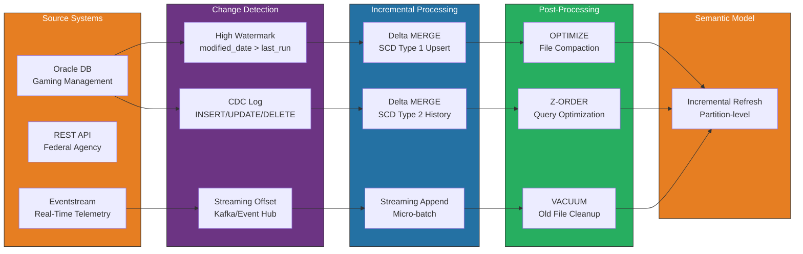
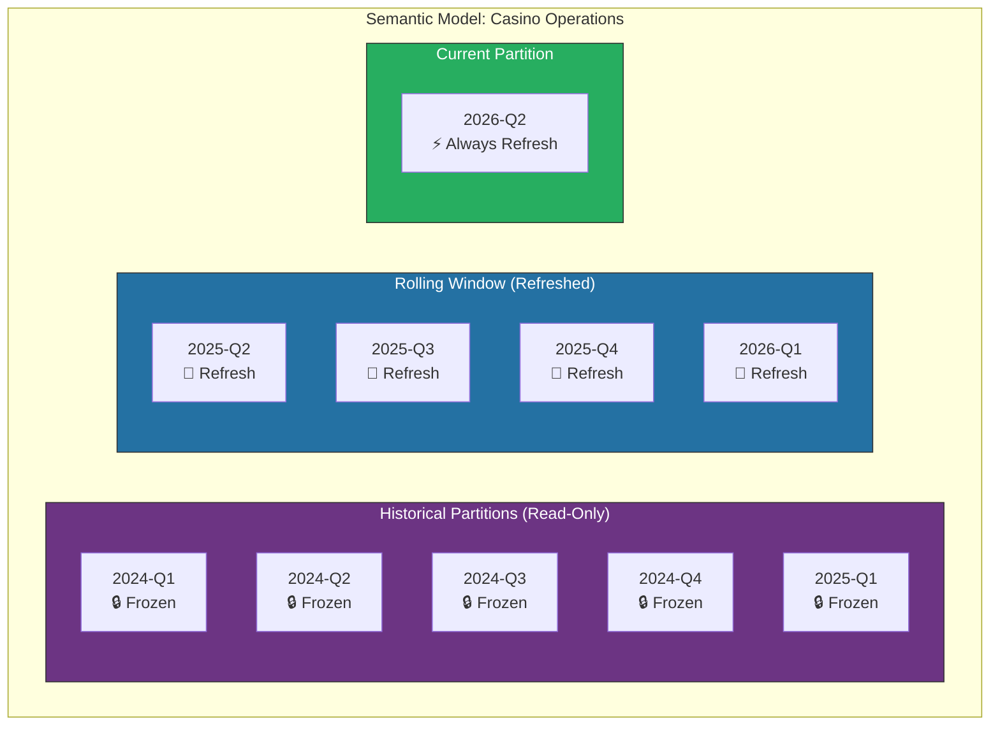
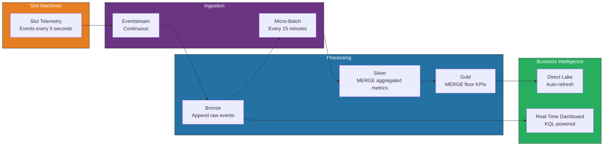

# 🔄 Incremental Refresh & CDC Patterns for Microsoft Fabric

<div align="center" markdown>

**Delta MERGE, Change Data Capture, and Semantic Model Incremental Refresh**


</div>

---

**Last Updated:** `2026-04-13` | **Version:** 1.0.0

---

!!! info "Third-party references — publicly sourced, good-faith comparison"
    This page references non-Microsoft products and services. That information is drawn from each vendor's **publicly available documentation** and is offered for honest, good-faith comparison only. This is a personal project written from a Microsoft Fabric and Azure perspective; it does **not** claim expertise in, or authority over, any third-party product, and nothing here is an official statement by, or endorsed by, those vendors. Capabilities, pricing, and features change often — always verify against the vendor's current official documentation. Where a third-party offering is the stronger choice, we say so plainly.

---

## 🎯 Overview

Incremental refresh and change data capture (CDC) patterns are essential for production-grade data pipelines that must process only new or changed data rather than reloading entire datasets. This guide covers Delta Lake MERGE operations, watermark-based change detection, SCD Type 1 and Type 2 implementations, and Power BI semantic model incremental refresh — all tuned for casino gaming and federal agency workloads in Microsoft Fabric.

### Why Incremental?

| Benefit | Full Load | Incremental |
|---------|-----------|-------------|
| **Processing time** | Hours (large tables) | Minutes |
| **CU consumption** | High (full scan + write) | Low (delta only) |
| **Storage churn** | Full table rewrite | Append or targeted update |
| **Downstream impact** | Full semantic model refresh | Partition-level refresh |
| **Data availability** | Blocked during reload | Continuous availability |

### Change Detection Methods

| Method | Source Requirement | Latency | Complexity |
|--------|-------------------|---------|-----------|
| **High watermark** | Monotonic column (timestamp, ID) | Batch (minutes to hours) | Low |
| **CDC (Change Data Capture)** | Database CDC enabled | Near-real-time | Medium |
| **Fabric Mirroring** | SQL Server / Azure SQL | Near-real-time | Low (managed) |
| **Eventstream** | Streaming source | Real-time | Medium |
| **File-based delta** | New files in folder | Batch | Low |
| **Hash comparison** | Any source | Batch | High |

---

## 🏗️ Architecture

### End-to-End Incremental Pipeline



---

## 🔀 Delta MERGE Patterns

### SCD Type 1: Upsert (Overwrite Current Values)

SCD Type 1 overwrites the existing record with the latest values. Use for dimensions where historical attribute values are not needed.

**PySpark implementation:**

```python
from delta.tables import DeltaTable
from pyspark.sql import functions as F

def scd_type_1_merge(
    target_table: str,
    source_df,
    merge_keys: list[str],
    update_columns: list[str] = None
):
    """
    SCD Type 1 MERGE: Insert new records, update changed records.

    Args:
        target_table: Fully qualified Delta table name
        source_df: DataFrame with new/changed records
        merge_keys: Columns to match on (e.g., ['player_id'])
        update_columns: Columns to update on match (None = all non-key columns)
    """
    target = DeltaTable.forName(spark, target_table)

    # Build merge condition
    merge_condition = " AND ".join(
        [f"target.{k} = source.{k}" for k in merge_keys]
    )

    # Determine update columns
    if update_columns is None:
        update_columns = [
            c for c in source_df.columns if c not in merge_keys
        ]

    # Build update map
    update_map = {c: f"source.{c}" for c in update_columns}
    update_map["_updated_at"] = "current_timestamp()"

    # Build insert map
    insert_map = {c: f"source.{c}" for c in source_df.columns}
    insert_map["_inserted_at"] = "current_timestamp()"
    insert_map["_updated_at"] = "current_timestamp()"

    # Execute MERGE
    (
        target.alias("target")
        .merge(source_df.alias("source"), merge_condition)
        .whenMatchedUpdate(set=update_map)
        .whenNotMatchedInsert(values=insert_map)
        .execute()
    )

    print(f"✅ SCD Type 1 MERGE completed on {target_table}")


# Usage: Update machine dimension
machine_updates = spark.read.format("delta").table("bronze.machine_registry_latest")

scd_type_1_merge(
    target_table="silver.dim_machine",
    source_df=machine_updates,
    merge_keys=["machine_id"],
    update_columns=["machine_name", "manufacturer", "denomination",
                    "floor_zone", "status", "last_service_date"]
)
```

**Spark SQL implementation:**

```sql
-- SCD Type 1 MERGE using Spark SQL
MERGE INTO silver.dim_machine AS target
USING bronze.machine_registry_latest AS source
ON target.machine_id = source.machine_id

WHEN MATCHED AND (
    target.machine_name != source.machine_name
    OR target.denomination != source.denomination
    OR target.floor_zone != source.floor_zone
    OR target.status != source.status
) THEN UPDATE SET
    target.machine_name = source.machine_name,
    target.manufacturer = source.manufacturer,
    target.denomination = source.denomination,
    target.floor_zone = source.floor_zone,
    target.status = source.status,
    target.last_service_date = source.last_service_date,
    target._updated_at = current_timestamp()

WHEN NOT MATCHED THEN INSERT (
    machine_id, machine_name, manufacturer, denomination,
    floor_zone, status, last_service_date,
    _inserted_at, _updated_at
) VALUES (
    source.machine_id, source.machine_name, source.manufacturer,
    source.denomination, source.floor_zone, source.status,
    source.last_service_date,
    current_timestamp(), current_timestamp()
);
```

### SCD Type 2: Historical Tracking

SCD Type 2 preserves the full history of changes by creating a new record for each change and marking the previous record as expired.

```python
from delta.tables import DeltaTable
from pyspark.sql import functions as F
from pyspark.sql.window import Window

def scd_type_2_merge(
    target_table: str,
    source_df,
    business_keys: list[str],
    tracked_columns: list[str],
    surrogate_key: str = "sk"
):
    """
    SCD Type 2 MERGE: Preserve full change history.

    Creates new version for changed records, expires old version.

    Args:
        target_table: Fully qualified Delta table name
        source_df: DataFrame with current-state records
        business_keys: Natural key columns (e.g., ['player_id'])
        tracked_columns: Columns whose changes trigger a new version
        surrogate_key: Name of the surrogate key column
    """
    target = DeltaTable.forName(spark, target_table)
    current_timestamp = F.current_timestamp()

    # Add hash of tracked columns for change detection
    source_with_hash = source_df.withColumn(
        "_row_hash",
        F.md5(F.concat_ws("||", *[
            F.coalesce(F.col(c).cast("string"), F.lit("NULL"))
            for c in tracked_columns
        ]))
    )

    # Get current active records from target
    target_df = spark.read.format("delta").table(target_table)
    active_target = target_df.filter(F.col("is_current") == True)

    # Identify changes: join source with active target on business keys
    bk_condition = " AND ".join(
        [f"src.{k} = tgt.{k}" for k in business_keys]
    )

    # Records that changed (hash mismatch)
    changed = (
        source_with_hash.alias("src")
        .join(active_target.alias("tgt"), on=business_keys, how="inner")
        .filter(F.col("src._row_hash") != F.col("tgt._row_hash"))
        .select("src.*")
    )

    # Records that are new (no match in target)
    new_records = (
        source_with_hash.alias("src")
        .join(active_target.alias("tgt"), on=business_keys, how="left_anti")
        .select("src.*")
    )

    # Expire old versions of changed records
    merge_condition = " AND ".join(
        [f"target.{k} = updates.{k}" for k in business_keys]
    )

    if changed.count() > 0:
        (
            target.alias("target")
            .merge(
                changed.alias("updates"),
                f"{merge_condition} AND target.is_current = true"
            )
            .whenMatchedUpdate(set={
                "is_current": "false",
                "effective_end_date": "current_timestamp()",
                "_updated_at": "current_timestamp()"
            })
            .execute()
        )

    # Insert new versions (changed + truly new records)
    all_new = changed.unionByName(new_records)

    if all_new.count() > 0:
        new_with_metadata = (
            all_new
            .withColumn("is_current", F.lit(True))
            .withColumn("effective_start_date", current_timestamp)
            .withColumn("effective_end_date", F.lit(None).cast("timestamp"))
            .withColumn("_inserted_at", current_timestamp)
            .withColumn("_updated_at", current_timestamp)
            .withColumn("version", F.lit(1))  # Will be updated below
            .drop("_row_hash")
        )

        new_with_metadata.write.format("delta").mode("append").saveAsTable(
            target_table
        )

    print(f"✅ SCD Type 2 MERGE: {changed.count()} updated, "
          f"{new_records.count()} inserted")


# Usage: Track player profile changes over time
player_current = spark.read.format("delta").table("bronze.player_profiles_latest")

scd_type_2_merge(
    target_table="silver.dim_player",
    source_df=player_current,
    business_keys=["player_id"],
    tracked_columns=[
        "tier_status", "email", "phone", "mailing_address",
        "preferred_property", "marketing_opt_in"
    ]
)
```

### Soft Delete Pattern

Mark records as deleted without physically removing them. Required for compliance workloads where audit trails must be preserved.

```python
def soft_delete_merge(
    target_table: str,
    source_active_ids_df,
    key_column: str
):
    """
    Mark records as soft-deleted when they no longer appear in the source.

    Args:
        target_table: Delta table name
        source_active_ids_df: DataFrame with currently active IDs
        key_column: Primary key column name
    """
    target = DeltaTable.forName(spark, target_table)

    (
        target.alias("target")
        .merge(
            source_active_ids_df.alias("source"),
            f"target.{key_column} = source.{key_column}"
        )
        # Records in target but not in source → soft delete
        .whenNotMatchedBySourceUpdate(set={
            "is_deleted": "true",
            "deleted_at": "current_timestamp()",
            "_updated_at": "current_timestamp()"
        })
        .execute()
    )

    # Count soft-deleted records
    deleted_count = (
        spark.read.format("delta").table(target_table)
        .filter(F.col("is_deleted") == True)
        .count()
    )
    print(f"✅ Soft delete completed. Total soft-deleted: {deleted_count}")
```

### Hard Delete with Audit Trail

```sql
-- Hard delete with audit trail: log deletions before removing
-- Step 1: Log deletions to audit table
INSERT INTO audit.deleted_records
SELECT
    'dim_machine' AS table_name,
    machine_id AS record_key,
    current_timestamp() AS deleted_at,
    'source_system_decommission' AS delete_reason,
    to_json(struct(*)) AS record_snapshot
FROM silver.dim_machine AS target
LEFT ANTI JOIN bronze.machine_registry_latest AS source
    ON target.machine_id = source.machine_id
WHERE target.is_deleted = false;

-- Step 2: Delete records (or use soft delete above)
DELETE FROM silver.dim_machine
WHERE machine_id NOT IN (
    SELECT machine_id FROM bronze.machine_registry_latest
);
```

---

## 📌 Watermark Management

### High-Watermark Table Design

A centralized watermark table tracks the last successfully processed timestamp or ID for each source table.

```sql
-- Create watermark table in Fabric Warehouse or Lakehouse
CREATE TABLE IF NOT EXISTS control.watermarks (
    source_system       VARCHAR(50)     NOT NULL,
    source_table        VARCHAR(100)    NOT NULL,
    watermark_column    VARCHAR(50)     NOT NULL,
    watermark_value     VARCHAR(100)    NOT NULL,
    watermark_type      VARCHAR(20)     NOT NULL,  -- 'timestamp' or 'integer'
    last_run_start      DATETIME2       NOT NULL,
    last_run_end        DATETIME2       NULL,
    last_run_status     VARCHAR(20)     NOT NULL,  -- 'success', 'failed', 'running'
    rows_processed      BIGINT          DEFAULT 0,
    updated_by          VARCHAR(100)    DEFAULT 'pipeline',
    CONSTRAINT pk_watermarks PRIMARY KEY (source_system, source_table)
);

-- Seed initial watermarks
INSERT INTO control.watermarks VALUES
('oracle_gaming', 'slot_transactions', 'transaction_ts', '2020-01-01T00:00:00', 'timestamp', GETUTCDATE(), NULL, 'success', 0, 'initial_seed'),
('oracle_gaming', 'player_profiles', 'modified_date', '2020-01-01T00:00:00', 'timestamp', GETUTCDATE(), NULL, 'success', 0, 'initial_seed'),
('usda_nass_api', 'crop_production', 'survey_year', '2020', 'integer', GETUTCDATE(), NULL, 'success', 0, 'initial_seed'),
('epa_aqs_api', 'air_quality', 'measurement_date', '2024-01-01', 'timestamp', GETUTCDATE(), NULL, 'success', 0, 'initial_seed');
```

### Watermark Read/Update Pattern

```python
class WatermarkManager:
    """Manage high-watermark values for incremental loads."""

    def __init__(self, watermark_table: str = "control.watermarks"):
        self.watermark_table = watermark_table

    def get_watermark(
        self, source_system: str, source_table: str
    ) -> tuple[str, str]:
        """Get the current watermark value and column name."""
        row = spark.sql(f"""
            SELECT watermark_column, watermark_value, watermark_type
            FROM {self.watermark_table}
            WHERE source_system = '{source_system}'
              AND source_table = '{source_table}'
              AND last_run_status = 'success'
        """).first()

        if row is None:
            raise ValueError(
                f"No watermark found for {source_system}.{source_table}"
            )

        return row["watermark_column"], row["watermark_value"]

    def start_run(self, source_system: str, source_table: str):
        """Mark watermark as 'running' at start of pipeline."""
        spark.sql(f"""
            UPDATE {self.watermark_table}
            SET last_run_status = 'running',
                last_run_start = current_timestamp()
            WHERE source_system = '{source_system}'
              AND source_table = '{source_table}'
        """)

    def complete_run(
        self,
        source_system: str,
        source_table: str,
        new_watermark: str,
        rows_processed: int
    ):
        """Update watermark after successful pipeline run."""
        spark.sql(f"""
            UPDATE {self.watermark_table}
            SET watermark_value = '{new_watermark}',
                last_run_end = current_timestamp(),
                last_run_status = 'success',
                rows_processed = {rows_processed},
                updated_by = 'pipeline'
            WHERE source_system = '{source_system}'
              AND source_table = '{source_table}'
        """)

    def fail_run(self, source_system: str, source_table: str, error: str):
        """Mark watermark as 'failed' if pipeline errors."""
        # Escape single quotes in error message
        safe_error = error.replace("'", "''")[:500]
        spark.sql(f"""
            UPDATE {self.watermark_table}
            SET last_run_end = current_timestamp(),
                last_run_status = 'failed',
                updated_by = 'pipeline: {safe_error}'
            WHERE source_system = '{source_system}'
              AND source_table = '{source_table}'
        """)


# Usage in an incremental pipeline
wm = WatermarkManager()

try:
    # Get last successful watermark
    wm_col, wm_val = wm.get_watermark("oracle_gaming", "slot_transactions")
    wm.start_run("oracle_gaming", "slot_transactions")

    # Extract only new records
    new_records = spark.read.format("jdbc").options(
        url="jdbc:oracle:thin:@//host:1521/GAMING",
        dbtable=f"(SELECT * FROM slot_transactions WHERE {wm_col} > TO_TIMESTAMP('{wm_val}', 'YYYY-MM-DD\"T\"HH24:MI:SS'))",
        driver="oracle.jdbc.driver.OracleDriver"
    ).load()

    rows = new_records.count()

    if rows > 0:
        # Write to Bronze
        new_records.write.format("delta").mode("append").saveAsTable(
            "bronze.slot_transactions"
        )

        # Get new watermark value
        new_wm = new_records.agg(F.max(wm_col)).first()[0]

        wm.complete_run(
            "oracle_gaming", "slot_transactions",
            str(new_wm), rows
        )
        print(f"✅ Processed {rows:,} new slot transactions")
    else:
        wm.complete_run("oracle_gaming", "slot_transactions", wm_val, 0)
        print("ℹ️ No new records to process")

except Exception as e:
    wm.fail_run("oracle_gaming", "slot_transactions", str(e))
    raise
```

### Pipeline Parameters for Watermarks

```json
{
    "name": "pipe_incremental_slot_transactions",
    "properties": {
        "parameters": {
            "SourceSystem": {
                "type": "String",
                "defaultValue": "oracle_gaming"
            },
            "SourceTable": {
                "type": "String",
                "defaultValue": "slot_transactions"
            },
            "WatermarkColumn": {
                "type": "String",
                "defaultValue": "transaction_ts"
            }
        },
        "activities": [
            {
                "name": "Get Last Watermark",
                "type": "Lookup",
                "typeProperties": {
                    "source": {
                        "type": "SqlDWSource",
                        "sqlReaderQuery": "SELECT watermark_value FROM control.watermarks WHERE source_system = '@{pipeline().parameters.SourceSystem}' AND source_table = '@{pipeline().parameters.SourceTable}'"
                    }
                }
            },
            {
                "name": "Copy New Records",
                "type": "Copy",
                "dependsOn": [{"activity": "Get Last Watermark", "conditions": ["Succeeded"]}],
                "typeProperties": {
                    "source": {
                        "type": "OracleSource",
                        "oracleReaderQuery": "SELECT * FROM @{pipeline().parameters.SourceTable} WHERE @{pipeline().parameters.WatermarkColumn} > TO_TIMESTAMP('@{activity('Get Last Watermark').output.firstRow.watermark_value}', 'YYYY-MM-DD\"T\"HH24:MI:SS')"
                    },
                    "sink": {
                        "type": "LakehouseTableSink",
                        "tableActionOption": "Append"
                    }
                }
            },
            {
                "name": "Update Watermark",
                "type": "SqlServerStoredProcedure",
                "dependsOn": [{"activity": "Copy New Records", "conditions": ["Succeeded"]}],
                "typeProperties": {
                    "storedProcedureName": "control.usp_update_watermark",
                    "storedProcedureParameters": {
                        "source_system": "@{pipeline().parameters.SourceSystem}",
                        "source_table": "@{pipeline().parameters.SourceTable}",
                        "new_watermark": "@{activity('Copy New Records').output.effectiveIntegrationRuntime}",
                        "rows_processed": "@{activity('Copy New Records').output.rowsCopied}"
                    }
                }
            }
        ]
    }
}
```

---

## 📊 Semantic Model Incremental Refresh

### How Incremental Refresh Works

Power BI semantic models (Direct Lake or Import) support incremental refresh to avoid full dataset reloads. Fabric partitions the table by a date column, and only refreshes partitions that have changed.



### Configuration Parameters

| Parameter | Description | Casino Example | Federal Example |
|-----------|-------------|----------------|-----------------|
| **RangeStart** | Beginning of rolling window | 2 years ago | 5 years ago |
| **RangeEnd** | Current date + buffer | Current date | Current date |
| **Refresh window** | Partitions to refresh each run | Last 90 days | Last 30 days |
| **Archive window** | Read-only historical partitions | Older than 90 days | Older than 30 days |
| **Partition grain** | Partition size | Month | Month |
| **Detect changes** | Column for change detection | `_updated_at` | `_updated_at` |

### XMLA Endpoint Configuration

```python
# Configure incremental refresh via XMLA endpoint
import xmla

incremental_refresh_config = {
    "table": "fact_slot_transactions",
    "partition_column": "transaction_date",
    "partition_grain": "Month",
    "rolling_window": {
        "refresh_period": 90,       # days to refresh
        "refresh_period_type": "Day",
        "archive_period": 730,      # days to keep (2 years)
        "archive_period_type": "Day"
    },
    "detect_data_changes": {
        "column": "_updated_at",
        "enabled": True
    },
    "incremental_refresh_policy": {
        "incrementalPeriodsToRefresh": 3,     # Refresh last 3 months
        "rollingWindowPeriods": 24,           # Keep 24 months
        "rollingWindowGranularity": "Month",
        "pollingExpression": [
            "MAX(_updated_at)"                # Detect changes via max update timestamp
        ]
    }
}
```

### Direct Lake Incremental Considerations

| Aspect | Import Mode | Direct Lake |
|--------|-------------|-------------|
| **Partition management** | XMLA endpoint | Automatic via Delta table |
| **Refresh mechanism** | Data reload into memory | Metadata refresh (no data copy) |
| **Change detection** | Polling expression | Delta transaction log |
| **Refresh duration** | Minutes to hours (data copy) | Seconds (metadata only) |
| **Manual partition control** | Full XMLA control | Limited (Fabric-managed) |

> **💡 Tip:** Direct Lake semantic models get incremental refresh "for free" because Delta Lake's transaction log naturally tracks which files changed. The semantic model only needs to refresh its metadata, not reload data.

### DAX Measures for Incremental Awareness

```dax
// Last refresh timestamp for monitoring
Last Data Refresh =
VAR _MaxDate = MAX(fact_slot_transactions[_updated_at])
RETURN
    FORMAT(_MaxDate, "yyyy-MM-dd HH:mm:ss") & " UTC"

// Data freshness indicator
Data Freshness Status =
VAR _HoursSinceRefresh =
    DATEDIFF(
        MAX(fact_slot_transactions[_updated_at]),
        NOW(),
        HOUR
    )
RETURN
    SWITCH(
        TRUE(),
        _HoursSinceRefresh <= 1, "🟢 Current",
        _HoursSinceRefresh <= 4, "🟡 Slightly Stale",
        _HoursSinceRefresh <= 24, "🟠 Stale",
        "🔴 Critical - Check Pipeline"
    )

// Rolling 90-day revenue (aligned with refresh window)
Rolling 90d Revenue =
CALCULATE(
    SUM(fact_slot_transactions[net_revenue]),
    DATESINPERIOD(
        dim_date[date],
        MAX(dim_date[date]),
        -90,
        DAY
    )
)
```

---

## 🎰 Casino Industry Patterns

### 15-Minute Slot Micro-Batch Pipeline

Casino slot telemetry requires near-real-time processing with 15-minute micro-batches for floor monitoring.



**15-minute micro-batch implementation:**

```python
# Databricks notebook source
# MAGIC %md
# MAGIC # Slot Telemetry 15-Minute Micro-Batch
# MAGIC Processes slot machine events from Bronze to Silver every 15 minutes.

from pyspark.sql import functions as F
from delta.tables import DeltaTable

# Configuration
BATCH_WINDOW_MINUTES = 15
SOURCE_TABLE = "bronze.slot_machine_events"
TARGET_TABLE = "silver.slot_machine_metrics_15min"

# Get watermark
wm = WatermarkManager()
wm_col, wm_val = wm.get_watermark("eventstream", "slot_machine_events")
wm.start_run("eventstream", "slot_machine_events")

try:
    # Read new events since last watermark
    new_events = (
        spark.read.format("delta").table(SOURCE_TABLE)
        .filter(F.col("event_timestamp") > F.lit(wm_val))
    )

    if new_events.count() == 0:
        wm.complete_run("eventstream", "slot_machine_events", wm_val, 0)
        print("ℹ️ No new events")
    else:
        # Aggregate to 15-minute windows
        aggregated = (
            new_events
            .withColumn(
                "window_start",
                F.window(F.col("event_timestamp"), f"{BATCH_WINDOW_MINUTES} minutes").start
            )
            .groupBy("machine_id", "property_id", "window_start")
            .agg(
                F.count("*").alias("event_count"),
                F.sum("coin_in").alias("total_coin_in"),
                F.sum("coin_out").alias("total_coin_out"),
                F.sum("jackpot_amount").alias("total_jackpots"),
                F.avg("theoretical_hold_pct").alias("avg_hold_pct"),
                F.count(F.when(F.col("event_type") == "play", True)).alias("plays"),
                F.max("event_timestamp").alias("last_event_ts")
            )
            .withColumn("net_revenue", F.col("total_coin_in") - F.col("total_coin_out"))
            .withColumn("_updated_at", F.current_timestamp())
        )

        # MERGE into Silver (SCD Type 1 — latest window values)
        target = DeltaTable.forName(spark, TARGET_TABLE)

        (
            target.alias("t")
            .merge(
                aggregated.alias("s"),
                "t.machine_id = s.machine_id AND t.window_start = s.window_start"
            )
            .whenMatchedUpdateAll()
            .whenNotMatchedInsertAll()
            .execute()
        )

        # Update watermark
        new_wm = str(new_events.agg(F.max("event_timestamp")).first()[0])
        rows = aggregated.count()
        wm.complete_run("eventstream", "slot_machine_events", new_wm, rows)
        print(f"✅ Processed {rows:,} micro-batch windows")

except Exception as e:
    wm.fail_run("eventstream", "slot_machine_events", str(e))
    raise
```

### Player Profile SCD Type 2

Track player tier changes, address updates, and marketing preferences with full history.

```python
# Player profile SCD Type 2 — track tier changes for comp calculations
player_current_state = (
    spark.read.format("delta").table("bronze.player_profiles_latest")
    .select(
        "player_id", "first_name", "last_name",
        "tier_status",          # Platinum, Gold, Silver, Bronze
        "email", "phone",
        "preferred_property",
        "marketing_opt_in",
        "total_lifetime_value"
    )
)

scd_type_2_merge(
    target_table="silver.dim_player_history",
    source_df=player_current_state,
    business_keys=["player_id"],
    tracked_columns=[
        "tier_status", "email", "phone",
        "preferred_property", "marketing_opt_in"
    ]
)

# Query: When did player X become Platinum?
tier_changes = spark.sql("""
    SELECT player_id, tier_status,
           effective_start_date, effective_end_date
    FROM silver.dim_player_history
    WHERE player_id = 'PLR-001234'
    ORDER BY effective_start_date
""")
```

### Compliance CTR/SAR Incremental Detection

```python
# Incremental CTR candidate detection
# Only scan transactions since last check

wm_col, wm_val = wm.get_watermark("compliance", "ctr_detection")

new_transactions = (
    spark.read.format("delta").table("silver.slot_transactions_cleansed")
    .filter(F.col("transaction_ts") > F.lit(wm_val))
)

# CTR: Single transactions >= $10,000
ctr_candidates = (
    new_transactions
    .filter(F.col("cash_amount") >= 10000)
    .withColumn("alert_type", F.lit("CTR"))
    .withColumn("detected_at", F.current_timestamp())
)

# SAR: Structuring detection ($8K-$9.9K pattern)
sar_candidates = (
    new_transactions
    .filter(
        (F.col("cash_amount") >= 8000) &
        (F.col("cash_amount") < 10000)
    )
    .groupBy("player_id", F.window("transaction_ts", "24 hours"))
    .agg(
        F.count("*").alias("transaction_count"),
        F.sum("cash_amount").alias("total_amount")
    )
    .filter(
        (F.col("transaction_count") >= 2) &
        (F.col("total_amount") >= 10000)
    )
    .withColumn("alert_type", F.lit("SAR_STRUCTURING"))
    .withColumn("detected_at", F.current_timestamp())
)

# Append to compliance alerts table (never overwrite)
ctr_candidates.write.format("delta").mode("append").saveAsTable(
    "gold.compliance_alerts"
)
sar_candidates.write.format("delta").mode("append").saveAsTable(
    "gold.compliance_alerts"
)
```

---

## 🏛️ Federal Agency Patterns

### USDA Daily Crop Data Incremental Load

USDA NASS crop production data updates daily during growing seasons.

```python
# USDA daily incremental load from NASS API
import requests
from datetime import datetime, timedelta

def incremental_usda_nass_load():
    """Load new USDA NASS crop data incrementally."""
    wm = WatermarkManager()
    wm_col, wm_val = wm.get_watermark("usda_nass_api", "crop_production")
    wm.start_run("usda_nass_api", "crop_production")

    try:
        # Fetch new data from NASS API since last watermark
        last_date = datetime.strptime(wm_val, "%Y-%m-%d")
        today = datetime.utcnow().date()

        api_url = "https://quickstats.nass.usda.gov/api/api_GET/"
        params = {
            "key": spark.conf.get("spark.usda.nass.api_key"),
            "source_desc": "SURVEY",
            "sector_desc": "CROPS",
            "statisticcat_desc": "PRODUCTION",
            "reference_period_desc": "YEAR",
            "year__GE": str(last_date.year),
            "format": "JSON"
        }

        response = requests.get(api_url, params=params)
        response.raise_for_status()
        data = response.json().get("data", [])

        if not data:
            wm.complete_run("usda_nass_api", "crop_production", wm_val, 0)
            print("ℹ️ No new USDA data available")
            return

        # Convert to DataFrame
        new_df = spark.createDataFrame(data)

        # Write to Bronze (append)
        new_df = new_df.withColumn("_ingested_at", F.current_timestamp())
        new_df.write.format("delta").mode("append").saveAsTable(
            "bronze.usda_crop_production"
        )

        # MERGE into Silver (SCD Type 1 by state + commodity + year)
        scd_type_1_merge(
            target_table="silver.usda_crop_production",
            source_df=new_df,
            merge_keys=["state_fips_code", "commodity_desc", "year"],
            update_columns=["value", "cv_pct", "unit_desc"]
        )

        new_wm = str(today)
        wm.complete_run("usda_nass_api", "crop_production", new_wm, len(data))
        print(f"✅ Loaded {len(data):,} USDA crop records")

    except Exception as e:
        wm.fail_run("usda_nass_api", "crop_production", str(e))
        raise

incremental_usda_nass_load()
```

### EPA Streaming Micro-Batch (Air Quality)

EPA Air Quality System (AQS) data flows via Eventstream for near-real-time monitoring.

```python
# EPA air quality streaming micro-batch
def epa_air_quality_microbatch():
    """Process EPA AQS streaming data in micro-batches."""
    wm = WatermarkManager()
    wm_col, wm_val = wm.get_watermark("epa_aqs_stream", "air_quality")
    wm.start_run("epa_aqs_stream", "air_quality")

    try:
        # Read new events from Bronze (populated by Eventstream)
        new_measurements = (
            spark.read.format("delta").table("bronze.epa_air_quality_stream")
            .filter(F.col("measurement_timestamp") > F.lit(wm_val))
        )

        count = new_measurements.count()

        if count == 0:
            wm.complete_run("epa_aqs_stream", "air_quality", wm_val, 0)
            return

        # Aggregate to hourly readings per station
        hourly = (
            new_measurements
            .withColumn(
                "measurement_hour",
                F.date_trunc("hour", F.col("measurement_timestamp"))
            )
            .groupBy("station_id", "parameter_code", "measurement_hour")
            .agg(
                F.avg("sample_value").alias("avg_value"),
                F.max("sample_value").alias("max_value"),
                F.min("sample_value").alias("min_value"),
                F.count("*").alias("sample_count"),
                F.stddev("sample_value").alias("stddev_value")
            )
            .withColumn("_updated_at", F.current_timestamp())
        )

        # MERGE into Silver (latest hourly readings)
        target = DeltaTable.forName(spark, "silver.epa_air_quality_hourly")

        (
            target.alias("t")
            .merge(
                hourly.alias("s"),
                """t.station_id = s.station_id
                   AND t.parameter_code = s.parameter_code
                   AND t.measurement_hour = s.measurement_hour"""
            )
            .whenMatchedUpdateAll()
            .whenNotMatchedInsertAll()
            .execute()
        )

        # Check for AQI threshold breaches
        breaches = hourly.filter(
            ((F.col("parameter_code") == "88101") & (F.col("avg_value") > 35.5)) |  # PM2.5
            ((F.col("parameter_code") == "44201") & (F.col("avg_value") > 0.070))   # Ozone
        )

        if breaches.count() > 0:
            breaches.withColumn(
                "alert_type", F.lit("AQI_THRESHOLD_BREACH")
            ).write.format("delta").mode("append").saveAsTable(
                "gold.epa_environmental_alerts"
            )
            print(f"⚠️ {breaches.count()} AQI threshold breaches detected")

        # Update watermark
        new_wm = str(
            new_measurements.agg(F.max("measurement_timestamp")).first()[0]
        )
        wm.complete_run("epa_aqs_stream", "air_quality", new_wm, count)
        print(f"✅ Processed {count:,} EPA measurements into {hourly.count():,} hourly records")

    except Exception as e:
        wm.fail_run("epa_aqs_stream", "air_quality", str(e))
        raise

epa_air_quality_microbatch()
```

---

## ⚡ Performance Optimization

### OPTIMIZE and VACUUM Schedule

```python
def post_merge_optimization(
    table_name: str,
    z_order_columns: list[str] = None,
    vacuum_hours: int = 168  # 7 days
):
    """Run OPTIMIZE and VACUUM after incremental MERGE operations."""
    # OPTIMIZE: compact small files created by MERGE
    if z_order_columns:
        z_cols = ", ".join(z_order_columns)
        spark.sql(f"OPTIMIZE {table_name} ZORDER BY ({z_cols})")
        print(f"✅ OPTIMIZE + Z-ORDER on {table_name} ({z_cols})")
    else:
        spark.sql(f"OPTIMIZE {table_name}")
        print(f"✅ OPTIMIZE on {table_name}")

    # VACUUM: remove old files beyond retention
    spark.sql(f"VACUUM {table_name} RETAIN {vacuum_hours} HOURS")
    print(f"✅ VACUUM on {table_name} (retain {vacuum_hours}h)")

# Schedule optimization after daily MERGE
post_merge_optimization(
    "silver.slot_transactions_cleansed",
    z_order_columns=["property_id", "transaction_date"]
)

post_merge_optimization(
    "gold.slot_performance_daily",
    z_order_columns=["property_id", "gaming_date"]
)
```

### Merge Performance Tips

| Tip | Description | Impact |
|-----|-------------|--------|
| **Filter early** | Apply watermark filter before MERGE | Reduce shuffle data volume |
| **Partition alignment** | MERGE on partition-aligned keys | Minimize files scanned |
| **Broadcast small sources** | Broadcast hint for small change sets | Avoid shuffle join |
| **Batch large changes** | Split > 10M row changes into batches | Prevent OOM |
| **Enable V-Order** | Optimize write layout for reads | 2-10x Direct Lake improvement |
| **Avoid MERGE on append-only** | Use INSERT for event/fact tables | Skip expensive join |

---

## ✅ Testing & Validation

### Incremental Pipeline Tests

```python
import pytest

class TestIncrementalPipeline:
    """Test suite for incremental refresh patterns."""

    def test_watermark_advances_on_success(self, spark_session):
        """Watermark should advance after successful pipeline run."""
        wm = WatermarkManager()
        initial_wm = wm.get_watermark("test", "table1")[1]

        # Simulate successful run
        wm.start_run("test", "table1")
        wm.complete_run("test", "table1", "2026-04-13T12:00:00", 100)

        new_wm = wm.get_watermark("test", "table1")[1]
        assert new_wm == "2026-04-13T12:00:00"
        assert new_wm > initial_wm

    def test_watermark_unchanged_on_failure(self, spark_session):
        """Watermark should NOT advance on pipeline failure."""
        wm = WatermarkManager()
        initial_wm = wm.get_watermark("test", "table1")[1]

        wm.start_run("test", "table1")
        wm.fail_run("test", "table1", "Connection timeout")

        current_wm = wm.get_watermark("test", "table1")[1]
        assert current_wm == initial_wm  # Unchanged

    def test_scd_type_1_updates_existing(self, spark_session):
        """SCD Type 1 should update existing records."""
        # Insert initial record
        initial = spark_session.createDataFrame([
            (1, "Machine-A", "Active")
        ], ["machine_id", "machine_name", "status"])
        initial.write.format("delta").mode("overwrite").saveAsTable("test.dim_machine")

        # Update
        updated = spark_session.createDataFrame([
            (1, "Machine-A-Updated", "Inactive")
        ], ["machine_id", "machine_name", "status"])

        scd_type_1_merge("test.dim_machine", updated, ["machine_id"])

        result = spark_session.read.format("delta").table("test.dim_machine")
        assert result.count() == 1
        assert result.first()["machine_name"] == "Machine-A-Updated"

    def test_scd_type_2_creates_history(self, spark_session):
        """SCD Type 2 should create new version and expire old."""
        # Verify two versions exist after update
        history = spark_session.sql("""
            SELECT * FROM silver.dim_player_history
            WHERE player_id = 'PLR-TEST-001'
            ORDER BY effective_start_date
        """)

        assert history.count() >= 2
        # First version should be expired
        first = history.first()
        assert first["is_current"] == False
        assert first["effective_end_date"] is not None
```

---

## ⚠️ Common Pitfalls

| Pitfall | Impact | Prevention |
|---------|--------|-----------|
| **Missing watermark update on failure** | Reprocesses already-loaded data on retry | Always use try/except with fail_run |
| **Non-monotonic watermark column** | Skips records with out-of-order values | Use server-generated timestamps, not client times |
| **MERGE on unpartitioned tables** | Full table scan on every MERGE | Partition by date; align MERGE keys |
| **Forgetting OPTIMIZE after MERGE** | Small files degrade query performance | Schedule OPTIMIZE after each MERGE batch |
| **VACUUM too aggressively** | Breaks time travel and concurrent reads | Retain at least 7 days (168 hours) |
| **No duplicate protection** | Retries insert duplicates | Use MERGE instead of INSERT for idempotency |
| **Watermark table in target Lakehouse** | Chicken-and-egg during initialization | Store watermarks in Warehouse or separate control Lakehouse |

---

## 📚 References

### Microsoft Documentation

- [Delta Lake MERGE documentation](https://learn.microsoft.com/fabric/data-engineering/delta-lake-merge)
- [Incremental refresh for semantic models](https://learn.microsoft.com/power-bi/connect-data/incremental-refresh-overview)
- [Direct Lake overview](https://learn.microsoft.com/fabric/get-started/direct-lake-overview)
- [Delta Lake optimization in Fabric](https://learn.microsoft.com/fabric/data-engineering/delta-optimization-and-v-order)
- [Fabric Mirroring CDC](https://learn.microsoft.com/fabric/database/mirrored-database/overview)
- [Eventstream for real-time ingestion](https://learn.microsoft.com/fabric/real-time-intelligence/event-streams/overview)
- [XMLA endpoint for semantic models](https://learn.microsoft.com/power-bi/enterprise/service-premium-connect-tools)

### Delta Lake Resources

- [Delta Lake MERGE syntax](https://docs.delta.io/latest/delta-update.html)
- [SCD Type 2 with Delta Lake](https://docs.delta.io/latest/delta-update.html#slowly-changing-data-scd-type-2-operation)
- [OPTIMIZE and Z-ORDER](https://docs.delta.io/latest/optimizations-oss.html)
- [VACUUM](https://docs.delta.io/latest/delta-utility.html#vacuum)

### Industry Compliance

- [NIGC MICS Standards](https://www.nigc.gov/compliance/minimum-internal-control-standards) — CTR/SAR reporting requirements
- [EPA AQS API](https://aqs.epa.gov/aqsweb/documents/data_api.html) — Air quality data access
- [USDA NASS API](https://quickstats.nass.usda.gov/api/) — Agricultural statistics API

---

## Related Documents

- [Error Handling & Monitoring](./error-handling-monitoring.md) — Pipeline error management for incremental loads
- [Performance & Parallelism](./performance-parallelism.md) — Copy Activity and Spark optimization
- [Migration Patterns](./migration-patterns.md) — Full-load to incremental transition
- [Data Governance Deep Dive](./data-governance-deep-dive.md) — Compliance data handling
- [Alerting & Data Activator](./alerting-data-activator.md) — Alert on pipeline failures
- [Data Sharing & Federation](./data-sharing-federation.md) — Cross-workspace data access

---

[Back to Best Practices Index](./index.md) | [Back to Documentation](../index.md)
