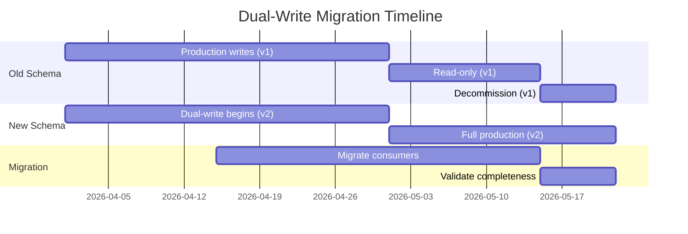

# 🔄 Lakehouse Schema Versioning

<div align="center" markdown>

**Evolve Delta Lake Schemas Safely Across Bronze, Silver, and Gold Layers**


</div>

---

**Last Updated:** `2026-04-27` | **Version:** 1.0.0

---

## 🎯 Overview

Schema evolution is inevitable in any data platform. New business requirements add columns, compliance changes rename fields, and deprecated sources drop columns. Delta Lake on Microsoft Fabric provides built-in schema evolution, but without a disciplined strategy, schema changes cascade into broken notebooks, failed pipelines, and corrupted Power BI reports.

This guide establishes a versioning strategy that maintains backward compatibility, minimizes downstream disruption, and provides a clear migration path for breaking changes.

### Schema Change Risk Matrix

| Change Type | Risk Level | Downstream Impact | Automation |
|-------------|:----------:|-------------------|------------|
| Add nullable column | 🟢 Low | None — new column ignored by old queries | `mergeSchema` |
| Add non-nullable column | 🟡 Medium | Existing rows need defaults | `mergeSchema` + default |
| Widen data type (int → long) | 🟢 Low | Compatible upcast | `mergeSchema` |
| Narrow data type (long → int) | 🔴 High | Potential overflow/truncation | `overwriteSchema` |
| Rename column | 🔴 High | All downstream queries break | Dual-write migration |
| Drop column | 🔴 High | All downstream queries break | Deprecation workflow |
| Change partition columns | 🔴 Critical | Full table rewrite required | New table + migration |
| Reorder columns | 🟢 None | Delta reads by name, not position | No action needed |

---

## 🟢 Non-Breaking Changes

### Adding Nullable Columns

The safest and most common schema change. Existing queries continue working; the new column returns `null` for historical rows.

```python
from pyspark.sql.functions import lit, current_timestamp

# Original schema: machine_id, timestamp, coin_in, coin_out
# Adding: loyalty_tier (nullable)

df_new_batch = spark.read.format("json") \
    .load("Files/landing/slot_telemetry/2026/04/27/")

# New data includes loyalty_tier column
df_new_batch.write.format("delta") \
    .mode("append") \
    .option("mergeSchema", "true") \
    .saveAsTable("bronze.slot_telemetry")

# Historical rows now return NULL for loyalty_tier — no breakage
```

### Adding Columns with Defaults

```python
# For non-nullable new columns, provide a default for existing rows
from delta.tables import DeltaTable

dt = DeltaTable.forName(spark, "silver.player_profile")

# Step 1: Add column via mergeSchema write with default
spark.sql("""
    ALTER TABLE silver.player_profile
    ADD COLUMNS (risk_score DOUBLE DEFAULT 0.0 COMMENT 'AML risk score, added 2026-04-27')
""")

# Step 2: Backfill existing rows
spark.sql("""
    UPDATE silver.player_profile
    SET risk_score = 0.0
    WHERE risk_score IS NULL
""")
```

### Widening Data Types

```python
# Safe: INT → BIGINT, FLOAT → DOUBLE, VARCHAR(50) → VARCHAR(200)
# Delta handles compatible type widening automatically

spark.sql("""
    ALTER TABLE bronze.cage_transactions
    ALTER COLUMN transaction_amount TYPE DOUBLE
""")
# Previously FLOAT — all existing data safely upcast
```

---

## 🔴 Breaking Changes

### Column Rename Strategy

Column renames break every downstream notebook, pipeline, and Power BI report that references the old name. Use the dual-write pattern.

```python
# WRONG: Direct rename breaks downstream
# spark.sql("ALTER TABLE silver.player SET COLUMN player_ssn RENAME TO player_ssn_hash")

# CORRECT: Dual-write migration (see Dual-Write Pattern section below)
```

### Column Drop Strategy

```python
# NEVER drop a column immediately. Follow deprecation workflow:
# Phase 1: Mark deprecated (add metadata)
# Phase 2: Dual-write replacement column
# Phase 3: Migrate downstream consumers
# Phase 4: Drop after confirmation window
```

### Data Type Narrowing

```python
# Narrowing (DOUBLE → INT) requires full rewrite
# Step 1: Validate no data loss
overflow_check = spark.sql("""
    SELECT COUNT(*) as overflow_count
    FROM silver.transactions
    WHERE transaction_amount > 2147483647
       OR transaction_amount != CAST(CAST(transaction_amount AS INT) AS DOUBLE)
""")

if overflow_check.collect()[0]["overflow_count"] > 0:
    raise ValueError("Data loss would occur — cannot narrow type safely")

# Step 2: Rewrite with overwriteSchema
df = spark.table("silver.transactions")
df_narrowed = df.withColumn("transaction_amount", col("transaction_amount").cast("int"))
df_narrowed.write.format("delta") \
    .mode("overwrite") \
    .option("overwriteSchema", "true") \
    .saveAsTable("silver.transactions")
```

---

## 🔧 mergeSchema vs overwriteSchema

| Feature | `mergeSchema` | `overwriteSchema` |
|---------|:------------:|:-----------------:|
| **Purpose** | Add new columns to existing schema | Replace entire schema |
| **Existing data** | Preserved; new cols are NULL for old rows | Data overwritten |
| **Column removal** | Not supported | Columns not in new DF are dropped |
| **Type changes** | Only widening (int→long) | Any type change |
| **Use case** | Incremental evolution | Major restructuring |
| **Risk** | Low | High — data loss if misused |
| **Mode compatibility** | `append` or `overwrite` | `overwrite` only |

### mergeSchema Examples

```python
# Safe: Appending data with additional columns
df_with_new_cols.write.format("delta") \
    .mode("append") \
    .option("mergeSchema", "true") \
    .saveAsTable("bronze.slot_telemetry")

# Also works with MERGE (upsert)
from delta.tables import DeltaTable

dt = DeltaTable.forName(spark, "silver.player_profile")
dt.alias("target").merge(
    df_updates.alias("source"),
    "target.player_id = source.player_id"
).whenMatchedUpdateAll() \
 .whenNotMatchedInsertAll() \
 .execute()
# With spark.conf: spark.databricks.delta.schema.autoMerge.enabled = true
```

### overwriteSchema Examples

```python
# Full schema replacement — USE WITH CAUTION
spark.conf.set("spark.databricks.delta.schema.autoMerge.enabled", "false")

df_restructured.write.format("delta") \
    .mode("overwrite") \
    .option("overwriteSchema", "true") \
    .saveAsTable("silver.player_transactions_v2")

# WARNING: This destroys all existing data and replaces schema entirely
# Always back up first:
spark.sql("CREATE TABLE silver.player_transactions_backup DEEP CLONE silver.player_transactions")
```

---

## 📝 Dual-Write Pattern

The dual-write pattern enables breaking changes without downtime. Both old and new schemas are written simultaneously during a transition window.

### Phase Diagram



### Implementation

```python
# Example: Renaming player_ssn → player_id_hash

# Phase 1: Add new column, keep old (dual-write)
def transform_silver_player(df_bronze):
    return df_bronze \
        .withColumn("player_id_hash", sha2(col("player_ssn"), 256)) \
        .withColumn("player_ssn", col("player_ssn"))  # Keep old column

# Phase 2: Write to both columns
df_silver = transform_silver_player(df_bronze)
df_silver.write.format("delta") \
    .mode("append") \
    .option("mergeSchema", "true") \
    .saveAsTable("silver.player_profile")

# Phase 3: Migrate all downstream to use player_id_hash
# - Update notebooks: col("player_ssn") → col("player_id_hash")
# - Update SQL views: SELECT player_ssn → SELECT player_id_hash
# - Update Power BI: rebind columns

# Phase 4: After migration window (30 days), mark deprecated
spark.sql("""
    ALTER TABLE silver.player_profile
    ALTER COLUMN player_ssn COMMENT 'DEPRECATED 2026-04-27. Use player_id_hash. Drop after 2026-06-01.'
""")

# Phase 5: Drop old column after confirmation
spark.sql("ALTER TABLE silver.player_profile DROP COLUMN player_ssn")
```

---

## 🗂️ Schema Registry

### Manual Schema Registry Table

Track all schema versions and changes in a metadata table:

```python
# Create schema registry
spark.sql("""
CREATE TABLE IF NOT EXISTS gold.schema_registry (
    table_name STRING NOT NULL,
    version INT NOT NULL,
    change_type STRING NOT NULL COMMENT 'ADD_COLUMN, DROP_COLUMN, RENAME, TYPE_CHANGE, PARTITION_CHANGE',
    column_name STRING,
    old_definition STRING,
    new_definition STRING,
    change_reason STRING NOT NULL,
    changed_by STRING NOT NULL,
    changed_date TIMESTAMP NOT NULL,
    migration_status STRING DEFAULT 'pending' COMMENT 'pending, in_progress, completed, rolled_back',
    rollback_sql STRING,
    CONSTRAINT pk_schema_registry PRIMARY KEY (table_name, version)
) COMMENT 'Tracks all schema changes across the lakehouse'
""")
```

### Registering Changes

```python
from pyspark.sql.functions import current_timestamp, lit

schema_change = spark.createDataFrame([{
    "table_name": "silver.player_profile",
    "version": 5,
    "change_type": "ADD_COLUMN",
    "column_name": "risk_score",
    "old_definition": None,
    "new_definition": "DOUBLE DEFAULT 0.0",
    "change_reason": "AML compliance requirement - risk scoring",
    "changed_by": "data_engineering_team",
    "changed_date": current_timestamp(),
    "migration_status": "completed",
    "rollback_sql": "ALTER TABLE silver.player_profile DROP COLUMN risk_score"
}])

schema_change.write.format("delta").mode("append").saveAsTable("gold.schema_registry")
```

### Querying Schema History

```sql
-- View all changes for a table
SELECT version, change_type, column_name, new_definition, change_reason, changed_date
FROM gold.schema_registry
WHERE table_name = 'silver.player_profile'
ORDER BY version DESC;

-- Find pending migrations
SELECT table_name, column_name, change_type, change_reason
FROM gold.schema_registry
WHERE migration_status = 'pending'
ORDER BY changed_date;
```

---

## ⚠️ Deprecation Workflow

### Step-by-Step Process

```
┌─────────────┐    ┌──────────────┐    ┌───────────────┐    ┌──────────────┐
│ 1. Announce  │───▶│ 2. Dual-Write│───▶│ 3. Migrate    │───▶│ 4. Drop      │
│  (Day 0)     │    │  (Day 1-30)  │    │  (Day 15-45)  │    │  (Day 60+)   │
└─────────────┘    └──────────────┘    └───────────────┘    └──────────────┘
  - Add COMMENT     - Both old & new    - Update queries    - Verify no usage
  - Log to registry   columns written   - Update BI models  - Archive backup
  - Notify team      - Backfill history  - Validate results  - Drop column
```

### Automated Deprecation Check

```python
def check_deprecated_columns(table_name: str) -> list:
    """Scan table comments for DEPRECATED markers."""
    columns = spark.sql(f"DESCRIBE {table_name}").collect()
    deprecated = []
    for row in columns:
        if row.comment and "DEPRECATED" in str(row.comment).upper():
            deprecated.append({
                "column": row.col_name,
                "comment": row.comment,
                "table": table_name
            })
    return deprecated

# Run across all silver tables
silver_tables = spark.sql("SHOW TABLES IN silver").collect()
all_deprecated = []
for t in silver_tables:
    all_deprecated.extend(check_deprecated_columns(f"silver.{t.tableName}"))

if all_deprecated:
    print(f"⚠️ Found {len(all_deprecated)} deprecated columns:")
    for d in all_deprecated:
        print(f"  - {d['table']}.{d['column']}: {d['comment']}")
```

---

## 🧪 Testing Schema Changes

### Pre-Change Validation

```python
def validate_schema_change(table_name: str, change_sql: str) -> dict:
    """Test schema change in a cloned table before applying to production."""

    test_table = f"{table_name}__schema_test"

    # 1. Create shallow clone for testing
    spark.sql(f"CREATE TABLE {test_table} SHALLOW CLONE {table_name}")

    try:
        # 2. Apply change to test table
        test_sql = change_sql.replace(table_name, test_table)
        spark.sql(test_sql)

        # 3. Validate downstream queries still work
        results = {}

        # Check row count preserved
        orig_count = spark.table(table_name).count()
        test_count = spark.table(test_table).count()
        results["row_count_match"] = orig_count == test_count

        # Check no data loss in existing columns
        orig_cols = set(spark.table(table_name).columns)
        test_cols = set(spark.table(test_table).columns)
        results["columns_preserved"] = orig_cols.issubset(test_cols)

        # Check queryability
        try:
            spark.sql(f"SELECT * FROM {test_table} LIMIT 10").collect()
            results["queryable"] = True
        except Exception as e:
            results["queryable"] = False
            results["query_error"] = str(e)

        return results

    finally:
        # 4. Clean up test table
        spark.sql(f"DROP TABLE IF EXISTS {test_table}")

# Usage
result = validate_schema_change(
    "silver.player_profile",
    "ALTER TABLE silver.player_profile ADD COLUMNS (risk_score DOUBLE)"
)
print(f"Schema change safe: {all(v for k, v in result.items() if k != 'query_error')}")
```

### Schema Compatibility Check

```python
def check_backward_compatibility(old_schema, new_schema) -> list:
    """Check if new schema is backward compatible with old schema."""
    issues = []
    old_fields = {f.name: f for f in old_schema.fields}
    new_fields = {f.name: f for f in new_schema.fields}

    # Check for dropped columns
    for name in old_fields:
        if name not in new_fields:
            issues.append(f"BREAKING: Column '{name}' was removed")

    # Check for type changes
    for name, old_field in old_fields.items():
        if name in new_fields:
            new_field = new_fields[name]
            if old_field.dataType != new_field.dataType:
                issues.append(
                    f"TYPE_CHANGE: '{name}' changed from {old_field.dataType} to {new_field.dataType}"
                )
            if old_field.nullable and not new_field.nullable:
                issues.append(
                    f"BREAKING: '{name}' changed from nullable to non-nullable"
                )

    return issues

# Usage
old = spark.table("silver.player_profile").schema
new = updated_df.schema
issues = check_backward_compatibility(old, new)
if issues:
    print("⚠️ Compatibility issues found:")
    for issue in issues:
        print(f"  - {issue}")
```

---

## 🎰 Casino Industry Examples

### Adding Compliance Columns

```python
# New FinCEN requirement: track beneficial ownership
spark.sql("""
    ALTER TABLE silver.player_profile
    ADD COLUMNS (
        beneficial_owner_verified BOOLEAN DEFAULT false
            COMMENT 'CDD beneficial ownership verification status, added 2026-04-27',
        beneficial_owner_date TIMESTAMP
            COMMENT 'Date of beneficial ownership verification'
    )
""")

# Register in schema registry
# Backfill existing players as unverified (default handles this)
```

### W-2G Threshold Change

```python
# If IRS changes W-2G threshold from $1,200 to $1,500
# Schema stays same, but Gold aggregation logic changes
# Track the business rule change in schema registry

spark.sql("""
    INSERT INTO gold.schema_registry VALUES (
        'gold.w2g_reporting', 8, 'BUSINESS_RULE',
        'win_threshold', '1200.00', '1500.00',
        'IRS threshold change effective 2027-01-01',
        'compliance_team', current_timestamp(), 'pending',
        'UPDATE gold.w2g_reporting_config SET threshold = 1200.00'
    )
""")
```

---

## 🏛️ Federal Agency Examples

### USDA Schema Evolution

```python
# USDA adds new crop category field
spark.sql("""
    ALTER TABLE bronze.usda_crop_production
    ADD COLUMNS (
        organic_certification STRING
            COMMENT 'USDA organic certification status. Added 2026-04 per USDA data update.'
    )
""")

# Silver transformation handles NULL gracefully
df_silver = spark.table("bronze.usda_crop_production") \
    .withColumn("organic_certification",
        coalesce(col("organic_certification"), lit("NOT_REPORTED")))
```

---

## 🚫 Anti-Patterns

### Anti-Pattern 1: Schema Evolution Without Tracking

```python
# ❌ WRONG: Just adding columns without documentation
spark.sql("ALTER TABLE silver.transactions ADD COLUMNS (new_col STRING)")

# ✅ CORRECT: Register, document, test, then apply
# 1. Register in schema_registry
# 2. Test on clone
# 3. Apply to production
# 4. Update downstream documentation
```

### Anti-Pattern 2: Using overwriteSchema for Additive Changes

```python
# ❌ WRONG: Nuclear option for a simple column add
df.write.format("delta") \
    .mode("overwrite") \
    .option("overwriteSchema", "true") \
    .saveAsTable("silver.transactions")  # Destroys history!

# ✅ CORRECT: Use mergeSchema for additive changes
df.write.format("delta") \
    .mode("append") \
    .option("mergeSchema", "true") \
    .saveAsTable("silver.transactions")
```

### Anti-Pattern 3: Renaming Columns In-Place

```python
# ❌ WRONG: Direct rename with no migration window
spark.sql("ALTER TABLE silver.player RENAME COLUMN ssn TO ssn_hash")
# Every notebook, pipeline, and report referencing 'ssn' now fails

# ✅ CORRECT: Dual-write pattern with 30-day migration window
```

### Anti-Pattern 4: Dropping Columns Without Deprecation

```python
# ❌ WRONG: Immediate drop
spark.sql("ALTER TABLE silver.player DROP COLUMN legacy_field")

# ✅ CORRECT: Deprecation workflow
# Day 0: Add DEPRECATED comment
# Day 30: Verify no active consumers
# Day 60: Drop with backup
```

---

## 📚 References

- [Delta Lake Schema Evolution](https://docs.delta.io/latest/delta-update.html#schema-evolution)
- [ALTER TABLE in Fabric](https://learn.microsoft.com/en-us/fabric/data-engineering/delta-lake-table-optimization)
- [Delta Lake Schema Enforcement](https://docs.delta.io/latest/delta-update.html#schema-enforcement)
- [Fabric Lakehouse Schemas](https://learn.microsoft.com/en-us/fabric/data-engineering/lakehouse-schemas)

---

> **Next:** [Spark Runtime Breaking Changes Matrix](spark-runtime-breaking-changes-matrix.md) | [Medallion Architecture Deep Dive](medallion-architecture-deep-dive.md)
