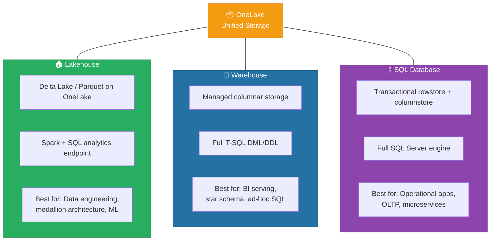
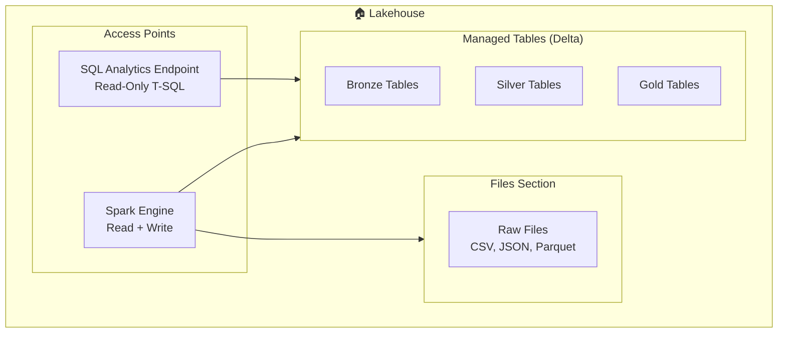
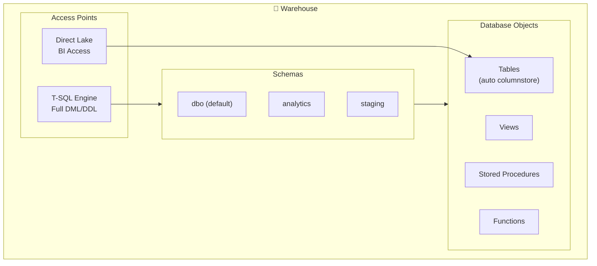
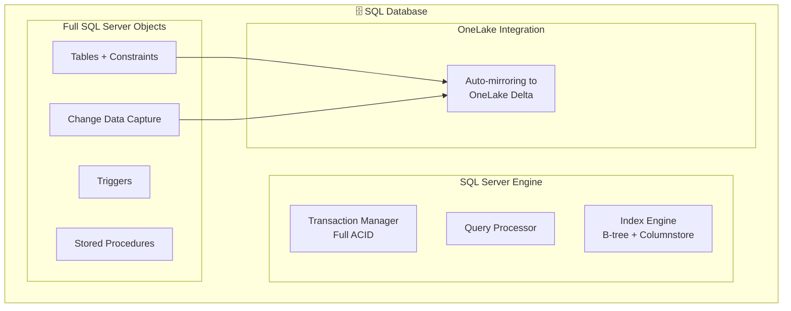
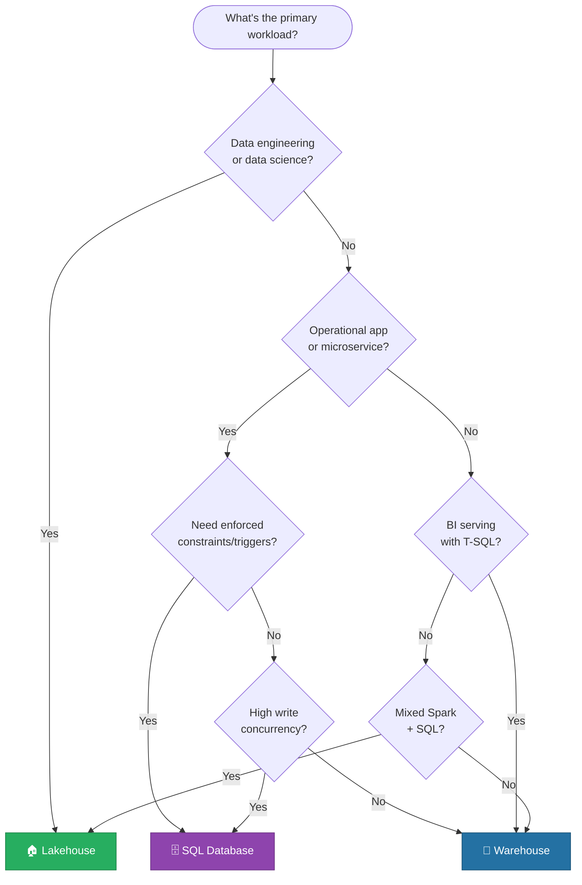
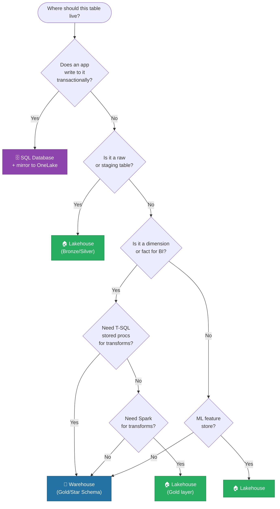
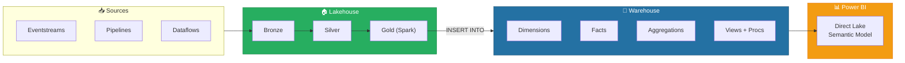
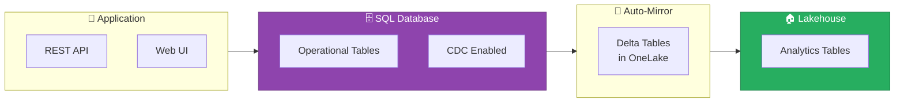
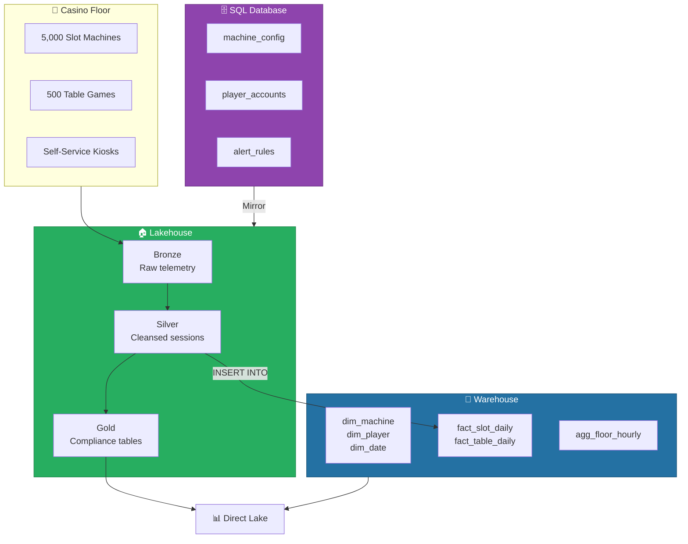
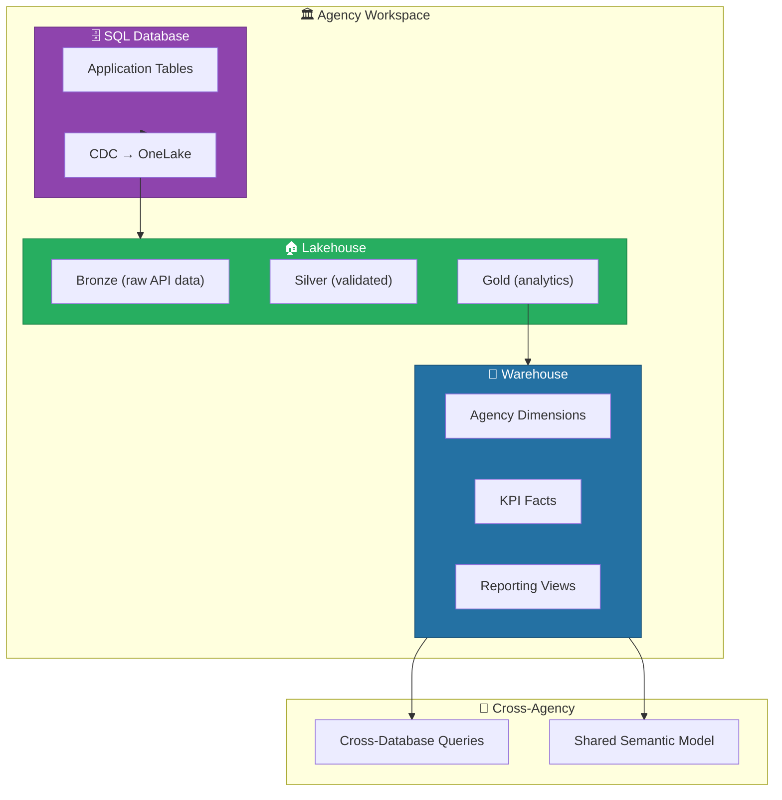

[Home](../index.md) > [Docs](../) > [Best Practices](./) > Lakehouse vs Warehouse vs SQL Database Decision Guide

# 🏗️ Lakehouse vs Warehouse vs SQL Database — Decision Guide

**Choose the Right Fabric Analytics Store for Every Workload**

---

**Last Updated:** `2026-04-21` | **Version:** 1.0.0

---

## 📑 Table of Contents

- [🎯 Overview](#-overview)
- [📊 Feature Comparison Matrix](#-feature-comparison-matrix)
- [🔍 Deep Dive: Each Store](#-deep-dive-each-store)
- [🌳 Decision Trees](#-decision-trees)
- [⚡ Performance Characteristics](#-performance-characteristics)
- [🔐 Security Model Comparison](#-security-model-comparison)
- [🔄 Hybrid Patterns](#-hybrid-patterns)
- [🎰 Casino Implementation](#-casino-implementation)
- [🏛️ Federal Agency Implementation](#️-federal-agency-implementation)
- [🔀 Migration Paths](#-migration-paths)
- [⚠️ Limitations](#️-limitations)
- [📚 References](#-references)
- [🔗 Related Documents](#-related-documents)

---

## 🎯 Overview

Microsoft Fabric offers three distinct data stores — **Lakehouse**, **Warehouse**, and **SQL Database** — each optimized for different workload patterns. Choosing the wrong store leads to performance issues, governance gaps, or unnecessary complexity. This guide provides a structured decision framework.

### The Three Stores at a Glance

---

## 📊 Feature Comparison Matrix

### Core Capabilities

| Feature | Lakehouse | Warehouse | SQL Database |
|---------|:---------:|:---------:|:------------:|
| **Storage Format** | Delta Lake (Parquet) | Managed columnstore | Rowstore + optional columnstore |
| **Write Support** | Spark, Pipelines, Dataflows | T-SQL INSERT/UPDATE/DELETE | Full T-SQL DML |
| **Read Interface** | Spark + SQL analytics endpoint | T-SQL | T-SQL |
| **Schema Enforcement** | Schema-on-read + optional enforcement | Schema-on-write | Schema-on-write |
| **Transactions (ACID)** | Delta ACID (per table) | T-SQL transactions (multi-table) | Full SQL Server transactions |
| **Concurrency** | High read, moderate write | High read, moderate write | High read + write |
| **Direct Lake Support** | ✅ Native | ✅ Native | ❌ Import/DQ only |
| **Stored Procedures** | ❌ | ✅ | ✅ |
| **Triggers** | ❌ | ❌ | ✅ |
| **Foreign Keys** | ❌ | ✅ (informational) | ✅ (enforced) |
| **Indexes** | ❌ (file-level pruning) | Auto columnstore | Full index support |
| **Change Data Capture** | Delta Change Data Feed | ❌ | ✅ Native CDC |
| **Mirroring Target** | ✅ | ❌ | ✅ |
| **Cross-DB Queries** | ✅ (read-only) | ✅ (read/write) | ✅ (read/write) |

### Query Language Surface

| T-SQL Feature | Lakehouse SQL Endpoint | Warehouse | SQL Database |
|--------------|:---------------------:|:---------:|:------------:|
| SELECT | ✅ | ✅ | ✅ |
| INSERT/UPDATE/DELETE | ❌ | ✅ | ✅ |
| CREATE TABLE | ❌ | ✅ | ✅ |
| CREATE VIEW | ❌ | ✅ | ✅ |
| CREATE PROCEDURE | ❌ | ✅ | ✅ |
| CREATE FUNCTION | ❌ | ✅ | ✅ |
| Temp Tables | ✅ (limited) | ✅ | ✅ |
| CTEs | ✅ | ✅ | ✅ |
| Window Functions | ✅ | ✅ | ✅ |
| JSON Functions | ✅ | ✅ | ✅ |
| MERGE | ❌ | ✅ | ✅ |
| Constraints | ❌ | Informational only | ✅ Enforced |

### Data Engineering Features

| Feature | Lakehouse | Warehouse | SQL Database |
|---------|:---------:|:---------:|:------------:|
| Spark Access | ✅ Native | ❌ | ❌ |
| Python/PySpark | ✅ | ❌ | ❌ |
| Delta Time Travel | ✅ | ❌ | ❌ |
| OPTIMIZE/VACUUM | ✅ | Auto-managed | Auto-managed |
| V-Order | ✅ | N/A | N/A |
| Shortcut Support | ✅ | ❌ | ❌ |
| Schema Evolution | ✅ (merge schema) | ALTER TABLE | ALTER TABLE |
| File Format Access | ✅ (CSV, JSON, Parquet) | ❌ | ❌ |

---

## 🔍 Deep Dive: Each Store

### 🏠 Lakehouse

**When to use:** Data engineering, medallion architecture, ML/AI workloads, multi-format ingestion, data science exploration.

**Architecture:**

**Key characteristics:**
- Open Delta Lake format — no vendor lock-in
- Dual access: Spark (read/write) + SQL (read-only)
- Shortcuts bring external data without copying
- V-Order optimizes for both Spark and Direct Lake
- File section supports arbitrary formats

### 🏢 Warehouse

**When to use:** BI serving layer, star/snowflake schema, ad-hoc SQL analytics, stored procedures, T-SQL-heavy workloads.

**Architecture:**

**Key characteristics:**
- Familiar SQL Server experience (T-SQL, schemas, procedures)
- Auto-managed columnstore — no index tuning needed
- Full DML support (INSERT, UPDATE, DELETE, MERGE)
- Custom schemas for logical organization
- Workload isolation from Spark jobs

### 🗄️ SQL Database

**When to use:** Operational/transactional workloads, microservice backends, OLTP, applications requiring enforced constraints, CDC to Fabric.

**Architecture:**

**Key characteristics:**
- Full SQL Server engine with enforced referential integrity
- Triggers, constraints, foreign keys — all enforced
- Native CDC for streaming changes to analytics
- Auto-mirrors to OneLake for Lakehouse/Warehouse consumption
- Best for sub-second transactional workloads

---

## 🌳 Decision Trees

### Primary Decision Tree

### "Which Store for This Table?" Decision Tree

---

## ⚡ Performance Characteristics

### Workload Profile Comparison

| Workload | Lakehouse | Warehouse | SQL Database |
|----------|-----------|-----------|-------------|
| **Batch ETL (TB-scale)** | ⭐⭐⭐⭐⭐ | ⭐⭐⭐ | ⭐⭐ |
| **Ad-hoc SQL queries** | ⭐⭐⭐ | ⭐⭐⭐⭐⭐ | ⭐⭐⭐⭐ |
| **Point lookups (by PK)** | ⭐⭐ | ⭐⭐⭐ | ⭐⭐⭐⭐⭐ |
| **BI dashboard queries** | ⭐⭐⭐⭐ (Direct Lake) | ⭐⭐⭐⭐⭐ (Direct Lake) | ⭐⭐⭐ (Import only) |
| **High concurrency writes** | ⭐⭐ | ⭐⭐⭐ | ⭐⭐⭐⭐⭐ |
| **Streaming ingestion** | ⭐⭐⭐⭐ | ⭐⭐ | ⭐⭐⭐ |
| **ML model training** | ⭐⭐⭐⭐⭐ | ⭐ | ⭐ |
| **Complex joins (star schema)** | ⭐⭐⭐ | ⭐⭐⭐⭐⭐ | ⭐⭐⭐⭐ |
| **Full-text search** | ⭐⭐ | ⭐⭐ | ⭐⭐⭐⭐⭐ |

### Concurrency Benchmarks (F64 SKU)

| Metric | Lakehouse SQL Endpoint | Warehouse | SQL Database |
|--------|----------------------|-----------|-------------|
| Max concurrent queries | ~20 | ~30 | ~100 |
| Max concurrent writers | N/A (Spark only) | ~10 | ~50 |
| Query timeout (default) | 5 min | 30 min | Configurable |
| Max result set | 80 GB | 80 GB | Configurable |

---

## 🔐 Security Model Comparison

| Security Feature | Lakehouse | Warehouse | SQL Database |
|-----------------|:---------:|:---------:|:------------:|
| Workspace roles | ✅ | ✅ | ✅ |
| Object-level permissions | ✅ (SQL endpoint) | ✅ (GRANT/DENY) | ✅ (GRANT/DENY) |
| Row-Level Security (RLS) | ✅ | ✅ | ✅ |
| Column-Level Security (CLS) | ✅ | ✅ | ✅ |
| Dynamic Data Masking | ❌ | ✅ | ✅ |
| OneLake security (file-level) | ✅ | N/A | N/A |
| Sensitivity labels | ✅ | ✅ | ✅ |
| Managed Identity access | ✅ | ✅ | ✅ |
| Entra-only auth | ✅ | ✅ | ✅ |

---

## 🔄 Hybrid Patterns

### Pattern 1: Lakehouse for Engineering + Warehouse for BI

The most common pattern. Use the Lakehouse for medallion processing and the Warehouse as a curated BI serving layer.

### Pattern 2: SQL Database for Ops + Lakehouse for Analytics

Operational applications write to SQL Database; data mirrors to OneLake for analytics processing.

### Pattern 3: All Three Together

Enterprise deployments often use all three stores, each for its optimal workload.

| Layer | Store | Tables | Rationale |
|-------|-------|--------|-----------|
| Ingestion | Lakehouse (Bronze) | Raw events, files, API responses | Spark ingestion, schema-on-read |
| Processing | Lakehouse (Silver) | Cleansed, validated tables | PySpark transforms, Delta merge |
| BI Serving | Warehouse (Gold) | Star schema, aggregations | T-SQL procs, Direct Lake |
| Operational | SQL Database | Config, user state, app data | OLTP, enforced FK, triggers |

---

## 🎰 Casino Implementation

### Recommended Store Allocation

| Data Domain | Store | Rationale |
|-------------|-------|-----------|
| Slot telemetry (raw) | 🏠 Lakehouse Bronze | High-volume streaming, Spark processing |
| Table game hands (raw) | 🏠 Lakehouse Bronze | Semi-structured JSON, schema evolution |
| Player sessions (cleansed) | 🏠 Lakehouse Silver | PySpark dedup, validation |
| Compliance filings (CTR/SAR/W-2G) | 🏠 Lakehouse Gold | Delta time travel for audit trail |
| Machine dimensions | 🏢 Warehouse | Star schema, joined in BI queries |
| Player dimensions | 🏢 Warehouse | RLS by player tier, Direct Lake |
| Revenue fact (daily) | 🏢 Warehouse | Aggregation table, T-SQL procs |
| Machine configuration | 🗄️ SQL Database | Operational app writes config changes |
| Player account state | 🗄️ SQL Database | Real-time balance, loyalty points |
| Alert rules | 🗄️ SQL Database | Application CRUD, triggers for notifications |

### Casino Architecture Summary

---

## 🏛️ Federal Agency Implementation

### Per-Agency Recommendations

| Agency | Primary Store | Secondary Store | Rationale |
|--------|--------------|-----------------|-----------|
| **USDA** | 🏠 Lakehouse | 🏢 Warehouse (BI) | Large batch datasets (crop production, SNAP); Spark processing |
| **SBA** | 🏢 Warehouse | 🗄️ SQL Database | Loan analytics with T-SQL; operational loan tracking app |
| **NOAA** | 🏠 Lakehouse | 🏢 Warehouse (BI) | Streaming weather data; time-series in Lakehouse, summaries in WH |
| **EPA** | 🏠 Lakehouse | 🏢 Warehouse (BI) | Sensor data ingestion via Spark; regulatory reporting via WH |
| **DOI** | 🏠 Lakehouse | 🗄️ SQL Database | Geospatial data processing; permit management app in SQL DB |

### Federal Hybrid Architecture

### Federal Compliance Alignment

| Requirement | Lakehouse | Warehouse | SQL Database |
|------------|-----------|-----------|-------------|
| **Data retention (7+ years)** | ✅ Delta time travel + archival | ✅ Table lifecycle policies | ✅ Backup + retention policies |
| **Audit trail** | ✅ Delta history + unified audit log | ✅ Unified audit log | ✅ SQL audit + unified audit log |
| **PII protection** | ✅ OneLake security + CLS | ✅ CLS + Dynamic Data Masking | ✅ DDM + CLS + encryption |
| **FedRAMP boundary** | ✅ US Gov region | ✅ US Gov region | ✅ US Gov region |
| **FISMA logging** | ✅ Activity logs | ✅ Activity logs | ✅ SQL audit logs |

---

## 🔀 Migration Paths

### Between Fabric Stores

| From | To | Method | Complexity |
|------|----|--------|:----------:|
| Lakehouse → Warehouse | Cross-DB `INSERT INTO ... SELECT` | ⭐ Low |
| Warehouse → Lakehouse | Spark `spark.sql("SELECT ... FROM wh.dbo.table")` | ⭐ Low |
| SQL Database → Lakehouse | Auto-mirror (continuous) or Pipeline (batch) | ⭐ Low |
| SQL Database → Warehouse | Cross-DB `INSERT INTO ... SELECT` | ⭐ Low |
| Lakehouse → SQL Database | Pipeline or custom app INSERT | ⭐⭐ Medium |
| Warehouse → SQL Database | Pipeline or custom app INSERT | ⭐⭐ Medium |

### From External Systems

| Source | Recommended Target | Method |
|--------|-------------------|--------|
| Azure SQL Database | SQL Database (mirror) or Lakehouse (shortcut) | Mirroring or Shortcut |
| Azure Synapse (dedicated pool) | Warehouse | Pipeline migration |
| Azure Data Lake Gen2 | Lakehouse | Shortcut (zero-copy) |
| Databricks Delta Lake | Lakehouse | Shortcut or Pipeline |
| On-premises SQL Server | SQL Database or Warehouse | Pipeline + Gateway |
| Snowflake | Warehouse or Lakehouse | Pipeline |

---

## ⚠️ Limitations

| Limitation | Lakehouse | Warehouse | SQL Database |
|-----------|-----------|-----------|-------------|
| **No T-SQL writes** | ✅ (SQL endpoint is read-only) | N/A | N/A |
| **No Spark access** | N/A | ✅ (T-SQL only) | ✅ (T-SQL only) |
| **No enforced FKs** | ✅ | ✅ (informational only) | N/A |
| **No triggers** | ✅ | ✅ | N/A |
| **No Direct Lake** | N/A | N/A | ✅ (Import/DQ only) |
| **Limited concurrency** | Write concurrency limited | Write concurrency limited | N/A |
| **No Delta time travel** | N/A | ✅ | ✅ |
| **Storage cost** | OneLake pricing | OneLake pricing | OneLake pricing |
| **Preview features** | Some features in preview | Stable | GA (since Nov 2024) |
| **Gov Cloud** | ✅ Available | ✅ Available | Limited availability |

---

## 📚 References

| Resource | URL |
|----------|-----|
| Lakehouse Overview | https://learn.microsoft.com/fabric/data-engineering/lakehouse-overview |
| Warehouse Overview | https://learn.microsoft.com/fabric/data-warehouse/data-warehousing |
| SQL Database in Fabric | https://learn.microsoft.com/fabric/database/sql/overview |
| Direct Lake Overview | https://learn.microsoft.com/fabric/get-started/direct-lake-overview |
| Cross-Database Queries | https://learn.microsoft.com/fabric/data-warehouse/cross-database-query |
| OneLake Shortcuts | https://learn.microsoft.com/fabric/onelake/onelake-shortcuts |
| Mirroring Overview | https://learn.microsoft.com/fabric/database/mirrored-database/overview |
| Fabric Decision Guide | https://learn.microsoft.com/fabric/get-started/decision-guide |

---

## 🔗 Related Documents

- [Cross-Database Queries](../features/cross-database-queries.md) -- Query across all three stores
- [Direct Lake](../features/direct-lake.md) -- BI connectivity for Lakehouse and Warehouse
- [Fabric SQL Database](../features/fabric-sql-database.md) -- SQL Database deep dive
- [Mirroring](../features/mirroring.md) -- Replicate external databases into Fabric
- [Medallion Architecture Deep Dive](./medallion-architecture-deep-dive.md) -- Lakehouse layering patterns
- [Migration Patterns](./migration-patterns.md) -- Migrating from external platforms

---

[Back to Best Practices Index](./README.md) | [Back to Documentation](../index.md)

---

> 📝 **Document Metadata**
> - **Author**: Documentation Team
> - **Reviewers**: Data Engineering, Data Warehouse, Architecture, Security
> - **Classification**: Internal
> - **Next Review**: 2026-07-21
