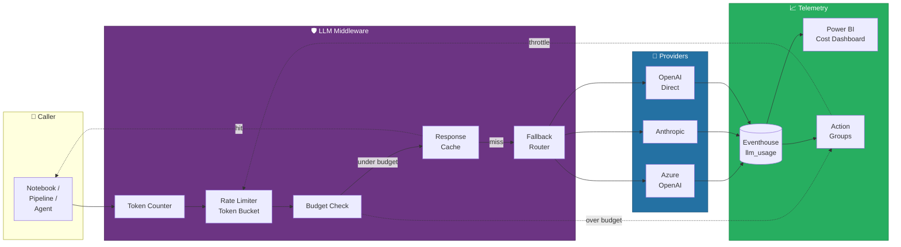

# 💸 LLM Cost Tracking & FinOps for AI Workloads

<div align="center" markdown>

**Token Economics, Budgeting, Rate Limiting, and Fallback Strategies for Fabric AI Workloads**


</div>

---

**Last Updated:** `2026-04-27` | **Version:** 1.0.0 | **Anchor:** [MLOps for Fabric Production](mlops-fabric-production.md) (Wave 2)

---

## 🎯 Why LLM Cost Tracking

Fabric's AI surface area exploded in 2025-2026: Copilot in every workload, Data Agents on every domain, AI Functions on every Spark cluster, Eventhouse vector search, and an open door to Azure OpenAI / Anthropic / OpenAI from any notebook. Each of these consumes tokens. Tokens cost real money — and unlike CU consumption, they don't show up cleanly on a single Fabric capacity meter.

This document is the FinOps backbone for AI workloads. It covers how to instrument every LLM call, attribute spend to the team or feature that triggered it, set budgets that *actually block* runaway spend, and design fallback chains that degrade quality before they degrade your P&L.

### What "Production-Grade LLM Cost Control" Looks Like

| Aspect | No Discipline | Production-Grade |
|--------|--------------|------------------|
| **Visibility** | "Azure OpenAI bill went up — investigating" | Per-user, per-workload, per-model token spend in real time |
| **Attribution** | Single shared API key, no tags | Every call tagged: cost_center, business_unit, project, workload, env |
| **Budgets** | Annual budget, reviewed quarterly | Daily/weekly/monthly budgets per workload with hard cutoffs |
| **Rate limiting** | Provider-side 429s only | Token-bucket per user + adaptive throttling near budget |
| **Caching** | None | Prompt cache + response cache + embedding cache; hit-rate tracked |
| **Fallback** | Hard fail if Opus is rate-limited | Graceful degrade: Opus → Sonnet → Haiku → cached response |
| **Optimization** | One model for everything | Triage with small model; escalate only on uncertainty |
| **Audit** | "Look at the bill in 30 days" | Per-call log to Eventhouse, queryable, alertable, joinable to business KPIs |

### Observed Waste Patterns

These show up in nearly every LLM rollout that skips this discipline:

1. **Demo loops left running** — a notebook that re-asks the same prompt every minute for "live demo" purposes, forgotten on a Friday, $4K by Monday.
2. **No prompt caching** — Anthropic and Azure OpenAI both support caching the static system prompt; teams paying full input rate for the same 8K-token preamble on every call.
3. **Wrong-model-for-task** — using GPT-4o or Claude Opus to extract a date from a sentence (a job for `gpt-4o-mini` or Haiku at ~1/15 the cost).
4. **AI Function row explosion** — applying a per-row LLM call across a 50M-row Bronze table without sampling or filtering first.
5. **Embedding regeneration** — re-embedding the same documents nightly because nobody hashed the source text and stored a vector cache.
6. **Reasoning leak in agents** — Data Agent or custom agent that loops on tool calls, racking up 40+ reasoning turns before erroring out. No max-step guard.
7. **Verbose system prompts** — 12K-token system prompt for a chat that gets 200-token user inputs. Input-heavy ratio that won't show in a dashboard you don't have.
8. **No fallback path** — provider rate-limits → app crashes → engineers re-try the entire batch → costs double.

> 📝 **Scope:** This is the LLM-cost sub-doc of the Wave 2 anchor [mlops-fabric-production.md](mlops-fabric-production.md). For broader Fabric capacity FinOps see [finops-cost-governance.md](finops-cost-governance.md) and [capacity-planning-cost-optimization.md](capacity-planning-cost-optimization.md).

---

## 🧾 LLM Cost Surfaces in Fabric

Every dollar of LLM spend in Fabric flows through one of these surfaces. Track each separately.

| # | Surface | Driver | Billing Model | Visibility | Mitigation |
|---|---------|--------|---------------|-----------|------------|
| 1 | **Fabric Copilot** (chat in workspace, notebook code-gen, DAX Copilot) | Tokens consumed, billed against Copilot capacity | Capacity Units (CU) on F-SKU | Capacity Metrics App, Workspace Monitoring | Designate Copilot capacity; throttle by user/workload tenant settings |
| 2 | **Data Agents** (Q&A reasoning, NL2SQL/DAX/KQL) | Tokens per turn × turns per session | CU on F-SKU + provider-side reasoning tokens | Workspace Monitoring + Data Agent audit logs | Cap turns; trim few-shot examples; restrict source count |
| 3 | **AI Functions** (`ai.classify`, `ai.extract`, `ai.translate`, `ai.summarize`) | Per-row API call × row count | CU + per-row | Spark UI, Workspace Monitoring | Pre-filter, sample, or batch; cache by content hash |
| 4 | **Custom LLM calls from notebooks** (Azure OpenAI, OpenAI direct, Anthropic, Mistral via AI Foundry) | Tokens × model tier | Provider direct billing (Azure subscription or external) | **Only what you instrument** | This doc — wrap every call |
| 5 | **Embeddings generation** (vector DB, RAG indexing) | Tokens × embedding model | Provider per-1M-tokens | Provider portal | Hash content; reuse vectors; batch API |
| 6 | **Fine-tuning** | Training tokens + hosted deployment hours | Provider per-1K-tokens + per-hour | Provider portal | Rare; require approval; prefer prompt engineering + RAG first |
| 7 | **Vector store** (Eventhouse vector index, Azure AI Search, Cosmos for NoSQL) | Storage + per-query | Storage GB-month + per-query unit | Service-specific | Right-size index; partition by tenant; cold tier old vectors |

> 💡 **Attribution gap:** Surfaces 1–3 are billed via Fabric capacity, so they show up in CU metrics but get aggregated. Surfaces 4–7 are billed via your Azure subscription or an external provider and **do not appear** in Fabric metrics at all. The only reliable single-pane-of-glass is the `llm_usage` Eventhouse table this doc defines.

---

## 🧮 Token Economics 101

### Input vs. Output

LLM pricing is asymmetric: output tokens cost 3-5× input tokens on most providers. A chat that returns a 4-line answer to a 200-line context is almost entirely input cost. A code-gen call that emits a 2K-line file is mostly output cost. **Track both separately** — averaging hides where the money actually goes.

### Cached Input Tokens

Both Anthropic and Azure OpenAI support **prompt caching** — the static prefix (system prompt, few-shot examples, retrieved docs) is cached server-side and billed at a fraction of input rate (typically 10% on Anthropic, 50% on Azure OpenAI). Cache TTL is usually 5 min (Anthropic) or session-scoped (Azure OpenAI). Restructure prompts to put **static content first, dynamic content last** to maximize cache hits.

### Reasoning Tokens

Reasoning models (`o1`, `o3`, Claude with extended thinking) emit hidden "thinking" tokens that you pay for but don't see. These can dwarf visible output. Always log `reasoning_tokens` separately from `completion_tokens`.

### Model-Tier Pricing Curve

Within a provider family, pricing typically follows a 1×, 5×, 25× curve from small → medium → flagship. This is the foundation of the [fallback strategy](#-fallback-model-strategy): pick the right rung for the task.

| Tier | Use For | Typical Cost Multiplier |
|------|---------|-------------------------|
| Small (Haiku, gpt-4o-mini, gpt-3.5-turbo) | Triage, classification, extraction, routing | 1× |
| Medium (Sonnet, gpt-4o) | Most chat, Q&A, summarization | 5× |
| Flagship (Opus, o1/o3, gpt-4 turbo) | Complex reasoning, multi-step planning, code-gen | 15-30× |

---

## 💵 Pricing Snapshot

> ⚠️ **Pricing changes frequently.** All numbers below are USD per 1M tokens, captured **2026-04-27**. **Refresh quarterly** by re-pulling from the provider URLs in [References](#-references). Do not embed these in code; pull live from a config table (`config_llm_pricing`) that your finance team owns.

### Azure OpenAI (East US, Pay-As-You-Go)

| Model | Input ($/1M) | Cached Input ($/1M) | Output ($/1M) | Notes |
|-------|-------------:|--------------------:|--------------:|-------|
| gpt-4o (2024-11-20) | $2.50 | $1.25 | $10.00 | Flagship multimodal |
| gpt-4o-mini | $0.15 | $0.075 | $0.60 | Default for triage |
| gpt-4-turbo | $10.00 | n/a | $30.00 | Legacy — migrate to gpt-4o |
| gpt-3.5-turbo | $0.50 | n/a | $1.50 | Legacy — migrate to gpt-4o-mini |
| o1 | $15.00 | $7.50 | $60.00 | Reasoning; outputs include reasoning tokens |
| o3-mini | $1.10 | $0.55 | $4.40 | Reasoning, lower tier |

Source: <https://azure.microsoft.com/en-us/pricing/details/cognitive-services/openai-service/> (captured 2026-04-27)

### Anthropic Claude (Direct API or via Azure AI Foundry)

| Model | Input ($/1M) | Cached Read ($/1M) | Cache Write ($/1M) | Output ($/1M) | Notes |
|-------|-------------:|-------------------:|-------------------:|--------------:|-------|
| Claude Opus 4.x | $15.00 | $1.50 | $18.75 | $75.00 | Flagship |
| Claude Sonnet 4.x | $3.00 | $0.30 | $3.75 | $15.00 | Default chat / agents |
| Claude Haiku 4.x | $0.80 | $0.08 | $1.00 | $4.00 | Triage / extraction |

Source: <https://www.anthropic.com/pricing> (captured 2026-04-27)

### Embedding Models

| Model | Provider | $/1M input tokens | Dimensions |
|-------|----------|------------------:|-----------:|
| text-embedding-3-small | Azure OpenAI | $0.020 | 1536 |
| text-embedding-3-large | Azure OpenAI | $0.130 | 3072 |
| text-embedding-ada-002 | Azure OpenAI | $0.100 | 1536 |
| voyage-3 | Voyage AI (Anthropic-recommended) | $0.060 | 1024 |

Source: <https://openai.com/api/pricing/> + <https://docs.voyageai.com/docs/pricing> (captured 2026-04-27)

> 💡 **Pricing change protocol:** Add a quarterly task to your team's planning rhythm. Update `config_llm_pricing` table; do **not** edit this doc's numbers without also updating the capture date.

---

## 🏗️ Reference Architecture



### Component Map

| Component | Implementation | Purpose |
|-----------|---------------|---------|
| Token Counter | `tiktoken` for OpenAI, `anthropic.count_tokens` for Claude | Count tokens *before* the call for budget pre-check |
| Rate Limiter | Redis token bucket or in-memory per worker | Throttle per user/tenant |
| Budget Check | KQL on `llm_usage` rolling window | Block when day/week/month cap reached |
| Response Cache | Redis or Cosmos for NoSQL keyed on prompt hash | Skip provider call entirely on cache hit |
| Fallback Router | Try-catch chain with model-tier ladder | Graceful degradation on rate limit / budget |
| Eventhouse `llm_usage` | KQL DB | Single source of truth for cost analytics |
| Action Groups | Azure Monitor → Teams / PagerDuty / Email | Wired into [observability stack](monitoring-observability.md) |

---

## 🛠️ Tracking Implementation

The cardinal rule: **no LLM call without a usage record**. Wrap every call with a decorator that logs to Eventhouse on completion (success or failure).

### `llm_usage` Schema

```kql
.create table llm_usage (
    timestamp:        datetime,
    request_id:       string,
    tenant_id:        string,
    user_id:          string,
    workload:         string,         // chat | completion | embedding | agent | aifunc
    surface:          string,         // copilot | data_agent | ai_function | custom | embedding
    provider:         string,         // azure_openai | anthropic | openai
    model:            string,         // gpt-4o | claude-sonnet-4 | text-embedding-3-large
    prompt_tokens:    long,
    cached_tokens:    long,
    completion_tokens:long,
    reasoning_tokens: long,
    total_tokens:     long,
    cost_usd:         real,
    latency_ms:       long,
    cache_hit:        bool,
    fallback_count:   int,            // how many tiers we tried before success
    status:           string,         // ok | rate_limited | budget_block | error
    error_message:    string,
    cost_center:      string,
    business_unit:    string,
    project:          string,
    environment:      string,         // dev | staging | prod
    prompt_sha256:    string,         // for cache lookup; never store raw prompt
    completion_sha256:string
)
```

> 🔐 **PII rule:** Never store the raw prompt or completion text in `llm_usage`. Hash with SHA-256 (truncated to first 16 hex chars is fine for cache lookup). For deeper debugging, route a *sampled* subset (1%) into a separate `llm_traces` table that has tighter access control and a 30-day retention policy.

### PySpark Decorator (drop-in)

```python
# notebooks/utils/llm_tracking.py
import hashlib
import json
import os
import time
import uuid
from contextvars import ContextVar
from datetime import datetime, timezone
from functools import wraps

from pyspark.sql import SparkSession

# Context-local attribution (set per session/request)
_ctx_tenant = ContextVar("tenant_id", default="unknown")
_ctx_user = ContextVar("user_id", default="unknown")
_ctx_cost_center = ContextVar("cost_center", default="unallocated")
_ctx_workload = ContextVar("workload", default="custom")
_ctx_project = ContextVar("project", default="unknown")
_ctx_env = ContextVar("environment", default=os.getenv("FABRIC_ENV", "dev"))


def set_attribution(*, tenant_id, user_id, cost_center, workload, project,
                    environment=None):
    """Call once at the top of any notebook or pipeline activity."""
    _ctx_tenant.set(tenant_id)
    _ctx_user.set(user_id)
    _ctx_cost_center.set(cost_center)
    _ctx_workload.set(workload)
    _ctx_project.set(project)
    if environment:
        _ctx_env.set(environment)


def _sha16(s: str) -> str:
    return hashlib.sha256(s.encode("utf-8")).hexdigest()[:16]


def _price(provider: str, model: str, prompt_t: int, cached_t: int,
           completion_t: int, reasoning_t: int) -> float:
    """
    Look up prices from a Spark table that finance owns.
    Never hardcode pricing here.
    """
    spark = SparkSession.builder.getOrCreate()
    row = (spark.table("lh_gold.config_llm_pricing")
           .filter(f"provider = '{provider}' AND model = '{model}'")
           .first())
    if row is None:
        return 0.0
    inp = (prompt_t - cached_t) / 1_000_000 * row.input_price_per_1m
    cin = cached_t / 1_000_000 * row.cached_input_price_per_1m
    out = (completion_t + reasoning_t) / 1_000_000 * row.output_price_per_1m
    return round(inp + cin + out, 6)


def _emit_to_eventhouse(record: dict) -> None:
    """
    Append a single record to the llm_usage Eventhouse table.
    Use Eventstream or a direct ingest endpoint in real deployment.
    """
    spark = SparkSession.builder.getOrCreate()
    df = spark.createDataFrame([record])
    (df.write
       .format("delta")
       .mode("append")
       .saveAsTable("llm_eventhouse.llm_usage"))


def track_llm(provider: str, surface: str = "custom"):
    """
    Decorator: wrap any function that returns a (response, usage) tuple where
    usage has prompt_tokens / completion_tokens / cached_tokens / reasoning_tokens.
    """
    def deco(fn):
        @wraps(fn)
        def wrapped(*args, **kwargs):
            t0 = time.time()
            request_id = str(uuid.uuid4())
            status = "ok"
            err_msg = ""
            usage = None
            response = None
            try:
                response, usage = fn(*args, **kwargs)
            except Exception as e:
                status = "error"
                err_msg = str(e)[:500]
                raise
            finally:
                latency_ms = int((time.time() - t0) * 1000)
                u = usage or {}
                pt = int(u.get("prompt_tokens", 0))
                ct = int(u.get("cached_tokens", 0))
                ot = int(u.get("completion_tokens", 0))
                rt = int(u.get("reasoning_tokens", 0))
                model = u.get("model", kwargs.get("model", "unknown"))
                prompt_text = kwargs.get("prompt", "") or json.dumps(
                    kwargs.get("messages", []))
                completion_text = ""
                if response is not None:
                    completion_text = str(response)[:8192]
                _emit_to_eventhouse({
                    "timestamp":         datetime.now(timezone.utc),
                    "request_id":        request_id,
                    "tenant_id":         _ctx_tenant.get(),
                    "user_id":           _ctx_user.get(),
                    "workload":          _ctx_workload.get(),
                    "surface":           surface,
                    "provider":          provider,
                    "model":             model,
                    "prompt_tokens":     pt,
                    "cached_tokens":     ct,
                    "completion_tokens": ot,
                    "reasoning_tokens":  rt,
                    "total_tokens":      pt + ot + rt,
                    "cost_usd":          _price(provider, model, pt, ct, ot, rt),
                    "latency_ms":        latency_ms,
                    "cache_hit":         bool(u.get("cache_hit", False)),
                    "fallback_count":    int(u.get("fallback_count", 0)),
                    "status":            status,
                    "error_message":     err_msg,
                    "cost_center":       _ctx_cost_center.get(),
                    "business_unit":     u.get("business_unit", ""),
                    "project":           _ctx_project.get(),
                    "environment":       _ctx_env.get(),
                    "prompt_sha256":     _sha16(prompt_text),
                    "completion_sha256": _sha16(completion_text),
                })
            return response
        return wrapped
    return deco
```

### Usage Example

```python
from utils.llm_tracking import track_llm, set_attribution
from anthropic import Anthropic

set_attribution(
    tenant_id="casino-prod",
    user_id="floor-manager-42",
    cost_center="casino-data-science",
    workload="agent",
    project="floor-monitoring",
)

client = Anthropic()


@track_llm(provider="anthropic", surface="custom")
def ask_claude(prompt: str, model: str = "claude-sonnet-4-5"):
    resp = client.messages.create(
        model=model,
        max_tokens=1024,
        messages=[{"role": "user", "content": prompt}],
    )
    usage = {
        "model": model,
        "prompt_tokens": resp.usage.input_tokens,
        "cached_tokens": getattr(resp.usage, "cache_read_input_tokens", 0),
        "completion_tokens": resp.usage.output_tokens,
        "reasoning_tokens": 0,
    }
    return resp.content[0].text, usage


answer = ask_claude("Summarize today's CTR filings.")
```

> 💡 **Apply the decorator to AI Functions too** by wrapping the Spark UDF that calls `ai.classify` / `ai.extract`. For Data Agents, instrument the SDK client; for Copilot, ingest the `FabricAuditLogs.DataAgentQuery` events into `llm_usage` via Eventstream (best-effort token counts).

---

## 🏷️ Cost Attribution Tags

Every record in `llm_usage` carries five mandatory tags. Make them required at attribution time — **fail closed** if any are missing.

| Tag | Example | Source | Why |
|-----|---------|--------|-----|
| `cost_center` | `casino-data-science` | Org chart / HR system | Finance chargeback |
| `business_unit` | `gaming-ops` | Org chart | P&L roll-up |
| `project` | `floor-monitoring` | Project tracker (Archon, Jira) | Feature-level ROI |
| `workload` | `chat` / `completion` / `embedding` / `agent` / `aifunc` | Caller-declared | Cost-by-pattern analysis |
| `environment` | `dev` / `staging` / `prod` | `FABRIC_ENV` env var | Prevent dev runaway from blocking prod |

### Mandatory Tag Enforcement

```python
def set_attribution(**kwargs):
    required = {"tenant_id", "user_id", "cost_center", "workload", "project"}
    missing = required - kwargs.keys()
    if missing:
        raise ValueError(f"Missing required attribution tags: {missing}")
    # ... set context vars
```

> 📝 **Note:** Mirror these tags into the Spark conf so [Fabric capacity FinOps](finops-cost-governance.md) cost rollups align with LLM cost rollups: `spark.conf.set("spark.fabric.cost_center", cost_center)`.

---

## 📊 Budgeting & Alerts

### Budget Hierarchy

```
Tenant
└── Business Unit (monthly budget)
    └── Cost Center (weekly budget)
        └── Project (daily budget)
            └── User (per-session quota)
```

Higher levels are **soft** caps (alert + report). Project- and user-level are **hard** caps (block via rate limiter / circuit breaker).

### Budget Configuration Table

```sql
-- lh_gold.config_llm_budgets
CREATE TABLE lh_gold.config_llm_budgets (
    scope_type      STRING,   -- 'tenant' | 'business_unit' | 'cost_center' | 'project' | 'user'
    scope_value     STRING,   -- e.g. 'casino-data-science'
    period          STRING,   -- 'daily' | 'weekly' | 'monthly'
    soft_limit_usd  DOUBLE,   -- alert at this point
    hard_limit_usd  DOUBLE,   -- block at this point
    action_group_id STRING,   -- Azure Monitor Action Group resource id
    contact         STRING    -- Teams channel or email
)
USING DELTA;
```

### Budget-Burn KQL

```kql
// Soft-limit burn detector — runs every 15 minutes via Workspace Monitoring scheduled query
let budgets = externaldata(scope_type:string, scope_value:string, period:string,
                            soft_limit_usd:real, hard_limit_usd:real)
              [@'https://{onelake}/lh_gold/Tables/config_llm_budgets']
              with(format='parquet');
let now = now();
let day_start = startofday(now);
llm_usage
| where timestamp >= day_start
| summarize spend_usd = sum(cost_usd) by cost_center
| join kind=inner (
    budgets | where period == "daily"
            | project scope_value, soft_limit_usd, hard_limit_usd
  ) on $left.cost_center == $right.scope_value
| extend pct_burned = round(spend_usd / hard_limit_usd * 100, 1)
| where spend_usd >= soft_limit_usd
| project cost_center, spend_usd, soft_limit_usd, hard_limit_usd, pct_burned
| order by pct_burned desc
```

Wire this query as an **Azure Monitor scheduled query alert** → Action Group → Teams + on-call. Severity:
- ≥ soft_limit (alert): Sev 3
- ≥ 90% of hard_limit (warn): Sev 2
- ≥ hard_limit (block): Sev 1 + automated rate-limiter tightening (see [Rate Limiting](#-rate-limiting-patterns))

For cross-references on Action Group wiring, see [monitoring-observability.md](monitoring-observability.md) and [alerting-data-activator.md](alerting-data-activator.md).

---

## 🚦 Rate Limiting Patterns

Provider-side 429s are a *last* line of defense. Build your own first.

### Token Bucket per User/Tenant

```python
# Redis-backed token bucket
import redis
import time

r = redis.Redis(host="redis.fabric.local")

def take_token(key: str, capacity: int, refill_per_sec: float) -> bool:
    now = time.time()
    pipe = r.pipeline()
    pipe.hgetall(f"bucket:{key}")
    state = pipe.execute()[0] or {}
    tokens = float(state.get(b"tokens", capacity))
    last = float(state.get(b"last", now))
    tokens = min(capacity, tokens + (now - last) * refill_per_sec)
    if tokens < 1:
        return False
    tokens -= 1
    r.hset(f"bucket:{key}", mapping={"tokens": tokens, "last": now})
    return True


def call_with_bucket(user_id, fn, *args, **kwargs):
    if not take_token(f"user:{user_id}", capacity=60, refill_per_sec=1.0):
        raise RuntimeError("Rate limit: 60 calls/min per user")
    return fn(*args, **kwargs)
```

### Adaptive Throttling

When a cost center is at 80% of its daily budget, automatically reduce its bucket refill rate. The KQL alert above can write back to a `runtime_throttle` table that the bucket reader honors:

```python
def effective_refill_rate(cost_center: str, base: float) -> float:
    burn_pct = lookup_burn_pct(cost_center)  # from runtime_throttle table
    if burn_pct < 50:
        return base
    if burn_pct < 80:
        return base * 0.5
    if burn_pct < 95:
        return base * 0.2
    return 0  # hard stop
```

### Circuit Breaker on Repeated 429s

```python
class CircuitBreaker:
    def __init__(self, failure_threshold=5, reset_seconds=60):
        self.failures = 0
        self.opened_at = None
        self.failure_threshold = failure_threshold
        self.reset_seconds = reset_seconds

    def call(self, fn, *args, **kwargs):
        if self.opened_at and time.time() - self.opened_at < self.reset_seconds:
            raise RuntimeError("Circuit open — provider unhealthy")
        try:
            result = fn(*args, **kwargs)
            self.failures = 0
            return result
        except Exception as e:
            if "429" in str(e) or "rate" in str(e).lower():
                self.failures += 1
                if self.failures >= self.failure_threshold:
                    self.opened_at = time.time()
            raise
```

### Middleware vs API Management

| Approach | When | Pros | Cons |
|----------|------|------|------|
| **Python middleware (this doc)** | Notebook-first teams, single-tenant, fast iteration | Easy, instrumented, in-process | Per-runtime; no central enforcement |
| **Azure API Management (APIM)** | Multi-tenant, multi-app, central policy | Centralized, language-agnostic, has built-in token-rate-limiting policy for AOAI | Operational overhead; another hop |
| **Hybrid** | Production at scale | APIM for hard limits + Python decorator for attribution | More moving parts |

> 📝 For multi-tenant SaaS architectures, see [multi-tenant-workspace-architecture.md](multi-tenant-workspace-architecture.md) — APIM-fronted routing is the recommended pattern there.

---

## ♻️ Caching Strategies

### Three Layers, Three Hit Rates

| Layer | What's cached | Provider support | Target hit rate |
|-------|--------------|------------------|----------------:|
| Prompt prefix cache | Static system prompt + few-shot + retrieved docs | Anthropic native, AOAI native | ≥ 60% |
| Response cache | Full prompt → completion mapping | DIY (Redis/Cosmos) | ≥ 25% (workload-dependent) |
| Embedding cache | Source-text → vector mapping | DIY (Delta or Cosmos) | ≥ 80% (after warm-up) |

### Prompt Prefix Cache (Anthropic example)

```python
resp = client.messages.create(
    model="claude-sonnet-4-5",
    system=[
        {
            "type": "text",
            "text": LARGE_STATIC_SYSTEM_PROMPT,
            "cache_control": {"type": "ephemeral"},   # 5-min cache
        }
    ],
    messages=[{"role": "user", "content": user_question}],
    max_tokens=512,
)
# resp.usage.cache_read_input_tokens > 0 on hit
```

### Response Cache (DIY)

```python
import json
import hashlib

def cache_key(model: str, messages: list, temp: float) -> str:
    canonical = json.dumps({"m": model, "msgs": messages, "t": temp},
                           sort_keys=True)
    return f"llm:{hashlib.sha256(canonical.encode()).hexdigest()}"


def cached_call(client, model, messages, temperature=0.0, ttl=3600):
    if temperature > 0.2:
        # don't cache non-deterministic prompts
        return client.messages.create(model=model, messages=messages,
                                      temperature=temperature, max_tokens=1024)
    key = cache_key(model, messages, temperature)
    hit = r.get(key)
    if hit:
        return json.loads(hit)  # mark cache_hit=True in usage
    resp = client.messages.create(model=model, messages=messages,
                                  temperature=temperature, max_tokens=1024)
    r.setex(key, ttl, json.dumps(resp.model_dump()))
    return resp
```

### Embedding Cache

Hash source text; check vector store; only embed on miss. For RAG ingestion, a content-addressed vector cache typically achieves 95%+ hit rate after the first full crawl, because most documents don't change between runs.

```python
def embed_with_cache(texts: list[str]) -> list[list[float]]:
    hashes = [hashlib.sha256(t.encode()).hexdigest() for t in texts]
    cached = lookup_vectors(hashes)        # Delta table read
    misses = [(h, t) for h, t in zip(hashes, texts) if h not in cached]
    if misses:
        new_vecs = embed_api([t for _, t in misses])
        store_vectors([(h, v) for (h, _), v in zip(misses, new_vecs)])
        cached.update(zip([h for h, _ in misses], new_vecs))
    return [cached[h] for h in hashes]
```

---

## 🔁 Fallback Model Strategy

Quality gracefully degrades; cost gracefully degrades; the user gets an answer.

### Tiered Ladder

```
Tier 1 (flagship):  claude-opus-4    or  gpt-4o
Tier 2 (default):   claude-sonnet-4  or  gpt-4o
Tier 3 (triage):    claude-haiku-4   or  gpt-4o-mini
Tier 4 (cached):    last-known-good response from cache
Tier 5 (graceful):  "I'm at capacity right now — please try again."
```

### Implementation

```python
LADDER = [
    ("anthropic", "claude-opus-4"),
    ("anthropic", "claude-sonnet-4-5"),
    ("anthropic", "claude-haiku-4-5"),
]

def resilient_call(messages, ladder=LADDER, fallback_count=0):
    last_err = None
    for provider, model in ladder:
        try:
            return invoke(provider, model, messages,
                          fallback_count=fallback_count)
        except RateLimitError as e:
            last_err = e
            fallback_count += 1
            continue
        except BudgetBlockError as e:
            last_err = e
            fallback_count += 1
            continue
    cached = lookup_response_cache(messages)
    if cached:
        return cached
    raise RuntimeError(f"All tiers exhausted: {last_err}")
```

### Quality Degradation Acceptance

For every workload, define **what quality drop is acceptable** when degrading. Document this in the workload's runbook.

| Workload | Tier 1 → Tier 2 acceptable? | Tier 2 → Tier 3 acceptable? | Stale cache acceptable? |
|----------|:---------------------------:|:---------------------------:|:-----------------------:|
| Casino compliance Q&A | ✅ (sub-second SAR detection paramount) | ⚠️ flag in response | ❌ |
| Marketing copy generation | ✅ | ✅ | ✅ (24h) |
| Code generation in Copilot | ✅ | ❌ (drops too far) | ✅ |
| Embedding for RAG | ❌ (vector dim must match) | ❌ | ❌ |

### User-Visible Communication

When falling back, **tell the user**. Add a banner: "Currently using a faster, lighter-weight model — answers may be less detailed." Don't silently degrade; users will report the drop as a bug, and you'll waste engineering hours diagnosing intentional behavior.

---

## 🔍 RAG-Specific Cost Patterns

RAG (retrieval-augmented generation) costs split into three knobs — pull each one independently.

| Knob | Trade-off | Cost lever |
|------|-----------|------------|
| **Top-K retrieval** | More context → better answer + higher input cost | Start at K=5; A/B vs K=10; rarely > 20 |
| **Reranking** | Reranker model adds latency + a small per-doc cost; lifts quality 5-15% | Use a small reranker (e.g. Cohere Rerank, ~$1/1K) only when retrieval has > 3 close neighbors |
| **Generate-only fallback** | Skip retrieval entirely for "small-talk" queries | Classify intent first with `gpt-4o-mini`; route generate-only when retrieval not needed |

### Triage-First RAG

```python
def smart_rag(question: str):
    intent = classify_intent(question, model="gpt-4o-mini")  # cheap
    if intent == "smalltalk":
        return generate_only(question, model="gpt-4o-mini")
    docs = retrieve(question, top_k=5)
    if max_score(docs) < 0.6:                                 # low confidence
        docs = retrieve(question, top_k=20)
        docs = rerank(question, docs, top_k=5)
    return generate(question, docs, model="claude-sonnet-4-5")
```

For deeper coverage see [features/rag-patterns-deep-dive.md](../features/rag-patterns-deep-dive.md) (Wave 2 sibling).

---

## ⚙️ Optimization Techniques

### Smaller Models for Triage; Large Models for Hard Cases

Cascade: classify with Haiku → if confidence < 0.8, escalate to Sonnet → if still uncertain, Opus. Measured 5-10× cost reduction on production help-desk and classification workloads at no measurable quality loss.

### Few-Shot vs Zero-Shot Trade-Off

Each example added to the prompt costs ~50-500 input tokens *every call*. Run an eval: does adding example N+1 actually move accuracy more than the cost? If a model is already at 95% with 3 examples, adding 7 more is pure waste.

### Structured Outputs

Use JSON-schema mode (Azure OpenAI) or tool-use (Anthropic) to constrain output to exactly the fields you need. A natural-language summary that should produce 5 fields can balloon to 800 output tokens; the same call with a schema produces 80.

```python
resp = client.messages.create(
    model="claude-sonnet-4-5",
    tools=[{
        "name": "extract_ctr",
        "input_schema": {
            "type": "object",
            "properties": {
                "amount": {"type": "number"},
                "player_id": {"type": "string"},
                "timestamp": {"type": "string"},
            },
            "required": ["amount", "player_id", "timestamp"],
        }
    }],
    tool_choice={"type": "tool", "name": "extract_ctr"},
    messages=[{"role": "user", "content": transaction_text}],
)
```

### System Prompt Caching

Move every byte of static content (instructions, schemas, few-shot examples, retrieved boilerplate) **before** the dynamic content, and mark it cache-eligible. A 12K-token system prompt that hits cache costs the same as 1.2K input tokens on Anthropic.

### Batch API for Non-Real-Time

Both Azure OpenAI and Anthropic offer **batch APIs** at ~50% of synchronous pricing, with 24-hour SLA. Use them for: nightly report generation, embedding backfills, bulk classification of historical Bronze data, fine-tuning data prep.

```python
# Anthropic Message Batches API — 50% off, 24h SLA
batch = client.messages.batches.create(
    requests=[
        {"custom_id": f"row-{i}",
         "params": {"model": "claude-haiku-4-5",
                    "max_tokens": 256,
                    "messages": [{"role": "user", "content": row}]}}
        for i, row in enumerate(rows)
    ]
)
```

---

## 📈 KQL Cost Library

Five queries that cover 90% of the questions finance and engineering will ask. Save these as **Workspace Monitoring** Saved Queries; pin to the [Cost Dashboard](#️-cost-dashboard).

### 1. Top Spenders by User (last 7 days)

```kql
llm_usage
| where timestamp > ago(7d) and status == "ok"
| summarize spend_usd = sum(cost_usd),
            calls     = count(),
            avg_tokens = avg(total_tokens)
          by user_id, cost_center
| top 25 by spend_usd desc
```

### 2. Token Consumption by Workload Over Time

```kql
llm_usage
| where timestamp > ago(30d)
| summarize tokens = sum(total_tokens) by bin(timestamp, 1d), workload
| render timechart with (title="Daily token consumption by workload")
```

### 3. Cache Hit Rate (rolling 7-day)

```kql
llm_usage
| where timestamp > ago(7d) and workload != "embedding"
| summarize hits = countif(cache_hit == true),
            total = count()
          by bin(timestamp, 1h), workload
| extend hit_rate_pct = round(100.0 * hits / total, 1)
| project timestamp, workload, hit_rate_pct
| render timechart
```

### 4. Cost per Business Unit (month-to-date)

```kql
llm_usage
| where startofmonth(timestamp) == startofmonth(now())
| summarize mtd_spend_usd = sum(cost_usd),
            calls         = count(),
            avg_latency_ms = avg(latency_ms)
          by business_unit, environment
| order by mtd_spend_usd desc
```

### 5. Anomaly Detection — Sudden Spike

```kql
// Compare current hour to 7-day-same-hour baseline; flag if 3x higher
let lookback = 7d;
let baseline = llm_usage
    | where timestamp between (ago(lookback) .. ago(1h))
    | summarize avg_hourly = avg(cost_usd) by hourofday(timestamp), cost_center;
llm_usage
| where timestamp > ago(1h)
| summarize current = sum(cost_usd) by hourofday(timestamp), cost_center
| join kind=inner baseline on hourofday_timestamp, cost_center
| extend ratio = current / iff(avg_hourly == 0, 0.0001, avg_hourly)
| where ratio > 3.0 and current > 1.0  // ignore noise under $1
| project hour = hourofday_timestamp, cost_center, current, avg_hourly, ratio
| order by ratio desc
```

### 6. Bonus — Most Expensive Models per Token Returned

```kql
// "Are we paying flagship rates for completions Sonnet would have done fine?"
llm_usage
| where timestamp > ago(7d) and workload in ("chat", "completion", "agent")
| summarize cost_per_1k_completion = sum(cost_usd) * 1000.0 / sum(completion_tokens),
            calls = count()
          by model, workload
| where calls > 100
| order by cost_per_1k_completion desc
```

---

## 🖥️ Cost Dashboard

Build a Power BI report on the Eventhouse `llm_usage` KQL table via **Direct Lake** (no import refresh needed; sub-minute freshness). Pin the following pages.

| Page | Visuals | Slicers | Refresh |
|------|---------|---------|---------|
| **Today** | Total spend (card), spend trend (line), top 10 users (bar), cache hit rate (gauge) | environment, business_unit | Direct Lake (live) |
| **Workload Breakdown** | Stacked area: spend by workload over 30d; donut: spend by surface | environment, cost_center | Direct Lake |
| **Budget Burn-Down** | Burn-down per cost_center vs daily/weekly/monthly limits; over-budget table | period | Direct Lake |
| **Top Users / Top Prompts** | Top 25 users, top 25 prompt_sha256 hashes by spend | last 7/30/90 days | Direct Lake |
| **Cache & Fallback** | Cache hit rate trend, fallback count distribution, % of calls reaching tier 3+ | workload | Direct Lake |
| **Anomalies** | Spike detector output (query 5), error rate, 429 count | last 24h / 7d | Direct Lake |

For Direct Lake setup details see [features/direct-lake.md](../features/direct-lake.md).

> 💡 **One-pager export:** Schedule a daily PDF export of the Today + Budget Burn-Down pages to finance and engineering leadership Teams channels via Power Automate. Visibility drives behavior change.

---

## 🎰 Casino Implementation

### Copilot Cost Attribution to Teams

Casino uses Fabric Copilot heavily: floor managers ask DAX questions in Power BI; data engineers use notebook Copilot for PySpark generation; compliance officers use Q&A in Power BI. Without attribution, all three look like one bucket.

**Setup:**
1. Designate a single F-SKU as the **Copilot capacity** (per [Phase 9 fabric-iq.md](../features/fabric-iq.md)).
2. Create three workspaces: `casino-ops`, `casino-eng`, `casino-compliance`. Tag each with `cost_center`.
3. Workspace Monitoring exports `FabricAuditLogs` into the same Eventhouse as `llm_usage`. Join on `workspace_id` to attribute Copilot spend per team.
4. Daily KQL job rolls forward into `llm_usage` with `surface = 'copilot'`, `cost_usd` estimated from CU consumption × Copilot rate card.

### Data Agents in Floor Monitoring

The `da-casino-compliance` Data Agent (see [features/data-agents.md](../features/data-agents.md)) handles ~5,000 turns/day from compliance officers. Each turn averages 3K reasoning tokens.

Controls applied:
- **Daily project budget:** $300 (project = `floor-monitoring`)
- **Per-user quota:** 200 turns/day (token bucket: capacity 200, refill 1/7min)
- **Few-shot trim:** 4 examples per data source (was 12; cut input tokens 35% with no measurable accuracy drop)
- **Source cap:** 3 data sources max (was 5; reduces NL2X routing tokens)
- **Fallback:** Sonnet 4 → Haiku 4 when budget burn > 80%
- **Result:** $9.4K/mo → $4.1K/mo, accuracy unchanged at 91%.

### AI Functions on Bronze

Compliance team uses `ai.classify` to auto-tag SAR-suspicious narrative fields. Originally ran on every Bronze row nightly = 14M calls/night. Now:
- Pre-filter Bronze to only rows where `txn_amount BETWEEN 8000 AND 9999`
- Hash narrative; skip if hash matches yesterday's run
- Use `claude-haiku-4-5` instead of Sonnet
- Result: 14M → 22K calls/night; cost down 99.4%; same SAR detection rate.

---

## 🏛️ Federal Implementation

### DOJ Data Agents

The DOJ antitrust review agent (`da-doj-antitrust`) operates on case files and merger filings. High-stakes; quality matters more than cost — but rate-limit and audit are mandatory under [DOJ governance](../use-cases/federal-justice-analytics.md).

Controls:
- **Tier 1 only** (Opus 4) — no automatic fallback; quality is non-negotiable
- **Hard daily budget:** $1,200/day; on breach, **block** new turns (Sev 1 alert; engineering pages Director of AI)
- **Audit table:** every prompt + completion logged to `llm_traces` with 7-year retention per federal records schedule
- **Cross-geo disabled:** all calls pinned to US-Gov regions (FedRAMP High)
- **PII scan:** every prompt run through Purview DLP before reaching the model

### USDA Copilot

USDA economists use Fabric Copilot in Power BI for crop-production analysis. Lower-stakes; cost matters more than flagship quality.

Controls:
- **Default to gpt-4o-mini** for DAX generation; escalate to gpt-4o only on user "Try harder" button
- **Monthly cost-center budget:** $4,000
- **Cache hit target:** 70% (most NASS questions repeat across users)
- **Embedding cache:** 99% — NASS commodity descriptions don't change between runs

---

## 🚫 Anti-Patterns

| Anti-Pattern | Why It Hurts | What to Do Instead |
|--------------|--------------|--------------------|
| **No middleware — direct provider calls everywhere** | No attribution, no caching, no fallback, no budget enforcement | Wrap every call with the `track_llm` decorator |
| **Hardcoded prices in code** | Drift from reality the day a provider changes pricing | Pricing in `config_llm_pricing` Delta table; refresh quarterly |
| **Storing raw prompts/completions in `llm_usage`** | Data exfiltration risk; bloated KQL table; regulatory exposure | Hash; sample 1% to `llm_traces` with strict ACL |
| **Provider-side rate limit as primary defense** | App crashes on 429; users hit the same call 5× retrying | Token bucket per user; circuit breaker; fallback chain |
| **One model for every workload** | Paying flagship rates for triage; bad latency on simple tasks | Tier ladder: small for triage, escalate on uncertainty |
| **Verbose system prompts not marked for caching** | Pay full input rate every call for the same 8K boilerplate | Mark static prefix `cache_control` ephemeral; reorder static-first |
| **No anomaly alert on `llm_usage`** | Demo loop runs all weekend; first signal is the monthly bill | Wire query 5 to Action Group; Sev 2 on 3× spike |
| **Letting agents loop without max-step guard** | Agent retries tools 40 times; runaway reasoning cost | Cap turns; cap reasoning tokens; circuit-break on repeated tool errors |

---

## 📋 Implementation Checklist

Use this before declaring an LLM workload "production-ready". Ties into the broader [MLOps production checklist](mlops-fabric-production.md#-production-readiness-checklist).

**Tracking & attribution**
- [ ] Every LLM call goes through the `track_llm` decorator (or equivalent)
- [ ] `llm_usage` Eventhouse table created with full schema
- [ ] All five attribution tags (cost_center, business_unit, project, workload, environment) are required at call time
- [ ] Pricing table (`config_llm_pricing`) maintained; last updated within 90 days
- [ ] Raw prompts/completions hashed (not stored); `llm_traces` 1% sample with ACL

**Budgeting & alerts**
- [ ] Daily, weekly, monthly budgets defined in `config_llm_budgets` for every cost_center and project
- [ ] Soft-limit alert wired to Teams (Sev 3)
- [ ] Hard-limit block enforced via rate limiter (Sev 1)
- [ ] Anomaly detector (3× spike) wired to Action Group
- [ ] Daily cost dashboard auto-emailed to engineering + finance leadership

**Rate limiting & caching**
- [ ] Per-user token bucket implemented
- [ ] Adaptive throttling kicks in at 80% daily burn
- [ ] Circuit breaker on repeated 429s
- [ ] Prompt prefix cache enabled where supported (Anthropic cache_control / AOAI)
- [ ] Response cache (Redis/Cosmos) with hit-rate tracking
- [ ] Embedding cache with content-hash key

**Fallback & resilience**
- [ ] Tiered model ladder defined per workload
- [ ] Quality degradation acceptance documented per workload
- [ ] User-visible banner when running degraded
- [ ] All-tiers-exhausted path returns cached response or graceful message (never a stack trace)

**Optimization**
- [ ] Triage-first cascade (small → large) implemented for batch workloads
- [ ] System prompts ordered static-first
- [ ] Structured outputs (JSON schema / tool use) used where possible
- [ ] Batch API used for non-real-time workloads
- [ ] AI Function row-explosion guard: pre-filter or sample before applying

**Governance**
- [ ] Mandatory tags enforced (fail closed)
- [ ] Audit logs joined with [Purview](data-governance-deep-dive.md) for sensitive workloads
- [ ] Federal/regulated workloads pinned to compliant regions
- [ ] On-call runbook covers: budget breach, provider outage, runaway loop

---

## 📚 References

### Provider Pricing (refresh quarterly)

| Provider | URL | Captured |
|----------|-----|----------|
| Azure OpenAI Service Pricing | <https://azure.microsoft.com/en-us/pricing/details/cognitive-services/openai-service/> | 2026-04-27 |
| OpenAI API Pricing | <https://openai.com/api/pricing/> | 2026-04-27 |
| Anthropic API Pricing | <https://www.anthropic.com/pricing> | 2026-04-27 |
| Voyage AI Embedding Pricing | <https://docs.voyageai.com/docs/pricing> | 2026-04-27 |
| Anthropic Prompt Caching | <https://docs.anthropic.com/en/docs/build-with-claude/prompt-caching> | 2026-04-27 |
| AOAI Prompt Caching | <https://learn.microsoft.com/azure/ai-services/openai/how-to/prompt-caching> | 2026-04-27 |
| Anthropic Message Batches | <https://docs.anthropic.com/en/api/messages-batches> | 2026-04-27 |

### Microsoft Fabric Documentation

- [AI Services in Fabric](https://learn.microsoft.com/fabric/data-science/ai-services/ai-services-overview)
- [AI Functions](https://learn.microsoft.com/fabric/data-science/ai-functions/overview)
- [Fabric Copilot Capacity](https://learn.microsoft.com/fabric/admin/copilot-tenant-settings)
- [Workspace Monitoring](https://learn.microsoft.com/fabric/admin/workspace-monitoring-overview)
- [Eventhouse Vector Search](https://learn.microsoft.com/fabric/real-time-intelligence/vector-database)

### Wave 2 Cross-References (Anchor & Siblings)

- [MLOps for Fabric Production](mlops-fabric-production.md) — Wave 2 anchor
- [Model Monitoring & Drift Detection](model-monitoring-drift-detection.md)
- [Feature Store on OneLake](feature-store-onelake.md)
- [Responsible AI Framework](responsible-ai-framework.md)
- [RAG Patterns Deep Dive](../features/rag-patterns-deep-dive.md)
- [Prompt Engineering for Fabric](../features/prompt-engineering-fabric.md)
- [LLM Evaluation Harness](../features/eval-harness-llm.md)

### Wave 1 Operational Docs

- [Monitoring & Observability](monitoring-observability.md)
- [Alerting & Data Activator](alerting-data-activator.md)
- [FinOps & Cost Governance](finops-cost-governance.md) — Fabric-capacity sibling
- [Capacity Planning & Cost Optimization](capacity-planning-cost-optimization.md)
- [Multi-Tenant Workspace Architecture](multi-tenant-workspace-architecture.md)

### Related Feature Docs

- [Data Agents](../features/data-agents.md)
- [AI Copilot Configuration](../features/ai-copilot-configuration.md)
- [Fabric IQ](../features/fabric-iq.md)
- [Eventhouse Vector Database](../features/eventhouse-vector-database.md)
- [Direct Lake](../features/direct-lake.md)

---

[⬆️ Back to Top](#-llm-cost-tracking--finops-for-ai-workloads) | [📚 Best Practices Index](index.md) | [🏠 Home](../index.md)
