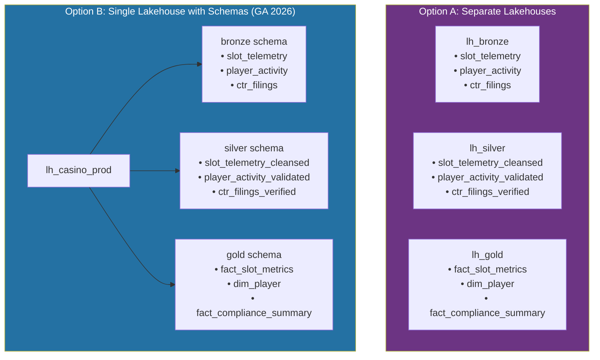
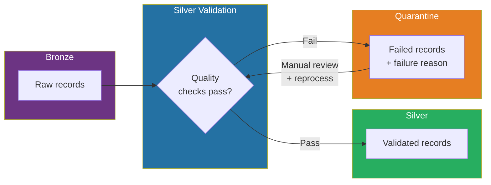
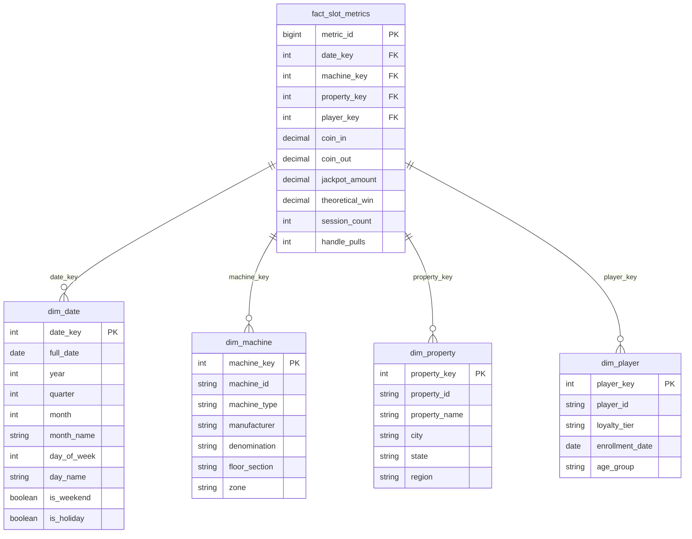
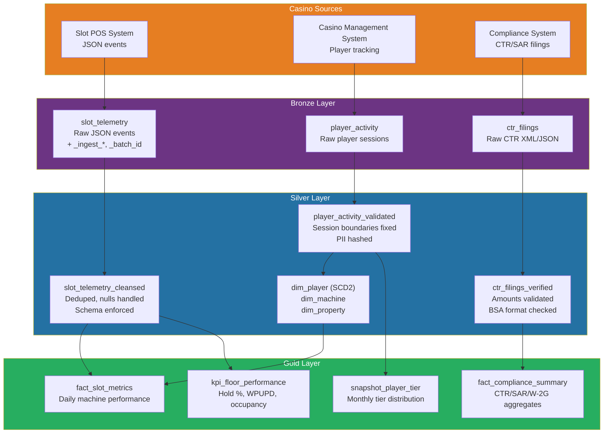
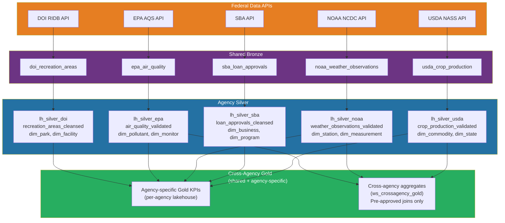

[Home](../index.md) > [Docs](../) > [Best Practices](./) > Medallion Architecture Deep Dive

# 🏗️ Medallion Architecture Deep Dive

<div align="center" markdown>

**Bronze → Silver → Gold Patterns for Casino Gaming & Federal Data Workloads**


</div>

---

**Last Updated:** `2026-04-13` | **Version:** 1.0.0

---

## 📑 Table of Contents

- [🎯 Overview](#-overview)
- [🏗️ Architecture](#️-architecture)
- [🥉 Bronze Patterns](#-bronze-patterns)
- [🥈 Silver Patterns](#-silver-patterns)
- [🥇 Gold Patterns](#-gold-patterns)
- [🔧 Table Maintenance](#-table-maintenance)
- [📝 Naming Conventions](#-naming-conventions)
- [🎰 Casino Implementation](#-casino-implementation)
- [🏛️ Federal Implementation](#️-federal-implementation)
- [🚫 Anti-Patterns](#-anti-patterns)
- [📚 References](#-references)

---

## 🎯 Overview

The medallion architecture (Bronze → Silver → Gold) is the foundational data organization pattern for Microsoft Fabric Lakehouses. Each layer has a distinct purpose, quality level, and access pattern. This guide provides deep implementation patterns for both casino gaming and federal agency workloads, covering schema design, data quality gates, SCD handling, table maintenance, and naming conventions within the Microsoft Fabric ecosystem.

### Why Medallion in Fabric?

| Benefit | Description |
|---------|-------------|
| **Progressive quality** | Data quality improves at each layer, with explicit validation gates |
| **Audit trail** | Bronze retains raw data for lineage and compliance replay |
| **Isolation** | Each layer can have different access controls, retention, and refresh cadences |
| **Performance** | Gold tables are pre-aggregated and optimized for Direct Lake reporting |
| **Reusability** | Silver tables serve multiple Gold aggregations and downstream consumers |
| **Compliance** | Raw filings (CTR, SAR, EPA reports) preserved unchanged in Bronze for regulatory audit |

### Layer Summary

| Layer | Purpose | Format | Quality | Access |
|-------|---------|--------|---------|--------|
| **Bronze** | Raw ingestion, append-only | Delta Lake (schema-on-read) | Raw — no validation | Data Engineers |
| **Silver** | Cleansed, validated, conformed | Delta Lake (schema-enforced) | Validated — nulls handled, deduped | Data Engineers, Analysts |
| **Gold** | Business aggregations, KPIs | Delta Lake (star schema) | Business-ready — pre-aggregated | Analysts, Executives, BI tools |

> **Fabric-Specific Note:** With Lakehouse Schemas (GA 2026), each layer can be a schema within a single lakehouse (`lh_main.bronze.slot_telemetry`) or a separate lakehouse (`lh_bronze.slot_telemetry`). This guide covers both approaches.

---

## 🏗️ Architecture

### End-to-End Medallion Flow

```mermaid
flowchart LR
    subgraph Sources["Data Sources"]
        style Sources fill:#E67E22,color:#fff
        S1[Casino POS/Slots]
        S2[Federal APIs<br/>USDA, SBA, NOAA, EPA, DOI]
        S3[Eventstream<br/>Real-Time Telemetry]
        S4[Files<br/>CSV, JSON, Parquet]
    end

    subgraph Bronze["Bronze Layer"]
        style Bronze fill:#6C3483,color:#fff
        B1[Append-only ingestion]
        B2[Metadata columns added<br/>_ingest_ts, _source, _batch_id]
        B3[Schema-on-read<br/>No transforms]
        B4[Partitioned by date]
    end

    subgraph Silver["Silver Layer"]
        style Silver fill:#2471A3,color:#fff
        SV1[Deduplication]
        SV2[Null handling & defaults]
        SV3[Schema enforcement]
        SV4[SCD Type 1/2]
        SV5[Data quality gates]
    end

    subgraph Gold["Gold Layer"]
        style Gold fill:#27AE60,color:#fff
        G1[Star schema<br/>Facts + Dimensions]
        G2[Pre-aggregated KPIs]
        G3[Snapshot tables]
        G4[Direct Lake models]
    end

    Sources --> Bronze
    Bronze --> Silver
    Silver --> Gold
```



### Lakehouse Strategy: Separate vs Schema-Based



| Criteria | Separate Lakehouses | Schema-Based (Single) |
|----------|-------------------|----------------------|
| **Access isolation** | Strong (different item permissions per lakehouse) | Moderate (SQL endpoint security per schema) |
| **Simplicity** | More items to manage | Fewer items, unified SQL endpoint |
| **Cross-layer queries** | Requires cross-lakehouse joins | Same-lakehouse joins (faster) |
| **Git integration** | Separate item definitions | Single item definition |
| **Recommended for** | Multi-team, strict compliance | Small teams, rapid development |

> **Recommendation for this POC:** Use separate lakehouses (`lh_bronze`, `lh_silver`, `lh_gold`) for maximum access isolation, especially given the compliance requirements of casino gaming (NIGC) and federal agencies (FedRAMP/FISMA). Reference schemas within the SQL endpoint for cross-layer queries.

---

## 🥉 Bronze Patterns

### Core Principles

1. **Append-only** — Never update or delete Bronze records. Every ingestion creates new rows.
2. **Schema-on-read** — Accept data as-is from the source. Do not enforce strict schemas.
3. **Metadata enrichment** — Add ingestion metadata columns for lineage and troubleshooting.
4. **Partition by ingestion date** — Enables efficient retention management and incremental reads.
5. **Retain raw format** — Preserve the original data exactly as received for compliance replay.

### Metadata Columns

Every Bronze table must include these system columns:

| Column | Type | Description | Example |
|--------|------|-------------|---------|
| `_ingest_timestamp` | TIMESTAMP | UTC timestamp of ingestion | `2026-04-13T14:30:00Z` |
| `_source_system` | STRING | Origin system identifier | `casino_pos`, `usda_api` |
| `_source_file` | STRING | Source file path or API endpoint | `abfss://raw@account.dfs.core.windows.net/slots/2026/04/13/batch001.json` |
| `_batch_id` | STRING | Unique batch/run identifier | `run-20260413-143000-abc123` |
| `_is_deleted` | BOOLEAN | Soft delete marker (for CDC sources) | `false` |

### Bronze Ingestion Template

```python
# Databricks notebook source
# MAGIC %md
# MAGIC # Bronze Ingestion: {source_name}
# MAGIC Append-only raw ingestion with metadata enrichment

# COMMAND ----------

from pyspark.sql import functions as F
from pyspark.sql.types import *
from datetime import datetime

# Configuration
SOURCE_PATH = "abfss://raw@stfabricpoceastus2.dfs.core.windows.net/casino/slot_telemetry/"
BRONZE_TABLE = "lh_bronze.slot_telemetry"
BATCH_ID = f"run-{datetime.utcnow().strftime('%Y%m%d-%H%M%S')}"

# COMMAND ----------

# Read raw data (schema-on-read — infer schema from source)
df_raw = (
    spark.read
    .format("json")  # or csv, parquet, delta
    .option("inferSchema", "true")
    .option("multiLine", "true")
    .load(SOURCE_PATH)
)

# COMMAND ----------

# Add metadata columns
df_bronze = (
    df_raw
    .withColumn("_ingest_timestamp", F.current_timestamp())
    .withColumn("_source_system", F.lit("casino_pos"))
    .withColumn("_source_file", F.input_file_name())
    .withColumn("_batch_id", F.lit(BATCH_ID))
    .withColumn("_is_deleted", F.lit(False))
)

# COMMAND ----------

# Append to Bronze table (never overwrite)
(
    df_bronze.write
    .format("delta")
    .mode("append")
    .partitionBy("_ingest_timestamp")  # Partition by date for retention
    .saveAsTable(BRONZE_TABLE)
)

print(f"✅ Ingested {df_bronze.count()} records to {BRONZE_TABLE} (batch: {BATCH_ID})")
```

### Partitioning Strategy

| Source Type | Partition Column | Partition Granularity | Rationale |
|-------------|-----------------|----------------------|-----------|
| Batch files (daily) | `_ingest_date` | Day | Aligns with daily ingestion schedule |
| Streaming (Eventstream) | `_ingest_hour` | Hour | Prevents small file problem with daily partitions |
| API pulls (weekly) | `_ingest_date` | Day | Simple, efficient for weekly pulls |
| CDC (continuous) | `_ingest_date` | Day | Manageable partition count |

### Retention Policy

| Domain | Bronze Retention | Justification |
|--------|-----------------|---------------|
| Casino (slots, tables) | 7 years | NIGC MICS §542.17 retention requirement |
| Casino (CTR/SAR) | 7 years | BSA/FinCEN regulatory retention |
| Federal (USDA, NOAA, EPA) | 10 years | Federal Records Act schedule |
| Federal (SBA loans - PII) | 7 years | SBA SOP 50 10 retention |
| Healthcare (Tribal) | 6 years from last service | HIPAA §164.530(j) retention |

### Bronze Data Quality Checks

Even though Bronze is raw, run basic acceptance tests to catch source-level issues:

```python
# Great Expectations suite for Bronze
bronze_expectations = [
    # Table-level checks
    {"expectation": "expect_table_row_count_to_be_between", "min": 1, "max": 50_000_000},
    {"expectation": "expect_table_column_count_to_be_between", "min": 5, "max": 200},

    # Metadata column checks
    {"expectation": "expect_column_to_exist", "column": "_ingest_timestamp"},
    {"expectation": "expect_column_to_exist", "column": "_source_system"},
    {"expectation": "expect_column_to_exist", "column": "_batch_id"},
    {"expectation": "expect_column_values_to_not_be_null", "column": "_ingest_timestamp"},
    {"expectation": "expect_column_values_to_not_be_null", "column": "_batch_id"},
]
```

---

## 🥈 Silver Patterns

### Core Principles

1. **Schema enforcement** — Define and enforce strict schemas with expected types.
2. **Deduplication** — Remove duplicates based on natural keys and ingestion timestamps.
3. **Null handling** — Apply business rules for null/missing values (defaults, rejection, flagging).
4. **Conformance** — Standardize formats (dates, codes, enums) across sources.
5. **SCD management** — Implement Slowly Changing Dimensions for reference data.
6. **Quality gates** — Reject or quarantine records that fail validation rules.

### Deduplication Patterns

#### Window-Based Deduplication

```python
from pyspark.sql import Window

# Deduplicate by natural key, keeping the latest ingestion
window_spec = Window.partitionBy("machine_id", "event_timestamp").orderBy(
    F.col("_ingest_timestamp").desc()
)

df_deduped = (
    df_bronze
    .withColumn("_row_number", F.row_number().over(window_spec))
    .filter(F.col("_row_number") == 1)
    .drop("_row_number")
)
```

#### MERGE-Based Deduplication (Incremental)

```python
# Delta MERGE for incremental deduplication
from delta.tables import DeltaTable

silver_table = DeltaTable.forName(spark, "lh_silver.slot_telemetry_cleansed")

(
    silver_table.alias("target")
    .merge(
        df_new_bronze.alias("source"),
        "target.machine_id = source.machine_id AND target.event_timestamp = source.event_timestamp"
    )
    .whenMatchedUpdate(
        condition="source._ingest_timestamp > target._ingest_timestamp",
        set={
            "coin_in": "source.coin_in",
            "coin_out": "source.coin_out",
            "theoretical_win": "source.theoretical_win",
            "_last_updated": "current_timestamp()",
            "_source_batch": "source._batch_id"
        }
    )
    .whenNotMatchedInsertAll()
    .execute()
)
```

### Null Handling Strategy

| Column Category | Null Strategy | Example |
|----------------|---------------|---------|
| **Primary key** | Reject (quarantine) | `machine_id IS NULL → quarantine` |
| **Measure (numeric)** | Default to 0 | `coin_in IS NULL → 0.00` |
| **Dimension FK** | Default to "Unknown" key | `property_id IS NULL → -1 ("Unknown")` |
| **Date** | Default to ingestion date | `event_date IS NULL → _ingest_date` |
| **Optional attribute** | Allow NULL | `player_email IS NULL → OK` |
| **Compliance field** | Flag for review | `ssn IS NULL → _needs_review = true` |

```python
# Apply null handling rules
df_silver = (
    df_deduped
    # Reject nulls on primary keys
    .filter(F.col("machine_id").isNotNull() & F.col("event_timestamp").isNotNull())
    # Default measures to 0
    .withColumn("coin_in", F.coalesce(F.col("coin_in"), F.lit(0.0)))
    .withColumn("coin_out", F.coalesce(F.col("coin_out"), F.lit(0.0)))
    .withColumn("theoretical_win", F.coalesce(F.col("theoretical_win"), F.lit(0.0)))
    # Default unknown dimensions
    .withColumn("property_id", F.coalesce(F.col("property_id"), F.lit(-1)))
    # Flag compliance issues
    .withColumn("_needs_review",
        F.when(F.col("player_id").isNotNull() & F.col("ssn_hash").isNull(), True)
        .otherwise(False)
    )
)
```

### SCD Type 1 (Overwrite)

Use for attributes where history is not required:

```python
# SCD Type 1: Always keep the latest value
(
    silver_table.alias("target")
    .merge(
        df_source.alias("source"),
        "target.player_id = source.player_id"
    )
    .whenMatchedUpdate(set={
        "email": "source.email",
        "phone": "source.phone",
        "loyalty_tier": "source.loyalty_tier",
        "_last_updated": "current_timestamp()"
    })
    .whenNotMatchedInsertAll()
    .execute()
)
```

### SCD Type 2 (History)

Use for attributes where change history must be tracked (compliance requirement):

```python
# SCD Type 2: Track history with effective dates
from pyspark.sql.types import BooleanType

# Identify changed records
df_changes = (
    df_source.alias("new")
    .join(
        spark.table("lh_silver.dim_player").filter(F.col("_is_current") == True).alias("current"),
        "player_id",
        "left"
    )
    .filter(
        (F.col("current.player_id").isNull()) |  # New record
        (F.col("new.loyalty_tier") != F.col("current.loyalty_tier")) |  # Tier changed
        (F.col("new.address_state") != F.col("current.address_state"))  # Address changed
    )
)

# Close existing records
(
    DeltaTable.forName(spark, "lh_silver.dim_player").alias("target")
    .merge(
        df_changes.alias("source"),
        "target.player_id = source.player_id AND target._is_current = true"
    )
    .whenMatchedUpdate(set={
        "_is_current": "false",
        "_effective_end": "current_timestamp()"
    })
    .execute()
)

# Insert new current records
df_new_current = (
    df_changes.select("new.*")
    .withColumn("_is_current", F.lit(True))
    .withColumn("_effective_start", F.current_timestamp())
    .withColumn("_effective_end", F.lit(None).cast("timestamp"))
    .withColumn("_surrogate_key", F.monotonically_increasing_id())
)

df_new_current.write.format("delta").mode("append").saveAsTable("lh_silver.dim_player")
```

### Data Quality Gates

```python
# Quality gate: Reject entire batch if critical thresholds fail
quality_results = {
    "total_records": df_silver.count(),
    "null_key_count": df_silver.filter(F.col("machine_id").isNull()).count(),
    "duplicate_count": df_silver.count() - df_deduped.count(),
    "negative_amounts": df_silver.filter(F.col("coin_in") < 0).count(),
}

# Thresholds
MAX_NULL_KEY_RATE = 0.001  # 0.1%
MAX_DUPLICATE_RATE = 0.05  # 5%

null_rate = quality_results["null_key_count"] / quality_results["total_records"]
dup_rate = quality_results["duplicate_count"] / quality_results["total_records"]

if null_rate > MAX_NULL_KEY_RATE:
    raise ValueError(f"❌ Quality gate FAILED: Null key rate {null_rate:.2%} exceeds {MAX_NULL_KEY_RATE:.2%}")

if dup_rate > MAX_DUPLICATE_RATE:
    raise ValueError(f"❌ Quality gate FAILED: Duplicate rate {dup_rate:.2%} exceeds {MAX_DUPLICATE_RATE:.2%}")

print(f"✅ Quality gate PASSED: {quality_results['total_records']} records, "
      f"null rate: {null_rate:.4%}, duplicate rate: {dup_rate:.4%}")
```

### Quarantine Pattern

Records that fail validation are quarantined for manual review rather than silently dropped:



```python
# Split into valid and quarantine
df_valid = df_bronze.filter(
    F.col("machine_id").isNotNull() &
    F.col("event_timestamp").isNotNull() &
    (F.col("coin_in") >= 0)
)

df_quarantine = (
    df_bronze.filter(
        F.col("machine_id").isNull() |
        F.col("event_timestamp").isNull() |
        (F.col("coin_in") < 0)
    )
    .withColumn("_quarantine_reason",
        F.when(F.col("machine_id").isNull(), "NULL_MACHINE_ID")
        .when(F.col("event_timestamp").isNull(), "NULL_TIMESTAMP")
        .when(F.col("coin_in") < 0, "NEGATIVE_COIN_IN")
        .otherwise("UNKNOWN")
    )
    .withColumn("_quarantine_timestamp", F.current_timestamp())
)

# Write quarantine records
df_quarantine.write.format("delta").mode("append").saveAsTable("lh_silver._quarantine_slot_telemetry")
```

---

## 🥇 Gold Patterns

### Core Principles

1. **Star schema** — Fact tables surrounded by conformed dimensions for BI performance.
2. **Pre-aggregated KPIs** — Compute aggregations at ingestion time, not query time.
3. **Snapshot tables** — Periodic snapshots for point-in-time reporting (daily, weekly, monthly).
4. **Direct Lake optimized** — Structure tables for optimal Direct Lake column segment loading.
5. **Business terminology** — Use business-friendly names, not source system codes.

### Star Schema Design



### Pre-Aggregated KPI Tables

```python
# Gold: Daily slot performance KPIs (pre-aggregated from Silver)
df_gold_daily = (
    spark.table("lh_silver.slot_telemetry_cleansed")
    .groupBy(
        F.col("property_id"),
        F.col("machine_type"),
        F.date_trunc("day", F.col("event_timestamp")).alias("metric_date")
    )
    .agg(
        F.sum("coin_in").alias("total_coin_in"),
        F.sum("coin_out").alias("total_coin_out"),
        F.sum("theoretical_win").alias("total_theoretical_win"),
        F.expr("sum(coin_in) - sum(coin_out)").alias("net_win"),
        F.count("*").alias("total_events"),
        F.countDistinct("machine_id").alias("active_machines"),
        F.countDistinct("player_id").alias("unique_players"),
        F.avg("session_duration_minutes").alias("avg_session_minutes"),
        F.expr("sum(coin_in) / nullif(count(distinct machine_id), 0)").alias("win_per_unit_per_day"),
    )
    .withColumn("hold_percentage",
        F.expr("(total_coin_in - total_coin_out) / nullif(total_coin_in, 0) * 100")
    )
    .withColumn("_computed_at", F.current_timestamp())
)

# Overwrite daily partition (idempotent)
(
    df_gold_daily.write
    .format("delta")
    .mode("overwrite")
    .option("replaceWhere", f"metric_date = '{target_date}'")
    .saveAsTable("lh_gold.fact_slot_daily_kpi")
)
```

### Snapshot Tables

Snapshots capture a point-in-time view of slowly changing data for trend analysis:

```python
# Monthly player tier snapshot
df_snapshot = (
    spark.table("lh_silver.dim_player")
    .filter(F.col("_is_current") == True)
    .withColumn("snapshot_date", F.current_date())
    .withColumn("snapshot_month", F.date_trunc("month", F.current_date()))
    .select(
        "snapshot_date", "snapshot_month",
        "player_id", "loyalty_tier", "lifetime_value",
        "property_id", "enrollment_date"
    )
)

df_snapshot.write.format("delta").mode("append").saveAsTable("lh_gold.snapshot_player_tier")
```

### Direct Lake Optimization

| Optimization | Purpose | Implementation |
|-------------|---------|----------------|
| **V-Order** | Columnar compression for Direct Lake | `spark.conf.set("spark.sql.parquet.vorder.enabled", "true")` |
| **Narrow tables** | Fewer columns = faster segment loading | Split wide tables into fact + dimension |
| **Surrogate keys** | Integer keys are faster than string joins | Use `monotonically_increasing_id()` or hash |
| **Date dimension** | Pre-built date hierarchy for time intelligence | Create `dim_date` with fiscal calendar attributes |
| **Avoid nested types** | Direct Lake does not support STRUCT/ARRAY | Flatten all nested structures in Silver |

---

## 🔧 Table Maintenance

### OPTIMIZE (Compaction)

Small files degrade query performance. OPTIMIZE compacts small files into larger, optimally sized files:

```sql
-- Compact Bronze table (run after batch ingestion)
OPTIMIZE lh_bronze.slot_telemetry
WHERE _ingest_date >= current_date() - INTERVAL 7 DAYS;

-- Compact Silver table
OPTIMIZE lh_silver.slot_telemetry_cleansed;

-- Compact Gold table with Z-ORDER on common filter columns
OPTIMIZE lh_gold.fact_slot_daily_kpi
ZORDER BY (property_id, metric_date);
```

### VACUUM (Cleanup)

VACUUM removes files no longer referenced by the Delta transaction log:

```sql
-- Remove files older than 7 days (default retention)
VACUUM lh_bronze.slot_telemetry RETAIN 168 HOURS;

-- Remove files older than 30 days for Silver
VACUUM lh_silver.slot_telemetry_cleansed RETAIN 720 HOURS;

-- Gold tables: shorter retention since they are rebuilt
VACUUM lh_gold.fact_slot_daily_kpi RETAIN 168 HOURS;
```

> **Warning:** Never set VACUUM retention shorter than the longest-running query or pipeline. A VACUUM that removes files still in use by an active query will cause query failures.

### Z-ORDER vs V-Order vs Liquid Clustering

| Technique | Purpose | When to Use | Syntax |
|-----------|---------|-------------|--------|
| **Z-ORDER** | Co-locates related data for filter pushdown | Tables filtered by 1-3 columns | `OPTIMIZE ... ZORDER BY (col)` |
| **V-Order** | Columnar encoding optimized for Direct Lake | All Gold tables consumed by Power BI | Enabled via Spark config |
| **Liquid Clustering** | Automatic, incremental clustering (preview) | Tables with evolving query patterns | `CREATE TABLE ... CLUSTER BY (col)` |

### Liquid Clustering (Preview)

```sql
-- Create table with liquid clustering (replaces ZORDER)
CREATE TABLE lh_gold.fact_slot_daily_kpi (
    metric_date DATE,
    property_id STRING,
    machine_type STRING,
    total_coin_in DECIMAL(18,2),
    total_coin_out DECIMAL(18,2),
    net_win DECIMAL(18,2),
    hold_percentage DECIMAL(5,2)
)
USING DELTA
CLUSTER BY (property_id, metric_date);

-- Trigger incremental clustering
OPTIMIZE lh_gold.fact_slot_daily_kpi;
```

### Maintenance Schedule

| Table Layer | OPTIMIZE | VACUUM | Z-ORDER/Cluster | V-Order |
|-------------|----------|--------|-----------------|---------|
| Bronze | After each batch | Weekly (168h) | Not needed | No |
| Silver | After MERGE | Weekly (720h) | On frequently filtered columns | No |
| Gold | After rebuild | Weekly (168h) | On report filter columns | Yes (always) |

```python
# Automated maintenance notebook (schedule daily)
tables_to_maintain = [
    {"table": "lh_bronze.slot_telemetry", "vacuum_hours": 168, "zorder_cols": None},
    {"table": "lh_silver.slot_telemetry_cleansed", "vacuum_hours": 720, "zorder_cols": ["machine_id", "event_timestamp"]},
    {"table": "lh_gold.fact_slot_daily_kpi", "vacuum_hours": 168, "zorder_cols": ["property_id", "metric_date"]},
]

for t in tables_to_maintain:
    table = t["table"]
    print(f"🔧 Maintaining {table}...")

    spark.sql(f"OPTIMIZE {table}" +
              (f" ZORDER BY ({', '.join(t['zorder_cols'])})" if t['zorder_cols'] else ""))

    spark.sql(f"VACUUM {table} RETAIN {t['vacuum_hours']} HOURS")

    print(f"✅ {table} maintenance complete")
```

---

## 📝 Naming Conventions

### Lakehouse Naming

```
# Pattern: lh_{layer}[_{domain}]
lh_bronze            # Shared Bronze lakehouse
lh_bronze_casino     # Casino-specific Bronze (if domain isolation needed)
lh_bronze_usda       # USDA-specific Bronze
lh_silver            # Shared Silver lakehouse
lh_gold              # Shared Gold lakehouse
```

### Table Naming

```
# Bronze: {source_system}_{entity}
bronze tables:
  slot_telemetry           # Casino POS slot data
  player_activity          # Casino player tracking
  ctr_filings              # Currency Transaction Reports
  usda_crop_production     # USDA NASS crop data
  sba_loan_approvals       # SBA loan data
  noaa_weather_observations # NOAA weather stations

# Silver: {entity}_cleansed or {entity}_validated
silver tables:
  slot_telemetry_cleansed
  player_activity_validated
  ctr_filings_verified
  dim_player               # Conformed dimension (SCD Type 2)
  dim_machine              # Conformed dimension
  usda_crop_production_validated
  sba_loan_approvals_cleansed

# Gold: fact_{business_process} or dim_{entity} or agg_{summary}
gold tables:
  fact_slot_metrics        # Slot performance facts
  fact_compliance_summary  # CTR/SAR/W-2G compliance facts
  dim_date                 # Date dimension
  dim_property             # Property dimension
  agg_daily_revenue        # Daily revenue aggregate
  snapshot_player_tier     # Monthly player tier snapshot
  kpi_floor_performance    # Pre-aggregated KPI table
```

### Column Naming

| Convention | Pattern | Example |
|-----------|---------|---------|
| Primary key | `{entity}_id` or `{entity}_key` | `player_id`, `machine_key` |
| Foreign key | `{entity}_id` or `{entity}_key` | `property_id`, `date_key` |
| Measure | `{metric_name}` | `coin_in`, `net_win`, `session_count` |
| Date/time | `{event}_timestamp` or `{event}_date` | `event_timestamp`, `metric_date` |
| Boolean | `is_{attribute}` or `has_{attribute}` | `is_active`, `has_loyalty_card` |
| Metadata | `_{metadata_name}` (underscore prefix) | `_ingest_timestamp`, `_batch_id` |

---

## 🎰 Casino Implementation

### Slot Telemetry Pipeline (Bronze → Silver → Gold)



### Casino-Specific Gold KPIs

| KPI | Formula | Gold Table | Compliance |
|-----|---------|------------|------------|
| **Win Per Unit Per Day (WPUPD)** | `net_win / active_machines / days` | `kpi_floor_performance` | NIGC MICS reporting |
| **Hold Percentage** | `(coin_in - coin_out) / coin_in × 100` | `fact_slot_daily_kpi` | State gaming commission |
| **Theoretical Win** | `coin_in × house_edge` | `fact_slot_metrics` | Internal P&L |
| **CTR Filing Rate** | `ctr_count / transactions_over_10k` | `fact_compliance_summary` | BSA/FinCEN audit |
| **SAR Detection Rate** | `sar_count / suspicious_patterns` | `fact_compliance_summary` | BSA/FinCEN audit |
| **Floor Occupancy** | `active_machines / total_machines × 100` | `kpi_floor_performance` | Operational efficiency |
| **Player ADT** | `total_theoretical_win / unique_players` | `kpi_player_value` | Marketing ROI |

> **Compliance Note:** CTR threshold is $10,000. SAR structuring pattern detection targets multiple transactions in the $8,000–$9,999 range within a 24-hour window. W-2G thresholds: $1,200 (slots), $600 (keno at 300:1+), $5,000 (poker tournaments).

---

## 🏛️ Federal Implementation

### Multi-Agency Medallion Strategy

Federal workloads share a common medallion architecture with agency-specific isolation:



### Agency-Specific Silver Patterns

| Agency | Key Transform | Quality Gate | SCD Handling |
|--------|--------------|-------------|--------------|
| **USDA** | Standardize crop codes to NASS taxonomy | Yield range checks per crop/state | SCD1 for commodity reference |
| **SBA** | Mask SSN/EIN, validate loan amounts | Loan amount > 0, valid NAICS codes | SCD2 for business entity |
| **NOAA** | Convert units (°F→°C, in→mm), validate ranges | Temperature -90°C to 60°C | SCD1 for station metadata |
| **EPA** | Normalize pollutant codes, validate AQI range | AQI 0-500, concentration ≥ 0 | SCD1 for monitor reference |
| **DOI** | Geocode validation, standardize facility types | Lat -90 to 90, Lon -180 to 180 | SCD1 for park/facility |

### Cross-Agency Gold Join Example

```python
# Cross-agency Gold: Environmental impact on agriculture
# Joining USDA crop yields with EPA air quality and NOAA weather

df_cross_agency = (
    spark.table("lh_gold_usda.fact_crop_yield")
    .alias("crop")
    .join(
        spark.table("lh_gold_noaa.fact_weather_monthly").alias("weather"),
        (F.col("crop.state_code") == F.col("weather.state_code")) &
        (F.col("crop.year") == F.col("weather.year")) &
        (F.col("crop.month") == F.col("weather.month")),
        "left"
    )
    .join(
        spark.table("lh_gold_epa.fact_air_quality_monthly").alias("air"),
        (F.col("crop.state_code") == F.col("air.state_code")) &
        (F.col("crop.year") == F.col("air.year")) &
        (F.col("crop.month") == F.col("air.month")),
        "left"
    )
    .select(
        "crop.state_code", "crop.year", "crop.month",
        "crop.commodity_name", "crop.yield_per_acre",
        "weather.avg_temperature", "weather.total_precipitation",
        "air.avg_aqi", "air.max_ozone_ppm"
    )
)

# Write to cross-agency Gold lakehouse
df_cross_agency.write.format("delta").mode("overwrite").saveAsTable(
    "lh_gold_crossagency.fact_environmental_crop_impact"
)
```

> **Callout — Agency Data Never Co-Mingles in Bronze/Silver:** Cross-agency joins occur ONLY in Gold, using pre-approved aggregate tables. Raw and cleansed data (Bronze/Silver) are strictly agency-isolated per FedRAMP boundary requirements.

---

## 🚫 Anti-Patterns

### Anti-Pattern 1: Over-Layering

**Problem:** Adding unnecessary intermediate layers (Bronze → Bronze+ → Silver- → Silver → Silver+ → Gold).

**Symptom:** Pipeline complexity explodes; difficult to reason about data lineage.

**Fix:** Stick to three layers. If Silver logic is complex, break it into multiple notebooks within the Silver layer, not additional layers.

```
❌ Bronze → Bronze_Enriched → Silver_Raw → Silver_Clean → Silver_Conformed → Gold
✅ Bronze → Silver (notebook 1: dedup, notebook 2: conform, notebook 3: SCD) → Gold
```

### Anti-Pattern 2: Skipping Silver

**Problem:** Going directly from Bronze to Gold, combining cleansing and aggregation in one step.

**Symptom:** Gold tables contain data quality issues; no reusable cleansed dataset for different aggregations.

**Fix:** Always create Silver tables, even if the transformation seems simple. Silver serves as the "single source of truth" for cleansed data.

```
❌ Bronze → Gold (dedup + clean + aggregate in one step)
✅ Bronze → Silver (dedup + clean) → Gold (aggregate only)
```

### Anti-Pattern 3: Gold as Copy of Silver

**Problem:** Gold tables are just Silver tables with no additional aggregation or star schema modeling.

**Symptom:** Power BI reports perform complex aggregations at query time; slow Direct Lake performance.

**Fix:** Gold tables should always add value: pre-aggregation, star schema, KPI computation, or snapshots.

```
❌ Gold = SELECT * FROM Silver (no transformation)
✅ Gold = Aggregated KPIs, star schema facts, pre-computed metrics
```

### Anti-Pattern 4: Mutable Bronze

**Problem:** Updating or deleting records in Bronze (treating it as a staging area that gets cleared).

**Symptom:** Lost audit trail; inability to reprocess Silver from raw data; compliance violations.

**Fix:** Bronze is always append-only. Use `_is_deleted` soft delete markers for CDC deletes.

```
❌ TRUNCATE lh_bronze.slot_telemetry; INSERT INTO ... (clears history)
✅ INSERT INTO lh_bronze.slot_telemetry VALUES ... (always append)
```

### Anti-Pattern 5: No Metadata in Bronze

**Problem:** Bronze tables lack ingestion metadata, making it impossible to trace data lineage or reprocess specific batches.

**Symptom:** When data quality issues are found in Silver/Gold, cannot identify which source batch introduced the problem.

**Fix:** Always include `_ingest_timestamp`, `_source_system`, `_source_file`, and `_batch_id`.

### Anti-Pattern 6: Wide Gold Tables

**Problem:** Gold tables with 100+ columns combining fact measures and all dimension attributes.

**Symptom:** Slow Direct Lake loads; inefficient column segment scanning.

**Fix:** Use star schema: narrow fact tables with integer foreign keys to separate dimension tables.

```
❌ fact_everything (150 columns: measures + all dim attributes flattened)
✅ fact_slot_metrics (12 columns: keys + measures) + dim_machine + dim_property + dim_player
```

### Anti-Pattern Summary

| Anti-Pattern | Layer | Risk | Fix |
|-------------|-------|------|-----|
| Over-layering | All | Pipeline complexity | 3 layers only |
| Skipping Silver | Silver | Quality in Gold | Always create Silver |
| Gold as copy | Gold | Slow BI queries | Pre-aggregate and star schema |
| Mutable Bronze | Bronze | Compliance violation | Append-only |
| No metadata | Bronze | No lineage | Add system columns |
| Wide Gold tables | Gold | Slow Direct Lake | Star schema |

---

## 📚 References

### Microsoft Documentation

- [Medallion architecture in Fabric](https://learn.microsoft.com/fabric/onelake/onelake-medallion-lakehouse-architecture)
- [Delta Lake table optimization](https://learn.microsoft.com/fabric/data-engineering/delta-optimization-and-v-order)
- [Lakehouse schemas](https://learn.microsoft.com/fabric/data-engineering/lakehouse-schemas)
- [Liquid clustering](https://learn.microsoft.com/azure/databricks/delta/clustering)
- [Direct Lake overview](https://learn.microsoft.com/fabric/get-started/direct-lake-overview)
- [OPTIMIZE and VACUUM](https://learn.microsoft.com/fabric/data-engineering/lakehouse-table-maintenance)
- [V-Order](https://learn.microsoft.com/fabric/data-engineering/delta-optimization-and-v-order#v-order)

### Best Practices

- [Delta Lake best practices](https://docs.delta.io/latest/best-practices.html)
- [Star schema design guidance](https://learn.microsoft.com/power-bi/guidance/star-schema)
- [Data quality with Great Expectations](https://greatexpectations.io/expectations/)

### Compliance Standards

- [NIGC MICS - §542.17 (Record retention)](https://www.nigc.gov/compliance/minimum-internal-control-standards)
- [Federal Records Act - 44 U.S.C. Chapter 31](https://www.archives.gov/records-mgmt/laws)
- [HIPAA §164.530(j) (Retention)](https://www.hhs.gov/hipaa/for-professionals/security/)
- [FedRAMP Data Classification](https://www.fedramp.gov/assets/resources/documents/FedRAMP_Security_Controls_Baseline.xlsx)

---

## Related Documents

- [Lakehouse Setup](./07_LAKEHOUSE_SETUP.md) — Initial lakehouse provisioning and configuration
- [Performance & Parallelism](./performance-parallelism.md) — Spark optimization patterns
- [Data Governance Deep Dive](./data-governance-deep-dive.md) — Classification, sensitivity labels, RLS
- [Error Handling & Monitoring](./error-handling-monitoring.md) — Pipeline error tracking and alerts
- [Spark Runtime Migration](./spark-runtime-migration.md) — Runtime 2.0 migration guide

---

[Back to Best Practices Index](./index.md) | [Back to Documentation](../index.md)
