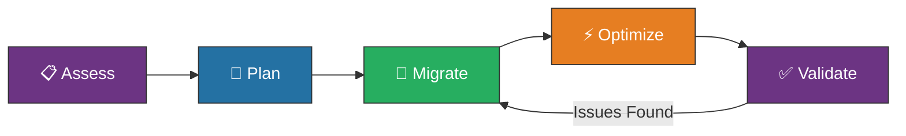
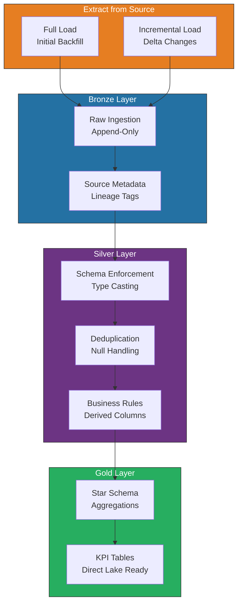
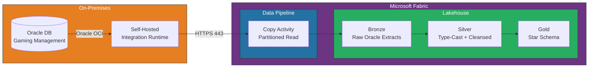
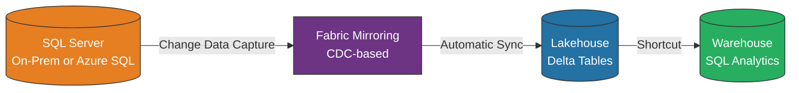
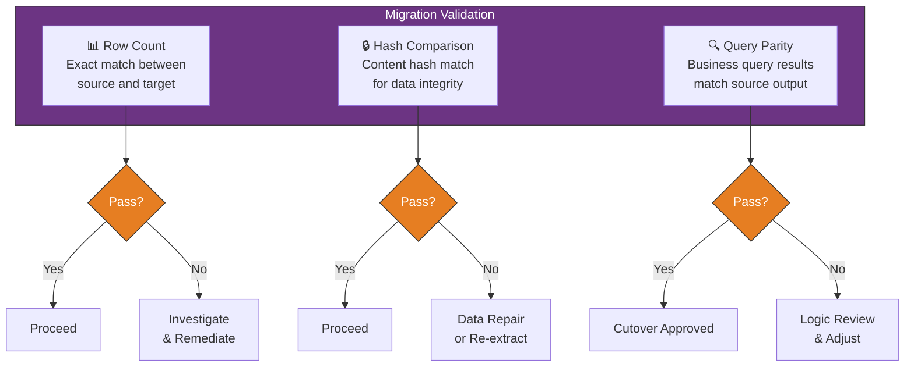
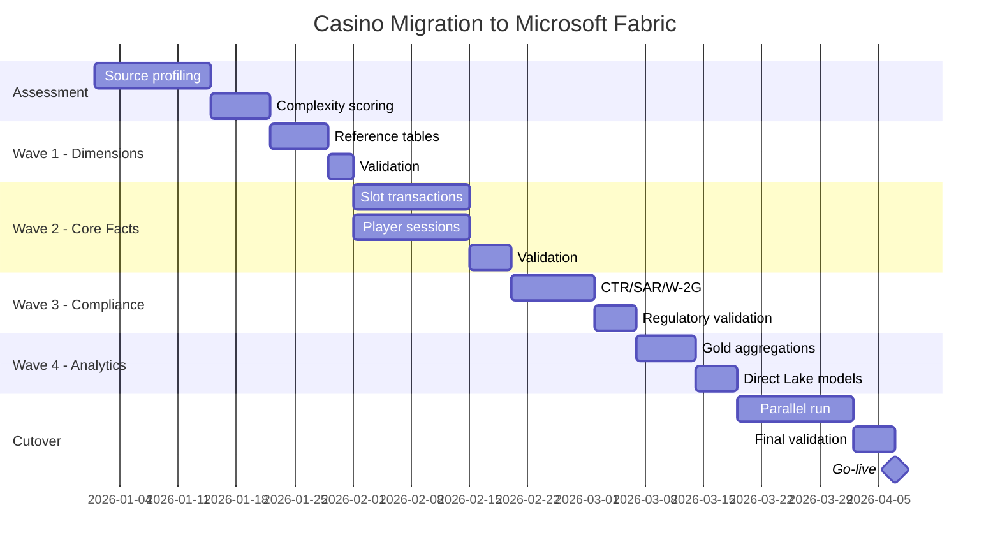
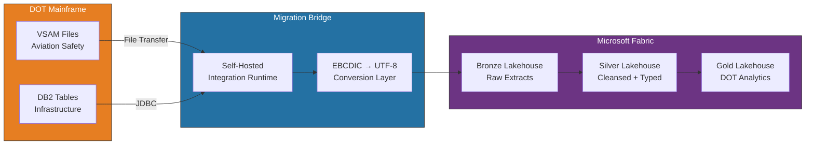

# 🔄 Migration Patterns for Microsoft Fabric

<div align="center" markdown>

**Structured Migration Playbook from Legacy Analytics to Microsoft Fabric**


</div>

---

**Last Updated:** `2026-04-27` | **Version:** 1.1.0

---

> 🆕 **Phase 14 Wave 4 — Migration Source Expansion (2026-04-27)**
>
> Five new end-to-end tutorials add detailed playbooks for the most-asked enterprise migration sources. Each ships with assessment scripts, schema/SQL converters, validation suites, and capacity-sizing references. Use this best-practices doc for cross-source patterns; deep-dive into the dedicated tutorials when executing a specific source migration.
>
> | Source | Tutorial | Focus |
> |--------|----------|-------|
> | Azure Synapse Analytics | [Tutorial 41](../tutorials/41-synapse-to-fabric/README.md) | Dedicated SQL pool, Spark pool, ADLS Gen2, Synapse Pipelines |
> | Databricks | [Tutorial 42](../tutorials/42-databricks-to-fabric/README.md) | Workspace, Unity Catalog, Delta, Workflows, MLflow, DBSQL |
> | Amazon Redshift | [Tutorial 43](../tutorials/43-redshift-to-fabric/README.md) | RA3/DC2 cluster, Spectrum, Glue Catalog, WLM, multi-cloud egress |
> | Google BigQuery | [Tutorial 44](../tutorials/44-bigquery-to-fabric/README.md) | Slots, partitioning/clustering, Dataflow, BQML, Looker, GCP egress |
> | On-Prem SSAS/SSIS/SSRS | [Tutorial 45](../tutorials/45-onprem-ssas-ssis-ssrs/README.md) | MSBI stack — Tabular & Multidim cubes, packages, RDL reports |

---

## 🎯 Overview

Migrating to Microsoft Fabric from legacy analytics platforms requires a structured approach that minimizes risk, preserves data fidelity, and captures the full value of Fabric's unified platform. This guide provides battle-tested migration patterns for moving from Oracle, SQL Server, Teradata, SAS, Snowflake, Databricks, and Azure Synapse Analytics into Fabric's Lakehouse, Warehouse, and Eventhouse workloads.

### Migration Principles

| Principle | Description |
|-----------|-------------|
| **Assess First** | Profile source systems before writing a single line of migration code |
| **Medallion by Default** | Map legacy tables into Bronze → Silver → Gold layers during migration |
| **Validate Continuously** | Automated row count, hash, and query-parity checks at every stage |
| **Coexist Temporarily** | Run source and Fabric in parallel until validation thresholds are met |
| **Optimize Last** | Migrate correctly first; performance-tune after validation passes |

### When to Use Each Fabric Workload

| Workload | Best For | Migrate From |
|----------|----------|--------------|
| **Lakehouse** | Semi-structured data, Delta Lake, PySpark workloads | Databricks, HDFS, S3, SAS datasets |
| **Warehouse** | Structured T-SQL analytics, star schemas | SQL Server, Teradata, Oracle, Synapse |
| **Eventhouse** | Time-series, real-time, log analytics | Splunk, Elasticsearch, InfluxDB |
| **Power BI (Direct Lake)** | BI semantic models | SSAS, Tableau, Power BI Premium |

---

## 🏗️ Migration Framework

### Five-Phase Methodology

Every migration follows a repeatable five-phase process. The phases are sequential, but discovery from later phases can trigger iteration on earlier ones.



### Phase 1: Assess

The assessment phase catalogs source systems, identifies data dependencies, and produces a migration complexity score for each workload.

**Assessment checklist:**

| Area | What to Capture | Tool / Method |
|------|-----------------|---------------|
| **Inventory** | Tables, views, stored procedures, ETL jobs | Source system catalog queries |
| **Volume** | Row counts, data sizes, growth rates | System metadata tables |
| **Complexity** | Cross-database joins, linked servers, external dependencies | Dependency analysis scripts |
| **Data Types** | Unsupported types, LOBs, spatial, XML | Schema comparison tools |
| **Access Patterns** | Query frequency, peak usage times, concurrent users | Query store / AWR reports |
| **Compliance** | PII columns, encryption requirements, retention policies | Data classification scan |

**Complexity scoring:**

```python
def calculate_migration_complexity(table_metadata: dict) -> str:
    """Score migration complexity for a single table."""
    score = 0

    # Volume factor
    row_count = table_metadata.get("row_count", 0)
    if row_count > 100_000_000:
        score += 3  # High volume
    elif row_count > 10_000_000:
        score += 2  # Medium volume
    else:
        score += 1  # Low volume

    # Schema complexity
    column_count = table_metadata.get("column_count", 0)
    if column_count > 100:
        score += 3
    elif column_count > 50:
        score += 2
    else:
        score += 1

    # Data type complexity
    has_lob = table_metadata.get("has_lob_columns", False)
    has_spatial = table_metadata.get("has_spatial_columns", False)
    has_xml = table_metadata.get("has_xml_columns", False)
    score += sum([has_lob, has_spatial, has_xml]) * 2

    # Dependency complexity
    dependency_count = table_metadata.get("dependency_count", 0)
    score += min(dependency_count, 5)

    if score >= 10:
        return "HIGH"
    elif score >= 5:
        return "MEDIUM"
    return "LOW"
```

### Phase 2: Plan

Create a migration plan that sequences workloads by dependency order and assigns each table to a Fabric target.

**Planning deliverables:**

1. **Migration wave plan** — Group tables into ordered waves (foundations first, dependents later)
2. **Target mapping** — Each source object mapped to Fabric Lakehouse table, Warehouse table, or Eventhouse table
3. **Transformation spec** — Column mappings, data type translations, business rule adjustments
4. **Rollback plan** — How to revert each wave if validation fails
5. **Timeline** — Estimated duration per wave with milestones

**Wave sequencing example:**

```python
migration_waves = {
    "wave_1_foundations": {
        "description": "Reference and dimension tables with no dependencies",
        "tables": [
            "dim_date", "dim_currency", "dim_region",
            "dim_machine_type", "dim_game_category"
        ],
        "target": "Lakehouse (Bronze → Silver → Gold)",
        "estimated_duration": "2 days",
        "parallel_ok": True
    },
    "wave_2_core_facts": {
        "description": "Core fact tables that depend on wave 1 dimensions",
        "tables": [
            "fact_slot_transactions", "fact_table_games",
            "fact_player_sessions"
        ],
        "target": "Lakehouse (Bronze → Silver → Gold)",
        "estimated_duration": "5 days",
        "parallel_ok": True  # Tables independent of each other
    },
    "wave_3_compliance": {
        "description": "Compliance tables with strict validation requirements",
        "tables": [
            "compliance_ctr_filings", "compliance_sar_alerts",
            "compliance_w2g_records"
        ],
        "target": "Lakehouse + Warehouse (queryable via SQL)",
        "estimated_duration": "3 days",
        "parallel_ok": False  # Sequential due to cross-references
    },
    "wave_4_analytics": {
        "description": "Aggregation tables and semantic model refresh",
        "tables": [
            "agg_daily_revenue", "agg_player_lifetime_value",
            "agg_floor_performance"
        ],
        "target": "Gold Lakehouse + Direct Lake",
        "estimated_duration": "2 days",
        "parallel_ok": True
    }
}
```

### Phase 3: Migrate

Execute the migration wave by wave. Each wave follows: Extract → Load (Bronze) → Transform (Silver) → Aggregate (Gold) → Validate.



### Phase 4: Optimize

After initial migration and validation, optimize for Fabric-native performance.

**Optimization checklist:**

| Area | Action | Impact |
|------|--------|--------|
| **V-Order** | Enable V-Order on Gold Delta tables | 2-10x Direct Lake scan speed |
| **File sizing** | Compact small files with `OPTIMIZE` | Reduce metadata overhead |
| **Z-Order** | Apply Z-Order on frequently filtered columns | Faster predicate pushdown |
| **Partitioning** | Partition large tables by date | Eliminate full-table scans |
| **Caching** | Enable result set caching on Warehouse | Sub-second repeat queries |
| **Statistics** | Update table statistics after migration | Better query plans |

```python
# Post-migration optimization for Gold tables
from delta.tables import DeltaTable

def optimize_gold_table(table_name: str, z_order_columns: list[str]):
    """Run OPTIMIZE with Z-ORDER on a Gold Delta table."""
    delta_table = DeltaTable.forName(spark, table_name)

    # Compact small files
    delta_table.optimize().executeCompaction()

    # Apply Z-Order on query-critical columns
    if z_order_columns:
        z_order_expr = ", ".join(z_order_columns)
        spark.sql(f"""
            OPTIMIZE {table_name}
            ZORDER BY ({z_order_expr})
        """)

    # Enable V-Order for Direct Lake
    spark.sql(f"""
        ALTER TABLE {table_name}
        SET TBLPROPERTIES ('delta.parquet.vorder.enabled' = 'true')
    """)

    print(f"✅ Optimized {table_name} with Z-Order on {z_order_columns}")

# Usage
optimize_gold_table(
    "gold.slot_performance_daily",
    z_order_columns=["property_id", "gaming_date"]
)
```

### Phase 5: Validate

Validation is the most critical phase. No migration is complete until all validation checks pass.

> **⚠️ Important:** Run validation on every wave before proceeding to the next. Never skip validation, even for "simple" reference tables.

---

## 🗂️ Source-Specific Patterns

### Recommended Migration Method by Source

| Source Platform | Recommended Method | Fabric Target | Gateway Required | Notes |
|----------------|-------------------|---------------|------------------|-------|
| **Oracle** | Copy Activity (SHIR) + PySpark transforms | Lakehouse | Yes (SHIR) | Use OraclePartitionOption for large tables |
| **SQL Server** | Copy Activity (direct or SHIR) + mirroring | Lakehouse or Warehouse | On-prem: Yes | Consider Fabric Mirroring for ongoing sync |
| **Teradata** | Copy Activity (SHIR) + PySpark transforms | Lakehouse | Yes (SHIR) | Teradata TPT for bulk export alternative |
| **SAS** | SAS dataset files → ADLS → Lakehouse shortcut | Lakehouse | No (file-based) | Convert .sas7bdat to Parquet first |
| **Snowflake** | Copy Activity (cloud-direct) or Iceberg shortcuts | Lakehouse | No | Use Iceberg endpoint for zero-copy |
| **Databricks** | Delta Sharing or ADLS shortcuts | Lakehouse | No | Delta-native, minimal transformation |
| **Azure Synapse** | Synapse Link or Copy Activity | Lakehouse or Warehouse | No | Direct ADLS Gen2 access via shortcuts |

### Oracle Migration Pattern

Oracle migrations typically involve a Self-Hosted Integration Runtime (SHIR) on a machine with Oracle client drivers installed.



**Copy Activity configuration for Oracle:**

```json
{
    "type": "Copy",
    "typeProperties": {
        "source": {
            "type": "OracleSource",
            "oracleReaderQuery": "SELECT * FROM GAMING.SLOT_TRANSACTIONS WHERE TRANSACTION_DATE >= :start_date",
            "partitionOption": "DynamicRange",
            "partitionSettings": {
                "partitionColumnName": "TRANSACTION_ID",
                "partitionUpperBound": "SELECT MAX(TRANSACTION_ID) FROM GAMING.SLOT_TRANSACTIONS",
                "partitionLowerBound": "SELECT MIN(TRANSACTION_ID) FROM GAMING.SLOT_TRANSACTIONS"
            }
        },
        "sink": {
            "type": "LakehouseTableSink",
            "tableActionOption": "Append"
        },
        "dataIntegrationUnits": 32,
        "parallelCopies": 16
    }
}
```

### SQL Server Migration Pattern

SQL Server migrations benefit from Fabric Mirroring for ongoing near-real-time sync, or Copy Activity for one-time bulk loads.

**Option A: Fabric Mirroring (recommended for ongoing sync)**



**Option B: Copy Activity (one-time or scheduled bulk load)**

```json
{
    "type": "Copy",
    "typeProperties": {
        "source": {
            "type": "SqlSource",
            "sqlReaderQuery": "SELECT * FROM dbo.player_profiles WHERE modified_date > @{pipeline().parameters.LastWatermark}",
            "partitionOption": "DynamicRange",
            "partitionSettings": {
                "partitionColumnName": "player_id",
                "partitionUpperBound": "@{pipeline().parameters.MaxPlayerId}",
                "partitionLowerBound": "1"
            }
        },
        "sink": {
            "type": "LakehouseTableSink",
            "tableActionOption": "Append"
        }
    }
}
```

### Teradata Migration Pattern

Teradata migrations use SHIR with the Teradata .NET Data Provider. For very large tables (100M+ rows), consider exporting to Parquet files via Teradata Parallel Transporter (TPT) and loading via ADLS Gen2 shortcuts.

```python
# PySpark transformation for Teradata-specific data types
from pyspark.sql import functions as F
from pyspark.sql.types import DecimalType, TimestampType

def transform_teradata_types(df):
    """Handle Teradata-specific type mappings."""
    # BYTEINT → TINYINT (Spark handles natively)
    # DECIMAL(38,x) → Ensure precision preserved
    # TIMESTAMP(6) → Timestamp with microsecond precision
    # PERIOD → Split into start/end columns

    for field in df.schema.fields:
        col_name = field.name

        # Handle Teradata PERIOD types (migrated as strings)
        if "period" in col_name.lower():
            df = df.withColumn(
                f"{col_name}_start",
                F.split(F.col(col_name), ",").getItem(0).cast(TimestampType())
            ).withColumn(
                f"{col_name}_end",
                F.split(F.col(col_name), ",").getItem(1).cast(TimestampType())
            ).drop(col_name)

    return df
```

### SAS Migration Pattern

SAS migrations convert `.sas7bdat` files to Parquet and land them in ADLS Gen2, then create Lakehouse shortcuts.

```python
# Convert SAS datasets to Parquet for Fabric ingestion
import pandas as pd
from pathlib import Path

def convert_sas_to_parquet(
    sas_directory: str,
    output_directory: str,
    encoding: str = "latin1"
):
    """Convert all .sas7bdat files in a directory to Parquet."""
    sas_path = Path(sas_directory)
    out_path = Path(output_directory)
    out_path.mkdir(parents=True, exist_ok=True)

    for sas_file in sas_path.glob("*.sas7bdat"):
        print(f"Converting {sas_file.name}...")
        df = pd.read_sas(sas_file, encoding=encoding)

        # Handle SAS-specific date representations
        for col in df.select_dtypes(include=["datetime64"]).columns:
            # SAS epoch is 1960-01-01; pandas handles this correctly
            pass

        # Handle SAS missing value codes (.A through .Z)
        df = df.fillna({
            col: None for col in df.select_dtypes(include=["float64"]).columns
        })

        parquet_name = sas_file.stem + ".parquet"
        df.to_parquet(out_path / parquet_name, index=False, engine="pyarrow")
        print(f"  ✅ {parquet_name} ({len(df):,} rows)")

# Usage for USDA crop production SAS files
convert_sas_to_parquet(
    sas_directory="/mnt/usda_legacy/crop_production",
    output_directory="/mnt/staging/usda/parquet"
)
```

### Snowflake Migration Pattern

Snowflake migrations can leverage Iceberg table endpoints for zero-copy reads or use Copy Activity for bulk extraction.

```json
{
    "type": "Copy",
    "typeProperties": {
        "source": {
            "type": "SnowflakeV2Source",
            "query": "SELECT * FROM ANALYTICS.PUBLIC.DAILY_REVENUE WHERE LOAD_DATE > $last_watermark",
            "exportMethod": "DIRECT"
        },
        "sink": {
            "type": "LakehouseTableSink"
        },
        "dataIntegrationUnits": 16
    }
}
```

> **💡 Tip:** If your Snowflake tables are already in Iceberg format, use Fabric's OneLake Iceberg shortcuts to read them directly without copying data.

### Databricks Migration Pattern

Databricks-to-Fabric migrations are the smoothest because both platforms use Delta Lake natively.

**Option A: ADLS Shortcuts (zero-copy)**

If your Databricks workspace uses ADLS Gen2 as storage, create Lakehouse shortcuts pointing to the same Delta tables. No data movement required.

**Option B: Delta Sharing**

For cross-cloud or cross-organization sharing, use the Delta Sharing protocol.

```python
# Configure Fabric Lakehouse to read via Delta Sharing
# 1. Create a Delta Sharing credential in Fabric
# 2. Create shortcuts to the shared tables

# In Databricks: publish tables to a share
# In Fabric: consume via shortcut with Delta Sharing profile
```

---

### 🔷 Azure Synapse Analytics Migration Pattern

Azure Synapse → Fabric is the **most-asked enterprise migration** because Synapse and Fabric share Microsoft DNA, but the architectural shift from DWUs to CUs and from Spark/SQL silos to a unified capacity is real. The migration pivots on three big wins: Dedicated SQL pool DDL converts cleanly to Fabric Warehouse (drop the `DISTRIBUTION` and `CLUSTERED COLUMNSTORE` clauses; Fabric handles those automatically via V-Order), ADLS Gen2 storage moves to OneLake via shortcut (no data copy), and Synapse Spark notebooks port with mostly mechanical `mssparkutils` adjustments.

**Detailed playbook:** [Tutorial 41 — Synapse → Fabric](../tutorials/41-synapse-to-fabric/README.md)

#### Component Mapping (Synapse → Fabric)

| Synapse Component | Fabric Equivalent | Migration Approach |
|-------------------|-------------------|--------------------|
| Dedicated SQL pool (DWUs) | Fabric Warehouse (CUs) | DDL conversion + CTAS bulk load |
| Serverless SQL pool | Fabric SQL endpoint over Lakehouse | Often direct (T-SQL → Lakehouse SQL) |
| Spark pool | Fabric Spark + notebooks | Notebook code mostly portable |
| Synapse Pipelines | Fabric Data Pipelines | Activities mostly compatible |
| Mapping Data Flows | Dataflow Gen2 | **Manual recreation** in Power Query |
| ADLS Gen2 (linked) | OneLake shortcut | **No data movement needed** |
| Synapse Studio notebooks | Fabric notebooks | Minor API tweaks (`mssparkutils` shim) |
| Stream Analytics | Eventstream + Eventhouse | Re-author logic |
| Linked services | Connections | Recreate; secrets to Key Vault |

#### Type Conversion Highlights

| Synapse Type | Fabric Warehouse Type | Notes |
|--------------|----------------------|-------|
| `nvarchar(n)` | `varchar(n)` | UTF-8 default in Fabric |
| `datetime` | `datetime2(6)` | Recommended upgrade |
| `xml` | `varchar(max)` + JSON | Not supported — convert |
| `geography`, `geometry` | Use Lakehouse + `sedona` | Not in Warehouse |
| `hierarchyid` | Materialized path string | Not supported |

#### DWU → F-SKU Sizing (Starting Point)

| Synapse DWU | Approximate Fabric F-SKU |
|-------------|--------------------------|
| DW100c | F8 |
| DW1000c | F64 |
| DW3000c | F128 |
| DW6000c | F256 |
| DW15000c | F1024 |

> 💡 **When to use this approach:** Existing Azure Synapse Analytics estate (Dedicated SQL pool, Spark pool, or both). Goal is unified capacity model, Direct Lake BI, and elimination of Spark/SQL billing silos. Synapse SQL pools are entering sustaining mode — Fabric is where new investment lands. Validate F-SKU sizing empirically during coexistence; CU pool also serves Power BI and RTI.

---

### 🧱 Databricks Migration Pattern (Detailed)

Databricks → Fabric is the **smoothest cloud-to-cloud migration** because both platforms speak Delta Lake natively. The technical lift is small; the strategic question is bigger — moving onto a Microsoft platform that bundles BI, real-time, governance, and ML alongside Spark, with a single capacity-based commercial model. The migration pivots on Delta-table movement (shortcut-in-place or rewrite for V-Order), Unity Catalog → OneLake Catalog governance translation, `dbutils` → `mssparkutils` shim, Workflows → Fabric Pipelines, and MLflow registry export-import.

**Detailed playbook:** [Tutorial 42 — Databricks → Fabric](../tutorials/42-databricks-to-fabric/README.md)

#### Workflow / Activity Mapping (Databricks → Fabric)

| Databricks Component | Fabric Equivalent | Migration Approach |
|----------------------|-------------------|--------------------|
| Databricks Workspace | Fabric Workspace | New workspace per source workspace |
| Unity Catalog | OneLake Catalog + Lakehouse schemas | Three-part name preserved |
| Delta tables on ADLS/S3 | Delta in OneLake | **Shortcut (zero-copy)** OR rewrite for V-Order |
| Iceberg / UniForm tables | OneLake Iceberg shortcut | Direct |
| Notebooks (`dbutils`) | Fabric Notebooks (`mssparkutils`) | Port code with shim |
| Workflows / Jobs | Fabric Data Pipelines | Activity translation |
| Delta Live Tables (DLT) | Materialized Lake Views | SQL DLT direct; Python DLT rewrite |
| MLflow Registry | Fabric Model Registry | `mlflow-export-import` tool |
| Model Serving | Fabric Real-Time Endpoints | Re-deploy registered model |
| DBSQL Warehouses | Fabric Warehouse + SQL endpoint | DDL conversion + V-Order |
| Cluster pools (DBU) | Fabric Spark capacity (CU) | Auto-scales within F-SKU |
| Photon engine | V-Order + Native Execution Engine | Different code path, similar perf |

#### V-Order Benefits (vs. Photon-only Optimization)

| Benefit | Databricks | Fabric |
|---------|-----------|--------|
| BI hot-path latency | Photon cluster + cached | Direct Lake (no copy, no refresh) |
| File compaction | `OPTIMIZE` (compaction only) | `OPTIMIZE table VORDER` (V-Order + compaction) |
| BI cache | Separate per cluster | Shared via OneLake + capacity cache |
| Billing | Photon DBU surcharge | Included in F-SKU |
| Liquid clustering | Supported | Supported (Runtime 1.3+) |

#### DBU → F-SKU Sizing (Starting Point)

| Databricks Avg Active DBU/hr | Approximate Fabric F-SKU |
|------------------------------|--------------------------|
| ~1 DBU/hr (small dev) | F8 |
| ~10 DBU/hr | F32 |
| ~25 DBU/hr | F64 (POC/production baseline) |
| ~100 DBU/hr | F256 |
| ~400 DBU/hr | F1024 |

> 💡 **When to use this approach:** Databricks-on-Azure or Databricks-on-AWS workloads where governance, BI consolidation, and predictable monthly billing are the strategic drivers. Best results when source uses ADLS Gen2 (zero-copy via shortcut). Photon-heavy SQL workloads need a perf-tuning pass post-migration since some Photon-only functions fall back to JVM Spark on Fabric. Always re-bench DBU → CU empirically — Photon-DBU and serverless-SQL-DBU consume at different ratios.

---

### 🟧 Amazon Redshift Migration Pattern

Amazon Redshift → Fabric is a **multi-cloud migration** — increasingly common as enterprises consolidate analytics estates onto Microsoft Fabric while keeping operational workloads in AWS. The migration pivots on `UNLOAD` to S3 (Parquet/Snappy), OneLake shortcuts to S3 (zero-copy, zero AWS egress on shortcuts), Redshift PostgreSQL DDL → Fabric T-SQL, and **stripping** Redshift-specific physical tuning clauses (`DISTKEY`, `SORTKEY`, `ENCODE`) which V-Order replaces automatically. Spectrum external tables are the cheapest part of the migration — same S3 prefix becomes a OneLake shortcut with no data movement.

**Detailed playbook:** [Tutorial 43 — Redshift → Fabric](../tutorials/43-redshift-to-fabric/README.md)

#### Component Mapping (Redshift → Fabric)

| Redshift Component | Fabric Equivalent | Migration Approach |
|--------------------|-------------------|--------------------|
| Redshift cluster | Fabric Warehouse | DDL conversion + UNLOAD/COPY load |
| RA3 / DC2 nodes | Fabric Capacity (CU model) | Heuristic node → CU sizing table |
| `DISTKEY` / `DISTSTYLE` | V-Order automatic | **Remove** — Fabric optimizes automatically |
| `SORTKEY` (compound / interleaved) | V-Order automatic | **Remove** — Fabric maintains physical order |
| `ENCODE` (LZO, ZSTD, AZ64) | Delta + Parquet compression | **Remove** — handled automatically |
| WLM (Workload Management) queues | Workspace + capacity assignment | Map queues to workspaces |
| Concurrency Scaling | Capacity bursting + smoothing | Replace WLM auto-scale |
| Python UDFs (plpythonu) | Fabric notebook function (PySpark) | Manual port |
| SQL UDFs | T-SQL inline / scalar function | Mostly direct |
| Stored procedures (plpgsql) | T-SQL stored procedures | Syntax tweaks |
| **Redshift Spectrum** (S3 externals) | **OneLake shortcut to S3** | **No copy** — same S3 prefix |
| AWS Glue Data Catalog | OneLake Catalog | Metadata sync; rebuild lineage in Purview |

#### Spectrum → OneLake Shortcut (Zero Egress)

Spectrum tables already live as files on S3. The fastest possible migration: create a OneLake shortcut to the same S3 prefix. **No data movement, no AWS egress.** Both Redshift Spectrum and Fabric read the same prefix during coexistence.

#### RA3 → F-SKU Sizing (Starting Point)

| Redshift Cluster | Approximate Fabric F-SKU |
|------------------|--------------------------|
| 2× `dc2.large` | F8 |
| 4× `ra3.xlplus` | F32 |
| 4× `ra3.4xlarge` | F64 |
| 8× `ra3.4xlarge` | F128 |
| 8× `ra3.16xlarge` | F512 |
| 32× `ra3.16xlarge` | F2048 |

> 💡 **When to use this approach:** AWS Redshift estate where Microsoft 365 / Power BI / Purview integration justifies the multi-cloud migration. **Critical: read the AWS egress mitigation section in Tutorial 43 first** — naïve full-table copies can spike GCP/AWS bills by tens of thousands of dollars. Default to S3 shortcuts during coexistence and only materialize hot BI tables into managed OneLake Delta. Co-locate Azure region with AWS region (e.g., `us-east-1` ↔ `eastus2`) for egress tier savings.

---

### 🔵 Google BigQuery Migration Pattern

Google BigQuery → Fabric is a **multi-cloud migration** where dialect translation and cross-cloud egress are the two dominant cost drivers. The migration pivots on BigQuery `EXPORT DATA OPTIONS(format='PARQUET')` to GCS, OneLake shortcuts to GCS during coexistence (zero copy), Standard SQL → T-SQL dialect translation (the translator handles ~80% mechanically), partitioning + clustering → Delta partitioning + Z-Order, and JS UDFs → PySpark notebook UDFs. STRUCT and ARRAY columns are the hardest type-mapping problem — T-SQL has no native equivalents, so they land as JSON `varchar(max)` or move to Lakehouse for native Spark complex-type handling.

**Detailed playbook:** [Tutorial 44 — BigQuery → Fabric](../tutorials/44-bigquery-to-fabric/README.md)

#### Component Mapping (BigQuery → Fabric)

| BigQuery Component | Fabric Equivalent | Migration Approach |
|--------------------|-------------------|--------------------|
| BigQuery dataset | Fabric Warehouse / Lakehouse | DDL conversion + EXPORT/COPY |
| Slot model (on-demand or reserved) | CU model (F-SKU) | Empirical sizing from query history |
| Date / integer / ingestion-time partitioning | Delta partitioning | Convert to `PARTITIONED BY (col)` |
| Clustering keys | Delta Z-Order / V-Order | Z-Order on Lakehouse; V-Order auto in Warehouse |
| Authorized views | Row-level security | T-SQL `CREATE SECURITY POLICY` |
| Standard SQL UDF | T-SQL UDF | Direct port for most |
| JavaScript UDF | Notebook Python UDF | Re-author logic in PySpark |
| Materialized views | Materialized Lake Views | Recreate in Lakehouse |
| Google Cloud Storage (GCS) | OneLake shortcut to GCS | **No data movement during coexistence** |
| BigQuery ML | Fabric AutoML / notebooks | Re-train; export coefficients where needed |
| Dataflow (Apache Beam) | Fabric Pipelines + Notebooks | Pattern-by-pattern |
| Cloud Composer (Airflow) | Fabric Pipelines OR Apache Airflow Job (preview) | Pipelines for most |
| Looker | Power BI semantic models | LookML → Tabular model |

#### Dialect Translation Highlights (Standard SQL → T-SQL)

| BigQuery | T-SQL | Notes |
|----------|-------|-------|
| `SAFE_CAST(x AS INT64)` | `TRY_CAST(x AS BIGINT)` | INT64 = BIGINT |
| `DATE_DIFF(d1, d2, DAY)` | `DATEDIFF(DAY, d2, d1)` | Argument order flipped |
| `IFNULL(x, y)` | `ISNULL(x, y)` or `COALESCE` | |
| `STRUCT(a, b, c)` | Flatten OR JSON `varchar(max)` | T-SQL has no native STRUCT |
| `ARRAY<INT64>` + `UNNEST(arr)` | JSON + `CROSS APPLY OPENJSON` | T-SQL has no native array |
| `QUALIFY ROW_NUMBER()...` | CTE + `WHERE rn = 1` | T-SQL has no QUALIFY |
| `APPROX_COUNT_DISTINCT(x)` | `APPROX_COUNT_DISTINCT(x)` | T-SQL has it (HLL) |

#### Slot → F-SKU Sizing (Starting Point)

| BigQuery Slot Reservation | Approximate Fabric F-SKU |
|---------------------------|--------------------------|
| 100 slots | F8 |
| 500 slots | F16-F32 |
| 1,000 slots | F32-F64 |
| 2,000 slots | F64 (default starting point) |
| 5,000 slots | F128 |
| 10,000 slots | F256 |
| 20,000 slots | F512 |

#### Partitioning + Clustering → Delta + Z-Order

| BigQuery Feature | Fabric Equivalent |
|------------------|-------------------|
| Date partitioning | Delta `PARTITIONED BY (dt DATE)` |
| Integer-range partitioning | Delta `PARTITIONED BY (bucket INT)` |
| Ingestion-time partitioning | Delta `PARTITIONED BY (ingestion_date)` |
| Clustering keys (1-4 cols) | Z-Order on Lakehouse / V-Order on Warehouse |

> 💡 **When to use this approach:** GCP BigQuery estate where multi-cloud sprawl reduction and unified Microsoft 365 / Power BI / Purview governance justify cross-cloud migration. **Critical: budget GCP egress before the first byte moves** — first 1 TB/month is ~$120/TB. Default to GCS shortcuts during coexistence; only materialize hot BI tables to managed OneLake Delta. Co-locate Azure region with GCP region for egress tier savings. STRUCT/ARRAY-heavy datasets land in Lakehouse, not Warehouse.

---

### 📊 On-Prem MSBI Stack (SSAS / SSIS / SSRS) Migration Pattern

The legacy Microsoft BI stack — SSAS (Tabular and Multidimensional), SSIS, and SSRS — is a **multi-product migration** that touches every layer of the analytics estate. The canonical wave order is **non-negotiable**: source data first (Mirroring or Copy Job CDC), then ETL (SSIS → Fabric Pipelines or Azure-SSIS bridge), then semantic (SSAS → Power BI semantic models via TMDL), then reports (SSRS → Paginated Reports). The hardest single task is Multidimensional cube migration, which requires a two-hop conversion (Multidim → Tabular → Power BI) plus manual MDX → DAX translation for every calculated member, named set, and scope assignment.

**Detailed playbook:** [Tutorial 45 — On-Prem SSAS/SSIS/SSRS → Fabric](../tutorials/45-onprem-ssas-ssis-ssrs/README.md)

#### Component Mapping (MSBI → Fabric)

| MSBI Component | Fabric Equivalent | Migration Approach |
|----------------|-------------------|--------------------|
| SQL Server source DB (OLTP) | Fabric Warehouse via **Mirroring** | Near-real-time, no ETL |
| SQL Server source DB (batch) | Fabric Warehouse via **Copy Job CDC** | Hourly/daily incremental |
| **SSAS Tabular** model | **Power BI semantic model** (Direct Lake or Import) | Direct via **TMDL** export/import |
| **SSAS Multidimensional** cube | **Power BI semantic model** | **Two-step**: Multidim → Tabular (SSDT) → Power BI |
| DAX measure (Tabular) | DAX measure (Power BI) | **Direct** — copy over |
| **MDX measure** (Multidim) | DAX measure | **Manual translation** — the hardest part |
| MDX named set / scope assignment | DAX table / `CALCULATE` filter | Manual rewrite — re-think the calc |
| **SSIS package** (control flow) | **Fabric Pipeline** | Activity-by-activity mapping |
| SSIS package (high-complexity) | Azure-SSIS IR (interim bridge) | Lift-and-shift, plan rewrite later |
| SSIS Data Flow | Dataflow Gen2 OR Notebook | Power Query for simple; PySpark for complex |
| SSIS Custom Component (C#) | Notebook rewrite OR Azure-SSIS | High-effort — see Tutorial 45 decision tree |
| **SSRS report (RDL)** | **Fabric Paginated Report** | Re-target data source in Report Builder |
| SSRS subscription (email) | Power BI subscription | Direct |
| SSRS data-driven subscription | Power Automate flow OR PBI bursting | Re-author |
| AD group → SSAS role | Entra group → Power BI role | Direct |
| Multidim Cell Security | Power BI OLS + RLS combination | **Re-design** (no direct equivalent) |
| Column-level encryption | OneLake Security + sensitivity labels + OLS | Re-design layered protection |

#### MDX → DAX Translation Hardness

| MDX Pattern | Hardness | Approach |
|-------------|----------|----------|
| `[Measures].[Sales]` | 🟢 Easy | Auto-translate to `[Sales]` |
| `PARALLELPERIOD`, `LASTPERIODS` | 🟢 Easy | Direct DAX time-intelligence equivalent |
| `IIF`, `EXISTS`, `MEMBERS` | 🟢 Easy | Pattern-similar to DAX |
| Named sets | 🟡 Medium | DAX table variable or calc table |
| Hierarchy navigation (`.Parent`) | 🟡 Medium | `PATH()` + `PATHITEM()` |
| `SCOPE` assignments | 🔴 Hard | No equivalent — re-think as `CALCULATE` with filter override |
| Cell calculations | 🔴 Hard | No equivalent — re-design |
| Custom rollup operators | 🔴 Hard | No equivalent — `CALCULATE` + `AVERAGEX` |
| Multidim Cell Security | 🔴 Hard | Re-design as RLS + OLS combination |

> ⚠️ **MDX → DAX Translation Effort:** Auto-translation handles ~60% of patterns; the remaining 40% needs manual rewrite. Budget **2-3 person-days per "hard" cube**. The inventory script captures the cube's query log — calculations with **zero queries in 90 days** are decommissioning candidates, eliminating 30-50% of calc migration work.

#### Hybrid Pattern (Keep On-Prem SQL Server, Move BI to Fabric)

A common pattern delivers **80% of the modernization benefit with 20% of the source-system risk**:

- **Source SQL Server stays on-prem** (the OLTP app isn't ready to move)
- **Mirroring** replicates to Fabric continuously
- **Direct Lake** semantic model in Fabric reads from the mirrored copy
- **Power BI Service** delivers reports
- **SSAS, SSIS, SSRS retire** even though the source DB does not

> 💡 **When to use this approach:** Legacy SQL Server BI estate (typically SQL Server 2014/2016/2019 with cubes refreshed nightly and RDL reports distributed via email subscription). Best fit when (1) AD already syncs to Entra ID, (2) Tabular models dominate (Multidim is the long pole), (3) custom SSIS components are limited or already documented. Plan **4-8 week coexistence** with both stacks running in parallel — this is expensive but lets users validate report parity before flipping subscriptions. Use Azure-SSIS as an interim bridge for high-complexity packages, but treat it as a 12-18 month bridge, not a destination.

---

## 📐 Schema Migration

### Data Type Mapping Reference

| Source Type (Oracle) | Source Type (SQL Server) | Source Type (Teradata) | Fabric Lakehouse (Spark) | Fabric Warehouse (T-SQL) |
|---------------------|------------------------|----------------------|--------------------------|--------------------------|
| NUMBER(10,0) | INT | INTEGER | IntegerType | INT |
| NUMBER(19,0) | BIGINT | BIGINT | LongType | BIGINT |
| NUMBER(p,s) | DECIMAL(p,s) | DECIMAL(p,s) | DecimalType(p,s) | DECIMAL(p,s) |
| VARCHAR2(n) | VARCHAR(n) | VARCHAR(n) | StringType | VARCHAR(n) |
| CLOB | VARCHAR(MAX) | CLOB | StringType | VARCHAR(MAX) |
| BLOB | VARBINARY(MAX) | BLOB | BinaryType | VARBINARY(MAX) |
| DATE | DATETIME2 | TIMESTAMP | TimestampType | DATETIME2 |
| TIMESTAMP(6) | DATETIME2(6) | TIMESTAMP(6) | TimestampType | DATETIME2(6) |
| RAW(16) | UNIQUEIDENTIFIER | BYTE(16) | StringType (UUID) | UNIQUEIDENTIFIER |
| XMLTYPE | XML | XML | StringType | VARCHAR(MAX) |

### DDL Translation Examples

**Oracle DDL → Fabric Lakehouse (PySpark):**

```python
# Oracle source DDL:
# CREATE TABLE gaming.slot_transactions (
#     transaction_id  NUMBER(19,0)    NOT NULL,
#     machine_id      VARCHAR2(20)    NOT NULL,
#     player_id       NUMBER(10,0),
#     amount          NUMBER(12,2)    NOT NULL,
#     transaction_ts  TIMESTAMP(6)    NOT NULL,
#     transaction_type VARCHAR2(10)   NOT NULL
# );

# Fabric Lakehouse equivalent (PySpark schema):
from pyspark.sql.types import (
    StructType, StructField, LongType, StringType,
    IntegerType, DecimalType, TimestampType
)

slot_transactions_schema = StructType([
    StructField("transaction_id", LongType(), nullable=False),
    StructField("machine_id", StringType(), nullable=False),
    StructField("player_id", IntegerType(), nullable=True),
    StructField("amount", DecimalType(12, 2), nullable=False),
    StructField("transaction_ts", TimestampType(), nullable=False),
    StructField("transaction_type", StringType(), nullable=False)
])

# Create Delta table with schema enforcement
spark.sql("""
    CREATE TABLE IF NOT EXISTS bronze.slot_transactions (
        transaction_id  BIGINT        NOT NULL,
        machine_id      STRING        NOT NULL,
        player_id       INT,
        amount          DECIMAL(12,2) NOT NULL,
        transaction_ts  TIMESTAMP     NOT NULL,
        transaction_type STRING       NOT NULL,
        _source_system  STRING        DEFAULT 'oracle_gaming',
        _ingested_at    TIMESTAMP     DEFAULT current_timestamp()
    )
    USING DELTA
    PARTITIONED BY (CAST(transaction_ts AS DATE))
    TBLPROPERTIES (
        'delta.autoOptimize.optimizeWrite' = 'true',
        'delta.autoOptimize.autoCompact' = 'true'
    )
""")
```

**Oracle DDL → Fabric Warehouse (T-SQL):**

```sql
-- Fabric Warehouse equivalent
CREATE TABLE dbo.slot_transactions (
    transaction_id   BIGINT         NOT NULL,
    machine_id       VARCHAR(20)    NOT NULL,
    player_id        INT            NULL,
    amount           DECIMAL(12,2)  NOT NULL,
    transaction_ts   DATETIME2(6)   NOT NULL,
    transaction_type VARCHAR(10)    NOT NULL,
    _source_system   VARCHAR(50)    DEFAULT 'oracle_gaming',
    _ingested_at     DATETIME2      DEFAULT GETUTCDATE()
);
```

### Stored Procedure Migration

Fabric Warehouse supports a subset of T-SQL. Complex Oracle PL/SQL or Teradata BTEQ scripts should be migrated to PySpark notebooks.

| Source Construct | Fabric Equivalent | Migration Approach |
|------------------|-------------------|--------------------|
| Oracle PL/SQL packages | PySpark notebooks | Rewrite business logic in Python |
| SQL Server stored procedures | Fabric Warehouse stored procedures | Direct migration (T-SQL subset) |
| Teradata BTEQ scripts | PySpark notebooks or Fabric pipelines | Decompose into pipeline activities |
| SAS DATA steps | PySpark DataFrame operations | Map SAS functions to PySpark equivalents |
| SAS PROC SQL | Spark SQL | Near-direct translation |

---

## ✅ Validation Framework

### Three Pillars of Migration Validation

Every migration must pass three categories of validation before cutover:



### Row Count Validation

```python
def validate_row_counts(
    source_counts: dict[str, int],
    target_counts: dict[str, int],
    tolerance_pct: float = 0.0
) -> dict:
    """Compare row counts between source and target tables."""
    results = {}
    for table_name, source_count in source_counts.items():
        target_count = target_counts.get(table_name, 0)
        diff = abs(source_count - target_count)
        diff_pct = (diff / source_count * 100) if source_count > 0 else 0

        results[table_name] = {
            "source_count": source_count,
            "target_count": target_count,
            "difference": diff,
            "difference_pct": round(diff_pct, 4),
            "status": "PASS" if diff_pct <= tolerance_pct else "FAIL"
        }

    return results

# Example usage
source = {
    "slot_transactions": 45_892_301,
    "player_profiles": 128_459,
    "compliance_ctr": 3_241
}
target = {
    "slot_transactions": 45_892_301,
    "player_profiles": 128_459,
    "compliance_ctr": 3_241
}
print(validate_row_counts(source, target))
```

### Hash-Based Data Integrity Validation

```python
from pyspark.sql import functions as F

def validate_table_hash(
    source_df,
    target_df,
    key_columns: list[str],
    value_columns: list[str]
) -> dict:
    """Compare content hashes between source and target DataFrames."""
    def compute_hash(df, columns):
        hash_expr = F.md5(F.concat_ws("||", *[F.coalesce(F.col(c).cast("string"), F.lit("NULL")) for c in columns]))
        return df.withColumn("_row_hash", hash_expr)

    source_hashed = compute_hash(source_df, value_columns)
    target_hashed = compute_hash(target_df, value_columns)

    # Join on key columns and compare hashes
    comparison = source_hashed.alias("src").join(
        target_hashed.alias("tgt"),
        on=key_columns,
        how="full_outer"
    ).select(
        *[F.col(f"src.{c}").alias(f"src_{c}") for c in key_columns],
        F.col("src._row_hash").alias("src_hash"),
        F.col("tgt._row_hash").alias("tgt_hash"),
        (F.col("src._row_hash") == F.col("tgt._row_hash")).alias("hash_match")
    )

    total = comparison.count()
    matched = comparison.filter(F.col("hash_match") == True).count()
    mismatched = comparison.filter(F.col("hash_match") == False).count()
    source_only = comparison.filter(F.col("tgt_hash").isNull()).count()
    target_only = comparison.filter(F.col("src_hash").isNull()).count()

    return {
        "total_keys": total,
        "matched": matched,
        "mismatched": mismatched,
        "source_only": source_only,
        "target_only": target_only,
        "match_pct": round(matched / total * 100, 4) if total > 0 else 0,
        "status": "PASS" if mismatched == 0 and source_only == 0 and target_only == 0 else "FAIL"
    }
```

### Query Parity Validation

```python
def validate_query_parity(
    source_result: float,
    target_result: float,
    query_name: str,
    tolerance_pct: float = 0.01
) -> dict:
    """Compare a business metric query result between source and target."""
    diff = abs(source_result - target_result)
    diff_pct = (diff / source_result * 100) if source_result != 0 else 0

    return {
        "query": query_name,
        "source_value": source_result,
        "target_value": target_result,
        "difference": diff,
        "difference_pct": round(diff_pct, 4),
        "tolerance_pct": tolerance_pct,
        "status": "PASS" if diff_pct <= tolerance_pct else "FAIL"
    }

# Example: Validate daily revenue aggregation
result = validate_query_parity(
    source_result=4_892_301.45,
    target_result=4_892_301.45,
    query_name="Total Daily Slot Revenue - March 2026"
)
```

### Validation Report Template

```python
def generate_validation_report(
    wave_name: str,
    row_count_results: dict,
    hash_results: dict,
    query_parity_results: list[dict]
) -> dict:
    """Generate a comprehensive validation report for a migration wave."""
    all_row_pass = all(r["status"] == "PASS" for r in row_count_results.values())
    all_hash_pass = all(r["status"] == "PASS" for r in hash_results.values())
    all_query_pass = all(r["status"] == "PASS" for r in query_parity_results)

    return {
        "wave": wave_name,
        "timestamp": datetime.utcnow().isoformat(),
        "summary": {
            "row_count_validation": "PASS" if all_row_pass else "FAIL",
            "hash_validation": "PASS" if all_hash_pass else "FAIL",
            "query_parity_validation": "PASS" if all_query_pass else "FAIL",
            "overall": "APPROVED" if all([all_row_pass, all_hash_pass, all_query_pass]) else "BLOCKED"
        },
        "details": {
            "row_counts": row_count_results,
            "hashes": hash_results,
            "query_parity": query_parity_results
        }
    }
```

---

## 💰 Cost Comparison & TCO

### TCO Template

Use this template to compare legacy platform costs against Microsoft Fabric for equivalent workloads.

| Cost Category | Legacy Platform | Microsoft Fabric | Savings |
|--------------|-----------------|------------------|---------|
| **Compute (annual)** | | | |
| Database server licenses | $X | Included in F64 SKU | |
| ETL server licenses | $X | Included in F64 SKU | |
| BI server licenses | $X | Included in F64 SKU | |
| **Storage (annual)** | | | |
| Primary storage | $X | OneLake (ADLS pricing) | |
| Backup storage | $X | OneLake snapshots | |
| **Personnel (annual)** | | | |
| DBA staff | $X | Reduced (managed service) | |
| ETL developers | $X | Consolidated (one platform) | |
| BI developers | $X | Consolidated (one platform) | |
| **Infrastructure** | | | |
| Hardware refresh cycle | $X | N/A (SaaS) | |
| Data center costs | $X | N/A (cloud) | |
| Network egress | $X | Minimal (OneLake internal) | |
| **Licensing** | | | |
| Database licenses (per-core) | $X | Included | |
| ETL tool licenses | $X | Included | |
| BI tool licenses (per-user) | $X | Included (Pro/PPU) | |
| **Total Annual Cost** | $X | $Y | $Z (N%) |

### Fabric F64 Cost Reference

| Component | Cost Estimate (East US 2) | Notes |
|-----------|---------------------------|-------|
| F64 capacity (reserved, 1yr) | ~$5,000/month | Pay-as-you-go: ~$8,000/month |
| OneLake storage | ~$0.023/GB/month | Same as ADLS Gen2 Hot tier |
| SHIR VM (Standard_D4s_v3) | ~$140/month | For on-prem gateway |
| Key Vault (Premium) | ~$5/month | For CMK and secrets |
| Azure Monitor | ~$50/month | Logs and metrics |

> **💡 Tip:** For POC environments, use a pay-as-you-go F64 capacity and pause when not in use to minimize costs.

---

## 🎰 Casino Industry Migration

### Scenario: Oracle Gaming Management System → Fabric

A casino operator migrates their Oracle-based gaming management system to Microsoft Fabric, consolidating slot analytics, player tracking, and compliance reporting onto a single platform.

**Source landscape:**

| System | Technology | Data Volume | Migration Priority |
|--------|-----------|-------------|-------------------|
| Gaming Management System | Oracle 19c | 2 TB | P1 (core operations) |
| Player Tracking System | SQL Server 2019 | 500 GB | P1 (player analytics) |
| Compliance Reporting | Crystal Reports + Oracle | 100 GB | P1 (regulatory) |
| Floor Analytics | Custom Java + PostgreSQL | 200 GB | P2 (optimization) |
| Marketing CRM | SAS + flat files | 50 GB | P3 (campaign analytics) |

**Migration timeline:**



**Compliance-specific validation:**

| Check | Source Query | Target Query | Tolerance |
|-------|------------|--------------|-----------|
| CTR count (daily) | `SELECT COUNT(*) FROM ctr_filings WHERE filing_date = :date` | `SELECT COUNT(*) FROM gold.ctr_filings WHERE filing_date = :date` | 0% (exact) |
| SAR pattern detection | Oracle PL/SQL alert procedure | PySpark notebook + Data Activator | Functionally equivalent |
| W-2G threshold accuracy | `SELECT SUM(amount) FROM w2g WHERE amount >= 1200` | `SELECT SUM(amount) FROM gold.w2g_records WHERE jackpot_amount >= 1200` | 0% (exact) |
| Revenue reconciliation | Oracle daily close report | Gold slot_performance_daily | ≤ $0.01 per property |

---

## 🏛️ Federal Agency Migration

### Scenario 1: Mainframe Migration via SHIR (DOT/FAA)

The Department of Transportation migrates mainframe-hosted aviation safety data to Fabric using a Self-Hosted Integration Runtime as a bridge.



**Key considerations for mainframe migration:**

- EBCDIC-to-UTF-8 character encoding conversion
- Packed decimal (COMP-3) to standard decimal mapping
- Fixed-length record parsing with COBOL copybook definitions
- Binary field handling for legacy identifiers

### Scenario 2: Teradata Migration (DOT Highway Statistics)

```python
# Teradata DOT highway statistics → Fabric Lakehouse
# Phase 1: Bulk extract via TPT to Parquet
# Phase 2: Load Parquet files into Bronze Lakehouse
# Phase 3: Transform to Silver with schema enforcement

teradata_migration_config = {
    "source": {
        "platform": "Teradata 17.10",
        "database": "DOT_HIGHWAY_STATS",
        "tables": [
            {"name": "TRAFFIC_VOLUME", "rows": 250_000_000, "method": "TPT_EXPORT"},
            {"name": "BRIDGE_INVENTORY", "rows": 620_000, "method": "COPY_ACTIVITY"},
            {"name": "CRASH_DATA", "rows": 45_000_000, "method": "TPT_EXPORT"},
            {"name": "PAVEMENT_CONDITION", "rows": 15_000_000, "method": "COPY_ACTIVITY"}
        ]
    },
    "target": {
        "platform": "Microsoft Fabric",
        "lakehouse": "lh_dot_highway",
        "schema_mapping": "medallion",
        "partition_column": "report_year"
    },
    "validation": {
        "row_count_tolerance": 0.0,
        "hash_validation": True,
        "query_parity_tests": [
            "Annual VMT by state",
            "Bridge condition rating distribution",
            "Fatal crash rate per 100M VMT"
        ]
    }
}
```

### Scenario 3: SAS Migration (USDA Agricultural Statistics)

The USDA migrates SAS-based agricultural analytics (crop production, livestock surveys, census data) to Fabric.

```python
# USDA SAS migration pipeline
usda_sas_migration = {
    "sas_datasets": [
        {"name": "crop_production.sas7bdat", "rows": 12_000_000, "size_gb": 8.5},
        {"name": "livestock_survey.sas7bdat", "rows": 5_000_000, "size_gb": 3.2},
        {"name": "census_agriculture.sas7bdat", "rows": 45_000_000, "size_gb": 28.0},
        {"name": "pesticide_usage.sas7bdat", "rows": 8_000_000, "size_gb": 5.1}
    ],
    "migration_steps": [
        "1. Convert .sas7bdat → Parquet using pyreadstat",
        "2. Upload Parquet to ADLS Gen2 landing zone",
        "3. Create OneLake shortcuts to ADLS Gen2",
        "4. Bronze notebook: read via shortcut, add metadata",
        "5. Silver notebook: enforce schema, validate ranges",
        "6. Gold notebook: USDA KPI aggregations"
    ],
    "sas_specific_handling": {
        "sas_dates": "Convert SAS date values (days since 1960-01-01) to standard dates",
        "sas_formats": "Map SAS FORMAT and INFORMAT to Spark types",
        "sas_missing": "Map .A-.Z special missing values to null with reason codes",
        "sas_labels": "Preserve SAS variable labels as Delta table column comments"
    }
}
```

> **⚠️ SAS Migration Note:** SAS date values are stored as the number of days since January 1, 1960. Always verify date conversion accuracy with known reference dates before bulk migration.

---

## ⚠️ Common Pitfalls

### Top Migration Mistakes

| Pitfall | Impact | Prevention |
|---------|--------|-----------|
| **Skipping assessment** | Underestimated complexity leads to timeline overruns | Complete assessment phase for every source system |
| **Big-bang migration** | Single-point-of-failure with no rollback path | Use wave-based approach with per-wave validation |
| **Ignoring data types** | Silent data loss (truncation, precision loss) | Validate data type mappings with sample data first |
| **No parallel run** | No way to compare source vs. target in production | Run both systems for 2+ weeks before cutover |
| **Forgetting compliance** | Regulatory violations during transition | Include compliance tables in earliest migration waves |
| **Manual validation** | Incomplete checks, human error | Automate all three validation pillars |
| **Optimizing too early** | Wasted effort on tables that may need re-migration | Validate first, optimize after approval |

### Data Type Gotchas

| Issue | Source | Problem | Solution |
|-------|--------|---------|----------|
| Precision loss | Oracle NUMBER → Spark DoubleType | Floating-point rounding | Use DecimalType with explicit precision |
| Timezone drift | Teradata TIMESTAMP → Fabric | Missing timezone info | Standardize to UTC at Bronze layer |
| Unicode truncation | SAS CHAR → VARCHAR | Multi-byte character overflow | Use VARCHAR(n * 3) or VARCHAR(MAX) |
| Boolean mapping | Oracle NUMBER(1) → Spark | Not auto-detected as boolean | Explicit cast in Silver layer |
| GUID format | SQL Server UNIQUEIDENTIFIER → Spark | String format mismatch | Standardize to lowercase hyphenated |

---

## 📚 References

### Microsoft Documentation

- [Fabric data migration overview](https://learn.microsoft.com/fabric/get-started/migrate-to-fabric)
- [Copy Activity performance tuning](https://learn.microsoft.com/fabric/data-factory/copy-activity-performance)
- [Self-Hosted Integration Runtime](https://learn.microsoft.com/fabric/data-factory/create-self-hosted-integration-runtime)
- [Fabric Mirroring overview](https://learn.microsoft.com/fabric/database/mirrored-database/overview)
- [Delta Lake optimization](https://learn.microsoft.com/fabric/data-engineering/delta-optimization-and-v-order)
- [Fabric Warehouse T-SQL reference](https://learn.microsoft.com/fabric/data-warehouse/tsql-surface-area)
- [OneLake shortcuts](https://learn.microsoft.com/fabric/onelake/onelake-shortcuts)
- [Iceberg interoperability](https://learn.microsoft.com/fabric/onelake/onelake-iceberg-support)

### Migration Tools

- [Azure Database Migration Service](https://learn.microsoft.com/azure/dms/dms-overview)
- [fabric-cicd Python package](https://pypi.org/project/fabric-cicd/)
- [SQL Server Migration Assistant (SSMA)](https://learn.microsoft.com/sql/ssma/ssma-overview)
- [SAS to Python migration guide](https://pandas.pydata.org/docs/getting_started/comparison/comparison_with_sas.html)

### Industry Resources

- [NIGC MICS Standards](https://www.nigc.gov/compliance/minimum-internal-control-standards) — Casino compliance requirements
- [FedRAMP Authorization](https://www.fedramp.gov/) — Federal security controls
- [USDA NASS QuickStats](https://quickstats.nass.usda.gov/) — Agricultural data source

### Phase 14 Wave 4 — Source-Specific Migration Tutorials

Detailed end-to-end playbooks for each supported source (assessment scripts, schema/SQL converters, validation suites, capacity sizing):

- [Tutorial 41 — Azure Synapse Analytics → Fabric](../tutorials/41-synapse-to-fabric/README.md) — Dedicated SQL pool, Spark pool, ADLS Gen2, Synapse Pipelines
- [Tutorial 42 — Databricks → Fabric](../tutorials/42-databricks-to-fabric/README.md) — Workspace, Unity Catalog, Delta, Workflows, MLflow, DBSQL
- [Tutorial 43 — Amazon Redshift → Fabric](../tutorials/43-redshift-to-fabric/README.md) — RA3/DC2 cluster, Spectrum, Glue Catalog, WLM, AWS egress mitigation
- [Tutorial 44 — Google BigQuery → Fabric](../tutorials/44-bigquery-to-fabric/README.md) — Slots, partitioning/clustering, Dataflow, BQML, Looker, GCP egress mitigation
- [Tutorial 45 — On-Prem SSAS/SSIS/SSRS → Fabric](../tutorials/45-onprem-ssas-ssis-ssrs/README.md) — MSBI stack: Tabular & Multidim cubes, packages, RDL reports

### Synthetic Test Data Generators

For development and testing of migration tooling without access to real source systems:

- `data_generation/generators/migration/synapse_workload_inventory.py` — Synthetic Synapse workspace inventory (tables, pipelines, notebooks, DWU consumption)
- `data_generation/generators/migration/databricks_workload_inventory.py` — Synthetic Databricks workspace inventory (notebooks, jobs, Unity Catalog tables, MLflow models, DBU consumption)

---

## 🆕 FabCon 2026: Migration Tooling Enhancements

### ADF & Synapse Pipelines Migration Assistant (Preview)

A new **"Migrate to Fabric"** button in Azure Data Factory and Azure Synapse Analytics workspaces automates pipeline migration:

1. **Assessment**: Scans existing ADF/Synapse pipelines for Fabric compatibility
2. **Conversion**: Automatically translates pipeline definitions to Fabric Data Factory format
3. **Validation**: Runs compatibility checks for connectors, linked services, and activities
4. **Deployment**: Creates equivalent Fabric pipelines in the target workspace

**Supported Conversions:**

| Source Component | Fabric Equivalent |
|-----------------|-------------------|
| Copy Activities | Fabric Copy Activity |
| Data Flows | Dataflow Gen2 |
| Linked Services | Fabric Connections |
| Triggers | Fabric Schedules |
| Parameters | Fabric Pipeline Parameters |
| Self-hosted IR | On-premises Data Gateway |

**Casino Migration**: Migrate existing ADF pipelines that ingest from on-prem gaming systems (Oracle, SQL Server) to Fabric without manual recreation. The assistant maps Oracle linked services to Fabric's Oracle connector and preserves parameterized table name patterns.

### Live Connectivity in Migration Assistant (Preview)

For **Fabric Data Warehouse** migrations, the Migration Assistant now supports **live connectivity** to source systems — no DACPAC file upload required:

- Connect directly to source SQL Server, Azure SQL, or Synapse Dedicated Pool
- Auto-discover schemas, tables, views, and stored procedures
- Generate DDL scripts optimized for Fabric Warehouse (T-SQL subset)
- Migrate data in parallel with configurable batch sizes
- Progress tracking and error reporting in the Monitoring Hub

This eliminates the previous two-step process (export DACPAC → import to Fabric) and reduces migration time by 60-80% for large schemas.

### SSIS Package Activity in Fabric Data Factory (Preview)

Run existing **SQL Server Integration Services (SSIS)** packages directly within Fabric Data Factory pipelines:

- Execute `.dtsx` packages stored in Azure Files or SSISDB
- Leverage existing SSIS investments during phased migration to Fabric
- Configure via the **SSIS Package Activity** in the pipeline designer
- Supports both Azure-SSIS Integration Runtime and Fabric-hosted execution
- Pass pipeline parameters into SSIS package variables

**Federal Use Case**: Many federal agencies have decades of SSIS-based ETL managing critical data flows (e.g., USDA crop reporting, SBA loan processing). This activity enables a gradual transition to Fabric without rewriting legacy packages, allowing agencies to modernize at their own pace while maintaining existing compliance certifications.

---

## Related Documents

- [Performance & Parallelism](./performance-parallelism.md) — Copy Activity and Spark optimization
- [Error Handling & Monitoring](./error-handling-monitoring.md) — Pipeline error management
- [Data Governance Deep Dive](./data-governance-deep-dive.md) — Classification, RLS, compliance
- [fabric-cicd Deployment](./fabric-cicd-deployment.md) — CI/CD for Fabric items
- [Customer-Managed Keys](./customer-managed-keys.md) — Encryption key management
- [Incremental Refresh & CDC](./incremental-refresh-cdc.md) — Post-migration incremental patterns

---

[Back to Best Practices Index](./index.md) | [Back to Documentation](../index.md)
