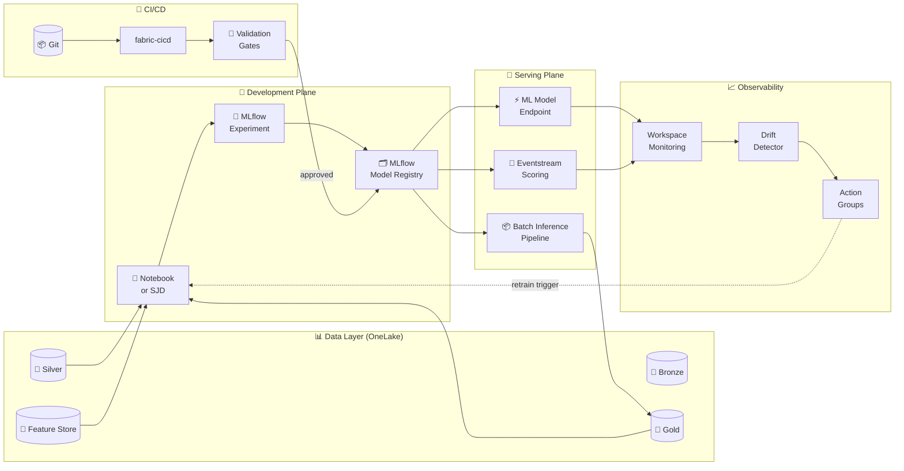

# 🚀 MLOps for Fabric Production

<div align="center" markdown>

**End-to-End ML Lifecycle Management on Microsoft Fabric — Anchor Doc for Wave 2**


</div>

---

**Last Updated:** `2026-04-27` | **Version:** 1.0.0 | **Anchor for:** Wave 2 ML/AI doc set

---

## 🎯 Overview

**MLOps** is the discipline of running machine-learning workloads in production with the same rigor we apply to software: version control, automated testing, CI/CD, observability, incident response, and SLOs. Most Fabric customers ship demo-grade ML — a notebook that produces a model — and stop there. This document covers the production backbone every Fabric ML team needs.

### What "Production-Grade ML" Means in Fabric

| Aspect | Demo-Grade | Production-Grade |
|--------|-----------|------------------|
| **Versioning** | Notebook in workspace | Code in Git, models in MLflow registry, data in Delta with time-travel |
| **Reproducibility** | "Works on my notebook" | Every model has captured: code SHA, data version, env, hyperparameters |
| **Validation** | Visual inspection of metrics | Automated gates: holdout AUC, drift, fairness, latency, calibration |
| **Deployment** | Manual export → batch score | CI/CD via fabric-cicd, canary rollout, automated rollback |
| **Monitoring** | None or "looks fine" | Drift, performance decay, business KPIs, alerts wired to runbooks |
| **Retraining** | "When someone notices" | Automated triggers: schedule, drift, performance, data volume |
| **Incident response** | Ad-hoc panic | Runbooks, on-call rotation, postmortems |

### Where Fabric Fits

Fabric provides the **integrated ML platform**: MLflow tracking, ML Model items, ML Model Endpoints (preview), AutoML, Spark for distributed training, OneLake for feature storage, and Workspace Monitoring for telemetry. This guide ties those pieces together into a coherent production workflow.

> 📝 **Scope:** This is the anchor doc for Phase 14 Wave 2. Sub-topics get their own deep-dive docs: [model monitoring & drift detection](model-monitoring-drift-detection.md), [feature store on OneLake](feature-store-onelake.md), [responsible AI](responsible-ai-framework.md), [LLM cost tracking](llm-cost-tracking.md), [RAG patterns](../features/rag-patterns-deep-dive.md), [prompt engineering](../features/prompt-engineering-fabric.md), [evaluation harnesses](../features/eval-harness-llm.md).

---

## 🏗️ MLOps Reference Architecture



### Component Map

| Component | Fabric Item | Purpose |
|-----------|-------------|---------|
| Feature Store | Lakehouse table or shortcut | Versioned features w/ point-in-time correctness |
| Experiment Tracking | MLflow (built-in) | Every training run logged |
| Model Registry | ML Model item | Versioned, governed model artifacts |
| Training Job | Spark Job Definition or Notebook | Reproducible training runs |
| Batch Inference | Data Pipeline + Notebook | Scheduled scoring of large batches |
| Online Inference | ML Model Endpoint (Preview) | RESTful serving for low-latency apps |
| Stream Inference | Eventstream + Notebook activity | Real-time scoring on event streams |
| Drift Monitoring | Workspace Monitoring + Eventhouse | Statistical + performance drift |
| Alerting | Action Groups + Data Activator | Fan-out to PagerDuty / Teams / runbook |
| CI/CD | GitHub Actions + fabric-cicd | Promote model + code dev → staging → prod |

---

## 🗂️ Model Registry (MLflow in Fabric)

Fabric's MLflow tracking server is workspace-scoped. The **ML Model item** wraps an MLflow registered model with Fabric-native governance, lineage, and access control.

### Registry Stages

```
   None ──▶ Staging ──▶ Production ──▶ Archived
              ▲             │
              └─────────────┘
              (rollback path)
```

Use stage transitions, not version-pinning, for rollouts. Consumers reference `models:/{name}/Production` rather than a hardcoded version.

### Naming Conventions

```
{domain}-{task}-{algo}                          ← model name
casino-slot-revenue-forecast-prophet
casino-fraud-detection-lightgbm
financial-aml-graph-gnn
healthcare-readmission-xgboost
```

### Logging a Run (canonical pattern)

```python
import mlflow
from mlflow.models.signature import infer_signature

mlflow.set_experiment("/Shared/casino-slot-revenue-forecast")

with mlflow.start_run() as run:
    mlflow.log_params({
        "algo": "prophet",
        "lookback_days": 90,
        "seasonality_mode": "multiplicative",
    })

    model = train_prophet(...)

    metrics = evaluate(model, holdout_df)
    mlflow.log_metrics({
        "rmse": metrics["rmse"],
        "mape": metrics["mape"],
        "smape": metrics["smape"],
    })

    # Capture data lineage explicitly
    mlflow.log_param("training_data_table", "lh_gold.fact_daily_slot_revenue")
    mlflow.log_param("training_data_version", spark.sql(
        "DESCRIBE HISTORY lh_gold.fact_daily_slot_revenue LIMIT 1"
    ).collect()[0]["version"])

    # Capture code SHA for reproducibility
    mlflow.log_param("git_sha", os.environ.get("GIT_SHA", "unknown"))

    signature = infer_signature(holdout_df.drop("revenue"), holdout_df["revenue"])
    mlflow.prophet.log_model(
        model,
        "model",
        signature=signature,
        registered_model_name="casino-slot-revenue-forecast-prophet",
    )
```

### Promoting to Production

Use the MLflow client; never click-promote in the UI for production models.

```python
from mlflow.tracking import MlflowClient
client = MlflowClient()

client.transition_model_version_stage(
    name="casino-slot-revenue-forecast-prophet",
    version=42,
    stage="Production",
    archive_existing_versions=True,  # auto-archive old prod
)
```

Promotion **must** be gated by [Validation Gates](#-model-validation-gates) (CI check before merge). Manual promotion is only allowed for hotfixes via the [tenant migration runbook](../runbooks/tenant-migration-dev-staging-prod.md#hotfix-procedure).

---

## 🧪 Experiment Tracking

### Discipline Rules

1. **One experiment per (domain, task)** — not per developer, not per branch
2. **Every run captures**: data version, code SHA, env (Spark runtime, lib versions), params, metrics, artifacts (model + plots)
3. **Tag runs with**: branch, PR number, author, intent (`exploratory`, `baseline`, `production-candidate`)
4. **Parent/child runs** for hyperparameter sweeps so the parent shows the search space and the children show individual trials
5. **Never delete runs** — archive, don't delete; runs are evidence for incidents and audits

### Tagging Pattern

```python
mlflow.set_tags({
    "branch": os.environ.get("GIT_BRANCH"),
    "pr_number": os.environ.get("GITHUB_PR_NUMBER"),
    "author": os.environ.get("GITHUB_ACTOR"),
    "intent": "production-candidate",  # or "exploratory" / "baseline" / "rollback-test"
    "domain": "casino",
    "compliance_review": "approved-2026-04-15",  # if model touches regulated data
})
```

---

## 🏋️ Training Pipelines

Three patterns supported in Fabric, by use-case complexity:

### Pattern 1: Notebook-Driven (development & light prod)

Best for: data scientists prototyping, batch retraining < 1 hour, single GPU tasks.

```yaml
# Fabric Data Pipeline
- name: train-slot-revenue-forecast
  type: TridentNotebook
  notebook: 02_ml_revenue_forecast_train
  parameters:
    training_window_days: 365
    target_table: lh_gold.fact_daily_slot_revenue
  trigger: schedule(0 2 * * *)  # daily 2am
```

### Pattern 2: Spark Job Definition (heavy distributed training)

Best for: large datasets > 100M rows, distributed training, custom Spark configs.

```python
# spark_job_definition.json
{
    "executableFile": "train.py",
    "defaultLakehouse": "lh_silver",
    "command": [
        "spark-submit",
        "--conf", "spark.executor.instances=20",
        "--conf", "spark.executor.memory=32g",
        "--py-files", "src.zip",
        "train.py",
        "--training-window", "365",
        "--target", "lh_gold.fact_daily_revenue"
    ]
}
```

### Pattern 3: AutoML Experiment (automated baseline)

Best for: tabular tasks, fast time-to-baseline, when human selection adds little.

```python
from synapse.ml.train import AutoMLConfig

config = AutoMLConfig(
    task="regression",
    primary_metric="r2_score",
    training_data=df_train,
    label_column_name="revenue",
    cv_folds=5,
    experiment_timeout_hours=2,
    max_concurrent_iterations=4,
)
config.run()
```

> Pattern 3 (AutoML) is great for the **first model** in a domain. Move to Pattern 1 or 2 once you understand the problem space and need custom features / custom loss / custom evaluation.

---

## 🚦 Model Validation Gates

Every model promotion to Production must pass these gates **automatically** (in CI, not manually):

### Gate 1 — Performance Threshold

```python
def gate_performance(metrics: dict, baseline_metrics: dict) -> bool:
    """New model must be ≥ 95% of baseline performance + within absolute floor."""
    if metrics["auc"] < 0.75:  # absolute floor
        return False
    if metrics["auc"] < 0.95 * baseline_metrics["auc"]:  # relative floor
        return False
    return True
```

### Gate 2 — Holdout Stability

Run inference on a **fixed, never-touched holdout set** and compare. Catches data leakage.

```python
def gate_holdout(model, holdout_path: str, max_drift_pct: float = 5.0) -> bool:
    holdout = spark.table(holdout_path)
    pred_drift = (model.predict(holdout) - holdout.expected_pred).abs().mean()
    return pred_drift / holdout.expected_pred.mean() < max_drift_pct / 100
```

### Gate 3 — Fairness (regulated domains only)

For lending, healthcare, hiring, criminal justice. See [Responsible AI Framework](responsible-ai-framework.md).

```python
def gate_fairness(model, holdout, protected_attrs: list[str]) -> bool:
    for attr in protected_attrs:
        dpr = demographic_parity_ratio(model, holdout, attr)
        if dpr < 0.8:  # 80% rule
            return False
    return True
```

### Gate 4 — Latency (online endpoints only)

```python
def gate_latency(model_uri: str, sample_df, p99_ms_target: int = 100) -> bool:
    latencies = [time_inference(model_uri, sample_df.iloc[[i]]) for i in range(1000)]
    p99 = numpy.percentile(latencies, 99)
    return p99 < p99_ms_target
```

### Gate 5 — Calibration

Probabilities should be calibrated; predicted 70% should mean ~70% positive in reality.

```python
from sklearn.calibration import calibration_curve

def gate_calibration(y_true, y_pred_proba, max_ece: float = 0.1) -> bool:
    ece = expected_calibration_error(y_true, y_pred_proba, n_bins=10)
    return ece < max_ece
```

### CI Wiring (`.github/workflows/ml-promotion.yml`)

```yaml
name: ML Model Promotion Gate
on:
  pull_request:
    paths: ['notebooks/ml/**', 'src/ml/**']
jobs:
  validate:
    runs-on: ubuntu-latest
    steps:
      - uses: actions/checkout@v4
      - run: pytest tests/ml/test_validation_gates.py
      - run: python scripts/run_holdout_gate.py
      - run: python scripts/run_fairness_gate.py
        if: contains(github.event.pull_request.labels.*.name, 'regulated-domain')
```

---

## 🚢 Deployment Patterns

### Pattern A: Batch Inference (most common)

```python
# notebooks/ml/batch_score.py
model_uri = f"models:/casino-slot-revenue-forecast-prophet/Production"
model = mlflow.prophet.load_model(model_uri)

unscored = spark.table("lh_silver.daily_slot_aggregates").filter("predicted_revenue IS NULL")
predictions = model.predict(unscored.toPandas())
spark.createDataFrame(predictions).write.mode("append").saveAsTable("lh_gold.slot_revenue_forecasts")
```

Trigger: Fabric Pipeline scheduled nightly. SLA: complete within 2-hour window.

### Pattern B: Online Endpoint (low-latency apps)

```python
# Deploy via REST API (or Fabric Portal)
import requests

response = requests.post(
    f"https://api.fabric.microsoft.com/v1/workspaces/{ws_id}/mlmodels/{model_id}/endpoints",
    headers={"Authorization": f"Bearer {token}"},
    json={
        "name": "slot-revenue-prod",
        "modelVersion": "42",
        "instanceType": "Standard_DS3_v2",
        "minInstances": 2,  # for HA
        "maxInstances": 10,  # autoscale
        "trafficSplit": {"42": 100},
    }
)
```

Use online endpoints when:
- App needs single-record latency < 200ms
- Personalization or real-time decisioning
- API consumed by external systems

### Pattern C: Stream Inference (real-time)

```python
# Eventstream → notebook activity → predict → Eventhouse
from pyspark.sql.functions import udf

model_uri = "models:/casino-fraud-detection-lightgbm/Production"
model = mlflow.lightgbm.load_model(model_uri)

@udf("double")
def score(features):
    return float(model.predict(features))

stream = (spark.readStream.format("eventhubs").options(**eh_conf).load()
    .withColumn("fraud_score", score(struct("amount", "merchant_cat", ...)))
    .writeStream.format("delta").outputMode("append")
    .toTable("lh_gold.fraud_scores"))
```

---

## 🐤 Canary, A/B, and Champion-Challenger

### Canary Rollout

Use ML Model Endpoint traffic splits:

```
v41 (current prod): 95% traffic
v42 (new):           5% traffic
```

Monitor key metrics for 24-72 hours. Promote to 50/50, then 100%/0%. Roll back immediately if:

- Error rate increases
- Latency p99 degrades
- Business KPI moves wrong direction (calibration check)

### A/B Testing

Two models, both production-quality. Split deterministic by user/transaction ID hash. Run 2+ weeks. Statistical test on primary metric. **Pre-register** the test plan before running — no fishing for significance.

### Champion-Challenger

Continuous evaluation: production = champion. New candidate = challenger. Both score same data. Compare blind. When challenger beats champion on agreed metrics for N consecutive evaluation windows, promote challenger to champion.

```python
# Daily challenger evaluation
champion = mlflow.load_model("models:/{name}/Production")
challenger = mlflow.load_model("models:/{name}/Staging")

for _ in range(num_days):
    today = ...  # today's actual data
    champ_metrics = evaluate(champion, today)
    chall_metrics = evaluate(challenger, today)
    log_to_table("lh_gold.ml_champion_challenger", champ_metrics, chall_metrics)

# Promotion check (e.g., 14-day rolling window, p<0.05)
if challenger_wins_significantly(window_days=14):
    promote_to_production(challenger)
```

---

## 📈 Production Monitoring

See [Model Monitoring & Drift Detection](model-monitoring-drift-detection.md) for full coverage. Briefly, every production model emits:

| Signal | Type | Alert Threshold |
|--------|------|----------------|
| Prediction distribution | Statistical drift (PSI, KS) | PSI > 0.2 |
| Input feature drift | Per-feature drift | Top-3 features PSI > 0.25 |
| Performance | Realized vs predicted | AUC degradation > 5% |
| Latency | p99 inference time | > target SLO |
| Error rate | 5xx + timeout | > 1% sustained 5 min |
| Volume | Predictions per hour | < 50% of baseline |
| Calibration | Reliability diagram | ECE > 0.1 |

Wire to Action Groups via [observability stack](operations/observability-stack.md).

---

## 🔁 Retraining Triggers

| Trigger Type | Detection | Action |
|--------------|-----------|--------|
| **Schedule** | Cron | Retrain weekly/monthly regardless of drift |
| **Drift** | Workspace Monitoring KQL | Retrain when PSI > 0.2 sustained |
| **Performance** | Realized metric below threshold | Retrain when AUC drops 5% |
| **Volume** | New labeled data > N | Retrain when training set grows ≥ 10% |
| **Concept change** | Business event flag | Manual: regulation change, product change, market shift |
| **Anomaly** | Outlier rate spike | Investigate first, retrain only after root cause found |

### Drift-Driven Retrain (KQL → Action Group → Pipeline)

```kql
// Workspace Monitoring KQL
ModelDriftMetrics
| where ModelName == "casino-slot-revenue-forecast-prophet"
| where Window == "7d"
| where PSI > 0.2
| top 1 by TimeGenerated
```

Wire as Azure Monitor scheduled query alert → Action Group → Logic App → Fabric Pipeline trigger (`/v1/workspaces/{ws}/items/{pipeline}/jobs/instances?jobType=Pipeline`).

---

## 💰 Cost Attribution & FinOps

### Cost Surfaces

| Surface | Driver | Mitigation |
|---------|--------|------------|
| Spark training | Executor count × duration | Right-size; use Job pools, not interactive sessions |
| AutoML | trial count × duration × parallelism | Cap trial budget, use early stopping |
| Online endpoint | Instance count × hours + per-1000 inference | Autoscale min 1 / max N; batch when possible |
| MLflow artifacts | OneLake storage | Lifecycle policy: archive runs > 90 days |
| Drift monitoring | Eventhouse + KQL | Sample, don't score every record |
| LLM API calls | Token count | See [LLM Cost Tracking](llm-cost-tracking.md) |

### Cost Attribution

Tag every job with `cost_center`, `domain`, `model`, `intent`. Roll up via Workspace Monitoring + Capacity Metrics → Power BI cost dashboard.

```python
spark.conf.set("spark.fabric.cost_center", "casino-data-science")
spark.conf.set("spark.fabric.model", "casino-slot-revenue-forecast-prophet")
```

---

## 🎰 Casino Implementation

| Model | Use Case | Pattern | Compliance Notes |
|-------|----------|---------|------------------|
| Slot Revenue Forecast | Daily revenue projection per machine | Batch (Pattern A) | None — aggregated only |
| Player Churn | Identify at-risk players | Batch | PII handling: features hashed |
| Fraud Detection | Real-time AML/structuring | Stream (Pattern C) | BSA/SAR — see compliance layer |
| Slot Anomaly | Hardware fault prediction | Stream | None — operational only |
| Marketing Lift | Promotion uplift modeling | Batch | Opt-in tracking required |

See [notebooks/ml/01_ml_player_churn_prediction.py](https://github.com/fgarofalo56/Supercharge_Microsoft_Fabric/blob/main/notebooks/ml/01_ml_player_churn_prediction.py) and [notebooks/ml/02_ml_fraud_detection.py](https://github.com/fgarofalo56/Supercharge_Microsoft_Fabric/blob/main/notebooks/ml/02_ml_fraud_detection.py).

---

## 🏛️ Federal Implementation

| Model | Agency | Use Case | Compliance |
|-------|--------|----------|------------|
| Crop Yield Forecast | USDA | Regional yield prediction | None — public data |
| Loan Default Risk | SBA | Underwriting | ECOA, fairness gate required |
| Storm Severity | NOAA | Severity classification | None — public safety |
| Air Quality Forecast | EPA | AQI prediction | None — public data |
| Earthquake Magnitude | DOI/USGS | Real-time magnitude | None — public safety |
| Antitrust Risk Score | DOJ | Merger review prioritization | Sensitive — restricted access |

For regulated federal use cases (DOJ, lending), the [Responsible AI Framework](responsible-ai-framework.md) governance gates are mandatory.

---

## 🚫 Anti-Patterns

| Anti-Pattern | Why It Hurts | What to Do Instead |
|--------------|--------------|--------------------|
| **Notebook-only model** | Not reproducible; no version, no rollback | Register every prod model in MLflow |
| **Manual UI promotion to Production** | No audit trail, no validation gates | CI-driven promotion via MLflow client |
| **Same model serves dev + prod traffic** | Bad deploy = customer impact | Separate workspaces; canary rollout |
| **No holdout set** | Reported metrics overfit to dev/test split | Permanent, never-touched holdout in OneLake |
| **Drift detection without retraining trigger** | Alerts fatigue, no action | Wire alerts to retraining pipeline |
| **Single-version pin in client code** | Forces redeploy for every model update | Use stage references (`models:/{name}/Production`) |
| **Logging metrics but not data version** | Can't reproduce a bad run | Always log Delta version of training data |
| **No fairness check on regulated models** | Legal/compliance liability | Mandatory gate for lending, healthcare, hiring |
| **AutoML in production without review** | Hidden complexity, hidden failure modes | Use AutoML for baseline; productionize as Pattern 1 or 2 |
| **No retraining schedule for stable models** | Quiet decay, late detection | Monthly retrain even without drift signal |

---

## 📋 Production Readiness Checklist

Before promoting any model to Production stage:

- [ ] Code in Git, on `main` branch, PR reviewed
- [ ] Model registered in MLflow with name, version, stage
- [ ] Training data version logged (Delta version or partition spec)
- [ ] Code SHA logged
- [ ] Environment captured (Spark runtime, lib versions, env file)
- [ ] All 5 validation gates pass: performance, holdout, fairness (if regulated), latency (if online), calibration
- [ ] Holdout set excluded from training/validation (audit-trail confirmed)
- [ ] Monitoring wired: drift, performance, latency, error, volume
- [ ] Alerts wired to Action Group with correct severity routing
- [ ] Runbook exists for the model's failure modes
- [ ] Rollback procedure documented and tested
- [ ] Retraining trigger defined (schedule, drift, performance, or hybrid)
- [ ] Cost-center tag set
- [ ] Model card published (purpose, training data, performance, limitations, fairness)
- [ ] On-call team notified of new model
- [ ] Postmortem template created for first 30-day incident review
- [ ] Compliance sign-off obtained (if regulated domain)

---

## 📚 References

### Microsoft Fabric Documentation
- [MLflow Tracking in Fabric](https://learn.microsoft.com/fabric/data-science/mlflow-experiments-overview)
- [ML Model Items](https://learn.microsoft.com/fabric/data-science/machine-learning-model)
- [ML Model Endpoints](https://learn.microsoft.com/fabric/data-science/model-endpoints) (Preview)
- [AutoML in Fabric](https://learn.microsoft.com/fabric/data-science/automated-ml/automl-overview)

### Industry Standards
- Google SRE Book — [SLO/SLI principles applied to ML](https://sre.google/sre-book/)
- Microsoft Responsible AI Standard
- Martin Fowler — [Continuous Delivery for Machine Learning (CD4ML)](https://martinfowler.com/articles/cd4ml.html)

### Related Wave 2 Docs
- [Model Monitoring & Drift Detection](model-monitoring-drift-detection.md)
- [Feature Store on OneLake](feature-store-onelake.md)
- [Responsible AI Framework](responsible-ai-framework.md)
- [LLM Cost Tracking](llm-cost-tracking.md)
- [RAG Patterns Deep Dive](../features/rag-patterns-deep-dive.md)
- [Prompt Engineering for Fabric](../features/prompt-engineering-fabric.md)
- [LLM Evaluation Harness](../features/eval-harness-llm.md)

### Related Operational Docs (Wave 1)
- [Incident Response Template](../runbooks/incident-response-template.md)
- [SLO/SLI for Fabric](operations/slo-sli-fabric.md)
- [Tenant Migration Runbook](../runbooks/tenant-migration-dev-staging-prod.md)
- [Observability Stack](operations/observability-stack.md)
- [On-Call Rotation Handbook](operations/oncall-rotation-handbook.md)

### Related Existing Docs
- [AutoML & Model Endpoints](../features/automl-model-endpoints.md)
- [Fabric IQ](../features/fabric-iq.md)
- [Data Agents](../features/data-agents.md)

---

[⬆️ Back to Top](#-mlops-for-fabric-production) | [📚 Best Practices Index](index.md) | [🏠 Home](../index.md)
