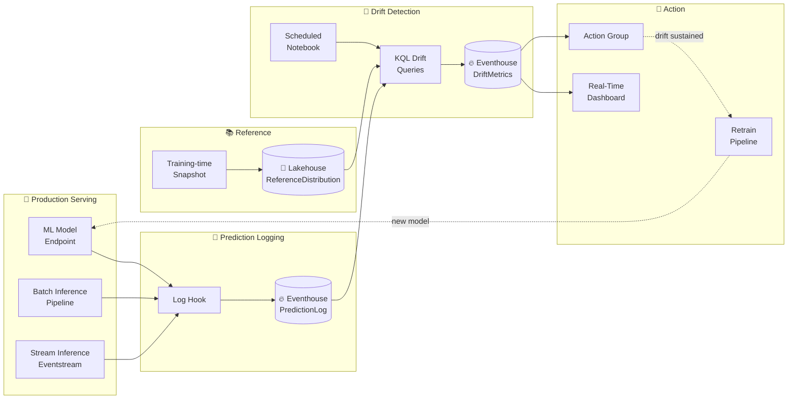

# 📡 Model Monitoring & Drift Detection

<div align="center" markdown>

**Production Drift Detection on Microsoft Fabric — Workspace Monitoring + Eventhouse + KQL**


</div>

---

**Last Updated:** `2026-04-27` | **Version:** 1.0.0 | **Wave 2 Sub-Topic of:** [MLOps for Fabric Production](mlops-fabric-production.md)

---

## 🎯 Overview

Models decay. The world they predict on changes faster than the world they were trained on. Without drift detection, you only learn that a model has gone bad **after** it's hurt the business — missed revenue, compliance failure, customer harm. Drift detection is the "smoke alarm" of production ML: it fires before the fire spreads.

This is the deep-dive companion to the [MLOps for Fabric Production](mlops-fabric-production.md) anchor. It covers four drift categories, five statistical methods, KQL implementations against Workspace Monitoring + Eventhouse, alert wiring, retraining triggers, and false-positive mitigation.

### Why Four Drift Types — Not Just "Drift"

Most teams say "drift" and mean "the input data looks different." That's only one of four failure modes:

| Drift Type | What Changes | Business Impact | Detection Cost |
|------------|--------------|-----------------|----------------|
| **Data drift** | Input feature distributions | Predictions on data the model never saw | Low — log inputs, compare distributions |
| **Prediction drift** | Output distribution | Score distribution shifts on similar inputs | Low — log predictions, compare |
| **Performance drift** | Accuracy / AUC / RMSE | Model decisions get worse | Medium — needs ground truth |
| **Concept drift** | Relationship between X and y | Same inputs → different correct answer | High — importance shift, A/B compare |

Each type has a different signal, test, and remediation. A single "drift detected" alert is useless; on-call needs to know **which kind** fired — retrain, investigate input pipeline, or escalate to product.

### Where This Lives in Fabric

Three native surfaces: **Workspace Monitoring** (built-in endpoint metrics; KQL-queryable), **Eventhouse** (high-cardinality storage for prediction logs, feature snapshots, drift metrics), **Real-Time Dashboards** (trend visualization). Add a Lakehouse-stored **reference distribution** (the training-time feature snapshot) and you have full drift coverage.

> 📝 **Scope:** This doc covers detection. For remediation, see [MLOps for Fabric Production § Retraining Triggers](mlops-fabric-production.md#-retraining-triggers) and [§ Canary, A/B, and Champion-Challenger](mlops-fabric-production.md#-canary-ab-and-champion-challenger).

---

## 🧭 Drift Type Taxonomy

| Drift Type | Formal Definition | Signal | Tests | Typical Threshold |
|------------|-------------------|--------|-------|-------------------|
| **Data drift** (covariate shift) | P(X) changes; P(y\|X) stable | Per-feature distribution shift | PSI, KS, Chi-square, Wasserstein | PSI > 0.2 (moderate), > 0.25 (severe) |
| **Prediction drift** | P(ŷ) changes | Output score distribution shift | PSI on score buckets, KS on continuous score | PSI > 0.2 |
| **Performance drift** | Realized metric degrades | AUC / accuracy / RMSE vs reference window | Direct metric comparison + significance test | AUC drop > 5% or below absolute floor |
| **Concept drift** | P(y\|X) changes; relationship shifts | Performance drops despite stable inputs | Sliding-window performance, feature-importance shift | Performance drift with PSI < 0.1 on inputs |
| **Label drift** (prior shift) | P(y) changes | Target-class distribution shift | Chi-square on label distribution | Chi-square p < 0.01, large effect size |

### Decision Tree: Which Drift Fired?

```
Performance dropped?
├── Yes → Check input PSI
│         ├── PSI high (> 0.2) → Data drift caused it; investigate upstream
│         ├── PSI normal (< 0.1) → Concept drift; relationship has changed (retrain, possibly rebuild)
│         └── PSI medium (0.1–0.2) → Mixed; investigate both
│
└── No (performance stable) → Is prediction distribution shifted?
          ├── Yes + inputs shifted → Data drift, but model is robust (monitor; lower urgency)
          ├── Yes + inputs stable → Suspicious; likely instrumentation bug, not real drift
          └── No → Healthy
```

### Label Drift — A Special Case

Label drift (P(y) shift) is detectable only when ground truth arrives. In casino fraud detection, labels arrive after investigators close the case — sometimes weeks later. In USDA crop yield, labels arrive at harvest — months later. Label drift detection must operate on the **delayed** label stream and compare to the prior-period label distribution. See [§ Performance Drift Patterns — Proxy Metrics](#-performance-drift-patterns) for what to do while waiting.

---

## 📐 Statistical Methods

Five methods cover almost every drift detection scenario you'll meet. Each is implementable in KQL or PySpark and tested against the reference distribution stored in the Lakehouse.

### PSI — Population Stability Index

**Use when:** Feature is binned (continuous discretized into deciles, or categorical). Most common drift metric.

**Formula:** `PSI = Σ (actual% - expected%) × ln(actual% / expected%)`

**Thresholds (industry-standard):**

| PSI | Interpretation | Action |
|-----|---------------|--------|
| < 0.1 | No significant change | Continue monitoring |
| 0.1 – 0.2 | Moderate change | Investigate; raise WARN |
| > 0.2 | Significant change | Trigger retraining evaluation |
| > 0.25 | Severe drift | Page on-call; freeze new traffic |

**KQL:**

```kql
// PSI between current 7-day window and reference distribution
let reference = ReferenceDistribution
    | where ModelName == "casino-player-churn-lightgbm" and FeatureName == "avg_daily_spend"
    | project Bucket, ExpectedPct;
let current = PredictionLog
    | where ModelName == "casino-player-churn-lightgbm"
    | where TimeGenerated > ago(7d)
    | summarize ActualCount = count() by Bucket = bin(avg_daily_spend, 50.0)
    | extend ActualPct = todouble(ActualCount) / toscalar(PredictionLog
        | where ModelName == "casino-player-churn-lightgbm"
        | where TimeGenerated > ago(7d) | count);
reference
| join kind=fullouter (current) on Bucket
| extend ExpectedPct = coalesce(ExpectedPct, 0.0001), ActualPct = coalesce(ActualPct, 0.0001)
| extend PSI_contrib = (ActualPct - ExpectedPct) * log(ActualPct / ExpectedPct)
| summarize PSI = sum(PSI_contrib)
```

**PySpark (offline reference build):**

```python
from pyspark.sql.functions import col, log

def compute_psi(ref_df, cur_df, feature, n_bins=10):
    qs = ref_df.approxQuantile(feature, [i/n_bins for i in range(n_bins+1)], 0.001)
    bucketize = lambda df: df.withColumn("bucket",
        F.expr(f"width_bucket({feature}, array{tuple(qs[1:-1])})"))
    ref = bucketize(ref_df).groupBy("bucket").count().withColumnRenamed("count", "rc")
    cur = bucketize(cur_df).groupBy("bucket").count().withColumnRenamed("count", "cc")
    rt, ct = ref_df.count(), cur_df.count()
    joined = ref.join(cur, "bucket", "fullouter").fillna(1)
    return joined.withColumn("psi", (col("cc")/ct - col("rc")/rt) * log((col("cc")/ct) / (col("rc")/rt))) \
                 .agg({"psi": "sum"}).collect()[0][0]
```

### KS Test — Kolmogorov–Smirnov

**Use when:** Feature is continuous and you don't want to discretize.

**Formula:** Maximum vertical distance between the two empirical CDFs. KS statistic = `max|F_ref(x) − F_cur(x)|`.

**Threshold:** Reject null at p < 0.01 with effect size > 0.1 (D-statistic). Bonferroni-correct when running across many features.

**KQL:**

```kql
// KS test approximation via percentile comparison
let ref_pcts = ReferenceDistribution
    | where ModelName == "casino-player-churn-lightgbm" and FeatureName == "avg_session_minutes"
    | summarize percentiles_ref = make_list(percentile_value) by FeatureName;
let cur_pcts = PredictionLog
    | where ModelName == "casino-player-churn-lightgbm"
    | where TimeGenerated > ago(7d)
    | summarize percentiles_cur = percentiles(avg_session_minutes,
        5, 10, 25, 50, 75, 90, 95);
ref_pcts
| extend ks_stat = todouble(...) // compute in notebook for full KS
```

> KQL approximates KS via percentile binning. For full KS p-value, run a daily PySpark job (`scipy.stats.ks_2samp`) over a sample.

### Chi-Square — Categorical Drift

**Use when:** Feature is categorical (region, channel, device type).

**Threshold:** p < 0.01 with Cramér's V > 0.1 (effect size).

**KQL:**

```kql
// Chi-square contributions per category
let reference = ReferenceDistribution
    | where ModelName == "casino-fraud-lightgbm" and FeatureName == "merchant_category"
    | project Category, ExpectedCount;
let current = PredictionLog
    | where ModelName == "casino-fraud-lightgbm"
    | where TimeGenerated > ago(1d)
    | summarize ObservedCount = count() by Category = merchant_category;
reference
| join kind=fullouter (current) on Category
| extend ExpectedCount = coalesce(ExpectedCount, 1.0), ObservedCount = coalesce(ObservedCount, 1.0)
| extend chi_contrib = pow(ObservedCount - ExpectedCount, 2) / ExpectedCount
| summarize chi_square = sum(chi_contrib), df = count() - 1
```

### Wasserstein Distance (Earth Mover's Distance)

**Use when:** You want a single, scale-invariant number that respects the ordering of bins. Better than PSI when bin boundaries shift slightly.

**Formula:** Minimum "work" (mass × distance) to transform one distribution into another.

**Threshold:** Domain-dependent; calibrate against historic stable periods (e.g., > 2σ of baseline = drift).

**PySpark (using `scipy`):**

```python
from scipy.stats import wasserstein_distance
ref_sample = reference_df.select("amount").sample(0.1).toPandas()["amount"]
cur_sample = current_df.select("amount").sample(0.1).toPandas()["amount"]
wd = wasserstein_distance(ref_sample, cur_sample)
mlflow.log_metric("wasserstein_amount", wd)
```

### Jensen–Shannon Divergence

**Use when:** Both distributions are categorical or binned, and you want a symmetric, bounded [0, 1] metric.

**Formula:** `JSD(P‖Q) = 0.5 × KL(P‖M) + 0.5 × KL(Q‖M)` where `M = 0.5(P+Q)`.

**Threshold:** JSD > 0.1 = notable; JSD > 0.2 = severe (similar to PSI bands).

```python
import numpy as np
from scipy.spatial.distance import jensenshannon

def jsd(p, q, epsilon=1e-9):
    p = np.array(p) + epsilon; q = np.array(q) + epsilon
    p /= p.sum(); q /= q.sum()
    return jensenshannon(p, q) ** 2  # scipy returns sqrt(JSD)
```

### Method Selection Matrix

| Feature Type | Primary | Backup | Notes |
|--------------|---------|--------|-------|
| Continuous, well-distributed | PSI | KS | PSI for dashboards; KS for significance |
| Continuous, heavy-tailed | Wasserstein | PSI on log-bins | EMD handles outliers better |
| Categorical, low cardinality (< 50) | Chi-square | JSD | |
| Categorical, high cardinality (> 50) | JSD on top-N | PSI on grouped buckets | Group rare categories into "other" |
| Binary | PSI | Two-proportion z-test | Simplest case |

---

## 🏗️ Reference Architecture



### Component Responsibilities

| Component | Fabric Item | Responsibility |
|-----------|-------------|----------------|
| Log Hook | Notebook helper / endpoint sidecar | Emit `(input, prediction, model_version, timestamp)` per call |
| PredictionLog | Eventhouse table (hot 30d / cold 365d) | Append-only inference log |
| ReferenceDistribution | Delta table in `lh_gold` (mirrored to Eventhouse via Shortcut) | Training-time bin/percentile/category counts |
| Drift Notebook | Notebook + Pipeline (hourly/daily) | Joins log + reference; writes `DriftMetrics` |
| DriftMetrics | Eventhouse table | `(model, feature, metric, value, window_end)` time-series |
| Dashboard | Real-Time Dashboard | Per-feature drift, prediction histogram, performance trend |
| Alert | Workspace Monitoring → Action Group | KQL-driven scheduled alerts |
| Retrain Trigger | Logic App / Function + Fabric Pipeline | Consume alerts → kick off training |

---

## ⚙️ Implementation in Fabric

### Step 1 — Log Predictions to Eventhouse

Wrap every inference call to emit a structured record: model name, model version, request id, inputs (or hashed/quantized for PII), prediction, score, latency, timestamp.

```python
# notebooks/ml/_helpers/prediction_logger.py
import json, uuid
from datetime import datetime
from azure.kusto.data import KustoConnectionStringBuilder
from azure.kusto.ingest import QueuedIngestClient, IngestionProperties, DataFormat

_client = QueuedIngestClient(KustoConnectionStringBuilder.with_aad_managed_service_identity(
    "https://ingest-<cluster>.kusto.fabric.microsoft.com"))

def log_prediction(model_name, model_version, request_id, features, prediction, score, latency_ms):
    record = {
        "TimeGenerated": datetime.utcnow().isoformat(),
        "ModelName": model_name, "ModelVersion": model_version,
        "RequestId": request_id or str(uuid.uuid4()),
        "Features": json.dumps(features), "Prediction": str(prediction),
        "Score": float(score), "LatencyMs": float(latency_ms),
    }
    _client.ingest_from_stream(json.dumps(record).encode("utf-8"),
        IngestionProperties(database="ml_monitoring", table="PredictionLog",
                            data_format=DataFormat.JSON))
```

> 📝 **Hot path note:** For low-latency endpoints, use **fire-and-forget** logging (queue, don't block the response). For batch scoring, log in micro-batches of 10–50K records using `ingest_from_dataframe`.

### Step 2 — Build Reference Distribution at Training Time

```python
# notebooks/ml/02_build_reference_distribution.py
import mlflow
from pyspark.sql import functions as F

NUMERIC = ["avg_daily_spend", "avg_session_minutes", "days_since_last_visit"]
CATEGORICAL = ["preferred_game", "tier", "channel"]
MODEL, VERSION = "casino-player-churn-lightgbm", "v42"
ref_df = spark.table("lh_gold.gold_player_360_training"); total = ref_df.count()
records = []

for feat in NUMERIC:
    qs = ref_df.approxQuantile(feat, [i/10 for i in range(11)], 0.001)
    binned = ref_df.withColumn("bucket",
        F.expr(f"width_bucket({feat}, array{tuple(qs[1:-1])})").cast("string"))
    for r in binned.groupBy("bucket").count().collect():
        records.append((MODEL, VERSION, feat, r["bucket"], r["count"]/total, qs))

for feat in CATEGORICAL:
    for r in ref_df.groupBy(feat).count().orderBy(F.desc("count")).limit(50).collect():
        records.append((MODEL, VERSION, feat, r[feat], r["count"]/total, None))

spark.createDataFrame(records,
    ["ModelName", "ModelVersion", "FeatureName", "Bucket", "ExpectedPct", "Quantiles"]) \
    .write.mode("overwrite").saveAsTable("lh_gold.reference_distribution")

mlflow.log_param("reference_distribution_table", "lh_gold.reference_distribution")
mlflow.log_param("reference_distribution_version",
    spark.sql("DESCRIBE HISTORY lh_gold.reference_distribution LIMIT 1").collect()[0]["version"])
```

### Step 3 — Schedule Drift Computation

```yaml
# Fabric Pipeline (drift_detection_daily)
- name: compute-drift-casino-churn
  type: TridentNotebook
  notebook: 03_drift_detection_daily
  parameters:
    model_name: casino-player-churn-lightgbm
    window_hours: 24
    reference_table: lh_gold.reference_distribution
    output_eventhouse_db: ml_monitoring
    output_table: DriftMetrics
  trigger: schedule(0 4 * * *)  # daily 4am
```

The notebook reads `PredictionLog` (last 24h) + `ReferenceDistribution`, computes PSI/KS/Chi-square per feature, and writes to `DriftMetrics`.

### Step 4 — Real-Time Dashboard

Build a Real-Time Dashboard against `DriftMetrics` with tiles for:

- Top-5 drifted features over the last 24 hours (heatmap)
- PSI trend per feature, last 30 days (line chart)
- Prediction-score histogram, last 24h vs reference (overlay)
- Performance metrics (when ground truth available) vs reference window

See [Real-Time Intelligence](../features/real-time-intelligence.md) for dashboard authoring patterns.

---

## 🔍 KQL Drift Library

Five runnable queries. All assume `PredictionLog` and `DriftMetrics` tables in Eventhouse, and `ReferenceDistribution` materialized into Eventhouse via Shortcut from `lh_gold`.

### Query 1 — PSI per feature, last 24 hours

```kql
let model = "casino-player-churn-lightgbm";
let win_start = ago(1d);
let total = toscalar(PredictionLog
    | where ModelName == model and TimeGenerated > win_start
    | count);
PredictionLog
| where ModelName == model and TimeGenerated > win_start
| extend feats = parse_json(Features)
| mv-expand feats
| extend FeatureName = tostring(bag_keys(feats)[0]),
         FeatureValue = tostring(feats[tostring(bag_keys(feats)[0])])
| summarize ActualCount = count() by FeatureName, Bucket = FeatureValue
| extend ActualPct = todouble(ActualCount) / total
| join kind=inner (
    ReferenceDistribution
    | where ModelName == model
    | project FeatureName, Bucket, ExpectedPct
) on FeatureName, Bucket
| extend ExpectedPct = iff(ExpectedPct == 0, 0.0001, ExpectedPct),
         ActualPct = iff(ActualPct == 0, 0.0001, ActualPct)
| extend psi_contrib = (ActualPct - ExpectedPct) * log(ActualPct / ExpectedPct)
| summarize PSI = sum(psi_contrib) by FeatureName
| order by PSI desc
```

### Query 2 — KS-like statistic per numeric feature

```kql
let model = "casino-player-churn-lightgbm";
PredictionLog
| where ModelName == model and TimeGenerated > ago(1d)
| extend feats = parse_json(Features), v = todouble(feats.avg_daily_spend)
| summarize cp = percentiles(v, 5, 25, 50, 75, 95)
| extend FeatureName = "avg_daily_spend",
         KS_stat = max_of(
             abs(cp.percentile_v_5  - toscalar(ReferenceDistribution | where FeatureName=="avg_daily_spend" and Bucket=="p5"  | project ExpectedPct)),
             abs(cp.percentile_v_50 - toscalar(ReferenceDistribution | where FeatureName=="avg_daily_spend" and Bucket=="p50" | project ExpectedPct)),
             abs(cp.percentile_v_95 - toscalar(ReferenceDistribution | where FeatureName=="avg_daily_spend" and Bucket=="p95" | project ExpectedPct))
         )
| project FeatureName, KS_stat
```

### Query 3 — Prediction distribution shift (output drift)

```kql
let model = "casino-player-churn-lightgbm";
let cur = PredictionLog
    | where ModelName == model and TimeGenerated > ago(1d)
    | summarize cur_count = count() by ScoreBucket = bin(Score, 0.1)
    | extend cur_pct = todouble(cur_count) / toscalar(PredictionLog
        | where ModelName == model and TimeGenerated > ago(1d) | count);
let ref = ReferenceDistribution
    | where ModelName == model and FeatureName == "__prediction__"
    | project ScoreBucket = todouble(Bucket), ref_pct = ExpectedPct;
cur
| join kind=fullouter (ref) on ScoreBucket
| extend cur_pct = coalesce(cur_pct, 0.0001), ref_pct = coalesce(ref_pct, 0.0001)
| extend psi_contrib = (cur_pct - ref_pct) * log(cur_pct / ref_pct)
| summarize PredictionPSI = sum(psi_contrib)
```

### Query 4 — Performance vs reference window

```kql
let model = "casino-player-churn-lightgbm";
let perf_ref = toscalar(DriftMetrics
    | where ModelName == model and MetricName == "AUC_baseline"
    | top 1 by TimeGenerated desc | project MetricValue);
DriftMetrics
| where ModelName == model and MetricName == "AUC"
| where TimeGenerated > ago(7d)
| summarize CurAUC = avg(MetricValue)
| extend RefAUC = perf_ref,
         AUC_delta = CurAUC - perf_ref,
         AUC_pct_change = (CurAUC - perf_ref) / perf_ref * 100
```

> AUC is computed in the daily reconciliation notebook (`sklearn.metrics.roc_auc_score`) and written to `DriftMetrics`. KQL handles the trend comparison.

### Query 5 — Top-N drifted features (alert candidate)

```kql
DriftMetrics
| where ModelName == "casino-player-churn-lightgbm"
| where MetricName == "PSI"
| where TimeGenerated > ago(1d)
| summarize MaxPSI = max(MetricValue) by FeatureName
| where MaxPSI > 0.2
| top 10 by MaxPSI desc
| extend Severity = case(MaxPSI > 0.25, "P1", MaxPSI > 0.2, "P2", "P3")
```

---

## 📉 Performance Drift Patterns

Performance drift requires ground truth. Three patterns by label arrival latency:

### Pattern A — Realized vs Predicted (immediate labels)

For models where ground truth arrives within minutes/hours: click-through, fraud-claim resolution, real-time forecasting.

```python
from sklearn.metrics import roc_auc_score, brier_score_loss

preds = spark.sql("""
    SELECT p.Score, r.ActualLabel
    FROM ml_monitoring.PredictionLog p
    JOIN lh_silver.realized_outcomes r ON p.RequestId = r.RequestId
    WHERE p.TimeGenerated >= current_date() - INTERVAL 1 DAY
      AND p.ModelName = 'casino-fraud-lightgbm'
""").toPandas()

auc = roc_auc_score(preds.ActualLabel, preds.Score)
brier = brier_score_loss(preds.ActualLabel, preds.Score)
mlflow.log_metric("daily_auc", auc); mlflow.log_metric("daily_brier", brier)

spark.createDataFrame([(datetime.utcnow(), "casino-fraud-lightgbm", "AUC", auc),
                       (datetime.utcnow(), "casino-fraud-lightgbm", "Brier", brier)],
    ["TimeGenerated", "ModelName", "MetricName", "MetricValue"]) \
    .write.mode("append").saveAsTable("ml_monitoring.DriftMetrics")
```

### Pattern B — Proxy Metrics (delayed labels)

When labels arrive in days/weeks (USDA crop yield, casino player churn over 90 days):

| Proxy | What It Approximates | Caveat |
|-------|----------------------|--------|
| Score distribution shift | Performance drift | Only fires if model becomes systematically over/under-confident |
| Feature drift × model coefficients | Performance drift on linear models | Approximate; doesn't capture interaction effects |
| Calibration on **partial** labels | Full performance | Selection bias if early-labeling is non-random |
| Coverage rate (predictions made vs target volume) | Operational health | Detects upstream pipeline problems, not model issues |
| Confidence concentration | Decision quality | Spikes in low-confidence predictions = trouble |

### Pattern C — A/B Holdout vs Production

For mission-critical models, deliberately route 5% of traffic to a holdout that uses the **previous** model. Compare performance side-by-side as labels arrive. This isolates "is it the model" from "is it the world."

```sql
-- Power BI / DAX measure for holdout-vs-prod
PerformanceDelta =
VAR ProdAUC = CALCULATE(AVERAGE(DriftMetrics[Value]),
                        DriftMetrics[Group] = "production",
                        DriftMetrics[MetricName] = "AUC")
VAR HoldoutAUC = CALCULATE(AVERAGE(DriftMetrics[Value]),
                           DriftMetrics[Group] = "holdout-v41",
                           DriftMetrics[MetricName] = "AUC")
RETURN ProdAUC - HoldoutAUC
```

---

## 🌀 Concept Drift Detection

Concept drift is the hardest. Inputs look fine, but the relationship between inputs and target has changed. Three signals:

### Signal 1 — Performance drops while inputs stable

```kql
// Concept drift candidate: AUC fell, but input PSI is normal
let model = "casino-player-churn-lightgbm";
let perf_drop = DriftMetrics
    | where ModelName == model and MetricName == "AUC"
    | where TimeGenerated > ago(7d)
    | summarize CurAUC = avg(MetricValue);
let baseline = DriftMetrics
    | where ModelName == model and MetricName == "AUC_baseline"
    | top 1 by TimeGenerated desc
    | project BaseAUC = MetricValue;
let max_input_psi = DriftMetrics
    | where ModelName == model and MetricName == "PSI" and TimeGenerated > ago(7d)
    | summarize MaxInputPSI = max(MetricValue);
perf_drop | extend BaseAUC = toscalar(baseline), MaxInputPSI = toscalar(max_input_psi)
| extend
    AUC_drop_pct = (BaseAUC - CurAUC) / BaseAUC * 100,
    ConceptDriftSuspected = AUC_drop_pct > 5 and MaxInputPSI < 0.1
```

### Signal 2 — Tree-based feature importance shift

Train a shadow model on a recent labeled window and compare feature importances to production. Spearman ρ < 0.7 between importance vectors signals the relationship has changed.

```python
import lightgbm as lgb
from scipy.stats import spearmanr

prod = mlflow.lightgbm.load_model("models:/casino-player-churn-lightgbm/Production")
prod_imp = dict(zip(prod.feature_name(), prod.feature_importance()))

recent = spark.table("ml_monitoring.PredictionLog") \
    .filter("TimeGenerated > current_date() - INTERVAL 14 DAY AND ActualLabel IS NOT NULL").toPandas()
shadow = lgb.LGBMClassifier(n_estimators=200).fit(
    recent.drop(columns=["ActualLabel"]), recent["ActualLabel"])
shadow_imp = dict(zip(shadow.feature_name_, shadow.feature_importances_))

feats = sorted(prod_imp.keys())
rho, _ = spearmanr([prod_imp[f] for f in feats], [shadow_imp[f] for f in feats])
mlflow.log_metric("feature_importance_spearman", rho)
if rho < 0.7: raise Alert("Concept drift suspected — feature importances diverged")
```

### Signal 3 — Sliding-window comparison

Slice predictions into rolling windows (e.g., 7d × 4 weeks). Performance trending down monotonically, even with stable inputs, is the textbook concept-drift signature.

```kql
DriftMetrics
| where ModelName == "casino-player-churn-lightgbm" and MetricName == "AUC"
| where TimeGenerated > ago(28d)
| summarize WeekAvg = avg(MetricValue) by Week = bin(TimeGenerated, 7d)
| serialize
| extend Trend = row_number() - 1
| extend Slope = todouble(WeekAvg) / Trend
```

If `Slope` is consistently negative for 3+ weeks → concept drift; trigger retraining with **fresh** labels (not augmented historical data).

---

## 🚨 Alert Wiring

Drift alerts must be actionable, deduplicated, and routed to the right team. Reuse the patterns from [SLO/SLI for Fabric](operations/slo-sli-fabric.md) and [Observability Stack](operations/observability-stack.md).

### Alert Severity Matrix

| Signal | P1 (Page) | P2 (Ticket) | P3 (Dashboard) |
|--------|-----------|-------------|----------------|
| Input PSI (any feature) | > 0.25 sustained 3 windows | > 0.2 sustained 3 windows | > 0.15 single window |
| Prediction PSI | > 0.25 | > 0.2 | > 0.15 |
| AUC drop vs baseline | > 10% | > 5% | > 2% |
| Concept drift (importance ρ) | < 0.5 | < 0.7 | < 0.85 |
| Volume drop | > 50% drop | > 25% drop | > 10% drop |
| Calibration ECE | > 0.15 | > 0.1 | > 0.05 |

### Scheduled Query Alert (Workspace Monitoring)

```yaml
# Azure Monitor scheduled query alert pointing at the Fabric KQL endpoint
name: drift-p1-casino-churn
query: |
    DriftMetrics
    | where ModelName == "casino-player-churn-lightgbm" and MetricName == "PSI"
    | where TimeGenerated > ago(72h)
    | summarize WindowsOver = countif(MetricValue > 0.25) by FeatureName
    | where WindowsOver >= 3
schedule: every 1 hour
threshold: results > 0
severity: 1
action_group: ml-oncall-pagerduty   # P1 → PagerDuty; P2 → Teams; trigger → retraining Logic App
```

---

## 🔁 Retraining Trigger Patterns

See [MLOps for Fabric Production § Retraining Triggers](mlops-fabric-production.md#-retraining-triggers) for the master list. Drift-specific patterns:

| Pattern | Trigger | Action | Cool-down |
|---------|---------|--------|-----------|
| **Drift-only** | PSI > 0.2 sustained 3 windows | Kick off retrain pipeline | 7 days (don't loop) |
| **Performance-only** | AUC drop > 5% for 5 days | Retrain with fresh labels | 14 days |
| **Hybrid** | (PSI > 0.2) AND (AUC drop > 3%) | Retrain + investigate input pipeline | 7 days |
| **Concept-drift** | Importance ρ < 0.7 + perf drop | Retrain + flag for product/data review | 30 days; involves human |
| **Manual override** | Product event (regulation, market shift) | Force retrain, ignore cool-down | n/a |

### Cool-Down Logic

Prevent retrain storms. After triggering a retrain, suppress drift-driven retrains for the cool-down window. Alerts still fire (humans should know), but the automated pipeline is gated.

```kql
let last_retrain = toscalar(DriftMetrics
    | where ModelName == "casino-player-churn-lightgbm" and MetricName == "RetrainTriggered"
    | top 1 by TimeGenerated desc | project TimeGenerated);
DriftMetrics
| where ModelName == "casino-player-churn-lightgbm" and MetricName == "PSI"
| where TimeGenerated > ago(72h) and TimeGenerated > last_retrain + 7d  // cool-down
| summarize WindowsOver = countif(MetricValue > 0.2) by FeatureName
| where WindowsOver >= 3
```

---

## 🛡️ False Positive Mitigation

Most drift alerts are false positives the first time you turn on monitoring. Tune for signal, not noise.

| Source | Symptom | Mitigation |
|--------|---------|------------|
| **Seasonality** | Every Friday/weekend looks like drift | Build seasonal reference distributions keyed on `(day_of_week, hour, is_holiday)`; compare current to the matching cell |
| **Holidays / events** | Black Friday, Super Bowl, hurricanes spike features | Maintain a `SpecialEventCalendar` Lakehouse table; drift queries `leftanti`-join to exclude or annotate |
| **Intentional product changes** | New game / promotion launches; eligibility rule changes | ChatOps suppression: `/ml suppress drift <model> --reason "X" --until <date>` writes to a suppression table consulted by alert queries |
| **Small samples** | PSI > 0.2 on < 1,000 records by chance | Require minimum sample size in the alert query; widen window or skip when traffic is low |
| **Multiple comparisons** | 2-3 false positives across 50 features at p < 0.05 | Bonferroni (`p_adj = p × n`) or FDR (Benjamini–Hochberg) |
| **Reference drift** | Baseline ages out at 6-12 months | Refresh reference distribution on every retrain; version it (`ref_v42`, `ref_v43`) |

```kql
// Sample-size gate — applied to every PSI alert
let n_samples = toscalar(PredictionLog
    | where ModelName == "casino-player-churn-lightgbm" and TimeGenerated > ago(1d) | count);
DriftMetrics
| where ModelName == "casino-player-churn-lightgbm" and MetricName == "PSI"
| extend SampleSize = n_samples
| where SampleSize >= 1000   // suppress small-sample noise
```

```python
# Seasonal reference build — keyed lookup at drift-compute time
ref_seasonal = training_df.groupBy("day_of_week", "hour", "is_holiday") \
    .agg(F.expr("percentile_approx(amount, 0.5)").alias("p50_amount"))
ref_seasonal.write.mode("overwrite").saveAsTable("lh_gold.reference_distribution_seasonal")
```

---

## 🎰 Casino Implementation

| Model | Drift Focus | Method | Threshold | Action |
|-------|-------------|--------|-----------|--------|
| **Player Churn** (LightGBM) | Input drift on spend/visit features; quarterly concept drift | PSI per feature; weekly AUC vs baseline | PSI > 0.2 (3 days); AUC drop > 5% | Retrain monthly + drift-trigger |
| **Fraud Detection** (Stream) | Score shift; investigator-label performance | Prediction PSI hourly; AUC weekly | PSI > 0.15; AUC drop > 3% | Page on-call; freeze new merchants if severe |
| **Slot Anomaly** (Stream) | Telemetry channel drift | Wasserstein on `coin_in/out`, `payout_ratio` | > 2σ baseline | Investigate hardware; retrain monthly |
| **Marketing Lift** (Batch) | Concept drift after promotion changes | Sliding-window AUC; importance shift | ρ < 0.7 | Pause promotion; retrain on post-change data |

> **Compliance:** Fraud-model drift is a BSA/SAR concern — a drifting fraud model that misses structuring is a compliance failure. Drift alerts on `casino-fraud-lightgbm` are P0; page the AML team, not just on-call ML.

---

## 🏛️ Federal Implementation

| Model | Agency | Drift Focus | Method | Action |
|-------|--------|-------------|--------|--------|
| **Crop Yield Forecast** | USDA | Climate / sensor reference shift | Wasserstein on weather; PSI on soil moisture | Annual retrain post-harvest; mid-season alert PSI > 0.25 |
| **AQI Forecast** | EPA | Sensor drift; fire-season shift | PSI per sensor cohort; 24h-out reconciliation | Weekly perf check; retrain quarterly + wildfire transitions |
| **Loan Default Risk** | SBA | Macro shift (rates, unemployment) | PSI on macro features; fairness drift | Retrain quarterly; **fairness gate** every retrain |
| **Storm Severity** | NOAA | Rare-event class imbalance drift | Chi-square on class distribution; recall on severe class | Never auto-retrain — human review (public-safety) |
| **Earthquake Magnitude** | DOI/USGS | Sensor calibration drift | Wasserstein on seismograph readings | Sensor-level alerts; retrain annually |

> **Public-safety models** (NOAA storm, USGS earthquake) require human-in-the-loop retraining. Drift fires; retraining is **manually approved** by the agency's chief scientist. Never auto-promote.

---

## 🚫 Anti-Patterns

| Anti-Pattern | Why It Hurts | What to Do Instead |
|--------------|--------------|--------------------|
| **One PSI threshold for all features** | High-cardinality and low-traffic features generate noise | Per-feature thresholds calibrated against historic stable windows |
| **Drift alerts without retraining wiring** | Alert fatigue; engineers stop reading drift channel | Wire P1 alerts to a runbook with retraining trigger |
| **Reference distribution never refreshed** | After 12 months, baseline is wrong; everything looks like drift | Refresh reference on every model retrain; version it |
| **Detecting only data drift** | Misses concept drift completely; performance silently rots | Detect all four: data, prediction, performance, concept |
| **Logging predictions without request_id** | Can't join to realized labels later | Always log a stable request_id per prediction |
| **Same window length for all models** | Hourly model on 30-day window = stale; weekly model on 1-day window = noisy | Match drift window to inference cadence |
| **No seasonality adjustment** | Every weekend looks like a P1 drift event | Seasonal reference distributions or holiday calendar joins |
| **Auto-retraining without cool-down** | Drift firing → retrain → new model drifts → retrain (loop) | Cool-down window (7-30 days) per trigger pattern |
| **Drift dashboard nobody opens** | Detection without observation = false security | Embed drift metrics in the same dashboard as business KPIs |
| **No fairness drift on regulated models** | Lending/healthcare model fairness can degrade silently | Fairness metric tracked alongside performance for regulated domains |

---

## 📋 Implementation Checklist

Before declaring a model "monitored":

- [ ] Prediction logging hook deployed (every inference emits a structured record)
- [ ] PredictionLog table in Eventhouse with hot/cold tiering policy
- [ ] Reference distribution built at training time and stored in Lakehouse with version pinned to MLflow run
- [ ] Reference distribution materialized to Eventhouse via Shortcut for KQL joins
- [ ] PSI computed per feature, scheduled at appropriate cadence (hourly for streaming, daily for batch)
- [ ] Prediction-output PSI computed (output drift)
- [ ] Performance metric pipeline in place (realized vs predicted, A/B holdout, or proxy metrics)
- [ ] Concept-drift detection: importance shift + sliding-window performance
- [ ] DriftMetrics table populated and dashboarded
- [ ] Real-Time Dashboard published with: top-N drifted features, prediction histogram, performance trend
- [ ] Alert thresholds calibrated against 30-day stable history (no first-day-on alerts at default thresholds)
- [ ] Alerts wired to Action Groups with P1/P2/P3 routing
- [ ] Retraining trigger Logic App / Function deployed and tested end-to-end
- [ ] Cool-down logic implemented to prevent retrain storms
- [ ] Seasonality / holiday calendar joins applied to drift queries
- [ ] Suppression mechanism for intentional product changes (ChatOps or table-driven)
- [ ] Fairness-drift detection (regulated domains only)
- [ ] Runbook published: "What to do when drift fires"
- [ ] On-call team trained on the runbook
- [ ] Quarterly drift-detection review: are thresholds still right? Any silent failures?

---

## 📚 References

### Microsoft Fabric Documentation
- [Workspace Monitoring](https://learn.microsoft.com/fabric/admin/monitoring-workspace)
- [Eventhouse and KQL Database](https://learn.microsoft.com/fabric/real-time-intelligence/eventhouse)
- [ML Model Endpoints — Monitoring](https://learn.microsoft.com/fabric/data-science/model-endpoints) (Preview)
- [MLflow Tracking in Fabric](https://learn.microsoft.com/fabric/data-science/mlflow-experiments-overview)
- [Real-Time Dashboards](https://learn.microsoft.com/fabric/real-time-intelligence/dashboard-real-time-create)

### Industry Standards & Papers
- Gama et al. — *A Survey on Concept Drift Adaptation* (ACM Computing Surveys, 2014)
- Lipton et al. — *Detecting and Correcting for Label Shift with Black Box Predictors* (ICML 2018)
- Rabanser et al. — *Failing Loudly: An Empirical Study of Methods for Detecting Dataset Shift* (NeurIPS 2019)
- Google — *The ML Test Score: A Rubric for ML Production Readiness*
- Microsoft — *Responsible AI Standard* (Reliability & Safety Goal)

### Related Wave 2 Docs
- [MLOps for Fabric Production](mlops-fabric-production.md) — anchor doc
- [Feature Store on OneLake](feature-store-onelake.md)
- [Responsible AI Framework](responsible-ai-framework.md)
- [LLM Cost Tracking](llm-cost-tracking.md)
- [LLM Evaluation Harness](../features/eval-harness-llm.md)

### Related Operational Docs (Wave 1)
- [SLO/SLI for Fabric](operations/slo-sli-fabric.md)
- [Observability Stack](operations/observability-stack.md)
- [Incident Response Template](../runbooks/incident-response-template.md)
- [On-Call Rotation Handbook](operations/oncall-rotation-handbook.md)

### Related Existing Docs
- [AutoML & Model Endpoints](../features/automl-model-endpoints.md)
- [Real-Time Intelligence](../features/real-time-intelligence.md)
- [Eventhouse Vector Database](../features/eventhouse-vector-database.md)
- [Monitoring & Observability](monitoring-observability.md)
- [Alerting with Data Activator](alerting-data-activator.md)

---

[⬆️ Back to Top](#-model-monitoring--drift-detection) | [📚 Best Practices Index](index.md) | [🏠 Home](../index.md)
