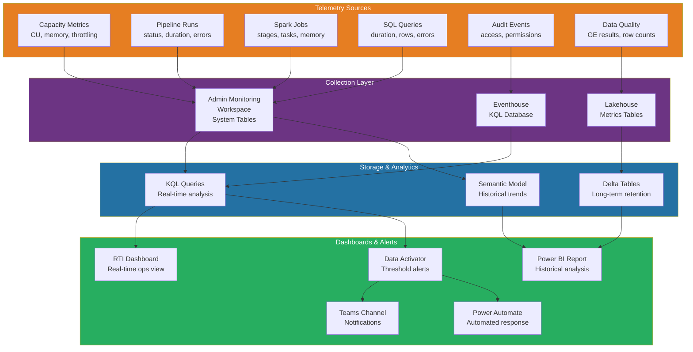
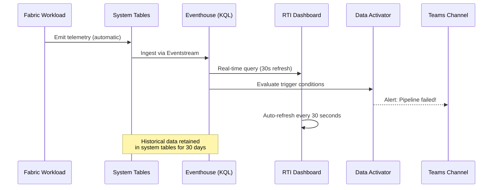
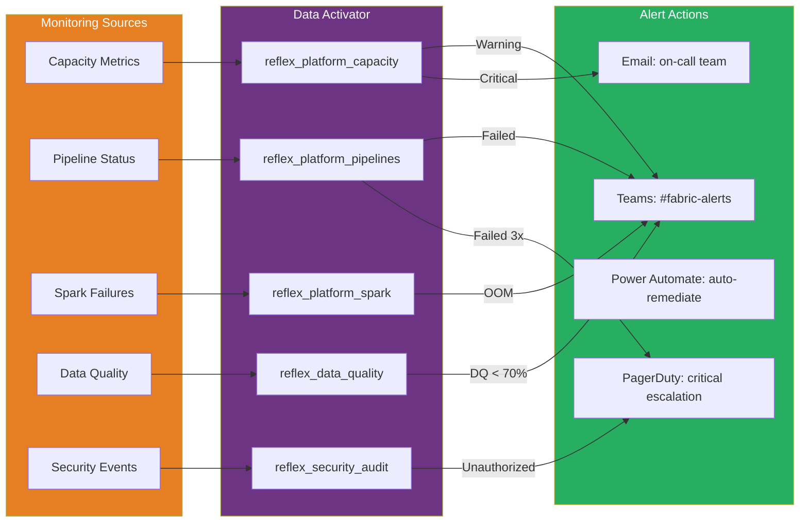
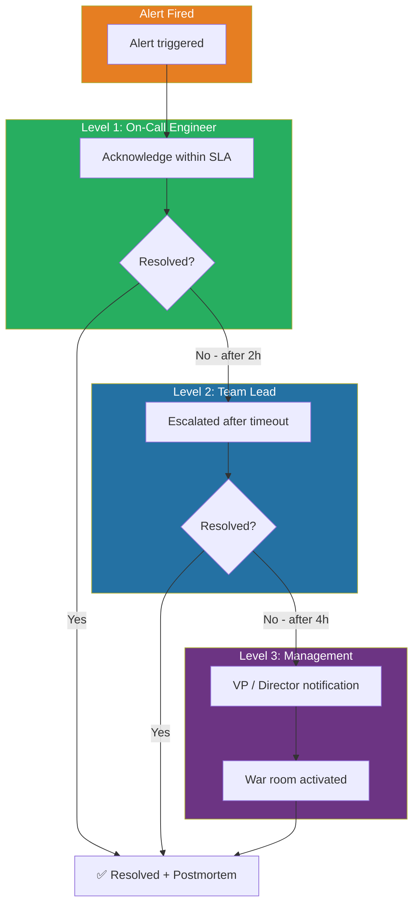
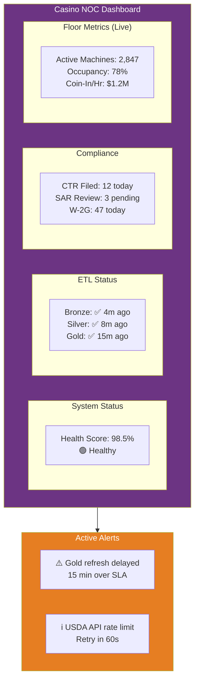
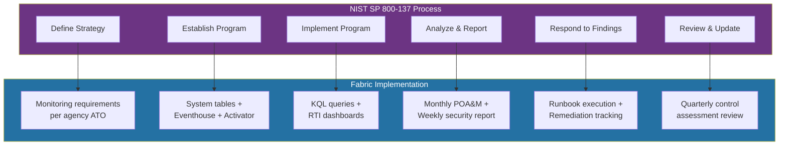

# 📊 Monitoring & Observability for Microsoft Fabric

<div align="center" markdown>

**Unified Telemetry, Dashboards, Alerting & Runbooks for Fabric Workloads**


</div>

---

**Last Updated:** `2026-04-13` | **Version:** 1.0.0

---

## 🎯 Overview

Monitoring and observability in Microsoft Fabric requires a unified strategy that spans capacity utilization, workspace health, pipeline execution, Spark job performance, data quality, and business SLA compliance. This guide establishes the monitoring patterns for the casino gaming and federal agency POC, covering the built-in Fabric monitoring capabilities (Capacity Metrics app, system tables, Admin Monitoring workspace), custom Real-Time Intelligence dashboards, Data Activator alerting, and operational runbooks for incident response.

### Monitoring Pillars

| Pillar | What It Answers | Fabric Tooling |
|--------|----------------|----------------|
| **Capacity** | Are we within compute/memory limits? Will we throttle? | Capacity Metrics app, Admin APIs |
| **Pipelines** | Did ETL jobs succeed? How long did they take? | Pipeline monitoring, system tables |
| **Spark** | Are notebooks running efficiently? Any OOM failures? | Spark monitoring, Spark UI, system tables |
| **Data Quality** | Is data arriving on time? Are quality gates passing? | Great Expectations, custom metrics |
| **Security** | Are there unauthorized access attempts or policy violations? | Unified Audit Log, Purview |
| **SLA** | Are we meeting business freshness and availability requirements? | Custom KPI dashboards |

### Observability Maturity Levels

| Level | Description | Capabilities |
|-------|-------------|-------------|
| **L1 — Reactive** | Respond when users report issues | Manual checking, no alerts |
| **L2 — Proactive** | Alerts before users notice | Threshold alerts, email notifications |
| **L3 — Predictive** | Anticipate issues before they occur | Trend analysis, capacity forecasting |
| **L4 — Autonomous** | Self-healing with automated remediation | Data Activator + Power Automate flows |

> **Target for this POC:** Level 3 (Predictive) for capacity and pipeline monitoring, Level 2 (Proactive) for data quality and security.

---

## 🏗️ Architecture

### Unified Monitoring Architecture



### Data Flow for Monitoring Telemetry



---

## ⚡ Capacity Monitoring

### Fabric Capacity Metrics App

The Capacity Metrics app is the primary tool for monitoring Fabric capacity utilization. Install it from AppSource for each capacity you manage.

**Key Metrics to Monitor:**

| Metric | Description | Warning Threshold | Critical Threshold |
|--------|-------------|-------------------|-------------------|
| **CU Utilization (%)** | Compute Units consumed vs. available | > 70% sustained | > 90% sustained |
| **Interactive CU (%)** | CU consumed by interactive queries | > 80% | > 95% |
| **Background CU (%)** | CU consumed by background jobs (refresh, pipelines) | > 70% | > 85% |
| **Throttling Events** | Number of throttling events in the period | Any occurrence | Sustained throttling |
| **Rejection Events** | Requests rejected due to capacity exhaustion | Any occurrence | Multiple per hour |
| **Overages** | CU debt carried forward (smoothing window) | > 10 min carry | > 30 min carry |
| **Memory (GB)** | Memory utilization for Spark and SQL | > 70% | > 85% |

### KQL Queries for Capacity Health

```kql
// Capacity utilization over the last 24 hours (15-minute windows)
FabricCapacityMetrics
| where TimeGenerated > ago(24h)
| summarize
    AvgCU = avg(CUPercent),
    MaxCU = max(CUPercent),
    ThrottleCount = countif(IsThrottled == true),
    RejectCount = countif(IsRejected == true)
    by bin(TimeGenerated, 15m)
| order by TimeGenerated desc
```

```kql
// Top CU consumers by workspace and item type
FabricCapacityMetrics
| where TimeGenerated > ago(1h)
| summarize TotalCU = sum(CUSeconds) by WorkspaceName, ItemType, ItemName
| top 20 by TotalCU desc
| project WorkspaceName, ItemType, ItemName, TotalCU_Minutes = round(TotalCU / 60.0, 2)
```

```kql
// Detect throttling patterns — when does throttling occur most?
FabricCapacityMetrics
| where TimeGenerated > ago(7d)
| where IsThrottled == true
| summarize ThrottleEvents = count() by bin(TimeGenerated, 1h), DayOfWeek = dayofweek(TimeGenerated)
| order by ThrottleEvents desc
```

### Capacity Forecasting

```kql
// 7-day CU trend for capacity planning
FabricCapacityMetrics
| where TimeGenerated > ago(7d)
| summarize DailyCU = avg(CUPercent) by bin(TimeGenerated, 1d)
| extend Day = format_datetime(TimeGenerated, 'yyyy-MM-dd')
| project Day, DailyCU
| order by Day asc
// Plot this as a line chart — if the trend is increasing, plan for SKU upgrade
```

### Capacity Alert Thresholds

| Alert | Condition | Severity | Action |
|-------|-----------|----------|--------|
| CU > 70% for 30 min | Sustained high utilization | Warning | Review top consumers |
| CU > 90% for 15 min | Near capacity limit | Critical | Pause non-essential workloads |
| Throttling detected | Any throttle event | High | Check spike source, consider scaling |
| Rejection detected | Request rejected | Critical | Immediate: scale capacity or pause jobs |
| Memory > 85% | High memory pressure | High | Review Spark configs, reduce concurrency |
| Overage > 30 min | Extended CU debt | Warning | Reschedule background jobs to off-peak |

---

## 🔍 Workspace Monitoring

### System Tables (Admin Monitoring Workspace)

Fabric provides system tables in the Admin Monitoring workspace that expose operational telemetry:

| System Table | Contents | Retention |
|-------------|----------|-----------|
| `pipeline_runs` | Pipeline execution history | 30 days |
| `notebook_runs` | Spark notebook execution history | 30 days |
| `sql_queries` | SQL endpoint query history | 30 days |
| `capacity_metrics` | CU consumption telemetry | 30 days |
| `audit_events` | User and system actions | 90 days |

### Pipeline Monitoring

```kql
// Pipeline run summary — last 24 hours
FabricPipelineRuns
| where StartTime > ago(24h)
| summarize
    TotalRuns = count(),
    Succeeded = countif(Status == "Succeeded"),
    Failed = countif(Status == "Failed"),
    Cancelled = countif(Status == "Cancelled"),
    InProgress = countif(Status == "InProgress"),
    AvgDurationMin = round(avg(DurationInSeconds) / 60.0, 2),
    MaxDurationMin = round(max(DurationInSeconds) / 60.0, 2)
    by PipelineName, WorkspaceName
| extend SuccessRate = round(todouble(Succeeded) / TotalRuns * 100, 1)
| order by SuccessRate asc
```

```kql
// Failed pipelines with error details
FabricPipelineRuns
| where StartTime > ago(24h)
| where Status == "Failed"
| project
    PipelineName,
    WorkspaceName,
    StartTime,
    DurationMin = round(DurationInSeconds / 60.0, 2),
    ErrorMessage = tostring(parse_json(Error).message),
    ErrorCode = tostring(parse_json(Error).errorCode)
| order by StartTime desc
```

### Spark Job Monitoring

```kql
// Spark notebook performance — last 24 hours
FabricNotebookRuns
| where StartTime > ago(24h)
| summarize
    TotalRuns = count(),
    AvgDurationMin = round(avg(DurationInSeconds) / 60.0, 2),
    MaxDurationMin = round(max(DurationInSeconds) / 60.0, 2),
    FailedRuns = countif(Status == "Failed"),
    AvgSpillGB = round(avg(DiskSpillBytes) / (1024.0 * 1024 * 1024), 2)
    by NotebookName, WorkspaceName
| extend FailRate = round(todouble(FailedRuns) / TotalRuns * 100, 1)
| order by AvgDurationMin desc
```

```kql
// Spark OOM detection — jobs with excessive memory usage
FabricNotebookRuns
| where StartTime > ago(7d)
| where Status == "Failed"
| where ErrorMessage has_any ("OutOfMemoryError", "java.lang.OutOfMemoryError", "Container killed by YARN")
| project
    NotebookName,
    WorkspaceName,
    StartTime,
    ErrorMessage,
    PeakMemoryGB = round(PeakMemoryBytes / (1024.0 * 1024 * 1024), 2),
    ExecutorCount
| order by StartTime desc
```

### SQL Endpoint Monitoring

```kql
// Slow SQL queries — duration > 30 seconds
FabricSQLQueries
| where StartTime > ago(24h)
| where DurationInSeconds > 30
| project
    QueryText = substring(QueryText, 0, 200),
    WorkspaceName,
    UserEmail,
    DurationSec = round(DurationInSeconds, 1),
    RowsReturned,
    StartTime
| order by DurationSec desc
| take 20
```

### Pipeline History Dashboard Query

```kql
// 7-day pipeline success/failure trend for dashboard
FabricPipelineRuns
| where StartTime > ago(7d)
| summarize
    Succeeded = countif(Status == "Succeeded"),
    Failed = countif(Status == "Failed")
    by bin(StartTime, 1d)
| extend SuccessRate = round(todouble(Succeeded) / (Succeeded + Failed) * 100, 1)
| project Day = format_datetime(StartTime, 'yyyy-MM-dd'), Succeeded, Failed, SuccessRate
| order by Day asc
```

---

## 📈 Custom Dashboards

### RTI Dashboard Patterns

Real-Time Intelligence dashboards provide live operational views with auto-refresh capabilities:

#### Operations Dashboard Layout

> **Dashboard:** Fabric Operations Center
> **Last Refresh:** `2026-04-13 14:30:00 UTC`

**Top-row KPI cards:**

| CU Usage | Pipelines | Spark Jobs | Alerts |
|---|---|---|---|
| **68%** ████░░<br/>Warning at 70% | **✅ 142 / 150**<br/>❌ 8 failed | **✅ 28 / 30**<br/>❌ 2 OOM | ⚠️ 2 warnings<br/>🔴 0 critical |

**CU Utilization (24h):**

| Hour | 00 | 04 | 08 | 12 | 16 | 20 |
|---|---|---|---|---|---|---|
| % | 20 | 40 | 70 | 60 | 50 | 40 |

**Pipeline Status (Last 24h):**

| Pipeline Name | Status | Duration | Last Run |
|---|:---:|---|---|
| `pl_bronze_slot_ingest` | ✅ | 4m 23s | 14:15 UTC |
| `pl_silver_slot_cleanse` | ✅ | 8m 12s | 14:20 UTC |
| `pl_gold_kpi_compute` | ❌ | — | 14:25 UTC |
| `pl_federal_usda_ingest` | ✅ | 3m 44s | 13:00 UTC |

### KQL for Dashboard Tiles

```kql
// Tile 1: Current CU utilization (single value)
FabricCapacityMetrics
| where TimeGenerated > ago(5m)
| summarize CurrentCU = round(avg(CUPercent), 1)
```

```kql
// Tile 2: Pipeline success rate (last 24h)
FabricPipelineRuns
| where StartTime > ago(24h)
| summarize
    Total = count(),
    Succeeded = countif(Status == "Succeeded")
| extend SuccessRate = round(todouble(Succeeded) / Total * 100, 1)
| project SuccessRate, Succeeded, Total
```

```kql
// Tile 3: Active alerts count
FabricAlerts
| where TimeGenerated > ago(1h)
| where State == "Active"
| summarize
    Critical = countif(Severity == "Critical"),
    Warning = countif(Severity == "Warning"),
    Info = countif(Severity == "Info")
```

```kql
// Tile 4: Data freshness — last ingestion timestamp per table
FabricDeltaTableMetrics
| summarize LastUpdate = max(LastModifiedTimestamp) by TableName, LakehouseName
| extend FreshnessMinutes = datetime_diff('minute', now(), LastUpdate)
| extend Status = iff(FreshnessMinutes > 60, "⚠️ Stale", "✅ Fresh")
| order by FreshnessMinutes desc
```

### Power BI Historical Dashboard

For historical trend analysis, create a Power BI report connected to system tables via DirectQuery or Import:

| Page | Content | Refresh |
|------|---------|---------|
| **Executive Summary** | KPI cards (uptime, success rate, CU avg), 30-day trend | Daily |
| **Capacity** | CU utilization heatmap, throttling events, top consumers | Hourly |
| **Pipelines** | Success/failure trend, duration distribution, error categories | Hourly |
| **Spark** | Job duration trends, OOM occurrences, spill detection | Hourly |
| **Data Quality** | GE suite pass rates, row count trends, quarantine volume | Daily |
| **Security** | Access anomalies, permission changes, failed logins | Daily |

---

## 🚨 Alerting Strategy

### Data Activator Integration

Data Activator triggers are the primary alerting mechanism for Fabric-native monitoring:



### Severity Classification

| Severity | Description | Response Time | Notification Channel | Escalation |
|----------|-------------|--------------|---------------------|------------|
| **P1 — Critical** | Data loss, security breach, complete outage | 15 min | PagerDuty + Teams + Email + Phone | Immediate to VP |
| **P2 — High** | Pipeline failure, capacity throttling, compliance SLA miss | 1 hour | Teams + Email | After 2 hours to Manager |
| **P3 — Medium** | Slow queries, data freshness warning, non-critical job failure | 4 hours | Teams | After 24 hours to Lead |
| **P4 — Low** | Informational, optimization opportunities | Next business day | Email digest | None |

### Alert Configuration Matrix

| Alert | Severity | Condition | Cooldown | Channel |
|-------|----------|-----------|----------|---------|
| Capacity > 90% | P2 | CU > 90% for 15 min | 30 min | Teams + Email |
| Capacity throttling | P2 | Any throttle event | 15 min | Teams + Email |
| Request rejection | P1 | Any rejection event | None | PagerDuty + Teams |
| Pipeline failed | P3 | Status = Failed | Per pipeline | Teams |
| Pipeline failed 3x consecutive | P2 | 3 consecutive failures | 1 hour | Teams + Email |
| Bronze ingestion > 2h late | P3 | No new rows in 2 hours | 2 hours | Teams |
| Gold refresh > 4h late | P2 | Refresh SLA breach | 4 hours | Teams + Email |
| Spark OOM | P3 | OutOfMemory error | Per notebook | Teams |
| DQ score < 70% | P2 | Great Expectations suite failure | 1 hour | Teams + Email |
| Unauthorized access (403) | P1 | Audit log 403 event | None | PagerDuty + Security |
| Permission change | P4 | Workspace role modified | 24 hours | Email digest |
| Quarantine > 1000 records | P3 | Quarantine table threshold | 4 hours | Teams |

### Alert Fatigue Prevention

| Strategy | Implementation |
|----------|---------------|
| **Cooldown periods** | Suppress duplicate alerts for 15-60 min after first firing |
| **Severity-based routing** | Only P1/P2 go to PagerDuty; P3/P4 go to Teams only |
| **Business hours** | P3/P4 alerts suppressed outside business hours (except casino 24/7) |
| **Aggregation** | Batch P4 alerts into daily digest emails |
| **Auto-acknowledge** | Auto-close alerts when condition resolves |
| **Threshold tuning** | Review alert thresholds monthly; adjust based on false positive rate |

### Escalation Matrix



---

## 📋 Runbooks

### Runbook 1: Capacity Throttled

**Trigger:** CU utilization > 90% for 15+ minutes with throttling events.

**Severity:** P2 — High

**Steps:**

1. **Assess** — Open Capacity Metrics app. Identify top CU consumers by workspace and item type.
   ```kql
   FabricCapacityMetrics
   | where TimeGenerated > ago(1h)
   | where IsThrottled == true
   | summarize TotalCU = sum(CUSeconds) by WorkspaceName, ItemType, ItemName
   | top 10 by TotalCU desc
   ```

2. **Immediate Relief** — Pause non-essential background jobs:
   - Cancel any running ad-hoc notebooks
   - Pause scheduled refreshes for non-critical semantic models
   - Defer any data generation or load testing jobs

3. **Root Cause** — Determine if spike is expected (batch window) or anomalous:
   - Check if a large backfill or historical reload is running
   - Check if Spark notebook has a Cartesian join or data explosion
   - Check if multiple Power BI reports triggered simultaneous refreshes

4. **Scale** (if needed) — Temporarily scale capacity:
   ```powershell
   # Scale F64 to F128 for emergency capacity
   az resource update \
     --resource-group rg-fabric-poc \
     --name fabric-capacity-poc \
     --resource-type Microsoft.Fabric/capacities \
     --set properties.administration.members=["admin@contoso.com"] \
     --set sku.name=F128
   ```

5. **Resolve** — After spike passes:
   - Scale back to original SKU
   - Document the incident
   - Adjust scheduling to prevent recurrence

6. **Postmortem** — Within 24 hours, document:
   - Timeline of events
   - Root cause
   - Impact (queries throttled, users affected)
   - Preventive measures

---

### Runbook 2: Pipeline Failed

**Trigger:** Pipeline status = Failed.

**Severity:** P3 (single failure) or P2 (3+ consecutive failures).

**Steps:**

1. **Assess** — Check the pipeline run history:
   ```kql
   FabricPipelineRuns
   | where PipelineName == "pl_bronze_slot_ingest"
   | where StartTime > ago(24h)
   | project StartTime, Status, DurationInSeconds, Error
   | order by StartTime desc
   ```

2. **Identify Failure Activity** — Determine which activity in the pipeline failed:
   - Copy activity: Source connectivity? Schema drift? Timeout?
   - Notebook activity: Spark error? Data quality gate? OOM?
   - Dataflow activity: Refresh timeout? Memory limit?

3. **Common Fixes:**

   | Error | Likely Cause | Fix |
   |-------|-------------|-----|
   | Connection timeout | Source system down | Verify source, retry with backoff |
   | Schema mismatch | Source schema changed | Update schema mapping, re-run |
   | OutOfMemoryError | Data volume spike | Increase Spark executor memory |
   | Authentication error | Credential expired | Rotate SPN secret or refresh token |
   | Throttling | Capacity overloaded | Reschedule to off-peak |

4. **Retry** — Re-run the failed pipeline:
   - If transient error: Retry immediately
   - If schema/data issue: Fix and re-run
   - If capacity issue: Wait for capacity availability

5. **Notify** — If the failure affects SLA:
   - Post to #fabric-alerts Teams channel
   - Update the on-call log
   - Notify downstream consumers

---

### Runbook 3: Spark OutOfMemory (OOM)

**Trigger:** Notebook fails with `java.lang.OutOfMemoryError` or `Container killed by YARN`.

**Severity:** P3 — Medium.

**Steps:**

1. **Assess** — Check which notebook and dataset:
   ```kql
   FabricNotebookRuns
   | where Status == "Failed"
   | where ErrorMessage has "OutOfMemoryError"
   | project NotebookName, StartTime, PeakMemoryGB = round(PeakMemoryBytes / 1073741824.0, 2), ExecutorCount
   | order by StartTime desc
   ```

2. **Diagnose** — Common OOM causes:
   - **Collect to driver:** `df.collect()` on a large DataFrame
   - **Broadcast join:** Broadcasting a table that is too large
   - **Skewed partition:** One partition has significantly more data
   - **Cartesian join:** Missing join condition creates exploding dataset
   - **Window function without partition:** `Window.orderBy()` without `.partitionBy()`

3. **Fix — Spark Configuration:**
   ```python
   # Increase executor memory
   spark.conf.set("spark.executor.memory", "16g")
   spark.conf.set("spark.driver.memory", "8g")

   # Disable broadcast for large tables
   spark.conf.set("spark.sql.autoBroadcastJoinThreshold", "-1")

   # Enable adaptive query execution for skew handling
   spark.conf.set("spark.sql.adaptive.enabled", "true")
   spark.conf.set("spark.sql.adaptive.skewJoin.enabled", "true")
   ```

4. **Fix — Code Changes:**
   ```python
   # Replace .collect() with .toPandas() on small datasets
   # or use .limit(N).collect()

   # Add partition columns to window functions
   # Before (OOM risk):
   Window.orderBy("timestamp")
   # After (safe):
   Window.partitionBy("machine_id").orderBy("timestamp")

   # Repartition skewed data
   df = df.repartition(200, "machine_id")
   ```

5. **Verify** — Re-run and monitor Spark UI for memory utilization.

---

### Runbook 4: Semantic Model Refresh Timeout

**Trigger:** Power BI semantic model refresh exceeds 2-hour timeout.

**Severity:** P3 — Medium (P2 if Gold KPI model for executives).

**Steps:**

1. **Assess** — Check refresh history in Fabric portal:
   - Go to workspace → Semantic model → Refresh history
   - Note: duration, rows processed, tables refreshed

2. **Diagnose** — Common timeout causes:
   - Direct Lake fallback to DirectQuery (table too large for memory)
   - Inefficient DAX measures computed during refresh
   - Too many tables in full refresh (use incremental)
   - Source lakehouse running OPTIMIZE/VACUUM during refresh

3. **Fix — Direct Lake Optimization:**
   ```
   - Reduce row groups: Merge small Parquet files (OPTIMIZE)
   - Enable V-Order: Better compression for Direct Lake
   - Split large tables: Partition by date, refresh only recent partitions
   - Remove unused columns: Fewer columns = faster segment loading
   ```

4. **Fix — Incremental Refresh:**
   ```
   - Configure incremental refresh policy (last 3 months hot, archive cold)
   - Ensure partition key column is datetime type
   - Set refresh/detection window appropriately
   ```

5. **Monitor** — After fix, confirm refresh completes within SLA.

---

### Runbook Template

```markdown
# Runbook: {Issue Name}

**Trigger:** {What fires this runbook}
**Severity:** {P1/P2/P3/P4}
**Owner:** {Team or role responsible}
**Last Tested:** {Date of last runbook drill}

## Assessment
1. {First diagnostic step}
2. {KQL query or UI check}

## Diagnosis
| Symptom | Likely Cause | Fix |
|---------|-------------|-----|
| {symptom} | {cause} | {fix} |

## Remediation
1. {Step-by-step fix}
2. {Verification}

## Escalation
- If not resolved in {N} hours, escalate to {role}
- If customer-impacting, notify {stakeholder}

## Post-Incident
- [ ] Document timeline
- [ ] Identify root cause
- [ ] Implement preventive measure
- [ ] Update this runbook if needed
```

---

## 🎰 Casino NOC Dashboard

### 24/7 Network Operations Center

Casino gaming operations run 24/7/365. The NOC dashboard must provide at-a-glance status for the gaming floor data platform:



### Casino-Specific Monitoring KPIs

| KPI | Source | Refresh Rate | SLA |
|-----|--------|-------------|-----|
| Slot coin-in per hour | Eventstream → Eventhouse | Real-time (30s) | < 1 min latency |
| Active machine count | Bronze ingestion count | Every 5 minutes | < 10 min freshness |
| CTR filing count (today) | Gold compliance table | Every 15 minutes | < 30 min freshness |
| SAR pending review count | Gold compliance table | Every 15 minutes | < 30 min freshness |
| Hold percentage (running) | Gold KPI table | Every 15 minutes | < 30 min freshness |
| Floor occupancy (%) | Eventstream telemetry | Real-time (30s) | < 1 min latency |
| Pipeline health (last 1h) | System tables | Every 5 minutes | 100% visibility |
| Data freshness (all layers) | Delta table metadata | Every 10 minutes | < 15 min freshness |

### Casino Alert Customization

| Alert | Casino-Specific Condition | Why |
|-------|--------------------------|-----|
| Slot telemetry gap > 5 min | No events from a floor section | Machine down or network issue |
| CTR threshold breach | Transaction > $10,000 detected | Immediate filing required |
| SAR pattern detected | Multiple $8K-$9.9K transactions | Structuring investigation |
| Gold KPI stale > 30 min | KPI dashboard not updated | Gaming commission reporting SLA |
| Compliance report generation failed | Daily compliance extract failed | Regulatory filing deadline |

> **Callout — Casino 24/7 Operations:** All casino alerts fire 24/7 with no business-hours suppression. The on-call rotation follows the casino's shift pattern (day/swing/graveyard). Compliance alerts (CTR, SAR) always escalate to the Compliance Manager regardless of shift.

---

## 🏛️ Federal FISMA Continuous Monitoring

### Continuous Monitoring Framework

FISMA requires continuous monitoring of security controls. Fabric monitoring maps to NIST SP 800-137 continuous monitoring:



### FISMA Control Monitoring Mapping

| NIST Control | Control Name | Monitoring Method | Frequency |
|-------------|-------------|-------------------|-----------|
| **AC-2(4)** | Automated Audit Actions | Audit log query for account create/modify/delete | Real-time |
| **AC-6(9)** | Log Use of Privileged Functions | Audit log query for Admin actions | Real-time |
| **AU-6** | Audit Record Review | Weekly security report from Unified Audit Log | Weekly |
| **CA-7** | Continuous Monitoring | System tables + RTI dashboards | Continuous |
| **CM-3** | Configuration Change Control | Git integration + pipeline deploy logs | Per change |
| **IR-5** | Incident Monitoring | Data Activator alerts + incident log | Real-time |
| **RA-5** | Vulnerability Monitoring | Security scan results, Defender alerts | Daily |
| **SI-4** | System Monitoring | Capacity metrics, access logs, anomaly detection | Continuous |

### Federal Security Monitoring KQL

```kql
// FISMA AU-6: Weekly audit record review
// Export for POA&M reporting
FabricAuditLogs
| where TimeGenerated > ago(7d)
| where ActionCategory in ("UserAccess", "PermissionChange", "DataExport", "AdminAction")
| summarize EventCount = count() by
    ActionCategory,
    ActionName = tostring(parse_json(Properties).operationName),
    UserEmail = tostring(parse_json(Properties).userEmail)
| order by EventCount desc
```

```kql
// FISMA AC-2(4): Account management audit
FabricAuditLogs
| where TimeGenerated > ago(24h)
| where ActionName in ("AddWorkspaceUser", "RemoveWorkspaceUser", "UpdateWorkspaceAccess")
| project
    Timestamp = TimeGenerated,
    Action = ActionName,
    TargetUser = tostring(parse_json(Properties).targetUserEmail),
    PerformedBy = tostring(parse_json(Properties).performedBy),
    WorkspaceName = tostring(parse_json(Properties).workspaceName),
    NewRole = tostring(parse_json(Properties).role)
| order by Timestamp desc
```

```kql
// FISMA SI-4: Anomaly detection — unusual data export volume
FabricAuditLogs
| where TimeGenerated > ago(24h)
| where ActionName in ("ExportData", "DownloadReport", "ExportVisualData")
| summarize ExportCount = count(), TotalRows = sum(tolong(parse_json(Properties).rowCount))
    by UserEmail = tostring(parse_json(Properties).userEmail)
| where ExportCount > 50 or TotalRows > 1000000
| project UserEmail, ExportCount, TotalRows, Alert = "Unusual export volume"
```

### Federal Monthly Compliance Report Template

```python
# Generate FISMA continuous monitoring monthly report
from datetime import datetime, timedelta

report_period = datetime.utcnow().strftime("%Y-%m")

sections = {
    "Access Control Events": """
        FabricAuditLogs
        | where TimeGenerated > ago(30d)
        | where ActionCategory == "UserAccess"
        | summarize count() by ActionName
    """,
    "Permission Changes": """
        FabricAuditLogs
        | where TimeGenerated > ago(30d)
        | where ActionCategory == "PermissionChange"
        | summarize count() by ActionName, WorkspaceName
    """,
    "Data Export Activity": """
        FabricAuditLogs
        | where TimeGenerated > ago(30d)
        | where ActionName has "Export"
        | summarize count() by UserEmail, ActionName
    """,
    "Capacity Health": """
        FabricCapacityMetrics
        | where TimeGenerated > ago(30d)
        | summarize AvgCU = avg(CUPercent), MaxCU = max(CUPercent),
                    ThrottleCount = countif(IsThrottled)
        | project AvgCU, MaxCU, ThrottleCount
    """,
    "Pipeline Reliability": """
        FabricPipelineRuns
        | where StartTime > ago(30d)
        | summarize Total = count(), Failed = countif(Status == "Failed")
        | extend Reliability = round((Total - Failed) * 100.0 / Total, 2)
    """
}

print(f"📋 FISMA Continuous Monitoring Report — {report_period}")
print(f"Generated: {datetime.utcnow().isoformat()}")
print("=" * 60)
for section, query in sections.items():
    print(f"\n## {section}")
    print(f"Query:\n{query.strip()}")
    # Execute KQL queries and format results
```

> **Callout — Agency-Specific ATO Requirements:** Each federal agency has its own Authority to Operate (ATO) with specific monitoring requirements. The monitoring strategy must be customized per agency. The queries above provide a baseline — work with each agency's ISSO (Information System Security Officer) to confirm required monitoring controls.

---

## 🔧 Operational Maturity Model

### Assessment Checklist

| Capability | L1 Reactive | L2 Proactive | L3 Predictive | L4 Autonomous |
|------------|------------|-------------|---------------|---------------|
| Capacity monitoring | Manual check | Threshold alerts | Trend forecasting | Auto-scale |
| Pipeline monitoring | Check on failure report | Alert on failure | Predict failures from trends | Auto-retry with backoff |
| Spark monitoring | Review after OOM | Alert on OOM | Memory trend alerts | Auto-tune Spark config |
| Data quality | User reports bad data | GE suite alerts | DQ trend dashboard | Auto-quarantine + notify |
| Security | Annual audit review | Real-time access alerts | Anomaly detection | Auto-revoke suspicious |
| Incident response | Ad-hoc troubleshooting | Runbooks available | Runbooks tested monthly | Auto-remediation flows |
| Reporting | On-demand | Scheduled weekly | Real-time dashboard | Self-service |

### Maturity Progression Plan

```
Phase 1 (Week 1-2): Foundation
  ✅ Install Capacity Metrics app
  ✅ Enable system tables in Admin Monitoring workspace
  ✅ Create basic KQL queries for pipeline/Spark monitoring
  ✅ Set up Teams channel for alerts

Phase 2 (Week 3-4): Proactive Alerting
  ✅ Configure Data Activator Reflex items
  ✅ Implement alert severity classification
  ✅ Create initial runbooks for top 4 scenarios
  ✅ Set up on-call rotation

Phase 3 (Month 2): Custom Dashboards
  ✅ Build RTI operations dashboard
  ✅ Build Power BI historical trends report
  ✅ Implement data freshness monitoring
  ✅ Create domain-specific dashboards (Casino NOC, Federal FISMA)

Phase 4 (Month 3): Predictive + Automation
  ⬜ Implement capacity trend forecasting
  ⬜ Add anomaly detection for data quality
  ⬜ Create Power Automate auto-remediation flows
  ⬜ Conduct first runbook drill
```

---

## ⚠️ Common Issues

| Issue | Symptom | Root Cause | Resolution |
|-------|---------|-----------|------------|
| System tables empty | No data in monitoring queries | Admin Monitoring workspace not enabled | Enable via Fabric Admin portal |
| Alert storms | Hundreds of alerts in minutes | Missing cooldown periods | Add 15-60 min cooldown per alert |
| Dashboard stale | RTI dashboard shows old data | Eventstream disconnected | Reconnect Eventstream source |
| False positives | Alert fires during maintenance | No maintenance window suppression | Add maintenance window to alert rules |
| KQL query timeout | Complex query exceeds 30s limit | Scanning too much data | Add time filters, reduce scope |
| Capacity spike at midnight | Unexpected CU burst | All scheduled refreshes at same time | Stagger refresh schedules |
| Missing audit events | Security report incomplete | Audit log search limited to 90 days | Export to long-term storage (ADLS Gen2) |
| OOM during monitoring notebook | Monitoring notebook itself OOMs | Querying too much history | Limit lookback window, use incremental |

---

## 📚 References

### Microsoft Documentation

- [Fabric Capacity Metrics app](https://learn.microsoft.com/fabric/enterprise/metrics-app)
- [Admin Monitoring workspace](https://learn.microsoft.com/fabric/admin/monitoring-workspace)
- [System tables in Fabric](https://learn.microsoft.com/fabric/admin/monitoring-hub)
- [Data Activator overview](https://learn.microsoft.com/fabric/data-activator/data-activator-introduction)
- [Real-Time Intelligence dashboards](https://learn.microsoft.com/fabric/real-time-intelligence/dashboard-real-time-create)
- [KQL overview](https://learn.microsoft.com/kusto/query/)
- [Unified audit log in Fabric](https://learn.microsoft.com/fabric/admin/track-user-activities)

### Compliance & Frameworks

- [NIST SP 800-137 — Continuous Monitoring](https://csrc.nist.gov/publications/detail/sp/800-137/final)
- [FISMA Implementation Guide](https://www.cisa.gov/topics/cyber-threats-and-advisories/federal-information-security-modernization-act)
- [NIGC MICS Compliance](https://www.nigc.gov/compliance/minimum-internal-control-standards)
- [FedRAMP Continuous Monitoring Strategy Guide](https://www.fedramp.gov/assets/resources/documents/CSP_Continuous_Monitoring_Strategy_Guide.pdf)

### Operational Best Practices

- [SRE Workbook — Monitoring](https://sre.google/workbook/monitoring/)
- [PagerDuty Incident Response](https://response.pagerduty.com/)
- [Azure Monitor best practices](https://learn.microsoft.com/azure/azure-monitor/best-practices)

---

## Related Documents

- [Error Handling & Monitoring](./error-handling-monitoring.md) — Pipeline error tracking and retry patterns
- [Alerting & Data Activator](./alerting-data-activator.md) — Detailed Data Activator configuration
- [Performance & Parallelism](./performance-parallelism.md) — Spark optimization and capacity management
- [SQL Audit Logs Compliance](./sql-audit-logs-compliance.md) — SQL-level audit logging
- [Real-Time Intelligence](../features/real-time-intelligence.md) — RTI dashboard and Eventhouse setup

---

[Back to Best Practices Index](./index.md) | [Back to Documentation](../index.md)
