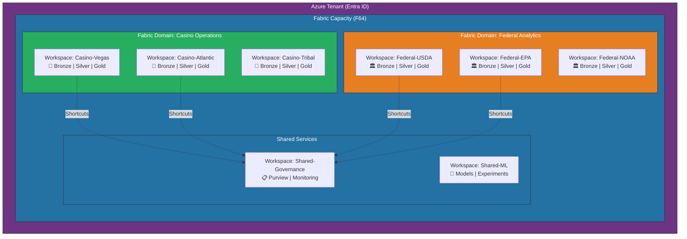
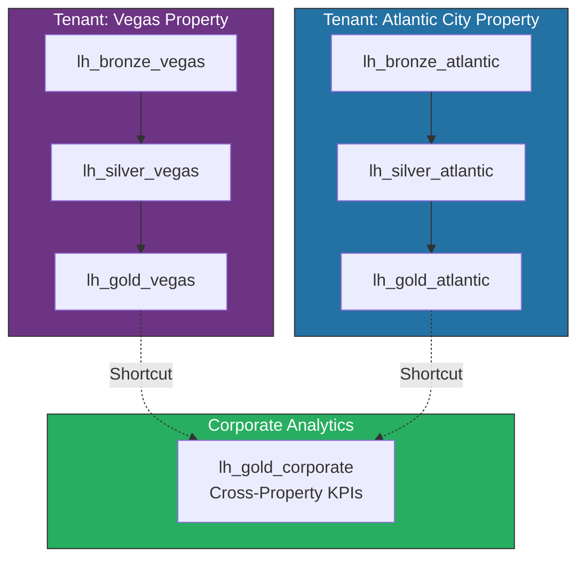
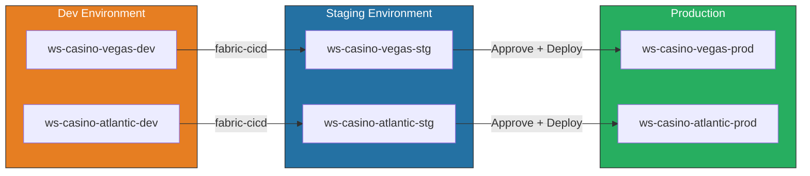
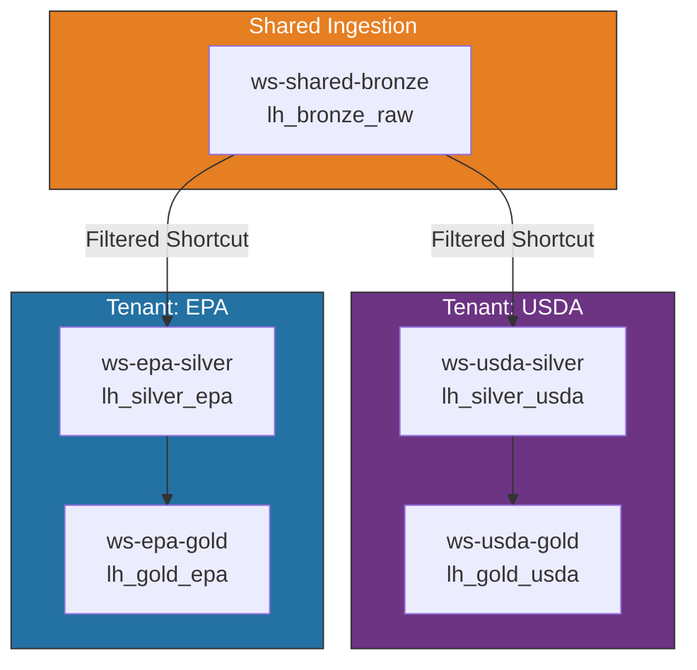
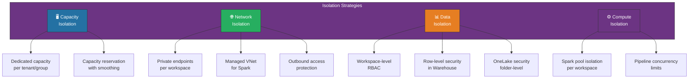
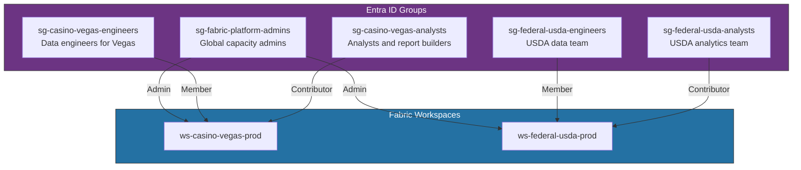
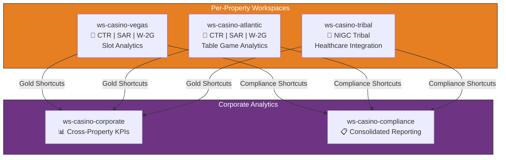
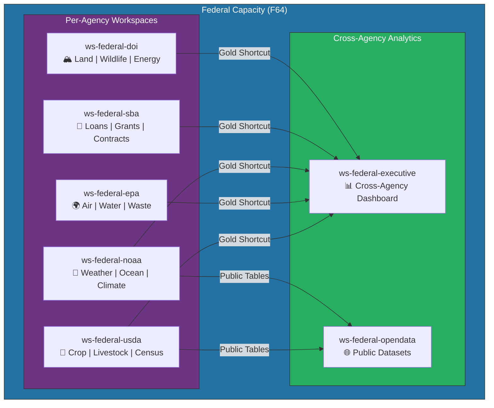

# 🏢 Multi-Tenant Workspace Architecture for Microsoft Fabric

<div align="center" markdown>

**Design Patterns for Isolating Workloads Across Tenants, Properties, and Agencies**


</div>

---

**Last Updated:** `2026-04-13` | **Version:** 1.0.0

---

## 🎯 Overview

Multi-tenant workspace architecture in Microsoft Fabric addresses the challenge of serving multiple organizational units — casino properties, federal agencies, business divisions — from a shared Fabric capacity while maintaining appropriate isolation boundaries for data, compute, security, and governance.

### Why Multi-Tenant?

| Driver | Description |
|--------|-------------|
| **Cost efficiency** | Share Fabric capacity costs across multiple tenants |
| **Centralized governance** | Unified data governance, lineage, and compliance across the organization |
| **Operational simplicity** | Single platform to manage instead of multiple isolated deployments |
| **Cross-tenant analytics** | Enable organization-wide insights while maintaining tenant boundaries |
| **Standardization** | Enforce consistent naming conventions, schemas, and quality standards |

### Key Design Questions

Before selecting a topology, answer these questions:

| Question | Impact |
|----------|--------|
| How many tenants? | Determines workspace count and management complexity |
| Do tenants share data? | Affects shortcut and sharing strategy |
| Are there regulatory isolation requirements? | May require separate capacities or domains |
| Do tenants have different SLA requirements? | Influences capacity assignment and throttling |
| Who manages each tenant? | Determines admin model (centralized vs. delegated) |
| Is cross-tenant reporting needed? | Affects Gold layer design and semantic model architecture |

---

## 🏗️ Architecture

### High-Level Multi-Tenant Hierarchy



### Component Responsibility Matrix

| Component | Scope | Purpose |
|-----------|-------|---------|
| **Azure Tenant** | Organization-wide | Identity, licensing, Entra ID groups |
| **Fabric Capacity** | Shared compute pool | CU allocation, throttling, auto-scale |
| **Fabric Domain** | Logical grouping | Governance boundary, sensitivity labels, endorsement |
| **Workspace** | Tenant boundary | Data isolation, RBAC, item management |
| **Lakehouse** | Data layer within workspace | Bronze/Silver/Gold tables per tenant |
| **Warehouse** | SQL analytics within workspace | Queryable data for reporting users |
| **Semantic Model** | BI layer | Direct Lake models per tenant or cross-tenant |

---

## 📐 Topology Patterns

### Pattern Comparison

| Pattern | Description | Isolation Level | Management Complexity | Best For |
|---------|-------------|-----------------|----------------------|----------|
| **Per-Tenant** | One workspace per tenant with all layers | High | Medium | Regulated industries, strong data boundaries |
| **Per-Environment** | Separate workspaces for Dev/Staging/Prod per tenant | High | High | Enterprise CI/CD with strict promotion gates |
| **Per-Layer** | Shared Bronze workspace, per-tenant Silver/Gold | Medium | Medium | Cost optimization with shared ingestion |
| **Hybrid** | Combine patterns based on tenant classification | Variable | High | Large organizations with mixed requirements |

### Pattern 1: Per-Tenant Workspace

Each tenant gets a dedicated workspace containing all medallion layers. This provides the strongest isolation at the cost of more workspaces to manage.



**Naming convention:**

```
ws-{org}-{tenant}-{environment}
├── lh_bronze_{tenant}
├── lh_silver_{tenant}
├── lh_gold_{tenant}
├── wh_{tenant}            (optional Warehouse)
├── sm_{tenant}_operations  (Semantic Model)
└── pipe_{tenant}_daily     (Pipeline)
```

### Pattern 2: Per-Environment Workspace

Each tenant has separate Dev, Staging, and Production workspaces, enabling full CI/CD promotion via `fabric-cicd`.



**Workspace count formula:** `tenants × environments`

| Tenants | Environments | Workspaces | Manageable? |
|---------|-------------|------------|-------------|
| 3 | 3 (Dev/Stg/Prod) | 9 | ✅ Yes |
| 10 | 3 | 30 | ⚠️ Automation required |
| 50 | 3 | 150 | 🔴 Consider per-layer pattern |

### Pattern 3: Per-Layer Workspace

Shared Bronze workspace for common ingestion, with per-tenant Silver and Gold workspaces. Reduces workspace count while maintaining data isolation at the transformation layer.



> **⚠️ Note:** Per-layer sharing works well when tenants consume from the same sources (e.g., multiple agencies reading from a shared federal data lake). It requires careful access control on the Bronze layer to prevent cross-tenant data leakage.

### Pattern 4: Hybrid Topology

Combine patterns based on tenant classification. High-security tenants get full isolation; standard tenants share infrastructure.

```python
# Hybrid topology decision engine
def determine_workspace_topology(tenant: dict) -> str:
    """Determine the appropriate workspace topology for a tenant."""
    if tenant.get("regulatory_isolation_required"):
        return "PER_TENANT_FULL"  # Separate capacity if needed

    if tenant.get("ci_cd_required"):
        return "PER_ENVIRONMENT"  # Dev/Stg/Prod workspaces

    if tenant.get("data_volume_tb") > 10:
        return "PER_TENANT_FULL"  # Large tenants get dedicated workspaces

    return "PER_LAYER"  # Standard tenants share Bronze

# Example classification
tenants = [
    {"name": "Casino-Vegas", "regulatory_isolation_required": True,
     "ci_cd_required": True, "data_volume_tb": 25},     # → PER_TENANT_FULL
    {"name": "Casino-Regional", "regulatory_isolation_required": False,
     "ci_cd_required": True, "data_volume_tb": 2},       # → PER_ENVIRONMENT
    {"name": "Federal-EPA", "regulatory_isolation_required": True,
     "ci_cd_required": True, "data_volume_tb": 15},      # → PER_TENANT_FULL
    {"name": "Federal-SBA", "regulatory_isolation_required": False,
     "ci_cd_required": False, "data_volume_tb": 1},      # → PER_LAYER
]
```

---

## 🔒 Isolation Strategies

### Isolation Dimensions



### Capacity Isolation

Assign high-security or high-volume tenants to dedicated Fabric capacities.

| Isolation Level | Configuration | Use Case |
|-----------------|--------------|----------|
| **Shared capacity** | All tenants on one F64 | Cost-optimized, low-risk tenants |
| **Capacity pools** | Group tenants on separate capacities | Regulatory separation (e.g., gaming vs. federal) |
| **Dedicated capacity** | One capacity per tenant | Highest isolation, guaranteed CUs |

```bicep
// Separate capacities for casino and federal workloads
resource casinoCapacity 'Microsoft.Fabric/capacities@2023-11-01' = {
  name: 'cap-casino-prod'
  location: location
  sku: {
    name: 'F64'
    tier: 'Fabric'
  }
  properties: {
    administration: {
      members: [casinoAdminGroupId]
    }
  }
  tags: {
    domain: 'casino'
    environment: 'production'
    costCenter: 'CC-GAMING-001'
  }
}

resource federalCapacity 'Microsoft.Fabric/capacities@2023-11-01' = {
  name: 'cap-federal-prod'
  location: location
  sku: {
    name: 'F64'
    tier: 'Fabric'
  }
  properties: {
    administration: {
      members: [federalAdminGroupId]
    }
  }
  tags: {
    domain: 'federal'
    environment: 'production'
    costCenter: 'CC-FEDERAL-001'
  }
}
```

### Network Isolation

| Feature | Scope | Configuration |
|---------|-------|---------------|
| **Private endpoints** | Capacity-level | Restrict Fabric API access to VNet |
| **Managed VNet** | Spark workloads | Isolate Spark outbound traffic |
| **Outbound access protection** | Workspace-level | Control external data access per tenant |
| **Service tags** | NSG rules | Allow only Fabric service traffic |

### Data Isolation

**Workspace RBAC (primary boundary):**

```python
# Workspace role assignments per tenant
workspace_roles = {
    "ws-casino-vegas-prod": {
        "Admin": ["sg-casino-platform-admins"],
        "Member": ["sg-casino-vegas-engineers"],
        "Contributor": ["sg-casino-vegas-analysts"],
        "Viewer": ["sg-casino-vegas-viewers"]
    },
    "ws-federal-usda-prod": {
        "Admin": ["sg-federal-platform-admins"],
        "Member": ["sg-usda-data-engineers"],
        "Contributor": ["sg-usda-analysts"],
        "Viewer": ["sg-usda-stakeholders"]
    }
}
```

**Row-Level Security (within shared workspaces):**

```sql
-- RLS policy for multi-tenant Warehouse table
CREATE FUNCTION dbo.fn_tenant_filter(@tenant_id VARCHAR(50))
RETURNS TABLE
WITH SCHEMABINDING
AS
    RETURN SELECT 1 AS fn_result
    WHERE @tenant_id = SESSION_CONTEXT(N'tenant_id')
       OR IS_MEMBER('sg-platform-admins') = 1;

-- Apply to table
CREATE SECURITY POLICY dbo.TenantFilter
ADD FILTER PREDICATE dbo.fn_tenant_filter(tenant_id)
ON dbo.shared_metrics
WITH (STATE = ON);
```

**OneLake Security (folder-level):**

```python
# OneLake security configuration via REST API
onelake_security = {
    "workspace": "ws-federal-shared",
    "lakehouse": "lh_bronze_shared",
    "folder_permissions": [
        {
            "folder": "Tables/usda_crop_production",
            "read": ["sg-usda-data-engineers", "sg-usda-analysts"],
            "write": ["sg-usda-data-engineers"]
        },
        {
            "folder": "Tables/epa_air_quality",
            "read": ["sg-epa-data-engineers", "sg-epa-analysts"],
            "write": ["sg-epa-data-engineers"]
        }
    ]
}
```

### Compute Isolation

| Strategy | How | When |
|----------|-----|------|
| **Spark session isolation** | Each workspace gets its own Spark session pool | Always (default behavior) |
| **Pipeline concurrency limits** | Set max concurrent pipeline runs per workspace | High-activity tenants |
| **Scheduled window separation** | Stagger tenant ETL schedules to avoid CU contention | Shared capacity scenarios |
| **Capacity smoothing** | Enable smoothing to spread burst CU consumption over 24 hours | Cost optimization |

---

## 🤖 Automation

### REST API Workspace Provisioning

Automate tenant onboarding with Fabric REST APIs and Azure Identity.

```python
import requests
from azure.identity import ClientSecretCredential

class FabricWorkspaceProvisioner:
    """Provision Fabric workspaces for new tenants."""

    def __init__(self, tenant_id: str, client_id: str, client_secret: str):
        self.credential = ClientSecretCredential(
            tenant_id=tenant_id,
            client_id=client_id,
            client_secret=client_secret
        )
        self.base_url = "https://api.fabric.microsoft.com/v1"

    def _get_headers(self) -> dict:
        token = self.credential.get_token("https://api.fabric.microsoft.com/.default")
        return {
            "Authorization": f"Bearer {token.token}",
            "Content-Type": "application/json"
        }

    def create_workspace(
        self,
        tenant_name: str,
        environment: str,
        capacity_id: str,
        description: str = ""
    ) -> dict:
        """Create a new workspace for a tenant."""
        workspace_name = f"ws-{tenant_name}-{environment}"
        payload = {
            "displayName": workspace_name,
            "description": description or f"Workspace for {tenant_name} ({environment})",
            "capacityId": capacity_id
        }

        response = requests.post(
            f"{self.base_url}/workspaces",
            headers=self._get_headers(),
            json=payload
        )
        response.raise_for_status()
        return response.json()

    def assign_roles(
        self,
        workspace_id: str,
        role_assignments: dict[str, list[str]]
    ):
        """Assign RBAC roles to a workspace."""
        for role, principals in role_assignments.items():
            for principal_id in principals:
                payload = {
                    "principal": {
                        "id": principal_id,
                        "type": "Group"
                    },
                    "role": role
                }
                requests.post(
                    f"{self.base_url}/workspaces/{workspace_id}/roleAssignments",
                    headers=self._get_headers(),
                    json=payload
                ).raise_for_status()

    def create_lakehouse(
        self,
        workspace_id: str,
        lakehouse_name: str
    ) -> dict:
        """Create a Lakehouse in the workspace."""
        payload = {
            "displayName": lakehouse_name,
            "type": "Lakehouse"
        }
        response = requests.post(
            f"{self.base_url}/workspaces/{workspace_id}/items",
            headers=self._get_headers(),
            json=payload
        )
        response.raise_for_status()
        return response.json()

    def provision_tenant(
        self,
        tenant_config: dict
    ) -> dict:
        """Full tenant provisioning pipeline."""
        results = {}
        tenant_name = tenant_config["name"]
        capacity_id = tenant_config["capacity_id"]

        for env in tenant_config.get("environments", ["prod"]):
            # Create workspace
            ws = self.create_workspace(tenant_name, env, capacity_id)
            ws_id = ws["id"]

            # Create lakehouses (Bronze, Silver, Gold)
            for layer in ["bronze", "silver", "gold"]:
                lh = self.create_lakehouse(ws_id, f"lh_{layer}_{tenant_name}")
                results[f"{env}_{layer}"] = lh["id"]

            # Assign roles
            self.assign_roles(ws_id, tenant_config["role_assignments"])

            results[f"{env}_workspace_id"] = ws_id

        return results


# Usage
provisioner = FabricWorkspaceProvisioner(
    tenant_id="...",
    client_id="...",
    client_secret="..."
)

provisioner.provision_tenant({
    "name": "casino-vegas",
    "capacity_id": "cap-casino-prod-id",
    "environments": ["dev", "stg", "prod"],
    "role_assignments": {
        "Admin": ["sg-casino-platform-admins-oid"],
        "Member": ["sg-casino-vegas-engineers-oid"],
        "Contributor": ["sg-casino-vegas-analysts-oid"],
        "Viewer": ["sg-casino-vegas-viewers-oid"]
    }
})
```

### fabric-cicd Cross-Workspace Deployment

Use `fabric-cicd` to promote items across tenant workspaces in a CI/CD pipeline.

```python
# Cross-workspace deployment for multi-tenant environments
from fabric_cicd import FabricWorkspace, publish_all_items

def deploy_to_tenant(
    tenant_name: str,
    source_env: str,
    target_env: str,
    item_types: list[str]
):
    """Deploy Fabric items from source to target environment workspace."""
    source_workspace_name = f"ws-{tenant_name}-{source_env}"
    target_workspace_name = f"ws-{tenant_name}-{target_env}"

    # Initialize target workspace
    target = FabricWorkspace(
        workspace_id=get_workspace_id(target_workspace_name),
        repository_directory=f"./fabric-items/{tenant_name}",
        item_type_in_scope=item_types
    )

    # Publish items to target
    publish_all_items(target)
    print(f"✅ Deployed {item_types} from {source_env} → {target_env} for {tenant_name}")


# Deploy to all tenants
tenants = ["casino-vegas", "casino-atlantic", "federal-usda", "federal-epa"]
for tenant in tenants:
    deploy_to_tenant(
        tenant_name=tenant,
        source_env="stg",
        target_env="prod",
        item_types=["Notebook", "SemanticModel", "SQLEndpoint"]
    )
```

### Terraform / Bicep Automation

```bicep
// Parameterized workspace provisioning module
@description('List of tenant configurations')
param tenants array = [
  {
    name: 'casino-vegas'
    domain: 'casino'
    environments: ['dev', 'stg', 'prod']
    capacityId: 'cap-casino-prod'
  }
  {
    name: 'federal-usda'
    domain: 'federal'
    environments: ['dev', 'prod']
    capacityId: 'cap-federal-prod'
  }
]

// NOTE: Fabric workspace creation via Bicep requires
// Microsoft.Fabric/workspaces resource provider (preview).
// For GA deployments, use REST API or PowerShell.
```

---

## 🔑 Identity & Access Management

### Entra ID Group Strategy



**Naming convention for groups:**

```
sg-{domain}-{tenant}-{role}

Examples:
  sg-casino-vegas-engineers
  sg-casino-atlantic-analysts
  sg-federal-usda-engineers
  sg-federal-epa-viewers
  sg-fabric-platform-admins      (cross-tenant)
  sg-fabric-capacity-admins      (cross-tenant)
```

### Role Mapping

| Fabric Role | Permissions | Typical Assignees |
|-------------|-------------|-------------------|
| **Admin** | Full workspace control, role management | Platform team, workspace identity |
| **Member** | Create, edit, delete items; share items | Data engineers, pipeline developers |
| **Contributor** | Create, edit items; cannot share or manage access | Analysts, report builders |
| **Viewer** | Read-only access to items | Business stakeholders, executives |

---

## 🎰 Casino Industry: Multi-Property Operator

### Scenario

A casino operator with five properties (Las Vegas, Atlantic City, Tribal, Regional East, Regional West) needs unified analytics while maintaining property-level isolation for regulatory compliance.

**Requirements:**

| Requirement | Solution |
|-------------|----------|
| NIGC MICS compliance per property | Per-tenant workspace with dedicated compliance tables |
| Cross-property revenue reporting | Shared Gold workspace with shortcuts from each property |
| Property-specific floor analytics | Per-tenant Gold Lakehouse with Direct Lake models |
| Single gaming commission reporting | Centralized compliance workspace with aggregated views |

**Architecture:**



**Property workspace template:**

```python
casino_property_template = {
    "workspace_items": [
        "lh_bronze_{property}",        # Raw ingestion
        "lh_silver_{property}",        # Cleansed + validated
        "lh_gold_{property}",          # Property-level KPIs
        "wh_{property}",              # SQL analytics
        "sm_{property}_operations",    # Direct Lake model
        "sm_{property}_compliance",    # Compliance model
        "pipe_{property}_daily_ingest",
        "pipe_{property}_compliance_check"
    ],
    "required_tables": {
        "bronze": [
            "slot_transactions", "table_game_transactions",
            "player_sessions", "machine_events"
        ],
        "silver": [
            "slot_transactions_cleansed", "player_profiles",
            "ctr_candidates", "sar_candidates"
        ],
        "gold": [
            "slot_performance_daily", "revenue_by_denomination",
            "ctr_filings", "sar_alerts", "w2g_records",
            "player_lifetime_value"
        ]
    }
}
```

---

## 🏛️ Federal Agency: Agency-per-Workspace

### Scenario

Five federal agencies (USDA, SBA, NOAA, EPA, DOI) share a single Fabric capacity with agency-level workspace isolation and cross-agency analytics for executive dashboards.

**Requirements:**

| Requirement | Solution |
|-------------|----------|
| Agency data sovereignty | Per-agency workspace with strict RBAC |
| FedRAMP compliance boundary | Dedicated federal capacity, managed VNet |
| Cross-agency executive dashboard | Shared Gold workspace with agency shortcuts |
| Agency-specific data retention | Per-agency retention policies on Delta tables |
| Open data publishing | Dedicated workspace for public-facing datasets |

**Architecture:**



**Agency provisioning configuration:**

```python
federal_agencies = [
    {
        "name": "usda",
        "display_name": "U.S. Department of Agriculture",
        "capacity_id": "cap-federal-prod",
        "environments": ["dev", "prod"],
        "datasets": ["crop_production", "livestock_survey", "agricultural_census"],
        "compliance": ["FISMA", "FedRAMP", "NIST 800-53"],
        "data_classification": "CUI",  # Controlled Unclassified Information
        "retention_years": 7,
        "role_assignments": {
            "Admin": ["sg-federal-platform-admins"],
            "Member": ["sg-usda-data-engineers"],
            "Contributor": ["sg-usda-analysts"],
            "Viewer": ["sg-usda-leadership"]
        }
    },
    {
        "name": "epa",
        "display_name": "Environmental Protection Agency",
        "capacity_id": "cap-federal-prod",
        "environments": ["dev", "prod"],
        "datasets": ["air_quality", "water_quality", "toxic_release"],
        "compliance": ["FISMA", "FedRAMP", "EPA_QA/QC"],
        "data_classification": "Public",
        "retention_years": 10,
        "role_assignments": {
            "Admin": ["sg-federal-platform-admins"],
            "Member": ["sg-epa-data-engineers"],
            "Contributor": ["sg-epa-scientists"],
            "Viewer": ["sg-epa-stakeholders"]
        }
    },
    {
        "name": "noaa",
        "display_name": "National Oceanic and Atmospheric Administration",
        "capacity_id": "cap-federal-prod",
        "environments": ["dev", "prod"],
        "datasets": ["weather_stations", "ocean_buoys", "climate_normals"],
        "compliance": ["FISMA", "FedRAMP"],
        "data_classification": "Public",
        "retention_years": 30,  # Climate data: long retention
        "role_assignments": {
            "Admin": ["sg-federal-platform-admins"],
            "Member": ["sg-noaa-data-engineers"],
            "Contributor": ["sg-noaa-meteorologists"],
            "Viewer": ["sg-noaa-researchers"]
        }
    }
]
```

**Cross-agency executive dashboard pattern:**

```sql
-- Unified KPI view across all agencies (in ws-federal-executive)
CREATE VIEW dbo.vw_federal_executive_kpis AS

SELECT
    'USDA' AS agency,
    report_date,
    total_records_processed,
    data_quality_score,
    pipeline_success_rate
FROM lh_gold_usda.dbo.agency_kpis  -- Shortcut from USDA workspace

UNION ALL

SELECT
    'EPA' AS agency,
    report_date,
    total_records_processed,
    data_quality_score,
    pipeline_success_rate
FROM lh_gold_epa.dbo.agency_kpis  -- Shortcut from EPA workspace

UNION ALL

SELECT
    'NOAA' AS agency,
    report_date,
    total_records_processed,
    data_quality_score,
    pipeline_success_rate
FROM lh_gold_noaa.dbo.agency_kpis;  -- Shortcut from NOAA workspace
```

---

## 📊 Monitoring & Governance

### Capacity Utilization Monitoring

```python
# Monitor CU utilization per tenant workspace
def check_capacity_utilization(capacity_id: str) -> dict:
    """Get CU utilization breakdown by workspace."""
    # Use Fabric Capacity Metrics app or REST API
    metrics = get_capacity_metrics(capacity_id)

    utilization = {}
    for workspace in metrics["workspaces"]:
        utilization[workspace["name"]] = {
            "cu_seconds_24h": workspace["cuSeconds"],
            "pct_of_capacity": workspace["percentOfCapacity"],
            "throttled": workspace["throttled"],
            "top_operations": workspace["topOperations"][:5]
        }

    return utilization
```

### Tenant Health Dashboard KPIs

| KPI | Description | Alert Threshold |
|-----|-------------|-----------------|
| CU utilization per workspace | % of capacity consumed | > 80% sustained |
| Pipeline success rate | Successful / Total runs | < 95% |
| Data freshness | Time since last successful refresh | > SLA window |
| Storage per tenant | OneLake GB per workspace | > Budget threshold |
| Active users per workspace | Unique users in 30 days | Unusual spikes |

---

## ⚠️ Limitations & Considerations

| Limitation | Impact | Mitigation |
|-----------|--------|------------|
| **Workspace limit per capacity** | 1,000 workspaces per capacity | Use multiple capacities for large deployments |
| **Cross-workspace queries** | Warehouse cannot directly query across workspaces | Use shortcuts or cross-workspace SQL endpoints |
| **Capacity burst limits** | Burst CU consumption may be throttled | Enable smoothing; separate high-burst tenants |
| **Domain assignment** | Workspaces can belong to only one domain | Plan domain hierarchy before workspace creation |
| **Workspace identity** | One managed identity per workspace | Use for service-to-service authentication |
| **Git integration** | One Git connection per workspace | Align Git repo structure with workspace topology |

---

## 📚 References

### Microsoft Documentation

- [Fabric workspace management](https://learn.microsoft.com/fabric/get-started/workspaces)
- [Fabric capacity administration](https://learn.microsoft.com/fabric/admin/service-admin-portal-capacity-settings)
- [Fabric domains](https://learn.microsoft.com/fabric/governance/domains)
- [Workspace identity](https://learn.microsoft.com/fabric/security/workspace-identity)
- [OneLake security](https://learn.microsoft.com/fabric/onelake/security/get-started-security)
- [Fabric REST APIs](https://learn.microsoft.com/rest/api/fabric/core/workspaces)
- [fabric-cicd deployment](https://learn.microsoft.com/fabric/cicd/cicd-overview)
- [Capacity metrics app](https://learn.microsoft.com/fabric/enterprise/metrics-app)

### Architecture Guides

- [Fabric architecture best practices](https://learn.microsoft.com/fabric/get-started/decision-guide-pipeline-dataflow-spark)
- [Multi-tenant SaaS patterns](https://learn.microsoft.com/azure/architecture/guide/multitenant/overview)
- [NIST SP 800-53 (federal security)](https://csrc.nist.gov/publications/detail/sp/800-53/rev-5/final)

---

## Related Documents

- [Data Governance Deep Dive](./data-governance-deep-dive.md) — Classification, RLS, sensitivity labels
- [OneLake Security](../features/onelake-security.md) — Folder-level access controls
- [Outbound Access Protection](./outbound-access-protection.md) — Network isolation
- [Customer-Managed Keys](./customer-managed-keys.md) — Encryption key management
- [fabric-cicd Deployment](./fabric-cicd-deployment.md) — CI/CD across workspaces
- [Data Sharing & Federation](./data-sharing-federation.md) — Cross-workspace data access

---

[Back to Best Practices Index](./index.md) | [Back to Documentation](../index.md)
