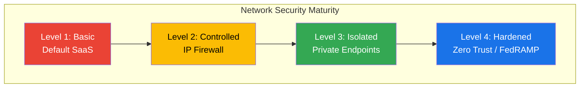
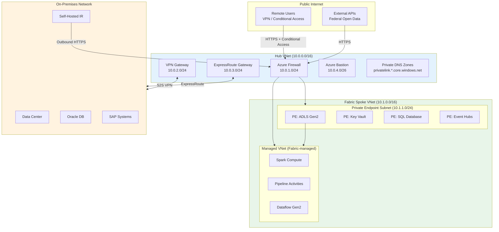
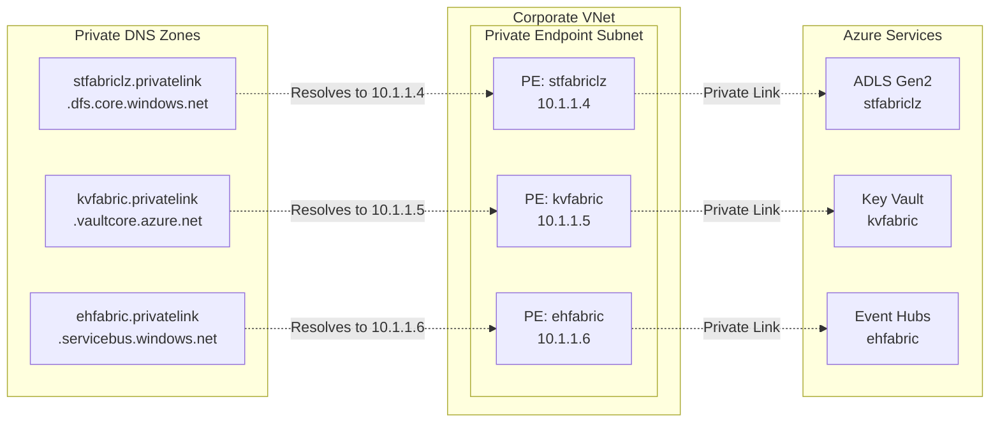
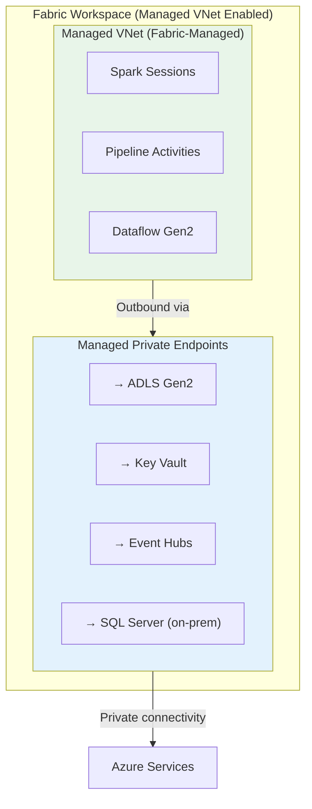
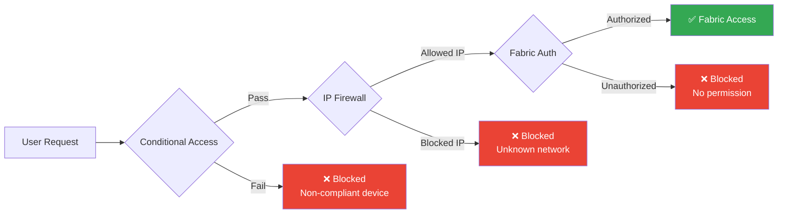
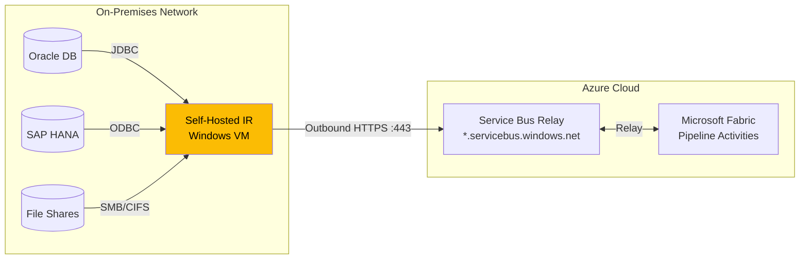
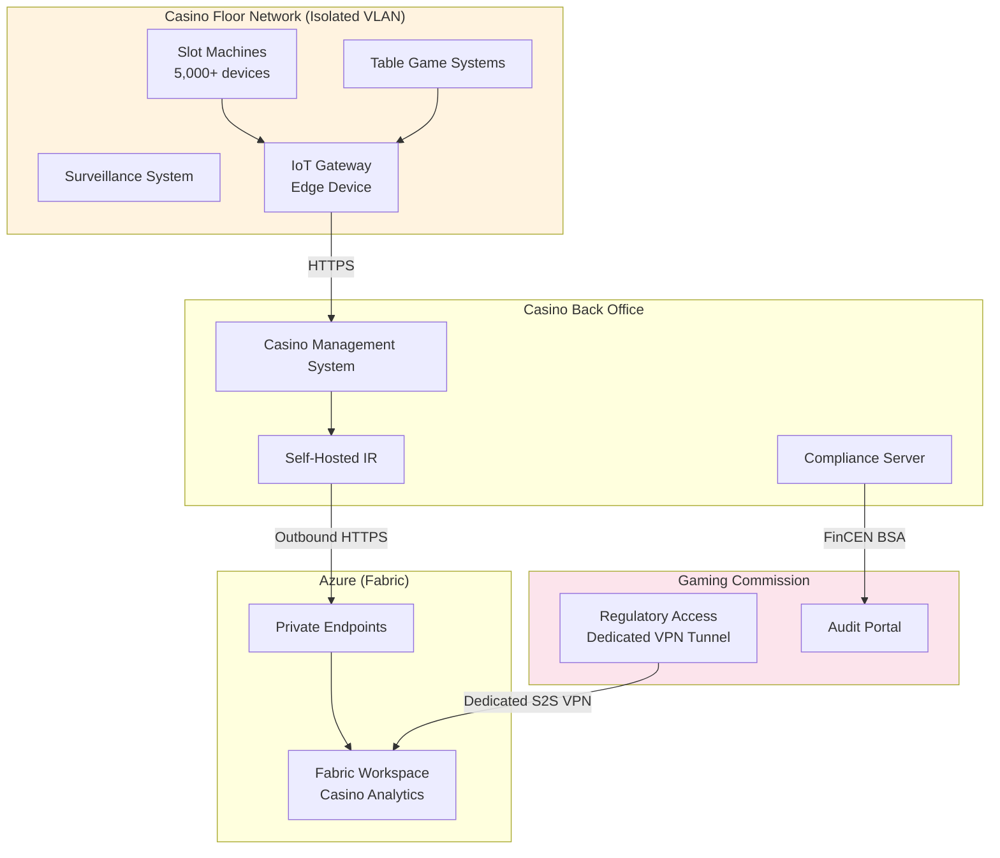
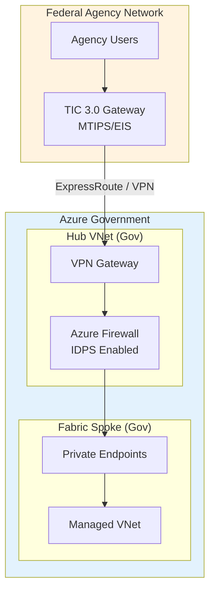
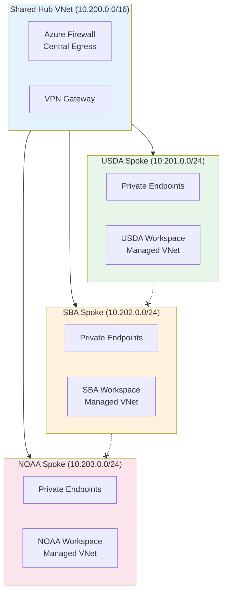

# 🔒 Network Security for Microsoft Fabric

<div align="center" markdown>

**Defense-in-Depth Network Architecture for Enterprise Analytics**


</div>

---

**Last Updated:** `2026-04-13` | **Version:** 1.0.0

---

## 🎯 Overview

Microsoft Fabric operates as a SaaS platform with multiple network security layers to control data access, protect data in transit, and isolate workloads. A defense-in-depth strategy combines Private Endpoints, Managed VNet, IP Firewall rules, and on-premises connectivity to meet enterprise and government security requirements.

### Defense-in-Depth Layers

| Layer | Control | Purpose |
|-------|---------|---------|
| **Identity** | Entra ID + Conditional Access | Authenticate and authorize users |
| **Perimeter** | IP Firewall + Conditional Access policies | Restrict access by network location |
| **Network** | Private Endpoints + Managed VNet | Isolate traffic from public internet |
| **Transport** | TLS 1.2+ encryption | Protect data in transit |
| **Application** | Workspace roles + item permissions | Fine-grained access control |
| **Data** | RLS, OLS, CMK encryption | Protect data at rest and in query |
| **Monitoring** | Audit logs, NSG flow logs | Detect and respond to threats |

### Network Security Maturity Model

| Level | Description | Controls |
|-------|-------------|----------|
| **Level 1: Basic** | Default SaaS access | Entra ID auth, HTTPS only |
| **Level 2: Controlled** | IP-restricted access | IP Firewall rules, Conditional Access |
| **Level 3: Isolated** | Private network access | Private Endpoints, Managed VNet |
| **Level 4: Hardened** | Zero-trust network | All Level 3 + NSG + UDR + IDPS + TIC 3.0 |



---

## 🏗️ Network Architecture

### Hub-Spoke Topology



### Network Flow Matrix

| Source | Destination | Protocol | Port | NSG Rule | Purpose |
|--------|------------|----------|------|----------|---------|
| User (VPN) | Fabric Portal | HTTPS | 443 | Allow | Dashboard access |
| User (VPN) | ADLS Gen2 PE | HTTPS | 443 | Allow | Direct data access |
| Spark (Managed VNet) | ADLS Gen2 PE | HTTPS | 443 | Allow | Data read/write |
| Spark (Managed VNet) | Key Vault PE | HTTPS | 443 | Allow | Secret retrieval |
| Pipeline | Event Hubs PE | AMQP | 5671 | Allow | Stream ingestion |
| SHIR (On-Prem) | Azure Firewall | HTTPS | 443 | Allow | On-prem data movement |
| SHIR (On-Prem) | Service Bus Relay | HTTPS | 443 | Allow | IR communication |
| Any | Any | Any | Any | Deny | Default deny |

---

## 🔐 Private Endpoints

### Overview

Private Endpoints bring Azure services into your VNet through a private IP address, eliminating exposure to the public internet. For Fabric, Private Endpoints protect the data layer (ADLS Gen2, Key Vault, Event Hubs, SQL Database) that Fabric workloads access.

### Private Endpoint Architecture



### Bicep Deployment

```bicep
// Private Endpoint for ADLS Gen2 Storage Account
resource adlsPrivateEndpoint 'Microsoft.Network/privateEndpoints@2023-09-01' = {
  name: 'pe-adls-fabric-${environment}'
  location: location
  properties: {
    subnet: {
      id: privateEndpointSubnetId
    }
    privateLinkServiceConnections: [
      {
        name: 'plsc-adls-dfs'
        properties: {
          privateLinkServiceId: storageAccountId
          groupIds: ['dfs']  // Data Lake Storage endpoint
        }
      }
    ]
  }
}

// Private DNS Zone for ADLS
resource adlsDnsZone 'Microsoft.Network/privateDnsZones@2020-06-01' = {
  name: 'privatelink.dfs.core.windows.net'
  location: 'global'
}

// DNS Zone Group (auto-register DNS records)
resource adlsDnsZoneGroup 'Microsoft.Network/privateEndpoints/privateDnsZoneGroups@2023-09-01' = {
  parent: adlsPrivateEndpoint
  name: 'default'
  properties: {
    privateDnsZoneConfigs: [
      {
        name: 'config-dfs'
        properties: {
          privateDnsZoneId: adlsDnsZone.id
        }
      }
    ]
  }
}

// Link DNS Zone to VNet
resource adlsDnsVNetLink 'Microsoft.Network/privateDnsZones/virtualNetworkLinks@2020-06-01' = {
  parent: adlsDnsZone
  name: 'link-${vnetName}'
  location: 'global'
  properties: {
    virtualNetwork: {
      id: vnetId
    }
    registrationEnabled: false
  }
}
```

### Private Endpoint for Key Vault

```bicep
resource kvPrivateEndpoint 'Microsoft.Network/privateEndpoints@2023-09-01' = {
  name: 'pe-kv-fabric-${environment}'
  location: location
  properties: {
    subnet: {
      id: privateEndpointSubnetId
    }
    privateLinkServiceConnections: [
      {
        name: 'plsc-kv'
        properties: {
          privateLinkServiceId: keyVaultId
          groupIds: ['vault']
        }
      }
    ]
  }
}

resource kvDnsZone 'Microsoft.Network/privateDnsZones@2020-06-01' = {
  name: 'privatelink.vaultcore.azure.net'
  location: 'global'
}
```

### Private Endpoint for Event Hubs

```bicep
resource ehPrivateEndpoint 'Microsoft.Network/privateEndpoints@2023-09-01' = {
  name: 'pe-eh-fabric-${environment}'
  location: location
  properties: {
    subnet: {
      id: privateEndpointSubnetId
    }
    privateLinkServiceConnections: [
      {
        name: 'plsc-eh'
        properties: {
          privateLinkServiceId: eventHubNamespaceId
          groupIds: ['namespace']
        }
      }
    ]
  }
}

resource ehDnsZone 'Microsoft.Network/privateDnsZones@2020-06-01' = {
  name: 'privatelink.servicebus.windows.net'
  location: 'global'
}
```

### NSG Rules for Private Endpoint Subnet

```bicep
resource peNsg 'Microsoft.Network/networkSecurityGroups@2023-09-01' = {
  name: 'nsg-pe-fabric-${environment}'
  location: location
  properties: {
    securityRules: [
      {
        name: 'AllowFabricManagedVNetInbound'
        properties: {
          priority: 100
          direction: 'Inbound'
          access: 'Allow'
          protocol: 'Tcp'
          sourceAddressPrefix: '10.1.2.0/24'  // Managed VNet range
          destinationAddressPrefix: '10.1.1.0/24'
          destinationPortRange: '443'
          sourcePortRange: '*'
        }
      }
      {
        name: 'AllowHubInbound'
        properties: {
          priority: 200
          direction: 'Inbound'
          access: 'Allow'
          protocol: 'Tcp'
          sourceAddressPrefix: '10.0.0.0/16'  // Hub VNet
          destinationAddressPrefix: '10.1.1.0/24'
          destinationPortRange: '443'
          sourcePortRange: '*'
        }
      }
      {
        name: 'DenyAllInbound'
        properties: {
          priority: 4096
          direction: 'Inbound'
          access: 'Deny'
          protocol: '*'
          sourceAddressPrefix: '*'
          destinationAddressPrefix: '*'
          destinationPortRange: '*'
          sourcePortRange: '*'
        }
      }
    ]
  }
}
```

### DNS Resolution Verification

```powershell
# Verify Private Endpoint DNS resolution
nslookup stfabriclz.dfs.core.windows.net
# Expected: Returns private IP (10.1.1.4), NOT public IP

nslookup kvfabric.vault.azure.net
# Expected: Returns private IP (10.1.1.5)

# Verify from within VNet (Azure Bastion or VM)
Resolve-DnsName stfabriclz.privatelink.dfs.core.windows.net
# Expected: A record pointing to 10.1.1.4
```

---

## 🌐 Managed VNet

### Workspace-Level Network Isolation

Fabric Managed VNet provides network isolation for Spark compute, pipelines, and dataflows at the workspace level. When enabled, all outbound traffic from these workloads traverses the Managed VNet, and you can control egress through managed private endpoints.



### Enabling Managed VNet

```python
# Enable Managed VNet on a Fabric workspace via REST API
import requests
from azure.identity import DefaultAzureCredential

def enable_managed_vnet(workspace_id: str):
    """Enable Managed VNet for a Fabric workspace."""
    credential = DefaultAzureCredential()
    token = credential.get_token("https://api.fabric.microsoft.com/.default")

    url = f"https://api.fabric.microsoft.com/v1/workspaces/{workspace_id}"

    payload = {
        "properties": {
            "managedVirtualNetworkEnabled": True
        }
    }

    response = requests.patch(
        url,
        json=payload,
        headers={
            "Authorization": f"Bearer {token.token}",
            "Content-Type": "application/json"
        }
    )
    response.raise_for_status()
    return response.json()
```

### Creating Managed Private Endpoints

```python
def create_managed_private_endpoint(
    workspace_id: str,
    name: str,
    target_resource_id: str,
    group_id: str,
):
    """Create a managed private endpoint in a Fabric workspace."""
    credential = DefaultAzureCredential()
    token = credential.get_token("https://api.fabric.microsoft.com/.default")

    url = (
        f"https://api.fabric.microsoft.com/v1/workspaces/{workspace_id}"
        f"/managedPrivateEndpoints"
    )

    payload = {
        "name": name,
        "properties": {
            "privateLinkResourceId": target_resource_id,
            "groupId": group_id,
        }
    }

    response = requests.post(
        url,
        json=payload,
        headers={
            "Authorization": f"Bearer {token.token}",
            "Content-Type": "application/json"
        }
    )
    response.raise_for_status()
    return response.json()

# Create managed PE for ADLS Gen2
create_managed_private_endpoint(
    workspace_id="workspace-guid",
    name="mpe-adls-landing",
    target_resource_id="/subscriptions/.../Microsoft.Storage/storageAccounts/stfabriclz",
    group_id="dfs"
)
```

### Managed VNet Considerations

| Aspect | Detail |
|--------|--------|
| Scope | Workspace-level (all Spark/Pipeline/Dataflow workloads) |
| Outbound traffic | All outbound routed through Managed VNet |
| Managed PE approval | Target resource owner must approve the PE connection |
| Performance | Minimal latency impact (~1-2ms additional) |
| Internet access | Blocked by default; must use managed PE for external connectivity |
| Supported workloads | Spark, Data Pipeline, Dataflow Gen2 |
| Not supported | Power BI, Eventhouse (use tenant-level controls) |

---

## 🛡️ IP Firewall

### Overview

Fabric IP Firewall rules restrict access to the Fabric portal, APIs, and SQL endpoints based on client IP address. GA in March 2026, IP Firewall operates at both the tenant and workspace levels.

### Tenant-Level IP Firewall

```python
# Configure tenant-level IP firewall via Admin API
def set_tenant_firewall(allowed_ranges: list):
    """Set tenant-level IP firewall rules."""
    credential = DefaultAzureCredential()
    token = credential.get_token("https://api.fabric.microsoft.com/.default")

    url = "https://api.fabric.microsoft.com/v1/admin/tenantsettings"

    # Tenant firewall configuration
    payload = {
        "tenantSettings": {
            "firewallRules": {
                "enabled": True,
                "allowedIpRanges": allowed_ranges,
                "blockPublicAccess": False  # Set True to block all except allowed
            }
        }
    }

    response = requests.patch(
        url,
        json=payload,
        headers={
            "Authorization": f"Bearer {token.token}",
            "Content-Type": "application/json"
        }
    )
    response.raise_for_status()

# Example: Allow corporate office and VPN ranges
set_tenant_firewall([
    {"name": "Corporate HQ", "startIpAddress": "203.0.113.0", "endIpAddress": "203.0.113.255"},
    {"name": "VPN Gateway", "startIpAddress": "198.51.100.1", "endIpAddress": "198.51.100.1"},
    {"name": "DR Office", "startIpAddress": "192.0.2.0", "endIpAddress": "192.0.2.255"},
])
```

### Workspace-Level IP Firewall

```python
# Configure workspace-level IP firewall
def set_workspace_firewall(workspace_id: str, rules: list):
    """Set workspace-level IP firewall rules."""
    credential = DefaultAzureCredential()
    token = credential.get_token("https://api.fabric.microsoft.com/.default")

    url = (
        f"https://api.fabric.microsoft.com/v1/workspaces/{workspace_id}"
        f"/firewallRules"
    )

    for rule in rules:
        response = requests.post(
            url,
            json=rule,
            headers={
                "Authorization": f"Bearer {token.token}",
                "Content-Type": "application/json"
            }
        )
        response.raise_for_status()

# Example: Restrict analytics workspace to analyst VPN
set_workspace_firewall("analytics-workspace-id", [
    {
        "name": "AnalystVPN",
        "startIpAddress": "10.100.0.1",
        "endIpAddress": "10.100.0.254",
    },
    {
        "name": "CIRunner",
        "startIpAddress": "20.42.0.0",
        "endIpAddress": "20.42.0.255",
    },
])
```

### IP Firewall Rules Matrix

| Rule Name | IP Range | Scope | Purpose |
|-----------|----------|-------|---------|
| Corporate HQ | 203.0.113.0/24 | Tenant | Office access |
| VPN Gateway | 198.51.100.1 | Tenant | Remote workers |
| GitHub Actions | 20.42.0.0/24 | Workspace (CI) | CI/CD pipelines |
| Gaming Commission | 192.168.50.0/24 | Workspace (Compliance) | Regulatory access |
| Analyst VPN | 10.100.0.0/24 | Workspace (Analytics) | BI team |
| Federal VPN | 10.200.0.0/16 | Workspace (Federal) | Agency analysts |

### Conditional Access Integration

Combine IP Firewall with Entra ID Conditional Access for defense-in-depth:



---

## 🏢 On-Premises Connectivity

### Self-Hosted Integration Runtime (SHIR)

SHIR enables Fabric pipelines to access on-premises data sources through an outbound HTTPS connection (no inbound ports required).



### SHIR Network Requirements

| Endpoint | Port | Protocol | Direction | Purpose |
|----------|------|----------|-----------|---------|
| `*.servicebus.windows.net` | 443 | HTTPS | Outbound | IR communication channel |
| `login.microsoftonline.com` | 443 | HTTPS | Outbound | Entra ID authentication |
| `*.core.windows.net` | 443 | HTTPS | Outbound | Data transfer to Azure Storage |
| `download.microsoft.com` | 443 | HTTPS | Outbound | IR auto-update |
| On-prem data source | Varies | TCP | Inbound (to source) | Data extraction |

### ExpressRoute Configuration

For high-bandwidth, low-latency connectivity between on-premises data centers and Azure:

```bicep
// ExpressRoute Gateway in Hub VNet
resource expressRouteGateway 'Microsoft.Network/virtualNetworkGateways@2023-09-01' = {
  name: 'ergw-fabric-hub'
  location: location
  properties: {
    gatewayType: 'ExpressRoute'
    sku: {
      name: 'ErGw1AZ'  // Zone-redundant
      tier: 'ErGw1AZ'
    }
    ipConfigurations: [
      {
        name: 'default'
        properties: {
          publicIPAddress: {
            id: erGatewayPublicIp.id
          }
          subnet: {
            id: gatewaySubnetId
          }
        }
      }
    ]
  }
}

// Connection to ExpressRoute circuit
resource expressRouteConnection 'Microsoft.Network/connections@2023-09-01' = {
  name: 'con-er-onprem'
  location: location
  properties: {
    connectionType: 'ExpressRoute'
    virtualNetworkGateway1: {
      id: expressRouteGateway.id
    }
    peer: {
      id: expressRouteCircuitId
    }
    authorizationKey: expressRouteAuthKey
    routingWeight: 0
  }
}
```

### Site-to-Site VPN (Alternative)

```bicep
// VPN Gateway (for environments without ExpressRoute)
resource vpnGateway 'Microsoft.Network/virtualNetworkGateways@2023-09-01' = {
  name: 'vpngw-fabric-hub'
  location: location
  properties: {
    gatewayType: 'Vpn'
    vpnType: 'RouteBased'
    sku: {
      name: 'VpnGw2AZ'
      tier: 'VpnGw2AZ'
    }
    ipConfigurations: [
      {
        name: 'default'
        properties: {
          publicIPAddress: {
            id: vpnGatewayPublicIp.id
          }
          subnet: {
            id: gatewaySubnetId
          }
        }
      }
    ]
  }
}

// Local Network Gateway (on-premises)
resource localNetworkGateway 'Microsoft.Network/localNetworkGateways@2023-09-01' = {
  name: 'lgw-onprem-dc'
  location: location
  properties: {
    gatewayIpAddress: onPremPublicIp
    localNetworkAddressSpace: {
      addressPrefixes: [
        '172.16.0.0/12'  // On-premises CIDR
      ]
    }
  }
}
```

---

## 🎰 Casino Network Requirements

### Gaming Commission Network Compliance

Casino network architectures must satisfy gaming commission requirements for data isolation, monitoring access, and regulatory reporting connectivity.



### Casino Network Security Controls

| Requirement | Standard | Implementation |
|-------------|----------|----------------|
| Floor network isolation | NIGC MICS §542.17 | Separate VLAN, no internet access |
| Regulatory access | State gaming commission | Dedicated VPN tunnel with IP whitelist |
| Data encryption in transit | PCI DSS 4.0 §4.1 | TLS 1.2+ on all connections |
| Network monitoring | PCI DSS 4.0 §10.6 | NSG flow logs + Azure Firewall logs |
| Segmentation testing | PCI DSS 4.0 §11.4 | Quarterly network penetration tests |
| Secure remote access | PCI DSS 4.0 §8.4 | MFA + Conditional Access + VPN |
| Wireless security | PCI DSS 4.0 §11.2 | No wireless on gaming floor VLAN |

### Casino IP Firewall Rules

```python
# Casino-specific IP firewall configuration
CASINO_FIREWALL_RULES = [
    {
        "name": "CasinoHQ-BackOffice",
        "startIpAddress": "10.50.0.1",
        "endIpAddress": "10.50.0.254",
        "description": "Casino back office network"
    },
    {
        "name": "GamingCommission-NV",
        "startIpAddress": "192.168.50.1",
        "endIpAddress": "192.168.50.10",
        "description": "Nevada Gaming Commission audit access"
    },
    {
        "name": "GamingCommission-NJ",
        "startIpAddress": "192.168.51.1",
        "endIpAddress": "192.168.51.10",
        "description": "NJ DGE audit access"
    },
    {
        "name": "FinCEN-Reporting",
        "startIpAddress": "170.72.0.0",
        "endIpAddress": "170.72.255.255",
        "description": "FinCEN BSA E-Filing"
    },
    {
        "name": "CICD-Pipeline",
        "startIpAddress": "20.42.0.1",
        "endIpAddress": "20.42.0.100",
        "description": "GitHub Actions runners"
    },
]
```

---

## 🏛️ Federal Network Requirements

### FedRAMP Network Controls

| Control ID | Control Name | Implementation |
|-----------|-------------|----------------|
| **AC-17** | Remote Access | VPN + Conditional Access + MFA for all remote users |
| **AC-17(1)** | Automated Monitoring/Control | Azure Firewall logging + NSG flow logs |
| **AC-17(2)** | Protection of Confidentiality/Integrity | TLS 1.2+ + Private Endpoints |
| **CA-3** | Information Exchange | Managed PE for cross-boundary data flows |
| **SC-7** | Boundary Protection | Azure Firewall + NSG + IP Firewall |
| **SC-7(3)** | Access Points | Limited to Private Endpoints + VPN gateway |
| **SC-7(4)** | External Telecommunications Services | ExpressRoute with Microsoft peering |
| **SC-7(5)** | Deny by Default / Allow by Exception | NSG default deny + explicit allow rules |
| **SC-7(8)** | Route Traffic to Proxy | Azure Firewall for egress inspection |
| **SC-7(18)** | Fail Secure | NSG default deny ensures fail-closed |
| **SC-8** | Transmission Confidentiality | TLS 1.2+ minimum on all connections |
| **SC-8(1)** | Cryptographic Protection | TLS 1.2+ with approved cipher suites |

### TIC 3.0 Compliance

Trusted Internet Connections (TIC) 3.0 requires federal agencies to protect the boundary between agency networks and external services, including cloud.



### TIC 3.0 Use Case Mapping

| TIC 3.0 Use Case | Description | Fabric Implementation |
|-------------------|-------------|----------------------|
| **Traditional TIC** | Traffic through agency TIC access point | ExpressRoute from MTIPS to Azure |
| **Cloud with TIC** | Cloud workloads behind TIC | Azure Firewall in Hub VNet as TICAP |
| **Branch Office** | Remote offices accessing cloud | S2S VPN to Hub VNet |
| **Remote User** | Telework accessing cloud | Conditional Access + VPN + IP Firewall |

### Impact Level Network Requirements

| Impact Level | Network Isolation | Encryption | Monitoring |
|-------------|-------------------|------------|------------|
| **IL2** (Public) | Standard VNet | TLS 1.2+ | Standard logging |
| **IL4** (CUI) | Dedicated VNet + Private Endpoints | TLS 1.2+ FIPS 140-2 | Enhanced logging + SIEM |
| **IL5** (National Security) | Isolated VNet + no internet egress | TLS 1.3 + FIPS 140-2 L2 | Continuous monitoring + SOC |

### Federal Multi-Agency Network Isolation



> **Note:** Spokes are peered to the Hub only, not to each other. This prevents cross-agency network access while sharing central egress through Azure Firewall.

---

## 🔍 Troubleshooting

### Common Network Issues

#### Issue 1: Private Endpoint DNS Resolution Failure

**Symptom:** Spark notebooks fail with "Could not resolve host" when accessing ADLS Gen2.

**Cause:** Private DNS zone not linked to the Managed VNet or Hub VNet.

**Resolution:**

```powershell
# Check DNS zone VNet links
az network private-dns link vnet list \
  --zone-name privatelink.dfs.core.windows.net \
  --resource-group rg-dns-zones \
  --output table

# Add missing VNet link
az network private-dns link vnet create \
  --name "link-fabric-spoke" \
  --zone-name privatelink.dfs.core.windows.net \
  --resource-group rg-dns-zones \
  --virtual-network /subscriptions/.../virtualNetworks/vnet-fabric-spoke \
  --registration-enabled false
```

#### Issue 2: SHIR Cannot Connect to Service Bus

**Symptom:** Self-Hosted Integration Runtime shows "Offline" status.

**Cause:** Corporate firewall blocking outbound HTTPS to `*.servicebus.windows.net`.

**Resolution:**

```powershell
# Test connectivity from SHIR machine
Test-NetConnection -ComputerName "ir-relay.servicebus.windows.net" -Port 443

# If blocked, add firewall exception for:
# *.servicebus.windows.net:443 (HTTPS)
# *.frontend.clouddatahub.net:443 (HTTPS)
```

#### Issue 3: IP Firewall Blocking Legitimate Users

**Symptom:** Users receive "403 Forbidden" when accessing Fabric portal.

**Cause:** User's IP not in the allowed IP ranges, or VPN assigns a different IP.

**Resolution:**

```python
# Check current IP against firewall rules
import requests

def check_my_ip():
    """Get current public IP to verify against firewall rules."""
    response = requests.get("https://api.ipify.org?format=json")
    return response.json()["ip"]

# Add the IP to firewall rules if legitimate
current_ip = check_my_ip()
print(f"Current IP: {current_ip}")
# Then add to workspace firewall rules
```

#### Issue 4: Managed Private Endpoint Pending Approval

**Symptom:** Managed PE status shows "Pending" indefinitely.

**Cause:** The target resource owner has not approved the PE connection.

**Resolution:**

```bash
# List pending PE connections on the target resource
az network private-endpoint-connection list \
  --name stfabriclz \
  --resource-group rg-fabric-prod \
  --type Microsoft.Storage/storageAccounts \
  --output table

# Approve the pending connection
az network private-endpoint-connection approve \
  --name <connection-name> \
  --resource-name stfabriclz \
  --resource-group rg-fabric-prod \
  --type Microsoft.Storage/storageAccounts
```

#### Issue 5: ExpressRoute Latency Spikes

**Symptom:** Data pipeline performance degrades during business hours.

**Cause:** ExpressRoute circuit bandwidth saturation.

**Resolution:**

```kql
// Monitor ExpressRoute circuit utilization
AzureMetrics
| where ResourceProvider == "MICROSOFT.NETWORK"
| where ResourceType == "EXPRESSROUTECIRCUITS"
| where MetricName == "BitsInPerSecond" or MetricName == "BitsOutPerSecond"
| summarize AvgBits = avg(Average), MaxBits = max(Maximum)
    by bin(TimeGenerated, 5m), MetricName
| extend AvgMbps = AvgBits / 1_000_000
| render timechart
```

### Network Diagnostic Commands

```powershell
# Comprehensive network diagnostic checklist
# 1. Verify Private Endpoint resolution
nslookup stfabriclz.dfs.core.windows.net

# 2. Test HTTPS connectivity to Fabric
Test-NetConnection -ComputerName "api.fabric.microsoft.com" -Port 443

# 3. Test HTTPS connectivity to ADLS
Test-NetConnection -ComputerName "stfabriclz.dfs.core.windows.net" -Port 443

# 4. Check NSG flow logs for blocked traffic
az network watcher flow-log show \
  --nsg nsg-pe-fabric-prod \
  --resource-group rg-fabric-prod

# 5. Verify Azure Firewall rules
az network firewall rule-collection-group list \
  --firewall-name fw-fabric-hub \
  --resource-group rg-hub
```

---

## ⚠️ Limitations

| Limitation | Details | Workaround |
|-----------|---------|------------|
| **No Private Link for Fabric portal** | Fabric portal (app.fabric.microsoft.com) is always accessed via public internet | Use Conditional Access + IP Firewall to restrict access |
| **Managed VNet not for Power BI** | Power BI datasets/reports do not use Managed VNet | Use tenant-level IP Firewall + Conditional Access |
| **Eventhouse networking** | Eventhouse does not support Managed VNet | Use tenant-level controls; encrypt data in transit |
| **IP Firewall latency** | IP changes (VPN reconnect) can take minutes to propagate | Use IP ranges instead of individual IPs |
| **Managed PE approval** | Each PE requires manual approval on the target resource | Automate approval via Azure Policy or scripting |
| **SHIR single-VNet** | SHIR can only be in one VNet at a time | Deploy multiple SHIR nodes in different VNets if needed |
| **Cross-region Private Endpoints** | Private Endpoints must be in the same region as the VNet | Deploy PEs in each region's VNet |
| **DNS complexity** | Private DNS zones require careful planning for split-horizon DNS | Use Azure Private DNS Resolver for hybrid scenarios |

---

## 📚 References

### Microsoft Documentation

- [Fabric network security overview](https://learn.microsoft.com/fabric/security/security-overview)
- [Private endpoints for Fabric](https://learn.microsoft.com/fabric/security/security-private-links-overview)
- [Managed VNet for Fabric](https://learn.microsoft.com/fabric/security/security-managed-vnets-fabric-overview)
- [IP Firewall for Fabric](https://learn.microsoft.com/fabric/security/security-ip-firewall)
- [Self-Hosted Integration Runtime](https://learn.microsoft.com/azure/data-factory/create-self-hosted-integration-runtime)
- [Azure Private Link](https://learn.microsoft.com/azure/private-link/private-link-overview)
- [Azure Private DNS zones](https://learn.microsoft.com/azure/dns/private-dns-overview)
- [Azure ExpressRoute](https://learn.microsoft.com/azure/expressroute/expressroute-introduction)

### Network Design

- [Azure hub-spoke network topology](https://learn.microsoft.com/azure/architecture/networking/architecture/hub-spoke)
- [Azure Firewall architecture](https://learn.microsoft.com/azure/firewall/overview)
- [NSG best practices](https://learn.microsoft.com/azure/virtual-network/network-security-group-how-it-works)

### Compliance

- [FedRAMP SC control family](https://www.fedramp.gov/assets/resources/documents/FedRAMP_Security_Controls_Baseline.xlsx)
- [TIC 3.0 reference architecture](https://www.cisa.gov/sites/default/files/publications/CISA_TIC%203.0_Vol.%203_Cloud_Use_Case.pdf)
- [PCI DSS v4.0 network requirements](https://www.pcisecuritystandards.org/)
- [NIGC MICS §542.17 IT standards](https://www.nigc.gov/compliance/minimum-internal-control-standards)
- [NIST SP 800-53 SC controls](https://csrc.nist.gov/publications/detail/sp/800-53/rev-5/final)

---

## Related Documents

- [Customer-Managed Keys](./customer-managed-keys.md) -- Key Vault network configuration for CMK
- [Outbound Access Protection](./outbound-access-protection.md) -- Tenant-level outbound network controls
- [OneLake Security](../features/onelake-security.md) -- Data-level security within OneLake
- [Data Governance Deep Dive](./data-governance-deep-dive.md) -- Access controls and compliance
- [Disaster Recovery & BCDR](./disaster-recovery-bcdr.md) -- DR network configuration

---

[Back to Best Practices Index](./index.md) | [Back to Documentation](../index.md)
