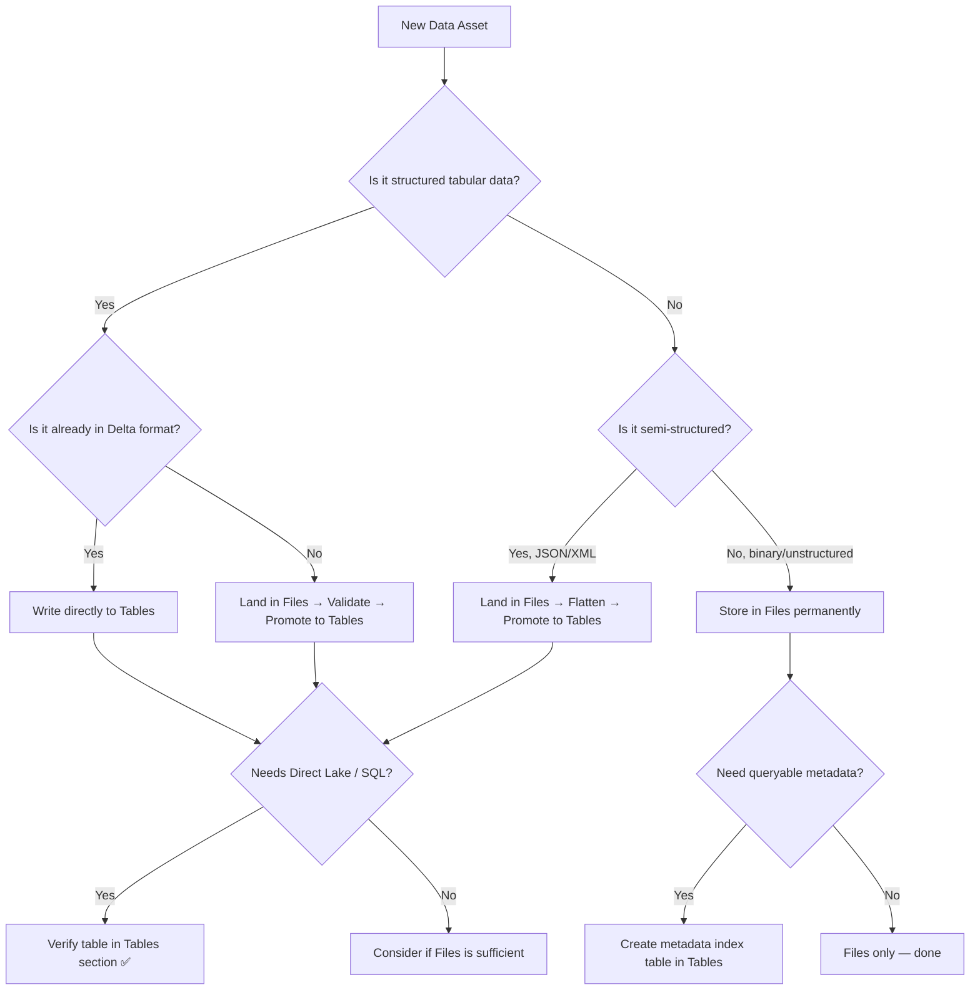

# 📂 OneLake Files vs Tables Decision Guide

<div align="center" markdown>

**Choose the Right Storage Strategy for Every Data Asset in Microsoft Fabric**


</div>

---

**Last Updated:** `2026-04-27` | **Version:** 1.0.0

---

## 🎯 Overview

Every Fabric Lakehouse contains two top-level storage areas: **Files** and **Tables**. Both reside in OneLake (backed by ADLS Gen2), but they serve fundamentally different purposes and unlock different capabilities. Choosing incorrectly leads to query failures, broken Direct Lake reports, or wasted compute.

### Key Distinction

| Aspect | Files Section | Tables Section |
|--------|--------------|----------------|
| **Storage path** | `Files/…` (arbitrary folders) | `Tables/…` (managed Delta tables) |
| **Format** | Any (CSV, JSON, Parquet, images, PDF) | Delta Lake only |
| **SQL queryable** | No (not via SQL endpoint) | Yes (automatic SQL endpoint) |
| **Direct Lake** | Not compatible | Fully compatible |
| **Schema** | None enforced | Schema-on-write via Delta |
| **Time travel** | Not available | Full Delta versioning |
| **ACID** | No transactional guarantees | Full ACID transactions |
| **V-Order** | Not applicable | Applied automatically on write |

---

## 📊 Decision Matrix

Use this matrix to determine where each data asset belongs:

| Data Characteristic | Files | Tables | Rationale |
|---------------------|:-----:|:------:|-----------|
| Structured tabular data (CSV, Parquet ingest) | Landing only | **Final** | Tables provide schema, SQL access, Direct Lake |
| Semi-structured JSON / XML | **Yes** | After flattening | Store raw; promote flattened version to Tables |
| Unstructured (images, PDFs, audio, video) | **Yes** | No | Tables cannot store binary blobs efficiently |
| Machine learning model artifacts (.pkl, .onnx) | **Yes** | No | Not tabular data |
| Streaming landing zone (raw events) | **Yes** | After micro-batch | Land in Files; structured merge into Tables |
| Reference/lookup data (< 100 MB) | No | **Yes** | Direct Lake dimension tables |
| Compliance filings (CTR, SAR PDFs) | **Yes** | Metadata only | Store PDF in Files; index metadata in Tables |
| Configuration files (YAML, JSON config) | **Yes** | No | Not queryable data |
| Large Parquet datasets (query-ready) | No | **Yes** | Convert to Delta for SQL + Direct Lake |
| Intermediate Spark outputs | **Yes** | Only if reused | Temp outputs in Files; durable outputs in Tables |
| External partner data drops | **Yes** | After validation | Land in Files; validate then promote to Tables |

### Quick Rule

> **If a downstream consumer needs to query it with SQL or display it in Power BI, it belongs in Tables. Everything else goes in Files.**

---

## 📁 Files Section Deep Dive

### Appropriate Use Cases

**1. Landing Zone for Raw Ingestion**

```python
# Land raw CSV files from external SFTP
raw_path = "Files/landing/casino/slot_telemetry/2026/04/27/"

# Read from landing zone
df_raw = spark.read.format("csv") \
    .option("header", "true") \
    .option("inferSchema", "true") \
    .load(f"abfss://{workspace}@onelake.dfs.fabric.microsoft.com/{lakehouse}/{raw_path}")

# After validation, promote to Tables (see promotion section)
```

**2. Unstructured Data Storage**

```python
# Store compliance document scans
doc_path = "Files/compliance/sar_filings/2026/04/"

# Store metadata about the documents in a Delta table
doc_metadata = spark.createDataFrame([
    ("SAR-2026-04-001", "Files/compliance/sar_filings/2026/04/sar_001.pdf", "2026-04-15", "pending_review"),
    ("SAR-2026-04-002", "Files/compliance/sar_filings/2026/04/sar_002.pdf", "2026-04-16", "submitted"),
], ["filing_id", "document_path", "filing_date", "status"])

doc_metadata.write.format("delta").mode("append").saveAsTable("gold.sar_filing_index")
```

**3. Multi-Format Data Hub**

```python
# Files section supports any format
files_structure = """
Files/
├── landing/
│   ├── csv/          # Partner CSV drops
│   ├── json/         # API response snapshots
│   └── xml/          # Legacy system exports
├── models/
│   ├── onnx/         # ML model artifacts
│   └── checkpoints/  # Training checkpoints
├── compliance/
│   ├── sar_filings/  # PDF scans
│   └── ctr_filings/  # PDF scans
└── temp/
    └── spark_staging/ # Intermediate outputs
"""
```

### Files Section Folder Organization

| Folder | Purpose | Retention |
|--------|---------|-----------|
| `landing/` | Raw data drops before validation | 7-30 days |
| `archive/` | Processed files moved post-ingestion | 90 days - 7 years |
| `models/` | ML artifacts, ONNX models | Versioned indefinitely |
| `compliance/` | Regulatory documents (PDF, images) | Per regulation (5-7 years) |
| `temp/` | Spark staging, intermediate outputs | 24-48 hours |
| `reference/` | Static config files, lookup CSVs | Indefinite |

---

## 📋 Tables Section Deep Dive

### Why Tables for All Structured Data

**1. Automatic SQL Endpoint**

Every Delta table in the Tables section is automatically exposed via the Lakehouse SQL endpoint. No configuration needed.

```sql
-- Accessible immediately via SQL endpoint
SELECT machine_id, SUM(coin_in) as total_coin_in
FROM lh_gold.slot_performance_daily
WHERE gaming_date >= '2026-04-01'
GROUP BY machine_id
ORDER BY total_coin_in DESC;
```

**2. Direct Lake Compatibility**

Direct Lake mode in Power BI reads directly from Delta tables in the Tables section. Files section data is **not** accessible via Direct Lake.

```python
# This table is automatically available to Direct Lake
df_gold.write.format("delta") \
    .mode("overwrite") \
    .option("overwriteSchema", "true") \
    .saveAsTable("gold.slot_performance_daily")

# V-Order is applied automatically, optimizing Direct Lake reads
```

**3. Schema Enforcement**

```python
from pyspark.sql.types import StructType, StructField, StringType, DoubleType, TimestampType

slot_schema = StructType([
    StructField("machine_id", StringType(), False),
    StructField("timestamp", TimestampType(), False),
    StructField("coin_in", DoubleType(), True),
    StructField("coin_out", DoubleType(), True),
    StructField("denomination", DoubleType(), False),
])

# Schema enforcement rejects malformed records
df_validated = spark.read.schema(slot_schema).json("Files/landing/slot_events/")
df_validated.write.format("delta").mode("append").saveAsTable("bronze.slot_telemetry")
```

**4. ACID Transactions and Time Travel**

```python
# Time travel for compliance audits
df_as_of = spark.read.format("delta") \
    .option("timestampAsOf", "2026-04-15T00:00:00Z") \
    .table("silver.player_transactions")

# Restore a table to a prior version after bad data load
from delta.tables import DeltaTable
dt = DeltaTable.forName(spark, "silver.player_transactions")
dt.restoreToVersion(42)
```

### Tables with Lakehouse Schemas (GA 2026)

```python
# Using Lakehouse Schemas to organize by medallion layer
# Tables appear under: Tables/bronze/*, Tables/silver/*, Tables/gold/*

df.write.format("delta").mode("append").saveAsTable("bronze.slot_telemetry")
df.write.format("delta").mode("overwrite").saveAsTable("silver.slot_cleansed")
df.write.format("delta").mode("overwrite").saveAsTable("gold.slot_kpi_daily")

# SQL access with schema prefix
# SELECT * FROM lh_main.bronze.slot_telemetry
```

---

## ⚡ Performance Comparison

### Query Performance

| Scenario | Files (Parquet) | Tables (Delta) | Delta Advantage |
|----------|:--------------:|:--------------:|:---------------:|
| Point lookup by key | ~2.5s | ~0.3s | 8x faster (data skipping) |
| Full scan 100M rows | ~45s | ~38s | 1.2x faster (V-Order) |
| Aggregation with filter | ~12s | ~3s | 4x faster (predicate pushdown + stats) |
| Join two datasets | ~30s | ~8s | 3.7x faster (Z-Order + broadcast) |
| Concurrent reads (10 users) | Fails/slow | Consistent | ACID isolation |

### Write Performance

| Scenario | Files (raw write) | Tables (Delta write) | Notes |
|----------|:-----------------:|:-------------------:|-------|
| Append 1M rows | ~5s | ~8s | Delta overhead: transaction log + V-Order |
| Overwrite 10M rows | ~15s | ~20s | Delta: snapshot isolation cost |
| Streaming micro-batch | ~2s | ~5s | Delta: commit protocol overhead |

> **Key Insight:** Tables (Delta) have slightly higher write latency due to transaction log and V-Order encoding, but dramatically better read performance. For read-heavy analytical workloads (the primary Fabric use case), Tables always win.

### Storage Overhead

| Format | 100M Rows Raw Size | Compressed Size | Overhead |
|--------|:------------------:|:--------------:|:--------:|
| CSV (Files) | 12 GB | N/A | Baseline |
| Parquet (Files) | 2.1 GB | — | 82% reduction |
| Delta (Tables) | 2.3 GB | — | +10% vs Parquet (transaction log) |
| Delta + V-Order (Tables) | 2.3 GB | — | Same size, faster reads |

---

## 🔄 Files-to-Tables Promotion

### Standard Promotion Pattern

```python
# Step 1: Read from Files landing zone
df_landing = spark.read.format("csv") \
    .option("header", "true") \
    .schema(defined_schema) \
    .load("Files/landing/usda_crop_production/2026/04/")

# Step 2: Validate
from pyspark.sql.functions import col, when, count

null_check = df_landing.select([
    count(when(col(c).isNull(), c)).alias(c) for c in df_landing.columns
])
null_counts = null_check.collect()[0]
for field in defined_schema.fields:
    if not field.nullable and null_counts[field.name] > 0:
        raise ValueError(f"Non-nullable field {field.name} has {null_counts[field.name]} nulls")

# Step 3: Write to Tables as Delta
df_landing.write.format("delta") \
    .mode("append") \
    .option("mergeSchema", "true") \
    .saveAsTable("bronze.usda_crop_production")

# Step 4: Archive processed files
mssparkutils.fs.mv(
    "Files/landing/usda_crop_production/2026/04/",
    "Files/archive/usda_crop_production/2026/04/"
)
```

### Incremental Promotion with Watermark

```python
from pyspark.sql.functions import max as spark_max

# Get high watermark from last successful load
watermark_df = spark.sql("SELECT max(ingestion_timestamp) as hwm FROM bronze.epa_air_quality")
high_watermark = watermark_df.collect()[0]["hwm"]

# Read only new files
df_new = spark.read.format("json") \
    .load("Files/landing/epa_air_quality/") \
    .filter(col("_metadata.file_modification_time") > high_watermark)

if df_new.count() > 0:
    df_new.withColumn("ingestion_timestamp", current_timestamp()) \
        .write.format("delta").mode("append") \
        .saveAsTable("bronze.epa_air_quality")
```

---

## 🎰 Casino Industry Patterns

| Data Asset | Section | Rationale |
|------------|---------|-----------|
| Slot telemetry (real-time events) | Tables | Structured, queryable, Direct Lake KPIs |
| Player card swipe logs | Tables | Structured, joins with player dim |
| Surveillance camera frames | Files | Binary image data |
| Compliance PDFs (CTR, SAR, W-2G) | Files | Unstructured documents |
| Compliance filing metadata | Tables | Queryable index for audit |
| Player loyalty CSV imports | Files → Tables | Land in Files, promote to Tables |
| Cage transaction logs | Tables | Structured financial data |
| Floor layout diagrams (CAD/SVG) | Files | Non-tabular |

## 🏛️ Federal Agency Patterns

| Data Asset | Section | Rationale |
|------------|---------|-----------|
| USDA crop production statistics | Tables | Structured, analytical queries |
| SBA loan application CSVs (raw) | Files → Tables | Land raw, validate, promote |
| NOAA weather station JSON feeds | Files → Tables | Semi-structured landing, then flatten |
| EPA air quality sensor readings | Tables | Time-series, KQL-queryable |
| DOI land survey GeoJSON | Files + Tables | GeoJSON in Files, attributes in Tables |
| DOJ case document scans (PDF) | Files | Unstructured compliance documents |
| DOJ case metadata | Tables | Structured index for search/reporting |

---

## 🚫 Anti-Patterns

### Anti-Pattern 1: Storing CSVs Directly in Tables

```python
# ❌ WRONG: CSV files placed in Tables/ folder manually
# They won't be recognized as Delta tables and will cause errors
mssparkutils.fs.cp("Files/landing/data.csv", "Tables/data.csv")  # BROKEN

# ✅ CORRECT: Read CSV and write as Delta table
df = spark.read.csv("Files/landing/data.csv", header=True)
df.write.format("delta").saveAsTable("bronze.imported_data")
```

### Anti-Pattern 2: Querying Files Section via SQL Endpoint

```sql
-- ❌ WRONG: Files section is invisible to SQL endpoint
SELECT * FROM "Files/landing/transactions.parquet";  -- ERROR: table not found

-- ✅ CORRECT: Only Tables section is SQL-queryable
SELECT * FROM bronze.transactions;
```

### Anti-Pattern 3: Storing Large Binary Data in Tables

```python
# ❌ WRONG: Storing image bytes in Delta tables
df_images = spark.createDataFrame([
    ("img_001", open("surveillance_001.jpg", "rb").read()),
], ["image_id", "image_bytes"])
df_images.write.format("delta").saveAsTable("bronze.surveillance")  # Huge, slow, wasteful

# ✅ CORRECT: Store path reference in table, file in Files
df_index = spark.createDataFrame([
    ("img_001", "Files/surveillance/2026/04/27/cam_01_001.jpg", "2026-04-27T14:30:00Z"),
], ["image_id", "file_path", "capture_time"])
df_index.write.format("delta").saveAsTable("bronze.surveillance_index")
```

### Anti-Pattern 4: Using Files as Long-Term Queryable Storage

```python
# ❌ WRONG: Keeping Parquet in Files and querying with Spark repeatedly
df = spark.read.parquet("Files/analytics/player_summary/")  # No caching, no stats, no V-Order

# ✅ CORRECT: Promote to Tables for repeated queries
df.write.format("delta").saveAsTable("gold.player_summary")  # V-Order, data skipping, SQL access
```

### Anti-Pattern 5: Skipping the Landing Zone

```python
# ❌ WRONG: Writing external data directly to Tables without validation
spark.read.csv("https://external-api.com/data.csv") \
    .write.format("delta").saveAsTable("bronze.external")  # No validation, no replay

# ✅ CORRECT: Land first, validate, then promote
# 1. Download to Files/landing/
# 2. Validate schema + quality
# 3. Write validated data to Tables
```

---

## 🌳 Decision Flowchart



---

## 🔒 Security & Governance Considerations

### Access Control Differences

| Capability | Files Section | Tables Section |
|------------|:------------:|:--------------:|
| **Workspace roles** | Read/Write via workspace membership | Read/Write via workspace membership |
| **Item-level sharing** | Share lakehouse grants Files access | Share lakehouse grants Tables access |
| **SQL endpoint security** | N/A (not visible) | Row-level security (RLS) supported |
| **OneLake data access roles** | Folder-level RBAC (preview) | Table-level RBAC (preview) |
| **Sensitivity labels** | Applied at lakehouse level | Applied at lakehouse level |
| **Column-level security** | N/A | Via SQL endpoint views |

### Governance Best Practices

```python
# Pattern: PII in Files (encrypted), metadata in Tables
# Scenario: Player social security numbers for W-2G compliance

# ❌ WRONG: SSN stored in a Delta table accessible via SQL endpoint
df.withColumn("ssn", col("raw_ssn")) \
    .write.format("delta").saveAsTable("silver.player_pii")
# SSN queryable by anyone with SQL endpoint access

# ✅ CORRECT: Hashed SSN in Tables, raw encrypted in Files (restricted)
import hashlib
import os

salt = os.environ.get("FABRIC_POC_HASH_SALT", "")
if not salt:
    raise ValueError("FABRIC_POC_HASH_SALT environment variable required")

@udf(StringType())
def hash_ssn(ssn):
    return hashlib.sha256(f"{salt}{ssn}".encode()).hexdigest()

# Tables: only the hash (for matching, not reversible)
df.withColumn("ssn_hash", hash_ssn(col("raw_ssn"))) \
    .drop("raw_ssn") \
    .write.format("delta").saveAsTable("silver.player_profile")

# Files: encrypted original (for compliance retrieval only)
# Stored in restricted Files folder with limited access
df.select("player_id", "raw_ssn") \
    .write.format("parquet") \
    .mode("overwrite") \
    .save("Files/restricted/player_pii/")
```

### Retention & Lifecycle Policies

| Section | Data Type | Retention Strategy |
|---------|-----------|-------------------|
| Files/landing/ | Raw drops | Delete after promotion to Tables (7-30 days) |
| Files/archive/ | Processed originals | Per regulatory requirement (5-7 years) |
| Files/compliance/ | Regulatory PDFs | Per regulation (CTR: 5 years, SAR: 5 years) |
| Files/temp/ | Intermediate outputs | 24-48 hours (auto-cleanup) |
| Tables/bronze.* | Raw Delta tables | VACUUM after 7-30 days of time travel |
| Tables/silver.* | Cleansed Delta tables | VACUUM after 7-14 days |
| Tables/gold.* | Aggregated Delta tables | VACUUM after 7 days |

```python
# Automated cleanup for landing zone
from datetime import datetime, timedelta

cutoff = datetime.now() - timedelta(days=30)
landing_files = mssparkutils.fs.ls("Files/landing/")

for item in landing_files:
    if item.isDir:
        sub_files = mssparkutils.fs.ls(item.path)
        for f in sub_files:
            mod_time = datetime.fromtimestamp(f.modifyTime / 1000)
            if mod_time < cutoff:
                mssparkutils.fs.rm(f.path, recurse=True)
                print(f"Cleaned: {f.path} (modified {mod_time})")
```

---

## 📐 OneLake Shortcuts and External Data

### Shortcuts in Files vs Tables

OneLake shortcuts can point to external storage (ADLS Gen2, S3, GCS) and appear in either section:

| Shortcut Target | Place In | Behavior |
|----------------|---------|----------|
| External Delta tables | Tables/ | Full SQL + Direct Lake access |
| External Parquet files | Tables/ (as Delta) or Files/ | Tables if Delta-compatible |
| External CSV / JSON | Files/ | Not queryable via SQL endpoint |
| External blob storage | Files/ | Read via Spark only |
| Another Fabric lakehouse | Tables/ or Files/ | Mirrors source structure |

```python
# Reading data from a shortcut in Files section
df_external = spark.read.format("parquet") \
    .load("Files/shortcuts/partner_data/transactions/")

# Promoting shortcut data to a managed Delta table
df_external.write.format("delta") \
    .mode("overwrite") \
    .saveAsTable("bronze.partner_transactions")
# Now available via SQL endpoint and Direct Lake
```

---

## 📊 Impact on Downstream Services

| Service | Files Section | Tables Section |
|---------|:------------:|:--------------:|
| **SQL Endpoint** | Not visible | Full access |
| **Direct Lake (Power BI)** | Not compatible | Fully compatible |
| **Warehouse queries** | Not accessible | Cross-database queries |
| **Dataflows Gen2** | Can read as source | Read/write destination |
| **Spark notebooks** | Full read/write | Full read/write |
| **KQL (Eventhouse)** | Not applicable | Shortcut-queryable |
| **Pipelines (Copy Activity)** | Source/destination | Source/destination |
| **OneLake Shortcuts** | Supported | Supported |
| **Data Activator** | Not supported | Supported (via SQL endpoint) |

---

## 📚 References

- [Microsoft Learn: OneLake Lakehouse](https://learn.microsoft.com/en-us/fabric/data-engineering/lakehouse-overview)
- [Direct Lake Mode Requirements](https://learn.microsoft.com/en-us/power-bi/enterprise/directlake-overview)
- [Delta Lake on Fabric](https://learn.microsoft.com/en-us/fabric/data-engineering/lakehouse-and-delta-tables)
- [Lakehouse Schemas](https://learn.microsoft.com/en-us/fabric/data-engineering/lakehouse-schemas)
- [V-Order Optimization](https://learn.microsoft.com/en-us/fabric/data-engineering/delta-optimization-and-v-order)

---

> **Next:** [Lakehouse Schema Versioning](lakehouse-schema-versioning.md) | [V-Order Tuning Deep Dive](v-order-tuning-deep-dive.md)
