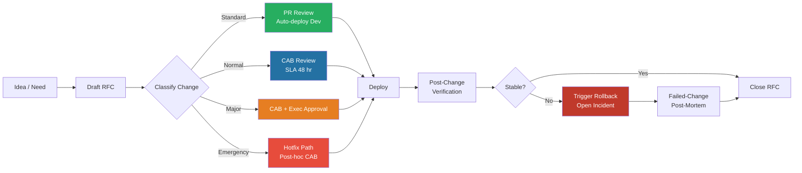
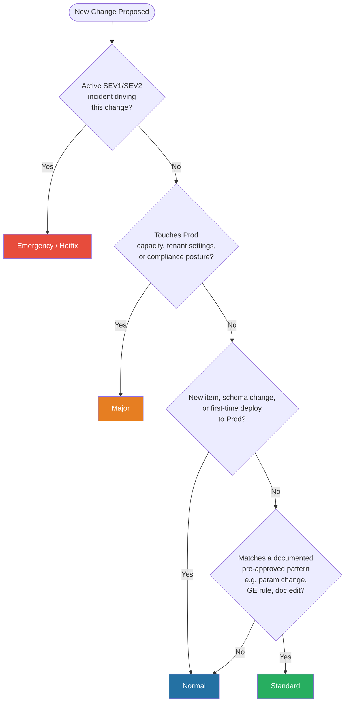
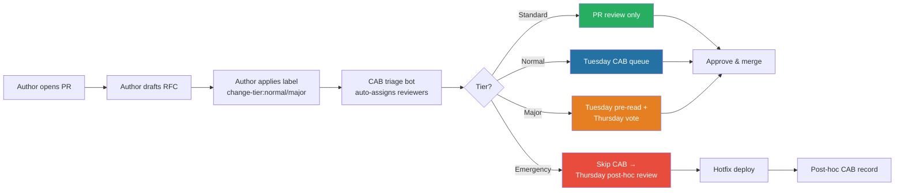
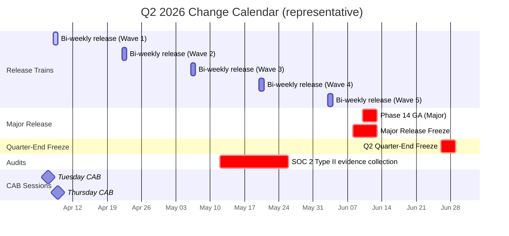
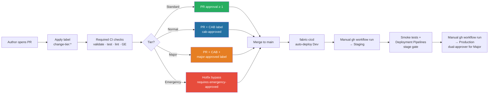
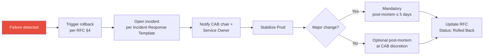

# 🛡️ Change Management for Fabric Platforms

<div align="center" markdown>

**RFC, CAB, Freeze Windows, and Risk-Tiered Approval for Microsoft Fabric**


</div>

---

**Last Updated:** `2026-04-27` | **Version:** 1.0.0 | **Phase 14 Wave 1 — Feature 1.10**

---

## 🎯 Why Change Management for Fabric

Microsoft Fabric platforms span shared capacity (F64), workspace identities, OneLake security, deployment pipelines, and dozens of interdependent items (Lakehouses, Notebooks, Semantic Models, Pipelines, SQL Databases, Eventhouses). A single uncoordinated change can throttle the capacity and block every workspace on it, break Direct Lake semantic models that BI executives depend on, violate compliance posture (CMK, OAP, audit-log retention) for federal workloads, drop Bronze data that cannot be re-derived (breaking 7-year retention obligations), or cascade through Deployment Pipelines without an approved rollback path.

Change management exists to make changes **predictable, reviewable, reversible, and auditable** — without slowing the team down for low-risk work. The framework below is ITIL-aware but tuned for Fabric: every guardrail maps to a specific Fabric concept (capacity, workspace, item, pipeline stage).

| Goal | Mechanism | Non-Goal |
|------|-----------|----------|
| Predictability | Classified changes follow known paths | Replacing source control / PR review (this **wraps** them) |
| Reviewability | Normal/Major changes have RFC + CAB record | Slowing emergency response (see Hotfix path) |
| Reversibility | Every change has a rollback plan tested in Staging | Documenting every notebook tweak (Standard changes need only a PR) |
| Auditability | Every deploy traces PR → RFC → CAB → commit SHA | — |
| Velocity | Standard (pre-approved) changes auto-deploy with no CAB friction | — |

---

## 🧭 Change Lifecycle

The lifecycle below applies to every change that lands in Dev, Staging, or Prod. The depth of review scales with the change classification.



> **Cross-reference:** Mechanics of how a change actually moves Dev → Staging → Prod live in the [Tenant Migration Runbook](../../runbooks/tenant-migration-dev-staging-prod.md). This document is the **policy** layer above that runbook.

---

## 🗂️ Change Classification Matrix

Every change is classified into exactly one of four tiers. The classification drives the approval path, deployment path, and rollback expectations.

| Tier | Definition | Examples (Fabric) | Approval | Deploy Path | Rollback SLA |
|------|------------|-------------------|----------|-------------|--------------|
| **Standard** | Pre-approved, automated, low-risk. Documented pattern with proven safety. | Notebook parameter tweak; GE expectation rule update; semantic model measure rename; minor DAX change; non-breaking tutorial doc edit | PR review only (≥1 reviewer); no CAB | Auto-deploy Dev → Staging on merge; manual one-click to Prod | <15 min |
| **Normal** | Discretionary change with non-trivial blast radius. CAB review required. | New Bronze ingestion; Silver schema additive change; new pipeline; capacity scaling within tier (F64 → F128); new Power BI app workspace; OneLake shortcut addition | PR + CAB (1 quorum, 48-hr SLA) | Standard 3-stage promotion (Dev → Staging → Prod) with manual Prod gate | <30 min |
| **Major** | High blast radius or compliance-impacting. Executive approval required. | New workspace tied to capacity; capacity SKU change >2 tiers (F64 → F256); region migration; CMK key rotation; OneLake security policy change; tenant-level setting change; breaking schema change in Silver/Gold | PR + CAB + executive approval (Platform Lead **and** Service Owner) | 3-stage with mandatory rollback test in Staging; **dual-approver** Prod gate | <1 hr (and rollback **must** be rehearsed in Staging before Prod deploy) |
| **Emergency / Hotfix** | Production-impacting incident requiring immediate fix. Post-hoc CAB review. | Patching a SEV1 Prod data corruption; reverting a bad deploy; emergency capacity scale-up to relieve throttling; revoking a leaked credential | On-call engineer + Incident Commander; CAB reviews **after** the fact at next session | Hotfix path per [Tenant Migration Runbook §Hotfix](../../runbooks/tenant-migration-dev-staging-prod.md#hotfix-procedure) | <15 min (this **is** the rollback for SEV1) |

### Decision Tree — Which Tier Is My Change?



> **Rule of thumb:** If you are not sure, classify **higher**. CAB can de-escalate; you cannot un-deploy a Major change that was reviewed as Standard.

---

## 📝 RFC Template

Every Normal, Major, or Emergency change requires an RFC (Request for Change). Standard changes only need a well-described PR. Copy this template into a new file under `docs/rfcs/RFC-YYYYMMDD-NN-short-title.md` or paste it into the PR description.

```markdown
# RFC-YYYYMMDD-NN: <Short Title>

**Author:** <name@org> | **Created:** YYYY-MM-DD
**Status:** Draft | Submitted | Approved | Rejected | Deployed | Rolled Back | Closed
**Change Type:** Standard | Normal | Major | Emergency
**Risk Score:** Low (4-6) | Medium (7-9) | High (10-12) | Critical (13-16) — see Risk Framework
**Related Incident:** INC-YYYYMMDD-NN (if applicable)

## 1. Summary
One paragraph: what is changing, who benefits, why now.

## 2. Affected Systems
- **Workspaces:** casino-fabric-{dev,staging,prod}
- **Capacities:** fabric-eastus2-f64
- **Items:** lh_bronze.slot_telemetry, nb_01_bronze_slot_telemetry, pipeline_casino_daily
- **Downstream Consumers:** Power BI report "Casino Floor Daily KPI"; Data Agent "casino-compliance-bot"
- **Upstream Dependencies:** None | <list>
- **Compliance Scope:** NIGC MICS / FedRAMP / HIPAA / 42 CFR Part 2 / None

## 3. Rollout Plan

**3.1 Pre-Checks (must pass before deploy)**
- [ ] CI green (validate, test, lint, GE checkpoints)
- [ ] Bicep what-if reviewed (infra changes)
- [ ] Stakeholders notified in #release-comms (24 hr Normal, 72 hr Major)
- [ ] Outside freeze window; no active SEV1/SEV2 incidents

**3.2 Deploy Steps**
1. Merge PR #<num> to `main` (squash-and-merge)
2. Auto-deploy to Dev via `Deploy Fabric Items` workflow
3. `gh workflow run deploy-fabric.yml -f target_environment=staging`
4. Smoke tests: `python scripts/fabric_smoke_test.py --workspace-id $STAGING_WS`
5. `gh workflow run deploy-fabric.yml -f target_environment=production` (dual-approver for Major)

**3.3 Post-Checks**
- [ ] Smoke tests pass in Prod
- [ ] Power BI dataset refresh succeeds
- [ ] Capacity utilization ≤ baseline + 10% over 30 min
- [ ] No new alerts in Data Activator
- [ ] Audit-log entry visible in Workspace Monitoring

## 4. Rollback Plan
**Trigger conditions:** Smoke-test failure; capacity utilization >90% sustained 15 min; SEV2+ opened; GE regression.
**Steps:** <git revert SHA / fabric-cicd redeploy from prior tag / Deployment Pipelines backwards-deploy>; verification; notify channels.
**Rehearsal evidence (Major required):** <link to Staging rollback run>.

## 5. Testing Evidence
- PR: <link> | CI run: <link> | Staging deploy: <link> | GE checkpoint: <link> | Manual notes: <link>

## 6. Reviewer Signoffs
| Role | Name | Approval | Date |
|------|------|----------|------|
| Author | | ✍️ | |
| Peer Reviewer (PR) | | ☐ | |
| CAB Reviewer | | ☐ | |
| Platform Lead (Major) | | ☐ | |
| Service Owner (Major) | | ☐ | |
| Compliance Officer (compliance-impacting) | | ☐ | |

## 7. Deployment Window (UTC)
- **Planned start:** YYYY-MM-DD HH:MM | **Planned end:** YYYY-MM-DD HH:MM
- **Monitoring window:** 2× expected stabilization (per risk score)

## 8. Communication Plan
Pre-deploy T-24h, T-0, T+30m, post-monitoring — all in #release-comms; RFC updated on close.
```

---

## 👥 CAB (Change Advisory Board) Process

### Cadence

| Session | Day | Time (UTC) | Focus |
|---------|-----|------------|-------|
| **Tuesday CAB** | Tuesday | 14:00 | Normal changes for current week + Major change pre-reads |
| **Thursday CAB** | Thursday | 14:00 | Major change approvals + Emergency post-hoc reviews + retro on prior week |

### Quorum

| Required | Role |
|----------|------|
| ✅ | Platform Lead (chair) |
| ✅ | Senior Data Engineer |
| ✅ | Compliance / Security rep (required for Major or compliance-impacting Normal) |
| ✅ | Service Owner of the affected domain (Casino, Federal-USDA, Federal-DOJ, etc.) |
| Optional | Power BI / BI rep, FinOps rep, On-call engineer |

**Quorum minimum:** 3 voters including the Platform Lead. No vote without compliance rep for compliance-scope changes.

### Decision Criteria

A change is approved when **all** of the following hold:

1. RFC is complete (no missing sections, evidence links resolve)
2. Risk score and classification match the change content (CAB may re-classify)
3. Rollback plan is concrete and (for Major) rehearsed in Staging
4. Deployment window is outside any active [freeze](#-freeze-windows) or has a freeze exemption
5. No active SEV1/SEV2 incidents on affected systems
6. Service Owner of the affected domain has signed off

### Approval Workflow



### Tooling

The CAB workflow is implemented entirely with GitHub primitives — no separate tool required, but we map cleanly to ServiceNow/Jira if your org uses one:

| Function | GitHub Primitive | ServiceNow / Jira Equivalent |
|----------|------------------|-------------------------------|
| RFC document | PR description or `docs/rfcs/*.md` | CHG record |
| Classification | PR label `change-tier:{standard,normal,major,emergency}` | CHG type field |
| CAB queue | GitHub Project board "CAB" with columns Triage / Review / Approved / Deployed | CHG queue |
| Approval | PR approving review by CAB member | CHG approval action |
| Audit trail | PR + commit SHA + Action run | CHG record + attachments |

### SLAs for CAB Review

| Tier | Review SLA | Window |
|------|------------|--------|
| Standard | n/a (PR review only — team SLA is 1 business day) | n/a |
| Normal | 48 business hours from RFC submission | Reviewed at next Tuesday CAB |
| Major | 5 business days (must hit one Tuesday pre-read + one Thursday vote) | Reviewed across Tuesday + Thursday |
| Emergency | 0 — deploy first, review at next Thursday CAB | Post-hoc within 7 days |

---

## 🧊 Freeze Windows

Freeze windows block **Normal** and **Major** changes from reaching Production. Standard and Emergency changes can still proceed under the rules below. Freeze windows are calendarized at the start of each fiscal year and published in [Change Calendar](#-change-calendar).

| Freeze | Default Window | Affects | Exemption |
|--------|----------------|---------|-----------|
| **Holiday Freeze** | Last Wednesday before US Thanksgiving → Jan 5 (next year) | Normal, Major | CAB unanimous + VP Eng approval |
| **Quarter-End Freeze** | Last 3 business days of each quarter | Major only | CAB unanimous |
| **Major Release Freeze** | T-2 business days before any Major release → T+1 business day after | Normal, Major (other than the release itself) | CAB chair + Service Owner |
| **Compliance / Audit Freeze** | Annual SOC 2 / NIGC / FedRAMP audit window (typically 2 weeks, scheduled) | Normal, Major touching compliance scope | Compliance Officer + CAB unanimous |
| **Capacity-Risk Freeze** | When F64 utilization >85% for 7 days running | Major capacity changes | Platform Lead (after capacity review) |

### Exemption Process

1. Author opens RFC with `freeze-exemption` label.
2. RFC must include: business justification, rollback rehearsal evidence, and reduced-blast-radius plan (e.g., deploy to one workspace first).
3. CAB votes at next session (or async via PR review for time-sensitive cases).
4. Required votes per the table above. **Unanimous** means every quorum voter — abstentions count as "no".
5. Exemption is logged in the RFC and the freeze calendar entry; auditors will see both.

> **Standard changes during freeze:** Standard changes (parameter tweaks, GE rule updates, doc edits) **are allowed** during all freezes except Compliance Freeze. They still need PR review and pass CI.
>
> **Emergency changes during freeze:** Always allowed; they exist precisely to handle production-impacting issues during freezes.

---

## 📅 Change Calendar

A representative quarter (Q2 2026) showing freezes, release trains, and audit windows. Each team should publish its own calendar at the start of the quarter and link it from the CAB Project board.



> A live calendar lives at `docs/operations/change-calendar.yaml` (planned in Phase 14 Wave 2). Freeze ranges in that file feed CI gates.

---

## ⚖️ Risk Assessment Framework

Every RFC computes a **risk score** from four factors. The score determines the required approvals, the rollback rehearsal expectation, and the post-deploy monitoring window. The framework is deliberately simple — auditors and on-call engineers should be able to read the score and immediately know what was approved.

### Factor 1 — Blast Radius

| Score | Definition | Examples |
|-------|------------|----------|
| 1 | Single notebook / pipeline within one workspace | Notebook param tweak |
| 2 | Single workspace, multiple items | New Bronze ingestion in `casino-fabric-prod` |
| 3 | Single capacity, multiple workspaces | OneLake security policy on F64 |
| 4 | Tenant-wide / multi-capacity | Tenant setting change; CMK rotation |

### Factor 2 — Reversibility

| Score | Definition | Examples |
|-------|------------|----------|
| 1 | Instant revert (one git revert + redeploy ≤ 15 min) | Notebook code change |
| 2 | Staged revert (Deployment Pipelines backwards-deploy ≤ 1 hr) | Pipeline / semantic model change |
| 3 | Hours-long restore (Lakehouse table restore from time-travel or backup) | Schema change requiring data rewrite |
| 4 | Data-affecting / irreversible (Bronze data lost; capacity SKU change with billing impact) | VACUUM with short retention; downscale capacity |

### Factor 3 — User Impact

| Score | Definition |
|-------|------------|
| 1 | None — no user-visible effect |
| 2 | Read-only degraded — slower BI but no errors |
| 3 | Write-blocking — pipeline failures or partial unavailability |
| 4 | Full outage — workspace or capacity unavailable |

### Factor 4 — Compliance Impact

| Score | Definition |
|-------|------------|
| 1 | None |
| 2 | Documentation / audit-log change only (no control change) |
| 3 | Modifies a compliance control (CMK, OAP, audit retention, RBAC scope) |
| 4 | Affects regulated data path (Bronze for CTR/SAR, HIPAA PHI, 42 CFR Part 2, FedRAMP boundary) |

### Risk Score → Required Approvals

The risk score is the **sum** of the four factors. The mapping below is enforced by the CAB and reflected in PR labels.

| Sum | Risk | Required Approvals | Rollback Rehearsal | Monitoring Window |
|-----|------|--------------------|--------------------|-------------------|
| 4–6 | **Low** | Standard PR review (1 reviewer) | Not required | 30 min |
| 7–9 | **Medium** | CAB quorum (Normal change) | Recommended | 60 min |
| 10–12 | **High** | CAB unanimous (Major change) | **Required in Staging** | 2× expected stabilization, min 2 hr |
| 13–16 | **Critical** | CAB unanimous + VP Eng + Compliance Officer | **Required in Staging + Pre-prod data dry-run** | 24 hr with on-call coverage |

> **Worked example — adding a new Bronze ingestion for DOJ federal data:**
>
> Blast radius = 2 (single workspace, new item). Reversibility = 1 (drop the table). User impact = 1 (none — net new). Compliance impact = 4 (FedRAMP boundary).
>
> Sum = 8 → **Medium / Normal change.** CAB quorum required, rollback recommended, 60-min monitoring. Compliance rep is mandatory at CAB because Factor 4 ≥ 3.

---

## ↩️ Rollback Policy

**Every change has a rollback plan.** No exceptions. The rollback plan is part of the RFC and is reviewed by CAB. A change without a rollback plan is rejected at triage.

### Rollback SLAs

| Trigger | Target Rollback Time |
|---------|----------------------|
| SEV1 incident caused by a deploy | **15 minutes** to begin rollback (this is the [Failed Change Procedure](#-failed-change-procedure)) |
| SEV2 incident caused by a deploy | 30 minutes to begin rollback |
| Smoke-test failure in Prod | Begin rollback during the same deploy window — do not leave Prod in a broken state |
| GE checkpoint regression | Within 1 hour, after on-call engineer confirms regression is caused by the deploy |

### Rollback Mechanisms (in preference order)

1. **`git revert` + redeploy via `fabric-cicd`** — preferred for code/config changes. Linear history is preserved by squash-merge, so the revert is a single commit.
2. **Deployment Pipelines backwards-deploy** — when a previously-approved Staging state is known good, deploy Staging → Prod.
3. **fabric-cicd redeploy from prior Git tag** — `gh workflow run deploy-fabric.yml -f git_ref=v1.2.3 -f target_environment=production`.
4. **Lakehouse time-travel** — `RESTORE TABLE lh_bronze.slot_telemetry TO VERSION AS OF <n>` for data-level regressions.
5. **Bicep redeploy from prior parameter file** — for infra-level rollbacks (capacity, networking, CMK).

### Rollback Testing — Mandatory for Major

Major changes **must** rehearse the rollback in Staging before Prod deploy. The CAB will reject Major RFCs whose rollback rehearsal evidence link is missing or returns an empty workflow run.

Rehearsal procedure:
1. Deploy the change to Staging.
2. Smoke-test Staging — confirm working state.
3. Execute the rollback steps from the RFC against Staging.
4. Smoke-test Staging — confirm rollback restores the prior state.
5. Re-deploy the change to Staging (return to working state).
6. Attach all four workflow run links to the RFC under §4 Rollback Plan.

> **Execution mechanics:** detailed step-by-step rollback procedures (including data-affecting rollbacks, Power BI rebinding, and CMK rotation rollback) live in [Tenant Migration Runbook → Rollback Procedure](../../runbooks/tenant-migration-dev-staging-prod.md#rollback-procedure). This document is policy; that runbook is execution.

---

## 🔁 Integration with fabric-cicd + Deployment Pipelines

Change management is enforced in code via the existing CI/CD plumbing. There is no separate ticketing system to learn — labels on a PR drive the workflow.



### Branch Protection Required Settings

These are enforced on `main` and codify the policy above:

```
Settings → Branches → Branch protection rule for "main"
  ✅ Require a pull request before merging
  ✅ Require approvals: 1 (Standard) — bot enforces ≥2 if change-tier:major label present
  ✅ Require status checks: validate, test, lint, ge-checkpoint, cab-label-required
  ✅ Require conversation resolution before merging
  ✅ Do not allow bypassing the above settings
  ✅ Restrict who can push to matching branches: platform-leads team only
```

### Required CI Checks

| Check | Purpose | Blocking |
|-------|---------|----------|
| `validate` | Bicep build + fabric-cicd dry-run | Yes |
| `test` | `pytest validation/unit_tests/` (612 tests) | Yes |
| `lint` | ruff, bicep linter, markdownlint | Yes |
| `ge-checkpoint` | Great Expectations bronze + silver | Yes |
| `cab-label-required` | Bot fails if `change-tier:*` label is missing | Yes |
| `cab-approval-required` | Bot fails if Normal/Major lacks `cab-approved` label | Yes |

### Deployment Pipelines Stage Gating

For teams using Deployment Pipelines (Path B in the [Tenant Migration Runbook](../../runbooks/tenant-migration-dev-staging-prod.md#step-3--validate-dev--staging-via-deployment-pipelines)), the same labels gate stage promotion:

| Stage | Auto-deploy on merge | Requires `cab-approved` | Requires Dual Approver |
|-------|----------------------|--------------------------|------------------------|
| Dev | Yes | No | No |
| Staging | No (manual `gh workflow run`) | Yes (Normal+) | No |
| Production | No (manual + GitHub Environment approval) | Yes (Normal+) | Yes (Major) |

See [`fabric-cicd-deployment.md`](../fabric-cicd-deployment.md) for the underlying workflow definition and [`deployment-pipelines.md`](../../features/deployment-pipelines.md) for the native portal-based path.

---

## 🧾 Audit Trail Requirements

Every change must be **traceable end-to-end** from business request to production deployment. Auditors will trace any single Prod deploy back through this chain:

```
RFC ID → CAB approval record → PR # → Commit SHA → CI run → fabric-cicd workflow run → Workspace audit log entry
```

### Required Artifacts (per change)

| Artifact | Where Stored | Retention | Owner |
|----------|--------------|-----------|-------|
| RFC | `docs/rfcs/RFC-*.md` (Git) or PR description | 7 years (matches Bronze retention floor) | RFC Author |
| CAB minutes | GitHub Project board card + `docs/cab-minutes/YYYY-MM-DD.md` | 7 years | CAB Chair |
| PR + review history | GitHub | Indefinite (Git) | n/a |
| CI run | GitHub Actions | 90 days (re-runnable from commit SHA) | n/a |
| Deploy workflow run | GitHub Actions + workspace audit log | 90 days (Actions) + per [SQL Audit Logs Compliance](../sql-audit-logs-compliance.md) (workspace) | Platform Lead |
| Approver identity & timestamp | GitHub Environment approval log | Indefinite | n/a |

### Federal / Regulated Workloads

Federal agencies (USDA, SBA, NOAA, EPA, DOI, DOJ, DOT/FAA, Tribal Healthcare) and casino (NIGC) workloads require additional capture:

- Approver identity must include MFA assertion (enforced via Conditional Access, not in this doc)
- Audit log must be exported to immutable storage (Azure Storage with legal hold) — see [SQL Audit Logs Compliance](../sql-audit-logs-compliance.md)
- For Major changes touching FedRAMP boundary: dual-approver names captured in RFC §6 and surfaced in workspace audit log

---

## ✅ Post-Change Verification

A change is not complete when the deploy workflow turns green. It is complete when the **monitoring window** has elapsed without regression.

### Automated Smoke Tests

Every Prod deploy runs the smoke-test script automatically after the deploy step:

```bash
python scripts/fabric_smoke_test.py --workspace-id "$FABRIC_PROD_WORKSPACE_ID"
```

Smoke tests verify:
- All notebooks are executable (test-run a sample bronze, silver, gold notebook)
- Lakehouse schemas match the prior Prod schemas (`DESCRIBE EXTENDED`)
- Pipeline test-run completes end-to-end without error
- Power BI dataset refresh succeeds
- Sample queries return expected row counts (within ±5% of prior baseline)

### Manual Checks Per RFC Checklist

The RFC §3.3 Post-Checks section is treated as a literal checklist — the author ticks each box and updates the RFC as `Status: Deployed`. Missing checks block RFC closure.

### Monitoring Window

| Risk | Window |
|------|--------|
| Low | 30 min |
| Medium | 60 min |
| High | 2× expected stabilization, minimum 2 hr |
| Critical | 24 hr with on-call coverage |

During the window the author **must** stay reachable. New alerts in Data Activator or Workspace Monitoring during the window count as a regression and trigger the [Failed Change Procedure](#-failed-change-procedure).

---

## 🚨 Failed Change Procedure

A change is "failed" if **any** of the following are true within the monitoring window:

- Smoke test fails in Prod
- New SEV1 or SEV2 incident is opened on the affected systems
- GE checkpoint regression (any expectation that passed pre-deploy now fails)
- Capacity utilization >90% sustained for 15 minutes (when not previously)
- Power BI dataset refresh fails on a previously-passing dataset

### Procedure



### Required Artifacts on Failed Change

1. **Incident record** — per [Incident Response Template](../../runbooks/incident-response-template.md). Link the RFC ID in the incident.
2. **Rolled-back state confirmation** — smoke tests pass post-rollback.
3. **Failed-change post-mortem** (Major only, recommended for Normal) — see [Templates Provided](#-templates-provided).
4. **CAB notification** — author posts the failure summary in the CAB channel within 1 business hour of detection.

> **Repeat-offender rule:** Any author/team with two failed Major changes in a rolling 90-day window must run their next Major RFC through a pre-CAB technical deep-dive before submission.

---

## 🚫 Anti-Patterns

### 1. Verbal CAB Approval
**Problem:** "I asked the Platform Lead in the hallway and they said it's fine." **Symptom:** no audit trail; approver does not remember the conversation six months later. **Fix:** all approvals captured in the PR or CAB minutes. If it is not in writing, it did not happen.

### 2. Classifying Down to Avoid CAB
**Problem:** a schema change in Silver labeled Standard "because it is just a column add." **Symptom:** downstream Direct Lake semantic model breaks; no review caught it. **Fix:** use the [Decision Tree](#decision-tree--which-tier-is-my-change). Any schema change in a layer downstream consumers depend on is **Normal**, minimum.

### 3. Rollback Plan = "Redeploy Prior Commit"
**Problem:** one-line rollback plan, no verification, no data-level steps. **Symptom:** on-call discovers the prior commit restores only code state, not data state — Bronze writes are append-only. **Fix:** rollback plan addresses code **and** data state; Major changes rehearse in Staging.

### 4. Friday-Afternoon Prod Deploys
**Problem:** Normal change squeezed into Prod late Friday before a long weekend. **Symptom:** regression detected Saturday; author unreachable; SEV2 stretches into 36-hr incident. **Fix:** Prod deploys land Monday–Thursday, before 16:00 local of the on-call rotation. Friday Prod deploys require Platform Lead approval + explicit on-call handoff.

### 5. "Emergency" Used to Skip CAB
**Problem:** routine changes get `emergency-approved` to bypass the 48-hr Normal SLA. **Symptom:** auditors flag emergency abuse. **Fix:** emergency requires a linked active SEV1/SEV2 incident; CAB chair audits emergency usage monthly and revokes the label from abusers.

### 6. No Monitoring Window
**Problem:** author merges, deploy turns green, author closes laptop. **Symptom:** users find the regression hours later; on-call inherits a problem they did not ship. **Fix:** author stays reachable for the full monitoring window per [Risk Framework](#️-risk-assessment-framework).

### Summary

| Anti-Pattern | Risk | Fix |
|--------------|------|-----|
| Verbal CAB approval | No audit trail | Capture in writing |
| Classifying down | Skipped review | Use decision tree |
| Thin rollback plan | Bad rollback under pressure | Rehearse in Staging (Major) |
| Friday Prod deploys | On-call ambushed | Mon–Thu, before 16:00 |
| "Emergency" abuse | CAB bypass | Require linked SEV1/SEV2 |
| No monitoring window | Users find the regression | Author on-call per risk score |

---

## 📋 Templates Provided

The following templates live alongside this doc in `docs/best-practices/operations/templates/` (added in Phase 14 Wave 2). Until then, copy from the inline blocks below or from this document directly.

### 1. RFC Template

See [§ RFC Template](#-rfc-template) above. Copy into `docs/rfcs/RFC-YYYYMMDD-NN-short-title.md`.

### 2. Failed-Change Post-Mortem Template

```markdown
# Failed-Change Post-Mortem: RFC-YYYYMMDD-NN

**Date:** YYYY-MM-DD HH:MM UTC | **RFC:** RFC-... | **Incident:** INC-...
**Change Author:** <name> | **Post-Mortem Author:** <name — NOT the change author>

## 1. Timeline (UTC)
| Time | Event |
|------|-------|
| HH:MM | Change deployed to Prod |
| HH:MM | First alert / user report |
| HH:MM | Rollback initiated |
| HH:MM | Prod stable |

## 2. What Happened
Blameless 1-2 paragraph summary.

## 3. Root Cause
Technical root cause. Not "human error" — what allowed it to reach Prod?

## 4. Why CAB Did Not Catch It
Gap in RFC, rollback plan, rehearsal, or CAB checklist.

## 5. Action Items
| # | Action | Owner | Due |
|---|--------|-------|-----|

## 6. Process Updates
Linked PRs updating RFC template, decision tree, freeze rules, or CAB checklist.
```

### 3. CAB Minutes Template

```markdown
# CAB Minutes: YYYY-MM-DD (Tuesday | Thursday)

**Chair:** <name> | **Quorum:** ✅/❌ | **Voters:** <list>

## RFCs Reviewed
| RFC | Tier | Risk | Decision | Conditions |
|-----|------|------|----------|------------|
| RFC-... | Normal | 8 | Approved | Monitor 60 min |

## Emergency Post-Hoc Reviews
| RFC | Incident | Decision | Action Items |
|-----|----------|----------|--------------|

## Freeze Exemptions
<list with vote tallies, or "none">

## Process Carry-Overs
- ...
```

---

## 📚 Related Runbooks & Best-Practice Docs

### Runbooks (Execution)
- [Tenant Migration: Dev → Staging → Prod](../../runbooks/tenant-migration-dev-staging-prod.md) — the runbook this policy wraps
- [Incident Response Template](../../runbooks/incident-response-template.md) — incident path triggered by failed changes
- [Capacity Throttling Response](../../runbooks/capacity-throttling-response.md) | [Pipeline Failure Triage](../../runbooks/pipeline-failure-triage.md) | [Auth Failure Playbook](../../runbooks/auth-failure-playbook.md)

### Best-Practice Docs (Adjacent Policy)
- [fabric-cicd Deployment](../fabric-cicd-deployment.md) — CI/CD machinery enforcing this policy
- [Deployment Pipelines](../../features/deployment-pipelines.md) — native ALM tool
- [Capacity Planning & Cost Optimization](../capacity-planning-cost-optimization.md) | [Disaster Recovery & BCDR](../disaster-recovery-bcdr.md)
- [Network Security](../network-security.md) | [Identity & RBAC Patterns](../identity-rbac-patterns.md) | [SQL Audit Logs Compliance](../sql-audit-logs-compliance.md)
- [Customer-Managed Keys](../customer-managed-keys.md) | [Outbound Access Protection](../outbound-access-protection.md)

### External References
- [ITIL 4 — Change Enablement](https://www.axelos.com/certifications/itil-service-management) (concept anchor)
- [Microsoft Fabric — Deployment Pipelines REST API](https://learn.microsoft.com/rest/api/fabric/core/deployment-pipelines) | [fabric-cicd library](https://pypi.org/project/fabric-cicd/)
- [GitHub — Branch Protection](https://docs.github.com/repositories/configuring-branches-and-merges-in-your-repository/defining-the-mergeability-of-pull-requests/about-protected-branches) | [Environments & Required Reviewers](https://docs.github.com/actions/deployment/targeting-different-environments/using-environments-for-deployment)

---

<div align="center" markdown>

**Phase 14 Wave 1 — Feature 1.10 — Change Management for Fabric Platforms**

Maintained by Platform Engineering · Reviewed quarterly · Last review `2026-04-27`

</div>
