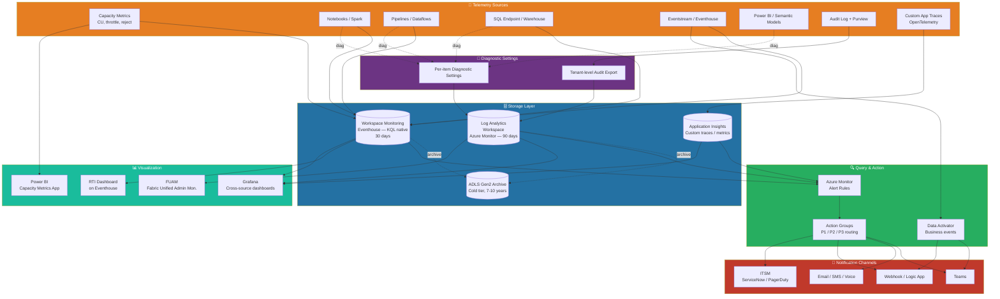
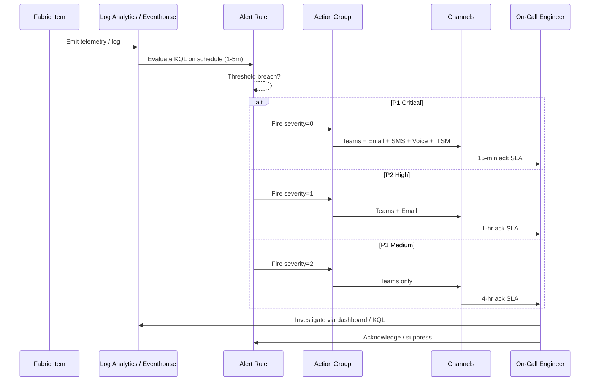
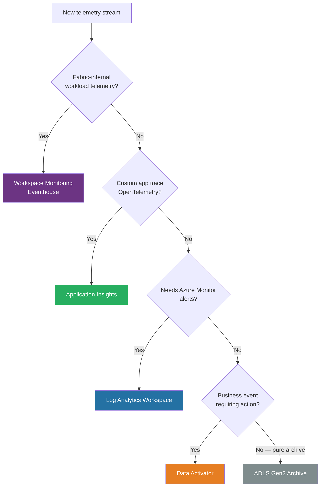
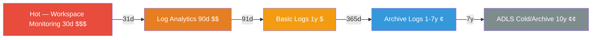

# 🔭 Observability Stack: Log Analytics + Workspace Monitoring + Action Groups + Grafana

<div align="center" markdown>

**End-to-End Telemetry, Storage, Alerting & Visualization Blueprint for Microsoft Fabric**


</div>

---

**Last Updated:** `2026-04-27` | **Version:** 1.0.0 | **Phase:** 14 Wave 1 (Feature 1.11)

---

## 🎯 Overview

This document is the **end-to-end observability blueprint** for the Microsoft Fabric platform. It is the integration layer that ties together every signal source, every storage backend, every alert channel, and every visualization tool into a single, coherent stack. Where [Monitoring & Observability](../monitoring-observability.md) introduces the pillars and [Alerting & Data Activator](../alerting-data-activator.md) covers business-event triggers, this guide answers the operational question:

> **Given a Fabric workspace, where does each signal go, how is it stored, how is it queried, and how does it become an alert or a dashboard?**

The stack is opinionated. Pick **one** primary store per telemetry class (no double-writes), wire alerts through **one** Action Group taxonomy, and standardize on **one** dashboard tool per persona. This guide pairs with the Bicep modules landing in batch 1c (`action-groups.bicep`, `log-analytics-workspace.bicep`).

### Pillars Covered

| Pillar | Primary Sink | Query Surface | Visualization |
|---|---|---|---|
| **Capacity & CU** | Capacity Metrics App + Workspace Monitoring (Eventhouse) | KQL | Power BI report + Grafana |
| **Pipeline / Spark / SQL** | Workspace Monitoring (Eventhouse) | KQL | RTI Dashboard + Grafana |
| **Diagnostic logs** | Log Analytics Workspace | KQL | Grafana + Azure Monitor Workbooks |
| **Custom application traces** | Application Insights | KQL | Grafana + Application Map |
| **Business events** | Eventstream → Eventhouse | KQL | Data Activator + RTI Dashboard |
| **Audit & security** | Microsoft 365 Audit Log + Purview + Log Analytics | KQL | Power BI + Sentinel (optional) |

> **Companion docs:** [SLO/SLI for Fabric](./slo-sli-fabric.md) defines the targets; this document defines the plumbing that measures them.

---

## 🏗️ Reference Architecture

### End-to-End Telemetry Flow



### Alert Flow (Severity-Based Routing)



> **Design rule:** Every alert in production points to **exactly one** Action Group. Action Groups own the channel fan-out; alert rules own the detection. This separation lets you change notification policy (e.g., add PagerDuty to all P1 alerts) by editing one Action Group instead of every rule.

---

## 📡 Telemetry Sources

The platform produces these telemetry streams. Each one has a recommended primary sink.

| Source | Primary Sink | Secondary Sink | Cadence |
|---|---|---|---|
| **Capacity Metrics App** (CU%, throttling, smoothing) | Capacity Metrics App + Workspace Monitoring | Log Analytics (export) | 30s |
| **Workspace Monitoring** (Spark, SQL, pipelines, dataflows) | Eventhouse (native, KQL) | — | Near real-time |
| **Pipeline run logs** (status, duration, error) | Workspace Monitoring | Log Analytics (Diag Settings) | Per run |
| **Spark application logs** (driver, executor, spill) | Workspace Monitoring + Log Analytics | App Insights (custom) | Per session |
| **SQL endpoint query logs** | Workspace Monitoring | Log Analytics (audit) | Per query |
| **Power BI usage metrics** | Power BI usage dataset | Log Analytics (export) | Hourly |
| **Eventstream / Eventhouse internal** (lag, ingest errors) | Eventhouse `.show` commands | Log Analytics (Diag Settings) | Real-time |
| **Audit logs** (Purview + Security) | M365 Audit Log + Purview | Log Analytics + ADLS archive | 30-min batch |
| **Custom application traces** (OTel) | Application Insights | Log Analytics (WS-based AI) | Real-time |
| **Infrastructure** (Storage, Key Vault, network, Defender) | Log Analytics | Sentinel (optional) | 1-5m |

### Diagnostic Settings Coverage Matrix

| Fabric Item | Diagnostic Setting Available? | Recommended Categories |
|---|---|---|
| Workspace (top-level) | Yes (preview, 2026) | `WorkspaceActivity`, `Permissions` |
| Lakehouse | Indirect via Workspace Monitoring | — |
| Notebook | Indirect via Workspace Monitoring | — |
| Pipeline | Yes | `PipelineRuns`, `ActivityRuns` |
| Eventhouse | Yes | `Query`, `Ingestion`, `TableUsage` |
| Eventstream | Yes | `OperationalLogs`, `StreamLag` |
| Power BI Semantic Model | Yes | `Engine`, `AuditLog` |
| Capacity | Yes | `CapacityMetrics`, `Throttling` |

> **Operational rule:** Enable diagnostic settings on **every Fabric item that supports it** at provisioning time, not retroactively. Missing logs from the first incident are the costliest gap.

---

## 🗄️ Storage Layer Choices

Fabric observability data has three legitimate storage targets. Picking the right one for each signal class avoids both blind spots and double-billing.

### Storage Decision Matrix

| Need | Workspace Monitoring (Eventhouse) | Log Analytics | App Insights |
|---|---|---|---|
| **Native to Fabric** | ✅ first-class Fabric item | ❌ Azure resource | ❌ Azure resource |
| **Cost model** | Eventhouse OPU (workspace capacity) | Per-GB ingest + retention | Per-GB ingest |
| **Default retention** | 30 days | 30 days (→ 730) | 90 days (→ 730) |
| **Query language** | KQL | KQL | KQL |
| **Best for** | Fabric workload telemetry | Cross-Azure logs, security, infra | App traces, custom metrics |
| **OneLake / Direct Lake** | ✅ Native | ❌ Export only | ❌ Export only |
| **Action Groups** | ❌ (use Data Activator) | ✅ | ✅ |
| **Sentinel / SOC** | ❌ | ✅ Native | ✅ Native |

### When to Use Which



### Retention & Tiering Policy

| Tier | Retention | Cost (relative) | Use Case |
|---|---|---|---|
| **Hot — Workspace Monitoring** | 30 days | Highest (OPU + capacity) | Real-time ops, KQL queries, dashboards |
| **Warm — Log Analytics Analytics tier** | 31-90 days | Medium | Recent investigations, alert rules |
| **Cool — Log Analytics Basic Logs** | 8-day query window, 1-year retention | Low | Audit, search-only |
| **Archive — Log Analytics Archive** | 1-7 years | Lowest | Compliance retention, restore-on-demand |
| **Cold — ADLS Gen2 (Cool/Archive)** | 7-10 years | Lowest | FedRAMP, NIGC retention, Federal Records Act |

> **Audit retention requirement:** Casino (NIGC §542.17) and Federal (Records Act) mandate 7+ year retention. Log Analytics archive + ADLS Gen2 archive tier cover this; Workspace Monitoring alone does not.

---

## 📚 Standard KQL Library

Copy-paste runnable queries. Every query specifies the table source. Substitute table names if your environment uses custom export configurations.

### 1. Capacity CU Saturation (Workspace Monitoring → `CapacityMetrics`)

```kql
CapacityMetrics
| where Timestamp > ago(24h)
| summarize AvgCU=avg(CUPercent), P95CU=percentile(CUPercent,95), MaxCU=max(CUPercent),
            ThrottleEvents=countif(IsThrottled), RejectEvents=countif(IsRejected)
    by CapacityName, bin(Timestamp, 1h)
| where P95CU > 70 or ThrottleEvents > 0
| order by P95CU desc
```

### 2. Top Expensive Queries (Workspace Monitoring → `SQLRequests`)

```kql
SQLRequests
| where StartTime > ago(7d) and Status == "Succeeded"
| summarize ExecCount=count(), TotalCUSec=sum(CPUTimeMs)/1000.0,
            AvgDurSec=avg(DurationMs)/1000.0, MaxDurSec=max(DurationMs)/1000.0
    by QueryHash=hash(QueryText, 1000), QueryFingerprint=substring(QueryText, 0, 120)
| top 25 by TotalCUSec desc
```

### 3. Pipeline Failure Trends (Workspace Monitoring → `PipelineRuns`)

```kql
PipelineRuns
| where StartTime > ago(14d)
| extend ErrorClass = case(
    Error has "OutOfMemoryError", "OOM",
    Error has "Timeout",          "Timeout",
    Error has "Authentication",   "Auth",
    Error has "SchemaMismatch",   "SchemaDrift",
    Error has "Throttled",        "Throttling",
    Error == "",                  "None",
    "Other")
| summarize Total=count(), Failed=countif(Status=="Failed"),
            SuccessRate=round(100.0*countif(Status=="Succeeded")/count(),1)
    by bin(StartTime, 1d), ErrorClass
| order by StartTime desc, Failed desc
```

### 4. Authentication Failures (Log Analytics → `FabricAuditLog`)

```kql
FabricAuditLog
| where TimeGenerated > ago(24h)
| where Operation in ("SignInFailure", "AcquireTokenFailed", "ServicePrincipalSignInFailure")
| summarize FailureCount=count(), DistinctTargets=dcount(TargetResource),
            FirstFailure=min(TimeGenerated), LastFailure=max(TimeGenerated)
    by UserPrincipalName, ClientIP, FailureReason
| where FailureCount >= 5
| order by FailureCount desc
```

### 5. Dataset Refresh Durations (Workspace Monitoring → `SemanticModelRefreshes`)

```kql
SemanticModelRefreshes
| where StartTime > ago(30d) and RefreshType == "Scheduled"
| summarize AvgDurMin=round(avg(DurationSeconds)/60.0,1),
            P95DurMin=round(percentile(DurationSeconds,95)/60.0,1),
            FailureRate=round(100.0*countif(Status=="Failed")/count(),2), Runs=count()
    by ModelName, WorkspaceName, bin(StartTime, 1d)
| order by P95DurMin desc
```

### 6. Cross-Source Join (Log Analytics + Workspace Monitoring)

Log Analytics holds audit context; Workspace Monitoring holds workload context. Joining them tells you *who ran the expensive query*.

```kql
let wmCluster = "https://trd-xxxxxxxx.kusto.fabric.microsoft.com/WorkspaceMonitoringDB";
let SparkSessions = cluster(wmCluster).database("WorkspaceMonitoringDB").SparkSessions
    | where StartTime > ago(24h) and DurationSec > 600
    | project SessionId, UserPrincipalName, NotebookName, DurationSec, PeakMemoryGB, StartTime;
FabricAuditLog
| where TimeGenerated > ago(24h) and Operation == "ExecuteNotebook"
| join kind=inner SparkSessions on $left.UserId == $right.UserPrincipalName
| project TimeGenerated, UserPrincipalName, NotebookName, DurationSec, PeakMemoryGB, ClientIP, WorkspaceId
| order by DurationSec desc
```

### 7. Data Freshness (Workspace Monitoring → `DeltaTableMetrics`)

```kql
DeltaTableMetrics
| where Timestamp > ago(1h)
| summarize LastWrite=max(LastModifiedTime) by LakehouseName, TableName
| extend StaleMinutes = datetime_diff('minute', now(), LastWrite)
| extend Layer = case(LakehouseName has "bronze","Bronze", LakehouseName has "silver","Silver",
                      LakehouseName has "gold","Gold","Other")
| extend SLABreach = case(Layer=="Bronze" and StaleMinutes>30, true,
                          Layer=="Silver" and StaleMinutes>60, true,
                          Layer=="Gold"   and StaleMinutes>240, true, false)
| where SLABreach == true
| order by StaleMinutes desc
```

### 8. Spark OOM Detection (Workspace Monitoring → `NotebookRuns`)

```kql
NotebookRuns
| where StartTime > ago(7d) and Status == "Failed"
| where ErrorMessage has_any ("OutOfMemoryError", "Container killed by YARN", "GC overhead")
| summarize OOMCount=count(),
            PeakMemGB=round(max(PeakMemoryBytes)/(1024.0*1024*1024),2),
            AffectedDays=dcount(bin(StartTime,1d))
    by NotebookName, WorkspaceName
| order by OOMCount desc
```

---

## 🚨 Alert Wiring

### Action Group Taxonomy

Use **three Action Groups** keyed to severity. This minimizes the number of objects to manage while preserving severity-based routing.

| Action Group | Severity | Channels | Acknowledgement SLA |
|---|---|---|---|
| `ag-fabric-p1-critical` | Sev 0 (P1) | Teams + Email + SMS + Voice + ITSM (PagerDuty/ServiceNow) + Logic App | 15 min |
| `ag-fabric-p2-high` | Sev 1 (P2) | Teams + Email + ITSM | 1 hr |
| `ag-fabric-p3-medium` | Sev 2 (P3) | Teams + Email digest | 4 hr |

> **Why three, not seven?** A four- or five-tier scheme almost always collapses in practice (operators lose track of which tier means what). Three is the sweet spot for severity-based fan-out.

### Channel Types (Azure Monitor Action Group)

| Channel | Use | Notes |
|---|---|---|
| **Email** | All severities | Throttled 100/hr per address — use distribution lists |
| **SMS** | P1 only | Throttled 1/5min per number; per-message cost |
| **Voice (TTS)** | P1 only | Per-call cost; reads alert title + resource |
| **Webhook / Secure Webhook** | P1/P2 | HTTP POST, 5s timeout; secure variant uses AAD |
| **Logic App / Azure Function** | All severities | Auto-remediation, enrichment, dedupe, ITSM bridging |
| **ITSM Connector** | P1/P2 | ServiceNow, ServiceDesk Plus, Provance, Cherwell |
| **Event Hub** | All severities | Forward to SIEM / Sentinel / Splunk |
| **Mobile App Push** | All severities | Azure Mobile App for engineers |

### Bicep Snippet — Action Group + Alert Rule (Placeholder)

> **Note:** The full implementation lands in `infra/modules/observability/action-groups.bicep` (Phase 14 batch 1c). The snippet below is the contract this best-practice doc commits to. Do not copy verbatim into production until the module ships.

```bicep
// Placeholder: infra/modules/observability/action-groups.bicep
@description('Severity tier: P1, P2, or P3')
param severity string
param emailRecipients array
param smsRecipients array = []          // P1 only — country code + number
param itsmConnectionId string = ''      // PagerDuty / ServiceNow
param logicAppResourceId string = ''

resource ag 'Microsoft.Insights/actionGroups@2023-01-01' = {
  name: 'ag-fabric-${toLower(severity)}'
  location: 'global'
  properties: {
    groupShortName: 'fab${toLower(severity)}'   // <= 12 chars
    enabled: true
    emailReceivers: [for (e, i) in emailRecipients: {
      name: 'email${i}'
      emailAddress: e
      useCommonAlertSchema: true
    }]
    smsReceivers: severity == 'P1' ? [for (s, i) in smsRecipients: {
      name: 'sms${i}'
      countryCode: split(s, '-')[0]
      phoneNumber: split(s, '-')[1]
    }] : []
    webhookReceivers: !empty(logicAppResourceId) ? [{
      name: 'logic-app-remediation'
      serviceUri: 'PLACEHOLDER_LOGIC_APP_URL'
      useCommonAlertSchema: true
    }] : []
    itsmReceivers: !empty(itsmConnectionId) && severity != 'P3' ? [{
      name: 'itsm'
      workspaceId: 'PLACEHOLDER_WS_ID'
      connectionId: itsmConnectionId
      ticketConfiguration: '{"PayloadRevision":0,"WorkItemType":"Incident"}'
      region: 'eastus2'
    }] : []
  }
}

// Scheduled KQL alert wired to the Action Group (P2 example)
resource cuThrottleAlert 'Microsoft.Insights/scheduledQueryRules@2023-03-15-preview' = {
  name: 'alert-fabric-capacity-throttle'
  location: resourceGroup().location
  properties: {
    severity: 1
    enabled: true
    evaluationFrequency: 'PT5M'
    windowSize: 'PT15M'
    scopes: [logAnalyticsWorkspaceId]
    criteria: { allOf: [{
      query: 'CapacityMetrics | where Timestamp > ago(15m) | summarize MaxCU=max(CUPercent), Throttles=countif(IsThrottled) by CapacityName | where MaxCU > 90 or Throttles > 0'
      timeAggregation: 'Count'
      operator: 'GreaterThan'
      threshold: 0
      failingPeriods: { numberOfEvaluationPeriods: 2, minFailingPeriodsToAlert: 2 }
    }]}
    actions: {
      actionGroups: [ag.id]
      customProperties: {
        runbook: 'https://github.com/.../runbooks/capacity-throttled.md'
        severity: 'P2'
      }
    }
  }
}
```

### Suppression and Deduplication

| Technique | Implementation | When to Use |
|---|---|---|
| **Cooldown / mute** | Action Rule with `suppressionConfig` | Prevent alert storms on flapping signals (15-60 min) |
| **Maintenance window** | Action Rule with recurring schedule | Planned deploys, scheduled VACUUM windows |
| **Smart Groups** | Azure Monitor automatic correlation | Same root cause across multiple resources |
| **Alert dedup key** | `customProperties.dedupKey` in webhook payload | Coalesce identical alerts in PagerDuty/ITSM |
| **Failing-period gating** | `failingPeriods.minFailingPeriodsToAlert >= 2` | Eliminate single-evaluation false positives |

### Test Fire-Drill Protocol (Quarterly)

1. **Pre-flight:** Notify on-call, set maintenance window on monitoring channels.
2. **Inject:** Trigger a synthetic alert (failing query, paused synthetic ingest).
3. **Observe:** Alert fired in window | Action Group fanned out | On-call paged within SLA | Runbook URL reachable | ITSM ticket created with correct severity.
4. **Resolve:** Stop synthetic failure; verify auto-resolution.
5. **Postmortem:** Update runbook with anything unclear, missing, or stale. Record drill in log.

---

## 📊 Dashboards

A persona-aligned dashboard set. Avoid duplicating views — assign each persona to one primary tool.

| Persona | Tool | Refresh |
|---|---|---|
| Capacity Admin | Fabric Capacity Metrics App (Power BI) | 30 min |
| Platform Engineer — live ops | RTI Dashboard on Eventhouse | 30 sec |
| Platform Engineer — cross-source | Grafana | 1 min |
| Tenant Admin | FUAM (Power BI / Log Analytics) | Hourly |
| SRE / On-call | Grafana + Azure Monitor Workbooks | 30 sec |
| Compliance Officer | FISMA / NIGC report (Power BI) | Daily |

### Power BI — Capacity Metrics App

Install from AppSource for each capacity. See [Monitoring & Observability — Capacity Monitoring](../monitoring-observability.md#-capacity-monitoring) for the full setup.

### RTI Dashboard on Eventhouse

Right tool for **Platform Engineer (live ops)**: 5-second auto-refresh, native KQL editor, drill-through into raw events, direct Data Activator integration. See the [Real-Time Intelligence feature doc](../../features/real-time-intelligence.md) for setup.

### Grafana — Cross-Source Dashboards

Right tool when you need **one pane of glass across Workspace Monitoring + Log Analytics + Application Insights + Azure infrastructure metrics**. Use Azure Managed Grafana for managed identity auth and AAD SSO.

#### Sample Dashboard JSON (skeleton)

```json
{
  "title": "Fabric Platform Observability",
  "uid": "fabric-platform-obs",
  "schemaVersion": 39,
  "refresh": "1m",
  "panels": [
    {
      "title": "Capacity CU% (P95, last 24h)",
      "type": "timeseries",
      "datasource": { "type": "grafana-azure-monitor-datasource", "uid": "azmonitor" },
      "targets": [{ "queryType": "Azure Log Analytics", "azureLogAnalytics": {
        "resource": "/subscriptions/<sub>/resourceGroups/rg-fabric/providers/Microsoft.OperationalInsights/workspaces/law-fabric",
        "query": "CapacityMetrics | where Timestamp > ago(24h) | summarize P95=percentile(CUPercent,95) by bin(Timestamp,5m), CapacityName"
      }}]
    },
    {
      "title": "Pipeline Success Rate (24h)",
      "type": "stat",
      "targets": [{ "azureLogAnalytics": {
        "query": "PipelineRuns | where StartTime > ago(24h) | summarize SuccessRate=round(100.0*countif(Status=='Succeeded')/count(),1)"
      }}],
      "fieldConfig": { "defaults": { "thresholds": { "steps": [
        { "color": "red", "value": null }, { "color": "orange", "value": 95 }, { "color": "green", "value": 99 }
      ]}}}
    },
    {
      "title": "Active Alerts by Severity",
      "type": "piechart",
      "targets": [{ "azureLogAnalytics": {
        "query": "AlertsManagementResources | where properties.essentials.alertState=='New' | summarize count() by tostring(properties.essentials.severity)"
      }}]
    },
    {
      "title": "Top Notebooks by Duration (7d)",
      "type": "table",
      "targets": [{ "azureLogAnalytics": {
        "query": "cluster('https://trd-xxx.kusto.fabric.microsoft.com').database('WorkspaceMonitoringDB').NotebookRuns | where StartTime > ago(7d) | summarize AvgDur=avg(DurationSec), Runs=count() by NotebookName | top 20 by AvgDur desc"
      }}]
    }
  ]
}
```

> **Production tip:** Store dashboard JSON in `infra/modules/observability/grafana-dashboards/` and deploy via Bicep + REST API. Treat dashboards as code — review changes in PRs.

### FUAM (Fabric Unified Admin Monitoring)

FUAM is Microsoft's open-source admin monitoring solution: ingests tenant audit logs, capacity metrics, workspace inventory, and refresh history into a Lakehouse + Power BI report. See the [FUAM feature doc](../../features/fabric-unified-admin-monitoring.md). Use FUAM for tenant-wide admin reporting, chargeback, and 90+ day audit trends — **not** for real-time ops (use RTI), per-query troubleshooting (use Workspace Monitoring), or sub-minute alerts (use Data Activator).

---

## ⚡ Data Activator for Business Events

Data Activator (Reflex) is the **business-event** companion to Azure Monitor Action Groups. The two systems coexist; they are not redundant.

| Use Data Activator for | Use Azure Monitor + Action Groups for |
|---|---|
| Per-entity thresholds (per-machine, per-player, per-station, per-agency) | Platform health (capacity, pipeline reliability, query performance) |
| Streaming-source alerts (Eventstream, Real-Time Hub) | Infrastructure (Key Vault, storage, network) |
| No-code alert authoring by domain owners | Severity-based fan-out to ITSM and on-call |
| Alerts that drive Power Automate workflows | Standardized notification taxonomy across the platform |

See [Alerting & Data Activator best practices](../alerting-data-activator.md) and the [Data Activator feature doc](../../features/data-activator.md) for configuration patterns.

---

## 🧵 Distributed Tracing

For applications that span notebooks, Functions, web APIs, and Spark jobs, use **W3C Trace Context** to correlate spans across components. The Fabric runtime supports OpenTelemetry exports to Application Insights.

### Notebook Trace Propagation

```python
# Inside a Fabric notebook — emit OTel spans to App Insights
from opentelemetry import trace
from opentelemetry.sdk.trace import TracerProvider
from opentelemetry.sdk.trace.export import BatchSpanProcessor
from opentelemetry.trace.propagation.tracecontext import TraceContextTextMapPropagator
from azure.monitor.opentelemetry.exporter import AzureMonitorTraceExporter
import os

# Propagated header from pipeline activity — W3C format: 00-{trace-id}-{span-id}-{flags}
incoming_traceparent = mssparkutils.notebook.run("get_param", 60, {"name": "traceparent"})

provider = TracerProvider()
provider.add_span_processor(BatchSpanProcessor(
    AzureMonitorTraceExporter.from_connection_string(os.environ["APPLICATIONINSIGHTS_CONNECTION_STRING"])
))
trace.set_tracer_provider(provider)
tracer = trace.get_tracer(__name__)

ctx = TraceContextTextMapPropagator().extract({"traceparent": incoming_traceparent})
with tracer.start_as_current_span("bronze_ingest", context=ctx) as span:
    span.set_attribute("layer", "bronze")
    span.set_attribute("source_system", "casino_pos")
    span.set_attribute("batch_id", BATCH_ID)
    # ... do ingestion work
    span.set_attribute("rows_ingested", row_count)
```

### Pipeline Activity → Notebook Header Pass-Through

```json
// Data Factory pipeline — Notebook activity baseParameters
{
  "baseParameters": {
    "traceparent": "@{activity('Generate Trace').output.traceparent}",
    "tracestate":  "@{activity('Generate Trace').output.tracestate}"
  }
}
```

### Querying End-to-End Traces

```kql
// Source: Application Insights — table dependencies / requests / traces
union dependencies, requests, traces
| where operation_Id == "<trace-id>"
| project timestamp, itemType, name, target, duration, success, customDimensions
| order by timestamp asc
```

---

## 💰 Cost Considerations

### Log Analytics Pricing Model

| Tier | Best For | Pricing | Query Cost |
|---|---|---|---|
| **Pay-As-You-Go** | < 100 GB/day | ~$2.76/GB ingested | Free for 90 days hot |
| **Commitment Tiers** | 100 GB/day to 5 TB/day | 15-30% discount vs PAYG | Free for 90 days hot |
| **Basic Logs** | High-volume verbose logs | ~$0.65/GB ingested | $0.005/GB scanned |
| **Archive** | Compliance retention | ~$0.025/GB/month | Restore-on-demand |

### Eventhouse / Workspace Monitoring Cost

Workspace Monitoring runs on the workspace's Fabric capacity (implicit in SKU; F64 = $5,256/month list). Optimize by disabling monitoring on dev/test workspaces, reducing hot retention on chatty tables (e.g., `SQLRequests` → 7d), and pre-aggregating with materialized views.

### Sampling Strategies

For high-volume telemetry (Spark task-level events, fine-grained traces):

| Strategy | Sample Rate | When |
|---|---|---|
| **Always-on** | 100% | Errors, P1/P2 alerts, audit |
| **Tail-based** | 100% errors + 10% successes | Application traces |
| **Head-based** | 10% | Verbose Spark task events |
| **Adaptive** | 100% / load | Dynamic — back off under pressure |

### Tiering Policy & Cost Watch



```kql
// Cost watch — per-table ingestion trend (Log Analytics → Usage)
Usage
| where TimeGenerated > ago(30d) and IsBillable == true
| summarize IngestedGB = sum(Quantity) / 1024.0 by DataType, bin(TimeGenerated, 1d)
| extend EstMonthlyCost = round(IngestedGB * 30 * 2.76, 2)  // PAYG rate
| order by IngestedGB desc
```

---

## ✅ Implementation Checklist

For every new Fabric platform — apply this checklist at provisioning time. Treat as code review gates, not optional polish.

**Telemetry Collection**
- [ ] Diagnostic Settings on every supported Fabric item (capacity, pipelines, eventhouse, eventstream, semantic models)
- [ ] Workspace Monitoring item provisioned in every production workspace
- [ ] Tenant audit log export to Log Analytics enabled
- [ ] Application Insights provisioned; connection string distributed to notebooks
- [ ] OpenTelemetry instrumentation in shared notebook utilities

**Storage**
- [ ] Log Analytics workspace deployed via `log-analytics-workspace.bicep`
- [ ] Retention configured per signal class (90 / 365 / 2555 days)
- [ ] Continuous export to ADLS Gen2 archive for 7+ year domains (casino, federal)
- [ ] Eventhouse retention tuned per table (not default 30 days for everything)

**Action Groups & Alerts**
- [ ] Three Action Groups deployed via `action-groups.bicep` (P1 / P2 / P3)
- [ ] Distribution lists for email recipients (no individual addresses)
- [ ] SMS / voice for P1 only via on-call rotation numbers
- [ ] ITSM connector wired (PagerDuty or ServiceNow) for P1 + P2
- [ ] Alert rules deployed via Bicep — no portal-authored rules in production
- [ ] Each alert references a runbook URL in `customProperties.runbook`
- [ ] Suppression / maintenance windows configured for known deploys

**Dashboards**
- [ ] Capacity Metrics App installed and pinned for capacity admins
- [ ] RTI Dashboard published for live ops view
- [ ] Azure Managed Grafana deployed with Azure Monitor + Workspace Monitoring data sources
- [ ] FUAM deployed in admin tenant workspace
- [ ] Dashboard JSON committed under `infra/modules/observability/grafana-dashboards/`

**Operational Readiness**
- [ ] On-call rotation defined and uploaded to ITSM
- [ ] Runbook bookmarks set for each P1/P2 alert
- [ ] Quarterly fire-drill scheduled and recorded
- [ ] SLO/SLI dashboards published per [SLO/SLI for Fabric](./slo-sli-fabric.md)
- [ ] Postmortem template defined in `docs/runbooks/templates/postmortem.md`

---

## 🚫 Anti-Patterns

| # | Anti-Pattern | Problem | Fix |
|---|---|---|---|
| 1 | **Double-writing telemetry** | Sending the same Spark log to both Workspace Monitoring and Log Analytics "for safety" → 2x cost, query divergence, retention drift. | Pick the primary sink per signal class ([Decision Matrix](#storage-decision-matrix)). For cross-store correlation, use cross-cluster KQL — don't duplicate. |
| 2 | **Per-engineer email alerts** | Alerts addressed to individual addresses (`alice@contoso.com`) disappear on PTO; no audit trail. | Route through distribution lists or on-call rotation services. Membership changes ≠ alert-rule changes. |
| 3 | **Portal-authored alert rules** | Rules created in the portal during incident response, never codified → config drift, lost on DR. | All alert rules in Bicep, reviewed in PRs. Portal authoring only for prototyping; export to Bicep before merging. |
| 4 | **One alert per symptom** | 200 alert rules, each watching one KPI with its own threshold → fatigue, burnout, paging on noise. | Define SLOs ([SLO/SLI for Fabric](./slo-sli-fabric.md)). Alert on **error-budget burn rate**, not raw thresholds. |
| 5 | **Dashboards without owners** | 80 Grafana dashboards, half reference dead tables, none maintained. | Tag every dashboard `owner=<team>` and `last_reviewed=<date>`. Quarterly audit — > 1 year stale → archive. |
| 6 | **Runbook URLs that 404** | Alert says "see runbook" with a link to a deleted wiki page → no 3am guidance. | Validate runbook URLs in the quarterly fire-drill. Runbooks live in the same repo as alert Bicep. |
| 7 | **30-day retention for audit logs** | Default retention for `FabricAuditLog` left at 30 days → 7-year compliance audit fails. | Set retention per table based on regulatory requirement (NIGC, BSA/FinCEN, FedRAMP, HIPAA). Configure once in Bicep; verify quarterly. |
| 8 | **Sampling errors** | 10% sampling applied to *all* traces, including errors → 90% of failure traces lost. | Always sample at 100% for errors, P1/P2 alerts, and audit events. Sample only successful high-volume low-signal events. |

---

## 📋 Related Runbooks & Best Practices

### Related Runbooks

- [Capacity Throttled](../monitoring-observability.md#runbook-1-capacity-throttled) — first response when CU > 90%
- [Pipeline Failed](../monitoring-observability.md#runbook-2-pipeline-failed) — pipeline triage steps
- [Spark OutOfMemory](../monitoring-observability.md#runbook-3-spark-outofmemory-oom) — Spark OOM diagnosis
- [Semantic Model Refresh Timeout](../monitoring-observability.md#runbook-4-semantic-model-refresh-timeout) — Direct Lake refresh recovery

### Related Best-Practice Docs

- [Monitoring & Observability](../monitoring-observability.md) — pillars, capacity, system tables, runbook templates
- [Alerting & Data Activator](../alerting-data-activator.md) — Reflex configuration, business-event triggers
- [SLO/SLI for Fabric](./slo-sli-fabric.md) — service-level targets and error budgets
- [Error Handling & Monitoring](../error-handling-monitoring.md) — pipeline error tracking
- [SQL Audit Logs Compliance](../sql-audit-logs-compliance.md) — SQL-level audit logging
- [Network Security](../network-security.md) — diagnostic settings + private endpoint considerations
- [Customer-Managed Keys](../customer-managed-keys.md) — log data encryption

### Related Feature Docs

- [Workspace Monitoring](../../features/workspace-monitoring.md) — system tables reference
- [Data Activator](../../features/data-activator.md) — Reflex configuration
- [Real-Time Intelligence](../../features/real-time-intelligence.md) — RTI dashboards
- [FUAM (Fabric Unified Admin Monitoring)](../../features/fabric-unified-admin-monitoring.md) — tenant admin reporting

---

## 📚 References

**Microsoft Documentation**
- [Workspace Monitoring overview](https://learn.microsoft.com/fabric/admin/workspace-monitoring-overview)
- [Diagnostic Settings for Fabric](https://learn.microsoft.com/fabric/admin/diagnostic-settings)
- [Azure Monitor Action Groups](https://learn.microsoft.com/azure/azure-monitor/alerts/action-groups)
- [Log Analytics Workspace overview](https://learn.microsoft.com/azure/azure-monitor/logs/log-analytics-workspace-overview)
- [Application Insights](https://learn.microsoft.com/azure/azure-monitor/app/app-insights-overview)
- [Azure Managed Grafana](https://learn.microsoft.com/azure/managed-grafana/overview)
- [KQL reference](https://learn.microsoft.com/kusto/query/) | [W3C Trace Context](https://www.w3.org/TR/trace-context/) | [OpenTelemetry Python](https://opentelemetry.io/docs/languages/python/)

**Operational Best Practices**
- [Google SRE — Monitoring distributed systems](https://sre.google/sre-book/monitoring-distributed-systems/) | [SRE Workbook — Alerting on SLOs](https://sre.google/workbook/alerting-on-slos/)
- [Azure Monitor best practices](https://learn.microsoft.com/azure/azure-monitor/best-practices) | [PagerDuty Incident Response](https://response.pagerduty.com/)

**Compliance**
- [NIGC MICS §542.17](https://www.nigc.gov/compliance/minimum-internal-control-standards) | [NIST SP 800-137](https://csrc.nist.gov/publications/detail/sp/800-137/final) | [FedRAMP Continuous Monitoring Strategy](https://www.fedramp.gov/assets/resources/documents/CSP_Continuous_Monitoring_Strategy_Guide.pdf)

---

[Back to Operations](../index.md) | [Back to Best Practices](../index.md) | [Back to Documentation](../../index.md)
