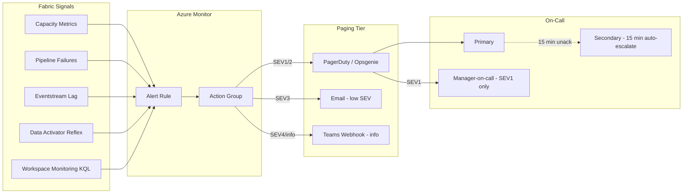
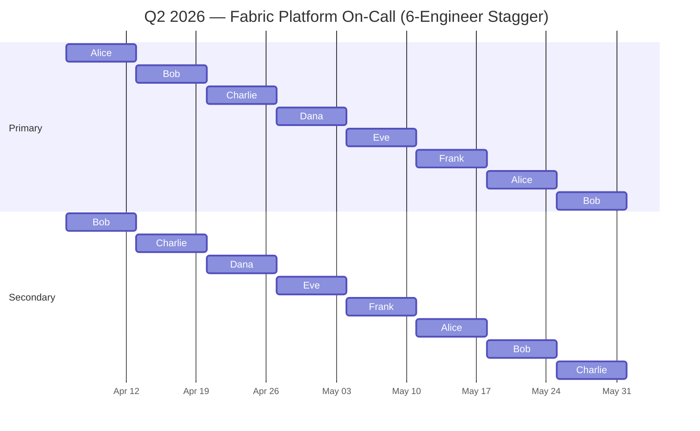

# 📟 On-Call Rotation Handbook

<div align="center" markdown>

**Running a sustainable on-call rotation for Microsoft Fabric production workloads**


</div>

---

**Last Updated:** `2026-04-27` | **Version:** 1.0.0 | **Phase:** 14 (Wave 1, Feature 1.9)

---

## 🎯 Purpose & Audience

This handbook is the operational rulebook for any team running an on-call rotation against Microsoft Fabric production workloads — capacity, lakehouses, pipelines, semantic models, real-time intelligence, and downstream Power BI reports. It is intentionally opinionated: most rotation problems are people problems, not tooling problems, and unprincipled rotations burn out engineers fast.

### Audience

| Reader | What you will get from this doc |
|--------|---------------------------------|
| **Platform engineers entering the rotation** | Pre-shift checklist, response expectations, handoff template |
| **Engineering managers** | Rotation models, comp policy template, wellbeing checkpoints |
| **SRE / Operations leads** | Paging integration, alert quality standards, anti-patterns to police |
| **Incident commanders** | How the rotation feeds into incident response (link to incident-response-template) |
| **New hires** | Shadow → reverse-shadow → primary onboarding path |

### Scope

In scope: rotation cadence, handoff, paging via Azure Action Groups, alert quality, engineer wellbeing, compensation framing.
Out of scope: incident response procedure (see [`incident-response-template.md`](../../runbooks/incident-response-template.md)), alert authoring (see [`alerting-data-activator.md`](../alerting-data-activator.md)), SLO definition (see SLO/SLI doc).

> **Anchor principle:** A rotation that wakes engineers up for noise will collapse within a quarter. Every page must be defensible — actionable, customer-impacting, SLO-anchored.

---

## 🔁 Rotation Models

There is no universal rotation. Pick the model that matches your team size, geographic distribution, and workload criticality. Do not mix models without a written reason.

### Model A — Follow-the-Sun

Engineers in three regions (Americas, EMEA, APAC) cover business hours in their region; rotation hands off across time zones.

| Dimension | Detail |
|-----------|--------|
| **Best for** | Global teams with ≥3 staffed regions and 24×7 SEV1 coverage |
| **Team size** | ≥9 engineers (3 per region minimum) |
| **Pager fatigue** | Low — no overnight pages within a region |
| **Handoff** | Daily, 3× per cycle |
| **Risk** | Context loss across handoffs; requires excellent written handoffs |
| **Comp** | No off-hours premium needed |
| **Tooling** | Strong runbook discipline; shared incident channel travels with shift |

### Model B — Primary + Secondary (Recommended Default)

Single region runs the rotation. Primary owns acknowledgment; secondary backs up if primary misses SLA or escalates.

| Dimension | Detail |
|-----------|--------|
| **Best for** | Single-region teams of 4–10 engineers running a Fabric platform |
| **Team size** | ≥4 engineers (each on-call ≤25% of weeks) |
| **Pager fatigue** | Moderate — overnight pages possible, secondary cushions |
| **Handoff** | Weekly |
| **Risk** | Burnout if team <4; secondary becomes "shadow primary" without clear takeover triggers |
| **Comp** | Off-hours premium or comp time required (see [Compensation](#-compensation-policy-template)) |
| **Tooling** | Two paging tiers with auto-escalation after 15 min |

### Model C — Single-Region Weekly

One on-call per week, no secondary, manager is implicit backup.

| Dimension | Detail |
|-----------|--------|
| **Best for** | Small teams (3–4 engineers) with low SEV1 frequency (<1/quarter) |
| **Team size** | ≥3 engineers |
| **Pager fatigue** | High — engineer solely responsible for the week |
| **Handoff** | Weekly |
| **Risk** | Single point of failure; cannot meaningfully take time off mid-shift |
| **Comp** | Comp time mandatory; consider shift premium |
| **Tooling** | Manager opt-in to secondary tier; clear "I'm overwhelmed" escalation |

### Model D — Holiday & Weekend Coverage Variants

Holidays and weekends require explicit handling — not "whoever happens to be on-call".

| Variant | Pattern | When to use |
|---------|---------|-------------|
| **Split holiday rotation** | Holidays rotate independently, evenly distributed YoY | Teams with cultural diversity |
| **Weekend pair** | Weekends staffed by 2 engineers (lighter P + ultra-light S) | High-traffic weekends (casino Fri–Sun peaks) |
| **Volunteer holiday** | Opt-in to specific holidays for premium pay or comp days | Strong volunteer culture; requires fair tracking |
| **No-page holidays** | SEV1 paging only; SEV2/3 deferred to next business day | Non-revenue-impacting platforms |

> **Casino caveat:** Casino peaks Fri–Sun → weekend coverage MUST be a pair, not single primary.
> **Federal caveat:** USDA/SBA/NOAA/EPA/DOI follow OPM holidays; align rotation calendars.

---

## ⭐ Recommended Rotation for Fabric Platforms

For the vast majority of Fabric platform teams in this POC's reference architecture, the default is:

> **1-week rotation, Monday-to-Monday handoff at 10:00 local time, Primary + Secondary, with a Weekend Pair on Fri–Sun.**

### Why these defaults

| Choice | Rationale |
|--------|-----------|
| **1-week shifts** | Long enough to build context on open issues; short enough that fatigue is bounded |
| **Monday handoff at 10:00** | Avoids weekend transitions; gives incoming on-call a buffer to read context before lunch |
| **Primary + Secondary** | Single-tier rotations collapse on the first vacation conflict; secondary catches handoff misses |
| **Weekend Pair** | Saturday/Sunday pages are the highest-fatigue and most ambiguous; two pairs of eyes prevent solo escalation panic |
| **Auto-escalate after 15 min** | Aligns to SEV2 page SLA in [`incident-response-template.md`](../../runbooks/incident-response-template.md) |

### Default schedule shape

```
Mon 10:00 ─────────── 7 days ─────────── Mon 10:00
   │                                         │
   ├─ Primary (P): full responsibility       │
   ├─ Secondary (S): backup, takeover at 15m │
   └─ Weekend pair active Fri 18:00 → Mon 10:00
```

### Rotation frequency target

| Team Size | Weeks On-Call per Engineer per Quarter | Sustainability |
|-----------|----------------------------------------|----------------|
| 4 engineers | 3.25 weeks | At edge — recruit before hitting 3 |
| 6 engineers | 2.17 weeks | Comfortable |
| 8 engineers | 1.63 weeks | Healthy |
| 10+ engineers | ≤1.3 weeks | Excellent — consider follow-the-sun if growth continues |

---

## 👥 Roles & Responsibilities

### Primary On-Call

**Does:** ack every page within SLA (see [Severity Matrix](../../runbooks/incident-response-template.md#severity-matrix)); drives SEV3/SEV4 alone; acts as Technical Lead for SEV1/SEV2 pulling in IC; maintains timeline and `#incident-*` updates; authors/updates runbooks for novel failures; captures postmortem-grade evidence before mitigation closes the window.

**Does NOT:** solo-handle SEV1 (always page secondary + IC); ship permanent fixes during shift unless trivially safe; do code reviews / design docs / deep work; vacation mid-shift without arranged swap (small life events: notify secondary).

### Secondary On-Call

**Does:** stays reachable on same paging tier; auto-escalation triggers at 15 min unack; takes over when primary hands off; sanity-checks SEV1/SEV2 mitigation as second pair of eyes; covers weekend pair window jointly with primary.

**Takeover triggers — formal handoff to secondary:**

| Trigger | Action |
|---------|--------|
| Primary unreachable for 15 min after page | Paging tool auto-escalates; secondary becomes acting primary |
| Primary explicitly types `/handoff` in incident channel | Secondary acks within 5 min |
| Primary on a SEV1 already and a second SEV2 lands | Secondary takes the SEV2 |
| Primary hits 4 consecutive hours of active incident work | Mandatory swap — secondary takes over for ≥2 hours |
| Primary illness / family emergency | Manager-on-call coordinates full-shift swap |

### Incident Commander (when assigned)

Assigned for SEV1 and large-blast-radius SEV2 only — typically a Platform Lead or designated senior engineer, NOT the primary on-call. Owns the incident end-to-end (decisions, role assignment, comms cadence); coordinates technical lead, comms lead, scribe; decides rollback vs. fix-forward; declares resolution; convenes postmortem. Full role: [`incident-response-template.md`](../../runbooks/incident-response-template.md).

### Manager-On-Call

Engineering manager or platform lead with paging access. Receives notification (not page) for every SEV1 within 15 min of declaration; handles executive comms (VP Eng, customers, regulators for compliance-impacting incidents); approves SKU changes / spend decisions > $X; coordinates cross-team pulls (security, network); backstop when primary+secondary both unreachable.

---

## ✅ Pre-Shift Checklist

Run this checklist on the **Friday before** your Monday shift starts. Catching access issues during business hours prevents 2 a.m. paging-tool lockouts.

```markdown
## On-Call Pre-Shift Checklist (run T-3 days)

### Access & Tooling
- [ ] Paging tool (PagerDuty / Opsgenie / Action Group email) — log in; mobile push works
- [ ] Test page sent to self via paging tool
- [ ] VPN successful from on-call laptop
- [ ] Fabric Portal (app.fabric.microsoft.com) — MFA works
- [ ] Power BI Admin (admin.powerbi.com) — capacity metrics access
- [ ] Azure Portal + Azure CLI authenticated (`az account show`)
- [ ] Teams notifications enabled for `#incident-*` and `#oncall`
- [ ] Phone bridge URL bookmarked (SEV1)

### Context
- [ ] Read last 14 days of `#oncall-handoff` posts
- [ ] Reviewed open postmortem action items
- [ ] Reviewed open SEV2/SEV3 incidents not yet closed
- [ ] Read most recent handoff doc from outgoing primary

### Runbook Bookmarks (browser folder "On-Call")
- [ ] [Incident Response Template](../../runbooks/incident-response-template.md), [Runbooks Index](../../runbooks/index.md)
- [ ] [Alerting & Data Activator](../alerting-data-activator.md), [Monitoring & Observability](../monitoring-observability.md)

### Logistics
- [ ] Phone charger near bed
- [ ] Secondary + Manager-on-call names + phones confirmed
- [ ] Calendar cleared of deep work; "ON-CALL" header set
- [ ] Travel plans flagged to manager (flight time = secondary covers)
```

> **Manager check:** If an engineer cannot complete this checklist 72 hours before shift, swap them out. Going on-call with broken access is worse than going short-staffed.

---

## ⏱️ During-Shift Expectations

### Response SLAs (linked to severity)

| Severity | Acknowledge | Engage | Reference |
|----------|------------|--------|-----------|
| **SEV1** | 5 min | Immediate, drop other work | [Incident Response Template § Severity Matrix](../../runbooks/incident-response-template.md#severity-matrix) |
| **SEV2** | 15 min | Within 30 min | Same |
| **SEV3** | 2 hr | Within business day | Same |
| **SEV4** | 24 hr | Within 5 business days | Same |

### "Don't fix it alone" — when to escalate

| Situation | Escalate to |
|-----------|------------|
| SEV1 declared | Incident Commander + Manager-on-call (immediate) |
| You've been driving an incident for 60+ min without progress | Secondary on-call (pair up) |
| Mitigation requires a SKU change, capacity resize, or spend decision | Manager-on-call |
| Customer-visible regulatory data impact (CTR/SAR, HIPAA, FedRAMP) | Compliance Officer + Manager-on-call (within 30 min) |
| You don't recognize the failure mode | Subject-matter expert via secondary or manager |
| You're tired or impaired (illness, lack of sleep) | Secondary takeover — no questions asked |

> **Cultural anchor:** Asking for help is the sign of a senior engineer, not a junior one. The team grades on incident outcomes, not solo heroics.

### Deep work expectations during shift

> **None.** Do not plan deep technical work during your on-call week.

- Pull only small, low-risk tickets (bug fixes, doc updates, config tweaks)
- Avoid starting design work, large PRs, or anything requiring 4+ hour focus blocks
- Treat the week as "ops + light work" — your manager has been told to expect this
- Use slow incident-free time to clear postmortem action items, update runbooks, audit alerts

### Travel & meeting policy

| Activity | Allowed during shift? |
|----------|----------------------|
| Flying (no connectivity) | ❌ Only with secondary fully covering |
| Off-site meetings (no laptop) | ❌ Unless secondary on standby |
| Driving | ⚠️ Only with hands-free; pull over for SEV1 |
| In-office meetings (≤1 hour, laptop open) | ✅ |
| Lunch (notify secondary in pre-shift Slack) | ✅ |
| Medical appointments (notify secondary, hand off pager during) | ✅ |
| Vacation | ❌ Swap shift in advance; never go on-call from vacation |

### Comp time / compensation reminder

Off-hours pages outside business hours accrue comp time per your org policy (see [Compensation Policy Template](#-compensation-policy-template)). Track in your time-tracking tool. **Do not skip this** — undertracked off-hours work is the #1 driver of burnout invisibility.

---

## 🤝 Handoff Procedure

A bad handoff guarantees the incoming on-call walks into a SEV1 blind. Make handoff a **scheduled 15-minute meeting**, not a Slack message.

### Handoff meeting agenda (Monday 10:00, 15 min)

| Minute | Topic | Owner |
|--------|-------|-------|
| 0–3 | Open incidents (status, ETA, blockers) | Outgoing |
| 3–6 | Recent escalations (last 7 days), patterns to watch | Outgoing |
| 6–8 | Pending postmortem actions, who owns them | Outgoing |
| 8–11 | Known fragility / "watch this" items (capacity climbing, pipeline flaky, deploys planned) | Outgoing |
| 11–13 | Calendar conflicts for incoming (vacations, off-sites in the team) | Incoming |
| 13–15 | Q&A, paging tool live test (incoming sends test page to themselves) | Both |

### Handoff document template

Outgoing primary writes this, posts in `#oncall-handoff` 30 minutes before the meeting, and walks through it during the call:

```markdown
# On-Call Handoff: [Outgoing] → [Incoming]
**Shift end:** [Date Mon 10:00] | **Pages this week:** [N] (SEV1:x, SEV2:y, SEV3:z, SEV4:w)

## 🔴 Open Incidents
| ID | SEV | Status | Owner | Next step | ETA |
|----|-----|--------|-------|-----------|-----|
| INC-2026-04-22-001 | SEV2 | Mitigated | [name] | Fix in PR-1234 | This week |
| INC-2026-04-25-003 | SEV3 | Investigating | [name] | Awaiting MS Support | Unknown |

## 📈 Recent Escalations / Patterns
- 3 capacity throttling events Fri evening — investigate root cause
- Eventstream lag spikes correlated with deploy pipeline (suspected)

## 📋 Pending Postmortem Actions
- [ ] PM-2026-04-15: Add CMK key rotation alert (@alice, due 2026-05-01)
- [ ] PM-2026-04-18: Reduce noise on `lh_silver` GE warnings (@bob, due 2026-04-30)

## 👀 Watch This
- Capacity F64 trending +5%/week — may need F128 by month-end
- Deploy planned Wed 14:00 UTC — suppression scheduled
- Compliance Officer touring Tuesday afternoon

## 📅 Calendar | 🔑 Hot Runbooks | 🆘 Escalation Contacts
- @charlie (secondary) out Fri PM — manager-on-call covering
- Hot this week: capacity-throttling-response.md, pipeline-failure-triage.md
- Escalation: Manager-on-call [name/#], IC rota (PagerDuty), Compliance [name/#], MS Premier TAM [name/case#]

## ✋ Anything else? [free text]
```

> **Rule:** If outgoing primary is sick/unreachable for handoff, secondary leads it from their notes. Never skip the meeting; reschedule by ≤2 hours if needed.

---

## 📡 Paging Integration with Fabric

Fabric does not ship a built-in pager. Paging is wired through **Azure Monitor + Action Groups** routed to PagerDuty / Opsgenie / Email / Teams.

### Architecture



### Bicep snippet — Action Group with severity routing

This pattern lives in the Wave 1 Bicep modules; full module: [`infra/modules/monitoring/action-group.bicep`](https://github.com/fgarofalo56/Suppercharge_Microsoft_Fabric/blob/main/infra/modules/monitoring/action-group.bicep) (when implemented).

```bicep
@description('Action group for on-call paging — severity-routed')
resource oncallActionGroup 'Microsoft.Insights/actionGroups@2023-01-01' = {
  name: 'ag-fabric-oncall-${environment}'
  location: 'global'
  properties: {
    groupShortName: 'fabricOnC'
    enabled: true
    // SEV1/SEV2 — PagerDuty webhook
    webhookReceivers: [{ name: 'pagerduty-primary', serviceUri: pagerDutyIntegrationUrl, useCommonAlertSchema: true }]
    // SEV3 — email distribution
    emailReceivers: [{ name: 'oncall-email', emailAddress: 'oncall-fabric@example.com', useCommonAlertSchema: true }]
    // SEV4 / info — Teams via Logic App
    logicAppReceivers: [{ name: 'teams-info', resourceId: teamsLogicAppResourceId, callbackUrl: teamsLogicAppCallbackUrl, useCommonAlertSchema: true }]
    // SEV1 — Manager-on-call SMS
    smsReceivers: [{ name: 'manager-oncall', countryCode: '1', phoneNumber: managerOnCallPhone }]
  }
}
```

### Severity-based routing matrix

| Severity | Primary channel | Secondary auto-escalation | Manager notification |
|----------|----------------|---------------------------|----------------------|
| **SEV1** | PagerDuty page | After 5 min unack | Immediate SMS |
| **SEV2** | PagerDuty page | After 15 min unack | At 30 min unresolved |
| **SEV3** | Email + Teams | Email-only retry at 2 hr | Daily digest |
| **SEV4** | Teams channel | None | Weekly digest |

### Suppression windows (planned maintenance)

Suppress pages during scheduled maintenance. **Every suppression must have an end time** — use a calendar reminder to re-enable.

```bash
# Disable / re-enable via Azure CLI
az monitor metrics alert update -g rg-fabric-poc -n "alert-capacity-throttling" --enabled false
az monitor metrics alert update -g rg-fabric-poc -n "alert-capacity-throttling" --enabled true
```

| Maintenance Type | Length | Approver |
|------------------|--------|----------|
| Routine deploy (notebook) | 30 min | Primary on-call |
| Capacity scale-up/down | 1 hr | Manager-on-call |
| Cross-region failover drill | 4 hr | VP Eng |
| Microsoft-announced maintenance | Window + 30 min buffer | Manager-on-call |

### Test paging cadence — monthly fire drill

First Tuesday of every month at 14:00 local: on-call engineer triggers a deliberate test page to verify the chain.

```markdown
## Monthly Fire Drill
- [ ] Trigger synthetic alert (force pipeline failure on no-op pipeline)
- [ ] Verify PagerDuty/Opsgenie page within 60 sec; ack stops secondary auto-escalation
- [ ] Verify Teams channel post for info-tier; if SEV1 sim, verify manager SMS
- [ ] Document outcome in #oncall-fire-drills
```

---

## 🧹 Alert Quality Standards

**Every page must be defensible.** Before any new alert ships, it passes this gate.

### The five rules

1. **SLO-anchored only.** No alert exists without a written SLO/SLI it defends. See SLO/SLI doc.
2. **No "informational" pages.** Information goes to Teams/email, not PagerDuty.
3. **Auto-resolve flapping alerts.** If a condition self-recovers within 5 min on >2 occurrences in 24 hr, raise the threshold or add hysteresis.
4. **Actionable runbook required.** Every alert links to a runbook with a "first thing to check" step. No runbook → no alert.
5. **Owner required.** Every alert has a named owner team in the alert metadata; orphaned alerts are deleted in the quarterly audit.

### Quarterly noise audit

Run on the first business day of each quarter. Target: **<2 false pages per shift**.

```markdown
## Q[N] Alert Noise Audit — Period: [start] → [end]
**Total pages:** [N] | **False/flapping:** [n] ([n/N]%) | **Target:** <2 false/shift

### Top noisy alerts (action this quarter)
| Alert name | Fires/shift | False rate | Action |
|-----------|-------------|------------|--------|
| `cap_cpu_above_85_5min` | 4.1 | 60% | Raise to 90% / 10min |
| `pipeline_late_5min` | 2.3 | 80% | Move to 15 min, Teams-only |

### Deleted | Added | Health metrics (false rate %, pages/shift, ack p50/p90)
```

---

## 💚 Engineer Wellbeing

A rotation is only sustainable if the people in it are. Treat wellbeing as a first-class engineering constraint, not HR fluff.

### Post-incident decompression

| Incident Severity | Decompression policy |
|-------------------|---------------------|
| **SEV1** with off-hours work | **Mandatory next morning off** (paid). No questions asked. |
| **SEV2** with off-hours work | Late start next day; manager confirms before requesting morning standup attendance |
| **Multi-hour overnight** | Sleep until you wake naturally; standup optional |
| **Postmortem after SEV1** | Held within 48 hr but never the same day as the incident |

### Out-of-hours work tracking

Every page outside core business hours (before 09:00 / after 18:00 local, weekends, holidays) is logged.

```markdown
## Off-Hours Log Entry
- Date/Time: 2026-04-25 02:13 → 03:47 local | Engineer: [name]
- Severity: SEV2 | Incident: INC-2026-04-25-002
- Duration: 1h 34m | Comp accrued: 1.5× = 2h 21m
```

Tracked per-engineer in HR system or shared spreadsheet; visible to manager weekly.

### Burnout signals — manager checkpoints

Manager runs a 1:1 specifically about on-call experience after every shift. Watch for:

| Signal | What it might mean |
|--------|-------------------|
| Asks to skip rotation "just this once" multiple times | Approaching burnout — investigate workload |
| Cynicism about alerts ("all noise anyway") | Alert quality eroded; trigger noise audit |
| Ack times trending up | Fatigue or motivation issue |
| Reluctance to escalate; solo-fixing everything | Cultural problem; reinforce "ask for help" |
| Off-hours hours trending up YoY | Rotation too thin; recruit or restructure |
| Mentions sleep disruption | Pull off rotation; address root cause |

### Comp time / time-off-in-lieu

| Off-hours work | Comp accrual |
|----------------|--------------|
| Weekday evening (18:00–22:00) | 1.0× hours worked |
| Late night (22:00–08:00) | 1.5× hours worked |
| Weekend day | 1.5× hours worked |
| Public holiday | 2.0× hours worked |

Engineers are **expected** to use accrued comp time. Manager reviews unused balance monthly and books time off if balance >40 hours.

> **Cultural anchor:** "I'll just work through it" is not a flex — it is debt the team eventually pays.

---

## 🎓 Onboarding New On-Call

Three-phase ramp before solo primary. Total: ~6 weeks.

| Phase | Weeks | Activity | Exit Criteria |
|-------|-------|----------|---------------|
| **1 — Shadow** | 1–2 | Rides along with current primary; receives silent pages; observes triage; joins handoffs as observer; reads all runbooks | Describe severity matrix from memory; read 90 days of incidents |
| **2 — Reverse-Shadow** | 3–4 | "Acting primary"; mentor shadows silent; mentor only intervenes if customer impact would result; authors handoff doc; runs monthly fire drill | Handled ≥1 SEV2 or SEV3 with mentor as backup; authored ≥1 runbook update |
| **3 — Solo Primary** | 5–6 | On rotation as primary; mentor intentionally placed as secondary; standard auto-escalation applies | Two consecutive shifts with no mentor intervention; manager 1:1 sign-off |

```markdown
## Onboarding Checklist: [Engineer Name]
- [ ] Phase 1 Wk 1+2: Shadow shifts complete; runbook reading done
- [ ] Phase 2 Wk 1+2: Reverse-shadow shifts complete; one runbook authored
- [ ] Phase 3 Wk 1+2: First two solo shifts complete
- [ ] Manager 1:1 sign-off; added to permanent rotation roster
```

---

## 💰 Compensation Policy Template

> **This is a template. Set actual values per your organization's HR and finance policies.**

### Suggested structure

| Component | Template value | Notes |
|-----------|---------------|-------|
| **On-call stipend** | $[X] per week of primary; $[X/2] per week of secondary | Paid regardless of pages received |
| **Page premium** | $[Y] per acknowledged off-hours page | Caps prevent abuse but acknowledge effort |
| **Off-hours work multiplier** | 1.5× (late night, weekend), 2.0× (holiday) | Tracked as comp time or paid OT per role |
| **Holiday rotation premium** | $[Z] per major holiday (Thanksgiving, Christmas, New Year's Day) | Volunteer-based |
| **Mandatory time-off-in-lieu** | Morning off after any SEV1; same-day off after multi-hour overnight | Non-negotiable |

### What to write down before launching the rotation

- Who is eligible (role grades, employment type)
- How comp is tracked (timesheet system, HR portal)
- How comp is paid out (next paycheck, quarterly, time-off only)
- Cap on accruable comp time (use-it-or-lose-it threshold)
- Process for disputes (manager → skip-level → HR)

> **Pitfall:** Do not launch a rotation without a written comp policy. Verbal promises around comp time evaporate during reorgs and create resentment.

---

## 🚫 Anti-Patterns

### 1 — "We'll figure it out as we go"
Rotation launched without handoff template, severity matrix, or comp policy. Two engineers quit within a quarter citing burnout. **Fix:** Use this handbook before week 1.

### 2 — Permanent on-call
One engineer "owns" paging because "they know it best". Bus factor 1 → that engineer cannot vacation → leaves. **Fix:** Rotate across ≥4 engineers. If only one knows the system, the bug is documentation.

### 3 — Heroic culture
Engineers brag about all-nighters; managers reward visibly. Asking for help becomes shameful; SEV1s solo-handled badly; postmortems blame individuals. **Fix:** Praise **early escalation** and **clean handoffs**. Never praise sleep deprivation.

### 4 — Alert sprawl
200+ alerts, half flapping, 60% false rate. Engineers mute pager → miss real SEV1. **Fix:** Quarterly noise audit; SLO-only alerts.

### 5 — Skipping postmortems
SEV1 resolved → "we know what happened". Same incident recurs three times in six months. **Fix:** SEV1 postmortem mandatory within 48 hr, blameless, action items tracked to closure.

### 6 — Manager not in the loop
Manager finds out about SEV1 from a customer email Monday. Trust breakdown. **Fix:** Manager-on-call SMS for every SEV1; weekly oncall review in 1:1s.

### 7 — No suppression for deploys
Deploys page on-call 5 times during rollout → engineer ignores deploy-window pages → misses real one. **Fix:** Mandatory suppression windows with end times.

### Anti-Pattern Summary

| Anti-Pattern | Risk | Fix |
|--------------|------|-----|
| Figure it out as we go | Burnout, attrition | Use this handbook before launch |
| Permanent on-call | Bus factor 1 | Rotate across ≥4 engineers |
| Heroic culture | Solo-fix failures | Reward escalation publicly |
| Alert sprawl | Pager fatigue | Quarterly audit, SLO-anchored |
| Skipping postmortems | Repeat incidents | 48-hr blameless mandatory |
| Manager out of loop | Trust collapse | Manager-on-call SMS for SEV1 |
| No deploy suppression | Pager fatigue | Mandatory windows w/ end times |

---

## 📅 Sample On-Call Calendar

Sample 1-quarter rotation for a 6-engineer team using Primary + Secondary, Mon-Mon handoff.



| Pattern | Description |
|---------|-------------|
| **Stagger** | Primary and secondary lists offset by one engineer; no engineer is primary and secondary the same week |
| **Cycle length** | 6 weeks, then repeats — every engineer gets equal load |
| **Holiday allocation** | Memorial Day (May 25) and Independence Day (Jul 3) tracked separately; volunteer first, then rotate fairly |
| **Vacation overrides** | Swap forms posted in `#oncall` ≥2 weeks ahead; no last-minute swaps without manager approval |

---

## 📚 Related Runbooks & Best Practices

### Runbooks (operational procedures)

| Document | When to read |
|----------|--------------|
| [Incident Response Template](../../runbooks/incident-response-template.md) | Anchor — severity matrix, IC role, postmortem template |
| [Runbooks Index](../../runbooks/index.md) | Catalog of failure-mode-specific runbooks |
| [Capacity Throttling Response](../../runbooks/capacity-throttling-response.md) | Capacity SEV1/SEV2 |
| [Pipeline Failure Triage](../../runbooks/pipeline-failure-triage.md) | Pipeline SEV2/SEV3 |
| [Auth Failure Playbook](../../runbooks/auth-failure-playbook.md) | Workspace Identity / SP failures |

### Best practices (this folder + adjacent)

| Document | When to read |
|----------|--------------|
| [Alerting & Data Activator](../alerting-data-activator.md) | Authoring or tuning alerts |
| [Monitoring & Observability](../monitoring-observability.md) | Building dashboards, KQL for capacity |
| [Error Handling & Monitoring](../error-handling-monitoring.md) | Pipeline error architecture |
| [Disaster Recovery & BCDR](../disaster-recovery-bcdr.md) | Region failover during SEV1 |
| [Capacity Planning & Cost Optimization](../capacity-planning-cost-optimization.md) | Scale decisions during incidents |
| SLO / SLI for Fabric (`slo-sli-fabric.md`, this wave) | Anchoring alerts to SLOs |

### Microsoft Documentation

- [Azure Monitor Action Groups](https://learn.microsoft.com/azure/azure-monitor/alerts/action-groups)
- [Fabric Workspace Monitoring](https://learn.microsoft.com/fabric/fundamentals/workspace-monitoring-overview)
- [Microsoft Fabric Status Page](https://support.fabric.microsoft.com/support/)
- [Azure Service Health](https://learn.microsoft.com/azure/service-health/overview)

### External References

- Google SRE Book — [Being On-Call](https://sre.google/sre-book/being-on-call/)
- Google SRE Workbook — [On-Call](https://sre.google/workbook/on-call/)
- PagerDuty Incident Response — [Being On-Call](https://response.pagerduty.com/oncall/being_oncall/)

---

[⬆️ Back to Top](#-on-call-rotation-handbook) | [📚 Best Practices Index](../index.md) | [🏠 Documentation Home](../../index.md)
