[Home](../../index.md) > [Docs](../../) > [Best Practices](../) > [Operations](./) > SLO/SLI for Fabric

# 🎯 SLO/SLI Definitions for Fabric Workspaces

<div align="center" markdown>

**A Concrete Service-Level Framework for Production Microsoft Fabric Capacities**


</div>

---

**Last Updated:** `2026-04-27` | **Phase:** 14 (Wave 1) | **Version:** 1.0.0

---

## 📑 Table of Contents

- [🎯 Why SLO/SLI for Fabric](#-why-slosli-for-fabric)
- [📖 Glossary](#-glossary)
- [🟡 The Four Golden Signals (Adapted for Fabric)](#-the-four-golden-signals-adapted-for-fabric)
- [📚 Recommended SLI Catalog by Item Type](#-recommended-sli-catalog-by-item-type)
- [🎚️ Recommended SLO Targets](#️-recommended-slo-targets)
- [💰 Error Budget Methodology](#-error-budget-methodology)
- [🔥 Burn-Rate Alerts (Multi-Window)](#-burn-rate-alerts-multi-window)
- [💻 KQL Queries for Each SLI](#-kql-queries-for-each-sli)
- [🚨 Wiring SLOs → Alerts → Pages](#-wiring-slos--alerts--pages)
- [📅 SLO Review Cadence](#-slo-review-cadence)
- [🚫 Anti-Patterns](#-anti-patterns)
- [📋 Sample SLO Document Template](#-sample-slo-document-template)
- [🔗 Related Runbooks & Best-Practice Docs](#-related-runbooks--best-practice-docs)
- [📚 References](#-references)

---

## 🎯 Why SLO/SLI for Fabric

Most teams running Microsoft Fabric workloads in production have *implicit* expectations: "the report should be fresh by 9 AM," "the pipeline should usually succeed," "queries should be fast." Implicit expectations breed silent disagreements between engineering, product, and stakeholders — and they make on-call decisions arbitrary ("is *this* slow enough to page someone?").

This document establishes an **explicit Service-Level Objective (SLO) framework** for Microsoft Fabric workspaces, grounded in the Google SRE methodology and adapted to Fabric's unique primitives: capacity units, Direct Lake, Eventstreams, semantic model refreshes, and pipeline orchestration.

### What Explicit SLOs Buy You

| Benefit | Why It Matters in Fabric |
|---------|--------------------------|
| **Decision authority for on-call** | "CU at 92% for 6 minutes" is no longer a judgment call — the runbook knows whether to page |
| **Aligned expectations** | Product owners, capacity planners, and engineers agree on "good enough" before incidents happen |
| **Error budget as a feature flag** | When budget burns fast, freeze risky deploys; when budget is healthy, ship features |
| **Capacity ROI** | Tie SKU spend (F64 → F128) to measurable user-facing outcomes, not gut feel |
| **Postmortem rigor** | Every SEV1/SEV2 retrospective starts with "which SLO breached, by how much" |
| **Compliance evidence** | NIGC MICS, FedRAMP, and HIPAA auditors increasingly ask for documented availability targets |

### When NOT to Define an SLO

- **Throwaway dev workspaces** — overhead exceeds value
- **Brand-new pipelines (<30 days production)** — no baseline; you'll set targets blind
- **One-off analyst exploration** — measure operational items, not human curiosity
- **Synthetic test workloads** — they exist to break things; don't conflate with user impact

> **Rule:** Every workspace tagged `environment=production` MUST have an SLO document on file. Workspaces tagged `staging` SHOULD. `dev` and `sandbox` are exempt.

---

## 📖 Glossary

| Term | One-Sentence Definition |
|------|--------------------------|
| **SLI** (Service Level Indicator) | A directly measurable, customer-meaningful metric (e.g., the percentage of pipeline runs in the last hour that succeeded). |
| **SLO** (Service Level Objective) | A target value or range for an SLI over a defined window (e.g., "99.5% of pipeline runs succeed over a rolling 28 days"). |
| **SLA** (Service Level Agreement) | A contractual promise to a customer, usually weaker than the internal SLO and with financial penalties — Fabric publishes its own SLAs; this doc is about *your* internal targets. |
| **Error Budget** | `(1 − SLO) × time_window` — the amount of "bad" allowed before stakeholders should care; e.g., 99.5% over 28d = 3.36 hours of allowable badness. |
| **Burn Rate** | How fast you are consuming the error budget; a 1× burn rate exhausts the budget exactly at window-end, 14× exhausts in <2 days. |
| **Good event / Bad event** | The atoms an SLI counts (e.g., a successful refresh = good, a failed refresh = bad). |
| **Customer-meaningful** | An SLI a real user would notice changing (latency, success, freshness) — *not* CPU utilization. |

---

## 🟡 The Four Golden Signals (Adapted for Fabric)

Google SRE defines four signals every service should measure: **Latency, Traffic, Errors, Saturation**. The Fabric mapping:

| Golden Signal | Generic Definition | Fabric Concrete Metrics | System Table / Source |
|---------------|--------------------|-------------------------|------------------------|
| **Latency** | How long requests take | Lakehouse / Warehouse query duration; Power BI report load; semantic model refresh time; Eventstream end-to-end delay | `FabricSQLQueries`, `FabricSemanticModelRefreshes`, `FabricEventstreamMetrics` |
| **Traffic** | Demand on the system | Queries/min, pipeline runs/hr, eventstream messages/sec, active concurrent users | `FabricSQLQueries`, `FabricPipelineRuns`, `FabricEventstreamMetrics` |
| **Errors** | Rate of failed requests | Pipeline failures, refresh failures, query timeouts, auth rejections, GE quality gate failures | `FabricPipelineRuns`, `FabricSemanticModelRefreshes`, `FabricAuditEvents` |
| **Saturation** | "Fullness" of the system | Capacity Unit (CU) utilization %, Spark executor pressure, Eventhouse ingestion lag, Eventhouse storage % | `FabricCapacityMetrics`, `FabricSparkSessions`, `FabricEventhouseMetrics` |

```mermaid
flowchart LR
    subgraph Signals["Four Golden Signals"]
        L[Latency<br/>p50/p95/p99]
        T[Traffic<br/>QPS, runs/hr]
        E[Errors<br/>fail %]
        S[Saturation<br/>CU %, lag]
    end

    subgraph SLI["SLI Catalog"]
        SLI1[Query latency]
        SLI2[Pipeline success]
        SLI3[Refresh freshness]
        SLI4[Stream lag]
        SLI5[CU saturation]
    end

    subgraph SLO["SLO Targets"]
        SLO1[p95 < 10s 99% of time]
        SLO2[99.5% success]
        SLO3[<2hr stale 99.9% of time]
        SLO4[<5min lag 99% of time]
        SLO5[CU<80% 99% of time]
    end

    subgraph Action["Action"]
        A1[Burn rate alert]
        A2[Page on-call]
        A3[Runbook execution]
    end

    Signals --> SLI
    SLI --> SLO
    SLO --> Action

    style Signals fill:#E67E22,color:#fff
    style SLI fill:#6C3483,color:#fff
    style SLO fill:#2471A3,color:#fff
    style Action fill:#27AE60,color:#fff
```



> **Rule of thumb:** If you cannot map a metric to one of the four signals, it is operational telemetry — not an SLI.

---

## 📚 Recommended SLI Catalog by Item Type

The catalogs below are starting points. Every workspace must explicitly *adopt* an SLI (with an owner) — defaults are not contracts.

### Lakehouse / Warehouse Query Latency

| SLI | Definition | Measurement |
|-----|------------|-------------|
| **Query Latency p50** | 50th percentile of completed query duration | `percentile(DurationMs, 50)` over 5-min window |
| **Query Latency p95** | 95th percentile — most users feel this | `percentile(DurationMs, 95)` over 5-min window |
| **Query Latency p99** | 99th percentile — tail risk for power users / dashboards | `percentile(DurationMs, 99)` over 5-min window |
| **Query Success Rate** | % of queries that completed without error | `count(Status == "Succeeded") / count(*)` |

> **Scope guidance:** Filter to *user-initiated* queries only. Exclude system maintenance queries (`OPTIMIZE`, `VACUUM`, statistics refresh) — they pollute the distribution.

### Pipeline Success Rate

| SLI | Definition | Measurement |
|-----|------------|-------------|
| **Pipeline Success Rate (rolling 7d)** | % of pipeline runs that succeeded over last 7 days | `count(Status == "Succeeded") / count(Status in ("Succeeded","Failed"))` |
| **Pipeline Activity Success Rate** | Per-activity granularity (Copy, Notebook, etc.) | `count(ActivityStatus == "Succeeded") / count(*)` |
| **Pipeline Duration p95** | Tail latency of orchestration | `percentile(EndTime - StartTime, 95)` |

> **Cancellation handling:** Manually cancelled runs count as neither good nor bad — exclude from the denominator.

### Dataset Refresh Success Rate

| SLI | Definition | Measurement |
|-----|------------|-------------|
| **Semantic Model Refresh Success Rate** | % of scheduled refreshes that completed | `count(RefreshStatus == "Completed") / count(*)` |
| **Refresh Freshness** | Max age of last successful refresh at any point | `now() − max(LastSuccessfulRefreshTime)` |
| **Refresh Duration p95** | How long refreshes typically take | `percentile(DurationMs, 95)` |

### Eventstream End-to-End Latency

| SLI | Definition | Measurement |
|-----|------------|-------------|
| **Eventstream E2E Latency p95** | Time from event arrival to destination commit | `percentile(SinkCommitTime − EventTime, 95)` |
| **Eventstream Throughput** | Messages successfully processed per second | `sum(MessagesProcessed) / 60` per-minute |
| **Eventstream DLQ Rate** | % of messages routed to dead-letter queue | `count(DLQ) / count(Total)` |

### Eventhouse Ingestion Lag

| SLI | Definition | Measurement |
|-----|------------|-------------|
| **Ingestion Lag p95** | 95th percentile delay from arrival to queryable | `percentile(IngestedTime − ArrivalTime, 95)` |
| **Ingestion Failure Rate** | % of ingestion batches that fail | `count(Failed) / count(Total)` |
| **Storage % Used** | Eventhouse storage relative to capacity allocation | `StorageUsedGB / StorageAllocatedGB` |

### Capacity CU Saturation

| SLI | Definition | Measurement |
|-----|------------|-------------|
| **CU Saturation %** | Percent of allocated CUs in use (smoothed) | `CUSecondsUsed / CUSecondsAllocated × 100` |
| **Throttling Events** | Count of distinct minute-windows where throttling fired | `countif(Throttled == true)` per minute |
| **Carry-Forward Debt** | CU debt rolled into next 24h smoothing window | `sum(CarryForwardCUSeconds)` |

### Authentication Success Rate

| SLI | Definition | Measurement |
|-----|------------|-------------|
| **Auth Success Rate (Workspace Identity)** | % of WI auth attempts succeeding | `count(Result == "Success") / count(*)` |
| **Auth Success Rate (Service Principal)** | Same, scoped to SPs accessing data | per-SP filter |
| **Token Refresh Success** | % of token-refresh calls succeeding | `count(TokenRefresh == "Success") / count(*)` |

### Power BI Report Load Time

| SLI | Definition | Measurement |
|-----|------------|-------------|
| **Initial Render p95** | Time to first interactive paint of the report | `percentile(InitialRenderMs, 95)` |
| **Visual Query p95** | Per-visual DAX query duration | `percentile(VisualQueryMs, 95)` |
| **Report Open Success Rate** | % of report opens completing without error | `count(Status == "Success") / count(*)` |

---

## 🎚️ Recommended SLO Targets

Targets are tiered. Pick the tier that matches the workspace's business criticality. **Higher tiers cost more** (engineering effort, capacity headroom, on-call hours). Don't aspire upward unless funded.

### Tier Definitions

| Tier | Use For | Engineering Cost | Capacity Headroom |
|------|---------|------------------|-------------------|
| **Aspirational (4 nines)** | SOX-reporting Gold marts; compliance dashboards (NIGC, FedRAMP) | High — multi-region, blue/green deploys, hot standby | 50%+ |
| **Standard (3 nines)** | Production Casino floor, federal agency operational reports | Medium — alerting + tested runbooks + on-call | 25–40% |
| **Best-effort (2 nines)** | Internal analytics, non-customer-facing exploratory marts | Low — best-effort during business hours | 10–20% |

### SLO Target Table

| SLI | Aspirational | Standard | Best-Effort |
|-----|--------------|----------|-------------|
| Query Latency p95 (Lakehouse/Warehouse) | < 5s — 99.9% of windows | < 10s — 99% of windows | < 30s — 95% of windows |
| Query Latency p99 | < 15s — 99% | < 30s — 99% | < 60s — 95% |
| Pipeline Success Rate (rolling 7d) | 99.9% | 99.5% | 98% |
| Semantic Model Refresh Success | 99.9% | 99.5% | 99% |
| Refresh Freshness (Direct Lake reframe / import) | < 30 min stale 99.9% | < 2 hr stale 99.9% | < 6 hr stale 99% |
| Eventstream E2E Latency p95 | < 30s | < 2 min | < 5 min |
| Eventhouse Ingestion Lag p95 | < 1 min | < 5 min | < 15 min |
| Capacity CU Saturation | < 70% sustained 99.9% | < 80% sustained 99% | < 90% sustained 95% |
| Authentication Success Rate | 99.99% | 99.9% | 99.5% |
| Power BI Initial Render p95 | < 3s | < 8s | < 20s |

> **Casino POC default:** Standard tier for `lh_silver` / `lh_gold` consumed by the Casino floor NOC dashboard; Aspirational for `fact_compliance_summary` and CTR/SAR pipelines (regulatory).

> **Federal POC default:** Standard for all operational marts; Aspirational for `fact_compliance_summary` equivalents and any FedRAMP-monitored continuous-monitoring feeds.

---

## 💰 Error Budget Methodology

### Calculating the Budget

```
Error Budget = (1 − SLO) × Time Window
```

| SLO | 28-day window | Per-day equivalent |
|-----|---------------|--------------------|
| 99.0% | 6.72 hours | 14.4 minutes |
| 99.5% | 3.36 hours | 7.2 minutes |
| 99.9% | 40.3 minutes | 1.44 minutes |
| 99.95% | 20.2 minutes | 43.2 seconds |
| 99.99% | 4.03 minutes | 8.64 seconds |

### 28-Day Rolling vs Calendar Month

| Approach | Pros | Cons | Recommendation |
|----------|------|------|----------------|
| **28-day rolling** | Smooth — never resets at month boundary; matches SRE-book canonical practice | Harder to communicate to non-engineers ("which 28 days?") | **Default** for engineering-owned SLOs |
| **Calendar month** | Easy to explain; aligns with month-end reporting; resets are predictable | Encourages risky behavior at month-start ("we have a fresh budget!") | Use for stakeholder-facing reports only |
| **Quarterly** | Aligns with planning cadence; less alert noise | Slow signal — bad behavior hides for weeks | Avoid for primary SLOs |

> **Recommended:** Compute SLO compliance on a **28-day rolling** window for engineering decisions. Roll up to a **monthly stakeholder report** for external comms. Never use both as gates simultaneously.

### What to Do When Budget Is Burned

| Budget Remaining | Engineering Posture |
|------------------|---------------------|
| **> 50%** | Ship features. Take risks. Run experiments. |
| **25–50%** | Ship features but increase deploy review scrutiny; pause optional risky changes. |
| **10–25%** | Freeze non-essential changes. Focus rotation on reliability work. |
| **0–10%** | **Production freeze.** Only fixes that improve reliability. Page leadership. |
| **< 0% (over-budget)** | All hands. Postmortem all incidents in window. No new features until budget restored. |

### Burn Rate Math

```
Burn Rate = (% of budget consumed in window W) / (W as fraction of total period)
```

A burn rate of `1` means you'll exhaust the budget exactly at window end. A burn rate of `14.4` over 1 hour means you'll exhaust the entire 28-day budget in **2 days** if it continues — that's pageable.

---

## 🔥 Burn-Rate Alerts (Multi-Window)

Single-threshold alerts are noisy and slow. The SRE community's solution: **multi-window, multi-burn-rate alerts**, modeled on Google's recommendations.

### The Three-Tier Pattern

| Window | Burn Rate Threshold | Time-to-Exhaust Budget | Severity | Action |
|--------|---------------------|------------------------|----------|--------|
| **1 hour** | ≥ **14.4×** | < 2 days | SEV1 — page immediately | "Fast burn" — service is on fire |
| **6 hours** | ≥ **6×** | < ~5 days | SEV2 — page during business hours | "Sustained burn" — investigate today |
| **24 hours** | ≥ **1×** | < 28 days | SEV3 — ticket, weekly review | "Slow burn" — backlog item |

### Why Multi-Window

A single 14.4× burn-rate breach over **5 minutes** could just be an alert flap. Requiring it sustained over **1 hour** dramatically reduces false pages while still catching real outages within ~10 min of onset (because the 1-hour window fires when its rolling SLI breaches, not at hour-end).

### Worked Example: Pipeline Success SLO 99.5%

```
SLO: 99.5% (over 28 days)
Allowable failure rate: 0.5%
Total budget: 0.5% × 28d = 3.36 hours of "down" pipelines

Fast-burn alert (1h, 14.4×):
  Threshold = 0.5% × 14.4 = 7.2% failure rate over 1 hour
  → If >7.2% of last hour's pipeline runs failed, page on-call (SEV1)

Sustained-burn alert (6h, 6×):
  Threshold = 0.5% × 6 = 3.0% failure rate over 6 hours
  → If >3% of last 6 hours' runs failed, page during business hours (SEV2)

Slow-burn alert (24h, 1×):
  Threshold = 0.5% × 1 = 0.5% failure rate over 24 hours
  → If sustained, ticket for review (SEV3)
```

> The numbers `14.4` and `6` come directly from Chapter 5 of the *Site Reliability Workbook* (Google) and have been validated across thousands of services. Don't invent your own without evidence.

---

## 💻 KQL Queries for Each SLI

All queries below run against the **Workspace Monitoring Eventhouse** system tables. Adjust workspace names and time ranges before use.

### Query Latency p95 (Lakehouse/Warehouse)

```kql
// Lakehouse/Warehouse query latency p50/p95/p99 over 5-min buckets
FabricSQLQueries
| where TimeGenerated > ago(1h)
| where Status == "Succeeded"
| where QueryType in ("LakehouseSQL", "WarehouseSQL")
| where IsSystemQuery == false   // exclude OPTIMIZE/VACUUM
| summarize
    p50 = percentile(DurationMs, 50),
    p95 = percentile(DurationMs, 95),
    p99 = percentile(DurationMs, 99),
    QueryCount = count()
    by bin(TimeGenerated, 5m), WorkspaceName
| order by TimeGenerated desc
```

### Pipeline Success Rate (Rolling 7d)

```kql
FabricPipelineRuns
| where TimeGenerated > ago(7d)
| where Status in ("Succeeded", "Failed")    // exclude "Cancelled"
| summarize
    Total = count(),
    Succeeded = countif(Status == "Succeeded"),
    Failed = countif(Status == "Failed")
    by WorkspaceName, PipelineName
| extend SuccessRate = round(100.0 * Succeeded / Total, 4)
| extend MeetsSLO_99_5 = SuccessRate >= 99.5
| order by SuccessRate asc
```

### Pipeline Burn-Rate Alert (Fast Burn, 1h, 14.4×)

```kql
let SLO = 99.5;
let BurnRate = 14.4;
let FailThreshold = (100.0 - SLO) * BurnRate / 100.0;   // 0.072 = 7.2%
FabricPipelineRuns
| where TimeGenerated > ago(1h)
| where Status in ("Succeeded", "Failed")
| summarize Total = count(), Failed = countif(Status == "Failed") by WorkspaceName
| extend FailRate = 1.0 * Failed / Total
| where FailRate >= FailThreshold and Total >= 10   // require min sample size
| project WorkspaceName, Total, Failed, FailRate, AlertSeverity = "SEV1"
```

### Semantic Model Refresh Freshness

```kql
// Time since last successful refresh, per dataset
FabricSemanticModelRefreshes
| where TimeGenerated > ago(7d)
| where Status == "Completed"
| summarize LastSuccess = max(EndTime) by WorkspaceName, DatasetName
| extend StalenessMinutes = datetime_diff('minute', now(), LastSuccess)
| extend MeetsSLO_StandardTier = StalenessMinutes <= 120   // < 2 hr
| order by StalenessMinutes desc
```

### Semantic Model Refresh Success Rate (28d Rolling)

```kql
FabricSemanticModelRefreshes
| where TimeGenerated > ago(28d)
| summarize
    Total = count(),
    Completed = countif(Status == "Completed"),
    Failed = countif(Status == "Failed")
    by WorkspaceName, DatasetName
| extend SuccessRate = round(100.0 * Completed / Total, 4)
| extend BudgetRemaining_99_5 =
    iff(SuccessRate >= 99.5,
        round(((SuccessRate - 99.5) / 0.5) * 100, 1),  // % of budget left
        0.0)
| order by BudgetRemaining_99_5 asc
```

### Eventstream E2E Latency

```kql
FabricEventstreamMetrics
| where TimeGenerated > ago(1h)
| where MetricName == "EndToEndLatencyMs"
| summarize
    p50 = percentile(MetricValue, 50),
    p95 = percentile(MetricValue, 95),
    p99 = percentile(MetricValue, 99)
    by bin(TimeGenerated, 1m), EventstreamName
| extend MeetsSLO_StandardTier = p95 <= 120000   // < 2 min
```

### Eventhouse Ingestion Lag

```kql
.show ingestion failures
| where FailedOn > ago(1h)
| summarize Failures = count() by Table, FailureKind
| order by Failures desc;

// Lag distribution from system metrics
FabricEventhouseMetrics
| where TimeGenerated > ago(1h)
| where MetricName == "IngestionLagSeconds"
| summarize p95 = percentile(MetricValue, 95) by bin(TimeGenerated, 1m), Database, Table
| extend MeetsSLO_StandardTier = p95 <= 300   // < 5 min
```

### Capacity CU Saturation

```kql
// 5-minute rolling CU utilization vs capacity allocation
FabricCapacityMetrics
| where TimeGenerated > ago(1h)
| summarize
    CUUsed = sum(CUSeconds),
    CUAvailable = max(CapacityCUSecondsAvailable)
    by bin(TimeGenerated, 5m), CapacityName
| extend SaturationPct = round(100.0 * CUUsed / CUAvailable, 2)
| extend MeetsSLO_StandardTier = SaturationPct < 80
| order by TimeGenerated desc
```

### Capacity Throttling Burn (Fast Burn)

```kql
let SLO_NotThrottled = 99.0;
let BurnRate = 14.4;
let ThrottleThresholdPct = (100.0 - SLO_NotThrottled) * BurnRate;   // 14.4%
FabricCapacityMetrics
| where TimeGenerated > ago(1h)
| summarize
    Total = count(),
    Throttled = countif(Throttled == true)
    by CapacityName
| extend ThrottlePct = round(100.0 * Throttled / Total, 2)
| where ThrottlePct >= ThrottleThresholdPct
| project CapacityName, ThrottlePct, AlertSeverity = "SEV1", Runbook = "capacity-throttling-response.md"
```

### Authentication Success Rate

```kql
FabricAuditEvents
| where TimeGenerated > ago(1h)
| where Operation in ("WorkspaceIdentityAuth", "ServicePrincipalAuth")
| summarize
    Total = count(),
    Failed = countif(Result == "Failure")
    by Operation, WorkspaceName
| extend SuccessRate = round(100.0 * (Total - Failed) / Total, 4)
| extend MeetsSLO_StandardTier = SuccessRate >= 99.9
```

### Power BI Report Load Time

```kql
FabricPowerBIReportRenders
| where TimeGenerated > ago(1h)
| where ReportLifecycle == "InitialRender"
| summarize
    p50 = percentile(DurationMs, 50),
    p95 = percentile(DurationMs, 95),
    p99 = percentile(DurationMs, 99)
    by bin(TimeGenerated, 5m), ReportName
| extend MeetsSLO_StandardTier = p95 <= 8000   // < 8s
```

---

## 🚨 Wiring SLOs → Alerts → Pages

```mermaid
flowchart LR
    subgraph Capture["1. SLI Capture"]
        I1[Workspace Monitoring<br/>System Tables]
        I2[Capacity Metrics App]
    end

    subgraph Compute["2. SLO Computation"]
        C1[Scheduled KQL queries]
        C2[28-day rolling windows]
        C3[Burn-rate calculation]
    end

    subgraph Alert["3. Alert Routing"]
        A1[Data Activator rules]
        A2[Azure Monitor alerts]
        A3[Action Group<br/>email + SMS + webhook]
    end

    subgraph Page["4. Paging"]
        P1[PagerDuty / Opsgenie]
        P2[On-call rotation]
    end

    subgraph Respond["5. Runbook"]
        R1[Severity-specific runbook]
        R2[Incident channel opened]
        R3[Postmortem]
    end

    Capture --> Compute --> Alert --> Page --> Respond

    style Capture fill:#E67E22,color:#fff
    style Compute fill:#6C3483,color:#fff
    style Alert fill:#2471A3,color:#fff
    style Page fill:#C0392B,color:#fff
    style Respond fill:#27AE60,color:#fff
```



### SEV1 Trigger Conditions (Page Immediately)

A SEV1 fires when **any** of these are true on a production workspace:

- **Fast-burn breach (1h, 14.4×) on any 99.9%+ SLI** — service is melting
- **Capacity throttled** for ≥ 5 sustained minutes
- **All pipelines failing** (success rate < 50% in last hour, sample ≥ 10)
- **Auth success rate < 95%** in last 15 min (auth meltdown)
- **Eventhouse ingestion lag > 30 min** (real-time path is broken)
- **Compliance feed (CTR/SAR/W-2G or FedRAMP CDM)** stale beyond regulatory window

Routes to: **[Incident Response Template](../../runbooks/incident-response-template.md)** + matched specialist runbook.

### SEV2 Trigger Conditions (Page During Business Hours)

- **Sustained-burn breach (6h, 6×)** on any standard-tier SLI
- **Single critical pipeline failed > 2 hours**
- **Semantic model refresh failed for prod report**
- **CU saturation > 90% sustained for 30+ min**
- **Eventstream DLQ rate > 1% sustained**

### SEV3 Trigger Conditions (Ticket, Review)

- **Slow-burn breach (24h, 1×)** — budget will exhaust at month-end if unchanged
- Single non-critical pipeline failed
- Intermittent slow queries (p95 elevated but inside SLO)
- Non-prod refresh failures

### Slow Burn vs Fast Burn — Visual

```
                 ┌──────────────────────────────┐
                 │  Error Budget = 100% (start) │
                 └──────────────┬───────────────┘
                                │
        ┌───────────────────────┼───────────────────────┐
        │                       │                       │
  Fast burn (14.4×)      Sustained (6×)          Slow burn (1×)
   1h window              6h window               24h window
        │                       │                       │
        ▼                       ▼                       ▼
   PAGE NOW              PAGE TODAY              TICKET (review)
   SEV1                  SEV2                    SEV3
   "fire"                "smoke"                 "smell"
```

---

## 📅 SLO Review Cadence

SLOs are not set-and-forget. The Fabric platform ships features quarterly; user expectations evolve; capacity SKUs change. **Recalibrate explicitly.**

### Quarterly SLO Review

| Activity | Owner | Output |
|----------|-------|--------|
| Pull last 90 days of SLI data per workspace | Platform team | Compliance scorecard |
| Identify SLOs consistently met (>99.9% of windows) | Platform team | "Tighten target?" candidates |
| Identify SLOs frequently breached (<95% of windows) | Service owners | "Loosen target or invest?" decisions |
| Review postmortems, map to SLOs | Incident Commanders | New SLIs that should have caught the issue |
| Survey customers / stakeholders on perceived issues | Product owners | Gap between measured and felt reliability |
| Update SLO docs in Archon | Service owners | Versioned SLO doc per workspace |

### When to Recalibrate Outside Cadence

- **Major capacity change** (F64 → F128 or vice versa)
- **New regulatory requirement** (e.g., new state gaming rule, new federal directive)
- **Third consecutive month of breach** — target is unrealistic
- **Two postmortems for same root cause** — SLI gap detected
- **Customer complaint with no matching alert** — SLI missing entirely

### Recalibration Decision Framework

```
SLO consistently met (>99.9% of windows)?
  ├─ Yes ─→ Is engineering investing effort to maintain it?
  │          ├─ Yes → Tighten target, free engineering for new work
  │          └─ No  → Leave alone (it's working)
  │
  └─ No  ─→ Are user complaints aligned with breach pattern?
             ├─ Yes → Invest in reliability OR loosen target with stakeholder buy-in
             └─ No  → SLI is wrong (measuring something users don't feel) — redefine
```

---

## 🚫 Anti-Patterns

### ❌ "100% Reliability" SLO

**Problem:** "We need 100% uptime."
**Why wrong:** No real system is 100%. Setting 100% means you can never deploy, never experiment, and your error budget is zero — every incident is a crisis.
**Fix:** Pick a realistic tier (99.5%, 99.9%) with explicit budget. Embrace that the budget *will* be spent.

### ❌ Measuring CPU Instead of Customer Outcome

**Problem:** SLO defined as "Spark cluster CPU < 80%."
**Why wrong:** Users do not feel CPU. They feel slow queries.
**Fix:** Translate to a customer-meaningful metric (query latency p95, refresh duration).

### ❌ One SLO for the Whole Workspace

**Problem:** "Workspace SLO = 99.5%."
**Why wrong:** A workspace is not a service. A failed nightly internal report and a failed CTR compliance pipeline get the same response — wrong incentives.
**Fix:** SLOs per-item-type or per-business-process. CTR pipeline gets Aspirational; analyst exploratory dataset gets Best-effort.

### ❌ Single-Threshold Alert ("p95 > 10s for 5 min")

**Problem:** Alert fires on every brief spike.
**Why wrong:** Alert fatigue → on-call ignores the page → real incidents miss the SLA.
**Fix:** Multi-window burn-rate alerts (1h/6h/24h, 14.4×/6×/1×).

### ❌ SLO Defined by Engineering Alone

**Problem:** No product/business owner agreed to the target.
**Why wrong:** When budget burns and engineering wants to freeze deploys, business pushes back. No prior agreement = no authority.
**Fix:** Every SLO has a co-signing **service owner** (engineering) and **business owner** (product/agency lead).

### ❌ Calendar-Month Budget Reset

**Problem:** Budget refills on the 1st of every month.
**Why wrong:** Encourages "let's ship risky stuff at the start of the month, we have a fresh budget."
**Fix:** 28-day rolling window. Always trailing, never resets.

### ❌ Alerting on the SLI, Not the Burn Rate

**Problem:** Alert fires when "p95 > 10s right now."
**Why wrong:** A 30-second blip pages you. A slow degradation over 3 weeks goes unnoticed until budget exhausts.
**Fix:** Alert on burn rate over multiple windows.

### ❌ Excluding "Maintenance" From SLI Calculation

**Problem:** "OPTIMIZE was running, that's why queries were slow — exclude it."
**Why wrong:** Users still felt slow queries. Reality doesn't have asterisks.
**Fix:** Include it. If maintenance hurts users, schedule it differently — don't paper over the SLI.

### ❌ Anti-Pattern Summary

| Anti-Pattern | Risk | Fix |
|--------------|------|-----|
| 100% SLO | Production freeze forever | Pick 99.5–99.99% tier |
| CPU-based SLI | Doesn't reflect user pain | Customer-meaningful metric |
| Workspace-level SLO | One size for many services | Per-item or per-process SLOs |
| Single-threshold alert | Flap fatigue | Multi-window burn-rate |
| Engineer-only SLO | No authority during budget burn | Co-sign with business owner |
| Calendar-month budget | Risky behavior at month-start | 28-day rolling window |
| Static threshold alerts | Misses slow degradation | Burn-rate alerts |
| Excluding maintenance | SLI lies about user experience | Include all user-facing time |

---

## 📋 Sample SLO Document Template

> **Copy this section** into your workspace SLO doc and fill in the brackets. Store at `docs/slos/{workspace-name}.md` and link from your Archon project.

```markdown
# SLO Document — {Workspace Name}

**Version:** {1.0.0}
**Last Reviewed:** {YYYY-MM-DD}
**Next Review:** {YYYY-MM-DD} (quarterly)
**Service Owner (Engineering):** {@username}
**Business Owner (Product / Agency):** {@username}
**Tier:** {Aspirational / Standard / Best-Effort}

## Workspace Scope

- **Workspace ID:** {GUID}
- **Capacity:** {F64 / F128 / etc.}
- **Items in scope for SLOs:**
  - {lh_silver_casino — Silver lakehouse}
  - {lh_gold_casino — Gold lakehouse}
  - {sm_casino_floor — Semantic model}
  - {pl_bronze_to_silver — Pipeline}
  - {es_slot_telemetry — Eventstream}

## SLIs and SLOs

### SLI 1: {Name}

- **Definition:** {one sentence — what counts as good vs bad}
- **Source:** {KQL query or dashboard}
- **SLO target:** {e.g., 99.5% over 28-day rolling window}
- **Error budget:** {N min/hr per 28d}
- **Fast-burn alert (1h, 14.4×):** {threshold}
- **Sustained-burn alert (6h, 6×):** {threshold}
- **Slow-burn alert (24h, 1×):** {threshold}
- **Runbook on breach:** {link to runbook}

### SLI 2: {Name}

{repeat structure}

### SLI 3: {Name}

{repeat structure}

## Compliance & Regulatory Notes

- **NIGC / FedRAMP / HIPAA implications:** {if any — explicit yes/no}
- **Customer-facing SLA reference:** {if external SLA backs this internal SLO}

## Review History

| Date | Change | Reason | Approver |
|------|--------|--------|----------|
| {YYYY-MM-DD} | Initial | First production deploy | {@user} |
| {YYYY-MM-DD} | Tightened p95 from 10s → 8s | Budget unused 6 months | {@user} |

## Action Items From Last Review

| ID | Item | Owner | Due | Status |
|----|------|-------|-----|--------|
| {AI-1} | {action} | {@user} | {date} | {todo / done} |

## Notes

{Free-form context — special handling, known seasonal patterns, related projects}
```

---

## 🔗 Related Runbooks & Best-Practice Docs

### Related Runbooks

| Runbook | When SLO Breach Triggers It |
|---------|------------------------------|
| [Incident Response Template](../../runbooks/incident-response-template.md) | Master template — every SEV1/SEV2 starts here |
| [Capacity Throttling Response](../../runbooks/capacity-throttling-response.md) | CU saturation SLO breach |
| [Pipeline Failure Triage](../../runbooks/pipeline-failure-triage.md) | Pipeline success-rate burn |
| [Auth Failure Playbook](../../runbooks/auth-failure-playbook.md) | Authentication SLO breach |
| [Multi-Region Failover](../../runbooks/multi-region-failover.md) | Region-wide SLO breach |
| [Data Quality Incident](../../runbooks/data-quality-incident.md) | Quality-gate SLO breach |
| [Tenant Migration (Dev/Staging/Prod)](../../runbooks/tenant-migration-dev-staging-prod.md) | Rollback after deploy-induced burn |

### Related Best-Practice Docs

| Document | Relationship |
|----------|--------------|
| [Monitoring & Observability](../monitoring-observability.md) | Telemetry collection that feeds the SLIs |
| [Capacity Planning & Cost Optimization](../capacity-planning-cost-optimization.md) | Capacity sizing to satisfy CU saturation SLO |
| [Error Handling & Monitoring](../error-handling-monitoring.md) | Pipeline error architecture |
| [Alerting & Data Activator](../alerting-data-activator.md) | Wiring layer for burn-rate alerts |
| [Testing Strategies](../testing-strategies.md) | Pre-prod gates that protect SLOs |
| [Disaster Recovery / BCDR](../disaster-recovery-bcdr.md) | RTO/RPO SLOs for failover |

### Related Feature Docs

| Document | Relationship |
|----------|--------------|
| [Workspace Monitoring](../../features/workspace-monitoring.md) | Source of truth for FabricCapacityMetrics, FabricPipelineRuns, FabricSemanticModelRefreshes |
| [Real-Time Intelligence](../../features/real-time-intelligence.md) | Eventstream / Eventhouse SLI source |
| [Direct Lake](../../features/direct-lake.md) | Refresh-freshness SLI considerations |

---

## 📚 References

### Microsoft Documentation

- [Fabric Workspace Monitoring](https://learn.microsoft.com/fabric/fundamentals/workspace-monitoring-overview)
- [Fabric Capacity Metrics App](https://learn.microsoft.com/fabric/enterprise/metrics-app)
- [Fabric Capacity Throttling](https://learn.microsoft.com/fabric/enterprise/throttling)
- [Power BI dataset refresh monitoring](https://learn.microsoft.com/power-bi/connect-data/refresh-troubleshooting-refresh-scenarios)
- [Data Activator](https://learn.microsoft.com/fabric/data-activator/data-activator-introduction)
- [Microsoft Fabric SLA](https://www.microsoft.com/licensing/docs/view/Service-Level-Agreements-SLA-for-Online-Services)

### SRE Foundations

- Google, *Site Reliability Engineering* (the "SRE Book"), Chapter 4: Service Level Objectives. https://sre.google/sre-book/service-level-objectives/
- Google, *The Site Reliability Workbook*, Chapter 5: Alerting on SLOs (multi-window, multi-burn-rate). https://sre.google/workbook/alerting-on-slos/
- Google, *The Site Reliability Workbook*, Chapter 2: Implementing SLOs. https://sre.google/workbook/implementing-slos/

### Adjacent Reading

- [Atlassian — How to set SMART SLOs](https://www.atlassian.com/incident-management/kpis/sla-vs-slo-vs-sli)
- [Microsoft Azure Well-Architected — Reliability pillar](https://learn.microsoft.com/azure/well-architected/reliability/)

---

[⬆️ Back to Top](#-slosli-definitions-for-fabric-workspaces) | [📚 Best Practices Index](../index.md) | [📖 Runbooks Index](../../runbooks/index.md) | [🏠 Home](../../index.md)
