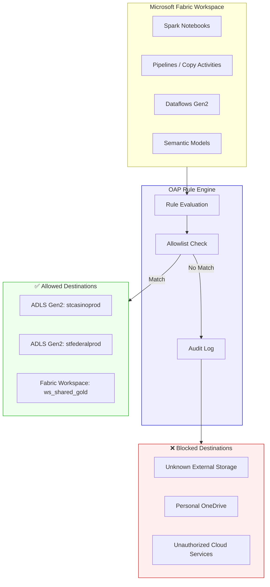
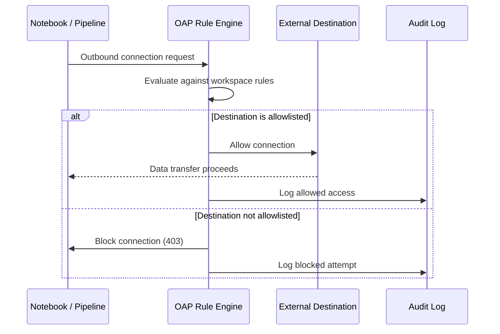
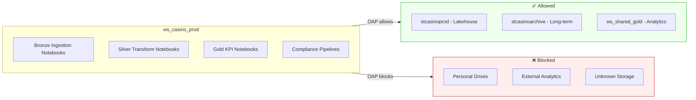
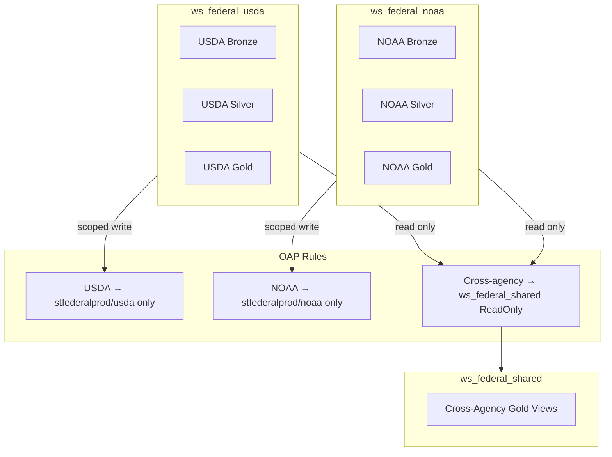
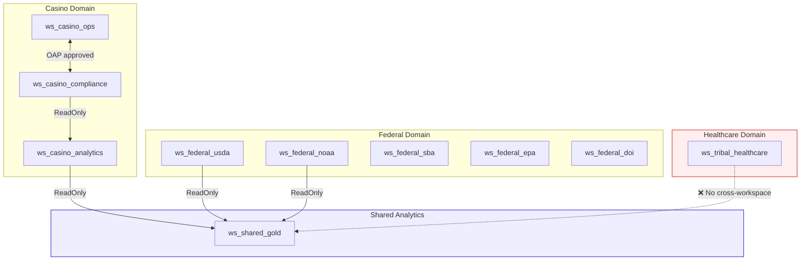
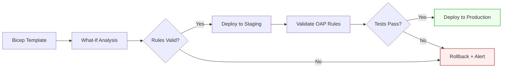

# 🛡️ Outbound Access Protection (OAP)

<div align="center" markdown>

**Prevent Data Exfiltration with Fabric-Native Network Controls**


</div>

---

**Last Updated:** `2026-04-13` | **Version:** 1.0.0

---

## 🎯 Overview

Outbound Access Protection (OAP) is a Microsoft Fabric security feature (GA March 2026) that prevents data exfiltration by controlling which external destinations Fabric workloads can connect to. When enabled at the workspace level, OAP blocks all outbound connections by default and requires administrators to explicitly allowlist trusted storage accounts, Fabric workspaces, and external connectors.

For regulated environments -- casino gaming operations subject to NIGC MICS compliance, federal agencies bound by FedRAMP and FISMA, and healthcare workloads under HIPAA -- OAP provides a critical network-layer defense against unauthorized data movement.

> **Why OAP matters for this project:** Casino financial records, federal agency datasets, and healthcare PHI must never leave approved storage boundaries. OAP enforces this at the platform level, independent of user permissions or notebook code.

### Key Capabilities

| Capability | Description |
|------------|-------------|
| **Default-deny outbound** | All external connections blocked until explicitly allowed |
| **Storage account allowlisting** | Permit access to specific ADLS Gen2 accounts only |
| **Cross-workspace approval** | Control which Fabric workspaces can exchange data |
| **Connector restrictions** | Limit which external data connectors are available |
| **Audit logging** | Every blocked and allowed connection is logged |
| **Workspace-level granularity** | Different rules per workspace for domain isolation |

---

## 🏗️ Architecture

OAP operates as a network policy layer between Fabric workspace workloads and external destinations. Every outbound request is evaluated against the workspace's rule set before the connection is permitted.



### Request Flow



---

## ⚙️ Configuration

### Enabling OAP at Workspace Level

OAP is configured through the Fabric Admin Portal or programmatically via REST API. It applies per workspace, so each domain (casino, federal, healthcare) can have tailored rules.

**Step 1: Enable OAP on the workspace**

1. Navigate to the Fabric Admin Portal → **Workspaces**
2. Select the target workspace (e.g., `ws_casino_prod`)
3. Open **Settings** → **Security** → **Outbound Access Protection**
4. Toggle **Enable Outbound Access Protection** to **On**
5. Confirm the default-deny posture

> ⚠️ **Warning:** Enabling OAP immediately blocks all outbound connections that are not explicitly allowlisted. Plan your allowlist before enabling in production.

**Step 2: Define allowed ADLS Gen2 accounts**

Add each storage account that the workspace needs to access:

```
Storage Account: stcasinoprod
Resource Group:  rg-fabric-casino-prod
Subscription:    sub-casino-prod
Justification:   Primary Lakehouse storage for casino medallion layers
```

**Step 3: Approve cross-workspace connections**

Specify other Fabric workspaces that this workspace may connect to:

```
Workspace: ws_shared_gold     → Shared analytics layer
Workspace: ws_casino_staging  → Pre-production validation
```

**Step 4: Configure connector allowlists**

Restrict which data connectors are available within the workspace:

```
Allowed Connectors:
  - Azure Data Lake Storage Gen2
  - Azure SQL Database
  - Fabric Lakehouse
  - Fabric Warehouse
  - Eventhouse (KQL)

Blocked (all others):
  - HTTP/REST (generic)
  - FTP/SFTP
  - Third-party cloud storage
```

---

## 📋 Rule Types

OAP supports three categories of rules. Each rule specifies a destination type and an explicit allow entry.

### Rule Type Comparison

| Rule Type | Scope | Example | Use Case |
|-----------|-------|---------|----------|
| **ADLS Gen2 Storage** | Storage account + optional container | `stcasinoprod/bronze` | Control which storage accounts notebooks and pipelines can read/write |
| **Cross-Workspace** | Fabric workspace ID | `ws_shared_gold` | Allow data sharing between production and analytics workspaces |
| **External Connector** | Connector type | `AzureSqlDatabase` | Restrict which connector types are available in the workspace |

### ADLS Gen2 Storage Rules

Storage rules can be scoped to the account level or narrowed to specific containers:

```json
{
  "ruleType": "AzureDataLakeStorageGen2",
  "allowedDestinations": [
    {
      "storageAccountName": "stcasinoprod",
      "containers": ["bronze", "silver", "gold"],
      "accessLevel": "ReadWrite"
    },
    {
      "storageAccountName": "stcasinostaging",
      "containers": ["*"],
      "accessLevel": "ReadOnly"
    }
  ]
}
```

### Cross-Workspace Rules

```json
{
  "ruleType": "FabricWorkspace",
  "allowedDestinations": [
    {
      "workspaceId": "aabbccdd-1234-5678-abcd-ef0123456789",
      "workspaceName": "ws_shared_gold",
      "accessLevel": "ReadOnly"
    },
    {
      "workspaceId": "11223344-5566-7788-99aa-bbccddeeff00",
      "workspaceName": "ws_casino_staging",
      "accessLevel": "ReadWrite"
    }
  ]
}
```

### External Connector Rules

```json
{
  "ruleType": "ExternalConnector",
  "mode": "AllowList",
  "allowedConnectors": [
    "AzureDataLakeStorageGen2",
    "AzureSqlDatabase",
    "FabricLakehouse",
    "FabricWarehouse",
    "Eventhouse"
  ]
}
```

---

## 🎰 Casino Data Protection

Casino gaming environments handle financial transaction data, player PII, and compliance records (CTR/SAR/W-2G) that must never leave approved storage boundaries.

### Casino OAP Configuration



### Casino Rule Set

| Rule | Destination | Access | Justification |
|------|-------------|--------|---------------|
| Storage | `stcasinoprod` (all containers) | ReadWrite | Primary medallion Lakehouse |
| Storage | `stcasinoarchive` (`compliance/`) | Write | CTR/SAR 5-year retention archive |
| Workspace | `ws_shared_gold` | ReadOnly | Cross-domain analytics consumption |
| Workspace | `ws_casino_staging` | ReadWrite | Pre-production testing |
| Connector | `AzureSqlDatabase` | — | Operational database ingestion |
| Connector | `Eventhouse` | — | Real-time floor monitoring |

### Compliance-Specific Protections

**CTR/SAR data isolation:** Currency Transaction Reports and Suspicious Activity Reports contain sensitive financial intelligence. OAP ensures these records cannot be copied to any storage outside `stcasinoprod` and `stcasinoarchive`.

```python
# This notebook runs inside ws_casino_prod with OAP enabled.
# Attempting to write CTR data to an unauthorized account would be blocked.

# ✅ Allowed -- writing to approved Lakehouse
df_ctr.write.format("delta").mode("append").save(
    "abfss://gold@stcasinoprod.dfs.core.windows.net/compliance/ctr_reports"
)

# ❌ Blocked by OAP -- connection refused
# df_ctr.write.format("delta").save(
#     "abfss://export@unauthorizedstorage.dfs.core.windows.net/exfil"
# )
```

---

## 🏛️ Federal Data Exfiltration Prevention

Federal agency data carries strict regulatory requirements. Each agency's data must be isolated according to its governing compliance framework.

### Agency Compliance Mapping

| Agency | Compliance Framework | Key Requirement | OAP Enforcement |
|--------|---------------------|-----------------|-----------------|
| **USDA** | FISMA Moderate | Agricultural data sovereignty | Restrict to `stfederalprod` |
| **SBA** | FISMA Moderate | Loan program data protection | Block cross-agency export |
| **NOAA** | FISMA Low/Moderate | Environmental data integrity | Allow public dataset reads |
| **EPA** | FISMA Moderate | Environmental compliance isolation | Restrict export destinations |
| **DOI** | FISMA Moderate | Land/resource data protection | Agency-scoped storage only |

### Federal Multi-Agency Architecture



### HIPAA Protections (Tribal Healthcare)

Protected Health Information (PHI) in the Tribal Healthcare workspace requires the strictest OAP configuration:

```json
{
  "workspace": "ws_tribal_healthcare",
  "oapRules": {
    "storageRules": [
      {
        "account": "sthealthcareprod",
        "containers": ["bronze", "silver", "gold", "phi-vault"],
        "access": "ReadWrite"
      }
    ],
    "crossWorkspaceRules": [],
    "externalConnectorRules": {
      "mode": "AllowList",
      "allowed": ["FabricLakehouse", "FabricWarehouse"]
    }
  },
  "notes": "No cross-workspace access. No external connectors beyond Fabric-native."
}
```

> 🔒 **HIPAA enforcement:** The healthcare workspace permits zero cross-workspace connections. PHI data cannot leave `sthealthcareprod` under any circumstances.

### FedRAMP Alignment (DOT/FAA)

For FedRAMP-authorized workloads, OAP rules restrict data flow to FedRAMP-authorized Azure regions and services only:

- Storage accounts must reside in FedRAMP-authorized regions (US Gov Virginia, US Gov Arizona)
- Cross-workspace connections limited to workspaces in the same tenant boundary
- External connectors restricted to FedRAMP High-certified services

---

## 🔒 Multi-Workspace Strategy

The recommended pattern separates workspaces by domain and compliance boundary. Each workspace gets its own OAP rule set, and cross-workspace data sharing requires explicit bilateral approval.

### Workspace Topology



### OAP Rule Matrix

| Source Workspace | → `ws_shared_gold` | → Other Domain WS | → External Storage |
|-----------------|--------------------|--------------------|-------------------|
| `ws_casino_ops` | ReadOnly ✅ | Casino domain only ✅ | `stcasinoprod` only ✅ |
| `ws_casino_compliance` | ReadOnly ✅ | `ws_casino_ops` ✅ | `stcasinoprod` + archive ✅ |
| `ws_federal_usda` | ReadOnly ✅ | ❌ Blocked | `stfederalprod/usda` only ✅ |
| `ws_federal_noaa` | ReadOnly ✅ | ❌ Blocked | `stfederalprod/noaa` only ✅ |
| `ws_tribal_healthcare` | ❌ Blocked | ❌ Blocked | `sthealthcareprod` only ✅ |

### Bilateral Approval Pattern

Cross-workspace access requires rules on both sides. The source workspace must allow outbound to the destination, and the destination workspace must allow inbound from the source.

```
Source: ws_casino_analytics
  → OAP Rule: Allow outbound to ws_shared_gold (ReadOnly)

Destination: ws_shared_gold
  → OAP Rule: Allow inbound from ws_casino_analytics
```

---

## 📊 Monitoring & Alerting

### OAP Violation Logging

Every OAP evaluation -- allowed or blocked -- is captured in the Fabric unified audit log. Key fields include:

| Field | Description | Example |
|-------|-------------|---------|
| `Timestamp` | UTC time of the access attempt | `2026-04-13T14:32:01Z` |
| `WorkspaceId` | Source workspace | `ws_casino_prod` |
| `UserId` | User or service principal | `analyst@contoso.com` |
| `DestinationType` | Storage / Workspace / Connector | `AzureDataLakeStorageGen2` |
| `Destination` | Target resource | `unauthorizedstorage.dfs.core.windows.net` |
| `Action` | Allow or Block | `Block` |
| `RuleMatched` | Which rule applied (or none) | `None (default deny)` |
| `WorkloadType` | Notebook / Pipeline / Dataflow | `SparkNotebook` |

### KQL Query for Blocked Attempts

```kql
FabricAuditLogs
| where Category == "OutboundAccessProtection"
| where Action == "Block"
| summarize BlockCount = count() by
    WorkspaceName,
    UserId,
    Destination,
    WorkloadType,
    bin(Timestamp, 1h)
| order by BlockCount desc
| take 50
```

### Power BI Monitoring Dashboard

Create a Direct Lake semantic model over the audit log table to build an OAP monitoring dashboard with the following visuals:

| Visual | Type | Measures |
|--------|------|----------|
| Blocked Attempts Over Time | Line chart | Count by hour, filtered to `Action = Block` |
| Top Blocked Destinations | Bar chart | Destination ranked by block count |
| Violations by Workspace | Matrix | Workspace × User × Count |
| Allowed vs Blocked Ratio | KPI card | `Blocked / (Allowed + Blocked) × 100` |
| Recent Violations | Table | Last 24 hours, sorted by timestamp |

### Data Activator Alerts

Configure Data Activator Reflex items to trigger on OAP violations:

```
Reflex: OAP Violation Alert
  Object:    OAP Audit Events
  Trigger:   BlockCount > 5 within 1 hour for any single user
  Action:    Teams message → #security-ops channel
  Escalation: Email → security-admin@contoso.com if > 20 blocks in 4 hours
```

```
Reflex: Repeated Exfiltration Attempt
  Object:    OAP Audit Events
  Trigger:   Same user blocked > 3 times to same destination in 30 minutes
  Action:    Power Automate → Create incident ticket + disable user session
```

---

## 🔧 PowerShell & API Management

### PowerShell Cmdlets

Manage OAP rules programmatically for CI/CD integration:

```powershell
# Enable OAP on a workspace
Set-FabricWorkspaceSetting `
    -WorkspaceId "aabbccdd-1234-5678-abcd-ef0123456789" `
    -Setting "OutboundAccessProtection" `
    -Value "Enabled"

# Add an allowed storage account
Add-FabricOapRule `
    -WorkspaceId "aabbccdd-1234-5678-abcd-ef0123456789" `
    -RuleType "AzureDataLakeStorageGen2" `
    -Destination "stcasinoprod" `
    -Containers @("bronze", "silver", "gold") `
    -AccessLevel "ReadWrite"

# Add a cross-workspace rule
Add-FabricOapRule `
    -WorkspaceId "aabbccdd-1234-5678-abcd-ef0123456789" `
    -RuleType "FabricWorkspace" `
    -DestinationWorkspaceId "11223344-5566-7788-99aa-bbccddeeff00" `
    -AccessLevel "ReadOnly"

# List current rules
Get-FabricOapRules `
    -WorkspaceId "aabbccdd-1234-5678-abcd-ef0123456789"

# Remove a rule
Remove-FabricOapRule `
    -WorkspaceId "aabbccdd-1234-5678-abcd-ef0123456789" `
    -RuleId "rule-001"
```

### REST API

```http
# GET current OAP configuration
GET https://api.fabric.microsoft.com/v1/workspaces/{workspaceId}/outboundAccessProtection
Authorization: Bearer {token}

# PUT update OAP rules
PUT https://api.fabric.microsoft.com/v1/workspaces/{workspaceId}/outboundAccessProtection
Authorization: Bearer {token}
Content-Type: application/json

{
  "enabled": true,
  "defaultAction": "Deny",
  "rules": [
    {
      "ruleType": "AzureDataLakeStorageGen2",
      "destination": "stcasinoprod",
      "containers": ["bronze", "silver", "gold"],
      "accessLevel": "ReadWrite"
    },
    {
      "ruleType": "FabricWorkspace",
      "destinationWorkspaceId": "11223344-5566-7788-99aa-bbccddeeff00",
      "accessLevel": "ReadOnly"
    }
  ]
}
```

### CI/CD Integration with Bicep

Define OAP rules as part of your infrastructure-as-code deployment:

```bicep
@description('Outbound Access Protection rules for casino production workspace')
param oapRules array = [
  {
    ruleType: 'AzureDataLakeStorageGen2'
    destination: 'stcasinoprod'
    containers: [ 'bronze', 'silver', 'gold' ]
    accessLevel: 'ReadWrite'
  }
  {
    ruleType: 'FabricWorkspace'
    destinationWorkspaceId: sharedGoldWorkspaceId
    accessLevel: 'ReadOnly'
  }
]

resource fabricWorkspaceOap 'Microsoft.Fabric/workspaces/outboundAccessProtection@2026-01-01' = {
  name: '${workspaceName}/default'
  properties: {
    enabled: true
    defaultAction: 'Deny'
    rules: oapRules
  }
}
```

### Deployment Pipeline Pattern



---

## ⚠️ Limitations

| Limitation | Impact | Workaround |
|-----------|--------|------------|
| **Workspace-level only** | Cannot scope rules to individual items (notebooks, pipelines) within a workspace | Use separate workspaces for different security zones |
| **No IP-based rules** | Cannot allowlist by IP range or VNET | Use Private Endpoints + Managed VNet for network-layer controls |
| **Rule propagation delay** | New rules may take up to 5 minutes to take effect | Plan rule changes during maintenance windows |
| **No wildcard storage accounts** | Each storage account must be explicitly listed | Automate rule creation with PowerShell/API for many accounts |
| **Audit log latency** | OAP events may appear in audit logs with up to 15-minute delay | Do not rely on real-time log queries for blocking decisions |
| **Connector allowlist scope** | Applies to connector type, not specific instances | Combine with storage rules for granular control |
| **No user-level exceptions** | OAP applies to all users in the workspace equally | Create separate workspaces for users needing different access |

> 💡 **Best practice:** Combine OAP with Managed Private Endpoints and Microsoft Purview sensitivity labels for defense-in-depth. OAP controls where data can go, Private Endpoints control network paths, and Purview controls what users can see.

---

## 📚 References

| Resource | Link |
|----------|------|
| Microsoft Fabric Outbound Access Protection (GA) | [learn.microsoft.com/fabric/security/outbound-access-protection](https://learn.microsoft.com/fabric/security/outbound-access-protection) |
| Fabric Security Overview | [learn.microsoft.com/fabric/security/security-overview](https://learn.microsoft.com/fabric/security/security-overview) |
| Managed Private Endpoints | [learn.microsoft.com/fabric/security/security-managed-private-endpoints-overview](https://learn.microsoft.com/fabric/security/security-managed-private-endpoints-overview) |
| Microsoft Purview in Fabric | [learn.microsoft.com/fabric/governance/microsoft-purview-fabric](https://learn.microsoft.com/fabric/governance/microsoft-purview-fabric) |
| Fabric REST API - Workspaces | [learn.microsoft.com/rest/api/fabric/core/workspaces](https://learn.microsoft.com/rest/api/fabric/core/workspaces) |
| NIGC MICS Standards | [nigc.gov/commission/mics](https://www.nigc.gov/commission/mics) |
| FedRAMP Authorization | [fedramp.gov](https://www.fedramp.gov) |
| HIPAA Security Rule | [hhs.gov/hipaa/for-professionals/security](https://www.hhs.gov/hipaa/for-professionals/security) |
| Data Activator Documentation | [learn.microsoft.com/fabric/data-activator](https://learn.microsoft.com/fabric/data-activator) |

---

> **Next:** [Error Handling & Monitoring](error-handling-monitoring.md) · [Alerting & Data Activator](alerting-data-activator.md) · [Data Governance Deep Dive](data-governance-deep-dive.md)
