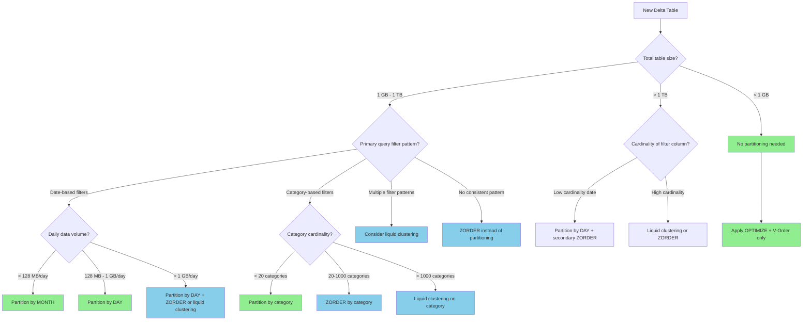

# 🌲 Partition Strategy Decision Tree

<div align="center" markdown>

**Right-Size Your Delta Table Partitions for Maximum Query Performance**


</div>

---

**Last Updated:** `2026-04-27` | **Version:** 1.0.0

---

## 🎯 Overview

Partitioning is the most impactful physical design decision for Delta tables in Microsoft Fabric. Correct partitioning enables partition pruning (skipping entire directories during query execution), while incorrect partitioning creates either a "small files" problem (over-partitioning) or a "full scan" problem (under-partitioning). With Fabric's support for liquid clustering (Delta Lake 3.0+), the decision landscape has expanded — some tables that previously needed explicit partitioning now perform better with clustering.

### The Partitioning Spectrum

```
Under-Partitioned          Optimal              Over-Partitioned
────────────────────────────────────────────────────────────────
Few large files          Right-sized files       Many tiny files
No pruning possible      Effective pruning       Metadata overhead
Full table scans         Only relevant data      File listing slow
Simple writes            Balanced I/O            Write amplification

Target: 128 MB - 1 GB per partition
```

### Quick Decision Summary

| Table Size | Daily Ingestion | Recommendation |
|:----------:|:--------------:|----------------|
| < 1 GB | Any | No partitioning needed |
| 1-10 GB | < 100 MB/day | Single-column partition or liquid clustering |
| 10-100 GB | 100 MB - 1 GB/day | Date-based partitioning |
| 100 GB - 1 TB | 1-10 GB/day | Date + category partition |
| > 1 TB | > 10 GB/day | Date hierarchy + ZORDER or liquid clustering |

---

## 📊 Partition Fundamentals

### How Partitioning Works in Delta Lake

```
Non-Partitioned Table:
Tables/slot_telemetry/
├── part-00000.parquet    (500 MB)
├── part-00001.parquet    (500 MB)
├── part-00002.parquet    (500 MB)
└── _delta_log/

Partitioned by gaming_date:
Tables/slot_telemetry/
├── gaming_date=2026-04-25/
│   ├── part-00000.parquet    (200 MB)
│   └── part-00001.parquet    (200 MB)
├── gaming_date=2026-04-26/
│   ├── part-00000.parquet    (250 MB)
│   └── part-00001.parquet    (250 MB)
├── gaming_date=2026-04-27/
│   └── part-00000.parquet    (150 MB)
└── _delta_log/

Query: WHERE gaming_date = '2026-04-27'
→ Only reads 150 MB instead of 1.5 GB (10x reduction)
```

### Partition Pruning

When a query includes a filter on the partition column, Spark skips entire partition directories without reading any data files. This is **metadata-only** pruning — it happens before any I/O.

```python
# This query benefits from partition pruning
df = spark.sql("""
    SELECT machine_id, SUM(coin_in) as total_coin_in
    FROM bronze.slot_telemetry
    WHERE gaming_date = '2026-04-27'
    GROUP BY machine_id
""")
# Only files in gaming_date=2026-04-27/ are read

# This query does NOT benefit from partition pruning
df = spark.sql("""
    SELECT gaming_date, SUM(coin_in) as total_coin_in
    FROM bronze.slot_telemetry
    WHERE machine_id = 'SLOT-001'
    GROUP BY gaming_date
""")
# All partitions must be scanned (filter is not on partition column)
# For this pattern, use ZORDER BY (machine_id) instead
```

---

## 🌲 Decision Flowchart



---

## 📐 Column Selection Criteria

### Ideal Partition Column Characteristics

| Criterion | Ideal | Acceptable | Avoid |
|-----------|:-----:|:----------:|:-----:|
| **Cardinality** | 10-1,000 values | 1,000-10,000 | > 100,000 |
| **Query frequency** | In 80%+ of queries | In 50%+ of queries | < 30% of queries |
| **Data distribution** | Even across values | Slightly skewed | Heavily skewed |
| **Growth pattern** | New values daily/weekly | New values monthly | Unpredictable |
| **Data type** | Date, category | Integer ID ranges | String UUID, float |
| **Partition size** | 128 MB - 1 GB per value | 64 MB - 2 GB | < 10 MB or > 5 GB |

### Evaluating Candidate Columns

```python
def evaluate_partition_candidates(table_name: str, candidate_columns: list) -> None:
    """Analyze columns for partition suitability."""
    df = spark.table(table_name)
    total_rows = df.count()
    detail = spark.sql(f"DESCRIBE DETAIL {table_name}").collect()[0]
    total_size_mb = detail.sizeInBytes / (1024 ** 2)

    print(f"Table: {table_name}")
    print(f"Total rows: {total_rows:,}")
    print(f"Total size: {total_size_mb:,.0f} MB")
    print(f"{'─' * 70}")

    for col_name in candidate_columns:
        stats = df.groupBy(col_name).count().agg(
            F.count("*").alias("distinct_values"),
            F.min("count").alias("min_rows"),
            F.max("count").alias("max_rows"),
            F.avg("count").alias("avg_rows"),
            F.stddev("count").alias("stddev_rows"),
        ).collect()[0]

        distinct = stats.distinct_values
        avg_partition_size_mb = total_size_mb / distinct if distinct > 0 else 0
        skew_ratio = stats.max_rows / stats.avg_rows if stats.avg_rows > 0 else 0

        print(f"\nColumn: {col_name}")
        print(f"  Distinct values: {distinct:,}")
        print(f"  Avg partition size: {avg_partition_size_mb:,.0f} MB")
        print(f"  Row distribution: min={stats.min_rows:,}, max={stats.max_rows:,}, avg={stats.avg_rows:,.0f}")
        print(f"  Skew ratio: {skew_ratio:.1f}x")

        # Assessment
        if distinct > 100_000:
            print(f"  ❌ AVOID: Too many distinct values — use ZORDER or liquid clustering")
        elif avg_partition_size_mb < 10:
            print(f"  ⚠️ WARNING: Partitions too small ({avg_partition_size_mb:.0f} MB) — over-partitioning risk")
        elif avg_partition_size_mb > 5_000:
            print(f"  ⚠️ WARNING: Partitions too large ({avg_partition_size_mb:,.0f} MB) — consider finer granularity")
        elif skew_ratio > 10:
            print(f"  ⚠️ WARNING: High skew ({skew_ratio:.0f}x) — some partitions much larger than others")
        else:
            print(f"  ✅ GOOD candidate for partitioning")

# Usage
from pyspark.sql import functions as F
evaluate_partition_candidates(
    "bronze.slot_telemetry",
    ["gaming_date", "floor_zone", "machine_type", "denomination", "machine_id"]
)
```

---

## ⚠️ Over-Partitioning Problem

### Symptoms

```
Over-partitioned table:
Tables/slot_telemetry/
├── gaming_date=2026-04-27/machine_id=SLOT-001/
│   └── part-00000.parquet    (0.5 MB)    ← TINY
├── gaming_date=2026-04-27/machine_id=SLOT-002/
│   └── part-00000.parquet    (0.3 MB)    ← TINY
├── gaming_date=2026-04-27/machine_id=SLOT-003/
│   └── part-00000.parquet    (0.8 MB)    ← TINY
... (5,000 more tiny file directories)

Problems:
1. 5,000+ files for one day of data
2. File listing takes 30+ seconds
3. Spark driver OOM listing partitions
4. Delta transaction log bloated
5. OPTIMIZE creates negligible improvement
```

### Detection

```python
def detect_over_partitioning(table_name: str) -> None:
    """Detect if a table is over-partitioned."""
    detail = spark.sql(f"DESCRIBE DETAIL {table_name}").collect()[0]
    num_files = detail.numFiles
    total_size_mb = detail.sizeInBytes / (1024 ** 2)

    if num_files == 0:
        print(f"{table_name}: Empty table")
        return

    avg_file_mb = total_size_mb / num_files
    print(f"Table: {table_name}")
    print(f"  Files: {num_files:,}")
    print(f"  Total size: {total_size_mb:,.0f} MB")
    print(f"  Avg file size: {avg_file_mb:.1f} MB")

    if avg_file_mb < 10:
        print(f"  🔴 OVER-PARTITIONED: Average file size {avg_file_mb:.1f} MB is far below 128 MB target")
        print(f"  ⮕ Consider removing partitioning or reducing partition granularity")
    elif avg_file_mb < 32:
        print(f"  🟡 BORDERLINE: Run OPTIMIZE to compact files")
    else:
        print(f"  ✅ File sizes are acceptable")
```

### Remediation

```python
# Option 1: Remove partitioning and rebuild
df = spark.table("bronze.over_partitioned_table")
df.write.format("delta") \
    .mode("overwrite") \
    .option("overwriteSchema", "true") \
    .saveAsTable("bronze.properly_sized_table")
# No .partitionBy() — let OPTIMIZE and V-Order handle it

# Option 2: Reduce partition granularity
# Before: partitionBy("gaming_date", "machine_id")  ← too fine
# After: partitionBy("gaming_date")  ← appropriate granularity
df.write.format("delta") \
    .mode("overwrite") \
    .partitionBy("gaming_date") \
    .saveAsTable("bronze.slot_telemetry_v2")

# Option 3: Switch to liquid clustering
spark.sql("""
    CREATE TABLE bronze.slot_telemetry_v3
    CLUSTER BY (gaming_date, floor_zone)
    AS SELECT * FROM bronze.over_partitioned_table
""")
```

---

## ⚠️ Under-Partitioning Problem

### Symptoms

```
Under-partitioned table (no partitioning):
Tables/slot_telemetry/
├── part-00000.parquet    (2 GB)
├── part-00001.parquet    (2 GB)
├── part-00002.parquet    (2 GB)
... (500 files, 1 TB total)

Query: WHERE gaming_date = '2026-04-27'
→ Must scan ALL 1 TB to find one day of data
→ No partition pruning possible
→ Query takes 15 minutes instead of 30 seconds
```

### Detection

```python
def detect_under_partitioning(table_name: str, expected_filter_col: str) -> None:
    """Detect if a table would benefit from partitioning."""
    detail = spark.sql(f"DESCRIBE DETAIL {table_name}").collect()[0]
    total_size_gb = detail.sizeInBytes / (1024 ** 3)
    partitioning = detail.partitionColumns

    print(f"Table: {table_name}")
    print(f"  Total size: {total_size_gb:.1f} GB")
    print(f"  Current partitioning: {partitioning if partitioning else 'NONE'}")

    if total_size_gb > 1 and not partitioning:
        distinct_values = spark.table(table_name) \
            .select(expected_filter_col).distinct().count()
        per_partition_gb = total_size_gb / distinct_values if distinct_values else total_size_gb

        print(f"  🔴 UNDER-PARTITIONED: {total_size_gb:.0f} GB with no partitioning")
        print(f"  ⮕ Partitioning by '{expected_filter_col}' ({distinct_values} values) would give ~{per_partition_gb:.1f} GB per partition")

        if 0.1 < per_partition_gb < 2:
            print(f"  ✅ '{expected_filter_col}' is an excellent partition candidate")
        elif per_partition_gb < 0.1:
            print(f"  ⚠️ Consider coarser granularity (e.g., month instead of day)")
        else:
            print(f"  ⚠️ Consider finer granularity or multi-column partitioning")
```

---

## 📅 Date-Based Partitioning

### Choosing Date Granularity

| Daily Data Volume | Granularity | Partition Column Expression | Expected Partition Size |
|:-----------------:|:-----------:|---------------------------|:----------------------:|
| < 10 MB/day | Year | `YEAR(event_date)` | 3.6 GB/year |
| 10-128 MB/day | Month | `DATE_FORMAT(event_date, 'yyyy-MM')` | 300 MB - 3.8 GB/month |
| 128 MB - 1 GB/day | Day | `event_date` (DATE type) | 128 MB - 1 GB/day |
| 1-10 GB/day | Day | `event_date` (DATE type) | 1-10 GB/day (use ZORDER) |
| > 10 GB/day | Day + ZORDER | `event_date` + ZORDER(category) | 10+ GB/day |

### Implementation Examples

```python
# Daily partitioning (most common for casino/federal data)
df.write.format("delta") \
    .mode("append") \
    .partitionBy("gaming_date") \
    .saveAsTable("bronze.slot_telemetry")

# Monthly partitioning (for smaller datasets)
from pyspark.sql.functions import date_format

df_with_month = df.withColumn("report_month", date_format("report_date", "yyyy-MM"))
df_with_month.write.format("delta") \
    .mode("append") \
    .partitionBy("report_month") \
    .saveAsTable("bronze.usda_crop_production")

# Year partitioning (for very small daily volumes)
df_with_year = df.withColumn("report_year", year("report_date"))
df_with_year.write.format("delta") \
    .mode("append") \
    .partitionBy("report_year") \
    .saveAsTable("bronze.doi_land_survey")
```

---

## 🔀 Multi-Column Partitioning

### When to Use Multiple Partition Columns

Use multi-column partitioning only when:
1. Both columns appear together in the majority of queries
2. Each partition column individually has low cardinality
3. The product of cardinalities still produces partitions > 128 MB

```python
# Example: Date + floor_zone (5 zones × 365 days = 1,825 partitions/year)
# Each partition: ~300 MB (good for a 550 GB/year table)
df.write.format("delta") \
    .mode("append") \
    .partitionBy("gaming_date", "floor_zone") \
    .saveAsTable("silver.slot_telemetry_cleansed")

# Anti-example: Date + machine_id (500 machines × 365 days = 182,500 partitions)
# Each partition: ~3 MB (OVER-PARTITIONED — do NOT do this)
```

### Partition Order Matters

```python
# The first partition column creates the top-level directory structure
# Order from lowest to highest cardinality for best file organization

# ✅ GOOD: floor_zone (5 values) first, then gaming_date (365 values)
.partitionBy("floor_zone", "gaming_date")
# Result: 5 top-level directories, each with 365 subdirectories

# 🟡 ACCEPTABLE: gaming_date first (365 values), then floor_zone (5 values)
.partitionBy("gaming_date", "floor_zone")
# Result: 365 top-level directories, each with 5 subdirectories
```

---

## 🔍 Partition Pruning Verification

### Checking Pruning in Spark

```python
# Method 1: EXPLAIN shows partition pruning
spark.sql("""
    EXPLAIN EXTENDED
    SELECT * FROM bronze.slot_telemetry
    WHERE gaming_date = '2026-04-27'
""").show(truncate=False)
# Look for: PartitionFilters: [gaming_date = 2026-04-27]

# Method 2: Check actual files read via Spark UI metrics
df = spark.sql("""
    SELECT machine_id, SUM(coin_in) as total
    FROM bronze.slot_telemetry
    WHERE gaming_date = '2026-04-27'
    GROUP BY machine_id
""")
df.explain(True)  # Look for "PushedFilters" and "PartitionFilters"
```

### Programmatic Pruning Check

```python
def verify_partition_pruning(table_name: str, filter_condition: str) -> dict:
    """Verify that partition pruning is effective for a given query."""
    # Get total files
    total_detail = spark.sql(f"DESCRIBE DETAIL {table_name}").collect()[0]
    total_files = total_detail.numFiles

    # Get the query plan
    query = f"SELECT * FROM {table_name} WHERE {filter_condition}"
    plan = spark.sql(query)._jdf.queryExecution().executedPlan().toString()

    # Check for partition filter in plan
    has_partition_filter = "PartitionFilters" in plan and filter_condition.split("=")[0].strip() in plan

    # Count files actually read (approximate via plan)
    result = {
        "table": table_name,
        "filter": filter_condition,
        "total_files": total_files,
        "partition_pruning_detected": has_partition_filter,
        "plan_snippet": plan[:500]
    }

    if has_partition_filter:
        print(f"✅ Partition pruning IS active for: {filter_condition}")
    else:
        print(f"⚠️ Partition pruning NOT detected for: {filter_condition}")
        print(f"   Check if '{filter_condition.split('=')[0].strip()}' is a partition column")

    return result

# Test
verify_partition_pruning("bronze.slot_telemetry", "gaming_date = '2026-04-27'")
```

---

## 💧 Liquid Clustering Alternative

### What Is Liquid Clustering?

Liquid clustering (Delta Lake 3.0+, Fabric Runtime 1.3+) replaces partitioning and ZORDER with a single, flexible mechanism. It automatically reorganizes data as it evolves — no need to choose partition columns upfront.

### Liquid Clustering vs Traditional Partitioning

| Feature | Traditional Partitioning | Liquid Clustering |
|---------|:------------------------:|:-----------------:|
| Column selection | Fixed at table creation | Changeable anytime |
| Data skipping | Directory-level | File-level (Hilbert curve) |
| Multi-column support | Creates nested directories | Single-level optimization |
| Small file handling | Requires explicit OPTIMIZE | Auto-compaction |
| High cardinality | Over-partitioning risk | Handles well |
| Schema evolution | Cannot change partition cols | Cluster cols changeable |
| Runtime requirement | Any | Runtime 1.3+ |
| Maturity | Battle-tested | GA (2025) |

### Creating Liquid Clustered Tables

```python
# New table with liquid clustering
spark.sql("""
    CREATE TABLE silver.player_transactions_clustered
    CLUSTER BY (player_id, transaction_date)
    AS SELECT * FROM silver.player_transactions
""")

# Change clustering columns (not possible with partitioning!)
spark.sql("""
    ALTER TABLE silver.player_transactions_clustered
    CLUSTER BY (transaction_type, transaction_date)
""")

# Trigger clustering
spark.sql("OPTIMIZE silver.player_transactions_clustered")
```

### When to Choose Liquid Clustering Over Partitioning

```markdown
Choose LIQUID CLUSTERING when:
- [ ] Query filter patterns change over time
- [ ] Partition column has high cardinality (> 10,000 values)
- [ ] Multiple filter columns with no dominant pattern
- [ ] Table is relatively small (< 100 GB) — clustering overhead is acceptable
- [ ] Using Runtime 1.3+ (required)

Choose TRADITIONAL PARTITIONING when:
- [ ] Clear, stable date-based query pattern
- [ ] Partition column has low cardinality (< 1,000 values)
- [ ] Table is very large (> 100 GB) — directory pruning is more efficient
- [ ] Need to support older runtimes (1.1, 1.2)
- [ ] Partition column maps to data lifecycle (retain 90 days by date partition)
```

---

## 🔧 Compaction with Partitions

### OPTIMIZE Across Partitions

```python
# Optimize specific partitions only (avoid full-table rewrite)
spark.sql("""
    OPTIMIZE bronze.slot_telemetry
    WHERE gaming_date >= '2026-04-20' AND gaming_date <= '2026-04-27'
""")

# Optimize with ZORDER within partitions
spark.sql("""
    OPTIMIZE silver.slot_telemetry_cleansed
    WHERE gaming_date >= current_date() - INTERVAL 7 DAYS
    ZORDER BY (machine_id)
""")

# Partition-aware VACUUM
spark.sql("VACUUM bronze.slot_telemetry RETAIN 168 HOURS")
# VACUUM respects partitions — only removes old files within each partition
```

---

## 🎰 Casino Industry Patterns

| Table | Size | Partitioning | ZORDER | Rationale |
|-------|:----:|-------------|--------|-----------|
| `bronze.slot_telemetry` | 500 GB/yr | `gaming_date` | — | ~1.4 GB/day, date filters in 90%+ queries |
| `silver.player_transactions` | 200 GB/yr | `transaction_date` | `player_id` | Date pruning + player lookup via ZORDER |
| `gold.slot_performance_daily` | 5 GB/yr | None | — | Small enough, no partitioning needed |
| `gold.compliance_ctr_daily` | 2 GB/yr | None | — | Small table, full scan is fast |
| `bronze.cage_transactions` | 100 GB/yr | `transaction_date` | — | ~270 MB/day, date partition optimal |
| `silver.surveillance_events` | 1 TB/yr | `event_date` | `camera_zone` | Large table, date + zone patterns |

## 🏛️ Federal Agency Patterns

| Table | Size | Partitioning | ZORDER | Rationale |
|-------|:----:|-------------|--------|-----------|
| `bronze.usda_crop_production` | 10 GB/yr | `report_month` | — | Monthly reports, ~800 MB/month |
| `bronze.noaa_weather_obs` | 200 GB/yr | `observation_date` | `station_id` | Daily readings, station-based queries |
| `bronze.epa_air_quality` | 150 GB/yr | `measurement_date` | `monitor_id` | Daily measurements, monitor lookups |
| `bronze.sba_loan_data` | 50 GB/yr | `approval_year` | — | Annual cohort analysis pattern |
| `bronze.doi_land_survey` | 30 GB/yr | `state` | `survey_date` | State-based queries dominant |

---

## 🚫 Anti-Patterns

### Anti-Pattern 1: Partitioning Small Tables

```python
# ❌ WRONG: Partitioning a 500 MB table
df.write.format("delta") \
    .partitionBy("gaming_date", "floor_zone") \
    .saveAsTable("gold.daily_summary")
# Creates hundreds of tiny files for a small table

# ✅ CORRECT: No partitioning for small tables
df.write.format("delta") \
    .saveAsTable("gold.daily_summary")
# OPTIMIZE + V-Order is sufficient
```

### Anti-Pattern 2: Partitioning by High-Cardinality Column

```python
# ❌ WRONG: UUID as partition column
df.write.format("delta") \
    .partitionBy("transaction_id") \
    .saveAsTable("bronze.transactions")
# 1 file per transaction = millions of tiny files

# ✅ CORRECT: Use ZORDER or liquid clustering for high-cardinality
df.write.format("delta") \
    .saveAsTable("bronze.transactions")
spark.sql("OPTIMIZE bronze.transactions ZORDER BY (transaction_id)")
```

### Anti-Pattern 3: Never Running OPTIMIZE on Partitioned Tables

```python
# ❌ WRONG: Partition and forget
df.write.format("delta") \
    .mode("append") \
    .partitionBy("gaming_date") \
    .saveAsTable("bronze.slot_telemetry")
# After 100 appends, each partition has 100 tiny files

# ✅ CORRECT: Schedule regular OPTIMIZE
spark.sql("""
    OPTIMIZE bronze.slot_telemetry
    WHERE gaming_date >= current_date() - INTERVAL 7 DAYS
""")
```

### Anti-Pattern 4: Changing Partition Columns In-Place

```python
# ❌ WRONG: Trying to change partition columns on existing table
spark.sql("ALTER TABLE bronze.slot_telemetry SET PARTITIONED BY (floor_zone)")
# This is NOT supported in Delta Lake

# ✅ CORRECT: Create new table with desired partitioning and migrate
df = spark.table("bronze.slot_telemetry")
df.write.format("delta") \
    .mode("overwrite") \
    .partitionBy("floor_zone") \
    .saveAsTable("bronze.slot_telemetry_v2")

# Or switch to liquid clustering (can be changed later)
spark.sql("""
    CREATE TABLE bronze.slot_telemetry_v3
    CLUSTER BY (gaming_date, floor_zone)
    AS SELECT * FROM bronze.slot_telemetry
""")
```

---

## 📚 References

- [Delta Lake Partitioning Best Practices](https://docs.delta.io/latest/best-practices.html#choose-the-right-partition-column)
- [Liquid Clustering](https://docs.delta.io/latest/delta-clustering.html)
- [Fabric Table Maintenance](https://learn.microsoft.com/en-us/fabric/data-engineering/lakehouse-table-maintenance)
- [OPTIMIZE Command](https://learn.microsoft.com/en-us/fabric/data-engineering/delta-optimization-and-v-order)
- [Partition Strategy Decision Tree](partition-strategy-decision-tree.md)
- [V-Order Tuning Deep Dive](v-order-tuning-deep-dive.md)

---

> **Next:** [Query Optimization Deep Dive](query-optimization-deep-dive.md) | [V-Order Tuning Deep Dive](v-order-tuning-deep-dive.md)
