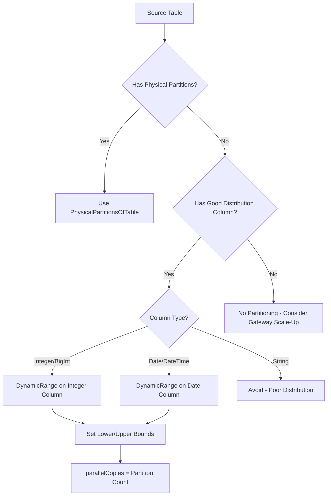
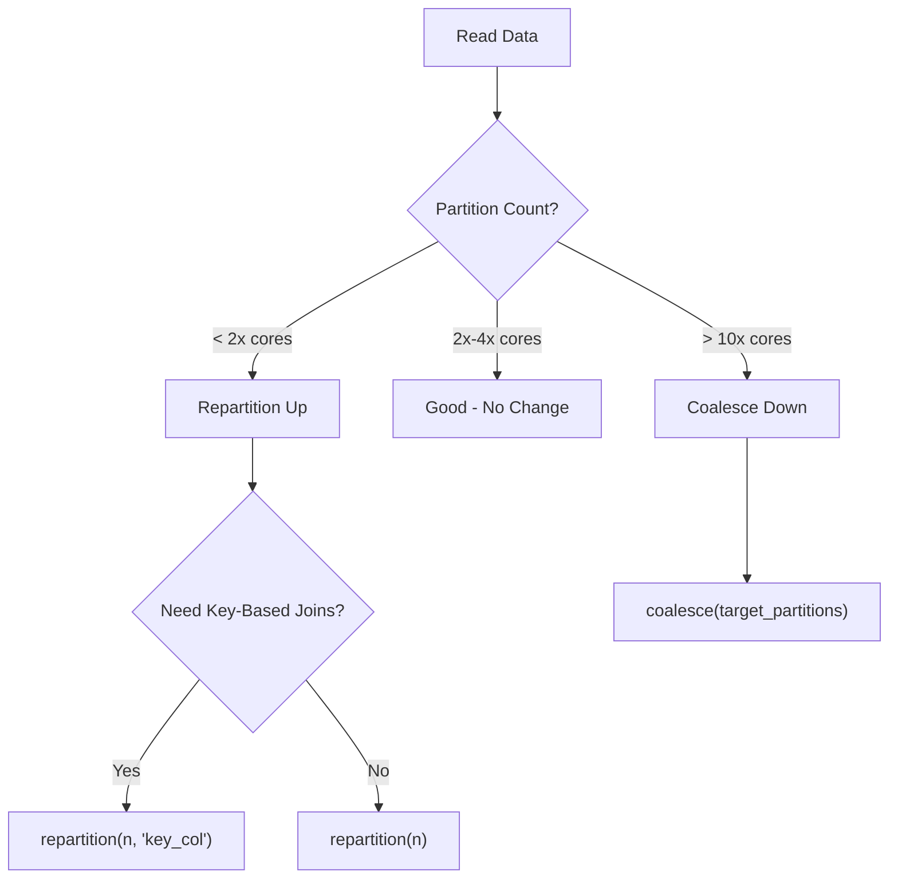
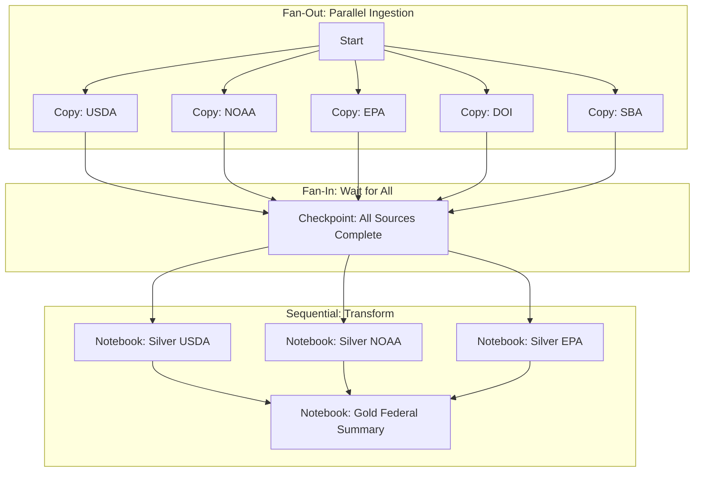
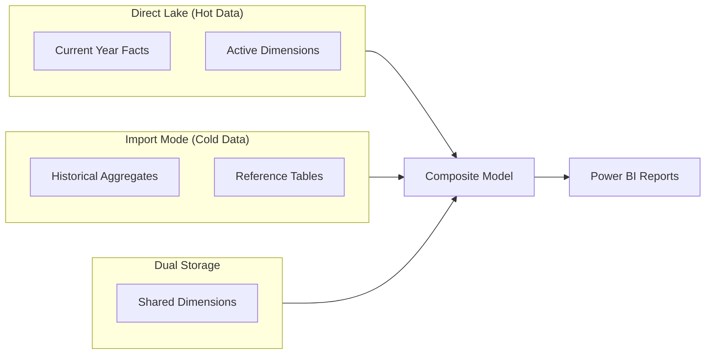
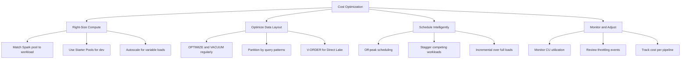

[Home](../index.md) > [Best Practices](./) > Performance & Parallelism

# 🚀 Performance & Parallelism Best Practices

> **Last Updated**: 2026-04-15 | **Version**: 2.0
> **Status**: ✅ Final | **Maintainer**: Documentation Team

<div align="center" markdown>


</div>

---

## 📖 Overview

Performance optimization in Microsoft Fabric spans multiple workloads: Copy Activities, Spark notebooks, pipeline orchestration, Direct Lake semantic models, and KQL queries. This guide provides concrete configuration recommendations, benchmark guidelines, and cost-performance trade-off analysis for the casino gaming, federal agency, and healthcare workloads in this project.

---

## 📦 Copy Activity Optimization

### Data Integration Units (DIU)

DIUs (formerly Data Movement Units) determine the compute power allocated to a Copy Activity. Higher DIU counts increase throughput for large data moves but also increase CU consumption.

**Default behavior:**

| Source/Sink Combination | Default DIU | Auto-Tune |
|------------------------|-------------|-----------|
| Cloud to Cloud | 4 | Yes (up to 256) |
| On-premises to Cloud (via Gateway) | 4 | No |
| Cloud to On-premises (via Gateway) | 4 | No |

**When to increase DIUs beyond default:**

| Scenario | Recommended DIU | Reason |
|----------|----------------|--------|
| Files > 1 GB from blob/ADLS | 16-32 | Parallel file reads |
| Single large file (> 10 GB) | 32-64 | Parallel block reads |
| Many small files (> 10,000) | 16-32 | Parallel file listing and transfer |
| Cross-region copy | 16-64 | Overcome network latency |
| USDA/NOAA bulk historical load | 32 | Large initial backfill |
| Casino daily slot telemetry | 8-16 | Moderate daily volume |

**Configuration:**

```json
{
    "type": "Copy",
    "typeProperties": {
        "source": { "type": "DelimitedTextSource" },
        "sink": { "type": "LakehouseTableSink" },
        "dataIntegrationUnits": 32,
        "enableStaging": true
    }
}
```

**Monitoring DIU effectiveness:**

After a Copy Activity run, check the `usedDataIntegrationUnits` and `throughput` in the run output. If `usedDataIntegrationUnits < dataIntegrationUnits`, the source cannot saturate the allocated DIUs and you should reduce them.

### Parallel Copy Settings

The `parallelCopies` setting controls how many threads read from the source simultaneously within a single Copy Activity.

**Default:** Auto (typically 4-5 for cloud sources)

**When to increase beyond default:**

| Source Type | Recommended parallelCopies | Condition |
|-------------|---------------------------|-----------|
| Partitioned SQL table | 8-32 | Table has good partition column |
| File-based (many files) | 16-32 | > 1,000 files per batch |
| REST API (paginated) | 1-4 | API rate limits apply |
| Oracle via Gateway | 4-8 | Gateway node has sufficient CPU |
| USDA NASS API | 2-4 | Respect API rate limits |
| NOAA weather stations | 8-16 | Many endpoints, low per-request cost |

```json
{
    "typeProperties": {
        "parallelCopies": 16,
        "source": {
            "type": "SqlSource",
            "partitionOption": "DynamicRange",
            "partitionSettings": {
                "partitionColumnName": "transaction_date",
                "partitionUpperBound": "2026-03-12",
                "partitionLowerBound": "2026-01-01"
            }
        }
    }
}
```

### Source Partitioning Strategies

Partitioning the source read is the single most impactful optimization for large table extraction.

**Physical partitioning:**

Use when the source table already has partitions (e.g., Oracle RANGE partitions, SQL Server partition schemes).

```json
{
    "partitionOption": "PhysicalPartitionsOfTable"
}
```

**Dynamic range partitioning:**

Use when the source has a good distribution column (date, ID) but is not physically partitioned.

```json
{
    "partitionOption": "DynamicRange",
    "partitionSettings": {
        "partitionColumnName": "player_id",
        "partitionUpperBound": "10000000",
        "partitionLowerBound": "1"
    }
}
```

**Decision matrix:**



### Staging with Compression

For large cross-network transfers, enable staging through an intermediate blob storage with compression.

```json
{
    "typeProperties": {
        "enableStaging": true,
        "stagingSettings": {
            "linkedServiceName": {
                "referenceName": "ls_staging_blob",
                "type": "LinkedServiceReference"
            },
            "path": "staging/fabric-copy",
            "enableCompression": true
        }
    }
}
```

**When to use staging:**

| Scenario | Staging Recommended | Compression |
|----------|-------------------|-------------|
| On-premises to Lakehouse (via Gateway) | Yes | Yes (gzip) |
| Cross-region cloud transfer | Yes | Yes |
| REST API with large payloads | Optional | Yes |
| Cloud same-region | No | Not needed |
| Small tables (< 100 MB) | No | Overhead exceeds benefit |

### Network Optimization

| Optimization | Configuration | Impact |
|-------------|---------------|--------|
| Use Managed VNet integration | Workspace settings > Networking | Eliminates public internet hops |
| Self-hosted IR placement | Deploy in same region as source | Reduces latency |
| ExpressRoute for on-prem | Azure networking | Dedicated bandwidth |
| Parallel gateway nodes | Add nodes to IR cluster | Linear throughput scaling |

---

## ✨ Spark Notebook Performance

### Partition Strategy

The number of partitions determines parallelism in Spark. Too few partitions underutilize the cluster; too many create overhead from task scheduling and small file problems.

**Rule of thumb:** `partition count = 2-4x total cores`

| Cluster Size | Total Cores | Recommended Partitions | Use Case |
|-------------|-------------|----------------------|----------|
| Small (4 nodes x 8 cores) | 32 | 64-128 | Bronze ingestion |
| Medium (8 nodes x 8 cores) | 64 | 128-256 | Silver transformations |
| Large (16 nodes x 8 cores) | 128 | 256-512 | Gold aggregations, ML |

**Setting partition count:**

```python
# Read with explicit partition count
df = spark.read.format("delta").load("abfss://bronze@onelake.dfs.fabric.microsoft.com/slot_telemetry/")

# Check current partition count
print(f"Current partitions: {df.rdd.getNumPartitions()}")

# Repartition for processing (use coalesce to reduce, repartition to increase)
df = df.repartition(128)  # Shuffle-based, use for increasing partitions
df = df.coalesce(64)       # No shuffle, use for reducing partitions

# Repartition by key column for join optimization
df = df.repartition(128, "player_id")
```

**When to repartition:**



### Broadcast Joins for Small Tables

When joining a large table with a small table (< 100 MB by default, configurable up to 2 GB), use broadcast joins to avoid expensive shuffles.

```python
from pyspark.sql import functions as F

# Automatic broadcast (Spark decides based on table size)
# Default threshold: spark.sql.autoBroadcastJoinThreshold = 10485760 (10 MB)
spark.conf.set("spark.sql.autoBroadcastJoinThreshold", 100 * 1024 * 1024)  # 100 MB

# Explicit broadcast hint
from pyspark.sql.functions import broadcast

large_df = spark.read.format("delta").load(".../slot_telemetry/")
small_df = spark.read.format("delta").load(".../machine_reference/")

result = large_df.join(
    broadcast(small_df),
    on="machine_id",
    how="left"
)
```

**Broadcast join candidates in this project:**

| Small Table | Typical Size | Joined With |
|------------|-------------|-------------|
| `machine_reference` | ~5 MB | Slot telemetry (billions) |
| `player_demographics` | ~50 MB | Transaction records |
| `usda_state_codes` | < 1 MB | Crop production data |
| `noaa_station_metadata` | ~10 MB | Weather observations |
| `epa_monitor_locations` | ~5 MB | AQI readings |
| `icd10_codes` | ~20 MB | Healthcare encounter records |
| `faa_airport_codes` | ~2 MB | Flight/incident records |

### Caching Strategies

Cache DataFrames that are read multiple times in the same notebook.

```python
# Cache when a DataFrame is used in multiple downstream operations
silver_df = spark.read.format("delta").load(".../silver_player_transactions/")
silver_df.cache()
silver_df.count()  # Trigger materialization

# Use in multiple operations
daily_summary = silver_df.groupBy("transaction_date").agg(F.sum("amount"))
player_summary = silver_df.groupBy("player_id").agg(F.sum("amount"))

# Unpersist when done
silver_df.unpersist()
```

**Cache vs Persist:**

| Method | Storage Level | Use When |
|--------|-------------|----------|
| `cache()` | MEMORY_AND_DISK (default) | DataFrame used 2-5 times |
| `persist(StorageLevel.MEMORY_ONLY)` | Memory only | Small DataFrame, no spill tolerance |
| `persist(StorageLevel.DISK_ONLY)` | Disk only | Large DataFrame, memory pressure |
| No caching | Recompute each time | DataFrame used once |

**Cache management rules:**

1. Always `unpersist()` when done -- cached data consumes cluster memory
2. Never cache DataFrames larger than 50% of cluster memory
3. Cache after filters and projections, not before
4. Trigger materialization with `.count()` after caching

### Predicate Pushdown with Delta Lake

Delta Lake supports predicate pushdown, which means filters are pushed down to the file level, skipping entire files that don't match.

```python
# Good: Filter pushes down to Delta file-level statistics
df = spark.read.format("delta") \
    .load(".../bronze_slot_telemetry/") \
    .filter(F.col("event_date") == "2026-03-12")  # Only reads relevant files

# Bad: UDF prevents pushdown
from pyspark.sql.types import BooleanType
@F.udf(BooleanType())
def custom_filter(date_val):
    return str(date_val) == "2026-03-12"

df = spark.read.format("delta") \
    .load(".../bronze_slot_telemetry/") \
    .filter(custom_filter(F.col("event_date")))  # Reads ALL files
```

**Maximizing pushdown effectiveness:**

| Technique | Impact | Implementation |
|-----------|--------|---------------|
| Filter early | High | Place `.filter()` immediately after `.read()` |
| Use built-in functions | High | Avoid UDFs in filter conditions |
| Partition by date | High | `PARTITIONED BY (event_date)` |
| Maintain file statistics | Medium | `OPTIMIZE` regularly |
| Use column pruning | Medium | Select only needed columns after filter |

### Z-ORDER Optimization

Z-ORDER co-locates related data in the same files, dramatically improving query performance for filtered reads.

```sql
-- Optimize slot telemetry for queries filtered by machine_id and event_date
OPTIMIZE bronze_slot_telemetry
ZORDER BY (machine_id, event_date);

-- Optimize USDA data for queries filtered by state and commodity
OPTIMIZE silver_usda_crop_production
ZORDER BY (state_code, commodity_code);

-- Optimize EPA data for geographic queries
OPTIMIZE silver_epa_aqi_readings
ZORDER BY (state_code, county_code, parameter_code);
```

**Z-ORDER strategy by table:**

| Table | Z-ORDER Columns | Query Pattern |
|-------|----------------|---------------|
| `bronze_slot_telemetry` | `machine_id, event_date` | Machine-specific time range queries |
| `silver_player_transactions` | `player_id, transaction_date` | Player activity history |
| `gold_daily_revenue` | `property_id, revenue_date` | Property-level reporting |
| `silver_usda_crop_production` | `state_code, year, commodity_code` | State/commodity analysis |
| `silver_noaa_observations` | `station_id, observation_date` | Station time series |
| `silver_epa_aqi` | `state_code, monitor_id, date` | Regional air quality trends |
| `silver_healthcare_encounters` | `facility_id, encounter_date` | Facility-level analytics |

### V-ORDER for Direct Lake

V-ORDER is a write-time optimization that sorts data within Parquet files for optimal Direct Lake performance. It is enabled by default in Fabric Lakehouses.

```python
# V-ORDER is applied automatically when writing to Fabric Lakehouse tables
# Verify it is enabled:
spark.conf.get("spark.sql.parquet.vorder.enabled")  # Should be "true"

# Force V-ORDER on external writes:
spark.conf.set("spark.sql.parquet.vorder.enabled", "true")

df.write.mode("overwrite").format("delta").saveAsTable("lh_gold.daily_revenue")
```

**V-ORDER impact:**

| Metric | Without V-ORDER | With V-ORDER | Improvement |
|--------|----------------|--------------|-------------|
| Direct Lake query time | Baseline | 20-50% faster | Significant |
| VertiPaq scan efficiency | Standard | Optimized column segments | High |
| Write time | Baseline | 5-15% slower | Minor trade-off |
| Storage size | Baseline | Similar or slightly smaller | Neutral |

### Adaptive Query Execution (AQE)

AQE dynamically optimizes query execution based on runtime statistics. It is enabled by default in Fabric Spark.

```python
# Verify AQE is enabled (should be by default)
spark.conf.get("spark.sql.adaptive.enabled")  # "true"

# Key AQE settings
spark.conf.set("spark.sql.adaptive.coalescePartitions.enabled", "true")
spark.conf.set("spark.sql.adaptive.skewJoin.enabled", "true")
spark.conf.set("spark.sql.adaptive.localShuffleReader.enabled", "true")

# AQE automatically:
# 1. Coalesces small post-shuffle partitions
# 2. Splits skewed partitions for balanced processing
# 3. Converts sort-merge joins to broadcast joins when runtime stats show small tables
```

**AQE benefits by scenario:**

| Scenario | AQE Optimization | Benefit |
|----------|-----------------|---------|
| Highly filtered data | Coalesces small partitions | Fewer tasks, less overhead |
| Skewed join keys (e.g., popular players) | Splits skewed partitions | Even execution time |
| Small table after filters | Converts to broadcast join | Eliminates shuffle |
| Uncertain data volumes | Adapts at runtime | No manual tuning needed |

---

## 🔄 Pipeline Parallelism

### ForEach Activity with Batch Count

The ForEach activity processes items in parallel up to the configured `batchCount`.

```json
{
    "name": "ForEach_Ingest_Sources",
    "type": "ForEach",
    "typeProperties": {
        "isSequential": false,
        "batchCount": 20,
        "items": "@pipeline().parameters.source_tables"
    }
}
```

**Batch count recommendations:**

| Scenario | Recommended Batch Count | Reasoning |
|----------|------------------------|-----------|
| Copy from multiple API endpoints | 5-10 | API rate limits |
| Copy from multiple database tables | 10-20 | Database connection limits |
| Process multiple files | 20-50 | I/O bound, high parallelism safe |
| Execute multiple notebooks | 5-10 | Each notebook consumes Spark capacity |
| USDA multi-dataset ingestion | 4-8 | NASS API rate limits |
| NOAA station data collection | 10-20 | Many stations, light per-call cost |
| EPA monitor data collection | 10-15 | Moderate API limits |

**Maximum batch count:** 50 (Fabric limit)

### Concurrent Pipeline Runs

Control how many instances of the same pipeline can run simultaneously.

```json
{
    "concurrency": 5,
    "pipelinePolicy": {
        "elapsedTimeMetric": {
            "duration": "1.00:00:00"
        }
    }
}
```

**Concurrency by pipeline type:**

| Pipeline Type | Recommended Concurrency | Reason |
|--------------|------------------------|--------|
| Master orchestration | 1 | Prevent overlapping runs |
| Source-specific ingestion | 3-5 | Allow multiple sources in parallel |
| Notebook execution | 2-3 | Limited by Spark capacity |
| Data quality checks | 5-10 | Lightweight, I/O bound |

### Dependency Optimization: Fan-Out / Fan-In

Design pipeline dependencies to maximize parallel execution.



**Anti-pattern: unnecessary sequential dependencies**

```
BAD:  Copy A -> Copy B -> Copy C -> Transform A -> Transform B -> Transform C
GOOD: Copy A ─┐              Transform A ─┐
      Copy B ─┼─ Checkpoint ─ Transform B ─┼─ Gold Aggregation
      Copy C ─┘              Transform C ─┘
```

### Pipeline Activity Limits

Be aware of Fabric pipeline limits when designing parallel flows:

| Limit | Value | Mitigation |
|-------|-------|-----------|
| Activities per pipeline | 80 | Split into child pipelines |
| ForEach batch count | 50 | Use multiple ForEach activities |
| Nested pipeline depth | 8 levels | Flatten where possible |
| Concurrent pipeline runs (workspace) | Capacity-dependent | Stagger schedules |
| Variables per pipeline | 50 | Use JSON parameters for complex config |

---

## ⚡ Direct Lake Performance

### Framing Optimization

Direct Lake reads Delta Lake files directly without importing data. "Framing" is the process of identifying which files to read. Optimize framing by keeping the number of Delta files manageable.

```sql
-- Check file count per table
SELECT COUNT(*) as file_count, SUM(size) / (1024*1024*1024) as size_gb
FROM delta_log('.../gold_daily_revenue/')
WHERE add IS NOT NULL;
```

**Framing optimization targets:**

| Table Size | Target File Count | Target File Size | Optimization |
|-----------|-------------------|------------------|-------------|
| < 1 GB | 1-10 | 100-200 MB | OPTIMIZE weekly |
| 1-10 GB | 10-50 | 200 MB - 1 GB | OPTIMIZE daily |
| 10-100 GB | 50-200 | 500 MB - 1 GB | OPTIMIZE daily + ZORDER |
| > 100 GB | 100-500 | 1 GB | OPTIMIZE + partitioning |

```sql
-- Optimize and compact files
OPTIMIZE gold_daily_revenue;

-- Vacuum old files (default retention: 7 days)
VACUUM gold_daily_revenue RETAIN 168 HOURS;
```

### Column Pruning

Direct Lake performance improves when queries request fewer columns. Design semantic models with this in mind.

**Best practices:**

1. Create Gold layer views with only the columns needed for reporting
2. Avoid `SELECT *` in semantic model table definitions
3. Use calculated columns sparingly -- prefer measures
4. Split wide tables into fact and dimension tables (star schema)

```sql
-- Instead of one wide table with 50+ columns:
-- Create focused Gold tables

-- Fact: daily_slot_revenue (narrow, high-row)
CREATE TABLE gold_daily_slot_revenue AS
SELECT
    revenue_date,
    machine_id,
    property_id,
    coin_in,
    coin_out,
    gross_revenue,
    net_revenue,
    handle_pulls
FROM silver_slot_summary;

-- Dimension: machine_details (wide, low-row)
CREATE TABLE gold_dim_machine AS
SELECT
    machine_id,
    machine_type,
    manufacturer,
    denomination,
    floor_location,
    install_date,
    property_id
FROM silver_machine_master;
```

### Aggregation Tables

Pre-aggregate common query patterns to reduce Direct Lake scan volume.

```sql
-- Pre-aggregated table for common dashboard queries
CREATE TABLE gold_agg_monthly_revenue AS
SELECT
    DATE_TRUNC('month', revenue_date) AS revenue_month,
    property_id,
    machine_type,
    SUM(gross_revenue) AS total_gross_revenue,
    SUM(net_revenue) AS total_net_revenue,
    SUM(handle_pulls) AS total_handle_pulls,
    COUNT(DISTINCT machine_id) AS active_machines,
    AVG(gross_revenue / NULLIF(handle_pulls, 0)) AS avg_revenue_per_pull
FROM gold_daily_slot_revenue
GROUP BY DATE_TRUNC('month', revenue_date), property_id, machine_type;
```

**Aggregation table strategy:**

| Aggregation Level | Refresh Frequency | Use Case |
|------------------|-------------------|----------|
| Hourly | Every hour | Real-time floor monitoring |
| Daily | Daily at 6 AM | Standard reporting |
| Weekly | Weekly on Monday | Trend analysis |
| Monthly | 1st of month | Executive dashboards |
| YTD | Daily | Year-over-year comparison |

### Composite Models for Large Datasets

When a single Direct Lake model cannot hold all required data, use composite models.



**When to use composite models:**

| Scenario | Approach | Reason |
|----------|----------|--------|
| Current + historical data | Direct Lake (current) + Import (historical) | Historical data rarely changes |
| Detail + aggregates | Direct Lake (detail) + Import (pre-aggregated) | Aggregates are small |
| Multi-source reporting | Direct Lake (primary) + DirectQuery (live) | Some data needs real-time |

---

## 🔍 KQL Query Performance

### Materialized Views

Materialized views pre-compute and store aggregation results, dramatically improving repeated query patterns.

```kql
// Create materialized view for hourly slot telemetry aggregates
.create materialized-view SlotTelemetryHourly on table slot_telemetry
{
    slot_telemetry
    | summarize
        avg_coin_in = avg(coin_in),
        total_coin_in = sum(coin_in),
        total_coin_out = sum(coin_out),
        handle_pulls = count(),
        active_machines = dcount(machine_id)
        by bin(event_time, 1h), property_id, machine_type
}

// Create materialized view for EPA AQI hourly readings
.create materialized-view AqiHourly on table epa_aqi_readings
{
    epa_aqi_readings
    | summarize
        avg_aqi = avg(aqi_value),
        max_aqi = max(aqi_value),
        reading_count = count()
        by bin(reading_time, 1h), state_code, county_code, parameter_code
}
```

### Update Policies

Update policies transform data at ingestion time, avoiding repeated transformation costs on query.

```kql
// Define a function that transforms raw data
.create function ParseSlotTelemetry()
{
    raw_slot_events
    | extend
        machine_id = tostring(parsed_data.machine_id),
        event_type = tostring(parsed_data.event_type),
        coin_in = todouble(parsed_data.coin_in),
        coin_out = todouble(parsed_data.coin_out),
        event_time = todatetime(parsed_data.timestamp)
    | project-away parsed_data
}

// Attach update policy to target table
.alter table slot_telemetry policy update
@'[{"IsEnabled": true, "Source": "raw_slot_events", "Query": "ParseSlotTelemetry()", "IsTransactional": true}]'
```

### Hot / Warm Cache Tiers

Configure cache policies to keep frequently accessed data in hot (SSD) cache while older data moves to warm (blob) storage.

```kql
// Hot cache: last 30 days (fast queries)
.alter table slot_telemetry policy caching hot = 30d

// Retention: keep 2 years total
.alter table slot_telemetry policy retention softdelete = 730d

// Different policies by table importance
.alter table compliance_ctr_filings policy caching hot = 365d    // Keep compliance data hot for 1 year
.alter table noaa_weather_observations policy caching hot = 90d  // 3 months hot for weather
.alter table epa_aqi_readings policy caching hot = 90d           // 3 months hot for AQI
.alter table usda_crop_production policy caching hot = 180d      // 6 months hot for crop data
```

**Cache tier sizing:**

| Data Volume (Hot) | Recommended Eventhouse SKU | Use Case |
|-------------------|---------------------------|----------|
| < 100 GB | Small | Dev/test, low-volume monitoring |
| 100 GB - 1 TB | Medium | Production streaming + federal data |
| 1-10 TB | Large | Full casino floor + all federal agencies |
| > 10 TB | Extra Large | Multi-property enterprise |

### KQL Query Best Practices

```kql
// GOOD: Filter early, project early
slot_telemetry
| where event_time > ago(24h)           // Filter first
| where machine_type == "slot"           // Narrow further
| project event_time, machine_id, coin_in, coin_out  // Select only needed columns
| summarize total_coin_in = sum(coin_in) by bin(event_time, 1h), machine_id

// BAD: Late filtering, wide scan
slot_telemetry
| summarize total_coin_in = sum(coin_in) by bin(event_time, 1h), machine_id
| where event_time > ago(24h)           // Filter AFTER aggregation -- scans all data

// GOOD: Use has/has_cs instead of contains for string matching
slot_telemetry
| where machine_id has "SLOT-A"         // Uses term index, fast

// BAD: contains scans all strings
slot_telemetry
| where machine_id contains "SLOT-A"    // Full string scan, slow

// GOOD: Limit joins to filtered datasets
let active_machines = machine_reference | where status == "active" | project machine_id;
slot_telemetry
| where event_time > ago(1h)
| where machine_id in (active_machines)

// GOOD: Use materialized views for repeated patterns
SlotTelemetryHourly  // Pre-computed materialized view
| where event_time > ago(7d)
| summarize daily_revenue = sum(total_coin_in - total_coin_out) by bin(event_time, 1d)
```

**Query performance checklist:**

| Rule | Impact | Example |
|------|--------|---------|
| Filter by time first | High | `where event_time > ago(24h)` |
| Project early | High | `project col1, col2` before aggregation |
| Use `has` over `contains` | High | `has` uses term index |
| Avoid `*` in `join` | Medium | Specify explicit columns |
| Use `materialized_view()` hint | Medium | Forces use of materialized view |
| Limit `dcount` to necessary precision | Medium | Use `dcount(col, 1)` for approximate |
| Batch time-series queries | Medium | Use `bin()` instead of exact timestamps |

---

## 📈 Benchmark Guidelines by Data Volume

### Small (< 1 GB daily ingestion)

Typical for: SBA loan data (weekly), DOI resource metadata, reference tables.

| Component | Configuration | Expected Performance |
|-----------|---------------|---------------------|
| Copy Activity | DIU: 4, parallelCopies: auto | < 2 minutes |
| Spark Transform | Starter pool, single node | < 5 minutes |
| Pipeline total | Sequential OK | < 15 minutes |
| Direct Lake refresh | Automatic framing | < 30 seconds |

### Medium (1-10 GB daily ingestion)

Typical for: USDA crop data, NOAA weather, EPA AQI, casino daily summaries.

| Component | Configuration | Expected Performance |
|-----------|---------------|---------------------|
| Copy Activity | DIU: 16, parallelCopies: 8-16 | 5-15 minutes |
| Spark Transform | Medium pool, 4-8 nodes | 10-20 minutes |
| Pipeline total | Parallel where possible | 30-60 minutes |
| Direct Lake refresh | OPTIMIZE weekly | < 2 minutes |
| KQL ingestion | Streaming ingestion | Near real-time |

### Large (10-100 GB daily ingestion)

Typical for: Casino slot telemetry (all properties), NOAA historical backfill, healthcare encounter data.

| Component | Configuration | Expected Performance |
|-----------|---------------|---------------------|
| Copy Activity | DIU: 32-64, parallelCopies: 16-32 | 15-45 minutes |
| Spark Transform | Large pool, 8-16 nodes, AQE enabled | 20-45 minutes |
| Pipeline total | Full parallelism, fan-out/fan-in | 1-2 hours |
| Direct Lake refresh | OPTIMIZE daily + ZORDER | 2-5 minutes |
| Delta OPTIMIZE | Run after major loads | 10-30 minutes |

### Very Large (> 100 GB daily ingestion)

Typical for: Multi-property casino telemetry, real-time streaming at scale, full federal data warehouse.

| Component | Configuration | Expected Performance |
|-----------|---------------|---------------------|
| Copy Activity | DIU: 64-256, staging enabled | 30-90 minutes |
| Spark Transform | Custom pool, 16+ nodes, partitioned writes | 30-60 minutes |
| Pipeline total | Micro-batch pattern, hourly increments | Continuous |
| Direct Lake | Composite model, aggregation tables | 5-15 minutes framing |
| Delta OPTIMIZE | Scheduled, partitioned tables | 30-60 minutes |
| Eventhouse | Materialized views, update policies | Sub-second query |

---

## 💰 Cost vs Performance Trade-Offs

### CU Consumption by Activity Type

Microsoft Fabric uses Capacity Units (CUs) as the universal billing metric. Understanding CU consumption helps optimize cost.

| Activity | CU Consumption | Optimization |
|----------|---------------|-------------|
| Copy Activity (high DIU) | High during copy | Reduce DIUs if throughput is not bottleneck |
| Spark Notebook (large cluster) | Very high | Right-size cluster, use autoscale |
| Direct Lake query | Low (read-only) | Optimize file layout to reduce scan |
| KQL query | Medium | Materialized views reduce query CUs |
| Pipeline orchestration | Minimal | Negligible cost |
| Data Activator Reflex | Low | Minimal cost per evaluation |

### Cost Optimization Strategies



### Cost-Performance Matrix

| Optimization | Performance Gain | Cost Impact | Priority |
|-------------|-----------------|-------------|----------|
| OPTIMIZE + ZORDER | 2-10x query speed | Moderate CU cost | High |
| Broadcast joins | 2-5x join speed | No additional cost | High |
| Incremental loads | 5-50x faster than full | Major CU savings | High |
| Materialized views (KQL) | 10-100x query speed | Storage + ingestion CU | High |
| Right-size Spark pool | 0-2x (depends on current sizing) | Significant savings | Medium |
| V-ORDER | 1.2-1.5x Direct Lake speed | Minor write overhead | Medium |
| AQE | 1.5-3x for skewed workloads | No additional cost | Medium |
| Pre-aggregation tables | 5-20x dashboard speed | Moderate storage + compute | Medium |
| Staging with compression | 1.5-2x copy speed | Additional storage cost | Low |
| Higher DIU count | 1-4x copy speed | Linear CU increase | Low |

### F64 Capacity Budget Planning

For this project's F64 SKU:

| Workload | Estimated CU % | Schedule | Notes |
|----------|---------------|----------|-------|
| Casino Bronze ingestion | 15% | Continuous (5-min micro-batches) | Slot telemetry, transactions |
| Federal data ingestion | 10% | Daily (6 AM UTC) | USDA, NOAA, EPA, DOI, SBA |
| Healthcare ingestion | 5% | Daily (2 AM UTC) | Tribal healthcare records |
| Silver transformations | 20% | After ingestion completes | Spark notebooks |
| Gold aggregations | 10% | After silver completes | Spark + SQL |
| Direct Lake / BI queries | 20% | Business hours | User queries, dashboards |
| KQL (Eventhouse) | 10% | Continuous | Real-time monitoring |
| Maintenance (OPTIMIZE, VACUUM) | 5% | Off-peak (midnight UTC) | Delta table maintenance |
| Buffer | 5% | - | Headroom for spikes |

---

## ⭐ Summary

Performance optimization in Microsoft Fabric follows a layered approach:

1. **Copy Activity**: Right-size DIUs, enable parallel copies with source partitioning, use staging for cross-network transfers
2. **Spark**: Optimize partitions (2-4x cores), broadcast small tables, cache reused DataFrames, enable AQE
3. **Delta Lake**: OPTIMIZE + ZORDER for query patterns, V-ORDER for Direct Lake, VACUUM to manage file count
4. **Pipelines**: Maximize parallelism with ForEach batch count and fan-out/fan-in dependency patterns
5. **Direct Lake**: Column pruning, aggregation tables, composite models for mixed hot/cold data
6. **KQL**: Materialized views, update policies, hot/warm cache tiers, filter-first query patterns
7. **Cost**: Right-size compute, schedule off-peak, prefer incremental loads, monitor CU utilization

---

## 📚 Related Documents

| Document | Description |
|----------|-------------|
| [Pipelines & Data Movement](./03_PIPELINES_DATA_MOVEMENT.md) | Pipeline configuration details |
| [Spark & Notebooks](./05_SPARK_NOTEBOOKS.md) | Spark configuration and NEE |
| [Lakehouse Setup](./07_LAKEHOUSE_SETUP.md) | Delta Lake table management |
| [Warehouse Configuration](./08_WAREHOUSE_SETUP.md) | SQL optimization |
| [Error Handling & Monitoring](./error-handling-monitoring.md) | Performance-related error handling |

---

[Back to Top](#-performance--parallelism-best-practices) | [Best Practices](./) | [Home](../index.md)
