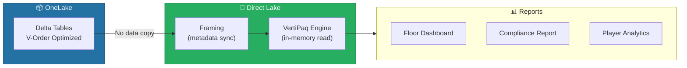
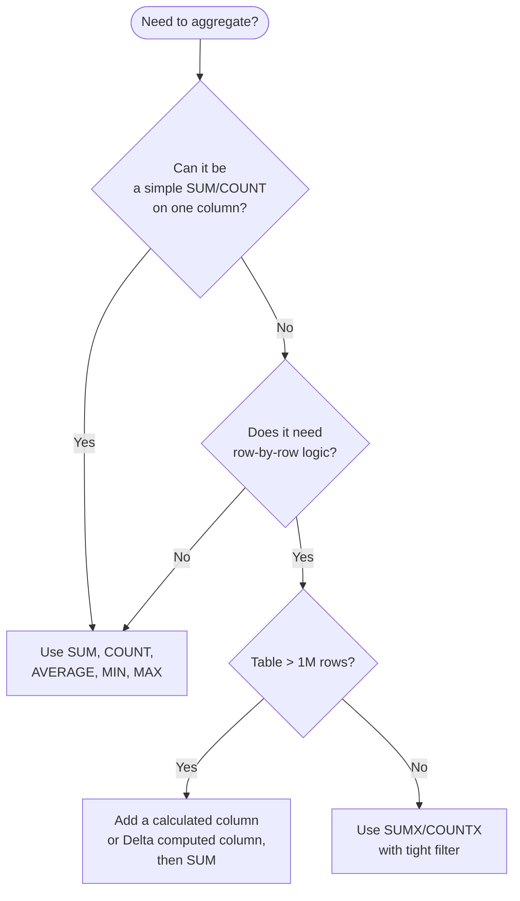
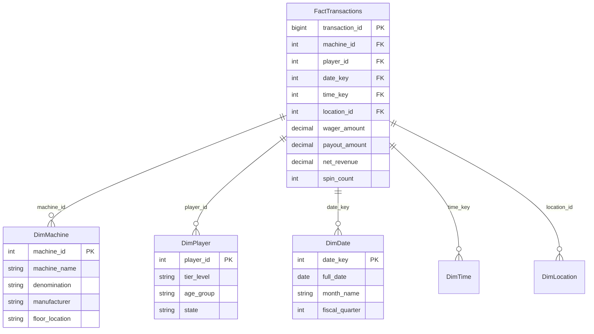
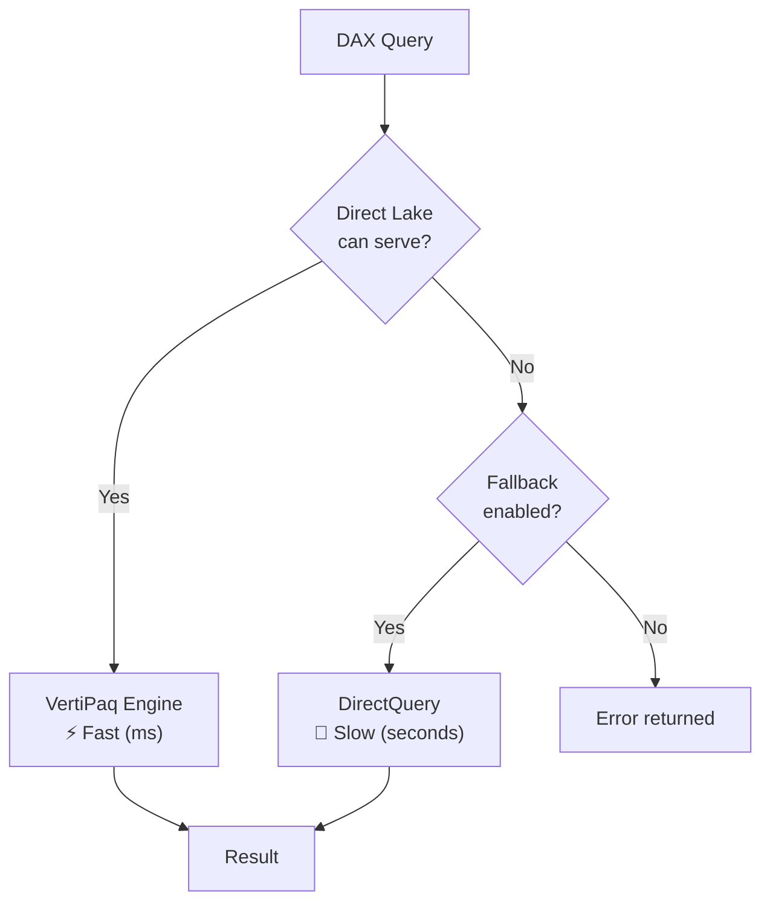
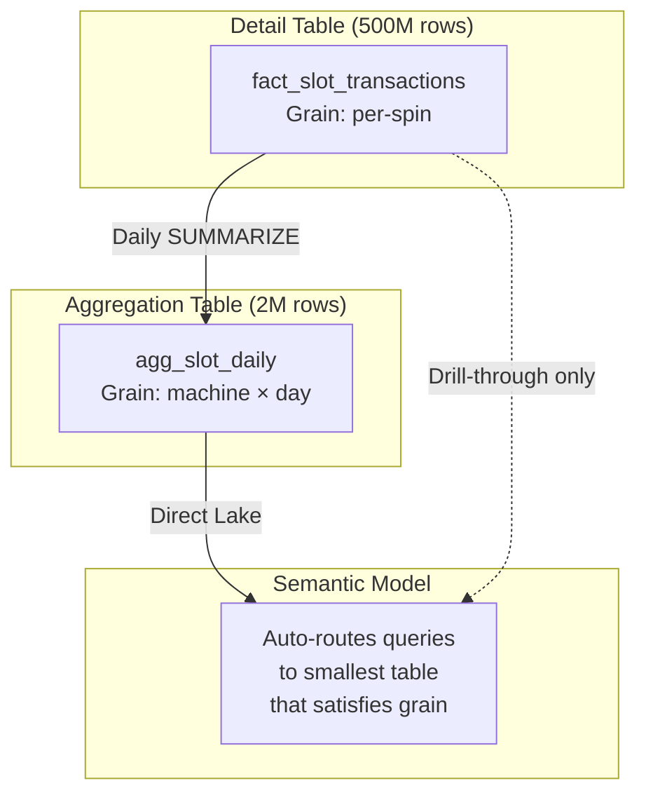
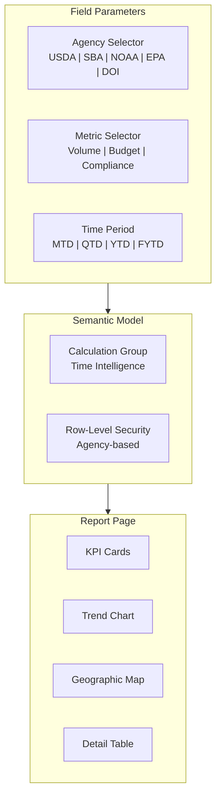

[Home](../index.md) > [Docs](../) > [Best Practices](./) > Power BI Best Practices

# 📊 Power BI Best Practices for Microsoft Fabric

<div align="center">

**Optimize Semantic Models, DAX Performance, and Report Design for Fabric Workloads**


</div>

---

**Last Updated:** `2026-04-21` | **Version:** 1.0.0

---

## 📑 Table of Contents

- [🎯 Overview](#-overview)
- [🧮 DAX Optimization](#-dax-optimization)
- [🏗️ Semantic Model Design](#️-semantic-model-design)
- [⚡ Report Performance](#-report-performance)
- [🔷 Direct Lake Optimization](#-direct-lake-optimization)
- [🔄 Incremental Refresh & Aggregations](#-incremental-refresh--aggregations)
- [🧩 Calculation Groups & Field Parameters](#-calculation-groups--field-parameters)
- [🎰 Casino Implementation](#-casino-implementation)
- [🏛️ Federal Agency Implementation](#️-federal-agency-implementation)
- [⚠️ Limitations](#️-limitations)
- [📚 References](#-references)
- [🔗 Related Documents](#-related-documents)

---

## 🎯 Overview

Power BI in Microsoft Fabric operates differently from Power BI Premium or Pro. Fabric's unified capacity model, Direct Lake connectivity, and OneLake-native storage fundamentally change how semantic models should be designed and optimized. This guide covers Fabric-specific best practices across DAX, model design, report performance, and Direct Lake tuning.

### Power BI in Fabric vs Traditional Power BI

| Aspect | Traditional Power BI | Power BI in Fabric |
|--------|---------------------|-------------------|
| **Storage** | Import into VertiPaq | Direct Lake from OneLake Delta tables |
| **Refresh** | Scheduled import refresh | Framing (metadata sync, no data copy) |
| **Compute** | Dedicated Premium capacity | Shared Fabric CU pool |
| **Data Source** | External connections | OneLake-native Delta tables |
| **Fallback** | N/A | DirectQuery if framing fails |
| **V-Order** | N/A | Critical for scan performance |
| **Cost Model** | Per-user or capacity license | CU consumption (shared with Spark, SQL) |



---

## 🧮 DAX Optimization

### CALCULATE Best Practices

`CALCULATE` is the most powerful and most frequently misused DAX function. Follow these rules for optimal performance:

| Rule | Good | Bad | Why |
|------|------|-----|-----|
| Filter on columns, not tables | `CALCULATE([Revenue], Product[Category] = "Slots")` | `CALCULATE([Revenue], FILTER(Product, Product[Category] = "Slots"))` | Column filters use storage engine; FILTER forces formula engine |
| Avoid nested CALCULATE | Use variables to stage filters | `CALCULATE(CALCULATE(...))` | Nested context transitions are expensive |
| Use KEEPFILTERS for additive filters | `CALCULATE([Revenue], KEEPFILTERS(Date[Year] = 2026))` | Overriding existing filters unintentionally | Preserves user slicer context |
| Prefer REMOVEFILTERS over ALL | `CALCULATE([Revenue], REMOVEFILTERS(Date))` | `CALCULATE([Revenue], ALL(Date))` | Semantic clarity; same performance |

### Iterator vs Aggregator Functions

```dax
// ❌ BAD: Iterator on 10M rows — scans every row
Slow Revenue = SUMX(Transactions, Transactions[Quantity] * Transactions[UnitPrice])

// ✅ GOOD: Pre-computed column + aggregator — storage engine only
Fast Revenue = SUM(Transactions[LineTotal])
// Where LineTotal is a calculated column: Quantity * UnitPrice
```

**Decision Guide:**



### Variables for Performance

Variables are evaluated once and cached. Use them to avoid redundant sub-expression evaluation:

```dax
// ✅ GOOD: Variables prevent double evaluation
Revenue Variance % =
VAR _CurrentRevenue = [Total Revenue]
VAR _TargetRevenue = [Revenue Target]
VAR _Variance = _CurrentRevenue - _TargetRevenue
RETURN
    IF(
        _TargetRevenue <> 0,
        DIVIDE(_Variance, _TargetRevenue),
        BLANK()
    )

// ❌ BAD: Measures evaluated twice
Revenue Variance % Bad =
DIVIDE(
    [Total Revenue] - [Revenue Target],
    [Revenue Target]
)
```

### SUMMARIZECOLUMNS vs ADDCOLUMNS

| Function | Use When | Performance |
|----------|----------|-------------|
| `SUMMARIZECOLUMNS` | Top-level EVALUATE queries (DAX queries, MCP, external tools) | Best — optimized by engine |
| `ADDCOLUMNS + VALUES` | Inside measures or when you need row context | Good — but not auto-optimized |
| `SUMMARIZE` | Legacy — avoid in new development | Worst — known performance issues |

```dax
// ✅ Best for external queries (Fabric MCP, SSMS, DAX Studio)
EVALUATE
SUMMARIZECOLUMNS(
    'Machine'[FloorLocation],
    'Date'[Month],
    "Total Revenue", [Total Revenue],
    "Avg Hold Pct", [Average Hold Percentage]
)

// ✅ Good for measure definitions
Top Floors =
ADDCOLUMNS(
    TOPN(5, VALUES('Machine'[FloorLocation]), [Total Revenue], DESC),
    "Revenue", [Total Revenue],
    "Machine Count", [Active Machine Count]
)
```

---

## 🏗️ Semantic Model Design

### Star Schema Principles

Every Fabric semantic model should follow strict star schema design. Snowflake schemas and flat tables degrade both DAX performance and user experience.



### Relationship Best Practices

| Rule | Details |
|------|---------|
| **Single-direction filters** | Default to single-direction; bi-directional only when absolutely required |
| **Integer surrogate keys** | Use INT keys for joins, not natural keys (strings are 5-10x slower) |
| **One active path** | Only one active relationship between any two tables; use USERELATIONSHIP for alternates |
| **Avoid high-cardinality dimensions** | Dimensions > 1M rows should be reconsidered (group, bucket, or move to fact) |
| **Role-playing dimensions** | Use inactive relationships + USERELATIONSHIP, not duplicate tables |

### Cardinality Optimization

| Cardinality | Action | Example |
|-------------|--------|---------|
| < 100K | No action needed | DimLocation, DimMachine |
| 100K–1M | Monitor; consider bucketing | DimPlayer (group by tier) |
| 1M–10M | Use aggregation tables | FactTransactions daily rollup |
| > 10M | Mandatory aggregations + Direct Lake framing limits | Raw telemetry — pre-aggregate |

---

## ⚡ Report Performance

### Visual Reduction Strategy

Each visual on a page generates one or more DAX queries. Reducing visuals directly reduces query count and render time.

| Guideline | Target | Rationale |
|-----------|--------|-----------|
| Visuals per page | ≤ 15 | Each visual = 1+ DAX query on interaction |
| Cards | ≤ 6 per page | Simple but still generate queries |
| Slicers | ≤ 5 per page | Cross-filter triggers all visuals to re-query |
| Tables/matrices with measures | ≤ 3 per page | Most expensive visual type |
| Pages per report | ≤ 20 | Loading metadata for all pages adds latency |

### High-Cardinality Avoidance

Never place high-cardinality columns directly on visuals:

```
❌ Transaction ID on a table visual (10M distinct values)
❌ Timestamp with seconds on an axis (8.6M values/day)
❌ Raw IP address as a slicer

✅ Date (day grain) on axis (~365 values)
✅ Hour bucket on axis (24 values)
✅ Machine ID on a filtered page (< 5,000 values)
```

### Bookmarks Over Complex Visuals

Use bookmarks to swap visual states instead of conditional visibility measures:

| Pattern | Without Bookmarks | With Bookmarks |
|---------|-------------------|----------------|
| Toggle chart type | IF-based measure switching | Two visuals, bookmark toggles visibility |
| Drill-through alternative | Complex SELECTEDVALUE measures | Bookmark navigates to filtered page |
| Summary/Detail toggle | Show/hide via measure | Bookmark swaps visual group |

---

## 🔷 Direct Lake Optimization

### V-Order Configuration

V-Order is a write-time optimization that arranges Delta Parquet data for optimal VertiPaq scanning. It is **critical** for Direct Lake performance.

```python
# Enable V-Order in Spark notebook writes
df.write \
    .format("delta") \
    .option("vorder.enabled", "true") \
    .mode("overwrite") \
    .saveAsTable("lh_gold.gold_slot_performance")
```

| V-Order Setting | Direct Lake Impact | Recommended |
|----------------|-------------------|-------------|
| Enabled (default in Fabric) | 2–10x faster scans | ✅ Always for Gold tables |
| Disabled | Slower VertiPaq column reads | ❌ Only for non-BI workloads |

### Framing Best Practices

Framing is how Direct Lake syncs metadata with the underlying Delta table. Unlike Import refresh, framing copies no data — it updates the VertiPaq engine's pointers to Parquet files.

| Framing Trigger | When |
|----------------|------|
| Automatic | Table schema change detected |
| Manual | Semantic model refresh in UI or API |
| Scheduled | Configured refresh schedule |

**Framing Guardrails:**

| Guardrail | F64 Limit | Action if Exceeded |
|-----------|-----------|-------------------|
| Max rows per table | 300M (per table) | Falls back to DirectQuery |
| Max row groups per table | 1,000 | Compact Delta files |
| Max tables | 500 | Reduce model scope |
| Max columns per table | 2,000 | Narrow table width |
| Max model size | 40 GB | Split into multiple models |

### Fallback Behavior

When Direct Lake cannot serve a query (guardrail exceeded, unsupported DAX), it falls back to DirectQuery against the SQL endpoint. This is **significantly slower**.



**Monitor fallback events:**

```kql
// Detect Direct Lake fallback events
FabricDatasetMetrics
| where TimeGenerated > ago(24h)
| where OperationName == "DirectLakeFallback"
| project TimeGenerated, DatasetName, TableName, FallbackReason
| summarize FallbackCount = count() by DatasetName, FallbackReason
| order by FallbackCount desc
```

---

## 🔄 Incremental Refresh & Aggregations

### Incremental Refresh in Fabric

For Import-mode datasets (when Direct Lake is not applicable), configure incremental refresh to minimize CU consumption:

| Parameter | Casino Recommendation | Federal Recommendation |
|-----------|----------------------|----------------------|
| Archive period | 3 years | 7 years (retention policy) |
| Incremental period | 30 days | 90 days (quarterly reporting) |
| Detect data changes | `LastModifiedDate` column | `etl_load_timestamp` column |
| Only refresh complete days | ✅ Yes | ✅ Yes |

### Aggregation Tables

Pre-aggregate high-volume fact tables into smaller rollup tables for fast dashboard rendering:



| Aggregation Level | Row Reduction | Use Case |
|-------------------|---------------|----------|
| Hourly | ~60x | Floor monitoring dashboards |
| Daily | ~1,440x | Trend analysis, KPI cards |
| Weekly | ~10,080x | Executive summaries |
| Monthly | ~43,200x | Compliance reports |

---

## 🧩 Calculation Groups & Field Parameters

### Calculation Groups

Calculation groups reduce measure proliferation by applying time intelligence transformations dynamically:

```dax
// Single calculation group replaces 5× measure clones
// Create in Tabular Editor or Fabric semantic model UI

// Calculation Group: Time Intelligence
// Items:
//   Current Period:    SELECTEDMEASURE()
//   Prior Period:      CALCULATE(SELECTEDMEASURE(), DATEADD('Date'[Date], -1, MONTH))
//   YoY Change:        SELECTEDMEASURE() - CALCULATE(SELECTEDMEASURE(), SAMEPERIODLASTYEAR('Date'[Date]))
//   YoY %:             DIVIDE(SELECTEDMEASURE() - CALCULATE(SELECTEDMEASURE(), SAMEPERIODLASTYEAR('Date'[Date])), CALCULATE(SELECTEDMEASURE(), SAMEPERIODLASTYEAR('Date'[Date])))
//   YTD:               CALCULATE(SELECTEDMEASURE(), DATESYTD('Date'[Date]))
```

**Before:** 5 measures × 10 KPIs = **50 measures**
**After:** 10 KPIs + 1 calculation group (5 items) = **15 objects**

### Field Parameters

Field parameters let users dynamically switch dimensions or measures in visuals without separate pages:

```dax
// Field parameter: Metric Selector
Metric Selector = {
    ("Revenue", NAMEOF('Measures'[Total Revenue]), 0),
    ("Payout", NAMEOF('Measures'[Total Payout]), 1),
    ("Hold %", NAMEOF('Measures'[Hold Percentage]), 2),
    ("Spin Count", NAMEOF('Measures'[Total Spins]), 3)
}
```

---

## 🎰 Casino Implementation

### Floor Performance Dashboard

A high-performance floor dashboard using Direct Lake, aggregation tables, and optimized DAX:

| Visual | Measure | DAX Pattern | Performance Tip |
|--------|---------|-------------|-----------------|
| Revenue KPI card | `[Total Revenue]` | `SUM(agg_slot_daily[net_revenue])` | Use aggregation table |
| Hold % gauge | `[Average Hold %]` | `DIVIDE([Total Revenue], [Total Coin In])` | Variables for numerator/denominator |
| Floor heatmap | `[Revenue by Location]` | `SUMMARIZECOLUMNS` over Location dimension | Limit to ≤50 locations |
| Trend line | `[Revenue Trend]` | Pre-aggregated daily data | Date hierarchy, not raw timestamp |
| Top 10 machines | `[Machine Ranking]` | `TOPN(10, ...)` with RANKX | RANKX on pre-filtered table |

### Compliance Dashboard

```dax
// CTR filing status measure
CTR Filing Rate =
VAR _TotalRequired =
    COUNTROWS(
        FILTER(
            Transactions,
            Transactions[amount] >= 10000
        )
    )
VAR _Filed =
    COUNTROWS(
        FILTER(
            ComplianceFilings,
            ComplianceFilings[filing_type] = "CTR"
                && ComplianceFilings[status] = "Filed"
        )
    )
RETURN
    DIVIDE(_Filed, _TotalRequired)

// SAR structuring detection
Structuring Alerts =
COUNTROWS(
    FILTER(
        VALUES(Player[player_id]),
        VAR _TxnCount =
            CALCULATE(
                COUNTROWS(Transactions),
                Transactions[amount] >= 8000
                    && Transactions[amount] < 10000,
                DATESINPERIOD('Date'[Date], MAX('Date'[Date]), -7, DAY)
            )
        RETURN _TxnCount >= 3
    )
)
```

### Player Analytics Model

| Metric | DAX | Optimization |
|--------|-----|-------------|
| Player Lifetime Value | `SUMX(RELATEDTABLE(Transactions), [net_revenue])` | Pre-compute in Gold table |
| Visit Frequency | `DISTINCTCOUNT(Transactions[visit_date])` | Date column, not timestamp |
| Average Session Duration | `AVERAGEX(Sessions, [duration_minutes])` | Aggregation table by player×day |
| Tier Progression | `SWITCH(TRUE(), ...)` on cumulative spend | Calculated column, not measure |

---

## 🏛️ Federal Agency Implementation

### Cross-Agency KPI Dashboard

Federal agencies share a unified KPI dashboard with agency-specific measures and field parameters for dynamic switching:



### Agency-Specific Measures

| Agency | KPI | DAX Pattern |
|--------|-----|-------------|
| USDA | Crop Yield Index | `DIVIDE(SUM(CropData[Production]), SUM(CropData[Acres]))` |
| SBA | Loan Approval Rate | `DIVIDE(COUNTROWS(FILTER(Loans, [Status] = "Approved")), COUNTROWS(Loans))` |
| NOAA | Severe Event Count | `CALCULATE(COUNTROWS(StormEvents), StormEvents[Severity] IN {"Severe", "Extreme"})` |
| EPA | Exceedance Rate | `DIVIDE(COUNTROWS(FILTER(Readings, [Value] > [Threshold])), COUNTROWS(Readings))` |
| DOI | Land Permit Velocity | `COUNTROWS(Permits) / DATEDIFF(MIN(Permits[Date]), MAX(Permits[Date]), DAY)` |

### Row-Level Security for Federal

```dax
// RLS rule: Agency analysts see only their agency's data
// Table: AgencyData
// DAX filter expression:
[agency_code] = USERPRINCIPALNAME()
// Mapped via Entra ID security groups:
//   sg-usda-analysts → agency_code = "USDA"
//   sg-sba-analysts  → agency_code = "SBA"
//   sg-cross-agency  → no filter (sees all)
```

---

## ⚠️ Limitations

| Limitation | Details | Workaround |
|-----------|---------|-----------|
| **Direct Lake fallback** | Exceeding guardrails silently falls back to DirectQuery | Monitor fallback events; compact Delta files |
| **Calculation groups in Direct Lake** | Supported but can trigger fallback for complex patterns | Test with DAX Studio; simplify if fallback occurs |
| **No writeback** | Power BI in Fabric is read-only; no writeback to Delta | Use notebooks or SQL endpoints for writes |
| **V-Order not retroactive** | Existing tables without V-Order need rewrite | `OPTIMIZE` with V-Order or rewrite from notebook |
| **RLS + Direct Lake** | RLS supported but adds overhead; complex RLS may cause fallback | Keep RLS expressions simple; column-based only |
| **Max concurrent queries** | Depends on Fabric SKU CU allocation | Monitor CU usage; scale up for heavy BI workloads |
| **Composite models** | Mixing Direct Lake + Import supported but complex | Prefer pure Direct Lake where possible |
| **Field parameters** | Not supported in all visual types | Test compatibility; fall back to separate pages |
| **Aggregation auto-routing** | Requires correct precedence configuration | Validate with DAX Studio Performance Analyzer |

---

## 📚 References

| Resource | URL |
|----------|-----|
| Direct Lake Overview | https://learn.microsoft.com/fabric/get-started/direct-lake-overview |
| DAX Optimization Guide | https://learn.microsoft.com/dax/best-practices/dax-optimization |
| V-Order Optimization | https://learn.microsoft.com/fabric/data-engineering/delta-optimization-and-v-order |
| Calculation Groups | https://learn.microsoft.com/power-bi/transform-model/calculation-groups |
| Field Parameters | https://learn.microsoft.com/power-bi/create-reports/power-bi-field-parameters |
| Incremental Refresh | https://learn.microsoft.com/power-bi/connect-data/incremental-refresh-overview |
| Aggregation Tables | https://learn.microsoft.com/power-bi/transform-model/desktop-aggregations |
| Direct Lake Guardrails | https://learn.microsoft.com/fabric/get-started/direct-lake-fixed-identity |
| Fabric Capacity Metrics | https://learn.microsoft.com/fabric/enterprise/metrics-app |
| DAX Studio | https://daxstudio.org/ |

---

## 🔗 Related Documents

- [Direct Lake](../features/direct-lake.md) -- Direct Lake mode deep dive
- [Capacity Planning & Cost Optimization](./capacity-planning-cost-optimization.md) -- CU consumption for BI workloads
- [Semantic Link](../features/semantic-link.md) -- Programmatic access to semantic models
- [Monitoring & Observability](./monitoring-observability.md) -- Track Power BI query performance
- [Medallion Architecture Deep Dive](./medallion-architecture-deep-dive.md) -- Gold layer design for BI

---

[Back to Best Practices Index](./README.md) | [Back to Documentation](../index.md)

---

> 📝 **Document Metadata**
> - **Author**: Documentation Team
> - **Reviewers**: Data Engineering, BI, Analytics, Compliance
> - **Classification**: Internal
> - **Next Review**: 2026-07-21
