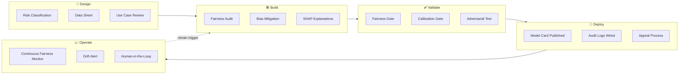
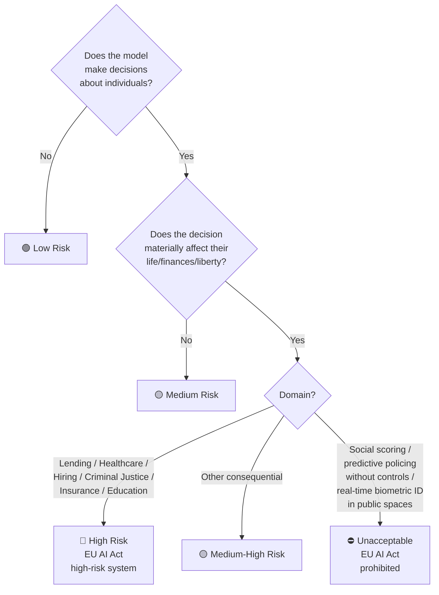

# 🧭 Responsible AI Framework for Fabric

<div align="center" markdown>

**Fairness, Explainability, Transparency, Privacy, Reliability, and Accountability — Mandatory Gates for Production ML on Fabric**


</div>

---

**Last Updated:** `2026-04-27` | **Version:** 1.0.0 | **Wave 2 Feature:** 2.4

---

## 🎯 Overview — The 6 Microsoft Responsible AI Principles

Responsible AI (RAI) is the practice of designing, building, and operating AI systems that are **fair, reliable, private, inclusive, transparent, and accountable**. Microsoft's Responsible AI Standard codifies these into six principles, every one of which has concrete implementation expectations on Microsoft Fabric.

| # | Principle | One-Sentence Definition | Fabric Implementation Surface |
|---|-----------|------------------------|------------------------------|
| 1 | **Fairness** | AI systems treat all groups equitably and do not produce discriminatory outcomes for protected classes. | Fairness gate in CI; group fairness metrics in Eventhouse; Purview classification. |
| 2 | **Reliability & Safety** | AI systems perform safely and consistently under expected and adversarial conditions. | Confidence thresholds; fallback rules; drift monitoring; canary rollouts. |
| 3 | **Privacy & Security** | AI systems protect individual privacy and resist data exfiltration. | OneLake Security; PII redaction; differential privacy; CMK; private endpoints. |
| 4 | **Inclusiveness** | AI systems work for people of all abilities, backgrounds, and contexts. | Accessibility review; multi-language support; representative training data. |
| 5 | **Transparency** | Stakeholders understand how AI systems work and why decisions are made. | Model cards; SHAP/LIME explanations; decision provenance in Eventhouse. |
| 6 | **Accountability** | Humans remain responsible for AI systems with clear ownership and oversight. | RACI matrix; audit logs; human-in-the-loop gates; appeal mechanisms. |

> 📝 **Scope:** This document is a Wave 2 feature (`2.4`) and a **mandatory gate** for any production ML system in regulated domains on this POC: lending (SBA), healthcare (Tribal Health, HIPAA), criminal justice (DOJ), and any model touching protected attributes or making consequential decisions about individuals.

### Where RAI Fits in the MLOps Lifecycle



This is the same lifecycle defined in [MLOps for Fabric Production](mlops-fabric-production.md), with RAI controls at every stage rather than bolted on at the end.

---

## 💼 Why This Matters Beyond Compliance

RAI is sometimes framed as a checkbox exercise. It is not. Three independent pressures make it strategic.

### Business Pressure

| Risk | Real Cost |
|------|-----------|
| Public bias incident | Brand damage; trust loss; customer churn |
| Forced model rollback | Lost training investment; opportunity cost |
| Litigation exposure | Statutory damages, attorney fees, settlements |
| Regulatory fines | Up to 7% of global revenue (EU AI Act for prohibited systems) |
| Class-action lawsuit | $5M – $500M+ historical settlements (employment screening, credit) |

### Ethical Pressure

Models that are 95% accurate overall but systematically wrong for one demographic group are not "good enough." A loan-default model that under-predicts default for one group and over-predicts for another redirects capital away from people who deserve it. The accuracy number hides the harm.

### Legal Pressure

US courts have consistently held that **disparate impact** — neutral-on-paper rules with discriminatory effect — violates ECOA, Title VII, and FCRA even without intent. The EU AI Act (effective 2026) categorizes lending, healthcare diagnosis, hiring, and criminal-justice models as *high-risk* systems with mandatory pre-deployment conformity assessment. State laws (NYC AI hiring, Colorado AI Act) impose audit requirements with named accountable parties.

> ⚠️ **The "we didn't know" defense does not work.** Once a model is deployed at scale, ignorance of disparate impact is itself negligence.

---

## ⚖️ Regulatory Landscape

Use this table to determine which regulations apply to a given model. Multiple may apply simultaneously.

| Jurisdiction | Regulation | Domain | Key Requirement | Penalty |
|--------------|-----------|--------|-----------------|---------|
| **EU** | EU AI Act (2024/1689) | Cross-sector | Risk classification; high-risk systems require conformity assessment, human oversight, transparency, post-market monitoring | Up to 7% global revenue (prohibited) / 3% (high-risk) |
| **US Federal** | ECOA (Reg B, 12 CFR 1002) | Lending | Adverse action notices with specific reasons; no discrimination on race, color, religion, national origin, sex, marital status, age | CFPB enforcement, civil penalties |
| **US Federal** | HIPAA Privacy Rule | Healthcare | PHI minimum necessary; breach notification; safeguards | $100 – $50K per violation |
| **US Federal** | Title VII (Civil Rights Act) | Employment | No disparate treatment or impact in hiring | EEOC enforcement |
| **US Federal** | FCRA | Credit reporting | Adverse action notices; right to dispute; accuracy obligations | $100 – $1K per violation, class actions |
| **US Federal** | NIST AI RMF (1.0) | Cross-sector (voluntary, often referenced in contracts) | Govern, Map, Measure, Manage functions | Contractual via federal procurement |
| **US Federal** | OCC Bulletin 2011-12, SR 11-7 | Banking model risk | Model validation, ongoing monitoring, governance | OCC/Fed examination findings |
| **US Federal** | FDA SaMD (Software as Medical Device) | Healthcare diagnostic models | Pre-market submission, real-world performance monitoring | Market withdrawal, civil penalties |
| **US State** | CCPA / CPRA | California consumers | Right to know, delete, opt out of automated decision-making | $2,500 – $7,500 per violation |
| **US Local** | NYC Local Law 144 | AI hiring tools used on NYC residents | Annual independent bias audit; published summary | $500 – $1,500 per violation per day |
| **US State** | Colorado AI Act (SB24-205) | High-risk consequential decisions (effective 2026) | Risk management program; impact assessment; consumer notices | AG enforcement |
| **US Tribal** | Indian Self-Determination Act + tribal data sovereignty (CARE Principles) | AI/AN health data | Tribal consent for any model touching tribal data | Tribal-specific |

> 📝 Most regulated systems trigger **multiple** rows in this table. An SBA loan-default model deployed in Colorado on EU residents triggers ECOA + Colorado AI Act + EU AI Act simultaneously.

---

## 🚦 Risk Assessment & Classification

Every proposed model must be classified before any code is written. Classification drives the rigor of the controls below.

### Decision Tree



### Risk Tiers

| Tier | Examples | Required Controls |
|------|----------|------------------|
| 🟢 **Low** | Slot performance forecast, AQI prediction, weather severity, anomaly detection on hardware, demand forecasting | Standard MLOps gates (performance, holdout, calibration). RAI controls: model card, audit log. |
| 🟡 **Medium** | Player segmentation, marketing uplift, recommendation, casino floor optimization, public-safety triage | Above + fairness audit on relevant attributes; SHAP global explanations; quarterly review. |
| 🟡 **Medium-High** | Personalization that affects pricing, service quality, or attention | Above + adverse impact analysis; consumer notice; opt-out mechanism. |
| 🔴 **High** | SBA loan default, healthcare diagnosis, hiring screening, criminal-justice recidivism, insurance underwriting, employment, credit | Above + mandatory fairness gate (CI); SHAP local explanations stored per prediction; human-in-the-loop for decisions; appeal mechanism; quarterly RAI review board; documented model card; conformity assessment (EU). |
| ⛔ **Unacceptable** | Social-scoring systems; real-time biometric ID in public; manipulative subliminal techniques; predictive policing without controls | **Prohibited.** Do not build. |

> 💡 **Decision rule:** When unsure between two tiers, classify **higher**. The cost of over-protection is delay; the cost of under-protection is harm.

---

## ⚖️ Pillar 1 — Fairness

Fairness in ML is the discipline of ensuring that model outcomes do not systematically disadvantage protected groups. It has both **legal** and **statistical** definitions, and they do not perfectly overlap.

### Protected Attributes (US Federal Baseline)

| Attribute | Statute | Notes |
|-----------|---------|-------|
| Race | Title VII, ECOA, FHA | Includes color and national origin |
| Sex / Gender | Title VII, ECOA, FHA | Includes pregnancy, gender identity, sexual orientation (post-Bostock) |
| Religion | Title VII, ECOA, FHA | |
| National origin | Title VII, ECOA, FHA | |
| Age (40+) | ADEA | Lending: ECOA — any age |
| Disability | ADA, Section 504 | |
| Genetic information | GINA | |
| Marital status | ECOA | Lending only |
| Familial status | FHA | Housing only |
| Veteran status | USERRA | Employment |

State / local additions vary widely (sexual orientation, gender identity, source of income, criminal record). Always check with counsel for the model's deployment jurisdiction.

### Group Fairness Metrics

No single metric captures fairness. Pick at least two from different families and report them all.

| Metric | Definition | When to Use |
|--------|-----------|-------------|
| **Demographic Parity (Statistical Parity)** | P(Ŷ=1 \| A=a) is equal across groups a | Use when base rates *should* be equal (advertising) |
| **Equal Opportunity** | P(Ŷ=1 \| Y=1, A=a) is equal across groups | Use when false negatives are the harm (loan denial to qualified borrower) |
| **Equalized Odds** | TPR and FPR equal across groups | Strictest — both false positives and false negatives matter |
| **Predictive Parity** | P(Y=1 \| Ŷ=1, A=a) equal across groups | "Calibration by group" — predicted score means same thing for everyone |
| **Treatment Equality** | FN/FP ratio equal across groups | Used in criminal-justice contexts (COMPAS debate) |
| **Individual Fairness** | Similar individuals get similar predictions | Counterfactual / Lipschitz-style; use alongside group metrics |

> ⚠️ It is **mathematically impossible** to satisfy demographic parity, equalized odds, and predictive parity simultaneously when base rates differ across groups (Chouldechova 2017). Pick the one that matches the harm you most want to avoid and document the choice.

### The 80% Rule (4/5ths Rule for Adverse Impact)

EEOC's Uniform Guidelines on Employee Selection Procedures use the **selection rate ratio**:

```
DPR = P(Ŷ=1 | A=disadvantaged) / P(Ŷ=1 | A=advantaged)
```

If DPR < 0.8, the rule presumes adverse impact. This is a screening test, not a safe harbor — failing it is presumptively unlawful, passing it is not absolution.

### PySpark Fairness Audit Notebook

Below is a runnable, end-to-end fairness audit. Save as `notebooks/ml/2_13_fairness_audit_template.py` and parameterize per model.

```python
# Databricks notebook source
# MAGIC %md
# MAGIC # Fairness Audit Template
# MAGIC
# MAGIC Runs group fairness metrics (Demographic Parity, Equal Opportunity,
# MAGIC Equalized Odds, Predictive Parity) on a binary classifier and writes
# MAGIC results to lh_gold.fairness_audit_results plus a Markdown report.
# MAGIC
# MAGIC Inputs:
# MAGIC   - holdout_table: Delta table with cols: prediction, score, label, <protected_attr>
# MAGIC   - protected_attrs: list of protected attribute column names
# MAGIC   - model_name, model_version: MLflow registry identifiers

# COMMAND ----------

# MAGIC %pip install fairlearn==0.10.0 --quiet

# COMMAND ----------

import os
import json
from datetime import datetime, timezone
from pyspark.sql import functions as F
from pyspark.sql.types import StructType, StructField, StringType, DoubleType, LongType, TimestampType

# Parameters (set via Fabric pipeline parameter cell)
holdout_table = "lh_gold.sba_loan_default_holdout_2026q1"
model_name    = "sba-loan-default-lightgbm"
model_version = "42"
protected_attrs = ["applicant_race", "applicant_sex", "applicant_age_band"]
favorable_outcome = 0  # 0 = "loan approved" (Ŷ=0 means no default predicted)
audit_id = f"{model_name}-{model_version}-{datetime.now(timezone.utc).strftime('%Y%m%dT%H%M%SZ')}"

# COMMAND ----------

df = spark.table(holdout_table).select(
    "prediction", "score", "label", *protected_attrs
).cache()
total = df.count()
print(f"Holdout rows: {total:,}")

# COMMAND ----------

def per_group_metrics(df, attr):
    """Compute Selection Rate, TPR, FPR, PPV per group."""
    grouped = (
        df.groupBy(attr)
          .agg(
              F.count("*").alias("n"),
              F.sum(F.when(F.col("prediction") == favorable_outcome, 1).otherwise(0)).alias("favorable"),
              F.sum(F.when(F.col("label") == favorable_outcome, 1).otherwise(0)).alias("actual_positive"),
              F.sum(
                  F.when((F.col("prediction") == favorable_outcome) &
                         (F.col("label") == favorable_outcome), 1).otherwise(0)
              ).alias("tp"),
              F.sum(
                  F.when((F.col("prediction") == favorable_outcome) &
                         (F.col("label") != favorable_outcome), 1).otherwise(0)
              ).alias("fp"),
              F.sum(
                  F.when((F.col("prediction") != favorable_outcome) &
                         (F.col("label") == favorable_outcome), 1).otherwise(0)
              ).alias("fn"),
          )
          .withColumn("selection_rate", F.col("favorable") / F.col("n"))
          .withColumn("tpr", F.col("tp") / (F.col("tp") + F.col("fn")))
          .withColumn("fpr", F.col("fp") / (F.col("n") - F.col("actual_positive")))
          .withColumn("ppv", F.col("tp") / (F.col("tp") + F.col("fp")))
    )
    return grouped

# COMMAND ----------

def compute_fairness(per_group_pdf, attr):
    """Reduce per-group metrics into a single fairness verdict."""
    rates = per_group_pdf.set_index(attr)
    sr = rates["selection_rate"]
    tpr = rates["tpr"]
    fpr = rates["fpr"]
    ppv = rates["ppv"]

    # Demographic Parity Ratio (min/max selection rate)
    dpr = sr.min() / sr.max() if sr.max() > 0 else 0.0
    # Equal Opportunity Difference (max TPR - min TPR)
    eo_diff = float(tpr.max() - tpr.min())
    # Equalized Odds Difference (max of TPR and FPR diffs)
    eq_odds = max(eo_diff, float(fpr.max() - fpr.min()))
    # Predictive Parity Ratio (min/max PPV)
    pp_ratio = ppv.min() / ppv.max() if ppv.max() > 0 else 0.0

    return {
        "attribute": attr,
        "demographic_parity_ratio": float(dpr),
        "equal_opportunity_diff": float(eo_diff),
        "equalized_odds_diff": float(eq_odds),
        "predictive_parity_ratio": float(pp_ratio),
        "passes_80_pct_rule": bool(dpr >= 0.8),
        "passes_eo_threshold": bool(eo_diff <= 0.10),  # 10pp gap as max
    }

# COMMAND ----------

results = []
for attr in protected_attrs:
    pdf = per_group_metrics(df, attr).toPandas()
    verdict = compute_fairness(pdf, attr)
    print(f"\n=== {attr} ===")
    print(pdf.to_string(index=False))
    print(json.dumps(verdict, indent=2))
    results.append({"audit_id": audit_id, "model_name": model_name,
                    "model_version": model_version, "audit_ts": datetime.now(timezone.utc),
                    **verdict})

# COMMAND ----------

# Persist to Gold for monitoring + audit trail
schema = StructType([
    StructField("audit_id", StringType()),
    StructField("model_name", StringType()),
    StructField("model_version", StringType()),
    StructField("audit_ts", TimestampType()),
    StructField("attribute", StringType()),
    StructField("demographic_parity_ratio", DoubleType()),
    StructField("equal_opportunity_diff", DoubleType()),
    StructField("equalized_odds_diff", DoubleType()),
    StructField("predictive_parity_ratio", DoubleType()),
    StructField("passes_80_pct_rule", StringType()),
    StructField("passes_eo_threshold", StringType()),
])
out_df = spark.createDataFrame(
    [{**r, "passes_80_pct_rule": str(r["passes_80_pct_rule"]),
            "passes_eo_threshold": str(r["passes_eo_threshold"])} for r in results],
    schema=schema,
)
(out_df.write
       .format("delta")
       .mode("append")
       .saveAsTable("lh_gold.fairness_audit_results"))

# COMMAND ----------

# CI gate: fail the run if any attribute fails the 80% rule
failures = [r for r in results if not r["passes_80_pct_rule"]]
if failures:
    raise AssertionError(
        f"Fairness gate FAILED for {model_name} v{model_version}: "
        f"{[f['attribute'] for f in failures]} below 0.80 DPR. "
        f"Triage with mitigation playbook before promotion."
    )
print("Fairness gate PASSED.")
```

### Mitigation Techniques

When the audit fails, mitigation is required. Three families of techniques are supported in Fabric.

| Family | When | Technique | Library |
|--------|------|-----------|---------|
| **Pre-processing** | Bias is in the data | Reweighing, sampling, label correction | `fairlearn.preprocessing`, `aif360` |
| **In-processing** | You control the algorithm | Adversarial debiasing, constrained optimization, exponentiated gradient | `fairlearn.reductions.ExponentiatedGradient` |
| **Post-processing** | Black-box model already in prod | Threshold optimization, calibration per group, reject-option classification | `fairlearn.postprocessing.ThresholdOptimizer` |

```python
# Post-processing example (most common in Fabric retrofits)
from fairlearn.postprocessing import ThresholdOptimizer

mitigated = ThresholdOptimizer(
    estimator=loaded_model,
    constraints="equalized_odds",
    objective="balanced_accuracy_score",
    prefit=True,
)
mitigated.fit(X_train, y_train, sensitive_features=A_train)
# Evaluate the mitigated model on the same holdout, re-run fairness audit
```

> 💡 Mitigation almost always trades raw accuracy for fairness. Document the trade in the model card.

---

## 🔍 Pillar 2 — Explainability (SHAP / LIME)

If a model cannot explain *why* it made a decision, it cannot be defended in court, in a regulator review, or to the affected individual. Explainability is non-optional for high-risk models.

### Local vs Global Explanations

| Type | Question Answered | Audience |
|------|------------------|----------|
| **Local** | "Why was *this* prediction made for *this* applicant?" | The affected individual; appeals |
| **Global** | "What features drive predictions overall?" | Model governance; risk committee |
| **Cohort** | "How does the model behave for sub-population X?" | Fairness analysts |

A high-risk model needs all three. Store local explanations alongside every prediction; recompute global explanations at every retraining.

### SHAP TreeExplainer for Tree-Based Models

SHAP (SHapley Additive exPlanations) gives Shapley values: the contribution of each feature to a single prediction. For tree-based models (LightGBM, XGBoost, RandomForest), `TreeExplainer` is exact and fast.

```python
import mlflow
import shap
import numpy as np

model = mlflow.lightgbm.load_model("models:/sba-loan-default-lightgbm/Production")
explainer = shap.TreeExplainer(model)

# Local explanations for a batch
sample = X_test.iloc[:1000]
shap_values = explainer.shap_values(sample)  # shape: (n_samples, n_features)

# Global explanation: mean absolute SHAP per feature
global_importance = np.abs(shap_values).mean(axis=0)
top_features = sorted(zip(sample.columns, global_importance), key=lambda x: -x[1])[:20]

# Visual: summary plot for the model card
shap.summary_plot(shap_values, sample, max_display=20, show=False)
```

### LIME for Tabular and Text

LIME (Local Interpretable Model-agnostic Explanations) approximates the model locally with a linear surrogate. Use when:
- The model is *not* tree-based and SHAP is too slow
- You need explanations on text (LIME handles tokenization out of the box)
- You need an explanation in a domain language different from feature space

```python
from lime.lime_tabular import LimeTabularExplainer

explainer = LimeTabularExplainer(
    training_data=X_train.values,
    feature_names=X_train.columns.tolist(),
    class_names=["approved", "denied"],
    mode="classification",
)
exp = explainer.explain_instance(
    data_row=X_test.iloc[0].values,
    predict_fn=model.predict_proba,
    num_features=10,
)
exp.as_list()  # [(feature, weight), ...] for the model card and adverse-action notice
```

### Counterfactual Explanations

A counterfactual answers: *"What is the smallest change to the inputs that would flip the decision?"* Counterfactuals are uniquely useful for adverse-action notices ("Your loan would have been approved if your debt-to-income ratio were below 38%") and are explicitly recognized under the EU AI Act.

```python
import dice_ml

dice_data = dice_ml.Data(dataframe=X_train.assign(label=y_train),
                         continuous_features=continuous_cols,
                         outcome_name="label")
dice_model = dice_ml.Model(model=model, backend="sklearn")
dice = dice_ml.Dice(dice_data, dice_model, method="random")

cf = dice.generate_counterfactuals(
    X_test.iloc[:5],
    total_CFs=3,
    desired_class="opposite",
    features_to_vary=actionable_features,  # only suggest changes the user can act on
)
cf.visualize_as_dataframe()
```

### Storing Explanations in Eventhouse

Every high-risk prediction should write a row to an `ai_predictions` Eventhouse table with full local SHAP values. This becomes the audit trail and powers the appeals workflow.

```python
import json
from datetime import datetime, timezone

def log_prediction_with_explanation(prediction_id, features, prediction, score, shap_row, model_name, model_version):
    record = {
        "prediction_id": prediction_id,
        "ts": datetime.now(timezone.utc).isoformat(),
        "model_name": model_name,
        "model_version": model_version,
        "prediction": int(prediction),
        "score": float(score),
        "features": json.dumps(features.to_dict()),
        "shap_values": json.dumps(dict(zip(features.index, shap_row.tolist()))),
        "top_3_drivers": json.dumps(
            sorted(zip(features.index, shap_row), key=lambda x: -abs(x[1]))[:3]
        ),
    }
    # Push to Eventhouse via Eventstream
    eventstream_client.send("ai_predictions", record)
```

KQL query for an appeal review:

```kql
ai_predictions
| where prediction_id == "abc-123"
| project ts, model_name, model_version, prediction, score,
          top_3_drivers, features
```

---

## 📜 Pillar 3 — Transparency

Transparency means stakeholders — affected individuals, regulators, auditors, downstream developers — can find out, in plain language, **what the system is, what data it was trained on, how well it works, and where it fails**.

### Model Cards

A **model card** is a one-page (give or take) document that travels with every production model. The full template is in [Templates](#-templates). It must contain:

1. Model purpose and intended use
2. Out-of-scope use (what *not* to use it for)
3. Training data summary
4. Evaluation results, including by-subgroup
5. Known limitations and failure modes
6. Ethical considerations
7. Contact for questions / appeals

Publish in OneLake (`lh_gold/model_cards/{model_name}.md`) and surface in the Workspace Wiki.

### Data Sheets for Datasets

Borrowed from Gebru et al. (2021), a **datasheet** describes a dataset's provenance, composition, collection process, recommended uses, and known biases. Maintain one per training dataset, stored as `lh_silver/datasheets/{dataset_name}.md`.

### Decision Provenance

Every prediction must be traceable to: model name, model version, training data version, code SHA, feature values, and timestamp. This is the legally defensible "show your work."

```kql
// Decision provenance lookup for appeal handling
ai_predictions
| where prediction_id == "abc-123"
| join kind=inner mlflow_runs on $left.model_version == $right.version
| project ts, model_name, model_version,
          training_data_version=run_params.training_data_version,
          training_data_table=run_params.training_data_table,
          git_sha=run_params.git_sha,
          features, prediction, score, top_3_drivers
```

### User-Facing Explanations

Translate technical explanations to plain English. ECOA adverse-action notices, GDPR Article 22 disclosures, and California ADM rights all require this.

| Technical Output | User-Facing Sentence |
|------------------|---------------------|
| `shap_value(debt_to_income) = +0.31` | "Your debt-to-income ratio of 47% was the largest factor in the decision." |
| `shap_value(credit_history_months) = -0.12` | "Your 14 months of credit history was a positive factor." |
| Counterfactual: lower DTI to 38% | "If your debt-to-income ratio were 38% or below, this loan would have been approved." |

Run the translation through a templated function — never let raw SHAP numbers reach an end user.

---

## 🔒 Pillar 4 — Privacy

ML systems amplify privacy risk: a model can memorize training data, leak features through inference, and re-identify individuals from aggregates. Treat privacy as a property of the *whole system*, not just storage.

### Differential Privacy

Differential privacy (DP) provides a mathematical guarantee that no individual's data measurably changes the output. Use for: aggregate statistics released externally, training set summaries, demographic counts in public reports.

```python
from diffprivlib import mechanisms

# Add Laplace noise to a count, eps = privacy budget
mech = mechanisms.Laplace(epsilon=1.0, sensitivity=1.0)
private_count = mech.randomise(true_count)
```

For full DP-SGD training, use Microsoft's `SmartNoise` library (Open Differential Privacy). Document the **privacy budget (ε, δ)** and the cumulative spend across queries — privacy budget is finite.

### Federated Learning

Federated learning keeps training data on-edge (or in tribal data centers, hospital VPCs) and only ships model updates. Relevant when: data cannot legally leave a jurisdiction, tribal data sovereignty applies, or healthcare partners refuse to share row-level data.

> 📝 Fabric does not yet provide first-party federated training. Pattern: train per-tenant models in separate Fabric workspaces and aggregate weights via Azure ML or external orchestrator.

### PII Redaction in Features

Features must not leak PII to the model unless absolutely necessary. Reference patterns:
- Hash (with salt from env var, never hardcoded) — see [Bronze patterns](medallion-architecture-deep-dive.md)
- Bucketize (age 28 → "25-34") for low-cardinality use
- Tokenize (replace SSN with deterministic random ID)
- Drop entirely if the model doesn't need it — most don't

```python
import hashlib, os

def hash_pii(value: str) -> str:
    salt = os.environ["FABRIC_POC_HASH_SALT"]  # required, never default
    return hashlib.sha256(f"{salt}{value}".encode()).hexdigest()[:16]
```

### Right-to-Deletion (GDPR Article 17, CCPA §1798.105)

When a user invokes deletion, two surfaces must be addressed:

1. **Training data** — Mark the row deleted in Silver/Gold; exclude from next retrain
2. **Already-trained model** — Either retrain (clean removal) or apply machine-unlearning techniques (newer, less mature)

> 📝 Detailed deletion runbook is in the upcoming **Wave 5 GDPR / Right-to-Deletion playbook** (placeholder — link to be populated).

For now, every model lineage entry must carry the training data Delta version so retraining without a deleted row is reproducible.

---

## 🛡️ Pillar 5 — Reliability & Safety

Production ML systems must be **safe under expected and adversarial conditions**. "Safe" means: no harmful outputs, graceful failure, and known confidence boundaries.

### Adversarial Robustness

Test the model against perturbed inputs. For tabular models, that means:
- Out-of-distribution feature values
- Extreme but plausible values
- Missing fields
- Encoding-confused inputs (whitespace, Unicode lookalikes)

```python
from foolbox import PyTorchModel, attacks

# For tabular: simpler — perturb each numeric feature ±1 stddev and re-predict
def robustness_score(model, X_holdout):
    base = model.predict(X_holdout)
    perturbed_preds = []
    for col in X_holdout.select_dtypes(include="number").columns:
        std = X_holdout[col].std()
        X_p = X_holdout.copy()
        X_p[col] = X_p[col] + std * np.random.choice([-1, 1], size=len(X_p))
        perturbed_preds.append(model.predict(X_p))
    avg_flip = np.mean([(p != base).mean() for p in perturbed_preds])
    return 1.0 - avg_flip  # higher = more robust
```

### Confidence-Aware Predictions

A confidence-aware model **abstains** when it is unsure rather than guessing. For high-risk decisions, abstention routes to a human reviewer.

```python
def predict_with_abstention(model, X, low_conf_threshold=0.20, high_conf_threshold=0.80):
    proba = model.predict_proba(X)[:, 1]
    decisions = np.where(
        proba < low_conf_threshold, "predicted_negative",
        np.where(proba > high_conf_threshold, "predicted_positive", "abstain_route_to_human")
    )
    return decisions, proba
```

### Graceful Degradation

When the ML service is unavailable, the *application* must still work. Define a **fallback rule** the business will accept:

| ML Output | Fallback |
|-----------|---------|
| Loan default score unavailable | Use rule-based scoring (DTI < 43%, FICO ≥ 680) and flag for manual review |
| Fraud score unavailable | Apply default risk tier "MEDIUM", do not auto-approve |
| Recommendation unavailable | Show curated default list |
| Triage score unavailable | Route to senior human reviewer |

Document the fallback in the runbook and **test it in chaos drills**.

### Continuous Monitoring

Reliability requires drift, performance, and fairness monitoring in production — see [Model Monitoring & Drift Detection](model-monitoring-drift-detection.md). Wire alerts so that any of:

- Performance degradation > 5%
- Drift PSI > 0.2
- Fairness DPR drops below 0.8
- Calibration ECE > 0.1
- Abstention rate > 25%

triggers the on-call rotation and a model review.

---

## 👥 Pillar 6 — Accountability

A model without an accountable human is a runaway machine. Every production model has named owners, an audit trail, and an appeal mechanism.

### RACI for ML Systems

| Activity | Data Scientist | ML Engineer | Domain SME | RAI Lead | Compliance | On-Call |
|----------|----------------|-------------|------------|----------|------------|--------|
| Model design | R | C | C | C | I | I |
| Fairness audit | R | C | C | A | C | I |
| Promotion to Prod | C | R | I | A | A | I |
| Monitoring response | I | R | C | C | I | A |
| Adverse action notice | C | C | R | A | A | I |
| Appeal review | C | I | R | C | C | I |
| Annual RAI review | R | C | C | A | A | I |

(R = Responsible, A = Accountable, C = Consulted, I = Informed)

### Audit Trails

Every prediction in a high-risk model must produce a row in `ai_predictions` Eventhouse table with:

- Prediction ID (UUID)
- Timestamp (UTC)
- Model name + version
- Training data Delta version
- Code SHA
- Input features (or hash, if PII)
- Output prediction + score
- Top-3 SHAP drivers
- Confidence bucket (high / medium / low / abstain)

Retention: 7 years for lending, 10 years for healthcare, indefinite for criminal-justice. Sensitivity label: same as the source data.

### Human-in-the-Loop (HITL)

For high-stakes decisions, ML produces a *recommendation*; a human makes the *decision*. Implementation patterns:

| Pattern | When | Example |
|---------|------|---------|
| Always-HITL | Most regulated decisions | Healthcare diagnosis, criminal-justice risk |
| Confidence-gated HITL | Volume too high to review every case | SBA loan default — auto-approve if proba < 0.10, auto-deny ≥ 0.90, HITL in between |
| Sample-audit HITL | Model is well-validated | Audit 5% of high-volume decisions |
| Appeal-only HITL | Low-stakes per-decision | Marketing offer — only humans review on user complaint |

### Appeal & Override Mechanisms

Every individual subject to a high-risk decision must be able to:

1. Receive a written explanation (within statutory window — 30 days for ECOA)
2. Request human re-review with new information
3. Have errors corrected and the model re-scored
4. Receive notice of the outcome and further appeal rights

Build this as a Translytical Task Flow on top of `ai_predictions` with a four-step workflow: *appeal received → human reviewer assigned → decision overturned/upheld → notice issued*. See [Translytical Task Flows](../features/translytical-task-flows.md).

---

## 🏗️ Implementation in Fabric

This section gives concrete Fabric-native implementation patterns — what items to create, where, and how they connect.

### Fairness Gate in CI

Wire the fairness audit notebook from [Pillar 1](#️-pillar-1--fairness) into the same `.github/workflows/ml-promotion.yml` pipeline defined in the [MLOps anchor](mlops-fabric-production.md#-model-validation-gates):

```yaml
- name: Fairness Gate
  if: contains(github.event.pull_request.labels.*.name, 'regulated-domain')
  run: |
    python scripts/run_fabric_notebook.py \
      --workspace ${{ secrets.FABRIC_WS_ID }} \
      --notebook 2_13_fairness_audit_template \
      --params holdout_table=${{ env.HOLDOUT }},model_name=${{ env.MODEL }},model_version=${{ env.VERSION }}
```

The notebook raises `AssertionError` on failure, which fails the CI step and blocks promotion.

### SHAP Notebook (Notebook 2.13 — upcoming)

A Wave 2 deliverable: `notebooks/ml/2_13_shap_explainability.py` runs SHAP for any registered model and writes results to:

- Local explanations → `ai_predictions` Eventhouse table (per-prediction)
- Global explanations → `lh_gold.shap_global_importance` (per model version)
- Visual artifacts → MLflow run as PNG

This notebook is the canonical explainability surface and is invoked both at training time (global) and at inference time (local).

### Audit Log → Eventhouse + Log Analytics

Two destinations for two audiences:

| Destination | Audience | Retention |
|-------------|---------|-----------|
| **Eventhouse** (`ai_predictions`) | RAI lead, appeals officer, ML team | 7-10 years (regulatory) |
| **Log Analytics** | Security, on-call, ops | 90 days hot, 1 year cold |

Pattern: Eventstream tees every prediction event into both. See [Workspace Monitoring](../features/workspace-monitoring.md).

### Model Card Published in Workspace Wiki / OneLake

Convention:

```
lh_gold/
  model_cards/
    sba-loan-default-lightgbm.md       <- current Production
    sba-loan-default-lightgbm-v41.md   <- previous versions retained
    casino-fraud-detection-lightgbm.md
    ...
```

Surface in the Workspace Wiki by linking to the OneLake URL. Update on every promotion. Versioned via Git.

### Sensitivity Labels via Purview

Apply sensitivity labels to:

- The `ai_predictions` Eventhouse (matches highest-classification source data)
- The model card in OneLake (typically Internal — model card is public-friendly)
- The fairness audit results table (Confidential — contains demographic patterns)
- The training data lineage (matches source data)

See [Data Governance Deep Dive — Sensitivity Labels](data-governance-deep-dive.md#-classification-taxonomy).

---

## 🏛️ Domain Implementations

### SBA Lending — ECOA Fairness, Adverse Action Notices

The [Small Business Lending Analytics](../use-cases/small-business-lending-analytics.md) use case includes a default-risk model. Required RAI controls:

| Control | Implementation |
|---------|---------------|
| Risk tier | 🔴 High |
| Protected attributes audited | Race, sex, age (≥40 — ADEA does not cover lending; ECOA *does* cover any age), national origin (proxy: language preference), marital status |
| Fairness gate | DPR ≥ 0.8 on each attribute; equal-opportunity diff ≤ 0.10 |
| Mitigation | `fairlearn.postprocessing.ThresholdOptimizer` calibrated per group |
| Adverse action notice | ECOA Reg B §1002.9: within 30 days; specific reasons (not "credit score too low") — derived from top-3 SHAP drivers, translated to user-facing language |
| Audit trail | `ai_predictions` Eventhouse, retention 5 years (Reg B §1002.12 + ECOA statute of limitations buffer) |
| Human-in-the-loop | Confidence-gated: proba ∈ [0.20, 0.80] → human reviewer |
| Appeal | Translytical task flow; reviewer pulls SHAP + features; written outcome within 30 days |

### DOJ — Sensitive, Restricted Access

The [Federal Justice Analytics](../use-cases/federal-justice-analytics.md) use case includes sentencing-disparity models and antitrust merger-review prioritization. Risk tier varies:

| Model | Risk Tier | Special Constraints |
|-------|-----------|--------------------|
| Sentencing disparity descriptive analysis | 🟢 Low (descriptive, not predictive) | Aggregate-only, no individual scoring |
| Antitrust merger review prioritization | 🟡 Medium | Models the prosecutor's queue, not the merger outcome; human review always |
| Recidivism prediction | 🔴 High | **POC stance: do not build.** Recidivism models have a documented track record of disparate impact and high political risk. If ever pursued, requires conformity assessment, individual fairness analysis (not just group), and continuous monitoring with public reporting. |

All DOJ ML artifacts are restricted to `ws_doj_prod` workspace with `sg-doj-cleared` group access; sensitivity label "Highly Confidential"; no shortcut access from other workspaces.

### Tribal Healthcare — HIPAA + IHS + Tribal Sovereignty

The [Tribal Health Analytics](../use-cases/tribal-health-analytics.md) use case operates exclusively on **publicly available aggregate data** — by design no individual-level ML model is included in the POC. If a future expansion proposes one:

| Required Step | Detail |
|---------------|--------|
| Tribal consent | IRB-equivalent tribal review; named tribal data steward |
| CARE Principles | Collective Benefit, Authority to Control, Responsibility, Ethics |
| HIPAA | Minimum necessary; de-identified per Safe Harbor or Expert Determination |
| Risk tier | 🔴 High (clinical decisions) |
| Federated learning | Strongly preferred; data does not leave tribal infrastructure |
| Monitoring | Quarterly review with tribal partner; right to halt the model at any time |
| Appeal | Through tribal health authority, not federal contractor |

> ⚠️ Tribal data sovereignty is a constitutional matter, not a compliance matter. The 80% rule is a floor, not a ceiling.

---

## 🚫 Anti-Patterns

| Anti-Pattern | Why It Hurts | What to Do Instead |
|--------------|-------------|--------------------|
| **"Fairness through unawareness"** — drop the protected attribute, declare done | Proxies (zip code → race, name → gender) reproduce the bias and you can no longer measure it | Keep the attribute *visible to the audit*, exclude it from training features only when policy requires; always measure |
| **One-time fairness audit at launch** | Production data drifts; population mix changes; a model fair at launch can be unfair next quarter | Quarterly fairness re-audit + automated monitoring with alerts |
| **Ship-it-and-watch** without an appeal mechanism | Affected individuals have no recourse; harm compounds before detection | Appeal/override workflow live before first prediction |
| **SHAP graphs as the "explanation" for end users** | Force-plot waterfalls confuse non-technical users; lawyers cannot use them | Templated user-facing sentences; counterfactuals for actionable cases |
| **Logging predictions but not features or model version** | Cannot reproduce, cannot defend, cannot learn from | Full provenance row per prediction |
| **Single fairness metric ("we use demographic parity")** | Different metrics expose different harms; you will miss something | Report ≥ 2 metrics from different families; document the chosen primary |
| **Model card that hides limitations** | Marketing language is not transparency | Write the limitations section *first*; if the model cannot do X, say so explicitly |
| **Confidential model card** | Defeats the purpose | Internal-classified at most; share with affected parties on request |
| **Unbounded automation in high-stakes decisions** | Removes the human accountable party | Confidence gating + HITL for the uncertain band |
| **Treating RAI as a one-team responsibility** | RAI breaks at every handoff if only one team owns it | RACI from design through retire; named RAI Lead |

---

## 📋 RAI Review Checklist

A model cannot be promoted to Production until every applicable item is checked. The RAI Lead signs off in Archon as the gate.

### Design Phase

- [ ] Risk tier classified (🟢/🟡/🔴/⛔) with rationale
- [ ] Use-case statement written; out-of-scope use explicitly named
- [ ] Stakeholder map: who is affected by predictions, who decides, who appeals
- [ ] Applicable regulations identified (table in this doc)
- [ ] Tribal consent obtained (if AI/AN data)

### Build Phase

- [ ] Datasheet authored for training dataset
- [ ] Protected attributes identified per jurisdiction
- [ ] Proxy-attribute analysis done (zip → race? name → gender? title → age?)
- [ ] Training data PII handled (hash with env-var salt; no raw SSN)
- [ ] Model card draft written **before** training (forces honest scoping)

### Validate Phase

- [ ] Fairness audit run; ≥ 2 metrics from different families reported
- [ ] DPR ≥ 0.8 on every protected attribute (or documented justification + mitigation)
- [ ] Equal-opportunity diff ≤ 0.10 (or documented)
- [ ] Calibration by group checked
- [ ] SHAP global explanations generated and reviewed
- [ ] Counterfactual examples generated for at least 5 representative cases
- [ ] Adversarial robustness test executed
- [ ] Confidence threshold + abstention rule defined
- [ ] Fallback rule for service-down condition defined and tested

### Deploy Phase

- [ ] Model card published to OneLake + Workspace Wiki
- [ ] Sensitivity label applied to model item, prediction table, audit table
- [ ] `ai_predictions` Eventhouse table provisioned with retention policy
- [ ] User-facing explanation templates written and legally reviewed (if regulated)
- [ ] Adverse-action / consumer-notice template ready (if applicable)
- [ ] Appeal workflow live (Translytical task flow or equivalent)
- [ ] HITL routing live for low-confidence band
- [ ] Monitoring dashboards wired: drift, performance, fairness, calibration, abstention rate
- [ ] Action Group routing tested (alert → on-call)
- [ ] Runbook for fairness regression written

### Operate Phase

- [ ] Quarterly fairness re-audit scheduled in Archon
- [ ] Annual RAI review board meeting scheduled with named attendees
- [ ] Postmortem template ready for first incident
- [ ] Decommission criteria defined (when do we retire this model?)
- [ ] Compliance sign-off obtained and stored

---

## 📝 Templates

### Model Card Template

Save as `lh_gold/model_cards/{model_name}.md` and update on every Production promotion.

```markdown
# Model Card: {Model Name}

**Model name:** {model_name}
**Current Production version:** {version}
**Last updated:** {YYYY-MM-DD}
**RAI risk tier:** 🟢 Low / 🟡 Medium / 🔴 High
**Owner (Accountable):** {name, role, team}
**RAI Lead:** {name}
**Classification:** Internal

---

## Intended Use

**Primary use case:** {one-paragraph description of the decision the model supports}

**Intended users:** {who calls this API or consumes the prediction}

**Out-of-scope use:** {explicit list of uses this model is NOT validated for}

---

## Training Data

| Aspect | Value |
|--------|-------|
| Source table | {lh_silver.xxx} |
| Delta version | {version} |
| Time window | {YYYY-MM-DD to YYYY-MM-DD} |
| Row count | {n} |
| Label definition | {how y was constructed} |
| Sampling strategy | {if any} |
| Known biases / gaps | {documented} |

See datasheet: `lh_silver/datasheets/{dataset_name}.md`

---

## Performance

| Metric | Value | Holdout |
|--------|-------|---------|
| AUC | 0.83 | 2026-Q1 |
| Brier score | 0.12 | 2026-Q1 |
| Calibration ECE | 0.04 | 2026-Q1 |
| Top-decile lift | 4.2x | 2026-Q1 |

---

## Performance by Subgroup

| Group | n | Selection Rate | TPR | FPR | PPV | DPR vs Reference |
|-------|---|---------------|-----|-----|-----|------------------|
| Group A | ... | ... | ... | ... | ... | reference |
| Group B | ... | ... | ... | ... | ... | 0.91 |
| Group C | ... | ... | ... | ... | ... | 0.86 |

**Fairness metrics:**
- Demographic Parity Ratio (min/max): 0.86 (passes 80% rule)
- Equal Opportunity Difference: 0.07
- Equalized Odds Difference: 0.09
- Predictive Parity Ratio: 0.94

**Mitigation applied:** {none / pre-processing / in-processing / post-processing — describe}

---

## Explainability

**Top global features (mean absolute SHAP):**
1. {feature_1}
2. {feature_2}
3. {feature_3}
4. {feature_4}
5. {feature_5}

**Local explanations:** Per-prediction SHAP values stored in `ai_predictions` Eventhouse. Counterfactuals generated on demand for adverse-action notices.

---

## Limitations & Failure Modes

- {Honest list of what the model cannot do, where it fails, and what to watch}
- {e.g., "Performance degrades on applicants with < 6 months credit history"}
- {e.g., "Not validated for borrowers in U.S. territories"}

---

## Ethical Considerations

- {Risks of misuse}
- {Foreseeable disparate impacts}
- {Mitigations in place}

---

## Monitoring & Maintenance

| Signal | Threshold | Owner |
|--------|-----------|-------|
| Performance (AUC) | drop > 5% | ML on-call |
| Drift (PSI) | > 0.20 | ML on-call |
| Fairness (DPR) | < 0.80 | RAI lead |
| Calibration (ECE) | > 0.10 | ML on-call |
| Abstention rate | > 25% | Domain SME |

**Retraining schedule:** {monthly / quarterly / on-trigger}

---

## Contact & Appeals

- Technical questions: {team email}
- Decision appeals: {appeals workflow URL or address}
- Regulatory inquiries: {compliance email}

---

*This model card complies with Microsoft Responsible AI Standard v2 and follows the Mitchell et al. (2019) "Model Cards for Model Reporting" framework.*
```

### Fairness Audit Report Template

Generated automatically by the audit notebook; persisted to `lh_gold/fairness_reports/{audit_id}.md`.

```markdown
# Fairness Audit Report

**Model:** {model_name} v{version}
**Audit ID:** {audit_id}
**Audit date:** {YYYY-MM-DD HH:MM UTC}
**Auditor:** {name or "automated CI"}
**Holdout:** {table_name} ({row_count} rows)

## Summary

| Attribute | DPR | Passes 80% Rule | EO Diff | Eq Odds Diff | PP Ratio | Verdict |
|-----------|-----|-----------------|---------|--------------|----------|---------|
| race | 0.86 | ✅ | 0.07 | 0.09 | 0.94 | ✅ Pass |
| sex | 0.92 | ✅ | 0.04 | 0.05 | 0.97 | ✅ Pass |
| age_band | 0.78 | ⚠️ Fail | 0.12 | 0.13 | 0.89 | ⚠️ Mitigation required |

## Per-Attribute Detail

### race

{full per-group table from notebook output}

### sex

...

## Mitigation Plan

{If any attribute fails: describe the mitigation (pre/in/post-processing) and re-audit results}

## Sign-Off

- ML Engineer: __________ Date: ______
- RAI Lead: __________ Date: ______
- Compliance: __________ Date: ______
```

### Adverse Impact Analysis Template

Used for ECOA, Title VII, and FHA-relevant models. Append to model card as a section.

```markdown
# Adverse Impact Analysis

**Model:** {model_name} v{version}
**Decision being scored:** {e.g., "Loan approval / denial"}
**Reference group:** {e.g., "white applicants"}

## Selection Rate by Group

| Group | n | Approved | Denied | Selection Rate | Ratio vs Reference |
|-------|---|----------|--------|----------------|--------------------|
| White (reference) | 12,450 | 8,217 | 4,233 | 0.660 | 1.00 |
| Black | 2,108 | 1,221 | 887 | 0.579 | 0.878 |
| Hispanic | 1,876 | 1,109 | 767 | 0.591 | 0.895 |
| Asian | 893 | 612 | 281 | 0.685 | 1.038 |

**80% Rule Test:** Lowest ratio = 0.878 (Black applicants). PASSES.

## Statistical Significance

Two-proportion z-test, white vs Black:
- z = {value}, p = {value}
- {Significant at α = 0.05? interpretation}

## Business Necessity Defense

If 80% rule fails: document the legitimate business necessity for the predictive feature(s) driving the disparate impact, and the analysis showing no less-discriminatory alternative was available with comparable performance.

{narrative}

## Mitigation Applied

{description; before/after metrics}

## Sign-Off

- Compliance: __________ Date: ______
- Counsel: __________ Date: ______
```

---

## 📚 References

### Microsoft Responsible AI

- Microsoft Responsible AI Standard v2 — [aka.ms/RAIStandard](https://aka.ms/RAIStandard)
- Microsoft Responsible AI Toolbox — [responsibleaitoolbox.ai](https://responsibleaitoolbox.ai)
- Fairlearn — [fairlearn.org](https://fairlearn.org)
- InterpretML — [interpret.ml](https://interpret.ml)
- SmartNoise (Differential Privacy) — [smartnoise.org](https://smartnoise.org)
- Microsoft Purview Information Protection — [Microsoft Learn](https://learn.microsoft.com/purview/information-protection)

### Standards & Frameworks

- NIST AI Risk Management Framework 1.0 — [nist.gov/itl/ai-risk-management-framework](https://www.nist.gov/itl/ai-risk-management-framework)
- ISO/IEC 42001 — AI Management Systems
- ISO/IEC 23894 — AI Risk Management
- IEEE 7000 series — Ethical AI design

### Regulations

- EU AI Act (Regulation 2024/1689) — [eur-lex.europa.eu](https://eur-lex.europa.eu)
- ECOA / Reg B (12 CFR 1002) — [ecfr.gov](https://www.ecfr.gov/current/title-12/chapter-X/part-1002)
- HIPAA Privacy Rule (45 CFR 160, 164)
- Title VII — Civil Rights Act of 1964
- FCRA — 15 U.S.C. §1681
- OCC Bulletin 2011-12 — Sound Practices for Model Risk Management
- FDA SaMD Guidance — Software as a Medical Device
- NYC Local Law 144 — Automated Employment Decision Tools
- Colorado AI Act — SB24-205 (effective 2026)

### Foundational Research

- Mitchell et al. (2019), *Model Cards for Model Reporting* — FAT* '19
- Gebru et al. (2021), *Datasheets for Datasets* — Communications of the ACM
- Lundberg & Lee (2017), *A Unified Approach to Interpreting Model Predictions* — NeurIPS (SHAP)
- Ribeiro et al. (2016), *"Why Should I Trust You?": Explaining the Predictions of Any Classifier* — KDD (LIME)
- Hardt et al. (2016), *Equality of Opportunity in Supervised Learning* — NeurIPS
- Chouldechova (2017), *Fair prediction with disparate impact* — Big Data
- Barocas, Hardt, Narayanan, *Fairness and Machine Learning* — [fairmlbook.org](https://fairmlbook.org)
- Mehrabi et al. (2021), *A Survey on Bias and Fairness in Machine Learning* — ACM Computing Surveys

### Indigenous Data Governance

- CARE Principles for Indigenous Data Governance — [GIDA-global.org](https://www.gida-global.org/care)
- US Indigenous Data Sovereignty Network — [usindigenousdata.org](https://usindigenousdata.org)

### Related Wave 2 Docs (POC)

- [MLOps for Fabric Production](mlops-fabric-production.md) — anchor
- [Model Monitoring & Drift Detection](model-monitoring-drift-detection.md)
- [Feature Store on OneLake](feature-store-onelake.md)
- [LLM Cost Tracking](llm-cost-tracking.md)
- [RAG Patterns Deep Dive](../features/rag-patterns-deep-dive.md)
- [Prompt Engineering for Fabric](../features/prompt-engineering-fabric.md)
- [LLM Evaluation Harness](../features/eval-harness-llm.md)

### Related Wave 5 Docs (forthcoming)

- *GDPR / Right-to-Deletion playbook* — Wave 5 (placeholder)
- *AI Incident Response & Postmortem template* — Wave 5 (placeholder)

### Related Existing Docs

- [Data Governance Deep Dive](data-governance-deep-dive.md)
- [Identity & RBAC Patterns](identity-rbac-patterns.md)
- [Customer-Managed Keys](customer-managed-keys.md)
- [Outbound Access Protection](outbound-access-protection.md)
- [SQL Audit Logs Compliance](sql-audit-logs-compliance.md)
- [Translytical Task Flows](../features/translytical-task-flows.md)
- [Workspace Monitoring](../features/workspace-monitoring.md)

### Related Use Cases

- [Small Business Lending Analytics](../use-cases/small-business-lending-analytics.md) — ECOA-relevant SBA models
- [Federal Justice Analytics](../use-cases/federal-justice-analytics.md) — DOJ sensitive
- [Tribal Health Analytics](../use-cases/tribal-health-analytics.md) — HIPAA + tribal sovereignty
- [Antitrust Analytics](../use-cases/antitrust-analytics.md)

---

[⬆️ Back to Top](#-responsible-ai-framework-for-fabric) | [📚 Best Practices Index](index.md) | [🏠 Home](../index.md)
