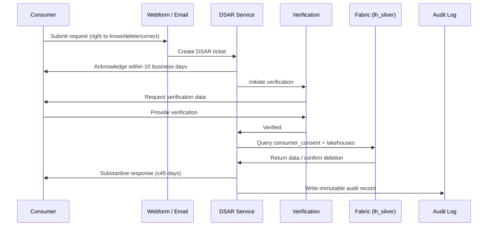

# 🛡️ CCPA / CPRA Privacy Rights Implementation on Microsoft Fabric

<div align="center" markdown>

**California Consumer Privacy Act + California Privacy Rights Act → Fabric Implementation Patterns**


</div>

---

**Last Updated:** `2026-04-27` | **Version:** 1.0.0 | **Wave 5 Feature:** 5.4 | **Anchor:** [SOC 2 Type II](soc2-type2-readiness.md)

> **Disclaimer:** This document provides architectural and technical guidance for implementing CCPA and CPRA consumer privacy rights on Microsoft Fabric. It is **not** legal advice. CCPA/CPRA enforcement is delegated to the California Privacy Protection Agency (CPPA) and California Attorney General; their interpretations evolve. Engage qualified privacy counsel to validate your compliance program. Verify all definitions, thresholds, and timing requirements with current California statute and CPPA regulations before relying on them in production.

---

## 🎯 Overview

The **California Consumer Privacy Act (CCPA)** of 2018, as amended by the **California Privacy Rights Act (CPRA)** effective January 1, 2023, is the most prescriptive U.S. state privacy regime. Unlike GDPR — which is built on lawful-basis-for-processing — CCPA centers on **disclosure, opt-out, and consumer rights**. Both regimes give individuals control over personal information, but the mechanics differ enough that you cannot simply repurpose a GDPR program for California compliance.

### Scope: Who Must Comply

A "business" is subject to CCPA/CPRA if it does business in California, collects (or has collected on its behalf) personal information of California residents, determines purposes/means of processing, **and** meets at least one of:

| Threshold | Detail |
|-----------|--------|
| Annual gross revenue | More than **$25 million** in the prior calendar year |
| Volume | Buys, sells, or shares the PI of **100,000+** California residents or households annually |
| Revenue mix | Derives **50%+** of annual revenue from selling or sharing California residents' PI |

**Special considerations:**

- **Service providers and contractors** inherit obligations through their service agreement (CCPA-required contract terms).
- **B2B exemption sunset:** CPRA removed the temporary B2B and employee exemptions effective January 1, 2023 — employees, applicants, and B2B contacts are now full "consumers" with rights.
- **Non-profits** are generally out of scope unless controlled by a covered for-profit business.
- **HIPAA-covered entities** may be partially exempt for PHI, but non-PHI consumer data is in scope.
- **GLBA / FCRA** preempt for data already covered, but residual data falls under CCPA.

### What This Document Covers

- The seven consumer rights (four original CCPA + three CPRA additions) and how each is implemented in Fabric
- The unique "Do Not Sell or Share" opt-out — including Global Privacy Control (GPC) signal handling
- Sensitive Personal Information (SPI) handling and the "right to limit"
- Data subject access request (DSAR) workflow with 45-day verification + response timing
- Service Provider vs Third Party distinction and contract management
- Multi-state coexistence (CCPA + Virginia VCDPA + Colorado CPA + Connecticut CTDPA + Utah UCPA + Texas TDPSA)
- Coexistence with GDPR (the "stricter rule wins" pattern)

> 📝 **Scope:** This is the CCPA/CPRA implementation deep-dive for Phase 14 Wave 5. For the privacy-by-deletion mirror in EU/UK, see [GDPR Right to Deletion](gdpr-right-to-deletion.md). For the Trust Services Criteria mapping that includes Privacy TSC, see the [SOC 2 anchor](soc2-type2-readiness.md). For data classification and labeling patterns these rights depend on, see [Data Governance Deep Dive](../data-governance-deep-dive.md).

---

## 📋 CCPA vs GDPR

The single largest mistake in U.S. privacy programs is treating CCPA as "GDPR-lite." It is not. The regimes overlap substantially, but the mental models differ.

| Dimension | CCPA / CPRA | GDPR |
|-----------|-------------|------|
| **Legal basis model** | Notice + opt-out (default-on collection) | Lawful basis required (default-off collection) |
| **Territorial trigger** | Doing business in CA + thresholds | Targeting EU/UK data subjects |
| **Who is covered** | California residents (incl. employees, B2B) | EU/UK data subjects |
| **Right to delete** | Yes, with broad business-purpose exceptions | Yes (Article 17), with narrower exceptions |
| **Right to access** | "Right to know" — 12-month lookback default | Full subject access |
| **Right to correct** | CPRA addition | Yes (Article 16) |
| **Right to portability** | Limited (subset of right to know) | Yes (Article 20) |
| **Sale / sharing concept** | Central concept; opt-out required | Not directly equivalent; transfers and sharing handled via lawful basis |
| **Sensitive data** | "Sensitive PI" with right to limit (CPRA) | "Special category" requiring stricter lawful basis |
| **Consent model** | Opt-out for sale/share; opt-in for minors only | Opt-in for any non-essential processing |
| **Verification standard** | "Verifiable consumer request" — specific rules | Reasonable identity verification |
| **Response timing** | 45 days (extendable +45) | 1 month (extendable +2) |
| **Cure period** | 45 days (sunset for systemic violations) | None |
| **Penalties** | $2,500 / $7,500 per violation (intentional or minor) | Up to 4% of global annual turnover |
| **Enforcement** | CA AG + CA Privacy Protection Agency (CPPA) | National DPAs |
| **Private right of action** | Limited — data breach involving specific data only | Member-state dependent |
| **Data Protection Officer** | Not required | Often required (Article 37) |
| **DPIA** | Risk assessments for "significant risk" processing (CPRA regs) | Required for high-risk processing |

> ⚠️ **The biggest practical difference:** CCPA assumes you collect first and let consumers opt out. GDPR assumes you must justify each collection upfront. Your Fabric pipelines must support **both** mental models: tag every record with **lawful basis (GDPR)** AND **opt-out flags (CCPA)**.

---

## ⚖️ The Seven CCPA Consumer Rights

CPRA (effective 2023) added three new rights on top of the four original CCPA rights, for a total of seven.

### 1. Right to Know (CCPA original)

Consumers can request that a business disclose:

| Disclosure | Detail |
|------------|--------|
| Categories of PI collected | Names, identifiers, internet activity, geolocation, biometric, etc. |
| Categories of sources | Directly from consumer, service providers, advertising networks |
| Business or commercial purposes | Why the data was collected |
| Categories of third parties | To whom PI was disclosed or sold |
| Specific pieces of PI | Actual data values held about the consumer (verified request) |

**Default lookback:** 12 months. CPRA: consumers can request data **beyond 12 months** (back to January 1, 2022) unless disproportionately burdensome.

### 2. Right to Delete (CCPA original)

Consumers can request deletion. Exceptions are broad:

- Complete the transaction; provide the requested service
- Detect security incidents; protect against fraud
- Debug to identify and repair errors
- Exercise free speech (yours or another consumer's)
- Comply with legal obligations
- Internal uses reasonably aligned with consumer expectations
- Other internal lawful uses compatible with the context of collection

> The "internal use" exception is broader than GDPR Article 17's exceptions. **Document the specific exception** when refusing a delete request.

### 3. Right to Correct (CPRA addition)

Consumers can request correction of inaccurate PI. Business must use **commercially reasonable efforts** to correct. Mirrors GDPR Article 16.

### 4. Right to Opt-Out of Sale (CCPA original)

Consumers can direct a business not to "sell" their PI. (See [Do Not Sell or Share](#-do-not-sell-or-share) below — "sell" is broader than money exchange.)

### 5. Right to Opt-Out of Sharing for Cross-Context Behavioral Advertising (CPRA addition)

CPRA introduced "share" as a separate concept covering data transfers to third parties for **cross-context behavioral advertising** (i.e., retargeting based on activity across non-affiliated sites). Even if no money changes hands, this disclosure is opt-outable.

### 6. Right to Limit Use of Sensitive Personal Information (CPRA addition)

When a business uses SPI for purposes beyond providing the requested goods/services, consumers can require the business to limit SPI use to the minimum necessary. See [SPI](#-sensitive-personal-information-spi) below.

### 7. Right to Non-Discrimination (CCPA original)

Businesses cannot deny goods/services, charge different prices, provide different quality, or threaten any of the above for exercising rights — except where the difference is **reasonably related to the value provided by the consumer's data**. Loyalty programs are permissible if the structure satisfies the financial-incentive notice requirements (CPRA §1798.125).

---

## 🚫 Do Not Sell or Share

The single most operationally distinct CCPA concept. Get this wrong and the AG will notice.

### The "Sale" Definition (Broad)

Under CCPA, a "sale" is **any transfer of PI to a third party for monetary or other valuable consideration**. This is far broader than literal money exchange. Examples that have been treated as "sales":

- Sharing email lists with a marketing partner in exchange for analytics access
- Allowing an advertising SDK to collect device identifiers in exchange for an ad placement
- Disclosing visitor data to a "data co-op" for mutual benefit

**Not a sale (CCPA exemptions):**

- Disclosure to a **service provider** under a CCPA-compliant service agreement (with required contract terms)
- Disclosure at the consumer's direction
- Sharing among a controlled group of entities under a single brand
- Disclosure of de-identified or aggregate consumer information

### The "Share" Definition (CPRA Addition)

"Share" means disclosing PI to a third party **for cross-context behavioral advertising**, whether or not for monetary consideration. CPRA created this category specifically to capture pixel-tag and SDK data flows that AdTech vendors had argued were not "sales."

### Implementation: Three Required Mechanisms

| Mechanism | Requirement | Implementation |
|-----------|-------------|----------------|
| Conspicuous link | "Do Not Sell or Share My Personal Information" link in homepage footer | Front-end + backend opt-out service |
| Cookie banner | Pre-collection notice with reject option | Consent management platform (CMP) |
| GPC signal | Honor the [Global Privacy Control](https://globalprivacycontrol.org/) HTTP header / DOM signal | Edge function or CDN-level header check |

### Consequences of Opt-Out

When a consumer opts out:

- **Stop selling/sharing** their PI to third parties within 15 business days
- **Notify all third parties** to whom the data was sold/shared in the prior 90 days
- **Maintain the opt-out** for 12 months minimum before asking again
- **Service providers continue to receive data** (they are not third parties)

### Pipeline Implications

Bronze ingestion captures opt-out events. Silver and Gold pipelines that produce data feeding ad networks, analytics co-ops, or third-party marketing destinations **must filter on `opt_out_sale = true` and `opt_out_share = true`**. See [Fabric Implementation](#️-fabric-implementation) below.

---

## 🔐 Sensitive Personal Information (SPI)

CPRA introduced **Sensitive Personal Information** as a sub-category requiring elevated handling.

### Categories of SPI

| Category | Examples |
|----------|----------|
| Government identifiers | SSN, driver's license, passport, state ID |
| Financial account access | Account number with required password/PIN/access code |
| Precise geolocation | Within 1,850 feet (~564 meters) |
| Racial or ethnic origin | Self-reported demographics |
| Religious or philosophical beliefs | Faith affiliation, observance |
| Union membership | Membership status |
| Communications content | Mail, email, text content (excluding intended recipients) |
| Genetic data | DNA, RNA |
| Biometric for unique ID | Fingerprint, faceprint, voiceprint, gait |
| Health information | Medical conditions, diagnoses |
| Sex life or sexual orientation | Sexual practices, orientation |

### Right to Limit Use of SPI

When a consumer invokes the right to limit, the business may **only** use SPI for:

- Performing the services or providing the goods reasonably expected
- Detecting security incidents; resisting malicious activity
- Short-term, transient use including non-personalized advertising
- Performing services on behalf of the business (logging, fulfillment)
- Verifying or maintaining quality / safety of services

Anything beyond — including profiling, model training on SPI, or marketing — must stop within 15 business days of the request.

### Fabric Implementation

| Step | Action |
|------|--------|
| 1. Tag SPI in Purview | Apply sensitivity label `Sensitive Personal Information` |
| 2. Catalog SPI columns | Maintain `lh_silver.sensitive_pi_columns` registry |
| 3. Apply OneLake row filter | Row filter excludes SPI columns when `limit_spi_use = true` |
| 4. Restrict downstream use | Gold pipelines for marketing exclude SPI by default |
| 5. Audit SPI access | Log every SPI column read; sample weekly for review |

---

## 🏗️ Fabric Implementation

The technical core: a single consent registry, gating filters in Silver, and audit evidence in Bronze.

### Consumer Consent Registry

A single canonical table in Silver tracks every California consumer's consent state.

```sql
-- lh_silver.consumer_consent (Delta table, schema-enforced)
CREATE TABLE IF NOT EXISTS lh_silver.consumer_consent (
    subject_id              STRING NOT NULL,    -- canonical consumer ID
    jurisdiction            STRING NOT NULL,    -- 'CA-CCPA', 'EU-GDPR', etc.
    consent_status          STRING NOT NULL,    -- 'active', 'withdrawn', 'pending'
    opt_out_sale            BOOLEAN NOT NULL,   -- §1798.120 right to opt-out of sale
    opt_out_share           BOOLEAN NOT NULL,   -- §1798.120 (CPRA) opt-out of sharing
    limit_spi_use           BOOLEAN NOT NULL,   -- §1798.121 right to limit SPI
    gpc_signal_seen         BOOLEAN NOT NULL,   -- Global Privacy Control header detected
    delete_requested_at     TIMESTAMP,          -- §1798.105 right to delete
    correction_requested_at TIMESTAMP,          -- §1798.106 right to correct (CPRA)
    last_updated            TIMESTAMP NOT NULL,
    source_system           STRING NOT NULL,    -- 'cmp', 'webform', 'gpc', 'agent'
    verification_method     STRING,             -- DSAR verification record
    cure_period_until       TIMESTAMP           -- if remediation in progress
)
USING DELTA
PARTITIONED BY (jurisdiction);
```

**Schema notes:**

- `jurisdiction` allows multi-regime tracking (CA, EU, NY, etc.) without separate tables.
- `gpc_signal_seen` is **separately tracked** because GPC is presumed equivalent to opt-out under CPPA regulations — auditors will ask.
- `cure_period_until` records the 45-day window granted by the AG/CPPA before enforcement.
- Partition by jurisdiction to keep query plans tight.

### Consent Gating in Pipelines

Every Silver and Gold notebook that produces data for downstream sale/sharing **must join against the consent registry and filter**.

```python
from pyspark.sql import functions as F

# Silver-layer pattern: join consent and apply filters before any sharing transformation
consent = spark.table("lh_silver.consumer_consent") \
    .filter(F.col("jurisdiction") == "CA-CCPA") \
    .filter(F.col("consent_status") == "active") \
    .select("subject_id", "opt_out_sale", "opt_out_share", "limit_spi_use", "gpc_signal_seen")

# Source data
events = spark.table("lh_silver.consumer_events_cleansed")

# Apply the joins — left so we keep records, but filter at write
gated = events.join(consent, on="subject_id", how="left") \
    .withColumn("effective_opt_out_sale",
                F.coalesce(F.col("opt_out_sale"), F.lit(False)) | F.coalesce(F.col("gpc_signal_seen"), F.lit(False))) \
    .withColumn("effective_opt_out_share",
                F.coalesce(F.col("opt_out_share"), F.lit(False)) | F.coalesce(F.col("gpc_signal_seen"), F.lit(False)))

# Write to a Gold view that downstream sharing pipelines consume
gated.filter(~F.col("effective_opt_out_sale")) \
     .filter(~F.col("effective_opt_out_share")) \
     .write.format("delta").mode("overwrite").saveAsTable("lh_gold.shareable_events")
```

> 💡 **GPC bias toward consumer:** When in doubt, treat GPC as opt-out. The CA AG has explicitly stated GPC is a valid opt-out signal.

### Opt-Out Propagation Timing

CCPA mandates honoring opt-out within **15 business days** of receipt.

| Step | Target SLA |
|------|------------|
| Consumer submits opt-out via webform / GPC | T+0 |
| Bronze ingestion captures event | T+5 minutes |
| Silver consent registry updated | T+1 hour (incremental refresh) |
| Gold sharing pipelines respect new flag | T+24 hours (next pipeline run) |
| Third-party sub-processors notified | T+15 business days (max) |
| Audit log written | T+0 (synchronous) |

**Wire this as an SLO** — if the pipeline misses 15 business days, you have an enforceable violation. See [SLO/SLI doc](../operations/slo-sli-fabric.md) for SLO patterns.

### Cure Period (CPRA)

Until January 1, 2023, the CCPA had a 30-day cure period for any violation. CPRA **sunset the automatic cure period** but the CPPA may still grant a cure window at its discretion. For CCPA-only violations (still applicable to non-CPRA-amended provisions), the **45-day cure period** applies if you receive a notice from the AG.

Practical implication: track `cure_period_until` per subject affected in a violation; document remediation steps; close out before expiration.

---

## 📨 DSAR Workflow

The Data Subject Access Request (DSAR) workflow under CCPA has specific verification and timing rules that differ from GDPR.

### Verifiable Consumer Request

Three categories defined in the CCPA regulations:

| Request Type | Verification Standard |
|--------------|----------------------|
| Right to know — categories only | Standard verification (e.g., 2 data points matching) |
| Right to know — specific pieces | **Heightened** — high degree of certainty (e.g., 3+ data points + signed declaration under penalty of perjury) |
| Right to delete | Standard verification + confirmation step (e.g., email link confirmation) |
| Right to correct | Standard verification + correction details supplied |
| Right to limit SPI / opt-out | **No verification required** — identity assertion sufficient |

### Response Timing

| Phase | Timing |
|-------|--------|
| Acknowledge receipt | Within **10 business days** |
| Substantively respond | Within **45 calendar days** of receipt |
| Extension permitted | Additional **45 calendar days** with written notice (90 day max) |
| Free of charge | First 2 requests in 12 months free; subsequent may have fee if "manifestly unfounded" |

### Authorized Agents

Consumers may use an authorized agent (a person or business). Verification is layered:

- Verify the consumer (as above)
- Verify the agent has written authorization signed by the consumer
- For specific pieces of PI: notarized power of attorney recommended

### Workflow in Fabric



**Audit record (per request) must capture:**

- Request ID, type, received timestamp
- Consumer identifier (hashed if necessary)
- Verification method + outcome
- Response timestamp + content
- Exception cited (if refused)
- Operator who handled the request

> See [Audit Trail Immutability](audit-trail-immutability.md) for tamper-evident DSAR records.

---

## 📋 Categories Disclosure Requirements

CCPA §1798.130 requires businesses to maintain — and update **at least every 12 months** — a publicly accessible disclosure listing.

### Required Categories Table

For each of the prior 12 months, document:

| Field | Source |
|-------|--------|
| Category of PI collected | Maintained registry (e.g., `lh_silver.pi_categories`) |
| Categories of sources | Directly from consumer; affiliates; data brokers |
| Business / commercial purposes | Mapped from data contracts |
| Categories of third parties | Sub-processor list + advertising disclosure |
| Categories sold or shared | Filtered subset |
| Categories disclosed for business purposes | (Distinct from sales) |

### Implementation as a Managed Table

```sql
CREATE TABLE IF NOT EXISTS lh_silver.pi_categories_disclosure (
    category                    STRING NOT NULL,
    description                 STRING NOT NULL,
    sources                     ARRAY<STRING>,
    business_purposes           ARRAY<STRING>,
    third_party_categories      ARRAY<STRING>,
    sold_or_shared              BOOLEAN,
    disclosed_for_biz_purpose   BOOLEAN,
    last_reviewed               TIMESTAMP NOT NULL,
    next_review_due             TIMESTAMP NOT NULL  -- <= now + 365 days
)
USING DELTA;
```

A scheduled pipeline (`pipelines/categories_review_reminder.py`) alerts the privacy team 30 days before `next_review_due`. This satisfies the **annual update** obligation.

---

## 🚦 GPC and Opt-Out Implementation

Global Privacy Control is a browser-level signal (an HTTP header `Sec-GPC: 1` and DOM property `Navigator.globalPrivacyControl`) that the CA AG has confirmed is a **legally binding opt-out signal**.

### Edge Detection Pattern

GPC must be detected at the **edge** — not deep in the application — so that no logging or pixel-firing happens before the opt-out is applied.

| Layer | Action |
|-------|--------|
| CDN / Front Door | Strip `Sec-GPC: 1` requests of identifying headers; add `X-Privacy-OptOut: 1` for downstream |
| API Gateway | Reject any third-party SDK pixel-firing for these requests |
| Bronze ingestion | Tag event row with `gpc_signal_seen = TRUE`; do not allow downstream sharing |
| Consent registry | Upsert `gpc_signal_seen = TRUE` for `subject_id` if known; for anonymous, attach to session ID |

### When the Subject Becomes Known

If a GPC-flagged anonymous session later identifies (login, conversion), **carry the opt-out forward** to the persistent `subject_id` record. Don't lose the signal at identification time.

```python
# After login event, propagate session GPC opt-out to subject record
def merge_gpc_session_to_subject(session_id: str, subject_id: str) -> None:
    """Merge any GPC signal from anonymous session to identified subject."""
    spark.sql(f"""
    MERGE INTO lh_silver.consumer_consent target
    USING (
        SELECT '{subject_id}' AS subject_id, 'CA-CCPA' AS jurisdiction,
               TRUE AS gpc_signal_seen, current_timestamp() AS last_updated
        FROM lh_bronze.session_gpc_signals
        WHERE session_id = '{session_id}' AND gpc_seen = TRUE
    ) source
    ON target.subject_id = source.subject_id AND target.jurisdiction = source.jurisdiction
    WHEN MATCHED THEN UPDATE SET
        gpc_signal_seen = source.gpc_signal_seen,
        last_updated = source.last_updated
    WHEN NOT MATCHED THEN INSERT *
    """)
```

---

## 🛡️ SPI Limitation Implementation

When a consumer invokes the **right to limit** SPI use, OneLake Security row-level filters keep the data accessible for permitted uses but invisible to broader analytical workloads.

### Step 1: Tag SPI in Purview

Apply Microsoft Purview sensitivity labels at the column level:

- `Sensitive Personal Information - Government ID`
- `Sensitive Personal Information - Health`
- `Sensitive Personal Information - Geolocation Precise`
- `Sensitive Personal Information - Demographics`

### Step 2: Maintain SPI Column Registry

```sql
CREATE TABLE IF NOT EXISTS lh_silver.spi_columns (
    table_name      STRING NOT NULL,
    column_name     STRING NOT NULL,
    spi_category    STRING NOT NULL,    -- maps to CPRA SPI categories
    purview_label   STRING NOT NULL,
    last_validated  TIMESTAMP NOT NULL
)
USING DELTA;
```

### Step 3: Apply OneLake Security Row Filter

```sql
-- OneLake Security row filter: hide SPI column values when limit_spi_use = TRUE
CREATE OR REPLACE FUNCTION lh_silver.fn_filter_spi_limited(subject_id STRING)
RETURNS BOOLEAN
RETURN NOT EXISTS (
    SELECT 1 FROM lh_silver.consumer_consent c
    WHERE c.subject_id = subject_id
      AND c.jurisdiction = 'CA-CCPA'
      AND c.limit_spi_use = TRUE
);

ALTER TABLE lh_silver.consumer_profile_enriched
SET ROW FILTER lh_silver.fn_filter_spi_limited(subject_id) ON (subject_id);
```

### Step 4: Restrict Marketing/Analytics Pipelines

Pipelines flagged as "Marketing" or "Analytics" purposes use a **read-only role** that does not include the **necessary-purpose-bypass** for SPI. Pipelines for fraud detection or service fulfillment use a separate role that does bypass the filter, with logged justification.

See [OneLake Security feature](../../features/onelake-security.md) for label-based row filter patterns.

---

## 🤝 Service Provider vs Third Party

The single most common compliance failure is misclassifying a vendor.

### The Distinction

| Type | Definition | Counts as "Sale"? | Required |
|------|------------|-------------------|----------|
| **Service Provider** | Processes PI on behalf of the business under a written contract with required CCPA terms | **No** | Service provider agreement with all required clauses |
| **Contractor** | Same as service provider but for specific, defined services | **No** | Contractor agreement |
| **Third Party** | Anyone else who receives PI | **Yes** — opt-out applies | Sub-processor list disclosure |

### Required Service Provider Contract Terms

A vendor only escapes "third party" status if the contract:

- Specifies the limited business purposes
- Prohibits selling or sharing the PI
- Prohibits retaining, using, or disclosing PI outside the direct business relationship
- Prohibits combining the PI with PI from other sources (with limited exceptions)
- Requires the vendor to comply with applicable CCPA obligations
- Grants the business audit rights

**If even one clause is missing or weakened, the vendor is a third party** and every disclosure to them is a "sale" requiring opt-out.

### Implementation in Fabric

Maintain a vendor classification registry and a sub-processor list:

```sql
CREATE TABLE IF NOT EXISTS lh_silver.vendor_classification (
    vendor_id           STRING NOT NULL,
    vendor_name         STRING NOT NULL,
    classification      STRING NOT NULL,  -- 'service_provider', 'contractor', 'third_party'
    contract_id         STRING,
    contract_signed_at  DATE,
    contract_expires_at DATE,
    ccpa_clauses_verified BOOLEAN NOT NULL,
    sub_processor_list_published BOOLEAN NOT NULL,
    last_reviewed       TIMESTAMP NOT NULL
)
USING DELTA;
```

Any data export pipeline must check `classification` before delivering PI. If `third_party` and consumer has `opt_out_sale = TRUE`, **block the export**.

---

## 💰 Pricing & Non-Discrimination

CCPA §1798.125 prohibits discrimination against consumers for exercising rights — but allows differential treatment if "reasonably related to the value provided to the business by the consumer's data."

### Permitted

- **Loyalty programs** with financial incentive notice (clear, opt-in)
- **Tiered pricing** based on data volume the consumer chooses to share, if disclosed
- **Free service tiers** with limited data collection, paid tiers with broader collection (must be optional)

### Prohibited

- Denying goods/services to a consumer who exercised rights
- Charging different prices solely because the consumer opted out
- Providing different quality of service solely due to opt-out
- Threatening any of the above
- Coercing consent through "agree or no service" if alternatives are reasonably feasible

### Casino Implementation Specifics

| Scenario | Compliance Position |
|----------|---------------------|
| Free play credits tied to opt-in to data sharing | **Risk** — must satisfy financial incentive notice; opt-in must be revocable |
| Comp tier eligibility based on play data only | **OK** — comps reasonably relate to gaming activity, not consent |
| Comp tier eligibility based on data-sharing consent | **Prohibited** — discrimination violation |
| Loyalty signup requiring opt-in to marketing | **Risk** — separate the loyalty enrollment from marketing opt-in |
| Sweepstakes entry conditional on opt-in to sale | **Prohibited** — coercion |

> 🎰 **Casino practical:** Players' Club tiers (Bronze/Silver/Gold/Platinum) determined by theoretical win, time on device, etc. — these are based on play behavior and are permissible. Marketing list opt-in is a **separate** flag and cannot affect tier benefits.

---

## 🎰 Casino Implementation

### California Player Identification

Capture state-of-residence at enrollment. For each California player, the consent registry record is created automatically with default `opt_out_sale = FALSE`, `opt_out_share = FALSE`, `limit_spi_use = FALSE`.

### Player Privacy Center

A dedicated portal section presents:

| Tile | Purpose |
|------|---------|
| Do Not Sell or Share My Personal Information | Toggle opt-out flags |
| Limit the Use of My Sensitive Personal Information | Toggle SPI limit |
| Request to Know My Personal Information | Initiate right-to-know DSAR |
| Request Correction of My Personal Information | Initiate right-to-correct DSAR |
| Delete My Account and Personal Information | Initiate right-to-delete DSAR |

### Consequences in Casino Pipelines

| Pipeline | When Player Opts Out |
|----------|---------------------|
| Slot telemetry → Players Club tier calculation | **Continues** (necessary business purpose) |
| Player profile → marketing email list | **Stops** if `opt_out_sale` or `opt_out_share` |
| Player behavior → ad-network retargeting | **Stops** if `opt_out_share` or `gpc_signal_seen` |
| AML/CTR/SAR compliance | **Continues** — legal obligation exemption |
| Responsible gaming intervention | **Continues** — protective purpose |
| Geolocation precise → marketing | **Stops** if `limit_spi_use` (geolocation precise is SPI) |

---

## 🏛️ Federal & Multi-State Implementation

CCPA was the first; it is no longer alone. As of 2026, comprehensive state privacy laws operate in:

| State | Statute | Effective | Major Differences from CCPA |
|-------|---------|-----------|------------------------------|
| Virginia | VCDPA | 2023-01-01 | Opt-in for SPI; no private right of action |
| Colorado | CPA | 2023-07-01 | Universal opt-out signal mandated; DPA required for high-risk |
| Connecticut | CTDPA | 2023-07-01 | Similar to CO; cure period sunset 2024 |
| Utah | UCPA | 2023-12-31 | Narrower scope; B2B exemption stays |
| Iowa | ICDPA | 2025-01-01 | More limited rights; no right to correct |
| Texas | TDPSA | 2024-07-01 | "Small business" carve-out; broad definition of PI |
| Indiana | INCDPA | 2026-01-01 | Mirrors Virginia |
| Tennessee | TIPA | 2025-07-01 | Affirmative defense if NIST Privacy Framework adopted |
| Montana | MCDPA | 2024-10-01 | Similar to CT |
| Oregon | OCPA | 2024-07-01 | Includes non-profits; biometric inferences |
| Delaware | DPDPA | 2025-01-01 | 35,000-resident threshold (lower than most) |
| New Hampshire | NHPA | 2025-01-01 | Mirrors CT |
| New Jersey | NJDPA | 2025-01-15 | SPI opt-in; financial incentive limits |
| Maryland | MODPA | 2025-10-01 | Strictest data minimization; SPI sale ban |
| Minnesota | MCDPA | 2025-07-31 | Right to question profiling decisions |
| Rhode Island | RICDPA | 2026-01-01 | Mirrors CT |
| Kentucky | KCDPA | 2026-01-01 | Mirrors VA |

### Multi-State Consent Management

Maintain `jurisdiction` per consent record. Build a **rules engine** that resolves which regime applies for a given subject + activity:

```python
def resolve_applicable_regimes(subject_state: str, activity: str) -> list[str]:
    """Return ordered list of regimes the activity must comply with."""
    regimes = []
    state_to_regime = {
        "CA": "CA-CCPA",
        "VA": "VA-VCDPA",
        "CO": "CO-CPA",
        "CT": "CT-CTDPA",
        # ...
    }
    if subject_state in state_to_regime:
        regimes.append(state_to_regime[subject_state])
    # Sectoral overlays
    if activity in ("hipaa_phi", "ferpa_education", "glba_finance"):
        regimes.append(activity)
    return regimes
```

Apply the **strictest applicable rule** for each operation. If California requires 15-day opt-out propagation but Colorado requires 45 days, propagate within 15.

### Federal Posture

No comprehensive federal privacy law as of 2026. The **American Privacy Rights Act (APRA)** has been proposed but not enacted. Sectoral federal laws (HIPAA, GLBA, FERPA, COPPA) preempt for in-scope data. Plan multi-state CCPA-equivalent compliance as the pragmatic baseline.

---

## 🌍 Doing Both CCPA and GDPR

Most production Fabric workloads handle both California residents and EU/UK data subjects. The compliance strategy is **layered**, not parallel.

### Operating Principle: Stricter Rule Wins

| Topic | CCPA | GDPR | Apply |
|-------|------|------|-------|
| Default for collection | Notice + opt-out | Lawful basis required | **GDPR** (default-off) |
| SPI / Special category processing | Right to limit | Article 9 strict basis | **GDPR** |
| Data subject access response | 45 days | 1 month | **GDPR** (1 month) |
| Sale opt-out | Required | N/A (lawful basis approach) | **CCPA** (add opt-out) |
| Right to correct | Yes (CPRA) | Yes (Art 16) | Either |
| DPIA | Risk assessment (CPRA) | Required for high risk | **GDPR** (DPIA required) |
| Right to portability | Limited | Yes (Art 20) | **GDPR** |
| Cross-border transfer | Not addressed | SCCs / adequacy | **GDPR** |

### Dual Consent Records

The `consumer_consent` table from earlier supports both. The `jurisdiction` partition routes the rules; the `lawful_basis` column (add for GDPR) records the GDPR lawful basis:

```sql
ALTER TABLE lh_silver.consumer_consent ADD COLUMNS (
    lawful_basis        STRING,    -- GDPR: 'consent','contract','legal_obligation','vital','public','legitimate'
    consent_proof_uri   STRING,    -- GDPR: pointer to the consent record
    transfer_mechanism  STRING     -- GDPR: 'sccs','adequacy','derogation' for cross-border
);
```

### Consent Management Platform

A consent management platform (Trust Arc, OneTrust, Osano, Cookiebot, or equivalent) provides:

- IAB TCF v2.2 strings for advertising
- GPC signal handling
- IAB GPP (Global Privacy Platform) signal — emerging multi-state standard
- Per-jurisdiction notice rendering
- Audit-ready opt-out logs

The CMP exports a JSON event stream → Bronze ingestion → consent registry. Treat the CMP as the system of record for **opt-in/opt-out evidence**, even if the canonical consent registry lives in Fabric.

---

## 🚫 Anti-Patterns

| Anti-Pattern | Why It Hurts | What to Do Instead |
|--------------|--------------|---------------------|
| **"GDPR program covers us for CCPA"** | Sale/share concept and SPI right to limit have no GDPR analog; you'll miss the opt-out toggle | Build CCPA-specific opt-out and SPI flows on top of the GDPR foundation |
| **Ignoring GPC signals** | CA AG has confirmed GPC is a binding opt-out — failure is a violation | Detect at edge; honor as opt-out; log evidence |
| **Treating all vendors as "service providers"** | Misclassification turns disclosures into "sales" requiring opt-out | Audit every vendor contract for required CCPA clauses; classify in registry |
| **Allowing tier benefits to depend on data-sharing consent** | §1798.125 discrimination violation | Decouple loyalty/comp tiers from marketing/sale opt-in flags |
| **Storing California precise geolocation without limit toggle** | SPI category — right to limit applies | Apply OneLake row filter when `limit_spi_use = TRUE` |
| **Missing the 15-day opt-out propagation** | Out-of-spec; AG enforcement risk | SLO on opt-out propagation; alert at T+10 days |
| **No annual categories disclosure update** | §1798.130 requires 12-month refresh | Automated reminder; managed table with `next_review_due` |
| **Applying first-request fee** | First 2 requests in 12 months must be free | Track request count per consumer; only fee if "manifestly unfounded" |
| **Verifying low-risk requests too aggressively** | Right to limit / opt-out **does not require** verification — adding it deters legitimate exercise | Match verification to risk: opt-out = none, specific PI = heightened |
| **Letting the sub-processor list go stale** | Required disclosure; AG audit will check | Quarterly review with named owner |

---

## 📋 Implementation Checklist

Before declaring CCPA/CPRA-ready:

- [ ] Scope determination: meet at least one of three thresholds (revenue, volume, mix)
- [ ] B2B and employee data treated as in-scope (post-2023 sunset)
- [ ] Privacy notice published with all CCPA-required disclosures
- [ ] "Do Not Sell or Share My Personal Information" link in homepage footer
- [ ] "Limit the Use of My Sensitive Personal Information" link if SPI is processed for non-essential purposes
- [ ] GPC signal detection at CDN/edge
- [ ] GPC signal honored as binding opt-out
- [ ] Consent management platform integrated
- [ ] `lh_silver.consumer_consent` registry deployed
- [ ] All Silver/Gold sharing pipelines gate on opt-out flags
- [ ] SPI columns labeled in Purview
- [ ] OneLake Security row filters apply for `limit_spi_use = TRUE`
- [ ] DSAR intake form (webform + email) live
- [ ] DSAR ticketing system in place
- [ ] Verification standards documented per request type
- [ ] Authorized agent verification process documented
- [ ] 10-business-day acknowledgment SLA tracked
- [ ] 45-day response SLA tracked with extension protocol
- [ ] First 2 requests/12 months are free
- [ ] Vendor classification registry maintained
- [ ] Every vendor contract verified for CCPA-required service-provider clauses
- [ ] Sub-processor list published and updated quarterly
- [ ] Categories disclosure table maintained with annual refresh reminder
- [ ] Loyalty / financial incentive program complies with §1798.125 notice rules
- [ ] No discrimination based on rights exercise (audit pricing, service quality)
- [ ] Opt-out propagation SLO ≤ 15 business days
- [ ] Multi-state regime resolver in place if applicable
- [ ] Joint CCPA + GDPR consent table schema if EU/UK subjects also handled
- [ ] DSAR audit log immutable and 24+ month retention
- [ ] Privacy team trained on cure period (45-day) response protocol
- [ ] Annual privacy program review on calendar

---

## 📚 References

### CCPA / CPRA Statutes & Regulations

- [California Consumer Privacy Act (CCPA) — CA Civil Code §1798.100 et seq.](https://leginfo.legislature.ca.gov/faces/codes_displayText.xhtml?division=3.&part=4.&lawCode=CIV&title=1.81.5)
- [California Privacy Rights Act (CPRA) — Proposition 24 (2020)](https://oag.ca.gov/system/files/initiatives/pdfs/19-0021A1%20%28Consumer%20Privacy%20-%20Version%203%29_1.pdf)
- [California Privacy Protection Agency (CPPA) Regulations](https://cppa.ca.gov/regulations/)
- [California AG CCPA Resource](https://oag.ca.gov/privacy/ccpa)
- [Global Privacy Control (GPC) Specification](https://globalprivacycontrol.org/)
- [IAB Global Privacy Platform (GPP)](https://iabtechlab.com/gpp/)

### Other State Statutes (Multi-State Reference)

- [Virginia Consumer Data Protection Act (VCDPA)](https://lis.virginia.gov/cgi-bin/legp604.exe?212+ful+CHAP0035)
- [Colorado Privacy Act (CPA)](https://leg.colorado.gov/sites/default/files/2021a_190_signed.pdf)
- [Connecticut Data Privacy Act (CTDPA)](https://www.cga.ct.gov/2022/ACT/PA/PDF/2022PA-00015-R00SB-00006-PA.PDF)
- [Texas Data Privacy & Security Act (TDPSA)](https://capitol.texas.gov/tlodocs/88R/billtext/pdf/HB00004F.pdf)

### Microsoft Resources

- [Microsoft Compliance — CCPA](https://learn.microsoft.com/compliance/regulatory/offering-ccpa)
- [Microsoft Purview Sensitivity Labels](https://learn.microsoft.com/purview/sensitivity-labels)
- [OneLake Security — Row & Column Filters](https://learn.microsoft.com/fabric/onelake/security/onelake-security)
- [Fabric Workspace Identity](https://learn.microsoft.com/fabric/security/workspace-identity)

### Related Wave 5 Docs (this Wave)

- [SOC 2 Type II Readiness (anchor)](soc2-type2-readiness.md)
- [GDPR Right to Deletion (parallel doc)](gdpr-right-to-deletion.md)
- [ISO 27001 Mapping](iso27001-mapping.md)
- [STRIDE Threat Model](threat-model-stride.md)
- [Zero-Trust Blueprint](zero-trust-blueprint.md)
- [Data Exfiltration Prevention](data-exfiltration-prevention.md)
- [Supply Chain Security](supply-chain-security.md)
- [Audit Trail Immutability](audit-trail-immutability.md)

### Related Existing Docs

- [Data Governance Deep Dive](../data-governance-deep-dive.md)
- [Identity & RBAC Patterns](../identity-rbac-patterns.md)
- [OneLake Security Feature](../../features/onelake-security.md)
- [Customer-Managed Keys](../customer-managed-keys.md)
- [Network Security](../network-security.md)
- [SLO/SLI for Fabric](../operations/slo-sli-fabric.md)

### Compliance Templates

- [DSAR Runbook Template](../../compliance-templates/dsar-runbook.md) (Wave 5 batch 5b)
- [CCPA Categories Disclosure Template](../../compliance/gdpr.md) (Wave 5 batch 5b)

---

[⬆️ Back to Top](#️-ccpa--cpra-privacy-rights-implementation-on-microsoft-fabric) | [📚 Security Index](.) | [🏠 Home](../../index.md)
