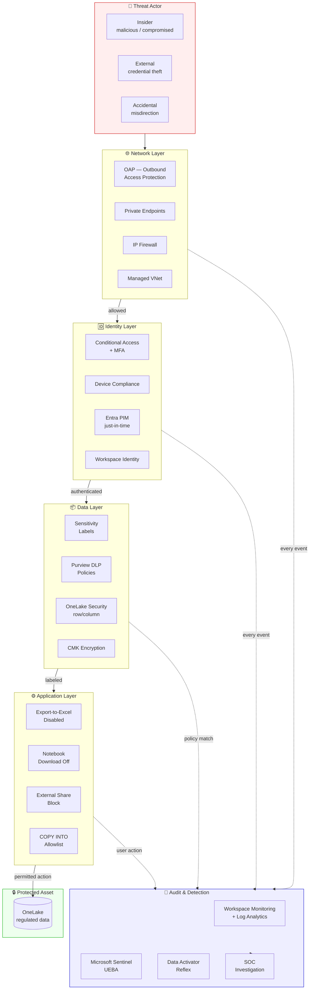

# 🚪 Data Exfiltration Prevention on Microsoft Fabric

<div align="center" markdown>

**Layered Defenses Against Intentional and Accidental Data Egress**


</div>

---

**Last Updated:** `2026-04-27` | **Version:** 1.0.0 | **Anchor:** [SOC 2 Type II Readiness](soc2-type2-readiness.md) (Wave 5)

> **Disclaimer:** This document describes architectural and technical controls to reduce the likelihood and impact of data exfiltration. It is not a guarantee. A determined insider with sufficient privilege can defeat any control. Layered defense, behavior monitoring, and process controls are equally important. Engage your security and legal teams before relying on these patterns in regulated environments.

!!! note "Third-party references — publicly sourced, good-faith comparison"
    This page references non-Microsoft products and services. That information is drawn from each vendor's **publicly available documentation** and is offered for honest, good-faith comparison only. This is a personal project written from a Microsoft Fabric and Azure perspective; it does **not** claim expertise in, or authority over, any third-party product, and nothing here is an official statement by, or endorsed by, those vendors. Capabilities, pricing, and features change often — always verify against the vendor's current official documentation. Where a third-party offering is the stronger choice, we say so plainly.

---

## 🎯 Overview — The Exfiltration Threat Model

**Data exfiltration** is the unauthorized movement of data outside the trust boundary of the organization. Unlike unauthorized access (which is about reading), exfiltration is about taking. It is the dominant cause of regulated-data breaches and the highest-impact failure mode for any analytics platform.

In a Fabric workload, the trust boundary is typically:
- A specific tenant
- A workspace or set of workspaces in a domain
- The customer-controlled storage accounts (CMK-encrypted, OAP-fenced, private-endpoint-isolated)

Anything that crosses that boundary unsupervised is an exfiltration event.

### The Four Threat Personas

| Persona | Motivation | Detection difficulty | Typical vector |
|---------|------------|----------------------|----------------|
| **Insider — malicious** | Resignation, revenge, espionage, financial gain | Hardest (uses legitimate credentials) | Notebook download, Power BI export, COPY INTO to personal storage |
| **Insider — compromised** | Phished credentials, malware on workstation | Hard (legitimate user, abnormal behavior) | API token theft, automated scraping via SSMS or REST |
| **External attacker — gained access** | Any of the above motives, now operating with stolen identity | Medium (often noisy if logging is on) | Bulk download, mirroring abuse, shortcut creation to attacker-controlled storage |
| **Accidental disclosure** | Misdirected email, public bucket, screenshot, lost laptop | Easy if labels/DLP fire — invisible otherwise | Power BI sharing to external email, public OneLake shortcut, unencrypted export |

> Auditors will ask: *"Show me the control that prevents an analyst from copying the player table to their personal OneDrive."* You need an answer for every persona, every vector.

### What "Prevention" Actually Means

True prevention is rare. Realistic goals:

1. **Eliminate the easy path.** No double-clicks should yield a CSV of regulated data.
2. **Add friction.** A user determined to exfiltrate must defeat multiple layers (network, identity, data, app, audit) — each leaving evidence.
3. **Detect within hours, not weeks.** Behavior monitoring + DLP + SIEM correlation.
4. **Minimize blast radius.** Workspace isolation, encryption, sensitivity labels, OneLake row/column controls.
5. **Preserve audit trail integrity.** When (not if) an event happens, you can investigate.

> 📝 **Scope:** This is a Wave 5 deep-dive. Closely related Wave 5 docs: [Zero-Trust Blueprint](zero-trust-blueprint.md), [STRIDE Threat Model](threat-model-stride.md), [Audit Trail Immutability](audit-trail-immutability.md), [SOC 2 Type II Readiness](soc2-type2-readiness.md). Existing dependencies: [OAP](../outbound-access-protection.md), [Network Security](../network-security.md), [Data Governance Deep Dive](../data-governance-deep-dive.md), [OneLake Security](../../features/onelake-security.md).

---

## 🛣️ Exfiltration Vectors in Fabric

The comprehensive list of exfiltration paths a Fabric tenant must consider. Every vector below is real and observed. A program that addresses only some of them has gaps.

| # | Vector | Description | Primary Mitigation | Reference |
|---|--------|-------------|--------------------|-----------|
| 1 | **COPY INTO to external storage** | T-SQL `COPY INTO` from Warehouse / Lakehouse SQL endpoint to attacker-controlled storage account | Workspace-level destination allowlist + OAP | [§ COPY INTO Restrictions](#-copy-into-restrictions) |
| 2 | **Power BI export to Excel/CSV** | Right-click → Export → Excel from any visual or table | Tenant + sensitivity-label disable | [§ Power BI Export](#-power-bi-export-restrictions) |
| 3 | **Notebook .ipynb download** | Download notebook with embedded result data; query a Lakehouse, then save and download | Workspace policy: disable export; cell-output redaction | [§ Notebook Download](#-notebook-download-restrictions) |
| 4 | **Lakehouse Files download** | Drag-drop or "Download" from Files area in Lakehouse explorer | OneLake security RBAC + workspace policy | [OneLake Security](../../features/onelake-security.md) |
| 5 | **Cross-tenant sharing misuse** | "Share" button on a report or item to external Entra tenant | Tenant B2B settings + label-based external block | [§ Cross-Tenant Sharing](#-cross-tenant-sharing-controls) |
| 6 | **OneLake shortcut to external (S3, GCS)** | Create shortcut pointing OUTBOUND to attacker storage; mirroring effect | OAP + connector allowlist | [OAP](../outbound-access-protection.md) |
| 7 | **Mirroring egress** | Configure mirroring from Fabric *to* external Snowflake/etc. (egress mirror) | Disable outbound mirroring; allowlist destinations | [§ OAP Deep Dive](#-oap--outbound-access-protection-deep-dive) |
| 8 | **SQL endpoint client tools** | Connect SSMS, Power BI Desktop, Azure Data Studio to Warehouse SQL endpoint and `SELECT *` | Conditional Access + IP firewall + audit | [Network Security](../network-security.md) |
| 9 | **GraphQL API** | API for GraphQL exposes structured queries; bulk extraction over HTTPS | Throttling + RBAC + query depth limits + audit | [GraphQL feature doc](../../features/api-for-graphql.md) |
| 10 | **Eventstream output to external** | Eventstream destination set to external Event Hub or Kafka | Destination allowlist + workspace policy | [§ OAP Deep Dive](#-oap--outbound-access-protection-deep-dive) |
| 11 | **SHIR pulling on-prem** | Self-hosted Integration Runtime pulls from on-prem source — same SHIR can write to attacker on-prem | Restrict SHIR sinks; pin to managed VNet | [Network Security](../network-security.md) |
| 12 | **Pipeline copy to external sink** | Data pipeline Copy activity with external sink (Blob, S3, REST) | Connection allowlist + OAP egress control | [OAP](../outbound-access-protection.md) |
| 13 | **Email subscriptions** | Power BI subscription to external email with attachment | Tenant-level external email block | [§ Cross-Tenant Sharing](#-cross-tenant-sharing-controls) |
| 14 | **Screenshot / photo of screen** | Out-of-band; cannot be technically prevented end-to-end | Watermarking + workforce policy + DLP camera detection on managed devices | [§ Sensitivity Labels](#️-sensitivity-label-enforcement) |
| 15 | **Print to PDF** | Browser print → save as PDF → exfiltrate via email | Sensitivity label "no print" protection action | [§ Sensitivity Labels](#️-sensitivity-label-enforcement) |
| 16 | **Personal device sync (BYOD)** | Power BI mobile / OneDrive personal | Conditional Access device compliance | [Zero-Trust Blueprint](zero-trust-blueprint.md) |

> ⚠️ **Be honest about scope.** Vectors 14 (camera) and parts of BYOD are organizational/process controls, not technical. Document them in your security awareness training; do not pretend they're solved by a Bicep parameter.

---

## 🛡️ Layered Defense Model

No single control prevents exfiltration. Defense-in-depth places obstacles at the **network**, **identity**, **data**, **application**, and **audit** layers. An attacker must defeat all five to succeed silently.



### Layer Responsibilities

| Layer | Stops | Cannot stop |
|-------|-------|-------------|
| Network | Egress to non-allowlisted destinations; lateral movement to attacker storage | Egress to *allowed* destinations being abused |
| Identity | Unauthenticated access, weak-MFA bypass, non-compliant devices | Legitimate user with legitimate credentials acting maliciously |
| Data | Reading data above clearance; un-labeled exfiltration | User with clearance copying data to allowed channel |
| Application | UI-level export/share buttons | API-level access via approved client tools |
| Audit | Nothing in real time — *detects* after the fact | Sub-second exfiltration of small datasets |

The unique value of layered defense: **no layer is asked to be perfect**, but the *combination* makes silent exfiltration impractical.

---

## 🚧 OAP — Outbound Access Protection (Deep Dive)

OAP is the single highest-leverage technical control for exfiltration prevention. Reference: existing [OAP doc](../outbound-access-protection.md).

### What OAP Blocks

| Outbound flow | Blocked by OAP? |
|---------------|----------------|
| Notebook → unauthorized ADLS Gen2 | ✅ Yes |
| Pipeline copy → unauthorized Blob | ✅ Yes |
| Notebook → personal OneDrive | ✅ Yes |
| Eventstream → external Event Hub (not allowlisted) | ✅ Yes |
| Mirror destination → external Snowflake (not allowlisted) | ✅ Yes |
| User download via UI (Power BI export, notebook download) | ❌ No — that's a UI action, not an outbound network call from the workspace |
| SQL client (SSMS) reading from Warehouse to local disk | ❌ No — endpoint is allowed; client is downstream |
| User screenshot | ❌ No |

> **OAP is a network-egress control.** It prevents *the workspace* from sending data outbound. It does not prevent users with legitimate read access from pulling data through approved client tools.

### Configuration Patterns

The recommended pattern is **default-deny + per-domain allowlist**:

| Workspace | OAP allowlist (storage) | OAP allowlist (cross-workspace) | OAP allowlist (connectors) |
|-----------|-------------------------|----------------------------------|----------------------------|
| `ws_casino_prod` | `stcasinoprod` (RW), `stcasinoarchive` (W) | `ws_shared_gold` (RO) | ADLS Gen2, Eventhouse, Azure SQL |
| `ws_federal_doj` | `stfederaldoj` (RW) | none | ADLS Gen2 only |
| `ws_tribal_health` | `sthealthcareprod` (RW) | **none** | Fabric-native only |
| `ws_dev_sandbox` | `stdevsynthetic` only | `ws_shared_gold` (RO) | broad (synthetic data only) |

### Bicep — OAP Module Reference

```bicep
@description('Workspace ID for OAP target')
param workspaceId string

@description('Approved ADLS Gen2 storage rules')
param storageRules array = [
  {
    storageAccountName: 'stcasinoprod'
    containers: [ 'bronze', 'silver', 'gold' ]
    accessLevel: 'ReadWrite'
  }
]

@description('Approved cross-workspace targets')
param crossWorkspaceRules array = []

@description('Approved external connector types')
param allowedConnectors array = [
  'AzureDataLakeStorageGen2'
  'FabricLakehouse'
  'FabricWarehouse'
  'Eventhouse'
]

resource oap 'Microsoft.Fabric/workspaces/outboundAccessProtection@2026-01-01' = {
  name: '${workspaceId}/default'
  properties: {
    enabled: true
    defaultAction: 'Deny'
    storageRules: storageRules
    crossWorkspaceRules: crossWorkspaceRules
    connectorRules: {
      mode: 'AllowList'
      allowedConnectors: allowedConnectors
    }
  }
}

output oapEnabled bool = oap.properties.enabled
```

### Validation Tests

Every workspace deployment should run an OAP smoke test:

```python
# tests/security/test_oap_egress_block.py
import pytest
from pyspark.sql.utils import AnalysisException

UNAUTHORIZED_PATH = (
    "abfss://exfil@unauthorizedstorage.dfs.core.windows.net/test"
)

def test_oap_blocks_unauthorized_egress(spark):
    """OAP should refuse a write to a non-allowlisted storage account."""
    df = spark.createDataFrame([(1, "synthetic")], ["id", "value"])
    with pytest.raises((AnalysisException, PermissionError)) as exc:
        df.write.format("delta").mode("overwrite").save(UNAUTHORIZED_PATH)
    assert "outbound" in str(exc.value).lower() or "denied" in str(exc.value).lower()

def test_oap_allows_approved_egress(spark, approved_path):
    """OAP should permit writes to allowlisted destinations."""
    df = spark.createDataFrame([(1, "synthetic")], ["id", "value"])
    df.write.format("delta").mode("overwrite").save(approved_path)
    assert spark.read.format("delta").load(approved_path).count() == 1
```

### When OAP Doesn't Help

> ⚠️ **Critical limitation.** OAP secures the *destination* set. It does not stop exfiltration to *allowed* destinations.

A malicious user with write access to `stcasinoprod/bronze` (an OAP-allowed account) can still:
- Copy regulated data into a less-protected container within `stcasinoprod`
- Write to `stcasinoprod` then access it from outside Fabric via the storage's own data plane (if storage RBAC permits)
- Stage data for external retrieval by a separate process they control

OAP must be paired with:
- Storage-account RBAC and private endpoints (data plane locked down)
- OneLake security row/column rules (cannot read what they want to copy)
- Audit log analysis on writes to monitored containers
- DLP policies on outbound files

---

## 📥 COPY INTO Restrictions

### Default Behavior

`COPY INTO` is a Warehouse / SQL endpoint T-SQL statement that bulk-loads from Azure storage. By default, **the destination of a `COPY INTO` is a Warehouse table — not external storage** — so traditional `COPY INTO` is an *ingress* tool, not egress.

The exfiltration risk emerges when:
- Users have permission to **`COPY INTO`-to-external-Warehouse-or-Storage** via the inverse pattern (`CREATE EXTERNAL TABLE AS SELECT`, `OPENROWSET` writes, BCP).
- Users use **`SELECT INTO`** to a remote linked database.
- Users run **PolyBase-style writes** if/when supported.

### Workspace Policy to Restrict Destinations

For Fabric Warehouses, use:
- **OAP** to block writes from Warehouse endpoints to non-allowlisted storage
- **Workspace IP firewall** so the SQL endpoint is reachable only from corporate IPs and Bastion subnets
- **Object-level GRANT/DENY** so only specific service accounts can use `COPY INTO`-style operations

```sql
-- Restrict COPY INTO and bulk-load privileges to a service principal only
DENY ADMINISTER BULK OPERATIONS TO [analyst_role];
DENY ALTER ANY EXTERNAL DATA SOURCE TO [analyst_role];
DENY ALTER ANY EXTERNAL FILE FORMAT TO [analyst_role];

-- Allow read-only on regulated tables; no bulk writes
GRANT SELECT ON SCHEMA::gold TO [analyst_role];
DENY INSERT, UPDATE, DELETE ON SCHEMA::gold TO [analyst_role];
```

### Audit Log Analysis

Every `COPY INTO` and external-table operation appears in the Fabric SQL audit. Monitor for unusual patterns.

```kql
// Detect bulk-load operations to or from external sources
FabricSQLAuditLogs
| where TimeGenerated > ago(24h)
| where StatementType in ("COPY", "BULK INSERT", "EXTERNAL TABLE", "OPENROWSET")
| where StatementText !contains "stcasinoprod"  // exclude approved sources
    and StatementText !contains "stfederalprod"
| project TimeGenerated, UserPrincipalName, WorkspaceName, DatabaseName,
          StatementType, StatementText, RowsAffected, ClientIP
| order by TimeGenerated desc
```

---

## 📤 Power BI Export Restrictions

Power BI's "Export to Excel" / "Export to CSV" is the most common *accidental* and *intentional* exfiltration vector for analytics data. Lock it down by default; allow it only for non-regulated workspaces.

### Tenant-Wide Settings

In the Fabric Admin Portal → **Tenant settings**:

| Setting | Recommended | Rationale |
|---------|-------------|-----------|
| Export to Excel | **Disabled** for `Confidential` and `Highly Confidential` security groups | Default-allow exposes everything |
| Export underlying data | **Disabled** by default; allow per workspace | Underlying = the raw query result, often more than the visual |
| Export reports as PowerPoint / PDF | **Allow** with watermark | Lower-risk than raw data |
| Live connect to dataset from Excel | **Restrict** to corporate-network only | Excel "Analyze in Excel" is essentially unbounded export |
| Print | **Block** for Highly Confidential | Print-to-PDF is exfiltration |

### Sensitivity Labels with Protection

Apply Microsoft Information Protection labels with **encryption + content-marking + access restrictions** to regulated reports.

| Label | Encryption | Watermark | Export | Print | Forwarding |
|-------|------------|-----------|--------|-------|------------|
| Public | none | none | yes | yes | yes |
| Internal | yes (org) | "Internal" footer | yes | yes | inside org only |
| Confidential | yes (org) | watermark | view-only, no Excel | no | no external |
| Highly Confidential — Casino CTR/SAR | yes (named group) | watermark + user identity | view-only, no Excel | no | no |
| Highly Confidential — PHI | yes (named group) | watermark + user identity | view-only, no Excel | no | no |

When a user opens an Excel file that *was* exported (before label tightening), MIP encryption keeps the file readable only to authorized identities — even if it leaves the tenant.

### Persona — BI Consumer View-Only

The standard pattern for casino floor managers, federal field staff, healthcare clinical reviewers:

| Permission | Setting |
|------------|---------|
| Workspace role | `Viewer` only — never `Member` |
| Sensitivity label | Confidential or higher applied at semantic-model level |
| Export | Disabled by tenant + label |
| Subscriptions | Disabled |
| Share with external | Blocked by tenant |
| App ownership | Workspace admin only |

The user can interact with reports and dashboards but cannot move data anywhere.

---

## 📓 Notebook Download Restrictions

A `.ipynb` file with cell outputs can contain thousands of rows of regulated data — a single download can be a major breach.

### Workspace Policy: Disable Download

Configure at workspace level (Settings → Security → Item Export):

| Item type | Recommended |
|-----------|-------------|
| Notebook download (`.ipynb`) | **Disabled** for prod workspaces |
| Notebook download (`.py`) | Allowed (no embedded data) |
| Lakehouse Files download | **Disabled** for regulated containers |
| Workspace export | Admin-only, audit-logged |

### Cell-Output Hygiene

For workspaces where download must be allowed, train and code-review for:

```python
# ❌ Anti-pattern: large display() calls leave regulated data in cell output
display(spark.table("lh_gold.player_master"))

# ✅ Pattern: redacted display
df = spark.table("lh_gold.player_master")
display(df.limit(10).select("player_id", "join_date"))  # exclude PII columns
print(f"row_count={df.count()}")  # aggregate only
```

A pre-commit linter or CI check can flag `display(...)` and `.show()` of tables tagged `Confidential`.

### Workspace Identity for Notebook Execution

Notebooks should authenticate to OneLake and external connectors via **Workspace Identity** (managed identity), not via embedded secrets. This eliminates the "hard-coded SAS token in notebook → leaked notebook → durable credential exposure" path.

```python
# ✅ Workspace Identity — no credential in notebook
from notebookutils import mssparkutils
df = spark.read.format("delta").load(
    "abfss://gold@stcasinoprod.dfs.core.windows.net/player_master"
)

# ❌ Anti-pattern — embedded SAS token, leaks if notebook is downloaded
sas = "?sv=2023-01-01&ss=b&srt=co&sp=rwdlac&se=2026-12-31..."
df = spark.read.format("delta").load(
    f"https://stcasinoprod.blob.core.windows.net/gold/player_master{sas}"
)
```

---

## 🌐 Cross-Tenant Sharing Controls

Cross-tenant B2B sharing is a major exfiltration path because once data crosses tenants, your DLP/labels travel only if MIP encryption is enforced and the receiving tenant honors it.

### Tenant-Level B2B Settings

In Entra ID → External Identities → Cross-tenant access settings:

| Setting | Recommended |
|---------|-------------|
| Default outbound sharing | **Block all**, allowlist by partner tenant |
| Default inbound sharing | **Block all**, allowlist by partner tenant |
| Per-partner outbound | Allow specific Entra tenants of approved partners only |
| Cross-tenant access for Fabric items | Disabled by default; opt-in per workspace by request |
| Per-user external invitation | Restricted to approved roles |

### External User Policy

In Fabric Admin Portal → Tenant settings:

| Setting | Recommended |
|---------|-------------|
| External users in workspaces | Disabled, allowlist by Entra group |
| External user content access | Read-only, no export |
| External user share-back | Disabled |

### Data Residency

Casino, federal, and healthcare workloads frequently have data residency requirements. Cross-tenant sharing can move data to tenants in other regions.

- Pin storage to in-region regions (US Gov for federal)
- Tag workspaces with `dataResidency: us-gov`
- Conditional Access: block sign-in to in-scope workspaces from non-approved geographies
- Sensitivity label: `Region-Locked: US-Only` with named-group encryption

---

## 🔍 DLP Integration (Microsoft Purview)

Microsoft Purview Data Loss Prevention extends content-aware policies to Fabric. Purview DLP can scan content and trigger actions when sensitive patterns are detected.

### Trigger Conditions

Common DLP rules for Fabric:

| Rule | Trigger | Action |
|------|---------|--------|
| Bulk PII | Document or query result with 5+ SSN matches **or** 10+ credit-card matches | **Block** export; notify user; alert SOC |
| HIPAA PHI | Patient-record patterns (MRN + DOB + diagnosis) | **Block** + alert |
| CTR/SAR | Currency Transaction Report identifiers | **Block** + alert + auto-classify Highly Confidential |
| Federal CUI | Controlled Unclassified Information markers | **Block** + alert |
| Source code with secrets | API key, JWT, connection-string patterns | **Warn** + alert |

### Block / Warn / Audit Modes

DLP policies progress through enforcement modes:

| Mode | Use when | Effect |
|------|----------|--------|
| Audit-only | Initial rollout; calibrating false-positive rate | Logs match, takes no other action |
| Warn | Steady state for low-severity rules | Shows policy tip; user can override with justification (logged) |
| Block | High-severity rules in production | Action prevented; user notified; SOC alert |

The recommended path: **deploy in audit-only for 30 days, tune rules, promote to warn for 30 days, then block.**

### DLP Policy Example (Purview)

```yaml
policy:
  name: Casino-Financial-Bulk-PII-Block
  scope:
    fabric_workspaces:
      - ws_casino_prod
      - ws_casino_compliance
  conditions:
    - any_of:
        - sensitive_info_type: U.S. Social Security Number
          min_count: 5
        - sensitive_info_type: Credit Card Number
          min_count: 10
        - keyword_dictionary: ctr_sar_terms
          min_count: 3
  actions:
    - block_export: true
    - block_share_external: true
    - notify_user:
        message: "This dataset contains regulated financial PII and cannot be exported."
    - notify_admin:
        recipients: ["security-ops@contoso.com"]
        severity: high
    - log_event: true
  exceptions:
    - role: "compliance-officer"
      requires_justification: true
```

---

## 🏷️ Sensitivity Label Enforcement

Sensitivity labels are the substrate the entire exfiltration program rides on. Without labels, DLP cannot decide what to protect, and audit cannot determine severity of an event.

### Auto-Labeling

Auto-label policies inspect content and apply a label when patterns match:

| Trigger | Label |
|---------|-------|
| Casino: contains player_id and aggregate amount > $9,999 | Highly Confidential — Casino-Financial |
| Casino: contains player_id alone | Confidential — Casino-PII |
| Federal-DOJ: contains case_id | Highly Confidential — DOJ-Case |
| Tribal Health: contains MRN or ICD-10 | Highly Confidential — PHI |
| SBA: contains borrower_ein and loan_amount | Confidential — SBA-Loan |

### Inheritance Through Medallion

Labels should propagate from raw → curated layers. Configure Purview to enforce inheritance.

```python
# Pseudocode — verify label propagation in CI
def test_label_inheritance():
    bronze_label = purview.get_label("lh_bronze.player_transactions")
    silver_label = purview.get_label("lh_silver.player_transactions_clean")
    gold_label   = purview.get_label("lh_gold.player_kpi")
    # Silver and Gold must be at least as restrictive as Bronze
    assert label_rank(silver_label) >= label_rank(bronze_label)
    assert label_rank(gold_label)   >= label_rank(bronze_label)
```

### Protection Actions

Each label has *content-marking* (visible) and *protection* (cryptographic) settings:

| Label | Watermark | Header/Footer | Encryption | Restrict copy/print | Expiry |
|-------|-----------|---------------|------------|---------------------|--------|
| Public | none | none | none | no | none |
| Internal | none | "Contoso Internal" | org-wide | no | none |
| Confidential | "CONFIDENTIAL — {user}" | yes | named groups | yes | none |
| Highly Confidential | "HIGHLY CONFIDENTIAL — {user} — {date}" | yes | named groups | yes | 30 days |

The user-identity watermark is critical: any screenshot taken of a regulated report can be traced back to the viewer.

---

## 📈 Egress Monitoring

Detection assumes prevention will fail. Monitor for the patterns prevention couldn't stop.

### KQL — Unusual Download Patterns

```kql
// Single user downloading large volume from a Lakehouse in a short window
FabricActivityLogs
| where TimeGenerated > ago(1h)
| where Activity in ("ExportReport", "DownloadFile", "ExportToExcel", "DownloadNotebook")
| extend RowsExported = tolong(coalesce(ActivityDetail.rowCount, "0"))
| summarize TotalRows = sum(RowsExported), Events = count(),
            Items = make_set(ItemName)
    by UserId, WorkspaceName, bin(TimeGenerated, 5m)
| where TotalRows > 10000 or Events > 20
| order by TotalRows desc
```

### KQL — Off-Hours Activity

```kql
// Privileged user activity outside business hours
let business_hours = range(7, 19); // 7am-7pm
FabricActivityLogs
| where TimeGenerated > ago(7d)
| extend HourOfDay = datetime_part("hour", TimeGenerated)
| where HourOfDay !in (business_hours)
| where Activity in ("ExportReport", "ExportToExcel", "DownloadFile",
                     "ShareReport", "CreateShortcut")
| summarize Events = count() by UserId, Activity, bin(TimeGenerated, 1d)
| where Events > 5
| order by Events desc
```

### KQL — First-Time-Download

```kql
// Detect when a user downloads a report for the first time ever
let baseline = FabricActivityLogs
| where TimeGenerated between (ago(180d) .. ago(1d))
| where Activity == "ExportReport"
| distinct UserId, ReportId;
FabricActivityLogs
| where TimeGenerated > ago(1d)
| where Activity == "ExportReport"
| join kind=leftanti baseline on UserId, ReportId
| project TimeGenerated, UserId, ReportId, WorkspaceName
```

### Sentinel Detection Rules

Promote the highest-fidelity KQL queries into Microsoft Sentinel analytic rules:

| Rule | Severity | Threshold | Response |
|------|----------|-----------|----------|
| Bulk-export | High | > 10,000 rows by single user in 1h | Auto-disable session; page SOC |
| Off-hours-export | Medium | privileged user export between 8pm and 6am | Slack to SOC; manual review |
| First-time-export | Low | first export of a report by a user | Audit trail entry; weekly review |
| Cross-tenant-share | High | any share to external tenant on regulated label | Auto-revoke share; page SOC |
| OAP-block-burst | High | > 5 OAP blocks by single user in 1h | Auto-disable session; page SOC |

### Alert Thresholds

> ⚠️ **Tune to your environment.** A 10,000-row threshold may be normal for a finance analyst building a forecast. The threshold matters less than the *delta from that user's baseline*. UEBA does this automatically.

---

## 🕵️ Detective Controls

### User Behavior Analytics (UEBA)

Microsoft Defender for Cloud Apps (MCAS) and Microsoft Sentinel UEBA produce per-user behavioral baselines. Anomalies that warrant alerts:

| Anomaly | Why it matters |
|---------|----------------|
| Activity from new geography | Compromised credential or VPN abuse |
| New device sign-in for privileged user | Initial access of compromise |
| Volumetric anomaly | Bulk download or copy-out |
| Sequence anomaly (e.g., sign-in → broad search → export) | Reconnaissance + exfil pattern |
| Impossible travel | Concurrent compromise |

### Volume-Based Anomaly Detection

Compare each user's *current* hour to their *median* hour over 30 days. Alert when the current hour is > 5x median or > 95th-percentile.

```python
# Concept: per-user export-volume z-score
SELECT user_id, current_hour_rows,
       (current_hour_rows - median_30d_hour) /
       NULLIF(stddev_30d_hour, 0) AS z_score
FROM exfil_baseline
WHERE z_score > 3
   OR current_hour_rows > p95_30d_hour;
```

### First-Time-Download Alerts

When a user opens a report or table they've never accessed before AND immediately exports it, that is a high-fidelity signal even at low volume.

---

## 👁️ Insider Threat Patterns

Insider exfiltration follows known behavioral patterns. Couple HR signals (resignation date, HR-flagged employees) with technical signals where lawful.

### Pre-Resignation Behavior

Common signals in the **30 days before** an insider resigns or is terminated:

| Signal | Detection |
|--------|-----------|
| Increased export volume | Volume anomaly vs. own baseline |
| Off-hours activity | Off-hours KQL |
| Access to data outside role | Access-pattern KQL |
| Bulk creation of subscriptions to personal email | Subscription-creation log filter |
| Shortcut creation to external storage | OneLake shortcut audit |
| First-time access to historically-untouched workspaces | Workspace-access KQL |

> ⚠️ **Legal scope.** Pre-resignation monitoring requires HR partnership, written workforce policy, and (in many jurisdictions) prior notice in employment agreements. Engage legal before deploying.

### Privileged User Oversight

| Role | Oversight |
|------|-----------|
| Workspace Admin | Two-person rule for sensitive operations; weekly access review |
| Tenant Admin | Entra PIM with approval workflow; session recording |
| Service Principal owner | Quarterly attestation; secret rotation; allowlist of permitted operations |
| External vendor admin | Daily activity report to internal sponsor |

### Audit Trail Integrity

If the audit trail can be tampered with by the same insider you're trying to detect, it's not an audit trail. See [audit trail immutability](audit-trail-immutability.md) for:

- Immutable Blob storage (WORM)
- Log forwarding to a separate tenant
- Tamper-evident hashing (cryptographic chain)
- Privileged-access PIM gating around log deletion

---

## 🤝 Vendor / Third-Party Controls

Sub-processors (vendors who process your data) are exfiltration vectors at the contractual layer. Microsoft is one such sub-processor; so are any ISVs you integrate.

### Data Processing Agreement (DPA) Requirements

Every vendor processing regulated data should have:

| Clause | What it provides |
|--------|------------------|
| Purpose limitation | Vendor may use data only for the contracted purpose |
| Sub-processor list | Disclosure of all downstream processors |
| Sub-processor approval | Right to object to new sub-processors |
| Encryption requirements | Specifies algorithms and key management |
| Breach notification | SLA for notification (typically 24-72h) |
| Right to audit | Reserved right to audit vendor controls |
| Data return / destruction | At contract end, data returned and destroyed; written attestation |
| Region constraints | Where data may be processed and stored |

### Sub-Processor Management

Maintain a register of every vendor with access to regulated data:

| Vendor | Service | Data accessed | DPA on file | SOC 2 Type II | Last review |
|--------|---------|---------------|-------------|----------------|-------------|
| Microsoft | Fabric platform | All | Yes | Yes | 2026-01 |
| Snowflake (mirror dest) | Read-only mirror | Gold aggregates | Yes | Yes | 2026-02 |
| ISV-X | Reporting connector | Read-only Confidential | Yes | Type I | 2026-02 |

### Right to Audit

For high-criticality vendors, exercise the audit clause periodically — even just a documentation review counts. Auditors will ask for evidence that this was done.

---

## 🎰 Casino Implementation

The casino domain handles **NIGC MICS** financial-reporting data, player PII, and CTR/SAR records. Exfiltration concerns:

| Data | Sensitivity | Exfil concern |
|------|-------------|----------------|
| Slot floor telemetry | Internal | Operational; low regulatory risk |
| Player loyalty / PII | Confidential | Identity-theft risk; reputational |
| Player gambling pattern | Confidential | Regulatory + reputational |
| CTR/SAR financial reports | **Highly Confidential** | Federal Title 31 (BSA/AML); legal exposure |
| W-2G filings | Confidential | IRS reporting accuracy |

### Casino Configuration

| Control | Setting |
|---------|---------|
| OAP | Enabled. Allow `stcasinoprod`, `stcasinoarchive`. Cross-workspace `ws_shared_gold` (RO). |
| Sensitivity labels | All player PII auto-labeled Confidential; CTR/SAR auto-labeled Highly Confidential |
| Power BI export | **Disabled** for `ws_casino_compliance`; **enabled with audit** for `ws_casino_analytics` (non-PII aggregates) |
| Notebook download | **Disabled** for `ws_casino_compliance` and `ws_casino_prod` |
| Cross-tenant share | Blocked at tenant level; CTR/SAR labeled to require named-group encryption |
| DLP | Bulk-PII rule: 5+ SSN match → block. CTR-keyword: 3+ → block. |
| Floor staff role | Viewer-only; no export; no print; mobile-app device-compliance required |

### Floor Staff: Zero Download Capability

The casino floor manager and surveillance team need real-time visibility but **zero download capability**. The pattern:

| Layer | Setting |
|-------|---------|
| Workspace role | Viewer |
| Sensitivity label | Internal (operational only) — no PII in their reports |
| Export to Excel | Disabled (label) |
| Print | Disabled (label) |
| Subscriptions | Disabled (tenant) |
| Device | Conditional Access requires compliant managed device |
| Network | Conditional Access requires casino-floor IP range |

---

## 🏛️ Federal Implementation

### DOJ — Restricted Access, No Export

| Control | Setting |
|---------|---------|
| Workspace | `ws_federal_doj` only |
| OAP | Allow `stfederaldoj` only; no cross-workspace |
| Sensitivity label | All case data Highly Confidential — DOJ-Case (named-group encryption) |
| Power BI export | Disabled |
| Notebook download | Disabled |
| Connector allowlist | ADLS Gen2 only |
| Conditional Access | Federal-managed device + Gov network |

### Tribal Health — HIPAA, Encryption + Watermark on Every Export

| Control | Setting |
|---------|---------|
| Workspace | `ws_tribal_healthcare` |
| OAP | Allow `sthealthcareprod` only; cross-workspace = none |
| Sensitivity label | All PHI auto-labeled Highly Confidential — PHI |
| Power BI export | Disabled by default. When exception is approved (research use), MIP encryption mandatory + watermark with user identity + 7-day expiry |
| Notebook download | Disabled |
| DLP | PHI-pattern rule: block + alert |
| Audit retention | 6 years (HIPAA) |
| Business Associate Agreement | On file with Microsoft and any sub-processors |

### SBA — Borrower PII, Opt-In for Sharing

| Control | Setting |
|---------|---------|
| Workspace | `ws_federal_sba` |
| OAP | Allow `stfederalprod/sba` only |
| Sensitivity label | Borrower data Confidential — SBA-Loan |
| Power BI export | Aggregates allowed; row-level borrower data blocked by DLP |
| Cross-agency share | Opt-in per-borrower consent flag in source data; default no-share |
| Audit | All access to borrower-PII rows logged with purpose-of-access |

### USDA, NOAA, EPA, DOI — Tiered

| Agency | Notable nuance |
|--------|----------------|
| USDA | Producer survey responses are confidential by statute; aggregate publication only |
| NOAA | Most data is public; protect business email and internal personnel data |
| EPA | Enforcement-related data Highly Confidential; publication data Internal |
| DOI | Tribal-trust resource data Highly Confidential; cultural-resource data restricted |

---

## 🚫 Anti-Patterns

| Anti-Pattern | Why It Hurts | What to Do Instead |
|--------------|--------------|--------------------|
| **Relying solely on RBAC** | RBAC controls *access*, not *egress*. A user with read access can still exfiltrate. | Layer OAP + DLP + sensitivity labels on top of RBAC |
| **Allowlisting "all internal storage"** | Insider can stage to an under-monitored internal account, then retrieve from outside Fabric | OAP allowlist must be specific accounts + containers, not wildcards |
| **Audit-only DLP forever** | Audit tells you what happened — doesn't stop it | Promote to warn within 30 days, block within 60 |
| **No sensitivity labels** | DLP and audit cannot prioritize; everything is "data" | Roll out labels before DLP; auto-labeling for known patterns |
| **Power BI export enabled tenant-wide** | The default-allow option for the most common exfil vector | Default-deny; allow per-workspace by request |
| **Notebook download enabled in regulated workspaces** | A single download = thousands of rows of data leakage | Disable at workspace policy; enforce in CI |
| **Storage SAS tokens in notebooks** | Notebook leak = durable credential leak | Workspace Identity only |
| **Cross-tenant sharing default-allow** | One click can move data to a tenant outside your control | Default-deny; allowlist by partner with DPA |
| **No off-hours / volume monitoring** | Bulk-exfil events look like normal sessions in real time | UEBA + KQL alerts on behavior anomalies |
| **Audit logs stored in same workspace as data** | Insider with workspace admin can erase their tracks | Forward to immutable storage in a separate trust boundary |
| **Treating OAP as a checkbox** | "OAP is on" is meaningless if everything is allowlisted | OAP rule review quarterly; default-deny posture verified |

---

## 📋 Implementation Checklist

Before declaring "Data Exfiltration Prevention ready":

### Network Layer
- [ ] OAP enabled on every regulated workspace with default-deny
- [ ] OAP allowlists reviewed quarterly with named owner
- [ ] OAP smoke test passes in CI for every workspace deployment
- [ ] Private Endpoints configured for all storage accounts
- [ ] Workspace IP firewall restricts to corporate ranges
- [ ] Managed VNet integrated where applicable

### Identity Layer
- [ ] Conditional Access enforces MFA for all users
- [ ] Conditional Access enforces compliant managed device for regulated workspaces
- [ ] Entra PIM gates privileged access (just-in-time)
- [ ] Workspace Identity used for service-to-service authentication
- [ ] Quarterly access review process running
- [ ] B2B cross-tenant access default-deny with allowlist

### Data Layer
- [ ] Sensitivity labels deployed (Public, Internal, Confidential, Highly Confidential)
- [ ] Auto-labeling rules in place for casino PII, CTR/SAR, PHI, federal CUI
- [ ] Label inheritance verified through medallion (CI test)
- [ ] CMK enabled for storage with rotation policy
- [ ] OneLake security row/column controls in place for confidential tables
- [ ] DLP policies promoted past audit-only mode

### Application Layer
- [ ] Power BI export disabled tenant-wide for Confidential and above
- [ ] Notebook download disabled in regulated workspaces
- [ ] Lakehouse Files download disabled in regulated containers
- [ ] Print and forwarding restrictions on Highly Confidential labels
- [ ] Power BI subscription to external email blocked
- [ ] Cross-tenant sharing blocked by tenant policy

### Audit & Detection Layer
- [ ] Workspace Monitoring enabled with ≥ 12-month retention
- [ ] Log Analytics retention ≥ 12 months for regulated workspaces (≥ 6 years for HIPAA)
- [ ] Sentinel UEBA enabled
- [ ] Sentinel analytic rules: bulk-export, off-hours, first-time-download, cross-tenant-share, OAP-block-burst
- [ ] Data Activator Reflex on OAP block bursts
- [ ] Logs forwarded to immutable storage in a separate trust boundary
- [ ] [Audit trail immutability](audit-trail-immutability.md) controls implemented

### Process & Governance
- [ ] Pre-resignation monitoring policy reviewed by legal
- [ ] Sub-processor register current with DPAs on file
- [ ] DLP false-positive review monthly
- [ ] Insider-threat tabletop exercise run annually
- [ ] Workforce security awareness training completed
- [ ] Exfiltration-incident runbook current and tested

---

## 📚 References

### Microsoft Resources
- [Outbound Access Protection (Fabric)](https://learn.microsoft.com/fabric/security/outbound-access-protection)
- [Microsoft Purview Data Loss Prevention](https://learn.microsoft.com/purview/dlp-learn-about-dlp)
- [Sensitivity Labels in Fabric](https://learn.microsoft.com/fabric/governance/information-protection)
- [OneLake Security Overview](https://learn.microsoft.com/fabric/onelake/security/onelake-security)
- [Microsoft Defender for Cloud Apps (UEBA)](https://learn.microsoft.com/defender-cloud-apps/anomaly-detection-policy)
- [Microsoft Sentinel UEBA](https://learn.microsoft.com/azure/sentinel/identify-threats-with-entity-behavior-analytics)
- [Conditional Access Documentation](https://learn.microsoft.com/entra/identity/conditional-access/overview)
- [Cross-tenant access settings](https://learn.microsoft.com/entra/external-id/cross-tenant-access-overview)

### Industry & Standards
- [NIST SP 800-53 — AC-4 Information Flow Enforcement](https://csrc.nist.gov/publications/sp800)
- [HIPAA Security Rule — 45 CFR §164.312](https://www.hhs.gov/hipaa/for-professionals/security)
- [FedRAMP Moderate Baseline](https://www.fedramp.gov)
- [NIGC MICS Standards](https://www.nigc.gov/commission/mics)
- [Title 31 BSA — Currency Transaction Reports](https://www.fincen.gov/resources/statutes-regulations/bank-secrecy-act)

### Related Wave 5 Docs
- [SOC 2 Type II Readiness](soc2-type2-readiness.md) — Wave 5 anchor
- [Zero-Trust Blueprint](zero-trust-blueprint.md)
- [STRIDE Threat Model](threat-model-stride.md)
- [Audit Trail Immutability](audit-trail-immutability.md)
- [GDPR Right to Deletion](gdpr-right-to-deletion.md)
- [CCPA Privacy Rights](ccpa-privacy-rights.md)
- [ISO 27001 Mapping](iso27001-mapping.md)
- [Supply Chain Security](supply-chain-security.md)

### Related Existing Docs
- [Outbound Access Protection](../outbound-access-protection.md)
- [Network Security](../network-security.md)
- [Customer-Managed Keys](../customer-managed-keys.md)
- [Data Governance Deep Dive](../data-governance-deep-dive.md)
- [Identity & RBAC Patterns](../identity-rbac-patterns.md)
- [SQL Audit Logs Compliance](../sql-audit-logs-compliance.md)
- [OneLake Security (feature)](../../features/onelake-security.md)

---

[⬆️ Back to Top](#-data-exfiltration-prevention-on-microsoft-fabric) | [📚 Security Index](.) | [🏠 Home](../../index.md)
