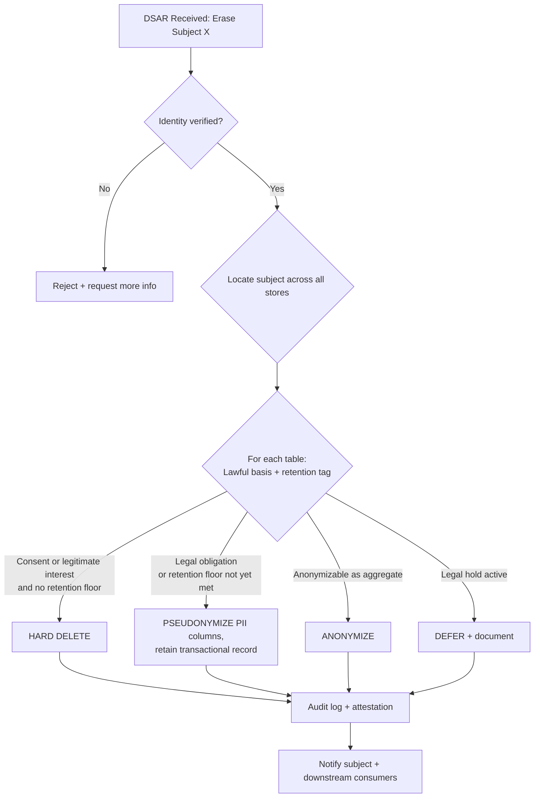
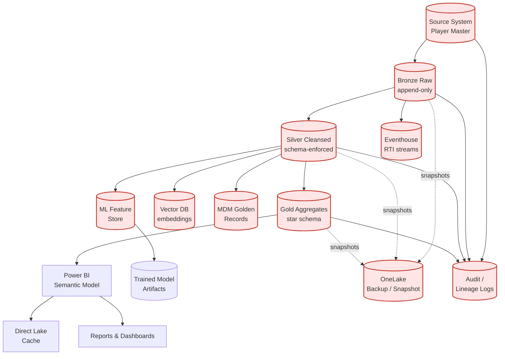

# 🗑️ GDPR Right to Deletion (Right to be Forgotten) on Microsoft Fabric

<div align="center" markdown>

**Article 17 GDPR — Erasure Cascade Across Bronze / Silver / Gold / Eventhouse / Power BI / Backups**


</div>

---

**Last Updated:** `2026-04-27` | **Version:** 1.0.0 | **Companion to:** [SOC 2 Type II Readiness](soc2-type2-readiness.md) (Wave 5 anchor)

> **Disclaimer:** This document provides architectural and technical guidance for implementing GDPR Article 17 ("Right to Erasure" / "Right to be Forgotten") on Microsoft Fabric. It is **not** legal advice. GDPR application is fact-specific — consult qualified privacy counsel for the lawful basis, exemptions, retention obligations, and cross-border implications that apply to your organization. Where this document refers to retention obligations (e.g., BSA, HIPAA, Privacy Act), those references are illustrative; verify with regulatory counsel before relying on them.

---

## 🎯 Overview

GDPR Article 17 — the "Right to Erasure" — is widely considered the **single hardest data engineering problem** privacy law has produced. The challenge isn't deleting one record. It's deleting **every reference** to a person across:

- The source-of-record system
- Bronze raw ingestion
- Silver cleansed/conformed tables
- Gold aggregates and KPIs
- Power BI semantic models and Direct Lake caches
- Eventhouse / KQL streaming stores
- Vector embeddings in RAG/AI features
- ML training datasets and feature stores
- MDM golden records that consolidated identity from this subject
- Backups (operational + disaster recovery)
- Audit logs and lineage telemetry

…**while preserving** records you are legally required to retain (BSA, HIPAA, SOX, Privacy Act, sector-specific). And while producing an attestation defensible to a regulator.

### Why This Document Exists

| Pressure | Detail |
|----------|--------|
| Regulatory exposure | GDPR fines up to 4% of global turnover; CCPA/CPRA mirrors many duties |
| Operational complexity | Subject identifiers fan out across 10+ stores in a typical lakehouse |
| Conflicting obligations | Compliance retention (e.g., 5-year BSA) vs. erasure right |
| Backup paradox | You may not be able to delete an immutable backup, but you must on restore |
| ML / AI risk | Training data and embeddings carry the subject forward unless explicitly handled |
| Auditability | Regulator will ask: "prove the data is gone" |

### What This Document Covers

- The legal frame (Article 17 text, lawful bases, exemptions)
- The technical cascade pattern in Fabric (Bronze → Silver → Gold → BI → Eventhouse → Backups)
- Pseudonymization vs anonymization vs hard deletion — when to use each
- A reference DSAR workflow with PySpark subject-locator and deletion-executor notebooks
- Verification queries and audit-log schemas
- Casino and federal-domain implementations

> 📝 **Scope:** This is a Phase 14 Wave 5 doc. It mirrors the [SOC 2 Type II](soc2-type2-readiness.md) anchor style. The DSAR runbook template lands in batch 5b at `docs/compliance-templates/dsar-runbook.md`.

---

## 📜 Article 17 — What It Requires

GDPR Article 17(1) gives a data subject the right to obtain erasure of their personal data **without undue delay** when at least one of these grounds applies:

| Ground | Plain English |
|--------|----------------|
| **(a)** | The data is no longer necessary for the original purpose |
| **(b)** | The subject withdraws consent (and consent was the lawful basis) |
| **(c)** | The subject objects under Article 21 and there is no overriding legitimate ground |
| **(d)** | The data was processed unlawfully |
| **(e)** | Erasure is required for compliance with Union or Member State law |
| **(f)** | The data was collected from a child under Article 8(1) |

Article 17(2) extends the duty: where the controller has **made the data public**, it must take "reasonable steps, including technical measures" to inform other controllers processing it that erasure has been requested.

### Timing — "Without Undue Delay"

In practice, regulators interpret this as **30 days from request**, extensible by 60 additional days for complex cases (mirroring Article 12(3)). Build to a 30-day SLA; budget a 90-day worst case.

### What It Doesn't Require

- **Forensic erasure** (e.g., overwriting bits with random data) is not generally required for ordinary commercial data — logical deletion plus reasonable backup-rotation policy is sufficient.
- **Immediate erasure from backups** — most DPAs accept that backups will catch up at the next rotation, provided restored data is re-deleted.
- **Erasure when an exemption applies** — see [Exemptions](#️-erasure-exemptions--what-you-dont-have-to-delete) below.

---

## ⚖️ The Six Lawful Bases & When Erasure Applies

GDPR Article 6 enumerates six lawful bases for processing. Whether erasure can be invoked depends on which basis the original processing relied on.

| Lawful Basis (Article 6) | Can Subject Demand Erasure? | Notes |
|--------------------------|------------------------------|-------|
| **(a) Consent** | ✅ Yes — withdrawal of consent | Strongest erasure right; withdrawal must be as easy as giving |
| **(b) Contract** | ⚠️ Conditional — only after contract concluded | Active obligations may bar erasure |
| **(c) Legal obligation** | ❌ No — exempt under Article 17(3)(b) | E.g., tax records, BSA |
| **(d) Vital interests** | ⚠️ Conditional — extremely narrow | Life-or-death emergency processing |
| **(e) Public task / official authority** | ❌ Generally no — exempt under 17(3)(b) | E.g., federal agency statutory data |
| **(f) Legitimate interests** | ✅ Yes — but balancing test on objection | Article 21 objection triggers re-balancing |

> 🧩 **Implementation rule:** Tag every dataset with its **lawful basis at ingestion** so the DSAR pipeline can decide automatically which records are erasable vs exempt. Without this metadata, every DSAR becomes a manual legal review.

```yaml
# Example dataset metadata tag
dataset: bronze_loyalty_signups
domain: casino
lawful_basis: consent
purpose: marketing_communication
retention_default_days: 1095
erasure_exemption: none
notes: "Subject can withdraw consent any time; cascade-delete on DSAR."

dataset: bronze_ctr_filings
domain: casino
lawful_basis: legal_obligation
purpose: bsa_compliance
retention_default_days: 1825   # 5 years
erasure_exemption: bsa_31_cfr_1010
notes: "Pseudonymize identity columns on DSAR; retain transactional record."
```

---

## 🛡️ Erasure Exemptions — What You Don't Have To Delete

Article 17(3) lists situations where the erasure right does **not** apply. The most operationally relevant:

### 1. Compliance Retention (Article 17(3)(b))

Data the controller is legally required to retain. Examples relevant to this project:

| Domain | Regulation | Retention Floor |
|--------|------------|-----------------|
| Casino | BSA / 31 CFR 1010 (CTR, SAR) | 5 years |
| Casino | IRS W-2G (jackpot reporting) | 4 years |
| Healthcare (Tribal) | HIPAA 45 CFR 164.530(j) | 6 years |
| SBA | Privacy Act + SBA loan retention | 6-30 years (loan-type dependent) |
| Federal generally | Records Schedule (NARA-approved) | Varies |
| Tax / SOX | IRC + SOX 802 | 7 years |

> ⚠️ **Pattern:** Don't delete — **pseudonymize** identity columns and retain the transactional record. The subject-identifying value is replaced with a salted irreversible token; the financial event remains for the regulator.

### 2. Legal Claims (Article 17(3)(e))

Data needed for the establishment, exercise, or defense of legal claims. Practically: if there's pending or reasonably anticipated litigation involving the subject, place data on **legal hold** and decline erasure with documented reason.

### 3. Public Interest Archiving / Research (Article 17(3)(d))

Data archived "in the public interest, scientific or historical research, or statistical purposes" where erasure would render impossible or seriously impair the objective. This is narrow; do not over-claim.

### 4. Freedom of Expression and Information (Article 17(3)(a))

Editorial / journalistic content is exempt. Rare in lakehouse contexts.

### 5. Public Health / Public Interest (Article 17(3)(c))

Health data processed for public health under Article 9(2)(h) or (i). Rare in commercial settings.

### Decision Matrix



---

## 🔗 The Cascade Problem

A single PII attribute (e.g., `player_id` or `loyalty_email`) is referenced — directly or transitively — across the entire lakehouse and adjacent stores. Erasure must follow every reference.



Each red node potentially holds the subject's data and **must** be addressed by the erasure cascade — through deletion, pseudonymization, or documented exemption.

> 🔑 **Cross-references:**
> - MDM golden-record fan-out: see `docs/best-practices/data-management/master-data-management.md` (Wave 3, landing in batch 3b)
> - Idempotent merge patterns underpinning safe deletion: see `docs/best-practices/data-management/late-arriving-data.md` (Wave 3)
> - Cascade incident response (procedure twin): see `docs/runbooks/data-quality-incident.md` (Wave 1)

---

## 🧾 DSAR Workflow End-to-End

A Data Subject Access Request (DSAR) — including erasure requests — follows a predictable lifecycle. Build the lifecycle into automation; never run ad-hoc deletions.

### Stage 1 — Intake

| Channel | Implementation |
|---------|----------------|
| Web form | Power Apps form posting to a Dataverse / SharePoint list |
| Email | Dedicated mailbox `dsar@` routed to ticketing system |
| Postal | Manual ticket creation by Privacy Office |
| In-app | Account settings link triggering API call |

The intake record captures: requester name, claimed identity, contact channel, request type (access / rectification / **erasure** / portability / objection / restriction), date received.

### Stage 2 — Identity Verification

Article 12(6) permits requesting additional information to confirm identity. Verify before processing — an erroneous deletion of the wrong person's data is itself a breach.

| Risk Level | Verification Approach |
|------------|------------------------|
| Low (anonymous user, low data sensitivity) | Email confirmation + secret link |
| Medium (logged-in account) | Authenticated session + step-up MFA |
| High (financial, health) | Government ID + knowledge-based auth |

### Stage 3 — Locate the Subject

Run the **subject locator** notebook (see [Implementation in Fabric](#️-implementation-in-fabric) below) to enumerate every table and row referencing the subject across all sources. Output is a **subject inventory**.

### Stage 4 — Determine Exemptions

For each table in the inventory, look up its lawful basis and retention tag (from dataset metadata). Classify each row as:

- `HARD_DELETE` — no exemption
- `PSEUDONYMIZE` — retention floor active; replace identity columns
- `DEFER` — legal hold; document and revisit
- `ANONYMIZE` — convert to non-identifying aggregate

Privacy Office reviews and signs off on the exemption map before execution.

### Stage 5 — Execute Cascading Deletion

Run the **deletion executor** notebook with the approved exemption map. Each table is processed in dependency order (Gold → Silver → Bronze, then downstream Power BI / Eventhouse / Vector / ML).

### Stage 6 — Notify Upstream / Downstream Consumers

Article 17(2) — where the data was disclosed to other controllers, take reasonable steps to notify them. Maintain a **disclosure register** per dataset.

### Stage 7 — Provide Attestation to Subject

Within 30 days (extendable to 90), provide a written response to the subject including:

- Confirmation of completion (or refusal with reason)
- Categories of data deleted
- Categories retained under exemption (with citation)
- Right to lodge complaint with supervisory authority

### Stage 8 — Audit Log the Event

Persist an immutable record (see [Audit Logging](#-audit-logging-the-deletion)). The audit log is the controller's evidence of compliance.

---

## 🪜 Cascade Deletion Pattern in Fabric

Apply layer-specific patterns. The cascade is **not** a single SQL statement — it's a coordinated sweep.

### Bronze Layer

| Erasure Class | Action |
|----------------|--------|
| Non-retained | `DELETE FROM lh_bronze.t WHERE subject_id = ?` |
| Retained (compliance floor) | `UPDATE` to replace identity columns with salted hash; preserve transactional values |

Bronze is append-only by convention but **Delta supports `DELETE` and `MERGE`** — use them. After deletion, run `OPTIMIZE` and `VACUUM` (with retention threshold > 7 days for Time Travel safety, or shorter with `spark.databricks.delta.retentionDurationCheck.enabled=false` only when DPA-approved) so deleted bytes are physically reclaimed.

### Silver Layer

Idempotent `MERGE` deletion. Idempotency matters because DSAR reruns on backup restore should be safe.

```sql
MERGE INTO lh_silver.player_dim AS tgt
USING (SELECT :subject_id AS subject_id) AS src
ON tgt.player_id = src.subject_id
WHEN MATCHED THEN DELETE;
```

### Gold Layer

Aggregates are **derived**. Two strategies:

1. **Recompute** — re-run the Gold notebook for the affected partition(s) after Silver deletion. Cleanest; preferred when partition is small.
2. **Adjust in place** — subtract the subject's contribution. Avoid unless aggregates are append-only sums and the subject's contribution is logged.

Recommended: **always recompute**. Operating on partitioned aggregates makes recompute cheap.

### Power BI Semantic Model

| Component | Action |
|-----------|--------|
| Direct Lake model | Refresh after Gold reprocess; cache invalidates automatically |
| Import model | Schedule refresh (or trigger on-demand) |
| Cached visuals | XMLA `clearCache` if stale tile risk |
| Paginated reports | No cache; refreshes on view |

### Eventhouse (KQL)

```kusto
.delete table StreamingPlayerEvents records 
  <| StreamingPlayerEvents | where player_id == "abc123"
```

> ⚠️ Eventhouse `.delete` is async — verify completion via `.show operations` before declaring the cascade complete.

### Backups

Most operational backups (OneLake snapshots, geo-redundant storage) are **immutable by design**. Approach:

| Strategy | Detail |
|----------|--------|
| **Roll-forward** | Document RPO; deletes propagate as backups age out (typical 30-90 days) |
| **Restore-then-delete** | If a backup is restored during the retention window, immediately re-run the deletion executor against the restored state |
| **Encrypted at the subject** (advanced) | Per-subject encryption key destroyed on DSAR; backup remains but cyphertext is unrecoverable |

Most regulators accept roll-forward. Document the policy in the privacy notice.

### Audit Logs

**Keep** — they are the legal evidence that the deletion occurred. Article 5(2) accountability principle requires the controller to demonstrate compliance.

But — **redact the personal payload** within the audit record. Store `subject_id_hash` (salted SHA-256) instead of the raw identifier. The audit proves "deletion of subject hash X completed at time T," which is sufficient.

---

## 🎭 Pseudonymization vs Anonymization vs Deletion

These three are not interchangeable. Pick the right one per context.

| Technique | What Happens | Reversible? | Still Personal Data Under GDPR? | When To Use |
|-----------|--------------|-------------|----------------------------------|-------------|
| **Deletion** | Row removed | No | N/A — record gone | No retention obligation; subject withdrew consent |
| **Pseudonymization** | Identifier replaced with token (often salted hash or surrogate ID) | Potentially (if mapping kept) | **Yes** — still personal data | Compliance retention required (BSA, HIPAA); aggregate analytics |
| **Anonymization** | Data transformed so re-identification is "reasonably impossible" | No | **No** — outside GDPR scope | Long-term research; statistical aggregates |

### Pseudonymization Pattern

```python
import hashlib, os

def pseudonymize(subject_value: str) -> str:
    """Salted SHA-256. Salt MUST be in env var, not in code or notebook param."""
    salt = os.environ["FABRIC_POC_HASH_SALT"]   # rotated per Phase 11 fix
    return hashlib.sha256(f"{salt}|{subject_value}".encode()).hexdigest()
```

> ⚠️ **Salt rotation:** Rotating the salt breaks the link between pseudonyms across time. This is sometimes desirable (privacy-enhancing) but breaks longitudinal analysis. Document the rotation policy.

### Anonymization Caveat

True anonymization is hard. Aggregates with small cell sizes (e.g., k < 5) can re-identify subjects via inference attacks. Apply k-anonymity, l-diversity, or differential privacy before claiming "anonymized." The European Data Protection Board's Opinion 05/2014 (still authoritative) is the reference.

### When Pseudonymization Satisfies Erasure

It generally **does not**. A pseudonymized record is still personal data. However:

- Article 17(1) only triggers when one of the six grounds applies. If the lawful basis is `legal_obligation` (Article 6(1)(c)), erasure does not apply — pseudonymization is a **belt-and-suspenders** mitigation, not a satisfaction of the right.
- Where erasure does apply but compliance retention floors are active, pseudonymization is the operational compromise — but it is **not** legally equivalent to deletion. Communicate this honestly to the subject and to the supervisory authority if asked.

---

## 🛠️ Implementation in Fabric

Three coordinated PySpark notebooks form the cascade engine. All live under `notebooks/privacy/`.

### Notebook 1 — Subject Locator

Enumerates every table referencing the subject. Reads the **dataset registry** (`config/dataset_registry.yaml` — keyed by lawful basis, retention tag, identifier columns).

```python
# notebooks/privacy/01_dsar_subject_locator.py
# Databricks notebook source
# MAGIC %md
# MAGIC # DSAR Subject Locator
# MAGIC Locates every row referencing a DSAR subject across the lakehouse.

# COMMAND ----------
import os
from datetime import datetime
import yaml
from pyspark.sql import SparkSession
from pyspark.sql.functions import col, lit, current_timestamp

spark = SparkSession.getActiveSession()

# COMMAND ----------
# Parameters (Fabric runtime: notebookutils.notebook.getArgument)
dsar_id        = "DSAR-2026-04-27-0001"
subject_id     = "player_abc123"          # raw identifier the subject provided
subject_field  = "player_id"              # canonical field name
registry_path  = "Files/config/dataset_registry.yaml"

# COMMAND ----------
# Load the dataset registry — lawful basis, retention, identifier columns
with open(f"/lakehouse/default/{registry_path}", "r") as f:
    registry = yaml.safe_load(f)

# COMMAND ----------
# Walk every table, count matches, write to dsar_subject_inventory
inventory = []
for entry in registry["datasets"]:
    table   = entry["table"]
    id_cols = entry["identifier_columns"]
    if subject_field not in id_cols:
        continue
    df = spark.table(table)
    n  = df.filter(col(subject_field) == subject_id).count()
    if n > 0:
        inventory.append({
            "dsar_id":          dsar_id,
            "table_name":       table,
            "lawful_basis":     entry["lawful_basis"],
            "retention_days":   entry.get("retention_default_days"),
            "exemption":        entry.get("erasure_exemption", "none"),
            "row_count":        n,
            "located_at":       datetime.utcnow().isoformat(),
        })

# COMMAND ----------
# Persist the inventory for Privacy Office review
inv_df = spark.createDataFrame(inventory)
(inv_df.write
        .format("delta")
        .mode("append")
        .saveAsTable("lh_governance.dsar_subject_inventory"))

print(f"DSAR {dsar_id}: located {sum(r['row_count'] for r in inventory)} rows "
      f"across {len(inventory)} tables.")
```

### Notebook 2 — Deletion Executor

Consumes the **approved exemption map** (Privacy Office signed it) and applies the per-table action.

```python
# notebooks/privacy/02_dsar_deletion_executor.py
# Databricks notebook source
# MAGIC %md
# MAGIC # DSAR Deletion Executor
# MAGIC Cascades the approved deletion plan with retry + audit log.

# COMMAND ----------
import os, hashlib, time
from datetime import datetime
from delta.tables import DeltaTable
from pyspark.sql import SparkSession
from pyspark.sql.functions import col, lit, when

spark = SparkSession.getActiveSession()

# Required env (set in workspace key vault binding)
SALT = os.environ["FABRIC_POC_HASH_SALT"]

# COMMAND ----------
# Parameters
dsar_id       = "DSAR-2026-04-27-0001"
subject_id    = "player_abc123"
subject_field = "player_id"
plan_table    = "lh_governance.dsar_exemption_plan"     # Privacy Office-approved
audit_table   = "lh_governance.dsar_audit_log"

# Load the approved per-table action plan
plan = (spark.table(plan_table)
              .filter(col("dsar_id") == dsar_id)
              .filter(col("approved") == True)
              .collect())

assert plan, f"No approved plan found for {dsar_id}"

# COMMAND ----------
def pseudonymize(value: str) -> str:
    return hashlib.sha256(f"{SALT}|{value}".encode()).hexdigest()

def hard_delete(table_name: str, subject_field: str, subject_id: str) -> int:
    dt = DeltaTable.forName(spark, table_name)
    pre = dt.toDF().filter(col(subject_field) == subject_id).count()
    dt.delete(col(subject_field) == subject_id)
    return pre

def pseudonymize_columns(table_name, subject_field, subject_id, columns):
    dt    = DeltaTable.forName(spark, table_name)
    token = pseudonymize(subject_id)
    update_map = {c: lit(token) if c == subject_field else lit(None) for c in columns}
    dt.update(condition=col(subject_field) == subject_id, set=update_map)

# COMMAND ----------
# Apply each row of the plan with retry
audit_rows = []
for row in plan:
    table  = row["table_name"]
    action = row["action"]
    pii_cols = row.get("pii_columns") or [subject_field]
    attempts = 0
    while attempts < 3:
        try:
            if action == "HARD_DELETE":
                deleted = hard_delete(table, subject_field, subject_id)
                rows = deleted
            elif action == "PSEUDONYMIZE":
                pseudonymize_columns(table, subject_field, subject_id, pii_cols)
                rows = row["row_count"]
            elif action == "DEFER":
                rows = 0
            elif action == "ANONYMIZE":
                # Aggregation routine — table-specific, see anonymization helpers
                rows = row["row_count"]
            else:
                raise ValueError(f"Unknown action: {action}")
            break
        except Exception as e:
            attempts += 1
            if attempts == 3:
                raise
            time.sleep(2 ** attempts)

    audit_rows.append({
        "dsar_id":          dsar_id,
        "subject_id_hash":  pseudonymize(subject_id),
        "table_name":       table,
        "action":           action,
        "rows_affected":    rows,
        "exemption":        row.get("exemption", "none"),
        "executed_at":      datetime.utcnow().isoformat(),
        "executor_run_id":  spark.conf.get("spark.app.id"),
    })

# COMMAND ----------
# Persist immutable audit log
audit_df = spark.createDataFrame(audit_rows)
(audit_df.write
          .format("delta")
          .mode("append")
          .option("delta.enableChangeDataFeed", "true")
          .saveAsTable(audit_table))

print(f"DSAR {dsar_id}: cascade complete — {len(audit_rows)} tables processed.")
```

### Notebook 3 — Verifier

Re-queries every table to prove the deletion was effective. Output is the attestation evidence.

```python
# notebooks/privacy/03_dsar_verifier.py
# Databricks notebook source
# MAGIC %md
# MAGIC # DSAR Deletion Verifier
# MAGIC Post-deletion sample queries to verify removal — produces attestation evidence.

# COMMAND ----------
from pyspark.sql import SparkSession
from pyspark.sql.functions import col, count, lit

spark = SparkSession.getActiveSession()

dsar_id       = "DSAR-2026-04-27-0001"
subject_id    = "player_abc123"
subject_field = "player_id"

plan = (spark.table("lh_governance.dsar_exemption_plan")
              .filter(col("dsar_id") == dsar_id).collect())

# COMMAND ----------
findings = []
for row in plan:
    table  = row["table_name"]
    action = row["action"]
    df     = spark.table(table)

    if action == "HARD_DELETE":
        n = df.filter(col(subject_field) == subject_id).count()
        ok = n == 0
        evidence = f"{n} rows match — expected 0"
    elif action == "PSEUDONYMIZE":
        # Subject_id should no longer exist; pseudonym should
        raw = df.filter(col(subject_field) == subject_id).count()
        ok = raw == 0
        evidence = f"{raw} raw matches — expected 0; pseudonym preserved"
    else:
        ok = True
        evidence = f"Action {action} does not require post-deletion match check"

    findings.append({
        "dsar_id":      dsar_id,
        "table_name":   table,
        "action":       action,
        "verified":     ok,
        "evidence":     evidence,
    })

# COMMAND ----------
ver_df = spark.createDataFrame(findings)
(ver_df.write.format("delta").mode("append")
              .saveAsTable("lh_governance.dsar_verification"))

failures = [f for f in findings if not f["verified"]]
assert not failures, f"DSAR verification failures: {failures}"
print(f"DSAR {dsar_id}: verification passed for {len(findings)} tables.")
```

### Orchestration

| Step | Tool |
|------|------|
| Trigger | Power Apps form → Power Automate → Fabric pipeline |
| Pipeline | `pipeline_dsar_cascade` runs Locator → human approval gate → Executor → Verifier |
| Approval gate | Power Automate "Approval" connector to Privacy Office DG |
| Failure handling | Pipeline fails closed; on-call Privacy Engineer paged via [Action Groups](../alerting-data-activator.md) |
| Attestation | Final notebook generates a PDF and emails subject |

The DSAR runbook template lands at `docs/compliance-templates/dsar-runbook.md` (Wave 5 batch 5b).

---

## ⚠️ Special Considerations

### Machine Learning Training Data

If a model was trained on data including the subject:

| Approach | Detail |
|----------|--------|
| **Re-train without** | Cleanest; expensive for large models |
| **Machine unlearning** | Active research area; not yet production-grade for most architectures |
| **Document & disclose** | If retraining is impossible, disclose in the attestation that the model was trained on data including the subject prior to the request |

For the casino POC, ML models on player behavior are small; **re-train without** is the default policy. Track the training-data lineage so re-training is reproducible.

### Feature Stores

| Layer | Action |
|-------|--------|
| Online feature store (current values) | Hard delete |
| Offline feature store (history) | Pseudonymize per retention; or delete |
| Archived feature versions | Delete on next archive rotation |

Coordinate with model versioning: a model serving the subject's features must be re-deployed against the cleaned feature store.

### Vector Database (Eventhouse)

Embeddings derived from the subject's content can re-identify them. Delete the embedding rows:

```kusto
.delete table EmbeddingsTable records
  <| EmbeddingsTable | where source_subject_id == "player_abc123"
```

If the model that produced the embeddings is shared, the embedding deletion is sufficient — the model itself does not contain the subject's data in retrievable form.

### Backups — The Backup Paradox

GDPR does not strictly require deletion of backup tapes / snapshots, but it **does** require:

- A documented backup-rotation policy (so deletes propagate)
- That on restore from backup, the deletion is re-applied immediately
- That the subject is informed if backups will retain their data temporarily

```yaml
# Documented policy snippet
backup_strategy:
  type: onelake_snapshot
  rpo_days: 7
  retention_days: 30
  dsar_propagation_policy: roll_forward
  dsar_re_apply_on_restore: true
  dsar_subject_notification: |
    "Your data will be removed from operational systems within 30 days
     and from backups within 60 days through normal rotation. If a backup
     is restored during that window, the deletion is re-applied immediately."
```

### Cross-Border / Sub-Processors

If sub-processors (Microsoft included) hold the subject's data, GDPR Article 28 contracts must require them to support erasure. Microsoft's DPA covers this for Fabric. For other sub-processors, verify the DPA includes an erasure clause and a 30-day SLA.

---

## 📜 Audit Logging the Deletion

The DSAR audit log is the **single most important artifact** of the entire process. It is your evidence to a supervisory authority that you did what the law required.

### Schema

| Column | Type | Purpose |
|--------|------|---------|
| `dsar_id` | string | Primary key (e.g., `DSAR-2026-04-27-0001`) |
| `subject_id_hash` | string | Salted SHA-256 of subject identifier (no raw PII in audit) |
| `request_received_at` | timestamp | Article 12(3) clock starts here |
| `identity_verified_at` | timestamp | Verification timestamp |
| `request_completed_at` | timestamp | Cascade verifier success |
| `request_type` | string | erasure / access / rectification / portability / objection / restriction |
| `tables_affected` | array<string> | Snapshot of affected table names |
| `rows_deleted` | long | Aggregate count |
| `rows_pseudonymized` | long | Aggregate count |
| `rows_anonymized` | long | Aggregate count |
| `rows_deferred` | long | Legal hold etc. |
| `exemptions_applied` | array<string> | E.g., `["bsa_31_cfr_1010"]` |
| `attestation_doc_id` | string | Pointer to the response sent to the subject |
| `executor_run_id` | string | Spark / pipeline run id for forensic linkage |
| `notification_sent_at` | timestamp | When subject was notified of completion |

### Storage Properties

| Property | Setting |
|----------|---------|
| Location | Dedicated `lh_governance` lakehouse, separate workspace |
| Format | Delta with **CDF enabled** (`delta.enableChangeDataFeed = true`) |
| Immutability | Storage account WORM policy on the underlying ADLS |
| Retention | **Permanent** — or at least 6 years post-completion (HIPAA floor; many auditors prefer 7) |
| Access | Privacy Office + DPO read-only; no write except via the pipeline service principal |

> 📝 The Casino domain stores DSAR audit logs in `lh_governance_casino`; the federal domains use per-agency `lh_governance_<agency>` lakehouses with stricter access controls.

---

## ✅ Verification Pattern

Verification is the second-most important artifact. Every cascade ends with a query suite that proves the deletion took effect.

### Per-Layer Verification SQL

```sql
-- Bronze
SELECT COUNT(*) AS remaining FROM lh_bronze.player_signups WHERE player_id = :sid;
-- expected: 0

-- Silver
SELECT COUNT(*) AS remaining FROM lh_silver.player_dim WHERE player_id = :sid;
-- expected: 0

-- Gold (after recompute)
SELECT COUNT(*) AS remaining 
FROM lh_gold.daily_player_kpi 
WHERE player_id = :sid;
-- expected: 0

-- Eventhouse
StreamingPlayerEvents
| where player_id == ":sid"
| count
// expected: 0

-- MDM (no surviving golden record reference)
SELECT COUNT(*) AS remaining
FROM lh_mdm.player_golden
WHERE source_player_ids[ARRAY_CONTAINS](:sid);
-- expected: 0

-- Pseudonymized retained tables — raw value gone, pseudonym present
SELECT COUNT(*) AS raw_remaining
FROM lh_bronze.ctr_filings
WHERE player_id = :sid;
-- expected: 0

SELECT COUNT(*) AS pseudonym_present
FROM lh_bronze.ctr_filings
WHERE player_id = :pseudonym_token;
-- expected: > 0 (record retained for BSA)
```

### Backup-Rotation Re-Verification

Schedule the verifier to re-run **after each backup rotation cycle** (typically 30 and 60 days post-deletion) to confirm restored backups, if any, have been re-deleted.

```yaml
schedule:
  - dsar_id: DSAR-2026-04-27-0001
    initial_verify: 2026-04-27T18:00Z
    re_verify_30d:  2026-05-27T18:00Z
    re_verify_60d:  2026-06-26T18:00Z
    re_verify_rpo: true
    final_attestation: 2026-06-26T18:00Z
```

---

## 🎰 Casino Implementation

### Scenario: Player Closes Loyalty Account and Requests Erasure

1. Player submits closure form via casino app → DSAR-2026-04-27-0001 created
2. Identity verified through authenticated session + last 4 SSN
3. Subject locator finds 27 tables across `lh_bronze`, `lh_silver`, `lh_gold`, `lh_eventhouse_realtime`, MDM, ML feature store, vector DB
4. Privacy Office reviews exemption map:

| Table Class | Action | Reason |
|-------------|--------|--------|
| Loyalty signup, marketing consent | HARD_DELETE | Lawful basis = consent; withdrawn |
| Slot telemetry (non-aggregated) | HARD_DELETE | No retention floor for individual sessions |
| CTR filings | PSEUDONYMIZE | BSA 5-year floor active |
| SAR filings | PSEUDONYMIZE | BSA 5-year floor active |
| W-2G records | PSEUDONYMIZE | IRS 4-year floor active |
| Player Gold KPI rollups | RECOMPUTE | Subject's contribution removed when Silver is gone |
| Vector embeddings (chatbot) | HARD_DELETE | No retention obligation |
| ML churn-model training set | DEFER + flag for re-train | Re-train at next quarterly cadence |

5. Executor runs cascade; verifier passes; audit log written
6. Attestation PDF emailed to player within 14 days
7. Re-verifier scheduled at 30/60 days post-deletion

### Casino Compliance Mapping

| Casino Source | Lawful Basis | Erasure Outcome |
|---------------|--------------|-----------------|
| Loyalty card | Consent | Hard delete |
| Marketing comms | Consent | Hard delete |
| Slot floor cameras | Legitimate interest (security) | Pseudonymize face-vector after 90 days; hard delete on DSAR if outside retention |
| Cage transactions | Contract / legal obligation | Pseudonymize PII; retain transaction |
| CTR / SAR / W-2G | Legal obligation (BSA, IRS) | Pseudonymize PII; retain |
| Self-exclusion register | Legal obligation (state gaming commission) | Retain in full — exemption applies |

---

## 🏛️ Federal Implementation

### Tribal Healthcare (HIPAA)

GDPR does not directly apply to most US-only HIPAA workloads, but the **cascade pattern is identical** — and HIPAA's 45 CFR 164.530(j) imposes a 6-year retention floor with similar pseudonymize-vs-delete trade-offs. Patient access requests under 45 CFR 164.524 mirror DSAR Stage 1-2-7.

| HIPAA Source | Outcome on Patient Erasure Request |
|--------------|------------------------------------|
| Patient demographics (PHI) | Pseudonymize after retention floor; hard delete on legitimate request |
| Treatment records | Retain — minimum 6 years post-encounter; pseudonymize identity columns |
| Billing records | Retain — 7 years (SOX intersection) |
| De-identified aggregates | Already non-PHI; no action |

### SBA Borrower DSAR

The Privacy Act of 1974 (5 U.S.C. § 552a) governs federal records, with retention schedules approved by NARA. The SBA loan retention policy can extend 6-30 years depending on loan type.

| SBA Source | Outcome |
|------------|---------|
| Loan application demographics | Retain through loan retention period; pseudonymize |
| Loan disbursement records | Retain — fiscal record |
| Counseling session notes | Retain through Privacy Act floor; subject may request rectification |
| Marketing / outreach lists | Hard delete on objection |

For both Healthcare and SBA, the **technical cascade is the same Fabric pattern**; only the exemption-map policy differs.

---

## 🚫 Anti-Patterns

| Anti-Pattern | Why It Hurts | What To Do Instead |
|--------------|--------------|--------------------|
| **Treating DSAR as a single SQL DELETE** | Misses Bronze, Eventhouse, vector DB, MDM, Power BI cache | Use the cascade engine — locate, plan, execute, verify |
| **No identity verification step** | Erroneous deletion of the wrong person is itself a breach | Mandatory verification gate before Stage 3 |
| **Storing raw subject_id in the DSAR audit log** | Audit log itself becomes a PII honeypot | Hash subject identifiers in the audit; keep raw out |
| **Hard-deleting BSA / HIPAA records** | Violates retention obligation; criminal exposure | Pseudonymize, do not delete; document exemption |
| **Forgetting to invalidate Power BI caches** | Subject's data lingers in user-visible reports | Refresh semantic model + clearCache after Gold reprocess |
| **No backup re-verification** | A backup restore re-introduces the subject | Schedule 30/60-day re-verify; re-apply on every restore |
| **Manual deletion via SSMS / portal** | No audit trail; not idempotent | Pipeline-driven; signed by Privacy Office |
| **Skipping the Eventhouse leg** | RTI streaming store retains the subject | `.delete` table records with predicate; verify async completion |
| **Tagging every dataset `legitimate_interest`** | Erodes the exemption defense | Tag honestly per actual legal review |
| **Treating pseudonymization as "deletion equivalent"** | Pseudonymized data is still personal data under GDPR | Be honest in attestation; explain the retention exemption |
| **Re-using the same salt forever** | Linkability across pseudonyms is high | Document salt rotation policy; rotate at least annually |
| **Letting ML models silently retain subject data** | Subject is "in the weights" forever | Track training-data lineage; re-train at cadence |

---

## 📋 Implementation Checklist

Before declaring "GDPR Article 17 ready":

- [ ] Privacy Office DG identified and chartered
- [ ] Dataset registry exists with `lawful_basis`, `retention_default_days`, `erasure_exemption` per table
- [ ] DSAR intake channel published (web form + email + postal)
- [ ] Identity verification policy documented per risk tier
- [ ] Subject locator notebook deployed (`notebooks/privacy/01_dsar_subject_locator.py`)
- [ ] Deletion executor notebook deployed (`02_dsar_deletion_executor.py`)
- [ ] Verifier notebook deployed (`03_dsar_verifier.py`)
- [ ] Orchestration pipeline deployed (`pipeline_dsar_cascade`)
- [ ] Privacy Office approval gate wired (Power Automate Approval)
- [ ] Salt secret stored in Key Vault, env-var-injected, not in code
- [ ] Salt rotation policy documented
- [ ] DSAR audit log table provisioned in `lh_governance` with WORM
- [ ] Audit retention configured ≥ 6 years
- [ ] Backup-rotation policy published
- [ ] 30/60-day re-verifier scheduled
- [ ] Power BI cache invalidation procedure tested
- [ ] Eventhouse `.delete` procedure tested
- [ ] Vector DB embedding-deletion procedure tested
- [ ] MDM golden-record cascade tested (Wave 3 dependency)
- [ ] ML training-data lineage captured per model
- [ ] ML re-training cadence documented per model
- [ ] Sub-processor inventory + DPA erasure clauses verified
- [ ] Attestation template approved by privacy counsel
- [ ] DSAR runbook published (`docs/compliance-templates/dsar-runbook.md` — batch 5b)
- [ ] Tabletop exercise conducted (synthetic DSAR end-to-end)
- [ ] Supervisory authority complaint workflow documented
- [ ] Privacy notice updated to reference DSAR rights and timing
- [ ] Quarterly DSAR metrics reviewed (volume, time-to-complete, exception rate)

---

## 📚 References

### GDPR & Regulator Guidance

- [Regulation (EU) 2016/679 — full text](https://eur-lex.europa.eu/eli/reg/2016/679/oj)
- [Article 17 — Right to Erasure](https://gdpr-info.eu/art-17-gdpr/)
- [Article 12(3) — Response timing](https://gdpr-info.eu/art-12-gdpr/)
- [EDPB Guidelines 5/2019 on Right to be Forgotten in Search Engines](https://edpb.europa.eu/our-work-tools/our-documents/guidelines/guidelines-52019-criteria-right-be-forgotten-search-engines_en)
- [EDPB Opinion 05/2014 on Anonymisation Techniques](https://ec.europa.eu/justice/article-29/documentation/opinion-recommendation/files/2014/wp216_en.pdf)
- [ICO Right to Erasure Guidance](https://ico.org.uk/for-organisations/uk-gdpr-guidance-and-resources/individual-rights/individual-rights/right-to-erasure/)

### Microsoft Resources

- [Microsoft Trust Center — GDPR](https://www.microsoft.com/trust-center/privacy/gdpr-overview)
- [Microsoft Online Services DPA](https://www.microsoft.com/licensing/docs/view/Microsoft-Products-and-Services-Data-Protection-Addendum-DPA)
- [Microsoft Purview — Data Subject Requests](https://learn.microsoft.com/purview/privacy-management-subject-rights-requests)
- [Microsoft Fabric Security Documentation](https://learn.microsoft.com/fabric/security/)
- [OneLake Security](https://learn.microsoft.com/fabric/onelake/security/onelake-security)
- [Eventhouse `.delete` operator](https://learn.microsoft.com/kusto/management/data-purge)

### Sector-Specific Retention References (Illustrative)

- BSA — [31 CFR 1010.430](https://www.ecfr.gov/current/title-31/subtitle-B/chapter-X/part-1010) (5-year casino record retention)
- IRS W-2G — [Form W-2G Instructions](https://www.irs.gov/forms-pubs/about-form-w-2-g)
- HIPAA — [45 CFR 164.530(j)](https://www.ecfr.gov/current/title-45/subtitle-A/subchapter-C/part-164) (6-year retention)
- Privacy Act — [5 U.S.C. § 552a](https://www.justice.gov/opcl/privacy-act-1974)
- NARA Records Schedules — [archives.gov](https://www.archives.gov/records-mgmt/grs)

### Related Wave 5 Docs

- [SOC 2 Type II Readiness](soc2-type2-readiness.md) — Wave 5 anchor
- [ISO 27001 Mapping](iso27001-mapping.md)
- [CCPA Privacy Rights](ccpa-privacy-rights.md)
- [STRIDE Threat Model](threat-model-stride.md)
- [Zero-Trust Blueprint](zero-trust-blueprint.md)
- [Data Exfiltration Prevention](data-exfiltration-prevention.md)
- [Audit Trail Immutability](audit-trail-immutability.md)

### Related Wave 1 / 3 Docs

- [Master Data Management](../data-management/master-data-management.md) — golden-record cascade dependency (Wave 3)
- [Late-Arriving Data](../data-management/late-arriving-data.md) — idempotent merge patterns (Wave 3)
- [Data Quality Incident Runbook](../../runbooks/data-quality-incident.md) — cascade procedure twin (Wave 1)
- [Incident Response Template](../../runbooks/incident-response-template.md)

### Related Existing Docs

- [Data Governance Deep Dive](../data-governance-deep-dive.md)
- [Identity & RBAC Patterns](../identity-rbac-patterns.md)
- [Customer-Managed Keys](../customer-managed-keys.md)
- [SQL Audit Logs Compliance](../sql-audit-logs-compliance.md)
- [Alerting & Data Activator](../alerting-data-activator.md)

### Compliance Templates

- [DSAR Runbook Template](../../compliance-templates/dsar-runbook.md) (Wave 5 batch 5b)
- [SOC 2 Control Matrix Template](../../compliance-templates/soc2-control-matrix.md) (Wave 5 batch 5b)

---

[⬆️ Back to Top](#️-gdpr-right-to-deletion-right-to-be-forgotten-on-microsoft-fabric) | [📚 Security Index](.) | [🏠 Home](../../index.md)
