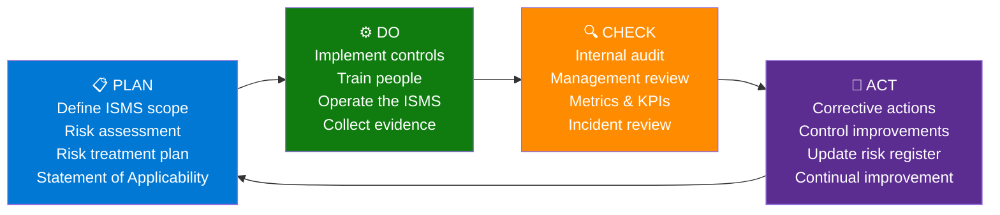

[Home](../../index.md) > [Docs](../..) > [Best Practices](../index.md) > [Security](../index.md) > ISO 27001:2022 Mapping

# 🌐 ISO 27001:2022 Annex A Controls → Fabric Implementation Mapping

<div align="center" markdown>

**ISO/IEC 27001:2022 ISMS → Microsoft Fabric Controls Mapping — Wave 5**


</div>

---

**Last Updated:** `2026-04-27` | **Version:** 1.0.0 | **Companion to:** [SOC 2 Type II Readiness](soc2-type2-readiness.md)

> **Disclaimer:** This document provides architectural and technical guidance for ISO/IEC 27001:2022 implementation on Microsoft Fabric. It is **not** legal, certification, or audit advice. Engage an accredited certification body (e.g., BSI, TÜV, Schellman) to perform the actual ISO 27001 certification audit. Verify control mappings with your registrar before relying on them in a Stage 1 or Stage 2 audit. ISO 27001 is a management-system standard — technology controls alone are insufficient.

---

## 📑 Table of Contents

- [🎯 Overview](#-overview)
- [📋 ISO 27001 vs SOC 2](#-iso-27001-vs-soc-2)
- [🔄 The ISMS Lifecycle (PDCA)](#-the-isms-lifecycle-pdca)
- [🗂️ Annex A Structure (2022 Reorganization)](#️-annex-a-structure-2022-reorganization)
- [🏢 A.5 Organizational Controls](#-a5-organizational-controls)
- [👥 A.6 People Controls](#-a6-people-controls)
- [🏗️ A.7 Physical Controls](#️-a7-physical-controls)
- [💻 A.8 Technological Controls](#-a8-technological-controls)
- [📝 Statement of Applicability (SoA) Template](#-statement-of-applicability-soa-template)
- [⚖️ Risk Treatment Plan Pattern](#️-risk-treatment-plan-pattern)
- [📅 Implementation Roadmap](#-implementation-roadmap)
- [🔗 Doing ISO 27001 + SOC 2 Together](#-doing-iso-27001--soc-2-together)
- [🚫 Anti-Patterns](#-anti-patterns)
- [📋 Implementation Checklist](#-implementation-checklist)
- [📚 References](#-references)

---

## 🎯 Overview

**ISO/IEC 27001:2022** is the international standard for **Information Security Management Systems (ISMS)**. Unlike SOC 2 — which is a US-centric attestation report — ISO 27001 is a **certification** issued by an accredited body, recognized globally, and the de facto baseline for selling into Europe, the Middle East, Asia-Pacific, and most regulated industries.

The 2022 revision (replacing 2013) restructured Annex A from 14 categories with 114 controls into **4 themes** with **93 controls**. It also introduced 11 brand-new controls covering modern realities: cloud services, threat intelligence, ICT readiness for business continuity, web filtering, secure coding, configuration management, and data leakage prevention.

### Why ISO 27001 Matters for Fabric Workloads

| Pressure | Detail |
|----------|--------|
| Global sales | EU, UK, APAC enterprise procurement teams routinely require ISO 27001 certification |
| Regulatory alignment | DORA, NIS2, EU AI Act, UK GDPR explicitly reference ISO 27001 controls |
| Certification recognition | Issued by accredited bodies; recognized in 165+ countries |
| Supply-chain inheritance | Major customers' ISMS scopes may require sub-processor certification |
| Insurance & contracts | Cyber insurance underwriting and government RFPs increasingly mandate it |
| Maturity signal | Demonstrates a *managed* security program, not just point-in-time controls |

### What This Document Covers

- Mapping each Annex A:2022 control to a concrete Fabric control, organizational process, or carve-out
- Comparison of ISO 27001 vs SOC 2 — when to choose which, when to do both
- The PDCA (Plan-Do-Check-Act) ISMS lifecycle for Fabric workloads
- Statement of Applicability template (the deliverable to your registrar)
- Risk treatment plan pattern with Fabric-specific risk register
- 12-18 month certification roadmap

> 📝 **Scope:** This is a Wave 5 companion to [SOC 2 Type II Readiness](soc2-type2-readiness.md). Where the SOC 2 doc focuses on Trust Services Criteria, this doc focuses on Annex A controls. Many Fabric configurations satisfy both standards simultaneously — see [Doing Both](#-doing-iso-27001--soc-2-together).

---

## 📋 ISO 27001 vs SOC 2

The single most-asked question from compliance-bound Fabric customers is "ISO or SOC 2?" Short answer: **for global SaaS, do both**. Long answer:

| Dimension | ISO 27001:2022 | SOC 2 Type II |
|-----------|---------------|---------------|
| **Type** | Certification (pass/fail) | Attestation report (with opinion) |
| **Issued by** | Accredited certification body | Licensed CPA firm |
| **Geography** | Global (165+ countries) | Primarily US-centric |
| **Standard owner** | ISO/IEC | AICPA |
| **Approach** | Risk-based ISMS, top-down | Control-based, bottom-up |
| **Scope artifact** | Statement of Applicability | System Description |
| **Period** | 3-year cert cycle (annual surveillance) | 6-12 month examination, annual renewal |
| **Public deliverable** | Certificate (1 page) | Report (50-200 pages) |
| **Customer access** | Certificate is shareable | Report under NDA |
| **Cost** | Lower ongoing (after Year 1) | Higher ongoing (annual exam) |
| **Risk register required?** | Yes — central artifact | Implicit in CC9 |
| **Management system focus** | Strong (ISMS lifecycle) | Lighter (controls focus) |
| **Best fit** | Selling globally, regulated industries | US enterprise SaaS, auditor-friendly |

### When to Choose Which

| Situation | Recommendation |
|-----------|----------------|
| US-only SaaS, enterprise customers | Start with SOC 2 Type II |
| Global SaaS or EU/UK customers | Start with ISO 27001 |
| Government / regulated industry | Both, plus FedRAMP / StateRAMP |
| Series A+ funding | SOC 2 Type II usually demanded first |
| Public company subsidiary | Often both, plus SOX |
| Healthcare (US) | SOC 2 + HIPAA |
| Financial services (EU) | ISO 27001 + DORA + ISO 27701 |

> 🔁 **Pragmatic order:** Most cloud SaaS gets SOC 2 Type I → SOC 2 Type II → ISO 27001 → ISO 27701 (privacy) → industry-specific (FedRAMP, HITRUST, PCI-DSS).

---

## 🔄 The ISMS Lifecycle (PDCA)

ISO 27001 is built on the **Plan-Do-Check-Act** continuous improvement cycle. Unlike SOC 2's "evidence over a period," ISO 27001 demands a *living* management system that adapts to changes in risk, business, and technology.



### PDCA Cadence for Fabric Workloads

| Activity | Phase | Frequency | Owner |
|----------|-------|-----------|-------|
| Risk assessment | Plan | Annual + on major change | ISO / Security Lead |
| Risk treatment plan update | Plan | Quarterly | Risk owners |
| Control implementation | Do | Continuous | Engineering / Ops |
| Awareness training | Do | Annual + on hire | HR + Security |
| Internal audit | Check | Annual minimum | Internal Audit / 2nd line |
| Management review | Check | Quarterly | Executive sponsor |
| Metrics review | Check | Monthly | Security operations |
| Corrective actions | Act | Continuous | Control owners |
| Surveillance audit | External Check | Annual | Certification body |
| Recertification | External Check | Every 3 years | Certification body |

> ⚠️ **The fatal mistake:** Treating ISO 27001 as a one-time project. The auditor at Year 2 surveillance will ask "show me the management review minutes for the last 12 months." If they don't exist, certification is suspended.

---

## 🗂️ Annex A Structure (2022 Reorganization)

The 2022 revision collapsed 14 control categories into **4 themes** and reduced 114 → 93 controls (with 11 net-new). Each control now carries 5 attributes (Control type, Information security properties, Cybersecurity concepts, Operational capabilities, Security domains) for filtering and reporting.

| Theme | Count | Focus |
|-------|-------|-------|
| **A.5 Organizational** | 37 | Policies, roles, supplier relationships, threat intelligence, cloud services |
| **A.6 People** | 8 | Screening, terms & conditions, awareness, disciplinary process, remote working |
| **A.7 Physical** | 14 | Secure areas, equipment, clear desk, cabling, maintenance |
| **A.8 Technological** | 34 | Endpoints, access, crypto, logging, networks, secure dev — *most Fabric-relevant* |
| **Total** | **93** | — |

### New Controls in 2022 Revision

| Control | Why It Matters for Fabric |
|---------|---------------------------|
| A.5.7 Threat intelligence | Sentinel + MDTI feed integration |
| A.5.23 Information security for use of cloud services | Direct Fabric / Azure mapping |
| A.5.30 ICT readiness for business continuity | Multi-region failover (link below) |
| A.7.4 Physical security monitoring | Microsoft-managed (Azure DC) |
| A.8.9 Configuration management | Bicep + fabric-cicd |
| A.8.10 Information deletion | Delta VACUUM + GDPR alignment |
| A.8.11 Data masking | Purview sensitivity labels + DDM |
| A.8.12 Data leakage prevention | OAP + DLP |
| A.8.16 Monitoring activities | Sentinel SIEM |
| A.8.23 Web filtering | OAP outbound rules |
| A.8.28 Secure coding | Notebook unit testing + CI gates |

---

## 🏢 A.5 Organizational Controls

Largely policy and process — most are **organizational** not Fabric-specific. Key Fabric-touching controls highlighted.

| Annex A | Control | Implementation | Evidence | Test Frequency |
|---------|---------|----------------|----------|----------------|
| A.5.1 | Policies for information security | Documented in `docs/policies/`; board-approved | Policy PDFs + approval minutes | Annual review |
| A.5.2 | Information security roles and responsibilities | RACI matrix; Entra ID groups | Org chart + group membership export | Quarterly |
| A.5.3 | Segregation of duties | Workspace role separation; deploy approver ≠ developer | GitHub branch protection settings | Quarterly |
| A.5.4 | Management responsibilities | Executive sponsor signoff on ISMS | Management review minutes | Quarterly |
| A.5.5 | Contact with authorities | Documented IR escalation contacts | Contact list + drill records | Annual |
| A.5.6 | Contact with special interest groups | ISACs, MSRC, CISA subscriptions | Subscription records | Annual |
| A.5.7 | **Threat intelligence** *(new)* | Microsoft Defender Threat Intelligence + Sentinel feeds | TI feed config + alert rules | Continuous |
| A.5.8 | Information security in project management | Security review gate in PRP | PRP templates + review records | Per project |
| A.5.9 | Inventory of information and other associated assets | OneLake Catalog + tag taxonomy | Catalog export | Quarterly |
| A.5.10 | Acceptable use of information | AUP signed by all users | HR signature records | On hire + annual |
| A.5.11 | Return of assets | Offboarding checklist | HR offboarding tickets | Per departure |
| A.5.12 | Classification of information | Purview sensitivity labels | Label inventory | Continuous |
| A.5.13 | Labelling of information | Auto-labelling rules in Purview | Label coverage report | Quarterly |
| A.5.14 | Information transfer | Encrypted transfer (TLS 1.2+, SFTP, Eventstream) | Network captures + config | Annual |
| A.5.15 | Access control | Documented access policy | Policy + RBAC export | Annual |
| A.5.16 | Identity management | Entra ID lifecycle | [Identity & RBAC patterns](../identity-rbac-patterns.md) | Continuous |
| A.5.17 | Authentication information | Password policy + MFA | Conditional Access export | Quarterly |
| A.5.18 | Access rights | Quarterly access review | Access review attestation | Quarterly |
| A.5.19 | Information security in supplier relationships | Vendor risk register; DPAs | Vendor list + DPA repo | Annual |
| A.5.20 | Addressing information security within supplier agreements | Standard security clauses | Contract templates | Per contract |
| A.5.21 | Managing information security in the ICT supply chain | SBOM, sub-processor list | [Supply chain security](supply-chain-security.md) | Quarterly |
| A.5.22 | Monitoring, review and change management of supplier services | Vendor performance reviews | Review minutes | Annual |
| A.5.23 | **Information security for use of cloud services** *(new)* | Microsoft shared responsibility documented | Responsibility matrix | Annual |
| A.5.24 | Information security incident management planning | [IR template](../../runbooks/incident-response-template.md) | IR plan + tabletop records | Annual tabletop |
| A.5.25 | Assessment and decision on information security events | Triage runbook | Triage records | Per event |
| A.5.26 | Response to information security incidents | IR runbooks | Postmortems | Per incident |
| A.5.27 | Learning from information security incidents | Postmortem register | Postmortem repo | Per incident |
| A.5.28 | Collection of evidence | Forensic readiness, immutable logs | [Audit trail immutability](audit-trail-immutability.md) | Continuous |
| A.5.29 | Information security during disruption | BCP/DR plan | [BCDR doc](../disaster-recovery-bcdr.md) | Annual |
| A.5.30 | **ICT readiness for business continuity** *(new)* | Multi-region failover tested | [Failover runbook](../../runbooks/multi-region-failover.md) + drill records | Annual drill |
| A.5.31 | Legal, statutory, regulatory and contractual requirements | Compliance register | Register + counsel review | Annual |
| A.5.32 | Intellectual property rights | Code license scanning | SCA reports | Continuous |
| A.5.33 | Protection of records | Retention policies on Delta tables | Retention config | Annual |
| A.5.34 | Privacy and protection of PII | [GDPR](gdpr-right-to-deletion.md) + [CCPA](ccpa-privacy-rights.md) alignment | DSAR records | Continuous |
| A.5.35 | Independent review of information security | Internal audit + 3rd-party pen test | Audit reports | Annual |
| A.5.36 | Compliance with policies, rules and standards | Internal audit findings + remediation | Findings register | Quarterly |
| A.5.37 | Documented operating procedures | Runbook library | `docs/runbooks/` | Quarterly review |

> 💡 **Cloud services note (A.5.23):** Microsoft's published shared-responsibility model for Fabric is your starting point. Your Statement of Applicability must explicitly identify which controls Microsoft owns and which you own — auditors will probe this specifically.

---

## 👥 A.6 People Controls

People controls are **organizational** — implemented through HR, training, and process. Fabric does not implement these directly.

| Annex A | Control | Implementation | Evidence | Test Frequency |
|---------|---------|----------------|----------|----------------|
| A.6.1 | Screening | Background checks pre-hire | HR records | Per hire |
| A.6.2 | Terms and conditions of employment | Confidentiality clauses | Signed contracts | Per hire |
| A.6.3 | Information security awareness, education and training | LMS modules + phishing sim | Completion reports | Annual + on hire |
| A.6.4 | Disciplinary process | Documented HR process | Process doc + escalation records | Annual review |
| A.6.5 | Responsibilities after termination or change of employment | Offboarding checklist with access revocation | Offboarding tickets | Per departure |
| A.6.6 | Confidentiality or non-disclosure agreements | NDAs in place | Signed NDA records | Per hire / vendor |
| A.6.7 | Remote working | Remote work policy + endpoint config | Policy + Intune compliance | Annual |
| A.6.8 | Information security event reporting | Anonymous reporting channel | Channel records | Continuous |

> ⚠️ **Common gap:** Engineering teams often skip A.6.3 (awareness training) for production-access engineers. Auditors specifically check that *every* user with workspace access has current training records.

---

## 🏗️ A.7 Physical Controls

Most Physical controls are **carved out to Microsoft** (subservice organization) for Fabric workloads. Microsoft's ISO 27001 certificate covers Azure datacenter physical security.

| Annex A | Control | Owner | Evidence |
|---------|---------|-------|----------|
| A.7.1 | Physical security perimeters | Microsoft (Azure DC) | Microsoft ISO 27001 cert |
| A.7.2 | Physical entry | Microsoft | Microsoft ISO 27001 cert |
| A.7.3 | Securing offices, rooms and facilities | Customer (corporate offices) | Office security plan |
| A.7.4 | **Physical security monitoring** *(new)* | Microsoft | Microsoft ISO 27001 cert |
| A.7.5 | Protecting against physical and environmental threats | Microsoft | Microsoft ISO 27001 cert |
| A.7.6 | Working in secure areas | Customer | Office policy |
| A.7.7 | Clear desk and clear screen | Customer | Workstation policy + Intune lock |
| A.7.8 | Equipment siting and protection | Customer (BYOD/laptops) | Equipment register |
| A.7.9 | Security of assets off-premises | Customer | Endpoint encryption (BitLocker) |
| A.7.10 | Storage media | Customer | Removable media policy |
| A.7.11 | Supporting utilities | Microsoft | Microsoft ISO 27001 cert |
| A.7.12 | Cabling security | Microsoft | Microsoft ISO 27001 cert |
| A.7.13 | Equipment maintenance | Mixed | Maintenance log |
| A.7.14 | Secure disposal or re-use of equipment | Customer | Disposal cert from vendor |

> 📝 **Carve-out vs Inclusion:** In your SoA, A.7.1, A.7.2, A.7.4, A.7.5, A.7.11, A.7.12 should be marked **"Microsoft-managed (subservice org)"** with a reference to Microsoft's current ISO 27001 certificate (downloadable from [Service Trust Portal](https://servicetrust.microsoft.com)).

---

## 💻 A.8 Technological Controls

This is the **most Fabric-specific section** — 34 controls covering endpoints, access, crypto, logging, networks, and secure development. Each maps directly to a Fabric configuration, Bicep module, runbook, or process.

### A.8.1 — User Endpoint Devices

| Item | Implementation |
|------|----------------|
| Device compliance | Entra ID Conditional Access requires Intune-compliant device |
| BYOD posture | App protection policies; no corporate data on unmanaged devices |
| Browser hardening | Edge for Business with managed extensions |
| Evidence | Conditional Access policy export + Intune compliance reports |
| Test frequency | Continuous (CA enforces); quarterly snapshot for evidence |

### A.8.2 — Privileged Access Rights

| Item | Implementation |
|------|----------------|
| Just-in-time elevation | Entra Privileged Identity Management (PIM) |
| Approval workflow | PIM approver group separate from requestor |
| Session duration | Maximum 8 hours; no persistent admin |
| Activity logging | PIM audit logs → Log Analytics, 18-month retention |
| Evidence | PIM activation logs (KQL extract) |
| Test frequency | Quarterly review |

```kql
// A.8.2 evidence query — privileged role activations last 90 days
AuditLogs
| where TimeGenerated > ago(90d)
| where ActivityDisplayName has "PIM activation"
| project TimeGenerated, InitiatedBy, TargetResources, Result
| order by TimeGenerated desc
```

### A.8.3 — Information Access Restriction

| Item | Implementation |
|------|----------------|
| Workspace RBAC | Admin / Member / Contributor / Viewer per workload |
| OneLake Security | Row, column, object filters |
| Lakehouse table grants | Per-table SELECT/INSERT/UPDATE permissions |
| Domain-level access | Fabric Domain admins delegate workspace access |
| Evidence | Workspace IAM export + OneLake Security policies |
| Reference | [Identity & RBAC Patterns](../identity-rbac-patterns.md) |

### A.8.5 — Secure Authentication

| Item | Implementation |
|------|----------------|
| MFA enforcement | Conditional Access requires MFA for all interactive access |
| Service-to-service | Workspace Identity (managed identity, GA 2026) — no secrets |
| Service Principal rotation | 90-day max; alert at 70 days; runbook for rotation |
| FIDO2 / passkey support | Entra ID phishing-resistant auth |
| Evidence | CA policy + sign-in logs filtered for MFA success |

### A.8.7 — Protection Against Malware

| Item | Implementation |
|------|----------------|
| Compute runtime | Microsoft-managed (Spark, SQL, KQL engines) |
| Endpoint AV | Microsoft Defender for Endpoint on user devices |
| Notebook content scanning | CI: secret scanning + SAST on notebook diffs |
| Evidence | Microsoft attestation + customer SAST reports |

### A.8.8 — Management of Technical Vulnerabilities

| Item | Implementation |
|------|----------------|
| Platform patching | Microsoft-managed (Fabric runtime) |
| Notebook dependencies | Renovate / Dependabot on `requirements.txt` |
| Container images (custom envs) | Defender for Containers vuln scan |
| Vuln triage SLA | Critical 7d, High 30d, Medium 90d |
| Evidence | Dependabot alerts + remediation PRs |
| Reference | [Supply Chain Security](supply-chain-security.md) |

### A.8.9 — Configuration Management *(new in 2022)*

| Item | Implementation |
|------|----------------|
| IaC | All infrastructure as Bicep modules in `infra/` |
| Workspace items | fabric-cicd deploys notebooks, lakehouses, pipelines |
| Drift detection | `az deployment what-if` in CI; alert on drift |
| Baseline | Documented baseline + change requires PR |
| Evidence | Bicep repo + Action run logs |
| Reference | [fabric-cicd Deployment](../fabric-cicd-deployment.md) |

### A.8.10 — Information Deletion *(new in 2022)*

| Item | Implementation |
|------|----------------|
| Right-to-deletion | Delta DELETE + VACUUM (7-day retention default) |
| GDPR alignment | DSAR runbook in compliance templates |
| Backup deletion | Restore-window aware deletion |
| Audit trail | Deletion attestation per request |
| Evidence | DSAR fulfillment records |
| Reference | [GDPR Right to Deletion](gdpr-right-to-deletion.md) |

### A.8.11 — Data Masking *(new in 2022)*

| Item | Implementation |
|------|----------------|
| Static masking | Bronze→Silver hash/redact PII at boundary |
| Dynamic masking | Fabric Warehouse Dynamic Data Masking on PII columns |
| Sensitivity-driven | Purview labels drive masking automation |
| Synthetic data in non-prod | All dev/test workspaces use synthetic only |
| Evidence | Masking policy export + synthetic data attestation |

### A.8.12 — Data Leakage Prevention *(new in 2022)*

| Item | Implementation |
|------|----------------|
| Outbound restriction | Outbound Access Protection (OAP) |
| DLP policies | Microsoft Purview DLP on sensitive labels |
| Egress monitoring | Storage egress alerts via Azure Monitor |
| External sharing | Disabled by default; audit when enabled |
| Evidence | OAP config + DLP policy + egress logs |
| References | [OAP doc](../outbound-access-protection.md) + [Data Exfiltration Prevention](data-exfiltration-prevention.md) |

### A.8.13 — Information Backup

| Item | Implementation |
|------|----------------|
| OneLake redundancy | GRS (geo-redundant) by default |
| Backup tier | Cool/Archive for older Delta versions |
| Restore testing | Quarterly restore drill |
| RPO target | 24 hours typical; documented per workload |
| Evidence | Restore drill records + RPO measurements |

### A.8.14 — Redundancy of Information Processing Facilities

| Item | Implementation |
|------|----------------|
| Multi-region | Paired-region deployment for production |
| Failover automation | Tested via [failover runbook](../../runbooks/multi-region-failover.md) |
| RTO target | 4 hours typical; documented per workload |
| Evidence | Failover drill records |
| Reference | [BCDR doc](../disaster-recovery-bcdr.md) |

### A.8.15 — Logging

| Item | Implementation |
|------|----------------|
| Audit events | Workspace Monitoring (KQL) + Log Analytics |
| Retention | 12 months minimum (18 months for privileged) |
| Immutability | Log Analytics archive tier + WORM blob |
| Time sync | Azure NTP (no customer config needed) |
| Evidence | Log retention configuration export |
| References | [Workspace Monitoring](../../features/workspace-monitoring.md) + [Audit Trail Immutability](audit-trail-immutability.md) |

### A.8.16 — Monitoring Activities *(new in 2022)*

| Item | Implementation |
|------|----------------|
| SIEM | Microsoft Sentinel ingesting Fabric + Entra logs |
| Detection rules | MITRE ATT&CK-mapped analytic rules |
| 24/7 coverage | Internal SOC or MSSP |
| Alert response SLA | P1 < 15 min ack, P2 < 1 hr |
| Evidence | Sentinel rule export + alert disposition records |

### A.8.20 — Networks Security

| Item | Implementation |
|------|----------------|
| Private connectivity | Azure Private Endpoints for Fabric capacity |
| IP firewall | Workspace-level allowlist |
| VNet integration | Managed VNet for Spark / pipelines |
| Evidence | Network config export |
| Reference | [Network Security](../network-security.md) |

### A.8.21 — Security of Network Services

| Item | Implementation |
|------|----------------|
| TLS minimum | TLS 1.2 (TLS 1.3 preferred) |
| Cipher suites | Azure default — modern only |
| Certificate management | Microsoft-managed for Fabric endpoints |
| Evidence | TLS scan reports (e.g., SSL Labs) |

### A.8.22 — Segregation of Networks

| Item | Implementation |
|------|----------------|
| Workspace boundary | Each workspace = isolated logical boundary |
| Capacity boundary | Separate capacities for prod / nonprod / sensitive |
| Domain segregation | Fabric Domains group workspaces by data sensitivity |
| Evidence | Workspace + capacity inventory |

### A.8.23 — Web Filtering *(new in 2022)*

| Item | Implementation |
|------|----------------|
| Outbound URL allowlist | OAP outbound rules |
| Notebook external calls | Restricted to approved data sources |
| Egress proxy | Optional Azure Firewall in egress path |
| Evidence | OAP rule export |

### A.8.24 — Use of Cryptography

| Item | Implementation |
|------|----------------|
| Encryption at rest | CMK with HSM-backed key |
| Key rotation | 365-day automatic rotation |
| Key access logging | Key Vault audit logs |
| Algorithm baseline | AES-256, RSA-2048+, ECDSA-P256+ |
| Evidence | Key Vault config + rotation history |
| Reference | [Customer-Managed Keys](../customer-managed-keys.md) |

### A.8.25 — Secure Development Life Cycle

| Item | Implementation |
|------|----------------|
| Branch protection | Main + production branches require PR + review |
| Required reviewers | Min 1 reviewer (2 for production) |
| CI checks | Lint + unit tests + SAST + secret scan must pass |
| Deployment gates | fabric-cicd promotes on tag |
| Evidence | Branch protection settings + Action logs |

### A.8.26 — Application Security Requirements

| Item | Implementation |
|------|----------------|
| Threat modeling | STRIDE per major feature |
| Security requirements | Captured in PRP template |
| Acceptance criteria | Security checks in DoD |
| Evidence | PRP docs + threat model artifacts |
| Reference | [STRIDE Threat Model](threat-model-stride.md) |

### A.8.27 — Secure System Architecture and Engineering Principles

| Item | Implementation |
|------|----------------|
| Reference architecture | Documented with security defaults |
| Defense in depth | Identity + Network + Data + Audit layers |
| Zero-trust alignment | [Zero-Trust Blueprint](zero-trust-blueprint.md) |
| Evidence | Architecture review records |

### A.8.28 — Secure Coding *(new in 2022)*

| Item | Implementation |
|------|----------------|
| Coding standards | PEP 8, language linters in CI |
| Notebook unit testing | pytest suites in `validation/unit_tests/` |
| Code review | PR-based with security checklist |
| Training | Annual secure coding training |
| Evidence | Lint reports + test pass rates |
| Reference | Wave 8 testing strategies (forthcoming) |

### A.8.29 — Security Testing in Development and Acceptance

| Item | Implementation |
|------|----------------|
| SAST | CodeQL or Semgrep on Python + Bicep |
| Secret scanning | gitleaks pre-commit + GitHub push protection |
| Dependency scanning | Dependabot + advisory database |
| Pen test | Annual third-party engagement |
| Evidence | SAST + secret-scan + pentest reports |

### A.8.30 — Outsourced Development

| Item | Implementation |
|------|----------------|
| Vendor security clauses | Contract template + DPA |
| Code review parity | All vendor commits reviewed by employee |
| IP ownership | Documented in MSA |
| Evidence | Vendor contracts + review records |

### A.8.31 — Separation of Development, Test and Production Environments

| Item | Implementation |
|------|----------------|
| Workspace separation | dev / staging / prod workspaces |
| Capacity separation | Separate F-SKUs per environment |
| Data separation | Synthetic in dev/staging; real only in prod |
| Promotion path | Deployment Pipelines or fabric-cicd |
| Evidence | Workspace inventory + promotion logs |
| Reference | [Tenant Migration Runbook](../../runbooks/tenant-migration-dev-staging-prod.md) |

### A.8.32 — Change Management

This control overlaps directly with **SOC 2 CC8.1** — see the [SOC 2 doc](soc2-type2-readiness.md#cc81--change-management) for full implementation. Summary:

- Code review required (branch protection)
- CAB approval for major changes
- fabric-cicd via GitHub Actions
- Audit trail in Git + Action runs + Deployment Pipelines
- Documented rollback per workload
- Hotfix process with post-hoc CAB

### A.8.33 — Test Information

| Item | Implementation |
|------|----------------|
| Synthetic data generation | `data_generation/` framework |
| PII prohibition in nonprod | Tag enforcement + scanning |
| Production-like volume | Configurable record counts |
| Evidence | Generator configuration + tag audit |

### A.8.34 — Protection of Information Systems During Audit Testing

| Item | Implementation |
|------|----------------|
| Auditor access | Read-only Entra group; time-bounded |
| Audit query approval | DBA approves any DML against audit logs |
| Audit isolation | Audits run against snapshot, not live |
| Evidence | Auditor access records + query logs |

---

## 📝 Statement of Applicability (SoA) Template

The **Statement of Applicability** is the central deliverable to your registrar. It lists every Annex A control, marks each as Applicable / Not Applicable, justifies the decision, and references the control implementation.

```markdown
# Statement of Applicability — [Org Name]

**ISMS Scope:** [e.g., "Microsoft Fabric data platform supporting Casino & Federal analytics workloads"]
**Version:** 1.0
**Approved by:** [CISO Name], [Date]
**Review cycle:** Annual + on major change

| Control | Title | Applicable? | Justification | Implementation | Owner | Evidence Location |
|---------|-------|-------------|---------------|----------------|-------|-------------------|
| A.5.1 | Policies for information security | Yes | Required for all orgs | `docs/policies/information-security.md` | CISO | SharePoint /Policies |
| A.5.7 | Threat intelligence | Yes | Cloud-native SaaS | Sentinel + MDTI integration | SecOps | Sentinel workspace |
| A.5.23 | Cloud services security | Yes | Fabric is core platform | Shared responsibility matrix | CTO | `docs/compliance/shared-responsibility.md` |
| A.7.1 | Physical security perimeters | Yes (Microsoft) | Subservice org | Microsoft Azure ISO 27001 | Microsoft | Service Trust Portal |
| A.7.10 | Storage media | No | Cloud-only; no removable media | N/A | — | — |
| A.8.9 | Configuration management | Yes | Critical for IaC platform | Bicep + fabric-cicd | DevOps | `infra/` repo |
| A.8.11 | Data masking | Yes | PII handling in scope | Purview + DDM | Data Eng | Purview portal |
| ... | | | | | | |
```

> 💡 **SoA pitfall:** Every "Not Applicable" needs a justified, written reason. "We don't think we need this" is not a justification. "Cloud-only deployment with no removable media handling" is.

---

## ⚖️ Risk Treatment Plan Pattern

ISO 27001 is **risk-based** — every applicable control should map back to a risk in your risk register. The Risk Treatment Plan (RTP) ties them together.

### Risk Register Schema

| Field | Example |
|-------|---------|
| Risk ID | R-2026-014 |
| Risk title | Unauthorized access to PII via service principal compromise |
| Asset | Bronze + Silver lakehouses with PII columns |
| Threat | Credential leak in git, secret reuse |
| Vulnerability | Long-lived service principals, no rotation |
| Likelihood (1-5) | 3 |
| Impact (1-5) | 5 |
| Inherent risk | 15 (High) |
| Treatment | Mitigate |
| Controls applied | A.8.5, A.8.2, A.5.16 |
| Residual likelihood | 1 |
| Residual impact | 5 |
| Residual risk | 5 (Medium) |
| Risk owner | Head of Data Engineering |
| Review date | 2026-09-01 |

### Treatment Options

| Option | When to Use | Example |
|--------|-------------|---------|
| **Mitigate** | Reduce via control | Add Workspace Identity + PIM |
| **Transfer** | Insurance / contract | Cyber insurance policy |
| **Accept** | Cost > benefit | Low-impact dev workspace |
| **Avoid** | Eliminate the activity | Stop processing the data |

> ⚠️ **Tolerance gate:** Define and document organizational risk tolerance. Any residual risk above tolerance requires executive (or board) sign-off before being accepted.

---

## 📅 Implementation Roadmap

A typical first-time ISO 27001 certification takes **12-18 months** from kickoff to issued certificate. Here's the canonical timeline.

### Months 0-3 — Foundation

- [ ] Executive sponsor identified, ISMS scope defined
- [ ] Gap analysis against Annex A:2022
- [ ] Risk methodology selected and approved
- [ ] Initial risk assessment completed
- [ ] ISMS policies drafted (top-level + 8-10 supporting)
- [ ] Statement of Applicability v0.1 drafted

### Months 3-6 — Build

- [ ] Risk treatment plan approved
- [ ] Top-priority controls implemented (A.8.x mostly)
- [ ] Awareness training rolled out
- [ ] Internal audit programme defined
- [ ] Management review cadence established

### Months 6-9 — Operate

- [ ] All controls operational
- [ ] Evidence collection automated where possible
- [ ] First management review held
- [ ] First internal audit completed; non-conformities tracked
- [ ] Corrective actions assigned and tracked

### Months 9-12 — Stage 1 Audit

- [ ] Select certification body (BSI, TÜV, Schellman, etc.)
- [ ] Stage 1 audit (documentation review + readiness check)
- [ ] Address Stage 1 findings
- [ ] Schedule Stage 2

### Months 12-15 — Stage 2 Audit

- [ ] Stage 2 audit (operational effectiveness)
- [ ] Address non-conformities (NCs) — Major NCs block certification
- [ ] Receive certificate (3-year cycle starts)

### Months 15-18 — Stabilize

- [ ] Embed continuous monitoring
- [ ] Plan Year 2 surveillance audit
- [ ] Evaluate adjacent certifications (ISO 27017 cloud, ISO 27018 PII, ISO 27701 privacy)

---

## 🔗 Doing ISO 27001 + SOC 2 Together

Most cloud SaaS targeting global enterprise customers ends up doing both. The good news: ~70% of evidence overlaps. Plan for the overlap from day one.

### Shared Evidence Mapping

| Evidence | SOC 2 Criterion | ISO 27001 Control |
|----------|-----------------|-------------------|
| Conditional Access policy export | CC6.1, CC6.2 | A.5.17, A.8.5 |
| Workspace IAM membership | CC6.1, CC6.3 | A.5.18, A.8.3 |
| PIM activation logs | CC6.1 | A.8.2 |
| Branch protection settings | CC8.1 | A.8.25, A.8.32 |
| GitHub Action run logs | CC8.1 | A.8.9, A.8.32 |
| CMK rotation history | CC6.5 | A.8.24 |
| Private Endpoint config | CC5.2 | A.8.20, A.8.22 |
| OAP config | CC5.2 | A.8.12, A.8.23 |
| Sentinel alert rules | CC4.1 | A.8.16 |
| Workspace Monitoring retention | CC6.7 | A.8.15 |
| DR drill records | A1.3 | A.5.30, A.8.14 |
| Postmortem register | CC4.1 | A.5.27 |
| Vendor DPAs | CC9.2 | A.5.20 |
| Pentest report | CC5.3 | A.5.35, A.8.29 |

### Combined Cadence

| Activity | SOC 2 | ISO 27001 | Combined |
|----------|-------|-----------|----------|
| Risk assessment | Implicit | Annual | Annual full + quarterly delta |
| Internal audit | Not required | Annual | Annual cycles all controls |
| Management review | Not required | Quarterly | Quarterly with KPIs |
| Access review | Quarterly | Quarterly | Single quarterly review |
| External assessment | Annual exam | 3-yr cycle (annual surveillance) | Coordinated to overlap windows |

> 💰 **Cost optimization:** Engage a firm that does both (e.g., A-LIGN, Schellman, Coalfire). They can issue a single combined report or run audits back-to-back to share fieldwork.

---

## 🚫 Anti-Patterns

| Anti-Pattern | Why It Hurts | What to Do Instead |
|--------------|--------------|--------------------|
| **Treating ISO 27001 as a documentation exercise** | Auditor will probe operational effectiveness, not just policies | Embed controls into daily operations from the start |
| **Statement of Applicability as a tickbox** | Vague justifications fail Stage 1 | Concrete justifications referencing specific implementations |
| **Ignoring management review** | Certificate suspension at surveillance | Calendar quarterly with named attendees + minutes |
| **Risk register that never changes** | Auditor red flag — risks aren't static | Update on every incident, change, or new threat |
| **No internal audit programme** | Mandatory clause, certification fails | Annual internal audit covering all Annex A applicable controls |
| **Conflating SOC 2 evidence with ISO evidence verbatim** | Different standards have different framings | Map shared evidence but maintain ISO-aligned narratives |
| **Skipping Microsoft sub-processor diligence (A.5.21)** | Auditor will ask for sub-processor list and DPAs | Maintain inventory + annual review |
| **Out-of-date acceptable use policy** | A.5.10 finding | Annual review with HR enforcement |
| **No corrective action tracking** | NCs never close, recertification fails | CAPA register with owner + due date + verification |
| **Generic risk treatments ("we'll improve security")** | Not measurable, not auditable | Specific control + owner + evidence + due date |
| **Treating Microsoft's certificate as a substitute** | Customer's ISMS is in scope, not Microsoft's | Reference Microsoft only for subservice carve-outs |

---

## 📋 Implementation Checklist

Before declaring "ISO 27001 ready":

- [ ] ISMS scope defined and approved by leadership
- [ ] Information security policy approved by board / executive
- [ ] Risk methodology documented and approved
- [ ] Risk register active with all major risks identified
- [ ] Risk treatment plan with named owners and due dates
- [ ] Statement of Applicability complete with justifications
- [ ] All applicable Annex A controls implemented or in plan
- [ ] Asset inventory current (OneLake Catalog + Purview)
- [ ] Awareness training rolled out (annual + on hire)
- [ ] Acceptable use policy signed by all users
- [ ] Vendor / sub-processor register maintained
- [ ] Microsoft DPAs and sub-processor list documented
- [ ] CMK enabled with rotation policy (A.8.24)
- [ ] Private Endpoints + IP firewall (A.8.20)
- [ ] OAP enabled (A.8.12, A.8.23)
- [ ] Workspace Identity for service-to-service (A.8.5)
- [ ] PIM for all privileged roles (A.8.2)
- [ ] Conditional Access requires MFA + device compliance (A.8.1, A.8.5)
- [ ] Workspace Monitoring + Log Analytics with 12-month retention (A.8.15)
- [ ] Sentinel SIEM with detection rules (A.8.16)
- [ ] Multi-region failover tested annually (A.5.30, A.8.14)
- [ ] BCP/DR plan reviewed annually (A.5.29)
- [ ] Synthetic data only in dev/test workspaces (A.8.33)
- [ ] Branch protection on prod branches (A.8.25, A.8.32)
- [ ] CI security gates: SAST + secret scan + dep scan (A.8.29)
- [ ] Annual penetration test scheduled (A.8.29)
- [ ] Incident response runbooks current (A.5.24-A.5.27)
- [ ] Incident postmortem register active (A.5.27)
- [ ] Internal audit programme defined and scheduled (A.5.35)
- [ ] Management review cadence active (quarterly)
- [ ] Corrective action register with named owners
- [ ] Evidence collection automated where possible
- [ ] Auditor access pattern documented (A.8.34)
- [ ] Certification body engaged; Stage 1 scheduled

---

## 📚 References

### ISO Standards
- [ISO/IEC 27001:2022 — Information security management systems — Requirements](https://www.iso.org/standard/27001)
- [ISO/IEC 27002:2022 — Information security controls (implementation guidance)](https://www.iso.org/standard/75652.html)
- [ISO/IEC 27017 — Cloud services controls](https://www.iso.org/standard/43757.html)
- [ISO/IEC 27018 — PII protection in public clouds](https://www.iso.org/standard/76559.html)
- [ISO/IEC 27701 — Privacy information management](https://www.iso.org/standard/71670.html)
- [ISO 31000 — Risk management guidelines](https://www.iso.org/standard/65694.html)

### Microsoft Resources
- [Microsoft Trust Center — ISO 27001](https://learn.microsoft.com/compliance/regulatory/offering-iso-27001)
- [Microsoft Service Trust Portal](https://servicetrust.microsoft.com)
- [Microsoft Fabric Security Documentation](https://learn.microsoft.com/fabric/security/)
- [Microsoft Defender Threat Intelligence](https://learn.microsoft.com/defender/threat-intelligence/)
- [Microsoft Sentinel](https://learn.microsoft.com/azure/sentinel/)
- [Workspace Identity (GA 2026)](https://learn.microsoft.com/fabric/security/workspace-identity)
- [OneLake Security](https://learn.microsoft.com/fabric/onelake/security/onelake-security)

### Related Wave 5 Docs
- [SOC 2 Type II Readiness](soc2-type2-readiness.md) *(anchor)*
- [GDPR Right to Deletion](gdpr-right-to-deletion.md)
- [CCPA Privacy Rights](ccpa-privacy-rights.md)
- [STRIDE Threat Model](threat-model-stride.md)
- [Zero-Trust Blueprint](zero-trust-blueprint.md)
- [Data Exfiltration Prevention](data-exfiltration-prevention.md)
- [Supply Chain Security](supply-chain-security.md)
- [Audit Trail Immutability](audit-trail-immutability.md)

### Related Operational Docs (Wave 1)
- [Incident Response Template](../../runbooks/incident-response-template.md)
- [Multi-Region Failover Runbook](../../runbooks/multi-region-failover.md)
- [Tenant Migration Runbook](../../runbooks/tenant-migration-dev-staging-prod.md)
- [Auth Failure Playbook](../../runbooks/auth-failure-playbook.md)
- [Capacity Throttling Response](../../runbooks/capacity-throttling-response.md)
- [Data Quality Incident Runbook](../../runbooks/data-quality-incident.md)
- [SLO/SLI for Fabric](../operations/slo-sli-fabric.md)
- [Change Management](../operations/change-management.md)
- [On-Call Rotation Handbook](../operations/oncall-rotation-handbook.md)
- [Observability Stack](../operations/observability-stack.md)

### Related Existing Best Practices
- [Data Governance Deep Dive](../data-governance-deep-dive.md)
- [Identity & RBAC Patterns](../identity-rbac-patterns.md)
- [Network Security](../network-security.md)
- [Customer-Managed Keys](../customer-managed-keys.md)
- [Outbound Access Protection](../outbound-access-protection.md)
- [Disaster Recovery & BCDR](../disaster-recovery-bcdr.md)
- [Capacity Planning & Cost Optimization](../capacity-planning-cost-optimization.md)
- [Monitoring & Observability](../monitoring-observability.md)
- [Testing Strategies](../testing-strategies.md)
- [fabric-cicd Deployment](../fabric-cicd-deployment.md)
- [SQL Audit Logs Compliance](../sql-audit-logs-compliance.md)

### Compliance Templates
- [SOC 2 Control Matrix Template](../../compliance-templates/soc2-control-matrix.md) (Wave 5 batch 5b)
- [ISO 27001 SoA Template](../../compliance/nist-800-53.md) (Wave 5 batch 5b)
- [DSAR Runbook Template](../../compliance-templates/dsar-runbook.md) (Wave 5 batch 5b)

---

[⬆️ Back to Top](#-iso-270012022-annex-a-controls--fabric-implementation-mapping) | [📚 Security Index](.) | [🏠 Home](../../index.md)
